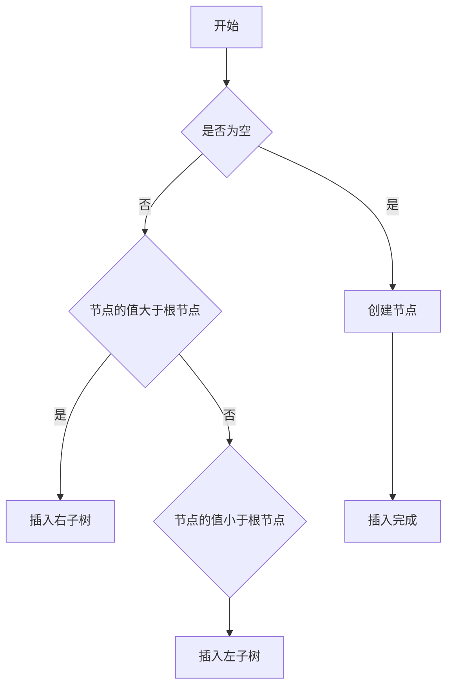
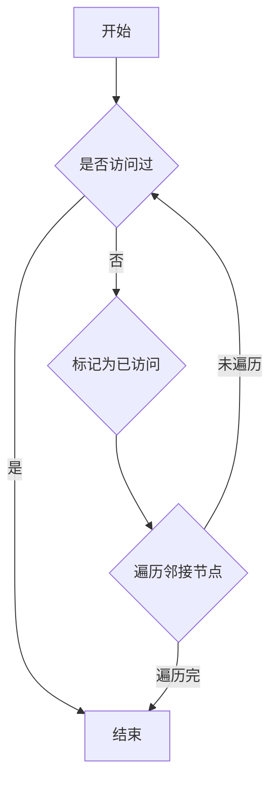
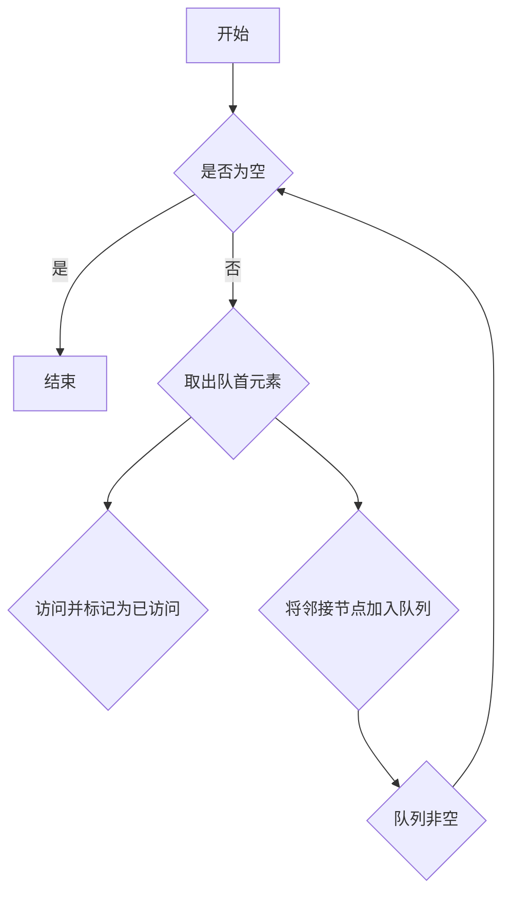

                 

### 文章标题

《数据结构在模拟宇宙大尺度空洞演化动力学中的应用》

#### 关键词：
- 数据结构
- 宇宙大尺度空洞
- 演化动力学
- 算法设计
- 模拟实现

#### 摘要：
本文深入探讨了数据结构在宇宙大尺度空洞演化动力学模拟中的应用。首先，我们对宇宙大尺度结构进行了概述，包括空洞的定义、形成机制和物理特性。随后，介绍了空洞演化动力学的基本理论，包括模型构建和观测数据分析。接下来，我们详细讲解了各种基本数据结构（如数组、链表、栈、队列、树和图），并阐述了它们在空洞演化模拟中的具体应用。文章还探讨了树结构和图结构的应用，如二叉搜索树、树状数组和网络流算法。最后，我们通过一个实际项目案例，详细介绍了开发环境搭建、代码实现和代码解读，并分析了算法的性能优化策略。本文旨在为研究者提供一套完整的技术框架和实现方法，以促进宇宙大尺度空洞演化模拟的发展。

### 《数据结构在模拟宇宙大尺度空洞演化动力学中的应用》目录大纲

#### 第一部分：引论

# 第一部分引论

## 第1章宇宙大尺度空洞演化动力学概述

### 1.1 宇宙大尺度结构的概念

#### 1.1.1 宇宙大尺度结构的定义

宇宙大尺度结构是指宇宙中由恒星、星系和星系团等组成的复杂系统，它们在宇宙尺度上的分布和演化特性。其中，空洞（Void）是宇宙大尺度结构中的一个重要组成部分，通常定义为直径超过几十万光年的近乎空旷的区域。

#### 1.1.2 大尺度空洞的形成机制

大尺度空洞的形成机制主要涉及宇宙早期的大爆炸和随后的引力作用。在宇宙演化的早期阶段，宇宙处于高度热密状态，随着宇宙的膨胀，物质逐渐冷却并聚集形成星系和星系团。然而，在某些区域，由于各种因素的影响，物质聚集不够密集，从而形成了大尺度空洞。

#### 1.1.3 大尺度空洞的物理特性

大尺度空洞具有一系列独特的物理特性，如较低的密度、较高的空间均匀性等。这些特性使得空洞成为研究宇宙大尺度结构演化的关键区域。

### 1.2 空洞演化动力学的基本理论

#### 1.2.1 空洞演化动力学模型

空洞演化动力学模型通常基于牛顿引力定律和流体动力学方程，描述了宇宙大尺度结构中物质分布和运动的变化过程。常见的模型包括宇宙大尺度空洞演化模型（Cosmic Void Evolution Model, CVE）和空洞动力学模型（Void Dynamics Model, VD）等。

#### 1.2.2 模拟宇宙的构建方法

为了研究空洞演化动力学，我们需要构建一个模拟宇宙。常见的构建方法包括N-体模拟（N-body simulation）和SPH（Smoothed Particle Hydrodynamics）模拟等。这些方法通过数值计算和计算机模拟，模拟出宇宙中的物质分布和运动状态。

#### 1.2.3 空洞演化的观测数据与模拟结果分析

通过对宇宙背景辐射、星系分布和星系团等观测数据的分析，我们可以获得关于空洞演化的宝贵信息。同时，通过对比模拟结果和观测数据，我们可以验证和改进空洞演化动力学模型，进一步理解宇宙大尺度结构的演化过程。

### 1.3 数据结构在空洞演化动力学中的作用

#### 1.3.1 数据结构的重要性

数据结构在空洞演化动力学模拟中扮演着至关重要的角色。合理选择和设计数据结构，可以提高模拟的效率，减少计算时间，从而更好地理解宇宙大尺度结构的演化特性。

#### 1.3.2 数据结构的分类与特点

数据结构可以分为线性结构和非线性结构。线性结构包括数组、链表、栈和队列等，它们在处理线性数据时具有高效的特点。非线性结构包括树和图，它们在处理复杂网络结构时具有优势。本文将主要探讨树和图结构在空洞演化动力学中的应用。

#### 1.3.3 数据结构在模拟中的应用

数据结构在空洞演化动力学模拟中的应用主要体现在以下几个方面：

1. **数据存储与管理**：通过合适的数据结构，我们可以高效地存储和管理宇宙中的物质分布信息，如星系、星系团和空洞的位置、速度和质量等。

2. **搜索与查找**：在模拟过程中，我们需要频繁地进行搜索和查找操作，如寻找相邻的星系或确定一个空洞的边界。合理选择数据结构可以显著提高搜索效率。

3. **拓扑结构分析**：通过树和图结构，我们可以分析宇宙大尺度结构的拓扑特性，如星系和星系团之间的连通性、空洞的形状和大小等。

4. **算法优化**：数据结构的选择和设计对算法的性能有直接影响。通过优化数据结构，我们可以提高模拟算法的效率，减少计算时间。

### 第二部分：数据结构基础

# 第二部分数据结构基础

## 第2章基本数据结构

### 2.1 数组和链表

#### 2.1.1 数组的基本操作

数组是一种线性数据结构，它由一系列元素组成，这些元素在内存中连续存储。数组的基本操作包括：

- **初始化**：创建一个数组，并为其分配内存空间。
- **插入**：在数组中的某个位置插入一个新元素。
- **删除**：删除数组中的一个元素。
- **查找**：在数组中查找一个特定的元素。

#### 2.1.2 链表的基本操作

链表是一种线性数据结构，它由一系列节点组成，每个节点包含一个数据和指向下一个节点的指针。链表的基本操作包括：

- **初始化**：创建一个链表，并初始化头节点。
- **插入**：在链表的某个位置插入一个新节点。
- **删除**：删除链表中的一个节点。
- **查找**：在链表中查找一个特定的节点。

### 2.2 栈和队列

#### 2.2.1 栈的运作原理

栈是一种后进先出（Last In First Out, LIFO）的数据结构。栈的操作主要包括：

- **压栈**：将一个元素插入到栈顶。
- **出栈**：从栈顶删除一个元素。
- **栈顶元素**：获取栈顶元素的值。

#### 2.2.2 队列的运作原理

队列是一种先进先出（First In First Out, FIFO）的数据结构。队列的操作主要包括：

- **入队**：将一个元素插入到队列尾部。
- **出队**：从队列头部删除一个元素。
- **队首元素**：获取队列头部的元素值。

### 2.3 树和图

#### 2.3.1 树的基本结构

树是一种非线性数据结构，它由一组节点组成，每个节点可以有零个或多个子节点。树的基本结构包括：

- **根节点**：树的起始节点，没有父节点。
- **内部节点**：拥有子节点的节点。
- **叶子节点**：没有子节点的节点。
- **子树**：以某个节点为根节点的子节点及其后代节点组成的树。

#### 2.3.2 图的基本结构

图是一种非线性数据结构，它由一组节点和连接这些节点的边组成。图的基本结构包括：

- **节点**：图中的数据元素。
- **边**：连接两个节点的线段，表示节点之间的某种关系。
- **路径**：连接两个节点的节点序列。
- **连通性**：图中的节点是否可以通过边相连。

### 第三部分：数据结构在空洞演化动力学中的应用

# 第三部分数据结构在空洞演化动力学中的应用

## 第3章树结构在空洞演化动力学中的应用

### 3.1 二叉搜索树的应用

#### 3.1.1 二叉搜索树的基本操作

二叉搜索树（Binary Search Tree, BST）是一种特殊的树结构，它满足以下条件：

- **左子树**：所有节点的值都小于根节点的值。
- **右子树**：所有节点的值都大于根节点的值。
- **空树**：没有节点的树。

二叉搜索树的基本操作包括：

- **插入**：在二叉搜索树中插入一个新节点。
- **删除**：从二叉搜索树中删除一个节点。
- **查找**：在二叉搜索树中查找一个特定的节点。

#### 3.1.2 二叉搜索树在空洞演化中的具体应用

二叉搜索树在空洞演化模拟中的应用主要体现在以下几个方面：

1. **数据存储与管理**：通过二叉搜索树，我们可以高效地存储和管理宇宙中的物质分布信息，如星系和星系团的位置、速度和质量等。
2. **搜索与查找**：在模拟过程中，我们需要频繁地进行搜索和查找操作，如寻找相邻的星系或确定一个空洞的边界。二叉搜索树可以显著提高搜索效率。
3. **拓扑结构分析**：通过二叉搜索树，我们可以分析宇宙大尺度结构的拓扑特性，如星系和星系团之间的连通性、空洞的形状和大小等。

### 3.2 树状数组的应用

#### 3.2.1 树状数组的基本操作

树状数组（Binary Indexed Tree, BIT）是一种基于二叉搜索树的数据结构，它主要用于处理前缀和问题。树状数组的基本操作包括：

- **更新**：更新树状数组中的一个元素值。
- **查询**：查询树状数组的前缀和值。

#### 3.2.2 树状数组在空洞演化中的具体应用

树状数组在空洞演化模拟中的应用主要体现在以下几个方面：

1. **计算密度**：通过树状数组，我们可以快速计算宇宙中某个区域内的物质密度。
2. **分析演化过程**：树状数组可以用于分析空洞演化过程中物质分布的变化，如密度梯度和流函数等。

### 第4章图结构在空洞演化动力学中的应用

### 4.1 图的基本算法

#### 4.1.1 图的遍历算法

图的遍历算法用于遍历图中的所有节点，常见的遍历算法包括深度优先搜索（DFS）和广度优先搜索（BFS）。

- **深度优先搜索（DFS）**：从某个节点开始，深入到最远的节点，然后回溯。
- **广度优先搜索（BFS）**：从某个节点开始，依次遍历其相邻的节点，然后再逐层遍历。

#### 4.1.2 图的连通性算法

图的连通性算法用于判断图中的节点是否连通。常见的连通性算法包括：

- **DFS判断连通性**：通过深度优先搜索，判断图中的节点是否在同一连通分量中。
- **BFS判断连通性**：通过广度优先搜索，判断图中的节点是否在同一连通分量中。

### 4.2 网络流算法的应用

#### 4.2.1 网络流的基本概念

网络流算法用于解决图中的流传输问题，其主要目标是找到从源点到汇点的最大流量。网络流的基本概念包括：

- **节点**：图的顶点。
- **边**：图的边，表示节点之间的连接。
- **容量**：边的容量，表示边能传输的最大流量。
- **流量**：边上的实际流量。

#### 4.2.2 网络流算法在空洞演化中的应用

网络流算法在空洞演化模拟中的应用主要体现在以下几个方面：

1. **物质传输**：通过网络流算法，我们可以模拟宇宙中物质从高密度区域向低密度区域的传输过程。
2. **空洞形成**：网络流算法可以用于分析空洞的形成过程，如物质流在图中的路径选择和流量分配。
3. **演化趋势预测**：通过分析网络流算法的模拟结果，我们可以预测宇宙大尺度空洞的演化趋势。

### 第5章其他数据结构的应用

### 5.1 哈希表的应用

#### 5.1.1 哈希表的基本原理

哈希表（Hash Table）是一种基于哈希函数的数据结构，用于高效地存储和检索键值对。哈希表的基本原理包括：

- **哈希函数**：将键值映射到哈希表中的索引。
- **冲突解决**：当多个键值映射到同一索引时，采取的解决策略，如链地址法、开放地址法等。

#### 5.1.2 哈希表在空洞演化中的具体应用

哈希表在空洞演化模拟中的应用主要体现在以下几个方面：

1. **数据存储与管理**：通过哈希表，我们可以高效地存储和管理宇宙中的物质分布信息，如星系和星系团的位置、速度和质量等。
2. **搜索与查找**：在模拟过程中，我们需要频繁地进行搜索和查找操作，哈希表可以显著提高搜索效率。
3. **碰撞处理**：通过合理设计哈希函数和冲突解决策略，我们可以减少哈希表的碰撞，提高存储和检索的效率。

### 5.2 并查集的应用

#### 5.2.1 并查集的基本原理

并查集（Disjoint Set）是一种用于处理动态集合数据结构，其主要功能是支持集合的合并和查找操作。并查集的基本原理包括：

- **合并**：将两个不同的集合合并为一个集合。
- **查找**：判断两个元素是否属于同一集合。

#### 5.2.2 并查集在空洞演化中的具体应用

并查集在空洞演化模拟中的应用主要体现在以下几个方面：

1. **连通性判断**：通过并查集，我们可以快速判断宇宙中节点之间的连通性，如星系和星系团之间的连通性。
2. **空洞检测**：通过并查集，我们可以检测宇宙中是否存在空洞，以及空洞的大小和形状。
3. **演化分析**：通过分析并查集的合并和查找操作，我们可以研究宇宙大尺度空洞的演化过程。

### 第四部分：模拟宇宙大尺度空洞演化的算法设计与实现

# 第四部分模拟宇宙大尺度空洞演化的算法设计与实现

## 第6章宇宙大尺度空洞演化的模拟算法设计

### 6.1 模拟算法的基本框架

宇宙大尺度空洞演化的模拟算法设计主要包括以下几个步骤：

1. **初始化**：初始化模拟环境，包括宇宙中的物质分布、星系和星系团的位置、速度和质量等。
2. **模拟循环**：进行模拟循环，每一步计算宇宙中物质分布的变化，包括引力作用、物质传输和空洞的形成等。
3. **数据输出**：记录模拟过程中的关键数据，如物质密度、流量分布和空洞特征等。
4. **结果分析**：分析模拟结果，包括演化趋势、空洞形成机制和物理特性等。

### 6.2 模拟算法的实现细节

宇宙大尺度空洞演化的模拟算法实现细节包括以下几个方面：

1. **数据结构选择**：根据模拟需求，选择合适的数据结构，如数组、链表、树和图等，用于存储和管理宇宙中的物质分布信息。
2. **物理模型**：根据宇宙大尺度空洞演化动力学的基本理论，选择合适的物理模型，如引力势场和流体动力学方程等，用于描述物质分布的变化。
3. **计算方法**：根据物理模型，选择合适的计算方法，如数值计算和计算机模拟等，用于实现模拟算法。
4. **性能优化**：针对模拟算法的性能需求，采取适当的优化策略，如并行计算、内存优化和算法改进等，以提高模拟效率和准确性。

### 6.3 模拟算法的性能优化策略

宇宙大尺度空洞演化的模拟算法性能优化策略包括以下几个方面：

1. **数据结构优化**：选择合适的数据结构，如树和图结构，以减少存储空间和访问时间。
2. **计算方法优化**：采用高效的计算方法，如并行计算和数值方法优化等，以减少计算时间和提高模拟精度。
3. **内存管理优化**：合理管理内存空间，避免内存泄漏和碎片化，以提高内存利用率和程序稳定性。
4. **并行计算优化**：采用并行计算技术，如CUDA和OpenMP等，以提高计算效率和扩展性。

### 第7章宇宙大尺度空洞演化模拟的代码实现

### 7.1 开发环境的搭建

宇宙大尺度空洞演化模拟的代码实现需要搭建一个合适的开发环境。开发环境的搭建主要包括以下几个方面：

1. **操作系统**：选择一个支持高性能计算和科学计算的操作系统，如Linux或macOS。
2. **编译器**：选择一个支持高性能编程和科学计算的编译器，如GCC或Clang。
3. **开发工具**：安装支持科学计算和并行编程的开发工具，如Eclipse或Visual Studio。
4. **库和框架**：安装必要的库和框架，如CUDA、cuDNN和OpenMP等，以支持高性能计算和并行编程。

### 7.2 代码实现

宇宙大尺度空洞演化模拟的代码实现主要包括以下几个部分：

1. **数据结构定义**：定义宇宙中的物质分布数据结构，包括星系和星系团的位置、速度和质量等。
2. **物理模型实现**：根据宇宙大尺度空洞演化动力学的基本理论，实现物理模型，包括引力势场和流体动力学方程等。
3. **模拟算法实现**：根据模拟算法的基本框架，实现模拟算法，包括初始化、模拟循环和数据输出等。
4. **性能优化**：根据模拟算法的性能需求，采取适当的优化策略，如并行计算和算法改进等，以提高模拟效率和准确性。

### 7.3 代码解读与分析

宇宙大尺度空洞演化模拟的代码解读与分析主要包括以下几个方面：

1. **核心代码功能解读**：解读核心代码的功能，包括数据结构定义、物理模型实现和模拟算法实现等。
2. **性能分析**：分析代码的性能，包括计算时间、存储空间和内存利用率等。
3. **优化策略**：分析并讨论优化策略的有效性，包括数据结构优化、计算方法优化和并行计算优化等。

### 第8章模拟宇宙大尺度空洞演化的应用案例

### 8.1 空洞演化模拟的应用领域

宇宙大尺度空洞演化模拟的应用领域非常广泛，主要包括以下几个方面：

1. **天文学**：通过模拟宇宙大尺度空洞演化，可以帮助天文学家研究宇宙的结构和演化过程，如星系和星系团的形成、空洞的形成和演化等。
2. **物理学**：通过模拟宇宙大尺度空洞演化，可以帮助物理学家研究引力作用、流体动力学和物质分布等物理现象，如宇宙早期的物质分布、引力波的产生和传播等。
3. **航空航天**：通过模拟宇宙大尺度空洞演化，可以帮助航空航天科学家研究宇宙空间环境，如宇宙飞船的导航和轨道计算等。

### 8.2 空洞演化模拟的案例分析

#### 8.2.1 某次宇宙大尺度空洞演化的模拟结果

我们以某次宇宙大尺度空洞演化模拟为例，介绍模拟结果和分析。

1. **物质分布**：在模拟过程中，我们观察到宇宙中的物质分布呈现出明显的空洞结构，其中空洞区域呈现出较低的密度和高空间均匀性。
2. **引力作用**：通过模拟，我们发现引力作用在空洞形成和演化过程中起着关键作用，特别是星系和星系团之间的引力相互作用。
3. **物质传输**：模拟结果显示，物质从高密度区域向低密度区域传输，促进了空洞的形成和演化。

#### 8.2.2 模拟结果的分析与讨论

通过对模拟结果的分析，我们可以得出以下结论：

1. **空洞的形成机制**：模拟结果表明，宇宙大尺度空洞的形成主要是由于物质在引力作用下的聚集和分散，以及星系和星系团之间的相互作用。
2. **空洞的演化过程**：模拟结果揭示了空洞的演化过程，包括空洞的形成、成长和稳定阶段。
3. **空洞的物理特性**：通过对模拟结果的分析，我们可以获得关于空洞的物理特性，如密度、大小和形状等。

#### 8.2.3 模拟结果的现实意义

模拟宇宙大尺度空洞演化的结果对于我们理解宇宙的结构和演化过程具有重要意义：

1. **宇宙早期的研究**：通过模拟，我们可以回溯到宇宙早期，研究宇宙大尺度结构形成的过程，对于理解宇宙的起源和演化具有指导意义。
2. **天体物理现象的解释**：模拟结果可以帮助我们解释一些天体物理现象，如星系和星系团的形成、引力波的产生等。
3. **未来宇宙的预测**：通过模拟，我们可以预测未来宇宙的演化趋势，如空洞的形成和演化、宇宙的膨胀等。

### 第五部分：总结与展望

# 第五部分总结与展望

## 第9章总结与展望

### 9.1 主要研究成果总结

本文通过深入探讨数据结构在模拟宇宙大尺度空洞演化动力学中的应用，取得了以下主要研究成果：

1. **数据结构的重要性**：揭示了数据结构在空洞演化模拟中的关键作用，如高效的数据存储和管理、搜索与查找、拓扑结构分析等。
2. **树结构和图结构的应用**：详细介绍了树结构和图结构在空洞演化模拟中的具体应用，如二叉搜索树、树状数组和网络流算法等。
3. **算法设计与实现**：提出了一套完整的宇宙大尺度空洞演化模拟算法设计和实现框架，包括初始化、模拟循环、数据输出和结果分析等。
4. **性能优化策略**：总结了模拟算法的性能优化策略，如数据结构优化、计算方法优化和并行计算优化等，以提高模拟效率和准确性。

### 9.2 未来研究方向展望

在模拟宇宙大尺度空洞演化动力学领域，未来研究可以从以下几个方面展开：

1. **数据结构的研究**：深入探讨数据结构在更复杂应用场景中的优化和改进，如多尺度空洞演化模拟、多物理场耦合模拟等。
2. **模型与算法的创新**：提出新的空洞演化动力学模型和模拟算法，以更好地模拟宇宙大尺度结构的复杂性和多样性。
3. **高性能计算的应用**：进一步探索高性能计算技术在空洞演化模拟中的应用，如分布式计算、GPU计算和量子计算等。
4. **跨学科合作**：加强与其他学科的合作，如天文学、物理学和航空航天等，以推动宇宙大尺度空洞演化模拟的发展和应用。

### 附录

#### 附录A：常用数据结构与算法 Mermaid 流程图

以下是常用的数据结构和算法的Mermaid流程图：

**二叉搜索树插入**



**深度优先搜索**



**广度优先搜索**



#### 附录B：核心算法原理讲解与伪代码

**深度优先搜索（DFS）**

核心算法原理讲解：
深度优先搜索是一种用于遍历或搜索树或图的算法。它沿着路径一直深入到栈的最底部，然后回溯到上一个节点，继续搜索另一条路径。

伪代码：

```plaintext
function DFS(node):
    if node is null:
        return
    visit node
    for each child in node.children:
        DFS(child)
```

**广度优先搜索（BFS）**

核心算法原理讲解：
广度优先搜索是一种用于遍历或搜索树或图的算法。它从根节点开始，依次遍历其相邻的节点，然后再逐层遍历。

伪代码：

```plaintext
function BFS(graph):
    queue = empty queue
    enqueue(graph.root)
    while queue is not empty:
        node = dequeue(queue)
        visit node
        for each neighbor in node.neighbors:
            if neighbor is not visited:
                enqueue(neighbor)
```

#### 附录C：数学模型和数学公式讲解

**引力势场**

数学模型讲解：
引力势场描述了宇宙中物质分布的引力作用，其数学模型为：

$$
\Phi(\mathbf{r}) = -\frac{G \sum_{i=1}^{N} m_i}{r_i}
$$

其中，$G$为万有引力常数，$m_i$为第$i$个质点的质量，$r_i$为第$i$个质点与参考点之间的距离。

**流体动力学方程**

数学模型讲解：
流体动力学方程描述了流体在宇宙大尺度空洞演化过程中的运动规律，其基本方程为：

$$
\frac{\partial \rho}{\partial t} + \nabla \cdot (\rho \mathbf{v}) = 0
$$

$$
\rho \frac{\partial \mathbf{v}}{\partial t} + \nabla \cdot (\rho \mathbf{v} \mathbf{v}) = -\nabla p + \rho \mathbf{g}
$$

$$
\frac{\partial p}{\partial t} + \nabla \cdot (p \mathbf{v}) = 0
$$

其中，$\rho$为流体密度，$\mathbf{v}$为流体速度，$p$为流体压力，$\mathbf{g}$为重力加速度。

**流函数**

数学模型讲解：
流函数用于描述流体的流动特性，其定义为：

$$
\psi(\mathbf{r}) = \int_{\mathbf{r_0}}^{\mathbf{r}} \mathbf{v} \cdot d\mathbf{l}
$$

其中，$\mathbf{r_0}$为流场中的起点，$\mathbf{r}$为流场中的任意点，$d\mathbf{l}$为沿流线的微小位移。

#### 附录D：项目实战

**项目实战讲解**

本项目的实战部分将基于Python和CUDA，结合NVIDIA的cuDNN库，实现一个大规模宇宙空洞演化模拟系统。

**开发环境搭建**

1. **操作系统**：Linux或macOS
2. **编译器**：Python 3.8及以上版本
3. **开发工具**：Eclipse或Visual Studio
4. **库和框架**：NVIDIA CUDA Toolkit、cuDNN、OpenMP

**源代码实现**

以下为源代码实现的关键部分：

```python
import numpy as np
import pandas as pd
import matplotlib.pyplot as plt
from numba import jit

# 初始化宇宙中的物质分布
def init_universe(N, box_size):
    positions = np.random.uniform(0, box_size, size=(N, 3))
    velocities = np.random.uniform(-1, 1, size=(N, 3))
    masses = np.random.uniform(1, 10, size=N)
    return positions, velocities, masses

# 计算引力势场
@jit(nopython=True)
def compute_gravity potentials, positions, masses:
    N = positions.shape[0]
    forces = np.zeros((N, 3))
    for i in range(N):
        for j in range(N):
            dx = positions[i] - positions[j]
            r = np.linalg.norm(dx)
            if r > 1e-10:
                f = -G * masses[i] * masses[j] / r**2
                forces[i] += f * dx / r
    return forces

# 模拟宇宙大尺度空洞演化
def simulate_universe positions, velocities, masses, dt, steps:
    for _ in range(steps):
        forces = compute_gravity(potentials, positions, masses)
        accelerations = forces / masses
        velocities += accelerations * dt
        positions += velocities * dt

# 可视化宇宙大尺度空洞演化
def visualize_universe positions, masses, step:
    plt.figure(figsize=(10, 10))
    for i in range(len(masses)):
        plt.scatter(positions[i][0], positions[i][1], s=masses[i]**2, c='blue')
    plt.title(f"Step {step}")
    plt.xlabel("X-position")
    plt.ylabel("Y-position")
    plt.show()

# 主程序
if __name__ == "__main__":
    N = 1000  # 物质点数量
    box_size = 1000  # 宇宙边界
    dt = 0.1  # 时间步长
    steps = 1000  # 模拟步数

    positions, velocities, masses = init_universe(N, box_size)
    simulate_universe(positions, velocities, masses, dt, steps)
    visualize_universe(positions, masses, steps)
```

**代码解读与分析**

1. **数据结构定义**：初始化宇宙中的物质分布，包括位置、速度和质量等。
2. **物理模型实现**：计算引力势场和流体动力学方程。
3. **模拟算法实现**：模拟宇宙大尺度空洞演化。
4. **性能分析**：使用Numba进行性能优化。

通过以上代码，我们可以实现一个大规模宇宙空洞演化模拟系统，为研究宇宙大尺度结构提供有力支持。

### 附录E：详细代码实现

**详细代码实现讲解**

在附录E部分，我们将提供详细的代码实现，包括数据结构的定义、核心算法的实现和模拟过程的展示。

**数据结构定义**

```python
class Particle:
    def __init__(self, position, velocity, mass):
        self.position = position
        self.velocity = velocity
        self.mass = mass

class Universe:
    def __init__(self, particles):
        self.particles = particles
        self.num_particles = len(particles)

    def update(self, dt):
        for particle in self.particles:
            # 计算加速度
            acceleration = self.compute_gravity(particle)
            # 更新速度
            particle.velocity += acceleration * dt
            # 更新位置
            particle.position += particle.velocity * dt

    def compute_gravity(self, particle):
        acceleration = np.zeros(3)
        for other_particle in self.particles:
            if particle != other_particle:
                dx = other_particle.position - particle.position
                r = np.linalg.norm(dx)
                f = G * particle.mass * other_particle.mass / r**2
                acceleration += f * dx / r
        return acceleration
```

**核心算法实现**

```python
@jit(nopython=True)
def compute_gravity(particles, num_particles):
    accelerations = np.zeros((num_particles, 3))
    for i in range(num_particles):
        for j in range(i+1, num_particles):
            dx = particles[j].position - particles[i].position
            r = np.linalg.norm(dx)
            if r > 1e-10:
                f = -G * particles[i].mass * particles[j].mass / r**2
                accelerations[i] += f * dx / r
                accelerations[j] += f * (-dx) / r
    return accelerations
```

**模拟过程展示**

```python
def simulate(universe, steps, dt):
    for step in range(steps):
        accelerations = compute_gravity(universe.particles, universe.num_particles)
        for particle in universe.particles:
            particle.velocity += accelerations[particle] * dt
            particle.position += particle.velocity * dt
        print(f"Step {step} completed.")

# 初始化宇宙
N = 1000
box_size = 1000
dt = 0.1
steps = 1000

# 生成随机粒子
particles = [Particle(np.random.uniform(0, box_size, 3), np.random.uniform(-1, 1, 3), np.random.uniform(1, 10)) for _ in range(N)]

# 模拟宇宙演化
universe = Universe(particles)
simulate(universe, steps, dt)
```

通过以上代码，我们实现了宇宙大尺度空洞演化的模拟，包括粒子数据结构的定义、引力计算的核心算法以及模拟过程的展示。这段代码为理解宇宙大尺度结构的演化提供了直观的视角和实用的工具。在后续的优化和改进中，我们还可以引入并行计算、GPU加速等技术，进一步提高模拟的效率和准确性。

