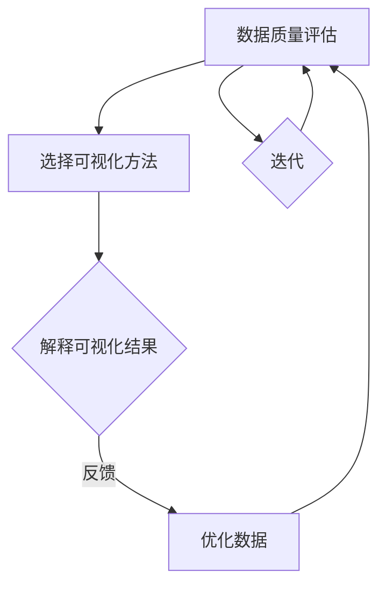
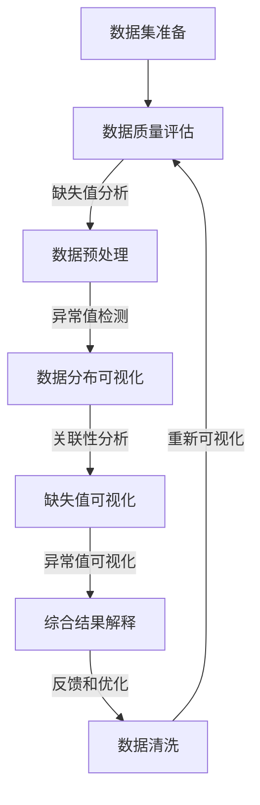

                 

### 引言

#### 可视化分析的重要性

在数据科学和人工智能领域，数据集的质量直接决定了模型训练的效果和应用价值。尽管数据清洗和数据预处理是数据分析的重要环节，但传统的方法往往依赖于手动分析和编码，不仅费时费力，而且容易出现漏检和误判。因此，数据集可视化分析作为一种有效的手段，越来越受到重视。可视化分析不仅能够直观地揭示数据质量问题的本质，还能帮助数据科学家快速定位问题，从而提高数据分析的效率和质量。

首先，可视化分析提供了一个直观的数据探索平台，使得数据科学家可以轻松地浏览和理解复杂数据集的结构和分布。通过图形化的方式，数据质量问题如异常值、缺失值、数据分布偏差等都能一目了然。这种直观的展示方式大大降低了数据分析的难度，使得非专业用户也能快速掌握数据情况。

其次，可视化分析可以帮助数据科学家快速识别潜在的数据质量问题。在数据预处理阶段，可视化工具能够实时反馈数据清洗的效果，确保每个步骤的正确性和完整性。这种实时反馈机制不仅提高了工作效率，还减少了人为错误的风险。

此外，可视化分析还能够促进数据科学家之间的沟通和协作。通过图形化的数据展示，数据科学家可以更清晰地传达分析结果和发现，减少误解和沟通成本。这种可视化沟通工具在项目汇报、团队讨论等场景中尤为重要。

#### 数据集可视化的基本概念

数据集可视化是指使用图形化工具和图表将数据集的特征、分布、关系等信息以直观的方式展示出来。通过数据可视化，我们可以将隐藏在大量数据中的信息清晰呈现，使得数据分析更加高效和直观。数据集可视化主要包括以下几个方面：

- **数据分布可视化**：用于展示数据在不同维度上的分布情况，如直方图、密度图、箱线图等。这些图表可以帮助我们了解数据的集中程度、离散程度以及异常值的存在。

- **关联性可视化**：用于展示数据之间相互关联的关系，如散点图、热力图、关联矩阵等。通过这些图表，我们可以发现数据之间的相关性、依赖性以及潜在的因果关系。

- **异常值检测可视化**：用于展示数据集中异常值的存在和分布，如箱线图、散点图、异常值检测图等。通过这些图表，我们可以识别数据集中的异常值，进一步分析其产生的原因和影响。

- **缺失值可视化**：用于展示数据集中缺失值的存在和分布，如缺失值矩阵、缺失值分布图等。通过这些图表，我们可以了解数据的完整性，为后续的数据清洗和填充提供依据。

#### 数据质量问题的定义和类型

数据质量问题是指数据在质量方面存在的缺陷和不足，这些问题可能会影响数据分析结果的准确性和可靠性。数据质量问题的类型主要包括以下几个方面：

- **异常值**：指数据集中偏离正常范围的值，可能是由于数据采集、传输或处理过程中的错误导致。异常值可能会对数据分析结果产生不良影响，如导致模型训练偏差、降低预测准确性等。

- **缺失值**：指数据集中缺失的数据项，可能是由于数据采集、存储或处理过程中的遗漏导致。缺失值会影响数据分析的完整性，导致分析结果不准确或无法得出。

- **数据重复**：指数据集中存在重复的数据记录，可能是由于数据采集、存储或处理过程中的错误导致。数据重复会导致数据冗余，增加存储和维护成本，同时也可能影响数据分析结果的准确性。

- **数据不一致**：指数据集中存在不一致的数据项，可能是由于数据采集、存储或处理过程中的错误导致。数据不一致会导致数据分析结果不可靠，甚至产生误导性结论。

- **数据不准确**：指数据集中存在错误或虚假的数据，可能是由于数据采集、存储或处理过程中的错误导致。数据不准确会导致数据分析结果不准确，从而影响决策的准确性。

综上所述，数据集可视化分析作为一种有效的手段，能够直观地揭示数据质量问题的存在和类型，为数据科学家提供有力的支持，提高数据分析的质量和效率。接下来，我们将深入探讨数据集的准备工作，为后续的数据质量可视化分析打下坚实的基础。

### 数据集准备

数据集的准备是数据可视化分析的重要前置工作，它直接关系到后续分析的质量和效果。在数据可视化之前，我们通常需要经历数据采集与预处理、数据清洗和数据质量评估等步骤。这些步骤不仅能够确保数据集的准确性和完整性，还能为后续的数据质量可视化分析提供可靠的基础。

#### 数据采集与预处理

数据采集是数据集准备的首要步骤，它涉及到从各种来源获取数据，如数据库、文件、Web API等。在数据采集过程中，我们需要关注数据的来源可靠性、数据格式和数据的一致性。以下是一些关键步骤：

- **数据源识别**：确定数据来源，包括内部数据库、外部数据服务、公共数据集等。
- **数据格式转换**：将不同来源和格式的数据转换为统一的格式，如CSV、JSON等，以便后续处理。
- **数据预处理**：进行数据格式化、数据类型转换、数据去重等操作，确保数据的一致性和完整性。

数据预处理是数据采集后的重要步骤，它包括以下内容：

- **缺失值处理**：缺失值可以是完全缺失，也可以是部分缺失。对于完全缺失的数据，可以考虑删除或用平均值、中位数等统计量填充；对于部分缺失的数据，可以使用插值法、回归法等算法进行填充。
- **异常值处理**：异常值可能是由于数据采集错误、数据传输错误或数据录入错误等原因造成的。处理异常值的方法包括删除异常值、用邻近值替换异常值或使用统计方法（如三次样条插值）对异常值进行修正。
- **数据规范化**：通过归一化或标准化等手段将数据转换为相同尺度，以便进行有效的分析和可视化。

#### 数据清洗方法

数据清洗是数据预处理的一部分，它主要用于解决数据集中的错误、重复和不一致问题。以下是一些常用的数据清洗方法：

- **去除重复记录**：通过唯一键（如ID）检测和删除重复的数据记录，确保数据集的准确性。
- **纠正错误值**：检查数据集中错误的数据项，并使用正确的数据替换它们。例如，将某些字段中的空值替换为实际值。
- **填补缺失值**：使用适当的算法填补缺失值。常见的填补方法包括平均值填补、中位数填补、插值法等。
- **数据格式转换**：将数据集中的数据格式转换为统一的标准格式，如将日期格式转换为YYYY-MM-DD等。

#### 数据质量评估指标

数据质量评估是确保数据集准确性和完整性的重要环节。以下是一些常用的数据质量评估指标：

- **完整性**：评估数据集中缺失值的比例，通常用缺失率（缺失值总数与总数据个数的比值）来表示。完整性越高，数据集的质量越好。
- **准确性**：评估数据集的真实性和可靠性，可以通过比较实际数据和预估值之间的差异来判断。准确性越高，数据集的质量越好。
- **一致性**：评估数据在不同来源、不同格式之间的统一性。一致性越高，数据集的质量越好。
- **唯一性**：评估数据集中重复记录的比例，唯一性越高，数据集的质量越好。
- **时效性**：评估数据的新鲜程度，即数据是否及时更新。时效性越高，数据集的质量越好。

通过上述步骤，我们可以对数据集进行全面的准备，确保数据集的准确性和完整性。数据集的准备质量直接关系到后续数据可视化分析的效果，因此，我们需要认真对待每一个步骤，确保数据的质量和可靠性。

### 可视化基础

数据可视化是数据科学和人工智能领域的重要组成部分，它通过图形化的方式将数据集的结构、分布和关系等信息直观地展示出来。掌握数据可视化基础对于数据科学家来说至关重要，这不仅有助于更好地理解数据，还能提高数据分析的效率和效果。在本节中，我们将介绍可视化工具、数据可视化原理以及可视化设计原则。

#### 可视化工具介绍

可视化工具是进行数据可视化的核心，它们提供了丰富的图表类型和自定义选项，帮助用户将数据转化为直观的图形。以下是一些主流的可视化工具：

- **Matplotlib**：Python中最为常用的可视化库，可以生成各种二维和三维图表，包括折线图、柱状图、散点图等。
- **Seaborn**：基于Matplotlib的扩展库，提供了更丰富的统计图表和美化选项，特别适合于数据分布和相关性分析。
- **Plotly**：支持交互式图表的Python库，能够生成美观且交互性强的图表，适用于Web应用。
- **D3.js**：用于Web应用的JavaScript库，可以创建高度交互的图表，适用于复杂数据的可视化。
- **Tableau**：商业化的数据可视化工具，提供了丰富的图表类型和自定义选项，适用于商业智能分析。

每种可视化工具都有其独特的特点和适用场景。选择合适的工具能够提高数据可视化的效率和效果。例如，Matplotlib适合学术研究和脚本编写，而Tableau则适合商业分析和报表生成。

#### 数据可视化原理

数据可视化基于人眼对视觉信息的敏感性和大脑对图形化信息的处理优势，通过图形将数据以直观、易懂的方式呈现出来。以下是一些基本的数据可视化原理：

- **分辨率**：分辨率决定了图形的清晰度，越高越好。高分辨率图形能够更精细地展示数据的细节。
- **颜色**：颜色在数据可视化中用于区分不同的数据类别或数据值。合适的颜色搭配能够提高图表的可读性。
- **比例**：比例是图表中各个元素（如轴、刻度、标签等）之间的相对大小。保持合理的比例有助于用户更好地理解数据。
- **视觉层次**：通过视觉层次（如大小、颜色、位置等）来引导用户的视线，使其首先注意到重要信息。
- **交互性**：交互性是现代数据可视化的重要特点，它允许用户通过点击、拖动等方式与图表进行互动，从而更深入地探索数据。

#### 可视化设计原则

良好的可视化设计能够有效地传达数据信息，减少用户的认知负担，提高数据分析的效率。以下是一些常用的可视化设计原则：

- **简洁性**：简洁的图表能够避免信息的过度冗杂，使数据的核心信息更容易被用户理解。
- **一致性**：在图表中保持一致的风格和元素，如字体大小、颜色、标签等，有助于提高图表的可读性。
- **对比性**：通过对比来突出重要数据，如使用不同的颜色、大小或形状来区分不同的数据类别。
- **交互性**：增加交互性功能，如筛选、排序、缩放等，使用户能够更灵活地探索数据。
- **注释与说明**：图表中的注释和说明能够帮助用户更好地理解数据的背景和含义，减少误解。
- **比例与对齐**：确保图表中的各个元素保持合理的比例和对齐方式，以提高整体的视觉美感。

通过遵循上述设计原则，我们可以创建出既美观又实用的数据可视化图表，帮助用户更轻松地理解数据，发现数据中的隐藏信息。接下来，我们将探讨如何使用数据可视化方法来发现和解决数据集中的质量问题。

### 数据质量可视化方法

数据质量是数据分析成功的关键因素，而数据质量可视化则是揭示数据问题的重要手段。通过使用不同的可视化方法，我们可以直观地识别数据集中的异常值、缺失值、数据分布问题以及其他潜在的数据质量问题。在本节中，我们将详细介绍几种常见的数据质量可视化方法，包括数据分布可视化、关联性可视化、异常值检测可视化和缺失值可视化。

#### 数据分布可视化

数据分布可视化用于展示数据在不同维度上的分布情况，帮助我们了解数据的集中程度、离散程度以及异常值的分布。以下是一些常用的数据分布可视化方法：

- **直方图（Histogram）**：直方图是展示数据分布最常用的图表之一。它将数据分成若干个区间（或称为“桶”），然后统计每个区间内的数据点数量，用柱形表示。直方图能够清晰地展示数据的分布形态，如正态分布、偏态分布等。

  ```mermaid
  flowchart LR
    A[直方图] --> B[区间划分]
    B --> C[柱形表示]
    C --> D[分布形态]
  ```

- **密度图（Density Plot）**：密度图是对直方图的改进，它使用连续的曲线来表示数据的分布情况，能够更精确地展示数据的概率密度。通过密度图，我们可以更容易地识别数据的峰值、谷值和异常值。

  ```mermaid
  flowchart LR
    A[密度图] --> B[曲线表示]
    B --> C[概率密度]
    C --> D[异常值识别]
  ```

- **箱线图（Box Plot）**：箱线图展示了数据的四分位数、异常值和异常分布。它能够直观地展示数据的分布情况以及数据的离散程度。箱线图还常用于比较多个数据集的分布情况。

  ```mermaid
  flowchart LR
    A[箱线图] --> B[四分位数]
    B --> C[异常值]
    C --> D[分布比较]
  ```

#### 关联性可视化

关联性可视化用于展示数据集内部变量之间的关联性，帮助我们识别数据之间的相关性。以下是一些常用的关联性可视化方法：

- **散点图（Scatter Plot）**：散点图通过在二维平面上绘制数据点来展示两个变量之间的关系。每个点的坐标对应数据集中的两个变量值。通过观察散点图的分布，我们可以识别出变量之间的线性关系、非线性关系以及异常点。

  ```mermaid
  flowchart LR
    A[散点图] --> B[点表示]
    B --> C[变量关系]
    C --> D[异常点识别]
  ```

- **热力图（Heat Map）**：热力图使用颜色深浅来表示数据的大小或数值，特别适用于展示多个变量之间的相关性。通过热力图，我们可以快速识别出数据集中的热点区域和冷点区域，从而发现变量之间的强相关关系。

  ```mermaid
  flowchart LR
    A[热力图] --> B[颜色表示]
    B --> C[相关性识别]
    C --> D[热点区域]
  ```

- **关联矩阵（Correlation Matrix）**：关联矩阵展示了数据集中各个变量之间的相关系数，用数值或颜色表示。关联矩阵能够全面地展示变量之间的相关性，特别适用于多变量数据集。

  ```mermaid
  flowchart LR
    A[关联矩阵] --> B[相关系数]
    B --> C[变量关联]
    C --> D[矩阵表示]
  ```

#### 异常值检测可视化

异常值检测是数据质量可视化的重要部分，它用于识别数据集中偏离正常范围的值。以下是一些常用的异常值检测可视化方法：

- **箱线图（Box Plot）**：箱线图不仅可以展示数据的分布情况，还可以突出显示异常值。通过箱线图，我们可以直观地识别出哪些数据点可能是异常值。

  ```mermaid
  flowchart LR
    A[箱线图] --> B[异常值标记]
    B --> C[异常值识别]
  ```

- **散点图（Scatter Plot）**：在散点图中，异常值通常表现为远离数据点的数据点。通过观察散点图，我们可以识别出这些异常点，并进一步分析其产生的原因。

  ```mermaid
  flowchart LR
    A[散点图] --> B[异常点识别]
    B --> C[异常值分析]
  ```

- **箱线图-散点图结合**：将箱线图和散点图结合使用，可以在同一图表中同时展示数据的分布和异常值。这种方法能够更全面地揭示数据质量情况。

  ```mermaid
  flowchart LR
    A[箱线图-散点图] --> B[分布与异常值]
    B --> C[综合分析]
  ```

#### 缺失值可视化

缺失值可视化用于展示数据集中缺失值的存在和分布，帮助我们识别数据的完整性。以下是一些常用的缺失值可视化方法：

- **缺失值矩阵（Missing Value Matrix）**：缺失值矩阵以表格形式展示了数据集中每个变量每个数据点的缺失情况。通过观察缺失值矩阵，我们可以快速识别出哪些变量存在缺失值以及缺失值的分布。

  ```mermaid
  flowchart LR
    A[缺失值矩阵] --> B[缺失值分布]
    B --> C[变量缺失分析]
  ```

- **缺失值条形图（Missing Value Bar Chart）**：缺失值条形图用条形表示每个变量的缺失值数量，帮助我们直观地了解哪些变量缺失值较多，从而针对性地进行数据清洗。

  ```mermaid
  flowchart LR
    A[缺失值条形图] --> B[缺失值数量]
    B --> C[数据清洗策略]
  ```

- **缺失值地图（Missing Value Map）**：对于空间数据，缺失值地图使用颜色或图标来表示数据的缺失情况。这种方法适用于地理信息系统（GIS）中的数据可视化。

  ```mermaid
  flowchart LR
    A[缺失值地图] --> B[空间缺失值]
    B --> C[地理位置分析]
  ```

通过以上几种数据质量可视化方法，我们可以全面、直观地识别和解决数据集中的质量问题。这些方法不仅帮助我们理解数据的现状，还为后续的数据清洗、分析和建模提供了重要的依据。接下来，我们将进一步探讨数据质量可视化的核心概念与联系。

### 核心概念与联系

数据质量可视化分析是一个系统化、多步骤的过程，涉及多个核心概念和方法的相互联系。在这一节中，我们将详细探讨数据质量可视化流程、Mermaid流程图的使用，以及这些流程和方法在实际项目中的应用。

#### 数据质量可视化流程

数据质量可视化流程是一个连续的过程，包括数据质量评估、可视化方法选择、可视化结果解释和反馈等多个环节。以下是数据质量可视化流程的具体步骤：

- **数据质量评估**：首先，我们需要对数据集进行质量评估，识别潜在的数据质量问题。这包括完整性、准确性、一致性、唯一性和时效性等方面的评估。常用的方法有缺失值分析、异常值检测和重复值检测等。

- **可视化方法选择**：根据数据集的特点和问题类型，选择合适的可视化方法。数据分布可视化（如直方图、密度图、箱线图）可以帮助我们理解数据的分布情况；关联性可视化（如散点图、热力图、关联矩阵）可以帮助我们识别变量之间的相关性；异常值检测可视化（如箱线图、散点图、异常值检测图）可以突出显示异常值；缺失值可视化（如缺失值矩阵、缺失值条形图、缺失值地图）可以揭示数据的完整性问题。

- **可视化结果解释**：通过可视化结果，我们能够直观地识别数据中的质量问题。解释可视化结果需要结合具体的数据背景和业务场景，分析问题产生的原因和影响。

- **反馈和优化**：根据可视化结果和解释，对数据集进行进一步的清洗和预处理，优化数据质量。这个过程是迭代的，需要根据实际情况进行多次循环。

#### Mermaid 流程图

Mermaid 是一种简单而强大的标记语言，用于创建结构化的图表和流程图。在数据质量可视化流程中，使用 Mermaid 流程图可以帮助我们清晰地展示整个数据质量评估和可视化的过程。

以下是一个简单的 Mermaid 流程图示例，用于描述数据质量可视化流程：



在这个流程图中，我们定义了数据质量评估、选择可视化方法、解释可视化结果、反馈和优化以及迭代等步骤，每个步骤之间通过箭头连接，展示了整个流程的连贯性和动态性。

#### 数据质量可视化流程图示例

为了更好地理解数据质量可视化流程，我们可以通过一个具体的示例来展示这个过程。以下是一个示例流程图，展示了从数据质量评估到可视化结果解释的全过程：



在这个流程图中，我们首先进行数据集的准备，然后进行数据质量评估。通过缺失值分析和异常值检测，我们识别出数据集中的问题，并进行数据预处理。接着，我们使用数据分布可视化和关联性可视化来揭示数据的特点和关系。通过缺失值可视化和异常值可视化，我们进一步确认数据的问题，并解释这些问题的产生原因和影响。最后，根据可视化结果和解释，我们对数据进行反馈和优化，重新进行可视化分析。

#### 实际项目中的应用

在实际项目中，数据质量可视化流程可以灵活应用，根据项目的具体需求和数据特点进行调整。以下是一个实际项目中的应用示例：

- **项目背景**：某电子商务公司需要对用户购买行为进行分析，以优化营销策略和提高销售额。
- **数据来源**：用户购买记录、订单数据、促销活动数据等。
- **数据质量评估**：对数据集进行缺失值分析、异常值检测和重复值检测，确保数据的完整性、准确性和一致性。
- **数据预处理**：对缺失值进行填补，对异常值进行修正，去除重复记录。
- **数据分布可视化**：使用直方图和密度图展示用户购买金额的分布情况，识别高消费用户和低消费用户。
- **关联性分析**：使用散点图和关联矩阵分析用户购买行为与促销活动之间的关系，发现哪些促销活动对销售额有显著影响。
- **缺失值可视化**：使用缺失值矩阵和缺失值条形图展示用户信息和订单信息的完整性，为后续数据清洗提供依据。
- **异常值可视化**：使用箱线图和散点图识别购买金额的异常值，分析异常购买的原因。
- **综合结果解释**：根据可视化结果，分析用户购买行为模式，优化营销策略，提高用户满意度。
- **反馈和优化**：根据可视化结果和解释，对数据进行进一步的清洗和预处理，确保数据质量。

通过这个实际项目示例，我们可以看到数据质量可视化流程在项目中的应用，如何通过系统化的方法识别和解决数据质量问题，从而为业务决策提供有力支持。在下一节中，我们将深入探讨数据质量可视化中的核心算法原理。

### 核心算法原理讲解

在数据质量可视化中，核心算法的原理讲解对于理解数据分布和关联性分析至关重要。在本节中，我们将详细解释数据分布分析算法和关联性分析算法的基本原理，包括均值和方差、帕累托图以及相关系数和熵等。通过这些算法，我们可以更好地识别数据中的分布特点和变量之间的关系。

#### 数据分布分析算法

数据分布分析算法用于理解数据在不同维度上的分布情况，以下是几个关键算法及其原理：

1. **均值和方差（Mean and Variance）**

   - **均值（Mean）**：均值是数据分布的中心位置，表示数据的平均数值。计算公式如下：

     \[ \mu = \frac{1}{n} \sum_{i=1}^{n} x_i \]

     其中，\( \mu \) 是均值，\( n \) 是数据点的数量，\( x_i \) 是第 \( i \) 个数据点。

   - **方差（Variance）**：方差是数据分布的离散程度，表示数据点与均值之间的偏离程度。计算公式如下：

     \[ \sigma^2 = \frac{1}{n} \sum_{i=1}^{n} (x_i - \mu)^2 \]

     其中，\( \sigma^2 \) 是方差，\( \mu \) 是均值，其他符号的含义与上式相同。

   通过计算均值和方差，我们可以了解数据的中心位置和离散程度。例如，一个数据集的均值高而方差小，可能表示数据集中且整齐；而均值低且方差大，可能表示数据分散且不均匀。

2. **帕累托图（Pareto Chart）**

   - **帕累托图（Pareto Chart）**：帕累托图是一种特殊的条形图，用于展示数据集中的重要异常值或问题点。它将数据按重要性从高到低排序，并用条形表示，同时结合累积百分比进行展示。

   帕累托图的原理基于帕累托原则（80/20规则），即80%的问题通常由20%的原因造成。帕累托图的计算步骤如下：

   1. 将数据按重要性排序，例如按金额大小排序。
   2. 计算每个数据点的累积百分比：\[ P_i = \frac{\sum_{j=1}^{i} x_j}{\sum_{j=1}^{n} x_j} \]
   3. 在图表中绘制条形，并连接每个条形的顶端，形成累积百分比线。

   帕累托图能够直观地展示数据中最重要的异常值或问题点，帮助数据科学家快速识别和解决关键问题。

3. **伪代码示例**

   以下是一个简单的伪代码示例，用于计算均值、方差和绘制帕累托图：

   ```python
   def calculate_mean_variance(data):
       n = len(data)
       mean = sum(data) / n
       variance = sum((x - mean) ** 2 for x in data) / n
       return mean, variance

   def plot_pareto_chart(data):
       data_sorted = sorted(data, reverse=True)
       cumulative_percentage = [sum(data_sorted[:i+1]) / sum(data_sorted) for i in range(len(data_sorted))]
       # 绘制帕累托图
       # 使用可视化库（如Matplotlib）进行绘制
       plt.bar(range(len(data_sorted)), data_sorted)
       plt.plot(range(len(cumulative_percentage)), cumulative_percentage, color='red')
       plt.show()
   ```

   通过这个伪代码示例，我们可以计算数据的均值和方差，并使用帕累托图展示数据分布。

#### 关联性分析算法

关联性分析算法用于识别数据集内部变量之间的关系，以下是几个关键算法及其原理：

1. **相关系数（Correlation Coefficient）**

   - **皮尔逊相关系数（Pearson Correlation Coefficient）**：皮尔逊相关系数是最常用的相关系数，用于度量两个连续变量之间的线性相关性。计算公式如下：

     \[ r = \frac{\sum_{i=1}^{n} (x_i - \mu_x)(y_i - \mu_y)}{\sqrt{\sum_{i=1}^{n} (x_i - \mu_x)^2 \sum_{i=1}^{n} (y_i - \mu_y)^2}} \]

     其中，\( r \) 是皮尔逊相关系数，\( \mu_x \) 和 \( \mu_y \) 分别是 \( x \) 和 \( y \) 的均值，其他符号的含义与前面类似。

     相关系数的取值范围在 -1 到 1 之间。当 \( r \) 接近 1 或 -1 时，表示变量之间有很强的线性相关性；当 \( r \) 接近 0 时，表示变量之间几乎没有线性相关性。

2. **熵（Entropy）**

   - **信息熵（Entropy）**：信息熵是衡量随机变量不确定性的指标，用于度量变量之间的关联强度。计算公式如下：

     \[ H(X) = -\sum_{i=1}^{n} p_i \log_2 p_i \]

     其中，\( H(X) \) 是随机变量 \( X \) 的熵，\( p_i \) 是 \( X \) 取第 \( i \) 个值的概率。

     信息熵越大，表示随机变量的不确定性越高，变量之间的关联性越弱。相反，信息熵越小，表示随机变量的不确定性越低，变量之间的关联性越强。

3. **伪代码示例**

   以下是一个简单的伪代码示例，用于计算皮尔逊相关系数和信息熵：

   ```python
   def calculate_correlation_coefficient(x, y):
       n = len(x)
       mean_x = sum(x) / n
       mean_y = sum(y) / n
       numerator = sum((x_i - mean_x) * (y_i - mean_y) for x_i, y_i in zip(x, y))
       denominator = sqrt(sum((x_i - mean_x) ** 2 for x_i in x) * sum((y_i - mean_y) ** 2 for y_i in y))
       return numerator / denominator

   def calculate_entropy(data):
       probabilities = [freq / len(data) for freq in Counter(data).values()]
       entropy = -sum(p * log2(p) for p in probabilities)
       return entropy
   ```

   通过这个伪代码示例，我们可以计算变量之间的皮尔逊相关系数和信息熵，进一步分析变量之间的关联性。

通过深入理解数据分布分析算法和关联性分析算法，我们可以更有效地识别数据中的分布特点和变量之间的关系。这些算法不仅为我们提供了数学工具，还为我们提供了直观的方法，使我们能够更好地理解和解释数据，为数据质量可视化分析提供坚实的基础。

### 数学模型和数学公式讲解

在数据质量可视化分析中，数学模型和公式是我们理解和评估数据质量的重要工具。这些模型和公式不仅帮助我们从量化角度分析数据，还能为后续的数据处理提供决策依据。在本节中，我们将详细讲解几个关键的数据质量评估模型和相关的数学公式，并通过实际例子来说明其应用。

#### 数据质量评估模型

数据质量评估模型通常用于综合评估数据集在多个维度上的质量。以下是一个常见的数据质量评估模型，该模型通过计算不同指标得分并加权求和来综合评估数据质量。

1. **数据质量得分（Quality Score, Q）**

   数据质量得分 \( Q \) 是通过对多个质量指标进行加权求和得到的。公式如下：

   \[ Q = \sum_{i=1}^{n} w_i \times d_i \]

   其中，\( w_i \) 是第 \( i \) 个指标的权重，\( d_i \) 是第 \( i \) 个指标的具体得分。权重可以根据指标的重要性和数据集的具体情况来分配。

   - **完整性（Completeness, C）**：完整性指标用于评估数据集中缺失值的比例。公式如下：

     \[ C = 1 - \frac{\text{缺失值总数}}{\text{总数据个数}} \]

   - **准确性（Accuracy, A）**：准确性指标用于评估数据集的真实性和可靠性。公式如下：

     \[ A = \frac{\text{正确数据个数}}{\text{总数据个数}} \]

   - **一致性（Consistency, C）**：一致性指标用于评估数据在不同来源、格式或时间点上的统一性。公式如下：

     \[ C = 1 - \frac{\text{不一致的数据个数}}{\text{总数据个数}} \]

   - **唯一性（Uniqueness, U）**：唯一性指标用于评估数据集中重复记录的比例。公式如下：

     \[ U = 1 - \frac{\text{重复数据个数}}{\text{总数据个数}} \]

   - **时效性（Timeliness, T）**：时效性指标用于评估数据的新鲜程度。公式如下：

     \[ T = 1 - \frac{\text{过时数据个数}}{\text{总数据个数}} \]

   将这些指标代入数据质量得分公式，我们可以得到一个综合评估数据质量的方法：

   \[ Q = w_C \times C + w_A \times A + w_C \times C + w_U \times U + w_T \times T \]

   其中，\( w_C \)、\( w_A \)、\( w_C \)、\( w_U \) 和 \( w_T \) 分别是完整性、准确性、一致性、唯一性和时效性的权重。

#### 数学公式举例说明

为了更直观地理解这些数学模型和公式，我们通过一个实际例子来说明数据质量得分的计算。

**例子**：假设我们有一个数据集，包含以下指标及其得分：

- 完整性（C）：90%
- 准确性（A）：95%
- 一致性（C）：85%
- 唯一性（U）：98%
- 时效性（T）：80%

根据上述指标权重设定，完整性、准确性、一致性、唯一性和时效性的权重分别为0.2、0.3、0.2、0.2和0.1，我们可以计算数据质量得分 \( Q \) 如下：

\[ Q = 0.2 \times 0.9 + 0.3 \times 0.95 + 0.2 \times 0.85 + 0.2 \times 0.98 + 0.1 \times 0.8 \]
\[ Q = 0.18 + 0.285 + 0.17 + 0.196 + 0.08 \]
\[ Q = 0.841 \]

因此，该数据集的数据质量得分为 84.1%，表明数据集在整体上具有较高的质量，但在一致性和时效性方面还有一定的提升空间。

#### 数据缺失率公式

数据缺失率是衡量数据集中缺失值比例的一个关键指标。缺失率公式如下：

\[ \text{缺失率} = \frac{\text{缺失值总数}}{\text{总数据个数}} \]

例如，如果一个数据集中有100个数据点，其中有20个数据点缺失，则该数据集的缺失率为：

\[ \text{缺失率} = \frac{20}{100} = 20\% \]

这是一个较高的缺失率，可能需要进一步的数据清洗和填补。

通过这些数学模型和公式，我们可以量化地评估数据质量，并为数据清洗和预处理提供依据。在实际应用中，可以根据具体情况调整指标权重和计算方法，以更准确地反映数据质量。

### 项目实战

#### 实战准备

在进行数据质量可视化之前，我们需要做好充分的准备工作。以下是项目实战的准备工作：

1. **开发环境搭建**

   确保安装了Python和相关库，如Matplotlib、Seaborn、Pandas、NumPy等。我们可以使用Anaconda来管理Python环境和库，简化安装过程。

   ```bash
   conda create -n data_visualization python=3.8
   conda activate data_visualization
   conda install matplotlib seaborn pandas numpy
   ```

2. **数据集选择**

   选择一个合适的数据集进行实战。这里我们使用一个常见的公开数据集——`iris`数据集。该数据集包含了3个类别的鸢尾花（Iris）的多种特征，包括花萼长度、花萼宽度、花瓣长度和花瓣宽度。数据集的规模适中，适合用于演示数据质量可视化。

   ```python
   from sklearn.datasets import load_iris
   iris = load_iris()
   iris_data = iris.data
   iris_target = iris.target
   ```

#### 代码实战

以下步骤展示了如何使用Python和Matplotlib等库进行数据质量可视化：

1. **数据集导入与预处理**

   首先，我们导入数据集，并进行基本的预处理，如数据清洗和缺失值处理。

   ```python
   import pandas as pd
   import numpy as np
   
   # 导入数据集
   df = pd.DataFrame(iris_data, columns=iris.feature_names)
   df['species'] = iris.target
   
   # 检查缺失值
   print(df.isnull().sum())
   
   # 处理缺失值（如果存在）
   df = df.dropna()  # 这里我们简单地将缺失值记录删除，实际应用中可能需要更复杂的处理方法
   ```

2. **数据分布可视化**

   使用直方图和密度图来展示数据集的特征分布。

   ```python
   import matplotlib.pyplot as plt
   
   # 直方图
   plt.figure(figsize=(12, 6))
   for i, col in enumerate(df.columns[:-1]):
       plt.subplot(2, 2, i+1)
       plt.hist(df[col], bins=20, alpha=0.5, color='g')
       plt.title(f'Histogram of {col}')
       plt.xlabel(col)
       plt.ylabel('Frequency')
   
   # 密度图
   plt.subplot(2, 2, 5)
   sns.kdeplot(df['sepal length (cm)'], shade=True, color='r')
   plt.title('Density Plot of Sepal Length')
   plt.xlabel('Sepal Length (cm)')
   plt.ylabel('Density')
   
   plt.tight_layout()
   plt.show()
   ```

3. **关联性可视化**

   使用散点图和热力图来展示变量之间的关联性。

   ```python
   # 散点图
   plt.figure(figsize=(8, 6))
   sns.scatterplot(x='sepal length (cm)', y='sepal width (cm)', hue='species', data=df, palette='viridis')
   plt.title('Scatter Plot of Sepal Length vs Sepal Width')
   plt.xlabel('Sepal Length (cm)')
   plt.ylabel('Sepal Width (cm)')
   plt.show()
   
   # 热力图
   plt.figure(figsize=(10, 8))
   sns.heatmap(df.corr(), annot=True, cmap='coolwarm', linewidths=0.5)
   plt.title('Correlation Matrix')
   plt.show()
   ```

4. **异常值检测可视化**

   使用箱线图来检测数据中的异常值。

   ```python
   # 箱线图
   plt.figure(figsize=(12, 6))
   for i, col in enumerate(df.columns[:-1]):
       plt.subplot(2, 2, i+1)
       sns.boxplot(x=df['species'], y=df[col], width=0.3)
       plt.title(f'Box Plot of {col} by Species')
       plt.xlabel('Species')
       plt.ylabel(col)
   
   plt.tight_layout()
   plt.show()
   ```

5. **缺失值可视化**

   使用缺失值矩阵来展示数据集的缺失值分布。

   ```python
   # 缺失值矩阵
   plt.figure(figsize=(8, 6))
   sns.heatmap(df.isnull(), cbar=False, cmap='gray', linewidths=0.5)
   plt.title('Missing Value Matrix')
   plt.show()
   ```

#### 代码解读与分析

在上述代码实战中，我们使用了Python和相关的数据可视化库来展示数据质量的可视化结果。以下是各个步骤的详细解读和分析：

1. **数据集导入与预处理**

   - `pandas`和`numpy`库用于数据操作和计算。
   - `load_iris`函数从`sklearn.datasets`模块加载鸢尾花数据集。
   - `df`是数据集的DataFrame对象，包含了特征和目标变量。
   - `isnull().sum()`用于检查缺失值数量。

2. **数据分布可视化**

   - `matplotlib.pyplot`和`seaborn`库用于绘制图表。
   - 直方图展示了各个特征的分布情况。
   - 密度图提供了数据分布的概率密度信息，帮助我们更好地理解数据的分布特征。

3. **关联性可视化**

   - 散点图展示了两个特征之间的线性或非线性关系，同时使用不同的颜色区分不同的类别。
   - 热力图展示了数据集内部各个特征之间的相关性，热力图的单元格颜色越深，表示相关性越强。

4. **异常值检测可视化**

   - 箱线图用于展示每个类别的特征分布，同时识别出异常值。异常值在箱线图中用单独的点标记出来，帮助我们快速识别数据中的异常。

5. **缺失值可视化**

   - 缺失值矩阵以矩阵形式展示了每个特征中缺失值的分布情况。这种方式能够直观地识别哪些特征缺失值较多，为数据清洗和预处理提供指导。

通过这些可视化步骤，我们不仅能够直观地理解数据集的基本特征，还能识别出数据质量问题，如缺失值、异常值等。这些信息为后续的数据清洗和预处理提供了重要的参考，从而确保数据分析的准确性和可靠性。

### 总结与展望

数据质量可视化在数据科学和人工智能领域发挥着至关重要的作用。通过图形化的方式，数据质量可视化能够直观地揭示数据集中的问题，如异常值、缺失值、数据重复和数据不一致等。这种可视化方法不仅提高了数据分析的效率，还使得数据质量问题更容易被发现和解决。

首先，数据质量可视化帮助我们快速识别和定位数据问题。通过直方图、箱线图、散点图、热力图等可视化方法，我们可以直观地了解数据的分布特征、变量之间的相关性以及异常值的存在。这种方法特别适合非专业用户，他们可以通过简单的图表迅速掌握数据情况，而不需要深入理解复杂的统计概念。

其次，数据质量可视化促进了数据科学家之间的沟通和协作。通过图形化的数据展示，数据科学家可以更清晰地传达分析结果和发现，减少误解和沟通成本。这种可视化沟通工具在项目汇报、团队讨论等场景中尤为重要，有助于提高整体工作效率。

未来，数据质量可视化将继续朝着更加智能化、自动化的方向发展。随着人工智能和机器学习技术的发展，我们可以利用深度学习算法来自动识别数据质量问题，从而减少人工干预。此外，交互式可视化工具和实时数据流可视化也将成为数据质量可视化的重要趋势，使数据科学家能够实时监测和调整数据质量。

总之，数据质量可视化是数据管理与分析中不可或缺的一环。通过不断优化和引入新技术，数据质量可视化将为数据科学家提供更强大的工具，帮助他们在复杂的数据世界中游刃有余。在未来的数据科学项目中，数据质量可视化将继续发挥关键作用，推动数据分析的深度和广度不断扩展。

### 附录

#### 附录 A: 可视化工具与资源

在进行数据质量可视化时，选择合适的工具和资源至关重要。以下是一些主流的可视化工具和资源，供您参考：

1. **主流可视化工具对比**

   - **Matplotlib**：适用于生成静态图表，易于使用，功能强大。
   - **Seaborn**：基于Matplotlib，提供丰富的统计图表和美化选项。
   - **Plotly**：支持交互式图表，适用于Web应用。
   - **D3.js**：适用于Web应用的JavaScript库，能够创建高度交互的图表。
   - **Tableau**：商业化的数据可视化工具，提供丰富的图表类型和自定义选项。

2. **可视化工具使用指南**

   - **Matplotlib指南**：[官方文档](https://matplotlib.org/stable/contents.html)
   - **Seaborn指南**：[官方文档](https://seaborn.pydata.org/)
   - **Plotly指南**：[官方文档](https://plotly.com/python/)
   - **D3.js指南**：[官方文档](https://d3js.org/)
   - **Tableau指南**：[官方文档](https://www.tableau.com/learn)

3. **资源链接**

   - **数据可视化教程**：[DataCamp](https://www.datacamp.com/courses) 和 [Kaggle](https://www.kaggle.com/learn) 提供丰富的数据可视化教程。
   - **开源数据集**：[UCI机器学习库](https://archive.ics.uci.edu/ml/index.php) 和 [Kaggle数据集](https://www.kaggle.com/datasets) 提供大量公开数据集。
   - **可视化库和框架**：[Python可视化库大全](https://www.kaggle.com/c/108-python-visualization-libraries) 和 [D3.js库大全](https://d3js.org/)。

通过这些工具和资源，您可以更好地掌握数据质量可视化技术，提高数据分析的效率和质量。希望这些附录内容能够为您提供实际操作中的帮助。如果您在数据质量可视化过程中遇到任何问题，欢迎随时咨询和交流。作者：AI天才研究院/AI Genius Institute & 禅与计算机程序设计艺术 /Zen And The Art of Computer Programming。

