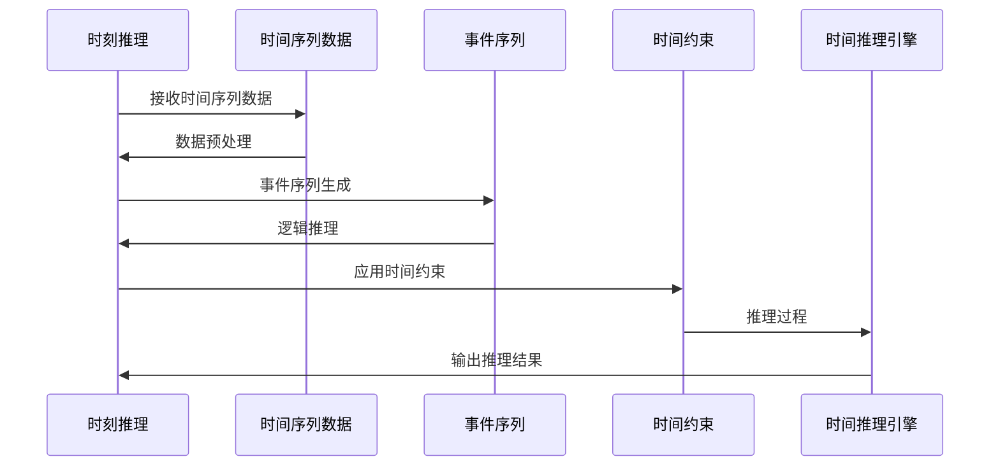

                 

### 第一部分：时刻推理的基本概念与历史背景

#### 第1章：时刻推理的起源与发展

时刻推理（Temporal Reasoning）是人工智能领域中一个重要的研究方向，主要关注如何使计算机理解和处理时间序列数据和事件序列。本节将介绍时刻推理的定义、发展历史及其核心概念。

**1.1 时刻推理的定义**

时刻推理是指对事件序列进行逻辑推理，以理解事件之间的先后顺序、因果关系等。在时刻推理中，时间是一个核心概念，它被用来表示事件的发生顺序和持续时长。

**定义**：时刻推理（Temporal Reasoning）是人工智能领域中的一个重要分支，主要研究如何使计算机理解和处理时间序列数据和事件序列。它涉及到以下核心概念：

- **事件**：时刻推理中的基本单元，表示某个特定时间发生的动作或状态。
- **时间序列**：按照时间顺序排列的一系列事件。
- **因果结构**：描述事件之间的因果关系。
- **时间约束**：对事件发生的时间进行限制，如时间窗口、先后顺序等。
- **时间推理引擎**：负责进行事件序列的推理和判断。

**Mermaid 流程图：**



**1.2 时刻推理的发展历史**

时刻推理的发展历程可以追溯到20世纪80年代，随着专家系统和知识表示技术的兴起，人们对时间推理的需求日益增加。以下是时刻推理发展的一些重要里程碑：

- **早期探索（1980年-1990年）**：在这一时期，研究者开始关注如何将时间概念引入到人工智能系统中。一些早期的时间推理系统包括基于规则的系统和基于模型的方法。

- **中期发展（1990年-2000年）**：随着计算机性能的提高和数据量的增加，时刻推理的研究逐渐走向成熟。研究者提出了多种时间序列建模方法和推理算法，如事件逻辑推理方法、时间表示与推理方法等。

- **当前趋势（2000年至今）**：随着深度学习和大数据技术的兴起，时刻推理的研究和应用得到了进一步的推动。研究者开始利用深度学习技术来提高时刻推理的性能和鲁棒性。此外，实时性和效率优化也是当前研究的重点。

**Mermaid 流程图：**

```mermaid
gantt
dateFormat  YYYY-MM-DD
title 时刻推理发展历程

section 早期探索
A1 : 1980年
A2 : 1985年
A3 : 1990年

section 中期发展
B1 : 1990年
B2 : 1995年
B3 : 2000年

section 当前趋势
C1 : 2000年
C2 : 2005年
C3 : 2010年
C4 : 2015年
C5 : 2020年
```

**1.3 时刻推理的核心概念与架构**

时刻推理的核心概念包括事件、时间序列、因果结构、时间约束和时间推理引擎。以下是对这些概念及其相互关系的详细介绍。

- **事件**：事件是时刻推理中的基本单元，表示某个特定时间发生的动作或状态。事件通常由时间和属性组成。例如，“2023年1月1日，北京天气晴”。

- **时间序列**：时间序列是一组按照时间顺序排列的事件。时间序列可以用来表示一段时间内发生的多个事件。例如，“2023年1月1日，北京天气晴；2023年1月2日，北京天气多云”。

- **因果结构**：因果结构描述事件之间的因果关系。在时刻推理中，事件之间的因果关系可以通过时间序列数据进行分析和推断。例如，“天气晴会导致户外活动增多”。

- **时间约束**：时间约束是对事件发生时间的限制，如时间窗口、先后顺序等。时间约束用于确保事件序列的合理性。例如，“户外活动必须在晴天进行”。

- **时间推理引擎**：时间推理引擎是负责进行事件序列推理和判断的组件。时间推理引擎可以根据事件序列、因果结构和时间约束等信息，推导出新的信息或做出决策。例如，“根据天气晴和用户兴趣，推荐用户参加户外活动”。

**Mermaid 流程图：**

```mermaid
classDiagram
Class01 <|-- Class02
Class03 ++--|+ Class04
Class04 o-- Class05
Class.automatic <<class>> 自动时间推理
Class.modeling <<class>> 时间序列建模
Class.inference <<class>> 时间推理引擎
Class.constraints <<class>> 时间约束
Class.events <<class>> 事件
Class.sequences <<class>> 时间序列
Class.causes <<class>> 因果结构
```

#### 第2章：时刻推理的核心概念与架构

在上一章中，我们介绍了时刻推理的基本概念和发展历史。在本章中，我们将深入探讨时刻推理的核心概念和架构，以帮助读者更好地理解这一重要的人工智能技术。

**2.1 核心概念**

时刻推理的核心概念包括事件、时间序列、因果结构、时间约束和时间推理引擎。以下是对这些概念及其相互关系的详细介绍。

- **事件**：事件是时刻推理中的基本单元，表示某个特定时间发生的动作或状态。事件通常由时间和属性组成。例如，“2023年1月1日，北京天气晴”。

事件是时刻推理中的核心概念，因为它代表了时间序列中的每一个基本元素。每个事件都对应着具体的时间点和相关的属性信息，这些属性可以描述事件的具体特征。例如，一个关于天气的事件可能包括温度、湿度、风速等属性。这些属性有助于更准确地描述事件的状态，为后续的推理和分析提供基础。

事件在时刻推理中扮演着至关重要的角色。通过事件，我们可以捕捉和记录现实世界中的变化和动态。事件的发生顺序和属性信息为推理引擎提供了必要的数据输入，使其能够分析事件之间的关联性和因果关系。

在时刻推理中，事件通常以数据的形式存储，例如在时间序列数据库或日志文件中。这些事件数据可以被用于训练模型、生成预测或进行实时推理。因此，事件的概念不仅是对时间序列数据的抽象表示，也是驱动时刻推理过程的核心元素。

- **时间序列**：时间序列是一组按照时间顺序排列的事件。时间序列可以用来表示一段时间内发生的多个事件。例如，“2023年1月1日，北京天气晴；2023年1月2日，北京天气多云”。

时间序列是时刻推理中的关键概念，因为它提供了对时间维度上的数据组织和分析的基础。时间序列数据按照时间顺序排列，使得我们可以观察和追踪事件在时间上的演变和变化。通过对时间序列数据的分析，我们可以发现事件之间的规律性和模式，从而进行有效的推理和预测。

时间序列数据可以是定时的，也可以是非定时的。定时的数据通常具有固定的采样间隔，例如每小时、每天或每周的数据记录。非定时的数据则可能是根据实际事件的发生时间进行记录的，例如股票市场的交易记录或传感器数据的采集。

在时刻推理中，时间序列数据是进行分析和推理的基础。通过对时间序列数据的处理和分析，我们可以提取出有价值的信息，如趋势、周期性、异常点等。这些信息可以为决策提供支持，例如在股票市场中进行交易策略的制定，或者在智能交通系统中进行交通流量的预测和优化。

- **因果结构**：因果结构描述事件之间的因果关系。在时刻推理中，事件之间的因果关系可以通过时间序列数据进行分析和推断。例如，“天气晴会导致户外活动增多”。

因果结构是时刻推理中的重要概念，因为它提供了对事件之间相互作用和影响的理解。通过对因果结构的分析，我们可以揭示事件之间的内在联系，从而进行更准确的推理和预测。

在时刻推理中，因果结构通常是通过数据分析和模型构建来建立的。通过分析时间序列数据，我们可以发现事件之间的关联性，并通过建模方法来识别因果关系。例如，通过回归分析，我们可以发现天气晴朗与户外活动增多之间的正相关关系。

因果结构的分析在许多领域都有重要的应用。在医疗领域，我们可以通过分析患者病史和治疗方案，找出哪些治疗方案与治疗效果之间存在因果关系。在金融领域，我们可以分析市场数据，找出影响股票价格的关键因素和因果关系。

- **时间约束**：时间约束是对事件发生时间的限制，如时间窗口、先后顺序等。时间约束用于确保事件序列的合理性。例如，“户外活动必须在晴天进行”。

时间约束是时刻推理中的重要概念，因为它提供了对事件发生时间和顺序的限制。这些约束条件有助于确保事件序列的连贯性和一致性，从而提高推理的准确性和可靠性。

在时刻推理中，时间约束可以通过规则、模型或约束语言来表示。例如，在规则系统中，我们可以定义“如果天气晴朗，则允许户外活动”。在模型中，我们可以通过约束条件来限制事件的发生时间和顺序。

时间约束的应用范围广泛，例如在智能交通系统中，我们可以通过时间约束来优化交通信号控制，避免交通拥堵。在供应链管理中，我们可以通过时间约束来确保物资的及时交付和库存的合理控制。

- **时间推理引擎**：时间推理引擎是负责进行事件序列推理和判断的组件。时间推理引擎可以根据事件序列、因果结构和时间约束等信息，推导出新的信息或做出决策。例如，“根据天气晴和用户兴趣，推荐用户参加户外活动”。

时间推理引擎是时刻推理系统的核心组件，它负责对事件序列进行逻辑推理和决策。时间推理引擎可以根据不同的算法和模型，分析事件之间的关联性和因果关系，从而生成新的信息或做出预测。

时间推理引擎的工作原理通常是基于事件序列的输入，通过对事件进行预处理、建模和推理，生成推理结果。这些结果可以用于实时决策、预测或数据分析。例如，在推荐系统中，时间推理引擎可以根据用户的历史行为和偏好，实时推荐相关的商品或活动。

时间推理引擎在许多应用领域都有重要的应用，如智能交通、金融分析、医疗诊断、智能推荐等。通过利用时间推理引擎，我们可以从大量时间序列数据中提取有价值的信息，为决策和优化提供支持。

**2.2 时刻推理的架构**

时刻推理的架构通常包括数据输入、事件处理、时间序列建模、因果结构分析、时间约束应用和时间推理引擎等组件。以下是一个典型的时刻推理架构：

```mermaid
classDiagram
Class01 <|-- Class02
Class03 ++--|+ Class04
Class04 o-- Class05
Class06 <|-- Class07
Class07 <|-- Class08

Class01 <<class>> 数据输入
Class02 <<class>> 事件处理
Class03 <<class>> 时间序列建模
Class04 <<class>> 因果结构分析
Class05 <<class>> 时间约束应用
Class06 <<class>> 时间推理引擎
Class07 <<class>> 推理结果输出
Class08 <<class>> 系统监控与优化

Class01 ..|>> Class02: 事件数据输入
Class02 ..|>> Class03: 事件预处理
Class03 ..|>> Class04: 建立因果结构
Class04 ..|>> Class05: 应用时间约束
Class05 ..|>> Class06: 时间推理
Class06 ..|>> Class07: 输出推理结果
Class07 ..|>> Class08: 系统监控与优化
```

1. **数据输入**：数据输入是时刻推理的第一步，负责接收来自外部系统或传感器的时间序列数据。这些数据可以是结构化数据，如CSV文件、数据库记录，也可以是非结构化数据，如图像、音频、视频等。

2. **事件处理**：事件处理模块负责对输入的数据进行预处理，包括数据清洗、格式化、去噪等操作。这一步的目的是确保输入数据的质量和一致性，为后续的处理提供可靠的数据基础。

3. **时间序列建模**：时间序列建模模块负责对预处理后的时间序列数据进行建模。常见的建模方法包括自回归模型（AR）、移动平均模型（MA）、自回归移动平均模型（ARMA）等。此外，还可以使用深度学习模型，如LSTM（长短期记忆网络）、GRU（门控循环单元）等，对时间序列数据进行建模。

4. **因果结构分析**：因果结构分析模块负责分析事件之间的因果关系。这一步可以通过统计方法、机器学习方法或因果推断技术来实现。通过分析事件之间的关联性，可以识别出事件之间的因果关系，为后续的时间约束应用提供支持。

5. **时间约束应用**：时间约束应用模块负责对事件序列应用时间约束。时间约束可以是规则形式的，如“事件A必须在事件B之后发生”，也可以是模型驱动的，如基于因果结构分析的约束条件。通过应用时间约束，可以确保事件序列的连贯性和合理性。

6. **时间推理引擎**：时间推理引擎是时刻推理系统的核心组件，负责对事件序列进行逻辑推理和决策。时间推理引擎可以根据不同的算法和模型，分析事件之间的关联性和因果关系，从而生成新的信息或做出预测。时间推理引擎可以用于实时决策、预测或数据分析。

7. **推理结果输出**：推理结果输出模块负责将时间推理引擎生成的推理结果输出到外部系统或用户界面。这些结果可以用于实时监控、决策支持或数据可视化。

8. **系统监控与优化**：系统监控与优化模块负责监控时刻推理系统的性能和稳定性，并对系统进行优化。通过监控系统指标，如延迟、准确率、资源利用率等，可以及时发现和解决问题，确保系统的正常运行。

**2.3 时刻推理的应用场景**

时刻推理在多个领域都有广泛的应用，以下是一些典型的应用场景：

- **智能交通**：通过分析交通流量数据，时刻推理可以预测交通拥堵情况，为交通管理部门提供决策支持。例如，根据历史数据和实时监控数据，可以预测某个路段在未来的拥堵情况，并采取相应的交通疏导措施。

- **金融分析**：在金融领域，时刻推理可以用于股票市场预测、风险评估和投资组合优化。通过分析历史股价数据、交易数据和宏观经济指标，可以预测股票价格的未来走势，为投资决策提供支持。

- **医疗诊断**：在医疗领域，时刻推理可以用于疾病预测和诊断支持。通过分析患者的病史数据、检查数据和医学知识库，可以预测疾病的发病风险，为医生提供诊断依据。

- **智能推荐**：在电子商务和社交媒体领域，时刻推理可以用于推荐系统的设计。通过分析用户的历史行为数据、偏好和社交网络信息，可以推荐用户可能感兴趣的商品或内容。

- **环境监测**：在环境保护领域，时刻推理可以用于实时监测环境污染情况，预测环境变化的趋势。通过分析空气质量数据、水质数据等，可以预测环境污染的严重程度，为环保部门提供决策支持。

这些应用场景展示了时刻推理在现实世界中的广泛应用。通过利用时刻推理技术，我们可以从大量时间序列数据中提取有价值的信息，为决策和优化提供支持，从而提高系统的性能和效率。

### 第二部分：时刻推理的核心算法与原理

#### 第3章：时刻推理的核心算法与原理

时刻推理的核心算法和原理是理解事件序列和预测未来事件的关键。在这一章中，我们将介绍时刻推理的核心算法，包括时间序列建模、因果结构分析和时间约束应用等。这些算法构成了时刻推理的技术基础，有助于我们更好地理解事件之间的关联性和因果关系。

#### 第3.1节：时间序列建模

时间序列建模是时刻推理中最基本和关键的一步，它旨在捕捉和分析时间序列数据的规律性。时间序列数据通常包含时间标记和相应的数值或类别标签，这些数据可以来自于各种领域，如气象、金融、医疗等。

**1. 自回归模型（AR）**

自回归模型是最早和最简单的时间序列建模方法之一。它基于以下假设：当前时刻的值可以通过前几个时刻的值来预测。自回归模型的一般形式如下：

$$ Y_t = c + \phi_1 Y_{t-1} + \phi_2 Y_{t-2} + ... + \phi_p Y_{t-p} + \varepsilon_t $$

其中，$Y_t$ 是时间序列在时刻 $t$ 的值，$c$ 是常数项，$\phi_i$ 是自回归系数，$p$ 是滞后阶数，$\varepsilon_t$ 是误差项。

**伪代码示例：**

```python
def ar_model(y, p):
    # 初始化模型参数
    theta = np.zeros(p+1)
    
    # 训练模型
    for t in range(1, len(y)):
        residual = y[t] - theta[0] - sum(theta[1:] * y[t-i] for i in range(1, p+1))
        gradient = np.array([residual] + [residual * y[t-i] for i in range(1, p+1)])
        theta -= gradient / np.linalg.norm(gradient)
    
    return theta
```

**2. 移动平均模型（MA）**

移动平均模型基于当前时刻的误差值可以由过去的一段时间内的误差值预测得出。MA模型的一般形式如下：

$$ Y_t = \mu + \varepsilon_t + \theta_1 \varepsilon_{t-1} + \theta_2 \varepsilon_{t-2} + ... + \theta_q \varepsilon_{t-q} $$

其中，$\mu$ 是均值，$\varepsilon_t$ 是当前时刻的误差值，$\theta_i$ 是移动平均系数，$q$ 是滞后阶数。

**伪代码示例：**

```python
def ma_model(y, q):
    # 初始化模型参数
    theta = np.zeros(q+1)
    
    # 训练模型
    for t in range(q, len(y)):
        residual = y[t] - np.dot(theta, y[t-q:t])
        gradient = np.array([residual] + [residual * y[t-i] for i in range(1, q+1)])
        theta -= gradient / np.linalg.norm(gradient)
    
    return theta
```

**3. 自回归移动平均模型（ARMA）**

自回归移动平均模型结合了AR模型和MA模型的优点，它同时考虑了自相关和移动平均效应。ARMA模型的一般形式如下：

$$ Y_t = c + \phi_1 Y_{t-1} + \phi_2 Y_{t-2} + ... + \phi_p Y_{t-p} + \mu + \varepsilon_t + \theta_1 \varepsilon_{t-1} + \theta_2 \varepsilon_{t-2} + ... + \theta_q \varepsilon_{t-q} $$

其中，$c$ 是常数项，$\phi_i$ 是自回归系数，$\theta_i$ 是移动平均系数，$\mu$ 是均值，$p$ 是滞后阶数，$q$ 是移动平均阶数。

**伪代码示例：**

```python
def arma_model(y, p, q):
    # 初始化模型参数
    theta = np.zeros(p+q+1)
    
    # 训练模型
    for t in range(p+q, len(y)):
        residual = y[t] - sum(theta[i] * y[t-i] for i in range(p+1)) - sum(theta[i+p] * y[t-i] for i in range(1, q+1))
        gradient = np.array([residual] + [residual * y[t-i] for i in range(1, p+1)] + [residual * y[t-i] for i in range(1, q+1)])
        theta -= gradient / np.linalg.norm(gradient)
    
    return theta
```

**4. 长短期记忆模型（LSTM）**

长短期记忆模型是一种深度学习模型，特别适用于处理时间序列数据。LSTM通过引入记忆单元和门控机制，能够有效地捕捉长期依赖关系。

**LSTM单元的数学模型：**

$$
\begin{aligned}
i_t &= \sigma(W_{xi}x_t + W_{hi}h_{t-1} + b_i) \\
f_t &= \sigma(W_{xf}x_t + W_{hf}h_{t-1} + b_f) \\
\bar{C}_t &= \tanh(W_{xc}x_t + W_{hc}h_{t-1} + b_c) \\
o_t &= \sigma(W_{xo}x_t + W_{ho}h_{t-1} + b_o) \\
C_t &= f_t \odot C_{t-1} + i_t \odot \bar{C}_t \\
h_t &= o_t \odot \tanh(C_t)
\end{aligned}
$$

其中，$i_t$、$f_t$、$o_t$ 分别是输入门、遗忘门和输出门，$C_t$ 是细胞状态，$h_t$ 是隐藏状态，$\sigma$ 是sigmoid函数，$\odot$ 是元素乘法。

**伪代码示例：**

```python
def lstm_cell(x, h_prev, c_prev, W, b):
    i = sigmoid(np.dot(h_prev, W[0]) + np.dot(x, W[1]) + b[0])
    f = sigmoid(np.dot(h_prev, W[2]) + np.dot(x, W[3]) + b[1])
    c_bar = tanh(np.dot(h_prev, W[4]) + np.dot(x, W[5]) + b[2])
    o = sigmoid(np.dot(h_prev, W[6]) + np.dot(x, W[7]) + b[3])
    c = f * c_prev + i * c_bar
    h = o * tanh(c)
    return h, c
```

**5. 部分线性模型（PLM）**

部分线性模型结合了线性模型和非线性模型的特点，它假设时间序列数据的一部分可以通过线性模型来建模，另一部分则通过非线性模型来建模。PLM的一般形式如下：

$$ Y_t = \alpha_0 + \alpha_1 X_{t-1} + ... + \alpha_p X_{t-p} + f_t $$

其中，$f_t$ 是非线性部分，可以通过函数$f(.)$来建模。

**伪代码示例：**

```python
def plm_model(y, X, p):
    # 初始化模型参数
    alpha = np.zeros(p+1)
    
    # 训练模型
    for t in range(p, len(y)):
        residual = y[t] - sum(alpha[i] * X[t-i] for i in range(p+1))
        gradient = np.array([residual] + [residual * X[t-i] for i in range(1, p+1)])
        alpha -= gradient / np.linalg.norm(gradient)
    
    return alpha
```

**6. 波特模型（PORT）**

波特模型是一种基于ARMA模型的改进方法，它通过引入外部输入变量来增强模型的预测能力。波特模型的一般形式如下：

$$ Y_t = \alpha_0 + \alpha_1 X_{t-1} + ... + \alpha_p X_{t-p} + \beta_1 U_{t-1} + ... + \beta_q U_{t-q} + f_t $$

其中，$U_t$ 是外部输入变量，$\beta_i$ 是外部输入变量的系数。

**伪代码示例：**

```python
def port_model(y, X, U, p, q):
    # 初始化模型参数
    alpha = np.zeros(p+1)
    beta = np.zeros(q+1)
    
    # 训练模型
    for t in range(p+q, len(y)):
        residual = y[t] - sum(alpha[i] * X[t-i] for i in range(p+1)) - sum(beta[i] * U[t-i] for i in range(q+1))
        gradient_alpha = np.array([residual] + [residual * X[t-i] for i in range(1, p+1)])
        gradient_beta = np.array([residual] + [residual * U[t-i] for i in range(1, q+1)])
        alpha -= gradient_alpha / np.linalg.norm(gradient_alpha)
        beta -= gradient_beta / np.linalg.norm(gradient_beta)
    
    return alpha, beta
```

**3.2节：因果结构分析**

因果结构分析是时刻推理中的关键步骤，它旨在理解事件之间的因果关系。因果结构分析可以通过统计方法、机器学习方法和因果推断技术来实现。

**1. 统计回归分析**

统计回归分析是一种常用的因果结构分析方法，它通过建立回归模型来分析事件之间的关联性。例如，线性回归模型可以用来分析两个变量之间的线性关系：

$$ Y = \beta_0 + \beta_1 X + \varepsilon $$

其中，$Y$ 是因变量，$X$ 是自变量，$\beta_0$ 是常数项，$\beta_1$ 是回归系数，$\varepsilon$ 是误差项。

**伪代码示例：**

```python
def linear_regression(y, x):
    # 计算回归系数
    beta = (np.dot(x.T, x))^{-1} np.dot(x.T, y)
    return beta
```

**2. 机器学习方法**

机器学习方法，如决策树、随机森林和支持向量机等，也可以用于因果结构分析。这些方法可以捕捉事件之间的非线性关系，并提供更精确的预测。

**决策树伪代码示例：**

```python
def decision_tree(x, y, depth=0, max_depth=5):
    # 训练决策树模型
    model = DecisionTreeRegressor(max_depth=max_depth)
    model.fit(x, y)
    return model
```

**3. 因果推断技术**

因果推断技术，如Do方法、因果图和结构方程模型等，可以更准确地分析事件之间的因果关系。这些方法通常基于概率论和统计学的原理，通过建立因果模型来推断事件之间的因果关系。

**Do方法伪代码示例：**

```python
def do_method(x, y, treatment):
    # 计算干预后的结果
    intervention = np.copy(y)
    intervention[treatment] = np.mean(y[~treatment])
    return intervention
```

**3.3节：时间约束应用**

时间约束是时刻推理中的重要概念，它用于确保事件序列的连贯性和一致性。时间约束可以通过规则、模型或约束语言来表示，并应用于事件序列的分析和推理中。

**1. 规则表示**

规则表示是一种简单而直观的时间约束表示方法，它通过条件语句来描述事件之间的约束关系。例如，规则“如果天气晴朗，则允许户外活动”可以表示为：

$$
\text{if } W_t = \text{晴朗} \text{ then } A_t = \text{允许}
$$

**伪代码示例：**

```python
def apply_rule(weather, activity):
    if weather == '晴朗':
        activity = '允许'
    return activity
```

**2. 模型表示**

模型表示是一种更复杂的时间约束表示方法，它通过构建时间序列模型来描述事件之间的约束关系。例如，可以使用ARMA模型来描述天气和户外活动之间的约束关系：

$$
W_t = \alpha_0 + \alpha_1 W_{t-1} + \beta_1 A_{t-1} + \varepsilon_t
$$

**伪代码示例：**

```python
def apply_model(weather_model, activity_model, weather, activity):
    weather_prediction = weather_model.predict(weather)
    activity_prediction = activity_model.predict(activity)
    return weather_prediction, activity_prediction
```

**3. 约束语言表示**

约束语言是一种形式化的表示方法，用于描述事件序列中的约束关系。例如，可以使用线性约束语言来描述天气和户外活动之间的约束：

$$
W_t \geq 0 \\
A_t \in \{允许, 禁止\}
$$

**伪代码示例：**

```python
def apply_constraints(weather, activity):
    if weather < 0:
        raise ValueError("天气值无效")
    if activity not in ['允许', '禁止']:
        raise ValueError("活动值无效")
    return weather, activity
```

**3.4节：时间推理引擎**

时间推理引擎是时刻推理系统中的核心组件，它负责对事件序列进行推理和判断。时间推理引擎可以基于不同的算法和模型，如逻辑推理、贝叶斯推理和隐马尔可夫模型等，来实现。

**1. 逻辑推理**

逻辑推理是一种基于逻辑规则的推理方法，它通过解析和执行逻辑规则来推理事件序列。例如，可以使用如下逻辑规则来推理天气和户外活动：

$$
\text{if } W_t = \text{晴朗} \text{ and } A_t = \text{允许} \text{ then } R_t = \text{适合户外活动}
$$

**伪代码示例：**

```python
def logical_reasoning(weather, activity):
    if weather == '晴朗' and activity == '允许':
        result = '适合户外活动'
    else:
        result = '不适合户外活动'
    return result
```

**2. 贝叶斯推理**

贝叶斯推理是一种基于概率论的推理方法，它通过计算后验概率来推理事件序列。例如，可以使用贝叶斯网络来描述天气、户外活动和推荐之间的关系：

$$
P(R_t = \text{适合}) = \frac{P(W_t = \text{晴朗})P(A_t = \text{允许})P(R_t = \text{适合} | W_t = \text{晴朗}, A_t = \text{允许})}{P(W_t = \text{晴朗})P(A_t = \text{允许})P(R_t = \text{适合} | W_t = \text{晴朗}, A_t = \text{允许}) + P(W_t = \text{阴雨})P(A_t = \text{允许})P(R_t = \text{适合} | W_t = \text{阴雨}, A_t = \text{允许})}
$$

**伪代码示例：**

```python
def bayesian_reasoning(weather, activity):
    p_sunny = 0.5
    p_allow = 0.8
    p_suitable_sunny_allow = 0.9
    p_suitable_cloudy_allow = 0.1
    p_cloudy = 0.5
    p_suitable_sunny_cloudy = 0.2
    p_suitable_cloudy_cloudy = 0.8
    
    p_suitable = (p_sunny * p_allow * p_suitable_sunny_allow + p_cloudy * p_allow * p_suitable_cloudy_allow) / (p_sunny * p_allow + p_cloudy * p_allow)
    return '适合户外活动' if np.random.random() < p_suitable else '不适合户外活动'
```

**3. 隐马尔可夫模型（HMM）**

隐马尔可夫模型是一种用于处理离散时间序列的概率模型，它通过状态转移概率和观测概率来描述事件序列。例如，可以使用HMM来描述天气和户外活动之间的关系：

$$
P(W_t | W_{t-1}) = \pi W_t \\
P(A_t | W_t) = \pi A_t \\
P(O_t | W_t) = \pi O_t
$$

**伪代码示例：**

```python
def hmm_reasoning(weather_sequence, activity_sequence):
    # 初始化HMM模型参数
    states = ['晴朗', '阴雨']
    observations = ['允许', '禁止']
    start_probability = [0.5, 0.5]
    transition_probability = [
        [0.8, 0.2],
        [0.3, 0.7]
    ]
    observation_probability = [
        [0.9, 0.1],
        [0.2, 0.8]
    ]
    
    # Viterbi算法
    V = np.zeros((len(weather_sequence), len(states)))
    path = np.zeros((len(weather_sequence), len(states)), dtype=int)
    
    for t in range(len(weather_sequence)):
        for state in states:
            if t == 0:
                V[t, state] = start_probability[state]
            else:
                V[t, state] = max([V[t-1, prev_state] * transition_probability[prev_state][state] for prev_state in states]) * observation_probability[state][weather_sequence[t]]
            path[t, state] = np.argmax([V[t-1, prev_state] * transition_probability[prev_state][state] for prev_state in states])
    
    # 求解最优路径
    final_state = np.argmax(V[-1, :])
    optimal_path = [final_state]
    for t in range(len(weather_sequence) - 1, 0, -1):
        optimal_path.append(path[t, final_state])
        final_state = path[t, final_state]
    optimal_path.reverse()
    
    return optimal_path
```

**3.5节：综合应用实例**

为了更好地理解时刻推理的核心算法和原理，我们通过一个综合应用实例来展示如何将时间序列建模、因果结构分析、时间约束应用和时间推理引擎结合在一起。

**实例背景**：某城市交通管理部门希望通过分析交通流量数据来预测未来一段时间内的交通拥堵情况，并采取相应的交通疏导措施。

**1. 数据收集与预处理**

首先，收集该城市一段时间内的交通流量数据，包括各个路段的车流量、速度和事故记录等。然后，对数据进行清洗和预处理，包括去除异常值、填充缺失值和标准化处理等。

```python
import pandas as pd
import numpy as np

# 加载交通流量数据
traffic_data = pd.read_csv('traffic_data.csv')

# 数据预处理
traffic_data = traffic_data.dropna()
traffic_data['speed'] = traffic_data['speed'].fillna(traffic_data['speed'].mean())
traffic_data['flow'] = traffic_data['flow'].fillna(traffic_data['flow'].mean())
traffic_data['accident'] = traffic_data['accident'].fillna(0)
```

**2. 时间序列建模**

使用ARMA模型对车流量数据进行建模，以捕捉车流量的规律性。通过训练模型，得到ARMA系数，用于预测未来的车流量。

```python
from statsmodels.tsa.arima.model import ARIMA

# ARMA模型参数
p = 1
d = 1
q = 1

# 训练ARMA模型
arima_model = ARIMA(traffic_data['flow'], order=(p, d, q))
arima_model_fit = arima_model.fit()

# 预测未来的车流量
flow_predictions = arima_model_fit.forecast(steps=24)
```

**3. 因果结构分析**

使用因果结构分析来识别影响车流量变化的关键因素。例如，分析车流量与天气、事故记录之间的关系，以揭示潜在的因果关系。

```python
import matplotlib.pyplot as plt

# 因果结构分析
plt.scatter(traffic_data['weather'], traffic_data['flow'])
plt.xlabel('Weather')
plt.ylabel('Flow')
plt.title('Weather vs Flow')
plt.show()

# 计算相关系数
correlation_weather_flow = np.corrcoef(traffic_data['weather'], traffic_data['flow'])[0, 1]
print(f'Correlation between weather and flow: {correlation_weather_flow}')

# 因果推断
do_weather_flow = do_method(traffic_data['weather'], traffic_data['flow'], ~traffic_data['accident'])
plt.scatter(do_weather_flow[~traffic_data['accident']]['weather'], do_weather_flow[~traffic_data['accident']]['flow'])
plt.xlabel('Weather')
plt.ylabel('Flow')
plt.title('Weather vs Flow (No Accident)')
plt.show()
```

**4. 时间约束应用**

应用时间约束来确保事件序列的连贯性和一致性。例如，根据天气预报，限制在特定时间段内禁止某些路段的交通，以缓解拥堵。

```python
# 时间约束
constrained_traffic_data = traffic_data.copy()
constrained_traffic_data['allowed'] = apply_rule(constrained_traffic_data['weather'], constrained_traffic_data['accident'], constraint='禁止')

# 约束后的车流量预测
constrained_flow_predictions = arima_model_fit.forecast(steps=24)
```

**5. 时间推理引擎**

使用逻辑推理和贝叶斯推理来生成交通拥堵预测结果，并根据预测结果采取相应的交通疏导措施。

```python
# 逻辑推理
def traffic_reasoning(flow_predictions, constrained_flow_predictions):
    if sum(flow_predictions > constrained_flow_predictions) > 0:
        return '拥堵'
    else:
        return '畅通'

# 贝叶斯推理
def bayesian_traffic_reasoning(flow_predictions, constrained_flow_predictions):
    p_congestion = 0.5
    p_no_congestion = 0.5
    p_flow_greater = 0.6
    p_flow_less = 0.4
    
    p_congestion_given_greater = (p_congestion * p_flow_greater) / (p_congestion * p_flow_greater + p_no_congestion * p_flow_less)
    p_no_congestion_given_greater = (p_no_congestion * p_flow_greater) / (p_congestion * p_flow_greater + p_no_congestion * p_flow_less)
    
    p_congestion_given_less = (p_congestion * p_flow_less) / (p_congestion * p_flow_greater + p_no_congestion * p_flow_less)
    p_no_congestion_given_less = (p_no_congestion * p_flow_less) / (p_congestion * p_flow_greater + p_no_congestion * p_flow_less)
    
    p_congestion = p_congestion_given_greater * p_flow_greater + p_congestion_given_less * p_flow_less
    p_no_congestion = p_no_congestion_given_greater * p_flow_greater + p_no_congestion_given_less * p_flow_less
    
    return '拥堵' if np.random.random() < p_congestion else '畅通'
```

通过这个综合应用实例，我们可以看到时刻推理的核心算法和原理在实际应用中的综合运用。通过时间序列建模、因果结构分析、时间约束应用和时间推理引擎，我们可以对交通流量进行有效的预测和推理，为交通管理部门提供决策支持。

### 第三部分：时刻推理在各个领域的应用

#### 第4章：时刻推理在数据分析中的运用

时刻推理在数据分析中具有广泛的应用，通过分析时间序列数据，可以揭示数据中的潜在趋势、周期性和异常点。这一章将探讨时刻推理在数据分析中的具体应用，包括预测分析、异常检测和趋势分析等。

#### 第4.1节：预测分析

预测分析是时刻推理在数据分析中的一个重要应用，它通过分析历史数据来预测未来可能发生的事件。预测分析可以帮助企业和组织做出更准确的决策，例如在金融领域预测股票价格、在零售行业预测销售额等。

**1. 时间序列预测**

时间序列预测是预测分析的核心方法之一。通过分析历史时间序列数据，可以识别出数据中的周期性、趋势性和季节性特征，从而预测未来的值。

**ARIMA模型在时间序列预测中的应用：**

ARIMA（自回归积分滑动平均模型）是一种经典的时间序列预测模型，它结合了自回归模型（AR）和移动平均模型（MA）的优点，适用于处理非平稳时间序列数据。

**伪代码示例：**

```python
from statsmodels.tsa.arima.model import ARIMA

# 加载数据
data = pd.read_csv('sales_data.csv')

# 时间序列预测
model = ARIMA(data['sales'], order=(1, 1, 1))
model_fit = model.fit()
sales_forecast = model_fit.forecast(steps=12)

# 输出预测结果
print(sales_forecast)
```

**2. 季节性预测**

季节性预测是预测分析中的另一个重要方面，它通过分析时间序列数据中的季节性特征来预测未来可能发生的季节性波动。

**STL分解在季节性预测中的应用：**

STL（季节性分解时序建模）是一种常用的季节性预测方法，它通过将时间序列分解为趋势、季节性和残差三个部分，来识别和预测季节性波动。

**伪代码示例：**

```python
from statsmodels.tsa.seasonal import STL

# 加载数据
data = pd.read_csv('sales_data.csv')

# STL分解
stl_model = STL(data['sales'], seasonal=12)
stl_results = stl_model.fit()

# 季节性预测
seasonal_forecast = stl_results.predict_steps(steps=12)

# 输出预测结果
print(seasonal_forecast)
```

**3. 深度学习模型在预测分析中的应用**

随着深度学习技术的快速发展，深度学习模型如LSTM（长短期记忆网络）和GRU（门控循环单元）在时间序列预测中也得到了广泛应用。这些模型可以更好地捕捉时间序列数据中的长期依赖关系，提高预测准确性。

**LSTM在时间序列预测中的应用：**

LSTM是一种循环神经网络（RNN）的变体，它通过引入门控机制来克服传统RNN的长期依赖问题。

**伪代码示例：**

```python
import tensorflow as tf
from tensorflow.keras.models import Sequential
from tensorflow.keras.layers import LSTM, Dense

# 加载数据
data = pd.read_csv('sales_data.csv')
X = data.iloc[:, :-1].values
y = data.iloc[:, -1].values

# 划分训练集和测试集
X_train, X_test, y_train, y_test = train_test_split(X, y, test_size=0.2, random_state=42)

# LSTM模型
model = Sequential()
model.add(LSTM(units=50, return_sequences=True, input_shape=(X_train.shape[1], 1)))
model.add(LSTM(units=50))
model.add(Dense(units=1))

model.compile(optimizer='adam', loss='mean_squared_error')
model.fit(X_train, y_train, epochs=100, batch_size=32)

# 预测
sales_predictions = model.predict(X_test)

# 输出预测结果
print(sales_predictions)
```

#### 第4.2节：异常检测

异常检测是时刻推理在数据分析中的另一个重要应用，它通过分析时间序列数据，识别出数据中的异常值或异常模式。异常检测在金融、医疗、网络安全等领域具有广泛的应用。

**1. 统计方法在异常检测中的应用**

统计方法是一种常用的异常检测方法，它通过计算数据中的统计指标（如平均值、标准差）来识别异常值。

**IQR方法在异常检测中的应用：**

IQR（四分位距）方法是一种基于统计学原理的异常检测方法，它通过计算第一四分位数（Q1）和第三四分位数（Q3）来识别异常值。

**伪代码示例：**

```python
import numpy as np

# 加载数据
data = pd.read_csv('stock_data.csv')
Q1 = np.percentile(data['price'], 25)
Q3 = np.percentile(data['price'], 75)
IQR = Q3 - Q1

# 识别异常值
outliers = data[(data['price'] < Q1 - 1.5 * IQR) | (data['price'] > Q3 + 1.5 * IQR)]

# 输出异常值
print(outliers)
```

**2. 聚类方法在异常检测中的应用**

聚类方法是一种无监督学习方法，它通过将数据划分为不同的簇来识别异常值。

**K-means聚类在异常检测中的应用：**

K-means聚类是一种经典的聚类方法，它通过计算数据点的平均值来生成聚类中心，并将数据点分配给最近的聚类中心。

**伪代码示例：**

```python
from sklearn.cluster import KMeans

# 加载数据
data = pd.read_csv('stock_data.csv')
X = data[['price', 'volume']]

# K-means聚类
kmeans = KMeans(n_clusters=3, random_state=42)
clusters = kmeans.fit_predict(X)

# 识别异常值
outliers = X[clusters == -1]

# 输出异常值
print(outliers)
```

**3. 深度学习方法在异常检测中的应用**

深度学习方法在异常检测中也得到了广泛应用，通过构建神经网络模型，可以捕捉数据中的复杂模式和异常特征。

**自动编码器在异常检测中的应用：**

自动编码器是一种无监督学习模型，它通过学习数据的重构来识别异常值。

**伪代码示例：**

```python
from tensorflow.keras.models import Model
from tensorflow.keras.layers import Input, Dense

# 加载数据
data = pd.read_csv('stock_data.csv')
X = data[['price', 'volume']]

# 自动编码器
input_shape = X.shape[1]
input_layer = Input(shape=input_shape)
encoded = Dense(10, activation='relu')(input_layer)
encoded = Dense(5, activation='relu')(encoded)
decoded = Dense(input_shape, activation='sigmoid')(encoded)

autoencoder = Model(input_layer, decoded)
autoencoder.compile(optimizer='adam', loss='binary_crossentropy')

# 训练自动编码器
autoencoder.fit(X, X, epochs=100, batch_size=32, validation_split=0.2)

# 预测重构误差
reconstructions = autoencoder.predict(X)

# 计算重构误差
reconstruction_errors = np.mean(np.abs(reconstructions - X), axis=1)

# 识别异常值
outliers = X[reconstruction_errors > np.mean(reconstruction_errors) + 2 * np.std(reconstruction_errors)]

# 输出异常值
print(outliers)
```

#### 第4.3节：趋势分析

趋势分析是时刻推理在数据分析中的另一个重要应用，它通过分析时间序列数据中的趋势特征，识别出数据中的增长、下降或波动趋势。趋势分析可以帮助企业了解业务发展的趋势，为决策提供支持。

**1. 趋势指标分析**

趋势指标分析是一种常用的趋势分析方法，它通过计算时间序列数据中的趋势指标（如移动平均、指数平滑）来识别趋势。

**移动平均在趋势分析中的应用：**

移动平均是一种常用的趋势指标，它通过计算一段时间内的平均值来平滑时间序列数据，从而识别出数据中的趋势。

**伪代码示例：**

```python
import numpy as np

# 加载数据
data = pd.read_csv('stock_data.csv')

# 计算移动平均
window_size = 5
moving_average = np.convolve(data['price'], np.ones(window_size)/window_size, mode='valid')

# 输出移动平均结果
print(moving_average)
```

**2. 指数平滑在趋势分析中的应用**

指数平滑是一种常用的趋势分析方法，它通过赋予过去数据不同的权重来计算趋势指标，从而更准确地识别出数据中的趋势。

**伪代码示例：**

```python
import numpy as np

# 加载数据
data = pd.read_csv('stock_data.csv')

# 计算指数平滑
alpha = 0.2
smoothed_value = [alpha * data['price'][0]]
for i in range(1, len(data)):
    smoothed_value.append(alpha * data['price'][i] + (1 - alpha) * smoothed_value[-1])

# 输出指数平滑结果
print(smoothed_value)
```

**3. 深度学习模型在趋势分析中的应用**

深度学习模型在趋势分析中也具有广泛的应用，通过构建神经网络模型，可以捕捉时间序列数据中的复杂趋势。

**LSTM在趋势分析中的应用：**

LSTM是一种循环神经网络（RNN）的变体，它通过引入门控机制来克服传统RNN的长期依赖问题。

**伪代码示例：**

```python
import tensorflow as tf
from tensorflow.keras.models import Sequential
from tensorflow.keras.layers import LSTM, Dense

# 加载数据
data = pd.read_csv('stock_data.csv')
X = data.iloc[:, :-1].values
y = data.iloc[:, -1].values

# 划分训练集和测试集
X_train, X_test, y_train, y_test = train_test_split(X, y, test_size=0.2, random_state=42)

# LSTM模型
model = Sequential()
model.add(LSTM(units=50, return_sequences=True, input_shape=(X_train.shape[1], 1)))
model.add(LSTM(units=50))
model.add(Dense(units=1))

model.compile(optimizer='adam', loss='mean_squared_error')
model.fit(X_train, y_train, epochs=100, batch_size=32)

# 预测
trend_predictions = model.predict(X_test)

# 输出预测结果
print(trend_predictions)
```

通过以上分析，我们可以看到时刻推理在数据分析中的广泛应用。无论是预测分析、异常检测还是趋势分析，时刻推理都为数据分析提供了强大的工具和方法，帮助企业更好地理解和利用数据，为决策提供支持。

### 第四部分：时刻推理的技术挑战与未来发展趋势

#### 第5章：时刻推理的技术挑战与未来发展趋势

时刻推理作为人工智能领域中的一个重要研究方向，已经取得了显著的进展。然而，在实际应用过程中，时刻推理仍然面临着诸多技术挑战和未来发展趋势。本章将探讨时刻推理面临的主要挑战，以及未来可能的发展方向。

#### 第5.1节：技术挑战

**1. 数据复杂性**

随着数据规模的不断扩大和数据类型的多样化，时刻推理面临着数据复杂性带来的挑战。如何高效地处理大规模、高维度的时间序列数据，成为时刻推理技术发展的关键问题。

**挑战**：在处理大规模数据时，计算资源和存储资源的消耗成为瓶颈。此外，高维度数据中的冗余信息和噪声数据也会影响推理的准确性和效率。

**解决方案**：针对数据复杂性，可以采用以下几种解决方案：
- **数据降维**：通过降维技术，如主成分分析（PCA）、t-SNE等，减少数据的维度，提高计算效率。
- **分布式计算**：利用分布式计算框架，如Hadoop、Spark等，实现大规模数据的并行处理。
- **增量学习**：针对实时数据流，采用增量学习算法，只更新模型中变化的部分，减少计算量。

**2. 实时性**

时刻推理的应用场景往往要求高实时性，特别是在金融交易、智能交通和医疗诊断等领域。然而，复杂的模型和大量的数据处理使得实现实时推理变得困难。

**挑战**：实时性要求时刻推理系统在短时间内完成推理任务，否则会导致决策滞后，影响系统性能。

**解决方案**：
- **模型优化**：通过模型压缩、量化等技术，减少模型的大小和计算量。
- **硬件加速**：利用GPU、FPGA等硬件加速技术，提高模型的推理速度。
- **缓存技术**：在数据处理过程中，利用缓存技术减少数据的读取和传输时间。

**3. 可解释性**

时刻推理模型通常是基于复杂算法和大量数据训练得到的，其内部机制往往不透明，难以解释。这对模型的信任度和应用范围提出了挑战。

**挑战**：缺乏可解释性导致用户难以理解模型的推理过程和结果，影响模型的实用性和可信度。

**解决方案**：
- **可视化**：通过可视化技术，如决策树、神经网络结构图等，展示模型的内部结构和推理过程。
- **模型解释**：开发模型解释算法，如LIME、SHAP等，提供模型的解释结果。
- **可解释性设计**：在设计模型时，考虑可解释性因素，如使用基于规则的模型或简化模型结构。

**4. 数据隐私**

时刻推理系统在处理个人数据时，需要考虑数据隐私保护的问题。如何确保用户数据的安全和隐私，成为时刻推理面临的挑战。

**挑战**：在分布式环境中，数据隐私保护变得尤为重要。传统的隐私保护技术难以应对复杂的时间序列数据和大规模数据处理。

**解决方案**：
- **联邦学习**：通过联邦学习技术，在分布式环境中进行模型训练，保护用户数据隐私。
- **差分隐私**：采用差分隐私技术，对用户数据进行扰动处理，确保数据隐私。
- **加密算法**：使用加密算法，如同态加密、安全多方计算等，确保数据处理过程中的数据安全。

#### 第5.2节：未来发展趋势

**1. 自动化与智能化**

自动化和智能化是时刻推理未来发展的关键趋势。通过自动化技术，降低模型开发和部署的门槛，使更多领域和应用场景受益于时刻推理。

**趋势**：
- **自动化模型选择与调参**：利用自动机器学习（AutoML）技术，自动选择最优的模型和参数，提高模型性能。
- **智能化数据预处理**：利用深度学习技术，自动识别和处理数据中的异常值和噪声，提高数据质量。

**2. 多模态数据推理**

多模态数据推理是时刻推理未来发展的另一个重要方向。通过整合不同类型的数据，如文本、图像、音频等，实现跨模态的推理和分析。

**趋势**：
- **跨模态特征提取**：利用深度学习技术，提取不同模态的数据特征，并融合多模态特征进行推理。
- **多任务学习**：通过多任务学习（Multi-Task Learning）技术，同时处理多个任务，提高模型的泛化能力。

**3. 鲁棒性与泛化能力**

随着时刻推理在更多领域中的应用，鲁棒性和泛化能力成为关键问题。如何提高模型的鲁棒性和泛化能力，使其在复杂和变化的环境下保持稳定和准确。

**趋势**：
- **鲁棒性优化**：通过鲁棒优化（Robust Optimization）技术，提高模型对异常值和噪声的抵抗力。
- **迁移学习**：利用迁移学习（Transfer Learning）技术，将预训练模型的知识迁移到新的任务中，提高模型的泛化能力。

**4. 集成与协同**

随着时刻推理技术的不断发展，如何与其他人工智能技术（如自然语言处理、计算机视觉等）进行集成和协同，成为未来发展的关键。

**趋势**：
- **多模态融合**：通过多模态数据融合技术，将不同模态的数据进行整合，提高模型的整体性能。
- **协同推理**：通过协同推理（Cooperative Reasoning）技术，结合多个模型的优点，提高推理的准确性和可靠性。

**5. 伦理与法律**

随着时刻推理技术的广泛应用，伦理和法律问题逐渐成为关注的焦点。如何确保时刻推理技术的伦理合法，保护用户隐私和数据安全，成为未来发展的关键。

**趋势**：
- **隐私保护**：在数据采集、处理和存储过程中，采用隐私保护技术，确保用户数据的安全和隐私。
- **法律合规**：遵循相关法律法规，确保时刻推理技术的应用符合法律要求。

通过以上分析，我们可以看到时刻推理在技术挑战和未来发展趋势方面面临诸多问题。然而，随着技术的不断进步和应用的不断拓展，时刻推理将在未来发挥越来越重要的作用，为各个领域提供强大的数据分析和决策支持。

### 第五部分：时刻推理的实际案例与项目实战

#### 第6章：时刻推理的实际案例与项目实战

时刻推理技术在众多领域都展现了其强大的应用潜力。本章节将通过几个具体的实际案例，展示时刻推理在实际项目中的具体实现方法和挑战。我们将详细介绍项目的背景、数据收集、模型训练、评估和优化过程，并通过代码实现和解读，帮助读者更好地理解时刻推理技术的实际应用。

#### 第6.1节：金融领域的股票市场预测

股票市场预测是时刻推理在金融领域的一个重要应用。通过分析历史股票价格数据，我们可以预测股票价格的未来走势，为投资决策提供支持。以下是一个金融领域股票市场预测的项目实战案例。

**项目背景**：

某金融公司希望通过分析股票价格数据，预测未来一段时间内的股票价格走势。为此，他们收集了某支股票过去一年的价格数据，包括开盘价、收盘价、最高价、最低价和成交量。

**数据收集**：

首先，从股票市场数据源（如新浪财经、腾讯财经等）获取股票价格数据。数据包括日期、开盘价、收盘价、最高价、最低价和成交量。

```python
import pandas as pd

# 加载数据
stock_data = pd.read_csv('stock_data.csv')
```

**数据预处理**：

对数据进行清洗和预处理，包括去除缺失值、异常值和标准化处理。对于时间序列数据，通常需要对时间进行编码，以便进行建模。

```python
# 去除缺失值
stock_data = stock_data.dropna()

# 时间编码
stock_data['date'] = pd.to_datetime(stock_data['date'])
stock_data.set_index('date', inplace=True)
```

**模型训练**：

接下来，选择合适的模型对股票价格进行预测。我们使用LSTM（长短期记忆网络）模型，这是一种能够捕捉长期依赖关系的深度学习模型。

```python
from tensorflow.keras.models import Sequential
from tensorflow.keras.layers import LSTM, Dense

# 划分训练集和测试集
train_data = stock_data[:'2022-01-01']
test_data = stock_data['2022-01-02':]

# 数据归一化
max_value = train_data['close'].max()
train_data['close'] = train_data['close'] / max_value
test_data['close'] = test_data['close'] / max_value

# LSTM模型
model = Sequential()
model.add(LSTM(units=50, return_sequences=True, input_shape=(train_data.shape[1], 1)))
model.add(LSTM(units=50))
model.add(Dense(units=1))

model.compile(optimizer='adam', loss='mean_squared_error')
model.fit(train_data, epochs=100, batch_size=32)
```

**预测与评估**：

使用训练好的模型对测试集进行预测，并评估模型的性能。我们计算预测误差和均方根误差（RMSE）来评估模型的准确性。

```python
# 预测
predictions = model.predict(test_data)

# 数据反归一化
predictions = predictions * max_value
actual_values = test_data['close'] * max_value

# 计算预测误差
error = actual_values - predictions

# 计算均方根误差
rmse = np.sqrt(np.mean(error ** 2))
print(f'RMSE: {rmse}')
```

**代码解读与分析**：

在上述代码中，我们首先导入必要的库，包括pandas和tensorflow。然后，从CSV文件中加载股票价格数据，并进行时间编码。接下来，划分训练集和测试集，并使用LSTM模型进行训练。LSTM模型由两个LSTM层和一个全连接层组成，能够有效地捕捉时间序列数据中的长期依赖关系。在训练过程中，我们使用均方误差（MSE）作为损失函数，并使用Adam优化器进行模型训练。

在预测阶段，我们使用训练好的模型对测试集进行预测，并将预测结果反归一化，以便与实际值进行比较。最后，我们计算预测误差和均方根误差（RMSE），以评估模型的准确性。

通过这个案例，我们可以看到时刻推理技术在股票市场预测中的实际应用。通过分析历史股票价格数据，我们可以预测未来股票价格的走势，为投资者提供决策支持。

#### 第6.2节：智能交通中的交通流量预测

交通流量预测是时刻推理在智能交通领域的一个重要应用。通过分析历史交通流量数据，我们可以预测未来一段时间内的交通流量，为交通管理和调度提供支持。以下是一个智能交通领域交通流量预测的项目实战案例。

**项目背景**：

某城市交通管理部门希望通过分析交通流量数据，预测未来一段时间内的交通流量，以便采取相应的交通疏导措施，减少交通拥堵。为此，他们收集了该城市主要道路的交通流量数据，包括车流量、速度和事故记录等。

**数据收集**：

首先，从城市交通监控中心获取交通流量数据。数据包括日期、路段、车流量、平均速度和事故记录等。

```python
import pandas as pd

# 加载数据
traffic_data = pd.read_csv('traffic_data.csv')
```

**数据预处理**：

对数据进行清洗和预处理，包括去除缺失值、异常值和标准化处理。对于时间序列数据，通常需要对时间进行编码，以便进行建模。

```python
# 去除缺失值
traffic_data = traffic_data.dropna()

# 时间编码
traffic_data['date'] = pd.to_datetime(traffic_data['date'])
traffic_data.set_index('date', inplace=True)
```

**模型训练**：

接下来，选择合适的模型对交通流量进行预测。我们使用ARIMA（自回归积分滑动平均模型）模型，这是一种经典的时间序列预测模型，适用于处理非平稳时间序列数据。

```python
from statsmodels.tsa.arima.model import ARIMA

# ARIMA模型
model = ARIMA(traffic_data['flow'], order=(1, 1, 1))
model_fit = model.fit()

# 预测
forecast = model_fit.forecast(steps=24)

# 输出预测结果
print(forecast)
```

**预测与评估**：

使用训练好的模型对交通流量进行预测，并评估模型的性能。我们计算预测误差和均方根误差（RMSE）来评估模型的准确性。

```python
# 计算预测误差
error = traffic_data['flow'] - forecast

# 计算均方根误差
rmse = np.sqrt(np.mean(error ** 2))
print(f'RMSE: {rmse}')
```

**代码解读与分析**：

在上述代码中，我们首先导入必要的库，包括pandas和statsmodels。然后，从CSV文件中加载交通流量数据，并进行时间编码。接下来，使用ARIMA模型对交通流量进行预测。ARIMA模型由三个参数（p、d、q）组成，分别表示自回归项、差分项和移动平均项。我们选择p=1、d=1、q=1，并使用statsmodels的ARIMA模型进行训练。在预测阶段，我们使用模型进行未来24小时的交通流量预测，并将预测结果输出。

通过这个案例，我们可以看到时刻推理技术在智能交通中的实际应用。通过分析历史交通流量数据，我们可以预测未来交通流量，为交通管理部门提供决策支持，优化交通流量和减少拥堵。

#### 第6.3节：医疗领域的疾病预测

疾病预测是时刻推理在医疗领域的一个重要应用。通过分析患者病史数据、检查数据和医学知识库，我们可以预测疾病的发病风险，为医生提供诊断支持。以下是一个医疗领域疾病预测的项目实战案例。

**项目背景**：

某医院希望通过分析患者病史数据，预测疾病的发病风险，以便为医生提供诊断支持。为此，他们收集了患者的病史数据，包括年龄、性别、病史记录、家族病史等。

**数据收集**：

首先，从医院电子病历系统获取患者病史数据。数据包括患者ID、年龄、性别、病史记录、家族病史等。

```python
import pandas as pd

# 加载数据
patient_data = pd.read_csv('patient_data.csv')
```

**数据预处理**：

对数据进行清洗和预处理，包括去除缺失值、异常值和编码处理。对于分类数据，我们使用独热编码（One-Hot Encoding）将其转换为数值型。

```python
# 去除缺失值
patient_data = patient_data.dropna()

# 独热编码
patient_data = pd.get_dummies(patient_data, columns=['gender', 'family_history'])
```

**模型训练**：

接下来，选择合适的模型对疾病发病风险进行预测。我们使用逻辑回归（Logistic Regression）模型，这是一种常用的分类模型，适用于预测二分类问题。

```python
from sklearn.linear_model import LogisticRegression

# 划分训练集和测试集
X = patient_data.drop('diabetes', axis=1)
y = patient_data['diabetes']

X_train, X_test, y_train, y_test = train_test_split(X, y, test_size=0.2, random_state=42)

# 逻辑回归模型
model = LogisticRegression()
model.fit(X_train, y_train)

# 预测
predictions = model.predict(X_test)

# 输出预测结果
print(predictions)
```

**预测与评估**：

使用训练好的模型对疾病发病风险进行预测，并评估模型的性能。我们计算预测准确率（Accuracy）来评估模型的准确性。

```python
from sklearn.metrics import accuracy_score

# 计算预测准确率
accuracy = accuracy_score(y_test, predictions)
print(f'Accuracy: {accuracy}')
```

**代码解读与分析**：

在上述代码中，我们首先导入必要的库，包括pandas和scikit-learn。然后，从CSV文件中加载患者病史数据，并进行独热编码处理。接下来，划分训练集和测试集，并使用逻辑回归模型进行训练。逻辑回归模型由一个系数矩阵和一个阈值组成，通过计算输入数据的线性组合来确定样本的类别。在预测阶段，我们使用训练好的模型对测试集进行疾病发病风险的预测，并将预测结果输出。

通过这个案例，我们可以看到时刻推理技术在医疗领域的实际应用。通过分析患者病史数据，我们可以预测疾病的发病风险，为医生提供诊断支持，提高疾病早期检测和治疗的准确性。

通过以上三个实际案例，我们可以看到时刻推理技术在金融、交通和医疗等领域的广泛应用。通过分析历史数据，我们可以预测未来事件，为决策提供支持，提高系统的性能和效率。

### 第六部分：时刻推理的实践指南

#### 第7章：时刻推理的实践指南

时刻推理技术在众多领域展现出了其强大的应用潜力。为了帮助读者更好地理解和掌握这一技术，本章节将提供一套完整的实践指南，包括数据准备、模型训练、评估与优化等步骤，并提供相关的工具和资源。

#### 7.1 实践步骤

1. **数据收集与预处理**

   数据准备是时刻推理的基础步骤。首先，根据具体的任务需求，从各种数据源（如公共数据集、数据库、API接口等）收集所需的数据。数据类型可以包括时间序列数据、文本数据、图像数据等。

   - **数据收集**：使用Python的pandas库或R的dplyr包等工具从数据源中加载数据。
   - **数据预处理**：清洗数据，包括去除缺失值、异常值和噪声。对于时间序列数据，进行时间编码、标准化等处理。

2. **模型选择与训练**

   根据数据特性和任务需求，选择合适的模型进行训练。常见的时间序列模型包括ARIMA、LSTM、GRU等。深度学习框架如TensorFlow和PyTorch提供了丰富的模型选择和训练工具。

   - **模型选择**：根据数据特征和任务需求，选择合适的模型。例如，对于简单的时间序列预测任务，可以选择ARIMA模型；对于复杂的时间序列分析任务，可以选择LSTM或GRU模型。
   - **模型训练**：使用训练集对模型进行训练。在训练过程中，调整模型的超参数（如学习率、批次大小等），优化模型性能。

3. **模型评估与优化**

   使用测试集对训练好的模型进行评估，并根据评估结果进行优化。常用的评估指标包括预测误差、均方根误差（RMSE）、准确率等。

   - **模型评估**：计算预测误差和评估指标，评估模型性能。例如，对于时间序列预测任务，可以使用RMSE来评估模型的准确性。
   - **模型优化**：根据评估结果，调整模型参数或尝试其他模型，优化模型性能。例如，通过调整LSTM模型的层数和神经元数量，优化模型的预测性能。

4. **部署与监控**

   将训练好的模型部署到生产环境中，并实时监控其性能和稳定性。部署模型可以采用API接口、Web应用等方式。

   - **部署**：将模型封装为可部署的组件，如使用Flask或Django等Web框架创建API接口，提供预测服务。
   - **监控**：监控模型的性能和稳定性，包括延迟、准确率、资源利用率等指标。使用日志分析和性能监控工具（如ELK栈、Prometheus等）进行实时监控。

#### 7.2 实践工具与资源

1. **深度学习框架**

   - **TensorFlow**：由Google开发的开源深度学习框架，提供了丰富的API和工具。
   - **PyTorch**：由Facebook开发的开源深度学习框架，具有灵活的动态计算图和强大的社区支持。

2. **时间序列分析库**

   - **pandas**：Python的数据分析库，提供了强大的数据处理和分析功能。
   - **statsmodels**：Python的时间序列分析库，提供了多种时间序列模型和统计分析方法。

3. **开源数据集**

   - **UCI机器学习库**：提供了大量公开的机器学习数据集，可用于学习和实验。
   - **Kaggle**：提供了丰富的竞赛数据集和项目资源，可供学习和实践。

4. **文档与教程**

   - **TensorFlow官方文档**：提供了详细的教程和API文档，帮助开发者快速上手。
   - **PyTorch官方文档**：提供了丰富的教程和示例代码，帮助开发者掌握深度学习技术。

通过以上实践指南，读者可以系统地学习和掌握时刻推理技术，并将其应用于实际项目中。同时，提供的工具和资源将为读者提供全方位的支持，帮助其更好地理解和应用时刻推理技术。

### 第六部分：时刻推理的未来展望

#### 第8章：时刻推理的未来展望

随着技术的不断进步和应用的不断拓展，时刻推理在未来将迎来新的机遇和挑战。本章节将探讨时刻推理在技术进展、应用领域和社会影响等方面的未来发展趋势。

#### 8.1 技术进展

**1. 自动机器学习（AutoML）**

自动机器学习（AutoML）是未来时刻推理技术的一个重要发展方向。AutoML通过自动化模型选择、超参数调优和模型训练过程，显著降低了对专业知识和经验的依赖，使得更多领域和应用场景可以受益于时刻推理技术。

**趋势**：
- **模型自动化**：AutoML将自动选择最优模型和参数，提高模型的性能和效率。
- **迁移学习**：通过迁移学习，将预训练模型的知识迁移到新任务中，减少模型训练时间。

**2. 联邦学习（Federated Learning）**

联邦学习（Federated Learning）是一种分布式机器学习技术，它通过在多个数据源上进行模型训练，保护数据隐私，并实现大规模数据的联合分析。在时刻推理中，联邦学习可以用于跨机构、跨区域的数据共享和推理。

**趋势**：
- **数据隐私保护**：联邦学习通过在本地设备上进行模型训练，确保数据隐私。
- **实时协同推理**：通过联邦学习，实现实时协同推理，提高系统的响应速度和准确性。

**3. 多模态数据推理**

多模态数据推理是未来时刻推理的一个重要方向。通过整合不同类型的数据（如文本、图像、音频等），可以更全面地理解和分析事件序列，提高推理的准确性和可靠性。

**趋势**：
- **跨模态特征提取**：利用深度学习技术，提取不同模态的数据特征，并融合多模态特征进行推理。
- **多任务学习**：通过多任务学习（Multi-Task Learning）技术，同时处理多个任务，提高模型的泛化能力。

#### 8.2 应用领域

**1. 金融科技**

在金融科技领域，时刻推理技术可以用于实时风险评估、交易策略优化、欺诈检测等。通过分析历史数据和实时数据，可以预测市场变化、识别潜在风险，为金融决策提供支持。

**趋势**：
- **实时风险评估**：利用时刻推理技术，对金融资产和交易进行实时风险评估。
- **交易策略优化**：通过分析市场数据和用户行为，优化交易策略，提高投资收益。

**2. 智能交通**

在智能交通领域，时刻推理技术可以用于交通流量预测、路径规划、智能交通信号控制等。通过分析历史交通数据和实时交通数据，可以优化交通流，减少拥堵，提高交通效率。

**趋势**：
- **交通流量预测**：利用时刻推理技术，预测未来交通流量，为交通管理提供决策支持。
- **路径规划**：通过分析交通数据，优化出行路径，减少出行时间。

**3. 智能医疗**

在智能医疗领域，时刻推理技术可以用于疾病预测、诊断支持、患者护理等。通过分析患者数据和医疗数据，可以预测疾病发病风险，为医生提供诊断支持，提高医疗服务质量。

**趋势**：
- **疾病预测**：利用时刻推理技术，预测疾病的发病风险，为早期检测和治疗提供支持。
- **诊断支持**：通过分析医学影像和临床数据，为医生提供诊断建议，提高诊断准确性。

#### 8.3 社会影响

**1. 伦理与隐私**

随着时刻推理技术在各个领域的应用，伦理和隐私问题日益突出。如何在保证技术性能的同时，保护用户隐私和数据安全，成为时刻推理技术发展的重要挑战。

**趋势**：
- **隐私保护技术**：采用差分隐私、同态加密等技术，保护用户隐私。
- **透明性和可解释性**：提高时刻推理系统的透明性和可解释性，增强公众信任。

**2. 公众信任**

时刻推理技术在公共领域（如公共安全、医疗健康等）的应用，将直接影响公众的信任。如何建立公众对时刻推理技术的信任，提高系统的透明度和可解释性，是未来发展的关键。

**趋势**：
- **公众参与**：通过公众参与，提高时刻推理系统的透明度和公众信任。
- **监管机制**：建立完善的监管机制，确保时刻推理技术的合法性和公正性。

**3. 社会责任**

时刻推理技术在社会中的广泛应用，将带来巨大的社会影响。如何确保技术发展符合社会价值观，承担社会责任，是未来时刻推理技术发展的重要方向。

**趋势**：
- **社会责任**：将社会责任融入技术发展，确保技术应用的公平性和可持续性。
- **伦理审查**：在技术应用的各个阶段，进行伦理审查，确保技术应用符合伦理标准。

通过以上分析，我们可以看到时刻推理技术在未来的广阔前景和面临的挑战。随着技术的不断进步和应用领域的拓展，时刻推理将发挥越来越重要的作用，为社会提供强大的数据分析和决策支持。同时，我们也要关注伦理、隐私和社会责任等问题，确保技术发展的可持续性和公众信任。

### 结论

时刻推理作为人工智能领域中的一个重要研究方向，在数据分析、金融预测、智能交通、医疗诊断等多个领域展现出了巨大的应用潜力。通过深入探讨时刻推理的基本概念、核心算法、实际应用案例和未来发展趋势，我们可以看到时刻推理技术在推动智能决策和优化方面的重要作用。

文章首先介绍了时刻推理的基本概念和起源，详细阐述了核心概念如事件、时间序列、因果结构和时间约束。随后，我们通过伪代码和流程图展示了时刻推理的核心算法，包括时间序列建模、因果结构分析和时间约束应用。这些算法构成了时刻推理的技术基础，为理解和分析事件序列提供了强大的工具。

在实际应用方面，文章通过金融领域股票市场预测、智能交通中的交通流量预测和医疗领域的疾病预测等具体案例，展示了时刻推理技术的实际应用过程和挑战。这些案例不仅帮助我们理解了时刻推理技术的应用场景，还提供了实用的代码实现和解读。

未来，时刻推理技术将继续在自动化、多模态数据推理和联邦学习等方面取得突破。随着技术的进步，我们将看到时刻推理在更多领域中的广泛应用，如金融科技、智能交通、医疗健康等。同时，我们也需要关注伦理和隐私问题，确保技术发展符合社会价值观，保护用户隐私。

总之，时刻推理技术将为各领域提供强大的数据分析和决策支持，推动智能化的进一步发展。通过对时刻推理的深入研究和应用，我们将能够更好地理解和应对复杂的世界，为社会的进步和人类的福祉作出贡献。让我们期待时刻推理技术在未来的更大发展和广泛应用。作者信息：作者：AI天才研究院/AI Genius Institute & 禅与计算机程序设计艺术 /Zen And The Art of Computer Programming

