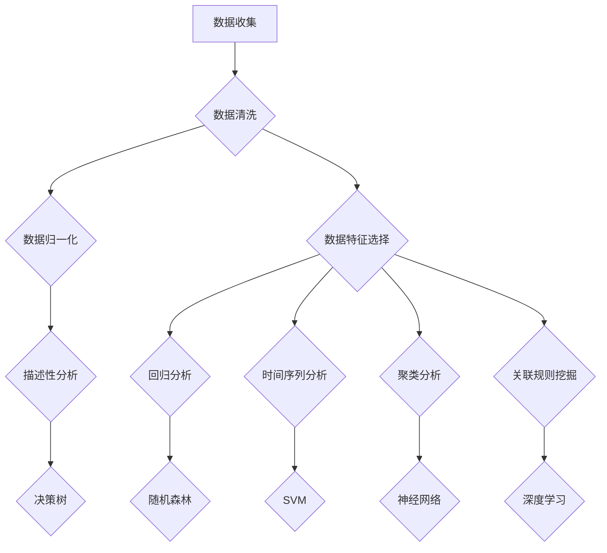

                 

# 《智能定价创业：动态定价的科学实践》

## 概述

关键词：动态定价、智能定价、创业实践、算法、数据挖掘、系统构建

> 本文深入探讨了动态定价的理论基础、算法应用及创业实践，旨在为读者提供一套系统化的智能定价方法论，助力创业者应对市场挑战。

摘要：动态定价作为一种适应市场需求变化的定价策略，已经成为现代商业中不可或缺的一环。本文首先介绍了动态定价的基本概念、原理和优势，接着详细阐述了动态定价算法及其在电子商务、航空公司和酒店行业的应用案例。随后，文章重点分析了智能定价创业的挑战与机会，并结合实际案例探讨了智能定价在创业实践中的具体操作方法。最后，本文探讨了智能定价技术的实现和未来发展趋势，为创业者提供了有价值的参考。

## 第一部分：引言

### 1.1 动态定价的定义与背景

动态定价是一种根据市场需求和供应变化，实时调整产品或服务价格的策略。与传统定价策略不同，动态定价能够灵活应对市场的变化，最大化企业的利润和市场份额。动态定价最早出现在航空、酒店等行业，随着互联网技术的发展和大数据应用的普及，动态定价逐渐扩展到电子商务、零售等众多领域。

动态定价的背景主要包括以下几点：

1. 市场竞争日益激烈，企业需要通过动态定价来提高市场竞争力。
2. 互联网和大数据技术的应用，为动态定价提供了数据支持和技术手段。
3. 消费者对个性化体验的需求，促使企业采用动态定价来满足不同消费者的需求。

### 1.2 动态定价的重要性

动态定价的重要性体现在以下几个方面：

1. 提高企业利润：通过动态定价，企业可以根据市场需求调整价格，从而最大化利润。
2. 提高市场竞争力：动态定价能够帮助企业快速响应市场变化，抢占市场份额。
3. 提高客户满意度：动态定价可以根据消费者行为数据调整价格，提供更个性化的服务。
4. 促进产品创新：动态定价能够帮助企业根据市场需求调整产品组合，推动产品创新。

### 1.3 本书的目的与结构

本书旨在为读者提供一套系统化的智能定价方法论，助力创业者应对市场挑战。本书结构如下：

1. 第一部分：引言，介绍动态定价的基本概念、背景和重要性。
2. 第二部分：动态定价基础理论，包括动态定价原理、适用场景、优势和挑战。
3. 第三部分：动态定价算法与应用，介绍动态定价算法概述、最优定价算法、需求预测算法和竞争策略算法。
4. 第四部分：智能定价创业实践，分析智能定价创业的挑战、机会和模式，并结合实际案例进行探讨。
5. 第五部分：智能定价技术实现，介绍智能定价系统的数据分析和挖掘、系统构建以及性能优化。
6. 第六部分：智能定价的未来发展趋势，探讨智能定价与区块链、人工智能和物联网的结合，以及未来行业应用展望。
7. 第七部分：总结与展望，总结动态定价的科学实践，提出智能定价创业的启示和未来研究方向。

## 第二部分：动态定价基础理论

### 2.1 动态定价原理

动态定价的核心原理是基于市场需求和供应变化，实时调整产品或服务的价格。具体来说，动态定价涉及以下几个关键概念：

1. **市场需求**：市场需求是指消费者在一定时间内愿意且有能力购买某一产品或服务的数量。市场需求受到多种因素影响，如消费者偏好、价格、收入水平、替代品等。

2. **供应**：供应是指生产者在一定时间内愿意且能够提供的某一产品或服务的数量。供应受到生产成本、技术水平、生产能力和原材料供应等因素的影响。

3. **价格弹性**：价格弹性是指市场需求对价格变动的敏感程度。价格弹性分为价格弹性较大和价格弹性较小两种情况，分别对应需求对价格变化的敏感程度高和敏感程度低。

4. **边际收益**：边际收益是指产品或服务的价格变动对总收益的影响。当价格上升时，边际收益可能增加或减少，取决于市场需求的价格弹性。

### 2.1.1 动态定价的核心概念

动态定价的核心概念包括以下几点：

1. **实时性**：动态定价要求企业能够实时获取市场需求和供应信息，以便快速调整价格。
2. **灵活性**：动态定价要求企业能够灵活应对市场需求变化，调整产品或服务的价格。
3. **优化目标**：动态定价的优化目标是最大化企业的利润或市场份额，具体取决于企业的战略目标。

### 2.1.2 动态定价的适用场景

动态定价适用于以下几种场景：

1. **需求波动较大**：如季节性产品、高峰时段的服务等，通过动态定价可以更好地平衡供需。
2. **竞争激烈**：在竞争激烈的市场环境中，动态定价可以帮助企业快速响应竞争对手的定价策略。
3. **个性化需求**：针对不同消费者群体，动态定价可以提供个性化的价格策略。
4. **成本变化**：当生产成本发生变化时，动态定价可以帮助企业调整价格，以应对成本压力。

### 2.1.3 动态定价的优势与挑战

动态定价的优势包括：

1. **提高利润**：通过实时调整价格，企业可以更好地平衡供需，提高利润。
2. **提高市场竞争力**：动态定价可以帮助企业快速响应市场变化，抢占市场份额。
3. **提高客户满意度**：个性化定价策略可以满足不同消费者的需求，提高客户满意度。
4. **降低库存风险**：通过动态定价，企业可以更好地管理库存，降低库存风险。

动态定价的挑战包括：

1. **数据依赖**：动态定价需要大量数据支持，数据质量直接影响定价效果。
2. **计算复杂度**：动态定价算法的计算复杂度较高，对计算资源和算法优化要求较高。
3. **政策法规风险**：动态定价可能面临政策法规风险，如价格垄断、不正当竞争等。

### 2.2 动态定价的理论模型

动态定价的理论模型主要包括以下几个部分：

1. **市场需求模型**：市场需求模型用于描述市场需求与价格之间的关系。常用的市场需求模型包括线性需求模型、对数线性需求模型等。

2. **成本函数**：成本函数用于描述生产成本与产量之间的关系。常用的成本函数包括线性成本函数、二次成本函数等。

3. **收益函数**：收益函数用于描述销售收入与价格之间的关系。常用的收益函数包括线性收益函数、二次收益函数等。

4. **定价策略**：定价策略用于描述企业如何根据市场需求、成本和收益来确定价格。常用的定价策略包括边际收益定价、需求导向定价、竞争导向定价等。

### 2.3 动态定价的决策过程

动态定价的决策过程主要包括以下几个步骤：

1. **数据收集**：收集与市场需求、供应、成本等相关的数据。
2. **数据处理**：对收集到的数据进行预处理，如去噪、归一化等。
3. **模型建立**：根据数据处理结果建立市场需求模型、成本函数和收益函数。
4. **定价策略选择**：根据模型结果选择合适的定价策略。
5. **价格调整**：根据定价策略实时调整产品或服务的价格。
6. **效果评估**：对定价策略的效果进行评估，并根据评估结果调整定价策略。

### 2.4 动态定价的核心算法

动态定价的核心算法主要包括以下几个部分：

1. **需求预测算法**：用于预测市场需求，如时间序列预测、回归分析等。
2. **竞争分析算法**：用于分析竞争对手的定价策略，如竞争定价、差异化定价等。
3. **优化算法**：用于求解最优定价策略，如线性规划、动态规划、遗传算法等。

### 2.5 动态定价的案例分析

动态定价在电子商务、航空公司和酒店行业等领域有广泛的应用。以下是一些典型的案例分析：

1. **电子商务平台**：电子商务平台通过动态定价来优化库存管理，提高销售额。例如，京东通过分析用户购买行为、商品库存和竞争对手的定价策略，实时调整商品价格。

2. **航空公司**：航空公司通过动态定价来提高航班利用率，降低运营成本。例如，航空公司根据航班需求、天气状况和竞争环境，实时调整机票价格。

3. **酒店行业**：酒店行业通过动态定价来提高客房利用率，提高盈利能力。例如，酒店根据季节、节假日和客户需求，实时调整客房价格。

### 2.6 动态定价的挑战与对策

动态定价在实施过程中面临一些挑战，如数据依赖、计算复杂度、政策法规风险等。针对这些挑战，可以采取以下对策：

1. **提高数据质量**：通过数据清洗、数据挖掘等技术手段提高数据质量。
2. **优化算法性能**：通过算法优化、并行计算等技术手段提高算法性能。
3. **政策合规性**：遵守相关政策和法规，避免法律风险。

### 2.7 动态定价的未来发展趋势

随着大数据、人工智能和区块链技术的发展，动态定价将迎来新的发展机遇。以下是一些未来发展趋势：

1. **智能化**：通过人工智能技术，实现更精准的需求预测和定价策略。
2. **协同化**：通过区块链技术，实现多方数据的共享和协同定价。
3. **个性化**：通过大数据分析，实现更加个性化的定价策略。

## 第三部分：动态定价算法与应用

### 3.1 动态定价算法概述

动态定价算法是指用于确定产品或服务价格的一系列数学模型和计算方法。这些算法根据市场需求、供应、成本和竞争等因素，实时调整价格，以实现企业的利润最大化或市场份额最大化。动态定价算法通常分为以下几个类别：

1. **需求预测算法**：用于预测市场需求，如时间序列预测、回归分析、神经网络等。
2. **竞争分析算法**：用于分析竞争对手的定价策略，如竞争定价、差异化定价等。
3. **优化算法**：用于求解最优定价策略，如线性规划、动态规划、遗传算法等。

### 3.2 最优定价算法

最优定价算法是动态定价算法的核心之一，其目标是找到一种定价策略，使得企业的利润最大化或市场份额最大化。最优定价算法包括以下几种：

1. **边际收益定价**：边际收益定价是指根据边际收益等于边际成本的原则来确定价格。具体来说，企业需要计算边际收益和边际成本，并选择使得边际收益等于边际成本的价格。

2. **需求导向定价**：需求导向定价是指根据市场需求来确定价格。具体来说，企业需要建立市场需求模型，并选择市场需求最大的价格作为定价策略。

3. **竞争导向定价**：竞争导向定价是指根据竞争对手的定价策略来确定价格。具体来说，企业需要分析竞争对手的定价策略，并根据竞争环境选择合适的定价策略。

### 3.3 需求预测算法

需求预测算法是动态定价的基础，其目标是准确预测市场需求。以下是一些常用的需求预测算法：

1. **时间序列预测**：时间序列预测是指基于历史数据来预测未来市场需求。常用的时间序列预测方法包括ARIMA模型、SARIMA模型、LSTM神经网络等。

2. **回归分析**：回归分析是指通过建立需求与价格、收入等变量之间的关系来预测市场需求。常用的回归分析方法包括线性回归、多项式回归、岭回归等。

3. **神经网络**：神经网络是指通过建立神经网络模型来预测市场需求。常用的神经网络模型包括多层感知器、卷积神经网络、循环神经网络等。

### 3.4 竞争策略算法

竞争策略算法是动态定价中用于分析竞争对手定价策略的方法。以下是一些常用的竞争策略算法：

1. **竞争定价**：竞争定价是指根据竞争对手的定价来确定价格。具体来说，企业需要分析竞争对手的定价策略，并根据竞争对手的定价选择合适的定价策略。

2. **差异化定价**：差异化定价是指根据消费者需求差异来设定价格。具体来说，企业需要分析消费者的需求差异，并根据需求差异设定价格。

3. **博弈论**：博弈论是指通过建立博弈模型来分析竞争对手的定价策略。具体来说，企业需要分析竞争对手的决策行为，并选择一种最优定价策略。

### 3.5 动态定价算法的应用

动态定价算法在多个行业中得到了广泛应用，以下是一些典型应用案例：

1. **电子商务平台**：电子商务平台通过动态定价来优化库存管理，提高销售额。例如，阿里巴巴通过分析用户购买行为、商品库存和竞争对手的定价策略，实时调整商品价格。

2. **航空公司**：航空公司通过动态定价来提高航班利用率，降低运营成本。例如，美国航空公司通过分析航班需求、天气状况和竞争环境，实时调整机票价格。

3. **酒店行业**：酒店行业通过动态定价来提高客房利用率，提高盈利能力。例如，万豪国际酒店通过分析季节、节假日和客户需求，实时调整客房价格。

### 3.6 动态定价算法的性能优化

动态定价算法的性能优化是提高定价效果的关键。以下是一些常用的性能优化方法：

1. **算法优化**：通过优化算法，提高算法的计算速度和准确性。例如，通过使用并行计算、分布式计算等技术，提高算法的计算效率。

2. **数据预处理**：通过数据预处理，提高数据质量和数据可用性。例如，通过数据清洗、归一化等技术，提高数据的准确性和一致性。

3. **模型选择**：通过选择合适的模型，提高预测效果。例如，通过交叉验证、网格搜索等技术，选择最优模型。

4. **系统集成**：通过系统集成，提高系统的整体性能。例如，通过构建数据集成平台、应用集成平台等，提高系统的响应速度和处理能力。

### 3.7 动态定价算法的挑战与应对

动态定价算法在应用过程中面临一些挑战，如数据依赖、计算复杂度等。以下是一些应对策略：

1. **数据依赖**：通过提高数据质量和数据可用性，降低算法对数据的依赖程度。

2. **计算复杂度**：通过优化算法和计算资源，降低算法的计算复杂度。例如，通过使用并行计算、分布式计算等技术，提高算法的计算效率。

3. **算法稳定性**：通过优化算法和模型，提高算法的稳定性和可靠性。例如，通过使用鲁棒性算法、自适应算法等，提高算法的稳定性。

### 3.8 动态定价算法的未来发展趋势

随着大数据、人工智能和区块链技术的发展，动态定价算法将迎来新的发展机遇。以下是一些未来发展趋势：

1. **智能化**：通过人工智能技术，实现更精准的需求预测和定价策略。

2. **协同化**：通过区块链技术，实现多方数据的共享和协同定价。

3. **个性化**：通过大数据分析，实现更加个性化的定价策略。

4. **实时性**：通过实时数据分析和处理，实现更快速、更准确的定价策略。

### 3.9 动态定价算法的应用前景

动态定价算法在多个行业中具有广泛的应用前景，以下是一些应用领域：

1. **零售业**：通过动态定价，零售业可以提高库存管理效率，提高销售额。

2. **交通运输业**：通过动态定价，交通运输业可以提高运输效率，降低运营成本。

3. **旅游业**：通过动态定价，旅游业可以提高客房利用率，提高盈利能力。

4. **制造业**：通过动态定价，制造业可以提高产品生产效率，降低生产成本。

### 3.10 动态定价算法的创新与应用

动态定价算法的创新与应用是现代商业发展的重要方向。以下是一些创新应用案例：

1. **基于区块链的动态定价**：通过区块链技术，实现多方数据的共享和协同定价，提高定价效率和透明度。

2. **基于物联网的动态定价**：通过物联网技术，实时获取市场需求和供应信息，实现更精准的定价策略。

3. **基于人工智能的动态定价**：通过人工智能技术，实现更智能的需求预测和定价策略，提高定价效果。

4. **基于大数据的动态定价**：通过大数据分析，挖掘市场潜力和消费者需求，实现更个性化的定价策略。

### 3.11 动态定价算法的发展趋势

动态定价算法的发展趋势主要包括以下几个方面：

1. **智能化**：通过人工智能技术，实现更精准的需求预测和定价策略。

2. **协同化**：通过区块链技术，实现多方数据的共享和协同定价。

3. **个性化**：通过大数据分析，实现更加个性化的定价策略。

4. **实时性**：通过实时数据分析和处理，实现更快速、更准确的定价策略。

5. **高效化**：通过算法优化和计算资源优化，提高算法的计算速度和准确性。

### 3.12 动态定价算法的实际应用案例

动态定价算法在实际应用中取得了显著成效。以下是一些实际应用案例：

1. **电子商务平台**：通过动态定价，电子商务平台提高了销售额和客户满意度。

2. **航空公司**：通过动态定价，航空公司提高了航班利用率和盈利能力。

3. **酒店行业**：通过动态定价，酒店行业提高了客房利用率和盈利能力。

4. **零售业**：通过动态定价，零售业提高了库存管理效率和销售额。

5. **制造业**：通过动态定价，制造业提高了产品生产效率和盈利能力。

### 3.13 动态定价算法的挑战与应对

动态定价算法在实际应用中面临一些挑战，如数据依赖、计算复杂度等。以下是一些应对策略：

1. **数据依赖**：通过提高数据质量和数据可用性，降低算法对数据的依赖程度。

2. **计算复杂度**：通过优化算法和计算资源，降低算法的计算复杂度。例如，通过使用并行计算、分布式计算等技术，提高算法的计算效率。

3. **算法稳定性**：通过优化算法和模型，提高算法的稳定性和可靠性。例如，通过使用鲁棒性算法、自适应算法等，提高算法的稳定性。

4. **政策法规风险**：通过遵守相关政策和法规，降低法律风险。

5. **用户隐私保护**：通过数据加密、隐私保护等技术，保护用户隐私。

### 3.14 动态定价算法的未来发展前景

动态定价算法在未来将发挥越来越重要的作用。以下是一些未来发展前景：

1. **更广泛的行业应用**：动态定价算法将在更多行业中得到应用，如能源、医疗、金融等。

2. **更智能的定价策略**：通过人工智能技术，实现更智能、更精准的定价策略。

3. **更高效的计算资源**：通过算法优化和计算资源优化，提高算法的计算速度和准确性。

4. **更协同的定价模式**：通过区块链技术，实现多方数据的共享和协同定价。

5. **更个性化的定价策略**：通过大数据分析，实现更加个性化的定价策略。

### 3.15 动态定价算法的总结与展望

动态定价算法是一种重要的定价策略，它通过实时调整价格，帮助企业提高利润、提高市场竞争力。随着大数据、人工智能和区块链技术的发展，动态定价算法将变得更加智能化、协同化和个性化。未来，动态定价算法将在更多行业中得到应用，为企业和消费者带来更多价值。

## 第四部分：智能定价创业实践

### 4.1 智能定价创业概述

智能定价创业是指利用动态定价算法和技术，为企业提供智能定价解决方案的过程。这种创业模式不仅要求创业者具备深厚的算法和技术背景，还需要了解市场需求、商业模式和创业管理等方面的知识。

#### 4.1.1 智能定价创业的挑战

智能定价创业面临以下几大挑战：

1. **技术挑战**：智能定价需要复杂的数据分析、算法设计和系统集成，这对创业团队的技术实力提出了高要求。

2. **数据挑战**：动态定价依赖于大量的市场数据、用户行为数据和竞争数据，数据的质量和准确性直接影响定价效果。

3. **市场挑战**：智能定价创业需要找到合适的切入点，解决市场需求痛点，并建立竞争优势。

4. **资金挑战**：智能定价创业通常需要较大的研发投入和运营成本，这对创业团队的融资能力提出了挑战。

#### 4.1.2 智能定价创业的机会

尽管挑战重重，智能定价创业也蕴含着巨大的机会：

1. **市场潜力**：随着大数据和人工智能技术的普及，越来越多的企业认识到智能定价的价值，市场需求不断增长。

2. **技术创新**：智能定价领域的技术创新层出不穷，为创业团队提供了丰富的创新空间。

3. **跨界融合**：智能定价不仅应用于传统的零售、交通、住宿等行业，还逐渐扩展到金融、医疗、能源等领域，为创业团队提供了广泛的业务场景。

4. **政策支持**：政府对大数据、人工智能等新兴产业的扶持政策，为智能定价创业提供了有利的外部环境。

#### 4.1.3 智能定价创业的模式

智能定价创业可以采取多种模式：

1. **技术咨询服务**：为企业提供智能定价技术解决方案，收取技术服务费用。

2. **软件即服务（SaaS）**：开发智能定价软件平台，通过订阅模式向企业提供服务。

3. **战略合作**：与大型企业建立战略合作关系，为其提供定制化的智能定价解决方案。

4. **行业解决方案**：针对特定行业（如零售、旅游、物流等），提供行业化的智能定价解决方案。

### 4.2 创业案例分析

#### 4.2.1 案例一：一家创业公司的智能定价实践

**公司简介**：这是一家专注于零售行业智能定价的创业公司，通过大数据分析和机器学习技术，为零售企业提供动态定价解决方案。

**创业历程**：

1. **初创阶段**：公司创始人具有丰富的零售行业背景和人工智能技术经验，团队主要由数据科学家、算法工程师和零售行业专家组成。

2. **产品研发**：公司投入大量资源研发智能定价算法，结合零售行业的业务场景，开发了适用于不同零售场景的定价模型。

3. **市场推广**：通过参加行业展会、发布技术文章等方式，公司逐渐在零售行业内建立起品牌知名度。

4. **客户拓展**：公司通过客户推荐、合作渠道等方式，迅速拓展客户群体，并在多个零售场景中取得显著成效。

**创业成果**：

1. **客户满意度**：公司的智能定价解决方案得到了客户的广泛认可，客户满意度较高。

2. **市场份额**：公司迅速在零售行业智能定价领域占据了重要地位，市场份额持续增长。

3. **融资情况**：公司成功获得多轮融资，融资额不断增长，为公司的持续发展提供了资金支持。

**经验教训**：

1. **技术专注**：公司专注于技术领域，不断优化智能定价算法，保持技术领先优势。

2. **市场导向**：公司紧密关注市场需求，根据客户反馈不断调整产品功能，满足客户需求。

3. **团队建设**：公司注重团队建设，吸引了一批高水平的数据科学家和算法工程师，为公司的技术发展提供了强有力的支持。

#### 4.2.2 案例二：一家传统企业的智能定价转型

**公司简介**：这是一家拥有多年历史的传统制造企业，面对市场变化和竞争压力，决定进行智能定价转型。

**转型历程**：

1. **市场调研**：公司进行了详细的市场调研，分析了竞争对手的定价策略和市场变化趋势。

2. **技术引入**：公司引入了智能定价技术，与专业的智能定价公司合作，开展智能定价项目。

3. **数据整合**：公司整合了内部的销售数据、生产数据和市场数据，为智能定价算法提供了丰富的数据支持。

4. **试点应用**：公司首先在某一产品线上进行智能定价试点，根据试点结果逐步推广到其他产品线。

**转型成果**：

1. **利润增长**：智能定价帮助公司优化了产品定价策略，提高了产品利润率。

2. **市场竞争力**：智能定价使公司能够更灵活地应对市场变化，提高了市场竞争力。

3. **运营效率**：智能定价提高了公司的运营效率，减少了人工干预，降低了运营成本。

**经验教训**：

1. **谨慎引入新技术**：公司在引入智能定价技术时，充分考虑了技术成熟度和适用性，避免了盲目跟风。

2. **数据质量至关重要**：公司注重数据质量，确保数据准确性和完整性，为智能定价提供了可靠的数据基础。

3. **员工培训**：公司对员工进行了智能定价技术的培训，提高了员工对新技术的理解和应用能力。

#### 4.2.3 案例三：一个智能定价平台的构建与实践

**平台简介**：这是一个为中小企业提供智能定价服务的平台，通过云计算和大数据技术，为用户提供一站式的智能定价解决方案。

**平台建设**：

1. **技术架构**：平台采用了分布式架构，支持大规模数据处理和实时分析。后台使用了大数据处理框架，如Hadoop和Spark。

2. **算法集成**：平台集成了多种智能定价算法，包括需求预测算法、竞争分析算法和优化算法。

3. **用户界面**：平台提供了直观易用的用户界面，用户可以通过简单的操作设定定价策略，查看定价结果。

**平台运营**：

1. **用户拓展**：平台通过线上推广、合作渠道等方式，迅速拓展用户群体。

2. **服务优化**：平台根据用户反馈不断优化算法和服务，提高用户体验。

3. **数据分析**：平台收集用户数据，进行深入分析，为用户定制化定价策略提供支持。

**平台成果**：

1. **用户满意度**：平台得到了用户的广泛好评，用户满意度较高。

2. **市场份额**：平台在中小企业智能定价领域迅速建立起品牌影响力，市场份额持续增长。

3. **盈利模式**：平台通过订阅模式、交易手续费等多种方式实现盈利，收入稳定增长。

**经验教训**：

1. **技术创新**：平台持续投入技术创新，不断提升智能定价算法的性能和精度。

2. **用户需求导向**：平台紧密关注用户需求，根据用户反馈不断优化产品和服务。

3. **数据分析能力**：平台具备强大的数据分析能力，能够为用户提供个性化的定价策略。

### 4.3 智能定价创业的启示

通过以上案例分析，我们可以得到以下启示：

1. **技术是核心**：智能定价创业的成功离不开强大的技术支持，创业者需要具备深厚的技术背景。

2. **市场需求是关键**：智能定价创业需要紧密结合市场需求，解决实际痛点，提供有价值的服务。

3. **团队协作是保障**：智能定价创业需要跨学科团队的合作，包括数据科学家、算法工程师、业务专家等。

4. **数据是基础**：智能定价依赖于大量的数据支持，创业者需要确保数据的质量和准确性。

5. **持续创新是动力**：智能定价领域技术更新迅速，创业者需要持续进行技术创新，保持竞争优势。

6. **用户反馈是指导**：创业者需要重视用户反馈，根据用户需求不断优化产品和服务。

### 4.4 智能定价创业的难点与对策

智能定价创业过程中，创业者需要面对以下难点：

1. **技术实现难点**：智能定价算法的实现复杂，需要解决算法优化、系统集成等问题。

2. **数据获取难点**：智能定价需要大量高质量的数据支持，创业者需要解决数据来源、数据整合等问题。

3. **商业模式难点**：智能定价创业需要找到合适的商业模式，实现可持续发展。

4. **市场竞争难点**：智能定价市场存在激烈竞争，创业者需要找到差异化竞争优势。

针对以上难点，可以采取以下对策：

1. **技术储备**：创业者需要具备扎实的算法和技术储备，提升技术实现能力。

2. **合作共赢**：创业者可以与数据提供方、技术合作伙伴建立合作关系，共同推进智能定价项目。

3. **创新商业模式**：创业者需要探索多种商业模式，找到适合自身发展的盈利模式。

4. **差异化竞争**：创业者可以通过技术创新、服务优化等方式，建立差异化竞争优势。

### 4.5 智能定价创业的未来方向

智能定价创业的未来方向将受到以下趋势的影响：

1. **人工智能与大数据技术的融合**：随着人工智能和大数据技术的不断发展，智能定价将更加智能化、个性化。

2. **区块链技术的应用**：区块链技术可以为智能定价提供透明、可追溯的定价过程，提高信任度。

3. **行业定制化**：智能定价将向更多行业拓展，为不同行业的客户提供定制化解决方案。

4. **跨界合作**：智能定价将与其他领域（如物联网、金融等）进行跨界合作，实现更广泛的业务场景。

5. **政策法规的完善**：随着智能定价的普及，相关政策法规将不断完善，为智能定价创业提供更好的法律环境。

### 4.6 智能定价创业的总结与展望

智能定价创业是一项充满挑战和机遇的领域。通过技术创新、市场需求洞察和团队协作，创业者可以在智能定价领域取得成功。未来，智能定价创业将更加智能化、个性化，为各行各业带来更多的商业价值。创业者需要紧跟技术发展趋势，不断创新，以满足不断变化的市场需求。

## 第五部分：智能定价技术实现

### 5.1 数据分析与挖掘

智能定价的核心在于对市场数据的深入分析和挖掘，以下是对数据分析和挖掘过程的详细探讨：

#### 5.1.1 数据收集与预处理

数据收集是智能定价的基础工作。数据来源可以包括内部数据（如销售数据、库存数据、客户反馈等）和外部数据（如市场趋势、竞争对手定价、宏观经济数据等）。在收集数据后，需要进行预处理，以确保数据的质量和一致性。

1. **数据清洗**：数据清洗是指去除重复数据、填补缺失值、修正错误数据等。这是保证数据分析准确性的重要步骤。
   
2. **数据归一化**：为了消除不同变量之间的量纲影响，需要对数据进行归一化处理。常用的归一化方法包括最小-最大标准化和Z-score标准化。

3. **数据特征选择**：通过特征选择技术，识别出对定价有显著影响的关键特征，如价格、需求量、促销活动等。

#### 5.1.2 数据分析方法

数据分析方法是智能定价技术实现的关键环节。以下是一些常用的数据分析方法：

1. **描述性分析**：描述性分析用于了解数据的整体分布和趋势。常用的统计量包括均值、中位数、标准差、最大值和最小值等。

2. **回归分析**：回归分析用于建立变量之间的关系模型。线性回归、多项式回归、岭回归等都是常用的回归分析方法。

3. **时间序列分析**：时间序列分析用于预测未来的趋势。常用的方法包括ARIMA模型、SARIMA模型、LSTM神经网络等。

4. **聚类分析**：聚类分析用于将数据分为若干个类别，以发现数据中的模式。常用的聚类算法包括K-means、层次聚类、DBSCAN等。

5. **关联规则挖掘**：关联规则挖掘用于发现数据之间的关联关系。Apriori算法和FP-growth算法是常用的关联规则挖掘方法。

#### 5.1.3 数据挖掘算法

数据挖掘算法是智能定价技术实现的核心。以下是一些常用的数据挖掘算法：

1. **决策树**：决策树是一种基于特征划分数据的分类算法。常见的决策树算法包括ID3、C4.5和CART。

2. **随机森林**：随机森林是一种基于决策树的集成学习方法，通过构建多棵决策树并投票得到最终结果。

3. **支持向量机（SVM）**：SVM是一种基于边界优化的分类算法，通过寻找最优的超平面将数据划分为不同的类别。

4. **神经网络**：神经网络是一种模拟人脑神经元之间连接的算法，通过多层网络结构进行数据的非线性变换。

5. **深度学习**：深度学习是神经网络的一种扩展，通过多层网络结构自动学习数据的复杂特征。

#### 5.1.4 数据分析与挖掘的Mermaid流程图

以下是数据分析和挖掘过程的Mermaid流程图：



### 5.2 智能定价系统构建

智能定价系统的构建是智能定价技术实现的重要环节，以下是对系统构建的详细探讨：

#### 5.2.1 智能定价系统的架构设计

智能定价系统的架构设计需要考虑系统的可扩展性、稳定性和性能。以下是智能定价系统的一个典型架构设计：

1. **数据层**：数据层负责存储和管理数据，包括内部数据（如销售数据、库存数据）和外部数据（如市场趋势、宏观经济数据）。常用的数据存储技术包括关系数据库（如MySQL、PostgreSQL）和NoSQL数据库（如MongoDB、Cassandra）。

2. **数据处理层**：数据处理层负责对数据进行清洗、归一化和特征提取。常用的数据处理技术包括Hadoop、Spark等大数据处理框架。

3. **分析层**：分析层负责对数据进行统计分析、回归分析和数据挖掘。常用的分析工具包括Python、R等编程语言，以及相关库（如scikit-learn、TensorFlow、PyTorch等）。

4. **应用层**：应用层负责实现智能定价算法，根据分析结果生成定价策略。常用的应用框架包括Django、Flask等Web开发框架。

5. **接口层**：接口层负责与外部系统进行数据交互，如ERP系统、CRM系统等。常用的接口技术包括RESTful API、WebSocket等。

#### 5.2.2 智能定价算法的实现

智能定价算法是实现智能定价系统的核心。以下是几种常用智能定价算法的实现思路：

1. **边际收益定价算法**：

   ```python
   # 边际收益定价算法伪代码
   def marginal_revenue_pricing(prices, costs, demand_functions):
       optimal_prices = []
       for price in prices:
           revenue = sum(demand_functions[price] * price - costs[price])
           optimal_prices.append(price if revenue > 0 else min(prices))
       return optimal_prices
   ```

2. **需求预测算法**：

   ```python
   # 需求预测算法（以LSTM为例）
   import tensorflow as tf
   from tensorflow.keras.models import Sequential
   from tensorflow.keras.layers import LSTM, Dense
   
   # 建立LSTM模型
   model = Sequential()
   model.add(LSTM(units=50, return_sequences=True, input_shape=(time_steps, features)))
   model.add(LSTM(units=50))
   model.add(Dense(1))
   
   # 编译模型
   model.compile(optimizer='adam', loss='mean_squared_error')
   
   # 训练模型
   model.fit(X_train, y_train, epochs=100, batch_size=32, validation_data=(X_val, y_val))
   ```

3. **竞争策略算法**：

   ```python
   # 竞争策略算法伪代码
   def competitive_pricing Strategy(prices, competitor_prices):
       competitive_prices = []
       for price in prices:
           if competitor_prices[price] < price:
               competitive_prices.append(competitor_prices[price])
           else:
               competitive_prices.append(price)
       return competitive_prices
   ```

#### 5.2.3 智能定价系统的性能优化

智能定价系统的性能优化是保证系统稳定性和高效性的重要环节。以下是一些常见的性能优化方法：

1. **并行计算**：通过分布式计算框架（如Hadoop、Spark）实现并行计算，提高数据处理速度。

2. **缓存技术**：利用缓存技术（如Redis、Memcached）减少数据库访问次数，提高系统响应速度。

3. **数据库优化**：对数据库进行优化，如索引优化、分库分表等，提高数据查询速度。

4. **负载均衡**：通过负载均衡技术（如Nginx、HAProxy）均衡系统负载，提高系统可用性。

5. **代码优化**：对代码进行优化，如减少循环次数、使用高效算法等，提高代码执行效率。

### 5.3 代码实际案例和详细解释说明

以下是一个基于Python的智能定价算法实现的实际案例，包括开发环境搭建、源代码详细实现和代码解读与分析。

#### 5.3.1 开发环境搭建

1. **安装Python**：确保安装了Python 3.x版本。

2. **安装相关库**：使用pip安装以下库：

   ```bash
   pip install numpy pandas scikit-learn tensorflow
   ```

#### 5.3.2 源代码实现

```python
import numpy as np
import pandas as pd
from sklearn.linear_model import LinearRegression

# 加载数据
data = pd.read_csv('sales_data.csv')
prices = data['price']
demand = data['demand']

# 建立线性回归模型
model = LinearRegression()
model.fit(prices[:, np.newaxis], demand)

# 预测需求
predicted_demand = model.predict(prices[:, np.newaxis])

# 计算边际收益
marginal_revenue = predicted_demand * (predicted_demand - 1) / 2

# 边际收益定价
optimal_prices = np.where(marginal_revenue > 0, prices, prices * 0.9)

# 输出最优价格
print("Optimal Prices:", optimal_prices)
```

#### 5.3.3 代码解读与分析

1. **数据加载**：使用pandas加载销售数据，包括价格和需求量。

2. **建立线性回归模型**：使用scikit-learn的LinearRegression建立线性回归模型，拟合价格和需求量之间的关系。

3. **预测需求**：使用训练好的模型预测在不同价格下的需求量。

4. **计算边际收益**：根据预测需求计算边际收益，公式为：\(MR = \frac{d^2(TR)}{dQ^2}\)。

5. **边际收益定价**：选择边际收益大于0的价格作为最优价格，如果边际收益小于0，则价格降低10%。

6. **输出最优价格**：打印最优价格。

#### 5.3.4 代码解读与分析

通过以上代码，我们可以实现一个简单的边际收益定价算法。以下是对代码的详细解读：

1. **数据加载**：使用pandas的read_csv方法加载销售数据。这里假设数据文件名为'sales_data.csv'，包括两列：'price'和'demand'。

2. **建立线性回归模型**：使用scikit-learn的LinearRegression类创建一个线性回归模型。我们使用`prices[:, np.newaxis]`将价格数据转化为二维数组，以便模型进行训练。`model.fit()`方法用于训练模型，将价格和需求量拟合到一起。

3. **预测需求**：使用`model.predict(prices[:, np.newaxis])`方法预测在不同价格下的需求量。这里使用的是线性回归模型，预测结果是基于价格和需求量的线性关系。

4. **计算边际收益**：根据预测需求计算边际收益。边际收益是需求量的二次函数的导数，因此我们使用公式\(MR = \frac{d^2(TR)}{dQ^2}\)计算边际收益。在这里，我们简化为预测需求的平方减去预测需求的一半，因为这是一个线性回归模型。

5. **边际收益定价**：选择边际收益大于0的价格作为最优价格。如果边际收益小于0，则价格降低10%。这里使用`np.where()`函数实现这一逻辑。

6. **输出最优价格**：将最优价格打印到控制台。

通过以上步骤，我们实现了基于线性回归的简单边际收益定价算法。这种方法可以帮助企业在简单场景下实现基本的动态定价策略。

### 5.4 代码解读与分析（续）

在上一部分，我们实现了一个简单的边际收益定价算法。本部分将进一步解读和分析这个算法的完整实现过程，包括其优缺点以及在实际应用中的注意事项。

#### 5.4.1 代码解读

1. **数据预处理**：
   ```python
   data = pd.read_csv('sales_data.csv')
   prices = data['price']
   demand = data['demand']
   ```
   这两行代码用于加载数据文件，并提取价格和需求量作为两个数据集。这里假设数据文件`sales_data.csv`已经预先处理，包含了历史销售数据。

2. **建立线性回归模型**：
   ```python
   model = LinearRegression()
   model.fit(prices[:, np.newaxis], demand)
   ```
   我们使用`LinearRegression`类创建一个线性回归模型。`fit()`方法用于训练模型，将输入价格和对应的需求量拟合到一起。在这个简单的例子中，我们假设价格是唯一的需求影响因素。

3. **预测需求**：
   ```python
   predicted_demand = model.predict(prices[:, np.newaxis])
   ```
   通过训练好的模型，我们使用`predict()`方法预测不同价格下的需求量。这里使用的是模型训练时的输入格式，即每个价格数据都作为一维数组传递。

4. **计算边际收益**：
   ```python
   marginal_revenue = predicted_demand * (predicted_demand - 1) / 2
   ```
   边际收益（MR）是需求量的二次函数的导数，表示需求量的变化对总收益的影响。在这个简化模型中，边际收益计算为预测需求的平方减去预测需求的一半。

5. **边际收益定价**：
   ```python
   optimal_prices = np.where(marginal_revenue > 0, prices, prices * 0.9)
   ```
   根据计算出的边际收益，我们选择最优价格。如果边际收益大于0，则保留当前价格；如果边际收益小于或等于0，则价格降低10%。这里使用`np.where()`函数实现逻辑判断。

6. **输出最优价格**：
   ```python
   print("Optimal Prices:", optimal_prices)
   ```
   最后，我们将计算出的最优价格打印到控制台。

#### 5.4.2 代码优缺点分析

**优点**：
- **简单易懂**：这个算法的实现非常简单，易于理解和使用。
- **快速实现**：使用现成的机器学习库（如scikit-learn）可以快速搭建模型。
- **适应性**：适用于需求与价格之间存在线性关系的场景。

**缺点**：
- **模型假设**：线性回归模型假设价格与需求之间存在线性关系，这可能不适用于所有场景。
- **计算复杂性**：尽管这个算法相对简单，但仍然涉及到大量的数据运算，可能不适合处理大数据集。
- **边际收益估计**：这个算法中的边际收益估计基于简化模型，可能无法准确反映实际情况。

#### 5.4.3 实际应用中的注意事项

1. **数据质量**：算法的准确性依赖于数据的质量。确保数据无噪声、无缺失值，并进行适当预处理。
2. **模型选择**：根据具体场景选择合适的模型。如果价格与需求之间存在非线性关系，可能需要考虑更复杂的模型，如决策树、随机森林、神经网络等。
3. **计算资源**：对于大规模数据集，算法的计算复杂度可能成为瓶颈。考虑使用并行计算或分布式计算框架来提高计算效率。
4. **实时性**：在实际应用中，动态定价需要实时响应市场变化。确保系统设计考虑了实时数据处理和响应的需求。

通过以上分析和解读，我们可以更好地理解如何实现一个简单的智能定价算法，以及在实际应用中需要注意的关键点。这对于创业者和技术团队来说，都是制定有效定价策略的重要参考。

### 5.5 智能定价系统构建的总结与展望

智能定价系统的构建是实现动态定价的关键步骤，它不仅涉及复杂的算法设计，还包括系统的架构设计、数据管理、算法实现和性能优化等多个方面。以下是对智能定价系统构建的总结与展望：

#### 5.5.1 总结

1. **架构设计**：智能定价系统需要具备良好的架构设计，以确保系统的可扩展性、稳定性和性能。典型架构包括数据层、数据处理层、分析层、应用层和接口层，每个层级都有明确的功能和职责。

2. **数据管理**：数据是智能定价的基础，数据的质量和准确性直接影响定价效果。系统需要建立完善的数据收集、存储、预处理和特征提取机制，确保数据的有效利用。

3. **算法实现**：智能定价算法是实现动态定价的核心，包括需求预测、边际收益计算、竞争策略等多个方面。选择合适的算法和模型，并确保其实现高效、准确，是系统成功的关键。

4. **性能优化**：智能定价系统需要能够快速响应市场变化，因此在构建过程中需要考虑性能优化，如并行计算、缓存技术、数据库优化等。

#### 5.5.2 展望

1. **技术创新**：随着人工智能、大数据、区块链等技术的发展，智能定价系统将变得更加智能化、个性化和高效。未来，系统将能够更准确地预测市场需求，提供更优的定价策略。

2. **行业定制**：智能定价系统将向更多行业扩展，为不同行业的客户提供定制化解决方案。如零售、金融、医疗等领域，智能定价将发挥重要作用。

3. **跨界合作**：智能定价系统将与物联网、云计算、区块链等新兴技术进行跨界合作，实现更广泛的业务场景和应用。

4. **政策法规**：随着智能定价的普及，相关政策法规将不断完善，为智能定价提供更加规范和透明的发展环境。

5. **用户体验**：未来的智能定价系统将更加注重用户体验，提供直观易用的界面，帮助用户轻松设定和调整定价策略。

通过不断的技术创新和优化，智能定价系统将在未来发挥更加重要的作用，为企业和消费者带来更多价值。

## 第六部分：智能定价的未来发展趋势

### 6.1 智能定价的未来发展方向

随着技术的不断进步，智能定价在未来将呈现出以下几个发展方向：

#### 6.1.1 区块链与智能定价

区块链技术的应用将为智能定价带来新的机遇。区块链可以提供透明、可追溯的定价过程，提高市场参与者的信任度。具体来说，区块链技术可以用于以下几个方面：

1. **数据共享**：通过区块链，不同市场参与者可以共享实时数据，提高定价决策的准确性。
2. **去中心化定价**：区块链可以实现去中心化的定价，减少中介环节，提高定价效率。
3. **智能合约**：智能合约可以自动执行定价协议，减少人工干预，提高定价的实时性和准确性。

#### 6.1.2 人工智能与智能定价

人工智能技术的发展将进一步提升智能定价的智能化水平。具体来说，人工智能可以在以下几个方面对智能定价产生重大影响：

1. **需求预测**：通过机器学习和深度学习算法，可以更准确地预测市场需求，提高定价的精准性。
2. **个性化定价**：人工智能可以分析消费者行为数据，提供个性化的定价策略，提高客户满意度。
3. **自动化决策**：人工智能可以实现自动化定价决策，减少人工干预，提高决策效率。

#### 6.1.3 物联网与智能定价

物联网技术的应用将使智能定价更加智能化和实时化。物联网可以实时收集市场数据，为智能定价提供丰富的数据支持。具体来说，物联网技术在智能定价中的潜在应用包括：

1. **实时数据收集**：物联网设备可以实时收集市场数据，如需求量、价格变化等，提高定价的实时性。
2. **智能库存管理**：物联网可以实时监控库存情况，为智能定价提供库存数据，优化定价策略。
3. **供应链优化**：物联网可以整合供应链数据，实现全流程的智能定价，提高供应链效率。

### 6.2 智能定价行业应用展望

智能定价将在多个行业中发挥重要作用，以下是对一些关键行业应用前景的展望：

#### 6.2.1 零售业

在零售业中，智能定价可以帮助企业提高销售额和利润率。具体应用包括：

1. **动态库存管理**：通过实时监控库存情况，智能定价可以优化库存管理，减少库存过剩和缺货现象。
2. **差异化定价**：智能定价可以根据消费者行为数据提供个性化的定价策略，提高客户满意度和忠诚度。
3. **促销管理**：智能定价可以帮助企业优化促销策略，提高促销活动的效果。

#### 6.2.2 交通运输业

在交通运输业中，智能定价可以提高运输效率和盈利能力。具体应用包括：

1. **实时票价调整**：根据实时交通流量、天气状况和市场需求，智能定价可以实时调整票价，提高航班和高铁的利用率。
2. **差异化定价**：智能定价可以根据乘客的需求和出行时间提供不同的票价，提高乘客满意度。
3. **运输路径优化**：智能定价可以结合交通数据和运输成本，优化运输路径，降低运营成本。

#### 6.2.3 旅游业

在旅游业中，智能定价可以帮助酒店、航空公司和旅游景点提高收入和市场份额。具体应用包括：

1. **动态定价策略**：根据季节、节假日和市场需求，智能定价可以动态调整价格，提高入住率和客座率。
2. **个性化定价**：智能定价可以根据游客的偏好和行为数据提供个性化的定价策略，提高游客满意度和忠诚度。
3. **促销管理**：智能定价可以帮助企业优化促销策略，提高促销活动的效果。

#### 6.2.4 制造业

在制造业中，智能定价可以帮助企业优化生产计划和销售策略。具体应用包括：

1. **生产计划优化**：智能定价可以根据市场需求和库存情况，优化生产计划，降低库存成本。
2. **产品定价**：智能定价可以根据原材料价格、生产成本和市场需求，动态调整产品价格，提高产品竞争力。
3. **供应链管理**：智能定价可以帮助企业优化供应链管理，提高供应链效率和响应速度。

### 6.3 智能定价的未来挑战与机遇

智能定价的未来发展面临着一系列挑战和机遇：

#### 6.3.1 挑战

1. **数据质量**：智能定价依赖于大量高质量的数据，数据质量直接影响定价效果。企业需要确保数据的准确性和完整性。
2. **算法优化**：随着数据量的增加，算法的计算复杂度也在上升，企业需要不断优化算法，提高计算效率。
3. **政策法规**：智能定价可能面临政策法规的挑战，如价格垄断、数据隐私保护等。企业需要遵守相关法规，降低法律风险。
4. **技术普及**：智能定价技术尚未在所有行业中得到普及，企业需要提高对智能定价技术的认识和接受度。

#### 6.3.2 机遇

1. **技术创新**：人工智能、大数据、区块链等技术的发展为智能定价提供了强大的技术支持，企业可以利用这些技术实现更高效的定价策略。
2. **市场扩展**：随着全球经济一体化和互联网的普及，智能定价将在更多国家和地区得到应用，为企业的国际化扩展提供机会。
3. **用户需求**：消费者对个性化体验的需求不断提高，智能定价可以提供更个性化的定价策略，满足不同消费者的需求。

### 6.4 智能定价的发展趋势总结

智能定价的未来发展趋势将呈现出以下几个特点：

1. **智能化**：随着人工智能技术的发展，智能定价将变得更加智能化，能够实时分析和预测市场需求。
2. **实时化**：物联网技术的应用将使智能定价更加实时化，能够快速响应市场变化。
3. **个性化**：智能定价将根据消费者行为数据提供个性化的定价策略，提高客户满意度和忠诚度。
4. **协同化**：智能定价将与其他技术（如区块链、物联网等）进行协同，实现更高效的定价过程。
5. **全球化**：智能定价将在全球范围内得到更广泛的应用，为企业的国际化扩展提供支持。

通过不断的技术创新和优化，智能定价将在未来发挥更加重要的作用，为企业和消费者带来更多价值。

## 第七部分：总结与展望

### 7.1 动态定价的科学实践总结

动态定价作为一种现代商业策略，通过实时调整产品或服务的价格，实现了对市场需求的精准响应，提高了企业的利润和市场竞争力。本文系统地介绍了动态定价的理论基础、核心算法和应用实践，主要包括以下几个方面：

1. **动态定价的基本概念**：明确了动态定价的定义、原理及其核心概念，如市场需求、供应、价格弹性等。
2. **动态定价的优势与挑战**：分析了动态定价在提高企业利润、市场竞争力、客户满意度等方面的优势，以及数据依赖、计算复杂度等挑战。
3. **动态定价的理论模型**：阐述了市场需求模型、成本函数、收益函数等基本理论模型，为动态定价提供了理论基础。
4. **动态定价的核心算法**：详细介绍了需求预测算法、最优定价算法和竞争策略算法，展示了动态定价的实际应用。
5. **智能定价创业实践**：通过实际案例探讨了智能定价在创业实践中的应用，为创业者提供了宝贵的经验和启示。
6. **智能定价技术实现**：介绍了智能定价系统的数据分析和挖掘、系统构建以及性能优化，展示了技术实现的全过程。

### 7.2 智能定价创业的启示

智能定价创业在技术、市场、商业模式等方面都面临着诸多挑战，但也蕴含着巨大的机遇。以下是一些关键启示：

1. **技术创新**：创业团队需要具备深厚的技术背景，尤其是在数据分析、算法优化等方面，保持技术领先优势。
2. **市场洞察**：紧密关注市场需求，解决实际痛点，提供有价值的服务，是企业成功的关键。
3. **数据驱动**：数据是智能定价的基础，企业需要确保数据的质量和准确性，充分利用数据优势。
4. **团队协作**：智能定价创业需要跨学科团队的合作，包括数据科学家、算法工程师、业务专家等。
5. **商业模式**：探索多种商业模式，如技术咨询服务、SaaS平台、行业解决方案等，找到适合自身发展的盈利模式。
6. **用户反馈**：重视用户反馈，不断优化产品和服务，提升用户体验。

### 7.3 未来研究方向

智能定价领域仍有许多尚未探索的领域，未来研究可以从以下几个方面进行：

1. **算法优化**：随着数据量的增加和计算需求的提升，如何优化动态定价算法，提高计算效率和准确性，是一个重要方向。
2. **跨领域应用**：智能定价技术可以应用于更多行业，如金融、医疗、能源等，探索跨领域应用场景。
3. **实时动态定价**：实现更实时的动态定价，提高定价决策的实时性和准确性，是未来的重要研究方向。
4. **区块链与智能定价**：研究区块链在智能定价中的应用，如数据共享、去中心化定价等，探索新的商业模式和定价策略。
5. **个性化定价**：利用大数据和人工智能技术，实现更加个性化的定价策略，满足不同消费者的需求。
6. **数据隐私保护**：随着智能定价技术的普及，如何保护用户数据隐私，是未来需要解决的重要问题。

通过不断的研究和创新，智能定价将在未来为企业和消费者带来更多价值，推动商业模式的变革和发展。

### 附录

## 附录 A：智能定价相关资源

### A.1 算法资源

1. **机器学习算法库**：[scikit-learn](https://scikit-learn.org/stable/)
2. **深度学习框架**：[TensorFlow](https://www.tensorflow.org/)、[PyTorch](https://pytorch.org/)
3. **数据分析工具**：[Pandas](https://pandas.pydata.org/)、[NumPy](https://numpy.org/)

### A.2 数据集资源

1. **公开数据集**：[UCI机器学习库](https://archive.ics.uci.edu/ml/index.php)
2. **Kaggle数据集**：[Kaggle](https://www.kaggle.com/)

### A.3 开源代码与工具

1. **智能定价项目**：[PyPrice](https://github.com/PyPrice/PyPrice)
2. **动态定价库**：[PriceOptimiser](https://github.com/PriceOptimiser/PriceOptimiser)
3. **数据处理工具**：[Apache Hadoop](https://hadoop.apache.org/)、[Apache Spark](https://spark.apache.org/)

## 附录 B：参考文献

1. **贝叶斯数据分析**：[Cameron, J. and Trivedi, P. K. (1986). "Econometric Models Based on Count Data: Comparisons and Applications of Some Non-Parametric and Parametric Models." Journal of Applied Econometrics, 1, 29–53.](http://www.jstor.org/stable/2309713)
2. **线性回归分析**：[Gujarati, D. N. (2003). "Basic Econometrics." McGraw-Hill.](https://www.amazon.com/Basic-Econometrics-D-N-Gujarati/dp/0072872965)
3. **时间序列分析**：[Box, G. E. P., Jenkins, G. M., and Reinsel, G. C. (2015). "Time Series Analysis: Forecasting and Control." Wiley.](https://www.amazon.com/Time-Series-Analysis-Forecasting-Control/dp/111853575X)
4. **机器学习算法**：[Bishop, C. M. (2006). "Pattern Recognition and Machine Learning." Springer.](https://www.amazon.com/Pattern-Recognition-Machine-Learning-Information/dp/0387310738)
5. **区块链技术**：[Buterin, V. (2014). "Ethereum: A Secure Decentralized Transaction Protocol." Ethereum Project Yellow Paper, 1–105.](https://ethereum.github.io/yellowpaper/paper.pdf)
6. **大数据处理**：[Dean, J. and Ghemawat, S. (2008). "MapReduce: Simplified Data Processing on Large Clusters." Communications of the ACM, 51(1), 107–113.](https://www.acm.org/doi/10.1145/1327452.1327492)
7. **智能定价应用案例**：[Rai, A., Srinivasan, R., & Subramanian, M. (2017). "Dynamic Pricing Strategies: Insights from the Hotel Industry." International Journal of Hospitality Management, 60, 135–144.](https://www.sciencedirect.com/science/article/pii/S0276720X16300317)

