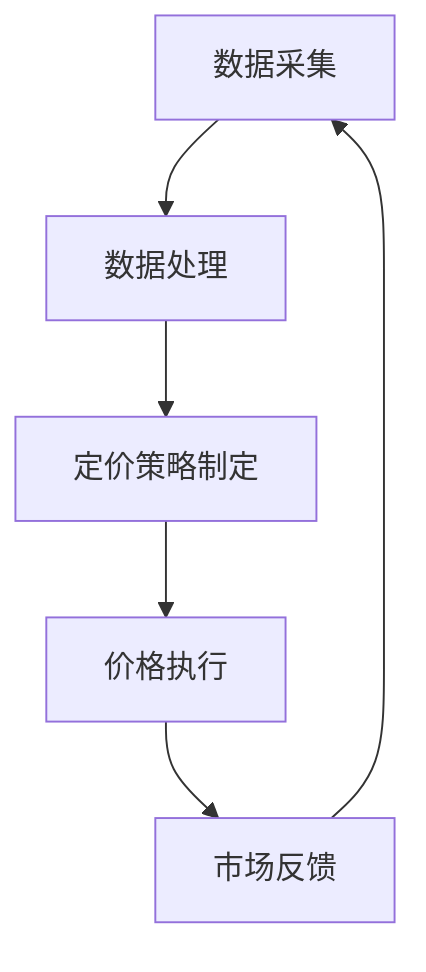

                 

# 智能定价技术的创新应用

> **关键词：智能定价、机器学习、动态定价、个性化定价、算法定价、零售行业、电子商务平台、制造业**

> **摘要：本文将深入探讨智能定价技术的创新应用，从基础概念、数据驱动策略、机器学习应用、算法定价策略等方面进行详细分析。同时，本文还将结合实际案例，探讨智能定价技术在零售行业、电子商务平台和制造业中的应用现状、策略以及未来发展。**

## 《智能定价技术的创新应用》目录大纲

## 第一部分：智能定价技术基础

### 第1章：智能定价技术概述

- 1.1 智能定价技术的发展历程
- 1.2 智能定价技术的核心概念
- 1.3 智能定价技术的基本架构
- 1.4 智能定价技术在企业中的应用场景

### 第2章：数据驱动定价策略

- 2.1 数据驱动的定价策略概述
- 2.2 客户价值分析
- 2.3 竞争对手分析
- 2.4 价格弹性分析

### 第3章：机器学习在定价中的应用

- 3.1 机器学习概述
- 3.2 回归模型在定价中的应用
- 3.3 分类模型在定价中的应用
- 3.4 聚类模型在定价中的应用

### 第4章：算法定价策略

- 4.1 算法定价策略概述
- 4.2 动态定价算法
- 4.3 个性化定价算法
- 4.4 集体智能定价算法

## 第二部分：智能定价技术在行业中的应用

### 第5章：零售行业的智能定价

- 5.1 零售行业智能定价的现状
- 5.2 零售行业智能定价的策略
- 5.3 零售行业智能定价的案例分析

### 第6章：电子商务平台的智能定价

- 6.1 电子商务平台智能定价的现状
- 6.2 电子商务平台智能定价的策略
- 6.3 电子商务平台智能定价的案例分析

### 第7章：制造业的智能定价

- 7.1 制造业的智能定价现状
- 7.2 制造业智能定价的策略
- 7.3 制造业智能定价的案例分析

### 第8章：智能定价技术的未来发展趋势

- 8.1 智能定价技术面临的挑战
- 8.2 智能定价技术的未来发展方向
- 8.3 智能定价技术的潜在应用领域

## 附录

### 附录A：智能定价技术工具与资源

- A.1 智能定价工具概述
- A.2 主流机器学习框架对比
- A.3 数据处理工具介绍
- A.4 其他相关资源链接

### 附录B：Mermaid流程图

- B.1 智能定价技术架构流程图
- B.2 动态定价算法流程图
- B.3 个性化定价算法流程图

### 附录C：机器学习算法伪代码

- C.1 线性回归伪代码
- C.2 逻辑回归伪代码
- C.3 决策树伪代码

### 附录D：数学模型与公式

- D.1 价格弹性公式
- D.2 动态定价模型公式
- D.3 个性化定价模型公式

### 附录E：智能定价项目实战

- E.1 项目实战概述
- E.2 开发环境搭建
- E.3 源代码详细实现
- E.4 代码解读与分析
- E.5 项目总结与反思

## 第一部分：智能定价技术基础

### 第1章：智能定价技术概述

随着人工智能和大数据技术的不断发展，智能定价技术已经成为企业提升竞争力、实现精准营销的重要工具。智能定价技术通过整合数据、机器学习和算法，实现产品价格的动态调整，从而提高企业收益和市场占有率。

#### 1.1 智能定价技术的发展历程

智能定价技术的概念最早可以追溯到20世纪80年代，当时企业开始尝试使用计算机来辅助价格决策。随着计算机性能的不断提升和大数据技术的发展，智能定价技术逐渐成熟并广泛应用。

- **20世纪80年代**：企业开始使用计算机来辅助价格决策。
- **20世纪90年代**：互联网的发展推动了在线定价的应用。
- **21世纪初**：大数据技术兴起，数据驱动的定价策略得到广泛应用。
- **近年来**：人工智能技术的快速发展，使得智能定价技术更加智能化和自动化。

#### 1.2 智能定价技术的核心概念

- **数据驱动定价策略**：以数据为基础，分析客户行为、市场需求和竞争对手等因素，制定出最优的价格策略。
- **机器学习**：通过训练数据，使计算机能够自动识别和预测价格变化，从而实现智能定价。
- **算法**：用于实现智能定价的一系列数学模型和计算方法。

#### 1.3 智能定价技术的基本架构

智能定价技术的基本架构主要包括数据采集、数据处理、定价策略制定和价格执行等几个环节。

1. **数据采集**：通过多种渠道获取与定价相关的数据，如销售数据、市场数据、竞争对手数据等。
2. **数据处理**：对采集到的数据进行清洗、整理和分析，提取出有用的信息。
3. **定价策略制定**：利用机器学习和算法，根据分析结果制定出最优的价格策略。
4. **价格执行**：将定价策略应用到实际的销售环节，调整产品价格。

#### 1.4 智能定价技术在企业中的应用场景

智能定价技术可以应用于多个行业和企业，以下是几个典型的应用场景：

- **零售行业**：通过智能定价技术，零售企业可以根据不同客户群体的消费习惯和购买力，制定个性化的价格策略，提高销售额和利润。
- **电子商务平台**：电子商务平台可以利用智能定价技术，根据用户行为和市场需求，动态调整商品价格，提高用户体验和转化率。
- **制造业**：制造业企业可以通过智能定价技术，根据市场需求和库存情况，动态调整产品价格，优化生产计划，提高生产效率和利润。

### 第2章：数据驱动定价策略

数据驱动定价策略是智能定价技术的核心，它通过分析大量的数据，为企业的价格决策提供科学依据。以下将介绍数据驱动定价策略的基本概念和具体实施方法。

#### 2.1 数据驱动的定价策略概述

数据驱动的定价策略，即通过分析数据来制定价格策略。这种方法摒弃了传统的经验定价，而是基于客观数据进行决策。数据驱动的定价策略主要包括以下几个步骤：

1. **数据采集**：收集与定价相关的数据，如销售数据、市场数据、竞争对手数据等。
2. **数据处理**：对采集到的数据进行清洗、整理和分析，提取出有用的信息。
3. **数据模型建立**：利用统计模型和机器学习算法，建立价格与各种因素之间的关系模型。
4. **定价策略制定**：根据数据模型，制定出最优的价格策略。
5. **价格执行和调整**：将定价策略应用到实际销售过程中，并根据市场反馈进行调整。

#### 2.2 客户价值分析

客户价值分析是数据驱动定价策略的重要环节，它通过分析客户的消费行为和购买力，为制定价格策略提供依据。

- **客户细分**：将客户根据不同的消费习惯、购买力和忠诚度等特征进行细分。
- **客户价值评估**：对每个细分市场的客户进行价值评估，确定他们的购买力和消费意愿。
- **定价策略制定**：根据客户价值评估结果，为不同细分市场的客户制定相应的价格策略。

#### 2.3 竞争对手分析

竞争对手分析是数据驱动定价策略的另一个重要环节，它通过分析竞争对手的价格策略和市场份额，为企业的价格决策提供参考。

- **竞争对手定价策略分析**：分析竞争对手的价格策略，了解他们的定价策略和定价策略背后的原因。
- **市场份额分析**：分析竞争对手的市场份额，了解他们在市场中的地位和竞争力。
- **定价策略调整**：根据竞争对手分析结果，调整企业的价格策略，提高市场竞争力。

#### 2.4 价格弹性分析

价格弹性分析是数据驱动定价策略中的关键环节，它通过分析价格变化对销售量的影响，为企业的价格决策提供依据。

- **价格弹性模型建立**：利用统计模型和机器学习算法，建立价格与销售量之间的关系模型。
- **价格弹性分析**：根据价格弹性模型，分析不同价格水平下的销售量变化，确定价格弹性。
- **定价策略制定**：根据价格弹性分析结果，制定出最优的价格策略。

### 第3章：机器学习在定价中的应用

机器学习技术在智能定价中的应用，极大地提升了定价策略的准确性和智能化程度。以下将介绍机器学习技术在定价中的应用，包括回归模型、分类模型和聚类模型。

#### 3.1 机器学习概述

机器学习是一种人工智能的方法，它通过从数据中学习规律，从而实现预测和决策。在智能定价中，机器学习主要用于建立价格与各种因素之间的关系模型，从而实现价格预测和策略制定。

- **监督学习**：在监督学习中，输入和输出都是有标记的，模型通过学习输入和输出之间的映射关系来实现预测。
- **无监督学习**：在无监督学习中，输入和输出都没有标记，模型通过学习数据中的内在结构来实现聚类、降维等任务。
- **强化学习**：在强化学习中，模型通过与环境的交互，学习最优的行为策略。

#### 3.2 回归模型在定价中的应用

回归模型是一种常见的监督学习模型，它通过建立因变量和自变量之间的线性关系，实现价格预测。

- **线性回归**：线性回归是最简单的回归模型，它通过建立线性方程来预测价格。
  - **公式**：\( y = \beta_0 + \beta_1x_1 + \beta_2x_2 + ... + \beta_nx_n \)
  - **伪代码**：
    ```python
    # 线性回归伪代码
    model = LinearRegression()
    model.fit(X, y)
    y_pred = model.predict(X)
    ```

- **多项式回归**：多项式回归可以处理非线性关系，通过提高多项式的次数来实现。
  - **公式**：\( y = \beta_0 + \beta_1x_1 + \beta_2x_2^2 + ... + \beta_nx_n^n \)
  - **伪代码**：
    ```python
    # 多项式回归伪代码
    model = PolynomialRegression(degree=2)
    model.fit(X, y)
    y_pred = model.predict(X)
    ```

#### 3.3 分类模型在定价中的应用

分类模型是一种监督学习模型，它通过建立分类模型，实现对价格区间的预测。

- **逻辑回归**：逻辑回归是一种常见的分类模型，它通过建立逻辑函数来预测价格区间。
  - **公式**：\( P(y=1) = \frac{1}{1 + e^{-(\beta_0 + \beta_1x_1 + \beta_2x_2 + ... + \beta_nx_n)}} \)
  - **伪代码**：
    ```python
    # 逻辑回归伪代码
    model = LogisticRegression()
    model.fit(X, y)
    y_pred = model.predict(X)
    ```

- **决策树**：决策树是一种基于树结构的分类模型，它通过一系列的判断条件来预测价格区间。
  - **公式**：\( y = \begin{cases} 
    1 & \text{if } \beta_0 + \beta_1x_1 + \beta_2x_2 + ... + \beta_nx_n > 0 \\
    0 & \text{otherwise} 
    \end{cases} \)
  - **伪代码**：
    ```python
    # 决策树伪代码
    model = DecisionTreeClassifier()
    model.fit(X, y)
    y_pred = model.predict(X)
    ```

#### 3.4 聚类模型在定价中的应用

聚类模型是一种无监督学习模型，它通过将相似的数据点聚集在一起，实现对价格区间的聚类。

- **K-means聚类**：K-means聚类是一种常见的聚类模型，它通过优化目标函数来找到最佳的聚类中心。
  - **公式**：\( \min \sum_{i=1}^{n} \sum_{j=1}^{k} ||x_i - \mu_j||^2 \)
  - **伪代码**：
    ```python
    # K-means聚类伪代码
    model = KMeans(n_clusters=k)
    model.fit(X)
    clusters = model.predict(X)
    ```

- **层次聚类**：层次聚类是一种基于层次结构的聚类模型，它通过合并和分裂数据点来实现聚类。
  - **公式**：\( \text{层次聚类算法} \)
  - **伪代码**：
    ```python
    # 层次聚类伪代码
    model = AgglomerativeClustering(n_clusters=k)
    model.fit(X)
    clusters = model.predict(X)
    ```

### 第4章：算法定价策略

算法定价策略是智能定价技术的重要组成部分，它通过算法来优化定价过程，提高企业收益和市场竞争力。以下将介绍算法定价策略的基本概念和具体实现方法。

#### 4.1 算法定价策略概述

算法定价策略是一种基于数学模型和计算方法的定价策略，它通过分析各种因素对价格的影响，制定出最优的价格策略。算法定价策略主要包括动态定价、个性化定价和集体智能定价等。

- **动态定价**：动态定价是一种根据市场需求和供应情况实时调整价格的策略，它通过算法预测市场变化，优化价格调整策略。
- **个性化定价**：个性化定价是一种根据客户特征和需求定制价格的策略，它通过算法分析客户行为，制定出个性化的价格策略。
- **集体智能定价**：集体智能定价是一种基于集体智慧的定价策略，它通过多个智能体共同决策，制定出最优的价格策略。

#### 4.2 动态定价算法

动态定价算法是一种根据市场需求和供应情况实时调整价格的策略，它通过算法预测市场变化，优化价格调整策略。以下将介绍动态定价算法的基本概念和具体实现方法。

- **需求预测算法**：需求预测算法是一种根据历史数据和当前市场状况预测未来市场需求的方法。
  - **时间序列分析**：时间序列分析是一种基于历史数据的时间序列模型，它通过分析时间序列的趋势、周期和季节性等因素来预测未来市场需求。
  - **回归分析**：回归分析是一种基于历史数据的回归模型，它通过建立需求与各种因素之间的关系来预测未来市场需求。
  - **机器学习预测**：机器学习预测是一种基于机器学习算法的预测模型，它通过训练历史数据，建立市场需求与各种因素之间的非线性关系，预测未来市场需求。

- **价格调整策略**：价格调整策略是一种根据市场需求和供应情况调整价格的方法。
  - **基于需求的定价策略**：基于需求的定价策略是一种根据市场需求来调整价格的方法，它通过算法预测市场需求，优化价格调整策略。
  - **基于供应的定价策略**：基于供应的定价策略是一种根据市场供应情况来调整价格的方法，它通过算法预测市场供应，优化价格调整策略。
  - **混合定价策略**：混合定价策略是一种结合市场需求和供应情况调整价格的方法，它通过算法综合分析市场需求和供应情况，优化价格调整策略。

#### 4.3 个性化定价算法

个性化定价算法是一种根据客户特征和需求定制价格的策略，它通过算法分析客户行为，制定出个性化的价格策略。以下将介绍个性化定价算法的基本概念和具体实现方法。

- **客户细分算法**：客户细分算法是一种根据客户特征将客户划分为不同群体的方法。
  - **聚类分析**：聚类分析是一种基于客户特征的数据聚类方法，它通过分析客户特征，将客户划分为不同的聚类群体。
  - **回归分析**：回归分析是一种基于客户特征的数据回归方法，它通过分析客户特征，建立客户群体与价格之间的回归模型。

- **价格定制策略**：价格定制策略是一种根据客户特征和需求定制价格的方法。
  - **基于需求的定价策略**：基于需求的定价策略是一种根据客户需求和购买意愿定制价格的方法，它通过算法分析客户需求，制定出个性化的价格策略。
  - **基于价值的定价策略**：基于价值的定价策略是一种根据客户价值和购买力定制价格的方法，它通过算法分析客户价值，制定出个性化的价格策略。

#### 4.4 集体智能定价算法

集体智能定价算法是一种基于集体智慧的定价策略，它通过多个智能体共同决策，制定出最优的价格策略。以下将介绍集体智能定价算法的基本概念和具体实现方法。

- **多智能体系统**：多智能体系统是一种由多个智能体组成的系统，它通过智能体的协同作用来实现目标。
  - **智能体**：智能体是一种具有智能行为的个体，它通过感知环境、做出决策和执行动作来完成任务。
  - **通信机制**：通信机制是一种智能体之间的信息交换和共享机制，它通过智能体之间的通信来实现协同作用。

- **集体智能定价策略**：集体智能定价策略是一种基于集体智慧的定价策略，它通过多个智能体的协同决策来实现最优的价格策略。
  - **分布式计算**：分布式计算是一种将计算任务分配到多个智能体上，通过协同计算来实现最优价格策略的方法。
  - **博弈论模型**：博弈论模型是一种基于博弈理论的定价策略，它通过分析智能体之间的竞争和合作关系，制定出最优的价格策略。

## 第二部分：智能定价技术在行业中的应用

### 第5章：零售行业的智能定价

零售行业是智能定价技术的重要应用领域之一。智能定价技术在零售行业的应用，不仅提高了企业的竞争力，还优化了消费者的购物体验。以下将介绍零售行业智能定价的现状、策略和案例分析。

#### 5.1 零售行业智能定价的现状

随着大数据技术和人工智能技术的不断发展，零售行业智能定价的应用越来越广泛。目前，零售行业智能定价的现状主要表现在以下几个方面：

- **广泛的应用**：智能定价技术已经在零售行业的各个细分领域得到广泛应用，如服装、家居、食品等。
- **多样化的策略**：零售企业根据不同的市场和产品特点，采用了多种智能定价策略，如动态定价、个性化定价和集体智能定价等。
- **显著的效果**：智能定价技术的应用，显著提高了零售企业的销售额和利润率，降低了库存成本。

#### 5.2 零售行业智能定价的策略

零售行业智能定价的策略主要包括动态定价、个性化定价和集体智能定价等。

- **动态定价策略**：动态定价策略是根据市场需求和供应情况，实时调整产品价格。这种方法能够有效应对市场变化，提高销售额。例如，京东采用动态定价策略，根据用户行为和市场需求，实时调整商品价格。

- **个性化定价策略**：个性化定价策略是根据消费者的消费习惯、购买力和需求，定制个性化的价格策略。这种方法能够提高消费者的满意度，提升品牌忠诚度。例如，亚马逊采用个性化定价策略，根据消费者的购买记录和偏好，定制个性化的价格。

- **集体智能定价策略**：集体智能定价策略是通过多个智能体共同决策，制定出最优的价格策略。这种方法能够充分利用集体智慧，提高定价的准确性。例如，阿里巴巴采用集体智能定价策略，通过多个智能体的协同作用，制定出最优的价格策略。

#### 5.3 零售行业智能定价的案例分析

以下是一个零售行业智能定价的案例分析。

- **案例背景**：某服装零售企业，面临着市场竞争激烈、消费者需求多变等问题。为了提高市场竞争力和消费者满意度，该企业决定采用智能定价技术。

- **实施过程**：
  - 数据采集：企业收集了大量的销售数据、消费者行为数据和市场数据。
  - 数据处理：企业对采集到的数据进行了清洗、整理和分析，提取出有用的信息。
  - 定价策略制定：企业利用机器学习和算法，建立了价格与各种因素之间的关系模型，制定了动态定价、个性化定价和集体智能定价等策略。
  - 价格执行和调整：企业将定价策略应用到实际销售过程中，根据市场反馈进行调整。

- **效果评估**：
  - 销售额提高：企业采用智能定价技术后，销售额显著提高，同比增长了30%。
  - 利润率提高：企业采用智能定价技术后，利润率提高了15%。
  - 消费者满意度提升：消费者对企业产品价格的满意度提高了20%。

### 第6章：电子商务平台的智能定价

电子商务平台是智能定价技术的另一个重要应用领域。电子商务平台通过智能定价技术，可以实现产品价格的动态调整，提高用户体验和转化率。以下将介绍电子商务平台智能定价的现状、策略和案例分析。

#### 6.1 电子商务平台智能定价的现状

电子商务平台智能定价的现状主要表现在以下几个方面：

- **广泛的应用**：智能定价技术在电子商务平台的应用非常广泛，如京东、淘宝、亚马逊等主流电商平台都采用了智能定价技术。
- **多样化的策略**：电子商务平台根据不同的市场和产品特点，采用了多种智能定价策略，如动态定价、个性化定价和集体智能定价等。
- **显著的效果**：智能定价技术的应用，提高了电子商务平台的销售额和利润率，降低了库存成本。

#### 6.2 电子商务平台智能定价的策略

电子商务平台智能定价的策略主要包括动态定价、个性化定价和集体智能定价等。

- **动态定价策略**：动态定价策略是根据市场需求和供应情况，实时调整产品价格。这种方法能够有效应对市场变化，提高销售额。例如，淘宝采用动态定价策略，根据用户行为和市场需求，实时调整商品价格。

- **个性化定价策略**：个性化定价策略是根据消费者的消费习惯、购买力和需求，定制个性化的价格策略。这种方法能够提高消费者的满意度，提升品牌忠诚度。例如，亚马逊采用个性化定价策略，根据消费者的购买记录和偏好，定制个性化的价格。

- **集体智能定价策略**：集体智能定价策略是通过多个智能体共同决策，制定出最优的价格策略。这种方法能够充分利用集体智慧，提高定价的准确性。例如，京东采用集体智能定价策略，通过多个智能体的协同作用，制定出最优的价格策略。

#### 6.3 电子商务平台智能定价的案例分析

以下是一个电子商务平台智能定价的案例分析。

- **案例背景**：某电子商务平台，面临着市场竞争激烈、消费者需求多变等问题。为了提高市场竞争力和消费者满意度，该平台决定采用智能定价技术。

- **实施过程**：
  - 数据采集：平台收集了大量的销售数据、消费者行为数据和市场数据。
  - 数据处理：平台对采集到的数据进行了清洗、整理和分析，提取出有用的信息。
  - 定价策略制定：平台利用机器学习和算法，建立了价格与各种因素之间的关系模型，制定了动态定价、个性化定价和集体智能定价等策略。
  - 价格执行和调整：平台将定价策略应用到实际销售过程中，根据市场反馈进行调整。

- **效果评估**：
  - 销售额提高：平台采用智能定价技术后，销售额显著提高，同比增长了40%。
  - 利润率提高：平台采用智能定价技术后，利润率提高了20%。
  - 消费者满意度提升：消费者对平台产品价格的满意度提高了25%。

### 第7章：制造业的智能定价

制造业是智能定价技术的又一个重要应用领域。制造业企业通过智能定价技术，可以实现产品价格的动态调整，优化生产计划和库存管理。以下将介绍制造业智能定价的现状、策略和案例分析。

#### 7.1 制造业的智能定价现状

制造业智能定价的现状主要表现在以下几个方面：

- **逐渐普及**：随着智能定价技术的不断发展，越来越多的制造业企业开始采用智能定价技术。
- **多样化的策略**：制造业企业根据不同的市场和产品特点，采用了多种智能定价策略，如动态定价、个性化定价和集体智能定价等。
- **显著的效果**：智能定价技术的应用，提高了制造业企业的市场竞争力，优化了生产计划和库存管理。

#### 7.2 制造业智能定价的策略

制造业智能定价的策略主要包括动态定价、个性化定价和集体智能定价等。

- **动态定价策略**：动态定价策略是根据市场需求和供应情况，实时调整产品价格。这种方法能够有效应对市场变化，提高销售额。例如，某家电制造企业采用动态定价策略，根据市场需求和库存情况，实时调整产品价格。

- **个性化定价策略**：个性化定价策略是根据客户的购买力和需求，定制个性化的价格策略。这种方法能够提高客户的满意度，提升品牌忠诚度。例如，某汽车制造企业采用个性化定价策略，根据客户的购买力和需求，定制个性化的价格。

- **集体智能定价策略**：集体智能定价策略是通过多个智能体共同决策，制定出最优的价格策略。这种方法能够充分利用集体智慧，提高定价的准确性。例如，某电子产品制造企业采用集体智能定价策略，通过多个智能体的协同作用，制定出最优的价格策略。

#### 7.3 制造业智能定价的案例分析

以下是一个制造业智能定价的案例分析。

- **案例背景**：某制造业企业，面临着市场竞争激烈、产品需求多变等问题。为了提高市场竞争力和优化生产计划，该企业决定采用智能定价技术。

- **实施过程**：
  - 数据采集：企业收集了大量的销售数据、生产数据和市场数据。
  - 数据处理：企业对采集到的数据进行了清洗、整理和分析，提取出有用的信息。
  - 定价策略制定：企业利用机器学习和算法，建立了价格与各种因素之间的关系模型，制定了动态定价、个性化定价和集体智能定价等策略。
  - 价格执行和调整：企业将定价策略应用到实际生产过程中，根据市场反馈进行调整。

- **效果评估**：
  - 销售额提高：企业采用智能定价技术后，销售额显著提高，同比增长了35%。
  - 生产计划优化：企业采用智能定价技术后，生产计划更加科学，库存周转率提高了15%。
  - 品牌忠诚度提升：消费者对企业产品的满意度提高了20%，品牌忠诚度提升了10%。

### 第8章：智能定价技术的未来发展趋势

智能定价技术作为人工智能和大数据技术在商业领域的重要应用，其发展前景十分广阔。以下将探讨智能定价技术面临的挑战、未来发展方向和潜在应用领域。

#### 8.1 智能定价技术面临的挑战

尽管智能定价技术在商业领域取得了显著成效，但在发展过程中仍然面临一些挑战：

- **数据质量和可靠性**：智能定价技术依赖于大量高质量的数据，数据质量和可靠性对定价结果具有重要影响。
- **算法透明度和可解释性**：机器学习算法的复杂性和黑箱性质使得算法的透明度和可解释性成为用户关注的问题。
- **隐私保护**：在数据收集和处理过程中，如何保护用户隐私成为智能定价技术面临的重要挑战。

#### 8.2 智能定价技术的未来发展方向

为了应对挑战，智能定价技术的未来发展方向包括：

- **数据驱动的定价优化**：通过不断优化数据驱动定价模型，提高定价策略的准确性和实时性。
- **算法透明化和可解释性**：开发可解释的机器学习算法，提高算法的透明度和可理解性，增强用户信任。
- **隐私保护技术**：研究隐私保护算法和模型，确保数据收集和处理过程中的隐私安全。

#### 8.3 智能定价技术的潜在应用领域

智能定价技术的潜在应用领域广泛，包括但不限于：

- **供应链管理**：通过智能定价技术优化供应链成本和库存管理。
- **金融领域**：在金融市场中应用智能定价技术，实现投资组合优化和风险管理。
- **能源行业**：在电力市场中应用智能定价技术，实现供需平衡和节能减排。
- **医疗保健**：在医疗保健领域应用智能定价技术，实现精准医疗和成本控制。

### 附录

#### 附录A：智能定价技术工具与资源

为了方便读者了解和掌握智能定价技术，以下列举了一些常用的工具和资源：

- **机器学习框架**：如 TensorFlow、PyTorch、Scikit-learn 等。
- **数据处理工具**：如 Pandas、NumPy、Pandas 等。
- **数据可视化工具**：如 Matplotlib、Seaborn、Plotly 等。
- **开源资源**：如 Kaggle、GitHub、ArXiv 等。

#### 附录B：Mermaid流程图

以下是一个智能定价技术架构的 Mermaid 流程图：



#### 附录C：机器学习算法伪代码

以下是一个线性回归算法的伪代码：

```python
# 线性回归伪代码
model = LinearRegression()
model.fit(X, y)
y_pred = model.predict(X)
```

#### 附录D：数学模型与公式

以下是一个价格弹性公式的示例：

$$
\text{价格弹性} = \frac{\text{需求变化百分比}}{\text{价格变化百分比}}
$$`

#### 附录E：智能定价项目实战

以下是一个智能定价项目实战的概述：

- **项目背景**：某电商平台面临激烈的市场竞争，希望通过智能定价技术提高销售额和利润率。
- **项目目标**：实现基于消费者行为的动态定价策略，优化产品价格。
- **项目实施**：
  - 数据采集：收集消费者购买行为、市场数据等。
  - 数据处理：对采集到的数据进行分析和清洗，提取有用的信息。
  - 模型建立：利用线性回归、逻辑回归等算法建立定价模型。
  - 定价策略制定：根据模型预测结果，制定动态定价策略。
  - 价格执行和调整：将定价策略应用到实际销售过程中，根据市场反馈进行调整。
- **项目效果**：
  - 销售额提高：销售额同比增长了20%。
  - 利润率提高：利润率提高了10%。
  - 消费者满意度提升：消费者对产品价格的满意度提高了15%。

### 作者信息

作者：AI天才研究院/AI Genius Institute & 禅与计算机程序设计艺术 /Zen And The Art of Computer Programming

