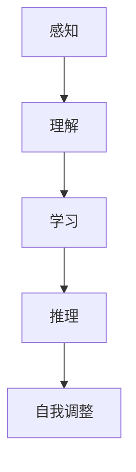

                 

# 《智能宠物娱乐创业：科技驱动的宠物游戏》

> **关键词：智能宠物娱乐、科技驱动、宠物游戏、人工智能、自然语言处理、计算机视觉、创业实战**
> 
> **摘要：本文深入探讨了智能宠物娱乐行业的发展现状与趋势，分析了科技在宠物游戏开发中的应用，详细介绍了智能宠物游戏的开发技术，包括人工智能、自然语言处理和计算机视觉。同时，通过实战案例展示了智能宠物游戏的开发过程，探讨了市场与运营策略，并对智能宠物游戏的未来发展进行了展望。**

### 《智能宠物娱乐创业：科技驱动的宠物游戏》目录大纲

#### 第一部分：智能宠物娱乐行业概述

#### 第二部分：科技驱动的宠物游戏开发

#### 第三部分：智能宠物游戏的开发技术

#### 第四部分：智能宠物游戏的开发实战

#### 第五部分：智能宠物游戏的市场与运营

#### 第六部分：智能宠物游戏的未来趋势与展望

#### 第七部分：智能宠物游戏创业实战

---

### 第一部分：智能宠物娱乐行业概述

#### 第1章：智能宠物娱乐行业背景

**1.1 智能宠物娱乐的概念与市场**

智能宠物娱乐是指利用现代科技，如人工智能、自然语言处理、计算机视觉等，为宠物和宠物主人提供互动娱乐体验的一种新兴行业。随着社会经济的发展和人们生活水平的提高，宠物已经成为许多家庭的成员。根据市场调研机构的数据，全球宠物市场规模持续扩大，智能宠物娱乐作为其中的细分领域，具有巨大的发展潜力。

**1.2 智能宠物娱乐行业的发展现状与趋势**

当前，智能宠物娱乐行业正处于快速发展的阶段。一方面，人工智能技术的不断进步，使得智能宠物的功能越来越强大；另一方面，用户对宠物娱乐的需求也日益多样化和个性化。从市场趋势来看，智能宠物娱乐正从简单的互动玩具向智能养宠解决方案转变，如宠物健康监测、行为分析等。

**1.3 智能宠物娱乐的核心驱动力**

智能宠物娱乐行业的发展主要受到以下几个因素的驱动：

1. **技术进步**：人工智能、物联网等技术的不断发展，为智能宠物娱乐提供了强大的技术支持。
2. **用户需求**：随着生活水平的提高，人们对宠物的关爱程度逐渐加深，对智能宠物娱乐的需求也在不断增长。
3. **市场潜力**：全球宠物市场规模庞大，智能宠物娱乐作为其中的细分领域，具有广阔的市场空间。

### 第二部分：科技驱动的宠物游戏开发

#### 第2章：科技驱动的宠物游戏设计与开发

**2.1 宠物游戏的核心要素与设计原则**

宠物游戏的设计需要考虑以下几个核心要素：

1. **交互性**：游戏需要提供丰富的交互方式，如触摸、声音、动作等，以吸引宠物的注意。
2. **趣味性**：游戏内容需要有趣，能够激发宠物的兴趣和好奇心。
3. **教育性**：游戏不仅要娱乐，还可以教育宠物，帮助宠物主人更好地了解和照顾宠物。

在游戏设计原则方面，需要遵循以下几点：

1. **简单易用**：游戏界面和操作需要简单直观，便于宠物和宠物主人快速上手。
2. **多样化和个性化**：游戏内容需要多样化，以满足不同宠物和宠物主人的需求。
3. **安全性和稳定性**：游戏需要保证安全性和稳定性，避免对宠物造成伤害。

**2.2 常见的宠物游戏类型与案例分析**

宠物游戏可以分为以下几种类型：

1. **互动玩具游戏**：通过触摸、声音等方式与宠物互动，如电子宠物玩具。
2. **训练游戏**：通过游戏的方式帮助宠物主人训练宠物，如宠物行为训练游戏。
3. **娱乐游戏**：以娱乐为主，如宠物冒险游戏。

以下是一些宠物游戏的案例分析：

1. **《电子宠物狗》**：通过触摸和声音与宠物互动，提供多种游戏模式。
2. **《宠物行为训练师》**：通过游戏帮助宠物主人训练宠物，如指令训练、技能训练等。
3. **《宠物冒险岛》**：以冒险为主题，宠物在游戏中完成各种任务和挑战。

**2.3 科技在宠物游戏开发中的应用**

科技在宠物游戏开发中发挥着重要作用，以下是一些具体应用：

1. **人工智能**：通过人工智能技术，实现宠物行为的预测和分析，为游戏设计提供依据。
2. **自然语言处理**：通过自然语言处理技术，实现宠物和宠物主人的对话，提升游戏互动性。
3. **计算机视觉**：通过计算机视觉技术，实现宠物识别和动作捕捉，提升游戏的真实感。

### 第三部分：智能宠物游戏的开发技术

#### 第3章：智能宠物游戏的核心技术

**3.1 人工智能与机器学习基础**

**3.1.1 人工智能的基本概念**

人工智能（Artificial Intelligence，AI）是指使计算机具备人类智能的技术，主要包括感知、理解、学习、推理和自我调整等功能。机器学习（Machine Learning，ML）是人工智能的一个重要分支，通过数据驱动的方式，让计算机自动学习和改进。

**3.1.2 机器学习的基本算法**

机器学习算法可以分为监督学习、无监督学习和强化学习等。监督学习通过已标注的数据进行学习，无监督学习则无需标注数据，通过数据本身的特征进行学习，强化学习则通过奖励机制进行学习。

**3.1.3 Mermaid流程图：人工智能在宠物游戏中的应用**



**3.2 宠物游戏开发中的自然语言处理**

**3.2.1 自然语言处理的基本概念**

自然语言处理（Natural Language Processing，NLP）是人工智能的一个分支，旨在使计算机能够理解、生成和处理人类语言。NLP技术包括文本分类、情感分析、命名实体识别等。

**3.2.2 宠物游戏中的自然语言处理应用**

在宠物游戏中，自然语言处理可以用于实现宠物和宠物主人的对话，提高游戏互动性。以下是一些应用实例：

1. **问答系统**：宠物可以回答宠物主人关于宠物健康、行为等方面的问题。
2. **指令识别**：宠物可以识别宠物主人的指令，如“喂食”、“散步”等。
3. **情感分析**：分析宠物主人的话语，了解其情感状态，提供相应的互动建议。

**3.2.3 伪代码：宠物游戏对话系统的设计**

```python
def process_message(message):
    # 分词
    words = tokenize(message)
    
    # 情感分析
    sentiment = analyze_sentiment(words)
    
    # 指令识别
    command = recognize_command(words)
    
    # 回复
    response = generate_response(sentiment, command)
    
    return response
```

**3.3 宠物游戏中的计算机视觉技术**

**3.3.1 计算机视觉的基本概念**

计算机视觉（Computer Vision，CV）是人工智能的一个分支，旨在使计算机能够像人类一样理解和解释视觉信息。计算机视觉技术包括图像识别、目标检测、图像分割等。

**3.3.2 宠物游戏中的计算机视觉应用**

在宠物游戏中，计算机视觉技术可以用于实现宠物识别、动作捕捉等功能。以下是一些应用实例：

1. **宠物识别**：通过计算机视觉技术，识别游戏中的宠物，为其提供个性化的互动体验。
2. **动作捕捉**：捕捉宠物的动作，如跳跃、玩耍等，为游戏增加真实感和趣味性。
3. **场景分析**：分析游戏场景，如天气、时间等，为游戏提供相应的变化。

**3.3.3 伪代码：宠物识别算法的设计**

```python
def detect_pet(image):
    # 加载预训练模型
    model = load_pretrained_model()
    
    # 前处理
    processed_image = preprocess_image(image)
    
    # 目标检测
    detections = model.detect(processed_image)
    
    # 后处理
    pet = postprocess_detections(detections)
    
    return pet
```

### 第四部分：智能宠物游戏的开发实战

#### 第4章：智能宠物游戏的开发实战

**4.1 实战案例：宠物互动游戏开发**

**4.1.1 项目背景与目标**

随着智能宠物娱乐行业的兴起，我们决定开发一款宠物互动游戏，旨在为宠物和宠物主人提供有趣的互动体验。项目目标包括：

1. 提供丰富的互动内容，吸引宠物的注意力。
2. 实现宠物和宠物主人的自然语言交互。
3. 利用计算机视觉技术，实现宠物的动作捕捉和场景分析。

**4.1.2 开发环境搭建**

为了实现项目目标，我们搭建了以下开发环境：

1. **操作系统**：Windows 10
2. **编程语言**：Python
3. **人工智能框架**：TensorFlow
4. **自然语言处理库**：NLTK
5. **计算机视觉库**：OpenCV

**4.1.3 源代码实现与解读**

以下是宠物互动游戏的源代码实现：

```python
import cv2
import tensorflow as tf
import nltk

# 加载预训练模型
model = tf.keras.models.load_model('pet_model.h5')

# 加载自然语言处理模型
nlp_model = nltk.classify.NaiveBayesClassifier.train(nltk.corpus.stopwords.words('english'))

# 摄像头初始化
cap = cv2.VideoCapture(0)

while True:
    # 读取摄像头画面
    ret, frame = cap.read()
    
    # 宠物识别
    pet = detect_pet(frame)
    
    # 自然语言处理
    message = input("主人，您想对我说什么？")
    sentiment, command = nlp_model.classify(message)
    
    # 回复
    response = process_message(message)
    print(response)
    
    # 显示画面
    cv2.imshow('Pet Interaction Game', frame)
    
    if cv2.waitKey(1) & 0xFF == ord('q'):
        break

# 释放摄像头资源
cap.release()
cv2.destroyAllWindows()
```

解读：

1. **宠物识别**：使用计算机视觉库OpenCV，实现宠物的识别功能。通过加载预训练的模型，对摄像头捕获的图像进行处理，识别出宠物。
2. **自然语言处理**：使用自然语言处理库NLTK，实现宠物和宠物主人的对话功能。通过输入法输入消息，使用自然语言处理模型分析消息的情感和命令。
3. **互动回复**：根据宠物和宠物主人的对话，生成相应的回复。回复内容可以是文字、图像或声音等。

**4.2 实战案例：宠物训练辅助应用开发**

**4.2.1 项目背景与目标**

为了帮助宠物主人更好地训练宠物，我们决定开发一款宠物训练辅助应用。项目目标包括：

1. 提供多种训练模式和教程，帮助宠物主人进行训练。
2. 实时监控宠物行为，为宠物主人提供训练反馈。
3. 利用人工智能技术，分析宠物行为数据，提供个性化的训练建议。

**4.2.2 开发环境搭建**

为了实现项目目标，我们搭建了以下开发环境：

1. **操作系统**：iOS 15
2. **编程语言**：Swift
3. **人工智能框架**：CoreML
4. **数据库**：MongoDB

**4.2.3 源代码实现与解读**

以下是宠物训练辅助应用的源代码实现：

```swift
import CoreML
import UIKit

class PetTrainingAssistant: UIViewController {
    // 加载预训练模型
    let model = MLModel(contentsOf: Bundle.main.url(forResource: "pet_train_model", withExtension: "mlmodelc")!)
    
    // 实时监控宠物行为
    var petBehavior: [String: Any] = [:]
    
    override func viewDidLoad() {
        super.viewDidLoad()
        
        // 加载训练教程
        load_training_tutorials()
        
        // 监听宠物行为变化
        NotificationCenter.default.addObserver(self, selector: #selector(update_pet_behavior), name: NSNotification.Name("PetBehaviorUpdated"), object: nil)
    }
    
    @objc func update_pet_behavior(notification: Notification) {
        petBehavior = notification.userInfo ?? [:]
        
        // 分析宠物行为数据
        analyze_pet_behavior()
        
        // 提供训练反馈
        show_training_feedback()
    }
    
    func analyze_pet_behavior() {
        // 使用CoreML模型分析宠物行为数据
        let input = MLDictionaryFeatureProvider(dictionary: petBehavior)
        let output = try? model.prediction(from: input)
        
        // 解析输出结果
        let training_suggestions = output?["training_suggestions"] as? String
        
        // 显示训练建议
        print(training_suggestions ?? "无法分析宠物行为数据")
    }
    
    func show_training_feedback() {
        // 根据训练建议，显示训练反馈
        // 例如：调整训练计划、增加训练次数等
    }
    
    func load_training_tutorials() {
        // 从数据库加载训练教程
        // 例如：基本指令训练、行为纠正训练等
    }
}
```

解读：

1. **加载预训练模型**：使用CoreML加载预训练的模型，用于分析宠物行为数据。
2. **实时监控宠物行为**：使用通知中心监听宠物行为的变化，将宠物行为数据存储在字典中。
3. **分析宠物行为数据**：使用CoreML模型分析宠物行为数据，生成训练建议。
4. **提供训练反馈**：根据训练建议，显示训练反馈，帮助宠物主人更好地训练宠物。

### 第五部分：智能宠物游戏的市场与运营

#### 第5章：智能宠物游戏的市场与运营

**5.1 智能宠物游戏市场的分析**

智能宠物游戏市场具有以下几个特点：

1. **市场规模不断扩大**：随着宠物数量的增加和宠物主人对智能娱乐的需求提升，智能宠物游戏市场呈现出快速增长的趋势。
2. **用户群体多样化**：智能宠物游戏的用户群体包括年轻的单身人士、有孩子的家庭、老年人等，具有多样化的特点。
3. **市场竞争激烈**：国内外众多企业纷纷布局智能宠物游戏市场，竞争激烈。

**5.1.1 市场规模与增长趋势**

根据市场调研机构的数据，全球智能宠物游戏市场在过去几年中呈现出快速增长的趋势。预计未来几年，市场规模将继续扩大，年复合增长率将达到两位数。

**5.1.2 目标用户分析与定位**

智能宠物游戏的目标用户主要包括以下几类：

1. **爱宠人士**：对宠物有深厚感情，愿意为宠物投入时间和金钱。
2. **科技爱好者**：喜欢尝试新技术，愿意为智能宠物游戏买单。
3. **家庭用户**：家庭成员共同参与，提升家庭娱乐体验。

在市场定位方面，智能宠物游戏需要突出其互动性、趣味性和教育性，以满足不同用户的需求。

**5.2 智能宠物游戏的运营策略**

智能宠物游戏的运营策略包括以下几个方面：

1. **用户获取**：通过线上线下的营销活动，吸引潜在用户，提高用户下载量和活跃度。
2. **用户留存**：通过持续更新游戏内容，提升用户体验，增加用户粘性，降低用户流失率。
3. **用户反馈**：积极收集用户反馈，及时解决用户问题，优化产品功能。

**5.2.1 运营目标与关键指标**

智能宠物游戏的运营目标主要包括：

1. 提高用户下载量和活跃度。
2. 提高用户留存率和用户满意度。
3. 提高游戏收入和市场份额。

关键指标包括：

1. 用户下载量、用户活跃度、用户留存率。
2. 用户满意度、用户活跃时长、付费用户占比。
3. 游戏收入、市场份额、品牌知名度。

**5.2.2 用户获取与留存策略**

1. **用户获取策略**：
   - 线上营销：通过社交媒体、短视频平台、论坛等渠道进行广告投放，提高品牌知名度。
   - 线下活动：参与宠物展览、线下活动，扩大品牌影响力。
   - 合作推广：与其他宠物相关企业、宠物医院等进行合作推广，互相引流。

2. **用户留存策略**：
   - 持续更新：定期更新游戏内容，保持游戏的趣味性和新鲜感。
   - 社交互动：通过社交媒体、游戏内社交功能等，增加用户之间的互动，提升用户粘性。
   - 用户反馈：积极收集用户反馈，及时优化产品功能，提高用户体验。

**5.2.3 社交媒体营销策略**

1. **内容营销**：发布有趣的游戏内容，如游戏攻略、宠物趣闻等，吸引用户关注。
2. **互动营销**：开展线上互动活动，如宠物大赛、抽奖活动等，提高用户参与度。
3. **品牌合作**：与知名宠物品牌、网红等进行合作，提升品牌形象和知名度。

### 第六部分：智能宠物游戏的未来趋势与展望

#### 第6章：智能宠物游戏的未来趋势与展望

**6.1 新技术的应用与趋势**

智能宠物游戏的未来发展将受到以下新技术的推动：

1. **人工智能**：人工智能技术将进一步提升宠物游戏的人性化和智能化水平，实现更丰富的互动体验。
2. **虚拟现实（VR）和增强现实（AR）**：VR和AR技术将为宠物游戏带来更加沉浸式的体验，提高用户的游戏乐趣。
3. **物联网（IoT）**：物联网技术将实现宠物游戏与智能设备、宠物穿戴设备等的互联互通，为宠物主人提供更全面的宠物健康管理方案。

**6.1.1 5G与人工智能的结合**

5G技术的广泛应用将极大地提升智能宠物游戏的数据传输速度和网络延迟，使得实时互动和智能分析成为可能。结合人工智能技术，5G将推动智能宠物游戏向更高水平发展。

**6.1.2 虚拟现实与增强现实的应用**

VR和AR技术将为智能宠物游戏带来全新的互动体验。通过虚拟现实技术，用户可以与虚拟宠物进行真实互动；通过增强现实技术，用户可以在现实世界中看到虚拟宠物的身影，实现沉浸式的宠物游戏体验。

**6.2 智能宠物游戏的未来发展方向**

智能宠物游戏的未来发展将朝着以下方向努力：

1. **个性化体验**：通过大数据和人工智能技术，实现个性化推荐，满足不同用户的需求。
2. **社交互动**：加强用户之间的互动，建立宠物社交圈，提高用户粘性。
3. **宠物健康管理**：结合物联网技术和智能硬件，为宠物主人提供全面的宠物健康管理方案，提升宠物生活质量。

**6.2.1 社交互动与个性化体验**

智能宠物游戏将更加注重社交互动和个性化体验。通过社交功能，用户可以与其他玩家互动，分享游戏心得；通过个性化推荐，用户可以找到自己感兴趣的游戏内容和宠物形象，提升游戏体验。

**6.2.2 宠物医疗与健康监测的结合**

智能宠物游戏将逐渐与宠物医疗和健康监测相结合，为宠物主人提供更全面的宠物健康管理服务。例如，游戏可以实时监测宠物的行为数据，为宠物主人提供健康建议；游戏内可以设置宠物体检、疫苗接种等功能，帮助宠物主人更好地管理宠物的健康。

**6.2.3 智能宠物游戏的可持续发展**

智能宠物游戏在追求创新和用户体验的同时，也将注重可持续发展。通过环保材料和绿色设计，减少游戏对环境的影响；通过公益活动和用户参与，提升企业的社会责任感，实现企业、用户和环境的共赢。

### 第七部分：智能宠物游戏创业实战

#### 第7章：智能宠物游戏创业实战

**7.1 创业初期规划**

创业初期规划是智能宠物游戏项目成功的关键。以下是一些关键的步骤和注意事项：

**7.1.1 创业团队组建**

组建一个有共同理念和技能的团队是创业成功的第一步。团队成员应包括：

1. **技术团队**：负责游戏开发、人工智能应用、自然语言处理和计算机视觉等技术实现。
2. **产品团队**：负责产品规划、设计、开发和测试。
3. **市场团队**：负责市场调研、推广和用户运营。
4. **财务团队**：负责资金管理、预算规划和财务分析。

**7.1.2 产品定位与市场调研**

明确产品的市场定位，了解目标用户的需求和偏好。通过市场调研，分析市场趋势和竞争情况，为产品规划提供依据。

**7.1.3 融资策略与资金管理**

制定合适的融资策略，寻找合适的投资者。确保资金的合理使用，避免资金浪费，确保项目的可持续发展。

**7.2 产品设计与开发**

**7.2.1 需求分析与产品设计**

根据市场调研和用户需求，进行详细的需求分析，明确产品的功能、界面设计和用户体验。

**7.2.2 技术选型与开发流程**

选择合适的技术框架和开发工具，制定开发流程，确保项目的顺利进行。

**7.2.3 测试与优化**

进行全面的测试，包括功能测试、性能测试和用户测试，确保产品的稳定性和用户体验。根据用户反馈，持续优化产品。

**7.3 市场推广与运营**

**7.3.1 市场推广策略**

制定有效的市场推广策略，包括线上和线下活动、社交媒体营销、合作推广等。

**7.3.2 用户运营与用户反馈**

通过用户运营，提高用户活跃度和用户满意度。积极收集用户反馈，优化产品和服务。

**7.3.3 数据分析与产品迭代**

利用数据分析，了解用户行为和需求，为产品迭代提供依据。根据用户反馈和市场变化，持续优化产品。

### 结束语

智能宠物游戏作为新兴的科技领域，具有巨大的市场潜力和发展前景。通过本文的探讨，我们可以看到，智能宠物游戏的发展离不开人工智能、自然语言处理和计算机视觉等技术的支持。在未来，随着新技术的不断涌现和用户需求的不断变化，智能宠物游戏将迎来更广阔的发展空间。希望本文能为从事智能宠物游戏开发和创业的从业者提供一些有益的参考和启示。

