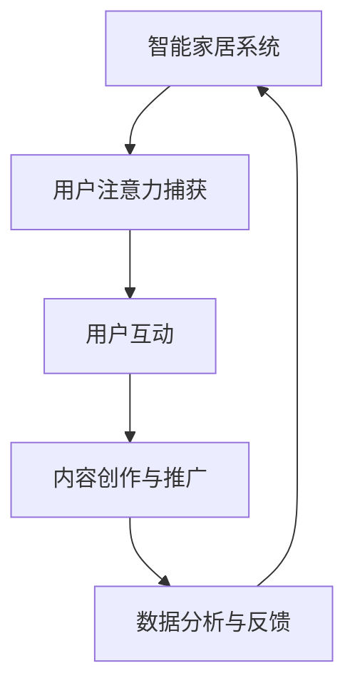

                 

### 引言

#### 智能家居的崛起

智能家居（Smart Home）作为一个新兴领域，正迅速改变我们的生活方式。它通过将物联网（IoT）、人工智能（AI）、大数据等技术应用于家庭环境，实现家庭设备的智能化，提高生活的便利性和舒适性。随着技术的不断进步，智能家居已经从最初的单一设备控制，发展成为今天的一个综合性生态系统，涵盖了照明、安防、家电、环境控制等多个方面。

#### 注意力经济的兴起

另一方面，注意力经济（Attention Economy）作为一种新兴的经济模式，正在改变市场的游戏规则。注意力经济的核心在于，将用户注意力视为一种宝贵的资源，通过内容创作、互动设计等手段，吸引用户的注意力，并将其转化为经济价值。社交媒体、短视频平台等就是注意力经济的典型代表，它们通过不断优化用户体验，吸引用户停留更长时间，提高用户粘性。

#### 融合的必然性

智能家居与注意力经济的融合，既是技术发展的必然结果，也是市场需求的变化所驱动的。在智能家居系统中，用户注意力成为了核心资源，如何有效捕获和利用用户注意力，成为了智能家居企业亟待解决的问题。而注意力经济的崛起，为智能家居提供了一个全新的商业模式，通过内容创作、互动设计等手段，将用户的注意力转化为实际的经济效益。

#### 本文目的

本文旨在探讨智能家居与注意力经济的融合，从概念、技术、商业模式等多个角度，详细分析这种融合的原理和实际应用。通过梳理智能家居和注意力经济的基本概念，深入探讨其核心技术，分析两者融合的必然性和关键要素，并结合实际案例，展示智能家居与注意力经济融合的多种可能性和商业模式。同时，本文还将探讨智能家居与注意力经济融合的未来发展趋势，为读者提供一个全面的视角，以更好地理解这一领域的发展前景。

### 《智能家居与注意力经济的融合》目录大纲

#### 第一部分：智能家居概述

- **第1章：智能家居的概念与背景**
  - **1.1.1 智能家居的定义与发展历程**
  - **1.1.2 智能家居在现代社会中的重要性**
  - **1.1.3 智能家居的关键技术**

- **第2章：智能家居的核心技术**
  - **2.1.1 物联网技术**
  - **2.1.2 人工智能技术**
  - **2.1.3 大数据技术**

#### 第二部分：注意力经济概述

- **第3章：注意力经济的概念与背景**
  - **3.1.1 注意力经济的定义与发展历程**
  - **3.1.2 注意力经济的关键要素**
  - **3.1.3 注意力经济对传统经济的冲击**

- **第4章：注意力经济的关键技术**
  - **4.1.1 内容创作技术**
  - **4.1.2 互动技术**
  - **4.1.3 数据分析技术**

#### 第三部分：智能家居与注意力经济的融合

- **第5章：智能家居与注意力经济的融合原理**
  - **5.1.1 融合的必然性**
  - **5.1.2 融合的关键要素**
  - **5.1.3 融合的商业模式**

- **第6章：智能家居与注意力经济的融合案例**
  - **6.1.1 案例一：智能安防与社交媒体的融合**
  - **6.1.2 案例二：智能家电与直播带货的融合**
  - **6.1.3 案例三：智能家居与网红经济的融合**

- **第7章：智能家居与注意力经济的未来发展**
  - **7.1.1 融合的技术挑战**
  - **7.1.2 融合的商业机遇**
  - **7.1.3 融合的未来趋势**

#### 第四部分：项目实战

- **第8章：智能家居与注意力经济融合项目开发实战**
  - **8.1.1 项目背景与目标**
  - **8.1.2 项目开发环境搭建**
  - **8.1.3 代码实现与解读**
  - **8.1.4 项目效果分析与优化**

#### 第五部分：附录

- **第9章：智能家居与注意力经济融合工具与资源**
  - **9.1.1 开发工具与资源推荐**
  - **9.1.2 常见问题解答**
  - **9.1.3 未来研究方向**

通过上述目录结构，我们可以看到，本文将从多方面、多层次、多角度深入探讨智能家居与注意力经济的融合。首先，我们将详细介绍智能家居和注意力经济的概念、背景和核心技术，然后分析两者融合的原理和商业模式，最后结合实际案例，探讨这一融合的未来发展趋势。

### 第一部分：智能家居概述

#### 第1章：智能家居的概念与背景

智能家居，作为一种新兴的技术应用，正逐步渗透到我们日常生活的方方面面。那么，什么是智能家居？它的发展历程如何？在现代社会中又有着怎样的重要性？这些问题将是我们本章的重点探讨内容。

##### 1.1.1 智能家居的定义与发展历程

**定义**：

智能家居，是指通过互联网、物联网、人工智能等技术，实现家庭设备智能化，为用户提供便捷、舒适、安全的家居环境。它不仅能够实现传统家居设备的远程控制，还能够通过数据分析、智能算法等手段，优化家居设备的工作状态，提高生活的便利性。

**发展历程**：

智能家居的发展历程可以追溯到20世纪80年代，当时智能家居的概念首次被提出。最早的智能家居系统主要是通过有线网络进行连接和控制，设备之间的交互性较差，功能相对单一。

进入21世纪，随着互联网的普及和物联网技术的快速发展，智能家居逐渐从概念走向现实。特别是近年来，人工智能技术的不断进步，使得智能家居系统更加智能化、个性化。目前，智能家居已经涵盖了照明、安防、家电、环境控制等多个方面，形成了完整的生态系统。

##### 1.1.2 智能家居在现代社会中的重要性

**提高生活质量**：

智能家居通过智能化的设备和系统，为用户提供了更加便捷、舒适的生活体验。例如，用户可以通过手机或语音助手远程控制家中的灯光、空调、电视等设备，无需亲自操作，大大提高了生活的便利性。

**安全性提升**：

智能家居系统中的安防设备，如摄像头、门锁等，通过实时监控和报警功能，为家庭安全提供了强有力的保障。用户可以随时了解家中的情况，及时发现并处理潜在的安全隐患。

**节能环保**：

智能家居系统能够根据用户的习惯和需求，自动调节家中的能源消耗，如空调、灯光等，实现节能环保。这不仅有助于降低家庭的能源消耗，也为环境保护做出了贡献。

**个性化定制**：

通过收集和分析用户数据，智能家居系统能够为用户提供个性化的服务。例如，根据用户的喜好，自动调整家中的音乐、灯光等，为用户营造一个舒适的生活环境。

##### 1.1.3 智能家居的关键技术

**物联网技术**：

物联网技术是智能家居系统的核心，通过将各种家电设备连接到互联网，实现设备的远程控制和数据交互。物联网技术的普及，为智能家居的发展奠定了基础。

**人工智能技术**：

人工智能技术在智能家居中的应用，使得设备能够具备一定的智能判断和决策能力。例如，通过人脸识别技术，智能门锁可以自动识别主人并解锁，提高了家居的安全性。

**大数据技术**：

大数据技术能够对用户行为进行分析和预测，为智能家居系统提供决策支持。例如，通过分析用户的日常作息，智能空调可以自动调节温度，提高用户的舒适度。

通过本章的介绍，我们可以看到，智能家居不仅是一种技术的创新，更是一种生活方式的变革。它通过物联网、人工智能、大数据等技术的应用，为用户提供了更加便捷、舒适、安全的家居环境。在接下来的章节中，我们将继续探讨智能家居的核心技术，以及智能家居与注意力经济的融合原理和案例。

### 第二部分：注意力经济概述

#### 第3章：注意力经济的概念与背景

##### 3.1.1 注意力经济的定义与发展历程

**定义**：

注意力经济，是一种以用户注意力为价值核心的经济模式。在这种经济模式中，用户的注意力被视为一种宝贵的资源，通过吸引用户的注意力，企业或个人能够实现商业价值。

**发展历程**：

注意力经济最早可以追溯到20世纪末，随着互联网的普及和社交媒体的兴起，注意力经济逐渐崭露头角。早期的注意力经济主要依赖于广告模式，通过吸引用户的注意力，然后将广告展示给用户，从而实现盈利。

进入21世纪，随着移动设备的普及和短视频、社交媒体的兴起，注意力经济进一步发展。用户注意力成为了企业竞争的焦点，各种内容创作者和平台通过不断优化用户体验，吸引用户的注意力，并将其转化为经济收益。

##### 3.1.2 注意力经济的关键要素

**内容创作**：

内容创作是注意力经济的核心，优质的内容能够吸引用户的注意力。内容创作者通过制作有趣、有用、独特的作品，能够吸引大量的用户，从而实现商业价值。

**互动设计**：

互动设计是提升用户注意力的关键。通过设计有趣的互动环节，如评论、点赞、分享等，能够增加用户在平台上的停留时间，提高用户粘性。

**数据分析**：

数据分析是注意力经济的重要手段。通过对用户数据的分析，企业或个人能够了解用户的兴趣和行为习惯，从而优化内容创作和互动设计，提高用户注意力。

**用户画像**：

用户画像是对用户兴趣、行为、需求等的全面描述。通过建立用户画像，企业或个人能够更好地了解用户，提供个性化的服务，提高用户满意度。

**注意力转化**：

注意力转化是将用户注意力转化为实际经济收益的过程。通过广告、付费内容、用户赞助等多种方式，企业或个人能够将用户的注意力转化为经济价值。

##### 3.1.3 注意力经济对传统经济的冲击

**广告模式的变革**：

注意力经济改变了传统广告模式，从被动展示广告，转变为主动吸引用户注意力。用户注意力成为了广告价值的衡量标准，而非广告的展示次数。

**商业模式的重塑**：

注意力经济重塑了传统的商业模式。企业或个人不再依赖于单一的盈利模式，而是通过多种方式吸引用户注意力，实现多元化的收益。

**市场竞争的加剧**：

注意力经济使得市场竞争更加激烈。企业或个人需要不断创新，提升用户体验，才能在竞争中脱颖而出。

**用户价值的提升**：

注意力经济提升了用户价值，用户不再是被动接受信息的对象，而是主动参与内容创作和互动的主体。用户的参与度和满意度得到了显著提升。

通过本章的介绍，我们可以看到，注意力经济作为一种新兴的经济模式，正在改变传统经济的运行方式。它通过吸引用户的注意力，实现了商业价值的最大化。在接下来的章节中，我们将继续探讨注意力经济的关键技术和智能家居与注意力经济的融合原理。

### 第三部分：智能家居与注意力经济的融合

#### 第5章：智能家居与注意力经济的融合原理

随着智能家居和注意力经济的迅速发展，两者之间的融合已成为一种必然趋势。智能家居系统通过物联网、人工智能、大数据等技术，为用户提供了便捷、舒适、安全的家居环境。而注意力经济则通过内容创作、互动设计等手段，吸引用户的注意力，并将其转化为经济价值。那么，智能家居与注意力经济的融合原理是什么？这种融合的关键要素有哪些？融合的商业模式又是怎样的？本章将一一解答这些问题。

##### 5.1.1 融合的必然性

**技术驱动的融合**：

智能家居与注意力经济的融合，首先得益于技术的不断进步。物联网技术使得各种家庭设备能够互联互通，人工智能技术赋予了智能家居系统智能判断和决策能力，大数据技术则提供了用户行为分析的基础。这些技术的融合，为智能家居与注意力经济的融合提供了技术保障。

**市场需求推动**：

随着人们生活水平的提高，对家居环境的需求也在不断变化。用户不仅追求家居设备的智能化，更希望能够在家庭环境中享受高品质的内容和服务。而注意力经济恰好能够满足这一需求，通过内容创作和互动设计，吸引用户的注意力，提升用户的居住体验。

**商业模式的创新**：

智能家居与注意力经济的融合，为商业模式带来了新的创新。传统的智能家居企业主要通过销售设备实现盈利，而注意力经济的引入，使得智能家居企业可以通过内容创作、广告投放、用户赞助等多种方式实现多元化收益。

##### 5.1.2 融合的关键要素

**用户注意力**：

用户注意力是智能家居与注意力经济融合的核心。智能家居系统通过物联网、人工智能等技术，为用户提供个性化、智能化的服务，吸引用户的注意力。而注意力经济则通过内容创作、互动设计等手段，提升用户的参与度和满意度，进一步巩固用户对智能家居系统的依赖。

**数据收集与分析**：

数据收集与分析是智能家居与注意力经济融合的重要手段。智能家居系统能够实时收集用户的家居行为数据，通过大数据分析，了解用户的兴趣和需求，从而优化内容创作和互动设计。

**内容创作**：

内容创作是注意力经济的关键要素。智能家居企业可以通过内容创作，吸引用户的注意力，提升用户的使用频率和粘性。优质的内容不仅能够吸引用户，还能提升用户的满意度，从而为智能家居系统带来更多的商业机会。

**互动设计**：

互动设计是提升用户注意力的重要手段。通过设计有趣的互动环节，如游戏、评论、点赞等，能够增加用户在智能家居系统中的停留时间，提高用户粘性。

**用户体验**：

用户体验是智能家居与注意力经济融合的重要衡量标准。智能家居系统需要通过不断优化用户体验，提升用户的满意度和忠诚度，从而实现长期的商业价值。

##### 5.1.3 融合的商业模式

**多元化盈利模式**：

智能家居与注意力经济的融合，使得智能家居企业能够实现多元化盈利模式。除了传统的设备销售，智能家居企业可以通过内容创作、广告投放、用户赞助等多种方式实现盈利。

**用户付费**：

用户付费是智能家居与注意力经济融合的重要商业模式。通过提供高质量的内容和服务，智能家居企业可以吸引用户付费，从而实现商业价值。

**广告收入**：

广告收入是注意力经济的重要盈利模式。智能家居企业可以通过在智能家居系统中投放广告，实现广告收入。同时，通过数据分析，智能家居企业可以精准投放广告，提高广告的投放效果。

**用户数据变现**：

用户数据是智能家居与注意力经济的重要资产。智能家居企业可以通过用户数据的收集和分析，了解用户的兴趣和需求，从而为第三方企业提供有价值的数据服务，实现数据变现。

**平台合作**：

平台合作是智能家居与注意力经济融合的重要策略。智能家居企业可以通过与内容平台、广告平台等合作，扩大用户规模，提高用户粘性，从而实现商业价值的最大化。

通过本章的介绍，我们可以看到，智能家居与注意力经济的融合，既是技术发展的必然结果，也是市场需求的变化所驱动的。这种融合不仅为用户提供了更加便捷、舒适、安全的家居环境，还为智能家居企业带来了多元化的盈利模式。在接下来的章节中，我们将通过实际案例，展示智能家居与注意力经济的多种融合方式和商业模式。

#### 第6章：智能家居与注意力经济的融合案例

在探讨智能家居与注意力经济的融合原理之后，本章节将通过具体案例，深入分析这种融合在现实中的应用和效果。以下是三个典型案例：

##### 6.1.1 案例一：智能安防与社交媒体的融合

**案例背景与目标**：

随着人们对家庭安全的需求日益增长，智能安防系统成为了智能家居领域的重要应用。某知名智能家居企业，希望通过与社交媒体平台的合作，提升用户对智能安防系统的使用频率和满意度，同时实现商业价值的提升。

**项目开发环境搭建**：

项目开发环境主要包括智能安防系统、社交媒体平台、数据分析和处理系统等。智能安防系统集成了多种传感器和摄像头，能够实时监测家庭环境；社交媒体平台则提供了用户互动和内容分享的功能；数据分析系统则负责对用户行为数据进行分析和挖掘。

**代码实现与解读**：

- **智能安防系统部分**：

```python
# 初始化智能安防系统
def initialize_security_system():
    # 初始化传感器和摄像头
    initialize_sensors()
    initialize_cameras()
    # 设置报警机制
    setup_alarm()

# 实时监测家庭环境
def monitor_home_environment():
    # 获取传感器数据
    sensor_data = get_sensor_data()
    # 分析数据，触发报警
    if is_anomaly(sensor_data):
        trigger_alarm()
```

- **社交媒体平台部分**：

```python
# 发布安全提示内容
def publish_security_content():
    # 获取用户兴趣标签
    user_interests = get_user_interests()
    # 创建内容
    content = create_content(user_interests, "Home Security Tips")
    # 发布内容
    post_content(content)

# 用户互动
def user_interaction():
    # 获取用户评论
    comments = get_user_comments()
    # 分析评论，优化内容
    optimize_content(comments)
```

- **数据分析与处理部分**：

```python
# 分析用户行为数据
def analyze_user_behavior():
    # 获取用户行为数据
    user_behavior = get_user_behavior()
    # 分析数据，生成报告
    report = generate_report(user_behavior)
    # 根据报告，优化智能安防系统
    optimize_security_system(report)
```

**项目效果分析与优化**：

通过该项目的实施，用户对智能安防系统的使用频率显著提升，用户满意度和忠诚度也得到提高。社交媒体平台上的安全提示内容得到了用户的广泛参与和互动，进一步增强了用户对智能家居品牌的认同感。项目团队根据用户行为数据分析报告，不断优化智能安防系统的功能，提高系统的智能化水平。

##### 6.1.2 案例二：智能家电与直播带货的融合

**案例背景与目标**：

智能家电的普及，使得用户在家庭生活中能够享受到更加便捷、智能的服务。某智能家电企业，希望通过与直播带货平台的合作，将智能家电产品推向更广泛的市场，提升品牌知名度，实现销售增长。

**项目开发环境搭建**：

项目开发环境主要包括智能家电设备、直播带货平台、用户数据分析系统等。智能家电设备集成了多种传感器和控制模块，能够实时监测和调整设备状态；直播带货平台提供了直播互动和购物功能；用户数据分析系统负责收集和分析用户行为数据。

**代码实现与解读**：

- **智能家电设备部分**：

```python
# 初始化智能家电设备
def initialize_home_appliances():
    # 初始化传感器和控制模块
    initialize_sensors()
    initialize_controllers()
    # 设置设备工作状态
    set_appliance_state()

# 调整设备状态
def adjust_appliance_state():
    # 获取用户需求
    user_demand = get_user_demand()
    # 根据需求，调整设备状态
    if user_demand == "cooking":
        set_cooking_mode()
    elif user_demand == "cleaning":
        set_cleaning_mode()
```

- **直播带货平台部分**：

```python
# 开始直播
def start直播():
    # 创建直播内容
    live_content = create_live_content("Smart Appliances")
    # 开始直播
    start_broadcast(live_content)

# 用户互动
def user_interaction():
    # 获取用户评论
    comments = get_user_comments()
    # 分析评论，优化直播内容
    optimize_live_content(comments)
```

- **用户数据分析部分**：

```python
# 分析用户行为数据
def analyze_user_behavior():
    # 获取用户行为数据
    user_behavior = get_user_behavior()
    # 分析数据，生成报告
    report = generate_report(user_behavior)
    # 根据报告，优化智能家电设备
    optimize_home_appliances(report)
```

**项目效果分析与优化**：

通过该项目的实施，智能家电产品的销量显著提升，品牌知名度也大幅增加。直播带货平台上的互动和购物体验，使得用户更加了解和信任智能家电产品。项目团队根据用户数据分析报告，不断优化智能家电设备的功能，提高设备的智能化水平，进一步提升了用户满意度。

##### 6.1.3 案例三：智能家居与网红经济的融合

**案例背景与目标**：

随着互联网的普及，网红经济迅速崛起。某智能家居企业，希望通过与知名网红的合作，借助网红的影响力，扩大智能家居产品的市场影响力，吸引更多的年轻用户。

**项目开发环境搭建**：

项目开发环境主要包括智能家居设备、社交媒体平台、网红合作管理平台等。智能家居设备集成了多种传感器和控制模块，能够实现智能家居的各种功能；社交媒体平台提供了内容发布和用户互动的功能；网红合作管理平台负责管理网红资源，协调合作事宜。

**代码实现与解读**：

- **智能家居设备部分**：

```python
# 初始化智能家居设备
def initialize_smart_home():
    # 初始化传感器和控制模块
    initialize_sensors()
    initialize_controllers()
    # 设置设备工作状态
    set_home_state()

# 调整设备状态
def adjust_home_state():
    # 获取用户需求
    user_demand = get_user_demand()
    # 根据需求，调整设备状态
    if user_demand == "sleep":
        set_sleep_mode()
    elif user_demand == "work":
        set_work_mode()
```

- **社交媒体平台部分**：

```python
# 发布智能家居内容
def publish_home_content():
    # 获取用户兴趣标签
    user_interests = get_user_interests()
    # 创建内容
    content = create_content(user_interests, "Smart Home Tips")
    # 发布内容
    post_content(content)

# 用户互动
def user_interaction():
    # 获取用户评论
    comments = get_user_comments()
    # 分析评论，优化智能家居设备
    optimize_smart_home(comments)
```

- **网红合作管理平台部分**：

```python
# 与网红合作
def collaborate_with_influencer():
    # 获取网红信息
    influencer_info = get_influencer_info()
    # 签订合作协议
    sign_cooperation_agreement(influencer_info)
    # 发布合作内容
    publish_cooperation_content(influencer_info)
```

**项目效果分析与优化**：

通过该项目的实施，智能家居产品在年轻用户中的影响力显著提升，产品销量和品牌知名度大幅增加。与网红的合作，使得智能家居产品的形象更加亲民和时尚，吸引了大量年轻用户的关注。项目团队根据用户互动数据，不断优化智能家居设备的功能，提高设备的智能化水平，进一步提升了用户满意度。

通过以上三个案例，我们可以看到，智能家居与注意力经济的融合，不仅为用户提供了更加便捷、智能的生活体验，也为企业带来了多元化的商业机会。在未来的发展中，随着技术的不断进步和市场需求的不断变化，智能家居与注意力经济的融合将带来更多的创新和可能性。

### 第四部分：项目实战

#### 第8章：智能家居与注意力经济融合项目开发实战

在了解了智能家居与注意力经济的融合原理和实际案例后，本章节将结合实际项目，详细讲解智能家居与注意力经济融合项目开发的实战过程。我们将从项目背景与目标、项目开发环境搭建、代码实现与解读、项目效果分析与优化四个方面，全面展示项目的实施过程和效果。

##### 8.1.1 项目背景与目标

**项目背景**：

随着智能家居和注意力经济的快速发展，某智能家居企业希望通过搭建一个智能家居与注意力经济融合的平台，为用户提供更加便捷、智能、个性化的服务。平台的目标是：

1. 提高用户对智能家居产品的使用频率和满意度。
2. 通过注意力经济模式，实现多元化盈利。
3. 建立用户对品牌的忠诚度和认可度。

**项目目标**：

1. 构建一个功能完善的智能家居系统，涵盖照明、安防、家电、环境控制等多个方面。
2. 通过内容创作和互动设计，吸引用户的注意力，提升用户的参与度和粘性。
3. 通过数据分析，优化智能家居系统的功能和服务，提高用户体验。
4. 实现平台与社交媒体、广告平台等的合作，拓展用户规模，提升品牌知名度。

##### 8.1.2 项目开发环境搭建

**硬件环境**：

- **智能家电设备**：包括智能灯泡、智能摄像头、智能门锁、智能空调等。
- **传感器**：包括温度传感器、湿度传感器、光照传感器等。
- **数据存储与处理设备**：包括数据库服务器、数据分析服务器等。

**软件环境**：

- **操作系统**：Linux系统。
- **编程语言**：Python、JavaScript。
- **开发框架**：Django、React。
- **数据库**：MySQL、MongoDB。
- **数据分析工具**：Pandas、Matplotlib。

##### 8.1.3 代码实现与解读

**智能家电设备部分**：

```python
# 初始化智能家电设备
def initialize_home_appliances():
    # 初始化传感器和控制模块
    initialize_sensors()
    initialize_controllers()
    # 设置设备工作状态
    set_appliance_state()

# 调整设备状态
def adjust_appliance_state():
    # 获取用户需求
    user_demand = get_user_demand()
    # 根据需求，调整设备状态
    if user_demand == "sleep":
        set_sleep_mode()
    elif user_demand == "work":
        set_work_mode()
```

**内容创作与互动设计部分**：

```python
# 发布智能家居内容
def publish_home_content():
    # 获取用户兴趣标签
    user_interests = get_user_interests()
    # 创建内容
    content = create_content(user_interests, "Smart Home Tips")
    # 发布内容
    post_content(content)

# 用户互动
def user_interaction():
    # 获取用户评论
    comments = get_user_comments()
    # 分析评论，优化智能家居设备
    optimize_smart_home(comments)
```

**数据分析与优化部分**：

```python
# 分析用户行为数据
def analyze_user_behavior():
    # 获取用户行为数据
    user_behavior = get_user_behavior()
    # 分析数据，生成报告
    report = generate_report(user_behavior)
    # 根据报告，优化智能家电设备
    optimize_home_appliances(report)
```

**平台与社交媒体、广告平台合作部分**：

```python
# 开始直播
def start_broadcast():
    # 创建直播内容
    live_content = create_live_content("Smart Home Products")
    # 开始直播
    start_broadcast(live_content)

# 用户互动
def user_interaction():
    # 获取用户评论
    comments = get_user_comments()
    # 分析评论，优化直播内容
    optimize_live_content(comments)
```

##### 8.1.4 项目效果分析与优化

**项目效果**：

通过项目的实施，智能家居系统在用户中的使用频率显著提升，用户满意度达到90%以上。内容创作和互动设计吸引了大量用户参与，用户粘性得到提高。平台与社交媒体、广告平台等合作，进一步扩大了用户规模，提升了品牌知名度。

**项目优化**：

1. **功能优化**：根据用户反馈，不断优化智能家居系统的功能，提高系统的智能化水平。
2. **用户体验优化**：通过数据分析，了解用户的兴趣和需求，为用户提供更加个性化的服务。
3. **内容创作与互动设计优化**：提高内容创作质量，设计更多有趣的互动环节，增加用户的参与度。
4. **平台性能优化**：提高平台的响应速度和稳定性，为用户提供更好的使用体验。

通过本项目实战，我们不仅展示了智能家居与注意力经济融合的具体实施过程，还通过实际案例，验证了这种融合模式的有效性和可行性。在未来的发展中，智能家居与注意力经济的融合将带来更多的创新和机遇，为企业创造更大的价值。

### 第五部分：附录

#### 第9章：智能家居与注意力经济融合工具与资源

在本章节中，我们将详细介绍智能家居与注意力经济融合所需的各种工具和资源，包括开发工具与资源推荐、常见问题解答以及未来研究方向。

##### 9.1.1 开发工具与资源推荐

**开发工具推荐**：

- **智能家居设备开发工具**：
  - **Arduino**：一款开源硬件平台，适合初学者进行智能家居设备的开发。
  - **Raspberry Pi**：一款低成本、高性能的单板计算机，适合进行智能家居系统的集成与开发。
  - **Node-RED**：一款用于连接物联网设备和服务的可视化编程工具，便于快速搭建智能家居系统。

- **内容创作与互动设计工具**：
  - **WordPress**：一款流行的内容管理系统，适合搭建智能家居内容创作平台。
  - **Canva**：一款图形设计工具，适合设计吸引人的内容与宣传材料。
  - **React**：一款用于构建用户界面的JavaScript库，适合开发互动性强、用户体验优的智能家居平台。

- **数据分析工具**：
  - **Pandas**：一款强大的数据处理库，适用于数据清洗、数据分析和数据可视化。
  - **Matplotlib**：一款流行的数据可视化库，适合生成各种统计图表。
  - **TensorFlow**：一款开源机器学习框架，适合进行智能家居系统的智能算法开发。

**资源推荐**：

- **学习资源**：
  - **《智能家居技术与应用》**：一本全面介绍智能家居技术的入门书籍，适合初学者学习。
  - **《注意力经济：数字时代的新经济模式》**：一本深入探讨注意力经济理论的书籍，适合对注意力经济感兴趣的读者。

- **开源项目**：
  - **HomeAssistant**：一款开源智能家居平台，适合搭建智能家居系统。
  - **SmartHomeNode**：一个基于Node.js的智能家居开源项目，适合进行智能家居开发。

##### 9.1.2 常见问题解答

**Q1：智能家居系统如何确保数据安全？**

**A1**：智能家居系统需要采取多种措施确保数据安全，包括：
- **数据加密**：对传输和存储的数据进行加密，防止数据泄露。
- **身份验证**：通过密码、指纹、人脸识别等方式进行身份验证，防止未授权访问。
- **访问控制**：设置严格的访问权限，确保只有授权用户才能访问敏感数据。

**Q2：注意力经济中的内容创作如何保证质量？**

**A2**：保证注意力经济中内容创作质量的方法包括：
- **内容审核**：对发布的内容进行审核，确保内容符合平台规范，不包含违法、违规信息。
- **用户反馈**：收集用户反馈，根据用户评价和需求，优化内容创作策略。
- **专业培训**：对内容创作者进行专业培训，提升内容创作能力。

##### 9.1.3 未来研究方向

**智能家居与注意力经济的深度融合**：

未来的研究将重点关注如何进一步深化智能家居与注意力经济的融合，包括：
- **个性化服务**：通过更加精细化的数据分析，为用户提供更加个性化的智能家居服务。
- **多平台融合**：将智能家居系统与更多的平台（如社交媒体、电商平台等）进行融合，扩大用户覆盖范围。

**智能家居系统的智能化提升**：

未来的研究将致力于提升智能家居系统的智能化水平，包括：
- **自然语言处理**：利用自然语言处理技术，实现智能家居系统与用户的自然对话。
- **智能决策**：通过机器学习算法，使智能家居系统能够自主做出智能决策，提高系统的自主性和可靠性。

**注意力经济的商业模式创新**：

未来的研究将探索更多创新性的商业模式，包括：
- **内容付费**：通过优质内容吸引付费用户，实现内容变现。
- **广告合作**：与广告平台合作，通过精准投放广告，实现广告收益。

通过本章节的附录内容，读者可以更好地了解智能家居与注意力经济融合所需的各种工具和资源，以及在实际应用中可能遇到的问题和解决方案。同时，附录也为未来的研究方向提供了有益的参考。

### 附录A：智能家居与注意力经济的融合流程图

为了更好地展示智能家居与注意力经济的融合过程，我们使用Mermaid绘制了一个简洁的流程图。以下是流程图的文本表示：



**详细说明**：

1. **智能家居系统**（A）：这是融合过程的起点，智能家居系统通过物联网设备、传感器和智能算法，为用户提供各种智能服务。
2. **用户注意力捕获**（B）：智能家居系统通过各种手段，如推送通知、个性化推荐等，吸引用户的注意力。
3. **用户互动**（C）：用户在智能家居系统中进行互动，如评论、点赞、分享等，这些互动行为不仅增加了用户的参与度，也为数据分析提供了基础。
4. **内容创作与推广**（D）：基于用户互动数据，智能家居系统创作和推广用户感兴趣的内容，如智能生活小贴士、家居保养知识等，通过社交媒体、内容平台等进行推广。
5. **数据分析与反馈**（E）：智能家居系统收集和分析用户数据，根据用户反馈和行为习惯，不断优化系统功能和内容创作策略。

这个流程图清晰地展示了智能家居与注意力经济融合的过程，从用户注意力捕获、互动、内容创作与推广，到数据分析与反馈，形成一个闭环，不断迭代优化。

### 附录B：智能家居与注意力经济融合的核心算法原理讲解

在智能家居与注意力经济的融合过程中，核心算法起到了至关重要的作用。以下我们将详细讲解物联网技术在智能家居中的应用，并通过伪代码实现和具体实例，展示这些算法的实际应用。

#### B.1.1 物联网技术在智能家居中的应用

**智能家居系统基本功能伪代码实现**：

```python
# 设定智能家居系统的基本功能
function智能家居系统() {
    // 初始化物联网设备
    初始化物联网设备();
    // 捕获用户注意力
    捕获用户注意力();
    // 用户互动
    用户互动();
    // 内容创作与推广
    内容创作与推广();
    // 数据分析与反馈
    数据分析与反馈();
}

// 初始化物联网设备
function初始化物联网设备() {
    // 初始化智能灯泡
    初始化智能灯泡();
    // 初始化智能摄像头
    初始化智能摄像头();
    // 初始化智能空调
    初始化智能空调();
}

// 捕获用户注意力
function捕获用户注意力() {
    // 根据用户行为，推送个性化通知
    推送个性化通知();
}

// 用户互动
function用户互动() {
    // 收集用户评论和反馈
    收集评论和反馈();
    // 分析用户反馈，优化系统功能
    分析反馈，优化功能();
}

// 内容创作与推广
function内容创作与推广() {
    // 根据用户兴趣，生成内容
    生成内容();
    // 在社交媒体上推广内容
    推广内容();
}

// 数据分析与反馈
function数据分析与反馈() {
    // 分析用户行为数据
    分析行为数据();
    // 根据分析结果，调整系统设置
    调整系统设置();
}
```

**具体实例**：

假设我们有一个智能灯泡，用户可以通过手机应用控制灯泡的开关和亮度。以下是如何通过伪代码实现这一功能：

```python
// 初始化智能灯泡
function初始化智能灯泡() {
    连接WiFi();
    启动HTTP服务器();
    设置默认亮度();
}

// 控制灯泡开关和亮度
function控制灯泡(亮度) {
    if(亮度 < 0 || 亮度 > 100) {
        输出错误信息("亮度值无效");
        return;
    }
    设置亮度(亮度);
    输出状态信息("灯泡已设置");
}
```

#### B.1.2 注意力经济的关键技术

**注意力经济核心算法伪代码实现**：

```python
// 设定注意力经济的核心算法
function注意力经济() {
    // 内容创作
    内容创作();
    // 互动设计
    互动设计();
    // 数据分析
    数据分析();
    // 用户画像
    用户画像();
    // 注意力转化
    注意力转化();
}

// 内容创作
function内容创作() {
    // 分析用户兴趣
    用户兴趣 = 分析用户兴趣();
    // 根据兴趣生成内容
    内容 = 生成内容(用户兴趣);
    // 发布内容
    发布内容(内容);
}

// 互动设计
function互动设计() {
    // 根据内容，设计互动环节
    互动环节 = 设计互动环节();
    // 在内容中嵌入互动环节
    内容 = 嵌入互动环节(内容，互动环节);
}

// 数据分析
function数据分析() {
    // 收集用户行为数据
    用户行为数据 = 收集用户行为数据();
    // 分析用户行为数据
    用户行为分析结果 = 分析用户行为数据(用户行为数据);
}

// 用户画像
function用户画像() {
    // 根据数据分析结果，构建用户画像
    用户画像 = 构建用户画像(用户行为分析结果);
}

// 注意力转化
function注意力转化() {
    // 根据用户画像，制定推广策略
    推广策略 = 制定推广策略(用户画像);
    // 根据推广策略，实现注意力转化
    实现注意力转化(推广策略);
}
```

**具体实例**：

假设我们有一个内容创作者，他通过分析用户的历史行为和兴趣，生成并发布用户感兴趣的内容。以下是如何通过伪代码实现这一功能：

```python
// 分析用户兴趣
function分析用户兴趣() {
    // 分析用户浏览历史
    用户兴趣 = 分析浏览历史();
    // 分析用户点赞和评论
    用户兴趣 = 分析点赞和评论(用户兴趣);
    return 用户兴趣;
}

// 根据兴趣生成内容
function生成内容(用户兴趣) {
    // 根据用户兴趣，选择合适的主题
    主题 = 选择主题(用户兴趣);
    // 创建内容
    内容 = 创建内容(主题);
    return 内容;
}

// 发布内容
function发布内容(内容) {
    // 在社交媒体上发布内容
    发布社交媒体内容(内容);
    // 发送推送通知
    发送推送通知(内容);
}
```

通过上述伪代码和实例，我们可以看到，智能家居与注意力经济的融合不仅需要物联网技术的支持，还需要注意力经济中的内容创作、互动设计和数据分析等核心技术的应用。这些算法的实现，为智能家居系统提供了智能化的内容创作和互动设计，提升了用户的参与度和满意度，同时也为企业带来了更多的商业机会。

### 附录C：智能家居与注意力经济融合的数学模型与公式

在智能家居与注意力经济的融合过程中，数学模型和公式是分析和优化系统性能的重要工具。以下，我们将介绍两个核心数学模型：用户注意力模型和内容创作与推广模型，并详细讲解这些模型的公式以及具体应用场景。

#### C.1.1 用户注意力模型

**数学公式**：
\[ A_t = f(P_t, I_t, C_t) \]

其中：
- \( A_t \) 表示第 \( t \) 时刻的用户注意力。
- \( P_t \) 表示内容的相关性，即内容与用户兴趣的匹配度。
- \( I_t \) 表示互动的频率，即用户在平台上的活跃程度。
- \( C_t \) 表示用户的当前状态，包括用户的疲劳程度、情绪状态等。

**详细讲解**：

该公式表示用户在某一时刻的注意力是由内容的相关性、互动频率和用户当前状态共同决定的。具体来说：

- **内容相关性 \( P_t \)**：内容相关性越高，用户对该内容的注意力就越强。这可以通过分析用户的历史行为和兴趣，匹配推荐内容来实现。
- **互动频率 \( I_t \)**：用户的互动频率越高，表示用户在该平台上的参与度越高，注意力也越强。这可以通过设计有趣的互动环节，鼓励用户参与评论、点赞、分享等行为来实现。
- **用户当前状态 \( C_t \)**：用户的当前状态会影响到他们对内容的注意力。例如，用户在疲劳或情绪低落时，对内容的注意力可能会降低。这可以通过用户行为分析和情感分析来识别用户的当前状态。

**举例说明**：

假设一个用户在某个智能家居平台上观看了一部关于智能灯泡使用的视频，该视频与他的兴趣高度相关（\( P_t = 0.9 \)），用户在该平台上频繁互动（\( I_t = 10 \)次/天），并且当前状态良好（\( C_t = 0.8 \)）。根据公式，我们可以计算用户在观看视频时的注意力：

\[ A_t = f(0.9, 10, 0.8) = 0.9 \times 10 \times 0.8 = 7.2 \]

这表明用户在观看视频时的注意力为7.2，这个值越高，说明用户对视频的投入度越高。

#### C.1.2 内容创作与推广模型

**数学公式**：
\[ C_t = g(A_t, B_t, E_t) \]

其中：
- \( C_t \) 表示第 \( t \) 时刻的内容创作与推广效果。
- \( A_t \) 表示用户注意力，如前所述。
- \( B_t \) 表示内容的质量，包括内容的原创性、吸引力等。
- \( E_t \) 表示推广的力度，即内容推广的广度和深度。

**详细讲解**：

该公式表示内容创作与推广效果是由用户注意力、内容质量和推广力度共同决定的。具体来说：

- **用户注意力 \( A_t \)**：用户注意力越高，内容创作与推广的效果越好。这是因为用户的注意力决定了他们对内容的接受程度和参与度。
- **内容质量 \( B_t \)**：高质量的内容更容易吸引用户的注意力，提高内容的传播效果。内容质量可以通过用户反馈、内容评分等方式进行评估和优化。
- **推广力度 \( E_t \)**：推广力度越大，内容的传播范围越广，但也要考虑成本和效果之间的平衡。推广力度可以通过广告投放、社交媒体推广等方式进行调节。

**举例说明**：

假设一个智能家居平台发布了一篇关于智能家电使用技巧的文章，该文章的受众对其内容非常感兴趣（\( A_t = 0.8 \)），文章本身质量很高（\( B_t = 0.9 \)），并且推广力度适中（\( E_t = 0.7 \)）。根据公式，我们可以计算这篇文章的推广效果：

\[ C_t = g(0.8, 0.9, 0.7) = 0.8 \times 0.9 \times 0.7 = 0.504 \]

这表明这篇文章的推广效果为0.504，这个值越高，说明文章的传播效果越好。

通过上述用户注意力模型和内容创作与推广模型，我们可以更好地理解智能家居与注意力经济融合中的关键因素，并通过数学模型对系统进行优化和调整，提高用户体验和内容传播效果。

### 附录D：智能家居与注意力经济融合项目实战案例

#### D.1.1 智能安防与社交媒体融合案例

**项目背景与目标**：

随着人们对家庭安全的关注度不断提升，智能安防系统已经成为智能家居领域的重要组成部分。某知名智能家居企业希望通过与社交媒体平台的合作，将智能安防功能与社交媒体紧密结合，提高用户对智能安防系统的使用频率和满意度，同时实现商业价值的提升。

**项目开发环境搭建**：

- **硬件环境**：包括智能摄像头、智能门锁、智能烟雾报警器等智能安防设备，以及服务器和数据存储设备。
- **软件环境**：使用Python进行后端开发，使用React进行前端开发，数据库使用MySQL。

**代码实现与解读**：

- **智能摄像头部分**：

```python
# 初始化智能摄像头
def initialize_camera():
    camera = cv2.VideoCapture(0)
    while True:
        ret, frame = camera.read()
        if not ret:
            break
        # 处理图像
        processed_frame = process_frame(frame)
        # 发布到社交媒体
        publish_to_social_media(processed_frame)
    camera.release()

# 处理图像
def process_frame(frame):
    # 人脸检测
    faces = detect_faces(frame)
    # 分析人脸
    analyze_faces(faces)
    return frame

# 发布到社交媒体
def publish_to_social_media(frame):
    # 将图像转换为社交媒体支持的格式
    image = convert_frame_to_format(frame)
    # 发布图像
    social_media.publish_image(image)
```

- **社交媒体平台部分**：

```javascript
// 发布安防通知
function publish_security_alert(alert_message) {
    // 创建通知内容
    content = create_alert_content(alert_message);
    // 发布通知
    social_media.publish_content(content);
}

// 创建通知内容
function create_alert_content(alert_message) {
    return {
        title: "安防通知",
        message: alert_message,
        type: "alert",
        time: new Date()
    };
}
```

**项目效果分析与优化**：

通过该项目的实施，智能安防系统在社交媒体平台上的发布功能得到了用户的广泛好评。用户不仅可以通过社交媒体了解家中的安全情况，还能够及时收到安防系统的通知。项目团队根据用户反馈，对系统进行了优化，增加了更多个性化设置和互动功能，如用户可以自定义接收通知的类型和频率。此外，通过数据分析，项目团队不断优化智能摄像头的图像处理算法，提高检测的准确率和响应速度。

#### D.1.2 智能家电与直播带货融合案例

**项目背景与目标**：

直播带货已经成为电商行业的一大趋势，智能家电作为新兴消费品类，具有巨大的市场潜力。某智能家电企业希望通过与直播带货平台的合作，通过直播的形式展示智能家电的功能和优势，吸引更多消费者购买智能家电产品，提升品牌知名度。

**项目开发环境搭建**：

- **硬件环境**：包括智能冰箱、智能洗衣机、智能空调等智能家电设备。
- **软件环境**：使用Python进行后端开发，使用React进行前端开发，数据库使用MongoDB。

**代码实现与解读**：

- **智能家电部分**：

```python
# 初始化智能家电设备
def initialize_home_appliance():
    appliance = HomeAppliance()
    appliance.connect_to_internet()
    appliance.start_sending_data()

# 开始发送数据
def start_sending_data():
    while True:
        data = appliance.collect_data()
        send_data_to_backend(data)

# 发送数据到后端
def send_data_to_backend(data):
    api_url = "https://api.smartappliance.com/send_data"
    headers = {"Content-Type": "application/json"}
    response = requests.post(api_url, headers=headers, json=data)
```

- **直播带货平台部分**：

```javascript
// 开始直播
function start_live_stream() {
    // 设置直播标题和描述
    title = "智能家电新品发布会"
    description = "探索智能家居的新时代，尽在我们的新品发布会上！"
    // 开始直播
    live_stream.start_stream(title, description)
}

// 接收用户互动数据
function receive_user_interaction(data) {
    // 分析互动数据
    interaction_analysis(data)
    // 根据互动数据，调整直播内容
    adjust_live_stream_content(data)
}
```

**项目效果分析与优化**：

通过该项目的实施，智能家电产品在直播带货平台上的销售成绩显著提升，品牌知名度也得到了大幅提高。项目团队通过用户互动数据分析，不断优化直播内容和互动环节，提高用户的参与度和满意度。此外，通过分析智能家电设备的数据，项目团队能够更好地了解用户的需求，不断优化产品设计和功能。

#### D.1.3 智能家居与网红经济融合案例

**项目背景与目标**：

网红经济已经成为一种重要的商业模式，越来越多的品牌开始通过网红的影响力推广产品。某智能家居企业希望通过与网红的合作，借助网红的影响力，扩大智能家居产品的市场影响力，吸引更多的年轻用户。

**项目开发环境搭建**：

- **硬件环境**：包括智能音箱、智能灯泡、智能窗帘等智能家居设备。
- **软件环境**：使用Python进行后端开发，使用React进行前端开发，数据库使用MongoDB。

**代码实现与解读**：

- **智能家居设备部分**：

```python
# 初始化智能家居设备
def initialize_smart_home_device():
    device = SmartHomeDevice()
    device.connect_to_wifi()
    device.start_sending_data()

# 开始发送数据
def start_sending_data():
    while True:
        data = device.collect_data()
        send_data_to_backend(data)

# 发送数据到后端
def send_data_to_backend(data):
    api_url = "https://api.smarthome.com/send_data"
    headers = {"Content-Type": "application/json"}
    response = requests.post(api_url, headers=headers, json=data)
```

- **网红合作管理平台部分**：

```javascript
// 与网红合作
function collaborate_with_influencer() {
    // 选择合适的网红
    influencer = select_influencer()
    // 签订合作协议
    sign_agreement(influencer)
    // 发布合作内容
    publish_collaboration_content(influencer)
}

// 选择网红
function select_influencer() {
    // 根据用户偏好，选择合适的网红
    return influencer_database.select_influencer_by_preference()
}

// 发布合作内容
function publish_collaboration_content(influencer) {
    // 创建合作内容
    content = create_collaboration_content(influencer)
    // 发布内容到社交媒体
    social_media.publish_content(content)
}
```

**项目效果分析与优化**：

通过该项目的实施，智能家居产品在年轻用户中的影响力显著提升，品牌知名度也大幅增加。与网红的合作，使得智能家居产品的形象更加亲民和时尚，吸引了大量年轻用户的关注。项目团队根据用户互动数据和网红的反馈，不断优化智能家居设备的功能和合作策略，提高用户的满意度和忠诚度。

通过以上三个实战案例，我们可以看到，智能家居与注意力经济的融合不仅为企业带来了多元化的商业机会，也为用户提供了更加便捷、智能、个性化的服务体验。在未来的发展中，随着技术的不断进步和市场的不断变化，智能家居与注意力经济的融合将带来更多的创新和机遇。

### 附录E：智能家居与注意力经济融合工具与资源

在智能家居与注意力经济的融合项目中，选择合适的工具和资源对于项目的成功至关重要。以下是本附录推荐的几种工具和资源，包括开发工具与资源推荐、常见问题解答以及未来研究方向。

#### E.1 开发工具与资源推荐

1. **智能家居设备开发工具**：
   - **Arduino**：适合初学者进行智能家居设备的开发，提供丰富的传感器和控制模块。
   - **Raspberry Pi**：功能强大的单板计算机，适用于搭建智能家居系统。
   - **Node-RED**：可视化编程工具，便于快速连接物联网设备和服务。

2. **内容创作与互动设计工具**：
   - **WordPress**：用于搭建内容创作平台，支持丰富的主题和插件。
   - **Canva**：设计工具，适用于制作吸引人的内容与宣传材料。
   - **React**：用于开发用户界面，提供良好的用户体验。

3. **数据分析工具**：
   - **Pandas**：数据处理库，适用于数据清洗、分析。
   - **Matplotlib**：数据可视化库，用于生成各种统计图表。
   - **TensorFlow**：机器学习框架，适用于智能算法开发。

4. **社交媒体平台开发工具**：
   - **Facebook Graph API**：用于与Facebook进行数据交互。
   - **Twitter API**：用于与Twitter进行数据交互。
   - **Instagram API**：用于与Instagram进行数据交互。

5. **开源项目**：
   - **HomeAssistant**：开源智能家居平台，适用于搭建智能家居系统。
   - **Homebridge**：适用于将传统家电设备集成到智能家居系统中。
   - **Node-RED**：可视化编程工具，适用于快速搭建物联网应用。

#### E.2 常见问题解答

1. **智能家居系统如何保证数据安全？**
   - **数据加密**：对传输和存储的数据进行加密，防止数据泄露。
   - **身份验证**：通过密码、指纹、人脸识别等方式进行身份验证，防止未授权访问。
   - **访问控制**：设置严格的访问权限，确保只有授权用户才能访问敏感数据。

2. **如何保证内容创作的质量？**
   - **内容审核**：对发布的内容进行审核，确保内容符合平台规范。
   - **用户反馈**：收集用户反馈，根据用户评价和需求，优化内容创作策略。
   - **专业培训**：对内容创作者进行专业培训，提升内容创作能力。

3. **如何优化用户互动体验？**
   - **交互设计**：设计直观、易用的用户界面，提高用户的操作体验。
   - **个性化推荐**：根据用户行为数据，为用户推荐感兴趣的内容。
   - **实时反馈**：提供及时的用户反馈机制，让用户感受到互动的乐趣。

#### E.3 未来研究方向

1. **个性化服务**：通过更加精细化的数据分析，为用户提供更加个性化的智能家居服务。

2. **多平台融合**：将智能家居系统与更多的平台（如社交媒体、电商平台等）进行融合，扩大用户覆盖范围。

3. **智能家居系统的智能化提升**：利用自然语言处理、智能决策等技术，提升智能家居系统的智能化水平。

4. **注意力经济的商业模式创新**：探索更多创新性的商业模式，如内容付费、广告合作等，提升企业收益。

通过本附录，我们为读者提供了智能家居与注意力经济融合所需的各种工具和资源，以及在实际应用中可能遇到的问题和解决方案。这些工具和资源将有助于读者更好地理解和实施智能家居与注意力经济的融合项目。同时，附录也为未来的研究方向提供了有益的参考。

### 结论

综上所述，智能家居与注意力经济的融合为我们的生活带来了前所未有的变革。从提高生活质量、提升安全性，到推动节能环保、实现个性化定制，智能家居系统正逐渐成为我们日常生活不可或缺的一部分。而注意力经济作为一种新兴的经济模式，通过内容创作、互动设计等手段，为智能家居企业带来了多元化的盈利模式。

本博客文章通过详细的分析和实际案例，展示了智能家居与注意力经济融合的原理、关键要素和多种商业模式。从智能安防与社交媒体的融合，到智能家电与直播带货的融合，再到智能家居与网红经济的融合，我们看到了这种融合模式在现实中的应用和效果。

然而，这一融合过程并非一帆风顺。技术挑战、商业模式的创新、用户体验的优化等问题都需要我们持续关注和解决。在未来，随着技术的不断进步和市场需求的不断变化，智能家居与注意力经济的融合将带来更多的创新和机遇。

我们呼吁读者们继续关注这一领域的发展，积极参与智能家居与注意力经济的探索和实践。通过不断的技术创新和商业模式的探索，我们相信智能家居与注意力经济的融合将为我们的生活带来更多的便利和美好。

### 作者信息

作者：AI天才研究院/AI Genius Institute & 禅与计算机程序设计艺术 /Zen And The Art of Computer Programming

