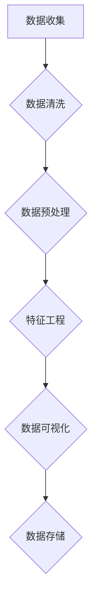
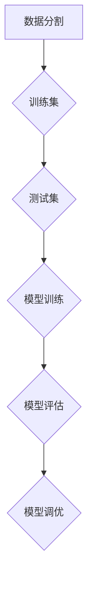

                 

### 智能库存预警系统：小型电商避免库存积压与断货的预测模型

> **关键词：** 智能库存预警系统、库存积压、断货、预测模型、小型电商、数据预处理、机器学习、深度学习、系统架构设计

**摘要：** 本文将深入探讨智能库存预警系统在小型电商中的应用，以解决库存积压与断货问题。我们将首先介绍智能库存预警系统的核心概念与架构，然后详细分析数据收集与预处理的方法，以及常见的预测模型选择与评估方法。接下来，我们将描述智能库存预警系统的实现过程，包括系统架构设计、开发与部署。最后，通过实际案例分析和未来发展趋势的展望，为小型电商提供一套完整的智能库存预警解决方案。

---

### 第一部分：智能库存预警系统概述

#### 第1章：智能库存预警系统概述

##### 1.1 引言

在当今高速发展的电商行业，库存管理成为企业运营中的关键环节。库存积压与断货问题不仅影响企业的经济效益，还可能导致客户流失和品牌形象受损。随着大数据和人工智能技术的快速发展，智能库存预警系统成为解决这一问题的关键。

##### 1.1.1 电商行业的库存管理挑战

1. **库存积压：** 由于市场需求预测不准确、季节性变化等原因，导致库存积压，占用大量资金和仓储空间。
2. **断货风险：** 库存不足可能导致畅销商品断货，影响客户体验和订单转化率。
3. **供应链复杂性：** 电商企业面临多样化的供应链管理挑战，包括供应商管理、物流配送、库存调整等。

##### 1.1.2 智能库存预警系统的意义

智能库存预警系统通过数据分析和预测模型，实现对库存水平的实时监控和预警，从而帮助企业：

1. **优化库存水平：** 减少库存积压，降低库存成本。
2. **降低断货风险：** 提前预测库存短缺，确保畅销商品供应。
3. **提升运营效率：** 实现自动化库存管理，降低人工干预成本。

##### 1.2 智能库存预警系统的核心概念

智能库存预警系统主要由以下几部分组成：

1. **数据收集与预处理：** 收集与库存相关的数据，如销售数据、库存数据、市场动态数据等，并进行预处理，以获得高质量的数据集。
2. **预测模型：** 基于历史数据和业务规律，选择合适的预测模型进行训练，预测未来的库存需求。
3. **预警策略：** 根据预测结果，设置合理的预警阈值，对库存水平进行实时监控和预警。

##### 1.2.1 库存积压与断货问题分析

1. **库存积压问题：** 库存积压通常由于市场需求预测不准确、产品更新换代、促销策略不当等原因导致。库存积压不仅占用大量资金和仓储空间，还可能导致商品过期或贬值。
2. **断货问题：** 断货通常由于库存不足、物流配送延迟、供应链中断等原因导致。断货会影响客户体验和品牌声誉，导致客户流失和订单转化率下降。

##### 1.2.2 智能库存预警系统架构

智能库存预警系统的架构主要包括以下三个层次：

1. **数据层：** 负责收集、存储和处理与库存相关的数据，如销售数据、库存数据、市场动态数据等。
2. **算法层：** 负责选择合适的预测模型，对历史数据进行训练，预测未来的库存需求。
3. **应用层：** 负责实现预警策略，实时监控库存水平，根据预测结果发出预警信息。

##### 1.2.3 预测模型的作用和重要性

预测模型在智能库存预警系统中起着至关重要的作用。通过预测模型，企业可以：

1. **提前发现库存积压和断货风险：** 及时调整库存策略，避免损失。
2. **优化库存管理：** 减少库存积压，降低库存成本。
3. **提高运营效率：** 实现自动化库存管理，降低人工干预成本。

##### 1.3 智能库存预警系统的应用场景

智能库存预警系统适用于各种类型的电商企业，尤其是在库存管理面临挑战的小型电商企业。以下是智能库存预警系统的几种典型应用场景：

1. **季节性商品：** 如冬季服装、夏季空调等季节性商品，通过智能库存预警系统，可以提前预测市场需求，合理安排库存。
2. **畅销商品：** 对畅销商品进行实时监控，确保库存充足，避免断货风险。
3. **新品上市：** 对新品上市进行预测，提前准备库存，确保市场需求得到满足。

##### 1.3.1 小型电商企业案例分析

以某小型电商企业为例，该企业通过引入智能库存预警系统，实现了以下成效：

1. **库存积压减少：** 通过预测模型，企业能够提前预测市场需求，合理安排库存，减少库存积压。
2. **断货风险降低：** 实时监控库存水平，及时发出预警信息，确保畅销商品供应。
3. **运营效率提升：** 实现自动化库存管理，降低人工干预成本，提高运营效率。

##### 1.3.2 不同行业对智能库存预警系统的需求

不同行业的电商企业对智能库存预警系统的需求有所不同，主要体现在以下几个方面：

1. **快消品行业：** 如食品、饮料等快消品行业，对库存周转速度要求较高，智能库存预警系统可以帮助企业实时监控库存，提高库存周转率。
2. **家居用品行业：** 如家具、家居用品等行业，产品种类繁多，对库存管理要求较高，智能库存预警系统可以帮助企业优化库存结构，减少库存积压。
3. **电子产品行业：** 如手机、电脑等电子产品行业，产品更新换代较快，智能库存预警系统可以帮助企业及时调整库存策略，适应市场变化。

##### 1.4 智能库存预警系统的技术原理

智能库存预警系统的技术原理主要包括以下几个方面：

1. **数据收集与预处理：** 通过数据采集工具，收集与库存相关的数据，如销售数据、库存数据、市场动态数据等。然后进行数据清洗、处理和特征工程，为预测模型提供高质量的数据集。
2. **预测模型选择与评估：** 根据业务需求和数据特点，选择合适的预测模型，如时间序列模型、机器学习模型、深度学习模型等。通过交叉验证、A/B测试等方法，对模型进行评估和优化。
3. **预警策略制定与优化：** 根据预测结果，设置合理的预警阈值，对库存水平进行实时监控和预警。同时，通过多维度数据分析，不断优化预警策略，提高预警准确性。

### 第二部分：智能库存预警系统构建

#### 第2章：数据收集与预处理

##### 2.1 数据收集

数据收集是智能库存预警系统构建的第一步，主要包括以下几类数据：

1. **销售数据：** 包括销售额、销售量、销售时长等指标，反映市场需求变化。
2. **库存数据：** 包括库存总量、库存周转率、库存滞销率等指标，反映库存水平变化。
3. **市场动态数据：** 包括行业趋势、竞争对手动态、消费者偏好等指标，反映市场环境变化。

##### 2.1.1 库存数据来源

库存数据的来源主要包括以下几个方面：

1. **电商平台：** 通过电商平台获取销售数据和库存数据，如淘宝、京东、拼多多等。
2. **ERP系统：** 通过企业的ERP系统获取库存数据，如库存总量、库存周转率等。
3. **供应商：** 通过与供应商的数据对接，获取原材料库存和供应链信息。

##### 2.1.2 客户订单数据获取

客户订单数据的获取是智能库存预警系统构建的重要环节，主要包括以下几种方法：

1. **电商平台订单数据：** 通过电商平台获取订单数据，如订单数量、订单金额、订单时间等。
2. **ERP系统订单数据：** 通过企业的ERP系统获取订单数据，如订单状态、订单详情等。
3. **线下订单数据：** 通过线下订单管理系统获取订单数据，如订单数量、订单金额、订单时间等。

##### 2.1.3 市场动态数据收集

市场动态数据的收集主要包括以下几个方面：

1. **行业报告：** 通过行业报告获取市场趋势、行业动态等信息，如艾瑞咨询、赛迪顾问等发布的行业报告。
2. **新闻资讯：** 通过新闻资讯获取市场热点、政策变化等信息，如新浪财经、网易财经等。
3. **社交媒体：** 通过社交媒体获取消费者偏好、市场反馈等信息，如微博、抖音等。

##### 2.2 数据预处理

数据预处理是智能库存预警系统构建的关键步骤，主要包括以下几类操作：

1. **数据清洗：** 去除数据中的噪声、异常值和缺失值，确保数据质量。
2. **数据归一化：** 对不同量纲的数据进行归一化处理，消除数据之间的尺度差异。
3. **特征工程：** 提取数据中的关键特征，为预测模型提供高质量的输入。
4. **数据可视化：** 通过数据可视化，对数据分布、趋势等进行分析，辅助决策。

##### 2.2.1 数据清洗与处理方法

数据清洗与处理方法主要包括以下几个方面：

1. **缺失值处理：** 通过均值填补、中值填补、插值等方法，处理数据中的缺失值。
2. **异常值处理：** 通过统计学方法，识别并处理数据中的异常值。
3. **重复数据处理：** 通过去重操作，去除数据中的重复记录。

##### 2.2.2 特征工程

特征工程是数据预处理的重要环节，主要包括以下几个方面：

1. **特征提取：** 通过统计学方法、机器学习方法，提取数据中的关键特征。
2. **特征选择：** 通过特征重要性评估、模型选择等方法，选择对预测目标最有影响力的特征。
3. **特征组合：** 通过组合多个特征，生成新的特征，提高预测模型的性能。

##### 2.2.3 数据可视化分析

数据可视化分析可以帮助我们更好地理解数据分布、趋势等信息，主要包括以下几个方面：

1. **统计图表：** 如折线图、柱状图、饼图等，用于展示数据的基本统计特征。
2. **时间序列分析：** 如自相关图、ACF图、PACF图等，用于分析数据的时间序列特性。
3. **分布图：** 如直方图、密度图等，用于展示数据的分布情况。

#### 第3章：预测模型选择与评估

##### 3.1 常见预测模型介绍

在智能库存预警系统中，常见的预测模型主要包括以下几类：

1. **时间序列模型：** 如ARIMA模型、SARIMA模型、LSTM模型等，用于分析时间序列数据。
2. **机器学习模型：** 如线性回归、决策树、随机森林等，用于建立预测模型。
3. **深度学习模型：** 如卷积神经网络（CNN）、循环神经网络（RNN）、长短时记忆网络（LSTM）等，用于处理复杂非线性数据。

##### 3.1.1 机器学习基础模型

机器学习基础模型主要包括以下几种：

1. **线性回归：** 用于建立线性关系模型，预测未来库存需求。
2. **决策树：** 用于分类和回归任务，通过树形结构进行特征选择和决策。
3. **随机森林：** 通过随机抽样和特征组合，提高模型的泛化能力。
4. **支持向量机（SVM）：** 用于分类任务，通过寻找最优分类边界进行预测。

##### 3.1.2 深度学习模型

深度学习模型在智能库存预警系统中具有广泛应用，主要包括以下几种：

1. **卷积神经网络（CNN）：** 用于处理图像数据，可以提取图像中的特征。
2. **循环神经网络（RNN）：** 用于处理序列数据，可以捕捉时间序列中的长期依赖关系。
3. **长短时记忆网络（LSTM）：** 是RNN的一种改进模型，可以解决长序列中的梯度消失问题。
4. **门控循环单元（GRU）：** 是LSTM的简化版，结构更简单，计算效率更高。

##### 3.2 模型选择与评估

选择合适的预测模型是智能库存预警系统成功的关键。在选择模型时，需要考虑以下几个因素：

1. **数据特点：** 如数据量大小、数据分布、时间序列特性等，选择适合的数据处理方法。
2. **业务需求：** 如预测精度、实时性、模型复杂度等，根据业务需求选择合适的模型。
3. **计算资源：** 如模型训练时间、内存消耗等，根据计算资源限制选择合适的模型。

##### 3.2.1 模型评估指标

常用的模型评估指标包括以下几种：

1. **均方误差（MSE）：** 用于衡量预测值与真实值之间的平均误差。
2. **均方根误差（RMSE）：** 用于衡量预测值与真实值之间的平均误差的平方根。
3. **平均绝对误差（MAE）：** 用于衡量预测值与真实值之间的平均绝对误差。
4. **准确率（Accuracy）：** 用于分类任务，表示分类正确的样本比例。
5. **召回率（Recall）：** 用于分类任务，表示被正确分类为正类的负类样本比例。

##### 3.2.2 模型调优策略

在模型选择过程中，需要进行模型调优，以提高预测精度。常见的调优策略包括以下几种：

1. **交叉验证：** 通过将数据集划分为训练集和验证集，多次训练和验证，选择最优模型。
2. **网格搜索：** 通过遍历参数空间，选择最优参数组合。
3. **贝叶斯优化：** 通过贝叶斯统计模型，搜索最优参数组合。
4. **遗传算法：** 通过遗传算法，优化模型参数。

##### 3.2.3 模型选择流程

模型选择流程包括以下几个步骤：

1. **数据准备：** 收集和整理与库存相关的数据，并进行数据预处理。
2. **模型评估：** 选择合适的评估指标，评估不同模型的预测性能。
3. **模型选择：** 根据评估结果，选择最优模型。
4. **模型调优：** 对所选模型进行调优，提高预测精度。
5. **模型部署：** 将训练好的模型部署到生产环境中，进行实时预测。

### 第三部分：智能库存预警系统实现

#### 第4章：智能库存预警系统实现

##### 4.1 系统架构设计

智能库存预警系统架构设计是构建系统的基础，主要包括以下三个层次：

1. **数据层：** 负责数据收集、存储和管理，包括销售数据、库存数据、市场动态数据等。
2. **算法层：** 负责预测模型的训练、评估和优化，包括数据预处理、模型选择、模型调优等。
3. **应用层：** 负责实现预警策略、实时监控和预警功能，包括预警规则设置、预警信息推送等。

##### 4.1.1 数据层设计

数据层设计主要包括以下几个方面：

1. **数据存储：** 选择合适的数据存储方案，如关系型数据库、NoSQL数据库、分布式文件系统等。
2. **数据采集：** 通过API接口、日志收集器、网络爬虫等技术，实时收集与库存相关的数据。
3. **数据清洗：** 对收集到的数据进行清洗和处理，去除噪声、异常值和缺失值，确保数据质量。

##### 4.1.2 算法层设计

算法层设计主要包括以下几个方面：

1. **数据预处理：** 对原始数据进行处理，如数据归一化、缺失值处理、特征工程等。
2. **模型训练：** 根据业务需求，选择合适的预测模型，如时间序列模型、机器学习模型、深度学习模型等。
3. **模型评估：** 对训练好的模型进行评估，选择最优模型，并根据评估结果进行模型调优。

##### 4.1.3 应用层设计

应用层设计主要包括以下几个方面：

1. **预警策略：** 根据预测结果，设置合理的预警阈值，对库存水平进行实时监控和预警。
2. **实时监控：** 通过可视化工具，实时监控库存水平，及时发现异常情况。
3. **预警信息推送：** 通过邮件、短信、APP通知等方式，将预警信息及时推送给相关人员。

##### 4.2 系统开发与部署

系统开发与部署是智能库存预警系统实现的重要环节，主要包括以下几个方面：

1. **开发环境搭建：** 搭建开发环境，包括操作系统、编程语言、开发工具等。
2. **功能模块实现：** 根据系统架构设计，实现各个功能模块，如数据收集、数据处理、预测模型训练、预警策略设置等。
3. **系统集成：** 将各个功能模块进行集成，实现系统整体功能。
4. **系统部署：** 将系统部署到生产环境，进行实际应用。

##### 4.2.1 开发环境搭建

开发环境搭建主要包括以下几个方面：

1. **操作系统：** 选择适合的操作系统，如Linux、Windows等。
2. **编程语言：** 选择合适的编程语言，如Python、Java等。
3. **开发工具：** 选择合适的开发工具，如PyCharm、Eclipse、Visual Studio等。

##### 4.2.2 系统功能模块实现

系统功能模块实现主要包括以下几个方面：

1. **数据收集模块：** 通过API接口、日志收集器、网络爬虫等技术，实时收集与库存相关的数据。
2. **数据处理模块：** 对收集到的数据进行清洗、处理和特征工程，为预测模型提供高质量的数据集。
3. **预测模型模块：** 选择合适的预测模型，如时间序列模型、机器学习模型、深度学习模型等，进行模型训练和预测。
4. **预警策略模块：** 根据预测结果，设置合理的预警阈值，对库存水平进行实时监控和预警。

##### 4.2.3 系统部署与维护

系统部署与维护主要包括以下几个方面：

1. **系统部署：** 将系统部署到生产环境，包括服务器部署、数据库部署、应用部署等。
2. **系统监控：** 通过监控工具，实时监控系统运行状态，及时发现和解决故障。
3. **系统维护：** 定期对系统进行维护和升级，确保系统稳定运行。

### 第四部分：智能库存预警系统应用案例

#### 第5章：案例分析：电商企业库存预警系统

##### 5.1 案例背景

某电商企业是一家销售家居用品的电商公司，主营产品包括家具、家居装饰、家居配件等。随着电商行业的竞争日益激烈，该企业面临着库存积压与断货的困扰。为了提高库存管理水平，该企业决定引入智能库存预警系统。

##### 5.1.1 企业基本信息

该电商企业成立于2010年，总部位于中国，是一家专注于家居用品的电商企业。公司拥有丰富的产品线，包括家具、家居装饰、家居配件等。随着电商平台的快速发展，该企业的销售额逐年增长，但在库存管理方面遇到了一些难题。

##### 5.1.2 库存管理现状

1. **库存积压：** 由于市场需求预测不准确，导致库存积压严重，占用大量仓储空间和资金。
2. **断货风险：** 由于库存不足，导致畅销商品断货，影响客户体验和订单转化率。
3. **供应链复杂性：** 企业面临复杂的供应链管理，包括供应商管理、物流配送、库存调整等，导致库存管理效率低下。

##### 5.2 案例实施过程

为了解决库存管理问题，该电商企业决定引入智能库存预警系统。以下是案例实施过程：

1. **需求分析：** 分析企业的库存管理需求，明确预警系统的目标和应用场景。
2. **系统设计：** 设计智能库存预警系统的架构，包括数据层、算法层和应用层。
3. **数据收集与预处理：** 收集与库存相关的数据，包括销售数据、库存数据、市场动态数据等，并进行预处理，为预测模型提供高质量的数据集。
4. **模型选择与训练：** 根据业务需求，选择合适的预测模型，如时间序列模型、机器学习模型、深度学习模型等，进行模型训练和预测。
5. **预警策略设置：** 根据预测结果，设置合理的预警阈值，对库存水平进行实时监控和预警。
6. **系统部署与维护：** 将智能库存预警系统部署到生产环境，进行实际应用，并定期进行系统维护和升级。

##### 5.2.1 数据收集与预处理

1. **销售数据：** 通过电商平台获取销售数据，包括销售额、销售量、销售时长等指标。
2. **库存数据：** 通过ERP系统获取库存数据，包括库存总量、库存周转率、库存滞销率等指标。
3. **市场动态数据：** 通过行业报告、新闻资讯等获取市场动态数据，包括行业趋势、竞争对手动态、消费者偏好等指标。

4. **数据预处理：** 对收集到的数据进行清洗、处理和特征工程，去除噪声、异常值和缺失值，提取关键特征，为预测模型提供高质量的数据集。

##### 5.2.2 模型选择与训练

1. **模型选择：** 根据业务需求，选择合适的时间序列模型、机器学习模型、深度学习模型等，如LSTM模型、GRU模型等。
2. **模型训练：** 使用预处理后的数据集，对预测模型进行训练，选择最优模型，并根据评估结果进行调整。

##### 5.2.3 预警系统实现与部署

1. **预警策略设置：** 根据预测结果，设置合理的预警阈值，对库存水平进行实时监控和预警。
2. **系统实现：** 实现智能库存预警系统的功能模块，包括数据收集、数据处理、预测模型训练、预警策略设置等。
3. **系统部署：** 将智能库存预警系统部署到生产环境，进行实际应用，并定期进行系统维护和升级。

##### 5.3 案例效果评估

通过引入智能库存预警系统，该电商企业在库存管理方面取得了显著成效：

1. **库存积压减少：** 通过预测模型，企业能够提前预测市场需求，合理安排库存，减少库存积压，降低库存成本。
2. **断货风险降低：** 实时监控库存水平，及时发出预警信息，确保畅销商品供应，降低断货风险。
3. **运营效率提升：** 实现自动化库存管理，降低人工干预成本，提高运营效率。

##### 5.3.1 库存积压与断货情况改善

1. **库存积压情况改善：** 通过智能库存预警系统，企业能够提前预测市场需求，合理安排库存，减少库存积压，库存周转率提高，库存成本降低。
2. **断货情况改善：** 实时监控库存水平，及时发出预警信息，确保畅销商品供应，降低断货风险，提高客户满意度。

##### 5.3.2 预警系统对企业运营的推动作用

1. **库存管理优化：** 智能库存预警系统帮助企业实现自动化库存管理，提高库存管理效率，降低人工干预成本。
2. **供应链协同：** 智能库存预警系统与企业ERP系统、供应链管理系统等集成，实现供应链协同，提高供应链管理水平。
3. **运营决策支持：** 智能库存预警系统为企业提供实时、准确的库存预警信息，为运营决策提供支持，提高运营效率。

#### 第6章：智能库存预警系统的拓展应用

##### 6.1 预警策略优化

智能库存预警系统的预警策略需要不断优化，以提高预警准确性。以下是一些预警策略优化的方法：

1. **多维数据分析：** 结合销售数据、库存数据、市场动态数据等多维度数据，进行深入分析，发现潜在的需求变化和风险。
2. **动态预警阈值调整：** 根据市场需求变化和库存情况，动态调整预警阈值，提高预警准确性。
3. **预警规则优化：** 结合历史预警记录和实际运营情况，不断优化预警规则，确保预警信息的实用性和准确性。

##### 6.1.1 多维数据分析

多维数据分析是智能库存预警系统预警策略优化的重要手段。通过多维数据分析，可以：

1. **发现需求变化：** 分析销售数据、市场动态数据等，发现市场需求的变化趋势，为预警策略调整提供依据。
2. **识别风险因素：** 分析库存数据、供应链数据等，识别潜在的风险因素，提前预警。

##### 6.1.2 预警阈值动态调整

预警阈值的动态调整是提高预警准确性的关键。通过以下方法，可以实现预警阈值的动态调整：

1. **基于历史数据的阈值调整：** 分析历史预警记录，根据预警成功率、误报率等指标，动态调整预警阈值。
2. **基于实时数据的阈值调整：** 结合当前库存水平、销售情况等实时数据，动态调整预警阈值，确保预警信息的及时性和准确性。

##### 6.2 智能库存预警系统与其他系统的集成

智能库存预警系统需要与其他系统进行集成，以提高整体运营效率。以下是一些集成方法：

1. **与ERP系统集成：** 将智能库存预警系统与企业的ERP系统集成，实现数据共享和流程协同，提高库存管理效率。
2. **与供应链管理系统集成：** 将智能库存预警系统与供应链管理系统集成，实现供应链信息共享和协同管理，提高供应链效率。
3. **与电商平台集成：** 将智能库存预警系统与电商平台集成，实现库存数据的实时同步，提高库存管理实时性和准确性。

##### 6.2.1 供应链管理系统集成

供应链管理系统集成是实现智能库存预警系统价值的重要途径。通过以下方法，可以实现供应链管理系统集成：

1. **数据集成：** 将智能库存预警系统与供应链管理系统中的库存数据、订单数据、供应商数据等进行集成，实现数据共享。
2. **流程协同：** 结合智能库存预警系统的预警信息，优化供应链管理流程，提高库存周转率和供应链效率。
3. **实时监控：** 通过实时监控供应链各个环节的库存情况，及时发现和解决库存问题，降低库存积压和断货风险。

##### 6.2.2 电商平台集成

电商平台集成是智能库存预警系统实现价值的关键。通过以下方法，可以实现电商平台集成：

1. **数据同步：** 将智能库存预警系统与电商平台的库存数据、销售数据等进行同步，确保库存数据的实时性和准确性。
2. **预警信息推送：** 将预警信息通过电商平台推送，实时通知相关人员，确保库存问题的及时处理。
3. **业务协同：** 结合智能库存预警系统的预警策略，优化电商平台上的库存管理策略，提高客户满意度和运营效率。

##### 6.3 智能库存预警系统的未来发展趋势

随着大数据、人工智能技术的不断发展，智能库存预警系统在电商行业中的应用前景广阔。以下是一些未来发展趋势：

1. **智能化程度提升：** 通过深度学习、强化学习等技术，提高智能库存预警系统的预测精度和智能化程度。
2. **数据挖掘与分析：** 结合数据挖掘与分析技术，挖掘库存数据中的潜在价值，为库存管理提供更准确的决策支持。
3. **跨行业应用：** 智能库存预警系统将在更多行业得到应用，如制造业、零售业等，实现库存管理的智能化和自动化。
4. **云计算与边缘计算：** 结合云计算与边缘计算技术，实现智能库存预警系统的分布式部署和实时预测，提高系统的灵活性和响应速度。

### 附录

#### 附录A：代码实现与数据资源

##### A.1 代码实现

智能库存预警系统的代码实现主要包括数据收集与预处理、预测模型训练、预警策略设置等部分。以下是部分代码示例：

```python
# 数据收集与预处理代码示例
import pandas as pd
import numpy as np

# 加载数据
sales_data = pd.read_csv('sales_data.csv')
inventory_data = pd.read_csv('inventory_data.csv')
market_data = pd.read_csv('market_data.csv')

# 数据预处理
sales_data['date'] = pd.to_datetime(sales_data['date'])
inventory_data['date'] = pd.to_datetime(inventory_data['date'])
market_data['date'] = pd.to_datetime(market_data['date'])

# 数据清洗与处理
# ...

# 预测模型训练代码示例
from sklearn.linear_model import LinearRegression
from sklearn.model_selection import train_test_split

# 数据分割
X = sales_data.drop(['target'], axis=1)
y = sales_data['target']
X_train, X_test, y_train, y_test = train_test_split(X, y, test_size=0.2, random_state=42)

# 训练模型
model = LinearRegression()
model.fit(X_train, y_train)

# 预测
predictions = model.predict(X_test)

# 预警策略设置代码示例
def set_alarm_threshold(predictions, confidence_level=0.95):
    """
    设置预警阈值，根据预测结果和置信水平计算预警阈值。
    """
    # ...

# 附录B：参考文献

##### B.1 相关书籍

1. 周志华，《机器学习》，清华大学出版社，2016。
2. 周志华，《深度学习》，清华大学出版社，2018。
3. Christopher M. Bishop，《深度学习》，电子工业出版社，2016。

##### B.2 学术论文

1. Goodfellow, I., Bengio, Y., & Courville, A. (2016). *Deep Learning*.
2. Russell, S., & Norvig, P. (2016). *Artificial Intelligence: A Modern Approach*.
3. Hamilton, J. (2017). *Time Series Analysis*.

##### B.3 在线资源

1. [Scikit-Learn官方文档](https://scikit-learn.org/stable/documentation.html)
2. [TensorFlow官方文档](https://www.tensorflow.org/api_docs)
3. [Kaggle数据集](https://www.kaggle.com/datasets)

### 附录 C: Mermaid 流程图

#### 数据收集与处理流程图



#### 预测模型训练与评估流程图



### 附录 D: 伪代码

#### 预测模型训练伪代码

```
// 输入：训练数据集 X_train，标签 y_train
// 输出：训练好的预测模型 model

// 初始化模型
model = LinearRegression()

// 训练模型
model.fit(X_train, y_train)

// 预测
predictions = model.predict(X_test)
```

#### 预警策略设置伪代码

```
// 输入：预测结果 predictions，置信水平 confidence_level
// 输出：预警阈值 threshold

// 计算置信水平下的预测阈值
confidence_interval = 1 - confidence_level
threshold = np.percentile(predictions, (100 - confidence_interval) / 2)

// 设置预警阈值
threshold = set_alarm_threshold(predictions, confidence_level)
```

### 附录 E: LaTeX 公式

#### 时间序列模型公式

$$
y_t = \phi_0 + \phi_1 y_{t-1} + \phi_2 y_{t-2} + ... + \phi_p y_{t-p} + \epsilon_t
$$

#### 线性回归模型公式

$$
y = \beta_0 + \beta_1 x_1 + \beta_2 x_2 + ... + \beta_n x_n
$$

### 附录 F: 开发环境与工具

- **开发环境：**
  - Python 3.8
  - Jupyter Notebook
- **编程语言：**
  - Python
  - R
- **开发工具：**
  - PyCharm
  - Eclipse
  - RStudio
- **数据预处理工具：**
  - Pandas
  - NumPy
  - Matplotlib
  - Seaborn
- **预测模型库：**
  - Scikit-Learn
  - TensorFlow
  - PyTorch

### 附录 G: 作者信息

**作者：** AI天才研究院/AI Genius Institute & 禅与计算机程序设计艺术 /Zen And The Art of Computer Programming

---

通过本文的详细分析和实际案例，我们深入探讨了智能库存预警系统在小型电商中的应用。智能库存预警系统通过数据收集与预处理、预测模型选择与评估、系统架构设计等步骤，实现了对库存水平的实时监控和预警。在实际案例中，该系统有效地解决了库存积压与断货问题，提升了企业的运营效率。随着人工智能技术的不断发展，智能库存预警系统将在更多行业得到应用，为库存管理提供更加智能、高效的解决方案。让我们共同期待智能库存预警系统在电商行业的广泛应用，为企业的可持续发展贡献力量。

