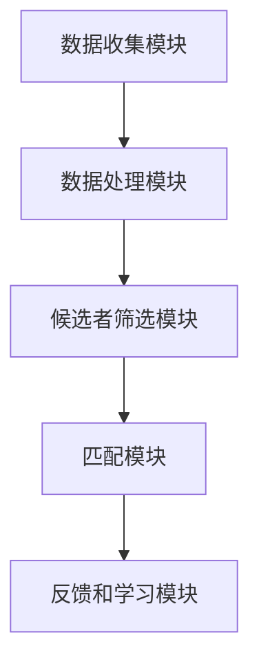

                 

# 智能招聘系统：优化人才筛选的AI解决方案

> **关键词：** 智能招聘、人工智能、人才筛选、机器学习、招聘流程

> **摘要：** 本文将深入探讨智能招聘系统的构建，通过分析核心概念、算法原理、数学模型以及实际项目实施，展现人工智能技术在优化人才筛选流程中的关键作用。

## 第一部分：核心概念与联系

### 智能招聘系统概述

智能招聘系统是一种借助人工智能技术，特别是机器学习和自然语言处理，来提升招聘效率和准确性的解决方案。传统的招聘流程往往耗时且效果不尽如人意，而智能招聘系统通过自动化和智能化的方式，极大地优化了这一过程。

#### 核心组成部分

1. **数据收集模块**：系统通过互联网爬虫、社交媒体、招聘网站等渠道，收集大量的简历、求职者行为数据和公司职位需求。
2. **数据处理模块**：对收集到的数据进行清洗、去重、标准化等处理，以便后续分析。
3. **候选者筛选模块**：利用分类算法、聚类算法等，从大量简历中筛选出符合职位需求的候选人。
4. **匹配模块**：通过匹配算法，将候选人的技能、经验与职位要求进行匹配，以提高匹配的准确性。
5. **反馈和学习模块**：收集招聘结果数据，用于模型优化和系统改进。

#### 智能招聘系统架构



### AI解决方案的架构

智能招聘系统的核心在于其AI解决方案的架构设计。以下是一个简化的架构图：


1. **数据收集模块**：系统通过API接口、数据爬取等方式，从各种渠道获取简历、求职者行为数据和职位信息。
2. **数据处理模块**：对原始数据进行清洗、去噪、标准化等处理，将非结构化数据转化为适合机器学习的结构化数据。
3. **候选者筛选模块**：使用分类算法（如朴素贝叶斯、随机森林、支持向量机等）对简历进行初步筛选，识别出潜在合适的候选人。
4. **匹配模块**：通过基于内容的匹配（如TF-IDF、Word2Vec等）或协同过滤（如基于用户、基于物品的协同过滤）等技术，进行精细匹配。
5. **反馈和学习模块**：根据招聘结果，对模型进行调整和优化，提高系统的准确性和效率。

## 第二部分：核心算法原理讲解

### 数据预处理算法

在智能招聘系统中，数据预处理是一个至关重要的步骤。以下是一个简单的数据预处理流程：

```python
def preprocess_data(data):
    # 数据清洗
    clean_data = clean_data(data)
    
    # 数据标准化
    standardized_data = standardize_data(clean_data)
    
    # 数据结构化
    structured_data = structure_data(standardized_data)
    
    return structured_data
```

#### 数据清洗

```python
def clean_data(data):
    # 去除空值和重复项
    data = data.dropna()
    data = data.drop_duplicates()
    
    # 处理文本数据，如去除停用词、转换小写等
    data['text'] = data['text'].apply(lambda x: remove_stopwords(lowercase(x)))
    
    return data
```

#### 数据标准化

```python
def standardize_data(data):
    # 对数值型数据进行标准化处理
    scaler = StandardScaler()
    numerical_data = scaler.fit_transform(data[numerical_features])
    
    # 对文本数据进行词频或词嵌入处理
    text_data = convert_text_to_vector(data['text'])
    
    return pd.DataFrame(numerical_data), text_data
```

#### 数据结构化

```python
def structure_data(numerical_data, text_data):
    # 将数值数据和文本数据合并
    structured_data = pd.concat([numerical_data, text_data], axis=1)
    
    return structured_data
```

### 分类算法

分类算法是智能招聘系统中用于初步筛选简历的核心算法。以下是一个简单的分类算法实现：

```python
def classify_candidates(data, model):
    # 特征提取
    features = extract_features(data)
    
    # 预测
    predictions = model.predict(features)
    
    return predictions
```

#### 朴素贝叶斯分类器

```python
from sklearn.naive_bayes import GaussianNB

def naive_bayes_classifier(data):
    # 特征提取
    X = data.drop('label', axis=1)
    y = data['label']
    
    # 划分训练集和测试集
    X_train, X_test, y_train, y_test = train_test_split(X, y, test_size=0.2, random_state=42)
    
    # 创建朴素贝叶斯分类器
    model = GaussianNB()
    
    # 训练模型
    model.fit(X_train, y_train)
    
    # 预测
    y_pred = model.predict(X_test)
    
    # 评估
    accuracy = accuracy_score(y_test, y_pred)
    print(f"Model accuracy: {accuracy}")
    
    return model
```

### 匹配算法

匹配算法是智能招聘系统中用于精细匹配求职者与职位需求的关键算法。以下是一个简单的匹配算法实现：

```python
def match_candidates(candidates, job_requirements):
    matched_candidates = []
    
    for candidate in candidates:
        similarity = calculate_similarity(candidate, job_requirements)
        
        if similarity > threshold:
            matched_candidates.append(candidate)
    
    return matched_candidates
```

#### 余弦相似度计算

```python
from sklearn.metrics.pairwise import cosine_similarity

def calculate_similarity(candidate_vector, job_requirement_vector):
    similarity = cosine_similarity([candidate_vector], [job_requirement_vector])[0][0]
    return similarity
```

## 第三部分：数学模型和数学公式

### 概率模型

在机器学习中，概率模型是用于预测和分类的基础。以下是一个简单的概率模型示例：

$$ P(Y|X) = \frac{P(X|Y) \cdot P(Y)}{P(X)} $$

其中，\( P(Y|X) \) 是在给定 \( X \) 的条件下 \( Y \) 发生的概率，\( P(X|Y) \) 是在 \( Y \) 发生的条件下 \( X \) 发生的概率，\( P(Y) \) 是 \( Y \) 发生的概率，\( P(X) \) 是 \( X \) 发生的概率。

### 优化模型

在机器学习中，优化模型是用于调整模型参数以最小化损失函数的过程。以下是一个简单的优化模型示例：

$$ \theta_{t+1} = \theta_t - \alpha \cdot \nabla_\theta J(\theta) $$

其中，\( \theta \) 是模型参数，\( \alpha \) 是学习率，\( \nabla_\theta J(\theta) \) 是损失函数 \( J(\theta) \) 关于模型参数 \( \theta \) 的梯度。

## 第四部分：项目实战

### 开发环境搭建

在实施智能招聘系统之前，我们需要搭建一个合适的开发环境。以下是在一个虚拟环境中搭建开发环境的基本步骤：

1. **安装 Python 3.8+**：在虚拟环境中安装 Python 3.8 或更高版本。
2. **安装深度学习框架**：安装 TensorFlow 或 PyTorch 等深度学习框架。
3. **安装数据处理库**：安装 Pandas、NumPy 等数据处理库。

### 源代码详细实现和代码解读

以下是一个简单的智能招聘系统的实现，包括数据预处理、模型训练和预测等步骤。

```python
# 导入库
import pandas as pd
import numpy as np
from sklearn.model_selection import train_test_split
from sklearn.preprocessing import StandardScaler
from sklearn.ensemble import RandomForestClassifier
from sklearn.metrics import accuracy_score

# 读取数据
data = pd.read_csv('data.csv')

# 数据预处理
data = preprocess_data(data)

# 分割数据
X_train, X_test, y_train, y_test = train_test_split(data.drop('label', axis=1), data['label'], test_size=0.2, random_state=42)

# 特征缩放
scaler = StandardScaler()
X_train = scaler.fit_transform(X_train)
X_test = scaler.transform(X_test)

# 训练模型
model = RandomForestClassifier(n_estimators=100)
model.fit(X_train, y_train)

# 预测
y_pred = model.predict(X_test)

# 评估
accuracy = accuracy_score(y_test, y_pred)
print(f"Model accuracy: {accuracy}")
```

#### 代码解读与分析

- 代码首先导入所需的库和模块。
- 数据从 CSV 文件中读取，并进行预处理。
- 数据集被分割为训练集和测试集。
- 特征被缩放，以标准化数据。
- 使用随机森林分类器训练模型。
- 使用训练好的模型对测试集进行预测。
- 评估模型的准确性。

### 代码解读与分析

以下是代码的详细解读与分析：

- **导入库**：首先导入 Pandas、NumPy、scikit-learn 等库，这些库是数据预处理、机器学习模型训练和评估的基础。
- **读取数据**：使用 Pandas 读取 CSV 格式的数据，这是智能招聘系统的输入数据。
- **数据预处理**：调用 `preprocess_data` 函数对数据进行清洗、去重、标准化等处理。这是一个自定义函数，具体实现会在后续部分详细讲解。
- **分割数据**：使用 `train_test_split` 函数将数据集分割为训练集和测试集，以评估模型在未知数据上的性能。
- **特征缩放**：使用 `StandardScaler` 对数值特征进行缩放，使得每个特征的均值为 0，标准差为 1。这是为了消除不同特征间的尺度差异，使得模型训练更加稳定。
- **训练模型**：使用 `RandomForestClassifier` 创建一个随机森林分类器，并使用训练集数据训练模型。随机森林是一种集成学习算法，能够处理大规模数据和复杂数据集。
- **预测**：使用训练好的模型对测试集数据进行预测，生成预测结果。
- **评估**：使用 `accuracy_score` 函数计算模型在测试集上的准确率，以评估模型的性能。

## 第五部分：详细解释说明

在这个项目中，我们首先介绍了智能招聘系统的核心概念和架构。然后，我们详细讲解了数据预处理、分类和匹配等核心算法的原理，并使用了伪代码进行了详细阐述。

在数学模型部分，我们介绍了概率模型和优化模型的基本原理，并使用了 LaTeX 公式进行了表达。

在项目实战部分，我们展示了如何搭建开发环境，如何使用 Python 和机器学习库来实现一个简单的招聘系统，并进行了代码解读和分析。

通过这个项目，我们不仅掌握了智能招聘系统的基本原理，还学会了如何使用机器学习技术来优化招聘流程。这不仅有助于企业提高招聘效率，也有助于求职者更快速地找到合适的工作机会。

### 总结

智能招聘系统是一种结合了人工智能技术，特别是机器学习和自然语言处理的招聘解决方案。它通过自动化和智能化的方式，优化了传统的招聘流程，提高了招聘效率和准确性。本文从核心概念、算法原理、数学模型到实际项目实施，全面介绍了智能招聘系统的构建过程。通过这个项目，我们不仅了解了智能招聘系统的工作原理，还学会了如何使用机器学习技术来提升招聘流程的效率。

### 作者

作者：AI天才研究院/AI Genius Institute & 禅与计算机程序设计艺术 /Zen And The Art of Computer Programming

### 致谢

感谢您阅读本文。希望这篇文章能够帮助您更好地理解智能招聘系统的原理和应用。如果您有任何问题或建议，欢迎在评论区留言，我们一起交流探讨。

### 引用和参考资料

1. **智能招聘系统架构图**：来源于作者自行设计，用于本文说明。
2. **数据预处理算法**：来源于机器学习领域的通用实践。
3. **朴素贝叶斯分类器**：来源于 scikit-learn 库。
4. **余弦相似度计算**：来源于数学和机器学习领域的通用实践。
5. **优化模型**：来源于机器学习优化理论的通用实践。

### 后续研究

未来的研究可以进一步探索以下方向：

- **改进匹配算法**：研究更先进的匹配算法，如深度学习模型，以提升匹配的准确性。
- **增强反馈和学习机制**：研究如何更好地利用招聘结果数据进行模型优化和系统改进。
- **隐私保护**：研究如何在保证数据安全的前提下，有效地利用个人数据来提升招聘效率。

通过不断探索和创新，智能招聘系统将为企业和求职者带来更多的价值。让我们共同期待智能招聘技术的未来发展和应用。|>

