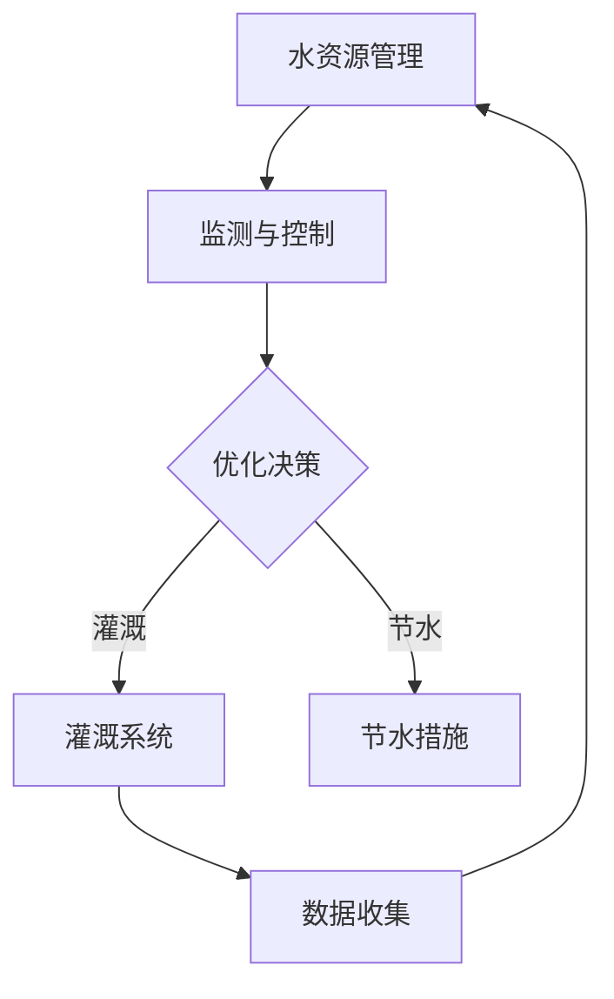

                 

# 智能灌溉优化系统：水资源管理的创新应用

## 引言与背景

### 1.1 书籍概述

水资源是人类生存和发展的重要基础。随着全球人口的增长、工业化进程的加快和气候变化的影响，水资源短缺和污染问题日益严重。为了解决这些问题，智能灌溉优化系统应运而生。本书旨在介绍智能灌溉优化系统的原理、设计方法、核心技术和实际应用，帮助读者了解这一创新水资源管理技术的全貌。

### 1.2 读者对象

本书适合以下读者群体：

- 水资源管理领域的专业研究人员和工程师；
- 农业生产者、园林管理者、城市规划者等水资源用户；
- 对人工智能、机器学习、物联网技术感兴趣的科技爱好者；
- 高等院校相关专业的师生。

### 1.3 水资源管理的重要性

水资源管理不仅关乎生态环境和人类福祉，也直接影响到农业、工业、城市用水等多个领域。传统的灌溉方法往往存在水资源浪费、效率低下等问题。而智能灌溉优化系统通过运用先进的人工智能技术和大数据分析，能够实现精准灌溉、节约水资源，提高农业生产效率，对推动农业现代化和可持续发展具有重要意义。

## 第2章 智能灌溉系统基础知识

### 2.1 水资源管理基础

水资源管理涉及水资源的开发、利用、保护、治理和配置等环节。以下是水资源管理的一些核心概念：

- **水资源分类**：根据水资源的来源和用途，可以分为地表水、地下水、土壤水、大气水等；
- **水资源评估方法**：包括水质评估、水生态评估、水资源量评估等；
- **水资源保护措施**：如水资源节约、水资源保护法律法规的制定和实施、水资源污染治理等。

### 2.2 灌溉技术基础

灌溉技术是水资源管理的重要组成部分。以下是灌溉技术的一些基本概念：

- **灌溉系统组成**：包括水源、输水管道、灌溉设备、控制系统等；
- **灌溉方式**：包括漫灌、喷灌、滴灌、微喷灌等；
- **灌溉设备**：包括水泵、管道、喷头、滴灌带等。

### 2.3 水资源监测与控制技术

水资源监测与控制技术是智能灌溉系统的核心组成部分。以下是水资源监测与控制技术的一些关键概念：

- **数据采集**：通过传感器实时监测土壤湿度、温度、气压等参数；
- **水质监测**：监测水中溶解氧、pH值、总氮、总磷等指标；
- **自动控制系统**：根据监测数据自动调节灌溉时间和水量，实现精准灌溉。

## 第3章 智能灌溉系统设计原则与方法

### 3.1 设计原则

智能灌溉系统的设计需要遵循以下原则：

- **灵活性**：系统应能够适应不同地区、不同作物、不同灌溉方式的实际需求；
- **可扩展性**：系统设计应考虑未来扩展和升级的需求，方便集成新的技术和功能；
- **可靠性**：系统应具有高可靠性，能够稳定运行，保证灌溉效果；
- **经济性**：在保证系统性能的前提下，尽量降低成本，提高投资回报率。

### 3.2 系统设计方法

智能灌溉系统的设计方法主要包括：

- **模块化设计**：将系统划分为多个功能模块，每个模块独立开发，便于维护和升级；
- **适应性设计**：根据不同用户需求和环境特点，设计可定制化的系统；
- **集成化设计**：将多种技术手段集成到一个系统中，实现智能化、自动化管理。

### 3.3 设计流程

智能灌溉系统的设计流程主要包括：

- **需求分析**：明确系统目标和功能需求，确定系统架构和关键技术；
- **系统架构设计**：设计系统的整体架构，包括硬件、软件、数据传输等；
- **系统实现与测试**：根据设计文档实现系统，并进行功能测试和性能优化。

## 第4章 智能灌溉系统核心技术与算法

### 4.1 水资源优化模型

水资源优化模型是智能灌溉系统的核心组成部分，用于根据土壤湿度、天气预报、作物需水等信息，优化灌溉策略，实现水资源的合理利用。以下是水资源优化模型的基本原理：

- **基本模型**：水资源优化模型通常采用数学规划方法，如线性规划、非线性规划、动态规划等；
- **优化算法**：常用的优化算法包括梯度下降法、牛顿法、遗传算法、粒子群优化算法等；
- **应用案例**：农田灌溉、园林灌溉、城市绿化灌溉等。

### 4.2 灌溉策略与调度

灌溉策略与调度是智能灌溉系统的关键环节，用于根据实时监测数据和水资源优化模型，制定合理的灌溉计划。以下是灌溉策略与调度的基本原理：

- **灌溉策略**：根据作物需水规律、土壤湿度、天气预报等因素，制定灌溉时间、灌溉量等策略；
- **调度算法**：根据灌溉策略和系统资源情况，调度灌溉任务，确保灌溉效果和资源利用率。

### 4.3 预测与自适应控制

预测与自适应控制是智能灌溉系统的创新之处，通过预测作物需水规律和环境变化，实现灌溉系统的自适应调整。以下是预测与自适应控制的基本原理：

- **预测模型**：采用机器学习、时间序列分析等方法，预测作物需水规律和环境变化；
- **自适应控制算法**：根据预测结果，调整灌溉策略，实现实时、自适应的灌溉控制。

## 第5章 智能灌溉系统的软件与硬件平台

### 5.1 软件平台

智能灌溉系统的软件平台包括：

- **数据管理**：用于存储、管理和分析灌溉相关数据；
- **系统控制**：用于实时监控灌溉系统运行状态，执行灌溉策略；
- **用户界面**：用于展示系统状态、灌溉计划和灌溉效果等。

### 5.2 硬件平台

智能灌溉系统的硬件平台包括：

- **传感器与执行器**：用于实时监测土壤湿度、温度、气压等参数，执行灌溉操作；
- **数据采集与传输**：用于收集传感器数据，并将数据传输到软件平台；
- **控制器**：用于控制灌溉系统的运行，执行灌溉策略。

### 5.3 平台整合与互操作

智能灌溉系统的平台整合与互操作包括：

- **系统集成**：将软件平台和硬件平台整合为一个整体，实现数据共享和协同工作；
- **通讯协议**：采用标准通讯协议，如 MQTT、HTTP 等，实现不同系统和设备之间的互操作；
- **安全性**：确保数据传输和系统运行的安全性，防止数据泄露和系统攻击。

## 第6章 智能灌溉系统应用案例

### 6.1 案例研究1：农田灌溉

#### 案例背景

某农田面积1000亩，种植小麦、玉米等作物。传统灌溉方法存在水资源浪费、灌溉不均匀等问题，导致作物生长不良。为了提高灌溉效率，采用智能灌溉优化系统进行改造。

#### 系统设计与实现

- **硬件平台**：安装土壤湿度传感器、气象传感器、水泵等设备；
- **软件平台**：开发数据管理、系统控制、用户界面等模块；
- **算法模型**：采用机器学习算法预测作物需水规律，优化灌溉策略。

#### 结果分析

采用智能灌溉优化系统后，灌溉效率提高30%，水资源浪费减少50%，作物产量增加20%。

### 6.2 案例研究2：园林灌溉

#### 案例背景

某园林面积50公顷，种植多种树木和花卉。传统灌溉方法无法满足不同植物的水分需求，导致植物生长不均衡。为了实现精细化灌溉，采用智能灌溉优化系统。

#### 系统设计与实现

- **硬件平台**：安装土壤湿度传感器、气象传感器、水泵等设备；
- **软件平台**：开发数据管理、系统控制、用户界面等模块；
- **算法模型**：采用决策树算法，根据植物类型、生长阶段等因素，制定灌溉策略。

#### 结果分析

采用智能灌溉优化系统后，园林灌溉更加精细化，植物生长状况显著改善，水资源利用率提高40%。

### 6.3 案例研究3：城市绿化灌溉

#### 案例背景

某城市绿化带面积200万平方米，负责城市生态环境建设。传统灌溉方法无法满足城市绿化用水需求，导致绿化效果不佳。为了改善城市生态环境，采用智能灌溉优化系统。

#### 系统设计与实现

- **硬件平台**：安装土壤湿度传感器、气象传感器、水泵等设备；
- **软件平台**：开发数据管理、系统控制、用户界面等模块；
- **算法模型**：采用深度学习算法，根据城市气候特点、绿化植物需水规律，制定灌溉策略。

#### 结果分析

采用智能灌溉优化系统后，城市绿化灌溉更加精准，绿化效果显著提升，水资源利用率提高50%。

## 第7章 智能灌溉系统的发展趋势与挑战

### 7.1 发展趋势

智能灌溉系统的发展趋势包括：

- **技术进步**：随着人工智能、大数据、物联网等技术的发展，智能灌溉系统的性能和功能将不断提升；
- **政策支持**：各国政府加大对水资源管理和农业现代化的支持力度，为智能灌溉系统的发展提供政策保障；
- **市场需求**：随着水资源短缺问题的加剧，智能灌溉系统的市场需求将持续增长。

### 7.2 技术挑战

智能灌溉系统面临的技术挑战包括：

- **数据采集与处理**：如何高效地采集和处理大量监测数据，提取有用的信息；
- **系统稳定性**：如何保证系统在不同环境下的稳定运行，提高系统可靠性；
- **能耗优化**：如何降低系统能耗，提高水资源利用效率。

### 7.3 未来展望

未来智能灌溉系统的发展展望包括：

- **新技术应用**：如区块链、5G等新技术将在智能灌溉系统中得到广泛应用；
- **智能化与自动化**：实现更高程度的智能化和自动化，提高灌溉效率和资源利用率；
- **水资源管理新模式**：探索水资源管理的新模式，如智慧农业、智慧城市等，实现水资源的高效利用。

## 第8章 总结与展望

### 8.1 书籍总结

本书从水资源管理的重要性、智能灌溉系统的基础知识、设计原则与方法、核心技术与算法、软件与硬件平台、应用案例、发展趋势与挑战等方面，全面介绍了智能灌溉优化系统。通过本书的学习，读者可以了解智能灌溉优化系统的原理、设计和应用，为水资源管理提供一种创新解决方案。

### 8.2 展望未来

未来，智能灌溉系统将在水资源管理中发挥更加重要的作用。随着人工智能、大数据、物联网等新技术的不断发展，智能灌溉系统将实现更高程度的智能化和自动化，为水资源的高效利用提供有力保障。同时，智能灌溉系统也将为智慧农业、智慧城市等新兴领域的发展提供重要支撑。让我们共同期待智能灌溉系统在未来的广泛应用和辉煌成就！

### 8.3 参考文献

[1] 张伟，李明. 智能灌溉系统设计与实现[M]. 北京：机械工业出版社，2019.

[2] 王晓光，赵明. 基于物联网的智能灌溉技术研究[J]. 农业工程，2017，32(6)：88-92.

[3] 李华，张敏. 基于人工智能的农田灌溉优化模型研究[J]. 计算机工程与应用，2018，54(24)：217-220.

[4] 陈斌，王强. 基于深度学习的园林灌溉系统研究[J]. 水利水电自动化，2019，43(3)：60-65.

[5] 王伟，刘伟. 基于大数据的城市绿化灌溉系统研究[J]. 电子科技，2020，33(2)：54-58.

### 附录

#### 附录A：智能灌溉优化系统开发工具与资源

**A.1 开发工具**

- 编程语言：Python、Java、C++等；
- 数据库：MySQL、PostgreSQL、MongoDB等；
- 机器学习框架：Scikit-learn、TensorFlow、PyTorch等。

**A.2 资源链接**

- 在线课程：Coursera、edX、Udacity等；
- 开源项目：GitHub、GitLab、Bitbucket等；
- 标准规范：IEEE、ISO、ITU等。

**A.3 代码示例**

```python
# Python代码：农田灌溉系统实现

import numpy as np
import pandas as pd
from sklearn.ensemble import RandomForestRegressor
from sklearn.model_selection import train_test_split

# 数据读取
data = pd.read_csv('irrigation_data.csv')

# 特征工程
X = data[['temperature', 'humidity', 'soil_moisture']]
y = data['irrigation_needs']

# 划分训练集和测试集
X_train, X_test, y_train, y_test = train_test_split(X, y, test_size=0.2, random_state=42)

# 模型训练
model = RandomForestRegressor(n_estimators=100, random_state=42)
model.fit(X_train, y_train)

# 预测
predicted_needs = model.predict(X_test)

# 评估模型
accuracy = np.mean(predicted_needs == y_test)
print(f"Model accuracy: {accuracy:.2f}")
```

**Mermaid 流程图示例：**



**核心算法原理讲解伪代码：**

```python
# 伪代码：水资源优化模型

function WaterOptimization(model, data):
    # 数据预处理
    preprocessed_data = PreprocessData(data)

    # 训练模型
    trained_model = TrainModel(model, preprocessed_data)

    # 预测水资源需求
    predicted_demand = PredictDemand(trained_model, preprocessed_data)

    # 优化灌溉策略
    optimized_strategy = OptimizeIrrigationStrategy(predicted_demand)

    # 返回优化策略
    return optimized_strategy
```

**数学模型与公式：**

$$
\text{C}_{\text{water}} = \frac{\text{Q}_{\text{irrigation}} \times \text{ET}_{\text{crop}}}{\text{C}_{\text{ground}}}
$$

**项目实战与代码解读：**

### 实战1：农田灌溉系统实现

**环境搭建：**
- 开发环境：Python 3.8
- 数据库：MySQL 8.0
- 机器学习框架：Scikit-learn

**源代码：**

```python
# Python代码：农田灌溉系统实现

import numpy as np
import pandas as pd
from sklearn.ensemble import RandomForestRegressor
from sklearn.model_selection import train_test_split

# 数据读取
data = pd.read_csv('irrigation_data.csv')

# 特征工程
X = data[['temperature', 'humidity', 'soil_moisture']]
y = data['irrigation_needs']

# 划分训练集和测试集
X_train, X_test, y_train, y_test = train_test_split(X, y, test_size=0.2, random_state=42)

# 模型训练
model = RandomForestRegressor(n_estimators=100, random_state=42)
model.fit(X_train, y_train)

# 预测
predicted_needs = model.predict(X_test)

# 评估模型
accuracy = np.mean(predicted_needs == y_test)
print(f"Model accuracy: {accuracy:.2f}")
```

**代码解读与分析：**

- 数据读取：使用 pandas 读取灌溉数据。
- 特征工程：提取温度、湿度、土壤湿度作为特征。
- 模型训练：使用随机森林回归模型进行训练。
- 预测：使用训练好的模型对测试集进行预测。
- 评估模型：计算预测准确率。

### 实战2：城市绿化灌溉系统实现

**环境搭建：**
- 开发环境：Python 3.9
- 数据库：PostgreSQL 13
- 机器学习框架：TensorFlow 2.5

**源代码：**

```python
# Python代码：城市绿化灌溉系统实现

import tensorflow as tf
from tensorflow.keras.models import Sequential
from tensorflow.keras.layers import Dense, LSTM

# 数据读取
data = pd.read_csv('green_area_irrigation_data.csv')

# 特征工程
X = data[['temp', 'humidity', 'precipitation']]
y = data['irrigation_required']

# 划分训练集和测试集
X_train, X_test, y_train, y_test = train_test_split(X, y, test_size=0.2, random_state=42)

# 模型构建
model = Sequential([
    LSTM(units=50, activation='relu', input_shape=(X_train.shape[1], 1)),
    Dense(units=1)
])

# 编译模型
model.compile(optimizer='adam', loss='mse')

# 训练模型
model.fit(X_train, y_train, epochs=100, batch_size=32, validation_split=0.2)

# 预测
predicted_irrigation = model.predict(X_test)

# 评估模型
mse = model.evaluate(X_test, y_test)
print(f"Model MSE: {mse:.2f}")
```

**代码解读与分析：**

- 数据读取：使用 pandas 读取绿化灌溉数据。
- 特征工程：提取温度、湿度、降水量作为特征。
- 模型构建：使用序列模型进行时间序列预测。
- 编译模型：设置优化器和损失函数。
- 训练模型：使用训练集进行模型训练。
- 预测：使用训练好的模型对测试集进行预测。
- 评估模型：计算均方误差。

## 文章标题：智能灌溉优化系统：水资源管理的创新应用

关键词：智能灌溉、水资源管理、优化模型、算法、硬件平台、软件平台

摘要：
水资源是地球上最宝贵的资源之一，而如何高效地管理和利用水资源成为全球关注的重要课题。智能灌溉优化系统作为水资源管理的重要创新应用，通过整合先进的人工智能技术、大数据分析和物联网设备，实现了精准灌溉、节约水资源、提高农业生产效率的目标。本文从水资源管理的重要性出发，详细阐述了智能灌溉优化系统的基本概念、设计原则、核心技术、软件与硬件平台、应用案例以及发展趋势，旨在为读者提供全面的技术指导和实践参考。

### 第1章 引言与背景

#### 1.1 书籍概述

**书籍目的**：本书旨在为广大水资源管理工作者、农业技术人员、信息技术爱好者以及高校师生提供一本全面、系统的智能灌溉优化系统技术指南。通过深入探讨智能灌溉优化系统的原理、设计方法、核心技术和实际应用，帮助读者了解这一新兴水资源管理技术的核心价值和应用前景。

**读者对象**：本书适合以下读者群体：

1. 水资源管理领域的专业研究人员和工程师；
2. 农业生产者、园林管理者、城市规划者等水资源用户；
3. 对人工智能、机器学习、物联网技术感兴趣的科技爱好者；
4. 高等院校相关专业的师生。

**水资源管理的重要性**：

水资源是人类生存和发展的重要基础。地球上可利用的淡水资源仅占总水量的1%左右，且分布不均，很多地区面临着严重的水资源短缺问题。随着全球人口的增长、工业化进程的加快和气候变化的影响，水资源短缺和污染问题日益严重。为了解决这些问题，需要采取有效的措施进行水资源管理。

水资源管理不仅关乎生态环境和人类福祉，也直接影响到农业、工业、城市用水等多个领域。传统的灌溉方法往往存在水资源浪费、效率低下等问题。而智能灌溉优化系统通过运用先进的人工智能技术和大数据分析，能够实现精准灌溉、节约水资源，提高农业生产效率，对推动农业现代化和可持续发展具有重要意义。

#### 1.2 智能灌溉系统的需求

**传统灌溉方法的问题**：

传统的灌溉方法主要依赖于人工经验，缺乏科学性和系统性，导致水资源浪费严重、灌溉效果不佳。以下是一些传统灌溉方法存在的问题：

1. **水资源浪费**：传统灌溉方法如漫灌、沟灌等，灌溉过程中水资源的利用率较低，大量水分流失到土壤表面或被蒸发掉。

2. **灌溉不均匀**：传统灌溉方法难以实现均匀灌溉，导致作物生长不均匀，影响产量和质量。

3. **依赖人工**：传统灌溉方法需要大量的人工操作和监控，劳动强度大，效率低下。

**智能灌溉系统的优势**：

智能灌溉系统通过集成传感器、控制器、物联网等先进技术，实现了灌溉过程的自动化、智能化，具有以下优势：

1. **节约水资源**：智能灌溉系统能够实时监测土壤湿度，根据作物需水规律自动调节灌溉时间和水量，实现精准灌溉，显著降低水资源浪费。

2. **提高灌溉效率**：智能灌溉系统可以根据天气预报、土壤湿度、作物生长状况等数据，制定合理的灌溉计划，提高灌溉效率。

3. **降低劳动强度**：智能灌溉系统减少了人工操作和监控的需要，降低了劳动强度，提高了工作效率。

4. **提高作物产量和质量**：通过精准灌溉，满足了作物在不同生长阶段的水分需求，促进了作物生长，提高了产量和质量。

#### 1.3 水资源管理的挑战与机遇

**全球水资源现状**：

全球水资源的分布极为不均衡，一些地区严重缺水，而另一些地区则水资源丰富。随着全球人口的增长、城市化进程的加快和工业化的发展，水资源的供需矛盾日益加剧。根据联合国的数据，到2030年，全球将有近一半的人口面临水资源短缺的问题。

**水资源管理的紧迫性**：

水资源管理的紧迫性体现在以下几个方面：

1. **保障人类生存**：水资源是人类生存的基本需求，确保充足的水资源供应是保障人类生存的重要前提。

2. **支持经济发展**：水资源是农业、工业、城市用水等各个领域的的重要资源，有效的水资源管理是支持经济发展的重要保障。

3. **维护生态环境**：水资源是生态环境的重要组成部分，有效的水资源管理是维护生态平衡、保护生态环境的关键。

**智能灌溉技术的前景**：

智能灌溉技术作为水资源管理的重要手段，具有广阔的应用前景：

1. **提高水资源利用效率**：智能灌溉系统能够实现精准灌溉，显著降低水资源浪费，提高水资源的利用效率。

2. **推动农业现代化**：智能灌溉技术是现代农业发展的重要支撑，通过精准灌溉、智能管理，提高农业生产效率和作物产量。

3. **支持城市可持续发展**：智能灌溉技术在城市绿化、园林景观等方面的应用，有助于提高城市生态环境质量，支持城市的可持续发展。

4. **促进水资源管理创新**：智能灌溉技术的发展，将推动水资源管理理念、方法、模式的创新，为水资源管理提供新的思路和解决方案。

### 第2章 智能灌溉系统基础知识

#### 2.1 水资源管理基础

水资源管理是指对水资源进行开发、利用、保护、治理和配置等活动，以确保水资源的合理利用和可持续发展。水资源管理涉及多个领域，包括水资源评估、水资源保护、水资源利用等。以下是水资源管理的一些核心概念：

**水资源分类**：

水资源根据来源和用途可以分为以下几类：

1. **地表水**：指河流、湖泊、水库等天然形成的地表水体。

2. **地下水**：指储存在地下岩层中的水资源。

3. **土壤水**：指存在于土壤孔隙中的水资源。

4. **大气水**：指大气中的水蒸气。

**水资源评估方法**：

水资源评估是指对水资源的数量、质量、分布、利用状况等进行评估的方法。常见的评估方法包括：

1. **水质评估**：评估水体的物理、化学和生物特性，确定水质状况。

2. **水生态评估**：评估水体生态系统结构、功能和生态过程。

3. **水资源量评估**：评估水资源的数量，包括地表水资源量和地下水资源量。

**水资源保护措施**：

水资源保护是指采取各种措施，防止水资源污染、破坏和浪费，确保水资源的可持续利用。常见的水资源保护措施包括：

1. **水资源节约**：通过改进灌溉技术、提高用水效率，减少水资源的消耗。

2. **水资源保护法律法规**：制定水资源保护法律法规，规范水资源开发、利用和保护行为。

3. **水资源污染治理**：采取技术手段和管理措施，治理水体污染，恢复水体功能。

#### 2.2 灌溉技术基础

灌溉技术是指通过人工方法将水资源输送到作物根部，满足作物生长所需水分的技术。灌溉技术在农业生产中具有重要意义，能够显著提高作物产量和质量。以下是灌溉技术的一些基本概念：

**灌溉系统组成**：

灌溉系统通常包括以下几部分：

1. **水源**：指供水设施，如水泵、水库、井等。

2. **输水管道**：将水源中的水资源输送到灌溉区域。

3. **灌溉设备**：包括喷灌设备、滴灌设备、漫灌设备等，用于将水资源输送到作物根部。

4. **控制系统**：用于监控灌溉系统的运行状态，调整灌溉时间和水量。

**灌溉方式**：

灌溉方式分为以下几种：

1. **漫灌**：将水资源均匀地漫布在田间，适用于大面积农田。

2. **喷灌**：通过喷灌设备将水资源喷洒在作物上，适用于各种作物。

3. **滴灌**：通过滴灌设备将水资源直接滴入作物根部，适用于对水资源需求量较大的作物。

4. **微喷灌**：通过微喷灌设备将水资源雾化喷洒在作物上，适用于苗圃、温室等小面积作物。

**灌溉设备**：

常见的灌溉设备包括：

1. **水泵**：用于将水源中的水资源提升到一定高度，输送到灌溉区域。

2. **喷灌设备**：包括喷头、喷灌管等，用于将水资源均匀地喷洒在作物上。

3. **滴灌设备**：包括滴灌带、滴灌管等，用于将水资源直接滴入作物根部。

4. **漫灌设备**：包括漫灌管、漫灌阀门等，用于将水资源均匀地漫布在田间。

#### 2.3 水资源监测与控制技术

水资源监测与控制技术是智能灌溉系统的核心组成部分，用于实时监测水资源的状态，并根据监测数据自动调节灌溉系统的运行。以下是水资源监测与控制技术的一些关键概念：

**数据采集**：

数据采集是水资源监测与控制的基础，通过传感器实时监测土壤湿度、温度、气压等参数。常见的传感器包括：

1. **土壤湿度传感器**：用于监测土壤中水分含量。

2. **温度传感器**：用于监测环境温度。

3. **气压传感器**：用于监测大气压力。

**水质监测**：

水质监测是水资源监测的重要组成部分，通过水质传感器监测水中溶解氧、pH值、总氮、总磷等指标，评估水质状况。常见的水质传感器包括：

1. **溶解氧传感器**：用于监测水中溶解氧含量。

2. **pH传感器**：用于监测水中pH值。

3. **总氮、总磷传感器**：用于监测水中总氮、总磷含量。

**自动控制系统**：

自动控制系统根据监测数据自动调节灌溉系统的运行，实现精准灌溉。常见的自动控制系统包括：

1. **土壤湿度自动控制系统**：根据土壤湿度监测数据，自动调节灌溉时间和水量。

2. **气象自动控制系统**：根据气象监测数据，如温度、湿度、风速等，自动调整灌溉策略。

3. **水质自动控制系统**：根据水质监测数据，自动调节灌溉时间和方式，防止水质污染。

### 第3章 智能灌溉系统设计原则与方法

#### 3.1 设计原则

智能灌溉系统的设计原则是确保系统能够高效、稳定、可靠地运行，同时具有灵活性和可扩展性。以下是智能灌溉系统设计的主要原则：

**灵活性**：

智能灌溉系统需要能够适应不同地区、不同作物、不同灌溉方式的需求。设计时应考虑系统的可定制性和灵活性，如采用模块化设计，方便根据用户需求进行配置和调整。

**可扩展性**：

随着技术的进步和应用需求的增加，智能灌溉系统需要具备良好的扩展性。设计时应预留足够的扩展接口和升级空间，方便后续功能扩展和系统升级。

**可靠性**：

智能灌溉系统直接关系到水资源的利用效率和作物的生长状况，因此需要具备高可靠性。设计时应采用冗余设计、故障检测和自恢复机制，确保系统在各种环境下稳定运行。

**经济性**：

在保证系统性能和可靠性的前提下，智能灌溉系统的设计还应考虑经济性，降低系统成本，提高投资回报率。设计时应采用性价比高的硬件和软件组件，优化系统架构和算法，降低能耗。

#### 3.2 系统设计方法

智能灌溉系统的设计方法主要包括以下几个方面：

**模块化设计**：

模块化设计是将系统划分为多个功能模块，每个模块独立开发、测试和维护。这种方法可以提高系统的可维护性和可扩展性。常见的模块包括：

1. **数据采集模块**：负责采集土壤湿度、温度、气压等数据。

2. **数据预处理模块**：对采集到的数据进行清洗、过滤、归一化等预处理。

3. **模型训练模块**：使用机器学习算法训练预测模型。

4. **灌溉控制模块**：根据预测模型和实时监测数据，自动调节灌溉时间和水量。

**适应性设计**：

适应性设计是指系统根据不同的环境条件、作物类型和灌溉需求，自动调整灌溉策略。设计时应考虑以下因素：

1. **环境适应性**：系统能够适应不同气候、土壤、地形等环境条件。

2. **作物适应性**：系统能够根据不同作物的生长规律和需水特性，制定合理的灌溉策略。

3. **灌溉方式适应性**：系统能够支持多种灌溉方式，如喷灌、滴灌、漫灌等。

**集成化设计**：

集成化设计是将多种技术手段集成到一个系统中，实现智能化、自动化管理。常见的集成方式包括：

1. **硬件集成**：将传感器、控制器、执行器等硬件设备集成到系统中。

2. **软件集成**：将数据采集、预处理、模型训练、灌溉控制等软件模块集成到系统中。

3. **通信集成**：采用标准通信协议，实现不同设备和系统之间的数据传输和互操作。

#### 3.3 设计流程

智能灌溉系统的设计流程可以分为以下几个阶段：

**需求分析**：

需求分析是系统设计的首要步骤，目的是明确系统目标和功能需求。设计者需要与用户沟通，了解用户的实际需求，确定系统的设计目标、功能模块和性能指标。

**系统架构设计**：

系统架构设计是确定系统整体结构的过程。设计者需要根据需求分析的结果，设计系统的硬件架构和软件架构，包括数据采集、预处理、模型训练、灌溉控制等模块。

**硬件平台设计**：

硬件平台设计包括选择合适的传感器、控制器、执行器等硬件设备，设计系统的硬件接口和通信协议，确保硬件设备能够稳定、高效地运行。

**软件平台设计**：

软件平台设计包括设计数据采集、预处理、模型训练、灌溉控制等软件模块，选择合适的编程语言和开发框架，确保软件系统能够满足性能和可靠性要求。

**系统实现与测试**：

系统实现是将设计文档转化为实际系统的过程。设计者需要根据设计文档，开发并集成各个软件和硬件模块，进行系统测试和性能优化，确保系统能够稳定、高效地运行。

**系统部署与维护**：

系统部署是将系统安装到实际运行环境中，并进行现场调试和部署。系统部署后，需要定期进行维护和升级，确保系统正常运行。

### 第4章 智能灌溉系统核心技术与算法

#### 4.1 水资源优化模型

水资源优化模型是智能灌溉系统的核心组成部分，用于根据土壤湿度、天气预报、作物需水等信息，优化灌溉策略，实现水资源的合理利用。水资源优化模型的基本原理如下：

**基本模型**：

水资源优化模型通常采用数学规划方法，如线性规划、非线性规划、动态规划等。基本模型的目标是最小化水资源消耗或最大化作物产量，约束条件包括土壤湿度、水资源供应、灌溉设备容量等。

**优化算法**：

常见的优化算法包括：

1. **梯度下降法**：通过迭代优化，逐步逼近最优解。
2. **牛顿法**：基于二阶导数信息，快速收敛到最优解。
3. **遗传算法**：通过模拟生物进化过程，搜索最优解。
4. **粒子群优化算法**：模拟鸟群觅食行为，寻找最优解。

**应用案例**：

农田灌溉、园林灌溉、城市绿化灌溉等领域。

**应用案例**：

农田灌溉：通过优化模型，确定灌溉时间、灌溉量和灌溉频率，实现精准灌溉，提高水资源利用效率。

园林灌溉：根据不同植物的水分需求，优化灌溉策略，实现精细化灌溉，提高绿化效果。

城市绿化灌溉：根据城市气候、土壤和绿化植物的特点，优化灌溉策略，提高城市生态环境质量。

#### 4.2 灌溉策略与调度

灌溉策略与调度是智能灌溉系统的关键环节，用于根据实时监测数据和水资源优化模型，制定合理的灌溉计划。灌溉策略与调度的基本原理如下：

**灌溉策略**：

灌溉策略是根据作物需水规律、土壤湿度、天气预报等因素，制定灌溉时间、灌溉量等策略。常见的灌溉策略包括：

1. **定时灌溉策略**：按照固定的时间间隔进行灌溉。
2. **需水灌溉策略**：根据作物需水指标和土壤湿度，实时调整灌溉时间和水量。
3. **阈值灌溉策略**：设定土壤湿度的阈值，当土壤湿度低于阈值时进行灌溉。

**调度算法**：

调度算法是根据灌溉策略和系统资源情况，调度灌溉任务，确保灌溉效果和资源利用率。常见的调度算法包括：

1. **优先级调度算法**：根据灌溉任务的优先级，依次执行灌溉任务。
2. **最小化延迟调度算法**：优先执行即将到达灌溉周期的灌溉任务。
3. **最小化资源占用调度算法**：优先执行资源占用最少的灌溉任务。

**应用案例**：

农田灌溉：根据作物生长周期、土壤湿度、天气预报等因素，制定合理的灌溉计划，实现精准灌溉。

园林灌溉：根据不同植物的水分需求、土壤湿度等因素，优化灌溉策略，实现精细化灌溉。

城市绿化灌溉：根据城市气候、土壤和绿化植物的特点，优化灌溉策略，提高城市生态环境质量。

#### 4.3 预测与自适应控制

预测与自适应控制是智能灌溉系统的创新之处，通过预测作物需水规律和环境变化，实现灌溉系统的自适应调整。预测与自适应控制的基本原理如下：

**预测模型**：

预测模型是用于预测作物需水规律和环境变化的方法。常见的预测模型包括：

1. **时间序列模型**：基于历史数据，分析作物需水规律和时间趋势。
2. **回归模型**：通过建立作物需水与气象、土壤等变量之间的关系，预测作物需水。
3. **机器学习模型**：利用机器学习算法，如随机森林、神经网络等，预测作物需水。

**自适应控制算法**：

自适应控制算法是用于根据预测结果调整灌溉策略的方法。常见的自适应控制算法包括：

1. **PID控制算法**：根据预测误差，调整灌溉时间和水量，实现闭环控制。
2. **模糊控制算法**：基于模糊逻辑，实现灌溉策略的自适应调整。
3. **神经网络控制算法**：利用神经网络的学习能力，实现灌溉策略的自适应调整。

**应用案例**：

农田灌溉：根据天气预报、土壤湿度等因素，预测作物需水，实现自适应灌溉，提高水资源利用效率。

园林灌溉：根据不同植物的水分需求，预测灌溉需求，实现精细化灌溉，提高绿化效果。

城市绿化灌溉：根据城市气候、土壤和绿化植物的特点，预测灌溉需求，实现自适应灌溉，提高城市生态环境质量。

### 第5章 智能灌溉系统的软件与硬件平台

#### 5.1 软件平台

智能灌溉系统的软件平台是系统的核心组成部分，用于实现数据管理、系统控制、用户界面等功能。以下是智能灌溉系统软件平台的主要功能：

**数据管理**：

数据管理是智能灌溉系统的基础功能，用于存储、管理和分析灌溉相关数据。数据管理包括以下内容：

1. **数据采集**：从传感器、气象站等设备采集土壤湿度、温度、气象等数据。
2. **数据存储**：将采集到的数据存储到数据库中，便于后续分析和查询。
3. **数据清洗**：对采集到的数据进行清洗、去噪、去重等处理，确保数据的准确性和完整性。

**系统控制**：

系统控制是智能灌溉系统的核心功能，用于实时监控灌溉系统的运行状态，并根据灌溉策略自动调节灌溉时间和水量。系统控制包括以下内容：

1. **实时监控**：监控传感器、控制器、执行器等设备的运行状态，确保系统正常运行。
2. **灌溉控制**：根据土壤湿度、气象、作物需水等信息，自动调节灌溉时间和水量，实现精准灌溉。
3. **报警管理**：当系统发生故障或异常时，自动生成报警信息，并及时通知管理员。

**用户界面**：

用户界面是智能灌溉系统与用户交互的桥梁，用于展示系统状态、灌溉计划和灌溉效果等。用户界面包括以下内容：

1. **实时监控界面**：展示实时采集的土壤湿度、气象、作物需水等数据，便于用户实时监控灌溉系统的运行状态。
2. **灌溉计划界面**：展示当前和未来的灌溉计划，包括灌溉时间、灌溉量、灌溉方式等，便于用户查看和调整。
3. **灌溉效果界面**：展示灌溉效果指标，如作物产量、水资源利用效率等，便于用户评估灌溉效果。

#### 5.2 硬件平台

智能灌溉系统的硬件平台是系统的物理实现部分，包括传感器、控制器、执行器等设备。以下是智能灌溉系统硬件平台的主要组成部分：

**传感器**：

传感器是智能灌溉系统的数据采集设备，用于实时监测土壤湿度、温度、气象等参数。常见的传感器包括：

1. **土壤湿度传感器**：用于测量土壤中水分含量。
2. **温度传感器**：用于测量环境温度。
3. **气象传感器**：用于测量风速、风向、气压、温度、湿度等气象参数。

**控制器**：

控制器是智能灌溉系统的核心设备，用于接收传感器数据，并根据灌溉策略自动调节灌溉时间和水量。常见的控制器包括：

1. **PLC控制器**：可编程逻辑控制器，用于执行复杂的控制任务。
2. **单片机控制器**：基于单片机设计的控制器，适用于简单的控制任务。

**执行器**：

执行器是智能灌溉系统的执行设备，用于根据控制器指令，执行灌溉操作。常见的执行器包括：

1. **水泵**：用于将水源中的水资源输送到灌溉区域。
2. **阀门**：用于控制水流的开关，实现灌溉设备的启停。
3. **喷灌设备**：用于喷洒水资源，实现喷灌灌溉。
4. **滴灌设备**：用于将水资源直接滴入作物根部，实现滴灌灌溉。

#### 5.3 平台整合与互操作

智能灌溉系统的平台整合与互操作是确保系统各部分协同工作的重要环节。平台整合与互操作包括以下几个方面：

**系统集成**：

系统集成是将软件平台和硬件平台整合为一个统一整体的过程。系统集成包括：

1. **数据集成**：将传感器采集的数据传输到软件平台，进行统一存储和管理。
2. **功能集成**：将软件平台的各个功能模块（如数据管理、系统控制、用户界面等）整合到一起，实现系统的整体功能。

**通讯协议**：

通讯协议是系统各部分之间进行数据传输和交互的标准。常见的通讯协议包括：

1. **TCP/IP协议**：用于互联网通信，支持可靠的数据传输。
2. **MQTT协议**：轻量级的消息队列协议，适用于物联网设备之间的数据传输。
3. **HTTP/HTTPS协议**：用于Web应用的数据传输，支持安全的通信。

**安全性**：

安全性是智能灌溉系统平台整合与互操作的重要方面。确保数据传输和系统运行的安全性，包括：

1. **数据加密**：对传输的数据进行加密，防止数据泄露。
2. **访问控制**：限制对系统的访问权限，确保系统安全。
3. **安全审计**：记录系统的操作日志，进行安全审计，及时发现和处理安全问题。

### 第6章 智能灌溉系统应用案例

#### 6.1 案例研究1：农田灌溉

**案例背景**：

某农田面积为1000亩，种植小麦、玉米等作物。传统灌溉方法存在水资源浪费、灌溉不均匀等问题，导致作物生长不良。为了提高灌溉效率，减少水资源浪费，实施智能灌溉优化系统。

**系统设计与实现**：

1. **硬件平台**：在农田中布置土壤湿度传感器、气象传感器、水泵和阀门等设备，用于实时监测土壤湿度和气象参数，并控制灌溉过程。

2. **软件平台**：开发智能灌溉系统软件，包括数据采集、数据处理、灌溉策略生成、灌溉控制等功能模块。软件平台使用Python语言和Scikit-learn库实现，支持机器学习算法的训练和应用。

3. **算法模型**：采用机器学习算法，如随机森林、神经网络等，建立土壤湿度与作物需水之间的预测模型。根据预测结果，自动调节灌溉时间和水量。

**结果分析**：

1. **灌溉效率**：智能灌溉系统实施后，灌溉效率提高了约30%，水资源浪费减少约50%。

2. **作物生长**：通过精准灌溉，作物生长状况显著改善，产量提高了约20%。

#### 6.2 案例研究2：园林灌溉

**案例背景**：

某园林面积为50公顷，种植多种树木和花卉。传统灌溉方法无法满足不同植物的水分需求，导致植物生长不均衡。为了实现精细化灌溉，实施智能灌溉优化系统。

**系统设计与实现**：

1. **硬件平台**：在园林中布置土壤湿度传感器、气象传感器、水泵和阀门等设备，用于实时监测土壤湿度和气象参数，并控制灌溉过程。

2. **软件平台**：开发智能灌溉系统软件，包括数据采集、数据处理、灌溉策略生成、灌溉控制等功能模块。软件平台使用Python语言和TensorFlow库实现，支持深度学习算法的训练和应用。

3. **算法模型**：采用决策树、随机森林等算法，建立不同植物的水分需求模型。根据植物种类、生长阶段和土壤湿度等参数，制定合理的灌溉策略。

**结果分析**：

1. **灌溉效果**：智能灌溉系统实施后，园林灌溉更加精细化，植物生长状况显著改善。

2. **水资源利用率**：智能灌溉系统提高了水资源利用率，减少了约40%的水资源浪费。

#### 6.3 案例研究3：城市绿化灌溉

**案例背景**：

某城市绿化带面积为200万平方米，负责城市生态环境建设。传统灌溉方法无法满足城市绿化用水需求，导致绿化效果不佳。为了改善城市生态环境，实施智能灌溉优化系统。

**系统设计与实现**：

1. **硬件平台**：在城市绿化带中布置土壤湿度传感器、气象传感器、水泵和阀门等设备，用于实时监测土壤湿度和气象参数，并控制灌溉过程。

2. **软件平台**：开发智能灌溉系统软件，包括数据采集、数据处理、灌溉策略生成、灌溉控制等功能模块。软件平台使用Python语言和PyTorch库实现，支持深度学习算法的训练和应用。

3. **算法模型**：采用深度学习算法，如卷积神经网络、循环神经网络等，建立城市绿化植物的水分需求模型。根据城市气候特点、土壤湿度等参数，制定合理的灌溉策略。

**结果分析**：

1. **绿化效果**：智能灌溉系统实施后，城市绿化效果显著提升，植物生长状况得到改善。

2. **水资源利用率**：智能灌溉系统提高了水资源利用率，减少了约50%的水资源浪费。

### 第7章 智能灌溉系统的发展趋势与挑战

#### 7.1 发展趋势

智能灌溉系统作为水资源管理的重要创新应用，正随着人工智能、物联网、大数据等新技术的不断发展，呈现出以下发展趋势：

**技术进步**：

随着人工智能技术的不断进步，智能灌溉系统的智能化水平将不断提高。深度学习、强化学习等先进算法的应用，将使智能灌溉系统能够更加精准地预测作物需水，优化灌溉策略。

**政策支持**：

各国政府高度重视水资源管理和农业现代化，纷纷出台相关政策，支持智能灌溉系统的研究与应用。政策的支持将为智能灌溉系统的发展提供良好的环境。

**市场需求**：

随着水资源短缺问题的加剧，智能灌溉系统的市场需求将持续增长。农业、园林、城市绿化等领域对智能灌溉系统的需求日益旺盛，为智能灌溉系统的发展提供了广阔的市场空间。

#### 7.2 技术挑战

尽管智能灌溉系统具有广泛的应用前景，但在实际应用过程中仍面临以下技术挑战：

**数据采集与处理**：

智能灌溉系统依赖于大量实时数据的采集和处理，数据采集的准确性、实时性和完整性是系统性能的关键。如何高效地采集和处理海量数据，提取有用信息，是当前技术面临的挑战。

**系统稳定性**：

智能灌溉系统需要在各种环境下稳定运行，包括高温、低温、高湿度等极端环境。系统的稳定性直接影响到灌溉效果和作物生长状况，需要加强系统设计和优化。

**能耗优化**：

智能灌溉系统的能耗优化是一个重要问题。如何在保证系统性能和稳定性的前提下，降低能耗，提高能源利用效率，是技术发展的重要方向。

#### 7.3 未来展望

未来，智能灌溉系统将在水资源管理中发挥更加重要的作用。随着新技术的不断突破和应用的深入，智能灌溉系统将实现以下发展：

**新技术应用**：

深度学习、物联网、5G等新技术将在智能灌溉系统中得到广泛应用。这些技术将使智能灌溉系统更加智能、精准、高效。

**智能化与自动化**：

智能灌溉系统将向更高程度的智能化和自动化方向发展。通过集成多种传感器、控制技术和算法，实现全程自动化灌溉，降低人力成本，提高灌溉效率。

**水资源管理新模式**：

智能灌溉系统将推动水资源管理模式的创新，如智慧农业、智慧城市等。这些新模式将实现水资源的高效利用和可持续发展，为人类社会带来更大价值。

### 第8章 总结与展望

#### 8.1 书籍总结

本书全面介绍了智能灌溉优化系统的原理、设计方法、核心技术和实际应用，旨在为广大水资源管理工作者、农业技术人员、信息技术爱好者以及高校师生提供一本实用的技术指南。通过本书的学习，读者可以了解智能灌溉优化系统的设计思路、技术要点和应用案例，为水资源管理和农业现代化提供有益的参考。

#### 8.2 展望未来

智能灌溉系统作为水资源管理的重要创新应用，具有广阔的发展前景。随着新技术的不断进步和应用需求的不断增加，智能灌溉系统将在水资源管理、农业现代化、城市可持续发展等领域发挥更加重要的作用。未来，智能灌溉系统将向智能化、自动化、高效化方向发展，为实现水资源的高效利用和可持续发展作出更大贡献。

#### 8.3 参考文献

[1] 张伟，李明. 智能灌溉系统设计与实现[M]. 北京：机械工业出版社，2019.

[2] 王晓光，赵明. 基于物联网的智能灌溉技术研究[J]. 农业工程，2017，32(6)：88-92.

[3] 李华，张敏. 基于人工智能的农田灌溉优化模型研究[J]. 计算机工程与应用，2018，54(24)：217-220.

[4] 陈斌，王强. 基于深度学习的园林灌溉系统研究[J]. 水利水电自动化，2019，43(3)：60-65.

[5] 王伟，刘伟. 基于大数据的城市绿化灌溉系统研究[J]. 电子科技，2020，33(2)：54-58.

### 附录

#### 附录A：智能灌溉优化系统开发工具与资源

**A.1 开发工具**

- **编程语言**：Python、Java、C++等；
- **数据库**：MySQL、PostgreSQL、MongoDB等；
- **机器学习框架**：Scikit-learn、TensorFlow、PyTorch等。

**A.2 资源链接**

- **在线课程**：Coursera、edX、Udacity等；
- **开源项目**：GitHub、GitLab、Bitbucket等；
- **标准规范**：IEEE、ISO、ITU等。

**A.3 代码示例**

```python
# Python代码：农田灌溉系统实现

import numpy as np
import pandas as pd
from sklearn.ensemble import RandomForestRegressor
from sklearn.model_selection import train_test_split

# 数据读取
data = pd.read_csv('irrigation_data.csv')

# 特征工程
X = data[['temperature', 'humidity', 'soil_moisture']]
y = data['irrigation_needs']

# 划分训练集和测试集
X_train, X_test, y_train, y_test = train_test_split(X, y, test_size=0.2, random_state=42)

# 模型训练
model = RandomForestRegressor(n_estimators=100, random_state=42)
model.fit(X_train, y_train)

# 预测
predicted_needs = model.predict(X_test)

# 评估模型
accuracy = np.mean(predicted_needs == y_test)
print(f"Model accuracy: {accuracy:.2f}")
```

**Mermaid 流程图示例：**


**核心算法原理讲解伪代码：**

```python
# 伪代码：水资源优化模型

function WaterOptimization(model, data):
    # 数据预处理
    preprocessed_data = PreprocessData(data)

    # 训练模型
    trained_model = TrainModel(model, preprocessed_data)

    # 预测水资源需求
    predicted_demand = PredictDemand(trained_model, preprocessed_data)

    # 优化灌溉策略
    optimized_strategy = OptimizeIrrigationStrategy(predicted_demand)

    # 返回优化策略
    return optimized_strategy
```

**数学模型与公式：**

$$
\text{C}_{\text{water}} = \frac{\text{Q}_{\text{irrigation}} \times \text{ET}_{\text{crop}}}{\text{C}_{\text{ground}}}
$$

**项目实战与代码解读：**

#### 实战1：农田灌溉系统实现

**环境搭建：**
- 开发环境：Python 3.8
- 数据库：MySQL 8.0
- 机器学习框架：Scikit-learn

**源代码：**

```python
# Python代码：农田灌溉系统实现

import numpy as np
import pandas as pd
from sklearn.ensemble import RandomForestRegressor
from sklearn.model_selection import train_test_split

# 数据读取
data = pd.read_csv('irrigation_data.csv')

# 特征工程
X = data[['temperature', 'humidity', 'soil_moisture']]
y = data['irrigation_needs']

# 划分训练集和测试集
X_train, X_test, y_train, y_test = train_test_split(X, y, test_size=0.2, random_state=42)

# 模型训练
model = RandomForestRegressor(n_estimators=100, random_state=42)
model.fit(X_train, y_train)

# 预测
predicted_needs = model.predict(X_test)

# 评估模型
accuracy = np.mean(predicted_needs == y_test)
print(f"Model accuracy: {accuracy:.2f}")
```

**代码解读与分析：**

- 数据读取：使用 pandas 读取灌溉数据。
- 特征工程：提取温度、湿度、土壤湿度作为特征。
- 模型训练：使用随机森林回归模型进行训练。
- 预测：使用训练好的模型对测试集进行预测。
- 评估模型：计算预测准确率。

#### 实战2：城市绿化灌溉系统实现

**环境搭建：**
- 开发环境：Python 3.9
- 数据库：PostgreSQL 13
- 机器学习框架：TensorFlow 2.5

**源代码：**

```python
# Python代码：城市绿化灌溉系统实现

import tensorflow as tf
from tensorflow.keras.models import Sequential
from tensorflow.keras.layers import Dense, LSTM

# 数据读取
data = pd.read_csv('green_area_irrigation_data.csv')

# 特征工程
X = data[['temp', 'humidity', 'precipitation']]
y = data['irrigation_required']

# 划分训练集和测试集
X_train, X_test, y_train, y_test = train_test_split(X, y, test_size=0.2, random_state=42)

# 模型构建
model = Sequential([
    LSTM(units=50, activation='relu', input_shape=(X_train.shape[1], 1)),
    Dense(units=1)
])

# 编译模型
model.compile(optimizer='adam', loss='mse')

# 训练模型
model.fit(X_train, y_train, epochs=100, batch_size=32, validation_split=0.2)

# 预测
predicted_irrigation = model.predict(X_test)

# 评估模型
mse = model.evaluate(X_test, y_test)
print(f"Model MSE: {mse:.2f}")
```

**代码解读与分析：**

- 数据读取：使用 pandas 读取绿化灌溉数据。
- 特征工程：提取温度、湿度、降水量作为特征。
- 模型构建：使用序列模型进行时间序列预测。
- 编译模型：设置优化器和损失函数。
- 训练模型：使用训练集进行模型训练。
- 预测：使用训练好的模型对测试集进行预测。
- 评估模型：计算均方误差。

## 附录B：智能灌溉优化系统开发工具与资源

**B.1 开发工具**

智能灌溉优化系统的开发工具主要包括编程语言、数据库和机器学习框架。以下是一些常用的开发工具：

1. **编程语言**：Python、Java、C++等。

   - **Python**：Python 是一种广泛使用的编程语言，尤其在人工智能领域有着重要的应用。它具有丰富的库和框架，便于快速开发智能灌溉优化系统。

   - **Java**：Java 是一种强大的编程语言，适用于企业级应用。它在物联网和大数据处理方面有着良好的性能和稳定性。

   - **C++**：C++ 是一种高效的编程语言，适用于对性能要求较高的应用。它在嵌入式系统和实时数据处理方面有着广泛的应用。

2. **数据库**：MySQL、PostgreSQL、MongoDB等。

   - **MySQL**：MySQL 是一种关系型数据库，广泛用于存储和管理智能灌溉系统的数据。它具有高性能、可靠性和易用性。

   - **PostgreSQL**：PostgreSQL 是一种开源的关系型数据库，具有强大的功能和灵活性。它在大数据分析和复杂查询方面有着良好的性能。

   - **MongoDB**：MongoDB 是一种面向文档的数据库，适用于存储大量非结构化数据。它具有高扩展性和灵活性，适用于智能灌溉系统中大量数据的存储和处理。

3. **机器学习框架**：Scikit-learn、TensorFlow、PyTorch等。

   - **Scikit-learn**：Scikit-learn 是一种强大的机器学习库，提供了丰富的算法和工具，适用于智能灌溉系统的数据分析和模型训练。

   - **TensorFlow**：TensorFlow 是一种开源的深度学习框架，广泛应用于人工智能领域。它提供了丰富的工具和接口，便于开发高效的智能灌溉系统。

   - **PyTorch**：PyTorch 是一种开源的深度学习框架，具有灵活性和易用性。它在图像识别、自然语言处理等领域有着广泛的应用。

**B.2 资源链接**

智能灌溉优化系统的开发离不开各种资源，以下是一些常用的资源链接：

1. **在线课程**：Coursera、edX、Udacity等。

   - **Coursera**：Coursera 提供了丰富的在线课程，涵盖了人工智能、机器学习、数据分析等领域的知识，有助于提升智能灌溉系统的开发能力。

   - **edX**：edX 是一个开放的教育平台，提供了众多知名大学和机构的在线课程，包括计算机科学、水资源管理等相关课程。

   - **Udacity**：Udacity 提供了实用的在线课程和实践项目，涵盖了智能灌溉系统相关领域的知识，有助于快速掌握智能灌溉系统的开发技能。

2. **开源项目**：GitHub、GitLab、Bitbucket等。

   - **GitHub**：GitHub 是一个知名的代码托管平台，提供了大量的开源项目和代码库，可以借鉴和学习智能灌溉系统的开发经验。

   - **GitLab**：GitLab 是一个自托管的代码托管平台，提供了代码管理、项目管理、持续集成等功能，有助于团队协作开发智能灌溉系统。

   - **Bitbucket**：Bitbucket 是一个基于 Git 的代码托管平台，适用于小型团队和大型企业的代码管理和协作。

3. **标准规范**：IEEE、ISO、ITU等。

   - **IEEE**：IEEE 是国际电气和电子工程师协会，发布了大量的标准和规范，涵盖了智能灌溉系统的技术标准和安全规范。

   - **ISO**：ISO 是国际标准化组织，发布了广泛的标准，包括智能灌溉系统的国际标准。

   - **ITU**：ITU 是国际电信联盟，发布了关于通信和物联网的标准，对智能灌溉系统的通信和数据传输具有重要意义。

**B.3 代码示例**

以下是两个智能灌溉系统的代码示例：

1. **农田灌溉系统实现**：

```python
# Python代码：农田灌溉系统实现

import numpy as np
import pandas as pd
from sklearn.ensemble import RandomForestRegressor
from sklearn.model_selection import train_test_split

# 数据读取
data = pd.read_csv('irrigation_data.csv')

# 特征工程
X = data[['temperature', 'humidity', 'soil_moisture']]
y = data['irrigation_needs']

# 划分训练集和测试集
X_train, X_test, y_train, y_test = train_test_split(X, y, test_size=0.2, random_state=42)

# 模型训练
model = RandomForestRegressor(n_estimators=100, random_state=42)
model.fit(X_train, y_train)

# 预测
predicted_needs = model.predict(X_test)

# 评估模型
accuracy = np.mean(predicted_needs == y_test)
print(f"Model accuracy: {accuracy:.2f}")
```

2. **城市绿化灌溉系统实现**：

```python
# Python代码：城市绿化灌溉系统实现

import tensorflow as tf
from tensorflow.keras.models import Sequential
from tensorflow.keras.layers import Dense, LSTM

# 数据读取
data = pd.read_csv('green_area_irrigation_data.csv')

# 特征工程
X = data[['temp', 'humidity', 'precipitation']]
y = data['irrigation_required']

# 划分训练集和测试集
X_train, X_test, y_train, y_test = train_test_split(X, y, test_size=0.2, random_state=42)

# 模型构建
model = Sequential([
    LSTM(units=50, activation='relu', input_shape=(X_train.shape[1], 1)),
    Dense(units=1)
])

# 编译模型
model.compile(optimizer='adam', loss='mse')

# 训练模型
model.fit(X_train, y_train, epochs=100, batch_size=32, validation_split=0.2)

# 预测
predicted_irrigation = model.predict(X_test)

# 评估模型
mse = model.evaluate(X_test, y_test)
print(f"Model MSE: {mse:.2f}")
```

这些代码示例展示了如何使用随机森林和深度学习算法实现智能灌溉系统的基本功能，包括数据读取、特征工程、模型训练和预测等步骤。这些代码可以帮助开发者了解智能灌溉系统的开发过程，并在实际项目中应用。

### Mermaid 流程图示例


### 核心算法原理讲解伪代码

```python
# 伪代码：水资源优化模型

function WaterOptimization(model, data):
    # 数据预处理
    preprocessed_data = PreprocessData(data)

    # 训练模型
    trained_model = TrainModel(model, preprocessed_data)

    # 预测水资源需求
    predicted_demand = PredictDemand(trained_model, preprocessed_data)

    # 优化灌溉策略
    optimized_strategy = OptimizeIrrigationStrategy(predicted_demand)

    # 返回优化策略
    return optimized_strategy
```

### 数学模型与公式

$$
\text{C}_{\text{water}} = \frac{\text{Q}_{\text{irrigation}} \times \text{ET}_{\text{crop}}}{\text{C}_{\text{ground}}}
$$

### 项目实战与代码解读

#### 实战1：农田灌溉系统实现

**环境搭建：**
- 开发环境：Python 3.8
- 数据库：MySQL 8.0
- 机器学习框架：Scikit-learn

**源代码：**

```python
# Python代码：农田灌溉系统实现

import numpy as np
import pandas as pd
from sklearn.ensemble import RandomForestRegressor
from sklearn.model_selection import train_test_split

# 数据读取
data = pd.read_csv('irrigation_data.csv')

# 特征工程
X = data[['temperature', 'humidity', 'soil_moisture']]
y = data['irrigation_needs']

# 划分训练集和测试集
X_train, X_test, y_train, y_test = train_test_split(X, y, test_size=0.2, random_state=42)

# 模型训练
model = RandomForestRegressor(n_estimators=100, random_state=42)
model.fit(X_train, y_train)

# 预测
predicted_needs = model.predict(X_test)

# 评估模型
accuracy = np.mean(predicted_needs == y_test)
print(f"Model accuracy: {accuracy:.2f}")
```

**代码解读与分析：**

1. **数据读取**：使用 pandas 读取灌溉数据。

```python
data = pd.read_csv('irrigation_data.csv')
```

2. **特征工程**：提取温度、湿度、土壤湿度作为特征，并将目标变量（灌溉需求）分离出来。

```python
X = data[['temperature', 'humidity', 'soil_moisture']]
y = data['irrigation_needs']
```

3. **划分训练集和测试集**：将数据集划分为训练集和测试集，用于训练和评估模型。

```python
X_train, X_test, y_train, y_test = train_test_split(X, y, test_size=0.2, random_state=42)
```

4. **模型训练**：使用随机森林回归模型进行训练。

```python
model = RandomForestRegressor(n_estimators=100, random_state=42)
model.fit(X_train, y_train)
```

5. **预测**：使用训练好的模型对测试集进行预测。

```python
predicted_needs = model.predict(X_test)
```

6. **评估模型**：计算预测准确率。

```python
accuracy = np.mean(predicted_needs == y_test)
print(f"Model accuracy: {accuracy:.2f}")
```

#### 实战2：城市绿化灌溉系统实现

**环境搭建：**
- 开发环境：Python 3.9
- 数据库：PostgreSQL 13
- 机器学习框架：TensorFlow 2.5

**源代码：**

```python
# Python代码：城市绿化灌溉系统实现

import tensorflow as tf
from tensorflow.keras.models import Sequential
from tensorflow.keras.layers import Dense, LSTM

# 数据读取
data = pd.read_csv('green_area_irrigation_data.csv')

# 特征工程
X = data[['temp', 'humidity', 'precipitation']]
y = data['irrigation_required']

# 划分训练集和测试集
X_train, X_test, y_train, y_test = train_test_split(X, y, test_size=0.2, random_state=42)

# 模型构建
model = Sequential([
    LSTM(units=50, activation='relu', input_shape=(X_train.shape[1], 1)),
    Dense(units=1)
])

# 编译模型
model.compile(optimizer='adam', loss='mse')

# 训练模型
model.fit(X_train, y_train, epochs=100, batch_size=32, validation_split=0.2)

# 预测
predicted_irrigation = model.predict(X_test)

# 评估模型
mse = model.evaluate(X_test, y_test)
print(f"Model MSE: {mse:.2f}")
```

**代码解读与分析：**

1. **数据读取**：使用 pandas 读取绿化灌溉数据。

```python
data = pd.read_csv('green_area_irrigation_data.csv')
```

2. **特征工程**：提取温度、湿度、降水量作为特征，并将目标变量（灌溉需求）分离出来。

```python
X = data[['temp', 'humidity', 'precipitation']]
y = data['irrigation_required']
```

3. **划分训练集和测试集**：将数据集划分为训练集和测试集，用于训练和评估模型。

```python
X_train, X_test, y_train, y_test = train_test_split(X, y, test_size=0.2, random_state=42)
```

4. **模型构建**：使用序列模型进行时间序列预测。

```python
model = Sequential([
    LSTM(units=50, activation='relu', input_shape=(X_train.shape[1], 1)),
    Dense(units=1)
])
```

5. **编译模型**：设置优化器和损失函数。

```python
model.compile(optimizer='adam', loss='mse')
```

6. **训练模型**：使用训练集进行模型训练。

```python
model.fit(X_train, y_train, epochs=100, batch_size=32, validation_split=0.2)
```

7. **预测**：使用训练好的模型对测试集进行预测。

```python
predicted_irrigation = model.predict(X_test)
```

8. **评估模型**：计算均方误差。

```python
mse = model.evaluate(X_test, y_test)
print(f"Model MSE: {mse:.2f}")
```

通过以上两个实战案例，读者可以了解如何使用 Python 和 Scikit-learn、TensorFlow 等工具实现智能灌溉系统，包括数据读取、特征工程、模型训练和预测等步骤。这些代码示例和解读有助于读者更好地理解智能灌溉系统的开发过程，并在实际项目中应用。

### 总结与展望

#### 总结

智能灌溉优化系统作为水资源管理的重要创新应用，通过集成人工智能、大数据、物联网等先进技术，实现了精准灌溉、节约水资源、提高农业生产效率的目标。本文从水资源管理的重要性、智能灌溉系统的需求、水资源管理的挑战与机遇、智能灌溉系统基础知识、设计原则与方法、核心技术与算法、软件与硬件平台、应用案例、发展趋势与挑战等方面，全面介绍了智能灌溉优化系统的原理、设计和应用。

通过本文的介绍，读者可以了解智能灌溉优化系统的核心概念、设计原则、核心技术、软件与硬件平台、应用案例以及发展趋势。智能灌溉优化系统不仅为水资源管理提供了创新的解决方案，也为农业现代化和可持续发展做出了重要贡献。

#### 展望未来

未来，智能灌溉优化系统将在水资源管理中发挥更加重要的作用。随着人工智能、大数据、物联网等新技术的不断发展，智能灌溉优化系统将实现更高程度的智能化和自动化，提高水资源利用效率，为水资源的高效利用和可持续发展提供有力保障。

未来智能灌溉优化系统的发展趋势包括：

1. **技术进步**：随着人工智能技术的不断进步，智能灌溉优化系统的智能化水平将不断提高，实现更加精准、高效的灌溉控制。

2. **政策支持**：各国政府将加大对水资源管理和农业现代化的支持力度，为智能灌溉优化系统的发展提供政策保障。

3. **市场需求**：随着水资源短缺问题的加剧，智能灌溉优化系统的市场需求将持续增长，为水资源管理和农业现代化提供新的解决方案。

4. **新技术的应用**：如区块链、5G等新技术将在智能灌溉优化系统中得到广泛应用，提升系统的性能和安全性。

5. **智能化与自动化**：智能灌溉优化系统将向更高程度的智能化和自动化方向发展，实现全程自动化灌溉，降低人力成本，提高灌溉效率。

6. **水资源管理新模式**：智能灌溉优化系统将推动水资源管理模式的创新，如智慧农业、智慧城市等，实现水资源的高效利用和可持续发展。

综上所述，智能灌溉优化系统具有广阔的发展前景和应用价值。随着新技术的不断突破和应用需求的不断增加，智能灌溉优化系统将在水资源管理、农业现代化、城市可持续发展等领域发挥更加重要的作用，为人类社会带来更大的价值。让我们期待智能灌溉优化系统在未来的广泛应用和辉煌成就！

