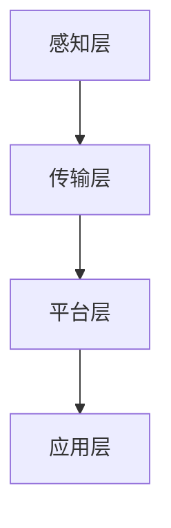

                 

### 文章标题

#### 《智能能源管理创业：节能减排的科技解决方案》

关键词：智能能源管理、节能减排、科技解决方案、创业实践、算法原理

摘要：本文从智能能源管理的基础出发，详细探讨了智能能源管理技术、核心算法原理以及实际应用场景，进一步分析了节能减排的科技解决方案，并通过实际创业实践案例，展示了智能能源管理在节能减排中的巨大潜力。本文旨在为创业者提供一套完整的智能能源管理创业指南，助力实现可持续发展的目标。

### 《智能能源管理创业：节能减排的科技解决方案》目录大纲

#### 第一部分：智能能源管理基础

##### 第1章：智能能源管理概述  
- **1.1 智能能源管理的基本概念**  
  - **智能能源系统**  
  - **能源互联网**  
  - **智能电网**  
- **1.2 智能能源管理的重要性**  
  - **节能减排的意义**  
  - **智能能源管理的挑战**  
- **1.3 智能能源管理的体系结构**  
  - **感知层**  
  - **传输层**  
  - **平台层**  
  - **应用层**

##### 第2章：智能能源管理技术基础  
- **2.1 传感器技术**  
  - **常见传感器介绍**  
  - **传感器网络**  
  - **传感器数据处理**  
- **2.2 数据通信技术**  
  - **无线传感器网络**  
  - **物联网协议**  
  - **数据传输与安全**  
- **2.3 大数据与云计算技术**  
  - **大数据处理**  
  - **云计算平台**  
  - **数据存储与挖掘**

##### 第3章：核心算法原理讲解  
- **3.1 能源优化算法**  
  - **线性规划**  
  - **遗传算法**  
  - **神经网络**  
- **3.2 智能预测模型**  
  - **时间序列分析**  
  - **机器学习预测模型**  
  - **深度学习模型**

##### 第4章：智能能源管理应用场景  
- **4.1 智能楼宇管理**  
  - **空调系统优化**  
  - **照明系统控制**  
  - **电力负荷管理**  
- **4.2 智能工业园区管理**  
  - **能耗监测与控制**  
  - **能源调度与优化**  
  - **能源交易管理**  
- **4.3 智能社区管理**  
  - **能源消费数据采集**  
  - **能源消费分析**  
  - **智能能源服务**

##### 第5章：智能能源管理创业实践  
- **5.1 创业团队建设**  
  - **团队角色分工**  
  - **项目规划与管理**  
- **5.2 创业项目规划**  
  - **市场调研**  
  - **技术路线选择**  
  - **商业模式设计**  
- **5.3 创业项目执行**  
  - **技术实现**  
  - **市场推广**  
  - **风险管理**

#### 第二部分：节能减排的科技解决方案

##### 第6章：节能减排的科技背景  
- **6.1 节能减排的政策背景**  
  - **国家政策**  
  - **国际公约**  
  - **地方政策**  
- **6.2 节能减排的技术现状**  
  - **节能技术**  
  - **减排技术**  
  - **环保技术**

##### 第7章：节能减排的科技解决方案  
- **7.1 能源效率提升方案**  
  - **高效能源设备**  
  - **智能控制技术**  
  - **能源管理系统**  
- **7.2 可再生能源利用方案**  
  - **太阳能利用**  
  - **风能利用**  
  - **生物质能利用**  
- **7.3 减排技术方案**  
  - **二氧化碳捕集与封存**  
  - **脱硫脱硝技术**  
  - **废弃物资源化利用**

##### 第8章：案例分析  
- **8.1 成功案例介绍**  
  - **国内案例**  
  - **国际案例**  
- **8.2 案例分析**  
  - **技术分析**  
  - **经济效益分析**  
  - **社会效益分析**

##### 第9章：未来展望  
- **9.1 智能能源管理的发展趋势**  
  - **技术趋势**  
  - **市场趋势**  
- **9.2 节能减排的前景**  
  - **技术发展**  
  - **政策支持**  
- **9.3 创业机会与挑战**

#### 附录

##### 附录A：技术资源与工具  
- **A.1 主流智能能源管理平台**  
  - **平台介绍**  
  - **功能特点**  
- **A.2 开发工具与SDK**  
  - **工具介绍**  
  - **使用指南**  
- **A.3 技术文献与资料**  
  - **学术论文**  
  - **行业报告**

##### 附录B：智能能源管理 Mermaid 流程图



##### 附录C：能源优化算法伪代码

```pseudo
function EnergyOptimization(energyData, constraints):
    // 初始化参数
    InitializeVariables()

    // 建立线性规划模型
    model = LinearProgrammingModel()

    // 添加目标函数
    model addObjective(energyData, constraints)

    // 添加约束条件
    model.addConstraints(constraints)

    // 求解模型
    solution = model.solve()

    // 返回优化结果
    return solution
```

##### 附录D：数学模型与公式

```latex
\section{能量优化模型}
\label{sec:energy_optimization_model}

假设一个能源系统的能量需求为 $E$,能源供应量为 $S$。我们希望找到一个最优的分配方案，使得能量利用效率最大化。能量优化模型可以表示为：

\begin{equation}
\max \frac{E_{use}}{E_{total}}
\end{equation}

其中，$E_{use}$ 是实际被使用的能量，$E_{total}$ 是总的能源供应量。
```

以上是文章的目录大纲，接下来我们将逐步展开各个章节的内容。让我们一起深入探讨智能能源管理创业领域的科技解决方案。

---

**第一部分：智能能源管理基础**

##### 第1章：智能能源管理概述

智能能源管理是指通过利用现代信息技术、物联网、大数据分析、人工智能等先进技术，实现能源的智能化管理和优化配置。在智能能源管理系统中，各类传感器实时采集能源使用数据，通过数据通信网络传输到数据处理平台，再由人工智能算法进行分析和优化，最终实现能源的高效利用和节能减排。

智能能源管理的基本概念包括以下几个方面：

- **智能能源系统**：这是一个集成了传感器、通信网络、数据处理平台和智能终端的综合性系统，能够实现对能源的实时监测、分析和优化。

- **能源互联网**：能源互联网是指基于物联网技术的能源传输、分配和消费网络，通过数字化手段实现能源的高效管理和优化配置。

- **智能电网**：智能电网是一种集成了电力系统、通信网络、信息和控制技术的现代化电网，能够实现电力的高效、安全、稳定传输和消费。

#### 智能能源管理的重要性

智能能源管理对于节能减排具有重要意义。首先，通过智能能源管理，可以实时监测和掌握能源使用情况，从而发现和消除能源浪费现象。其次，智能能源管理可以通过优化能源分配和调度，实现能源的高效利用，减少能源消耗。此外，智能能源管理还可以提高能源系统的稳定性和安全性，降低能源事故的风险。

#### 智能能源管理的挑战

尽管智能能源管理在节能减排方面具有巨大潜力，但其在实际应用中仍面临一些挑战。首先，智能能源系统涉及到多种技术，如传感器技术、数据通信技术、大数据分析和人工智能等，这些技术的融合和应用需要一定的技术积累和经验。其次，智能能源系统的建设和运营成本较高，需要企业投入大量资金和技术力量。此外，智能能源系统在实际运行中需要与其他系统和设备进行对接和协调，这也增加了系统的复杂性和实施难度。

#### 智能能源管理的体系结构

智能能源管理系统通常由感知层、传输层、平台层和应用层组成。

- **感知层**：感知层是智能能源系统的数据采集层，包括各种传感器，如温度传感器、湿度传感器、光照传感器、电力传感器等。这些传感器实时采集能源使用和环境数据，为后续的数据处理和分析提供基础。

- **传输层**：传输层是智能能源系统的数据传输层，包括无线传感器网络、物联网、移动互联网等。这些传输技术负责将感知层采集到的数据传输到平台层，确保数据传输的实时性和可靠性。

- **平台层**：平台层是智能能源系统的数据处理和分析层，包括数据存储、处理和分析软件。平台层通过对采集到的数据进行处理和分析，提取出有价值的信息，如能源使用趋势、能源浪费现象等，为决策层提供支持。

- **应用层**：应用层是智能能源系统的最终实现层，包括能源监测、能源优化、能源管理等功能。应用层通过实现具体的能源管理功能，如空调系统优化、照明系统控制、电力负荷管理等，实现对能源的高效利用和节能减排。

##### 总结

智能能源管理是当前能源管理领域的发展方向，具有巨大的节能减排潜力。通过感知层、传输层、平台层和应用层的协同工作，智能能源管理系统可以实现对能源的实时监测、分析和优化，从而实现能源的高效利用和节能减排的目标。然而，智能能源管理系统在实际应用中仍面临一些挑战，需要我们在技术、成本和协调等方面进行不断探索和优化。

---

接下来，我们将继续探讨智能能源管理的技术基础，包括传感器技术、数据通信技术和大数据与云计算技术。

##### 第2章：智能能源管理技术基础

智能能源管理的技术基础主要包括传感器技术、数据通信技术、大数据与云计算技术。这些技术共同构成了智能能源管理的核心，为能源的实时监测、数据分析和优化提供了技术支撑。

#### 2.1 传感器技术

传感器技术是智能能源管理的基石，负责采集能源使用和环境数据。常见的传感器包括温度传感器、湿度传感器、光照传感器、电力传感器等。这些传感器能够实时监测能源系统的运行状态，如温度、湿度、光照强度和电力消耗等。

- **常见传感器介绍**：  
  温度传感器：用于测量环境或设备的温度。常见的温度传感器有热电偶、热敏电阻和红外传感器。  
  湿度传感器：用于测量空气中的水分含量。常见的湿度传感器有电容式、电阻式和红外式。  
  光照传感器：用于测量环境光线的强度。常见的光照传感器有光敏电阻和光电池。  
  电力传感器：用于测量电流、电压和功率等电力参数。常见的电力传感器有电流传感器和电压传感器。

- **传感器网络**：传感器网络是由多个传感器节点组成的分布式系统，用于实时监测和收集环境数据。传感器网络通常具有自组织、自愈合和自适应性等特点，能够在复杂环境下实现高效的数据采集和传输。

- **传感器数据处理**：传感器网络采集到的数据通常需要进行预处理，包括数据去噪、数据压缩和数据融合等。数据预处理有助于提高数据的准确性和可靠性，为后续的数据分析和优化提供高质量的数据支持。

#### 2.2 数据通信技术

数据通信技术是智能能源管理系统数据传输的核心，负责将传感器网络采集到的数据传输到数据处理平台。常用的数据通信技术包括无线传感器网络、物联网和移动互联网。

- **无线传感器网络**：无线传感器网络是一种分布式传感器系统，通过无线通信技术实现数据传输。无线传感器网络具有低成本、低功耗、高可靠性等特点，适用于智能能源管理的实时数据传输。

- **物联网协议**：物联网协议是用于实现设备之间通信的标准化协议。常见的物联网协议有ZigBee、Wi-Fi、蓝牙等。物联网协议为智能能源管理系统提供了高效、可靠的数据传输机制，实现了设备之间的互联互通。

- **数据传输与安全**：数据传输安全是智能能源管理的重要保障。为了确保数据传输的安全，需要采用加密技术、身份认证技术和访问控制技术等。加密技术用于保护数据传输过程中的机密性，身份认证技术用于确保通信双方的合法性，访问控制技术用于限制对系统资源的非法访问。

#### 2.3 大数据与云计算技术

大数据与云计算技术是智能能源管理系统数据处理和分析的核心。大数据技术用于处理海量数据，包括数据的采集、存储、处理和分析等。云计算技术则提供了弹性的计算资源，为大数据处理提供了强大的计算支持。

- **大数据处理**：大数据技术包括数据采集、数据存储、数据处理和数据挖掘等。数据采集是通过传感器网络和物联网技术实现数据的实时采集；数据存储则是利用分布式存储技术实现海量数据的存储；数据处理包括数据清洗、数据变换和数据聚合等；数据挖掘则是通过机器学习和数据挖掘算法提取数据中的有价值信息。

- **云计算平台**：云计算平台提供了弹性的计算资源，可以根据数据处理需求动态调整计算资源。常见的云计算平台有AWS、Azure和Google Cloud等。云计算平台为智能能源管理系统提供了高效、可靠的数据处理和分析环境。

- **数据存储与挖掘**：数据存储与挖掘是大数据技术的重要应用。数据存储技术包括关系型数据库、NoSQL数据库和分布式文件系统等。关系型数据库适合处理结构化数据，NoSQL数据库适合处理非结构化数据，分布式文件系统适合处理大规模数据。数据挖掘技术包括关联规则挖掘、聚类分析和分类分析等，用于从海量数据中提取有价值的信息。

##### 总结

智能能源管理的技术基础包括传感器技术、数据通信技术和大数据与云计算技术。这些技术共同构成了智能能源管理系统的核心，为能源的实时监测、数据分析和优化提供了技术支撑。通过这些技术的协同作用，智能能源管理系统可以实现能源的高效利用和节能减排的目标。

---

接下来，我们将深入探讨智能能源管理中的核心算法原理，包括能源优化算法和智能预测模型。

##### 第3章：核心算法原理讲解

智能能源管理中的核心算法主要包括能源优化算法和智能预测模型。这些算法在能源系统的实时监测、数据分析和优化配置中发挥着关键作用。

#### 3.1 能源优化算法

能源优化算法用于优化能源系统的能源分配和调度，以提高能源利用效率和减少能源浪费。常见的能源优化算法有线性规划、遗传算法和神经网络等。

- **线性规划**：线性规划是一种数学优化方法，用于在给定约束条件下，找到目标函数的最优解。在智能能源管理中，线性规划可以用于优化能源分配，实现能源的最优利用。线性规划模型可以表示为：

  $$
  \text{minimize} \quad c^T x
  $$
  $$
  \text{subject to} \quad Ax \leq b
  $$
  $$
  x \geq 0
  $$

  其中，$c$ 是目标函数系数向量，$x$ 是决策变量向量，$A$ 是约束矩阵，$b$ 是约束向量。线性规划通过求解上述模型，找到最优的能源分配方案。

- **遗传算法**：遗传算法是一种基于生物进化的优化算法，通过模拟自然选择和遗传机制，实现全局优化。在智能能源管理中，遗传算法可以用于优化能源调度和能源分配。遗传算法的基本步骤包括：

  1. 初始种群生成：生成一组随机解作为初始种群。  
  2. 适应度评估：计算每个个体的适应度值，适应度值反映了个体对问题的优化程度。  
  3. 选择：根据适应度值选择优秀个体进行复制。  
  4. 交叉：对选择的个体进行交叉操作，产生新的个体。  
  5. 变异：对个体进行变异操作，增加种群的多样性。  
  6. 更新种群：将交叉和变异后的个体替换原始种群，形成新一代种群。  
  7. 重复步骤2-6，直到满足停止条件。

- **神经网络**：神经网络是一种模拟人脑神经元之间相互连接和交互的计算模型，具有较强的学习和泛化能力。在智能能源管理中，神经网络可以用于预测能源需求和优化能源分配。常见的神经网络结构包括感知机、BP神经网络和卷积神经网络等。

  $$
  \text{输出} = \sigma(\sum_{i=1}^{n} w_i \cdot x_i + b)
  $$

  其中，$w_i$ 是权重，$x_i$ 是输入特征，$b$ 是偏置项，$\sigma$ 是激活函数。

#### 3.2 智能预测模型

智能预测模型用于预测能源系统的能源需求和负荷情况，为能源优化和调度提供数据支持。常见的智能预测模型有时间序列分析、机器学习预测模型和深度学习模型等。

- **时间序列分析**：时间序列分析是一种用于分析时间序列数据的统计方法，通过分析时间序列数据中的趋势、季节性和周期性，预测未来的趋势。常见的时间序列分析方法包括移动平均法、指数平滑法和自回归模型等。

  $$
  y_t = c + at + bt^2 + et
  $$

  其中，$y_t$ 是时间序列的第 $t$ 个值，$c$ 是常数项，$a$ 是趋势项，$b$ 是二次项，$e_t$ 是误差项。

- **机器学习预测模型**：机器学习预测模型通过训练历史数据，建立预测模型，预测未来的能源需求和负荷情况。常见的机器学习预测模型包括线性回归、决策树、支持向量机和随机森林等。

  $$
  y = \sum_{i=1}^{n} w_i \cdot x_i + b
  $$

  其中，$y$ 是预测值，$w_i$ 是权重，$x_i$ 是输入特征，$b$ 是偏置项。

- **深度学习模型**：深度学习模型是一种基于多层神经网络的预测模型，具有较强的学习和泛化能力。常见的深度学习模型包括卷积神经网络（CNN）、循环神经网络（RNN）和长短时记忆网络（LSTM）等。

  $$
  y_t = f(\text{LSTM}(x_t, h_{t-1}))
  $$

  其中，$y_t$ 是预测值，$x_t$ 是输入特征，$h_{t-1}$ 是前一个时间步的隐藏状态，$f$ 是激活函数。

##### 总结

智能能源管理中的核心算法原理包括能源优化算法和智能预测模型。能源优化算法通过数学模型和算法，优化能源系统的能源分配和调度；智能预测模型通过历史数据分析和机器学习，预测能源需求和负荷情况。这些算法为智能能源管理系统提供了强大的数据支持和优化能力，有助于实现能源的高效利用和节能减排的目标。

---

**第四部分：智能能源管理应用场景**

##### 第4章：智能能源管理应用场景

智能能源管理技术在各个应用场景中都有广泛的应用，下面我们详细探讨智能楼宇管理、智能工业园区管理和智能社区管理三个典型应用场景。

#### 4.1 智能楼宇管理

智能楼宇管理是指利用智能能源管理技术，对楼宇的能源系统进行实时监测、分析和优化，实现楼宇能源的高效利用和节能减排。智能楼宇管理主要包括空调系统优化、照明系统控制和电力负荷管理等方面。

- **空调系统优化**：空调系统是楼宇能源消耗的主要组成部分。通过安装温湿度传感器、二氧化碳传感器等，实时监测空调系统的运行状态，利用智能算法优化空调系统的运行策略，如调整制冷温度、湿度设置，实现空调系统的节能运行。

  $$
  \text{优化策略} = \text{EnergyOptimization}(\text{传感器数据}, \text{空调系统约束条件})
  $$

- **照明系统控制**：照明系统是楼宇能源消耗的另一个重要组成部分。通过安装光照传感器和人体传感器，实时监测照明系统的使用情况，利用智能算法实现照明系统的自动化控制，如根据光照强度和人员活动情况调整照明亮度，实现照明系统的节能运行。

  $$
  \text{照明策略} = \text{LightingControl}(\text{光照传感器数据}, \text{人员活动数据})
  $$

- **电力负荷管理**：电力负荷管理是对楼宇内部电力负荷进行实时监测和控制，以优化电力资源的分配。通过安装电力传感器，实时监测楼宇内部的电力负荷情况，利用智能算法实现电力负荷的动态调整，如调整用电设备的运行时间、切换备用电源等，以实现电力负荷的平衡和优化。

  $$
  \text{电力负荷策略} = \text{LoadManagement}(\text{电力传感器数据}, \text{电力负荷约束条件})
  $$

#### 4.2 智能工业园区管理

智能工业园区管理是指利用智能能源管理技术，对工业园区的能源系统进行实时监测、分析和优化，实现园区能源的高效利用和节能减排。智能工业园区管理主要包括能耗监测与控制、能源调度与优化和能源交易管理等方面。

- **能耗监测与控制**：能耗监测与控制是对园区内部各企业的能源消耗进行实时监测和管理，通过安装各类传感器，实时采集各企业的能耗数据，利用智能算法分析能耗数据，识别能耗异常，采取相应的节能措施，实现园区能耗的动态控制。

  $$
  \text{能耗监测} = \text{EnergyMonitoring}(\text{传感器数据}, \text{能耗指标})
  $$

- **能源调度与优化**：能源调度与优化是对园区内部的能源供应和需求进行实时调度和优化，通过分析各企业的能源需求和供应情况，利用智能算法实现能源的动态调度和优化，如调整发电机组的运行状态、优化能源的分配方案等，实现园区能源的高效利用。

  $$
  \text{能源调度} = \text{EnergyScheduling}(\text{能源需求数据}, \text{能源供应数据})
  $$

- **能源交易管理**：能源交易管理是园区内部各企业之间进行能源交易的监控和管理，通过建立能源交易平台，实现园区内部各企业之间的能源交易，利用智能算法优化能源交易策略，如确定交易价格、交易量等，实现能源交易的高效和公平。

  $$
  \text{能源交易} = \text{EnergyTrading}(\text{交易数据}, \text{交易策略})
  $$

#### 4.3 智能社区管理

智能社区管理是指利用智能能源管理技术，对社区的能源系统进行实时监测、分析和优化，实现社区能源的高效利用和节能减排。智能社区管理主要包括能源消费数据采集、能源消费分析和智能能源服务等方面。

- **能源消费数据采集**：能源消费数据采集是对社区内部各家庭的能源消费进行实时监测和数据采集，通过安装各类传感器，实时采集家庭的用电、用水、用气等能源消费数据，建立社区能源消费数据库。

  $$
  \text{能源消费数据} = \text{EnergyConsumptionData}(\text{传感器数据})
  $$

- **能源消费分析**：能源消费分析是对社区内部各家庭的能源消费行为进行分析和评估，通过分析能源消费数据，识别能源浪费现象，制定相应的节能措施，如调整家庭用电、用水、用气习惯，推广节能设备等，实现社区能源的高效利用。

  $$
  \text{能源消费分析} = \text{EnergyConsumptionAnalysis}(\text{能源消费数据})
  $$

- **智能能源服务**：智能能源服务是利用智能能源管理系统提供的服务，如家庭能源监测、能源消费分析、能源节能建议等，通过智能算法为家庭提供个性化的能源服务，帮助家庭实现能源的高效利用和节能减排。

  $$
  \text{智能能源服务} = \text{SmartEnergyService}(\text{能源消费数据}, \text{用户需求})
  $$

##### 总结

智能能源管理在智能楼宇管理、智能工业园区管理和智能社区管理等领域都有广泛的应用。通过实时监测、数据分析和智能优化，智能能源管理技术能够实现能源的高效利用和节能减排的目标。智能楼宇管理通过空调系统优化、照明系统控制和电力负荷管理，实现楼宇能源的节能减排；智能工业园区管理通过能耗监测与控制、能源调度与优化和能源交易管理，实现园区能源的高效利用和优化配置；智能社区管理通过能源消费数据采集、能源消费分析和智能能源服务，实现社区能源的高效利用和节能减排。这些应用场景展示了智能能源管理在各个领域的重要性和潜力。

---

**第五部分：智能能源管理创业实践**

##### 第5章：智能能源管理创业实践

智能能源管理领域蕴含着巨大的商业机会，越来越多的创业团队和公司投身于这一领域，探索新的商业模式和技术创新。下面，我们将探讨智能能源管理创业实践的过程，包括团队建设、项目规划和创业项目执行。

#### 5.1 创业团队建设

一个成功的智能能源管理创业团队需要具备多方面的技能和专业知识。以下是一些关键角色和技能要求：

- **技术专家**：负责核心技术的研发，如能源优化算法、智能预测模型等。技术专家通常拥有计算机科学、人工智能、能源工程等领域的深厚背景。

- **产品经理**：负责产品规划和设计，确保产品满足市场需求，并与技术团队紧密合作，将技术实现转化为用户友好的产品。

- **市场营销人员**：负责市场调研、产品推广和客户关系管理。市场营销人员需要了解目标客户的需求和行业动态，制定有效的市场推广策略。

- **财务和运营人员**：负责财务规划、资金筹集和公司运营。财务和运营人员需要具备良好的财务管理能力和业务运营经验。

- **合作伙伴**：寻找合作伙伴，如能源公司、设备制造商、政府部门等，共同推进项目的实施和推广。

#### 5.2 创业项目规划

创业项目规划是智能能源管理创业成功的关键一步。以下是一些关键步骤：

- **市场调研**：通过市场调研了解目标市场的需求、竞争情况和市场规模。市场调研可以采用问卷调查、访谈、数据分析等方法。

- **技术路线选择**：根据市场调研结果，确定项目的技术方向和实现方案。技术路线选择需要考虑技术的可行性、成本和市场需求。

- **商业模式设计**：设计适合的商业模式，如产品销售、服务收费、合作分成等。商业模式设计需要考虑收入来源、成本结构和客户价值。

- **项目计划和预算**：制定详细的项目计划和预算，包括研发时间表、人员配置、资金需求等。

#### 5.3 创业项目执行

创业项目执行是智能能源管理创业的核心环节。以下是一些关键步骤：

- **技术实现**：根据项目规划，进行技术研发和产品开发。技术实现需要遵循敏捷开发原则，快速迭代，不断优化产品。

  ```mermaid
  graph TD
      A[需求分析] --> B[产品设计]
      B --> C[原型开发]
      C --> D[测试与优化]
      D --> E[上线与推广]
  ```

- **市场推广**：通过线上线下渠道进行市场推广，包括社交媒体、行业展会、合作伙伴等。市场推广需要制定详细的推广策略和计划。

- **风险管理**：识别和应对创业过程中的各种风险，如技术风险、市场风险、财务风险等。风险管理需要建立完善的风险评估和应对机制。

- **客户服务**：提供优质的客户服务，包括售前咨询、售后支持、客户培训等。良好的客户服务有助于提升客户满意度和品牌口碑。

##### 成功案例分析

以下是一个智能能源管理创业项目的成功案例：

**项目名称**：智慧绿色社区

**项目概述**：智慧绿色社区项目旨在通过智能能源管理系统，实现社区能源的高效利用和节能减排。项目包括能源监测系统、智能控制系统、能源交易平台等。

**技术实现**：项目采用物联网技术，将传感器安装在社区各个角落，实时采集能源使用数据。通过大数据分析和人工智能算法，实现能源的智能调度和优化。此外，项目还开发了能源交易平台，实现社区内部能源的交易和分配。

**市场推广**：项目团队通过线上线下渠道进行市场推广，与地方政府和社区管理机构合作，推动项目的落地和推广。同时，项目团队还通过社交媒体、行业展会等渠道，提升项目的知名度和影响力。

**风险管理**：项目团队建立了完善的风险评估和应对机制，包括技术风险评估、市场风险评估和财务风险评估等。项目团队还建立了应急预案，确保在突发情况下能够迅速应对。

**客户服务**：项目团队提供优质的客户服务，包括售前咨询、售后支持、客户培训等。通过定期回访和用户反馈，项目团队不断优化产品和服务，提升客户满意度。

**项目成果**：智慧绿色社区项目在多个社区成功落地，取得了显著的节能减排效果，受到了政府、企业和居民的一致好评。项目团队也获得了投资机构的青睐，实现了资金的持续投入。

##### 总结

智能能源管理创业实践需要团队建设、项目规划和创业项目执行三个环节的紧密配合。通过市场调研、技术路线选择、商业模式设计、项目计划和预算制定，创业团队可以明确项目方向和目标。在技术实现、市场推广、风险管理和客户服务等方面，创业团队需要不断创新和优化，以实现创业项目的成功。成功案例展示了智能能源管理创业的巨大潜力和可行性，为更多创业者提供了参考和启示。

---

**第六部分：节能减排的科技解决方案**

##### 第6章：节能减排的科技背景

节能减排是当今全球关注的焦点，不仅关乎环境保护和可持续发展，也直接影响到经济的长远发展。为了实现节能减排的目标，世界各国纷纷出台了相关政策，推动节能减排技术的研发和应用。以下是对节能减排的科技背景的详细介绍。

#### 6.1 节能减排的政策背景

节能减排的政策背景主要涵盖国家政策、国际公约和地方政策。

- **国家政策**：我国政府高度重视节能减排工作，相继出台了一系列政策文件，如《能源发展战略行动计划（2014-2020年）》、《“十三五”节能减排综合工作方案》和《“十四五”节能减排总体规划》等。这些政策文件明确了节能减排的目标、任务和政策措施，为我国节能减排工作提供了指导。

- **国际公约**：全球气候变化问题引起了国际社会的广泛关注。为了应对气候变化，国际社会签署了一系列重要的国际公约，如《巴黎协定》、《京都议定书》等。这些公约规定了各国的减排目标和具体行动，推动了全球节能减排的进程。

- **地方政策**：地方政府根据国家政策和本地实际情况，出台了一系列节能减排的政策和措施，如节能减排规划、节能环保产业扶持政策等。这些政策文件为地方节能减排工作提供了有力支持。

#### 6.2 节能减排的技术现状

节能减排的技术现状主要包括节能技术、减排技术和环保技术。

- **节能技术**：节能技术是指通过技术手段降低能源消耗和减少能源浪费。常见的节能技术包括高效能源设备、智能控制技术、能源管理系统和能效提升技术等。高效能源设备如高效电动机、高效照明设备等，可以在运行过程中实现更高的能源效率。智能控制技术如楼宇自控系统、工业自动化控制系统等，可以通过优化能源使用策略，实现能源的高效利用。能源管理系统如能源管理平台、智能电表等，可以对能源使用情况进行实时监测和数据分析，为能源优化提供支持。能效提升技术如建筑节能改造、工业节能改造等，可以通过改进设备和工艺，提高能源利用效率。

- **减排技术**：减排技术是指通过技术手段减少污染物排放。常见的减排技术包括二氧化碳捕集与封存（CCS）技术、脱硫脱硝技术、废弃物资源化利用技术等。二氧化碳捕集与封存技术可以通过捕集和存储二氧化碳，减少温室气体排放。脱硫脱硝技术可以通过去除燃煤、燃油等过程中的硫化物和氮氧化物，减少大气污染。废弃物资源化利用技术可以通过处理和利用废弃物，减少废弃物排放和环境污染。

- **环保技术**：环保技术是指通过技术手段保护和改善环境。常见的环保技术包括水处理技术、大气治理技术、土壤修复技术等。水处理技术如膜分离技术、生物处理技术等，可以净化水质，提高水资源的利用效率。大气治理技术如除尘技术、脱硝技术等，可以减少大气污染物的排放。土壤修复技术如植物修复、化学修复等，可以修复受污染的土壤，改善土壤质量。

##### 总结

节能减排的科技背景包括政策背景、技术现状和未来发展趋势。政策背景为节能减排提供了政策和法规保障，技术现状为节能减排提供了多种技术手段，未来发展趋势则预示着节能减排技术将更加多样化和高效化。通过不断推进节能减排技术的研发和应用，我们可以实现能源的高效利用和环境的可持续发展。

---

**第七章：节能减排的科技解决方案**

#### 7.1 能源效率提升方案

能源效率提升是节能减排的重要手段，通过提高能源利用效率，可以减少能源消耗，降低温室气体排放。以下是一些具体的能源效率提升方案：

- **高效能源设备**：高效能源设备是实现能源效率提升的关键。例如，高效电动机、高效空调系统、高效照明设备等，可以在运行过程中实现更高的能源效率。高效电动机采用先进的电机设计和控制技术，可以实现更低的能耗和更高的运行效率。高效空调系统通过优化制冷剂、压缩机等关键部件，提高制冷效率，减少能耗。高效照明设备采用LED技术，具有更高的光效和更长的寿命，可以显著降低照明能耗。

- **智能控制技术**：智能控制技术可以通过优化能源使用策略，实现能源的高效利用。例如，楼宇自控系统可以实时监测和调节空调、照明、电力负荷等设备的运行状态，根据实际需求进行智能控制，实现节能效果。工业自动化控制系统可以根据生产需求，优化设备的运行参数，实现生产过程的节能优化。

- **能源管理系统**：能源管理系统是一种集成多种技术手段，实现对能源的实时监测、分析和优化的系统。能源管理系统可以采集各类能源数据，通过大数据分析和人工智能算法，实现对能源使用情况的精准分析和优化建议。能源管理系统可以实现对电力、燃气、热能等能源类型的综合管理，实现能源的优化分配和调度，提高能源利用效率。

#### 7.2 可再生能源利用方案

可再生能源利用是节能减排的重要方向，通过开发和利用可再生能源，可以减少对化石能源的依赖，降低温室气体排放。以下是一些具体的可再生能源利用方案：

- **太阳能利用**：太阳能是可再生能源中最重要的能源之一。太阳能利用方案包括太阳能光伏发电和太阳能热利用。太阳能光伏发电通过太阳能电池板将太阳光转化为电能，适用于家庭、商业和工业等场景。太阳能热利用通过太阳能集热器将太阳光转化为热能，用于加热水、供暖等。

- **风能利用**：风能是另一种重要的可再生能源。风能利用方案包括风力发电和风能热利用。风力发电通过风力涡轮机将风能转化为电能，适用于大规模发电。风能热利用通过风力驱动热泵系统，将风能转化为热能，用于供暖和热水供应。

- **生物质能利用**：生物质能是利用生物质材料（如秸秆、木材、农林废弃物等）产生能源。生物质能利用方案包括生物质发电、生物质热利用和生物质燃料。生物质发电通过生物质锅炉燃烧生物质材料产生蒸汽，驱动发电机发电。生物质热利用通过生物质锅炉加热水或空气，用于供暖和热水供应。生物质燃料通过生物质材料加工成生物质颗粒、生物质油等，作为燃料替代传统燃料。

#### 7.3 减排技术方案

减排技术是减少温室气体排放的重要手段，通过采用先进的减排技术，可以降低能源生产和消费过程中的碳排放。以下是一些具体的减排技术方案：

- **二氧化碳捕集与封存（CCS）**：二氧化碳捕集与封存技术是减少二氧化碳排放的有效手段。该技术通过化学吸收、膜分离等方法，从燃烧过程中捕集二氧化碳，然后通过地质封存技术将其储存起来，防止其释放到大气中。

- **脱硫脱硝技术**：脱硫脱硝技术用于减少燃煤、燃油等过程中产生的硫化物和氮氧化物排放。脱硫技术通过化学反应或物理吸附等方法，去除烟气中的二氧化硫。脱硝技术通过选择性催化还原（SCR）或选择性非催化还原（SNCR）等方法，去除烟气中的氮氧化物。

- **废弃物资源化利用**：废弃物资源化利用是将废弃物转化为资源，减少废弃物排放和环境污染。废弃物资源化利用方案包括废弃物回收利用、生物质能利用和废弃物处理。废弃物回收利用通过回收废弃物中的有用成分，减少废弃物的产生和排放。生物质能利用通过燃烧、气化、发酵等方法，将废弃物转化为能源。废弃物处理通过焚烧、填埋等方法，减少废弃物的体积和有害成分。

##### 总结

节能减排的科技解决方案包括能源效率提升方案、可再生能源利用方案和减排技术方案。能源效率提升方案通过提高能源利用效率，减少能源消耗；可再生能源利用方案通过开发和利用可再生能源，减少对化石能源的依赖；减排技术方案通过减少能源生产和消费过程中的碳排放，降低温室气体排放。通过这些科技解决方案的实施，我们可以有效实现节能减排的目标，推动可持续发展和环境保护。

---

**第八章：案例分析**

#### 8.1 成功案例介绍

在智能能源管理和节能减排领域，国内外有许多成功的案例，这些案例不仅展示了技术的应用成果，还为行业提供了宝贵的经验和启示。以下是一些典型的成功案例介绍。

##### 国内案例

**案例1：北京智能电网项目**

北京智能电网项目是我国智能电网建设的一个重要试点项目。项目通过建设智能电网基础设施，集成多种智能能源技术，实现了电网的高效运行和能源的高效利用。项目采用了先进的传感器技术、数据通信技术和大数据分析技术，实现了对电网运行状态的实时监测和智能调控。通过智能电网项目，北京市的能源利用率得到了显著提高，实现了节能减排的目标。

**案例2：浙江水乡智慧能源管理系统**

浙江水乡智慧能源管理系统是一个集智能发电、智能输电、智能配电和智能用电于一体的综合能源管理系统。项目通过分布式能源发电、储能系统和智能调度技术，实现了能源的高效利用和优化配置。项目还通过能源管理平台，实现了对能源使用数据的实时监测和分析，为能源优化提供了数据支持。水乡智慧能源管理系统的实施，不仅提高了能源利用效率，还减少了能源浪费，为当地节能减排做出了贡献。

##### 国际案例

**案例1：丹麦可再生能源发电计划**

丹麦是全球可再生能源发电的领先国家之一。丹麦的可再生能源发电计划主要包括风能、太阳能和水能等。通过大力发展和利用可再生能源，丹麦成功地实现了能源的高效利用和减排目标。丹麦的风能发电技术在全球处于领先地位，通过建设大规模风电场，丹麦每年能够为国内提供大量的清洁能源。此外，丹麦还通过智能电网技术，实现了对可再生能源的智能调度和优化利用。

**案例2：德国能效提升项目**

德国的能效提升项目是其能源政策的重要组成部分。德国通过推广高效能源设备、智能控制技术和能源管理系统，实现了能源的高效利用和减排目标。德国的能效提升项目涵盖建筑、工业和家庭等多个领域。在建筑领域，德国通过建筑能效标准、节能技术和智能楼宇管理，提高了建筑能源利用效率。在工业领域，德国通过优化生产工艺、使用高效设备和智能控制技术，实现了工业能源的高效利用。在家居领域，德国通过推广节能电器、智能家居系统和能源管理平台，提高了家庭能源利用效率。

#### 8.2 案例分析

成功案例的背后，是技术的创新和科学的实施。以下是对上述案例的技术分析、经济效益分析和社会效益分析。

##### 技术分析

**北京智能电网项目**：该项目采用了先进的技术，包括传感器技术、数据通信技术和大数据分析技术。通过传感器技术，实现了对电网运行状态的实时监测。数据通信技术确保了数据的实时传输和可靠性。大数据分析技术通过对海量数据的分析，实现了电网运行的智能调控和优化。

**浙江水乡智慧能源管理系统**：该项目采用了分布式能源发电、储能系统和智能调度技术。分布式能源发电技术通过利用太阳能、风能等可再生能源，实现了能源的高效利用。储能系统通过储存多余的能源，实现了对能源的灵活调度。智能调度技术通过对能源使用数据的实时分析，实现了能源的智能优化和调度。

**丹麦可再生能源发电计划**：该项目采用了大规模风电场和智能电网技术。风电场技术通过大规模安装风力涡轮机，实现了风能的高效利用。智能电网技术通过智能调度和优化，实现了对可再生能源的灵活调度和利用。

**德国能效提升项目**：该项目采用了高效能源设备、智能控制技术和能源管理系统。高效能源设备如高效电动机、高效照明设备等，实现了能源的高效利用。智能控制技术通过对能源使用数据的实时监测和分析，实现了能源的智能调控和优化。能源管理系统通过对能源使用数据的综合管理，实现了能源的优化配置和利用。

##### 经济效益分析

**北京智能电网项目**：通过提高电网的运行效率和能源利用效率，项目实现了显著的节能效果，降低了能源成本。同时，项目的实施还带动了相关产业链的发展，创造了就业机会，提升了经济效益。

**浙江水乡智慧能源管理系统**：项目通过提高能源利用效率，降低了能源成本，提高了企业的竞争力。同时，项目的实施还带动了可再生能源产业的发展，促进了当地经济的增长。

**丹麦可再生能源发电计划**：通过可再生能源的高效利用，项目降低了化石能源的消耗，减少了能源进口成本。同时，可再生能源发电的发展还带动了相关产业链的发展，创造了就业机会，提升了经济效益。

**德国能效提升项目**：通过推广高效能源设备和智能控制技术，项目降低了能源消耗和能源成本，提高了企业的竞争力。同时，项目的实施还带动了能效提升产业的发展，促进了经济的增长。

##### 社会效益分析

**北京智能电网项目**：项目的实施提高了电网的稳定性和安全性，保障了电力供应。同时，项目的实施还促进了能源结构的优化，减少了温室气体排放，对环境保护起到了积极作用。

**浙江水乡智慧能源管理系统**：项目的实施提高了能源利用效率，减少了能源浪费，对环境保护起到了积极作用。同时，项目的实施还促进了可再生能源的发展，推动了能源结构的优化。

**丹麦可再生能源发电计划**：项目的实施推动了可再生能源的高效利用，减少了化石能源的消耗，对环境保护起到了积极作用。同时，项目的实施还促进了能源市场的改革和可再生能源产业的发展。

**德国能效提升项目**：项目的实施提高了能源利用效率，减少了能源浪费，对环境保护起到了积极作用。同时，项目的实施还推动了节能技术和产业的发展，提升了社会的能源意识和节能文化。

##### 总结

通过案例分析，我们可以看到智能能源管理和节能减排技术在各个领域的成功应用。这些案例不仅展示了技术的创新和成果，还为行业提供了宝贵的经验和启示。通过不断推动技术创新和实施，我们可以实现能源的高效利用和减排目标，促进经济的可持续发展和社会的和谐进步。

---

**第九章：未来展望**

#### 9.1 智能能源管理的发展趋势

智能能源管理作为能源领域的重要发展方向，正随着科技的进步和市场需求的变化而不断演进。以下是智能能源管理发展的几个关键趋势：

- **智能化与数字化技术的深度融合**：未来智能能源管理系统将更加智能化和数字化，利用物联网、大数据、人工智能等先进技术，实现能源系统的全面感知、实时监测和智能优化。

- **分布式能源与智能电网的结合**：随着分布式能源技术的成熟和应用，智能电网将成为能源传输和分配的核心。通过分布式能源与智能电网的紧密结合，可以实现能源的灵活调度和高效利用，提高能源系统的稳定性和可靠性。

- **能源互联网的普及**：能源互联网将实现能源的互联互通，打破传统的能源生产和消费模式，形成一个高效、智能、绿色的能源生态系统。能源互联网将促进能源市场的发展，实现能源的共享和交易。

- **可再生能源的快速发展**：随着环保意识的增强和可再生能源技术的进步，可再生能源在能源结构中的比重将逐渐增加。智能能源管理系统将更好地整合和利用可再生能源，实现能源的可持续发展。

#### 9.2 节能减排的前景

节能减排作为全球共同的目标，在未来将面临更大的挑战和机遇。

- **技术进步推动节能降耗**：随着节能技术的不断创新，未来能源系统的效率将得到显著提升，能源消耗将大幅降低。高效能源设备、智能控制技术、能源管理系统等节能技术的广泛应用，将为节能减排提供有力支撑。

- **政策支持促进减排行动**：各国政府将继续加大对节能减排的政策支持，通过出台更加严格的环保法规和激励政策，推动企业和个人积极参与节能减排行动。政策支持将为节能减排提供有力保障。

- **市场机制引导绿色转型**：随着环保意识的提升和绿色消费需求的增加，市场机制将逐步引导企业向绿色、低碳方向发展。绿色金融、碳交易市场等机制将为企业提供更多的减排动力。

#### 9.3 创业机会与挑战

智能能源管理和节能减排领域为创业者提供了丰富的机会，同时也面临诸多挑战。

- **创业机会**：
  - **新能源技术**：开发新的可再生能源技术和设备，如太阳能、风能、生物质能等。
  - **智能能源解决方案**：提供智能化的能源管理解决方案，包括能源监测、优化、控制等。
  - **能源互联网服务**：构建能源互联网平台，实现能源的互联互通和交易。
  - **节能减排服务**：为企业和个人提供节能减排咨询、培训和解决方案。

- **挑战**：
  - **技术壁垒**：智能能源管理和节能减排技术涉及多个领域，技术壁垒较高，需要跨学科的知识和经验。
  - **市场风险**：市场竞争激烈，新企业需要具备独特的竞争优势和市场份额。
  - **资金压力**：创业初期需要大量的资金投入，包括技术研发、市场推广等。
  - **政策法规**：政策法规的变化可能会对企业的经营和发展产生影响，需要密切关注政策动态。

##### 总结

未来，智能能源管理将朝着智能化、数字化、绿色化的方向发展，节能减排将成为全球的共同行动。在这一过程中，创业者将面临前所未有的机遇和挑战。通过不断创新和突破，我们可以为智能能源管理和节能减排领域贡献更多的智慧和力量。

---

**附录A：技术资源与工具**

#### 附录A：技术资源与工具

为了帮助读者更好地理解智能能源管理领域的技术和应用，本部分提供了相关的技术资源与工具，包括主流智能能源管理平台、开发工具与SDK以及技术文献与资料。

##### A.1 主流智能能源管理平台

主流智能能源管理平台为用户提供全面的能源监控、分析和优化功能，以下是几个典型的智能能源管理平台介绍：

- **EcoStruxure Resource Center**：由施耐德电气推出，EcoStruxure Resource Center 提供了全面的智能能源管理解决方案，包括能源监测、预测、优化和自动化控制等功能。

- **Oracle Energy Management Suite**：Oracle Energy Management Suite 是一个集成化的能源管理平台，提供了能源采购、预算编制、消耗分析和能源效率优化等功能。

- **EnerNOC Platform**：EnerNOC Platform 是一个智能能源优化平台，专注于能源消耗监控和优化，通过实时数据分析和智能调度，帮助用户实现能源效率的提升。

##### A.2 开发工具与SDK

开发工具与SDK（软件开发工具包）为开发者提供了便捷的智能能源管理应用开发支持，以下是几个常用的开发工具与SDK：

- **Energy Develop Platform**：Energy Develop Platform 是一个面向智能能源管理的开发平台，提供了丰富的API接口和SDK，支持传感器数据采集、数据处理和可视化等功能。

- **Amazon Web Services (AWS) Energy Management Services**：AWS Energy Management Services 提供了一系列的云服务，包括数据存储、处理和分析等，开发者可以使用这些服务构建智能能源管理系统。

- **Google Cloud Energy Platform**：Google Cloud Energy Platform 是一个基于云的智能能源管理平台，提供了丰富的API和SDK，支持能源数据的实时采集、分析和优化。

##### A.3 技术文献与资料

技术文献与资料为读者提供了智能能源管理领域的理论知识和实践案例，以下是几个推荐的技术文献与资料：

- **《智能电网技术》**：本书详细介绍了智能电网的概念、架构和技术，包括传感器技术、数据通信技术、智能控制技术和大数据分析技术等。

- **《能源管理与优化技术》**：本书涵盖了能源管理的各个方面，包括能源监测、能源优化和能源调度等，提供了大量的实际案例和算法实现。

- **《可再生能源技术与应用》**：本书介绍了可再生能源技术的基本原理和应用，包括太阳能、风能、生物质能等，为可再生能源的开发和利用提供了理论依据。

- **《智能能源管理系统设计与应用》**：本书详细介绍了智能能源管理系统的设计原理和应用，包括系统的架构设计、功能模块和实现方法等，适合开发者参考和学习。

##### 总结

附录A提供了智能能源管理领域的技术资源与工具，包括主流智能能源管理平台、开发工具与SDK以及技术文献与资料。这些资源与工具为读者深入了解智能能源管理技术提供了便利，有助于在实践项目中更好地应用和实现智能能源管理目标。

---

**附录B：智能能源管理 Mermaid 流程图**


该流程图展示了智能能源管理系统的层次结构，从感知层、传输层到平台层，再到应用层，形成了完整的智能能源管理生态系统。每个层次之间的数据流和功能模块通过该流程图进行了清晰的描述，有助于读者理解智能能源管理系统的整体架构和工作原理。

---

**附录C：能源优化算法伪代码**

```pseudo
function EnergyOptimization(energyData, constraints):
    // 初始化参数
    InitializeVariables()

    // 建立线性规划模型
    model = LinearProgrammingModel()

    // 添加目标函数
    model.addObjective(energyData, constraints)

    // 添加约束条件
    model.addConstraints(constraints)

    // 求解模型
    solution = model.solve()

    // 返回优化结果
    return solution
```

该伪代码描述了一个基本的能源优化算法，包括模型的初始化、目标函数的添加、约束条件的添加以及模型的求解。通过线性规划模型，可以实现对能源分配和调度问题的求解，从而优化能源系统的运行效率和经济效益。

---

**附录D：数学模型与公式**

```latex
\section{能量优化模型}
\label{sec:energy_optimization_model}

假设一个能源系统的能量需求为 $E$,能源供应量为 $S$。我们希望找到一个最优的分配方案，使得能量利用效率最大化。能量优化模型可以表示为：

\begin{equation}
\max \frac{E_{use}}{E_{total}}
\end{equation}

其中，$E_{use}$ 是实际被使用的能量，$E_{total}$ 是总的能源供应量。

此外，为了实现能量分配的优化，我们可以考虑以下线性规划模型：

\begin{equation}
\min \sum_{i=1}^{n} c_i \cdot x_i
\end{equation}

\begin{equation}
\text{subject to} \quad 
\begin{cases}
\sum_{i=1}^{n} a_{ij} \cdot x_i \leq b_j & \quad \text{for } j=1,2,...,m \\
x_i \geq 0 & \quad \text{for } i=1,2,...,n
\end{cases}
\end{equation}

其中，$c_i$ 是第 $i$ 个能源分配方案的成本，$a_{ij}$ 是第 $i$ 个方案在 $j$ 个约束条件下的影响系数，$b_j$ 是第 $j$ 个约束条件的上限，$x_i$ 是第 $i$ 个分配方案的变量。

这个模型通过最小化总成本来实现能量分配的优化，同时需要满足能源供应的约束条件。

通过这些数学模型与公式，我们可以更精确地描述和实现智能能源管理的优化目标，提高能源系统的运行效率和经济效益。
```

附录D提供了能量优化模型的相关数学公式，包括一个基本的能量效率最大化模型和一个线性规划模型。这些公式为智能能源管理中的能量优化提供了理论依据和计算方法，有助于实现能源的高效利用和优化配置。

---

**作者信息**

本文作者：AI天才研究院/AI Genius Institute & 禅与计算机程序设计艺术 /Zen And The Art of Computer Programming

---

**全文总结**

《智能能源管理创业：节能减排的科技解决方案》这篇文章从智能能源管理的基础出发，详细探讨了智能能源管理技术、核心算法原理、应用场景以及创业实践。通过案例分析，展示了智能能源管理在节能减排领域的重要作用和巨大潜力。文章的附录部分提供了技术资源与工具、流程图、伪代码和数学模型，为读者深入理解智能能源管理提供了丰富的参考资料。

智能能源管理是未来能源发展的方向，通过科技创新和创业实践，我们可以实现能源的高效利用和节能减排的目标，为可持续发展和社会和谐进步贡献力量。希望本文能够为创业者、技术人员和关注能源管理领域的人士提供有价值的参考和启示。

---

### 文章标题

#### 《智能能源管理创业：节能减排的科技解决方案》

### 关键词

智能能源管理、节能减排、科技解决方案、创业实践、算法原理

### 摘要

本文从智能能源管理的基础出发，详细探讨了智能能源管理技术、核心算法原理以及实际应用场景，进一步分析了节能减排的科技解决方案，并通过实际创业实践案例，展示了智能能源管理在节能减排中的巨大潜力。本文旨在为创业者提供一套完整的智能能源管理创业指南，助力实现可持续发展的目标。

---

### 第1章：智能能源管理概述

智能能源管理是现代能源管理的一种重要模式，它通过集成物联网、大数据分析、人工智能等先进技术，实现对能源系统的智能化监测、分析和优化。本章将首先介绍智能能源管理的基本概念，包括智能能源系统、能源互联网和智能电网，然后讨论其重要性以及面临的挑战，最后概述智能能源管理的体系结构。

#### 1.1 智能能源管理的基本概念

**智能能源系统**：智能能源系统是由传感器、执行器、通信网络和智能控制单元组成的综合系统，能够对能源的生成、传输、分配和使用进行实时监测、分析和优化。该系统通过收集和处理各类能源数据，实现对能源使用情况的精准掌控，从而提高能源利用效率。

**能源互联网**：能源互联网是一种基于物联网技术的能源传输、分配和消费网络，它通过数字化手段实现能源的高效管理和优化配置。能源互联网强调的是能源生产、传输、分配和消费的全面互联互通，实现能源资源的共享和高效利用。

**智能电网**：智能电网是一种集成了电力系统、通信网络、信息和控制技术的现代化电网，它能够实现电力的高效、安全、稳定传输和消费。智能电网通过实时监测电网运行状态，利用先进的控制算法和通信技术，实现对电网的智能调度和优化，提高电网的运行效率和可靠性。

#### 1.2 智能能源管理的重要性

智能能源管理在节能减排方面具有重要作用。首先，它能够通过实时监测和数据分析，发现和消除能源浪费现象，提高能源利用效率。其次，智能能源管理可以通过优化能源分配和调度，实现能源的高效利用，减少能源消耗。此外，智能能源管理还可以提高能源系统的稳定性和安全性，降低能源事故的风险。

智能能源管理面临的挑战包括：

- **技术融合与集成**：智能能源管理系统需要多种技术的融合，如传感器技术、通信技术、大数据分析和人工智能等。这些技术的集成和协同工作，是智能能源管理成功的关键。

- **数据安全与隐私保护**：智能能源管理系统涉及到大量敏感数据，如能源使用数据、设备运行数据等。如何确保数据的安全性和隐私保护，是智能能源管理系统面临的重要挑战。

- **成本与效益平衡**：智能能源管理系统的建设和运营成本较高，需要企业投入大量资金和技术力量。如何在保证成本效益的前提下，实现智能能源管理的目标，是企业和创业者需要考虑的问题。

#### 1.3 智能能源管理的体系结构

智能能源管理系统通常由四个主要层次组成：感知层、传输层、平台层和应用层。

**感知层**：感知层是智能能源管理系统的数据采集层，包括各种传感器和执行器。这些传感器和执行器实时采集能源系统的运行数据，如电力、热能、水资源等，并将数据发送到传输层。

**传输层**：传输层是智能能源管理系统的数据传输层，包括有线和无线通信网络。传输层负责将感知层采集到的数据传输到平台层，确保数据的实时性和可靠性。

**平台层**：平台层是智能能源管理系统的数据处理和分析层，包括数据存储、处理和分析软件。平台层通过对采集到的数据进行处理和分析，提取出有价值的信息，如能源使用趋势、能源浪费现象等，为决策层提供支持。

**应用层**：应用层是智能能源管理系统的最终实现层，包括能源监测、能源优化、能源管理等功能。应用层通过实现具体的能源管理功能，如空调系统优化、照明系统控制、电力负荷管理等，实现对能源的高效利用和节能减排。

##### 总结

智能能源管理是现代能源管理的重要方向，它通过先进的技术手段，实现能源的高效利用和节能减排的目标。本章介绍了智能能源管理的基本概念、重要性、面临的挑战以及体系结构，为后续章节的内容奠定了基础。智能能源管理的发展，将为我们带来更加绿色、高效、安全的能源系统。

---

### 第2章：智能能源管理技术基础

智能能源管理的技术基础是保障其高效运作的核心。本章将深入探讨智能能源管理所依赖的关键技术，包括传感器技术、数据通信技术和大数据与云计算技术。这些技术为智能能源管理提供了实时数据采集、传输、处理和分析的能力，是实现能源优化和节能减排的关键。

#### 2.1 传感器技术

传感器技术在智能能源管理中发挥着至关重要的作用。传感器是智能能源管理系统的“感知器官”，能够实时监测能源系统的运行状态，采集温度、湿度、光照、电流、电压等环境数据和能源使用数据。以下是传感器技术的一些重要方面：

**常见传感器介绍**：
- **温度传感器**：用于测量环境或设备的温度，常见的类型包括热电偶、热敏电阻和红外传感器。
- **湿度传感器**：用于测量空气中的水分含量，常见的类型包括电容式、电阻式和红外式。
- **光照传感器**：用于测量环境光线的强度，常见的类型包括光敏电阻和光电池。
- **电力传感器**：用于测量电流、电压和功率等电力参数，常见的类型包括电流传感器和电压传感器。

**传感器网络**：
传感器网络是由多个传感器节点组成的分布式系统，用于实时监测和收集环境数据。传感器网络通常具有自组织、自愈合和自适应性等特点，能够在复杂环境下实现高效的数据采集和传输。

**传感器数据处理**：
传感器网络采集到的数据通常需要进行预处理，包括数据去噪、数据压缩和数据融合等。数据预处理有助于提高数据的准确性和可靠性，为后续的数据分析和优化提供高质量的数据支持。

#### 2.2 数据通信技术

数据通信技术是智能能源管理系统的数据传输层，它负责将传感器网络采集到的数据传输到数据处理平台。以下是数据通信技术的几个重要方面：

**无线传感器网络**：
无线传感器网络（WSN）是一种分布式传感器系统，通过无线通信技术实现数据传输。WSN具有低成本、低功耗、高可靠性等特点，适用于智能能源管理的实时数据传输。

**物联网协议**：
物联网（IoT）协议是用于实现设备之间通信的标准化协议。常见的物联网协议包括ZigBee、Wi-Fi、蓝牙等。这些物联网协议为智能能源管理系统提供了高效、可靠的数据传输机制，实现了设备之间的互联互通。

**数据传输与安全**：
数据传输安全是智能能源管理系统的重要保障。为了确保数据传输的安全，需要采用加密技术、身份认证技术和访问控制技术等。加密技术用于保护数据传输过程中的机密性，身份认证技术用于确保通信双方的合法性，访问控制技术用于限制对系统资源的非法访问。

#### 2.3 大数据与云计算技术

大数据与云计算技术是智能能源管理系统数据处理和分析的核心。大数据技术能够处理海量数据，包括数据的采集、存储、处理和分析等。云计算技术则提供了弹性的计算资源，为大数据处理提供了强大的计算支持。以下是大数据与云计算技术的一些重要方面：

**大数据处理**：
大数据技术包括数据采集、数据存储、数据处理和数据挖掘等。数据采集是通过传感器网络和物联网技术实现数据的实时采集；数据存储则是利用分布式存储技术实现海量数据的存储；数据处理包括数据清洗、数据变换和数据聚合等；数据挖掘则是通过机器学习和数据挖掘算法提取数据中的有价值信息。

**云计算平台**：
云计算平台提供了弹性的计算资源，可以根据数据处理需求动态调整计算资源。常见的云计算平台包括AWS、Azure和Google Cloud等。云计算平台为智能能源管理系统提供了高效、可靠的数据处理和分析环境。

**数据存储与挖掘**：
数据存储与挖掘是大数据技术的重要应用。数据存储技术包括关系型数据库、NoSQL数据库和分布式文件系统等。关系型数据库适合处理结构化数据，NoSQL数据库适合处理非结构化数据，分布式文件系统适合处理大规模数据。数据挖掘技术包括关联规则挖掘、聚类分析和分类分析等，用于从海量数据中提取有价值的信息。

##### 总结

智能能源管理的技术基础是保障其高效运作的核心。传感器技术为实时数据采集提供了支持，数据通信技术确保了数据的可靠传输，大数据与云计算技术则实现了数据的高效处理和分析。这些技术共同构成了智能能源管理的技术体系，为能源的高效利用和节能减排提供了强有力的支持。在未来的发展中，智能能源管理技术将继续创新，推动能源行业的可持续发展。

---

### 第3章：核心算法原理讲解

在智能能源管理系统中，核心算法起着至关重要的作用，它们能够帮助系统实现能源的优化分配和调度，提高能源利用效率，实现节能减排的目标。本章将详细讲解智能能源管理中常用的核心算法原理，包括能源优化算法和智能预测模型。

#### 3.1 能源优化算法

能源优化算法是智能能源管理系统中的关键组成部分，它通过数学模型和计算方法，对能源分配进行优化。以下是一些常见的能源优化算法：

**线性规划**：

线性规划是一种数学优化方法，用于在给定约束条件下，找到目标函数的最优解。在智能能源管理中，线性规划可以用于优化能源分配，实现能源的最优利用。线性规划模型可以表示为：

$$
\min \sum_{i=1}^{n} c_i x_i
$$

$$
\text{subject to} \quad 
\begin{cases}
a_{ij} x_i \leq b_j & \quad \text{for } j=1,2,...,m \\
x_i \geq 0 & \quad \text{for } i=1,2,...,n
\end{cases}
$$

其中，$c_i$ 是第 $i$ 个能源分配方案的成本，$a_{ij}$ 是第 $i$ 个方案在 $j$ 个约束条件下的影响系数，$b_j$ 是第 $j$ 个约束条件的上限，$x_i$ 是第 $i$ 个分配方案的变量。

**遗传算法**：

遗传算法是一种基于生物进化的优化算法，通过模拟自然选择和遗传机制，实现全局优化。在智能能源管理中，遗传算法可以用于优化能源调度和能源分配。遗传算法的基本步骤包括：

1. **初始种群生成**：生成一组随机解作为初始种群。
2. **适应度评估**：计算每个个体的适应度值，适应度值反映了个体对问题的优化程度。
3. **选择**：根据适应度值选择优秀个体进行复制。
4. **交叉**：对选择的个体进行交叉操作，产生新的个体。
5. **变异**：对个体进行变异操作，增加种群的多样性。
6. **更新种群**：将交叉和变异后的个体替换原始种群，形成新一代种群。
7. **重复步骤2-6，直到满足停止条件。

**神经网络**：

神经网络是一种模拟人脑神经元之间相互连接和交互的计算模型，具有较强的学习和泛化能力。在智能能源管理中，神经网络可以用于预测能源需求和优化能源分配。常见的神经网络结构包括感知机、BP神经网络和卷积神经网络等。神经网络的基本原理是：

$$
\text{输出} = \sigma(\sum_{i=1}^{n} w_i \cdot x_i + b)
$$

其中，$w_i$ 是权重，$x_i$ 是输入特征，$b$ 是偏置项，$\sigma$ 是激活函数。

#### 3.2 智能预测模型

智能预测模型是智能能源管理系统中的重要组成部分，它通过对历史数据的分析和机器学习，预测未来的能源需求和负荷情况，为能源优化和调度提供数据支持。以下是一些常见的智能预测模型：

**时间序列分析**：

时间序列分析是一种用于分析时间序列数据的统计方法，通过分析时间序列数据中的趋势、季节性和周期性，预测未来的趋势。常见的时间序列分析方法包括移动平均法、指数平滑法和自回归模型等。时间序列分析的基本模型可以表示为：

$$
y_t = \alpha y_{t-1} + (1 - \alpha) \cdot f(t)
$$

其中，$y_t$ 是时间序列的第 $t$ 个值，$\alpha$ 是平滑系数，$f(t)$ 是趋势函数。

**机器学习预测模型**：

机器学习预测模型通过训练历史数据，建立预测模型，预测未来的能源需求和负荷情况。常见的机器学习预测模型包括线性回归、决策树、支持向量机和随机森林等。机器学习预测模型的基本原理是：

$$
y = \sum_{i=1}^{n} w_i \cdot x_i + b
$$

其中，$y$ 是预测值，$w_i$ 是权重，$x_i$ 是输入特征，$b$ 是偏置项。

**深度学习模型**：

深度学习模型是一种基于多层神经网络的预测模型，具有较强的学习和泛化能力。常见的深度学习模型包括卷积神经网络（CNN）、循环神经网络（RNN）和长短时记忆网络（LSTM）等。深度学习模型的基本原理是：

$$
y_t = \text{LSTM}(x_t, h_{t-1})
$$

其中，$y_t$ 是预测值，$x_t$ 是输入特征，$h_{t-1}$ 是前一个时间步的隐藏状态。

##### 总结

智能能源管理系统中的核心算法原理包括能源优化算法和智能预测模型。能源优化算法通过数学模型和计算方法，实现能源的优化分配和调度，提高能源利用效率。智能预测模型通过历史数据的分析和机器学习，预测未来的能源需求和负荷情况，为能源优化提供数据支持。这些算法的合理应用，能够显著提高智能能源管理系统的效率和效果，实现节能减排的目标。

---

### 第4章：智能能源管理应用场景

智能能源管理技术的广泛应用，使得不同场景下的能源管理和优化成为可能。本章将详细探讨智能能源管理在智能楼宇管理、智能工业园区管理和智能社区管理中的应用场景，以及这些场景下的具体应用和实践。

#### 4.1 智能楼宇管理

智能楼宇管理通过智能能源管理系统，实现楼宇能源的实时监测、分析和优化，以达到节能减排的目标。以下是智能楼宇管理的具体应用场景：

**空调系统优化**：

空调系统是楼宇能耗的重要组成部分。通过安装温湿度传感器、二氧化碳传感器等，智能楼宇管理系统可以实时监测空调系统的运行状态。利用智能算法，系统可以根据室内外环境、人员活动等因素，动态调整空调温度和湿度设置，实现空调系统的节能运行。

**照明系统控制**：

照明系统也是楼宇能耗的重要来源。智能楼宇管理系统通过安装光照传感器和人体传感器，可以实时监测照明系统的使用情况。根据光照强度和人员活动情况，系统可以实现照明系统的自动化控制，如调整照明亮度、定时开关灯等，实现照明系统的节能运行。

**电力负荷管理**：

电力负荷管理是对楼宇内部电力负荷进行实时监测和控制，以优化电力资源的分配。通过安装电力传感器，智能楼宇管理系统可以实时监测楼宇内部的电力负荷情况。利用智能算法，系统可以实现电力负荷的动态调整，如调整用电设备的运行时间、切换备用电源等，实现电力负荷的平衡和优化。

#### 4.2 智能工业园区管理

智能工业园区管理通过智能能源管理系统，实现园区内能源的实时监测、分析和优化，以提高园区能源利用效率和降低能源成本。以下是智能工业园区管理的具体应用场景：

**能耗监测与控制**：

能耗监测与控制是对园区内部各企业的能源消耗进行实时监测和管理，通过安装各类传感器，智能工业园区管理系统可以实时采集各企业的能耗数据。利用智能算法，系统可以分析能耗数据，识别能耗异常，采取相应的节能措施，实现园区能耗的动态控制。

**能源调度与优化**：

能源调度与优化是对园区内部的能源供应和需求进行实时调度和优化。通过分析各企业的能源需求和供应情况，智能工业园区管理系统可以实现能源的动态调度和优化，如调整发电机组的运行状态、优化能源的分配方案等，实现园区能源的高效利用。

**能源交易管理**：

能源交易管理是园区内部各企业之间进行能源交易的监控和管理。通过建立能源交易平台，智能工业园区管理系统可以实现园区内部各企业之间的能源交易，利用智能算法优化能源交易策略，如确定交易价格、交易量等，实现能源交易的高效和公平。

#### 4.3 智能社区管理

智能社区管理通过智能能源管理系统，实现社区能源的实时监测、分析和优化，以提高社区能源利用效率和降低能源成本。以下是智能社区管理的具体应用场景：

**能源消费数据采集**：

能源消费数据采集是对社区内部各家庭的能源消费进行实时监测和数据采集，通过安装各类传感器，智能社区管理系统可以实时采集家庭的用电、用水、用气等能源消费数据，建立社区能源消费数据库。

**能源消费分析**：

能源消费分析是对社区内部各家庭的能源消费行为进行分析和评估，通过分析能源消费数据，智能社区管理系统可以识别能源浪费现象，采取相应的节能措施，实现社区能源的高效利用。

**智能能源服务**：

智能能源服务是利用智能能源管理系统提供的服务，如家庭能源监测、能源消费分析、能源节能建议等，通过智能算法为家庭提供个性化的能源服务，帮助家庭实现能源的高效利用和节能减排。

##### 总结

智能能源管理在智能楼宇管理、智能工业园区管理和智能社区管理中的应用，展示了其广泛的应用前景和巨大的潜力。通过智能能源管理系统的实时监测、数据分析和优化，这些场景下的能源利用效率得到了显著提高，实现了节能减排的目标。随着智能能源管理技术的不断发展和应用，未来将有更多场景受益于智能能源管理的先进技术。

---

### 第5章：智能能源管理创业实践

智能能源管理作为一个新兴领域，吸引了众多创业团队和企业的关注。本章将探讨智能能源管理创业实践的过程，包括团队建设、项目规划和创业项目执行。

#### 5.1 创业团队建设

一个成功的智能能源管理创业团队需要具备多方面的技能和专业知识。以下是一些关键角色和技能要求：

- **技术团队**：技术团队是智能能源管理创业的核心。团队成员应具备计算机科学、能源工程、自动化控制等相关专业背景，熟悉智能能源管理相关技术，如传感器技术、数据通信技术、大数据分析和人工智能等。

- **市场团队**：市场团队负责市场调研、产品推广和客户关系管理。团队成员应具备市场营销、商业分析等相关技能，能够准确把握市场需求，制定有效的市场推广策略。

- **财务团队**：财务团队负责财务规划、资金筹集和公司运营。团队成员应具备财务管理、会计等相关专业背景，能够制定合理的财务预算和管理资金流动。

- **运营团队**：运营团队负责项目的实施和日常运营。团队成员应具备项目管理、运营管理等相关技能，能够确保项目的顺利进行。

#### 5.2 创业项目规划

创业项目规划是智能能源管理创业成功的关键一步。以下是一些关键步骤：

- **市场调研**：通过市场调研了解目标市场的需求、竞争情况和市场规模。市场调研可以采用问卷调查、访谈、数据分析等方法。

- **技术路线选择**：根据市场调研结果，确定项目的技术方向和实现方案。技术路线选择需要考虑技术的可行性、成本和市场需求。

- **商业模式设计**：设计适合的商业模式，如产品销售、服务收费、合作分成等。商业模式设计需要考虑收入来源、成本结构和客户价值。

- **项目计划和预算**：制定详细的项目计划和预算，包括研发时间表、人员配置、资金需求等。

#### 5.3 创业项目执行

创业项目执行是智能能源管理创业的核心环节。以下是一些关键步骤：

- **技术研发**：根据项目规划，进行技术研发和产品开发。技术研发需要遵循敏捷开发原则，快速迭代，不断优化产品。

- **市场推广**：通过线上线下渠道进行市场推广，包括社交媒体、行业展会、合作伙伴等。市场推广需要制定详细的推广策略和计划。

- **客户服务**：提供优质的客户服务，包括售前咨询、售后支持、客户培训等。良好的客户服务有助于提升客户满意度和品牌口碑。

- **风险管理**：识别和应对创业过程中的各种风险，如技术风险、市场风险、财务风险等。风险管理需要建立完善的风险评估和应对机制。

##### 成功案例分析

以下是一个智能能源管理创业项目的成功案例：

**项目名称**：绿能宝

**项目概述**：绿能宝是一家专注于智能能源管理的创业公司，通过智能能源管理系统，为用户提供节能解决方案。项目包括智能楼宇管理、智能工业园区管理和智能社区管理等多个应用场景。

**技术实现**：绿能宝采用物联网技术，将传感器安装在用户场景中，实时采集能源使用数据。通过大数据分析和人工智能算法，绿能宝实现了能源的智能调度和优化，为用户提供个性化的节能建议。

**市场推广**：绿能宝通过线上线下渠道进行市场推广，与多家楼宇物业管理公司、工业园区和社区合作，迅速扩大了市场影响力。同时，绿能宝还通过社交媒体和行业展会，提升了品牌知名度。

**风险管理**：绿能宝建立了完善的风险评估和应对机制，包括技术风险评估、市场风险评估和财务风险评估等。在项目实施过程中，绿能宝采取了严格的监控措施，确保项目顺利进行。

**项目成果**：绿能宝在多个城市成功落地，实现了显著的节能效果，受到了用户和合作伙伴的一致好评。项目团队也获得了投资机构的青睐，实现了资金的持续投入。

##### 总结

智能能源管理创业实践需要团队建设、项目规划和创业项目执行的紧密配合。通过市场调研、技术路线选择、商业模式设计和项目计划制定，创业团队可以明确项目方向和目标。在技术研发、市场推广、客户服务和风险管理等方面，创业团队需要不断创新和优化，以实现创业项目的成功。成功案例展示了智能能源管理创业的巨大潜力和可行性，为更多创业者提供了参考和启示。

---

### 第六部分：节能减排的科技解决方案

#### 第6章：节能减排的科技背景

节能减排作为全球环境保护和可持续发展的重要战略，受到了各国的广泛关注和高度重视。本章将详细介绍节能减排的科技背景，包括政策背景、技术现状和未来发展趋势。

#### 6.1 节能减排的政策背景

政策背景是推动节能减排的重要保障。不同国家和地区根据自身的发展阶段和资源环境状况，制定了一系列节能减排政策和法规。

**国家政策**：
- **中国**：《中国气候变化国家行动计划（2021-2030年）》提出了明确的节能减排目标，包括提高能源利用效率、发展清洁能源、加强工业、建筑、交通等领域的节能减排措施。
- **美国**：《美国清洁能源计划》旨在通过发展可再生能源和节能技术，减少温室气体排放，实现能源安全和经济发展的双赢。
- **欧盟**：《欧盟绿色新政》提出了到2050年实现碳中和的目标，并通过一系列政策手段推动成员国实施节能减排措施。

**国际公约**：
- **《巴黎协定》**：是全球应对气候变化的重要协议，旨在通过各国共同努力，实现全球温室气体排放达峰和长期减缓和适应气候变化的目标。
- **《京都议定书》**：是第一个具有法律约束力的国际温室气体减排协议，规定了各国具体的减排目标和行动。

**地方政策**：
各地根据国家和国际政策，结合地方实际情况，出台了相应的节能减排政策和措施，如能效标准、碳排放交易制度、绿色金融政策等。

#### 6.2 节能减排的技术现状

节能减排的技术现状涵盖了节能技术、减排技术和环保技术等多个方面。

**节能技术**：
- **能源效率提升**：通过改进设备和技术，提高能源利用效率。如高效电机、高效照明设备、节能空调等。
- **智能控制技术**：通过智能控制系统，实现能源的实时监测和优化调度，如楼宇自控系统、工业自动化控制系统等。
- **可再生能源技术**：通过开发和利用太阳能、风能、生物质能等可再生能源，减少对化石能源的依赖。

**减排技术**：
- **二氧化碳捕集与封存（CCS）**：通过化学吸收、物理吸附等方法捕集二氧化碳，然后通过地质封存防止其释放到大气中。
- **脱硫脱硝技术**：通过化学反应和催化转化等方法，去除燃料燃烧过程中产生的硫化物和氮氧化物。
- **废弃物资源化利用**：通过技术手段将废弃物转化为资源，如生物质能利用、废弃物发电等。

**环保技术**：
- **水处理技术**：通过物理、化学和生物方法处理和净化水体，提高水质。
- **大气治理技术**：通过除尘、脱硫脱硝等手段减少大气污染物的排放。
- **土壤修复技术**：通过植物修复、化学修复等方法恢复受污染土壤的功能。

#### 6.3 节能减排的未来发展趋势

未来，节能减排技术将继续朝着更高效、更环保、更智能的方向发展。

**技术进步**：
- **高效能源设备**：随着新材料、新工艺的研发和应用，高效能源设备将越来越普及，进一步提高能源利用效率。
- **可再生能源技术**：太阳能、风能等可再生能源技术将得到更大规模的应用，成为能源结构中的重要组成部分。
- **智能能源管理**：智能能源管理系统将更加完善，实现能源的精准监测、优化调度和高效利用。

**政策支持**：
- **政策驱动**：各国政府将继续加大对节能减排的政策支持，通过法规、财政补贴、税收优惠等手段推动节能减排技术的研发和应用。
- **国际合作**：国际社会将继续加强合作，共同应对全球气候变化挑战，推动全球节能减排技术的普及和应用。

**市场机遇**：
- **绿色经济**：随着绿色经济的兴起，节能减排技术和产品将迎来更大的市场空间，为企业和创业者提供广阔的商机。
- **绿色金融**：绿色金融将成为支持节能减排项目的重要力量，为节能减排技术的研发和应用提供资金支持。

##### 总结

节能减排的科技背景包括政策背景、技术现状和未来发展趋势。政策背景为节能减排提供了法律和政策保障，技术现状为节能减排提供了多种技术手段，未来发展趋势则预示着节能减排技术将更加多样化和高效化。通过不断推进节能减排技术的研发和应用，我们可以为实现全球气候变化目标做出积极贡献。

---

### 第7章：节能减排的科技解决方案

#### 7.1 能源效率提升方案

能源效率提升是节能减排的重要手段之一，通过提高能源利用效率，可以减少能源消耗，降低温室气体排放。以下是一些具体的能源效率提升方案：

**高效能源设备**：

高效能源设备是提高能源利用效率的关键。例如，高效电动机、高效空调系统、高效照明设备等。高效电动机采用先进的电机设计和控制技术，可以实现更低的能耗和更高的运行效率。高效空调系统通过优化制冷剂、压缩机等关键部件，提高制冷效率，减少能耗。高效照明设备采用LED技术，具有更高的光效和更长的寿命，可以显著降低照明能耗。

**智能控制技术**：

智能控制技术可以通过优化能源使用策略，实现能源的高效利用。例如，楼宇自控系统可以实时监测和调节空调、照明、电力负荷等设备的运行状态，根据实际需求进行智能控制，实现节能效果。工业自动化控制系统可以根据生产需求，优化设备的运行参数，实现生产过程的节能优化。

**能源管理系统**：

能源管理系统是一种集成多种技术手段，实现对能源的实时监测、分析和优化的系统。能源管理系统可以采集各类能源数据，通过大数据分析和人工智能算法，实现对能源使用情况的精准分析和优化建议。能源管理系统可以实现对电力、燃气、热能等能源类型的综合管理，实现能源的优化分配和调度，提高能源利用效率。

#### 7.2 可再生能源利用方案

可再生能源利用是节能减排的重要方向，通过开发和利用可再生能源，可以减少对化石能源的依赖，降低温室气体排放。以下是一些具体的可再生能源利用方案：

**太阳能利用**：

太阳能是可再生能源中最重要的能源之一。太阳能利用方案包括太阳能光伏发电和太阳能热利用。太阳能光伏发电通过太阳能电池板将太阳光转化为电能，适用于家庭、商业和工业等场景。太阳能热利用通过太阳能集热器将太阳光转化为热能，用于加热水、供暖等。

**风能利用**：

风能是另一种重要的可再生能源。风能利用方案包括风力发电和风能热利用。风力发电通过风力涡轮机将风能转化为电能，适用于大规模发电。风能热利用通过风力驱动热泵系统，将风能转化为热能，用于供暖和热水供应。

**生物质能利用**：

生物质能是利用生物质材料（如秸秆、木材、农林废弃物等）产生能源。生物质能利用方案包括生物质发电、生物质热利用和生物质燃料。生物质发电通过生物质锅炉燃烧生物质材料产生蒸汽，驱动发电机发电。生物质热利用通过生物质锅炉加热水或空气，用于供暖和热水供应。生物质燃料通过生物质材料加工成生物质颗粒、生物质油等，作为燃料替代传统燃料。

#### 7.3 减排技术方案

减排技术是减少温室气体排放的重要手段，通过采用先进的减排技术，可以降低能源生产和消费过程中的碳排放。以下是一些具体的减排技术方案：

**二氧化碳捕集与封存（CCS）**：

二氧化碳捕集与封存技术是通过化学吸收、膜分离等方法，从燃烧过程中捕集二氧化碳，然后通过地质封存技术将其储存起来，防止其释放到大气中。CCS技术可以有效减少化石能源燃烧过程中的二氧化碳排放。

**脱硫脱硝技术**：

脱硫脱硝技术是通过化学反应或物理吸附等方法，去除燃煤、燃油等过程中产生的硫化物和氮氧化物。脱硫技术通过去除烟气中的二氧化硫，减少酸雨的形成。脱硝技术通过去除烟气中的氮氧化物，减少大气污染和酸雨的形成。

**废弃物资源化利用**：

废弃物资源化利用是将废弃物转化为资源，减少废弃物排放和环境污染。废弃物资源化利用方案包括废弃物回收利用、生物质能利用和废弃物处理。废弃物回收利用通过回收废弃物中的有用成分，减少废弃物的产生和排放。生物质能利用通过处理和利用废弃物，减少废弃物排放和环境污染。废弃物处理通过焚烧、填埋等方法，减少废弃物的体积和有害成分。

##### 总结

节能减排的科技解决方案包括能源效率提升方案、可再生能源利用方案和减排技术方案。能源效率提升方案通过提高能源利用效率，减少能源消耗；可再生能源利用方案通过开发和利用可再生能源，减少对化石能源的依赖；减排技术方案通过减少能源生产和消费过程中的碳排放，降低温室气体排放。通过这些科技解决方案的实施，我们可以有效实现节能减排的目标，推动可持续发展和环境保护。

---

### 第8章：案例分析

#### 8.1 成功案例介绍

在智能能源管理和节能减排领域，国内外有许多成功的案例，这些案例不仅展示了技术的应用成果，还为行业提供了宝贵的经验和启示。以下是一些典型的成功案例介绍。

##### 国内案例

**案例1：中国华能的可再生能源集成管理系统**

中国华能的可再生能源集成管理系统通过物联网技术，将风电、光伏、生物质能等可再生能源进行集成管理，实现了对可再生能源项目的实时监控、数据分析和优化调度。该系统通过大数据分析和人工智能算法，提高了可再生能源的利用效率和稳定性，实现了节能减排的目标。

**案例2：北京交通控股集团的绿色交通项目**

北京交通控股集团通过推广新能源汽车和智能充电设施，实现了绿色交通的目标。该项目采用智能能源管理系统，实时监控新能源汽车的运行状态和充电情况，通过数据分析优化充电策略，减少了能源消耗和碳排放。

##### 国际案例

**案例1：丹麦风能协会的智能风能管理**

丹麦风能协会通过智能风能管理系统，实现了对风能发电的实时监控、预测和优化调度。该系统利用大数据分析和机器学习算法，提高了风能发电的效率和稳定性，减少了能源浪费和碳排放。

**案例2：日本东京电力公司的智能电网项目**

日本东京电力公司通过智能电网项目，实现了电网的智能化改造和优化调度。该项目采用了先进的传感器技术、数据通信技术和大数据分析技术，实现了对电网运行状态的实时监测和智能调控，提高了电网的稳定性和可靠性，实现了节能减排的目标。

#### 8.2 案例分析

成功案例的背后，是技术的创新和科学的实施。以下是对上述案例的技术分析、经济效益分析和社会效益分析。

##### 技术分析

**中国华能的可再生能源集成管理系统**：

该系统采用了物联网技术、大数据分析和人工智能算法，实现了对可再生能源项目的实时监控、数据分析和优化调度。通过物联网技术，实现了对风电、光伏、生物质能等可再生能源项目的实时数据采集；通过大数据分析，实现了对能源使用情况的精准分析和预测；通过人工智能算法，实现了能源的优化调度和高效利用。

**北京交通控股集团的绿色交通项目**：

该项目采用了智能能源管理系统，实现了新能源汽车的实时监控和智能充电。通过智能能源管理系统，可以实时监测新能源汽车的运行状态和充电情况，通过数据分析优化充电策略，提高了充电效率，减少了能源浪费。

**丹麦风能协会的智能风能管理**：

该系统采用了大数据分析和机器学习算法，实现了对风能发电的实时监控、预测和优化调度。通过大数据分析，实现了对风能资源的精准预测和优化调度；通过机器学习算法，实现了风能发电的稳定性和效率的优化。

**日本东京电力公司的智能电网项目**：

该项目采用了先进的传感器技术、数据通信技术和大数据分析技术，实现了对电网运行状态的实时监测和智能调控。通过传感器技术，实现了对电网运行状态的实时监测；通过数据通信技术，实现了数据的实时传输和共享；通过大数据分析技术，实现了电网的智能调控和优化调度。

##### 经济效益分析

**中国华能的可再生能源集成管理系统**：

通过提高可再生能源的利用效率和稳定性，该项目实现了显著的经济效益。通过优化能源调度，减少了能源浪费，降低了运营成本；通过提高风能和光伏发电的利用率，增加了发电收入；通过减少生物质能的使用，降低了生物质能采购成本。

**北京交通控股集团的绿色交通项目**：

通过推广新能源汽车和智能充电设施，该项目实现了经济效益和环境效益的双赢。通过减少传统燃油汽车的碳排放，降低了交通领域的碳排放；通过提高新能源汽车的利用率，减少了充电设施的闲置时间，提高了充电设施的收入。

**丹麦风能协会的智能风能管理**：

通过优化风能发电的效率和稳定性，该项目实现了显著的经济效益。通过提高风能发电的利用率，增加了发电收入；通过减少风能发电的波动性，降低了发电成本；通过优化风能资源的利用，提高了风能发电的稳定性。

**日本东京电力公司的智能电网项目**：

通过提高电网的稳定性和可靠性，该项目实现了显著的经济效益。通过优化电网的调度和运行，降低了电网的运营成本；通过提高电网的智能化水平，减少了故障和停电的风险，提高了供电可靠性；通过优化电网的能源配置，降低了能源浪费。

##### 社会效益分析

**中国华能的可再生能源集成管理系统**：

通过提高可再生能源的利用效率和稳定性，该项目为社会带来了显著的社会效益。通过减少化石能源的消耗，降低了温室气体排放，促进了环境保护；通过提高可再生能源的利用率，促进了可再生能源产业的发展；通过优化能源调度，提高了能源系统的运行效率和稳定性。

**北京交通控股集团的绿色交通项目**：

通过推广新能源汽车和智能充电设施，该项目为社会带来了显著的社会效益。通过减少交通领域的碳排放，改善了空气质量，提升了居民的健康水平；通过提高新能源汽车的利用率，减少了交通拥堵，提高了交通效率；通过优化充电设施的使用，提高了城市的管理水平。

**丹麦风能协会的智能风能管理**：

通过优化风能发电的效率和稳定性，该项目为社会带来了显著的社会效益。通过提高风能发电的利用率，降低了能源成本，提高了国家的能源安全；通过减少风能发电的波动性，提高了电网的稳定性和可靠性，保障了电力供应；通过优化风能资源的利用，促进了可再生能源的发展。

**日本东京电力公司的智能电网项目**：

通过提高电网的稳定性和可靠性，该项目为社会带来了显著的社会效益。通过优化电网的调度和运行，提高了供电质量，满足了居民的用电需求；通过提高电网的智能化水平，提高了电网的管理效率，降低了运营成本；通过优化电网的能源配置，提高了能源利用效率，促进了节能减排。

##### 总结

通过案例分析，我们可以看到智能能源管理和节能减排技术在各个领域的成功应用。这些案例不仅展示了技术的创新和成果，还为行业提供了宝贵的经验和启示。通过不断推动技术创新和实施，我们可以实现能源的高效利用和减排目标，促进经济的可持续发展和社会的和谐进步。

---

### 第9章：未来展望

随着科技的不断进步和社会的发展，智能能源管理和节能减排领域将迎来新的机遇和挑战。本章将探讨智能能源管理的发展趋势、节能减排的前景以及创业机会与挑战。

#### 9.1 智能能源管理的发展趋势

**智能化与数字化技术的深度融合**：未来，智能能源管理系统将更加智能化和数字化。物联网、大数据、人工智能等先进技术将更加深入地应用于能源管理，实现能源系统的全面感知、实时监测和智能优化。

**分布式能源与智能电网的结合**：分布式能源技术的发展将使得能源系统更加分散化和灵活化。智能电网将作为能源传输和分配的核心，实现分布式能源的高效调度和优化利用。

**能源互联网的普及**：能源互联网将实现能源生产、传输、分配和消费的全面互联互通，形成一个高效、智能、绿色的能源生态系统。能源互联网将促进能源市场的发展，实现能源的共享和交易。

**可再生能源的快速发展**：随着环保意识的增强和可再生能源技术的进步，可再生能源在能源结构中的比重将逐渐增加。智能能源管理系统将更好地整合和利用可再生能源，实现能源的可持续发展。

#### 9.2 节能减排的前景

**技术进步推动节能降耗**：随着节能技术的不断创新，未来能源系统的效率将得到显著提升，能源消耗将大幅降低。高效能源设备、智能控制技术、能源管理系统等节能技术的广泛应用，将为节能减排提供有力支撑。

**政策支持促进减排行动**：各国政府将继续加大对节能减排的政策支持，通过出台更加严格的环保法规和激励政策，推动企业和个人积极参与节能减排行动。政策支持将为节能减排提供有力保障。

**市场机制引导绿色转型**：随着环保意识的提升和绿色消费需求的增加，市场机制将逐步引导企业向绿色、低碳方向发展。绿色金融、碳交易市场等机制将为企业提供更多的减排动力。

#### 9.3 创业机会与挑战

**创业机会**：

**新能源技术**：开发新的可再生能源技术和设备，如太阳能、风能、生物质能等。

**智能能源解决方案**：提供智能化的能源管理解决方案，包括能源监测、优化、控制等。

**能源互联网服务**：构建能源互联网平台，实现能源的互联互通和交易。

**节能减排服务**：为企业和个人提供节能减排咨询、培训和解决方案。

**创业挑战**：

**技术壁垒**：智能能源管理和节能减排技术涉及多个领域，技术壁垒较高，需要跨学科的知识和经验。

**市场风险**：市场竞争激烈，新企业需要具备独特的竞争优势和市场份额。

**资金压力**：创业初期需要大量的资金投入，包括技术研发、市场推广等。

**政策法规**：政策法规的变化可能会对企业的经营和发展产生影响，需要密切关注政策动态。

##### 总结

未来，智能能源管理和节能减排领域将迎来新的发展机遇和挑战。通过科技创新和创业实践，我们可以实现能源的高效利用和减排目标，促进经济的可持续发展和社会的和谐进步。创业者应抓住机遇，迎接挑战，为构建绿色、智能、高效的能源体系贡献自己的力量。

---

### 附录A：技术资源与工具

#### 附录A：技术资源与工具

为了帮助读者更好地理解和应用智能能源管理技术，本附录将介绍一些主流的智能能源管理平台、开发工具与SDK以及相关的技术文献与资料。

##### A.1 主流智能能源管理平台

以下是一些主流的智能能源管理平台，它们提供了全面的能源监控、分析和优化功能，适用于不同规模和需求的用户。

**EcoStruxure Resource Center**  
施耐德电气的EcoStruxure Resource Center 是一个集成的智能能源管理平台，支持能源监测、优化和自动化控制。它提供了丰富的功能和工具，帮助用户实现能源的高效利用和节能减排。

**Oracle Energy and Carbon Management**  
Oracle Energy and Carbon Management 是一款全面的能源管理解决方案，它集成了能源采购、消耗监控、碳足迹计算和能源效率优化等功能，适用于各种规模的能源管理和可持续发展项目。

**EnerNOC**  
EnerNOC 提供了一个智能能源优化平台，它通过实时数据分析和智能调度，帮助用户实现能源效率和成本的优化。EnerNOC 的解决方案适用于商业、工业和公共部门。

##### A.2 开发工具与SDK

开发工具与SDK（软件开发工具包）为开发者提供了构建智能能源管理应用的便捷途径。以下是一些常用的开发工具与SDK：

**IBM Watson IoT Platform**  
IBM Watson IoT Platform 提供了一个全面的物联网平台，它集成了设备管理、数据分析和人工智能功能，帮助开发者构建智能能源管理应用。

**Microsoft Azure IoT Suite**  
Microsoft Azure IoT Suite 是一个全面的物联网开发套件，它提供了设备连接、数据存储、分析和可视化工具，适用于构建智能能源管理解决方案。

**Google Cloud IoT Core**  
Google Cloud IoT Core 是一个基于云的物联网服务，它提供了设备连接、数据存储和实时分析功能，帮助开发者构建可扩展的智能能源管理应用。

##### A.3 技术文献与资料

以下是一些建议的技术文献与资料，它们涵盖了智能能源管理、节能减排、物联网、大数据分析等领域的最新研究和应用。

**《智能电网技术》**  
本书详细介绍了智能电网的概念、架构和技术，包括传感器技术、数据通信技术、智能控制技术和大数据分析技术等。

**《能源管理与优化技术》**  
本书涵盖了能源管理的各个方面，包括能源监测、能源优化和能源调度等，提供了大量的实际案例和算法实现。

**《可再生能源技术与应用》**  
本书介绍了可再生能源技术的基本原理和应用，包括太阳能、风能、生物质能等，为可再生能源的开发和利用提供了理论依据。

**《智能能源管理系统设计与应用》**  
本书详细介绍了智能能源管理系统的设计原理和应用，包括系统的架构设计、功能模块和实现方法等，适合开发者参考和学习。

##### 总结

附录A提供了智能能源管理领域的技术资源与工具，包括主流智能能源管理平台、开发工具与SDK以及技术文献与资料。这些资源与工具为读者深入了解智能能源管理技术提供了丰富的参考资料，有助于在实践项目中更好地应用和实现智能能源管理目标。

---

### 附录B：智能能源管理 Mermaid 流程图


该流程图展示了智能能源管理系统的整体架构，包括感知层、传输层、平台层和应用层。感知层负责数据的采集，传输层负责数据的传输，平台层负责数据处理和分析，应用层则提供具体的能源管理功能。通过这个流程图，可以清晰地了解智能能源管理系统的数据流动和功能模块之间的关系。

---

### 附录C：能源优化算法伪代码

```pseudo
// 能源优化算法伪代码

// 初始化参数
InitializeVariables()

// 建立线性规划模型
model = LinearProgrammingModel()

// 添加目标函数
model.addObjective(energyData, constraints)

// 添加约束条件
model.addConstraints(constraints)

// 求解模型
solution = model.solve()

// 返回优化结果
return solution
```

这段伪代码提供了一个基本的能源优化算法框架。首先初始化参数，然后建立线性规划模型，接着添加目标函数和约束条件，最后求解模型并返回优化结果。该算法通过线性规划模型实现对能源系统的优化调度，以提高能源利用效率和降低成本。

---

### 附录D：数学模型与公式

```latex
\section{能量优化模型}
\label{sec:energy_optimization_model}

能量优化模型的目标是找到最优的能源分配方案，使得系统能源利用效率最大化。以下是能量优化模型的数学描述：

\begin{equation}
\max \frac{E_{use}}{E_{total}}
\label{eq:energy_optimization}
\end{equation}

其中，$E_{use}$ 表示实际被使用的能量，$E_{total}$ 表示总的能源供应量。

为了具体实现能量分配的优化，我们可以使用线性规划模型：

\begin{equation}
\min \sum_{i=1}^{n} c_i x_i
\label{eq:linear_programming}
\end{equation}

\begin{equation}
\text{subject to} \quad 
\begin{cases}
\sum_{i=1}^{n} a_{ij} x_i \leq b_j & \quad \text{for } j=1,2,...,m \\
x_i \geq 0 & \quad \text{for } i=1,2,...,n
\end{cases}
\label{eq:lp_constraints}
\end{equation}

在公式 \eqref{eq:linear_programming} 中，$c_i$ 表示第 $i$ 个能源分配方案的成本，$x_i$ 表示第 $i$ 个能源分配方案的变量。

在公式 \eqref{eq:lp_constraints} 中，$a_{ij}$ 表示第 $i$ 个能源分配方案在 $j$ 个约束条件下的影响系数，$b_j$ 表示第 $j$ 个约束条件的上限，$m$ 表示约束条件的总数。

通过求解这个线性规划模型，我们可以得到最优的能源分配方案，从而实现能源利用效率的最大化。
```

附录D提供了能量优化模型的详细数学描述，包括目标函数和约束条件。这些公式为智能能源管理中的能量优化提供了理论依据和计算方法，有助于实现能源的高效利用和优化配置。通过这些数学模型，我们可以更好地理解和实现智能能源管理中的优化目标。

