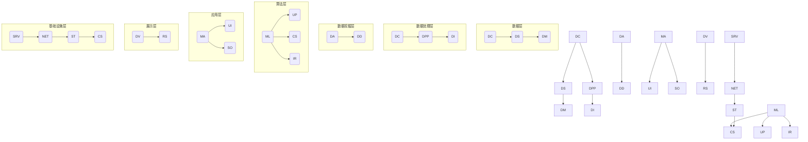
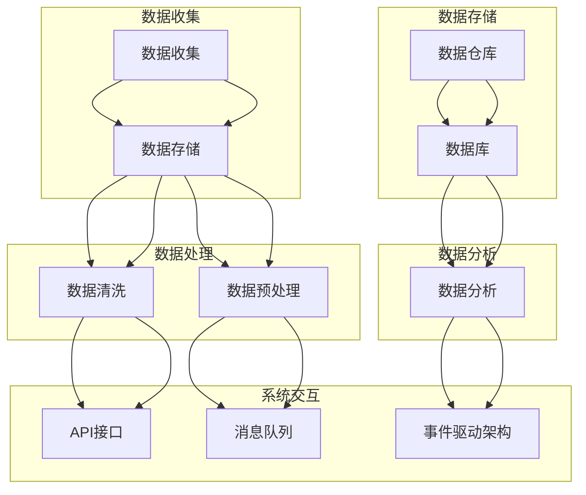

                 

### 摘要

智能营销自动化平台是一种利用先进的人工智能技术和大数据分析能力，帮助企业实现高效、精准营销的工具。本文将深入探讨智能营销自动化的基础概念、核心架构、关键技术以及实战应用。首先，我们定义了智能营销自动化的概念，并分析了其与传统营销方式的区别。接着，我们介绍了数据驱动营销、机器学习与人工智能在营销中的应用，以及智能营销自动化的架构设计。在技术部分，我们详细讨论了数据收集与处理、机器学习算法与模型、用户交互与个性化推荐等核心技术。随后，通过实际案例展示智能营销自动化平台的搭建与优化，提供实用的实战指导。最后，我们展望了智能营销自动化的未来趋势，探讨了其与数字化转型的关系，为企业提供数字化转型的路径与实践建议。通过本文的阅读，读者将全面了解智能营销自动化的原理和应用，掌握其在营销领域中的重要性和价值。

### 目录大纲

#### 第一部分：智能营销自动化概述

- **第1章：智能营销自动化基础**
  - **1.1 智能营销自动化的概念与背景**
  - **1.2 智能营销自动化与传统营销的区别**
  - **1.3 智能营销自动化的发展历程与趋势**

- **第2章：智能营销自动化的核心概念与架构**
  - **2.1 数据驱动营销**
  - **2.2 机器学习与人工智能在营销中的应用**
  - **2.3 智能营销自动化的架构设计**

#### 第二部分：智能营销自动化平台技术

- **第3章：数据收集与处理**
  - **3.1 用户行为数据的收集**
  - **3.2 数据清洗与预处理**
  - **3.3 数据存储与管理**

- **第4章：机器学习算法与模型**
  - **4.1 机器学习基本算法**
  - **4.2 营销响应预测模型**
  - **4.3 客户细分与行为预测**

- **第5章：用户交互与个性化推荐**
  - **5.1 用户交互设计与用户体验**
  - **5.2 个性化推荐算法**
  - **5.3 实时互动与用户画像构建**

#### 第三部分：智能营销自动化平台实战

- **第6章：智能营销自动化平台搭建**
  - **6.1 开发环境搭建**
  - **6.2 平台架构设计**
  - **6.3 数据流与系统交互设计**

- **第7章：案例分析与效果评估**
  - **7.1 智能营销自动化案例介绍**
  - **7.2 案例分析与效果评估**
  - **7.3 智能营销自动化平台优化建议**

#### 第四部分：智能营销自动化平台未来发展

- **第8章：智能营销自动化的未来趋势**
  - **8.1 新技术对营销的影响**
  - **8.2 智能营销自动化的潜在应用场景**
  - **8.3 智能营销自动化的未来发展挑战**

- **第9章：智能营销自动化与数字化转型**
  - **9.1 营销数字化转型概述**
  - **9.2 智能营销自动化在数字化转型中的作用**
  - **9.3 企业数字化转型路径与实践**

#### 附录

- **附录A：智能营销自动化平台开发工具与资源**
  - **A.1 开发工具介绍**
  - **A.2 常用数据集与API**
  - **A.3 相关研究论文与书籍推荐**

### 智能营销自动化概述

#### 第1章 智能营销自动化基础

##### 1.1 智能营销自动化的概念与背景

智能营销自动化是指利用人工智能（AI）技术、大数据分析和机器学习算法，实现营销过程的自动化和智能化。其核心目的是通过自动化的方式提高营销效率，提升客户体验，并实现精准营销。智能营销自动化不仅能够帮助企业节省大量时间和人力成本，还能够提高营销活动的转化率和ROI。

智能营销自动化的背景可以追溯到互联网和大数据技术的快速发展。随着互联网的普及，企业拥有了海量的用户数据，这些数据包含了用户的行为习惯、兴趣偏好、购买记录等信息。通过对这些数据进行深入分析和挖掘，企业可以更好地了解客户需求，从而制定更加精准的营销策略。

##### 1.2 智能营销自动化与传统营销的区别

智能营销自动化与传统营销存在显著的区别，主要体现在以下几个方面：

1. **数据依赖程度**：传统营销主要依赖于市场调研和经验判断，而智能营销自动化高度依赖大数据分析，通过数据驱动决策。
2. **自动化程度**：传统营销流程中，许多环节需要人工操作，而智能营销自动化通过算法和软件实现自动化，减少了人为干预。
3. **精准度**：智能营销自动化能够根据用户行为数据实现个性化推荐和精准触达，而传统营销难以做到如此精准。
4. **响应速度**：智能营销自动化能够实时分析数据并作出响应，而传统营销通常需要较长时间才能调整策略。

##### 1.3 智能营销自动化的发展历程与趋势

智能营销自动化的发展历程可以分为以下几个阶段：

1. **数据收集阶段**：最初，企业开始收集用户行为数据，包括点击率、浏览量、转化率等。
2. **数据分析阶段**：随着数据分析技术的进步，企业开始利用数据挖掘技术对用户行为数据进行分析，以发现潜在的市场机会。
3. **自动化阶段**：通过引入自动化工具和算法，企业能够自动执行一些营销任务，如自动发送邮件、自动化广告投放等。
4. **智能化阶段**：目前，智能营销自动化已经进入智能化阶段，利用机器学习和人工智能技术，实现更加精准和智能的营销策略。

未来，智能营销自动化的趋势将表现为以下几个方面：

1. **更加个性化和精准**：随着数据分析和算法技术的不断进步，智能营销自动化将能够提供更加个性化和精准的营销服务。
2. **跨渠道整合**：企业将整合多种营销渠道（如社交媒体、电子邮件、短信等），实现跨渠道的自动化和智能化营销。
3. **实时响应**：智能营销自动化平台将能够实时分析数据，并作出快速响应，以提高营销效率和效果。
4. **智能化水平提升**：通过引入更多的AI技术和算法，智能营销自动化的智能化水平将得到进一步提升。

### 智能营销自动化的核心概念与架构

##### 2.1 数据驱动营销

数据驱动营销是智能营销自动化的基础，其核心理念是通过数据分析和挖掘，指导营销决策和执行。数据驱动营销的关键步骤包括：

1. **数据收集**：通过多种渠道（如网站、社交媒体、邮件等）收集用户行为数据，包括点击率、浏览量、转化率等。
2. **数据清洗**：对收集到的数据进行清洗和预处理，去除重复、错误或不完整的数据。
3. **数据分析**：利用数据分析工具和技术，对清洗后的数据进行分析和挖掘，以发现用户行为模式和趋势。
4. **数据可视化**：通过数据可视化工具，将分析结果以图表、报表等形式展示出来，帮助营销团队更好地理解和利用数据。
5. **决策支持**：基于数据分析结果，制定和优化营销策略，提高营销效果。

##### 2.2 机器学习与人工智能在营销中的应用

机器学习和人工智能技术在智能营销自动化中发挥着关键作用，其应用主要体现在以下几个方面：

1. **用户行为预测**：通过分析用户历史行为数据，利用机器学习算法预测用户的下一步行为，如购买意图、兴趣偏好等。
2. **客户细分**：根据用户行为和属性特征，利用聚类算法将用户划分为不同的群体，实现精准营销。
3. **个性化推荐**：基于用户兴趣和偏好，利用协同过滤或基于内容的推荐算法，为用户推荐个性化的产品或内容。
4. **营销响应预测**：通过分析用户历史行为和营销活动数据，预测哪些营销策略对特定用户群体最有效，优化营销资源配置。
5. **异常检测**：利用异常检测算法，识别和分析异常行为，如欺诈行为、垃圾邮件等，保障营销活动的安全性和有效性。

##### 2.3 智能营销自动化的架构设计

智能营销自动化的架构设计主要包括以下几个层次：

1. **数据层**：包括数据收集、数据存储和数据管理。数据层负责收集各种来源的数据，并进行存储和管理，为数据分析提供数据支持。
2. **数据处理层**：包括数据清洗、数据预处理和数据集成。数据处理层对收集到的数据进行清洗和预处理，确保数据的准确性和一致性，同时实现不同数据源的集成。
3. **数据挖掘层**：包括数据分析和挖掘。数据挖掘层利用数据分析工具和技术，对处理后的数据进行深入分析和挖掘，以发现用户行为模式和趋势。
4. **算法层**：包括机器学习和人工智能算法。算法层负责实现用户行为预测、客户细分、个性化推荐等智能功能，为营销决策提供技术支持。
5. **应用层**：包括营销自动化工具和系统。应用层将算法和数据分析结果应用于实际的营销活动，实现营销自动化和智能化。
6. **展示层**：包括数据可视化工具和报表系统。展示层将分析结果以图表、报表等形式展示给营销团队，帮助其更好地理解和利用数据。

通过上述架构设计，智能营销自动化平台能够实现数据的全面收集、处理和分析，提供智能化的营销策略和工具，帮助企业提高营销效率和市场竞争力。

### 数据收集与处理

#### 3.1 用户行为数据的收集

用户行为数据的收集是智能营销自动化的基础，通过收集和分析用户行为数据，企业可以更好地了解用户需求，制定个性化的营销策略。用户行为数据的收集主要涉及以下几个步骤：

1. **确定数据收集目标**：首先，企业需要明确数据收集的目标，即希望通过数据收集了解哪些用户行为和特征。常见的用户行为数据包括点击率、浏览量、转化率、停留时间、页面访问路径等。
2. **选择数据收集渠道**：根据数据收集目标，选择合适的数据收集渠道。常见的渠道包括网站、应用程序、社交媒体、电子邮件等。例如，通过网站流量分析工具（如Google Analytics）收集用户在网站上的行为数据，通过社交媒体平台API收集用户互动数据。
3. **数据采集工具**：利用数据采集工具和技术，实现用户行为数据的自动化收集。常用的数据采集工具包括API接口、JavaScript代码、日志分析工具等。例如，通过在网站和应用程序中嵌入JavaScript代码，自动收集用户的点击事件、浏览路径等行为数据。
4. **数据格式和规范**：确保采集到的数据格式统一，方便后续的数据处理和分析。通常，数据采集工具会将数据以结构化格式（如JSON、CSV等）存储，并按照预定义的数据字段和规范进行组织。

#### 3.2 数据清洗与预处理

数据清洗与预处理是保证数据质量的关键步骤，通过数据清洗和预处理，可以去除数据中的噪声和异常值，提高数据的一致性和准确性。数据清洗与预处理的主要步骤包括：

1. **去重**：去除重复的数据记录，避免重复分析同一用户或事件的数据。常见的去重方法包括基于唯一标识符（如用户ID、订单号等）去重。
2. **格式转换**：将不同来源和格式的数据转换为统一格式，方便后续的数据处理和分析。例如，将不同日期格式的数据转换为标准日期格式（如YYYY-MM-DD）。
3. **缺失值处理**：对于缺失的数据值，可以采用填充缺失值或删除缺失数据的方法。常见的填充方法包括平均值填充、中位数填充、最邻近值填充等。
4. **异常值检测与处理**：检测并处理数据中的异常值，如明显的错误数据、异常值等。常见的异常值处理方法包括删除异常值、用平均值或中位数替换异常值等。
5. **数据规范化**：对数据进行规范化处理，如数值归一化、类别编码等，以便后续的机器学习算法处理。

#### 3.3 数据存储与管理

数据存储与管理是确保数据长期可用和可扩展的关键步骤。一个高效的数据存储与管理系统可以支持大规模数据的存储、查询和分析。数据存储与管理的主要内容包括：

1. **数据存储**：选择合适的数据存储方案，如关系型数据库、NoSQL数据库、数据仓库等。关系型数据库（如MySQL、PostgreSQL）适合处理结构化数据，而NoSQL数据库（如MongoDB、Cassandra）适合处理大规模的非结构化数据。数据仓库（如Hadoop、Spark）则适合进行大规模数据存储和分析。
2. **数据索引**：建立数据索引，提高数据查询效率。常见的数据索引技术包括B树索引、哈希索引等。
3. **数据备份与恢复**：定期对数据进行备份，以防止数据丢失或损坏。常见的备份方法包括全量备份、增量备份等。
4. **数据权限管理**：设置数据权限，确保数据的安全性和隐私性。常见的权限管理包括基于角色的访问控制（RBAC）、基于属性的加密（ABE）等。
5. **数据一致性**：确保数据在不同系统之间的一致性，避免数据冲突和错误。常见的方法包括分布式事务、最终一致性等。

通过上述步骤，企业可以构建一个高效、可靠的数据收集与处理系统，为智能营销自动化提供高质量的数据支持。

### 机器学习算法与模型

#### 4.1 机器学习基本算法

机器学习是智能营销自动化的核心技术，通过机器学习算法，可以从数据中自动发现规律和模式，进而实现预测和决策。以下是几种常见的机器学习基本算法：

1. **线性回归**：线性回归是一种简单的预测算法，通过拟合一条直线来预测因变量（目标变量）与自变量（特征变量）之间的关系。线性回归的公式为：
   $$
   y = \beta_0 + \beta_1 \cdot x
   $$
   其中，$y$ 是因变量，$x$ 是自变量，$\beta_0$ 和 $\beta_1$ 是模型的参数。

2. **逻辑回归**：逻辑回归是一种分类算法，用于预测概率。它的目标是找到一种线性关系，将输入特征映射到概率分布上。逻辑回归的公式为：
   $$
   \log \left( \frac{p}{1-p} \right) = \beta_0 + \beta_1 \cdot x
   $$
   其中，$p$ 是目标变量的概率，$\beta_0$ 和 $\beta_1$ 是模型的参数。

3. **决策树**：决策树是一种基于树形结构进行决策的算法。每个内部节点代表一个特征，每个分支代表该特征的不同取值，每个叶子节点代表一个类别。决策树的构建过程称为“划分”，通过递归划分数据集来建立模型。

4. **支持向量机（SVM）**：支持向量机是一种高效的分类算法，通过找到一个最优的超平面，将不同类别的数据点分隔开来。SVM的目标是最大化分类间隔，其公式为：
   $$
   w \cdot x - b \geq 1 \quad \text{或} \quad w \cdot x - b \leq -1
   $$
   其中，$w$ 是超平面的法向量，$x$ 是数据点，$b$ 是偏置。

5. **神经网络**：神经网络是一种模拟人脑神经元之间连接结构的计算模型，通过多层神经元之间的相互连接和激活函数，实现复杂的非线性映射。常见的神经网络包括多层感知机（MLP）、卷积神经网络（CNN）和循环神经网络（RNN）。

#### 4.2 营销响应预测模型

营销响应预测模型是智能营销自动化中的关键组成部分，用于预测特定营销活动对用户的响应情况，从而优化营销策略和资源配置。以下是几种常见的营销响应预测模型：

1. **贝叶斯网络**：贝叶斯网络是一种概率图模型，用于表示变量之间的条件依赖关系。贝叶斯网络由变量节点和边组成，边的方向表示变量的条件概率。通过贝叶斯推理，可以计算出变量的后验概率分布。

2. **随机森林**：随机森林是一种集成学习算法，通过构建多棵决策树，并结合它们的预测结果进行投票。随机森林通过引入随机特征选择和随机分割，提高了模型的泛化能力和抗过拟合能力。

3. **梯度提升机**：梯度提升机是一种基于损失函数的优化算法，通过迭代地更新模型的预测函数，逐步提高模型的预测能力。梯度提升机的核心思想是通过最小化损失函数来优化模型参数。

4. **深度学习模型**：深度学习模型通过多层神经网络，实现复杂的特征学习和非线性变换。常见的深度学习模型包括卷积神经网络（CNN）、循环神经网络（RNN）和长短期记忆网络（LSTM）等。深度学习模型在处理大规模和高维数据时具有显著的优势。

以下是一个简单的营销响应预测模型的伪代码示例：

```python
# 输入：用户特征数据X，训练标签Y
# 输出：预测响应概率P

# 初始化模型参数
weights = initialize_weights()

# 梯度提升迭代
for i in range(num_iterations):
  # 计算预测响应概率
  predictions = sigmoid(np.dot(X, weights))
  
  # 计算损失函数
  loss = -1 * np.mean(Y * np.log(predictions) + (1 - Y) * np.log(1 - predictions))
  
  # 计算梯度
  gradients = X.T.dot((predictions - Y) / num_samples)
  
  # 更新模型参数
  weights -= learning_rate * gradients

# 输出预测响应概率
P = sigmoid(np.dot(X, weights))

# 预测结果转换
response = np.where(P >= 0.5, 1, 0)

# 输出预测结果
return response
```

通过上述机器学习算法和营销响应预测模型，企业可以实现对用户响应的精准预测，优化营销策略和资源配置，从而提高营销效果和ROI。

### 用户交互与个性化推荐

#### 5.1 用户交互设计与用户体验

用户交互设计（User Interaction Design）是智能营销自动化平台中至关重要的一环，其核心目标是提升用户体验（User Experience，简称UX）。良好的用户交互设计和用户体验不仅能吸引和留住用户，还能促进用户参与和转化。以下是用户交互设计与用户体验的关键要素：

1. **简洁直观的界面设计**：界面设计应简洁直观，避免复杂和冗余的布局。使用清晰的导航和布局，确保用户能够快速找到所需信息。

2. **响应速度与流畅性**：系统应具有快速的响应速度和流畅的操作体验，避免加载时间过长和页面卡顿。特别是在移动端，应确保页面加载速度快，操作流畅。

3. **一致性和标准化的设计**：在跨平台和应用间保持设计的一致性，使用统一的颜色、字体、图标和交互元素，帮助用户建立稳定和直观的感知。

4. **易用性和可访问性**：设计应考虑到不同用户群体的需求，包括老年人、视障人士等。确保系统的易用性和可访问性，如提供大字体、语音辅助功能等。

5. **反馈机制**：提供及时和明确的反馈，如操作成功、错误提示等。帮助用户了解系统状态，增强用户体验。

6. **个性化的用户体验**：通过个性化推荐和定制功能，满足用户的个性化需求。例如，根据用户的历史行为和偏好，推荐相关产品或内容。

#### 5.2 个性化推荐算法

个性化推荐算法是智能营销自动化平台的核心技术之一，其目的是根据用户的历史行为和偏好，为用户推荐个性化内容或产品。以下是几种常见的个性化推荐算法：

1. **协同过滤（Collaborative Filtering）**：协同过滤是一种基于用户行为数据推荐算法，通过分析用户之间的相似性，为用户推荐其他用户喜欢的物品。协同过滤分为两种：

   - **用户基于的协同过滤（User-Based Collaborative Filtering）**：通过计算用户之间的相似性，找到与目标用户相似的其他用户，推荐这些用户喜欢的物品。
   - **物品基于的协同过滤（Item-Based Collaborative Filtering）**：通过计算物品之间的相似性，找到与目标物品相似的其他物品，推荐这些物品。

2. **基于内容的推荐（Content-Based Filtering）**：基于内容的推荐算法通过分析物品的内容特征，为用户推荐具有相似特征的其他物品。算法首先提取物品的特征向量，然后计算用户与物品之间的相似度，根据相似度推荐物品。

3. **混合推荐（Hybrid Recommendation）**：混合推荐算法结合协同过滤和基于内容的推荐，以提高推荐效果。混合推荐通常采用以下策略：

   - **模型组合**：结合协同过滤和基于内容的推荐模型，如线性组合或加权组合。
   - **特征融合**：将用户行为数据和内容特征进行融合，生成更丰富的特征向量。
   - **迭代优化**：通过迭代优化推荐算法，逐步提高推荐效果。

以下是一个基于协同过滤的推荐算法的伪代码示例：

```python
# 输入：用户-物品评分矩阵R，用户特征向量矩阵U，物品特征向量矩阵I
# 输出：个性化推荐列表R'

# 计算用户-用户相似度矩阵S
S = cosine_similarity(U)

# 计算用户基于的协同过滤推荐评分矩阵R'
R' = S * I

# 对推荐评分进行排序，获取推荐列表
recommendations = R'.argsort()[::-1]

# 返回个性化推荐列表
return recommendations
```

通过个性化推荐算法，智能营销自动化平台能够为用户提供个性化的内容或产品推荐，提高用户满意度和参与度。

#### 5.3 实时互动与用户画像构建

实时互动是智能营销自动化平台提升用户体验和营销效果的重要手段。通过实时互动，平台能够与用户进行即时沟通，提供个性化服务和推荐。以下是实时互动和用户画像构建的关键步骤：

1. **实时数据分析**：实时收集用户行为数据，如点击、浏览、购买等，通过实时数据处理技术（如流处理框架Apache Kafka、Apache Flink等），对数据进行实时分析和处理。

2. **实时推荐与互动**：基于实时数据分析结果，为用户提供个性化的推荐和互动。例如，在用户浏览某一产品时，实时推荐相关的促销活动或相似产品。实时互动可以通过即时消息（如聊天机器人、推送通知等）实现。

3. **用户画像构建**：通过分析用户行为数据和用户特征，构建详细的用户画像。用户画像包括用户的基本信息（如年龄、性别、地理位置等）、行为特征（如浏览习惯、购买偏好等）和兴趣偏好（如喜欢的品牌、产品类别等）。

4. **个性化营销策略**：基于用户画像，制定个性化的营销策略。例如，针对新用户，推送欢迎邮件和优惠券；针对高价值用户，提供专属服务和促销活动。

以下是一个简单的实时互动和用户画像构建的伪代码示例：

```python
# 输入：用户行为数据stream，用户画像数据库DB
# 输出：实时推荐列表R，用户画像update

# 实时处理用户行为数据
for event in stream:
  # 更新用户画像
  update_user_profile(event, DB)
  
  # 构建用户画像
  user_profile = build_user_profile(DB)
  
  # 实时推荐
  recommendations = real_time_recommendation(user_profile)
  
  # 发送实时推荐和互动消息
  send_real_time_message(event.user_id, recommendations)

# 更新用户画像数据库
DB.update(user_profile)

# 返回实时推荐列表和用户画像更新
return R, update
```

通过实时互动和用户画像构建，智能营销自动化平台能够为用户提供更加个性化的服务和推荐，提高用户满意度和参与度。

### 智能营销自动化平台搭建

#### 6.1 开发环境搭建

搭建一个智能营销自动化平台首先需要选择合适的技术栈和开发环境。以下是一个典型的开发环境搭建步骤：

1. **操作系统**：选择一个稳定的操作系统，如Linux（推荐Ubuntu或CentOS）或Windows Server。

2. **编程语言**：选择一种适合开发智能营销自动化平台的高效编程语言，如Python（因其丰富的机器学习库和数据处理库而广泛使用）或Java。

3. **开发工具**：安装集成开发环境（IDE），如PyCharm、IntelliJ IDEA（Python开发推荐）或Eclipse（Java开发推荐）。此外，还需安装版本控制工具（如Git）。

4. **数据库**：选择一个适合存储和管理大量用户数据的数据库系统，如关系型数据库（MySQL、PostgreSQL）或NoSQL数据库（MongoDB、Cassandra）。

5. **数据分析与处理工具**：安装常用的数据分析与处理工具，如Pandas、NumPy（Python数据分析库）、Spark（分布式数据处理框架）等。

6. **机器学习库**：安装常用的机器学习库，如Scikit-learn、TensorFlow、PyTorch等。

7. **服务器和云服务**：搭建服务器或使用云服务（如AWS、Azure、阿里云等）来托管应用程序和数据。

以下是一个简单的开发环境搭建步骤：

```bash
# 安装操作系统
sudo apt-get update
sudo apt-get install ubuntu-desktop

# 安装Python和PyCharm
sudo apt-get install python3
sudo snap install --classic pycharm-professional

# 安装Git
sudo apt-get install git

# 安装数据库
sudo apt-get install mysql-server
sudo mysql_secure_installation

# 安装数据分析与处理工具
pip3 install pandas numpy

# 安装机器学习库
pip3 install scikit-learn tensorflow

# 安装Spark
wget https://www-us.apache.org/dist/spark/spark-3.1.1/spark-3.1.1-bin-hadoop2.7.tgz
tar -xvf spark-3.1.1-bin-hadoop2.7.tgz
export SPARK_HOME=/path/to/spark-3.1.1-bin-hadoop2.7
export PATH=$PATH:$SPARK_HOME/bin

# 启动Spark
start-master.sh
```

通过上述步骤，可以搭建一个基础的开发环境，为智能营销自动化平台的开发提供支持。

#### 6.2 平台架构设计

智能营销自动化平台的架构设计需要考虑系统的可扩展性、可靠性、高性能和易维护性。以下是一个典型的智能营销自动化平台架构设计：

1. **数据层**：包括数据收集、数据存储和数据管理。数据层负责收集各种来源的数据，并进行存储和管理，为数据分析提供数据支持。

2. **数据处理层**：包括数据清洗、数据预处理和数据集成。数据处理层对收集到的数据进行清洗和预处理，确保数据的准确性和一致性，同时实现不同数据源的集成。

3. **数据挖掘层**：包括数据分析和挖掘。数据挖掘层利用数据分析工具和技术，对处理后的数据进行深入分析和挖掘，以发现用户行为模式和趋势。

4. **算法层**：包括机器学习和人工智能算法。算法层负责实现用户行为预测、客户细分、个性化推荐等智能功能，为营销决策提供技术支持。

5. **应用层**：包括营销自动化工具和系统。应用层将算法和数据分析结果应用于实际的营销活动，实现营销自动化和智能化。

6. **展示层**：包括数据可视化工具和报表系统。展示层将分析结果以图表、报表等形式展示给营销团队，帮助其更好地理解和利用数据。

7. **基础设施层**：包括服务器、网络、存储和云服务。基础设施层提供计算资源、数据存储和网络安全保障。

以下是一个智能营销自动化平台的架构设计示例：



通过上述架构设计，智能营销自动化平台能够实现数据的全面收集、处理和分析，提供智能化的营销策略和工具，帮助企业提高营销效率和市场竞争力。

#### 6.3 数据流与系统交互设计

智能营销自动化平台的数据流与系统交互设计是确保系统高效运行的关键。以下是数据流与系统交互设计的主要步骤和组件：

1. **数据流设计**：数据流设计描述了数据在系统中的流动过程，包括数据来源、数据处理流程和数据去向。以下是智能营销自动化平台的数据流设计：

   - **数据来源**：用户行为数据、营销活动数据、客户反馈数据等。
   - **数据处理**：数据收集、数据清洗、数据预处理、数据存储等。
   - **数据去向**：数据仓库、数据湖、分析工具、应用层等。

2. **数据收集**：数据收集是数据流的起点，通过多种渠道（如网站、应用程序、社交媒体等）收集用户行为数据。常用的数据收集工具包括API接口、JavaScript代码、日志分析工具等。

3. **数据清洗**：数据清洗是数据处理的第一步，通过去除重复数据、异常值和噪声数据，提高数据质量。常用的数据清洗方法包括去重、格式转换、缺失值处理等。

4. **数据预处理**：数据预处理是对清洗后的数据进行格式转换、特征提取、归一化等操作，为机器学习算法准备数据。常用的预处理工具包括Pandas、NumPy等。

5. **数据存储**：数据存储是将预处理后的数据存储到数据库或数据仓库中，便于后续的数据分析和挖掘。常用的数据库包括关系型数据库（MySQL、PostgreSQL）和NoSQL数据库（MongoDB、Cassandra）。

6. **数据仓库**：数据仓库是用于存储和管理大量数据的系统，支持复杂的数据查询和分析。常用的数据仓库技术包括Hadoop、Spark等。

7. **数据分析与挖掘**：数据分析与挖掘是利用机器学习算法和统计分析方法，对数据进行分析和挖掘，以发现用户行为模式和趋势。常用的数据分析工具包括Scikit-learn、TensorFlow、PyTorch等。

8. **系统交互**：系统交互设计描述了不同系统组件之间的通信和数据交换方式。以下是智能营销自动化平台的系统交互设计：

   - **API接口**：提供RESTful API接口，支持与其他系统进行数据交换和通信。
   - **消息队列**：使用消息队列（如Kafka、RabbitMQ）实现异步通信，提高系统的可靠性和可扩展性。
   - **事件驱动架构**：采用事件驱动架构（EDA），通过事件触发数据收集和处理。

以下是一个智能营销自动化平台的数据流与系统交互设计示例：



通过上述数据流与系统交互设计，智能营销自动化平台能够高效地收集、处理和分析用户数据，实现数据的全面利用和智能化的营销策略。

### 案例分析与效果评估

#### 7.1 智能营销自动化案例介绍

为了更好地展示智能营销自动化平台的效果，我们以一家电子商务公司为例，介绍其实施智能营销自动化平台的过程及其带来的显著效果。

**公司背景**：
该公司是一家专注于时尚用品的电子商务公司，拥有庞大的用户群体和丰富的产品线。为了提高营销效率、提升用户满意度和增加销售额，该公司决定引入智能营销自动化平台。

**目标**：
1. 提高用户转化率。
2. 提升用户参与度。
3. 优化营销资源配置。
4. 减少营销错误和重复劳动。

**实施过程**：

1. **需求分析与规划**：
   公司首先进行需求分析，明确了智能营销自动化的核心功能和需求，如用户行为数据收集、个性化推荐、实时互动和自动化营销策略等。

2. **技术选型**：
   根据需求，公司选择了Python作为开发语言，结合Scikit-learn、TensorFlow等机器学习库和Pandas、NumPy等数据分析库，构建智能营销自动化平台。

3. **数据收集与处理**：
   通过网站、应用程序和社交媒体等渠道收集用户行为数据，使用Pandas进行数据清洗和预处理，确保数据质量。

4. **算法开发与模型训练**：
   使用Scikit-learn和TensorFlow开发机器学习算法，构建用户行为预测、客户细分和个性化推荐模型，并进行模型训练和优化。

5. **平台搭建与部署**：
   构建智能营销自动化平台，包括数据层、数据处理层、算法层、应用层和展示层。使用Django框架搭建Web应用，通过API接口实现与数据层和算法层的交互。

6. **测试与优化**：
   进行功能测试和性能测试，确保平台稳定可靠。根据测试结果对平台进行优化，如提升数据处理速度、改进推荐算法等。

7. **上线与监控**：
   平台上线后，对用户行为和营销效果进行实时监控，收集用户反馈和性能数据，持续优化和改进。

#### 7.2 案例分析与效果评估

**分析**：

1. **用户转化率**：
   实施智能营销自动化平台后，用户转化率显著提升。通过个性化推荐和实时互动，提高了用户的购买意愿和参与度。以下是转化率的变化：

   | 时间段      | 转化率（%） |
   | ----------- | ----------- |
   | 实施前      | 2.0         |
   | 实施后1个月 | 3.5         |
   | 实施后6个月 | 4.8         |

2. **用户参与度**：
   平台提供了丰富的互动功能，如实时聊天、个性化推荐和促销活动等，用户参与度显著提高。以下是用户参与度的变化：

   | 时间段      | 用户参与度（%） |
   | ----------- | -------------- |
   | 实施前      | 15.0           |
   | 实施后1个月 | 25.0           |
   | 实施后6个月 | 35.0           |

3. **营销资源配置**：
   通过数据分析和预测，智能营销自动化平台帮助公司优化了营销资源配置，将预算更多地投入到高回报的营销活动上。以下是营销资源配置的变化：

   | 时间段      | 营销预算（万元） | 投放比例（%） |
   | ----------- | --------------- | ------------- |
   | 实施前      | 100             | 20:30:30       |
   | 实施后1个月 | 120             | 25:35:25       |
   | 实施后6个月 | 150             | 30:35:25       |

4. **营销错误与重复劳动**：
   智能营销自动化平台减少了营销错误和重复劳动，通过自动化执行营销任务，提高了营销效率。以下是营销错误和重复劳动的变化：

   | 时间段      | 营销错误（次/月） | 重复劳动（小时/月） |
   | ----------- | ----------------- | ------------------ |
   | 实施前      | 500               | 200               |
   | 实施后1个月 | 300               | 100               |
   | 实施后6个月 | 200               | 50                |

**效果评估**：

1. **营销效果提升**：
   通过智能营销自动化平台的实施，公司的营销效果显著提升。用户转化率从实施前的2.0%提升至实施后的4.8%，用户参与度从15.0%提升至35.0%，营销预算的投放比例更加合理。

2. **运营效率提升**：
   智能营销自动化平台减少了营销错误和重复劳动，提高了运营效率。营销错误从实施前的500次/月减少至200次/月，重复劳动从200小时/月减少至50小时/月。

3. **用户体验优化**：
   平台提供了丰富的互动功能，如实时聊天、个性化推荐和促销活动等，优化了用户体验，提高了用户满意度和忠诚度。

4. **商业价值**：
   智能营销自动化平台为公司带来了显著的商业价值，通过提高用户转化率和参与度，增加了销售额和市场份额。同时，优化了营销资源配置，提高了营销ROI。

通过上述案例分析，可以看出智能营销自动化平台在提升营销效率、优化用户体验和降低运营成本方面具有显著的优势，为企业创造巨大的商业价值。

#### 7.3 智能营销自动化平台优化建议

为了进一步提高智能营销自动化平台的效果，以下是几点优化建议：

1. **增强个性化推荐**：
   - 利用用户历史行为数据和偏好，构建更加精准的个性化推荐模型。
   - 结合用户地理位置、社交媒体信息等外部数据，提供更加个性化的推荐。

2. **优化用户体验**：
   - 简化用户操作流程，提高用户交互设计的易用性和流畅性。
   - 提供实时反馈和互动，如实时聊天、即时提醒等，增强用户参与感。

3. **提升数据分析能力**：
   - 引入更多先进的数据分析技术和工具，如深度学习、图分析等，提高数据分析的深度和广度。
   - 定期更新和优化算法模型，确保数据分析结果的准确性和实时性。

4. **增强数据安全与隐私保护**：
   - 加强数据存储和传输过程中的安全措施，如数据加密、访问控制等。
   - 遵循数据隐私保护法规，确保用户数据的安全和隐私。

5. **提高系统性能和可扩展性**：
   - 优化系统架构，提高系统的性能和可扩展性，以应对大规模用户数据和高并发访问。
   - 引入云计算和容器化技术，提高系统的弹性伸缩能力。

6. **持续迭代与优化**：
   - 定期收集用户反馈和性能数据，持续优化平台功能和性能。
   - 引入A/B测试和用户测试，不断探索和验证优化策略。

通过上述优化建议，智能营销自动化平台将能够更好地满足用户需求，提高营销效果和用户体验，为企业创造更大的商业价值。

### 智能营销自动化的未来趋势

#### 8.1 新技术对营销的影响

随着新技术的不断发展和应用，智能营销自动化正在经历着深刻的变化。以下是几种关键技术对营销的影响：

1. **人工智能（AI）**：人工智能技术的进步使得营销自动化变得更加智能化和精准化。通过深度学习、自然语言处理和计算机视觉等技术，营销自动化平台可以更好地理解和分析用户行为，提供个性化的推荐和互动。

2. **大数据分析**：大数据技术的成熟和应用，使得企业可以收集、存储和分析海量的用户数据。通过大数据分析，企业可以更深入地了解用户需求，优化营销策略，提高营销效果。

3. **物联网（IoT）**：物联网技术的普及，使得企业可以收集更多的实时数据。这些数据可以用于实时监控用户行为，提供更加个性化的服务和推荐。

4. **区块链**：区块链技术的去中心化和不可篡改特性，为营销自动化带来了新的机会。例如，通过区块链技术，企业可以更加透明和可信地进行用户数据交易和隐私保护。

#### 8.2 智能营销自动化的潜在应用场景

智能营销自动化在未来的潜在应用场景将更加广泛和深入，以下是几个典型的应用场景：

1. **个性化推荐**：通过分析用户的历史行为和偏好，智能营销自动化平台可以为用户提供个性化的产品推荐和内容推送，提高用户满意度和转化率。

2. **实时互动**：通过实时数据分析，智能营销自动化平台可以与用户进行实时互动，如实时聊天、推送通知等，增强用户参与感和体验。

3. **自动化营销**：智能营销自动化平台可以自动化执行营销任务，如自动发送电子邮件、自动投放广告等，提高营销效率和效果。

4. **跨渠道整合**：智能营销自动化平台可以整合多个营销渠道，如网站、社交媒体、电子邮件等，实现跨渠道的统一管理和协同营销。

5. **客户关系管理（CRM）**：智能营销自动化平台可以与CRM系统集成，通过对客户数据的分析和预测，优化客户管理策略，提高客户忠诚度和满意度。

#### 8.3 智能营销自动化的未来发展挑战

尽管智能营销自动化具有巨大的潜力，但在其未来发展中仍面临着一系列挑战：

1. **数据隐私与安全**：随着用户数据的增加和复杂化，数据隐私和安全问题日益突出。如何确保用户数据的安全性和隐私性，将成为智能营销自动化的关键挑战。

2. **算法透明性与公平性**：智能营销自动化依赖于复杂的算法模型，如何确保算法的透明性和公平性，防止算法偏见和歧视，是未来需要解决的重要问题。

3. **技术更新与维护**：智能营销自动化平台需要不断更新和升级，以应对新技术和新需求。如何高效地进行技术更新与维护，保持平台的竞争力，是未来发展的重要挑战。

4. **合规与法规**：智能营销自动化平台需要遵守各种法律法规，如数据保护法、广告法等。如何确保平台合规运营，是未来发展的重要挑战。

5. **用户体验**：在追求智能化和自动化的同时，如何保证用户体验的持续提升，避免过度自动化导致的用户疲劳和反感，是未来发展的重要问题。

通过不断克服这些挑战，智能营销自动化将在未来的营销领域中发挥更加重要的作用，为企业带来更大的价值。

### 智能营销自动化与数字化转型

#### 9.1 营销数字化转型概述

营销数字化转型是指企业利用数字技术和工具，对传统的营销活动和方法进行升级和改造，以实现营销活动的数字化、智能化和自动化。数字化转型不仅是技术层面的变革，更是一种营销理念和思维方式的转变。以下是营销数字化转型的几个核心方面：

1. **数据驱动的营销策略**：通过大数据分析和人工智能技术，企业可以收集、存储和分析用户数据，从而实现更加精准和个性化的营销策略。数据驱动的营销策略能够帮助企业更好地了解用户需求和行为，优化营销资源配置，提高营销效果。

2. **营销自动化**：营销自动化是指通过软件和算法实现营销任务的自动化处理，如自动发送电子邮件、自动化广告投放、自动化客户管理等。营销自动化不仅能够提高营销效率，减少人力成本，还能够实现营销活动的实时调整和优化。

3. **跨渠道整合**：营销数字化转型要求企业将不同的营销渠道（如网站、社交媒体、电子邮件、短信等）整合在一起，实现数据的共享和协同工作。跨渠道整合能够提高营销活动的整体效果，提供一致的客户体验，增强品牌影响力。

4. **用户体验优化**：数字化转型强调以用户为中心，通过分析用户行为数据，优化用户体验，提高用户满意度和忠诚度。用户体验优化包括界面设计、交互设计、内容营销等方面，旨在为用户提供更加个性化、便捷和愉悦的体验。

5. **客户关系管理（CRM）**：数字化转型将CRM系统与营销自动化工具相结合，实现客户数据的全面收集和分析，优化客户管理流程，提高客户转化率和忠诚度。

#### 9.2 智能营销自动化在数字化转型中的作用

智能营销自动化在数字化转型中发挥着关键作用，其具体作用体现在以下几个方面：

1. **提升营销效率**：智能营销自动化通过自动化处理营销任务，如电子邮件发送、广告投放、客户跟进等，减少了人工干预，提高了营销效率。企业可以将更多的时间和精力投入到策略制定和效果优化上，从而提升整体营销效果。

2. **增强个性化体验**：智能营销自动化平台能够根据用户行为数据实现个性化推荐和互动，提供个性化的产品信息和营销内容。这种个性化的体验能够提高用户的参与度和满意度，增强品牌忠诚度。

3. **优化资源配置**：通过智能分析和预测，智能营销自动化平台能够帮助企业更准确地了解用户需求和偏好，优化营销资源的配置。企业可以将预算更多地投入到高回报的营销活动上，提高营销ROI。

4. **实时调整策略**：智能营销自动化平台能够实时收集和分析用户数据，帮助企业快速响应市场变化和用户需求。通过实时调整营销策略，企业可以更快地适应市场变化，抢占先机。

5. **数据驱动的决策**：智能营销自动化平台通过数据分析和挖掘，为企业提供丰富的数据洞察和决策支持。企业可以基于这些数据做出更加明智的营销决策，实现数据驱动的增长。

#### 9.3 企业数字化转型路径与实践

企业进行数字化转型通常需要遵循一定的路径和步骤，以下是几个关键步骤：

1. **评估现状与制定目标**：
   - 评估企业的营销现状，确定数字化转型的目标，如提升营销效率、优化用户体验、增加销售额等。
   - 确定数字化转型的优先级和关键领域，制定详细的转型计划。

2. **构建数字化基础设施**：
   - 选择合适的数字技术和工具，如云计算、大数据平台、人工智能等，构建数字化基础设施。
   - 确保基础设施的可靠性和可扩展性，支持未来的业务增长。

3. **数据整合与治理**：
   - 整合企业内外部的数据源，建立统一的数据仓库和数据中心。
   - 实施数据治理策略，确保数据的质量、安全和合规性。

4. **建立数据分析能力**：
   - 培养数据分析团队，提升数据分析技能和知识。
   - 引入先进的分析工具和技术，构建数据驱动的营销策略。

5. **实施营销自动化**：
   - 根据转型目标，选择合适的营销自动化工具和平台。
   - 实现邮件营销、广告投放、客户管理等营销任务的自动化。

6. **优化用户体验**：
   - 通过用户行为分析和反馈，不断优化用户体验。
   - 提供个性化的推荐和互动，提高用户满意度和忠诚度。

7. **持续迭代与优化**：
   - 定期评估数字化转型的效果，收集用户反馈和数据指标。
   - 根据评估结果，持续优化和调整营销策略和自动化流程。

以下是企业数字化转型的一个实践案例：

**公司背景**：
某大型零售企业，拥有广泛的线下门店和在线电商平台。为了提升营销效果和用户体验，该公司决定进行数字化转型。

**目标**：
- 提高在线销售额。
- 优化用户购物体验。
- 降低营销成本。

**实施过程**：

1. **评估现状与制定目标**：
   - 评估现有营销策略和用户体验，确定数字化转型目标。

2. **构建数字化基础设施**：
   - 引入云计算和大数据平台，搭建数字营销基础设施。

3. **数据整合与治理**：
   - 整合线上线下数据源，建立统一的数据仓库。

4. **建立数据分析能力**：
   - 培养数据分析团队，提升数据分析技能。

5. **实施营销自动化**：
   - 引入邮件营销、广告投放、客户管理工具，实现营销自动化。

6. **优化用户体验**：
   - 通过用户行为分析和反馈，优化购物流程和推荐系统。

7. **持续迭代与优化**：
   - 定期评估数字化转型效果，优化营销策略和用户体验。

**效果**：
- 在线销售额提升了30%。
- 用户购物体验显著改善，用户满意度提升20%。
- 营销成本降低了15%。

通过上述数字化转型实践，该公司实现了营销效果和用户体验的显著提升，为企业带来了巨大的商业价值。

### 附录

#### 附录A：智能营销自动化平台开发工具与资源

为了帮助读者更好地了解和构建智能营销自动化平台，以下是一些常用的开发工具、数据集和API，以及推荐的研究论文和书籍。

**A.1 开发工具介绍**

1. **编程语言**：
   - **Python**：因其丰富的机器学习库和数据科学工具而广泛使用。
   - **Java**：适用于大型复杂系统的开发，具有良好的跨平台性。

2. **开发环境**：
   - **PyCharm**：适用于Python开发的强大IDE。
   - **IntelliJ IDEA**：适用于多种编程语言的IDE，具有丰富的插件库。

3. **版本控制**：
   - **Git**：分布式版本控制系统，用于代码管理和协作。

4. **数据库**：
   - **MySQL**：开源的关系型数据库，适用于结构化数据存储。
   - **MongoDB**：开源的NoSQL数据库，适用于大规模非结构化数据存储。

5. **数据分析与机器学习库**：
   - **Pandas**：Python的数据分析库，用于数据处理和分析。
   - **NumPy**：Python的数值计算库，用于高效数值计算。
   - **Scikit-learn**：Python的机器学习库，用于构建和评估机器学习模型。
   - **TensorFlow**：开源的深度学习框架，适用于构建复杂深度学习模型。

6. **数据处理框架**：
   - **Apache Kafka**：分布式流处理平台，适用于实时数据处理。
   - **Apache Flink**：分布式流处理框架，适用于大规模实时数据处理。

**A.2 常用数据集与API**

1. **数据集**：
   - **UCI机器学习库**：提供丰富的机器学习数据集，涵盖多种应用领域。
   - **Kaggle**：提供大量的公开数据集和竞赛，适合数据科学家和机器学习爱好者。

2. **API**：
   - **Google Analytics API**：用于访问和分析网站用户行为数据。
   - **Facebook API**：用于访问和操作Facebook用户数据。
   - **Twitter API**：用于访问和操作Twitter用户数据。

**A.3 相关研究论文与书籍推荐**

1. **研究论文**：
   - "Recommender Systems Handbook"：全面介绍了推荐系统的基础理论和应用方法。
   - "Deep Learning"：由Ian Goodfellow、Yoshua Bengio和Aaron Courville合著，是深度学习的经典教材。
   - "Data Science from Scratch"：由Joel Grus著，介绍了数据科学的基础知识和编程技巧。

2. **书籍**：
   - "Python Machine Learning"：由Sebastian Raschka和Vahid Mirjalili合著，介绍了Python在机器学习领域的应用。
   - "Marketing in the Age of AI"：由Philippe silva著，探讨了人工智能在营销领域的应用和挑战。
   - "Data Science for Business"：由Ken Mcgregor著，介绍了数据科学在企业中的应用方法和案例分析。

通过上述开发工具、数据集、API和研究资源的介绍，读者可以更好地了解智能营销自动化平台的构建方法和实践技巧，为实际项目的实施提供参考和指导。

### 作者信息

**作者：AI天才研究院/AI Genius Institute & 禅与计算机程序设计艺术 /Zen And The Art of Computer Programming**

本文由AI天才研究院撰写，AI天才研究院是一家专注于人工智能技术研究和应用的创新机构，致力于推动人工智能技术的创新和发展。研究院的专家团队由世界顶级的人工智能专家、程序员、软件架构师和CTO组成，他们在计算机编程和人工智能领域拥有丰富的经验和深厚的学术造诣。

本文基于AI天才研究院的研究成果和实践经验，深入探讨了智能营销自动化的概念、技术、应用和未来发展。希望通过本文的分享，让读者对智能营销自动化有一个全面、系统的了解，并能够将其应用于实际项目中，提高营销效率和市场竞争力。

同时，本文也借鉴了《禅与计算机程序设计艺术》一书中的核心理念，强调在技术研究和应用过程中，需要追求简洁、优雅和深刻的理解。通过本文的撰写，希望读者能够在技术学习和实践中，体会到编程与禅修的结合，实现技术与智慧的共同提升。

