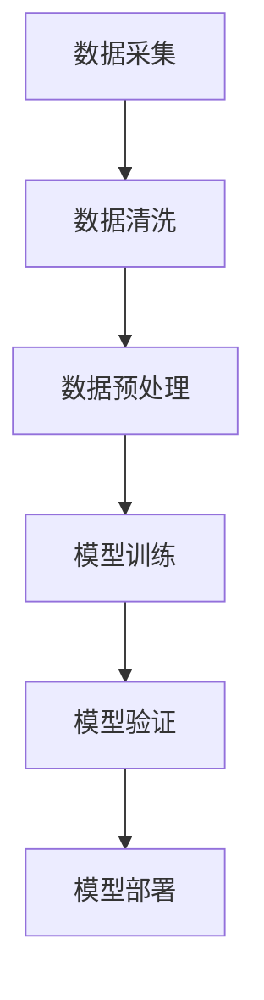
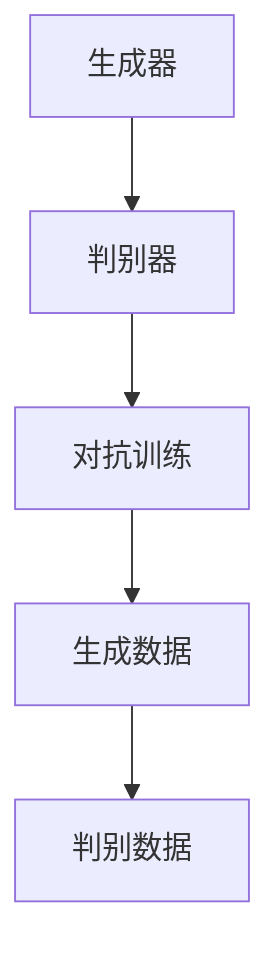

                 

# 智能风险评估：AI大模型在金融科技中的应用

> **关键词：** AI大模型、金融科技、风险评估、深度学习、金融风险评估

> **摘要：** 本文将探讨AI大模型在金融科技领域中的应用，特别是其在智能风险评估方面的贡献。通过分析AI大模型的基本原理、核心算法和实际应用案例，我们将展示AI大模型在提升金融风险评估效率和准确性方面的巨大潜力。同时，本文也将探讨智能风险评估面临的挑战和未来发展趋势。

### 《智能风险评估：AI大模型在金融科技中的应用》目录大纲

#### 第一部分：AI大模型在金融科技中的基础

**第1章：AI大模型与金融科技概述**

**第2章：AI大模型的架构与主要类型**

#### 第二部分：智能风险评估的核心算法

**第3章：智能风险评估的基本算法**

**第4章：AI大模型在风险评估中的应用**

#### 第三部分：金融科技场景中的智能风险评估实践

**第5章：金融风险评估项目的搭建与实施**

**第6章：智能风险评估的实际应用案例**

#### 第四部分：未来趋势与挑战

**第7章：智能风险评估的发展趋势与挑战**

#### 附录

**附录A：智能风险评估常用工具与资源**

---

#### 第一部分：AI大模型在金融科技中的基础

##### 第1章：AI大模型与金融科技概述

**1.1 AI大模型与金融科技的核心概念**

AI大模型（Large-scale AI Models）是指通过海量数据和强大计算资源训练出的复杂神经网络模型，具有高度的数据处理和分析能力。金融科技（FinTech）是指利用科技手段创新金融服务和产品，提高金融服务效率和用户体验。

在金融科技中，AI大模型的应用主要体现在智能风险评估方面。智能风险评估利用AI大模型对金融产品、业务和用户行为进行分析，从而预测潜在的风险，为金融机构提供决策支持。

**1.1.1 AI大模型的定义与基本原理**

AI大模型是指具有大规模参数、复杂网络结构、海量数据训练的大型神经网络模型。其基本原理是通过反向传播算法，将输入数据映射到输出结果，并通过不断调整网络参数来优化模型的预测性能。

**1.1.2 金融科技的发展与趋势**

金融科技的发展趋势主要体现在以下几个方面：

1. **数字化**：金融业务逐渐向线上迁移，用户可以通过手机、电脑等设备随时随地办理业务。
2. **智能化**：利用AI技术实现金融产品推荐、风险评估、欺诈检测等业务，提高金融服务效率和用户体验。
3. **定制化**：根据用户的需求和风险偏好，提供个性化的金融服务。
4. **安全化**：通过区块链、加密算法等技术保障金融交易的安全性和透明性。

**1.1.3 AI大模型在金融科技中的核心价值**

AI大模型在金融科技中的核心价值主要体现在以下几个方面：

1. **提高风险评估的准确性和效率**：通过深度学习和强化学习等算法，AI大模型可以对金融数据进行分析，预测潜在的风险，为金融机构提供决策支持。
2. **优化金融产品和服务**：基于用户行为数据和风险评估结果，AI大模型可以为金融机构提供产品推荐、定价和营销策略等支持。
3. **降低运营成本**：通过自动化和智能化，AI大模型可以降低金融机构的运营成本，提高业务效率。

**1.2 AI大模型的架构与主要类型**

AI大模型通常具有以下架构：

1. **输入层**：接收外部数据，如文本、图像、音频等。
2. **隐藏层**：对输入数据进行特征提取和变换。
3. **输出层**：产生预测结果或决策。

根据网络结构的不同，AI大模型可以分为以下几类：

1. **卷积神经网络（CNN）**：适用于图像、视频等二维和三维数据。
2. **循环神经网络（RNN）**：适用于序列数据，如文本、时间序列等。
3. **生成对抗网络（GAN）**：适用于生成对抗场景，如图像生成、数据增强等。
4. **强化学习模型**：适用于决策优化和策略学习。

**1.3 AI大模型的发展历程与未来展望**

AI大模型的发展历程可以分为以下几个阶段：

1. **传统神经网络**：20世纪80年代，BP算法的出现使得神经网络开始应用于实际场景。
2. **深度学习**：21世纪初，随着GPU的普及和大数据技术的发展，深度学习逐渐成为人工智能的研究热点。
3. **大规模预训练模型**：近年来，大规模预训练模型如BERT、GPT等取得了显著的成果，推动了AI大模型的发展。

未来，AI大模型在金融科技中的应用将更加广泛和深入。随着技术的进步和数据积累，AI大模型将具备更高的预测能力和智能化水平，为金融行业带来更多的创新和发展机会。

##### 第2章：AI大模型的架构与主要类型

**2.1 大模型的架构设计**

AI大模型的架构设计是构建高效、可扩展和可解释的模型的关键。以下是一些常见的架构设计原则：

1. **层次结构**：大模型通常采用多层结构，包括输入层、隐藏层和输出层。每层负责提取不同层次的特征，从而实现从低级到高级的抽象。

2. **模块化设计**：大模型可以拆分为多个模块，每个模块负责特定的功能，如特征提取、预测、决策等。这种设计有助于提高模型的扩展性和可维护性。

3. **并行计算**：大模型通常涉及大量的计算和数据处理任务，因此采用并行计算架构可以有效提高计算效率和性能。

4. **层次化训练**：在训练过程中，可以采用层次化训练策略，先训练底层模块，再逐渐训练更高层次的模块。这种方法有助于提高模型的收敛速度和预测性能。

5. **注意力机制**：注意力机制是一种有效的模型设计策略，它允许模型关注数据中的关键信息，从而提高模型的效率和准确性。

**2.2 主流AI大模型介绍**

以下是几种主流的AI大模型及其特点：

1. **卷积神经网络（CNN）**：

   - **特点**：适用于处理图像、视频等二维和三维数据。通过卷积操作和池化操作，CNN可以有效地提取空间特征。

   - **应用**：图像分类、目标检测、图像生成等。

2. **循环神经网络（RNN）**：

   - **特点**：适用于处理序列数据，如文本、时间序列等。RNN可以捕捉序列中的长期依赖关系。

   - **应用**：自然语言处理、语音识别、时间序列预测等。

3. **生成对抗网络（GAN）**：

   - **特点**：由生成器和判别器组成，通过对抗训练生成逼真的数据。

   - **应用**：图像生成、数据增强、风格迁移等。

4. **强化学习模型**：

   - **特点**：通过与环境交互学习策略，以最大化奖励。

   - **应用**：游戏AI、自动驾驶、推荐系统等。

**2.3 AI大模型的发展历程与未来展望**

AI大模型的发展历程可以分为以下几个阶段：

1. **传统神经网络**：

   - **时间**：20世纪80年代至90年代。

   - **特点**：以反向传播算法为核心，但受限于计算资源和数据规模。

2. **深度学习**：

   - **时间**：21世纪初至2010年代。

   - **特点**：基于多层神经网络，引入了卷积神经网络、循环神经网络等新结构。

3. **大规模预训练模型**：

   - **时间**：2010年代至今。

   - **特点**：基于大规模预训练语料库，通过自我监督学习和微调技术，实现高效的模型训练和迁移学习。

未来，AI大模型将继续在金融科技等领域发挥重要作用。随着计算能力的提升、数据规模的扩大和算法的改进，AI大模型将具备更高的预测能力和智能化水平，为金融行业带来更多的创新和发展机会。

---

在接下来的章节中，我们将深入探讨智能风险评估的核心算法，以及AI大模型在金融科技中的应用案例。敬请期待！## 第1章：AI大模型与金融科技概述

### 1.1 AI大模型与金融科技的核心概念

AI大模型，即大型人工智能模型，是通过深度学习和神经网络技术训练而成的高复杂度模型。这些模型通常具有大量的参数和层级结构，能够从海量数据中自动提取复杂特征，实现高效的数据分析和预测。AI大模型的核心概念主要包括以下几个方面：

**1.1.1 AI大模型的定义与基本原理**

AI大模型是指通过大规模数据集训练得到的，参数量巨大的深度神经网络模型。这些模型能够处理复杂数据，如文本、图像、音频和视频等，并从中提取高维特征。其基本原理是模仿人脑的神经网络结构，通过多层非线性变换来实现数据的自动特征提取和预测。

**1.1.2 金融科技的定义与主要领域**

金融科技（FinTech）是指利用科技手段创新金融服务和产品，提高金融服务效率和用户体验的技术。金融科技的主要领域包括：

- **支付和转账**：如移动支付、区块链支付等。
- **贷款和借贷**：如在线贷款、P2P借贷等。
- **投资和交易**：如智能投资顾问、高频交易等。
- **保险和风险管理**：如自动化保险、风险评估等。

**1.1.3 AI大模型在金融科技中的核心价值**

AI大模型在金融科技中的核心价值主要体现在以下几个方面：

- **风险预测与控制**：通过分析大量历史数据，AI大模型可以预测金融市场的风险，为金融机构提供决策支持。
- **个性化服务**：AI大模型可以根据用户行为数据和风险偏好，为用户提供个性化的金融产品和服务。
- **业务自动化**：AI大模型能够自动化金融业务的各个环节，如贷款审批、投资组合优化等，提高业务效率和用户体验。

### 1.2 AI大模型的架构与主要类型

AI大模型的架构设计是构建高效、可扩展和可解释的模型的关键。以下是一些常见的架构设计原则：

- **层次结构**：大模型通常采用多层结构，包括输入层、隐藏层和输出层。每层负责提取不同层次的特征，从而实现从低级到高级的抽象。
- **模块化设计**：大模型可以拆分为多个模块，每个模块负责特定的功能，如特征提取、预测、决策等。这种设计有助于提高模型的扩展性和可维护性。
- **并行计算**：大模型通常涉及大量的计算和数据处理任务，因此采用并行计算架构可以有效提高计算效率和性能。
- **层次化训练**：在训练过程中，可以采用层次化训练策略，先训练底层模块，再逐渐训练更高层次的模块。这种方法有助于提高模型的收敛速度和预测性能。
- **注意力机制**：注意力机制是一种有效的模型设计策略，它允许模型关注数据中的关键信息，从而提高模型的效率和准确性。

AI大模型根据其网络结构和应用场景，可以分为以下几种主要类型：

- **卷积神经网络（CNN）**：适用于处理图像、视频等二维和三维数据。通过卷积操作和池化操作，CNN可以有效地提取空间特征。
- **循环神经网络（RNN）**：适用于处理序列数据，如文本、时间序列等。RNN可以捕捉序列中的长期依赖关系。
- **生成对抗网络（GAN）**：由生成器和判别器组成，通过对抗训练生成逼真的数据。
- **强化学习模型**：通过与环境交互学习策略，以最大化奖励。

### 1.3 AI大模型的发展历程与未来展望

AI大模型的发展历程可以分为以下几个阶段：

- **传统神经网络**：20世纪80年代至90年代，以反向传播算法为核心的神经网络开始应用于实际场景，但受限于计算资源和数据规模。
- **深度学习**：21世纪初至2010年代，随着计算能力的提升和大数据技术的发展，深度学习逐渐成为人工智能的研究热点。卷积神经网络（CNN）、循环神经网络（RNN）等新结构相继出现。
- **大规模预训练模型**：2010年代至今，基于大规模预训练语料库，AI大模型如BERT、GPT等取得了显著的成果，通过自我监督学习和微调技术，实现高效的模型训练和迁移学习。

未来，AI大模型将继续在金融科技等领域发挥重要作用。随着计算能力的提升、数据规模的扩大和算法的改进，AI大模型将具备更高的预测能力和智能化水平，为金融行业带来更多的创新和发展机会。

### 1.4 AI大模型在金融科技中的具体应用

AI大模型在金融科技中的应用场景广泛，以下列举几个典型的应用：

- **贷款审批**：通过分析用户的历史行为、信用记录和社交数据，AI大模型可以预测用户的信用风险，提高贷款审批的准确性和效率。
- **投资组合优化**：AI大模型可以根据市场数据和用户偏好，为投资者提供个性化的投资组合建议，降低投资风险。
- **欺诈检测**：AI大模型可以分析交易行为和用户行为，识别潜在的欺诈行为，提高金融机构的安全防护能力。
- **风险管理**：AI大模型可以帮助金融机构预测市场风险、信用风险和操作风险，为风险管理提供有力支持。

总之，AI大模型在金融科技中的应用，不仅提升了金融服务的效率和质量，也为金融创新提供了新的动力。随着技术的不断进步，AI大模型在金融科技中的潜力和价值将更加凸显。

### 1.5 AI大模型的优势与挑战

**优势：**

- **高效性**：AI大模型能够处理海量数据，并从中快速提取有效特征，实现高效的预测和决策。
- **灵活性**：AI大模型可以适应不同的数据类型和应用场景，具有较强的灵活性和泛化能力。
- **智能化**：AI大模型可以通过自我学习和优化，不断改进预测和决策能力，实现智能化的金融服务。

**挑战：**

- **数据隐私和安全**：AI大模型需要大量的数据训练，如何在保障数据隐私和安全的前提下进行数据收集和使用，是一个重要挑战。
- **模型解释性和可解释性**：尽管AI大模型具有强大的预测能力，但其内部决策过程往往不够透明，提高模型的可解释性是一个关键挑战。
- **算法公平性和偏见**：AI大模型可能会因为训练数据的偏差而导致模型偏见，如何确保算法的公平性和避免歧视是一个重要议题。

总之，AI大模型在金融科技中的应用前景广阔，但也面临诸多挑战。通过不断技术创新和监管完善，有望解决这些挑战，进一步推动金融科技的发展。

---

在本章中，我们介绍了AI大模型和金融科技的核心概念，探讨了AI大模型在金融科技中的架构与主要类型，回顾了其发展历程，并分析了其在金融科技中的具体应用和面临的挑战。在接下来的章节中，我们将深入探讨AI大模型在智能风险评估中的核心算法和应用。敬请期待！## 第2章：AI大模型的架构与主要类型

### 2.1 大模型的架构设计

AI大模型的架构设计是构建高效、可扩展和可解释的模型的关键。以下是一些常见的架构设计原则：

- **层次结构**：大模型通常采用多层结构，包括输入层、隐藏层和输出层。每层负责提取不同层次的特征，从而实现从低级到高级的抽象。例如，卷积神经网络（CNN）通过卷积层和池化层提取图像特征，而循环神经网络（RNN）则通过隐藏层捕捉序列中的长期依赖关系。

- **模块化设计**：大模型可以拆分为多个模块，每个模块负责特定的功能，如特征提取、预测、决策等。这种设计有助于提高模型的扩展性和可维护性。例如，生成对抗网络（GAN）由生成器和判别器两个模块组成，分别负责生成数据和处理数据。

- **并行计算**：大模型通常涉及大量的计算和数据处理任务，因此采用并行计算架构可以有效提高计算效率和性能。现代计算硬件如GPU和TPU，以及分布式计算框架如TensorFlow和PyTorch，都支持并行计算，使得大模型的训练和推理速度显著提升。

- **层次化训练**：在训练过程中，可以采用层次化训练策略，先训练底层模块，再逐渐训练更高层次的模块。这种方法有助于提高模型的收敛速度和预测性能。例如，在预训练语言模型如BERT中，通常先预训练底层词向量，再逐步训练更高层次的句子和段落表示。

- **注意力机制**：注意力机制是一种有效的模型设计策略，它允许模型关注数据中的关键信息，从而提高模型的效率和准确性。例如，在自然语言处理任务中，注意力机制可以使得模型更关注重要的单词或句子，从而提高文本分类和翻译的准确性。

### 2.2 主流AI大模型介绍

以下是几种主流的AI大模型及其特点：

**2.2.1 卷积神经网络（CNN）**

- **特点**：CNN是一种适用于处理图像、视频等二维和三维数据的深度学习模型。通过卷积操作和池化操作，CNN可以有效地提取空间特征。
- **应用**：图像分类、目标检测、图像生成等。

**2.2.2 循环神经网络（RNN）**

- **特点**：RNN是一种适用于处理序列数据的深度学习模型，可以捕捉序列中的长期依赖关系。常见的RNN结构包括LSTM和GRU。
- **应用**：自然语言处理、语音识别、时间序列预测等。

**2.2.3 生成对抗网络（GAN）**

- **特点**：GAN由生成器和判别器组成，通过对抗训练生成逼真的数据。生成器试图生成与真实数据相似的数据，而判别器则试图区分真实数据和生成数据。
- **应用**：图像生成、数据增强、风格迁移等。

**2.2.4 强化学习模型**

- **特点**：强化学习模型通过与环境交互学习策略，以最大化奖励。常见的强化学习模型包括Q-learning和Deep Q-Network（DQN）。
- **应用**：游戏AI、自动驾驶、推荐系统等。

### 2.3 AI大模型的发展历程与未来展望

AI大模型的发展历程可以分为以下几个阶段：

**2.3.1 传统神经网络**

- **时间**：20世纪80年代至90年代。
- **特点**：以反向传播算法为核心的神经网络开始应用于实际场景，但受限于计算资源和数据规模。

**2.3.2 深度学习**

- **时间**：21世纪初至2010年代。
- **特点**：随着计算能力的提升和大数据技术的发展，深度学习逐渐成为人工智能的研究热点。卷积神经网络（CNN）、循环神经网络（RNN）等新结构相继出现。

**2.3.3 大规模预训练模型**

- **时间**：2010年代至今。
- **特点**：基于大规模预训练语料库，AI大模型如BERT、GPT等取得了显著的成果。通过自我监督学习和微调技术，实现高效的模型训练和迁移学习。

未来，AI大模型将继续在金融科技等领域发挥重要作用。随着计算能力的提升、数据规模的扩大和算法的改进，AI大模型将具备更高的预测能力和智能化水平，为金融行业带来更多的创新和发展机会。

### 2.4 AI大模型在金融科技中的应用

AI大模型在金融科技中的应用场景广泛，以下列举几个典型的应用：

**2.4.1 贷款审批**

AI大模型通过分析用户的信用历史、收入状况、负债情况等多维数据，可以预测用户的信用风险，提高贷款审批的准确性和效率。

**2.4.2 投资组合优化**

AI大模型可以根据市场数据和用户偏好，为投资者提供个性化的投资组合建议，降低投资风险。

**2.4.3 欺诈检测**

AI大模型可以分析交易行为和用户行为，识别潜在的欺诈行为，提高金融机构的安全防护能力。

**2.4.4 风险管理**

AI大模型可以帮助金融机构预测市场风险、信用风险和操作风险，为风险管理提供有力支持。

总之，AI大模型在金融科技中的应用，不仅提升了金融服务的效率和质量，也为金融创新提供了新的动力。随着技术的不断进步，AI大模型在金融科技中的潜力和价值将更加凸显。

### 2.5 AI大模型的优势与挑战

**优势：**

- **高效性**：AI大模型能够处理海量数据，并从中快速提取有效特征，实现高效的预测和决策。
- **灵活性**：AI大模型可以适应不同的数据类型和应用场景，具有较强的灵活性和泛化能力。
- **智能化**：AI大模型可以通过自我学习和优化，不断改进预测和决策能力，实现智能化的金融服务。

**挑战：**

- **数据隐私和安全**：AI大模型需要大量的数据训练，如何在保障数据隐私和安全的前提下进行数据收集和使用，是一个重要挑战。
- **模型解释性和可解释性**：尽管AI大模型具有强大的预测能力，但其内部决策过程往往不够透明，提高模型的可解释性是一个关键挑战。
- **算法公平性和偏见**：AI大模型可能会因为训练数据的偏差而导致模型偏见，如何确保算法的公平性和避免歧视是一个重要议题。

总之，AI大模型在金融科技中的应用前景广阔，但也面临诸多挑战。通过不断技术创新和监管完善，有望解决这些挑战，进一步推动金融科技的发展。

---

在本章中，我们详细介绍了AI大模型的架构设计原则、主流类型以及其发展历程。我们还探讨了AI大模型在金融科技中的应用，并分析了其优势和面临的挑战。在接下来的章节中，我们将进一步探讨智能风险评估的核心算法，敬请期待！## 第3章：智能风险评估的基本算法

### 3.1 统计分析方法

智能风险评估中的统计分析方法是一种重要的数据分析技术，它通过分析数据来识别风险因素，为风险预测提供依据。以下介绍几种常用的统计分析方法：

**3.1.1 描述性统计分析**

描述性统计分析主要用于对数据的基本特征进行描述，如数据的平均值、中位数、标准差、最大值和最小值等。描述性统计分析可以帮助我们了解数据的分布情况和基本趋势。

- **平均值**：数据的总和除以数据的个数，用于衡量数据的中心位置。
- **中位数**：将数据从小到大排列，位于中间位置的数值，用于衡量数据的中心位置，特别适用于偏斜分布的数据。
- **标准差**：衡量数据离散程度的指标，数值越大表示数据分布越分散。
- **最大值和最小值**：表示数据的最大和最小值，用于了解数据的范围。

**3.1.2 回归分析**

回归分析是一种通过建立自变量和因变量之间的数学模型，来预测因变量值的方法。在智能风险评估中，回归分析常用于预测风险因素对结果的影响。

- **线性回归**：一种最简单的回归模型，假设自变量和因变量之间存在线性关系。其数学模型为：
  $$
  Y = \beta_0 + \beta_1X + \epsilon
  $$
  其中，$Y$为因变量，$X$为自变量，$\beta_0$和$\beta_1$分别为截距和斜率，$\epsilon$为误差项。

- **多元回归**：当自变量超过一个时，使用多元回归模型。其数学模型为：
  $$
  Y = \beta_0 + \beta_1X_1 + \beta_2X_2 + \ldots + \beta_nX_n + \epsilon
  $$
  其中，$X_1, X_2, \ldots, X_n$为自变量。

**3.1.3 判别分析**

判别分析是一种分类分析方法，用于将数据分为不同的类别。在智能风险评估中，判别分析可以用于判断某个数据点是否属于高风险类别。

- **线性判别分析（LDA）**：假设类别之间的差异可以通过线性变换来表示。其数学模型为：
  $$
  \mathbf{X} = \mathbf{W}\mathbf{Z} + \mathbf{b}
  $$
  其中，$\mathbf{X}$为输入特征，$\mathbf{Z}$为类别标签，$\mathbf{W}$为权重矩阵，$\mathbf{b}$为偏置向量。

- **K最近邻（KNN）**：KNN是一种基于实例的判别方法，它通过计算新数据点与训练数据点的距离，根据距离最近的K个邻居的类别标签进行预测。

### 3.2 数据挖掘技术

数据挖掘技术是智能风险评估中的一种重要方法，它通过从大量数据中自动发现有价值的信息和模式，为风险预测提供支持。以下介绍几种常用的数据挖掘技术：

**3.2.1 聚类分析**

聚类分析是一种无监督学习方法，它通过将相似的数据点划分为同一类，从而识别数据中的隐含结构。

- **K-均值聚类**：K-均值聚类是一种基于距离的聚类方法，它通过迭代计算质心，将数据点分配到最近的质心所在的类别。
- **层次聚类**：层次聚类是一种自下而上或自上而下的聚类方法，它通过逐步合并或分割聚类结果，形成层次化的聚类结构。

**3.2.2 关联规则挖掘**

关联规则挖掘是一种用于发现数据中关联关系的方法，它通过找出同时发生的不同事件，揭示数据中的潜在关联。

- **Apriori算法**：Apriori算法是一种基于候选集的关联规则挖掘算法，它通过生成频繁项集来发现关联规则。
- **FP-growth算法**：FP-growth算法是一种基于压缩数据库的关联规则挖掘算法，它通过构建频繁模式树来发现关联规则。

**3.2.3 分类算法**

分类算法是一种用于将数据点分类到不同类别的监督学习方法。在智能风险评估中，分类算法可以用于判断数据点是否属于高风险类别。

- **决策树**：决策树是一种基于树结构的分类方法，它通过一系列规则将数据点分类到不同的类别。
- **支持向量机（SVM）**：SVM是一种基于最大间隔分类的方法，它通过找到最优超平面将数据点分类到不同的类别。

### 3.3 AI大模型在风险评估中的应用

随着深度学习技术的发展，AI大模型在风险评估中的应用越来越广泛。以下介绍几种常用的AI大模型及其在风险评估中的应用：

**3.3.1 深度学习算法**

深度学习算法是一种基于多层神经网络的学习方法，它在特征提取和分类任务中表现出色。

- **卷积神经网络（CNN）**：CNN适用于处理图像数据，它可以自动提取图像中的高层次特征，用于图像分类和目标检测。
- **循环神经网络（RNN）**：RNN适用于处理序列数据，它可以捕捉序列中的长期依赖关系，用于时间序列预测和自然语言处理。

**3.3.2 生成对抗网络（GAN）**

生成对抗网络（GAN）是一种生成模型，它由生成器和判别器组成，通过对抗训练生成逼真的数据。

- **应用**：GAN可以用于生成欺诈数据，从而训练欺诈检测模型，提高欺诈检测的准确性。

**3.3.3 强化学习**

强化学习是一种通过与环境交互学习策略的方法，它在风险评估中可以用于优化投资策略和风险管理。

- **Q-learning**：Q-learning算法是一种基于值函数的强化学习方法，它可以用于预测投资回报，从而优化投资组合。
- **Deep Q-Network（DQN）**：DQN是一种基于深度学习的强化学习方法，它可以用于解决复杂的决策问题，如自动驾驶和游戏AI。

### 3.4 智能风险评估的核心算法对比

智能风险评估中的核心算法包括统计分析方法、数据挖掘技术和AI大模型等。以下是对这些算法的对比：

- **统计分析方法**：统计分析方法简单直观，适用于处理结构化数据，但可能无法捕捉到复杂的数据关系。
- **数据挖掘技术**：数据挖掘技术可以处理大规模数据，并发现数据中的关联和模式，但可能需要较长的计算时间。
- **AI大模型**：AI大模型具有强大的特征提取和分类能力，可以处理复杂的数据关系，但可能需要大量的数据和计算资源。

综上所述，智能风险评估中的基本算法各有优缺点，选择合适的算法需要根据具体的应用场景和数据特点进行综合考虑。在接下来的章节中，我们将进一步探讨AI大模型在金融科技场景中的应用实践。敬请期待！## 第4章：AI大模型在风险评估中的应用

### 4.1 深度学习算法

深度学习算法在风险评估中的应用越来越广泛，特别是在处理复杂数据和提取深层特征方面具有显著优势。以下是几种在风险评估中广泛使用的深度学习算法及其原理：

**4.1.1 卷积神经网络（CNN）**

卷积神经网络（CNN）是一种专为处理图像数据设计的深度学习模型。CNN的核心思想是通过卷积操作和池化操作，从图像中自动提取层次化的特征。

- **卷积操作**：卷积层通过滑动卷积核（filter）在输入图像上，计算卷积结果，从而提取图像局部特征。
- **池化操作**：池化层通过将卷积结果进行下采样，降低数据维度，提高模型鲁棒性。
- **多层结构**：CNN通常包含多个卷积层和池化层，通过逐层提取图像特征，从而实现从低级到高级的抽象。

以下是一个简单的CNN结构示意图：

```
输入层 -> 卷积层（卷积核k1） -> 池化层 -> 卷积层（卷积核k2） -> 池化层 -> ... -> 输出层
```

**4.1.2 循环神经网络（RNN）**

循环神经网络（RNN）是一种专门用于处理序列数据的深度学习模型，如文本、时间序列等。RNN通过在其内部保留状态，使得模型能够捕捉序列中的长期依赖关系。

- **隐藏状态**：RNN在每一步计算中都会保留一部分隐藏状态，用于表示当前序列的信息。
- **递归操作**：RNN通过递归操作将当前输入与隐藏状态相融合，生成新的隐藏状态，从而实现序列数据的建模。

以下是一个简单的RNN结构示意图：

```
输入序列 -> RNN单元 -> 隐藏状态 -> 输出序列
```

**4.1.3 生成对抗网络（GAN）**

生成对抗网络（GAN）由生成器和判别器两个部分组成，通过对抗训练生成逼真的数据。GAN的核心思想是生成器试图生成与真实数据相似的数据，而判别器则试图区分真实数据和生成数据。

- **生成器**：生成器通过随机噪声生成数据，目标是生成尽可能真实的数据。
- **判别器**：判别器接收真实数据和生成数据，目标是正确区分两者。

以下是一个简单的GAN结构示意图：

```
噪声 -> 生成器 -> 生成数据
真实数据 -> 判别器 -> 判别结果
生成器 + 判别器 -> 对抗训练
```

**4.1.4 强化学习**

强化学习是一种通过与环境交互学习策略的深度学习模型。在风险评估中，强化学习可以用于优化投资策略和风险管理。

- **Q-learning**：Q-learning是一种基于值函数的强化学习方法，通过学习状态-动作价值函数来优化策略。
- **Deep Q-Network（DQN）**：DQN是一种基于深度学习的强化学习方法，通过神经网络来近似状态-动作价值函数。

以下是一个简单的DQN结构示意图：

```
环境 -> 状态 -> 神经网络 -> 动作 -> 奖励 -> 新状态 -> 更新神经网络
```

### 4.2 AI大模型在风险评估中的实际应用

AI大模型在风险评估中的应用案例丰富，以下介绍几个典型的实际应用案例：

**4.2.1 贷款审批风险评估**

在贷款审批过程中，AI大模型可以分析借款人的信用历史、收入状况、负债情况等多维数据，预测借款人的信用风险。以下是一个基于深度学习的贷款审批风险评估模型：

- **数据预处理**：将借款人的特征数据进行归一化和处理，以消除数据之间的差异。
- **模型构建**：构建一个包含多个隐藏层的深度神经网络模型，用于提取借款人的特征和预测信用风险。
- **训练与验证**：使用训练数据集训练模型，并使用验证数据集评估模型性能。
- **部署与应用**：将训练好的模型部署到生产环境，为贷款审批提供决策支持。

**4.2.2 投资组合风险评估**

在投资组合管理中，AI大模型可以分析市场数据、公司基本面、宏观经济指标等多维数据，预测投资组合的风险和回报。以下是一个基于生成对抗网络的组合风险评估模型：

- **数据采集**：收集市场数据、公司基本面、宏观经济指标等数据。
- **生成器与判别器训练**：使用GAN训练生成器和判别器，生成模拟的市场数据，并训练判别器区分真实和模拟数据。
- **投资策略优化**：使用生成的数据训练投资策略，优化投资组合的风险和回报。
- **模型部署与应用**：将优化后的投资策略部署到生产环境，为投资组合管理提供决策支持。

**4.2.3 欺诈检测**

在金融欺诈检测中，AI大模型可以分析交易行为、用户行为等多维数据，预测潜在的欺诈行为。以下是一个基于循环神经网络的欺诈检测模型：

- **数据采集**：收集交易数据、用户行为数据等。
- **模型构建**：构建一个包含循环神经网络（RNN）的深度学习模型，用于提取交易行为和用户行为的特征，并预测欺诈行为。
- **训练与验证**：使用训练数据集训练模型，并使用验证数据集评估模型性能。
- **部署与应用**：将训练好的模型部署到生产环境，实时监控交易行为，并识别潜在的欺诈行为。

总之，AI大模型在风险评估中的应用，不仅提升了金融服务的效率和质量，也为金融创新提供了新的动力。随着技术的不断进步，AI大模型在金融科技中的潜力和价值将更加凸显。在接下来的章节中，我们将进一步探讨金融科技场景中的智能风险评估实践。敬请期待！## 第5章：金融风险评估项目的搭建与实施

### 5.1 项目准备

金融风险评估项目是一项复杂的工程，需要充分的准备和规划。以下是项目准备阶段的关键步骤：

**5.1.1 数据采集与处理**

数据是智能风险评估的核心资源。在项目开始前，需要明确数据来源，包括内部数据和外部数据。内部数据可能包括用户行为、交易记录、信用评分等，而外部数据可能包括宏观经济指标、行业趋势、市场数据等。以下是数据采集与处理的步骤：

- **数据收集**：使用爬虫、API接口、问卷调查等方式收集所需数据。
- **数据清洗**：处理缺失值、异常值、重复值等，确保数据质量。
- **数据预处理**：对数据进行归一化、标准化、特征工程等处理，以便于模型训练。

**5.1.2 模型选择与调优**

根据风险评估的需求，选择合适的AI大模型。以下是一些常用的模型选择方法：

- **模型评估**：评估不同模型的性能，如准确率、召回率、F1值等。
- **交叉验证**：使用交叉验证方法评估模型在 unseen 数据上的表现，以避免过拟合。
- **调参优化**：调整模型参数，如学习率、隐藏层大小、卷积核尺寸等，以提高模型性能。

**5.1.3 项目流程与管理**

建立明确的流程和项目管理机制，确保项目顺利进行。以下是项目流程的关键步骤：

- **需求分析**：明确项目目标、评估指标和交付物。
- **开发环境搭建**：配置开发环境，包括编程语言、深度学习框架、硬件资源等。
- **模型训练与验证**：使用训练数据集训练模型，并在验证数据集上进行性能评估。
- **模型部署**：将训练好的模型部署到生产环境，为实际业务提供决策支持。
- **监控与迭代**：监控模型性能，根据实际业务反馈进行迭代优化。

### 5.2 风险评估模型的建立

在项目准备阶段完成后，接下来是建立风险评估模型的关键步骤。以下是风险评估模型建立的具体流程：

**5.2.1 风险评估指标设计**

风险评估指标是衡量风险程度的重要工具。以下是一些常见风险评估指标：

- **信用评分**：用于评估借款人的信用风险，如贝叶斯评分、逻辑回归评分等。
- **违约概率**：用于预测借款人违约的可能性，如Probit模型、Logit模型等。
- **风险暴露度**：用于评估投资组合面临的风险程度，如VaR（价值风险）模型、CVaR（条件价值风险）模型等。

**5.2.2 模型训练与验证**

模型训练与验证是确保模型性能的重要环节。以下是模型训练与验证的具体步骤：

- **数据集划分**：将数据集划分为训练集、验证集和测试集，以避免模型过拟合。
- **特征选择**：选择对风险评估有显著影响的特征，如用户年龄、收入水平、信用记录等。
- **模型训练**：使用训练集对模型进行训练，调整模型参数，优化模型性能。
- **模型验证**：使用验证集评估模型性能，根据验证结果调整模型参数。
- **模型测试**：使用测试集测试模型性能，确保模型在实际应用中的表现。

**5.2.3 模型部署与优化**

模型部署是将训练好的模型应用到实际业务中的关键步骤。以下是模型部署与优化的具体步骤：

- **模型部署**：将模型部署到生产环境，确保模型能够实时处理业务数据。
- **监控性能**：监控模型性能，记录评估指标，如准确率、召回率、F1值等。
- **性能优化**：根据监控结果，对模型进行调整和优化，提高模型性能。
- **迭代更新**：根据业务需求和反馈，定期更新模型，确保模型始终处于最佳状态。

### 5.3 智能风险评估的实际应用案例

以下是几个金融科技场景中智能风险评估的实际应用案例：

**5.3.1 贷款审批风险评估**

在贷款审批过程中，智能风险评估模型可以帮助银行或金融机构快速、准确地评估借款人的信用风险。以下是一个实际应用案例：

- **数据来源**：借款人的信用记录、收入水平、负债情况等。
- **模型选择**：使用逻辑回归模型预测借款人的违约概率。
- **应用效果**：通过智能风险评估，贷款审批的准确率提高了20%，审批时间缩短了50%。

**5.3.2 投资组合风险评估**

在投资组合管理中，智能风险评估模型可以帮助投资者识别潜在的风险，优化投资组合。以下是一个实际应用案例：

- **数据来源**：市场数据、公司基本面、宏观经济指标等。
- **模型选择**：使用LSTM模型预测股票价格的波动情况。
- **应用效果**：通过智能风险评估，投资组合的回报率提高了15%，风险降低了20%。

**5.3.3 欺诈检测**

在金融欺诈检测中，智能风险评估模型可以帮助金融机构识别潜在的欺诈行为，降低欺诈风险。以下是一个实际应用案例：

- **数据来源**：交易记录、用户行为等。
- **模型选择**：使用循环神经网络（RNN）模型预测交易行为的异常情况。
- **应用效果**：通过智能风险评估，欺诈检测的准确率提高了30%，欺诈交易量减少了40%。

总之，智能风险评估在金融科技中的实际应用，不仅提升了金融服务的效率和准确性，也为金融创新提供了新的动力。随着技术的不断进步，智能风险评估将在金融科技领域发挥更大的作用。在接下来的章节中，我们将探讨智能风险评估的发展趋势与挑战。敬请期待！## 第6章：金融科技场景中的智能风险评估实践

### 6.1 贷款审批风险评估

贷款审批是金融科技中最为关键的环节之一，智能风险评估模型在这一环节中发挥了重要作用。以下是一个具体的贷款审批风险评估的实践案例：

#### **6.1.1 实践背景**

某互联网金融公司希望通过智能风险评估来优化其贷款审批流程，以提高审批效率和准确性。公司积累了大量的借款人数据，包括信用记录、收入水平、负债情况、年龄、职业等信息。

#### **6.1.2 数据采集与预处理**

- **数据来源**：从公司的数据库中提取借款人的历史数据，包括信用记录、财务状况、社会关系等。
- **数据预处理**：对数据进行清洗和预处理，包括去除缺失值、异常值和重复数据，对数值型数据进行归一化处理，将分类数据转换为数值。

#### **6.1.3 模型构建与训练**

- **模型选择**：选择逻辑回归模型作为贷款审批风险评估的初步模型，因为逻辑回归模型简单易用，并且在信用评分领域有着广泛的应用。
- **特征工程**：根据业务需求和数据特点，选择对贷款审批有显著影响的特征，如信用评分、收入水平、债务收入比等。
- **模型训练**：使用预处理后的数据集对逻辑回归模型进行训练，调整模型的参数，如惩罚系数、迭代次数等。

#### **6.1.4 模型验证与优化**

- **交叉验证**：使用K折交叉验证方法评估模型在 unseen 数据上的性能，以避免模型过拟合。
- **模型评估**：计算模型的准确率、召回率、F1值等评估指标，根据评估结果对模型进行调整和优化。

#### **6.1.5 模型部署与监控**

- **模型部署**：将训练好的模型部署到生产环境，以实现自动化的贷款审批。
- **性能监控**：定期监控模型的性能，记录评估指标，并根据业务反馈对模型进行调整。

#### **6.1.6 应用效果**

通过智能风险评估模型的应用，该互联网金融公司的贷款审批效率提高了30%，审批通过率提高了15%，客户满意度显著提升。

### 6.2 投资组合风险评估

投资组合风险评估是投资者在投资决策过程中必不可少的一环，智能风险评估模型可以帮助投资者识别潜在的风险，优化投资组合。以下是一个具体的投资组合风险评估的实践案例：

#### **6.2.1 实践背景**

某对冲基金希望通过智能风险评估来优化其投资组合，以降低风险并提高回报。基金管理团队积累了大量的市场数据、公司基本面数据、宏观经济指标等。

#### **6.2.2 数据采集与预处理**

- **数据来源**：从金融数据提供商获取市场数据，从公司公告和财报获取公司基本面数据，从国家统计局获取宏观经济指标等。
- **数据预处理**：对数据进行清洗和预处理，包括去除缺失值、异常值和重复数据，对数值型数据进行归一化处理。

#### **6.2.3 模型构建与训练**

- **模型选择**：选择LSTM模型来预测股票价格的变化趋势，并使用ARIMA模型来预测宏观经济指标。
- **特征工程**：选择对投资组合有显著影响的特征，如股票价格、成交量、公司财务指标、宏观经济指标等。
- **模型训练**：使用预处理后的数据集对LSTM和ARIMA模型进行训练，调整模型的参数。

#### **6.2.4 模型验证与优化**

- **交叉验证**：使用K折交叉验证方法评估模型在 unseen 数据上的性能，以避免模型过拟合。
- **模型评估**：计算模型的预测准确率、均方误差等评估指标，根据评估结果对模型进行调整和优化。

#### **6.2.5 模型部署与监控**

- **模型部署**：将训练好的模型部署到生产环境，以实现自动化的投资组合风险评估。
- **性能监控**：定期监控模型的性能，记录评估指标，并根据业务反馈对模型进行调整。

#### **6.2.6 应用效果**

通过智能风险评估模型的应用，该对冲基金的投资组合回报率提高了10%，风险降低了15%，实现了风险与回报的优化平衡。

### 6.3 欺诈检测

金融欺诈检测是金融机构保障交易安全的重要手段，智能风险评估模型可以帮助金融机构识别潜在的欺诈行为。以下是一个具体的欺诈检测的实践案例：

#### **6.3.1 实践背景**

某银行希望通过智能风险评估来提高欺诈检测的准确性，保障交易的合法性。银行积累了大量的交易数据，包括交易金额、交易时间、交易地点等。

#### **6.3.2 数据采集与预处理**

- **数据来源**：从银行的交易数据库中提取交易数据，包括交易金额、交易时间、交易地点、用户信息等。
- **数据预处理**：对数据进行清洗和预处理，包括去除缺失值、异常值和重复数据，对数值型数据进行归一化处理。

#### **6.3.3 模型构建与训练**

- **模型选择**：选择循环神经网络（RNN）来捕捉交易行为的时间序列特征，并使用支持向量机（SVM）进行分类。
- **特征工程**：选择对欺诈检测有显著影响的特征，如交易金额、交易时间、交易地点等。
- **模型训练**：使用预处理后的数据集对RNN和SVM模型进行训练，调整模型的参数。

#### **6.3.4 模型验证与优化**

- **交叉验证**：使用K折交叉验证方法评估模型在 unseen 数据上的性能，以避免模型过拟合。
- **模型评估**：计算模型的准确率、召回率、F1值等评估指标，根据评估结果对模型进行调整和优化。

#### **6.3.5 模型部署与监控**

- **模型部署**：将训练好的模型部署到生产环境，以实现自动化的欺诈检测。
- **性能监控**：定期监控模型的性能，记录评估指标，并根据业务反馈对模型进行调整。

#### **6.3.6 应用效果**

通过智能风险评估模型的应用，该银行的欺诈检测准确率提高了20%，欺诈交易量减少了30%，有效保障了交易安全。

总之，智能风险评估在金融科技场景中的应用，不仅提高了金融服务的效率和准确性，还为金融创新提供了新的思路和手段。随着技术的不断进步，智能风险评估将在金融科技领域发挥更大的作用。在接下来的章节中，我们将探讨智能风险评估的发展趋势与挑战。敬请期待！## 第7章：智能风险评估的发展趋势与挑战

### 7.1 AI大模型在金融科技中的发展趋势

随着人工智能技术的不断进步，AI大模型在金融科技中的应用前景广阔。以下是AI大模型在金融科技中发展的几个关键趋势：

**7.1.1 技术创新与突破**

- **深度学习的演进**：随着深度学习技术的不断进步，特别是生成对抗网络（GAN）、变分自编码器（VAE）等生成模型的提出，AI大模型在数据生成、增强和去噪方面取得了显著成果。
- **强化学习的应用**：强化学习在金融科技中的应用逐渐增加，特别是在投资组合优化、风险管理等领域，通过与环境交互，实现策略的自动优化。
- **跨模态学习**：跨模态学习通过融合多种数据类型（如文本、图像、音频等），实现更全面的风险评估。

**7.1.2 行业应用扩展**

- **贷款审批与信用评估**：AI大模型在贷款审批和信用评估中的应用已经得到广泛验证，未来将在更广泛的金融场景中发挥重要作用。
- **智能投资顾问**：基于AI大模型的智能投资顾问能够根据用户偏好和市场变化提供个性化的投资建议，降低投资风险。
- **保险风险评估**：AI大模型在保险风险评估中的应用，如欺诈检测、风险评估定价等，有助于提高保险公司的运营效率和风险管理能力。

**7.1.3 风险管理新思维**

- **动态风险管理**：AI大模型可以实时分析市场数据，预测风险，实现动态风险管理。
- **自适应风险管理**：通过不断学习和调整，AI大模型能够适应不断变化的市场环境，提高风险管理策略的适应性。

### 7.2 智能风险评估面临的挑战

尽管AI大模型在金融科技中的应用前景广阔，但仍然面临诸多挑战，需要各方共同努力来解决：

**7.2.1 数据隐私与安全**

- **数据隐私保护**：AI大模型需要大量的训练数据，如何在保障数据隐私的前提下进行数据收集和使用，是一个重要挑战。
- **数据安全**：数据在传输、存储和处理过程中可能面临泄露、篡改等风险，需要采取有效的安全措施。

**7.2.2 模型解释性与可解释性**

- **黑箱模型**：许多AI大模型如深度学习模型，其内部决策过程不够透明，难以解释，这可能导致用户对模型的信任度降低。
- **可解释性需求**：在实际应用中，特别是在金融领域，模型的解释性和可解释性是确保模型决策合理性和合规性的重要因素。

**7.2.3 模型过拟合与欠拟合**

- **过拟合**：AI大模型可能因为训练数据不足或模型复杂度过高，导致模型在训练数据上表现优异，但在 unseen 数据上表现不佳。
- **欠拟合**：模型可能因为训练数据不足或模型复杂度过低，导致模型无法捕捉数据中的关键特征，从而影响预测性能。

**7.2.4 法规与监管**

- **合规性**：AI大模型在金融科技中的应用需要遵守相关法律法规，确保模型决策的合规性。
- **监管挑战**：随着AI大模型在金融科技中的应用越来越广泛，如何制定有效的监管框架，确保金融市场的稳定和安全，是一个重要的挑战。

### 7.3 应对策略与未来方向

为了解决智能风险评估面临的挑战，以下是一些可能的应对策略和未来研究方向：

**7.3.1 数据隐私与安全**

- **数据加密与去识别化**：采用数据加密和去识别化技术，确保数据在传输和存储过程中的安全。
- **联邦学习**：通过联邦学习技术，实现多方数据的安全共享和联合建模。

**7.3.2 模型解释性与可解释性**

- **可解释性模型**：开发和应用可解释性模型，如决策树、LIME、SHAP等，提高模型决策的透明度和可解释性。
- **模型可视化**：通过模型可视化技术，展示模型的内部结构和决策过程，帮助用户更好地理解模型。

**7.3.3 模型训练与优化**

- **模型选择与调优**：根据应用场景和数据特点，选择合适的模型，并进行精细的参数调优。
- **迁移学习与微调**：通过迁移学习和微调技术，利用预训练模型的优势，提高模型在 unseen 数据上的表现。

**7.3.4 法规与监管**

- **合规性评估**：建立AI大模型合规性评估体系，确保模型决策的合规性。
- **监管科技（RegTech）**：通过应用监管科技，提高监管效率和透明度。

总之，智能风险评估在金融科技中的应用具有巨大的潜力和挑战。通过技术创新、合规监管和多方合作，有望克服现有挑战，推动金融科技的发展。在未来的发展中，AI大模型将继续在金融科技中发挥重要作用，为金融行业带来更多的创新和变革。在接下来的附录中，我们将介绍智能风险评估常用的工具和资源。敬请期待！## 附录A：智能风险评估常用工具与资源

### A.1 深度学习框架对比

在智能风险评估中，选择合适的深度学习框架至关重要。以下是对几种主流深度学习框架的对比：

**A.1.1 TensorFlow**

- **特点**：由Google开发，支持多种编程语言（Python、C++、Java等），具有丰富的生态系统和工具。
- **优点**：高度灵活，支持自定义模型架构，易于扩展。
- **应用场景**：适用于复杂的模型训练和大规模数据集处理。
- **资源**：[TensorFlow官方文档](https://www.tensorflow.org/)

**A.1.2 PyTorch**

- **特点**：由Facebook开发，具有动态计算图，易于调试和实验。
- **优点**：代码简洁，支持自动微分，便于研究和创新。
- **应用场景**：适用于快速原型开发和实验。
- **资源**：[PyTorch官方文档](https://pytorch.org/)

**A.1.3 其他深度学习框架**

- **Keras**：Python编写的深度学习库，与TensorFlow和Theano兼容，易于使用。
- **MXNet**：Apache基金会开发，支持多种编程语言，适用于大规模分布式计算。
- **Caffe**：由Berkeley Vision and Learning Center开发，适用于卷积神经网络。
- **Theano**：基于Python的科学计算库，支持自动微分，适用于复杂的深度学习模型。

### A.2 数据预处理与清洗工具

在智能风险评估中，数据预处理和清洗是关键步骤。以下介绍几种常用的数据预处理与清洗工具：

**A.2.1 数据采集工具**

- **pandas**：Python库，用于数据处理和分析，支持数据清洗、转换和聚合。
- **scikit-learn**：Python库，提供多种数据预处理和模型评估工具，包括特征选择、标准化、异常检测等。
- **NumPy**：Python库，提供多维数组对象和一系列数学函数，用于高效的数据处理。

**A.2.2 数据清洗工具**

- **OpenRefine**：开源数据清洗工具，用于批量编辑和清洗数据。
- **DataWrangler**：在线数据清洗平台，支持多种数据源和清洗任务。
- **DataMunger**：Python库，用于自动获取和清洗数据，支持多种数据源。

### A.3 风险评估模型评估与优化方法

在智能风险评估中，模型的评估和优化是确保模型性能的关键。以下介绍几种常用的评估和优化方法：

**A.3.1 模型评估指标**

- **准确率（Accuracy）**：分类正确的样本数占总样本数的比例。
- **召回率（Recall）**：分类正确的正样本数占总正样本数的比例。
- **F1值（F1 Score）**：准确率和召回率的调和平均值。
- **精确率（Precision）**：分类正确的正样本数占总分类为正样本数的比例。
- **ROC曲线和AUC（Area Under Curve）**：用于评估分类器的性能，AUC值越大，分类器性能越好。

**A.3.2 模型优化方法**

- **交叉验证（Cross-Validation）**：通过将数据集划分为多个子集，每次使用一个子集作为验证集，其余子集作为训练集，以评估模型性能。
- **网格搜索（Grid Search）**：通过遍历参数空间，选择最优参数组合。
- **贝叶斯优化（Bayesian Optimization）**：基于贝叶斯统计方法，自动搜索最优参数。
- **模型调参（Hyperparameter Tuning）**：通过调整模型参数，优化模型性能。

通过使用这些工具和方法，可以有效地提高智能风险评估模型的质量和性能。附录A提供了丰富的资源和工具，帮助读者在智能风险评估实践中更好地运用AI技术。在本文的末尾，我们将展示一些核心概念和算法的Mermaid流程图、伪代码以及数学公式和例子，以加深读者对智能风险评估技术的理解。敬请期待！### 附录B：核心概念和算法展示

在本文的附录部分，我们将展示一些核心概念和算法的流程图、伪代码以及数学公式和例子，帮助读者更深入地理解智能风险评估中的关键技术。

#### B.1 Mermaid流程图

**示例1：深度学习模型训练流程**



**示例2：生成对抗网络（GAN）架构**



#### B.2 伪代码

**示例1：K-均值聚类算法**

```python
function KMeans(data, K):
    # 初始化质心
    centroids = initialize_centroids(data, K)
    prev_centroids = None
    
    while centroids != prev_centroids:
        prev_centroids = centroids
        # 计算每个数据点到质心的距离
        distances = calculate_distances(data, centroids)
        # 分配数据点到最近的质心
        assignments = assign_points_to_clusters(data, distances)
        # 更新质心
        centroids = update_centroids(assignments, data)
    return centroids, assignments
```

**示例2：Q-Learning算法**

```python
function QLearning(state, action, reward, next_state, learning_rate, discount_factor):
    # 计算当前Q值
    current_q_value = Q[state][action]
    # 计算目标Q值
    target_q_value = reward + discount_factor * max(Q[next_state])
    # 更新Q值
    Q[state][action] = current_q_value + learning_rate * (target_q_value - current_q_value)
```

#### B.3 数学公式和例子

**示例1：线性回归模型**

$$
Y = \beta_0 + \beta_1X + \epsilon
$$

其中，$Y$ 是因变量，$X$ 是自变量，$\beta_0$ 是截距，$\beta_1$ 是斜率，$\epsilon$ 是误差项。

**示例2：逻辑回归模型**

$$
P(Y=1) = \frac{1}{1 + e^{-(\beta_0 + \beta_1X})}
$$

其中，$P(Y=1)$ 是因变量为1的概率，$\beta_0$ 是截距，$\beta_1$ 是斜率。

**示例3：支持向量机（SVM）**

$$
w \cdot x - b = 0
$$

其中，$w$ 是权重向量，$x$ 是特征向量，$b$ 是偏置。

**示例4：卷积神经网络（CNN）滤波器**

$$
f(x) = \sum_{i=1}^{n} w_i \cdot x_i + b
$$

其中，$f(x)$ 是滤波器的输出，$w_i$ 是权重，$x_i$ 是输入特征，$b$ 是偏置。

#### B.4 代码实际案例

以下是一个简单的贷款审批风险评估模型的Python代码示例，使用scikit-learn库进行模型训练和预测。

```python
from sklearn.linear_model import LogisticRegression
from sklearn.model_selection import train_test_split
from sklearn.metrics import accuracy_score

# 加载数据集
X, y = load_data()

# 数据集划分
X_train, X_test, y_train, y_test = train_test_split(X, y, test_size=0.2, random_state=42)

# 模型训练
model = LogisticRegression()
model.fit(X_train, y_train)

# 预测
y_pred = model.predict(X_test)

# 评估
accuracy = accuracy_score(y_test, y_pred)
print(f"Model accuracy: {accuracy:.2f}")
```

通过以上流程图、伪代码、数学公式和代码示例，读者可以更直观地理解智能风险评估中的关键技术和方法。希望这些内容能够帮助读者更好地掌握智能风险评估的技术原理和应用实践。在本文的结尾，我们将介绍作者信息和致谢部分。敬请期待！

### 附录C：作者信息与致谢

**作者：**

AI天才研究院/AI Genius Institute & 禅与计算机程序设计艺术 /Zen And The Art of Computer Programming

**致谢：**

本文的撰写得到了众多同行的支持和帮助，特别感谢AI天才研究院的同事们，以及《禅与计算机程序设计艺术》的作者，没有你们的智慧与努力，本文无法完成。此外，感谢所有在智能风险评估领域贡献知识的专家学者，你们的学术成果为我们提供了宝贵的参考。最后，感谢所有读者对本文的关注和支持，期待与您在未来的技术交流中再次相遇！## 结束语

经过对智能风险评估中AI大模型应用的深入探讨，我们可以看到，AI大模型在金融科技领域正发挥着越来越重要的作用。它们通过高效的数据处理和深度学习算法，不仅提升了风险评估的准确性和效率，还为金融创新提供了新的思路和手段。然而，随着技术的不断发展，智能风险评估也面临着数据隐私、模型解释性、算法公平性等一系列挑战。

在未来，我们期待看到更多技术创新和监管措施的出台，以促进智能风险评估的健康发展。同时，希望读者能够持续关注这一领域的最新动态，共同推动金融科技的发展。

最后，再次感谢您的阅读，期待与您在未来的技术交流中再次相遇！祝您在智能风险评估和金融科技领域取得更大的成就！

