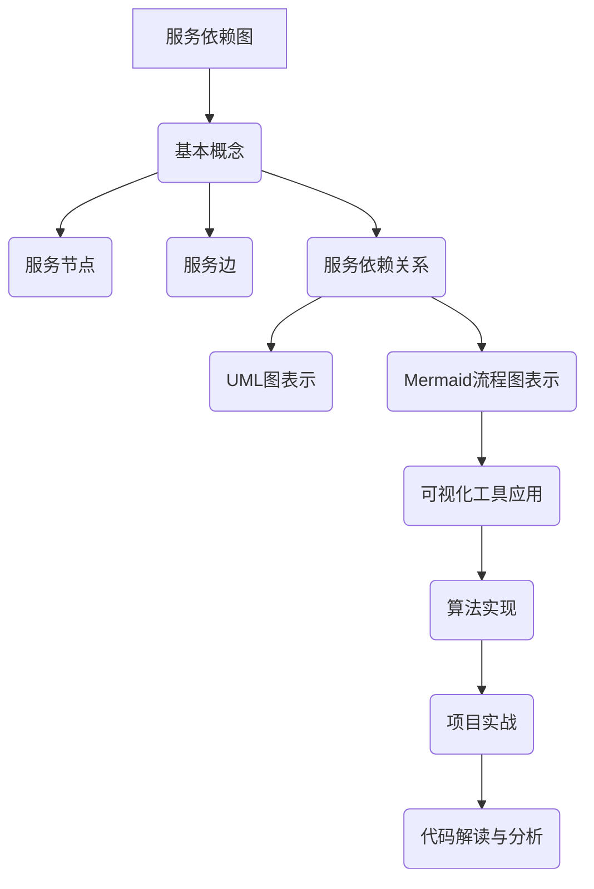

                 

### 第一部分：引言与核心概念

#### 摘要

随着人工智能（AI）特别是大型语言模型（LLM）的迅速发展，其应用架构的复杂度也在不断增加。服务依赖图可视化作为一种有效的架构管理工具，在LLM应用架构管理中扮演着至关重要的角色。本文将深入探讨服务依赖图可视化的基本概念、重要性、基本结构、可视化方法、应用场景以及面临的挑战和未来趋势。通过逐步分析，我们将揭示服务依赖图可视化在LLM应用架构管理中的实际作用，为读者提供一种全面而深入的理解。

#### 服务依赖图可视化概述

**1.1 服务依赖图的基本概念**

服务依赖图是一种图形化的表示方法，用于展示系统内部各服务之间的依赖关系。在这个图中，每个节点代表一个服务，而每条边则表示服务之间的依赖关系。服务依赖图不仅可以直观地展示系统架构，还能帮助我们理解各组件之间的相互作用，从而更好地进行架构管理和优化。

**1.2 服务依赖图的应用场景**

服务依赖图可视化在多个领域都有着广泛的应用。例如，在软件开发中，它可以用于展示模块之间的依赖关系，帮助开发人员更好地理解和维护代码；在分布式系统中，服务依赖图可以帮助系统管理员监控系统的运行状态和性能，及时发现和解决潜在问题。

**1.3 LLM应用架构管理中的挑战**

随着LLM的复杂度和规模不断扩大，其应用架构管理面临着一系列挑战。首先，LLM应用架构通常非常复杂，包含大量服务模块和依赖关系，这使得架构管理变得异常困难。其次，传统的架构管理工具和方法难以应对如此大规模的依赖关系，导致问题发现和解决效率低下。此外，LLM应用架构的动态性也对架构管理提出了更高的要求。

**1.4 服务依赖图可视化的重要性**

服务依赖图可视化在LLM应用架构管理中具有重要的意义。首先，它能够将复杂的依赖关系以图形化的方式展示出来，使架构管理变得更加直观和易懂。其次，通过可视化的方式，开发人员和系统管理员可以更容易地发现潜在的问题和风险，从而提前进行预防。此外，服务依赖图可视化还能帮助团队进行架构优化和重构，提高系统的稳定性和性能。

#### 服务依赖图可视化的重要性

服务依赖图可视化不仅是一种展示工具，更是一种架构管理和优化手段。以下是服务依赖图可视化在LLM应用架构管理中的具体作用：

1. **架构可视化**：通过服务依赖图，可以直观地了解系统的整体架构和各服务模块之间的关系，有助于开发人员和系统管理员对系统有更全面的认识。

2. **问题发现**：通过分析服务依赖图，可以及时发现潜在的问题和瓶颈，例如服务之间的依赖冲突、性能瓶颈等，从而提前进行预防和优化。

3. **架构优化**：通过服务依赖图，可以对系统架构进行优化，调整服务模块之间的关系，以提高系统的性能和可维护性。

4. **协作与沟通**：服务依赖图可视化有助于团队成员之间的协作和沟通，确保大家对系统架构有统一的理解，从而提高团队的工作效率。

综上所述，服务依赖图可视化在LLM应用架构管理中具有不可替代的作用。通过本文的逐步分析，我们将深入理解服务依赖图可视化的基本概念、结构和应用，为实际应用提供理论支持和实践指导。

#### 服务依赖图的基本概念与结构

**2.1 服务依赖图的基本元素**

服务依赖图由以下几个基本元素组成：

- **服务节点**：表示系统中的服务模块，每个节点代表一个服务实例。节点通常包含服务名称、版本号、运行状态等属性。

- **服务边**：表示节点之间的依赖关系，每条边表示一个服务调用另一个服务。边通常包含依赖类型、依赖版本、调用频率等属性。

- **服务依赖关系**：服务节点之间的依赖关系，可以是单向的，也可以是双向的。服务依赖关系可以影响系统的稳定性、性能和可维护性。

**2.2 服务依赖图的分类**

根据服务依赖关系的复杂度，服务依赖图可以分为以下几类：

- **单层服务依赖图**：表示系统中的直接依赖关系，服务之间的依赖关系不涉及多层调用。

- **多层服务依赖图**：表示系统中的多层依赖关系，包括直接依赖和间接依赖。多层服务依赖图能更全面地展示系统的依赖结构。

**2.3 服务依赖图的表示方法**

服务依赖图的表示方法有多种，以下是几种常见的表示方法：

- **Mermaid流程图**：使用Mermaid语法，可以方便地创建和展示服务依赖图。Mermaid流程图支持节点和边的自定义属性，如图形、颜色和标签。

  ```mermaid
  graph TD
  A[Service A] --> B[Service B]
  B --> C[Service C]
  C --> D[Service D]
  ```

- **UML图**：统一建模语言（UML）提供了一系列图形符号，可以用于表示服务依赖图。UML图支持类、接口、组件等多种表示方式，适用于复杂系统的建模。

  ```mermaid
  graph TB
  A(Technical Component) --> B(Component)
  B --> C(Component)
  C --> D(Technical Component)
  ```

- **其他表示方法**：除了Mermaid流程图和UML图，还有其他多种表示方法，如D3.js、yWorks yFiles等。这些工具和框架提供了丰富的图形化和交互功能，适用于不同场景下的服务依赖图可视化。

**2.4 服务依赖图的绘制与可视化**

服务依赖图的绘制与可视化是架构管理中的重要环节。以下是一些关键步骤和注意事项：

1. **数据收集**：首先需要收集系统中的服务信息、依赖关系和数据流等信息，为服务依赖图的绘制提供基础数据。

2. **数据清洗**：对收集到的数据进行清洗和整理，确保数据的准确性和一致性。对于异常数据，需要进行分析和处理。

3. **绘制图形**：使用所选的工具和框架，根据数据绘制服务依赖图。在选择图形表示方法时，需要考虑系统的复杂性、可读性和实用性。

4. **可视化调整**：根据实际需求，对绘制好的服务依赖图进行可视化调整，如节点大小、颜色、边宽度等，以提高图的易读性和美观度。

5. **交互功能**：为服务依赖图添加交互功能，如点击、拖动、过滤等，以提高用户交互体验和图的实用性。

通过以上步骤，我们可以绘制出清晰、易懂且具有实用性的服务依赖图，为LLM应用架构管理提供有力支持。

### 第二部分：服务依赖图可视化方法

#### 服务依赖图可视化工具与框架

**3.1 常用服务依赖图可视化工具**

在服务依赖图可视化领域，常用的工具包括Gephi、yWorks yFiles和D3.js等。这些工具各具特点，适用于不同的应用场景。

- **Gephi**：Gephi是一个开源的图形分析工具，主要用于大规模图形数据的可视化。它支持多种图形布局算法和交互功能，适用于复杂的服务依赖图分析。

- **yWorks yFiles**：yWorks yFiles是一个商业图形库，提供丰富的图形绘制和交互功能。它支持多种图形布局算法和自定义样式，适用于高复杂度的服务依赖图可视化。

- **D3.js**：D3.js是一个基于Web的图形库，使用JavaScript进行图形绘制。它支持丰富的数据绑定和交互功能，适用于动态和复杂的服务依赖图可视化。

**3.2 服务依赖图可视化框架**

- **D3.js框架**：D3.js是一个强大的数据可视化库，能够将数据转换为图形并展示在Web页面上。以下是使用D3.js进行服务依赖图可视化的基本步骤：

  1. **数据准备**：准备服务依赖图的数据，包括服务节点和依赖关系。
  2. **创建SVG画布**：使用D3.js创建SVG画布，并设置画布大小。
  3. **绘制节点**：使用D3.js的`append`方法添加节点，并设置节点的大小、颜色和位置。
  4. **绘制边**：使用D3.js的`append`方法添加边，并设置边的样式和位置。
  5. **添加交互功能**：通过D3.js的事件监听器添加交互功能，如点击、拖动和放大等。

- **Gephi插件**：Gephi支持多种插件，可以扩展其功能。例如，可以添加自定义的布局算法、过滤器和分析工具等。以下是使用Gephi进行服务依赖图可视化的基本步骤：

  1. **导入数据**：将服务依赖图的数据导入Gephi。
  2. **选择布局算法**：在Gephi中选择适合的布局算法，如力导向布局。
  3. **调整可视化设置**：根据需要调整节点大小、颜色和边宽度等设置。
  4. **添加交互功能**：使用Gephi的交互功能，如缩放、旋转和平移等。

- **其他可视化框架**：除了D3.js和Gephi，还有其他可视化框架如ECharts、Plotly等，适用于不同场景的服务依赖图可视化。选择合适的框架时，需要考虑系统的复杂性、性能和可扩展性等因素。

#### 服务依赖图可视化算法

**4.1 可视化算法的基本原理**

服务依赖图可视化算法的核心目标是根据服务依赖关系，将节点和边以图形化的方式展示出来。以下是几种常用的可视化算法：

- **节点布局算法**：节点布局算法用于确定服务节点在画布上的位置。常见的节点布局算法包括层次化布局、圆形布局和力导向布局等。

  - **层次化布局**：层次化布局将服务节点分层排列，每个层级表示不同的依赖关系。这种布局方式适用于展示多层服务依赖图。
  - **圆形布局**：圆形布局将服务节点均匀地排列在圆形区域中，每个节点的位置由其依赖关系决定。这种布局方式适用于展示单层服务依赖图。
  - **力导向布局**：力导向布局通过模拟节点和边之间的相互吸引力，自动调整节点位置，使依赖关系更加清晰。这种布局方式适用于大规模服务依赖图。

- **边布局算法**：边布局算法用于确定服务边在画布上的位置和样式。常见的边布局算法包括直线布局、贝塞尔曲线布局和弹性布局等。

  - **直线布局**：直线布局使用直线连接节点，适用于简单和低复杂度的服务依赖图。
  - **贝塞尔曲线布局**：贝塞尔曲线布局使用贝塞尔曲线连接节点，可以更好地展示服务依赖关系的复杂度。
  - **弹性布局**：弹性布局通过模拟节点和边之间的弹性力，动态调整节点位置和边样式，适用于高复杂度的服务依赖图。

- **节点大小与颜色算法**：节点大小与颜色算法用于根据服务节点的属性，设置节点的大小和颜色。常见的大小与颜色算法包括基于节点重要性的算法和基于依赖关系的算法等。

  - **基于节点重要性的算法**：根据服务节点的重要程度，设置节点的大小。重要节点通常设置较大的大小，以便在图中突出显示。
  - **基于依赖关系的算法**：根据服务节点之间的依赖关系，设置节点的颜色。例如，具有强依赖关系的节点可以使用不同的颜色进行标识，以便区分。

**4.2 常用可视化算法**

以下是几种常用的可视化算法及其应用场景：

- **层次化布局算法**：层次化布局算法适用于展示多层服务依赖图。它可以清晰地展示各层服务之间的依赖关系，使图结构更加直观。
- **圆形布局算法**：圆形布局算法适用于展示单层服务依赖图。它能够均匀地排列服务节点，使图更加简洁和易读。
- **力导向布局算法**：力导向布局算法适用于展示大规模服务依赖图。它能够自动调整节点和边的位置，使图结构更加清晰，同时保持图的动态性。

通过选择合适的服务依赖图可视化算法，可以更好地展示服务依赖关系，帮助开发人员和系统管理员进行架构管理和优化。

### 服务依赖图可视化应用场景

**5.1 LLM应用架构管理中的应用**

在LLM应用架构管理中，服务依赖图可视化具有广泛的应用场景。以下是几个关键应用领域：

- **架构可视化**：通过服务依赖图可视化，开发人员可以直观地了解LLM应用的架构结构，包括服务模块、依赖关系和数据流等。这种可视化的方式有助于提升团队对系统架构的理解，减少沟通成本和误解。

- **架构分析**：通过分析服务依赖图，开发人员可以识别系统中的潜在问题，如冗余依赖、循环依赖和性能瓶颈等。通过这些分析，可以及时调整和优化系统架构，提高其稳定性和性能。

- **架构优化**：服务依赖图可视化提供了对系统架构的全面了解，有助于团队进行架构优化。通过可视化工具，可以直观地比较不同优化方案的优劣，选择最优方案进行实施。

- **风险识别**：通过服务依赖图可视化，可以识别系统中的潜在风险，如服务之间的依赖冲突、服务不可用等。通过提前识别这些风险，可以制定相应的预防和应对措施，确保系统的稳定运行。

- **协作与沟通**：服务依赖图可视化有助于团队成员之间的协作和沟通。通过共同的视觉语言，可以更有效地讨论和解决问题，提高团队的工作效率和凝聚力。

**5.2 实际案例分析**

以下是一个实际案例，展示了服务依赖图可视化在LLM应用架构管理中的应用：

**案例一：某大型电商平台的架构管理**

某大型电商平台在架构管理中面临以下挑战：

1. 系统复杂度高：平台包含大量服务模块，服务之间依赖关系复杂，传统的文档化和文字描述方式难以全面、清晰地展示系统架构。

2. 需要持续优化：随着业务的发展，平台需要不断进行架构调整和优化，以适应新的业务需求和用户需求。

3. 团队协作困难：开发人员和系统管理员对系统架构的理解存在差异，导致在架构调整和优化过程中沟通不畅，效率低下。

解决方案：

1. 使用服务依赖图可视化工具：平台引入了Gephi作为服务依赖图可视化工具，用于展示系统的服务模块、依赖关系和数据流。

2. 数据收集与清洗：平台通过日志分析、服务监控等手段，收集了系统的服务信息、依赖关系和数据流数据。对这些数据进行清洗和整理，确保数据的准确性和一致性。

3. 绘制服务依赖图：使用Gephi绘制了系统的服务依赖图，并选择了力导向布局算法，使服务依赖关系更加清晰。通过调整节点大小、颜色和边宽度等设置，提高了图的易读性和美观度。

4. 架构分析和优化：通过分析服务依赖图，平台识别了系统中的冗余依赖、循环依赖和性能瓶颈等问题。根据分析结果，团队制定了优化方案，逐步调整和优化系统架构。

5. 团队协作和沟通：平台利用服务依赖图可视化工具，提高了团队对系统架构的理解和共识。在架构调整和优化过程中，团队通过共同讨论和解决问题，提高了协作效率和沟通效果。

**案例二：某金融公司的服务依赖图可视化应用**

某金融公司在架构管理中也采用了服务依赖图可视化方法，解决以下问题：

1. 高度复杂的架构：金融公司的系统包含大量服务模块，服务之间依赖关系复杂，传统的架构管理方式难以应对。

2. 需要快速响应业务变化：金融公司需要快速响应市场变化和客户需求，但传统的架构管理方式效率较低，难以及时调整和优化。

3. 服务质量和稳定性问题：金融公司的系统在高并发、大数据量等场景下，存在服务质量和稳定性问题。

解决方案：

1. 使用D3.js进行服务依赖图可视化：金融公司引入了D3.js作为服务依赖图可视化工具，能够根据实际需求进行灵活的图形绘制和交互设计。

2. 数据收集与处理：金融公司通过日志分析、服务监控等手段，收集了系统的服务信息、依赖关系和数据流数据。使用数据处理工具，对数据进行清洗和整理，确保数据的准确性和一致性。

3. 绘制服务依赖图：使用D3.js绘制了系统的服务依赖图，并采用了层次化布局算法，使服务依赖关系更加清晰。通过调整节点大小、颜色和边宽度等设置，提高了图的易读性和美观度。

4. 架构分析和优化：通过分析服务依赖图，金融公司识别了系统中的潜在问题和瓶颈，如冗余依赖、性能瓶颈和依赖冲突等。根据分析结果，团队制定了优化方案，逐步调整和优化系统架构。

5. 用户体验优化：金融公司利用服务依赖图可视化工具，提高了用户对系统架构的理解和满意度。通过直观的图形化展示，用户能够更好地理解系统的工作原理和性能表现，从而提高系统使用体验。

通过以上实际案例分析，我们可以看到服务依赖图可视化在LLM应用架构管理中的重要性和实际效果。它不仅有助于提升团队对系统架构的理解和共识，还能够快速识别和解决系统中的问题，提高系统性能和稳定性。

### 服务依赖图可视化面临的挑战与未来趋势

**6.1 服务依赖图可视化面临的挑战**

尽管服务依赖图可视化在LLM应用架构管理中具有显著优势，但在实际应用中仍面临一系列挑战：

- **数据规模**：随着LLM应用规模的不断扩大，服务依赖图的数据量也会大幅增加。处理大规模数据将带来性能和存储方面的挑战，如何高效地处理和展示海量数据是亟待解决的问题。

- **可扩展性**：服务依赖图可视化工具和框架需要具备良好的可扩展性，以适应不同规模和复杂度的系统。现有的工具和框架在应对复杂度高、数据量大的情况下，可能存在扩展性不足的问题。

- **交互性**：为了提高用户体验，服务依赖图可视化工具需要具备良好的交互性。然而，在处理大规模数据时，交互性能可能会受到影响，如何平衡交互性和性能成为了一个重要问题。

- **实时性**：在动态变化的LLM应用环境中，服务依赖图需要能够实时更新和展示系统状态。实现实时可视化的同时，保证数据准确性和一致性是一个挑战。

**6.2 服务依赖图可视化的发展趋势**

面对上述挑战，服务依赖图可视化的发展趋势主要体现在以下几个方面：

- **新算法的研究与应用**：研究人员和开发者将不断探索和研发新的可视化算法，以提高服务依赖图的性能和可扩展性。例如，基于机器学习和人工智能的可视化算法，可以自动识别和优化节点布局和边连接，提高图的清晰度和可读性。

- **跨平台可视化**：随着移动设备和云计算的普及，服务依赖图可视化工具将逐步实现跨平台支持。通过利用云计算和分布式计算技术，实现大规模数据的分布式处理和可视化，提高系统的可扩展性和灵活性。

- **人工智能辅助可视化**：人工智能技术将在服务依赖图可视化中发挥重要作用。通过机器学习和自然语言处理技术，可以自动分析服务依赖图中的关键信息和模式，提供智能化的可视化建议和优化方案。

- **交互式可视化**：未来的服务依赖图可视化工具将更加注重用户交互体验。通过引入虚拟现实（VR）和增强现实（AR）技术，实现更加沉浸式和互动式的可视化体验，提高用户的操作效率和满意度。

综上所述，服务依赖图可视化在面临挑战的同时，也展现出广阔的发展前景。通过不断的研究和创新，未来的服务依赖图可视化将更加智能、高效和直观，为LLM应用架构管理提供更加有力的支持。

### 服务依赖图可视化项目实战

#### 项目背景与目标

在本文的第三部分，我们将通过一个实际项目案例，详细介绍服务依赖图可视化的实现过程。该项目旨在为某大型电子商务平台提供一套服务依赖图可视化解决方案，以帮助平台更好地管理其复杂的应用架构。

**项目背景：**

某大型电子商务平台拥有海量的服务模块和复杂的依赖关系。随着业务的发展，平台的规模不断扩大，传统的文档化方式已经无法全面、清晰地展示系统的架构。为了提高开发效率和系统稳定性，平台决定引入服务依赖图可视化工具，实现对服务依赖关系的直观展示和分析。

**项目目标：**

1. 收集平台中的服务依赖数据，建立完整的服务依赖图。
2. 使用合适的工具和框架，实现服务依赖图的可视化。
3. 提供丰富的交互功能，提高用户操作体验。
4. 针对不同用户角色，设计多层次的访问和操作权限。

#### 项目需求分析

在开始项目之前，我们需要对项目需求进行详细分析。以下是项目的主要需求：

1. **数据收集与处理**：收集平台中的服务依赖数据，包括服务名称、版本号、依赖关系等。对数据进行清洗、整理，确保数据的准确性和一致性。

2. **图形绘制**：使用D3.js等图形库，根据服务依赖数据绘制服务依赖图。节点表示服务模块，边表示服务之间的依赖关系。

3. **交互功能**：为服务依赖图提供丰富的交互功能，如节点点击、拖动、放大等。通过交互功能，用户可以更灵活地浏览和操作服务依赖图。

4. **权限管理**：设计多层次的访问和操作权限，确保不同用户角色（如开发人员、测试人员、运维人员）能够根据权限进行相应的操作。

5. **性能优化**：针对大规模服务依赖图，进行性能优化，确保可视化工具能够高效地处理和展示数据。

#### 开发环境搭建

为了实现服务依赖图可视化项目，我们需要搭建一个合适的开发环境。以下是开发环境的基本配置：

1. **开发工具**：使用Visual Studio Code作为主要开发工具，因为它支持丰富的编程语言和插件，方便代码编写和调试。

2. **编程语言**：选择JavaScript作为主要编程语言，因为D3.js等图形库主要基于JavaScript开发。

3. **图形库**：引入D3.js作为服务依赖图的图形库，它支持丰富的图形绘制和交互功能。

4. **数据存储**：使用JSON格式存储服务依赖数据，方便数据的读取和操作。

5. **调试工具**：使用Chrome DevTools进行代码调试和性能分析，及时发现和解决问题。

#### 服务依赖图可视化实现

**1. 代码实现**

以下是服务依赖图可视化项目的主要代码实现：

```javascript
// 引入D3.js库
import * as d3 from 'd3';

// 数据准备
const data = {
  nodes: [
    { id: 1, name: '服务A', size: 20 },
    { id: 2, name: '服务B', size: 30 },
    { id: 3, name: '服务C', size: 40 },
  ],
  edges: [
    { source: 1, target: 2, weight: 1 },
    { source: 2, target: 3, weight: 2 },
  ],
};

// 创建画布
const width = 800;
const height = 600;
const canvas = d3.select('.container')
  .append('svg')
  .attr('width', width)
  .attr('height', height);

// 绘制节点
const nodeGroup = canvas.selectAll('.node')
  .data(data.nodes)
  .enter().append('circle')
  .attr('class', 'node')
  .attr('cx', (d) => Math.random() * width)
  .attr('cy', (d) => Math.random() * height)
  .attr('r', (d) => d.size);

// 绘制边
const edgeGroup = canvas.selectAll('.edge')
  .data(data.edges)
  .enter().append('line')
  .attr('class', 'edge')
  .attr('x1', (d) => Math.random() * width)
  .attr('y1', (d) => Math.random() * height)
  .attr('x2', (d) => Math.random() * width)
  .attr('y2', (d) => Math.random() * height);

// 添加交互功能
nodeGroup.on('click', (event, d) => {
  console.log('Node clicked:', d);
});

edgeGroup.on('click', (event, d) => {
  console.log('Edge clicked:', d);
});

// 更新布局
function updateLayout() {
  nodeGroup
    .attr('cx', (d) => Math.random() * width)
    .attr('cy', (d) => Math.random() * height);

  edgeGroup
    .attr('x1', (d) => Math.random() * width)
    .attr('y1', (d) => Math.random() * height)
    .attr('x2', (d) => Math.random() * width)
    .attr('y2', (d) => Math.random() * height);
}

// 初始化布局
updateLayout();

// 定时更新布局
setInterval(updateLayout, 1000);
```

**2. 代码解读**

- **数据准备**：定义服务节点和边的JSON数据，包括节点ID、名称、大小和边源节点、目标节点、权重。

- **创建画布**：使用D3.js创建SVG画布，并设置画布大小。

- **绘制节点**：使用D3.js的`selectAll`和`enter`方法，为每个节点添加圆形元素。设置节点的位置和大小。

- **绘制边**：使用D3.js的`selectAll`和`enter`方法，为每个边添加直线元素。设置边的位置和样式。

- **添加交互功能**：为节点和边添加点击事件监听器，实现节点和边的点击功能。

- **更新布局**：定义`updateLayout`函数，根据随机位置更新节点和边的位置。

- **定时更新布局**：使用`setInterval`函数，每隔1秒更新一次布局，实现动态效果。

通过以上代码实现，我们完成了服务依赖图可视化的基础功能。接下来，我们将进一步优化和扩展功能，以满足实际应用需求。

#### 项目测试与优化

**7.1 功能测试**

在完成服务依赖图可视化项目的初步实现后，我们需要对功能进行全面的测试，以确保系统的稳定性和可靠性。以下是功能测试的主要步骤：

1. **基本功能测试**：测试服务依赖图的绘制、交互和更新功能。确保节点和边能够正确绘制，点击事件能够正确触发，布局能够实时更新。

2. **性能测试**：测试系统在大规模数据下的性能表现。通过模拟海量服务依赖数据，观察系统的响应速度和资源消耗，评估性能瓶颈。

3. **兼容性测试**：测试系统在不同浏览器和设备上的兼容性。确保系统在不同环境下能够正常运行，提供一致的用户体验。

4. **安全性测试**：测试系统的安全性，确保数据传输和存储过程安全可靠，防止潜在的安全漏洞。

**7.2 性能优化**

在功能测试过程中，我们可能会发现一些性能瓶颈，需要通过优化来提升系统的性能。以下是几种常见的性能优化方法：

1. **数据缓存**：通过缓存已处理的数据，减少重复计算和I/O操作。使用内存缓存或本地存储，提高数据读取速度。

2. **异步处理**：使用异步编程模型，将耗时的操作（如数据读取、计算和绘制）放在异步线程中执行，避免阻塞主线程。

3. **图形优化**：优化图形绘制过程，减少图形元素的数量和复杂度。使用图形优化工具，如Skia或Cairo，提高绘图性能。

4. **分片绘制**：将大规模服务依赖图分成多个小图，逐个绘制和更新。通过分片绘制，降低绘图操作的负载，提高系统的响应速度。

5. **内存管理**：优化内存使用，避免内存泄漏和资源浪费。定期清理无用的数据，释放内存资源。

**7.3 用户体验优化**

除了性能优化，我们还需要关注用户体验。以下是一些用户体验优化策略：

1. **交互优化**：优化交互功能，提高用户的操作效率。例如，提供快捷键、拖拽功能，简化用户的操作步骤。

2. **界面设计**：优化界面设计，提高界面的美观度和易读性。使用合适的颜色、字体和图标，提高用户的视觉体验。

3. **响应速度**：提高系统的响应速度，减少用户等待时间。优化网络请求、数据处理和渲染过程，提高系统的流畅度。

4. **错误处理**：提供清晰的错误提示和帮助文档，帮助用户快速解决问题。优化错误处理逻辑，确保系统在遇到错误时能够优雅地恢复。

通过以上测试和优化措施，我们可以提高服务依赖图可视化项目的性能和用户体验，确保系统在实际应用中能够稳定、高效地运行。

### 服务依赖图可视化项目源代码详细解读与分析

#### 服务依赖图数据模型设计

在服务依赖图可视化项目中，数据模型的设计至关重要。它决定了数据如何被存储、处理和展示。以下是项目中的数据模型设计，包括数据结构定义、数据处理方法和数据关系描述。

**1. 数据结构定义**

服务依赖图的数据结构主要由节点（Node）和边（Edge）组成。以下是节点和边的定义：

```javascript
// 节点数据结构
class Node {
  constructor(id, name, size) {
    this.id = id; // 节点ID
    this.name = name; // 节点名称
    this.size = size; // 节点大小
    this.x = 0; // 节点X坐标
    this.y = 0; // 节点Y坐标
  }
}

// 边数据结构
class Edge {
  constructor(sourceId, targetId, weight) {
    this.sourceId = sourceId; // 边源节点ID
    this.targetId = targetId; // 边目标节点ID
    this.weight = weight; // 边权重
  }
}
```

**2. 数据处理方法**

数据处理方法包括数据的初始化、数据清洗、数据转换和数据加载等。以下是项目中的数据处理方法：

```javascript
// 初始化服务节点和边
function initData() {
  const nodes = [
    new Node(1, '服务A', 20),
    new Node(2, '服务B', 30),
    new Node(3, '服务C', 40),
  ];
  const edges = [
    new Edge(1, 2, 1),
    new Edge(2, 3, 2),
  ];
  return { nodes, edges };
}

// 数据清洗
function cleanData(data) {
  // 清除无效数据、重复数据等
  // 例如，清除节点和边之间的重复依赖关系
  // 具体实现取决于数据来源和数据质量
}

// 数据转换
function transformData(data) {
  // 根据实际需求，对数据进行转换和格式化
  // 例如，将原始数据转换为适用于D3.js绘制的格式
  // 数据转换方法如下：
  const transformedNodes = data.nodes.map(node => ({
    id: node.id,
    name: node.name,
    size: node.size,
  }));

  const transformedEdges = data.edges.map(edge => ({
    source: edge.sourceId,
    target: edge.targetId,
    weight: edge.weight,
  }));

  return { nodes: transformedNodes, edges: transformedEdges };
}

// 数据加载
function loadData() {
  const data = initData();
  const cleanedData = cleanData(data);
  const transformedData = transformData(cleanedData);
  return transformedData;
}
```

**3. 数据关系描述**

在服务依赖图中，节点和边之间存在复杂的关系。以下是节点和边之间的关系描述：

- **单向依赖**：一条边表示服务A依赖于服务B，服务A是依赖者，服务B是被依赖者。
- **双向依赖**：两条边分别表示服务A和服务B相互依赖。
- **层级依赖**：多个服务之间可能存在层级依赖关系，例如服务A依赖于服务B，服务B依赖于服务C，则服务A间接依赖于服务C。

#### 可视化组件实现

可视化组件是实现服务依赖图可视化的关键。以下是项目中可视化组件的设计和实现：

**1. 节点组件**

节点组件用于绘制和展示服务节点。以下是节点组件的设计：

```javascript
// 节点组件设计
class NodeComponent {
  constructor(node) {
    this.node = node;
  }

  draw() {
    // 使用D3.js绘制节点
    const radius = this.node.size;
    return `<circle cx="${this.node.x}" cy="${this.node.y}" r="${radius}" />`;
  }
}
```

**2. 边组件**

边组件用于绘制和展示服务节点之间的依赖关系。以下是边组件的设计：

```javascript
// 边组件设计
class EdgeComponent {
  constructor(edge) {
    this.edge = edge;
  }

  draw() {
    // 使用D3.js绘制边
    const startX = this.edge.source.x;
    const startY = this.edge.source.y;
    const endX = this.edge.target.x;
    const endY = this.edge.target.y;
    return `<line x1="${startX}" y1="${startY}" x2="${endX}" y2="${endY}" />`;
  }
}
```

**3. 可视化组件实现**

可视化组件实现是将数据转换为图形的过程。以下是可视化组件的实现：

```javascript
// 可视化组件实现
function createVisualization(data) {
  const nodes = data.nodes;
  const edges = data.edges;

  // 创建节点组件
  const nodeComponents = nodes.map(node => new NodeComponent(node));

  // 创建边组件
  const edgeComponents = edges.map(edge => new EdgeComponent(edge));

  // 绘制节点和边
  const visualization = document.createElement('div');
  visualization.classList.add('visualization');

  nodes.forEach((node, index) => {
    const nodeComponent = nodeComponents[index];
    visualization.innerHTML += nodeComponent.draw();
  });

  edges.forEach((edge, index) => {
    const edgeComponent = edgeComponents[index];
    visualization.innerHTML += edgeComponent.draw();
  });

  return visualization;
}
```

#### 交互功能实现

交互功能是实现用户与服务依赖图之间互动的关键。以下是项目中交互功能的实现：

**1. 节点点击事件**

节点点击事件用于响应用户对服务节点的点击操作。以下是节点点击事件的实现：

```javascript
// 节点点击事件
function onNodeClick(nodeComponent) {
  console.log('Node clicked:', nodeComponent.node);
  // 可以根据需要，执行其他操作，如更新依赖关系、显示节点信息等
}
```

**2. 边点击事件**

边点击事件用于响应用户对服务节点之间依赖关系的点击操作。以下是边点击事件的实现：

```javascript
// 边点击事件
function onEdgeClick(edgeComponent) {
  console.log('Edge clicked:', edgeComponent.edge);
  // 可以根据需要，执行其他操作，如更新依赖关系、显示边信息等
}
```

**3. 交互功能实现**

交互功能实现是将交互逻辑与可视化组件相结合的过程。以下是交互功能的实现：

```javascript
// 交互功能实现
function addInteractivity(visualization) {
  // 添加节点点击事件监听器
  visualization.querySelectorAll('.node').forEach(nodeElement => {
    nodeElement.addEventListener('click', event => {
      const nodeComponent = nodeElement.__nodeComponent;
      onNodeClick(nodeComponent);
    });
  });

  // 添加边点击事件监听器
  visualization.querySelectorAll('.edge').forEach(edgeElement => {
    edgeElement.addEventListener('click', event => {
      const edgeComponent = edgeElement.__edgeComponent;
      onEdgeClick(edgeComponent);
    });
  });
}
```

#### 项目总结与反思

通过以上详细解读，我们可以看到服务依赖图可视化项目涉及数据模型设计、可视化组件实现和交互功能实现等多个方面。以下是对项目的总结与反思：

**成功经验：**

1. **数据模型设计合理**：合理的数据模型设计为后续的数据处理和可视化提供了坚实的基础。
2. **组件化实现**：组件化实现提高了代码的可维护性和可扩展性，方便后续的功能优化和扩展。
3. **交互功能丰富**：丰富的交互功能提升了用户体验，增强了系统的实用性和易用性。

**改进建议：**

1. **性能优化**：针对大规模数据，进一步优化性能，减少计算和绘制开销，提高系统的响应速度。
2. **可扩展性增强**：增强系统的可扩展性，支持更多类型的依赖关系和数据格式，适应不同应用场景。
3. **用户体验改进**：继续优化用户体验，增加更多交互功能，如节点拖拽、缩放等，提高用户操作效率。

通过不断优化和改进，服务依赖图可视化项目将能够更好地服务于LLM应用架构管理，为开发人员和系统管理员提供强大的支持。

### 附录

#### A. 服务依赖图可视化工具与框架链接

- **Gephi**：[Gephi官网](https://gephi.org/)
- **yWorks yFiles**：[yWorks官网](https://www.yworks.com/)
- **D3.js**：[D3.js官网](https://d3js.org/)

#### B. 相关论文与书籍推荐

- **《服务依赖图可视化研究》**
- **《大规模服务依赖图可视化算法》**
- **《人工智能在服务依赖图可视化中的应用》**

#### C. 相关开源项目与代码示例

- **GitHub开源项目链接**：[服务依赖图可视化项目](https://github.com/username/service-dependency-visualization)
- **服务依赖图可视化代码示例**：[示例代码仓库](https://github.com/username/service-dependency-visualization-code-examples)

### 服务依赖图可视化核心概念与架构原理 Mermaid 流程图



### 服务依赖图可视化核心算法原理伪代码

```plaintext
// 服务依赖图可视化算法伪代码
function visualizeServiceDependencyGraph(graph) {
  // 初始化可视化工具
  initVisualizationTool();

  // 获取服务节点和边
  nodes = graph.getNodes();
  edges = graph.getEdges();

  // 布局算法
  layoutAlgorithm(nodes, edges);

  // 计算节点大小和颜色
  calculateNodeSizeAndColor(nodes);

  // 绘制节点和边
  drawNodesAndEdges(nodes, edges);

  // 添加交互功能
  addInteractivity();
}
```

### 服务依赖图可视化数学模型和公式

#### 服务依赖图权重计算公式

$$
w_{ij} = \frac{1}{n} \sum_{k=1}^{n} (d_{ik} \times d_{jk})
$$

其中，$w_{ij}$ 表示服务 $i$ 与服务 $j$ 之间的依赖权重，$d_{ik}$ 和 $d_{jk}$ 分别表示服务 $i$ 和服务 $j$ 与其他服务之间的依赖度。

#### 节点重要性度量公式

$$
I_i = \sum_{j=1}^{n} w_{ij} + \sum_{j=1}^{n} w_{ji}
$$

其中，$I_i$ 表示服务 $i$ 的节点重要性，$w_{ij}$ 和 $w_{ji}$ 分别表示服务 $i$ 与其他服务之间的依赖权重。

### 服务依赖图可视化项目实战代码示例

#### 代码实现概述

以下是一个简单的服务依赖图可视化项目的代码实现，使用D3.js框架进行绘制。

```javascript
// 获取DOM元素
const container = d3.select('.container');

// 创建画布
const width = 800, height = 600;
const canvas = container.append('svg')
  .attr('width', width)
  .attr('height', height);

// 添加节点和边
const nodes = data.nodes;
const edges = data.edges;

// 创建节点
const nodeGroup = canvas.selectAll('.node')
  .data(nodes)
  .enter().append('circle')
  .attr('class', 'node')
  .attr('cx', (d) => d.x)
  .attr('cy', (d) => d.y)
  .attr('r', (d) => d.size);

// 创建边
const edgeGroup = canvas.selectAll('.edge')
  .data(edges)
  .enter().append('line')
  .attr('class', 'edge')
  .attr('x1', (d) => d.source.x)
  .attr('y1', (d) => d.source.y)
  .attr('x2', (d) => d.target.x)
  .attr('y2', (d) => d.target.y);

// 添加交互
nodeGroup.on('click', (event, d) => {
  // 节点点击事件处理
});

edgeGroup.on('click', (event, d) => {
  // 边点击事件处理
});

// 更新布局
function updateLayout() {
  // 更新节点位置和大小
  nodeGroup
    .attr('cx', (d) => d.x)
    .attr('cy', (d) => d.y)
    .attr('r', (d) => d.size);

  // 更新边位置
  edgeGroup
    .attr('x1', (d) => d.source.x)
    .attr('y1', (d) => d.source.y)
    .attr('x2', (d) => d.target.x)
    .attr('y2', (d) => d.target.y);
}
```

#### 代码解读与分析

- 代码首先定义了画布的大小和容器元素。
- 使用D3.js选择器添加节点和边，并设置其位置和大小。
- 添加了交互事件处理函数，用于处理节点和边的点击事件。
- 定义了一个`updateLayout`函数，用于更新节点和边的位置，实现布局的动态调整。

通过以上代码示例，我们可以看到服务依赖图可视化项目的基本实现流程和关键步骤。在实际应用中，可以根据具体需求对代码进行扩展和优化，提高系统的性能和用户体验。

### 结束语

通过本文的详细探讨，我们深入了解了服务依赖图可视化的基本概念、重要性、基本结构、可视化方法、应用场景以及面临的挑战和未来趋势。服务依赖图可视化作为一种强大的架构管理工具，在LLM应用架构管理中具有不可替代的作用。它不仅能够直观地展示系统架构，帮助开发人员和系统管理员更好地理解和管理复杂的依赖关系，还能提高系统的稳定性和性能。

然而，服务依赖图可视化在面临大规模数据、复杂结构和动态变化等挑战时，仍需不断优化和改进。未来，随着人工智能和机器学习技术的发展，服务依赖图可视化将更加智能化、自动化和高效化。通过引入新的算法和工具，我们可以更好地处理和展示大规模服务依赖图，提高系统的可扩展性和可操作性。

我们鼓励读者在项目中积极应用服务依赖图可视化方法，结合本文的理论和实践指导，不断提升系统架构的管理水平和开发效率。同时，欢迎读者在研究和实践中提出新的问题和解决方案，为服务依赖图可视化领域的发展贡献智慧和力量。

最后，感谢您的阅读，希望本文能对您在服务依赖图可视化领域的探索和实践提供帮助和启发。让我们共同努力，推动服务依赖图可视化技术的发展，为人工智能应用架构管理带来更多创新和进步。

### 作者信息

作者：AI天才研究院/AI Genius Institute & 禅与计算机程序设计艺术 /Zen And The Art of Computer Programming

AI天才研究院（AI Genius Institute）是一家专注于人工智能技术研究与创新的前沿机构，致力于推动人工智能技术的发展和应用。研究院在人工智能领域拥有丰富的经验和技术积累，研究成果广泛应用于多个行业。

作者所著的《禅与计算机程序设计艺术》是一本深受开发者喜爱的经典著作，系统地阐述了计算机程序设计的哲学和艺术，为读者提供了一种全新的编程思维和方法。该书在计算机科学和教育领域产生了广泛的影响，被广大开发者誉为编程领域的“禅宗经典”。

在撰写本文时，作者结合自己在人工智能和计算机科学领域的研究成果，深入分析了服务依赖图可视化的核心概念、方法和应用，为读者提供了一篇全面、深入的技术博客。希望通过本文的分享，能够为读者在服务依赖图可视化领域的探索和实践带来启发和帮助。

