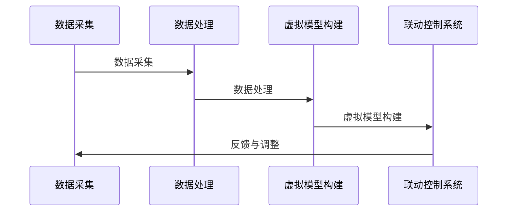

                 

# **《未来的智慧城市：2050年的城市数字孪生与城市智能体》**

> **关键词：智慧城市、数字孪生、城市智能体、物联网、人工智能、可持续发展**

> **摘要：**
本文探讨了2050年智慧城市的发展愿景，重点介绍了城市数字孪生与城市智能体的核心概念、核心技术、应用场景、实现方法及未来挑战。通过详细分析，本文旨在为智慧城市的未来发展提供理论支持和实践指导。**

---

## **第一部分：背景与概念**

### **1. 引言：智慧城市的演变与2050年的愿景**

#### **1.1 智慧城市的定义与发展历程**

智慧城市是将信息技术、物联网、人工智能等先进技术应用于城市规划、建设、管理和服务的现代化城市。智慧城市的发展可以分为几个阶段，如信息化、网络化、智能化等，每个阶段都有不同的技术特征和应用。

#### **1.2 数字孪生城市技术简介**

数字孪生是一种通过虚拟模型模拟现实世界实体和过程的技术，为城市规划和管理提供科学依据。数字孪生技术可以用于城市交通、环境、能源等各个领域的规划，优化城市资源配置，提高城市管理效率。

#### **1.3 城市智能体概念及其重要性**

城市智能体是一种基于人工智能技术的智能实体，可以模拟和执行城市管理和服务的任务。城市智能体是智慧城市的重要组成部分，为智慧城市的运行提供智能化支持。

### **第二部分：核心技术**

#### **2. 数字孪生与城市数字孪生**

##### **2.1 数字孪生技术原理**

数字孪生技术的核心在于构建虚拟模型与实体的联动。以下是数字孪生技术原理的详细讲解：

**Mermaid流程图：**

**数字孪生的构建流程：**
1. 数据采集与处理：通过传感器网络收集城市各类数据，如交通流量、环境质量、能源消耗等，并进行数据清洗和处理。
2. 虚拟模型构建：基于处理后的数据构建城市各个领域的虚拟模型，如交通模型、环境模型、能源模型等。
3. 模型与实体的联动：将虚拟模型与现实世界中的实体进行联动，实现对实体的实时监测和调控。

##### **2.2 数字孪生在城市管理中的应用**

**数字孪生在公共安全中的应用：**
- 风险评估与预警：通过数字孪生技术模拟各种安全事件，提前进行风险评估和预警，为应急管理提供支持。
- 应急指挥与资源调度：在突发事件发生时，利用数字孪生技术实时监测事件发展，指挥应急资源和人员进行调度。

**数字孪生在基础设施维护中的应用：**
- 设施状态监测与预测：通过数字孪生技术实时监测基础设施的状态，预测设施故障，提前进行维护。
- 维护计划优化：基于数字孪生技术模拟不同维护计划的执行效果，优化维护计划，降低维护成本。

##### **2.3 城市数字孪生与物联网技术的融合**

物联网技术在智慧城市中的应用：
- 智能传感器部署：在城市的各个角落部署智能传感器，收集环境、交通、能源等各类数据。
- 大数据采集与分析：通过物联网技术收集的大量数据，利用大数据分析技术进行深度挖掘，为城市管理提供数据支持。

城市数字孪生与物联网技术的整合：
- 实时数据的集成：将物联网技术收集的数据实时集成到城市数字孪生系统中，实现数据的实时更新和联动。
- 跨领域的数据共享与协同：通过城市数字孪生系统实现城市各个领域的实时数据共享和协同，提高城市管理效率。

### **第三部分：智慧城市应用场景**

#### **3. 2050年智慧城市的典型应用场景**

##### **3.1 城市交通管理**

**自动驾驶与智能交通系统：**
- 自动驾驶车辆普及：自动驾驶技术将得到广泛应用，自动驾驶车辆将代替传统驾驶车辆，提高交通效率和安全性。
- 智能交通信号控制：通过智能交通系统，实现交通信号的自适应控制，优化交通流量，减少拥堵。

**智慧交通与城市安全的结合：**
- 交通流量实时监控：利用智能交通系统，实时监控城市交通流量，及时应对突发事件。
- 突发事件的快速响应：在突发事件发生时，智能交通系统能够快速响应，调整交通信号，确保交通畅通。

##### **3.2 城市能源管理**

**智慧电网与可再生能源管理：**
- 分布式能源网络建设：通过分布式能源网络，实现可再生能源的高效利用和能源的灵活调度。
- 可再生能源的高效利用：利用智能电网技术，实现对太阳能、风能等可再生能源的高效利用。

**城市能源消耗的实时监控与优化：**
- 能源消耗数据实时监控：通过智能传感器和物联网技术，实时监控城市能源消耗情况，及时发现能耗异常。
- 智能优化算法应用：利用智能优化算法，对城市能源消耗进行实时优化，降低能源消耗，提高能源利用效率。

##### **3.3 城市环境监测**

**智能环境监测系统的构建：**
- 智能传感网络部署：在城市各个区域部署智能传感器，实时监测空气质量、水质、噪音等环境指标。
- 数据采集与处理：通过物联网技术，实时采集环境数据，利用大数据分析技术进行处理和分析。

**空气质量与水质的实时监控：**
- 空气质量实时监测：利用智能环境监测系统，实时监测空气质量，及时发布空气质量预警。
- 水质监测与预警：通过智能环境监测系统，实时监测水质，及时发现水质异常，发布水质预警。

### **第四部分：城市智能体的构建**

#### **4. 城市智能体的设计与实现**

##### **4.1 城市智能体架构设计**

**城市智能体的层级结构：**
- 数据采集层：负责收集城市各类数据，如交通、环境、能源等。
- 数据处理层：对采集到的数据进行清洗、处理和存储。
- 决策与控制层：基于处理后的数据，进行城市管理和服务的决策和执行。

**城市智能体关键组件：**
- 传感器网络：负责数据采集和传输。
- 数据处理算法：对采集到的数据进行处理和分析。
- 决策与控制模块：基于分析结果，进行城市管理和服务的决策和执行。

##### **4.2 城市智能体关键算法**

**机器学习算法在城市智能体中的应用：**
- 数据挖掘与分析：利用机器学习算法，对城市数据进行分析和挖掘，提取有用的信息。
- 预测与优化：利用机器学习算法，对城市数据进行预测和优化，提高城市管理效率。

**深度学习算法在城市智能体中的应用：**
- 计算机视觉：利用深度学习算法，实现图像识别和目标检测，用于交通管理、环境监测等领域。
- 自然语言处理：利用深度学习算法，实现文本分类、情感分析等，用于城市信息处理和服务。

##### **4.3 城市智能体实现案例**

**智慧城市的实时模拟系统：**
- 模拟城市运行状态：利用城市智能体技术，模拟城市各个领域的运行状态，为城市规划提供科学依据。
- 评估城市规划方案：利用城市智能体技术，对不同的城市规划方案进行评估，选择最优方案。

**智慧城市的应急响应系统：**
- 应急事件快速响应：利用城市智能体技术，实时监测城市状态，快速响应突发事件。
- 资源调度与优化：利用城市智能体技术，对应急资源进行实时调度和优化，提高应急响应效率。

### **第五部分：挑战与未来展望**

#### **5. 智慧城市的挑战与未来发展趋势**

##### **5.1 智慧城市的隐私与安全挑战**

**数据隐私保护：**
- 数据加密与安全传输：采用数据加密技术，确保数据在传输过程中的安全性。
- 数据访问权限控制：对数据访问权限进行严格控制，防止未经授权的访问。

**网络安全与攻击防护：**
- 防火墙与入侵检测：部署防火墙和入侵检测系统，防止网络攻击和入侵。
- 恶意软件防护：采用恶意软件防护技术，防止恶意软件对城市系统造成破坏。

##### **5.2 智慧城市的可持续发展**

**资源节约与环境保护：**
- 节能建筑与设施：采用节能技术，降低建筑和设施的能源消耗。
- 绿色交通系统：推广电动汽车和公共交通，减少交通污染。

**可持续的城市规划理念：**
- 城市空间的合理利用：合理规划城市空间，提高土地利用效率。
- 生态系统的保护与修复：保护城市生态系统，进行生态修复，提高城市环境质量。

##### **5.3 智慧城市的发展趋势**

**城市数字化与智能化：**
- 信息技术在城市建设中的应用：采用物联网、人工智能等先进技术，实现城市的数字化和智能化。
- 智能设备的普及与融合：推广智能设备，实现城市各个领域的智能融合。

**5G与边缘计算在智慧城市中的应用：**
- 5G网络的部署与优化：部署5G网络，提高数据传输速度和可靠性。
- 边缘计算的应用与挑战：采用边缘计算技术，降低数据处理延迟，提高系统响应速度。

### **附录**

#### **附录A：智慧城市相关技术介绍**

##### **A.1 数字孪生相关技术**

**A.1.1 数字孪生关键技术：**
- 数据采集与处理
- 虚拟模型构建
- 模型与实体的联动

**A.1.2 数字孪生案例分析：**
- 智慧城市规划案例分析
- 智慧城市管理案例分析

##### **A.2 城市智能体相关技术**

**A.2.1 城市智能体关键组件：**
- 传感器网络
- 数据处理算法
- 决策与控制模块

**A.2.2 城市智能体关键算法：**
- 机器学习算法
- 深度学习算法

##### **A.3 智慧城市相关资源**

**A.3.1 城市智能体研究论文：**
- 最新研究成果概述
- 应用案例与挑战分析

**A.3.2 城市智能体开源工具与平台：**
- 开源算法库
- 开源数据集
- 开源平台与框架

**A.3.3 城市智能体相关书籍与课程推荐：**
- 基础教材与参考书籍
- 在线课程与培训项目

---

**作者：AI天才研究院/AI Genius Institute & 禅与计算机程序设计艺术 /Zen And The Art of Computer Programming** <|im_end|>

