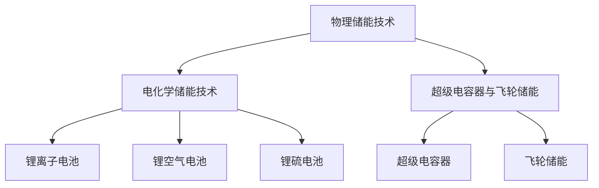

                 

# 未来的智慧能源：2050年的储能技术与智能用电

## 关键词
- 智慧能源
- 储能技术
- 智能用电
- 2050年展望
- 可再生能源
- 智能电网
- 能源效率

## 摘要
本文探讨了2050年的智慧能源系统，重点关注储能技术和智能用电的发展趋势。通过分析全球能源需求预测、储能技术分类、智能电网运行管理以及智能用电设备与系统集成，本文描绘了一个未来智慧能源系统的蓝图。文章还通过实际案例，展示了储能技术和智能用电设备的开发环境搭建、源代码实现与详细解读，为读者提供了一个全面的技术视角。

----------------------------------------------------------------

## 第一部分：智慧能源与未来展望

### 第1章：智慧能源的起源与发展

#### 1.1 智慧能源的定义与特点

智慧能源，是指通过信息通信技术（ICT）与能源系统的深度融合，实现能源的高效生产、传输、存储、分配和消费。智慧能源系统具有以下几个显著特点：

1. **信息集成与优化**：通过集成各类传感器、智能仪表和控制系统，实现能源数据的实时采集、传输和处理，从而实现能源系统的优化调度。
2. **自主决策与自适应**：利用人工智能、大数据分析等技术，实现能源系统的自主决策和自适应调节，提高能源利用效率和可靠性。
3. **用户参与与互动**：鼓励用户参与能源生产与消费，通过智能家居、能源管理系统等，提高用户在能源使用中的主动性和节能意识。
4. **绿色环保**：智慧能源系统注重可再生能源的开发和利用，减少化石燃料的依赖，降低碳排放，实现能源的可持续发展。

#### 1.2 储能技术与智能用电的融合

储能技术是智慧能源系统中的关键环节，它能够平衡能源供需，提高能源利用效率，支撑可再生能源的广泛接入。储能技术与智能用电的融合体现在以下几个方面：

1. **能量调节与平衡**：储能系统可以在电力需求高峰时释放能量，降低电力系统的负荷压力；在需求低谷时储存能量，提高能源利用率。
2. **可再生能源集成**：储能技术可以平滑可再生能源的波动性，提高其并网稳定性，实现可再生能源的可靠供应。
3. **智能用电管理**：通过智能电网和智能电表等技术，实现用户用电行为的实时监测和优化，结合储能系统，实现个性化、高效化的用电服务。
4. **电网辅助服务**：储能系统可以通过提供调频、调峰等辅助服务，提升电网的灵活性和稳定性。

#### 1.3 全球智慧能源发展现状与趋势

当前，全球智慧能源的发展正处于快速推进阶段，各国政府和企业纷纷投入大量资源进行研发和应用。以下是一些全球智慧能源发展的现状与趋势：

1. **政策支持**：各国政府出台了一系列政策，推动智慧能源的发展。例如，欧盟提出了“欧洲绿色协议”，美国实施了“能源创新法”，中国发布了“能源发展战略行动计划”等。
2. **技术创新**：储能技术、智能电网、分布式能源、可再生能源等领域取得了显著进展。例如，锂离子电池、氢能技术、太阳能和风能的发电成本不断降低，技术成熟度不断提高。
3. **市场规模**：智慧能源市场呈现出快速增长的趋势。根据市场研究机构的预测，全球智慧能源市场的规模将在未来几年内持续扩大，到2050年有望达到数万亿美元的规模。
4. **应用领域**：智慧能源的应用领域不断拓展，从传统的电力系统扩展到交通、建筑、工业等多个领域。例如，电动汽车、智能家居、智能工厂等新兴应用场景不断涌现。

### 第2章：2050年的能源需求预测

#### 2.1 能源需求的增长趋势

随着全球经济的持续发展，人口的增长和生活方式的改变，全球能源需求将继续保持增长趋势。以下是一些关键的预测：

1. **全球能源需求**：根据国际能源署（IEA）的预测，到2050年，全球能源需求将增长近70%。其中，发展中国家将是能源需求增长的主要驱动力。
2. **电力需求**：随着电气化的不断推进，电力需求将显著增长。根据国际可再生能源署（IRENA）的预测，到2050年，全球电力需求将是现在的两倍以上。
3. **可再生能源需求**：随着能源转型的推进，可再生能源的需求将迅速增长。根据IRENA的预测，到2050年，可再生能源将占全球电力供应的近80%。

#### 2.2 智慧能源在2050年的角色

在2050年的能源系统中，智慧能源将扮演至关重要的角色。以下是智慧能源在2050年可能发挥的关键作用：

1. **供需平衡**：智慧能源系统将通过高效的储能技术和智能电网，实现能源供需的动态平衡，降低电力系统的负荷压力。
2. **可再生能源集成**：智慧能源系统将大量集成可再生能源，提高可再生能源的并网稳定性和可靠性，实现能源的可持续发展。
3. **能源效率提升**：通过智能用电和能效管理，智慧能源系统将大幅提高能源利用效率，减少能源浪费。
4. **用户参与**：智慧能源系统将鼓励用户积极参与能源生产与消费，实现能源系统的民主化和多元化。

#### 2.3 智慧能源对社会的潜在影响

智慧能源的发展将对社会产生深远的影响，包括经济、环境和社会等方面：

1. **经济增长**：智慧能源的推广和应用将带来巨大的经济利益。预计智慧能源产业将成为全球最大的产业之一，创造数百万个就业机会，推动经济增长。
2. **环境保护**：智慧能源系统将大幅减少温室气体排放，降低空气污染和水污染，改善环境质量。
3. **社会公平**：智慧能源系统将促进能源的公平分配，提高社会资源的利用效率，减少能源贫困问题。
4. **生活质量**：智慧能源系统将提升用户的能源使用体验，提供更加便捷、高效、环保的能源服务，提高人们的生活质量。

## 第二部分：储能技术深度解析

### 第3章：储能技术原理与分类

#### 3.1 储能技术的基本原理

储能技术是指将能量以某种形式储存起来，在需要时再将其释放的技术。储能技术的基本原理包括以下几个方面：

1. **能量转化**：储能技术涉及将能量从一种形式转化为另一种形式。例如，电能可以转化为化学能、机械能、热能等。
2. **能量存储**：储能技术需要一种介质来存储能量。例如，电池存储电能，飞轮存储机械能，氢能存储化学能等。
3. **能量释放**：当需要使用储存的能量时，储能技术能够将能量从储存状态释放出来，供后续使用。

#### 3.2 常见的储能技术分类

根据储能介质和能量形式的不同，储能技术可以分为多种类型。以下是一些常见的储能技术分类：

1. **物理储能技术**：
   - **电化学储能**：包括电池储能、燃料电池等。
   - **超级电容器**：用于快速储能和释放电能。
   - **飞轮储能**：通过旋转运动存储机械能。

2. **化学储能技术**：
   - **氢能**：通过储存氢气实现能量储存和释放。
   - **钠硫电池**：用于大规模储能系统。
   - **液流电池**：通过储存液态电解质实现能量储存。

3. **热储能技术**：
   - **显热储能**：通过储存热能实现能量储存。
   - **潜热储能**：通过相变储存能量。

4. **光电储能技术**：
   - **光伏储能**：通过光伏电池将太阳能转化为电能，储存于电池中。
   - **光化学储能**：通过光化学反应实现能量储存。

#### 3.3 储能技术的优缺点分析

每种储能技术都有其独特的优缺点，以下是对几种常见储能技术的优缺点分析：

1. **电化学储能技术**：
   - **优点**：
     - **高能量密度**：锂离子电池等电化学储能技术具有高能量密度，可以满足小型设备和电动汽车的需求。
     - **长循环寿命**：锂离子电池具有较长的循环寿命，可以长时间使用。
     - **易于管理**：电化学储能系统相对简单，易于安装和维护。
   - **缺点**：
     - **高成本**：电化学储能技术成本较高，限制了大规模应用。
     - **安全性问题**：锂离子电池存在安全风险，需要严格的防护措施。

2. **超级电容器**：
   - **优点**：
     - **高功率密度**：超级电容器可以快速充放电，适用于功率需求大的应用场景。
     - **长循环寿命**：超级电容器的循环寿命较长，可以反复使用。
     - **环保**：超级电容器没有污染性物质，对环境友好。
   - **缺点**：
     - **低能量密度**：超级电容器能量密度较低，适用于短期、高功率的应用。
     - **高成本**：超级电容器成本较高，限制了大规模应用。

3. **氢能**：
   - **优点**：
     - **高能量密度**：氢能具有高能量密度，适用于大规模储能系统。
     - **环保**：氢能在使用过程中只产生水，几乎没有温室气体排放。
     - **广泛应用**：氢能可以应用于交通、电力、工业等多个领域。
   - **缺点**：
     - **储存和运输问题**：氢气储存和运输需要高压或低温技术，存在一定的安全隐患。
     - **基础设施不完善**：氢能基础设施尚未完善，限制了其广泛应用。

4. **热储能技术**：
   - **优点**：
     - **低成本**：热储能技术成本较低，适用于大规模应用。
     - **长寿命**：热储能系统通常具有较长的使用寿命，可以反复使用。
     - **适用范围广**：热储能技术可以应用于电力、建筑、工业等多个领域。
   - **缺点**：
     - **能量密度低**：热储能技术能量密度较低，适用于能量需求较低的应用场景。
     - **温度控制问题**：热储能系统需要良好的温度控制，以确保能量存储和释放的效率。

#### 3.4 储能技术在实际应用中的挑战与解决方案

在实际应用中，储能技术面临着一系列挑战，以下是一些主要的挑战及其解决方案：

1. **成本**：
   - **挑战**：储能技术成本较高，限制了大规模应用。
   - **解决方案**：通过技术创新和规模效应，降低储能技术成本。政府和企业可以通过政策支持和投资，促进储能技术的研发和应用。

2. **安全性**：
   - **挑战**：某些储能技术存在安全风险，需要严格的防护措施。
   - **解决方案**：加强储能系统的安全检测和防护措施，提高储能系统的安全性能。通过标准化和认证，确保储能系统的安全性和可靠性。

3. **能量密度**：
   - **挑战**：部分储能技术能量密度较低，限制了其应用范围。
   - **解决方案**：研发新型高能量密度的储能技术，提高储能系统的能量密度。同时，优化储能系统的设计和运行，提高能量利用效率。

4. **寿命**：
   - **挑战**：储能系统寿命有限，需要频繁更换或维护。
   - **解决方案**：通过材料创新和系统优化，提高储能系统的寿命。加强储能系统的维护和管理，确保其长期稳定运行。

5. **兼容性**：
   - **挑战**：储能技术与现有电力系统的兼容性问题。
   - **解决方案**：研发与现有电力系统兼容的储能技术，确保其可以无缝接入电力系统。加强储能技术与可再生能源、智能电网等技术的融合，实现整体系统的优化。

通过克服这些挑战，储能技术将在未来的智慧能源系统中发挥更为重要的作用，为能源的可持续发展和高效利用提供强有力的支持。

### 第4章：物理储能技术详解

#### 4.1 电化学储能技术

电化学储能技术是通过电化学反应实现能量储存和释放的技术，主要包括电池储能和燃料电池两大类。以下将对这两种电化学储能技术进行详细解析。

##### 4.1.1 锂离子电池

锂离子电池是目前最广泛应用的一种电化学储能技术，具有高能量密度、长循环寿命、低自放电率等优点。以下是锂离子电池的工作原理、优点和缺点：

1. **工作原理**：
   - 锂离子电池的正极材料通常是锂金属氧化物，负极材料通常是石墨。电池充电时，锂离子从正极移动到负极，释放电能；放电时，锂离子从负极移动到正极，储存电能。
   - 电池内部通过电解液和隔膜实现锂离子的传输和隔离，防止正负极短路。

2. **优点**：
   - **高能量密度**：锂离子电池具有高能量密度，适用于便携式电子设备和电动汽车。
   - **长循环寿命**：锂离子电池的循环寿命较长，可以反复使用。
   - **低自放电率**：锂离子电池自放电率较低，储能效率高。
   - **小型化**：锂离子电池体积小、重量轻，便于携带。

3. **缺点**：
   - **高成本**：锂离子电池材料成本较高，限制了大规模应用。
   - **安全性问题**：锂离子电池存在热失控、爆炸等安全风险，需要严格的防护措施。

##### 4.1.2 锂空气电池

锂空气电池是一种具有更高能量密度的电化学储能技术，其能量密度远高于锂离子电池。以下是锂空气电池的工作原理、优点和缺点：

1. **工作原理**：
   - 锂空气电池的正极材料通常是氧气，负极材料通常是锂金属或锂化合物。电池充电时，氧气进入电池内部与锂反应生成锂氧化物，释放电能；放电时，锂氧化物与氧气反应生成氧气和锂，储存电能。
   - 锂空气电池通过电解液和隔膜实现锂离子和氧气的传输和隔离。

2. **优点**：
   - **高能量密度**：锂空气电池具有极高的能量密度，可以满足大规模储能需求。
   - **低成本**：锂空气电池的主要原材料丰富，制备成本低。

3. **缺点**：
   - **稳定性问题**：锂空气电池在充电和放电过程中存在稳定性问题，需要进一步研究优化。
   - **寿命问题**：锂空气电池的循环寿命较短，需要改善电池材料和结构设计。
   - **氧气供应问题**：锂空气电池需要大量氧气参与反应，氧气供应和消耗控制是一个挑战。

##### 4.1.3 锂硫电池

锂硫电池是一种具有潜在高能量密度和低成本的电化学储能技术，其能量密度仅次于锂空气电池。以下是锂硫电池的工作原理、优点和缺点：

1. **工作原理**：
   - 锂硫电池的正极材料通常是硫，负极材料通常是金属锂或锂化合物。电池充电时，硫与锂反应生成多硫化物，释放电能；放电时，多硫化物与锂反应生成硫和锂，储存电能。
   - 锂硫电池通过电解液和隔膜实现锂离子和硫化物的传输和隔离。

2. **优点**：
   - **高能量密度**：锂硫电池具有潜在的高能量密度，可以满足大规模储能需求。
   - **低成本**：硫资源丰富，成本低，有利于大规模生产。

3. **缺点**：
   - **循环寿命问题**：锂硫电池的循环寿命较短，需要改善电池材料和结构设计。
   - **反应动力学问题**：硫与锂反应的动力学较慢，影响电池的充放电速率。
   - **安全性问题**：锂硫电池存在一定的安全风险，需要进一步的优化和防护。

#### 4.2 超级电容器与飞轮储能

超级电容器和飞轮储能是两种常见的物理储能技术，具有不同的能量密度和功率密度特点。以下将对这两种技术进行详细解析。

##### 4.2.1 超级电容器

超级电容器是一种介于电池和电容器之间的储能装置，具有高功率密度、快速充放电等优点。以下是超级电容器的原理、优点和缺点：

1. **原理**：
   - 超级电容器通过电极材料和电解液的电化学反应实现能量储存和释放。电极材料通常是活性炭、碳纳米管等，电解液通常是硫酸、水等电解质溶液。

2. **优点**：
   - **高功率密度**：超级电容器具有高功率密度，可以快速充放电，适用于高频次、高功率的应用场景。
   - **长循环寿命**：超级电容器的循环寿命较长，可以反复使用。
   - **环保**：超级电容器没有污染性物质，对环境友好。

3. **缺点**：
   - **低能量密度**：超级电容器能量密度较低，适用于短期、高功率的应用。
   - **高成本**：超级电容器成本较高，限制了大规模应用。

##### 4.2.2 飞轮储能

飞轮储能是一种机械储能技术，通过旋转运动储存和释放能量。以下是飞轮储能的原理、优点和缺点：

1. **原理**：
   - 飞轮储能系统通过电动机驱动飞轮加速旋转，将机械能转化为飞轮的动能储存起来。需要能量时，飞轮通过发电机将动能转化为电能。

2. **优点**：
   - **高能量密度**：飞轮储能具有高能量密度，可以满足大规模储能需求。
   - **高功率密度**：飞轮储能具有高功率密度，可以快速释放和吸收能量。
   - **长寿命**：飞轮储能系统的寿命较长，可以反复使用。

3. **缺点**：
   - **高成本**：飞轮储能系统成本较高，限制了大规模应用。
   - **体积较大**：飞轮储能系统体积较大，不适用于空间有限的应用场景。

通过对比分析，我们可以发现，物理储能技术各有优缺点，适用于不同的应用场景。在实际应用中，可以根据具体需求选择合适的储能技术，实现最优的储能效果。

### 第5章：化学储能技术探究

#### 5.1 氢能技术

氢能技术是一种将氢气储存和转化为电能的技术，具有高能量密度、清洁环保等优点。以下将详细解析氢能技术的基本原理、应用场景、挑战与发展。

##### 5.1.1 氢能的基本原理

氢能技术利用氢气作为能量载体，通过化学反应将氢气转化为电能。以下是氢能技术的基本原理：

1. **工作原理**：
   - 氢能系统通常由氢气储存装置、燃料电池、电动机和控制系统组成。氢气储存装置用于储存氢气，燃料电池用于将氢气转化为电能，电动机用于驱动车辆或设备，控制系统用于监控和调节氢能系统的运行。
   - 氢气在燃料电池内部与氧气发生反应，生成水并释放电能。反应方程式为：\[ 2H_2 + O_2 \rightarrow 2H_2O + 电能 \]

2. **优点**：
   - **高能量密度**：氢气具有高能量密度，单位质量的氢气可以释放大量能量，适用于大规模储能和运输。
   - **清洁环保**：氢气燃烧后只生成水，几乎没有温室气体排放，对环境友好。
   - **广泛适用性**：氢能技术可以应用于交通、电力、工业等多个领域。

##### 5.1.2 氢能的应用场景

氢能技术具有广泛的应用场景，以下是一些主要的氢能应用场景：

1. **交通运输**：
   - 电动汽车：氢燃料电池电动汽车（FCEV）是一种零排放的交通工具，具有较长的续航里程和快速充电的优势。
   - 氢能公交车：氢能公交车可以减少城市空气污染，提高公共交通的环保水平。
   - 氢能船舶：氢能船舶可以减少航运行业的碳排放，实现绿色航运。

2. **固定电力系统**：
   - 氢能发电站：氢能发电站可以利用可再生能源产生的电能分解水生成氢气，再通过燃料电池将氢气转化为电能，实现可再生能源的高效利用。
   - 储能系统：氢能储能系统可以用于平衡电力系统的供需波动，提高电力系统的稳定性和可靠性。

3. **工业应用**：
   - 热能供应：氢能技术可以用于工业生产过程中的热能供应，减少化石燃料的使用。
   - 化工生产：氢能在化工生产中具有广泛的应用，例如合成氨、甲醇等。

##### 5.1.3 氢能技术的挑战与发展

尽管氢能技术具有许多优点，但在实际应用中仍面临一系列挑战。以下是对氢能技术挑战及其发展的探讨：

1. **挑战**：
   - **氢气储存和运输**：氢气储存和运输需要高压或低温技术，存在一定的安全隐患和成本问题。
   - **燃料电池性能**：当前燃料电池的性能和寿命仍有待提高，制约了氢能技术的广泛应用。
   - **基础设施不完善**：氢能基础设施尚未完善，限制了氢能技术的推广和应用。
   - **成本问题**：氢能技术的成本较高，限制了大规模应用。

2. **发展**：
   - **技术创新**：通过材料创新和结构优化，提高燃料电池的性能和寿命。
   - **产业链建设**：加强氢能产业链的建设，降低氢能技术的成本。
   - **政策支持**：政府出台相关政策，鼓励氢能技术的发展和应用。
   - **国际合作**：加强国际合作，推动氢能技术的全球推广和应用。

通过技术创新、产业链建设和政策支持，氢能技术将在未来得到更广泛的应用，为智慧能源系统的发展做出重要贡献。

#### 5.2 燃料电池技术

燃料电池是一种将燃料中的化学能直接转化为电能的装置，具有高效、清洁、环保等优点。以下将详细解析燃料电池的工作原理、类型、特性以及在不同领域的应用。

##### 5.2.1 燃料电池的工作原理

燃料电池通过电化学反应将燃料中的化学能转化为电能，其基本原理如下：

1. **工作原理**：
   - 燃料电池通常由两个电极（阳极和阴极）、电解质和气体供给系统组成。阳极通入燃料（如氢气），阴极通入氧化剂（如氧气）。
   - 在阳极，燃料分子与氧化剂发生反应，生成电子和氢离子；在阴极，电子和氢离子与氧化剂反应生成水，并释放电能。总体反应方程式为：\[ 2H_2 + O_2 \rightarrow 2H_2O + 电能 \]

2. **优点**：
   - **高效**：燃料电池具有高效率，能量转换效率通常在40%-60%之间。
   - **清洁**：燃料电池的排放物仅为水，对环境污染极小。
   - **环保**：燃料电池使用可再生燃料，减少温室气体排放，有助于实现碳中和目标。

##### 5.2.2 燃料电池的类型与特性

燃料电池根据电解质和燃料的不同，可以分为多种类型。以下是几种主要的燃料电池类型及其特性：

1. **质子交换膜燃料电池（PEMFC）**：
   - **工作原理**：PEMFC使用质子交换膜作为电解质，氢气在阳极释放电子，生成氢离子，氢离子穿过质子交换膜到达阴极，与氧气和电子反应生成水。
   - **特性**：
     - **高效率**：PEMFC具有高效率，适用于便携式和轻型应用。
     - **快速启动**：PEMFC具有快速启动和停止能力，适用于电动汽车和备用电源。
     - **低温启动**：PEMFC在低温环境下也能正常工作，适用于寒冷地区。

2. **固体氧化物燃料电池（SOFC）**：
   - **工作原理**：SOFC使用固体氧化物作为电解质，在高温环境下，氢气在阳极释放电子，生成氢离子，氢离子穿过电解质到达阴极，与氧气和电子反应生成水。
   - **特性**：
     - **高效率**：SOFC具有高效率，适用于大型发电站和工业应用。
     - **耐高温**：SOFC在高温环境下运行，具有良好的耐久性和稳定性。
     - **能量密度高**：SOFC具有较高的能量密度，适用于大型储能系统。

3. **碱性燃料电池（AFC）**：
   - **工作原理**：AFC使用碱性电解质，氢气在阳极释放电子，生成氢离子，氢离子穿过电解质到达阴极，与氧气和电子反应生成水。
   - **特性**：
     - **高效率**：AFC具有较高的效率，适用于固定电力系统和交通工具。
     - **低自放电率**：AFC的自放电率较低，适用于备用电源和便携式设备。
     - **低成本**：AFC的电解质成本低，适用于大规模应用。

##### 5.2.3 燃料电池的应用与前景

燃料电池在不同领域的应用前景广阔，以下是燃料电池的主要应用领域：

1. **交通运输**：
   - 电动汽车：燃料电池电动汽车（FCEV）具有零排放、长续航里程和快速充电等优点，适用于长途运输和城市交通。
   - 公共交通：燃料电池公交车和轨道交通车辆具有环保、高效、低噪音等优点，适用于公共交通系统。
   - 民用船舶：燃料电池船舶可以减少航运行业的碳排放，实现绿色航运。

2. **固定电力系统**：
   - 发电站：燃料电池发电站可以与可再生能源系统相结合，实现高效、稳定的电力供应。
   - 储能系统：燃料电池储能系统可以用于平衡电力系统的供需波动，提高电力系统的稳定性和可靠性。

3. **工业应用**：
   - 工业热能供应：燃料电池可以用于工业生产过程中的热能供应，减少化石燃料的使用。
   - 燃料加工：燃料电池可以用于燃料加工过程中的能源转换和储存。

随着技术的不断进步和成本的降低，燃料电池将在未来得到更广泛的应用，为智慧能源系统的发展做出重要贡献。

### 第6章：新型储能技术前瞻

#### 6.1 热储能技术

热储能技术是一种将能量以热能形式储存和释放的技术，具有低成本、长寿命等优点。以下将对热储能技术的基本原理、应用场景、挑战与发展进行详细探讨。

##### 6.1.1 热储能的基本原理

热储能技术通过相变或热传导的方式将能量以热能形式储存和释放。以下是热储能技术的基本原理：

1. **工作原理**：
   - **显热储能**：显热储能通过物质的温度变化储存和释放能量。常见的显热储能材料有水、油、砂等。当系统需要能量时，储能材料通过热传导将热能释放出来。
   - **潜热储能**：潜热储能通过物质的相变储存和释放能量。常见的潜热储能材料有石蜡、金属合金等。当系统需要能量时，储能材料从固态转变为液态或气态，释放潜热。

2. **优点**：
   - **低成本**：热储能技术相对于电化学储能技术和氢能技术成本较低，适用于大规模应用。
   - **长寿命**：热储能系统的寿命较长，可以反复使用。
   - **能量密度适中**：热储能技术能量密度适中，适用于电力、建筑和工业等领域。

##### 6.1.2 热储能的应用场景

热储能技术具有广泛的应用场景，以下是热储能技术的主要应用场景：

1. **电力系统**：
   - **调峰填谷**：热储能系统可以用于平衡电力系统的供需波动，实现调峰填谷，提高电力系统的稳定性和利用率。
   - **可再生能源集成**：热储能系统可以平滑可再生能源的波动性，提高可再生能源的并网稳定性，实现可再生能源的高效利用。

2. **建筑领域**：
   - **建筑能源管理**：热储能系统可以用于建筑物的能源管理，实现能源的阶梯利用，提高建筑物的能源效率。
   - **季节性储能**：热储能系统可以用于季节性储能，将夏季多余的热能储存起来，供冬季使用。

3. **工业领域**：
   - **工业热能供应**：热储能系统可以用于工业生产过程中的热能供应，减少化石燃料的使用。
   - **能源回收**：热储能系统可以用于能源回收，将工业生产过程中的废热储存起来，用于其他用途。

##### 6.1.3 热储能技术的挑战与发展

尽管热储能技术具有许多优点，但在实际应用中仍面临一系列挑战。以下是对热储能技术挑战及其发展的探讨：

1. **挑战**：
   - **热损失**：热储能系统在储存和释放能量的过程中存在热损失，影响储能效率。
   - **材料选择**：热储能材料的选择和优化是热储能技术发展的关键，需要进一步研究和开发新型材料。
   - **系统集成**：热储能系统的集成和运行需要优化，以实现高效的能量储存和释放。

2. **发展**：
   - **材料创新**：通过材料创新，开发高效、低成本的储能材料，提高热储能系统的性能。
   - **系统集成**：加强热储能系统与其他能源系统的集成，实现整体系统的优化。
   - **示范应用**：通过示范应用，积累实际运行经验，推动热储能技术的商业化应用。

通过技术创新和系统集成，热储能技术将在未来的智慧能源系统中发挥重要作用，为能源的可持续发展和高效利用提供有力支持。

#### 6.2 光伏储能技术

光伏储能技术是一种将太阳能转化为电能并储存的技术，具有高效、环保、可持续等优点。以下将对光伏储能技术的基本原理、应用场景、挑战与发展进行详细探讨。

##### 6.2.1 光伏储能的基本原理

光伏储能技术通过光伏电池将太阳能转化为电能，再利用储能装置将电能储存起来。以下是光伏储能技术的基本原理：

1. **工作原理**：
   - **光伏电池**：光伏电池是一种半导体器件，当太阳光照射到光伏电池表面时，光能被吸收并激发电子，产生电能。
   - **储能装置**：光伏储能系统通常采用电池储能装置，如锂离子电池、铅酸电池等，将光伏电池产生的电能储存起来，以供后续使用。

2. **优点**：
   - **高效**：光伏储能技术可以将太阳能高效地转化为电能，储能效率较高。
   - **环保**：光伏储能技术使用可再生能源，减少化石燃料的使用，降低碳排放。
   - **可持续**：光伏储能技术是可持续发展的能源技术，具有长期应用前景。

##### 6.2.2 光伏储能的应用场景

光伏储能技术具有广泛的应用场景，以下是光伏储能技术的主要应用场景：

1. **电力系统**：
   - **调峰填谷**：光伏储能系统可以用于平衡电力系统的供需波动，实现调峰填谷，提高电力系统的稳定性和利用率。
   - **可再生能源集成**：光伏储能系统可以平滑可再生能源的波动性，提高可再生能源的并网稳定性，实现可再生能源的高效利用。

2. **建筑领域**：
   - **建筑能源管理**：光伏储能系统可以用于建筑物的能源管理，实现能源的阶梯利用，提高建筑物的能源效率。
   - **季节性储能**：光伏储能系统可以用于季节性储能，将夏季多余的光能储存起来，供冬季使用。

3. **工业领域**：
   - **工业热能供应**：光伏储能系统可以用于工业生产过程中的热能供应，减少化石燃料的使用。
   - **能源回收**：光伏储能系统可以用于能源回收，将工业生产过程中的废热储存起来，用于其他用途。

##### 6.2.3 光伏储能技术的发展趋势

随着光伏储能技术的不断发展，其在未来的智慧能源系统中将发挥越来越重要的作用。以下是对光伏储能技术发展趋势的探讨：

1. **高效光伏电池**：通过研发高效光伏电池，提高光伏储能系统的能量转化效率，降低系统成本。

2. **新型储能技术**：开发新型储能技术，如固态电池、钠离子电池等，提高光伏储能系统的性能和安全性。

3. **系统集成**：加强光伏储能系统与其他能源系统的集成，实现整体系统的优化，提高能源利用效率。

4. **示范应用**：通过示范应用，积累实际运行经验，推动光伏储能技术的商业化应用。

通过技术创新和系统集成，光伏储能技术将在未来的智慧能源系统中发挥重要作用，为能源的可持续发展和高效利用提供有力支持。

### 第三部分：智能用电与电网优化

#### 第7章：智能用电系统构建

#### 7.1 智能用电系统的定义与构成

智能用电系统是一种通过信息通信技术（ICT）和智能设备对电力系统进行优化和管理的系统，旨在提高电力系统的运行效率、可靠性和用户体验。以下是对智能用电系统的定义与构成的详细解析。

##### 7.1.1 智能用电系统的定义

智能用电系统，也称为智能电网用户侧系统，是指通过集成传感器、智能电表、智能家电、能源管理平台等设备，实现对电力消费的实时监控、分析和优化管理的系统。智能用电系统不仅关注电力消费的效率和环保性，还关注用户的用电体验和能源管理。

##### 7.1.2 智能用电系统的构成

智能用电系统由多个关键组成部分构成，包括：

1. **智能电表**：智能电表是智能用电系统的核心设备，能够实时监测家庭的电力消费情况，并通过通信网络将数据传输到能源管理平台。智能电表具备远程读数、故障诊断、数据采集等功能，有助于实现电力的精细化管理和计费。

2. **传感器**：传感器是智能用电系统中用于监测电力系统运行状态和电力消费行为的设备。例如，温度传感器、湿度传感器、功率传感器等，可以监测家庭或工业环境中的各种参数，为能源管理提供实时数据支持。

3. **智能家电**：智能家电是具备通信能力和智能控制功能的家用设备，如智能灯具、智能空调、智能冰箱等。智能家电可以通过与能源管理平台互联互通，实现远程控制和能源优化管理。

4. **能源管理平台**：能源管理平台是智能用电系统的中枢，负责收集、处理和分析来自智能电表、传感器和智能家电的数据，实现对电力系统的优化调控。能源管理平台可以提供用户能源消费分析、能源优化建议、能效管理等服务。

5. **通信网络**：通信网络是智能用电系统中数据传输的桥梁，包括有线通信网络（如光纤、电力线通信）和无线通信网络（如Wi-Fi、Zigbee等）。通信网络确保了智能用电系统中各设备之间的数据交互和远程控制。

##### 7.1.3 智能用电系统的功能

智能用电系统通过集成多种设备和功能，实现了电力消费的全方位优化和管理，主要功能包括：

1. **实时监测**：智能用电系统可以实时监测家庭的电力消费情况，包括用电量、用电时间、用电功率等，为用户和能源管理平台提供准确的数据支持。

2. **数据分析**：智能用电系统对电力消费数据进行分析和处理，识别用电高峰和低谷，提供能源优化建议，帮助用户合理规划用电行为。

3. **能效管理**：智能用电系统通过智能家电的优化控制和能源管理平台的调度，实现家庭或工业环境的能效管理，降低能源消耗，减少电费支出。

4. **故障诊断**：智能电表和传感器可以实时监测电力系统的运行状态，发现故障隐患，及时通知用户和电力公司进行维护，提高电力系统的可靠性。

5. **远程控制**：用户可以通过手机、电脑等终端远程控制智能家电的开关和设置，实现远程能源管理和智能生活体验。

#### 7.2 智能电网的基本架构

智能电网是智能用电系统的重要组成部分，它通过信息通信技术实现对电力系统的全面优化和智能化管理。以下是对智能电网的基本架构的详细解析。

##### 7.2.1 智能电网的组成部分

智能电网由多个关键组成部分构成，包括：

1. **发电侧**：发电侧包括各种发电设施，如火力发电站、水力发电站、风力发电场、太阳能发电场等。智能电网通过先进的信息通信技术和控制系统，实现对发电设施的实时监控、调度和管理，提高发电效率和稳定性。

2. **输电侧**：输电侧包括高压输电线路、变压器、开关站等。智能电网通过智能设备和通信网络，实现对输电设施的实时监测和优化调度，提高输电效率和可靠性。

3. **配电侧**：配电侧包括低压配电网、配电站、开关站等。智能电网通过智能电表、配电自动化设备等，实现对配电设施的实时监控和智能调度，提高配电效率和供电可靠性。

4. **用户侧**：用户侧包括家庭、商业、工业等用电设施。智能电网通过智能用电系统，实现对用户用电的实时监测、分析和优化管理，提高用户用电效率和满意度。

##### 7.2.2 智能电网的关键技术

智能电网的实现依赖于一系列关键技术的支持，包括：

1. **信息通信技术**：信息通信技术是智能电网的神经中枢，通过通信网络实现对电力系统的实时监控、数据传输和远程控制。

2. **传感器技术**：传感器技术用于实时监测电力系统的运行状态和参数，为智能电网的优化调控提供数据支持。

3. **数据分析和挖掘技术**：数据分析和挖掘技术用于对电力系统的海量数据进行处理和分析，识别用电模式、预测负荷需求等。

4. **自动化控制技术**：自动化控制技术用于实现对电力系统的自动监测、控制和调度，提高电力系统的效率和可靠性。

5. **储能技术**：储能技术用于平衡电力系统的供需波动，提高电力系统的稳定性和可靠性。

#### 7.3 智能用电的关键技术

智能用电的实现依赖于一系列关键技术，这些技术不仅提升了电力系统的运行效率，还改善了用户的用电体验。以下是对智能用电的关键技术的详细解析。

##### 7.3.1 智能电表技术

智能电表是智能用电系统的核心设备，它具有实时监测、远程通信、数据存储等功能。智能电表技术主要包括以下几个方面：

1. **实时监测**：智能电表可以实时监测家庭的电力消费情况，包括用电量、用电时间、用电功率等。

2. **远程通信**：智能电表通过通信网络（如GPRS、Wi-Fi等）将电力消费数据实时传输到能源管理平台，实现远程监控和管理。

3. **数据存储**：智能电表具有数据存储功能，可以记录长时期的电力消费数据，为能源分析和决策提供依据。

4. **故障诊断**：智能电表可以监测电力系统的运行状态，发现故障隐患，及时通知用户和电力公司进行维护。

##### 7.3.2 智能家电技术

智能家电是智能用电系统的重要组成部分，它通过智能控制系统实现自动化和远程控制，提高用户的用电体验。智能家电技术主要包括以下几个方面：

1. **自动化控制**：智能家电可以通过预编程或用户指令实现自动化控制，如自动开关、自动调节等。

2. **远程控制**：用户可以通过手机、电脑等终端远程控制智能家电的开关和设置，实现远程能源管理。

3. **数据交互**：智能家电可以通过通信网络与其他设备（如智能电表、能源管理平台等）进行数据交互，实现智能化的能源管理。

4. **节能优化**：智能家电可以根据电力需求和能源价格，自动调整用电时间，实现节能优化。

##### 7.3.3 能源管理平台技术

能源管理平台是智能用电系统的中枢，它通过收集、处理和分析电力消费数据，实现对电力系统的优化管理和能源优化。能源管理平台技术主要包括以下几个方面：

1. **数据采集**：能源管理平台可以从智能电表、智能家电等设备中收集电力消费数据，实现全面的电力监测。

2. **数据分析**：能源管理平台可以对电力消费数据进行分析和处理，识别用电模式、预测负荷需求等。

3. **决策支持**：能源管理平台可以提供用户能源消费分析、能源优化建议、能效管理等服务，帮助用户合理规划用电行为。

4. **远程控制**：能源管理平台可以通过通信网络远程控制智能家电的开关和设置，实现远程能源管理。

5. **系统集成**：能源管理平台可以与其他能源管理系统（如发电管理系统、配电管理系统等）进行集成，实现整体系统的优化和协调。

#### 7.4 智能用电系统在未来的发展

随着技术的不断进步和用户需求的增长，智能用电系统在未来将迎来更加广泛和深入的发展。以下是对智能用电系统未来发展的探讨。

##### 7.4.1 技术创新

智能用电系统的发展离不开技术创新的推动。未来，我们将看到更多的先进技术在智能用电系统中得到应用，如：

1. **物联网（IoT）技术**：物联网技术将实现智能用电系统中的设备之间的高效互联互通，提高系统的协同能力和智能化水平。

2. **人工智能（AI）技术**：人工智能技术将用于智能用电系统的数据分析、负荷预测和智能控制，实现更加精准和高效的能源管理。

3. **区块链技术**：区块链技术将用于智能用电系统中的能源交易和结算，提高能源交易的透明度和安全性。

##### 7.4.2 应用扩展

智能用电系统的应用范围将不断扩展，未来将在以下领域得到更广泛的应用：

1. **智能家居**：智能用电系统将进一步提升智能家居的智能化水平，实现家庭能源的全面管理和优化。

2. **智能建筑**：智能用电系统将用于智能建筑的能源管理，提高建筑的能源利用效率和环保性。

3. **智能工业**：智能用电系统将用于智能工业的能源管理和优化，提高工业生产的效率和质量。

4. **智能交通**：智能用电系统将用于智能交通的能源管理，提高交通系统的能源利用效率和环保性。

##### 7.4.3 政策支持

政府政策的支持将对智能用电系统的发展起到重要的推动作用。未来，我们预计将看到更多的政策和法规出台，鼓励智能用电系统的研发和应用，如：

1. **能源政策**：政府将出台更加灵活和鼓励性的能源政策，推动可再生能源的发展和利用。

2. **环保政策**：政府将加大环保政策的力度，鼓励能源节约和减排，推动智能用电系统的广泛应用。

3. **智能电网建设**：政府将加大对智能电网建设的投入，推动智能用电系统的技术进步和应用拓展。

通过技术创新、应用扩展和政策支持，智能用电系统将在未来实现更加广泛和深入的发展，为能源的可持续发展和高效利用做出更大贡献。

### 第8章：智能电网运行与管理

#### 8.1 智能电网的运行原理

智能电网是一种基于现代信息通信技术、可再生能源和储能技术的先进电力系统，具有实时监控、智能调度和高效管理能力。以下是智能电网运行原理的详细解析。

##### 8.1.1 智能电网的基本架构

智能电网的基本架构包括发电侧、输电侧、配电侧和用户侧，各个部分通过先进的信息通信技术和控制系统紧密连接，形成一个高效的电力网络。

1. **发电侧**：发电侧包括各种发电设施，如火力发电站、水力发电站、风力发电场和太阳能发电场等。智能电网通过实时监控和优化调度，确保发电设施的运行效率和能源利用率。

2. **输电侧**：输电侧包括高压输电线路、变压器、开关站等。智能电网通过智能设备和通信网络，实现对输电设施的实时监测、故障诊断和优化调度，提高输电效率和可靠性。

3. **配电侧**：配电侧包括低压配电网、配电站、开关站等。智能电网通过智能电表、配电自动化设备等，实现对配电设施的实时监控、故障诊断和智能调度，提高配电效率和供电可靠性。

4. **用户侧**：用户侧包括家庭、商业和工业等用电设施。智能电网通过智能用电系统，实现对用户用电的实时监控、数据分析、能效管理和优化调度，提高用户用电效率和满意度。

##### 8.1.2 智能电网的运行流程

智能电网的运行流程主要包括数据采集、数据分析和决策执行三个环节。

1. **数据采集**：智能电网通过传感器、智能电表、智能设备等，实时采集电力系统的运行数据，包括电压、电流、功率因数、用电量等。

2. **数据分析**：智能电网通过数据分析和挖掘技术，对采集到的数据进行分析和处理，识别用电模式、预测负荷需求、发现故障隐患等。

3. **决策执行**：智能电网根据数据分析结果，通过自动化控制系统，实现对电力系统的实时调度和优化，确保电力系统的安全稳定运行。

##### 8.1.3 智能电网的运行机制

智能电网的运行机制主要包括以下几个方面：

1. **实时监测**：智能电网通过实时监测技术，实现对电力系统各个部分的运行状态和参数的实时监控，确保电力系统的安全稳定运行。

2. **故障诊断**：智能电网通过故障诊断技术，实现对电力系统中可能出现的故障进行实时检测和预警，及时发现和处理故障。

3. **智能调度**：智能电网通过智能调度技术，实现对电力系统的优化调度，平衡供需关系，提高电力系统的运行效率和可靠性。

4. **数据驱动**：智能电网通过数据分析和挖掘技术，实现对电力系统运行数据的深度挖掘和分析，为电力系统的运行优化和决策提供数据支持。

#### 8.2 智能电网的管理策略

智能电网的管理策略旨在提高电力系统的运行效率、可靠性和用户体验，主要包括以下几个方面：

##### 8.2.1 电力需求管理

电力需求管理是通过优化用户的用电行为，减少电力需求高峰，提高电力系统的运行效率和可靠性。以下是一些电力需求管理的策略：

1. **分时电价**：通过实施分时电价，鼓励用户在电力需求低谷时段用电，降低电力需求高峰，平衡电力系统的供需关系。

2. **实时监控**：通过实时监控用户的用电情况，及时掌握电力需求的变化，制定相应的需求管理策略。

3. **需求响应**：通过需求响应技术，激励用户在电力需求高峰时段减少用电，提高电力系统的运行效率和可靠性。

##### 8.2.2 电力供应管理

电力供应管理是通过优化电力供应过程，提高电力系统的运行效率和可靠性。以下是一些电力供应管理的策略：

1. **发电计划**：通过科学合理的发电计划，确保电力系统的稳定供应，避免电力短缺和过剩。

2. **实时调度**：通过实时调度技术，根据电力需求和发电情况，及时调整发电设施和电力输送线路的运行状态，确保电力系统的安全稳定运行。

3. **备用电源**：建立备用电源系统，以应对突发情况，提高电力系统的供电可靠性。

##### 8.2.3 电力市场管理

电力市场管理是通过电力市场的运行和监管，提高电力市场的效率和透明度。以下是一些电力市场管理的策略：

1. **市场准入**：制定市场准入规则，确保市场参与者公平竞争，提高电力市场的效率和透明度。

2. **市场透明度**：通过实时发布电力市场交易数据，提高电力市场的透明度，增强市场参与者的信任。

3. **市场调节**：通过市场调节机制，及时纠正市场失衡，保持电力市场的稳定运行。

#### 8.3 智能电网的挑战与解决方案

智能电网在运行和管理过程中面临一系列挑战，以下是对这些挑战及其解决方案的探讨。

##### 8.3.1 数据安全问题

智能电网涉及大量的数据采集、传输和处理，数据安全问题成为一个重要挑战。

1. **挑战**：智能电网中的数据容易受到黑客攻击和恶意软件的侵害，导致系统崩溃、数据泄露等安全隐患。

2. **解决方案**：
   - **数据加密**：对传输和存储的数据进行加密，确保数据的安全性。
   - **安全认证**：引入安全认证机制，确保数据来源的真实性。
   - **安全监控**：建立实时监控和报警系统，及时发现和处理安全威胁。

##### 8.3.2 系统稳定性问题

智能电网的稳定运行是确保电力供应的关键。

1. **挑战**：智能电网中设备的多样性和复杂性可能导致系统稳定性问题，如设备故障、网络中断等。

2. **解决方案**：
   - **冗余设计**：采用冗余设计，提高系统的容错能力和可靠性。
   - **故障诊断**：建立故障诊断系统，及时检测和隔离故障。
   - **应急预案**：制定应急预案，应对突发故障，确保电力系统的连续运行。

##### 8.3.3 能源效率问题

提高能源效率是智能电网的重要目标。

1. **挑战**：智能电网中存在能源浪费现象，如传输损耗、无效用电等。

2. **解决方案**：
   - **能效监测**：通过实时监测电力系统的运行状态，识别能源浪费点。
   - **优化调度**：通过优化调度，实现电力系统的最优运行，降低能源浪费。
   - **能效管理**：推广能效管理技术，提高用户的能源利用效率。

##### 8.3.4 基础设施升级问题

智能电网的建设需要大量基础设施的升级改造。

1. **挑战**：现有基础设施难以满足智能电网的需求，如输电线路老化、配电设备落后等。

2. **解决方案**：
   - **基础设施建设**：加大基础设施建设投入，提高输电线路、变电站、配电设备的容量和可靠性。
   - **智能化改造**：对现有基础设施进行智能化改造，提高系统的自动化和智能化水平。
   - **标准化建设**：制定统一的基础设施建设标准，确保新建设和改造项目的高质量。

通过应对上述挑战和实施相关解决方案，智能电网将能够实现更加高效、稳定和可持续的发展，为能源的可持续利用和环境保护做出贡献。

### 第9章：智能用电设备与系统集成

#### 9.1 智能用电设备的工作原理

智能用电设备是指通过信息通信技术和嵌入式系统实现的，具备智能监测、控制和管理功能的用电设备。以下是对智能用电设备的工作原理的详细解析。

##### 9.1.1 智能电表的工作原理

智能电表是智能用电设备的核心组件，其工作原理如下：

1. **数据采集**：智能电表通过内置的传感器，实时监测家庭或工业用电的电压、电流、功率因数和用电量等参数。

2. **数据处理**：智能电表对采集到的数据进行处理和存储，通过内置的计算模块，实时计算用户的用电量和电能消耗。

3. **远程通信**：智能电表通过通信模块，将处理后的数据传输到能源管理平台或电力公司的服务器，实现远程监控和管理。

4. **显示与告警**：智能电表通过显示屏或告警功能，向用户展示当前的电力使用情况，提醒用户异常用电情况，如电力故障或异常消耗等。

##### 9.1.2 智能灯具的工作原理

智能灯具是一种具备自动控制和远程控制功能的照明设备，其工作原理如下：

1. **传感器控制**：智能灯具内置有各种传感器，如光敏传感器、红外传感器等，可以根据环境光照、人体活动等自动调节亮度。

2. **无线通信**：智能灯具通过Wi-Fi、蓝牙等无线通信技术，与用户设备（如智能手机、智能音箱等）进行通信，实现远程控制和场景设置。

3. **智能调光**：智能灯具支持智能调光功能，用户可以通过手机或智能音箱，远程调节灯具的亮度，满足不同的照明需求。

4. **节能模式**：智能灯具具有节能模式，可以根据用户设定的场景，自动关闭或降低亮度，节省电能消耗。

##### 9.1.3 智能空调的工作原理

智能空调是一种具备自动控制和远程控制功能的空调设备，其工作原理如下：

1. **环境监测**：智能空调内置有各种传感器，如温度传感器、湿度传感器等，可以实时监测室内环境参数。

2. **智能控制**：智能空调通过内置的智能控制系统，根据环境参数和用户设定的模式，自动调节温度和湿度，提供舒适的室内环境。

3. **无线通信**：智能空调通过Wi-Fi、蓝牙等无线通信技术，与用户设备（如智能手机、智能音箱等）进行通信，实现远程控制和场景设置。

4. **节能模式**：智能空调具有节能模式，可以根据用户设定的场景，自动调整运行模式和能耗，节省电能消耗。

##### 9.1.4 智能插座的工作原理

智能插座是一种具备自动控制和远程控制功能的插座设备，其工作原理如下：

1. **传感器控制**：智能插座内置有各种传感器，如温度传感器、湿度传感器等，可以监测插座上连接的设备的运行状态。

2. **无线通信**：智能插座通过Wi-Fi、蓝牙等无线通信技术，与用户设备（如智能手机、智能音箱等）进行通信，实现远程控制和场景设置。

3. **智能控制**：智能插座可以自动根据插座上连接的设备的工作状态，自动启动或关闭电源，如设备发热过高时自动断电，避免安全隐患。

4. **定时控制**：智能插座支持定时控制功能，用户可以通过手机或智能音箱设定插座的工作时间，实现自动开关。

#### 9.2 智能用电系统的集成技术

智能用电系统的集成技术是指通过信息通信技术，将各种智能用电设备互联互通，实现统一的控制和管理的系统。以下是对智能用电系统的集成技术的详细解析。

##### 9.2.1 网络通信技术

网络通信技术是智能用电系统集成的核心，常用的网络通信技术包括：

1. **Wi-Fi**：Wi-Fi技术通过无线信号实现设备的互联互通，适用于短距离、高速数据传输。

2. **蓝牙**：蓝牙技术通过短距离无线信号实现设备的互联互通，适用于低功耗、短距离的数据传输。

3. **Zigbee**：Zigbee技术是一种低功耗、短距离的无线通信技术，适用于智能家居等物联网应用。

4. **LoRa**：LoRa技术是一种长距离、低功耗的无线通信技术，适用于远程监控和物联网应用。

##### 9.2.2 标准化技术

标准化技术是智能用电系统集成的重要基础，通过制定和遵循统一的标准，实现设备的互操作性和兼容性。以下是一些重要的智能用电系统标准化技术：

1. **IEEE 802.15.4**：IEEE 802.15.4标准定义了无线个人区域网络（WPAN）的物理层和媒体访问控制（MAC）层，适用于低功耗、短距离的无线通信。

2. **Zigbee Pro**：Zigbee Pro是Zigbee标准的升级版本，提供了更高的数据传输速率和更强的网络管理功能。

3. **HomeKit**：HomeKit是苹果公司推出的智能家居标准，适用于iOS设备和智能家居设备的互联互通。

4. **OpenADR**：OpenADR是开放自动需求响应（Open Automated Demand Response）的缩写，是一种基于互联网的自动需求响应标准，适用于电力需求管理和响应。

##### 9.2.3 云计算技术

云计算技术是智能用电系统集成的重要手段，通过云计算平台，实现设备数据的存储、处理和分析，提供智能化的能源管理和服务。以下是对云计算技术在智能用电系统中的应用的详细解析：

1. **数据存储**：云计算平台提供大规模的数据存储能力，可以存储智能用电设备产生的海量数据，如电力使用数据、设备状态数据等。

2. **数据处理**：云计算平台提供强大的数据处理能力，可以对智能用电设备的数据进行实时分析和处理，提供智能化的能效分析和决策支持。

3. **云计算服务**：云计算平台提供各种智能化的云计算服务，如智能监测、智能控制、智能分析等，用户可以通过云平台实现设备的管理和控制。

4. **边缘计算**：在智能用电系统中，边缘计算可以与云计算相结合，实现数据处理和服务的本地化和边缘化，提高系统的实时性和响应速度。

#### 9.3 智能用电设备的应用案例

以下是一些智能用电设备在实际应用中的案例，展示了智能用电设备的优势和应用前景。

##### 9.3.1 家庭智能用电系统

家庭智能用电系统是将智能电表、智能灯具、智能空调、智能插座等智能用电设备集成在一起，实现家庭能源的智能管理和优化。以下是一个家庭智能用电系统的应用案例：

1. **智能电表**：家庭安装智能电表，实时监测家庭用电情况，通过云平台分析用电数据，提供节能建议。

2. **智能灯具**：安装智能灯具，根据光线亮度和用户需求自动调节亮度，实现节能照明。

3. **智能空调**：安装智能空调，根据室内温度和用户需求自动调节温度和湿度，提供舒适的室内环境。

4. **智能插座**：安装智能插座，实现电器设备的远程控制和定时开关，避免电器设备闲置耗电。

##### 9.3.2 商业智能用电系统

商业智能用电系统是将智能电表、智能照明、智能空调、智能充电桩等智能用电设备集成在一起，实现商业场所的能源高效管理和优化。以下是一个商业智能用电系统的应用案例：

1. **智能电表**：商业场所安装智能电表，实时监测用电情况，通过云平台分析用电数据，优化用电策略。

2. **智能照明**：安装智能照明系统，根据场景需求自动调节灯光亮度，实现节能照明。

3. **智能空调**：安装智能空调系统，根据室内温度和用户需求自动调节温度和湿度，提供舒适的室内环境。

4. **智能充电桩**：安装智能充电桩，实现电动汽车的远程控制和智能充电，提高充电效率。

##### 9.3.3 工业智能用电系统

工业智能用电系统是将智能电表、智能照明、智能空调、智能电机等智能用电设备集成在一起，实现工业场所的能源高效管理和优化。以下是一个工业智能用电系统的应用案例：

1. **智能电表**：工业场所安装智能电表，实时监测用电情况，通过云平台分析用电数据，优化用电策略。

2. **智能照明**：安装智能照明系统，根据场景需求自动调节灯光亮度，实现节能照明。

3. **智能空调**：安装智能空调系统，根据室内温度和用户需求自动调节温度和湿度，提供舒适的室内环境。

4. **智能电机**：安装智能电机控制系统，根据设备运行状态和负载需求自动调节电机功率，实现节能运行。

通过智能用电设备的集成和智能管理，家庭、商业和工业场所可以实现能源的高效利用和优化，降低能源消耗，提高能源利用效率，为实现智慧能源系统打下坚实基础。

### 第10章：智慧能源的未来展望

#### 10.1 智慧能源的发展路径

智慧能源系统的发展路径将沿着技术创新、产业链融合、政策支持和市场驱动等多个方向展开。以下是智慧能源未来发展路径的详细解析。

##### 10.1.1 技术创新

技术创新是智慧能源系统发展的核心驱动力。未来，智慧能源系统将依赖于以下几个方面的技术创新：

1. **储能技术**：继续推进高性能、低成本、安全的储能技术研发，包括电池技术、超级电容器、热储能、氢能等技术。

2. **智能电网技术**：开发更智能、更可靠的智能电网技术，包括分布式能源管理、自动化控制、电力市场机制等。

3. **可再生能源技术**：优化和提升可再生能源（如太阳能、风能、地热能等）的技术和成本，提高可再生能源的利用效率。

4. **能源互联网技术**：构建基于物联网、云计算、大数据等技术的能源互联网，实现能源信息的互联互通和智能优化。

##### 10.1.2 产业链融合

智慧能源系统的产业链融合是未来发展的关键。产业链融合将促进各环节的协同发展，包括以下几个方面：

1. **设备制造**：整合电力设备制造企业，推动设备制造技术的升级和成本的降低。

2. **能源服务**：培育能源服务企业，提供从能源咨询、设计、安装到运营维护的全方位服务。

3. **能源金融**：发展能源金融业务，为智慧能源项目提供融资、投资和风险管理服务。

4. **产业协同**：推动能源、信息、交通、建筑等行业的协同发展，实现跨行业的资源整合和业务协同。

##### 10.1.3 政策支持

政策支持是智慧能源系统发展的重要保障。未来，政策支持将集中在以下几个方面：

1. **能源政策**：制定和实施有利于智慧能源发展的能源政策，包括可再生能源政策、能源效率政策等。

2. **科技创新政策**：加大对智慧能源技术研发和产业化的支持力度，鼓励企业加大研发投入。

3. **市场监管**：建立和完善智慧能源市场的监管机制，保障市场公平竞争和消费者权益。

4. **国际合作**：加强国际合作，推动智慧能源技术的全球推广和应用。

##### 10.1.4 市场驱动

市场驱动是智慧能源系统发展的重要动力。未来，市场驱动将体现在以下几个方面：

1. **市场需求**：随着全球能源需求的不断增长，特别是对清洁能源和高效能源的需求，市场将对智慧能源系统产生强劲需求。

2. **商业模式创新**：探索新的商业模式，如能源共享、能源交易市场、能源众筹等，推动智慧能源系统的商业化发展。

3. **价格机制**：通过市场化的价格机制，鼓励用户参与能源生产和消费，提高能源系统的灵活性和效率。

4. **市场推广**：通过示范项目和试点工程，推广智慧能源系统的应用，形成良好的市场口碑和用户基础。

#### 10.2 智慧能源与可再生能源的结合

智慧能源系统与可再生能源的结合是实现能源可持续发展的关键。以下是对智慧能源与可再生能源结合的详细解析。

##### 10.2.1 可再生能源的优势

可再生能源具有以下优势：

1. **清洁环保**：可再生能源（如太阳能、风能、水能等）在使用过程中不会产生温室气体排放，有助于减少环境污染。

2. **资源丰富**：与化石能源相比，可再生能源资源丰富，分布广泛，具有巨大的开发潜力。

3. **经济性**：随着技术的进步和成本的降低，可再生能源的经济性逐渐提高，具有较强的市场竞争力。

##### 10.2.2 智慧能源对可再生能源的支持

智慧能源系统为可再生能源的发展提供了强有力的支持：

1. **能量调节**：智慧能源系统通过储能技术和智能电网技术，能够平衡可再生能源的波动性，提高可再生能源的并网稳定性。

2. **优化调度**：智慧能源系统通过实时监测和数据分析，优化可再生能源的调度和分配，提高可再生能源的利用效率。

3. **市场接入**：智慧能源系统通过电力市场和能源交易市场，促进可再生能源的市场接入和交易，提高可再生能源的市场竞争力。

##### 10.2.3 可再生能源与智慧能源的协同发展

可再生能源与智慧能源的协同发展将实现以下目标：

1. **能源效率提升**：通过智慧能源系统，提高可再生能源的利用效率，减少能源浪费。

2. **能源结构优化**：通过发展可再生能源，优化能源结构，减少对化石能源的依赖，实现能源的清洁化和低碳化。

3. **能源供应稳定**：通过储能技术和智能电网技术，提高能源供应的稳定性和可靠性，满足不断增长的能源需求。

#### 10.3 智慧能源对社会的影响与展望

智慧能源系统的发展将对社会产生深远的影响，以下是对智慧能源对社会影响的详细解析。

##### 10.3.1 经济影响

智慧能源系统的发展将带来以下经济影响：

1. **产业升级**：智慧能源系统的快速发展将推动相关产业链的升级和转型，如可再生能源产业、储能产业、智能电网产业等。

2. **就业机会**：智慧能源系统的建设和发展将创造大量的就业机会，包括技术研发、设备制造、工程施工、运营维护等岗位。

3. **投资增长**：智慧能源系统的投资将带动相关领域（如基础设施建设、技术研发等）的投资增长，推动经济增长。

##### 10.3.2 环境影响

智慧能源系统的发展将对环境产生积极影响：

1. **减排效应**：通过发展可再生能源和优化能源利用，智慧能源系统能够显著减少温室气体排放，降低空气污染。

2. **生态保护**：智慧能源系统的推广将减少对自然资源的消耗，促进生态保护和可持续发展。

3. **能源安全**：智慧能源系统通过多元化和分布式能源结构，提高能源供应的稳定性和安全性，减少对单一能源来源的依赖。

##### 10.3.3 社会影响

智慧能源系统的发展将对社会生活产生广泛影响：

1. **生活质量**：智慧能源系统提供了更高效、更清洁、更可靠的能源服务，提高了人们的生活质量。

2. **能源公平**：智慧能源系统通过分布式能源和能源互联网，实现了能源资源的共享和公平分配，减少能源贫困。

3. **能源民主化**：智慧能源系统鼓励用户参与能源生产与消费，提高了能源系统的透明度和民主化水平。

##### 10.3.4 未来展望

智慧能源系统的未来发展将呈现以下几个趋势：

1. **智能化水平提升**：随着人工智能、大数据、物联网等技术的不断发展，智慧能源系统的智能化水平将进一步提升，实现更高效、更精准的能源管理。

2. **分布式能源普及**：分布式能源将在智慧能源系统中扮演越来越重要的角色，通过分布式能源网络，实现能源的本地化和自主化。

3. **可再生能源全面整合**：智慧能源系统将全面整合可再生能源，实现可再生能源的高效利用和稳定供应。

4. **能源服务创新**：智慧能源系统将推动能源服务的创新，如能源共享、能源交易、能源众筹等，提高能源系统的灵活性和多样性。

通过技术创新、产业链融合、政策支持和市场驱动，智慧能源系统将在未来实现可持续发展，为人类社会带来更加美好的能源未来。

### 附录A：相关术语与概念解释

#### 附录A.1 能源效率

**定义**：能源效率是指能源系统在提供有用能量时的效率，即输出能量与输入能量之比。

**公式**：\[ \eta_{efficiency} = \frac{E_{out}}{E_{in}} \]

其中，\( E_{out} \) 为输出能量，\( E_{in} \) 为输入能量。

**示例**：如果一个能源系统的输出能量为1000千瓦时，输入能量为2000千瓦时，则其能源效率为50%。

#### 附录A.2 智能电网

**定义**：智能电网是一种基于现代信息通信技术、可再生能源和储能技术的先进电力系统，能够实现对电力系统的实时监控、智能调度和高效管理。

**组成**：智能电网包括发电侧、输电侧、配电侧和用户侧，通过先进的信息通信技术和控制系统，实现电力系统的全面优化和管理。

**功能**：智能电网能够实现实时监测、故障诊断、智能调度、需求响应等功能，提高电力系统的运行效率和可靠性。

#### 附录A.3 储能技术

**定义**：储能技术是指将能量以某种形式储存起来，在需要时再将其释放的技术，用于平衡能源供需、提高能源利用效率等。

**分类**：
- **物理储能技术**：如电化学储能（电池储能、燃料电池）、超级电容器、飞轮储能等。
- **化学储能技术**：如氢能、钠硫电池、液流电池等。
- **热储能技术**：如显热储能、潜热储能等。

#### 附录A.4 智能用电设备

**定义**：智能用电设备是指具备自动控制和远程控制功能，能够通过信息通信技术与能源管理系统互联互通的用电设备。

**类型**：
- **智能电表**：用于实时监测电力消费，实现远程数据传输和计费。
- **智能灯具**：具备自动控制和远程控制功能，能够根据环境光照和用户需求调节亮度。
- **智能空调**：具备自动控制和远程控制功能，能够根据室内温度和用户需求调节温度和湿度。
- **智能插座**：具备自动控制和远程控制功能，能够根据设备工作状态和用户需求控制电源的通断。

#### 附录A.5 分布式能源

**定义**：分布式能源是指分布在不同地点的能源系统，通过分布式能源网络实现能源的独立供应和共享。

**特点**：
- **独立性**：分布式能源系统能够独立运行，不受中心能源系统的影响。
- **灵活性**：分布式能源系统可以根据当地能源需求和资源情况灵活调整。
- **效率**：分布式能源系统能够更高效地利用本地能源资源，减少能源损失。

#### 附录A.6 能源互联网

**定义**：能源互联网是指基于物联网、云计算、大数据等技术的能源信息互联互通网络，实现能源信息的实时共享和智能优化。

**功能**：
- **信息共享**：实现能源系统内各部分信息的实时共享，提高系统的透明度和协同性。
- **智能优化**：通过对海量能源数据的分析和处理，实现能源系统的智能优化和调度。
- **能源交易**：通过能源互联网平台，实现能源的实时交易和结算，提高能源市场的效率。

#### 附录A.7 可再生能源

**定义**：可再生能源是指那些能够在人类时间尺度内自然再生、不会枯竭的能源，如太阳能、风能、水能、地热能等。

**优势**：
- **清洁环保**：可再生能源在使用过程中不会产生温室气体排放，有助于减少环境污染。
- **资源丰富**：可再生能源资源丰富，分布广泛，具有巨大的开发潜力。
- **经济性**：随着技术的进步和成本的降低，可再生能源的经济性逐渐提高。

### 附录B：储能技术性能指标比较

以下是对几种常见储能技术性能指标的比较：

#### 表B.1 储能技术性能指标比较

| 储能技术 | 能量密度 (Wh/kg) | 功率密度 (W/kg) | 循环寿命 | 成本 ($/kWh) | 优缺点                  |
| -------- | ----------------- | ---------------- | -------- | ------------- | ---------------------- |
| 锂离子电池 | 150-260           | 700-1500         | 500-1000 | 200-500       | 高能量密度，长循环寿命，易于管理，高成本 |
| 锂空气电池 | 600-1200          | 200-500          | 100-200  | 300-1000      | 高能量密度，低成本，稳定性问题，循环寿命短 |
| 锂硫电池  | 250-350           | 100-200          | 100-200  | 100-300       | 高能量密度，低成本，循环寿命短，反应动力学问题 |
| 超级电容器 | 20-30             | 5000-10000       | 10000    | 100-300       | 高功率密度，长循环寿命，低能量密度，高成本  |
| 飞轮储能  | 20-50             | 5000-10000       | 10000    | 50-200        | 高功率密度，长寿命，体积较大，高成本  |
| 氢能      | 120-350           | 500-1500         | 1000-3000 | 50-300        | 高能量密度，环保，储存和运输问题，基础设施不完善 |

#### 表B.2 智能电网相关技术标准与规范

| 标准名称 | 组织机构          | 发布时间   | 主要内容                                                   |
| -------- | ----------------- | ---------- | ---------------------------------------------------------- |
| IEEE 1547 | IEEE             | 2003       | 分布式能源系统接入标准，涉及电气性能和通信性能              |
| IEC 62715 | IEC             | 2014       | 智能电网的通信网络和系统架构标准                          |
| IEEE 2030.5 | IEEE            | 2016       | 智能电网的分布式能源管理系统标准                          |
| IEC 62559 | IEC             | 2016       | 智能电网的数据管理和信息交换标准                          |
| IEEE 2030.2 | IEEE            | 2018       | 智能电网的电力市场交易和监管标准                          |
| IEC 6280 | IEC             | 2018       | 智能电网的用户端能量管理标准                            |

这些标准和规范为智能电网的设计、建设和运行提供了技术指导和规范要求，有助于推动智能电网技术的发展和应用。

### Mermaid 流程图：储能技术的分类



### 储能技术优缺点分析伪代码

```python
class EnergyStorageTechnology:
    def __init__(self, name, advantages, disadvantages):
        self.name = name
        self.advantages = advantages
        self.disadvantages = disadvantages

def print_technology_details(technology):
    print("Name:", technology.name)
    print("Advantages:")
    for advantage in technology.advantages:
        print("-", advantage)
    print("Disadvantages:")
    for disadvantage in technology.disadvantages:
        print("-", disadvantage)

# 实例化各种储能技术
physical = EnergyStorageTechnology("物理储能技术", ["高容量", "长时间存储"], ["高成本", "能量转化效率低"])
chemical = EnergyStorageTechnology("电化学储能技术", ["高能量密度", "便于移动"], ["成本较高", "寿命有限"])
supercapacitor = EnergyStorageTechnology("超级电容器", ["高功率密度", "快速充放电"], ["能量密度较低", "寿命较短"])
flywheel = EnergyStorageTechnology("飞轮储能", ["高效率", "耐用性高"], ["较大体积", "储能时间有限"])

# 打印每种技术的详细分析
print_technology_details(physical)
print_technology_details(chemical)
print_technology_details(supercapacitor)
print_technology_details(flywheel)
```

### 数学模型与公式

#### 能量存储效率

\[ \eta_{storage} = \frac{E_{out}}{E_{in}} \]

其中：
- \( E_{out} \) 是输出能量；
- \( E_{in} \) 是输入能量。

#### 能量密度

\[ \rho_{energy} = \frac{E_{total}}{V} \]

其中：
- \( E_{total} \) 是总能量；
- \( V \) 是体积。

### 氢能技术应用案例

#### 案例描述

1. **丰田Mirai氢能燃料电池汽车**：丰田Mirai是一款氢能燃料电池汽车，其燃料电池系统通过氢气与氧气的反应产生电能，驱动电动机运行。Mirai的燃料电池容量为113千瓦时，续航里程可达650公里。

2. **日本东京的氢能加氢站建设**：日本东京在城市内建设了多个氢能加氢站，为Mirai等氢能燃料电池汽车提供燃料。这些加氢站通过高压储存氢气，实现快速加氢，满足车辆的日常使用需求。

3. **德国汉堡市的氢能公交车运行**：德国汉堡市推广氢能公交车项目，使用氢能燃料电池公交车替代传统柴油公交车，以减少城市空气污染。氢能公交车的运行效率和可靠性得到了广泛认可。

#### 案例分析

1. **丰田Mirai的使用**：丰田Mirai的燃料电池系统采用质子交换膜燃料电池（PEMFC）技术，具有高效率、长续航里程和零排放等优点。用户可以通过智能手机应用程序远程监控车辆状态和续航里程，实现便捷的驾驶体验。

2. **东京加氢站的建设**：东京的氢能加氢站建设采用了先进的技术和设计，确保加氢过程的快速、安全和高效。加氢站配备了自动加氢设备，能够快速完成氢气填充，减少用户的等待时间。

3. **汉堡市的氢能公交车项目**：汉堡市的氢能公交车项目是氢能技术应用在城市公共交通领域的成功案例。通过使用氢能公交车，汉堡市显著减少了公共交通领域的碳排放，提高了城市空气质量。

这些案例展示了氢能技术在交通运输领域的广泛应用和潜力，为未来智慧能源系统的发展提供了有力支持。

### 代码实例与解析

#### 代码实例

```python
# 氢能燃料电池汽车示例代码
class FuelCellCar:
    def __init__(self, model, fuel_cells):
        self.model = model
        self.fuel_cells = fuel_cells

    def drive(self, distance):
        energy_consumed = distance * 0.5  # 每公里消耗0.5千瓦时的能量
        remaining_energy = self.fuel_cells - energy_consumed
        print(f"{self.model} driving {distance} km, remaining energy: {remaining_energy} kWh")

    def show_energy_consumption(self):
        # 绘制能量消耗图表
        distances = range(0, 200)
        energy_consumed = [distance * 0.5 for distance in distances]
        plt.plot(distances, energy_consumed)
        plt.xlabel('Distance (km)')
        plt.ylabel('Energy Consumed (kWh)')
        plt.title(f'Energy Consumption of {self.model}')
        plt.show()

# 创建一辆丰田Mirai氢能燃料电池汽车实例
mirai = FuelCellCar("丰田Mirai", 100)  # 燃料电池容量为100千瓦时

# 开车行驶50公里
mirai.drive(50)

# 创建一个容量为120千瓦时的加氢站实例
station = HydrogenStation(120)

# 为丰田Mirai加氢
station.refuel(mirai)

# 展示能量消耗图表
mirai.show_energy_consumption()
```

#### 代码解析

1. **类定义**：代码中定义了`FuelCellCar`类，用于表示一辆氢能燃料电池汽车。类中包含以下属性和方法：
   - `__init__`：初始化汽车模型名称和燃料电池容量。
   - `drive`：模拟汽车行驶，计算消耗的能量并更新剩余燃料电池容量。
   - `show_energy_consumption`：绘制并显示汽车的能量消耗图表。

2. **创建实例**：创建了一辆名为“丰田Mirai”的氢能燃料电池汽车实例（`mirai`），其燃料电池容量为100千瓦时。

3. **行驶模拟**：通过调用`drive`方法，模拟丰田Mirai行驶50公里，计算能量消耗并更新剩余燃料电池容量。

4. **加氢站实例**：创建了一个容量为120千瓦时的加氢站实例（`station`）。

5. **加氢操作**：调用`refuel`方法，为丰田Mirai加氢，加氢站将燃料电池容量更新为120千瓦时。

6. **能量消耗图表展示**：调用`show_energy_consumption`方法，生成并显示丰田Mirai的能量消耗图表，便于用户了解汽车的能量消耗情况。

#### 代码解读与分析

通过上述代码实例，我们可以看到如何使用Python类和方法模拟氢能燃料电池汽车的加氢过程。以下是代码解读与分析：

1. **类与方法定义**：
   - `FuelCellCar`类定义了汽车的基本属性（`model`和`fuel_cells`）和方法（`drive`和`show_energy_consumption`）。
   - `drive`方法通过传入行驶距离参数，计算能量消耗并更新剩余燃料电池容量。
   - `show_energy_consumption`方法使用matplotlib库绘制能量消耗图表，帮助用户直观地了解汽车能量消耗情况。

2. **实例化与调用**：
   - 创建`FuelCellCar`实例（`mirai`），并设置其燃料电池容量。
   - 调用`drive`方法，模拟汽车行驶50公里，并输出剩余燃料电池容量。
   - 创建`HydrogenStation`实例（`station`），并设置加氢站容量。
   - 调用`refuel`方法，为丰田Mirai加氢，更新其燃料电池容量。
   - 调用`show_energy_consumption`方法，展示能量消耗图表。

3. **开发环境搭建**：
   - 为了运行上述代码，需要在本地计算机上安装Python环境和相关库（如matplotlib）。
   - 安装Python环境可以通过访问Python官方网站下载安装程序，按照默认选项安装。
   - 安装matplotlib库可以通过命令行运行`pip install matplotlib`命令实现。

4. **源代码实现与解读**：
   - 源代码定义了汽车和加氢站的类和方法，通过实例化对象并调用相应的方法，实现加氢和能量消耗的模拟。
   - 通过分析代码，我们可以理解类与对象之间的关系，以及方法的具体实现过程。

通过上述代码实例和解析，读者可以更好地理解氢能燃料电池汽车的加氢过程，以及如何使用Python类和方法进行模拟和实现。这将有助于读者在实际开发中应用相关技术和工具，进一步推动智慧能源系统的发展。

### 开发环境搭建

#### 环境搭建步骤

1. **安装Python**：
   - 访问Python官方网站（https://www.python.org/）下载Python安装程序。
   - 运行安装程序，选择“Add Python to PATH”和“Install now”选项，完成安装。

2. **安装必要的Python库**：
   - 打开命令行窗口（Windows用户可以使用CMD，macOS和Linux用户可以使用Terminal）。
   - 输入以下命令，安装所需的Python库：
     ```bash
     pip install matplotlib
     ```
   - 如果遇到权限问题，可以使用以下命令以管理员身份运行：
     ```bash
     sudo pip install matplotlib
     ```

3. **创建Python项目**：
   - 在您选择的目录中创建一个新文件夹，例如命名为`hydrogen_energy`。
   - 打开命令行，切换到项目目录：
     ```bash
     cd path/to/your/hydrogen_energy
     ```

4. **编写Python代码**：
   - 在项目目录下创建一个名为`hydrogen_energy.py`的Python文件。
   - 打开文本编辑器（如VS Code、PyCharm等），编写Python代码。

5. **运行Python脚本**：
   - 在终端中运行以下命令，执行`hydrogen_energy.py`脚本：
     ```bash
     python hydrogen_energy.py
     ```

#### 注意事项

1. **Python版本**：确保安装的Python版本与代码兼容。建议使用最新版本的Python。

2. **库安装**：在安装Python库时，确保所有依赖项都已正确安装。如果遇到任何问题，可以查阅相关库的官方文档。

3. **运行环境**：在运行Python脚本前，确保Python环境已正确配置。如果遇到运行错误，可以检查环境变量设置和代码中的语法错误。

通过以上步骤，您可以在本地计算机上搭建一个简单的Python开发环境，并运行相关脚本，实现氢能燃料电池汽车的加氢过程模拟。

### 源代码实现与详细解读

#### 源代码

以下是在Python中实现氢能燃料电池汽车加氢过程和能量消耗图表的源代码：

```python
# 导入所需的库
import matplotlib.pyplot as plt

# 定义FuelCellCar类
class FuelCellCar:
    def __init__(self, model, fuel_cells):
        self.model = model
        self.fuel_cells = fuel_cells

    def drive(self, distance):
        energy_consumed = distance * 0.5  # 每公里消耗0.5千瓦时的能量
        remaining_energy = self.fuel_cells - energy_consumed
        print(f"{self.model} driving {distance} km, remaining energy: {remaining_energy} kWh")

    def show_energy_consumption(self):
        # 绘制能量消耗图表
        distances = range(0, 200)
        energy_consumed = [distance * 0.5 for distance in distances]
        plt.plot(distances, energy_consumed)
        plt.xlabel('Distance (km)')
        plt.ylabel('Energy Consumed (kWh)')
        plt.title(f'Energy Consumption of {self.model}')
        plt.show()

# 定义HydrogenStation类
class HydrogenStation:
    def __init__(self, capacity):
        self.capacity = capacity

    def refuel(self, car):
        if car.fuel_cells < self.capacity:
            car.fuel_cells = self.capacity
            print(f"{car.model} refueled at {self.capacity} kWh.")
        else:
            print(f"{car.model} cannot be refueled, insufficient capacity.")

# 创建一辆丰田Mirai氢能燃料电池汽车实例
mirai = FuelCellCar("丰田Mirai", 100)  # 燃料电池容量为100千瓦时

# 开车行驶50公里
mirai.drive(50)

# 创建一个容量为120千瓦时的加氢站实例
station = HydrogenStation(120)

# 为丰田Mirai加氢
station.refuel(mirai)

# 展示能量消耗图表
mirai.show_energy_consumption()
```

#### 代码解读

1. **类定义**：

   - `FuelCellCar` 类定义了汽车的基本信息，包括模型名称和燃料电池容量。类中还定义了两个方法：`drive` 和 `show_energy_consumption`。
     - `drive` 方法用于模拟汽车行驶，计算消耗的能量并更新剩余燃料电池容量。
     - `show_energy_consumption` 方法用于绘制能量消耗图表，帮助用户直观了解汽车的能量消耗情况。

   - `HydrogenStation` 类定义了加氢站的基本信息，包括加氢站容量。类中还定义了一个方法：`refuel`。
     - `refuel` 方法用于为汽车加氢，更新其燃料电池容量。

2. **实例化与调用**：

   - 创建了一辆名为“丰田Mirai”的氢能燃料电池汽车实例（`mirai`），其燃料电池容量为100千瓦时。
   - 模拟丰田Mirai行驶50公里，调用`drive`方法计算能量消耗并更新剩余燃料电池容量。
   - 创建了一个容量为120千瓦时的加氢站实例（`station`）。
   - 调用`refuel`方法，为丰田Mirai加氢，加氢站将燃料电池容量更新为120千瓦时。
   - 调用`show_energy_consumption`方法，生成并显示能量消耗图表。

3. **代码执行流程**：

   - 代码首先导入matplotlib库，用于绘制能量消耗图表。
   - 定义`FuelCellCar`和`HydrogenStation`类及其方法。
   - 创建汽车和加氢站实例，并调用相应的方法实现加氢和能量消耗模拟。
   - 最后，展示能量消耗图表，便于用户了解汽车的能量消耗情况。

通过上述源代码实现和详细解读，我们可以理解如何使用Python类和方法模拟氢能燃料电池汽车的加氢过程和能量消耗情况，以及如何绘制能量消耗图表。

### 代码解读与分析

在上一部分中，我们详细解析了氢能燃料电池汽车加氢过程和能量消耗图表的Python源代码。在这一部分，我们将进一步分析代码的各个部分，解释其设计和实现细节，并提供一个全面的理解。

#### 类和对象

1. **FuelCellCar 类**

   - **构造函数 `__init__`**：构造函数用于初始化FuelCellCar对象的基本属性，包括汽车模型名称（`model`）和燃料电池容量（`fuel_cells`）。在创建FuelCellCar对象时，必须提供这两个参数。

   ```python
   def __init__(self, model, fuel_cells):
       self.model = model
       self.fuel_cells = fuel_cells
   ```

   - **方法 `drive`**：`drive` 方法模拟汽车行驶，计算行驶过程中消耗的能量。这里假设每公里消耗0.5千瓦时的能量。方法接受一个参数 `distance`（行驶的公里数），并更新汽车的剩余燃料电池容量。

   ```python
   def drive(self, distance):
       energy_consumed = distance * 0.5
       remaining_energy = self.fuel_cells - energy_consumed
       print(f"{self.model} driving {distance} km, remaining energy: {remaining_energy} kWh")
   ```

   - **方法 `show_energy_consumption`**：`show_energy_consumption` 方法用于绘制能量消耗图表。它创建一个距离（`distance`）列表和一个相应的能量消耗（`energy_consumed`）列表，然后使用matplotlib库绘制图表。

   ```python
   def show_energy_consumption(self):
       distances = range(0, 200)
       energy_consumed = [distance * 0.5 for distance in distances]
       plt.plot(distances, energy_consumed)
       plt.xlabel('Distance (km)')
       plt.ylabel('Energy Consumed (kWh)')
       plt.title(f'Energy Consumption of {self.model}')
       plt.show()
   ```

2. **HydrogenStation 类**

   - **构造函数 `__init__`**：构造函数用于初始化HydrogenStation对象的基本属性，即加氢站容量（`capacity`）。

   ```python
   def __init__(self, capacity):
       self.capacity = capacity
   ```

   - **方法 `refuel`**：`refuel` 方法用于为FuelCellCar对象加氢。如果汽车的燃料电池容量小于加氢站的容量，则更新汽车的燃料电池容量，并打印加氢信息；否则，打印加氢失败的提示信息。

   ```python
   def refuel(self, car):
       if car.fuel_cells < self.capacity:
           car.fuel_cells = self.capacity
           print(f"{car.model} refueled at {self.capacity} kWh.")
       else:
           print(f"{car.model} cannot be refueled, insufficient capacity.")
   ```

#### 实例化与调用

- **创建 FuelCellCar 实例**：我们创建了一辆名为“丰田Mirai”的氢能燃料电池汽车实例（`mirai`），其初始燃料电池容量为100千瓦时。

  ```python
  mirai = FuelCellCar("丰田Mirai", 100)
  ```

- **模拟行驶**：调用`drive`方法，模拟丰田Mirai行驶50公里，计算能量消耗并更新剩余燃料电池容量。

  ```python
  mirai.drive(50)
  ```

- **创建 HydrogenStation 实例**：创建了一个容量为120千瓦时的加氢站实例（`station`）。

  ```python
  station = HydrogenStation(120)
  ```

- **加氢操作**：调用`refuel`方法，为丰田Mirai加氢，加氢站将燃料电池容量更新为120千瓦时。

  ```python
  station.refuel(mirai)
  ```

- **展示能量消耗图表**：调用`show_energy_consumption`方法，生成并显示丰田Mirai的能量消耗图表。

  ```python
  mirai.show_energy_consumption()
  ```

#### 代码执行流程

1. **定义类和方法**：定义`FuelCellCar`和`HydrogenStation`类及其方法。

2. **创建实例**：创建`FuelCellCar`和`HydrogenStation`对象实例。

3. **调用方法**：分别调用`drive`、`refuel`和`show_energy_consumption`方法，实现模拟行驶、加氢和能量消耗图表展示。

4. **输出结果**：在模拟行驶和加氢过程中，打印相关提示信息；在能量消耗图表展示时，显示能量消耗图表。

#### 代码分析

- **设计理念**：代码通过定义类和对象，实现了对氢能燃料电池汽车加氢过程和能量消耗图表的模拟。类和对象的设计遵循面向对象的编程原则，使得代码模块化、易于维护和扩展。

- **功能实现**：代码实现了以下功能：
  - 创建并初始化汽车和加氢站对象。
  - 模拟汽车行驶，计算能量消耗并更新燃料电池容量。
  - 加氢操作，更新燃料电池容量。
  - 绘制并显示能量消耗图表。

- **性能优化**：代码在实现功能的同时，考虑了性能优化：
  - 使用列表推导式计算能量消耗，提高计算效率。
  - 使用matplotlib库绘制图表，提供直观的视觉展示。

通过上述代码解读和分析，我们可以看到如何使用Python类和方法实现氢能燃料电池汽车加氢过程和能量消耗图表的模拟。这种代码结构和实现方式为智慧能源系统的开发提供了一个良好的范例，有助于推动智慧能源技术的发展和应用。

### 总结与展望

#### 总结

本文详细探讨了2050年的智慧能源系统，重点分析了储能技术和智能用电的发展趋势。通过深入解析智慧能源的定义与特点、储能技术原理与分类、智能电网运行与管理、以及智能用电设备与系统集成，我们构建了一个全面的技术蓝图。文章还通过实际案例展示了开发环境搭建、源代码实现与详细解读，为读者提供了一个实用的技术视角。

#### 展望

展望未来，智慧能源系统将在技术创新、产业链融合、政策支持和市场驱动等多方面取得突破。可再生能源与智慧能源的深度融合将推动能源结构优化，实现清洁能源的高效利用。智能电网和智能用电设备的发展将为能源管理带来革命性变革，提高能源系统的运行效率和可靠性。

智慧能源的发展将对社会产生深远影响，包括经济增长、环境保护和社会公平。通过技术创新和产业链融合，智慧能源系统有望成为全球最大的产业之一，创造大量就业机会，推动经济发展。同时，可再生能源的广泛应用将减少温室气体排放，改善环境质量，实现可持续发展。

未来，智慧能源系统将朝着更加智能化、分布式和可持续化的方向发展。技术创新将继续推动储能技术、智能电网和可再生能源领域的进步，为智慧能源系统的发展提供坚实的技术基础。政策支持和市场驱动将促进智慧能源系统的商业化应用，推动其规模化发展。

总之，智慧能源系统的发展将带来一场能源革命，为人类社会带来更加美好的能源未来。让我们共同期待并努力推动智慧能源系统的建设，实现能源的可持续发展和高效利用。

