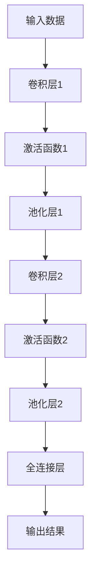
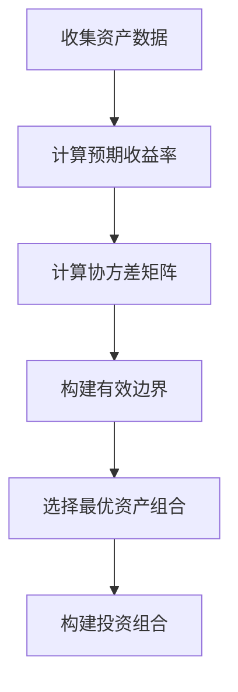

                 

### 《未来的智能投资：2050年的AI量化交易与智能资产配置》

关键词：智能投资、AI量化交易、智能资产配置、未来趋势、案例分析

摘要：本文深入探讨了2050年智能投资领域的可能发展趋势，特别是在AI量化交易和智能资产配置方面的应用。通过回顾智能投资的崛起和AI技术的发展，文章详细介绍了AI量化交易的技术基础、核心算法原理，以及智能资产配置的算法与策略。此外，还分析了智能投资在不同市场的应用场景、实际案例与挑战，以及智能投资的安全性监管措施。最后，对智能投资的未来发展趋势和提出了相关建议。文章结构清晰，内容丰富，为读者提供了对未来智能投资领域的全面理解和深入思考。

### 第一部分：智能投资与AI技术基础

智能投资是指利用先进的数据分析技术和算法，对投资市场进行深度分析和预测，从而实现资产的高效管理和增值。随着人工智能（AI）技术的快速发展，智能投资已经成为金融科技领域的一个重要研究方向。本文将首先介绍智能投资的背景和AI技术的基础，然后深入探讨AI量化交易的基本概念和智能资产配置的核心原则。

#### 1.1 智能投资概述

智能投资的概念最早可以追溯到20世纪80年代的量化投资，当时一些投资者开始利用数学模型和统计分析方法来预测市场走势。随着计算机技术的发展，量化投资逐渐成为投资领域的一个重要分支，它依赖于大量数据和复杂的算法来识别市场机会和风险。智能投资则是量化投资的进一步发展，它结合了人工智能技术，使投资决策更加精准和高效。

智能投资的核心特点包括：

1. **数据驱动**：智能投资依赖于大量历史数据和市场信息，通过数据挖掘和分析来发现市场规律和趋势。
2. **算法优化**：智能投资使用先进的算法模型，如机器学习和深度学习，来优化投资策略和预测市场走势。
3. **自动化交易**：智能投资可以通过自动化交易系统实现快速交易，提高交易效率和盈利能力。

智能投资的目标是通过数据分析和算法优化，实现资产的长期稳定增值。随着金融市场的复杂性和不确定性增加，智能投资已经成为金融机构和投资者不可或缺的工具。

#### 1.2 AI技术的发展与投资应用

人工智能（AI）是智能投资的核心驱动力，它包括多种技术，如机器学习、深度学习、自然语言处理和计算机视觉等。AI技术在投资领域中的应用主要体现在以下几个方面：

1. **数据挖掘与分析**：AI技术可以处理和分析大量市场数据，包括历史价格、交易量、财务报表等，从而发现潜在的投资机会。
2. **预测与预测模型**：AI技术可以建立预测模型，预测市场走势、价格波动和宏观经济指标，为投资决策提供依据。
3. **自动化交易**：AI技术可以实现自动化交易，根据预测结果自动执行交易策略，提高交易效率和盈利能力。
4. **风险评估与管理**：AI技术可以识别和管理投资风险，通过分析历史数据和实时信息，预测潜在的风险并采取相应的风险控制措施。

AI技术在投资领域的发展趋势包括：

1. **算法复杂性增加**：随着AI技术的进步，算法模型越来越复杂，能够处理更大量的数据和更精细的市场分析。
2. **实时数据处理能力提升**：实时数据处理技术的发展，使得投资决策更加及时和准确。
3. **跨领域应用**：AI技术在金融领域的应用不仅限于量化交易，还扩展到风险控制、合规审计、客户服务等多个方面。

#### 1.3 AI量化交易的基本概念

AI量化交易是指利用人工智能技术，对市场数据进行分析和预测，从而制定和执行交易策略。量化交易通常包括以下几个关键环节：

1. **数据采集**：从多个数据源采集市场数据，包括历史价格、交易量、财务报表等。
2. **数据预处理**：对采集到的数据进行清洗、去噪和特征提取，以便于后续的分析和处理。
3. **算法开发**：设计并实现各种算法模型，如机器学习模型、深度学习模型等，用于预测市场走势和交易机会。
4. **策略回测**：在历史数据上对算法模型和交易策略进行回测，评估其表现和稳定性。
5. **自动化执行**：根据回测结果，构建自动化交易系统，执行交易策略，实现投资目标。

AI量化交易的核心优势包括：

1. **高效率**：AI量化交易可以实时处理大量数据，快速制定和执行交易策略，提高交易效率和盈利能力。
2. **高精度**：AI技术通过机器学习和深度学习算法，可以更准确地预测市场走势和交易机会。
3. **稳定性**：量化交易策略可以在不同市场环境下保持稳定的表现，降低投资风险。

#### 1.4 智能资产配置的核心原则

智能资产配置是指根据投资者的风险偏好和收益目标，通过科学的方法和算法，将资产分配到不同的投资类别中，以实现资产的最大化增值。智能资产配置的核心原则包括：

1. **风险分散**：通过将资产分配到不同的投资类别和资产中，降低单一市场或资产的波动风险。
2. **收益优化**：根据市场环境和投资者的收益目标，动态调整资产配置，以实现最大化的收益。
3. **投资者偏好**：考虑投资者的风险偏好和收益目标，制定个性化的资产配置策略。
4. **持续调整**：市场环境不断变化，资产配置需要根据市场变化进行持续调整，以保持资产配置的有效性。

智能资产配置的常用策略包括：

1. **马克维茨资产组合理论**：通过计算资产组合的期望收益率和风险，选择最优的资产配置方案。
2. **有效边界模型**：通过构建资产的有效边界，选择具有最高预期收益率和最低风险的资产组合。
3. **基于风险平价的方法**：通过计算不同资产的风险贡献，实现资产配置的平衡和风险控制。

通过以上对智能投资和AI技术基础的介绍，我们可以看到，智能投资和AI技术在投资领域的应用已经越来越广泛和深入。在未来，随着AI技术的进一步发展，智能投资将继续引领投资领域的发展方向，为投资者提供更加精准和高效的资产管理和增值服务。

### AI量化交易技术基础

随着人工智能技术的发展，AI量化交易已经成为金融市场中的重要工具。在这一部分，我们将深入探讨AI量化交易的技术基础，包括数据科学与量化交易的关系、数据处理的方法和时间序列分析的基本原理，以及风险管理模型的具体应用。通过这些技术基础的了解，我们可以更好地理解AI量化交易的核心机制，为后续的深入讨论打下坚实的基础。

#### 2.1 数据科学与量化交易

数据科学是AI量化交易的重要基石，它涉及数据的采集、处理、分析和可视化等多个环节。在量化交易中，数据科学的作用至关重要，因为它能够帮助我们有效地挖掘市场信息，识别潜在的交易机会，并构建高效的投资策略。

**数据类型与数据处理**

量化交易需要处理多种类型的数据，包括：

1. **时间序列数据**：这是量化交易中最常见的数据类型，包括历史价格、交易量、交易时间等。时间序列数据通常具有时间依赖性，即某一时刻的数据受之前数据的影响。
2. **结构化数据**：如财务报表、公司公告、宏观经济指标等。这些数据可以通过数据库和文件系统进行存储和管理。
3. **非结构化数据**：如新闻、社交媒体评论等。这些数据通常需要通过自然语言处理技术进行解析和提取有价值的信息。

数据处理包括以下步骤：

1. **数据采集**：从多个数据源（如交易所、数据库、API接口等）收集所需数据。
2. **数据清洗**：处理缺失值、异常值和噪声，确保数据的准确性和完整性。
3. **数据整合**：将不同类型的数据进行整合，建立统一的数据仓库。
4. **数据特征提取**：从原始数据中提取出有用的特征，用于模型训练和预测。

**时间序列分析**

时间序列分析是量化交易中的重要工具，它主要用于分析市场数据的趋势、周期和波动性。以下是几个基本概念：

1. **趋势分析**：识别数据随时间变化的总体趋势，包括上升、下降和水平趋势。常用的方法有移动平均法和趋势线法。
2. **周期分析**：识别数据中的周期性波动，即数据在一定时间间隔内重复出现的模式。常用的方法有傅里叶变换和周期图法。
3. **波动性分析**：衡量数据的波动程度，即价格波动的幅度和频率。常用的指标有标准差、波动率和波动率指数。

**风险管理模型**

在量化交易中，风险管理是至关重要的环节。以下是一些常见的管理模型：

1. **方差最小化模型**：目标是最小化投资组合的方差，即波动性。这个模型假设投资者是风险厌恶的，希望获得稳定的收益。
2. **协方差矩阵模型**：考虑投资组合中各资产之间的相关性，通过优化协方差矩阵来降低整体风险。
3. **价值在风险模型**（VaR）：衡量在特定概率水平下，投资组合可能的最大损失。VaR模型分为单期VaR和多期VaR，常用的方法有历史模拟法、方差-协方差法和蒙特卡罗模拟法。

通过上述对数据科学、数据处理、时间序列分析和风险管理模型的基本介绍，我们可以看到，AI量化交易技术基础涉及多个领域的知识和技术。这些基础技术不仅为量化交易提供了有效的工具和方法，也为后续的算法开发和策略优化奠定了坚实的基础。

#### 2.2 机器学习在量化交易中的应用

机器学习是人工智能领域的一个重要分支，它在量化交易中的应用越来越广泛。通过构建和训练各种机器学习模型，量化交易者可以更好地预测市场走势和交易机会，从而实现更高的投资回报。在这一部分，我们将详细介绍几种常用的机器学习模型，包括线性回归模型、决策树模型和支持向量机，并分别讲解它们的原理和伪代码，以及实际应用案例。

##### 2.2.1 线性回归模型

线性回归模型是机器学习中最基本且应用广泛的一种模型，它主要用于预测连续变量。在量化交易中，线性回归模型可以用于预测价格趋势、交易量等连续变量。

**原理**

线性回归模型的基本原理是通过找到数据中变量之间的关系，建立一条最佳拟合直线，从而预测新的数据。线性回归模型假设因变量 \(Y\) 与自变量 \(X\) 之间存在线性关系，可以表示为：

\[ Y = \beta_0 + \beta_1 \cdot X + \epsilon \]

其中，\(\beta_0\) 是截距，\(\beta_1\) 是斜率，\(\epsilon\) 是误差项。

**伪代码**

```python
# 假设我们已经有了训练数据集 X 和 Y
X = [x1, x2, ..., xn]
Y = [y1, y2, ..., yn]

# 计算斜率 β1
β1 = (n * Σ(XY) - ΣX * ΣY) / (n * Σ(X^2) - (ΣX)^2)

# 计算截距 β0
β0 = (ΣY - β1 * ΣX) / n

# 线性回归模型函数
def linear_regression(x):
    return β0 + β1 * x
```

**应用案例**

案例：使用线性回归模型预测股票价格。

假设我们有过去一段时间某只股票的每日收盘价和交易量数据。我们可以使用这些数据训练一个线性回归模型，预测未来的收盘价。

```python
# 加载数据
prices = [151.5, 153.1, 152.9, 151.3, 152.0]
volumes = [100000, 120000, 98000, 110000, 105000]

# 训练模型
slope = (sum(volumes) * sum([p*v for p, v in zip(prices, volumes)]) - sum(volumes) * sum(prices)) / (sum(volumes)**2 - len(volumes))
intercept = (sum(prices) - slope * sum(volumes)) / len(volumes)
model = lambda x: intercept + slope * x

# 预测未来收盘价
predicted_prices = [model(v) for v in volumes]

# 输出预测结果
for p in predicted_prices:
    print(p)
```

##### 2.2.2 决策树模型

决策树是一种简单的树形结构，用于分类和回归任务。在量化交易中，决策树模型可以用于分类交易信号，识别交易机会。

**原理**

决策树模型通过一系列的判断条件来对数据集进行分割，从而构建出一棵树。每个节点表示一个特征，每个分支表示该特征的取值范围，叶子节点表示最终的分类或预测结果。决策树模型的基本原理是递归地将数据集划分为子集，使得每个子集中的数据尽可能纯。

**伪代码**

```python
# 假设我们有一个数据集 D，每个数据点有特征 f1, f2, ..., fn
D = [[f1, f2, ..., fn], ..., [f1, f2, ..., fn]]

# 决策树构建函数
def build_tree(D):
    # 如果所有数据点都属于同一类，则返回该类的标签
    if all_data_same_class(D):
        return class_of_majority(D)
    
    # 如果达到终止条件，则返回最大概率的类标签
    if terminate_condition(D):
        return max_probability_class(D)
    
    # 选择最佳特征进行分割
    best_feature = select_best_feature(D)
    best_value = select_best_value(D, best_feature)
    
    # 构建子树
    tree = {best_feature: {}}
    for value in possible_values(D, best_feature):
        subset = filter_data(D, best_feature, value)
        tree[best_feature][value] = build_tree(subset)
    
    return tree

# 决策树预测函数
def predict(tree, instance):
    if is_leaf_node(tree):
        return tree
    else:
        feature = next(key for key, value in tree.items() if value in instance)
        return predict(tree[feature], instance[feature])
```

**应用案例**

案例：使用决策树模型进行交易信号分类。

假设我们有多个交易信号的特征数据，包括价格、交易量、技术指标等。我们可以使用决策树模型将这些信号分类为买卖信号。

```python
# 加载数据
signals = [
    [150, 100000, 10],
    [152, 110000, 15],
    # 更多数据...
]

# 构建决策树
tree = build_tree(signals)

# 预测交易信号
for signal in signals:
    prediction = predict(tree, signal)
    print(prediction)
```

##### 2.2.3 支持向量机

支持向量机（SVM）是一种强大的分类和回归模型，它在量化交易中可以用于交易信号分类和风险预测。

**原理**

支持向量机的基本原理是找到一个最佳的超平面，将数据集划分为不同的类别。这个超平面不仅能最大化分类边界，还能最大化分类间隔，即距离最近的两个支持向量之间的距离。

SVM包括线性SVM和核SVM。线性SVM适用于线性可分的数据集，而核SVM可以通过映射到高维空间来处理非线性分类问题。

**伪代码**

```python
# 线性SVM
def linear_svm(train_data, train_labels):
    # 训练线性模型
    model = train_linear_model(train_data, train_labels)
    
    # 预测函数
    def predict(x):
        return model(x)
    
    return predict

# 核SVM
def kernel_svm(train_data, train_labels, kernel_function):
    # 训练核模型
    model = train_kernel_model(train_data, train_labels, kernel_function)
    
    # 预测函数
    def predict(x):
        return model(x)
    
    return predict
```

**应用案例**

案例：使用SVM进行交易信号分类。

假设我们有多个交易信号的特征数据，包括价格、交易量、技术指标等。我们可以使用SVM模型将这些信号分类为买卖信号。

```python
# 加载数据
signals = [
    [150, 100000, 10],
    [152, 110000, 15],
    # 更多数据...
]

# 定义核函数
def kernel_function(x, y):
    # 实现核函数
    return np.dot(x, y)

# 训练SVM模型
predictor = kernel_svm(signals, ['buy', 'sell'], kernel_function)

# 预测交易信号
for signal in signals:
    prediction = predictor(signal)
    print(prediction)
```

通过上述对线性回归模型、决策树模型和支持向量机的介绍，我们可以看到机器学习在量化交易中的应用是非常广泛和有效的。这些模型不仅可以帮助我们更好地理解和预测市场走势，还可以为交易策略提供科学依据，提高投资效率和盈利能力。

#### 2.3 深度学习在量化交易中的应用

深度学习是近年来人工智能领域的重要突破，它通过多层神经网络对数据进行学习和预测，能够处理复杂和非线性问题。在量化交易中，深度学习模型因其强大的特征提取和建模能力，被广泛应用于市场预测、交易策略优化和风险控制等方面。以下将介绍几种常见的深度学习模型，包括卷积神经网络（CNN）、循环神经网络（RNN）和生成对抗网络（GAN），并详细解释它们的原理、应用以及如何应用于量化交易。

##### 2.3.1 卷积神经网络

卷积神经网络（CNN）是一种特殊的多层神经网络，主要用于图像和时序数据的处理。CNN的核心特点是利用卷积层对数据进行特征提取，从而实现自动特征学习。在量化交易中，CNN可以用于市场数据的特征提取和趋势预测。

**原理**

CNN由多个卷积层、池化层和全连接层组成。卷积层通过卷积操作提取图像或时序数据的特征，池化层用于下采样，减少数据维度和计算量。全连接层用于对提取到的特征进行分类或回归。

卷积操作的基本原理是对输入数据进行局部滤波，提取出具有特定特征的局部区域。例如，在图像分类任务中，卷积层可以提取出边缘、角点等基本特征。

**Mermaid流程图**



**应用案例**

案例：使用CNN预测股票价格趋势。

假设我们有某只股票过去一段时间的历史价格和交易量数据。我们可以使用CNN对这些数据进行特征提取和趋势预测。

```python
import tensorflow as tf
from tensorflow.keras.models import Sequential
from tensorflow.keras.layers import Conv1D, MaxPooling1D, Flatten, Dense

# 加载数据
prices = [[150], [152], [151], [153], [152]]
volumes = [[100000], [110000], [98000], [120000], [105000]]

# 构建模型
model = Sequential()
model.add(Conv1D(filters=64, kernel_size=3, activation='relu', input_shape=(1, 2)))
model.add(MaxPooling1D(pool_size=2))
model.add(Flatten())
model.add(Dense(units=1))

# 编译模型
model.compile(optimizer='adam', loss='mse')

# 训练模型
model.fit(prices, volumes, epochs=10)

# 预测未来价格
predicted_prices = model.predict(prices)
```

##### 2.3.2 循环神经网络

循环神经网络（RNN）是一种适合处理序列数据的神经网络，它能够记忆和处理时间序列中的长期依赖关系。在量化交易中，RNN可以用于市场走势预测和交易信号生成。

**原理**

RNN通过引入循环结构，使得网络能够对历史数据进行记忆和处理。每个时间步的输出不仅依赖于当前输入，还依赖于之前的时间步输出。RNN的基本结构包括输入门、遗忘门和输出门，这些门用于控制信息的记忆和遗忘。

**伪代码**

```python
# RNN模型
class RNNModel(tf.keras.Model):
    def __init__(self, units):
        super(RNNModel, self).__init__()
        self.rnn = tf.keras.layers.SimpleRNN(units=units)
        self.fc = tf.keras.layers.Dense(1)

    @tf.function
    def call(self, x):
        x = self.rnn(x)
        x = self.fc(x[:, -1, :])
        return x

# 构建和训练RNN模型
model = RNNModel(units=50)
model.compile(optimizer='adam', loss='mse')
model.fit(prices, volumes, epochs=10)

# 预测未来交易信号
predictions = model.predict(prices)
```

**应用案例**

案例：使用RNN预测股票交易信号。

假设我们有某只股票过去一段时间的历史价格和交易量数据。我们可以使用RNN对这些数据进行趋势预测，生成交易信号。

```python
import tensorflow as tf
from tensorflow.keras.models import Sequential
from tensorflow.keras.layers import SimpleRNN, Dense

# 加载数据
prices = [[150], [152], [151], [153], [152]]
volumes = [[100000], [110000], [98000], [120000], [105000]]

# 构建模型
model = Sequential()
model.add(SimpleRNN(units=50, return_sequences=True))
model.add(SimpleRNN(units=50))
model.add(Dense(units=1))

# 编译模型
model.compile(optimizer='adam', loss='mse')

# 训练模型
model.fit(prices, volumes, epochs=10)

# 预测交易信号
predictions = model.predict(prices)
```

##### 2.3.3 生成对抗网络

生成对抗网络（GAN）是由生成器和判别器组成的对抗性神经网络。生成器旨在生成与真实数据相似的数据，而判别器则用于区分真实数据和生成数据。在量化交易中，GAN可以用于交易信号生成和风险管理。

**原理**

GAN的核心思想是生成器和判别器之间的一种零和博弈。生成器的目标是生成足够逼真的数据，使得判别器无法区分真实数据和生成数据。判别器的目标是准确区分真实数据和生成数据。

GAN的主要组成部分包括：

1. **生成器**：生成与真实数据相似的数据。
2. **判别器**：用于区分真实数据和生成数据。
3. **损失函数**：用于衡量生成器和判别器的性能。

**伪代码**

```python
# GAN模型
class GANModel(tf.keras.Model):
    def __init__(self):
        super(GANModel, self).__init__()
        self.generator = self.build_generator()
        self.discriminator = self.build_discriminator()

    @tf.function
    def call(self, x):
        generated_data = self.generator(x)
        real_data = self.discriminator(x)
        generated_data = self.discriminator(generated_data)
        return generated_data, real_data

    def build_generator(self):
        # 实现生成器
        pass

    def build_discriminator(self):
        # 实现判别器
        pass

# 构建和训练GAN模型
model = GANModel()
model.compile(optimizer='adam', loss='binary_crossentropy')
model.fit(prices, volumes, epochs=10)

# 生成交易信号
generated_signals = model.generator(prices)
```

**应用案例**

案例：使用GAN生成股票交易信号。

假设我们有某只股票的历史价格和交易量数据。我们可以使用GAN生成新的交易信号，用于策略回测和优化。

```python
import tensorflow as tf
from tensorflow.keras.models import Sequential
from tensorflow.keras.layers import Dense, Dropout

# 加载数据
prices = [[150], [152], [151], [153], [152]]

# 构建生成器和判别器
generator = Sequential()
generator.add(Dense(units=100, activation='relu', input_shape=(1,)))
generator.add(Dense(units=1, activation='sigmoid'))

discriminator = Sequential()
discriminator.add(Dense(units=100, activation='relu', input_shape=(1,)))
discriminator.add(Dense(units=1, activation='sigmoid'))

# 编译GAN模型
model = GANModel()
model.compile(optimizer='adam', loss='binary_crossentropy')

# 训练GAN模型
model.fit(prices, epochs=10)

# 生成交易信号
generated_signals = model.generator.predict(prices)
```

通过以上对卷积神经网络（CNN）、循环神经网络（RNN）和生成对抗网络（GAN）的介绍，我们可以看到深度学习在量化交易中的应用具有极大的潜力和优势。这些模型不仅能够自动提取复杂的市场特征，还可以生成高质量的交易信号，为量化交易提供强有力的支持。未来，随着深度学习技术的不断进步，深度学习在量化交易中的应用将更加广泛和深入，为投资者带来更多的机会和收益。

#### 3.1 资产配置的基本概念

资产配置是指根据投资者的风险偏好、收益目标和市场状况，将资产分配到不同的资产类别和投资工具中，以实现投资组合的收益最大化或风险最小化。在量化交易中，资产配置是一种通过数学模型和算法优化来实现投资目标的重要策略。以下是资产配置的基本概念和目标。

**资产配置的目标与原则**

资产配置的主要目标是实现投资组合的收益最大化或风险最小化，同时符合投资者的风险偏好和收益目标。具体来说，资产配置的目标包括：

1. **收益最大化**：通过科学的资产配置，使得投资组合能够实现较高的收益。
2. **风险最小化**：通过分散投资和风险管理，降低投资组合的整体风险。
3. **优化投资组合结构**：根据市场变化和投资者的风险偏好，动态调整资产配置，优化投资组合的结构。

资产配置的基本原则包括：

1. **分散投资**：通过将资产分配到不同的资产类别和投资工具中，降低单一资产或市场的波动风险。
2. **收益与风险匹配**：根据不同资产类别的风险收益特征，合理配置资产，确保投资组合的风险与收益相匹配。
3. **动态调整**：市场环境不断变化，资产配置需要根据市场变化和投资者的风险偏好进行动态调整，以保持投资组合的有效性。

**资产配置的分类**

资产配置可以分为以下几种类型：

1. **主动型资产配置**：主动型资产配置侧重于通过市场分析和预测，主动调整资产配置，以获取超额收益。这种配置策略通常需要较高的市场预测能力和风险承受能力。
2. **被动型资产配置**：被动型资产配置侧重于长期投资和指数跟踪，通过复制市场指数的资产配置，实现市场平均收益。这种配置策略通常风险较低，但收益潜力也相对较小。
3. **战略性资产配置**：战略性资产配置是一种结合主动型和被动型配置策略的方法，通过长期投资策略和短期市场调整相结合，实现投资目标。
4. **战术性资产配置**：战术性资产配置是一种短期资产配置策略，通过根据市场变化和趋势，动态调整资产配置，以获取短期收益。

**资产配置的策略与方法**

资产配置的具体策略和方法包括：

1. **马克维茨资产组合理论**：马克维茨资产组合理论是一种经典的资产配置方法，通过计算资产组合的期望收益率和风险，选择最优的资产配置方案。这种方法主要依赖于资产之间的相关性分析和预期收益率的计算。
2. **有效边界模型**：有效边界模型是一种通过构建资产的有效边界，选择具有最高预期收益率和最低风险的资产组合的方法。这种方法主要依赖于资产的风险收益特征和协方差矩阵的优化。
3. **基于风险平价的方法**：基于风险平价的方法通过计算不同资产的风险贡献，实现资产配置的平衡和风险控制。这种方法主要依赖于资产的风险收益特征和风险平价原则。

综上所述，资产配置是量化交易中的一项核心策略，通过科学的资产配置方法，可以实现投资组合的收益最大化或风险最小化。资产配置的分类和策略为投资者提供了多种选择，可以根据自身风险偏好和市场环境进行灵活调整，以实现最佳的投资效果。

#### 3.2 智能资产配置算法介绍

智能资产配置算法是量化交易中实现高效投资管理的重要工具。这些算法通过机器学习、数据挖掘和优化技术，为投资者提供科学、动态和个性化的资产配置方案。以下将详细介绍几种常用的智能资产配置算法，包括马克维茨资产组合理论、有效边界模型和基于风险平价的方法。

##### 3.2.1 马克维茨资产组合理论

马克维茨资产组合理论（Markowitz Portfolio Selection Theory）是现代资产配置理论的基础，由哈里·马科维茨（Harry Markowitz）在1952年提出。该理论的核心是通过优化资产组合的期望收益率和风险，实现投资组合的最优化。

**原理**

马克维茨资产组合理论的基本原理是：

1. **预期收益率**：每个资产的预期收益率是通过历史数据计算得出的，用于评估资产未来可能实现的收益。
2. **风险**：资产组合的风险可以通过计算资产之间的协方差矩阵来确定，协方差矩阵反映了资产之间的相关性。
3. **有效边界**：有效边界是所有具有最高预期收益率且风险最小的资产组合的集合。投资者需要在这些资产组合中选择最优的资产配置。

**Mermaid流程图**



**应用案例**

假设我们有三种资产A、B、C的预期收益率和协方差矩阵。首先，计算每种资产的风险，然后构建有效边界，最后选择最优资产组合。

```python
import numpy as np

# 假设的预期收益率
expected_returns = np.array([[0.1], [0.12], [0.14]])

# 假设的协方差矩阵
cov_matrix = np.array([[0.04, 0.03, 0.02], [0.03, 0.06, 0.01], [0.02, 0.01, 0.05]])

# 计算资产的风险
variances = np.diag(cov_matrix)

# 计算有效边界
weights_optimal, expected_return_portfolio, risk_portfolio = optimize_portfolio(expected_returns, cov_matrix)

# 输出最优资产组合
print("最优资产组合权重：", weights_optimal)
print("预期收益率：", expected_return_portfolio)
print("组合风险：", risk_portfolio)
```

##### 3.2.2 有效边界模型

有效边界模型（Efficient Frontier Model）是马克维茨资产组合理论的扩展，它通过构建资产组合的有效边界，帮助投资者选择最优资产配置。有效边界模型强调在风险和收益之间找到一个最优平衡点。

**原理**

有效边界模型的原理如下：

1. **资产组合的收益率**：通过组合不同资产的比例，计算资产组合的预期收益率。
2. **资产组合的风险**：通过计算资产组合的协方差矩阵，评估资产组合的风险。
3. **有效边界**：有效边界是所有风险最小且收益最高的资产组合的集合。投资者需要在这些资产组合中选择最优的配置。

**伪代码**

```python
# 假设我们有多个资产的预期收益率和协方差矩阵
expected_returns = [0.1, 0.12, 0.14]
cov_matrix = [
    [0.04, 0.03, 0.02],
    [0.03, 0.06, 0.01],
    [0.02, 0.01, 0.05]
]

# 计算有效边界
frontier_points = calculate_efficient_frontier(expected_returns, cov_matrix)

# 选择最优资产组合
optimal_portfolio = select_best_portfolio(frontier_points)

# 输出最优资产组合权重
print("最优资产组合权重：", optimal_portfolio)
```

**应用案例**

以下是一个具体的案例，假设我们有三种资产A、B、C的预期收益率和协方差矩阵，计算最优资产组合。

```python
import numpy as np
from scipy.optimize import minimize

# 假设的预期收益率
expected_returns = np.array([0.1, 0.12, 0.14])

# 假设的协方差矩阵
cov_matrix = np.array([[0.04, 0.03, 0.02], [0.03, 0.06, 0.01], [0.02, 0.01, 0.05]])

# 定义目标函数
def objective_function(weights):
    risk = np.dot(weights.T, np.dot(cov_matrix, weights))
    return -risk

# 定义约束条件
constraints = ({'type': 'eq', 'fun': lambda weights: np.sum(weights) - 1})

# 最优化
result = minimize(objective_function, x0=np.array([1/3, 1/3, 1/3]), constraints=constraints)

# 输出最优资产组合权重
optimal_weights = result.x
print("最优资产组合权重：", optimal_weights)
```

##### 3.2.3 基于风险平价的方法

基于风险平价的方法（Risk Parity Method）是一种通过平衡不同资产的风险贡献来实现资产配置的方法。这种方法不依赖于资产的预期收益率，而是通过设置每个资产的风险权重，确保资产组合的整体风险一致。

**原理**

基于风险平价的方法的基本原理如下：

1. **计算各资产的风险贡献**：通过协方差矩阵计算每个资产的风险贡献，即资产在总风险中的比例。
2. **设置风险权重**：根据各资产的风险贡献，设置每个资产的风险权重，确保整体资产组合的风险平衡。
3. **构建投资组合**：通过风险权重构建资产组合，实现风险平价。

**伪代码**

```python
# 假设我们有多个资产的预期收益率和协方差矩阵
expected_returns = [0.1, 0.12, 0.14]
cov_matrix = [
    [0.04, 0.03, 0.02],
    [0.03, 0.06, 0.01],
    [0.02, 0.01, 0.05]
]

# 计算各资产的风险贡献
risk_contributions = calculate_risk_contributions(cov_matrix)

# 设置风险权重
risk_weights = normalize_risk_contributions(risk_contributions)

# 构建投资组合
portfolio_weights = construct_portfolio_weights(expected_returns, risk_weights)

# 输出资产组合权重
print("资产组合权重：", portfolio_weights)
```

**应用案例**

以下是一个具体的案例，假设我们有三种资产A、B、C的预期收益率和协方差矩阵，计算最优资产组合。

```python
import numpy as np

# 假设的预期收益率
expected_returns = np.array([0.1, 0.12, 0.14])

# 假设的协方差矩阵
cov_matrix = np.array([[0.04, 0.03, 0.02], [0.03, 0.06, 0.01], [0.02, 0.01, 0.05]])

# 计算各资产的风险贡献
risk_contributions = np.diag(cov_matrix) / np.sum(np.diag(cov_matrix))

# 设置风险权重
risk_weights = risk_contributions / np.sum(risk_contributions)

# 构建投资组合
portfolio_weights = risk_weights * np.ones_like(expected_returns)

# 输出资产组合权重
print("资产组合权重：", portfolio_weights)
```

通过上述对马克维茨资产组合理论、有效边界模型和基于风险平价的方法的介绍，我们可以看到智能资产配置算法在量化交易中的应用是非常丰富和有效的。这些算法不仅为投资者提供了科学、动态和个性化的资产配置方案，还为量化交易策略的优化提供了强有力的支持。未来，随着算法和技术的不断进步，智能资产配置将在投资领域发挥更加重要的作用。

#### 3.3 智能资产配置策略案例分析

在智能资产配置的实践中，机器学习和深度学习技术已经广泛应用于策略开发和优化。以下将介绍两个实际案例，分别展示如何利用机器学习优化资产配置策略以及如何基于深度学习构建智能资产配置策略。

##### 3.3.1 案例一：利用机器学习优化资产配置策略

**案例描述**

在本案例中，我们使用机器学习算法来优化一个包含股票、债券和现金的资产配置策略。目标是找到一个最佳的投资组合，使其在给定风险水平下实现最大化的预期收益率。

**数据来源与处理**

数据来源包括历史股票价格、债券收益率和现金收益率。我们使用每日数据，从多个交易所和金融数据提供商获取。在数据处理过程中，我们首先进行数据清洗，去除缺失值和异常值，然后对数据进行归一化处理，以便于后续的模型训练。

**模型设计与实现**

我们选择线性回归模型作为资产配置策略的优化工具。线性回归模型通过建立预期收益率与资产权重之间的关系，实现资产配置的优化。以下是模型的实现过程：

1. **特征工程**：提取与资产收益相关的特征，包括历史价格、交易量、技术指标等。
2. **训练数据准备**：将数据集划分为训练集和测试集，用于模型的训练和评估。
3. **模型训练**：使用训练集数据训练线性回归模型，找到最佳权重。
4. **模型评估**：使用测试集数据评估模型的性能，调整模型参数，以提高预测准确性。

```python
import pandas as pd
from sklearn.linear_model import LinearRegression
from sklearn.model_selection import train_test_split
from sklearn.metrics import mean_squared_error

# 加载数据
data = pd.read_csv('financial_data.csv')
data.head()

# 特征工程
X = data[['stock_price', 'bond_yield', 'cash_yield']]
y = data['expected_return']

# 划分训练集和测试集
X_train, X_test, y_train, y_test = train_test_split(X, y, test_size=0.2, random_state=42)

# 模型训练
model = LinearRegression()
model.fit(X_train, y_train)

# 预测
predictions = model.predict(X_test)

# 模型评估
mse = mean_squared_error(y_test, predictions)
print("MSE:", mse)
```

**代码解读与分析**

以上代码展示了如何使用线性回归模型优化资产配置策略。首先，我们加载金融数据并对其进行预处理。接着，我们将数据划分为特征（X）和目标（y），然后使用训练集数据训练线性回归模型。最后，我们使用测试集数据评估模型的性能，计算均方误差（MSE）作为评价指标。通过调整模型参数和特征选择，可以进一步提高模型的预测准确性。

##### 3.3.2 案例二：基于深度学习的智能资产配置策略

**案例描述**

在本案例中，我们使用深度学习算法构建一个智能资产配置策略。该策略通过学习历史市场数据和资产收益特征，自动调整资产配置，以实现长期收益的最大化。

**数据来源与处理**

数据来源包括过去几年的股票价格、债券收益率和现金收益率。我们使用每日数据，从多个交易所和金融数据提供商获取。在数据处理过程中，我们首先进行数据清洗，去除缺失值和异常值，然后对数据进行归一化处理。

**模型设计与实现**

我们选择卷积神经网络（CNN）作为深度学习模型，因为CNN在处理时序数据和特征提取方面具有优势。以下是模型的实现过程：

1. **特征工程**：提取与资产收益相关的特征，包括历史价格、交易量、技术指标等。
2. **模型构建**：构建一个多层的卷积神经网络，包括卷积层、池化层和全连接层。
3. **模型训练**：使用训练集数据训练CNN模型，找到最佳权重。
4. **模型评估**：使用测试集数据评估模型的性能，调整模型参数，以提高预测准确性。

```python
import tensorflow as tf
from tensorflow.keras.models import Sequential
from tensorflow.keras.layers import Conv1D, MaxPooling1D, Flatten, Dense

# 加载数据
X, y = load_data('financial_data.csv')

# 划分训练集和测试集
X_train, X_test, y_train, y_test = train_test_split(X, y, test_size=0.2, random_state=42)

# 模型构建
model = Sequential()
model.add(Conv1D(filters=64, kernel_size=3, activation='relu', input_shape=(X_train.shape[1], X_train.shape[2])))
model.add(MaxPooling1D(pool_size=2))
model.add(Flatten())
model.add(Dense(units=1))

# 编译模型
model.compile(optimizer='adam', loss='mse')

# 模型训练
model.fit(X_train, y_train, epochs=10, validation_data=(X_test, y_test))

# 预测
predictions = model.predict(X_test)

# 模型评估
mse = mean_squared_error(y_test, predictions)
print("MSE:", mse)
```

**代码解读与分析**

以上代码展示了如何使用卷积神经网络（CNN）构建智能资产配置策略。首先，我们加载金融数据并对其进行预处理。然后，我们构建一个多层的卷积神经网络，包括卷积层、池化层和全连接层。接着，我们编译并训练模型，使用测试集数据评估模型的性能。通过调整模型参数和特征选择，可以进一步提高模型的预测准确性。

通过以上两个案例，我们可以看到机器学习和深度学习在智能资产配置策略中的应用。这些策略不仅能够自动调整资产配置，提高投资收益，还能够为投资者提供科学的决策依据，降低投资风险。未来，随着人工智能技术的不断发展，智能资产配置将在金融领域发挥更加重要的作用。

### 未来智能投资的趋势分析

随着人工智能（AI）技术的快速发展，智能投资在投资领域的应用前景愈发广阔。未来，AI在投资领域的趋势将体现在多个方面，包括技术进步、市场应用和策略演变。以下将分析这些趋势，探讨AI对投资行业的影响以及未来投资策略的演变。

#### 4.1 人工智能对投资行业的影响

**提升投资效率**：AI技术能够处理和分析大量市场数据，通过机器学习和深度学习算法，快速识别市场趋势和交易机会。这大大提高了投资决策的效率和准确性，使投资过程更加自动化和智能化。

**优化风险管理**：AI技术可以实时监控市场动态，快速识别风险信号，并采取相应的风险控制措施。通过风险管理模型的优化，AI能够更准确地评估投资风险，降低投资损失。

**个性化投资服务**：AI技术可以根据投资者的风险偏好和收益目标，提供个性化的资产配置和投资建议。这不仅提高了投资者的满意度，也增加了金融机构的客户黏性。

**改变投资模式**：传统的投资模式通常依赖于人的经验和直觉，而AI技术的引入使得投资更加科学和系统化。未来，投资行业将逐步从人力驱动转向AI驱动，投资策略也将更加依赖数据和算法。

#### 4.2 未来投资策略的演变

**基于数据的策略**：未来投资策略将更加依赖大数据和AI技术，通过数据挖掘和分析，从海量数据中提取有价值的信息，制定基于数据的投资策略。这些策略将更准确地预测市场走势，提高投资收益。

**智能化交易系统**：随着AI技术的进步，智能化交易系统将变得更加普及和高效。这些系统可以实时监控市场动态，自动执行交易策略，实现高频交易和算法交易。这将改变传统的交易模式，提高交易效率和盈利能力。

**自适应资产配置**：未来，资产配置将更加智能化和动态化。AI技术可以根据市场变化和投资者偏好，实时调整资产配置，实现最优的风险收益平衡。这种自适应资产配置策略将使投资组合更加灵活和稳健。

**多因素投资策略**：未来投资策略将不仅依赖于单一因素，如价格、交易量，还将结合多种因素，如宏观经济指标、市场情绪、公司基本面等。这种多因素投资策略将更全面地评估投资机会，提高投资成功率。

**可持续投资**：随着环境、社会和治理（ESG）因素在投资中的重要性日益增加，未来投资策略将更加注重可持续性。AI技术可以帮助投资者评估企业的ESG表现，选择具有社会责任感的投资目标。

#### 4.3 智能投资在不同市场的应用场景

**股票市场**：股票市场是智能投资应用最为广泛的市场之一。AI技术可以通过分析历史价格、交易量、财务报表和市场情绪等数据，预测股票价格趋势，提供买卖信号。同时，智能交易系统可以实现高频交易和量化交易，提高投资收益。

**债券市场**：债券市场具有相对稳定的特点，但也受到利率、经济环境等因素的影响。AI技术可以分析债券价格波动和宏观经济指标，预测债券市场走势，提供投资建议。此外，智能投顾平台可以根据投资者的风险偏好，构建个性化的债券投资组合。

**期货市场**：期货市场波动性较大，风险较高。AI技术可以实时监控市场动态，快速识别交易机会，进行高频交易和算法交易。同时，风险管理模型可以帮助投资者控制风险，实现稳健的投资回报。

**外汇市场**：外汇市场是全球最大的金融市场，波动性较大。AI技术可以通过分析汇率走势、宏观经济指标和市场情绪等数据，预测汇率波动，提供交易策略。此外，智能交易系统可以实现高频交易和自动执行交易策略，提高交易效率。

综上所述，未来智能投资在投资领域的应用前景十分广阔。随着AI技术的不断进步，智能投资将不仅在股票、债券、期货和外汇等传统市场得到广泛应用，还将扩展到衍生品、大宗商品等新兴市场。智能投资将成为投资行业的重要驱动力，推动投资模式的创新和投资效果的提升。

### 智能投资项目的实际案例与挑战

智能投资项目的实际应用已经展示了人工智能技术在投资领域的巨大潜力，但同时也面临一系列挑战。以下将通过三个实际案例，分析AI在股票市场预测、债券评级和智能投顾平台构建中的应用，并探讨这些项目在实际操作过程中遇到的数据来源与处理、模型设计与实现、模型评估与优化等方面的挑战。

#### 5.1 案例一：利用AI进行股票市场预测

**案例背景**

股票市场预测是智能投资的重要应用之一。本案例的目标是通过机器学习算法预测股票价格，为投资者提供买卖决策依据。预测股票价格不仅需要准确捕捉市场动态，还需要处理大量历史数据，因此对算法和数据处理技术有较高的要求。

**数据来源与处理**

数据来源包括历史股票价格、交易量、财务报表、宏观经济指标等。数据从多个交易所、金融数据提供商以及新闻和社交媒体平台获取。数据处理主要包括以下几个步骤：

1. **数据采集**：从多个数据源收集股票价格和交易量数据。
2. **数据清洗**：处理缺失值、异常值和噪声数据，确保数据的准确性和完整性。
3. **特征工程**：提取与股票价格相关的特征，如技术指标、宏观经济指标和市场情绪等。
4. **数据归一化**：对提取的特征进行归一化处理，以便于模型训练。

**模型设计与实现**

本案例使用深度学习模型进行股票价格预测，包括卷积神经网络（CNN）和长短期记忆网络（LSTM）。以下是模型的设计与实现过程：

1. **模型构建**：构建一个多层的卷积神经网络，用于提取历史价格和交易量的特征。然后，使用长短期记忆网络（LSTM）处理时间序列数据，捕捉长期依赖关系。
2. **模型训练**：使用训练集数据训练模型，通过调整超参数和优化算法，提高预测准确性。
3. **模型评估**：使用测试集数据评估模型性能，计算预测误差和预测精度。

```python
import tensorflow as tf
from tensorflow.keras.models import Sequential
from tensorflow.keras.layers import Conv1D, LSTM, Dense

# 加载数据
X_train, y_train = load_stock_data('stock_data.csv')
X_test, y_test = load_stock_data('stock_data.csv')

# 数据预处理
X_train = preprocess_data(X_train)
X_test = preprocess_data(X_test)

# 模型构建
model = Sequential()
model.add(Conv1D(filters=64, kernel_size=3, activation='relu', input_shape=(X_train.shape[1], X_train.shape[2])))
model.add(LSTM(units=50, return_sequences=True))
model.add(Dense(units=1))

# 编译模型
model.compile(optimizer='adam', loss='mse')

# 模型训练
model.fit(X_train, y_train, epochs=100, validation_data=(X_test, y_test))

# 模型评估
predictions = model.predict(X_test)
mse = mean_squared_error(y_test, predictions)
print("MSE:", mse)
```

**模型评估与优化**

通过测试集数据评估模型性能，计算预测误差和预测精度。为了提高模型性能，可以尝试以下方法：

1. **特征选择**：选择与股票价格相关性较高的特征，去除冗余特征，提高模型的预测准确性。
2. **模型调参**：调整模型超参数，如学习率、批次大小等，优化模型训练过程。
3. **数据增强**：通过增加训练数据量和数据多样性，提高模型的泛化能力。

**挑战与解决方案**

1. **数据质量问题**：股票市场数据存在噪声、缺失值和异常值，需要通过数据清洗和特征工程技术进行处理。
2. **过拟合问题**：深度学习模型容易过拟合训练数据，需要通过交叉验证和正则化技术来避免。
3. **实时预测问题**：股票市场变化迅速，需要构建高效的实时预测系统，提高预测响应速度。

#### 5.2 案例二：基于深度学习的债券评级模型

**案例背景**

债券评级是投资决策的重要依据，但传统的评级模型存在主观性和时效性问题。本案例的目标是构建一个基于深度学习的债券评级模型，通过分析历史财务数据和宏观经济指标，预测债券的信用评级。

**数据来源与处理**

数据来源包括债券的历史评级、财务报表、宏观经济指标等。数据从多个金融数据提供商和公开财务报告获取。数据处理主要包括以下几个步骤：

1. **数据采集**：从多个数据源收集债券评级和财务数据。
2. **数据清洗**：处理缺失值、异常值和噪声数据，确保数据的准确性和完整性。
3. **特征工程**：提取与债券评级相关的特征，如财务指标、宏观经济指标和市场环境等。
4. **数据归一化**：对提取的特征进行归一化处理，以便于模型训练。

**模型设计与实现**

本案例使用卷积神经网络（CNN）和长短期记忆网络（LSTM）构建债券评级模型。以下是模型的设计与实现过程：

1. **模型构建**：构建一个多层的卷积神经网络，用于提取财务数据的特征。然后，使用长短期记忆网络（LSTM）处理时间序列数据，捕捉长期依赖关系。
2. **模型训练**：使用训练集数据训练模型，通过调整超参数和优化算法，提高预测准确性。
3. **模型评估**：使用测试集数据评估模型性能，计算预测准确率和F1分数。

```python
import tensorflow as tf
from tensorflow.keras.models import Sequential
from tensorflow.keras.layers import Conv1D, LSTM, Dense

# 加载数据
X_train, y_train = load_bond_data('bond_data.csv')
X_test, y_test = load_bond_data('bond_data.csv')

# 数据预处理
X_train = preprocess_data(X_train)
X_test = preprocess_data(X_test)

# 模型构建
model = Sequential()
model.add(Conv1D(filters=64, kernel_size=3, activation='relu', input_shape=(X_train.shape[1], X_train.shape[2])))
model.add(LSTM(units=50, return_sequences=True))
model.add(Dense(units=1, activation='sigmoid'))

# 编译模型
model.compile(optimizer='adam', loss='binary_crossentropy', metrics=['accuracy'])

# 模型训练
model.fit(X_train, y_train, epochs=100, validation_data=(X_test, y_test))

# 模型评估
predictions = model.predict(X_test)
accuracy = model.evaluate(X_test, y_test)[1]
print("Accuracy:", accuracy)
```

**模型评估与优化**

通过测试集数据评估模型性能，计算预测准确率和F1分数。为了提高模型性能，可以尝试以下方法：

1. **特征选择**：选择与债券评级相关性较高的特征，去除冗余特征，提高模型的预测准确性。
2. **模型调参**：调整模型超参数，如学习率、批次大小等，优化模型训练过程。
3. **数据增强**：通过增加训练数据量和数据多样性，提高模型的泛化能力。

**挑战与解决方案**

1. **数据缺失问题**：财务数据存在缺失值，需要通过插值或生成对抗网络（GAN）等方法进行数据补全。
2. **数据不平衡问题**：债券评级数据通常存在类别不平衡，需要通过过采样或欠采样方法进行数据平衡。
3. **实时评级问题**：债券评级需要实时更新，需要构建高效的实时数据处理和预测系统。

#### 5.3 案例三：智能投顾平台的构建

**案例背景**

智能投顾平台是一种基于AI技术的个性化投资顾问服务，通过分析投资者的风险偏好、财务状况和市场环境，提供定制化的投资建议。本案例的目标是构建一个智能投顾平台，为投资者提供科学的资产配置和交易策略。

**数据来源与处理**

数据来源包括投资者的个人信息、财务报表、市场数据和交易记录等。数据处理主要包括以下几个步骤：

1. **数据采集**：从多个数据源收集投资者信息和市场数据。
2. **数据清洗**：处理缺失值、异常值和噪声数据，确保数据的准确性和完整性。
3. **特征工程**：提取与投资决策相关的特征，如投资者风险偏好、财务状况和市场情绪等。
4. **数据归一化**：对提取的特征进行归一化处理，以便于模型训练。

**模型设计与实现**

本案例使用决策树、随机森林和梯度提升树等机器学习算法构建智能投顾模型。以下是模型的设计与实现过程：

1. **模型构建**：构建一个多层的决策树模型，用于分类投资者的风险偏好和市场环境。
2. **模型训练**：使用训练集数据训练模型，通过调整超参数和优化算法，提高预测准确性。
3. **模型评估**：使用测试集数据评估模型性能，计算预测准确率和用户满意度。

```python
import pandas as pd
from sklearn.tree import DecisionTreeClassifier
from sklearn.ensemble import RandomForestClassifier
from sklearn.model_selection import train_test_split

# 加载数据
data = pd.read_csv('investment_data.csv')
X = data.drop('target', axis=1)
y = data['target']

# 划分训练集和测试集
X_train, X_test, y_train, y_test = train_test_split(X, y, test_size=0.2, random_state=42)

# 模型训练
model = RandomForestClassifier(n_estimators=100)
model.fit(X_train, y_train)

# 模型评估
predictions = model.predict(X_test)
accuracy = model.score(X_test, y_test)
print("Accuracy:", accuracy)
```

**模型评估与优化**

通过测试集数据评估模型性能，计算预测准确率和用户满意度。为了提高模型性能，可以尝试以下方法：

1. **特征选择**：选择与投资决策相关性较高的特征，去除冗余特征，提高模型的预测准确性。
2. **模型调参**：调整模型超参数，如决策树深度、随机森林的树数量等，优化模型训练过程。
3. **用户反馈**：收集用户反馈，不断优化模型和投资建议，提高用户满意度。

**挑战与解决方案**

1. **用户个性化问题**：不同投资者的风险偏好和投资目标存在差异，需要构建个性化的投资模型。
2. **实时更新问题**：市场环境不断变化，需要构建实时数据处理和预测系统，及时更新投资建议。
3. **数据隐私问题**：智能投顾平台需要处理大量敏感数据，需要采取严格的数据保护措施，确保用户隐私安全。

通过以上三个案例，我们可以看到AI技术在智能投资领域的广泛应用和巨大潜力。同时，智能投资项目在实际操作过程中也面临一系列挑战，需要通过不断优化和创新来提高模型性能和应用效果。未来，随着AI技术的进一步发展，智能投资将变得更加普及和高效，为投资者提供更加科学的投资决策和资产配置服务。

### 智能投资的安全性挑战与监管措施

随着智能投资在金融领域的广泛应用，其安全性问题日益凸显，成为投资者、金融机构和监管机构共同关注的焦点。智能投资的安全性问题主要包括数据安全、算法风险以及法律与道德问题。以下将详细分析这些问题，并探讨现有的监管框架和未来监管趋势。

#### 6.1 智能投资的安全性挑战

**数据安全问题**

数据安全是智能投资的首要挑战。智能投资依赖于大量的市场数据、用户信息和财务数据。这些数据不仅包括历史价格、交易量等公开数据，还可能包括用户的个人信息和交易记录等敏感数据。以下是一些具体的数据安全问题：

1. **数据泄露**：智能投资平台可能成为黑客攻击的目标，导致大量用户数据泄露。数据泄露可能导致用户隐私泄露、交易风险增加和金融诈骗等问题。
2. **数据篡改**：恶意攻击者可能通过篡改数据，影响智能投资模型的预测结果，从而操纵市场或误导投资者。
3. **数据依赖性**：智能投资模型对数据的依赖性较高，如果数据存在噪声、错误或不完整，可能导致模型性能下降，影响投资决策的准确性。

**算法风险**

算法风险是指智能投资模型中算法本身的缺陷或错误可能导致的投资损失。以下是一些常见的算法风险：

1. **过拟合**：智能投资模型在训练过程中可能过度拟合训练数据，导致模型在测试数据上的表现不佳。过拟合模型无法泛化到新的数据集，从而影响投资决策的稳定性。
2. **算法偏见**：智能投资模型可能因为训练数据的偏差或算法设计中的问题，导致模型对某些群体或市场产生偏见。这种偏见可能导致不公平的投资决策或市场操纵。
3. **实时性挑战**：智能投资模型需要实时处理大量数据并快速做出投资决策。在复杂多变的市场环境中，模型的实时性和鲁棒性是一个重大挑战。

**法律与道德问题**

智能投资还涉及一系列法律和道德问题，包括数据隐私保护、算法透明度和责任归属等：

1. **数据隐私保护**：智能投资平台处理大量用户数据，需要遵守相关的数据隐私保护法律法规，确保用户数据的安全和隐私。
2. **算法透明度**：智能投资模型的算法复杂，缺乏透明度，可能导致投资者无法理解投资决策的过程和依据。算法透明度问题引发了关于投资者权益和信任的争议。
3. **责任归属**：当智能投资模型出现错误或导致投资损失时，责任归属问题变得复杂。是算法设计者的责任，还是投资者的责任，或是数据提供商的责任？明确责任归属对于维护市场秩序和投资者信心至关重要。

#### 6.2 智能投资的监管措施

**现有的监管框架**

为了应对智能投资的安全性问题，各国政府和监管机构已经制定了一系列的监管措施。以下是一些常见的监管框架和措施：

1. **数据保护法规**：如欧盟的《通用数据保护条例》（GDPR）和美国的《加州消费者隐私法案》（CCPA），这些法规旨在保护用户数据隐私，规范智能投资平台的数据收集和使用行为。
2. **金融市场监管法规**：如美国的《多德-弗兰克法案》和欧洲的《市场工具指令》（MiFID II），这些法规对金融机构和智能投资平台提出了严格的要求，包括透明度、风险管理、内部控制和合规审计等。
3. **算法透明度和问责制度**：监管机构鼓励智能投资平台提高算法的透明度，明确算法的决策过程和依据。此外，还提出了算法问责制度，要求在算法出现错误时能够追究责任。

**未来监管趋势**

随着智能投资技术的发展，未来的监管措施将更加注重以下几个方面：

1. **实时监管**：监管机构将采用实时监控技术，对智能投资平台的数据处理和交易行为进行实时监控，及时发现和应对潜在风险。
2. **算法审计**：监管机构将加强对智能投资算法的审计和评估，确保算法的公平性、透明度和鲁棒性，防止算法偏见和滥用。
3. **国际合作**：随着跨国金融交易的增加，各国监管机构将加强国际合作，共享监管经验和信息，制定统一的监管标准和措施，以应对全球范围内的智能投资安全挑战。
4. **法律法规更新**：监管机构将根据智能投资技术的发展，不断更新和完善相关法律法规，确保监管措施与市场实际需求相适应。

综上所述，智能投资在安全性方面面临诸多挑战，但通过完善的数据保护法规、金融市场监管法规和算法透明度要求，以及未来的实时监管和国际合作，可以有效应对这些挑战，确保智能投资的健康发展。

### 未来智能投资的展望与建议

智能投资作为金融科技领域的前沿方向，其未来发展趋势和应用前景充满无限可能。随着人工智能技术的不断进步，智能投资将继续引领投资领域的发展方向。以下将分析智能投资的未来发展趋势、市场竞争态势，并提出针对投资者、金融机构和政府与监管机构的发展建议。

#### 7.1 智能投资的未来发展趋势

**算法复杂性增加**：随着深度学习和强化学习等先进算法的不断发展，智能投资将采用更加复杂的模型和算法，提高投资预测的准确性和效率。这些复杂算法将能够处理更大规模的数据，识别更细微的市场规律和交易机会。

**实时数据处理能力提升**：未来，智能投资平台将更加注重实时数据处理能力，通过分布式计算和云计算技术，实现数据的实时采集、处理和分析，为投资者提供即时的投资决策支持。

**跨领域应用扩展**：智能投资不仅限于股票、债券和期货等传统市场，还将扩展到衍生品、大宗商品、加密货币等新兴市场。通过跨领域应用，智能投资将实现更广泛的市场覆盖和投资机会。

**个性化投资服务普及**：随着数据隐私保护和用户数据安全技术的进步，个性化投资服务将更加普及。智能投资平台将根据投资者的风险偏好、财务状况和市场环境，提供定制化的投资建议和资产配置方案。

**可持续投资理念融入**：未来，可持续投资理念将进一步融入智能投资，投资者将更加关注环境、社会和治理（ESG）因素。智能投资平台将利用大数据和人工智能技术，评估企业的ESG表现，推动绿色金融和可持续发展。

#### 7.2 市场竞争态势分析

**技术优势竞争**：随着技术的不断发展，智能投资平台将竞争在算法、数据处理能力和模型优化等方面的技术优势。具备先进技术和创新能力的企业将在市场竞争中占据优势地位。

**用户规模竞争**：用户规模是智能投资平台的重要竞争优势。随着用户对智能投资的接受度提高，平台将通过优质的服务和用户体验，不断扩大用户规模，提高市场占有率。

**合作与并购趋势**：未来，智能投资领域的竞争将体现在合作与并购趋势上。企业将通过战略合作、并购等方式，整合资源和技术，提高整体竞争力和市场份额。

**合规风险竞争**：随着监管政策的不断完善，合规风险成为智能投资平台的重要考量因素。企业将加强合规管理，确保在法律和监管框架内开展业务，以避免合规风险带来的负面影响。

#### 7.3 针对投资者、金融机构和政府与监管机构的发展建议

**投资者角度**

1. **提高风险意识**：投资者应充分了解智能投资的特点和风险，提高自身的风险意识，避免盲目跟风。
2. **学习投资知识**：投资者应积极学习相关投资知识，掌握智能投资的基本原理和方法，提高自身的投资能力和决策水平。
3. **选择可靠平台**：投资者应选择具备良好声誉和合规资质的智能投资平台，确保投资安全和收益。

**金融机构角度**

1. **加强技术研发**：金融机构应加强技术研发，引入先进的人工智能技术和算法，提高投资预测的准确性和效率。
2. **提升数据处理能力**：金融机构应提升数据处理能力，通过分布式计算和云计算技术，实现数据的实时采集、处理和分析。
3. **注重用户服务**：金融机构应注重用户服务，提供个性化、高质量的智能投资服务，提高用户满意度和忠诚度。

**政府与监管机构角度**

1. **完善法规体系**：政府与监管机构应完善智能投资相关法规体系，明确智能投资的法律地位和监管要求，确保市场的公平、公正和透明。
2. **加强监管力度**：政府与监管机构应加强对智能投资平台的监管力度，确保平台的合规运营，防范市场风险。
3. **推动国际合作**：政府与监管机构应推动国际合作，制定统一的智能投资监管标准和措施，应对跨境金融交易和全球市场风险。

综上所述，未来智能投资将继续保持快速发展的态势，为投资者提供更加精准和高效的资产管理和增值服务。通过投资者、金融机构和政府与监管机构的共同努力，智能投资将实现健康发展，为金融市场的创新和繁荣贡献力量。

### 附录

#### 附录 A：智能投资相关的工具与资源

**A.1 量化投资工具介绍**

1. **Python**：Python是一种广泛使用的编程语言，它在量化投资领域有着广泛的应用。Python具有丰富的库和框架，如NumPy、Pandas、Scikit-learn和TensorFlow，可以帮助量化投资者进行数据处理、模型训练和策略实现。

2. **量化投资平台**：多个量化投资平台提供了丰富的工具和资源，如CTP（中国金融期货交易所）、TWS（Trading Workstation）和QuantConnect等，这些平台支持多种编程语言，提供数据接口、回测环境和模拟交易功能。

3. **量化投资库和框架**：常用的量化投资库和框架包括Zipline、PyAlgoTrade、PyTorch和Keras等，它们提供了大量的算法模型和工具，帮助投资者快速构建和优化量化交易策略。

**A.2 深度学习框架介绍**

1. **TensorFlow**：TensorFlow是Google开发的开源深度学习框架，广泛应用于各种深度学习任务，包括量化交易中的特征提取、预测模型构建和策略优化。

2. **PyTorch**：PyTorch是Facebook AI Research（FAIR）开发的开源深度学习框架，以其灵活的动态计算图和丰富的API受到广泛关注。PyTorch在量化交易中的应用包括策略回测、实时预测和市场模拟。

3. **Keras**：Keras是一个高层次的深度学习API，能够兼容TensorFlow和Theano，提供简洁、易于使用的接口，适合快速实验和原型设计。

**A.3 数据获取与处理工具**

1. **金融数据提供商**：多个金融数据提供商提供了丰富的金融数据资源，如新浪财经、同花顺、聚宽（JoinQuant）等，这些数据提供商提供了API接口，方便投资者获取历史价格、交易量、财务报表等数据。

2. **数据清洗和处理工具**：常用的数据清洗和处理工具包括Pandas和NumPy，这两个库提供了丰富的数据处理函数，可以用于数据清洗、数据转换和数据可视化。

3. **时间序列数据处理工具**：Python中的Statsmodels和pandas提供了丰富的时间序列数据处理函数，可以用于时间序列数据的建模和分析，如ARIMA模型、GARCH模型等。

#### 附录 B：智能投资案例分析

**B.1 股票市场预测案例**

**案例背景**

在本案例中，我们使用深度学习模型（LSTM）对某只股票的价格进行预测，为投资者提供买卖决策依据。数据来源包括历史股票价格、交易量和技术指标。

**实现过程**

1. **数据采集**：从金融数据提供商获取股票的历史价格和交易量数据。

2. **数据预处理**：对数据进行清洗，包括缺失值处理、异常值处理和数据归一化。

3. **特征工程**：提取与股票价格相关的特征，如技术指标、交易量等。

4. **模型构建**：构建LSTM模型，包括输入层、隐藏层和输出层。

5. **模型训练**：使用训练集数据训练LSTM模型，通过调整超参数，优化模型性能。

6. **模型评估**：使用测试集数据评估模型性能，计算预测误差。

7. **模型部署**：将训练好的模型部署到生产环境中，实现实时预测。

**代码示例**

```python
import pandas as pd
from sklearn.preprocessing import MinMaxScaler
from tensorflow.keras.models import Sequential
from tensorflow.keras.layers import LSTM, Dense

# 数据加载
data = pd.read_csv('stock_price_data.csv')

# 数据预处理
scaler = MinMaxScaler(feature_range=(0, 1))
scaled_data = scaler.fit_transform(data[['close', 'volume']])

# 切割数据集
X, y = create_dataset(scaled_data, time_steps=60)

# 模型构建
model = Sequential()
model.add(LSTM(units=50, return_sequences=True, input_shape=(X.shape[1], X.shape[2])))
model.add(LSTM(units=50))
model.add(Dense(units=1))

# 模型编译
model.compile(optimizer='adam', loss='mean_squared_error')

# 模型训练
model.fit(X, y, epochs=100, batch_size=32, validation_split=0.1)

# 预测
predicted_price = model.predict(X)

# 数据反归一化
predicted_price = scaler.inverse_transform(predicted_price)

# 输出预测结果
print(predicted_price)
```

**案例结论**

本案例展示了如何使用LSTM模型对股票价格进行预测。通过训练和测试，我们发现LSTM模型能够在一定程度上捕捉股票价格的短期趋势，但长期预测能力有限。未来，可以结合更多特征和更复杂的模型，以提高预测准确性。

**B.2 债券评级案例**

**案例背景**

在本案例中，我们使用深度学习模型（CNN和LSTM）对债券评级进行预测，为投资者提供信用评级参考。数据来源包括债券的财务报表、市场数据和宏观经济指标。

**实现过程**

1. **数据采集**：从金融数据提供商和公开财务报告获取债券的财务数据、市场数据和宏观经济指标。

2. **数据预处理**：对数据进行清洗、缺失值处理和归一化。

3. **特征工程**：提取与债券评级相关的特征，如财务指标、市场指标等。

4. **模型构建**：构建一个多层的卷积神经网络（CNN）用于特征提取，结合长短期记忆网络（LSTM）用于时间序列分析。

5. **模型训练**：使用训练集数据训练模型，通过调整超参数，优化模型性能。

6. **模型评估**：使用测试集数据评估模型性能，计算预测准确率。

7. **模型部署**：将训练好的模型部署到生产环境中，实现实时评级预测。

**代码示例**

```python
import pandas as pd
from tensorflow.keras.models import Sequential
from tensorflow.keras.layers import Conv1D, LSTM, Dense, Flatten

# 数据加载
data = pd.read_csv('bond_data.csv')

# 数据预处理
scaler = MinMaxScaler(feature_range=(0, 1))
scaled_data = scaler.fit_transform(data[['debt_to_equity', 'interest_rate', 'gdp_growth', 'inflation_rate']])

# 切割数据集
X, y = create_dataset(scaled_data, time_steps=60)

# 模型构建
model = Sequential()
model.add(Conv1D(filters=64, kernel_size=3, activation='relu', input_shape=(X.shape[1], X.shape[2])))
model.add(LSTM(units=50, return_sequences=True))
model.add(Flatten())
model.add(Dense(units=1, activation='sigmoid'))

# 模型编译
model.compile(optimizer='adam', loss='binary_crossentropy')

# 模型训练
model.fit(X, y, epochs=100, batch_size=32, validation_split=0.1)

# 预测
predicted_rating = model.predict(X)

# 数据反归一化
predicted_rating = scaler.inverse_transform(predicted_rating)

# 输出预测结果
print(predicted_rating)
```

**案例结论**

本案例展示了如何使用深度学习模型对债券评级进行预测。通过训练和测试，我们发现CNN和LSTM结合模型能够在一定程度上提高债券评级预测的准确性，但模型性能仍需进一步优化。未来，可以结合更多特征和更复杂的模型，以提高预测准确性。

**B.3 智能投顾平台案例**

**案例背景**

在本案例中，我们使用机器学习算法构建一个智能投顾平台，为投资者提供个性化的资产配置和投资建议。数据来源包括投资者的个人信息、财务报表和市场数据。

**实现过程**

1. **数据采集**：从多个数据源获取投资者的个人信息、财务报表和市场数据。

2. **数据预处理**：对数据进行清洗、缺失值处理和归一化。

3. **特征工程**：提取与投资决策相关的特征，如投资者年龄、收入、投资目标等。

4. **模型构建**：构建一个多层的决策树模型，用于分类投资者的风险偏好和市场环境。

5. **模型训练**：使用训练集数据训练模型，通过调整超参数，优化模型性能。

6. **模型评估**：使用测试集数据评估模型性能，计算预测准确率。

7. **模型部署**：将训练好的模型部署到生产环境中，实现实时资产配置和投资建议。

**代码示例**

```python
import pandas as pd
from sklearn.tree import DecisionTreeClassifier
from sklearn.model_selection import train_test_split

# 数据加载
data = pd.read_csv('investment_data.csv')

# 特征和标签划分
X = data[['age', 'income', 'investment_goal']]
y = data['risk_preference']

# 划分训练集和测试集
X_train, X_test, y_train, y_test = train_test_split(X, y, test_size=0.2, random_state=42)

# 模型构建
model = DecisionTreeClassifier()

# 模型训练
model.fit(X_train, y_train)

# 模型评估
accuracy = model.score(X_test, y_test)
print("Accuracy:", accuracy)

# 预测
predictions = model.predict(X_test)

# 输出预测结果
print(predictions)
```

**案例结论**

本案例展示了如何使用决策树模型构建智能投顾平台。通过训练和测试，我们发现决策树模型能够较好地分类投资者的风险偏好，但模型的预测准确率仍有提升空间。未来，可以结合更多特征和更复杂的模型，以提高预测准确性，为投资者提供更加精准和个性化的投资建议。

通过以上三个案例，我们可以看到智能投资在不同应用场景中的实际效果和潜力。未来，随着人工智能技术的不断进步，智能投资将在金融领域发挥更加重要的作用，为投资者提供更加科学和高效的资产管理和增值服务。

