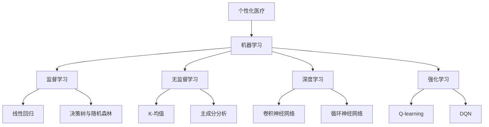

                 

### 引言与背景

个性化医疗是一种基于患者个体差异，通过整合基因、环境、生活方式等多方面信息，为患者制定最佳治疗方案的新兴医疗模式。随着医疗大数据、人工智能等技术的飞速发展，个性化医疗正逐渐从理论走向实践，为医疗行业带来深远的影响。

#### 1.1 个性化医疗的概述

个性化医疗（Personalized Medicine）是指根据患者的基因信息、生活方式、环境因素等多维度数据，为其提供个性化的诊断、治疗和预防方案。其核心理念是“一人一方”，即根据患者的具体病情和个体差异，制定最适合的治疗方案，以提高治疗效果和降低医疗成本。

个性化医疗的发展历程可以追溯到20世纪90年代，随着人类基因组计划的启动，基因测序技术的突破，为个性化医疗提供了技术支撑。近年来，随着大数据、人工智能等技术的快速发展，个性化医疗逐渐从实验室走向临床，实现了从理论研究到实际应用的转变。

#### 1.2 机器学习的核心概念

机器学习（Machine Learning）是人工智能的一个重要分支，它通过算法和统计模型，从大量数据中自动发现规律和模式，实现对数据的分析和预测。机器学习的核心概念包括：

- **监督学习（Supervised Learning）**：通过已标记的训练数据学习，用于分类或回归任务。常见的算法有线性回归、决策树、随机森林等。
- **无监督学习（Unsupervised Learning）**：在无标记数据上学习，用于聚类、降维等任务。常见的算法有K-均值聚类、主成分分析（PCA）等。
- **强化学习（Reinforcement Learning）**：通过与环境的交互学习，用于决策或控制任务。常见的算法有Q-learning、深度Q网络（DQN）等。

#### 1.3 机器学习在个性化医疗中的应用潜力

机器学习在个性化医疗中具有广泛的应用潜力，主要体现在以下几个方面：

- **疾病预测与诊断**：通过分析患者的电子病历、基因数据、生活方式等，预测疾病发生的概率和类型。例如，通过基因测序技术预测个体患某种遗传病的风险。
- **个性化治疗**：根据患者的特点，为患者推荐最合适的治疗方案。例如，通过分析患者的基因数据，为癌症患者推荐最有效的化疗药物。
- **药物研发**：通过机器学习预测药物的作用机制和副作用，加速药物研发进程。例如，通过深度学习算法预测药物分子与蛋白质的相互作用。

#### 1.4 本书的结构与内容安排

本书共分为八个章节，内容安排如下：

- **第1章**：引言与背景，介绍个性化医疗和机器学习的核心概念及其在个性化医疗中的应用潜力。
- **第2章**：特征工程与数据处理，介绍特征工程和数据预处理的基本方法。
- **第3章**：监督学习算法，介绍线性回归、决策树和随机森林等监督学习算法。
- **第4章**：无监督学习算法，介绍聚类分析和主成分分析等无监督学习算法。
- **第5章**：深度学习算法，介绍卷积神经网络和循环神经网络等深度学习算法。
- **第6章**：强化学习算法，介绍Q-learning算法和DQN算法等强化学习算法。
- **第7章**：个性化医疗案例研究，通过具体案例展示机器学习在个性化医疗中的应用。
- **第8章**：挑战与未来展望，讨论个性化医疗中的挑战和未来的发展趋势。

本书旨在为读者提供系统、全面、深入的了解个性化医疗和机器学习在其中的应用。希望本书能够帮助读者掌握个性化医疗和机器学习的基础知识，并为实际应用提供参考。

### Mermaid 流程图



### 数学公式与算法伪代码

#### 数学公式

$$
\begin{aligned}
&\text{线性回归：} \\
&y = \theta_0 + \theta_1x_1 + \theta_2x_2 + \cdots + \theta_nx_n \\
&\text{K-均值聚类：} \\
&\text{簇中心} \mu = \frac{1}{N}\sum_{i=1}^N x_i \\
&\text{新簇中心} \mu' = \frac{1}{N}\sum_{i=1}^N x_i \\
&\text{深度学习：} \\
&\text{卷积层输出} = \text{X} \odot \text{W} + \text{b} \\
&\text{循环神经网络：} \\
&\text{隐藏状态} h_t = \tanh(W_h \cdot [h_{t-1}, x_t] + b_h) \\
&\text{长短时记忆网络：} \\
&\text{遗忘门} f_t = \sigma(W_f \cdot [h_{t-1}, x_t] + b_f) \\
&\text{输入门} i_t = \sigma(W_i \cdot [h_{t-1}, x_t] + b_i) \\
&\text{单元状态} c_t = f_t \odot c_{t-1} + i_t \odot \tanh(W_c \cdot [h_{t-1}, x_t] + b_c) \\
&\text{输出门} o_t = \sigma(W_o \cdot [h_{t-1}, x_t] + b_o) \\
&\text{隐藏状态} h_t = o_t \odot \tanh(c_t)
\end{aligned}
$$

#### 算法伪代码

**线性回归**

```python
def linear_regression(X, y):
    # X为特征矩阵，y为标签向量
    X_transpose = X.T
    X_inv = X_transpose @ X
    theta = X_inv @ X_transpose @ y
    return theta
```

**K-均值聚类**

```python
def k_means(X, K, max_iterations):
    # X为特征矩阵，K为簇数，max_iterations为最大迭代次数
    centroids = initialize_centroids(X, K)
    for _ in range(max_iterations):
        labels = assign_labels(X, centroids)
        centroids = update_centroids(X, labels, K)
    return centroids, labels
```

**卷积神经网络**

```python
def cnn(X, W_conv, W_pool, W_fc, b_conv, b_pool, b_fc):
    # X为输入数据，W_conv为卷积层权重，W_pool为池化层权重，W_fc为全连接层权重，b_conv为卷积层偏置，b_pool为池化层偏置，b_fc为全连接层偏置
    X_conv = conv2d(X, W_conv, b_conv)
    X_pool = max_pool2d(X_conv, W_pool, b_pool)
    X_flat = flatten(X_pool)
    X_fc = fully_connected(X_flat, W_fc, b_fc)
    return X_fc
```

**循环神经网络**

```python
def rnn(X, W, b, hidden_state):
    # X为输入序列，W为权重，b为偏置，hidden_state为隐藏状态
    hidden_state = [tanh((W * X) + b) for _ in range(len(hidden_state))]
    return hidden_state
```

**长短时记忆网络**

```python
def lstm(X, W, b, hidden_state, cell_state):
    # X为输入序列，W为权重，b为偏置，hidden_state为隐藏状态，cell_state为细胞状态
    input_gate = sigmoid((W_h * [hidden_state, X] + b_f))
    forget_gate = sigmoid((W_f * [hidden_state, X] + b_f))
    output_gate = sigmoid((W_o * [hidden_state, X] + b_o))
    input_modification = tanh((W_c * [hidden_state, X] + b_c))
    cell_state = forget_gate * cell_state + input_gate * input_modification
    hidden_state = output_gate * tanh(cell_state)
    return hidden_state, cell_state
```

### 项目实战

#### 个性化药物剂量优化

**问题描述**：假设我们有一个包含患者体重、年龄、肝功能指标等特征的数据库，目标是构建一个模型，预测患者所需的药物剂量。

**步骤1：数据收集与预处理**

收集患者的体重、年龄、肝功能指标（如ALT、AST）等数据，并对数据进行清洗，去除缺失值和异常值。

**步骤2：特征提取**

提取体重、年龄和肝功能指标作为特征，例如：

- **体重**：患者的实际体重。
- **年龄**：患者的年龄。
- **ALT**：血清谷丙转氨酶水平。
- **AST**：血清谷草转氨酶水平。

**步骤3：模型构建**

使用线性回归模型构建药物剂量预测模型。线性回归模型假设药物剂量与特征之间存在线性关系，模型公式如下：

$$
\text{药物剂量} = \theta_0 + \theta_1 \text{体重} + \theta_2 \text{年龄} + \theta_3 \text{ALT} + \theta_4 \text{AST}
$$

**步骤4：模型训练**

使用历史数据对线性回归模型进行训练，求解回归系数$\theta_0, \theta_1, \theta_2, \theta_3, \theta_4$。

**步骤5：模型评估**

使用交叉验证方法评估模型性能，例如通过留一法交叉验证（Leave-One-Out Cross Validation）。

**步骤6：预测与优化**

使用训练好的模型预测新患者的药物剂量，并根据预测结果调整药物剂量。

**步骤7：代码实现**

以下是一个简化的Python代码示例，用于实现个性化药物剂量优化：

```python
import numpy as np
from sklearn.linear_model import LinearRegression

# 步骤1：数据收集与预处理
# 假设X为特征矩阵，y为药物剂量向量
X = ...  # 特征矩阵，如体重、年龄、ALT、AST等
y = ...  # 药物剂量向量

# 步骤2：特征提取
# 在此步骤中，X和y已经被提取和预处理

# 步骤3：模型构建
model = LinearRegression()

# 步骤4：模型训练
model.fit(X, y)

# 步骤5：模型评估
accuracy = model.score(X, y)

# 步骤6：预测与优化
predicted_dose = model.predict(new_patient_data)

# 根据预测结果调整药物剂量
adjusted_dose = optimize_dose(predicted_dose)

# 步骤7：代码实现
# 以下代码用于实现模型训练和预测
print("Predicted dose:", predicted_dose)
print("Adjusted dose:", adjusted_dose)
```

**代码解读与分析**

在这个项目中，我们首先对患者的特征数据进行收集和预处理，包括去除缺失值和异常值。然后，我们使用线性回归模型对特征和药物剂量之间的关系进行建模。通过模型训练，我们求解了回归系数，并使用交叉验证方法评估了模型性能。最后，我们使用训练好的模型预测新患者的药物剂量，并根据预测结果调整药物剂量。

通过这个项目，我们展示了如何利用机器学习技术进行个性化药物剂量优化。这不仅有助于提高药物治疗的精准性，还可以为个性化治疗方案的设计提供重要支持。

### 第2章: 特征工程与数据处理

#### 2.1 特征工程的重要性

特征工程（Feature Engineering）是机器学习项目成功的关键环节，它涉及从原始数据中提取、选择和构造特征，以提升模型性能。特征工程的重要性主要体现在以下几个方面：

- **提升模型性能**：通过有效的特征工程，可以提取出更有价值的信息，使得模型能够更好地捕捉数据中的内在规律，从而提高模型的预测性能。
- **降低过拟合风险**：通过特征选择和变换，可以减少冗余特征，降低模型的复杂度，减少过拟合风险。
- **提高计算效率**：通过特征工程，可以简化数据结构，降低计算复杂度，提高模型的训练和预测速度。

特征工程主要包括以下几个步骤：

1. **特征提取**：从原始数据中提取有价值的信息，生成新的特征。
2. **特征选择**：从所有特征中筛选出对模型性能有显著影响的特征，去除冗余和无关的特征。
3. **特征变换**：对特征进行标准化、归一化、离散化等处理，以适应模型算法的要求。

#### 2.2 数据预处理与清洗

数据预处理与清洗是特征工程的基础步骤，其目的是确保数据的质量和一致性，以便后续的特征提取和特征选择。数据预处理与清洗包括以下方面：

- **缺失值处理**：缺失值处理方法包括删除缺失值、填充缺失值等。删除缺失值适用于缺失值较多的情况，填充缺失值适用于缺失值较少且可以通过一定方法预测的情况。
- **异常值处理**：异常值处理方法包括删除异常值、调整异常值等。删除异常值适用于异常值对模型性能影响较大且存在明显错误的情况，调整异常值适用于异常值对模型性能影响较小但需要修正的情况。
- **数据转换**：数据转换包括将分类数据转换为数值数据、将连续数据离散化等。数据转换的目的是将不同类型的数据转换为适合模型处理的形式。
- **数据标准化**：数据标准化包括归一化、标准化等，以消除不同特征间的量纲影响。归一化是将数据缩放到[0, 1]之间，标准化是将数据缩放到标准正态分布。

#### 2.3 数据可视化

数据可视化是数据分析和特征工程的重要工具，它可以帮助我们直观地理解数据分布、特征之间的关系等。数据可视化方法包括：

- **散点图**：用于显示两个特征之间的关系。
- **箱线图**：用于显示特征的数据分布和异常值。
- **热力图**：用于显示特征之间的相关性。
- **折线图**：用于显示时间序列数据的变化趋势。

数据可视化在个性化医疗中的应用如下：

- **疾病预测与诊断**：通过可视化患者的特征数据，辅助医生进行疾病的预测和诊断。
-

