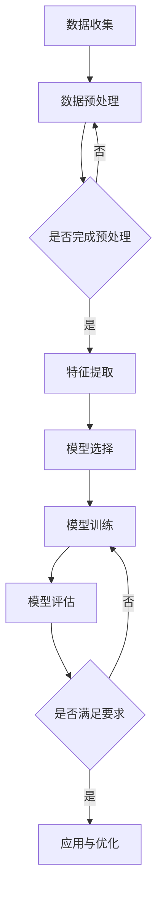

                 

# 机器学习在欺诈检测中的实时应用与优化

## 关键词
机器学习、欺诈检测、实时应用、优化、监督学习、无监督学习、强化学习

## 摘要
本文旨在探讨机器学习在欺诈检测中的实时应用与优化。首先，我们介绍了机器学习与欺诈检测的基础理论，包括监督学习、无监督学习和强化学习在欺诈检测中的常见算法。接着，我们详细讨论了实时欺诈检测系统的设计与优化策略，并通过实际案例展示了机器学习在实时欺诈检测中的应用。最后，我们对欺诈检测系统的技术发展进行了展望，提出了未来研究的挑战与机遇。

## 目录大纲

### 第一部分：引言与基础理论

#### 第1章：机器学习与欺诈检测概述

##### 1.1 机器学习基础

##### 1.2 欺诈检测的重要性

##### 1.3 欺诈检测的挑战与机遇

#### 第2章：欺诈检测中的常见机器学习算法

##### 2.1 监督学习算法

##### 2.2 无监督学习算法

##### 2.3 强化学习算法

#### 第3章：实时欺诈检测系统设计

##### 3.1 实时数据处理基础

##### 3.2 实时欺诈检测系统架构

##### 3.3 系统优化与性能提升

### 第二部分：实时应用案例分析

#### 第4章：案例分析一——电商平台实时欺诈检测

##### 4.1 案例背景

##### 4.2 数据预处理

##### 4.3 模型选择与训练

##### 4.4 实时检测与效果评估

#### 第5章：案例分析二——银行系统实时欺诈监测

##### 5.1 案例背景

##### 5.2 数据收集与处理

##### 5.3 模型构建与优化

##### 5.4 实时监测与效果分析

#### 第6章：案例分析三——移动支付领域实时欺诈防范

##### 6.1 案例背景

##### 6.2 数据分析与特征提取

##### 6.3 模型设计与实现

##### 6.4 实时应用与反馈优化

### 第三部分：优化策略与技术探讨

#### 第7章：欺诈检测算法优化策略

##### 7.1 特征工程优化

##### 7.2 模型选择与调参

##### 7.3 实时性优化

#### 第8章：欺诈检测系统技术发展

##### 8.1 深度学习在欺诈检测中的应用

##### 8.2 聚类算法与协同过滤技术

##### 8.3 新型欺诈检测系统架构

#### 第9章：未来发展趋势与展望

##### 9.1 欺诈检测技术的创新点

##### 9.2 挑战与机遇

##### 9.3 欺诈检测技术的发展趋势

#### 附录

##### 附录A：实用工具与资源

###### A.1 开源机器学习框架

###### A.2 数据集与库资源

###### A.3 欺诈检测社区与会议

## 第一部分：引言与基础理论

### 第1章：机器学习与欺诈检测概述

#### 1.1 机器学习基础

机器学习是一门人工智能的分支，它使计算机系统能够从数据中学习并作出决策，而无需显式编程。机器学习主要分为三类：监督学习、无监督学习和强化学习。

1. **监督学习**：系统从已标记的训练数据中学习，以预测新的、未见过的数据的标签。常见的监督学习算法有决策树、支持向量机和神经网络。
2. **无监督学习**：系统在没有标记数据的情况下学习，目的是发现数据中的结构和模式。聚类分析和主成分分析是无监督学习的两种常见方法。
3. **强化学习**：系统通过与环境的交互来学习，目标是最大化奖励。常见的强化学习算法有Q-学习、深度强化学习和策略梯度算法。

#### 1.2 欺诈检测的重要性

欺诈检测在金融、电子商务、保险等行业中扮演着至关重要的角色。随着网络交易的普及，欺诈行为也日益增多，导致企业面临巨大的经济损失。有效的欺诈检测系统能够及时发现并阻止欺诈行为，保护企业的财务安全和客户的利益。

#### 1.3 欺诈检测的挑战与机遇

欺诈检测面临的挑战主要包括：

1. **数据隐私**：欺诈检测需要处理大量敏感数据，如何在保护用户隐私的前提下进行数据分析和建模，是一个重要问题。
2. **实时性**：欺诈行为往往是瞬息万变的，要求检测系统具有高实时性，能够快速响应。
3. **准确性**：高准确率是欺诈检测的关键，但同时也需要控制误报率，避免对正常交易造成不必要的干扰。

然而，随着机器学习技术的不断进步，欺诈检测领域也面临着前所未有的机遇：

1. **大数据分析**：大数据技术使得处理海量数据成为可能，为欺诈检测提供了更丰富的数据来源。
2. **深度学习**：深度学习算法在处理复杂和非线性问题方面表现出色，为欺诈检测提供了新的方法。
3. **实时处理**：云计算和分布式计算技术的发展，使得实时数据处理成为可能，为欺诈检测的实时性提供了保障。

### 第2章：欺诈检测中的常见机器学习算法

#### 2.1 监督学习算法

监督学习算法在欺诈检测中应用广泛，主要包括决策树、支持向量机和神经网络等。

##### 2.1.1 决策树

决策树是一种基于树形模型的监督学习算法，通过一系列规则来预测数据。每个内部节点表示一个特征，每个分支表示该特征的取值，每个叶节点表示一个预测结果。决策树简单易懂，易于解释，但可能存在过拟合问题。

伪代码：

```python
def build_decision_tree(data, labels):
    if is_leaf_node(data, labels):
        return leaf_value(data, labels)
    else:
        best_split = find_best_split(data, labels)
        node = DecisionNode(value=best_split)
        for feature_value in unique_feature_values(data[best_split]):
            sub_data, sub_labels = split_data(data, labels, best_split, feature_value)
            node.add_child(build_decision_tree(sub_data, sub_labels))
        return node
```

##### 2.1.2 支持向量机

支持向量机（SVM）是一种基于间隔最大化原则的分类算法，它通过寻找一个最佳的超平面来将不同类别的数据分隔开来。SVM在处理高维数据时效果较好，但训练时间较长。

数学模型：

$$
\min_{\theta} \frac{1}{2} ||\theta||^2 + C \sum_{i=1}^{n} \max(0, 1 - y_i (\theta^T x_i + b))
$$

其中，\( \theta \) 是权重向量，\( b \) 是偏置项，\( C \) 是惩罚参数。

##### 2.1.3 随机森林

随机森林是一种基于决策树的集成学习方法，通过构建多棵决策树并投票得到最终结果。随机森林在处理高维数据和避免过拟合方面表现优秀，但计算复杂度较高。

#### 2.2 无监督学习算法

无监督学习算法在欺诈检测中的应用主要是通过发现数据中的潜在结构来识别欺诈行为。

##### 2.2.1 聚类分析

聚类分析是一种无监督学习方法，它将数据划分为若干个簇，使得同一簇内的数据相似度较高，不同簇之间的数据相似度较低。常用的聚类算法包括K-means、层次聚类和DBSCAN等。

K-means算法伪代码：

```python
def k_means(data, k):
    centroids = initialize_centroids(data, k)
    while not converged:
        assign_points_to_clusters(data, centroids)
        new_centroids = update_centroids(data, clusters)
        if centroids == new_centroids:
            break
        centroids = new_centroids
    return centroids
```

##### 2.2.2 主成分分析

主成分分析（PCA）是一种降维方法，它通过将数据投影到新的正交坐标系中，提取数据的主要成分，从而降低数据的维度。PCA在处理高维数据和减少噪声方面具有优势。

数学模型：

$$
\min_{X} \sum_{i=1}^{n} ||X - \mu||^2
$$

其中，\( X \) 是特征矩阵，\( \mu \) 是均值向量。

#### 2.3 强化学习算法

强化学习算法在欺诈检测中的应用主要是通过探索与利用平衡来发现欺诈行为。

##### 2.3.1 Q-学习

Q-学习是一种基于值函数的强化学习算法，它通过学习状态-动作值函数来选择最佳动作。Q-学习适用于离散动作空间和有限状态空间，但可能存在收敛缓慢的问题。

数学模型：

$$
Q(s, a) = r + \gamma \max_{a'} Q(s', a')
$$

其中，\( s \) 是状态，\( a \) 是动作，\( s' \) 是下一状态，\( r \) 是奖励，\( \gamma \) 是折扣因子。

##### 2.3.2 深度强化学习

深度强化学习（Deep Reinforcement Learning，DRL）是一种将深度学习和强化学习结合起来的方法，它通过深度神经网络来近似状态-动作值函数。DRL适用于处理高维状态空间和连续动作空间，但训练过程复杂，易陷入局部最优。

数学模型：

$$
Q(s, a) = r + \gamma \sum_{s'} P(s' | s, a) \max_{a'} Q(s', a')
$$

## 第3章：实时欺诈检测系统设计

#### 3.1 实时数据处理基础

实时欺诈检测系统需要处理大量的实时数据，对数据处理的速度和准确性提出了较高的要求。实时数据处理通常包括数据收集、数据存储、数据加工和数据传输等环节。

1. **数据收集**：实时数据可以通过传感器、网络日志、数据库等途径收集。
2. **数据存储**：实时数据通常需要存储在内存数据库或分布式数据库中，以保证数据的高可用性和低延迟。
3. **数据加工**：实时数据需要进行清洗、去噪、特征提取等处理，以便于后续的机器学习建模。
4. **数据传输**：实时数据需要在网络中进行传输，通常采用基于消息队列的异步传输方式，以提高系统的响应速度。

#### 3.2 实时欺诈检测系统架构

实时欺诈检测系统通常采用分布式架构，以提高系统的处理能力和扩展性。系统架构通常包括数据收集层、数据处理层、模型训练层和模型应用层。

1. **数据收集层**：负责实时数据的收集和预处理，通常由一系列传感器和代理程序组成。
2. **数据处理层**：负责实时数据的高效加工和存储，通常采用分布式计算框架，如Apache Flink或Apache Spark。
3. **模型训练层**：负责模型的训练和优化，通常采用基于深度学习的模型训练框架，如TensorFlow或PyTorch。
4. **模型应用层**：负责实时数据的预测和决策，通常采用在线学习算法，如在线梯度下降或基于经验重放的强化学习算法。

#### 3.3 系统优化与性能提升

实时欺诈检测系统的性能优化主要包括以下几个方面：

1. **数据压缩**：采用数据压缩技术，减少数据的存储和传输开销，如Hadoop的HDFS压缩。
2. **分布式计算**：采用分布式计算框架，提高数据处理的速度和并发能力，如Apache Flink和Apache Spark。
3. **缓存技术**：采用缓存技术，提高数据读取速度，如Redis和Memcached。
4. **异步处理**：采用异步处理技术，提高系统的吞吐量和响应速度，如基于消息队列的异步处理。
5. **负载均衡**：采用负载均衡技术，均衡系统的处理能力，避免单点瓶颈，如Nginx和HAProxy。

### 第二部分：实时应用案例分析

#### 第4章：案例分析一——电商平台实时欺诈检测

##### 4.1 案例背景

某电商平台在业务发展过程中，面临着日益增多的欺诈订单问题。为了提高用户体验和保障商家利益，该电商平台决定引入实时欺诈检测系统，以实时监测和阻止欺诈行为。

##### 4.2 数据预处理

该电商平台收集了大量的交易数据，包括订单金额、下单时间、支付方式、用户行为等。为了进行机器学习建模，首先需要对数据进行预处理，包括以下步骤：

1. **数据清洗**：去除重复数据和缺失数据，对异常值进行填充或删除。
2. **特征工程**：提取有用的特征，如订单金额、下单时间、支付方式、用户行为等，并进行编码和标准化处理。
3. **数据分割**：将数据集划分为训练集和测试集，以评估模型的性能。

##### 4.3 模型选择与训练

在数据预处理完成后，选择合适的机器学习模型进行训练。常见的模型包括决策树、随机森林、支持向量机和神经网络等。在本案例中，选择决策树模型进行训练，其原因是决策树模型简单易懂，易于解释，且对异常值和噪声数据的容忍度较高。

模型训练过程如下：

1. **训练集划分**：将数据集划分为训练集和验证集，用于模型的训练和验证。
2. **特征选择**：通过交叉验证等方法，选择对模型性能影响较大的特征。
3. **模型训练**：使用训练集对决策树模型进行训练，调整模型参数，如树深度、节点分裂准则等。
4. **模型验证**：使用验证集对训练好的模型进行验证，调整模型参数，以获得最优性能。

##### 4.4 实时检测与效果评估

训练好的模型可以部署到线上环境，进行实时欺诈检测。实时检测过程如下：

1. **实时数据收集**：收集实时的交易数据，如订单金额、下单时间、支付方式、用户行为等。
2. **实时数据预处理**：对实时数据进行预处理，包括数据清洗、特征提取和编码等。
3. **实时预测**：使用训练好的决策树模型对实时数据进行预测，判断订单是否为欺诈订单。
4. **结果反馈**：将预测结果反馈给用户，对欺诈订单进行阻止，对正常订单进行放行。

为了评估实时欺诈检测系统的效果，可以采用以下指标：

1. **准确率**：准确率是指正确预测为欺诈订单的比例，反映了模型的分类能力。
2. **召回率**：召回率是指正确预测为欺诈订单的比例，反映了模型对欺诈订单的识别能力。
3. **F1值**：F1值是准确率和召回率的调和平均值，综合反映了模型的分类能力。

通过以上指标，可以评估实时欺诈检测系统的性能，并根据评估结果进行调整和优化。

#### 第5章：案例分析二——银行系统实时欺诈监测

##### 5.1 案例背景

某银行在业务发展过程中，面临着日益增多的欺诈行为，如诈骗、洗钱等。为了提高客户资金安全，降低欺诈风险，该银行决定引入实时欺诈监测系统，以实时监测和阻止欺诈行为。

##### 5.2 数据收集与处理

该银行收集了大量的交易数据，包括交易金额、交易时间、交易地点、交易账号等。为了进行机器学习建模，首先需要对数据进行处理，包括以下步骤：

1. **数据清洗**：去除重复数据和缺失数据，对异常值进行填充或删除。
2. **特征工程**：提取有用的特征，如交易金额、交易时间、交易地点、交易账号等，并进行编码和标准化处理。
3. **数据分割**：将数据集划分为训练集和测试集，以评估模型的性能。

##### 5.3 模型构建与优化

在数据预处理完成后，选择合适的机器学习模型进行训练。常见的模型包括决策树、随机森林、支持向量机和神经网络等。在本案例中，选择随机森林模型进行训练，其原因是随机森林模型具有较好的分类能力和鲁棒性。

模型训练过程如下：

1. **训练集划分**：将数据集划分为训练集和验证集，用于模型的训练和验证。
2. **特征选择**：通过交叉验证等方法，选择对模型性能影响较大的特征。
3. **模型训练**：使用训练集对随机森林模型进行训练，调整模型参数，如树数量、树深度等。
4. **模型验证**：使用验证集对训练好的模型进行验证，调整模型参数，以获得最优性能。

##### 5.4 实时监测与效果分析

训练好的模型可以部署到线上环境，进行实时欺诈监测。实时监测过程如下：

1. **实时数据收集**：收集实时的交易数据，如交易金额、交易时间、交易地点、交易账号等。
2. **实时数据预处理**：对实时数据进行预处理，包括数据清洗、特征提取和编码等。
3. **实时预测**：使用训练好的随机森林模型对实时数据进行预测，判断交易是否为欺诈交易。
4. **结果反馈**：将预测结果反馈给银行工作人员，对欺诈交易进行阻止，对正常交易进行放行。

为了评估实时欺诈监测系统的效果，可以采用以下指标：

1. **准确率**：准确率是指正确预测为欺诈交易的比例，反映了模型的分类能力。
2. **召回率**：召回率是指正确预测为欺诈交易的比例，反映了模型对欺诈交易的识别能力。
3. **F1值**：F1值是准确率和召回率的调和平均值，综合反映了模型的分类能力。

通过以上指标，可以评估实时欺诈监测系统的性能，并根据评估结果进行调整和优化。

#### 第6章：案例分析三——移动支付领域实时欺诈防范

##### 6.1 案例背景

随着移动支付的普及，欺诈行为也日益增多，对用户的财产安全造成了严重威胁。为了提高用户支付体验和保障用户利益，某移动支付平台决定引入实时欺诈防范系统，以实时监测和阻止欺诈行为。

##### 6.2 数据分析与特征提取

该移动支付平台收集了大量的交易数据，包括交易金额、交易时间、交易地点、设备信息等。为了进行机器学习建模，首先需要对数据进行处理，包括以下步骤：

1. **数据清洗**：去除重复数据和缺失数据，对异常值进行填充或删除。
2. **特征工程**：提取有用的特征，如交易金额、交易时间、交易地点、设备信息等，并进行编码和标准化处理。
3. **数据分割**：将数据集划分为训练集和测试集，以评估模型的性能。

##### 6.3 模型设计与实现

在数据预处理完成后，选择合适的机器学习模型进行训练。常见的模型包括决策树、随机森林、支持向量机和神经网络等。在本案例中，选择决策树模型进行训练，其原因是决策树模型简单易懂，易于解释，且对异常值和噪声数据的容忍度较高。

模型训练过程如下：

1. **训练集划分**：将数据集划分为训练集和验证集，用于模型的训练和验证。
2. **特征选择**：通过交叉验证等方法，选择对模型性能影响较大的特征。
3. **模型训练**：使用训练集对决策树模型进行训练，调整模型参数，如树深度、节点分裂准则等。
4. **模型验证**：使用验证集对训练好的模型进行验证，调整模型参数，以获得最优性能。

##### 6.4 实时应用与反馈优化

训练好的模型可以部署到线上环境，进行实时欺诈防范。实时应用过程如下：

1. **实时数据收集**：收集实时的交易数据，如交易金额、交易时间、交易地点、设备信息等。
2. **实时数据预处理**：对实时数据进行预处理，包括数据清洗、特征提取和编码等。
3. **实时预测**：使用训练好的决策树模型对实时数据进行预测，判断交易是否为欺诈交易。
4. **结果反馈**：将预测结果反馈给用户，对欺诈交易进行阻止，对正常交易进行放行。

为了提高实时欺诈防范系统的性能，可以采用以下策略：

1. **动态调整阈值**：根据实时交易数据的特点，动态调整欺诈检测的阈值，以提高准确率和召回率。
2. **反馈机制**：将预测结果和实际结果进行对比，根据反馈结果调整模型参数，以提高模型的性能。
3. **多模型集成**：结合多种机器学习模型，提高欺诈检测的准确率和鲁棒性。

通过以上策略，可以优化实时欺诈防范系统的性能，并提高用户支付的安全性和满意度。

### 第三部分：优化策略与技术探讨

#### 第7章：欺诈检测算法优化策略

欺诈检测算法的优化策略主要包括特征工程优化、模型选择与调参和实时性优化。

##### 7.1 特征工程优化

特征工程是欺诈检测算法的关键步骤，优化特征工程可以提高模型的性能。以下是一些常用的特征工程优化方法：

1. **特征选择**：通过筛选和选择对模型性能影响较大的特征，降低特征维度，提高模型训练速度和准确率。常用的特征选择方法包括过滤法、包裹法和嵌入法。
2. **特征编码**：将原始特征转换为更适合机器学习模型的形式。常用的特征编码方法包括独热编码、标签编码和特征缩放。
3. **特征构造**：通过构造新的特征来提高模型对数据的表达能力。常用的特征构造方法包括统计特征、交互特征和变换特征。

##### 7.2 模型选择与调参

选择合适的机器学习模型并进行参数调优是提高欺诈检测性能的关键。以下是一些常用的模型选择与调参方法：

1. **模型选择**：根据数据特点和业务需求，选择适合的机器学习模型。常见的模型包括线性模型、决策树、支持向量机和神经网络等。
2. **交叉验证**：通过交叉验证方法，评估不同模型的性能，选择最优模型。常用的交叉验证方法包括K折交叉验证和留一法交叉验证。
3. **网格搜索**：通过网格搜索方法，遍历所有可能的参数组合，选择最佳参数。常用的网格搜索方法包括手动网格搜索和随机搜索。

##### 7.3 实时性优化

实时性优化是欺诈检测算法面临的挑战之一。以下是一些常用的实时性优化方法：

1. **模型压缩**：通过模型压缩方法，减少模型的参数规模，降低模型计算复杂度。常用的模型压缩方法包括模型剪枝、量化和小样本学习。
2. **模型并行化**：通过模型并行化方法，提高模型训练和预测的并发能力。常用的模型并行化方法包括模型拆分、数据并行和模型并行。
3. **内存优化**：通过内存优化方法，降低模型训练和预测的内存消耗。常用的内存优化方法包括内存池、共享内存和内存复制。

#### 第8章：欺诈检测系统技术发展

随着人工智能技术的不断发展，欺诈检测系统也在不断演进。以下是一些前沿技术和发展趋势：

##### 8.1 深度学习在欺诈检测中的应用

深度学习在欺诈检测中表现出色，可以有效处理复杂和非线性问题。以下是一些深度学习在欺诈检测中的应用：

1. **卷积神经网络（CNN）**：CNN可以提取图像数据中的特征，适用于处理基于图像的欺诈检测问题。
2. **循环神经网络（RNN）**：RNN可以处理序列数据，适用于处理基于时间序列的欺诈检测问题。
3. **生成对抗网络（GAN）**：GAN可以生成与真实数据相似的数据，用于训练和评估欺诈检测模型。

##### 8.2 聚类算法与协同过滤技术

聚类算法和协同过滤技术在欺诈检测中也具有一定的应用价值。以下是一些相关技术：

1. **聚类算法**：聚类算法可以识别数据中的潜在模式，用于发现欺诈行为。常用的聚类算法包括K-means、层次聚类和DBSCAN等。
2. **协同过滤**：协同过滤技术可以根据用户的历史行为和偏好，预测用户是否参与欺诈行为。常用的协同过滤方法包括基于用户的协同过滤和基于物品的协同过滤。

##### 8.3 新型欺诈检测系统架构

新型欺诈检测系统架构通常采用分布式和实时处理技术，以提高系统的性能和可靠性。以下是一些新型欺诈检测系统架构：

1. **云计算架构**：云计算架构可以提供弹性的计算资源和存储资源，适用于处理大规模欺诈检测任务。
2. **边缘计算架构**：边缘计算架构可以将计算任务分散到网络边缘，降低网络延迟，提高实时性。
3. **区块链技术**：区块链技术可以提供去中心化的信任机制，提高数据的安全性和透明度。

#### 第9章：未来发展趋势与展望

欺诈检测技术在不断发展，未来仍有许多挑战和机遇。以下是一些发展趋势与展望：

##### 9.1 欺诈检测技术的创新点

1. **基于AI的自动化检测**：通过引入人工智能技术，实现自动化欺诈检测，降低人力成本。
2. **跨领域融合**：将欺诈检测与其他领域的技术相结合，如区块链、物联网等，提高欺诈检测的全面性和准确性。
3. **个性化欺诈检测**：根据用户的个人行为特征，定制化欺诈检测策略，提高欺诈检测的准确率和用户体验。

##### 9.2 挑战与机遇

欺诈检测面临的挑战主要包括数据隐私、实时性和准确性等。机遇则包括大数据技术、深度学习和实时处理技术的发展。未来，随着技术的不断进步，欺诈检测技术将在保障金融安全、提高用户体验等方面发挥更大的作用。

##### 9.3 欺诈检测技术的发展趋势

1. **智能化**：随着人工智能技术的不断进步，欺诈检测系统将更加智能化，能够自适应调整检测策略。
2. **实时化**：随着实时处理技术的发展，欺诈检测系统将实现实时监测和响应，提高欺诈检测的效率。
3. **融合化**：将多种技术和方法相结合，实现跨领域的欺诈检测，提高欺诈检测的全面性和准确性。

### 附录

#### 附录A：实用工具与资源

##### A.1 开源机器学习框架

1. **Scikit-learn**：Python开源机器学习库，提供了丰富的监督学习和无监督学习算法。
2. **TensorFlow**：Google开源的深度学习框架，适用于构建和训练深度神经网络。
3. **PyTorch**：Facebook开源的深度学习框架，具有灵活的动态计算图和易于理解的编程接口。

##### A.2 数据集与库资源

1. **Kaggle**：提供各种数据集和比赛，是机器学习爱好者的学习平台。
2. **UCI Machine Learning Repository**：提供大量标准化的机器学习数据集，适用于学术研究和实验。
3. **Fraud Detection Data Sets**：提供用于欺诈检测的公开数据集，适用于模型训练和评估。

##### A.3 欺诈检测社区与会议

1. **IEEE Conference on Computational Intelligence and Data Mining (CIDM)**：计算机智能与数据挖掘领域的国际会议。
2. **IEEE International Conference on Data Science and Advanced Analytics (DSAA)**：数据科学与高级分析领域的国际会议。
3. **IEEE International Conference on Big Data Analysis and Knowledge Discovery (BDAK)**：大数据分析与知识发现领域的国际会议。

## 核心概念与联系

为了更好地理解机器学习在欺诈检测中的应用，我们可以使用Mermaid流程图来展示核心概念和联系。



该流程图展示了从数据收集到模型优化的完整流程，包括数据预处理、特征提取、模型选择、模型训练和模型评估等步骤。通过这个流程图，我们可以清晰地了解机器学习在欺诈检测中的应用流程。

### 核心算法原理讲解

在本节中，我们将详细讲解欺诈检测中常用的机器学习算法，包括决策树、支持向量机和神经网络。我们将使用伪代码和数学公式来阐述这些算法的基本原理。

#### 决策树

决策树是一种常见的监督学习算法，通过一系列规则来预测数据。每个内部节点表示一个特征，每个分支表示该特征的取值，每个叶节点表示一个预测结果。

**伪代码：**

```python
def build_decision_tree(data, labels):
    if is_leaf_node(data, labels):
        return leaf_value(data, labels)
    else:
        best_split = find_best_split(data, labels)
        node = DecisionNode(value=best_split)
        for feature_value in unique_feature_values(data[best_split]):
            sub_data, sub_labels = split_data(data, labels, best_split, feature_value)
            node.add_child(build_decision_tree(sub_data, sub_labels))
        return node
```

**数学模型：**

决策树的目标是最小化节点上的损失函数。常见的损失函数包括基尼不纯度、信息增益和交叉熵等。

$$
Gini = 1 - \sum_{i} p_i (1 - p_i)
$$

其中，\( p_i \) 是特征在节点上的概率。

#### 支持向量机

支持向量机（SVM）是一种基于间隔最大化的监督学习算法，通过寻找一个最佳的超平面来将不同类别的数据分隔开来。

**伪代码：**

```python
def train_svm(data, labels, C):
    # Solving the optimization problem
    # Use a solver such as Sequential Minimal Optimization (SMO)
    # The following is a simplified version
    w, b = solve_optimization_problem(data, labels, C)
    return w, b
```

**数学模型：**

$$
\min_{\theta} \frac{1}{2} ||\theta||^2 + C \sum_{i=1}^{n} \max(0, 1 - y_i (\theta^T x_i + b))
$$

其中，\( \theta \) 是权重向量，\( b \) 是偏置项，\( C \) 是惩罚参数。

#### 神经网络

神经网络是一种基于多层感知器的监督学习算法，通过前向传播和反向传播来训练模型。

**伪代码：**

```python
def train_neural_network(data, labels, layers, learning_rate):
    # Initialize weights and biases
    # Forward propagation
    # Calculate loss
    # Backpropagation
    # Update weights and biases
    # Repeat until convergence
    return weights, biases
```

**数学模型：**

前向传播：

$$
a_{l+1} = \sigma(z_{l+1})
$$

其中，\( \sigma \) 是激活函数，通常使用Sigmoid或ReLU函数。

反向传播：

$$
\delta_{l} = \frac{\partial L}{\partial z_{l}} \odot \frac{\partial z_{l}}{\partial a_{l}}
$$

其中，\( \odot \) 是逐元素乘法，\( L \) 是损失函数。

权重更新：

$$
\theta_{l} = \theta_{l} - \alpha \cdot \delta_{l} \cdot a_{l-1}^T
$$

其中，\( \alpha \) 是学习率。

### 数学模型和数学公式

在欺诈检测中，常用的数学模型和数学公式包括损失函数、决策边界和概率分布。

#### 损失函数

常见的损失函数包括均方误差（MSE）、交叉熵损失和Hinge损失等。

**均方误差（MSE）**

$$
MSE = \frac{1}{2n} \sum_{i=1}^{n} (y_i - \hat{y}_i)^2
$$

其中，\( y_i \) 是真实标签，\( \hat{y}_i \) 是预测值。

**交叉熵损失**

$$
CrossEntropy = -\frac{1}{n} \sum_{i=1}^{n} y_i \log(\hat{y}_i) + (1 - y_i) \log(1 - \hat{y}_i)
$$

**Hinge损失**

$$
Hinge = \frac{1}{n} \sum_{i=1}^{n} \max(0, 1 - y_i \cdot \hat{y}_i)
$$

#### 决策边界

在二分类问题中，决策边界是分隔两个类别的超平面。决策边界由权重向量 \( \theta \) 和偏置项 \( b \) 决定。

$$
\theta^T x + b = 0
$$

其中，\( x \) 是特征向量。

#### 概率分布

在欺诈检测中，概率分布用于计算预测标签的概率。

**贝叶斯分类器**

$$
P(y_i = 1 | x_i) = \frac{P(x_i | y_i = 1) \cdot P(y_i = 1)}{P(x_i)}
$$

**逻辑回归**

$$
\hat{y}_i = \sigma(\theta^T x_i + b)
$$

其中，\( \sigma \) 是逻辑函数。

### 项目实战

在本节中，我们将通过一个实际项目案例，展示如何使用机器学习算法进行欺诈检测。

#### 案例一：电商平台实时欺诈检测

**环境搭建**

- Python 3.8+
- Scikit-learn 库
- Pandas 库
- Matplotlib 库

**源代码实现**

```python
import pandas as pd
from sklearn.model_selection import train_test_split
from sklearn.tree import DecisionTreeClassifier
from sklearn.metrics import accuracy_score

# 数据加载与预处理
data = pd.read_csv('ecommerce_data.csv')
X = data.drop('is_fraud', axis=1)
y = data['is_fraud']
X_train, X_test, y_train, y_test = train_test_split(X, y, test_size=0.2, random_state=42)

# 模型训练
model = DecisionTreeClassifier()
model.fit(X_train, y_train)

# 模型评估
y_pred = model.predict(X_test)
accuracy = accuracy_score(y_test, y_pred)
print(f"Accuracy: {accuracy:.2f}")
```

**代码解读与分析**

- 数据加载与预处理：使用 Pandas 库加载数据，并进行必要的预处理操作。
- 模型训练：使用 Scikit-learn 库的 DecisionTreeClassifier 类创建决策树模型，并使用训练数据进行训练。
- 模型评估：使用测试数据进行预测，并计算准确率。

通过以上实战案例，我们可以看到如何使用机器学习算法进行欺诈检测，包括数据预处理、模型训练和模型评估等步骤。

### 附录

#### 附录A：实用工具与资源

**A.1 开源机器学习框架**

1. **Scikit-learn**：Python开源机器学习库，提供了丰富的监督学习和无监督学习算法。
2. **TensorFlow**：Google开源的深度学习框架，适用于构建和训练深度神经网络。
3. **PyTorch**：Facebook开源的深度学习框架，具有灵活的动态计算图和易于理解的编程接口。

**A.2 数据集与库资源**

1. **Kaggle**：提供各种数据集和比赛，是机器学习爱好者的学习平台。
2. **UCI Machine Learning Repository**：提供大量标准化的机器学习数据集，适用于学术研究和实验。
3. **Fraud Detection Data Sets**：提供用于欺诈检测的公开数据集，适用于模型训练和评估。

**A.3 欺诈检测社区与会议**

1. **IEEE Conference on Computational Intelligence and Data Mining (CIDM)**：计算机智能与数据挖掘领域的国际会议。
2. **IEEE International Conference on Data Science and Advanced Analytics (DSAA)**：数据科学与高级分析领域的国际会议。
3. **IEEE International Conference on Big Data Analysis and Knowledge Discovery (BDAK)**：大数据分析与知识发现领域的国际会议。

### 总结

本文详细探讨了机器学习在欺诈检测中的应用，包括理论基础、实时应用、优化策略和案例分析。我们介绍了监督学习、无监督学习和强化学习在欺诈检测中的应用，并探讨了实时数据处理和系统设计的关键技术。通过实际案例，我们展示了机器学习算法在欺诈检测中的实践应用。未来，随着技术的不断进步，欺诈检测技术将更加智能化和实时化，为金融安全和社会稳定提供更强有力的保障。

