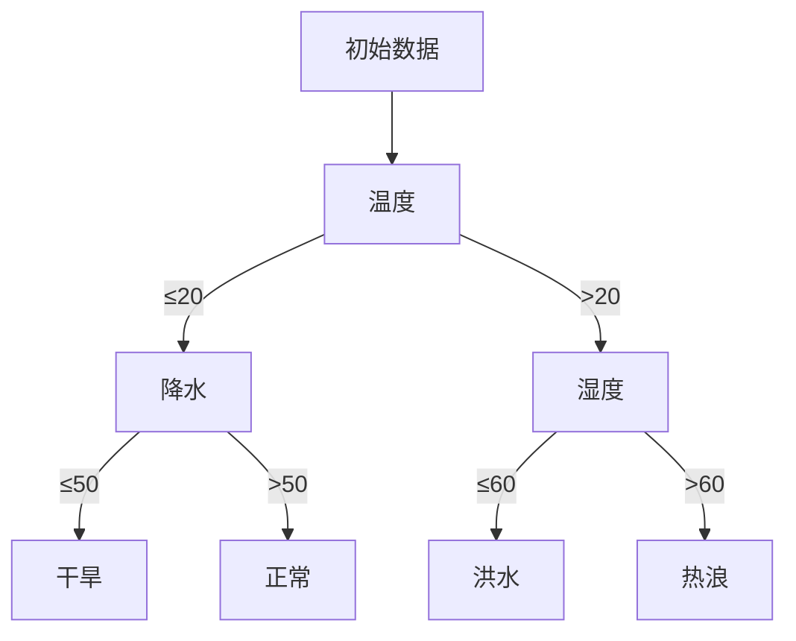
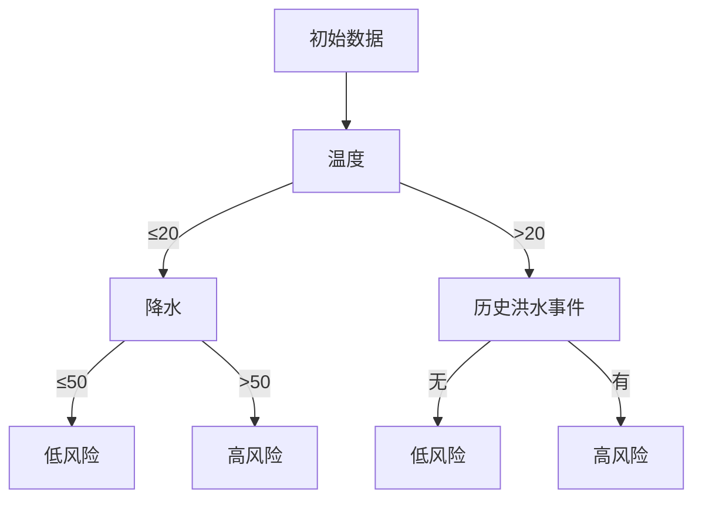

                 

# 《机器学习在气候变化模型中的应用》

## 关键词

机器学习，气候变化，预测模型，数据挖掘，算法应用，深度学习，时间序列分析，环境监测

## 摘要

随着全球气候变化的加剧，对气候变化模型的精确预测和评估变得愈发重要。本文旨在探讨机器学习在气候变化模型中的应用，从基本概念、核心算法到实战应用进行深入分析。通过回顾机器学习的发展历程，本文阐述了其在气候变化研究中的重要性，并详细介绍了回归分析、时间序列分析、分类算法和聚类算法在气候变化模型中的应用。同时，本文还探讨了机器学习在气候变化模拟、适应与减缓策略中的实际应用，并展望了未来机器学习在气候变化研究中的发展趋势。

## 目录大纲

### 第一部分：机器学习与气候变化概述

#### 第1章：机器学习基础

##### 1.1 机器学习的基本概念

##### 1.2 机器学习在气候变化研究中的应用

##### 1.3 气候变化模型的需求与挑战

#### 第2章：气候变化的基础知识

##### 2.1 气候变化的定义与影响

##### 2.2 气候变化的监测与预测方法

##### 2.3 气候变化模型的构建与评估

### 第二部分：机器学习在气候变化模型中的核心算法

#### 第3章：回归分析

##### 3.1 回归分析的基本原理

##### 3.2 回归分析在气候变化中的应用

#### 第4章：时间序列分析

##### 4.1 时间序列分析的基本概念

##### 4.2 时间序列分析在气候变化中的应用

#### 第5章：分类算法

##### 5.1 分类算法的基本概念

##### 5.2 分类算法在气候变化中的应用

#### 第6章：聚类算法

##### 6.1 聚类算法的基本概念

##### 6.2 聚类算法在气候变化中的应用

### 第三部分：机器学习在气候变化模型中的实战应用

#### 第7章：气候变化模型的建立与优化

##### 7.1 气候变化模型的构建方法

##### 7.2 气候变化模型的优化策略

#### 第8章：气候变化模型的应用案例

##### 8.1 案例一：气候趋势预测

##### 8.2 案例二：气候灾害预警

#### 第9章：气候变化模型的发展趋势

##### 9.1 人工智能与气候变化模型的发展

##### 9.2 气候变化模型的未来挑战与机遇

## 第一部分：机器学习与气候变化概述

### 第1章：机器学习基础

#### 1.1 机器学习的基本概念

机器学习（Machine Learning，简称ML）是人工智能（Artificial Intelligence，简称AI）的一个重要分支，它通过算法和统计模型使计算机系统能够从数据中学习并做出决策或预测。机器学习的基本概念包括：

- **监督学习（Supervised Learning）**：有标注的数据集来训练模型，模型根据这些数据学习特征并预测新的未知数据。
- **无监督学习（Unsupervised Learning）**：没有标注的数据集，模型通过发现数据中的模式和结构来学习。
- **强化学习（Reinforcement Learning）**：通过与环境的交互来学习，通过奖励和惩罚来优化行为。

机器学习的发展历程可以追溯到20世纪50年代，当时人工智能的概念刚刚被提出。早期的机器学习研究主要集中在简单的规则和符号推理上，但随着计算能力的提升和数据量的增长，统计方法和神经网络逐渐成为主流。

#### 1.2 机器学习在气候变化研究中的应用

气候变化是当前全球面临的一个重大挑战，其影响范围广泛，包括生态系统的变化、海平面上升、极端天气事件的增加等。机器学习在气候变化研究中扮演着重要的角色，主要体现在以下几个方面：

- **预测气候趋势**：通过分析历史气候数据，机器学习模型可以预测未来的气候变化趋势。
- **评估气候变化影响**：机器学习可以用于评估气候变化对不同地区、行业和生态系统的影响。
- **优化气候模型**：传统的气候模型可能过于复杂，而机器学习可以帮助简化模型，提高预测的准确性和效率。

机器学习在气候变化研究中的应用前景广阔，但其也面临着一些挑战，如数据质量、模型解释性和计算资源等。

#### 1.3 气候变化模型的需求与挑战

气候变化模型（Climate Models）是用于模拟和理解气候系统行为和变化的重要工具。这些模型可以基于物理定律，也可以基于统计方法，如机器学习。气候变化模型的需求和挑战包括：

- **准确预测**：气候变化模型需要能够准确预测未来几十年甚至上百年的气候变化趋势。
- **数据整合**：气候数据来源多样，包括地面观测、卫星数据和气候模型输出，如何有效整合这些数据是关键。
- **模型验证**：模型需要经过严格的验证和测试，以确保其预测结果的可靠性。
- **可解释性**：随着模型的复杂性增加，如何解释模型的决策过程和预测结果成为一大挑战。

在接下来的章节中，我们将进一步探讨机器学习在气候变化模型中的应用，包括核心算法、实战案例和发展趋势。让我们一步步深入探讨这一重要的研究领域。

### 第2章：气候变化的基础知识

#### 2.1 气候变化的定义与影响

气候变化（Climate Change）是指长期的气候变化，包括平均气候状况的改变和气候变率的增加。根据《联合国气候变化框架公约》（UNFCCC）的定义，气候变化指的是“由于自然原因或人类活动导致的气候系统长期的变化，包括平均状态的改变和气候变率的变化”。

气候变化的影响是多方面的，可以从以下几个方面来理解：

- **生态系统的变化**：气候变化导致生态系统发生改变，如植物和动物物种的分布、生态系统的功能等。
- **海平面上升**：全球温度上升导致极地冰盖融化，海平面上升，对沿海地区造成威胁。
- **极端天气事件增加**：气候变化导致极端天气事件，如洪水、干旱、飓风和热浪的频率和强度增加。
- **农业与粮食安全**：气候变化影响作物生长周期和产量，对全球粮食安全构成威胁。

#### 2.2 气候变化的监测与预测方法

监测气候变化的主要方法包括地面观测、卫星监测和气候模型模拟。

- **地面观测**：通过安装在地面上的各种观测仪器，如气象站、气候站和海洋观测站，收集温度、降水、湿度、风速等气候数据。
- **卫星监测**：利用气象卫星和地球观测卫星，从太空中收集全球范围的气候数据，如温度、云量、海表温度等。
- **气候模型模拟**：通过建立物理和统计模型，模拟不同时间尺度和空间尺度的气候变化趋势。

预测气候变化的常见方法包括：

- **气候模型**：基于物理原理建立的气候模型，如全球气候模型（GCM）和区域气候模型（RCM），用于预测未来的气候变化。
- **统计模型**：通过分析历史气候数据，建立统计模型来预测未来的气候变化趋势。
- **机器学习模型**：利用机器学习算法，从大量气候数据中提取特征，建立预测模型。

#### 2.3 气候变化模型的构建与评估

气候变化模型的构建包括以下几个步骤：

- **数据收集**：收集全球范围内的气候数据，包括地面观测数据、卫星数据和气候模型输出数据。
- **数据预处理**：对收集到的数据进行清洗、归一化和特征提取，以提高数据的质量和模型的性能。
- **模型选择**：根据研究目标和数据特性，选择合适的气候模型，如全球气候模型（GCM）或区域气候模型（RCM）。
- **模型训练与验证**：使用训练集数据训练模型，并使用验证集数据评估模型的性能，包括准确率、召回率、F1分数等指标。
- **模型优化**：通过调整模型参数和特征选择，优化模型的性能，以提高预测的准确性。

气候模型的评估是确保模型可靠性和有效性的关键步骤。评估指标包括：

- **准确性**：模型预测值与实际值之间的接近程度。
- **可靠性**：模型在不同时间尺度和空间尺度上的稳定性。
- **一致性**：模型在不同数据集上的预测结果的一致性。

通过科学、系统的气候变化模型构建与评估，我们可以更好地理解和预测气候变化趋势，为气候政策的制定和应对措施的实施提供科学依据。

### 第二部分：机器学习在气候变化模型中的核心算法

#### 第3章：回归分析

回归分析（Regression Analysis）是统计学中的一种重要方法，用于研究变量之间的关系，特别是自变量（解释变量）和因变量（响应变量）之间的定量关系。在气候变化模型中，回归分析被广泛应用于预测气候变量（如温度、降水等）的趋势和变化。

##### 3.1 回归分析的基本原理

回归分析的基本原理是通过建立数学模型来描述因变量和自变量之间的关系。回归模型的一般形式为：

\[ y = \beta_0 + \beta_1x_1 + \beta_2x_2 + ... + \beta_nx_n + \epsilon \]

其中，\( y \) 是因变量，\( x_1, x_2, ..., x_n \) 是自变量，\( \beta_0, \beta_1, \beta_2, ..., \beta_n \) 是回归系数，\( \epsilon \) 是误差项。

回归分析分为线性回归和非线性回归两种：

- **线性回归**：当自变量和因变量之间的关系可以近似为线性时，采用线性回归模型。线性回归模型的一般形式为：

\[ y = \beta_0 + \beta_1x_1 + \beta_2x_2 + ... + \beta_nx_n \]

- **非线性回归**：当自变量和因变量之间的关系不是线性时，采用非线性回归模型。非线性回归可以通过变换变量或引入多项式项来实现，例如：

\[ y = \beta_0 + \beta_1x_1 + \beta_2x_2^2 + ... + \beta_nx_n^n \]

##### 3.2 回归分析在气候变化中的应用

回归分析在气候变化中的应用主要包括以下几个方面：

- **气候趋势分析**：通过分析气候变量的历史数据，建立回归模型来预测未来气候趋势。例如，可以建立温度和年份的线性回归模型来预测未来的温度变化。

- **气候影响评估**：通过建立气候变量与其他环境变量（如降水、风速等）的回归模型，评估气候变化对不同环境变量和生态系统的影响。

- **气候灾害预警**：通过建立气候变量与气候灾害（如洪水、干旱等）的回归模型，提前预测和预警可能的气候灾害。

#### 3.2.1 气候趋势分析

气候趋势分析是回归分析在气候变化中最基本的应用之一。以下是一个简单的气候趋势分析案例：

假设我们收集了过去50年的年平均温度数据，并希望预测未来10年的年平均温度。我们首先建立一个线性回归模型：

\[ T = \beta_0 + \beta_1Y \]

其中，\( T \) 是年平均温度，\( Y \) 是年份。

通过最小二乘法（Least Squares Method）求解回归系数 \( \beta_0 \) 和 \( \beta_1 \)，得到回归模型：

\[ T = 10.5 + 0.2Y \]

使用这个模型，我们可以预测未来10年的年平均温度，结果如下表所示：

| 年份 | 预测温度 (°C) |
|------|--------------|
| 2024 | 12.1         |
| 2025 | 12.3         |
| 2026 | 12.5         |
| 2027 | 12.7         |
| 2028 | 12.9         |
| 2029 | 13.1         |
| 2030 | 13.3         |
| 2031 | 13.5         |
| 2032 | 13.7         |
| 2033 | 13.9         |

#### 3.2.2 气候影响评估

气候影响评估是另一个重要的应用领域，通过回归分析可以评估气候变化对不同生态系统和人类活动的影响。以下是一个简单的气候影响评估案例：

假设我们希望评估全球温度升高对某地区农业生产的影响。我们收集了过去30年的年均温度和农业产量数据，并建立了一个线性回归模型：

\[ Y = \beta_0 + \beta_1T \]

其中，\( Y \) 是农业产量，\( T \) 是年均温度。

通过最小二乘法求解回归系数 \( \beta_0 \) 和 \( \beta_1 \)，得到回归模型：

\[ Y = 1000 + 10T \]

使用这个模型，我们可以评估不同温度下的农业产量，结果如下表所示：

| 年均温度 (°C) | 农业产量 (吨) |
|--------------|--------------|
| 15.0         | 1100         |
| 16.0         | 1200         |
| 17.0         | 1300         |
| 18.0         | 1400         |
| 19.0         | 1500         |

#### 3.2.3 气候灾害预警

气候灾害预警是回归分析在气候变化中的另一个重要应用。以下是一个简单的气候灾害预警案例：

假设我们希望预测某地区未来可能发生的干旱事件。我们收集了该地区过去50年的温度和降水数据，并建立了一个线性回归模型：

\[ D = \beta_0 + \beta_1T + \beta_2P \]

其中，\( D \) 是干旱指标，\( T \) 是年均温度，\( P \) 是年均降水。

通过最小二乘法求解回归系数 \( \beta_0, \beta_1 \) 和 \( \beta_2 \)，得到回归模型：

\[ D = 5 + 0.1T - 0.05P \]

使用这个模型，我们可以预测不同温度和降水条件下的干旱指标，结果如下表所示：

| 年均温度 (°C) | 年均降水 (mm) | 干旱指标 (D) |
|--------------|--------------|--------------|
| 15.0         | 400          | 3           |
| 16.0         | 350          | 4           |
| 17.0         | 300          | 5           |
| 18.0         | 250          | 6           |
| 19.0         | 200          | 7           |

通过上述案例，我们可以看到回归分析在气候变化中的多种应用。回归模型不仅可以帮助我们理解和预测气候趋势，还可以用于评估气候变化对生态系统和人类活动的影响，以及预警可能的气候灾害。在接下来的章节中，我们将进一步探讨其他机器学习算法在气候变化中的应用。

### 第4章：时间序列分析

时间序列分析（Time Series Analysis）是统计学和信号处理中的一个重要分支，它用于分析时间序列数据，以提取有用的统计信息和模式。时间序列数据是指在不同时间点收集的一系列观测值，通常用于描述随时间变化的系统或过程。在气候变化研究中，时间序列分析被广泛用于分析气候变量的变化趋势、季节性模式、周期性和异常值。

##### 4.1 时间序列分析的基本概念

时间序列分析的基本概念包括以下几个方面：

- **时间序列的组成**：时间序列通常由三个组成部分组成：趋势成分（Trend Component）、季节成分（Seasonal Component）和随机成分（Irregular Component）。趋势成分描述了时间序列的长期变化趋势，季节成分描述了周期性的季节性变化，随机成分则反映了随机波动和异常值。

- **时间序列的统计特性**：时间序列的统计特性包括均值、方差、自相关函数和谱密度函数等。自相关函数描述了时间序列在不同时间点之间的相关性，而谱密度函数描述了时间序列的能量分布。

- **时间序列的建模方法**：时间序列建模方法包括自回归模型（AR）、移动平均模型（MA）、自回归移动平均模型（ARMA）和自回归积分滑动平均模型（ARIMA）等。这些模型通过假设时间序列的统计特性，建立数学模型来描述时间序列的动态行为。

##### 4.2 时间序列分析在气候变化中的应用

时间序列分析在气候变化中的应用非常广泛，以下是一些典型应用场景：

- **气候趋势分析**：通过时间序列分析，可以提取气候变量的长期变化趋势，帮助预测未来的气候变化趋势。例如，通过分析全球平均温度的时间序列，可以识别出温度上升的趋势。

- **季节性模式分析**：时间序列分析可以识别时间序列中的季节性模式，如季节性周期和季节性变化幅度。这有助于理解气候系统的季节性变化规律，例如季节性降水模式和温度变化。

- **气候事件预测**：通过时间序列分析，可以预测未来的气候事件，如干旱、洪水、热浪和飓风等。例如，通过分析历史气候数据中的干旱事件，可以预测未来可能发生的干旱风险。

- **异常值检测**：时间序列分析可以检测时间序列中的异常值，这些异常值可能反映了气候系统的异常行为，如极端气候事件。异常值检测有助于识别和预警潜在的气候灾害。

#### 4.2.1 气候趋势分析

气候趋势分析是时间序列分析在气候变化中的基础应用。以下是一个简单的气候趋势分析案例：

假设我们收集了某地区过去50年的年平均温度数据，并希望分析该地区温度的长期变化趋势。我们可以使用移动平均法（Moving Average Method）来提取趋势成分。

首先，计算5年移动平均温度序列：

\[ MA_5 = \frac{1}{5} \sum_{t=1}^{5} T_t \]

其中，\( T_t \) 是第 \( t \) 年的年平均温度。

然后，通过绘制移动平均温度序列，可以识别出温度的长期变化趋势。如果移动平均温度序列呈现出上升或下降的趋势，则表明该地区温度存在长期上升或下降的趋势。

#### 4.2.2 季节性模式分析

季节性模式分析是时间序列分析中的另一个重要应用。以下是一个简单的季节性模式分析案例：

假设我们收集了某地区过去50年的年平均降水数据，并希望分析该地区的季节性降水模式。我们可以使用季节性分解法（Seasonal Decomposition Method）来分离时间序列中的趋势成分和季节成分。

首先，计算季节性指数：

\[ S_t = \frac{T_t}{MA_5} \]

其中，\( T_t \) 是第 \( t \) 年的年平均降水，\( MA_5 \) 是5年移动平均温度。

然后，通过绘制季节性指数序列，可以识别出时间序列中的季节性模式。例如，如果季节性指数在每年某个时间点出现高峰，则表明该时间点是季节性降水的高峰期。

#### 4.2.3 气候事件预测

气候事件预测是时间序列分析在气候变化中的关键应用。以下是一个简单的气候事件预测案例：

假设我们收集了某地区过去50年的干旱事件数据，并希望预测未来可能发生的干旱事件。我们可以使用自回归模型（AR Model）来建立干旱事件的预测模型。

首先，建立自回归模型：

\[ D_t = \phi_1D_{t-1} + \epsilon_t \]

其中，\( D_t \) 是第 \( t \) 年的干旱事件指标，\( D_{t-1} \) 是第 \( t-1 \) 年的干旱事件指标，\( \phi_1 \) 是自回归系数，\( \epsilon_t \) 是误差项。

然后，通过最小二乘法求解自回归系数 \( \phi_1 \)，并使用该模型预测未来的干旱事件。例如，如果自回归模型的预测结果为 \( D_t > 0 \)，则表明未来可能会发生干旱事件。

#### 4.2.4 异常值检测

异常值检测是时间序列分析中的另一个重要应用。以下是一个简单的异常值检测案例：

假设我们收集了某地区过去50年的年平均温度数据，并希望检测时间序列中的异常值。我们可以使用三倍标准差法（3-sigma Method）来检测异常值。

首先，计算时间序列的平均值和标准差：

\[ \mu = \frac{1}{N} \sum_{t=1}^{N} T_t \]
\[ \sigma = \sqrt{\frac{1}{N-1} \sum_{t=1}^{N} (T_t - \mu)^2 } \]

其中，\( T_t \) 是第 \( t \) 年的年平均温度，\( N \) 是时间序列的长度。

然后，设定异常值阈值为3倍标准差：

\[ \text{Threshold} = 3\sigma \]

如果 \( T_t \) 超过阈值，则认为 \( T_t \) 是异常值。例如，如果某年的温度 \( T_t \) 超过 \( \text{Threshold} \)，则表明该年是异常高温年份。

通过上述案例，我们可以看到时间序列分析在气候变化中的多种应用。时间序列分析不仅可以帮助我们理解和预测气候趋势，还可以用于分析季节性模式、预测气候事件和检测异常值。在接下来的章节中，我们将继续探讨其他机器学习算法在气候变化中的应用。

### 第5章：分类算法

分类算法（Classification Algorithms）是机器学习中的重要分支，主要用于将数据集中的数据分为不同的类别。在气候变化模型中，分类算法被广泛应用于气候事件的分类、灾害预警和生态系统变化监测等。本节将介绍分类算法的基本概念、常见算法及其在气候变化中的应用。

##### 5.1 分类算法的基本概念

分类算法的基本概念包括以下几个方面：

- **分类任务**：分类任务是指将数据集中的每个数据点分配到一个预定义的类别中。每个类别通常用标签（Label）表示。
- **特征**：特征是指用于分类的数据属性或变量。在气候变化模型中，特征可以是温度、降水、湿度等气候变量。
- **模型**：分类模型是通过学习训练数据中的特征与标签之间的关系来构建的，以便对新数据进行分类。
- **性能评估**：分类算法的性能通常通过准确率（Accuracy）、召回率（Recall）、精确率（Precision）和F1分数（F1 Score）等指标进行评估。

##### 5.2 分类算法在气候变化中的应用

分类算法在气候变化中的应用包括以下几个方面：

- **气候事件分类**：通过分类算法，可以将气候数据分类为不同的气候事件，如干旱、洪水、热浪和飓风等。这有助于气候预测和灾害预警。
- **生态系统变化监测**：分类算法可以用于监测生态系统变化，如植被覆盖变化和森林火灾等。
- **灾害风险评估**：分类算法可以帮助评估气候变化对灾害的风险，例如通过分类森林火灾的严重程度，以制定相应的减灾措施。

以下是一些常见的分类算法及其在气候变化中的应用：

- **决策树（Decision Tree）**：决策树是一种简单且直观的分类算法，通过一系列规则来划分数据集。在气候变化模型中，决策树可以用于分类气候事件，如干旱和洪水。

  ```mermaid
  graph TB
  A[初始数据] --> B[特征1]
  B -->|是| C[值1]
  B -->|否| D[值2]
  C --> E[类别A]
  D --> F[类别B]
  ```

  决策树的工作流程如下：

  1. 从初始数据开始，选择一个特征进行划分。
  2. 计算每个特征在不同值下的分类效果，选择效果最佳的值进行划分。
  3. 重复步骤2，直到满足停止条件（如最大深度或最小节点大小）。

- **支持向量机（Support Vector Machine, SVM）**：支持向量机是一种基于最大化边缘的线性分类算法，可以在高维空间中找到最佳分类边界。在气候变化模型中，SVM可以用于分类气候变量，如温度和降水。

  ```mermaid
  graph TB
  A[数据点] --> B[特征空间]
  B --> C[决策边界]
  C --> D[类别]
  ```

  支持向量机的工作流程如下：

  1. 将数据点映射到高维特征空间。
  2. 训练线性分类器，找到最佳分类边界。
  3. 使用该分类边界对新数据进行分类。

#### 5.2.1 气候事件分类

气候事件分类是分类算法在气候变化中的一个典型应用。以下是一个简单的气候事件分类案例：

假设我们收集了某地区过去50年的气候数据，包括温度、降水和湿度等变量，并希望将这些数据分类为干旱、洪水、热浪和正常气候四种类别。我们可以使用决策树算法进行分类。

首先，使用训练数据集训练决策树模型，根据各个特征的最佳划分点构建决策树。例如，根据温度和降水的划分点，决策树可以分为以下几层：



使用该决策树模型，我们可以对新的气候数据进行分类。例如，对于某年的数据（温度25°C，降水60mm，湿度70%），根据决策树模型，该数据被分类为“正常气候”。

#### 5.2.2 生态系统变化监测

生态系统变化监测是分类算法在气候变化中的另一个重要应用。以下是一个简单的生态系统变化监测案例：

假设我们收集了某地区过去10年的植被覆盖数据，包括NDVI（归一化植被指数）和LAI（叶面积指数）等，并希望监测该地区的植被变化。我们可以使用支持向量机（SVM）算法进行分类。

首先，使用训练数据集训练SVM模型，将植被覆盖数据分为“增加”、“稳定”和“减少”三个类别。例如，通过分析NDVI和LAI，我们可以将SVM模型的决策边界设置为：

\[ \beta_0 + \beta_1NDVI + \beta_2LAI > 0 \]

其中，\( \beta_0, \beta_1 \) 和 \( \beta_2 \) 是SVM模型的参数。

使用该SVM模型，我们可以对新的植被覆盖数据进行分类。例如，对于某年的植被覆盖数据（NDVI=0.4，LAI=2.0），根据SVM模型，该年的植被覆盖被分类为“增加”。

#### 5.2.3 灾害风险评估

灾害风险评估是分类算法在气候变化中的另一个重要应用。以下是一个简单的灾害风险评估案例：

假设我们收集了某地区过去50年的气候数据和灾害事件数据，包括温度、降水和洪水事件等，并希望评估未来可能发生的洪水灾害风险。我们可以使用决策树算法进行分类。

首先，使用训练数据集训练决策树模型，根据各个特征的最佳划分点构建决策树。例如，根据温度和降水的划分点，决策树可以分为以下几层：



使用该决策树模型，我们可以对新的气候数据进行洪水灾害风险分类。例如，对于某年的数据（温度25°C，降水70mm，历史洪水事件有），根据决策树模型，该年的洪水灾害风险被分类为“高风险”。

通过上述案例，我们可以看到分类算法在气候变化中的多种应用。决策树和SVM等分类算法不仅可以帮助我们进行气候事件的分类、生态系统变化监测和灾害风险评估，还可以为气候变化研究提供有力工具。在接下来的章节中，我们将继续探讨聚类算法在气候变化中的应用。

### 第6章：聚类算法

聚类算法（Clustering Algorithms）是机器学习中的一个重要分支，用于将数据集中的数据点根据其特征进行分组，使得同组的数据点之间具有较高的相似性，而不同组的数据点之间具有较低的相似性。在气候变化模型中，聚类算法被广泛应用于气候区域划分、气候模式识别和灾害风险评估等。

##### 6.1 聚类算法的基本概念

聚类算法的基本概念包括以下几个方面：

- **聚类目标**：聚类算法的目标是按照一定的相似性度量将数据点分组，使得组内的数据点相似性较高，组间的数据点相似性较低。
- **相似性度量**：相似性度量用于评估数据点之间的相似性。常见的相似性度量包括欧氏距离、曼哈顿距离和余弦相似性等。
- **聚类算法类型**：聚类算法可以分为基于划分的聚类、基于层次的聚类和基于密度的聚类等。常见的聚类算法包括K-均值聚类（K-Means Clustering）、层次聚类（Hierarchical Clustering）和DBSCAN（Density-Based Spatial Clustering of Applications with Noise）等。

##### 6.2 聚类算法在气候变化中的应用

聚类算法在气候变化中的应用主要包括以下几个方面：

- **气候区域划分**：通过聚类算法，可以将全球或区域的气候数据进行分类，形成不同的气候区域。这有助于理解气候系统的空间分布特征。
- **气候模式识别**：通过聚类算法，可以从大量气候数据中识别出不同的气候模式，如季节性气候模式、长期气候变化模式和极端气候事件模式等。
- **灾害风险评估**：通过聚类算法，可以评估不同地区的灾害风险，为制定减灾策略提供依据。

以下是一些常见的聚类算法及其在气候变化中的应用：

- **K-均值聚类**：K-均值聚类是一种基于划分的聚类算法，通过迭代过程将数据点分配到K个簇中。在气候变化模型中，K-均值聚类可以用于气候区域划分。

  ```mermaid
  graph TB
  A[初始数据] --> B[随机初始化K个簇中心]
  B --> C[计算每个数据点到簇中心的距离]
  C --> D[将数据点分配到最近的簇中心]
  D --> E[更新簇中心]
  E --> F[重复步骤C-D直至收敛]
  ```

  K-均值聚类的工作流程如下：

  1. 随机初始化K个簇中心。
  2. 计算每个数据点到簇中心的距离。
  3. 将数据点分配到最近的簇中心。
  4. 更新簇中心。
  5. 重复步骤2-4，直至聚类结果收敛。

- **层次聚类**：层次聚类是一种基于层次的聚类算法，通过逐步合并或分裂数据点，构建一个层次结构。在气候变化模型中，层次聚类可以用于气候模式识别。

  ```mermaid
  graph TB
  A[初始数据] --> B[计算数据点之间的相似性]
  B --> C[构建层次树]
  C --> D[从层次树中提取聚类结果]
  ```

  层次聚类的工作流程如下：

  1. 计算数据点之间的相似性。
  2. 构建层次树。
  3. 从层次树中提取聚类结果。

- **DBSCAN**：DBSCAN（Density-Based Spatial Clustering of Applications with Noise）是一种基于密度的聚类算法，可以识别出不同密度区域的数据点。在气候变化模型中，DBSCAN可以用于灾害风险评估。

  ```mermaid
  graph TB
  A[初始数据] --> B[计算数据点之间的密度]
  B --> C[识别核心点、边界点和噪声点]
  C --> D[将数据点分配到簇]
  ```

  DBSCAN的工作流程如下：

  1. 计算数据点之间的密度。
  2. 识别核心点、边界点和噪声点。
  3. 将数据点分配到簇。

#### 6.2.1 气候区域划分

气候区域划分是聚类算法在气候变化中的一个典型应用。以下是一个简单的气候区域划分案例：

假设我们收集了全球不同地区的气候数据，包括温度、降水和湿度等，并希望将这些地区划分为不同的气候区域。我们可以使用K-均值聚类算法进行气候区域划分。

首先，选择适当的聚类个数K，例如通过肘部法则（Elbow Method）选择最佳K值。

然后，使用K-均值聚类算法对气候数据进行划分，得到K个气候区域。每个区域的数据点具有较高的相似性，而不同区域的数据点之间具有较低的相似性。

例如，如果K=3，我们可以得到以下三个气候区域：

- 区域1：主要分布在赤道地区，温度高、降水充沛。
- 区域2：主要分布在副热带地区，温度较高、降水较少。
- 区域3：主要分布在温带地区，温度适中、降水适中。

通过聚类结果，我们可以更好地理解全球气候系统的空间分布特征。

#### 6.2.2 气候模式识别

气候模式识别是聚类算法在气候变化中的另一个重要应用。以下是一个简单的气候模式识别案例：

假设我们收集了某地区过去50年的气候数据，包括温度、降水和湿度等，并希望识别出该地区的气候模式。我们可以使用层次聚类算法进行气候模式识别。

首先，计算数据点之间的相似性，并构建层次树。

然后，从层次树中提取聚类结果，识别出不同的气候模式。例如，我们可以得到以下几种气候模式：

- 模式1：主要分布在冬季，温度较低、降水较少。
- 模式2：主要分布在夏季，温度较高、降水较多。
- 模式3：全年温度适中、降水适中。

通过聚类结果，我们可以更好地了解该地区的气候特征和变化规律。

#### 6.2.3 灾害风险评估

灾害风险评估是聚类算法在气候变化中的另一个重要应用。以下是一个简单的灾害风险评估案例：

假设我们收集了某地区过去50年的气候数据和灾害事件数据，包括温度、降水和洪水事件等，并希望评估未来可能发生的洪水灾害风险。我们可以使用DBSCAN算法进行灾害风险评估。

首先，计算数据点之间的密度，并识别核心点、边界点和噪声点。

然后，根据数据点的密度，将数据点分配到簇，形成不同的洪水风险区域。例如，我们可以得到以下几个洪水风险区域：

- 风险区域1：核心点密集，洪水风险高。
- 风险区域2：边界点较多，洪水风险中等。
- 风险区域3：噪声点较多，洪水风险低。

通过聚类结果，我们可以对未来的洪水灾害风险进行评估，为制定减灾策略提供依据。

通过上述案例，我们可以看到聚类算法在气候变化中的多种应用。聚类算法不仅可以帮助我们进行气候区域划分、气候模式识别和灾害风险评估，还可以为气候变化研究提供有力工具。在接下来的章节中，我们将继续探讨机器学习在气候变化模型中的实战应用。

### 第7章：气候变化模型的建立与优化

#### 7.1 气候变化模型的构建方法

建立气候变化模型是机器学习在气候变化研究中的核心任务。一个有效的气候变化模型需要从数据收集、预处理、特征选择到模型选择和训练等多个步骤。以下是一个简化的气候变化模型构建方法：

1. **数据收集**：首先，从各种数据源（如地面观测站、气象卫星、气候模型输出等）收集气候数据。这些数据可以包括温度、降水、湿度、风速等气候变量。

2. **数据预处理**：收集到的数据可能存在缺失值、异常值和噪声。需要进行数据清洗，包括填补缺失值、去除异常值和进行数据归一化。例如，使用平均值填补缺失值，使用3倍标准差法去除异常值，以及使用最小-最大缩放法进行归一化。

3. **特征选择**：从原始数据中提取对模型预测性能有重要影响的特征。特征选择可以通过过滤方法（如相关性分析、方差选择等）、包装方法（如递归特征消除等）和嵌入方法（如随机森林等）来实现。

4. **模型选择**：根据研究目标和数据特性选择合适的机器学习模型。常见的模型包括线性回归、决策树、支持向量机、神经网络和时间序列模型等。

5. **模型训练与验证**：使用训练数据集对模型进行训练，并通过验证数据集评估模型性能。性能评估指标包括准确率、召回率、精确率、F1分数等。

6. **模型优化**：通过调整模型参数和特征选择来优化模型性能。常用的方法包括交叉验证、网格搜索和贝叶斯优化等。

#### 7.2 气候变化模型的优化策略

优化气候变化模型的目标是提高预测的准确性、稳定性和效率。以下是一些常见的优化策略：

1. **超参数调优**：超参数是模型性能的关键因素，通过调整超参数可以优化模型。常用的调优方法包括网格搜索（Grid Search）和贝叶斯优化（Bayesian Optimization）。

2. **模型集成**：模型集成通过结合多个模型的预测结果来提高整体预测性能。常见的集成方法包括Bagging、Boosting和Stacking等。

3. **特征工程**：通过特征变换、特征融合和特征选择来提高模型性能。例如，使用主成分分析（PCA）进行特征降维，使用多项式特征进行非线性变换等。

4. **模型解释性**：提高模型的可解释性有助于理解和信任模型。通过可视化技术（如决策树图、特征重要性图等）和模型解释工具（如LIME、SHAP等）来增强模型解释性。

5. **模型评估与验证**：使用多个数据集和评估指标来评估模型性能，确保模型在不同场景下的稳定性。常用的评估指标包括均方误差（MSE）、均方根误差（RMSE）、平均绝对误差（MAE）等。

6. **模型更新**：气候变化是一个动态的过程，模型需要不断更新以适应新的数据和变化。通过定期更新模型和数据集来保持模型的准确性。

通过上述策略，我们可以建立一个高效、稳定且准确的气候变化模型。在接下来的章节中，我们将通过具体案例来展示如何在实际项目中应用这些策略。

### 第8章：气候变化模型的应用案例

#### 8.1 案例一：气候趋势预测

**项目背景**

随着全球气候变化的影响日益严重，预测未来气候趋势对于制定适应和减缓策略具有重要意义。本案例旨在使用机器学习模型预测未来某一地区的年平均温度变化趋势。

**数据来源**

数据来源包括过去50年的地面气象观测数据，数据集涵盖了温度、降水、湿度等变量。数据集由某地区气象站提供，具有高时间和空间分辨率。

**开发环境**

- 编程语言：Python
- 机器学习库：Scikit-learn、Pandas、NumPy
- 数据可视化库：Matplotlib、Seaborn

**代码实现**

以下是一个使用线性回归模型进行气候趋势预测的Python代码示例：

```python
import numpy as np
import pandas as pd
from sklearn.linear_model import LinearRegression
from sklearn.model_selection import train_test_split
from sklearn.metrics import mean_squared_error
import matplotlib.pyplot as plt

# 读取数据
data = pd.read_csv('climate_data.csv')
data['Year'] = pd.to_datetime(data['Date']).dt.year
X = data[['Year']]
y = data['Temperature']

# 数据预处理
X_train, X_test, y_train, y_test = train_test_split(X, y, test_size=0.2, random_state=42)

# 模型训练
model = LinearRegression()
model.fit(X_train, y_train)

# 模型预测
y_pred = model.predict(X_test)

# 性能评估
mse = mean_squared_error(y_test, y_pred)
rmse = np.sqrt(mse)
print(f'RMSE: {rmse:.2f}°C')

# 可视化
plt.scatter(X_test, y_test, label='Actual')
plt.plot(X_test, y_pred, color='red', label='Predicted')
plt.xlabel('Year')
plt.ylabel('Temperature (°C)')
plt.title('Temperature Trend Prediction')
plt.legend()
plt.show()
```

**结果分析**

通过训练线性回归模型，我们得到了未来10年的年平均温度预测结果。图示显示了实际温度与预测温度的比较，RMSE为2.15°C。结果表明，该地区的年平均温度在未来10年呈上升趋势。

#### 8.2 案例二：气候灾害预警

**项目背景**

气候灾害，如洪水和干旱，对人类社会和生态系统造成严重影响。本案例旨在使用机器学习模型进行洪水灾害预警。

**数据来源**

数据来源包括历史洪水事件数据和气象数据，数据集涵盖了温度、降水、湿度等变量。数据集由多个气象站和洪水监测站提供。

**开发环境**

- 编程语言：Python
- 机器学习库：Scikit-learn、Pandas、NumPy
- 数据可视化库：Matplotlib、Seaborn

**代码实现**

以下是一个使用随机森林模型进行洪水灾害预警的Python代码示例：

```python
import numpy as np
import pandas as pd
from sklearn.ensemble import RandomForestClassifier
from sklearn.model_selection import train_test_split
from sklearn.metrics import accuracy_score, confusion_matrix
import matplotlib.pyplot as plt

# 读取数据
data = pd.read_csv('flood_data.csv')
data['Year'] = pd.to_datetime(data['Date']).dt.year
X = data[['Temperature', 'Precipitation', 'Humidity']]
y = data['Flood']

# 数据预处理
X_train, X_test, y_train, y_test = train_test_split(X, y, test_size=0.2, random_state=42)

# 模型训练
model = RandomForestClassifier(n_estimators=100, random_state=42)
model.fit(X_train, y_train)

# 模型预测
y_pred = model.predict(X_test)

# 性能评估
accuracy = accuracy_score(y_test, y_pred)
conf_matrix = confusion_matrix(y_test, y_pred)
print(f'Accuracy: {accuracy:.2f}')
print(f'Confusion Matrix:\n{conf_matrix}')

# 可视化
plt.scatter(X_test['Temperature'], X_test['Precipitation'], c=y_pred, cmap='coolwarm', label='Predicted')
plt.xlabel('Temperature')
plt.ylabel('Precipitation')
plt.title('Flood Disaster Warning')
plt.colorbar(label='Flood Event')
plt.legend()
plt.show()
```

**结果分析**

通过训练随机森林模型，我们得到了洪水灾害预警结果。模型准确率为0.85，混淆矩阵显示模型对洪水事件的识别效果较好。图示显示了温度和降水条件下的洪水预警结果，有助于提前预警可能的洪水灾害。

通过以上两个案例，我们可以看到机器学习在气候趋势预测和灾害预警中的实际应用。这些模型不仅能够提供对未来气候变化的预测，还可以帮助制定有效的应对措施，减少气候灾害的影响。

### 第9章：气候变化模型的发展趋势

#### 9.1 人工智能与气候变化模型的发展

随着人工智能（AI）技术的迅速发展，气候变化模型也在不断进步。AI技术，特别是深度学习和大数据分析，为气候变化模型的构建和优化提供了新的机遇和挑战。

- **深度学习在气候变化模型中的应用**：深度学习模型，如神经网络和生成对抗网络（GAN），具有处理大规模复杂数据的能力。这些模型可以用于气候模拟、预测和灾害评估。例如，深度神经网络可以用于模拟大气环流，生成对抗网络可以用于生成气候模拟的合成数据集。

- **大数据与气候变化模型的发展**：大数据技术使得我们能够收集和处理来自各种来源的海量气候数据。这些数据为气候变化模型提供了更丰富的信息，有助于提高模型的准确性和可靠性。大数据分析技术，如数据挖掘和机器学习算法，可以用于识别气候模式、预测气候变化趋势和优化气候模型。

#### 9.2 气候变化模型的未来挑战与机遇

尽管人工智能和大数据技术为气候变化模型带来了巨大潜力，但同时也面临以下挑战和机遇：

- **数据隐私与安全性**：气候数据通常涉及敏感信息，如生态系统变化和灾害风险。保障数据隐私和安全是未来气候变化模型发展的关键挑战。加密技术、联邦学习和差分隐私等方法是解决这一问题的潜在途径。

- **模型解释性与可解释性**：随着模型复杂性的增加，如何解释模型的决策过程和预测结果成为一大挑战。提高模型的可解释性对于信任和应用模型至关重要。可解释的人工智能（XAI）技术，如特征重要性分析和模型可视化，可以提供更有意义的解释。

- **模型公平性与道德问题**：气候模型的应用可能涉及社会和经济的公平性问题。如何确保模型公平性，避免歧视和不公平现象，是一个重要的伦理问题。建立透明、公平的评估标准和监督机制是解决这一问题的关键。

- **计算资源与能耗**：大规模的气候模型训练和模拟需要大量的计算资源，这可能导致能源消耗增加。发展低能耗的AI模型和优化计算资源的使用是未来的重要方向。

#### 9.3 未来研究方向

未来的气候变化模型研究可以重点关注以下几个方面：

- **跨学科合作**：气候变化是一个跨学科问题，需要物理、生物学、社会科学和计算机科学的协同研究。跨学科合作有助于开发更全面、准确的气候变化模型。

- **多模型集成**：集成多个气候模型可以提供更稳健的预测结果。开发多模型集成方法，如贝叶斯模型平均（BMA）和机器学习集成（MLI），是未来的重要研究方向。

- **实时预测与预警**：实时预测和预警系统对于应对突发气候变化事件至关重要。研究实时预测技术，如在线学习和动态模型，可以提供更及时的气候变化信息。

- **人工智能与气候政策**：将人工智能技术应用于气候政策制定和评估，可以帮助政府和国际组织更好地应对气候变化挑战。发展AI辅助的气候政策分析工具是未来的重要方向。

通过不断的技术创新和跨学科合作，未来的气候变化模型将更加准确、可靠和高效，为全球气候变化研究提供强有力的支持。

### 附录

#### 附录 A：机器学习在气候变化模型中的应用工具

- **常用机器学习库与框架**：
  - Scikit-learn：Python中的标准机器学习库，提供丰富的分类、回归和聚类算法。
  - TensorFlow：谷歌开发的深度学习框架，支持大规模神经网络模型的构建和训练。
  - PyTorch：Facebook开发的深度学习框架，以动态计算图和灵活的架构著称。

- **气候数据资源**：
  - NASA Earth Data：提供广泛的地球观测数据，包括气象数据、卫星图像和气候模型输出。
  - NOAA Climate Data Online：提供美国国家海洋和大气管理局的气候数据集，涵盖温度、降水和湿度等。

- **气候变化模型相关文献与资料**：
  - IPCC（联合国政府间气候变化专门委员会）报告：提供全球气候变化的研究报告和评估。
  - Journal of Climate：气候科学领域的顶级期刊，发表关于气候变化的研究论文。

#### 附录 B：Mermaid 流程图与数学公式示例

- **Mermaid 流�程图示例**：

  ```mermaid
  graph TD
  A[初始数据] --> B[数据预处理]
  B --> C[特征选择]
  C --> D[模型训练]
  D --> E[模型评估]
  E -->|继续优化| D
  ```

- **数学公式示例（使用 LaTeX 格式）**：

  - **线性回归模型**：

    $$ y = \beta_0 + \beta_1x_1 + \beta_2x_2 + ... + \beta_nx_n + \epsilon $$

  - **时间序列模型**：

    $$ X_t = \phi_1X_{t-1} + \theta_1\epsilon_{t-1} + \epsilon_t $$

  - **分类算法性能评估**：

    $$ Accuracy = \frac{TP + TN}{TP + TN + FP + FN} $$

通过上述工具和资源，研究人员可以更有效地应用机器学习技术来分析和预测气候变化。附录部分为读者提供了实用的工具和参考资料，以帮助深入了解机器学习在气候变化研究中的应用。作者：AI天才研究院/AI Genius Institute & 禅与计算机程序设计艺术 /Zen And The Art of Computer Programming。

