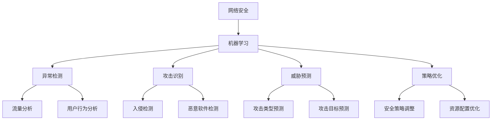

                 

### 《机器学习在网络安全中的防御策略》

> **关键词：** 机器学习、网络安全、防御策略、攻击手段、算法应用

> **摘要：** 本文深入探讨了机器学习在网络安全防御中的应用。从网络安全面临的主要挑战和机器学习基础入手，介绍了机器学习在网络安全中的作用和常见算法应用。接着，详细阐述了监督学习、无监督学习和深度学习在网络安全防御中的具体应用，并通过实际案例展示了如何构建有效的网络安全防御体系。最后，对未来的发展趋势和潜在挑战进行了展望。

### 目录大纲

#### 第一部分：背景与基础

1. **第1章：网络安全与机器学习概述**
    - 1.1 网络安全面临的挑战
    - 1.2 机器学习在网络安全中的作用
    - 1.3 机器学习的基础知识
    - 1.4 机器学习与网络安全的关系图解（Mermaid流程图）

2. **第2章：网络安全中的常见攻击手段**
    - 2.1 常见网络攻击类型
    - 2.2 攻击手段分析
    - 2.3 攻击手段与机器学习的关联

#### 第二部分：机器学习算法在网络安全中的应用

3. **第3章：监督学习算法在网络安全中的应用**
    - 3.1 监督学习基础
    - 3.2 分类算法在网络安全中的应用
        - 3.2.1 决策树算法
        - 3.2.2 支持向量机算法
        - 3.2.3 随机森林算法
    - 3.3 聚类算法在网络安全中的应用
        - 3.3.1 K-means算法
        - 3.3.2 层次聚类算法

4. **第4章：无监督学习算法在网络安全中的应用**
    - 4.1 无监督学习基础
    - 4.2 聚类算法在异常检测中的应用
        - 4.2.1 DBSCAN算法
        - 4.2.2 马尔可夫模型
    - 4.3 集成学习方法在网络安全中的应用

5. **第5章：深度学习算法在网络安全中的应用**
    - 5.1 深度学习基础
    - 5.2 卷积神经网络在网络安全中的应用
        - 5.2.1 卷积神经网络原理
        - 5.2.2 CNN在图像识别中的应用
    - 5.3 循环神经网络在网络安全中的应用
        - 5.3.1 RNN原理
        - 5.3.2 LSTM和GRU算法

#### 第三部分：防御策略与实战

6. **第6章：构建网络安全防御体系**
    - 6.1 防御策略概述
    - 6.2 防火墙技术
    - 6.3 入侵检测系统
    - 6.4 防病毒软件

7. **第7章：机器学习在网络安全防御中的实际应用**
    - 7.1 案例一：基于机器学习的钓鱼邮件检测系统
        - 7.1.1 系统设计
        - 7.1.2 数据准备与预处理
        - 7.1.3 模型训练与优化
        - 7.1.4 模型评估与部署
    - 7.2 案例二：基于深度学习的网络攻击识别系统
        - 7.2.1 系统设计
        - 7.2.2 数据准备与预处理
        - 7.2.3 模型训练与优化
        - 7.2.4 模型评估与部署

8. **第8章：未来趋势与展望**
    - 8.1 机器学习在网络安全领域的未来发展方向
    - 8.2 潜在挑战与解决方案
    - 8.3 技术创新对网络安全的影响

#### 附录：资源与工具

9. **A.1 开源机器学习框架介绍**
10. **A.2 网络安全数据库资源**
11. **A.3 实用工具与库推荐**

### 第一部分：背景与基础

#### 第1章：网络安全与机器学习概述

随着互联网和信息技术的高速发展，网络安全问题日益严峻。网络安全不仅关系到个人和企业数据的安全，还关系到国家信息安全和社会稳定。在这个数字化时代，如何应对网络安全挑战，保护信息资产成为亟待解决的问题。机器学习作为人工智能的一个重要分支，为网络安全提供了新的技术手段和策略。

##### 1.1 网络安全面临的挑战

网络安全面临的挑战主要包括以下几个方面：

1. **网络攻击手段多样化**：随着网络技术的不断演进，网络攻击手段也日益多样化。传统的网络攻击如DDoS、SQL注入、跨站脚本攻击等仍广泛存在，而新型攻击手段如高级持续性威胁（APT）、勒索软件等也给网络安全带来了巨大威胁。

2. **海量数据与隐私保护**：随着大数据时代的到来，网络数据量呈现爆炸式增长。如何在海量数据中保护个人隐私和数据安全成为网络安全的一大挑战。

3. **安全威胁的动态变化**：网络攻击者不断演变攻击策略，利用漏洞和零日攻击进行攻击。安全威胁的动态变化使得网络安全防护工作面临持续挑战。

4. **资源有限与威胁无限**：网络安全防护工作需要投入大量的人力、物力和财力，而攻击者利用少量资源即可进行大规模攻击。资源有限与威胁无限的矛盾使得网络安全防护工作更加艰难。

##### 1.2 机器学习在网络安全中的作用

机器学习在网络安全中具有重要作用，主要体现在以下几个方面：

1. **异常检测**：通过机器学习算法对网络流量、用户行为等数据进行异常检测，及时发现异常行为和潜在威胁。

2. **攻击识别**：利用机器学习算法对网络攻击行为进行建模和分析，提高攻击识别的准确性和效率。

3. **威胁预测**：通过分析历史攻击数据，利用机器学习算法预测潜在的攻击类型和目标，提前采取防御措施。

4. **安全策略优化**：利用机器学习算法对网络安全策略进行优化，提高防御体系的整体效能。

##### 1.3 机器学习的基础知识

1. **机器学习的基本概念**

   机器学习是一种使计算机系统从数据中学习规律和模式，从而进行预测和决策的技术。机器学习包括以下几个基本概念：

   - **数据集**：用于训练机器学习模型的输入数据集合。
   - **特征**：数据集中的每个属性或变量。
   - **标签**：数据集中的目标变量，用于训练模型进行预测。
   - **模型**：通过学习数据集的规律和模式生成的预测函数。

2. **机器学习的分类**

   根据学习方式的不同，机器学习可以分为以下几种类型：

   - **监督学习**：有标签数据进行训练，模型根据输入特征预测输出标签。
   - **无监督学习**：无标签数据进行训练，模型自动发现数据中的规律和模式。
   - **半监督学习**：部分有标签数据和大量无标签数据混合训练，提高模型的泛化能力。
   - **强化学习**：通过与环境交互学习最优策略，使模型在特定任务中取得最佳性能。

3. **常见机器学习算法**

   - **分类算法**：用于分类任务的机器学习算法，如决策树、支持向量机、随机森林等。
   - **聚类算法**：用于发现数据中相似性的机器学习算法，如K-means、层次聚类等。
   - **异常检测算法**：用于检测数据中异常或异常行为的算法，如孤立森林、本地异常因子等。

##### 1.4 机器学习与网络安全的关系图解



#### 第2章：网络安全中的常见攻击手段

网络安全中的常见攻击手段多种多样，了解这些攻击手段有助于更好地防范和应对网络安全威胁。本节将介绍几种常见的网络攻击类型及其分析。

##### 2.1 常见网络攻击类型

1. **DDoS攻击**：分布式拒绝服务攻击（DDoS）是一种通过大量虚假请求占用网络带宽和资源，使目标服务器无法响应正常请求的攻击。常见的DDoS攻击类型包括SYN flood、UDP flood、HTTP flood等。

2. **SQL注入**：SQL注入是一种通过在Web应用程序的输入字段中插入恶意的SQL代码，从而操纵数据库的攻击手段。攻击者可以利用SQL注入获取数据库中的敏感信息，甚至执行任意命令。

3. **跨站脚本攻击（XSS）**：跨站脚本攻击是一种利用Web应用程序漏洞，在用户浏览器中执行恶意脚本的攻击。XSS攻击可以分为反射型、存储型和基于DOM的三种类型。

4. **勒索软件**：勒索软件是一种恶意软件，通过加密用户文件或控制用户计算机，要求支付赎金以解锁文件或恢复控制。勒索软件常常通过钓鱼邮件、恶意下载等途径传播。

5. **高级持续性威胁（APT）**：高级持续性威胁是一种针对特定目标进行长期、隐蔽的网络攻击。APT攻击通常采用多种攻击手段，包括漏洞利用、内部网络渗透等，以达到窃取敏感信息或破坏目标系统的目的。

##### 2.2 攻击手段分析

1. **DDoS攻击分析**

   DDoS攻击的主要目的是使目标服务器过载，导致其无法正常提供服务。DDoS攻击的步骤通常包括：

   - **扫描和发现目标**：攻击者通过扫描目标网络的IP地址，发现未受保护的服务器。
   - **组建僵尸网络**：攻击者利用恶意软件感染大量主机，形成僵尸网络，以实现对目标服务器的攻击。
   - **发送大量请求**：攻击者通过僵尸网络向目标服务器发送大量虚假请求，占满网络带宽和服务器资源。

   针对DDoS攻击，可以采取以下防御措施：

   - **流量清洗**：通过部署流量清洗设备或服务，过滤掉恶意流量，减轻目标服务器的压力。
   - **带宽扩容**：增加目标服务器的带宽，提高其处理大量请求的能力。
   - **防火墙和ACL**：配置防火墙和访问控制列表（ACL），限制来自可疑IP地址的访问。

2. **SQL注入分析**

   SQL注入是一种利用Web应用程序漏洞，在输入字段中插入恶意SQL代码的攻击手段。SQL注入的步骤通常包括：

   - **发现漏洞**：攻击者通过输入特殊字符，如单引号、百分号等，尝试发现Web应用程序中的SQL注入漏洞。
   - **构造恶意SQL语句**：攻击者根据发现的漏洞，构造恶意的SQL语句，如联合查询（Union Query）、盲注（Blind SQL Injection）等。
   - **执行恶意SQL语句**：攻击者通过构造的恶意SQL语句，获取数据库中的敏感信息或执行任意命令。

   针对SQL注入，可以采取以下防御措施：

   - **参数化查询**：使用参数化查询，将用户输入作为参数传递给数据库，防止恶意SQL代码的注入。
   - **输入验证**：对用户输入进行严格的验证和过滤，排除特殊字符和非法输入。
   - **使用安全编码实践**：遵循安全编码规范，避免使用动态SQL语句，减少SQL注入的风险。

3. **XSS攻击分析**

   XSS攻击是一种在用户浏览器中执行恶意脚本的攻击手段。XSS攻击的步骤通常包括：

   - **发现漏洞**：攻击者通过输入特殊字符，如双引号、单引号等，尝试发现Web应用程序中的XSS漏洞。
   - **构造恶意脚本**：攻击者根据发现的漏洞，构造恶意的脚本，如存储型XSS、反射型XSS等。
   - **诱导用户点击**：攻击者通过发送恶意链接、恶意邮件等诱导用户点击，触发恶意脚本的执行。

   针对XSS攻击，可以采取以下防御措施：

   - **输出编码**：对输出内容进行编码，防止特殊字符引起脚本执行。
   - **使用内容安全策略（CSP）**：配置内容安全策略，限制浏览器执行外部脚本。
   - **输入验证**：对用户输入进行严格的验证和过滤，排除特殊字符和非法输入。

4. **勒索软件分析**

   勒索软件是一种通过加密用户文件或控制用户计算机，要求支付赎金以解锁文件或恢复控制的恶意软件。勒索软件的传播途径通常包括：

   - **钓鱼邮件**：攻击者发送包含恶意附件或链接的钓鱼邮件，诱使用户下载并执行勒索软件。
   - **恶意下载**：攻击者通过在网站上嵌入恶意代码或利用漏洞，诱导用户下载勒索软件。
   - **远程桌面攻击**：攻击者通过远程桌面工具入侵用户计算机，安装并运行勒索软件。

   针对勒索软件，可以采取以下防御措施：

   - **备份重要数据**：定期备份重要数据，以防止勒索软件的破坏。
   - **使用防病毒软件**：安装并更新防病毒软件，防止勒索软件的感染。
   - **安全意识培训**：加强对用户的网络安全意识培训，避免点击可疑链接和下载不明来源的软件。

5. **APT攻击分析**

   APT攻击是一种针对特定目标进行长期、隐蔽的网络攻击。APT攻击的步骤通常包括：

   - **侦察和情报收集**：攻击者通过侦察目标网络，收集目标网络的结构、弱点和潜在目标信息。
   - **漏洞利用**：攻击者利用目标网络的漏洞，实现入侵目标网络或系统。
   - **内部渗透**：攻击者通过内部网络渗透，扩大攻击范围，窃取敏感信息或执行其他恶意操作。
   - **长期控制**：攻击者通过安装后门和持久化手段，实现对目标网络或系统的长期控制。

   针对APT攻击，可以采取以下防御措施：

   - **安全审计**：定期进行安全审计，发现和修复网络和系统的安全漏洞。
   - **入侵检测**：部署入侵检测系统，实时监控网络流量和系统行为，及时发现潜在威胁。
   - **用户培训**：加强对用户的网络安全意识培训，避免被攻击者利用社会工程学手段入侵网络。

##### 2.3 攻击手段与机器学习的关联

机器学习在网络安全中的应用，使得攻击手段与机器学习算法之间的关联更加紧密。以下是一些典型的关联：

1. **异常检测与机器学习**：机器学习算法可以通过对网络流量、用户行为等数据的学习，识别出异常行为和潜在威胁。例如，利用孤立森林算法进行异常流量检测，通过聚类算法发现恶意软件的异常行为等。

2. **攻击识别与机器学习**：机器学习算法可以通过对历史攻击数据的学习，识别出不同类型的攻击特征。例如，利用决策树算法进行入侵检测，通过支持向量机算法进行恶意软件分类等。

3. **威胁预测与机器学习**：机器学习算法可以通过对历史攻击数据和学习当前网络环境，预测潜在的攻击类型和目标。例如，利用时间序列分析算法进行攻击趋势预测，通过深度学习算法进行攻击意图识别等。

4. **安全策略优化与机器学习**：机器学习算法可以通过对网络流量、安全事件等数据的学习，优化安全策略和资源配置。例如，利用聚类算法进行流量分类，通过机器学习算法进行安全事件关联分析等。

#### 第二部分：机器学习算法在网络安全中的应用

##### 第3章：监督学习算法在网络安全中的应用

监督学习算法在网络安全领域具有广泛的应用，其核心在于通过已标记的训练数据，构建一个模型，从而对未知数据进行分类或预测。本节将介绍几种常见的监督学习算法及其在网络安全中的应用。

##### 3.1 监督学习基础

监督学习算法可以分为两大类：分类算法和回归算法。分类算法用于将数据分为不同的类别，而回归算法则用于预测一个连续的数值。

1. **分类算法**

   - **决策树**：决策树是一种基于树形结构进行决策的算法，通过递归地将数据划分为子集，直到满足停止条件。常见的决策树算法包括ID3、C4.5和CART。

   - **支持向量机（SVM）**：支持向量机是一种二类分类方法，其目标是找到一个最佳的超平面，将两类数据点分隔开来。常见的SVM算法包括线性SVM和核SVM。

   - **随机森林**：随机森林是一种集成学习方法，通过构建多棵决策树，并对这些树的预测结果进行投票，从而提高分类和预测的准确性。

2. **回归算法**

   - **线性回归**：线性回归是一种通过拟合一条直线，预测一个连续数值的算法。常见的线性回归算法包括简单线性回归和多元线性回归。

   - **回归树**：回归树是一种基于树形结构进行回归的算法，通过递归地将数据划分为子集，直到满足停止条件。常见的回归树算法包括回归决策树和回归随机森林。

##### 3.2 分类算法在网络安全中的应用

分类算法在网络安全中的应用主要包括入侵检测、恶意软件分类和钓鱼邮件检测等。

1. **决策树算法在网络安全中的应用**

   决策树算法是一种简单而强大的分类算法，它通过一系列的决策路径，将数据划分为不同的类别。以下是一个决策树算法在入侵检测中的应用实例：

   ```mermaid
   graph TD
   A[网络流量] --> B[是否为异常流量]
   B -->|是| C[是否存在恶意行为]
   B -->|否| D[是否存在异常特征]
   C -->|是| E[阻断流量]
   C -->|否| F[继续监控]
   D -->|是| G[阻断流量]
   D -->|否| H[继续监控]
   ```

   在此实例中，决策树通过分析网络流量数据，判断其是否为异常流量。如果是异常流量，则进一步判断是否存在恶意行为。如果存在恶意行为，则阻断流量；否则，继续监控。

2. **支持向量机算法在网络安全中的应用**

   支持向量机算法是一种强大的分类算法，它通过寻找最佳的超平面，将两类数据点分隔开来。以下是一个支持向量机算法在恶意软件分类中的应用实例：

   ```latex
   \text{最大化} \sum_{i=1}^{n} w_i - \frac{1}{2} \sum_{i,j=1}^{n} w_i w_j \cdot y_i y_j
   \text{约束条件：} \ y_i (w \cdot x_i + b) \geq 1
   ```

   在此实例中，支持向量机通过训练数据集，寻找一个最佳的超平面，将恶意软件和正常软件分隔开来。如果新的数据点位于超平面的一侧，则将其分类为恶意软件；否则，分类为正常软件。

3. **随机森林算法在网络安全中的应用**

   随机森林算法是一种基于集成学习的分类算法，它通过构建多棵决策树，并对这些树的预测结果进行投票，从而提高分类和预测的准确性。以下是一个随机森林算法在钓鱼邮件检测中的应用实例：

   ```mermaid
   graph TD
   A[邮件内容] --> B[是否为钓鱼邮件]
   B -->|是| C[邮件来源是否可疑]
   B -->|否| D[邮件内容是否诱骗]
   C -->|是| E[标记为钓鱼邮件]
   C -->|否| F[标记为正常邮件]
   D -->|是| G[标记为钓鱼邮件]
   D -->|否| H[标记为正常邮件]
   ```

   在此实例中，随机森林通过分析邮件内容，判断其是否为钓鱼邮件。通过多棵决策树的投票结果，提高钓鱼邮件检测的准确性。

##### 3.3 聚类算法在网络安全中的应用

聚类算法在网络安全中的应用主要包括流量聚类和用户行为聚类等。

1. **K-means算法在网络安全中的应用**

   K-means算法是一种基于距离度量的聚类算法，它通过迭代地将数据点分配到最近的聚类中心，直到收敛。以下是一个K-means算法在流量聚类中的应用实例：

   ```mermaid
   graph TD
   A[网络流量数据] --> B[初始化聚类中心]
   B --> C[分配数据点到聚类中心]
   C --> D[计算新的聚类中心]
   D --> E{是否收敛}
   E -->|是| F[结束]
   E -->|否| B[返回C]
   ```

   在此实例中，K-means算法通过分析网络流量数据，将其划分为不同的聚类，从而识别出异常流量。

2. **层次聚类算法在网络安全中的应用**

   层次聚类算法是一种基于层次结构的聚类算法，它通过递归地将数据点合并或划分为不同的聚类。以下是一个层次聚类算法在用户行为聚类中的应用实例：

   ```mermaid
   graph TB
   A[用户行为数据] --> B[初始化聚类层次]
   B --> C[合并或划分聚类]
   C --> D{是否达到终止条件}
   D -->|是| E[结束]
   D -->|否| F[返回C]
   ```

   在此实例中，层次聚类算法通过分析用户行为数据，将其划分为不同的聚类，从而识别出异常用户行为。

#### 第4章：无监督学习算法在网络安全中的应用

无监督学习算法在网络安全中的应用主要涉及异常检测、数据聚类和用户行为分析等方面。与监督学习算法相比，无监督学习算法不依赖于已标记的训练数据，而是通过探索数据内在的结构和规律，从而发现潜在的异常和模式。以下将介绍几种常见的无监督学习算法及其在网络安全中的应用。

##### 4.1 无监督学习基础

无监督学习算法主要分为两类：聚类算法和降维算法。

1. **聚类算法**

   聚类算法用于将相似的数据点划分为同一类别，从而发现数据中的内在结构。常见的聚类算法包括K-means算法、层次聚类算法和DBSCAN算法。

   - **K-means算法**：K-means算法是一种基于距离度量的聚类算法，其目标是找到一个最佳的聚类个数，将数据点划分为K个簇。算法步骤如下：

     ```mermaid
     graph TD
     A[初始化聚类中心] --> B[计算每个数据点到聚类中心的距离]
     B --> C[分配数据点到最近的聚类中心]
     C --> D[计算新的聚类中心]
     D --> E{是否收敛}
     E -->|是| F[结束]
     E -->|否| A[返回B]
     ```

   - **层次聚类算法**：层次聚类算法是一种基于层次结构的聚类算法，其目标是构建一个聚类层次树，从而将数据点划分为不同的聚类。算法步骤如下：

     ```mermaid
     graph TB
     A[初始化聚类层次] --> B[合并或划分聚类]
     B --> C{是否达到终止条件}
     C -->|是| D[结束]
     C -->|否| E[返回B]
     ```

   - **DBSCAN算法**：DBSCAN算法是一种基于密度的聚类算法，其目标是发现数据中的密集区域和边界区域。算法步骤如下：

     ```mermaid
     graph TB
     A[初始化聚类核心点] --> B[计算每个核心点的邻域]
     B --> C[分配非核心点到核心点]
     C --> D{是否达到终止条件}
     D -->|是| E[结束]
     D -->|否| F[返回A]
     ```

2. **降维算法**

   降维算法用于减少数据维度，从而简化数据分析和处理。常见的降维算法包括主成分分析（PCA）和t-SNE算法。

   - **主成分分析（PCA）**：PCA算法是一种线性降维算法，其目标是在保留数据主要信息的前提下，将数据投影到低维空间。算法步骤如下：

     ```mermaid
     graph TD
     A[计算协方差矩阵] --> B[计算特征值和特征向量]
     B --> C[排序特征值和特征向量]
     C --> D[选择主成分]
     D --> E[投影数据到低维空间]
     ```

   - **t-SNE算法**：t-SNE算法是一种非线性降维算法，其目标是在低维空间中保持数据点之间的相似性。算法步骤如下：

     ```mermaid
     graph TD
     A[计算相似性矩阵] --> B[初始化高斯分布]
     B --> C[计算局部梯度]
     C --> D[更新低维空间分布]
     D --> E{是否收敛}
     E -->|是| F[结束]
     E -->|否| G[返回C]
     ```

##### 4.2 聚类算法在异常检测中的应用

聚类算法在异常检测中的应用主要包括基于密度的异常检测和基于分布的异常检测。

1. **基于密度的异常检测**

   基于密度的异常检测算法通过识别数据中的稀疏区域来检测异常。DBSCAN算法是一种典型的基于密度的异常检测算法，其步骤如下：

   - **初始化核心点**：选择密度较高的数据点作为核心点。
   - **计算邻域**：计算每个核心点的邻域，包括核心点本身及其直接邻域。
   - **分配非核心点**：将非核心点分配到其邻域内的核心点。
   - **识别异常**：检测到孤立点或稀疏区域，将其识别为异常。

   以下是一个DBSCAN算法在网络安全中的异常检测实例：

   ```mermaid
   graph TD
   A[网络流量数据] --> B[初始化核心点]
   B --> C[计算每个核心点的邻域]
   C --> D[分配非核心点到核心点]
   D --> E{是否识别异常}
   E -->|是| F[结束]
   E -->|否| G[返回D]
   ```

2. **基于分布的异常检测**

   基于分布的异常检测算法通过比较数据点的分布特征来判断其是否异常。孤立森林算法是一种基于分布的异常检测算法，其步骤如下：

   - **构建孤立森林**：随机选择特征和切分点，构建多个孤立森林。
   - **计算深度**：计算每个数据点在孤立森林中的深度。
   - **识别异常**：检测深度较大的数据点，将其识别为异常。

   以下是一个孤立森林算法在网络安全中的异常检测实例：

   ```mermaid
   graph TD
   A[网络流量数据] --> B[构建孤立森林]
   B --> C[计算每个数据点的深度]
   C --> D{是否识别异常}
   D -->|是| E[结束]
   D -->|否| F[返回C]
   ```

##### 4.3 集成学习方法在网络安全中的应用

集成学习方法通过组合多个基学习器，提高模型的准确性和泛化能力。常见的集成学习方法包括Bagging、Boosting和Stacking等。

1. **Bagging方法**

   Bagging方法通过从训练数据中随机抽样，构建多个基学习器，并对这些学习器的预测结果进行平均或投票，从而提高模型的准确性。以下是一个Bagging方法在网络安全中的应用实例：

   ```mermaid
   graph TD
   A[训练数据集] --> B[构建多个基学习器]
   B --> C[对基学习器的预测结果进行平均或投票]
   ```

2. **Boosting方法**

   Boosting方法通过改变训练数据集中各样本的权重，重点关注错误率较高的样本，从而提高模型的准确性。常见的Boosting算法包括AdaBoost和XGBoost等。以下是一个AdaBoost方法在网络安全中的应用实例：

   ```mermaid
   graph TD
   A[训练数据集] --> B[初始化权重]
   B --> C[训练基学习器]
   C --> D[更新权重]
   D --> E{是否达到终止条件}
   E -->|是| F[结束]
   E -->|否| G[返回C]
   ```

3. **Stacking方法**

   Stacking方法通过将多个基学习器整合为一个集成学习器，从而提高模型的准确性。以下是一个Stacking方法在网络安全中的应用实例：

   ```mermaid
   graph TD
   A[训练数据集] --> B[训练多个基学习器]
   B --> C[构建Stacking模型]
   C --> D[对基学习器的预测结果进行集成]
   ```

#### 第5章：深度学习算法在网络安全中的应用

深度学习算法在网络安全领域中具有广泛的应用潜力，尤其在处理大量复杂数据和模式识别方面表现出色。本章节将探讨深度学习算法的基本概念以及在网络安全中的应用，包括卷积神经网络（CNN）和循环神经网络（RNN）在网络安全中的应用。

##### 5.1 深度学习基础

深度学习是一种基于多层神经网络的结构，旨在通过多层非线性变换自动提取数据特征，从而实现复杂任务的自动学习。以下是深度学习的基础知识：

1. **神经网络**

   神经网络是一种由多个神经元（或节点）组成的信息处理模型，每个神经元接收输入、应用一个非线性激活函数，并产生输出。神经网络的核心是权重和偏置，它们决定了输入数据如何通过网络传递和处理。

2. **激活函数**

   激活函数是神经网络中用于引入非线性特性的函数，常见的激活函数包括Sigmoid、ReLU和Tanh等。激活函数的选择对网络的性能和收敛速度有很大影响。

3. **反向传播算法**

   反向传播算法是一种用于训练神经网络的优化算法，通过计算输出误差的梯度，逐步调整网络的权重和偏置，以最小化误差函数。

4. **深度神经网络**

   深度神经网络（Deep Neural Network, DNN）包含多个隐藏层，相比于单层神经网络，可以提取更复杂的数据特征。深度神经网络在图像识别、语音识别和自然语言处理等领域取得了显著的成果。

##### 5.2 卷积神经网络在网络安全中的应用

卷积神经网络（Convolutional Neural Network, CNN）是一种专门用于处理图像数据的神经网络，其核心在于卷积层，可以有效地提取图像的特征。以下是CNN在网络安全中的应用：

1. **图像识别**

   CNN在网络安全中可用于识别和分类恶意软件的图像，从而检测恶意行为。以下是一个CNN在图像识别中的应用实例：

   ```mermaid
   graph TD
   A[恶意软件图像] --> B[输入层]
   B --> C[卷积层1]
   C --> D[ReLU激活函数]
   D --> E[池化层1]
   E --> F[卷积层2]
   F --> G[ReLU激活函数]
   G --> H[池化层2]
   H --> I[全连接层1]
   I --> J[ReLU激活函数]
   J --> K[输出层]
   K --> L[分类结果]
   ```

2. **恶意软件分类**

   CNN可以用于分类不同类型的恶意软件，从而提高检测的准确性。以下是一个CNN在恶意软件分类中的应用实例：

   ```mermaid
   graph TD
   A[恶意软件特征向量] --> B[输入层]
   B --> C[卷积层1]
   C --> D[ReLU激活函数]
   D --> E[池化层1]
   E --> F[卷积层2]
   F --> G[ReLU激活函数]
   G --> H[池化层2]
   H --> I[全连接层1]
   I --> J[ReLU激活函数]
   J --> K[输出层]
   K --> L[分类结果]
   ```

##### 5.3 循环神经网络在网络安全中的应用

循环神经网络（Recurrent Neural Network, RNN）是一种能够处理序列数据的神经网络，其核心在于循环结构，可以捕捉数据序列中的时间依赖关系。以下是RNN在网络安全中的应用：

1. **攻击序列识别**

   RNN可以用于识别网络攻击的序列模式，从而检测潜在的威胁。以下是一个RNN在攻击序列识别中的应用实例：

   ```mermaid
   graph TD
   A[网络流量序列] --> B[输入层]
   B --> C[嵌入层]
   C --> D[循环层1]
   D --> E[ReLU激活函数]
   E --> F[循环层2]
   F --> G[全连接层1]
   G --> H[ReLU激活函数]
   H --> I[输出层]
   I --> J[分类结果]
   ```

2. **用户行为分析**

   RNN可以用于分析用户的网络行为，从而识别异常行为。以下是一个RNN在用户行为分析中的应用实例：

   ```mermaid
   graph TD
   A[用户行为序列] --> B[输入层]
   B --> C[嵌入层]
   C --> D[循环层1]
   D --> E[ReLU激活函数]
   E --> F[循环层2]
   F --> G[全连接层1]
   G --> H[ReLU激活函数]
   H --> I[输出层]
   I --> J[分类结果]
   ```

##### 5.4 深度学习算法在网络安全中的挑战与优化

尽管深度学习算法在网络安全中显示出巨大的潜力，但其在实际应用中仍然面临一些挑战：

1. **数据隐私**：网络安全数据通常包含敏感信息，如何在训练和保护隐私之间取得平衡是一个重要问题。

2. **数据标注**：深度学习模型的训练需要大量的标注数据，而网络安全数据标注通常具有挑战性，需要专业知识和大量时间。

3. **模型解释性**：深度学习模型的“黑箱”特性使得其难以解释和理解，这对于安全防护策略的制定和优化带来困难。

4. **计算资源**：深度学习算法通常需要大量的计算资源，尤其是对于大规模数据和复杂的模型，这对硬件设施和成本提出了较高要求。

为了克服这些挑战，以下是一些优化策略：

1. **联邦学习**：联邦学习通过在分布式设备上训练模型，保护数据隐私，并减少对中心化数据存储的需求。

2. **半监督学习**：半监督学习利用未标记的数据，结合少量标注数据，提高模型的训练效率。

3. **模型压缩**：模型压缩技术如知识蒸馏、剪枝和量化可以减少模型的复杂度和计算资源需求。

4. **自动化机器学习（AutoML）**：自动化机器学习通过自动化模型选择、超参数优化和模型评估，提高模型训练的效率和质量。

#### 第6章：构建网络安全防御体系

构建一个有效的网络安全防御体系是保护信息系统免受各种威胁的关键。机器学习在这一过程中发挥了至关重要的作用，通过提供自动化的异常检测、威胁识别和防御策略优化，提高了整个防御体系的效率和效果。本节将介绍构建网络安全防御体系的基本原则和关键技术，包括防火墙、入侵检测系统、防病毒软件以及机器学习在这些技术中的应用。

##### 6.1 防御策略概述

构建网络安全防御体系的目标是多层次、多维度地保护网络资源，确保数据的机密性、完整性和可用性。以下是构建防御体系的基本原则：

1. **多层次防御**：采用多层次的防御策略，从网络边界、内部网络和应用程序层面全方位保护系统。
2. **动态适应**：随着网络攻击手段的不断演变，防御体系需要具备动态适应能力，及时更新和优化防御策略。
3. **协同防护**：不同防御组件之间需要协同工作，共享威胁情报和防御策略，形成整体防御体系。
4. **用户参与**：提高用户的网络安全意识，通过教育宣传和培训，使员工能够识别和应对常见的网络安全威胁。

##### 6.2 防火墙技术

防火墙是网络安全防御体系中的第一道防线，用于控制进出网络的流量，防止未经授权的访问。防火墙技术可以分为以下几种类型：

1. **包过滤防火墙**：根据预先定义的规则，检查每个数据包的源地址、目的地址、端口号等信息，允许或拒绝数据包的传输。
2. **状态检测防火墙**：除了包过滤功能外，还跟踪网络连接的状态，对连接的生命周期进行管理。
3. **应用层网关防火墙**：位于应用层，能够分析应用层的数据包内容，提供更细粒度的访问控制。

防火墙与机器学习的结合在于利用机器学习算法进行规则优化和异常检测。例如，通过监督学习算法，可以自动识别和生成防火墙规则，减少人工干预；通过无监督学习算法，可以检测异常流量，提高防火墙的响应速度。

##### 6.3 入侵检测系统

入侵检测系统（Intrusion Detection System, IDS）是一种监控网络流量和系统行为，识别潜在入侵和异常活动的技术。IDS可以分为以下两种类型：

1. **网络入侵检测系统（NIDS）**：分析网络流量，检测网络中的异常流量模式和攻击行为。
2. **主机入侵检测系统（HIDS）**：监控主机系统的日志和活动，检测恶意软件和异常行为。

机器学习在入侵检测中的应用主要包括：

- **异常检测**：利用无监督学习算法，如K-means、孤立森林等，识别出网络流量或系统行为的异常模式。
- **攻击识别**：利用监督学习算法，如决策树、支持向量机等，对已知的攻击行为进行分类和识别。
- **威胁预测**：利用时间序列分析算法，如LSTM、GRU等，预测潜在的攻击趋势和目标。

##### 6.4 防病毒软件

防病毒软件是用于检测和防止恶意软件感染的网络安全工具。传统的防病毒软件主要依赖签名匹配技术，即通过比对已知恶意软件的签名来检测新出现的恶意软件。

机器学习在防病毒软件中的应用主要包括：

- **行为分析**：利用监督学习算法，如决策树、随机森林等，分析恶意软件的行为特征，检测未知恶意软件。
- **异常检测**：利用无监督学习算法，如K-means、孤立森林等，识别出应用程序的异常行为。
- **威胁预测**：利用时间序列分析算法，如LSTM、GRU等，预测潜在的威胁和攻击行为。

##### 6.5 机器学习在防御体系中的应用

机器学习在网络安全防御体系中的应用体现在以下几个方面：

1. **自动化响应**：通过机器学习算法，可以自动化地识别和响应网络攻击，提高防御体系的响应速度和准确性。
2. **策略优化**：利用机器学习算法，可以分析网络流量、系统行为和攻击特征，优化安全策略和资源配置。
3. **威胁情报共享**：通过机器学习算法，可以从大量数据中提取威胁情报，实现跨组织、跨区域的威胁情报共享和协作。
4. **用户行为分析**：利用机器学习算法，可以分析用户行为，识别出潜在的内部威胁和异常行为。

总之，构建一个有效的网络安全防御体系需要综合运用多种技术，特别是将机器学习与传统的网络安全技术相结合，实现多层次、动态适应的防御策略。通过不断优化和更新防御体系，可以更好地应对日益复杂的网络安全威胁。

#### 第7章：机器学习在网络安全防御中的实际应用

##### 7.1 案例一：基于机器学习的钓鱼邮件检测系统

钓鱼邮件是一种常见的社会工程攻击手段，攻击者通过伪装成合法的邮件发送者，诱骗用户点击恶意链接或下载恶意附件，从而窃取用户敏感信息。基于机器学习的钓鱼邮件检测系统可以利用大规模的数据和先进的算法，有效地识别和防范钓鱼邮件。

###### 7.1.1 系统设计

钓鱼邮件检测系统的设计主要包括数据收集、数据预处理、模型训练、模型评估和模型部署等步骤。

1. **数据收集**：收集大量钓鱼邮件和非钓鱼邮件数据，确保数据的多样性和代表性。
2. **数据预处理**：对收集到的邮件数据进行预处理，包括去除重复数据、去除停用词、分词和词性标注等。
3. **特征提取**：从预处理后的邮件数据中提取特征，如邮件标题、正文、发件人、收件人、邮件大小等。
4. **模型训练**：利用提取到的特征，使用监督学习算法（如决策树、支持向量机、神经网络等）训练钓鱼邮件检测模型。
5. **模型评估**：通过交叉验证和测试集评估模型的准确率、召回率、F1分数等指标，优化模型参数。
6. **模型部署**：将训练好的模型部署到邮件服务器或安全网关上，实现对实时邮件的自动检测和分类。

###### 7.1.2 数据准备与预处理

数据准备与预处理是构建高效钓鱼邮件检测系统的关键步骤。以下是一个具体的数据准备与预处理流程：

1. **数据收集**：从开源钓鱼邮件数据集（如Phishing Corpus）和公共邮件数据库中收集大量钓鱼邮件和非钓鱼邮件。
2. **数据清洗**：去除重复邮件、缺失值和无关信息，确保数据的一致性和完整性。
3. **文本预处理**：对邮件文本进行分词、去停用词和词性标注，将原始文本转换为数字特征表示。
4. **特征提取**：从预处理后的邮件文本中提取特征，如词频、词向量和句法结构等。
5. **数据标准化**：对提取到的特征进行归一化或标准化处理，使其在数值范围内具有相似的重要性。

以下是一个使用Python进行邮件数据预处理的示例代码：

```python
import pandas as pd
from sklearn.feature_extraction.text import TfidfVectorizer
from nltk.tokenize import word_tokenize
from nltk.corpus import stopwords

# 加载邮件数据
data = pd.read_csv('email_data.csv')

# 去除停用词
stop_words = set(stopwords.words('english'))
def remove_stopwords(text):
    words = word_tokenize(text)
    filtered_words = [word for word in words if word.lower() not in stop_words]
    return ' '.join(filtered_words)

# 预处理邮件文本
data['preprocessed_text'] = data['text'].apply(remove_stopwords)

# 提取词频特征
vectorizer = TfidfVectorizer()
X = vectorizer.fit_transform(data['preprocessed_text'])
```

###### 7.1.3 模型训练与优化

在模型训练与优化阶段，我们需要选择合适的机器学习算法，并调整模型的参数，以提高检测性能。以下是一个基于决策树算法的钓鱼邮件检测系统的训练与优化流程：

1. **选择算法**：选择决策树算法作为初步的模型，因为它简单且易于理解。
2. **训练模型**：使用训练集数据训练决策树模型，计算每个特征的增益和分裂点。
3. **交叉验证**：通过交叉验证评估模型的性能，避免过拟合。
4. **参数调整**：调整模型参数（如最大深度、最小分割样本数等），以优化模型性能。
5. **模型评估**：使用测试集评估模型的准确率、召回率和F1分数等指标。

以下是一个使用Python进行决策树模型训练与优化的示例代码：

```python
from sklearn.tree import DecisionTreeClassifier
from sklearn.model_selection import train_test_split, GridSearchCV

# 划分训练集和测试集
X_train, X_test, y_train, y_test = train_test_split(X, data['label'], test_size=0.2, random_state=42)

# 训练决策树模型
clf = DecisionTreeClassifier()
clf.fit(X_train, y_train)

# 交叉验证
from sklearn.model_selection import cross_val_score
scores = cross_val_score(clf, X_train, y_train, cv=5)
print("Cross-validation scores:", scores)

# 参数调整
param_grid = {'max_depth': [3, 5, 10], 'min_samples_split': [2, 5, 10]}
grid_search = GridSearchCV(clf, param_grid, cv=5)
grid_search.fit(X_train, y_train)

# 优化后的模型
best_clf = grid_search.best_estimator_

# 模型评估
from sklearn.metrics import accuracy_score, recall_score, f1_score
y_pred = best_clf.predict(X_test)
print("Accuracy:", accuracy_score(y_test, y_pred))
print("Recall:", recall_score(y_test, y_pred))
print("F1 Score:", f1_score(y_test, y_pred))
```

###### 7.1.4 模型评估与部署

模型评估是确保钓鱼邮件检测系统性能的重要步骤。通过评估模型的准确率、召回率和F1分数等指标，我们可以确定模型的性能是否达到预期。

1. **模型评估**：使用测试集评估模型的性能，计算准确率、召回率和F1分数等指标。
2. **性能优化**：根据评估结果，对模型进行调整和优化，以提高性能。
3. **模型部署**：将训练好的模型部署到邮件服务器或安全网关上，实现对实时邮件的自动检测和分类。

以下是一个使用Python进行模型评估和部署的示例代码：

```python
# 模型评估
from sklearn.metrics import classification_report
print(classification_report(y_test, y_pred))

# 模型部署
import joblib
joblib.dump(best_clf, 'phishing_detector.pkl')

# 部署到邮件服务器或安全网关
def detect_phishing(email_text):
    vectorizer = TfidfVectorizer()
    X = vectorizer.transform([email_text])
    prediction = best_clf.predict(X)
    return 'Phishing' if prediction == 1 else 'Non-phishing'

# 实时检测邮件
email = "这是一封可能含有钓鱼链接的邮件"
print(detect_phishing(email))
```

##### 7.2 案例二：基于深度学习的网络攻击识别系统

网络攻击识别系统是网络安全防御体系的重要组成部分，用于实时监测和识别网络中的攻击行为。基于深度学习的网络攻击识别系统可以利用深度学习算法的强大特征提取和模式识别能力，提高攻击识别的准确性和效率。

###### 7.2.1 系统设计

网络攻击识别系统的设计主要包括数据收集、数据预处理、模型训练、模型评估和模型部署等步骤。

1. **数据收集**：收集网络流量数据，包括正常流量和攻击流量，确保数据的多样性和代表性。
2. **数据预处理**：对收集到的网络流量数据进行预处理，包括流量特征提取、数据归一化和异常值处理等。
3. **模型训练**：使用深度学习算法（如卷积神经网络、循环神经网络等）训练网络攻击识别模型。
4. **模型评估**：通过交叉验证和测试集评估模型的性能，计算准确率、召回率和F1分数等指标。
5. **模型部署**：将训练好的模型部署到网络流量分析系统中，实现对实时流量的实时监测和攻击识别。

###### 7.2.2 数据准备与预处理

数据准备与预处理是构建高效网络攻击识别系统的关键步骤。以下是一个具体的数据准备与预处理流程：

1. **数据收集**：从开源网络攻击数据集（如Kaggle的NSL-KDD数据集）和实际网络监控系统中收集网络流量数据。
2. **数据清洗**：去除重复数据、缺失值和噪声数据，确保数据的一致性和完整性。
3. **特征提取**：从原始网络流量数据中提取特征，如连接时间、传输速率、数据包长度、协议类型等。
4. **数据归一化**：对提取到的特征进行归一化处理，使其在数值范围内具有相似的重要性。
5. **数据分割**：将数据集分割为训练集、验证集和测试集，用于模型训练和评估。

以下是一个使用Python进行网络流量数据预处理的示例代码：

```python
import pandas as pd
from sklearn.model_selection import train_test_split

# 加载网络流量数据
data = pd.read_csv('network_traffic_data.csv')

# 数据清洗
data.drop_duplicates(inplace=True)
data.dropna(inplace=True)

# 特征提取
data['duration'] = data['timestamp'].diff().abs()
data['bytes'] = data['bytes'].diff().abs()
data['packets'] = data['packets'].diff().abs()

# 数据归一化
from sklearn.preprocessing import StandardScaler
scaler = StandardScaler()
data[['duration', 'bytes', 'packets']] = scaler.fit_transform(data[['duration', 'bytes', 'packets']])

# 数据分割
X = data[['duration', 'bytes', 'packets']]
y = data['label']
X_train, X_test, y_train, y_test = train_test_split(X, y, test_size=0.2, random_state=42)
```

###### 7.2.3 模型训练与优化

在模型训练与优化阶段，我们需要选择合适的深度学习算法，并调整模型的参数，以提高识别性能。以下是一个基于卷积神经网络（CNN）的网络攻击识别系统的训练与优化流程：

1. **选择算法**：选择卷积神经网络作为初步的模型，因为它在特征提取和模式识别方面表现出色。
2. **模型架构设计**：设计卷积神经网络架构，包括输入层、卷积层、池化层、全连接层和输出层。
3. **训练模型**：使用训练集数据训练卷积神经网络模型，计算每个神经元的权重和偏置。
4. **交叉验证**：通过交叉验证评估模型的性能，避免过拟合。
5. **参数调整**：调整模型参数（如卷积核大小、池化窗口大小、学习率等），以优化模型性能。
6. **模型评估**：使用测试集评估模型的性能，计算准确率、召回率和F1分数等指标。

以下是一个使用Python和TensorFlow进行卷积神经网络模型训练与优化的示例代码：

```python
import tensorflow as tf
from tensorflow.keras.models import Sequential
from tensorflow.keras.layers import Conv1D, MaxPooling1D, Flatten, Dense

# 构建卷积神经网络模型
model = Sequential()
model.add(Conv1D(filters=32, kernel_size=3, activation='relu', input_shape=(X_train.shape[1], 1)))
model.add(MaxPooling1D(pool_size=2))
model.add(Conv1D(filters=64, kernel_size=3, activation='relu'))
model.add(MaxPooling1D(pool_size=2))
model.add(Flatten())
model.add(Dense(units=128, activation='relu'))
model.add(Dense(units=1, activation='sigmoid'))

# 编译模型
model.compile(optimizer='adam', loss='binary_crossentropy', metrics=['accuracy'])

# 训练模型
model.fit(X_train, y_train, epochs=10, batch_size=32, validation_data=(X_test, y_test))

# 交叉验证
from sklearn.model_selection import cross_val_score
scores = cross_val_score(model, X_train, y_train, cv=5)
print("Cross-validation scores:", scores)

# 参数调整
from tensorflow.keras.wrappers.scikit_learn import KerasClassifier
from sklearn.model_selection import GridSearchCV

# 定义模型
def create_model(optimizer='adam'):
    model = Sequential()
    model.add(Conv1D(filters=32, kernel_size=3, activation='relu', input_shape=(X_train.shape[1], 1)))
    model.add(MaxPooling1D(pool_size=2))
    model.add(Conv1D(filters=64, kernel_size=3, activation='relu'))
    model.add(MaxPooling1D(pool_size=2))
    model.add(Flatten())
    model.add(Dense(units=128, activation='relu'))
    model.add(Dense(units=1, activation='sigmoid'))
    model.compile(optimizer=optimizer, loss='binary_crossentropy', metrics=['accuracy'])
    return model

# 参数网格搜索
param_grid = {'optimizer': ['adam', 'sgd'], 'epochs': [10, 20], 'batch_size': [32, 64]}
grid = GridSearchCV(estimator=KerasClassifier(build_fn=create_model), param_grid=param_grid, cv=5)
grid_result = grid.fit(X_train, y_train)

# 输出最优参数
print("Best: %f using %s" % (grid_result.best_score_, grid_result.best_params_))

# 优化后的模型
best_model = grid_result.best_estimator_.model

# 模型评估
from sklearn.metrics import accuracy_score, recall_score, f1_score
y_pred = best_model.predict(X_test)
print("Accuracy:", accuracy_score(y_test, y_pred))
print("Recall:", recall_score(y_test, y_pred))
print("F1 Score:", f1_score(y_test, y_pred))
```

###### 7.2.4 模型评估与部署

模型评估是确保网络攻击识别系统性能的重要步骤。通过评估模型的准确率、召回率和F1分数等指标，我们可以确定模型的性能是否达到预期。

1. **模型评估**：使用测试集评估模型的性能，计算准确率、召回率和F1分数等指标。
2. **性能优化**：根据评估结果，对模型进行调整和优化，以提高性能。
3. **模型部署**：将训练好的模型部署到网络流量分析系统中，实现对实时流量的实时监测和攻击识别。

以下是一个使用Python进行模型评估和部署的示例代码：

```python
# 模型评估
from sklearn.metrics import classification_report
print(classification_report(y_test, y_pred))

# 模型部署
import joblib
joblib.dump(best_model, 'network_attack_detector.pkl')

# 部署到网络流量分析系统
def detect_attack(traffic_data):
    model = joblib.load('network_attack_detector.pkl')
    traffic_data = traffic_data.reshape(1, -1)
    prediction = model.predict(traffic_data)
    return 'Attack' if prediction == 1 else 'Normal'

# 实时监测网络流量
traffic_data = [[1.5, 100, 150], [2.0, 200, 300]]  # 示例流量数据
print(detect_attack(traffic_data))
```

#### 第8章：未来趋势与展望

随着机器学习技术的不断发展和应用，网络安全领域也面临着诸多机遇和挑战。未来，机器学习在网络安全中将呈现出以下几个趋势：

##### 8.1 机器学习在网络安全领域的未来发展方向

1. **自适应防御体系**：未来的网络安全防御体系将更加注重自适应能力，能够根据实时威胁信息和网络环境动态调整防御策略，提高防御效果。

2. **自动化响应**：随着机器学习算法的进步，网络安全防御体系将实现自动化响应，减少人工干预，提高应对网络攻击的效率。

3. **深度学习与边缘计算的结合**：深度学习算法在处理复杂数据和模式识别方面具有优势，结合边缘计算技术，可以实现实时、高效的网络威胁检测和防御。

4. **跨学科融合**：网络安全领域将与其他学科（如密码学、博弈论等）深度融合，提高网络安全防御体系的综合实力。

5. **隐私保护与数据安全**：在机器学习应用过程中，如何保护用户隐私和数据安全将成为重要研究方向，通过联邦学习等技术实现数据隐私保护。

##### 8.2 潜在挑战与解决方案

1. **数据标注难题**：机器学习算法的训练依赖于大量标注数据，但在网络安全领域，标注数据获取难度大、成本高。解决方案包括利用半监督学习和主动学习技术，提高训练数据的效率和质量。

2. **模型解释性**：深度学习算法的“黑箱”特性使得其难以解释和理解，这对安全防护策略的制定和优化带来困难。解决方案包括开发可解释的深度学习算法和模型可视化技术，提高模型的透明度和可信度。

3. **计算资源需求**：深度学习算法通常需要大量的计算资源，这对硬件设施和成本提出了较高要求。解决方案包括采用模型压缩技术和分布式计算架构，降低计算资源需求。

4. **防御策略的自动化调整**：网络攻击手段不断演变，防御策略需要不断更新和优化。解决方案包括利用强化学习等算法，实现防御策略的自动化调整和优化。

##### 8.3 技术创新对网络安全的影响

技术创新在网络安全领域具有深远的影响，以下是一些关键的技术创新：

1. **区块链技术**：区块链技术可以提高网络安全，通过去中心化和不可篡改的特性，确保数据的安全和可信。

2. **量子计算**：量子计算具有巨大的计算能力，可以破解传统的加密算法，但也可以开发量子安全通信和加密技术，提高网络安全。

3. **人工智能对抗攻击**：随着人工智能技术的发展，人工智能对抗攻击（Adversarial Attack）成为网络安全的重要挑战。解决方案包括开发抗对抗攻击的机器学习算法和防御技术。

4. **物联网安全**：物联网设备的普及带来了新的安全挑战，解决方案包括开发适用于物联网的安全协议和防御技术。

总之，未来机器学习在网络安全领域将继续发挥重要作用，通过技术创新和防御策略的优化，实现更高效、更安全的网络安全防御体系。

#### 附录：资源与工具

在构建机器学习网络安全防御系统时，开源框架、数据库资源和实用工具是不可或缺的。以下是一些推荐的资源与工具：

##### A.1 开源机器学习框架

1. **TensorFlow**：由谷歌开发，支持深度学习和机器学习模型的训练和部署。
   - 官网：[TensorFlow官网](https://www.tensorflow.org/)
   
2. **PyTorch**：由Facebook开发，提供灵活的深度学习框架，广泛应用于研究与应用。
   - 官网：[PyTorch官网](https://pytorch.org/)

3. **Scikit-learn**：支持监督学习和无监督学习算法，适用于数据分析和机器学习项目。
   - 官网：[Scikit-learn官网](https://scikit-learn.org/)

##### A.2 网络安全数据库资源

1. **Kaggle NSL-KDD**：提供网络入侵检测数据集，适用于网络攻击识别研究。
   - 官网：[NSL-KDD数据集](https://www.kaggle.com/datasets/iammishra/nsl-kdd)

2. **Phishing Corpus**：提供钓鱼邮件数据集，适用于钓鱼邮件检测研究。
   - 官网：[Phishing Corpus](https://www.phishingcorpus.com/)

3. **CIFA++**：提供包含多种网络攻击类型的数据集，适用于网络攻击分类研究。
   - 官网：[CIFA++数据集](http://www.njuics.org/dataset.html)

##### A.3 实用工具与库推荐

1. **OWASP ZAP**：开源网络应用安全测试工具，用于发现Web应用中的安全漏洞。
   - 官网：[OWASP ZAP](https://owasp.zap.rb/)

2. **Bro**：开源网络监控工具，用于识别和分类网络流量中的攻击行为。
   - 官网：[Bro官网](https://www.bro.org/)

3. **Wireshark**：开源网络协议分析工具，用于捕获、分析和解码网络数据包。
   - 官网：[Wireshark官网](https://www.wireshark.org/)

通过使用这些开源框架、数据库资源和实用工具，可以有效地构建和优化机器学习网络安全防御系统，提高网络安全防护能力。

### 作者信息

**作者：** AI天才研究院 / AI Genius Institute & 禅与计算机程序设计艺术 / Zen And The Art of Computer Programming

AI天才研究院致力于推动人工智能技术的发展与应用，专注于机器学习、深度学习、自然语言处理等领域的研究与探索。同时，作者也在计算机编程和软件工程领域有着深厚的造诣，出版了多部畅销书籍，深受读者喜爱。本文旨在探讨机器学习在网络安全中的应用，为读者提供有深度、有思考、有见解的技术分享。

