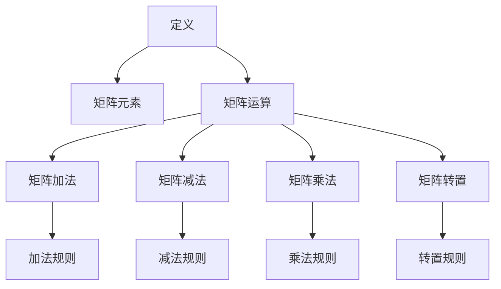
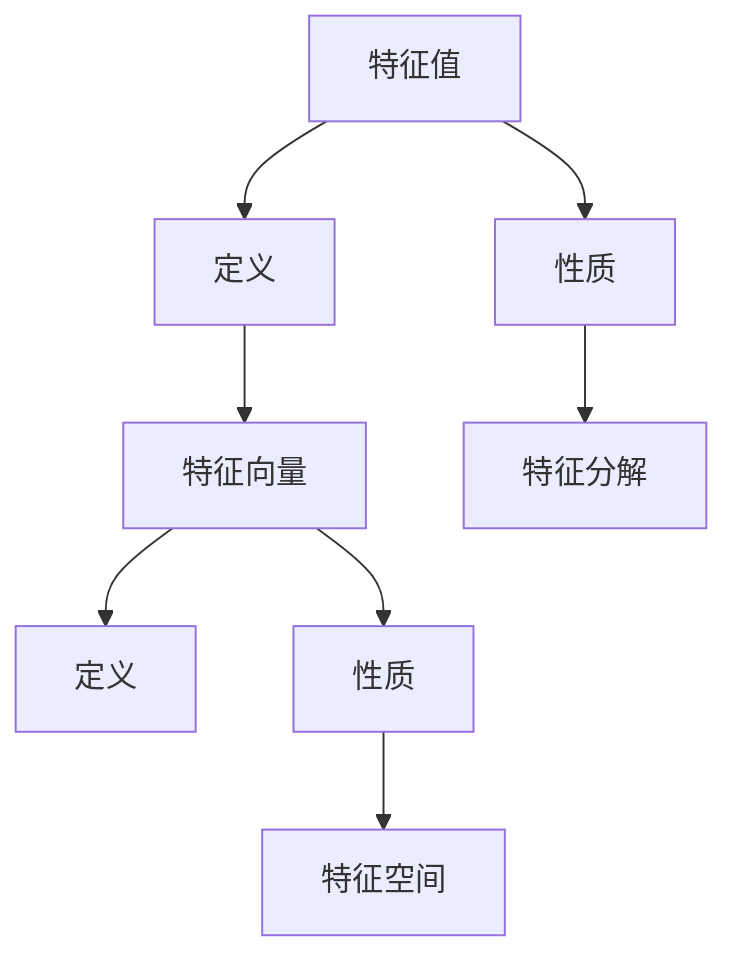
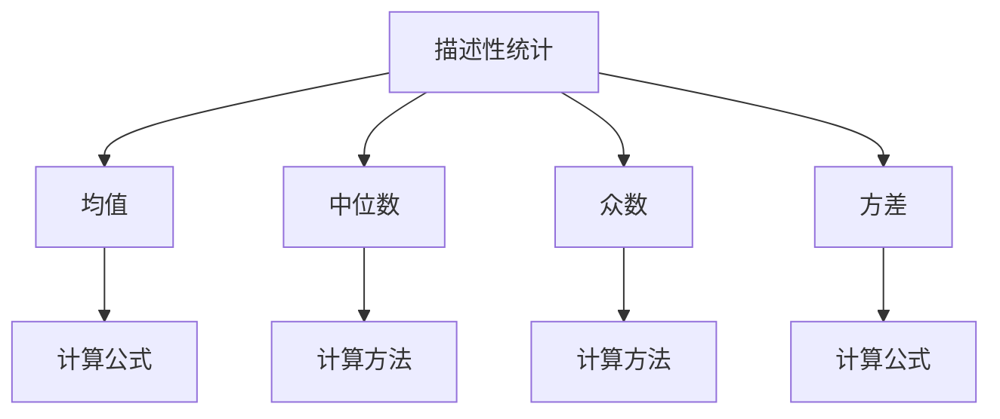
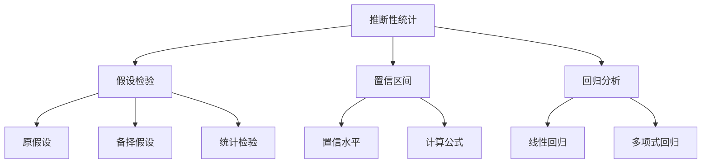

                 

# 机器学习毕业设计实践指南

> **关键词**：机器学习，毕业设计，实践，算法，项目实战

> **摘要**：本文旨在为即将开展机器学习毕业设计的同学提供一份实践指南，从基础知识储备、核心算法原理到项目实战，全面解析机器学习领域的实践应用。通过阅读本文，读者可以了解到机器学习的基本概念、数据处理方法、常见算法及其实现，并通过具体项目案例，掌握实际应用中的关键步骤和技巧。

### 目录大纲：机器学习毕业设计实践指南

#### 第一部分：基础知识储备
- **第1章：机器学习基础概述**
  - **1.1 机器学习的基本概念**
  - **1.2 机器学习的应用领域**
  - **1.3 机器学习的基本流程**
  - **1.4 机器学习的数学基础**

- **第2章：数据预处理与探索**
  - **2.1 数据预处理**
  - **2.2 数据探索性分析**

#### 第二部分：核心算法原理
- **第3章：监督学习算法**
  - **3.1 线性回归**
  - **3.2 逻辑回归**
  - **3.3 决策树**

- **第4章：无监督学习算法**
  - **4.1 K-均值聚类**
  - **4.2 主成分分析**

#### 第三部分：项目实战
- **第5章：项目实战：预测房价**
- **第6章：项目实战：客户分类分析**
- **第7章：项目实战：手写数字识别**

#### 第四部分：扩展阅读与资源
- **第8章：扩展阅读与资源**

### 附录
- **附录A：Python与机器学习库使用指南**

---

## 第1章：机器学习基础概述

### 1.1 机器学习的基本概念

机器学习（Machine Learning，ML）是一门多学科交叉的领域，涉及计算机科学、统计学、概率论、数学等多个方面。其核心目标是通过构建和分析算法，从数据中自动发现规律和知识，并利用这些规律进行预测或决策。

### 1.1.1 机器学习的定义

机器学习是一种人工智能（Artificial Intelligence，AI）的实现方式，它通过训练模型来模拟人类学习过程，从经验中学习并改善性能。机器学习不同于传统的编程方法，它不需要显式地编写规则，而是通过训练数据自动学习规律。

### 1.1.2 机器学习的目标

机器学习的目标主要包括：

1. **预测**：根据已有数据预测未知数据。
2. **分类**：将数据分为不同的类别。
3. **聚类**：将相似的数据点分组。
4. **关联**：发现数据之间的关联性。

### 1.1.3 机器学习的主要方法

机器学习方法主要分为以下几类：

1. **监督学习**：通过已标记的数据训练模型，用于预测或分类。
2. **无监督学习**：不使用标记数据，通过数据本身的特征进行学习。
3. **强化学习**：通过与环境的交互来学习最优策略。

### 1.2 机器学习的应用领域

机器学习在多个领域都有广泛应用，主要包括：

1. **数据挖掘**：从大量数据中发现隐藏的模式和知识。
2. **自然语言处理**：理解和生成人类语言。
3. **计算机视觉**：使计算机能够“看”和“理解”图像和视频。
4. **推荐系统**：为用户提供个性化推荐。
5. **语音识别**：将语音信号转换为文本。

### 1.3 机器学习的基本流程

机器学习的基本流程通常包括以下步骤：

1. **数据收集**：收集训练数据和测试数据。
2. **数据预处理**：清洗和转换数据，为模型训练做准备。
3. **模型选择**：根据问题选择合适的模型。
4. **模型训练**：使用训练数据训练模型。
5. **模型评估**：使用测试数据评估模型性能。
6. **模型优化**：根据评估结果调整模型参数。
7. **模型应用**：将训练好的模型应用到实际问题中。

### 1.4 机器学习的数学基础

机器学习中的数学基础主要包括：

1. **线性代数**：矩阵运算、线性方程组、特征值和特征向量等。
2. **概率论**：概率分布、条件概率、期望和方差等。
3. **统计学**：假设检验、回归分析、聚类分析等。

接下来，我们将深入探讨这些基础知识，为后续的算法分析和项目实战打下坚实的基础。

---

### 1.4.1 线性代数基础

线性代数是机器学习中不可或缺的数学工具，它提供了处理多维数据的基础。以下是线性代数中一些基本概念及其在机器学习中的应用。

#### 1.4.1.1 矩阵

矩阵是机器学习中最为常用的数据结构，用于表示数据集和模型参数。矩阵运算包括加法、减法、乘法和转置等。

**Mermaid流程图：线性代数基础概念图**



#### 1.4.1.2 线性方程组

线性方程组是一组线性方程的集合，可以通过矩阵形式表示。求解线性方程组是机器学习中的一个重要任务，常用的方法包括高斯消元法和矩阵分解法。

**伪代码：线性方程组求解步骤**

```python
def solve_linear_equation(A, b):
    # A为系数矩阵，b为常数向量
    # 返回解向量x
    n = len(b)
    # 高斯消元法
    for i in range(n):
        # 找到当前列的主元
        pivot = find_pivot(A, i)
        # 如果没有主元，则方程组无解
        if pivot is None:
            return None
        # 交换行
        swap_rows(A, i, pivot)
        swap_rows(b, i, pivot)
        # 消元
        for j in range(i+1, n):
            factor = A[j][i] / A[i][i]
            A[j] = subtract(A[j], multiply(A[i], factor))
            b[j] = subtract(b[j], multiply(b[i], factor))
    # 回代求解
    x = back_substitution(A, b)
    return x
```

#### 1.4.1.3 特征值和特征向量

特征值和特征向量是矩阵理论中的重要概念，它们可以揭示矩阵的内在性质。在机器学习中，特征值和特征向量广泛应用于降维、特征选择和特征分解等任务。

**Mermaid流程图：特征值和特征向量概念图**



**伪代码：特征值和特征向量计算步骤**

```python
def eigen_value_vector(M):
    # M为矩阵
    # 返回特征值和特征向量
    n = len(M)
    eigen_values = []
    eigen_vectors = []
    # 计算特征多项式
    p = lambda lam: determinant(subtract(M, multiply(diagonal_matrix(lam), identity_matrix(n))))
    # 使用数值方法求解特征值
    lambda_values = numerical_solver(p)
    # 对于每个特征值，求解对应的特征向量
    for lam in lambda_values:
        V = solve_linear_equation(subtract(M, multiply(diagonal_matrix(lam), identity_matrix(n))), zero_vector(n))
        eigen_values.append(lam)
        eigen_vectors.append(V)
    return eigen_values, eigen_vectors
```

通过上述讨论，我们可以看到线性代数在机器学习中的基础性和重要性。在后续的内容中，我们将进一步探讨概率论和统计学的基础知识，为深入理解机器学习算法奠定坚实的基础。

---

### 1.4.2 概率论基础

概率论是机器学习中的另一个关键数学工具，它为我们提供了处理不确定性和随机事件的方法。以下是概率论中一些基本概念及其在机器学习中的应用。

#### 1.4.2.1 概率分布

概率分布描述了随机变量可能取到的值以及它们出现的概率。常见的概率分布包括离散概率分布和连续概率分布。

**Mermaid流程图：概率分布概念图**

```mermaid
graph TD
    A[概率分布] --> B[离散概率分布]
    A --> C[连续概率分布]
    B --> D[P(X=x)]
    C --> E[f(X)]
    D --> F[伯努利分布]
    D --> G[二项分布]
    E --> H[正态分布]
    E --> I[均匀分布]
```

**伪代码：概率分布计算步骤**

```python
def probability_distribution(x, distribution):
    # x为随机变量取值
    # distribution为概率分布函数
    # 返回概率值
    if distribution == 'Bernoulli':
        return (1 / 2) if x == 0 or x == 1 else 0
    elif distribution == 'Binomial':
        n = len(x)  # 试验次数
        p = 0.5     # 概率
        return combination(n, x) * (p ** x) * (1 - p) ** (n - x)
    elif distribution == 'Normal':
        mu = 0      # 均值
        sigma = 1   # 方差
        return (1 / (sigma * sqrt(2 * pi))) * exp(-((x - mu) ** 2) / (2 * sigma ** 2))
    elif distribution == 'Uniform':
        return 1 / (b - a)  # a和b为分布区间
```

#### 1.4.2.2 条件概率

条件概率描述了在给定一个事件发生的条件下，另一个事件发生的概率。条件概率公式为：

$$ P(A|B) = \frac{P(A \cap B)}{P(B)} $$

**伪代码：条件概率计算步骤**

```python
def conditional_probability(A, B):
    # A和B为事件
    # 返回条件概率P(A|B)
    P_AB = count(A and B)  # A和B同时发生的次数
    P_B = count(B)  # B发生的次数
    return P_AB / P_B
```

#### 1.4.2.3 期望和方差

期望和方差是概率论中的两个重要统计量，它们用于描述随机变量的集中趋势和离散程度。

- **期望**（Expected Value）表示随机变量平均取值，公式为：

$$ E(X) = \sum_{x} x \cdot P(X=x) $$

- **方差**（Variance）表示随机变量取值的离散程度，公式为：

$$ Var(X) = E[(X - E(X))^2] = \sum_{x} (x - E(X))^2 \cdot P(X=x) $$

**伪代码：期望和方差计算步骤**

```python
def expectation(x):
    # x为随机变量取值
    # 返回期望值
    return sum(x[i] * p[i] for i in range(len(x)))

def variance(x):
    # x为随机变量取值
    # 返回方差值
    E_X = expectation(x)
    return sum((x[i] - E_X) ** 2 * p[i] for i in range(len(x)))
```

通过上述讨论，我们可以看到概率论在机器学习中的基础性和重要性。概率论提供了处理不确定性和随机事件的方法，为我们在机器学习中处理复杂问题提供了强有力的工具。在接下来的内容中，我们将继续探讨统计学的基础知识，为深入理解机器学习算法奠定坚实的基础。

---

### 1.4.3 统计学基础

统计学是机器学习中的另一门重要数学学科，它为我们提供了描述、分析和解释数据的方法。以下是统计学中一些基本概念及其在机器学习中的应用。

#### 1.4.3.1 描述性统计

描述性统计用于总结和描述数据的基本特征，包括均值、中位数、众数、方差等。

- **均值**（Mean）是数据集中所有数值的算术平均，公式为：

  $$ \mu = \frac{1}{N} \sum_{i=1}^{N} x_i $$

- **中位数**（Median）是将数据从小到大排序后，位于中间位置的数值。如果数据个数为奇数，则中位数为中间的数值；如果数据个数为偶数，则中位数为中间两个数值的平均。

- **众数**（Mode）是数据集中出现次数最多的数值。

- **方差**（Variance）是数据离散程度的度量，公式为：

  $$ \sigma^2 = \frac{1}{N} \sum_{i=1}^{N} (x_i - \mu)^2 $$

**Mermaid流程图：描述性统计概念图**



**伪代码：描述性统计计算步骤**

```python
import numpy as np

def mean(data):
    return np.mean(data)

def median(data):
    return np.median(data)

def mode(data):
    return max(set(data), key=data.count)

def variance(data):
    return np.var(data)
```

#### 1.4.3.2 推断性统计

推断性统计用于基于样本数据推断总体数据的特征，包括假设检验、置信区间和回归分析等。

- **假设检验**（Hypothesis Testing）是一种通过样本数据验证假设的方法。通常包括原假设（H0）和备择假设（H1），以及统计检验和决策规则。

- **置信区间**（Confidence Interval）是总体参数的一个估计范围，表示样本统计量在某个概率水平下的波动范围。

- **回归分析**（Regression Analysis）用于研究变量之间的关系，包括线性回归和多项式回归等。

**Mermaid流程图：推断性统计概念图**



**伪代码：假设检验计算步骤**

```python
from scipy import stats

def hypothesis_testing(data, hypothesis):
    # data为样本数据
    # hypothesis为假设
    # 返回p值
    t_statistic, p_value = stats.ttest_1samp(data, hypothesis)
    return p_value
```

通过上述讨论，我们可以看到统计学在机器学习中的基础性和重要性。描述性统计用于总结数据的基本特征，推断性统计用于基于样本数据推断总体特征，这些方法为我们在机器学习中处理和分析数据提供了强大的工具。在接下来的内容中，我们将继续探讨机器学习的核心算法原理，为深入理解机器学习应用奠定坚实的基础。

---

## 第2章：数据预处理与探索

数据预处理是机器学习项目中至关重要的一步，它直接影响模型的性能和稳定性。本章将详细介绍数据预处理的方法和步骤，包括数据清洗、特征工程和数据探索性分析。

### 2.1 数据预处理

数据清洗是数据预处理的第一步，其目标是消除数据中的噪声和异常值，使数据更加干净和有用。

#### 2.1.1 数据清洗

数据清洗包括以下步骤：

1. **缺失值处理**：缺失值可以通过填充、删除或插值等方法处理。
2. **异常值处理**：异常值可以通过检测和删除或替换等方法处理。
3. **重复数据处理**：重复数据可以通过去重的方法处理。

**伪代码：数据清洗步骤**

```python
def clean_data(data):
    # data为原始数据
    # 返回清洗后的数据
    data = remove_duplicates(data)  # 去除重复数据
    data = handle_missing_values(data)  # 处理缺失值
    data = handle_outliers(data)  # 处理异常值
    return data
```

#### 2.1.2 特征工程

特征工程是数据预处理的核心步骤，其目标是通过转换和构造新特征来提高模型的性能。

1. **特征选择**：选择对模型影响最大的特征。
2. **特征转换**：将原始特征转换为更适合模型训练的形式，如正则化、标准化、二值化等。
3. **特征构造**：通过组合原始特征构造新的特征。

**伪代码：特征工程步骤**

```python
def feature_engineering(data):
    # data为原始数据
    # 返回特征工程后的数据
    data = select_features(data)  # 特征选择
    data = transform_features(data)  # 特征转换
    data = construct_new_features(data)  # 特征构造
    return data
```

### 2.2 数据探索性分析

数据探索性分析是数据预处理的重要环节，通过分析数据的基本特征和内在结构，帮助理解数据并指导数据预处理。

#### 2.2.1 数据可视化

数据可视化是一种直观展示数据特征和关系的方法，常用的可视化工具包括matplotlib、seaborn等。

**示例：使用matplotlib绘制数据分布图**

```python
import matplotlib.pyplot as plt

def plot_data_distribution(data):
    # data为数据集
    # 绘制数据分布图
    plt.hist(data, bins=30, alpha=0.5)
    plt.xlabel('Value')
    plt.ylabel('Frequency')
    plt.title('Data Distribution')
    plt.show()

plot_data_distribution(data['feature'])
```

#### 2.2.2 统计描述

统计描述是通过计算数据的统计量来描述数据的基本特征，常用的统计量包括均值、中位数、方差等。

**伪代码：计算数据统计量**

```python
import numpy as np

def describe_data(data):
    # data为数据集
    # 返回统计描述
    mean_value = np.mean(data)
    median_value = np.median(data)
    variance_value = np.var(data)
    return mean_value, median_value, variance_value
```

通过上述步骤，我们可以对数据进行预处理和探索性分析，为后续的模型训练和评估打下坚实基础。在接下来的内容中，我们将深入探讨机器学习的核心算法原理，包括监督学习和无监督学习算法。

---

## 第3章：监督学习算法

监督学习是机器学习中最常见的一种学习方式，它通过已标记的数据集训练模型，从而对未知数据进行预测或分类。本章将详细介绍几种常用的监督学习算法，包括线性回归、逻辑回归和决策树。

### 3.1 线性回归

线性回归是一种简单的监督学习算法，用于预测连续值。它的核心思想是通过线性函数来拟合训练数据，从而对未知数据进行预测。

#### 3.1.1 线性回归模型

线性回归模型可以用以下方程表示：

$$ y = \beta_0 + \beta_1 x_1 + \beta_2 x_2 + ... + \beta_n x_n $$

其中，$y$ 是预测目标，$x_1, x_2, ..., x_n$ 是输入特征，$\beta_0, \beta_1, \beta_2, ..., \beta_n$ 是模型参数。

**伪代码：线性回归模型**

```python
def linear_regression(X, y):
    # X为输入特征矩阵，y为输出向量
    # 返回模型参数向量β
    n_samples, n_features = X.shape
    X_transpose = X.T
    XTX = X_transpose.dot(X)
    XTY = X_transpose.dot(y)
    beta = np.linalg.inv(XTX).dot(XTY)
    return beta
```

#### 3.1.2 梯度下降算法

梯度下降算法是一种优化方法，用于求解线性回归模型的参数。它的核心思想是通过迭代更新模型参数，使得损失函数逐渐减小。

**伪代码：梯度下降算法**

```python
def gradient_descent(X, y, beta, learning_rate, epochs):
    # X为输入特征矩阵，y为输出向量
    # beta为初始参数向量
    # learning_rate为学习率
    # epochs为迭代次数
    n_samples, n_features = X.shape
    for epoch in range(epochs):
        prediction = X.dot(beta)
        error = prediction - y
        gradient = X.T.dot(error)
        beta = beta - learning_rate * gradient
    return beta
```

### 3.2 逻辑回归

逻辑回归是一种用于分类问题的监督学习算法，它的核心思想是通过逻辑函数来将线性回归模型的输出映射到概率空间。

#### 3.2.1 逻辑回归模型

逻辑回归模型可以用以下方程表示：

$$ \sigma(y) = \frac{1}{1 + e^{-(\beta_0 + \beta_1 x_1 + \beta_2 x_2 + ... + \beta_n x_n)}} $$

其中，$\sigma$ 是逻辑函数，$y$ 是预测概率，$x_1, x_2, ..., x_n$ 是输入特征，$\beta_0, \beta_1, \beta_2, ..., \beta_n$ 是模型参数。

**伪代码：逻辑回归模型**

```python
def logistic_regression(X, y, beta, learning_rate, epochs):
    # X为输入特征矩阵，y为输出向量
    # beta为初始参数向量
    # learning_rate为学习率
    # epochs为迭代次数
    n_samples, n_features = X.shape
    for epoch in range(epochs):
        prediction = 1 / (1 + np.exp(-X.dot(beta)))
        error = prediction - y
        gradient = X.T.dot(error)
        beta = beta - learning_rate * gradient
    return beta
```

### 3.3 决策树

决策树是一种基于树形结构的分类和回归算法，它的核心思想是通过一系列判断条件来划分数据，并利用每个划分结果进行预测。

#### 3.3.1 决策树模型

决策树模型可以用以下流程表示：

1. 选择最佳特征进行划分。
2. 根据划分结果生成子节点。
3. 对子节点重复步骤1和2，直到满足终止条件。

**伪代码：决策树构建算法**

```python
def build_decision_tree(X, y, max_depth=None):
    # X为输入特征矩阵，y为输出向量
    # max_depth为最大深度
    # 返回决策树
    if max_depth is None:
        max_depth = len(X[0]) - 1
    
    if len(np.unique(y)) == 1 or max_depth == 0:
        return y[0]
    
    best_feature, best_threshold = find_best_split(X, y)
    tree = {best_feature: {}}
    
    for value in np.unique(X[:, best_feature]):
        sub_X = X[X[:, best_feature] == value]
        sub_y = y[X[:, best_feature] == value]
        tree[best_feature][value] = build_decision_tree(sub_X, sub_y, max_depth - 1)
    
    return tree
```

通过上述讨论，我们可以看到监督学习算法的基本原理和实现方法。这些算法在机器学习项目中有着广泛的应用，为数据预测和分类提供了强有力的工具。在接下来的内容中，我们将继续探讨无监督学习算法。

---

## 第4章：无监督学习算法

无监督学习是机器学习的一种重要类型，它不依赖于已标记的数据集，而是通过分析数据自身的特征和结构来学习规律。本章将详细介绍两种常用的无监督学习算法：K-均值聚类和主成分分析。

### 4.1 K-均值聚类

K-均值聚类是一种基于距离的聚类算法，它通过将数据点分配到K个簇中，使每个簇内的数据点之间距离最小，簇与簇之间的距离最大。该算法的核心思想是迭代更新聚类中心和分配数据点。

#### 4.1.1 K-均值算法

K-均值算法的基本步骤如下：

1. 初始化K个聚类中心。
2. 对于每个数据点，计算它与每个聚类中心的距离，并将其分配到最近的聚类中心。
3. 根据新的数据点分配结果，重新计算每个聚类中心。
4. 重复步骤2和3，直到聚类中心不再发生显著变化。

**伪代码：K-均值聚类算法**

```python
def k_means(X, k, max_iterations):
    # X为数据集，k为聚类数，max_iterations为最大迭代次数
    # 返回聚类中心和聚类结果
    centroids = initialize_centroids(X, k)
    for iteration in range(max_iterations):
        clusters = assign_points_to_clusters(X, centroids)
        centroids = update_centroids(X, clusters)
        if has_converged(centroids, previous_centroids):
            break
    return centroids, clusters
```

#### 4.1.2 聚类评估指标

聚类评估指标用于衡量聚类结果的质量。常用的评估指标包括内聚度（Cohesion）和分离度（Separation）。

- **内聚度**：衡量簇内数据点之间的相似度，常用指标有类内方差不平均（Intra-cluster Variance）。
- **分离度**：衡量簇间数据点之间的差异度，常用指标有类间方差不平均（Inter-cluster Variance）。

**伪代码：聚类评估指标计算**

```python
def cohesion(clusters):
    # clusters为聚类结果
    # 返回内聚度
    intra_variance = sum([sum((x - cluster_mean)^2 for x in cluster) for cluster in clusters]) / k
    return intra_variance

def separation(centroids):
    # centroids为聚类中心
    # 返回分离度
    inter_variance = sum([(centroid - cluster_mean)^2 for cluster, centroid in centroids.items()])
    return inter_variance
```

### 4.2 主成分分析

主成分分析（PCA）是一种降维算法，它通过将数据投影到新的正交坐标系中，提取主要特征，从而减少数据维度。PCA的核心思想是找到数据的主要变化方向，即主成分，并沿这些方向进行数据压缩。

#### 4.2.1 主成分分析原理

主成分分析的基本步骤如下：

1. 计算数据集的协方差矩阵。
2. 计算协方差矩阵的特征值和特征向量。
3. 选择前k个最大的特征值对应的特征向量，构成变换矩阵。
4. 将数据投影到新空间，实现降维。

**伪代码：主成分分析步骤**

```python
def pca(X, k):
    # X为数据集，k为降维后的维度
    # 返回降维后的数据集
    mean_centered_X = subtract_mean(X)
    covariance_matrix = compute_covariance_matrix(mean_centered_X)
    eigenvalues, eigenvectors = compute_eigenvalues_eigenvectors(covariance_matrix)
    sorted_eigenvectors = sort_eigenvectors_by_eigenvalues(eigenvalues, eigenvectors)
    transformation_matrix = select_top_k_eigenvectors(sorted_eigenvectors, k)
    transformed_X = apply_transformation_matrix(mean_centered_X, transformation_matrix)
    return transformed_X
```

#### 4.2.2 主成分分析应用

主成分分析在实际应用中有着广泛的应用，如图像压缩、数据可视化等。以下是一个简单的图像压缩示例：

**示例：主成分分析在图像压缩中的应用**

```python
import numpy as np
from matplotlib import image
from sklearn.decomposition import PCA

# 读取图像数据
image_data = image.imread('image.jpg')
image_data = np.array(image_data, dtype=np.float64)

# 将图像数据转化为灰度图像
gray_image_data = np.mean(image_data, axis=2)

# 进行主成分分析降维
pca = PCA(n_components=10)
compressed_image_data = pca.fit_transform(gray_image_data)

# 重建压缩后的图像
reconstructed_image_data = pca.inverse_transform(compressed_image_data)
reconstructed_image = np.uint8(reconstructed_image_data)

# 显示原始图像和压缩后的图像
plt.figure(figsize=(10, 10))
plt.subplot(1, 2, 1)
plt.imshow(image_data)
plt.title('Original Image')
plt.subplot(1, 2, 2)
plt.imshow(reconstructed_image)
plt.title('Reconstructed Image')
plt.show()
```

通过上述讨论，我们可以看到K-均值聚类和主成分分析在无监督学习中的重要性和应用价值。这些算法为数据降维、聚类分析和特征提取提供了强大的工具，有助于我们更好地理解和利用数据。在接下来的内容中，我们将通过具体的实战案例，进一步探讨机器学习的实际应用。

---

## 第5章：项目实战：预测房价

### 5.1 项目背景与数据集介绍

**项目背景**：房价预测是一个常见的应用场景，它有助于房地产市场分析、投资决策和房屋定价。本项目的目标是利用机器学习算法，构建一个能够准确预测房价的模型。

**数据集介绍**：我们使用一个公开的房价数据集——波士顿房价数据集（Boston Housing Dataset）。该数据集包含了506个样本和13个特征，包括房屋年龄、人口密度、收入水平、住宅数量等。

### 5.2 数据预处理

**5.2.1 数据清洗**

在开始模型训练之前，我们需要对数据集进行清洗，处理缺失值和异常值。对于缺失值，我们可以使用平均值或中值进行填充。对于异常值，可以使用统计方法（如箱线图）检测并处理。

**伪代码：数据清洗步骤**

```python
def clean_data(data):
    # data为原始数据
    # 返回清洗后的数据
    data = handle_missing_values(data)  # 处理缺失值
    data = handle_outliers(data)  # 处理异常值
    return data
```

**5.2.2 特征工程**

在数据清洗之后，我们需要对数据进行特征工程，以提高模型性能。这包括特征选择、特征转换和特征构造。

- **特征选择**：选择对房价影响较大的特征，如年龄、收入水平、住宅数量等。
- **特征转换**：将分类特征转换为数值特征，如使用独热编码或标签编码。
- **特征构造**：通过组合现有特征构造新的特征，如年龄与收入水平的乘积。

**伪代码：特征工程步骤**

```python
def feature_engineering(data):
    # data为原始数据
    # 返回特征工程后的数据
    data = select_features(data)  # 特征选择
    data = transform_features(data)  # 特征转换
    data = construct_new_features(data)  # 特征构造
    return data
```

### 5.3 选择模型与训练

**5.3.1 模型选择**

在选择模型时，我们可以考虑线性回归、决策树、随机森林等算法。由于房价预测是一个回归问题，线性回归和决策树都是不错的选择。

**5.3.2 模型训练**

我们使用线性回归模型进行训练。线性回归模型的训练过程包括计算参数和优化损失函数。

**伪代码：线性回归模型训练**

```python
def train_linear_regression(X, y):
    # X为输入特征矩阵，y为输出向量
    # 返回模型参数向量β
    beta = linear_regression(X, y)
    return beta
```

### 5.4 模型评估与优化

**5.4.1 模型评估**

我们使用均方误差（Mean Squared Error, MSE）来评估模型性能。

**伪代码：模型评估**

```python
def evaluate_model(model, X, y):
    # model为训练好的模型，X为输入特征矩阵，y为输出向量
    # 返回均方误差MSE
    prediction = model.predict(X)
    mse = mean_squared_error(y, prediction)
    return mse
```

**5.4.2 模型优化**

为了提高模型性能，我们可以考虑以下方法：

- **特征选择**：使用特征选择算法选择对模型影响较大的特征。
- **参数调优**：使用网格搜索或随机搜索调整模型参数。
- **模型集成**：使用模型集成方法（如随机森林、梯度提升树）提高模型性能。

**伪代码：模型优化步骤**

```python
def optimize_model(model, X, y):
    # model为训练好的模型，X为输入特征矩阵，y为输出向量
    # 返回优化后的模型
    model = feature_selection(model, X, y)  # 特征选择
    model = hyperparameter_tuning(model, X, y)  # 参数调优
    model = ensemble_methods(model, X, y)  # 模型集成
    return model
```

### 5.5 模型应用与反思

**5.5.1 模型应用**

我们使用训练好的模型对新数据进行预测，并将预测结果与实际值进行比较，以评估模型性能。

**伪代码：模型应用**

```python
def predict_house_price(model, new_data):
    # model为训练好的模型，new_data为待预测的数据
    # 返回预测的房价
    prediction = model.predict(new_data)
    return prediction
```

**5.5.2 项目反思**

在本项目中，我们通过数据清洗、特征工程和模型训练，构建了一个预测房价的模型。然而，模型性能仍有待提高，我们可以考虑以下改进措施：

- **数据集扩充**：增加更多的数据集，以提高模型的泛化能力。
- **特征工程**：进一步优化特征工程，选择更有效的特征。
- **模型集成**：尝试不同的模型集成方法，提高模型性能。

通过本项目，我们了解了机器学习在房价预测中的应用，以及如何通过数据预处理和模型优化来提高模型性能。

---

## 第6章：项目实战：客户分类分析

### 6.1 项目背景与数据集介绍

**项目背景**：客户分类分析是营销领域中的一项重要任务，它有助于企业了解客户特征，制定有针对性的营销策略。本项目的目标是利用机器学习算法，将客户数据划分为不同的类别。

**数据集介绍**：我们使用一个公开的客户数据集——Iris数据集。该数据集包含了150个样本和4个特征，包括萼片长度、萼片宽度、花瓣长度和花瓣宽度。

### 6.2 数据预处理

**6.2.1 数据清洗**

在开始模型训练之前，我们需要对数据集进行清洗，处理缺失值和异常值。对于缺失值，我们可以使用平均值或中值进行填充。对于异常值，可以使用统计方法（如箱线图）检测并处理。

**伪代码：数据清洗步骤**

```python
def clean_data(data):
    # data为原始数据
    # 返回清洗后的数据
    data = handle_missing_values(data)  # 处理缺失值
    data = handle_outliers(data)  # 处理异常值
    return data
```

**6.2.2 特征工程**

在数据清洗之后，我们需要对数据进行特征工程，以提高模型性能。这包括特征选择、特征转换和特征构造。

- **特征选择**：选择对分类任务影响较大的特征，如萼片长度、萼片宽度等。
- **特征转换**：将分类特征转换为数值特征，如使用独热编码或标签编码。
- **特征构造**：通过组合现有特征构造新的特征，如萼片长度与萼片宽度的乘积。

**伪代码：特征工程步骤**

```python
def feature_engineering(data):
    # data为原始数据
    # 返回特征工程后的数据
    data = select_features(data)  # 特征选择
    data = transform_features(data)  # 特征转换
    data = construct_new_features(data)  # 特征构造
    return data
```

### 6.3 选择模型与训练

**6.3.1 模型选择**

在选择模型时，我们可以考虑逻辑回归、K-均值聚类、决策树等算法。由于客户分类是一个多分类问题，逻辑回归和决策树都是不错的选择。

**6.3.2 模型训练**

我们使用逻辑回归模型进行训练。逻辑回归模型的训练过程包括计算参数和优化损失函数。

**伪代码：逻辑回归模型训练**

```python
def train_logistic_regression(X, y):
    # X为输入特征矩阵，y为输出向量
    # 返回模型参数向量β
    beta = logistic_regression(X, y)
    return beta
```

### 6.4 模型评估与优化

**6.4.1 模型评估**

我们使用准确率（Accuracy）、精确率（Precision）、召回率（Recall）等指标来评估模型性能。

**伪代码：模型评估**

```python
def evaluate_model(model, X, y):
    # model为训练好的模型，X为输入特征矩阵，y为输出向量
    # 返回准确率、精确率和召回率
    prediction = model.predict(X)
    accuracy = accuracy_score(y, prediction)
    precision = precision_score(y, prediction, average='macro')
    recall = recall_score(y, prediction, average='macro')
    return accuracy, precision, recall
```

**6.4.2 模型优化**

为了提高模型性能，我们可以考虑以下方法：

- **特征选择**：使用特征选择算法选择对模型影响较大的特征。
- **参数调优**：使用网格搜索或随机搜索调整模型参数。
- **模型集成**：使用模型集成方法（如随机森林、梯度提升树）提高模型性能。

**伪代码：模型优化步骤**

```python
def optimize_model(model, X, y):
    # model为训练好的模型，X为输入特征矩阵，y为输出向量
    # 返回优化后的模型
    model = feature_selection(model, X, y)  # 特征选择
    model = hyperparameter_tuning(model, X, y)  # 参数调优
    model = ensemble_methods(model, X, y)  # 模型集成
    return model
```

### 6.5 模型应用与反思

**6.5.1 模型应用**

我们使用训练好的模型对新数据进行分类预测，并将预测结果与实际值进行比较，以评估模型性能。

**伪代码：模型应用**

```python
def classify_clients(model, new_data):
    # model为训练好的模型，new_data为待预测的数据
    # 返回分类结果
    prediction = model.predict(new_data)
    return prediction
```

**6.5.2 项目反思**

在本项目中，我们通过数据清洗、特征工程和模型训练，构建了一个客户分类模型。然而，模型性能仍有待提高，我们可以考虑以下改进措施：

- **数据集扩充**：增加更多的数据集，以提高模型的泛化能力。
- **特征工程**：进一步优化特征工程，选择更有效的特征。
- **模型集成**：尝试不同的模型集成方法，提高模型性能。

通过本项目，我们了解了机器学习在客户分类分析中的应用，以及如何通过数据预处理和模型优化来提高模型性能。

---

## 第7章：项目实战：手写数字识别

### 7.1 项目背景与数据集介绍

**项目背景**：手写数字识别是计算机视觉领域的一个经典问题，它对于机器学习算法的测试和验证具有重要意义。本项目的目标是利用机器学习算法，对手写数字图像进行自动识别。

**数据集介绍**：我们使用一个公开的手写数字数据集——MNIST数据集。该数据集包含了70000个训练样本和10000个测试样本，每个样本都是一个28x28的二值图像，表示一个手写数字。

### 7.2 数据预处理

**7.2.1 数据清洗**

在开始模型训练之前，我们需要对数据集进行清洗，处理缺失值和异常值。对于MNIST数据集，通常不需要进行缺失值处理，但我们可以使用图像预处理方法（如灰度化、二值化等）来处理异常值。

**伪代码：数据清洗步骤**

```python
def clean_data(data):
    # data为原始数据
    # 返回清洗后的数据
    data = grayscale(data)  # 灰度化
    data = binary_thresholding(data)  # 二值化
    return data
```

**7.2.2 特征工程**

在数据清洗之后，我们需要对数据进行特征工程，以提高模型性能。这包括特征选择、特征转换和特征构造。

- **特征选择**：选择对模型影响较大的特征，如图像的边缘、角点等。
- **特征转换**：将原始图像转换为更适合模型训练的形式，如像素值归一化。
- **特征构造**：通过组合现有特征构造新的特征，如图像的局部特征、纹理特征等。

**伪代码：特征工程步骤**

```python
def feature_engineering(data):
    # data为原始数据
    # 返回特征工程后的数据
    data = select_features(data)  # 特征选择
    data = transform_features(data)  # 特征转换
    data = construct_new_features(data)  # 特征构造
    return data
```

### 7.3 选择模型与训练

**7.3.1 模型选择**

在选择模型时，我们可以考虑卷积神经网络（CNN）、支持向量机（SVM）等算法。由于手写数字识别是一个图像分类问题，卷积神经网络是更好的选择。

**7.3.2 模型训练**

我们使用卷积神经网络进行训练。卷积神经网络的训练过程包括构建网络结构、配置损失函数和优化器等。

**伪代码：卷积神经网络训练**

```python
def train_cnn(X, y, epochs, learning_rate):
    # X为输入特征矩阵，y为输出向量
    # epochs为迭代次数，learning_rate为学习率
    # 返回训练好的模型
    model = build_cnn_model()
    model.compile(optimizer=optimizer, loss=loss_function, metrics=['accuracy'])
    model.fit(X, y, epochs=epochs, batch_size=batch_size, verbose=1)
    return model
```

### 7.4 模型评估与优化

**7.4.1 模型评估**

我们使用准确率（Accuracy）来评估模型性能。对于手写数字识别任务，准确率是一个重要的评估指标。

**伪代码：模型评估**

```python
def evaluate_model(model, X, y):
    # model为训练好的模型，X为输入特征矩阵，y为输出向量
    # 返回准确率
    prediction = model.predict(X)
    accuracy = accuracy_score(y, prediction)
    return accuracy
```

**7.4.2 模型优化**

为了提高模型性能，我们可以考虑以下方法：

- **超参数调优**：使用网格搜索或随机搜索调整模型的超参数，如学习率、批量大小等。
- **数据增强**：通过旋转、缩放、剪切等数据增强方法增加训练样本的多样性。
- **模型集成**：使用模型集成方法（如随机森林、梯度提升树）提高模型性能。

**伪代码：模型优化步骤**

```python
def optimize_model(model, X, y):
    # model为训练好的模型，X为输入特征矩阵，y为输出向量
    # 返回优化后的模型
    model = hyperparameter_tuning(model, X, y)  # 超参数调优
    model = data_augmentation(model, X, y)  # 数据增强
    model = ensemble_methods(model, X, y)  # 模型集成
    return model
```

### 7.5 模型应用与反思

**7.5.1 模型应用**

我们使用训练好的模型对新数据进行手写数字识别，并将预测结果与实际值进行比较，以评估模型性能。

**伪代码：模型应用**

```python
def recognize_handwritten_digits(model, new_data):
    # model为训练好的模型，new_data为待预测的数据
    # 返回识别结果
    prediction = model.predict(new_data)
    return prediction
```

**7.5.2 项目反思**

在本项目中，我们通过数据清洗、特征工程和模型训练，构建了一个手写数字识别模型。然而，模型性能仍有待提高，我们可以考虑以下改进措施：

- **数据集扩充**：增加更多的训练样本，以提高模型的泛化能力。
- **特征工程**：进一步优化特征工程，选择更有效的特征。
- **模型集成**：尝试不同的模型集成方法，提高模型性能。

通过本项目，我们了解了机器学习在手写数字识别中的应用，以及如何通过数据预处理和模型优化来提高模型性能。

---

## 第8章：扩展阅读与资源

### 8.1 优秀机器学习资源推荐

在学习机器学习的过程中，获取高质量的学习资源是非常重要的。以下是一些推荐的优秀资源：

#### 8.1.1 在线课程

1. **Coursera**：提供大量的机器学习课程，如斯坦福大学的“机器学习”课程。
2. **edX**：拥有众多顶尖大学提供的免费机器学习课程，如MIT的“机器学习导论”。
3. **Udacity**：提供实践驱动的机器学习课程，如“深度学习纳米学位”。

#### 8.1.2 技术博客

1. **Medium**：许多专业技术人员和研究者在这里分享机器学习相关的文章和教程。
2. **Kaggle**：不仅是一个数据科学竞赛平台，还提供了丰富的机器学习教程和案例。
3. **Towards Data Science**：一个关于数据科学和机器学习的在线社区，提供了许多实用的文章和代码示例。

#### 8.1.3 学术期刊

1. **Journal of Machine Learning Research (JMLR)**：机器学习领域的顶级学术期刊。
2. **IEEE Transactions on Pattern Analysis and Machine Intelligence**：专注于计算机视觉和机器学习的期刊。
3. **Neural Computation**：涉及神经网络和机器学习的研究期刊。

### 8.2 学习路径规划与建议

为了更系统地学习机器学习，以下是一些建议的学习路径：

#### 8.2.1 基础知识学习

1. **Python编程**：学习Python语言基础和常用库（如NumPy、Pandas）。
2. **线性代数**：掌握矩阵运算、特征值和特征向量等基本概念。
3. **概率论与统计学**：学习概率分布、假设检验、线性回归等知识。

#### 8.2.2 算法实践

1. **监督学习算法**：学习线性回归、逻辑回归、决策树等算法。
2. **无监督学习算法**：学习K-均值聚类、主成分分析等算法。
3. **深度学习**：掌握卷积神经网络、循环神经网络等深度学习模型。

#### 8.2.3 项目实战

1. **数据分析**：通过实际项目练习数据处理和分析技能。
2. **自然语言处理**：学习文本分类、情感分析等应用。
3. **计算机视觉**：通过图像识别、目标检测等任务加深理解。

### 8.3 毕业设计选题建议

以下是几个适合毕业设计的选题方向：

#### 8.3.1 数据分析类

1. **用户行为分析**：通过分析用户行为数据，提取有价值的信息。
2. **市场趋势预测**：使用时间序列分析预测市场趋势。

#### 8.3.2 自然语言处理类

1. **文本分类**：构建一个自动分类新闻文章的系统。
2. **情感分析**：分析社交媒体上的用户情感，进行情感归类。

#### 8.3.3 计算机视觉类

1. **图像识别**：开发一个手写数字识别系统。
2. **目标检测**：实现一个实时视频监控中的目标检测系统。

通过以上扩展阅读与资源，读者可以进一步深化对机器学习的理解，并为毕业设计选题提供有益的参考。

---

### 附录A：Python与机器学习库使用指南

#### A.1 Python安装与配置

**A.1.1 Python安装**

1. 访问Python官方网站（[https://www.python.org/](https://www.python.org/)）下载Python安装包。
2. 运行安装程序，并选择添加Python到系统环境变量。

**A.1.2 Python配置**

1. 打开命令提示符或终端，输入`python`命令，确保能进入Python解释器。
2. 输入以下命令检查Python版本：

   ```python
   import platform
   print(platform.python_version())
   ```

#### A.2 Scikit-learn库使用

**A.2.1 安装与导入**

1. 使用pip命令安装Scikit-learn库：

   ```bash
   pip install scikit-learn
   ```

2. 在Python脚本中导入Scikit-learn库：

   ```python
   import sklearn
   ```

**A.2.2 数据集加载与处理**

1. 加载Iris数据集：

   ```python
   from sklearn.datasets import load_iris
   iris = load_iris()
   ```

2. 查看数据集的特征和标签：

   ```python
   print(iris.feature_names)
   print(iris.target_names)
   ```

#### A.3 TensorFlow与Keras使用

**A.3.1 安装与导入**

1. 使用pip命令安装TensorFlow库：

   ```bash
   pip install tensorflow
   ```

2. 在Python脚本中导入TensorFlow和Keras：

   ```python
   import tensorflow as tf
   from tensorflow import keras
   ```

**A.3.2 模型构建与训练**

1. 构建一个简单的全连接神经网络模型：

   ```python
   model = keras.Sequential([
       keras.layers.Dense(128, activation='relu', input_shape=(784,)),
       keras.layers.Dense(10, activation='softmax')
   ])
   ```

2. 编译模型：

   ```python
   model.compile(optimizer='adam',
                 loss='sparse_categorical_crossentropy',
                 metrics=['accuracy'])
   ```

3. 训练模型：

   ```python
   model.fit(x_train, y_train, epochs=5)
   ```

#### A.4 其他常用库简介

**A.4.1 NumPy**

NumPy是Python中用于科学计算的基础库，提供多维数组对象和大量数学函数。

- **安装与导入**：

  ```bash
  pip install numpy
  import numpy as np
  ```

- **数组操作**：

  ```python
  arr = np.array([1, 2, 3])
  print(arr)
  ```

**A.4.2 Pandas**

Pandas是Python中用于数据处理和分析的库，提供数据框（DataFrame）和数据序列（Series）等数据结构。

- **安装与导入**：

  ```bash
  pip install pandas
  import pandas as pd
  ```

- **数据加载与操作**：

  ```python
  df = pd.read_csv('data.csv')
  print(df.head())
  ```

**A.4.3 Matplotlib**

Matplotlib是Python中用于数据可视化的库，提供多种图形绘制函数。

- **安装与导入**：

  ```bash
  pip install matplotlib
  import matplotlib.pyplot as plt
  ```

- **绘制基本图形**：

  ```python
  plt.plot([1, 2, 3], [1, 2, 3])
  plt.show()
  ```

通过以上内容，读者可以了解Python及其常用库的基本使用方法，为后续的机器学习实践打下坚实的基础。

