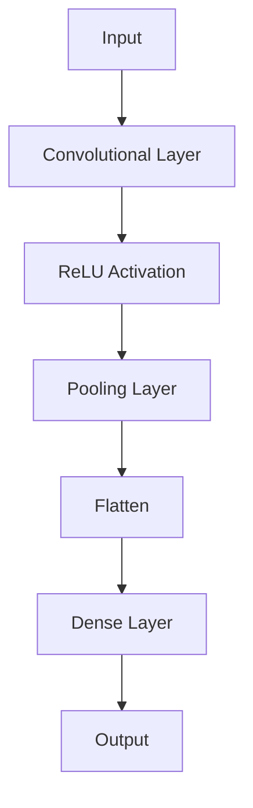
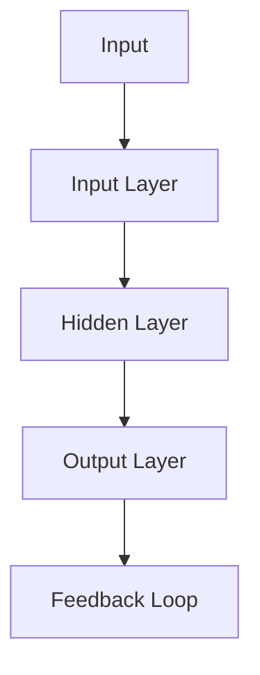

                 

### 第1章: AI 2.0时代的概述

> **关键词**：AI 2.0，商业价值，核心技术，应用场景

在过去的几十年中，人工智能（AI）技术经历了快速的发展和变革。从早期的规则基系统到如今的深度学习和大数据分析，AI技术的进步对各行各业产生了深远的影响。然而，随着技术的不断演进，我们正迎来AI 2.0时代，这是一个更加智能化、自动化和互联化的新时代。

### 1.1 AI 2.0的定义与特征

AI 2.0，也被称作人工智能的第二阶段，它不仅仅是技术上的进步，更是一种对人工智能应用模式和商业模式的革新。AI 2.0的主要特征包括：

- **基于模型复用与大规模预训练**：AI 2.0利用大规模数据集进行模型的预训练，然后在特定的任务中进行微调，从而显著提高了模型的效果和效率。
- **自动化AI流水线**：通过自动化工具和平台，AI 2.0可以更快速地构建、部署和管理模型，降低了AI应用的门槛。
- **高数据需求**：AI 2.0模型通常需要大量的数据来进行训练，这使得数据成为企业宝贵的资产。
- **通用AI的基石**：AI 2.0正在逐步构建通用的AI基础架构，为未来的通用人工智能（AGI）打下基础。

这些特征使得AI 2.0具有显著的商业价值，为企业和创业者提供了广阔的发展空间。

### 1.2 AI 2.0对商业的影响

AI 2.0时代的到来，无疑将对商业产生深远的影响。首先，AI技术将大幅提高生产效率和降低成本。通过自动化和智能化，企业可以实现生产过程的优化，减少人力成本，提高生产效率和产品质量。

其次，AI 2.0将驱动创新，促进新产品的开发和市场的拓展。AI技术可以为企业提供精准的市场分析和用户画像，帮助企业在激烈的市场竞争中脱颖而出。同时，AI 2.0还可以助力企业开展跨界合作，开拓新的商业模式和市场机会。

最后，AI 2.0时代的到来将改变企业的竞争格局。那些能够有效利用AI技术进行创新和转型的企业，将拥有更强的市场竞争力。而那些忽视AI技术发展的企业，可能面临被淘汰的风险。

### 1.3 AI 2.0时代的商业机遇

AI 2.0时代的商业机遇主要体现在以下几个方面：

- **提高生产效率**：通过自动化和智能化，企业可以实现生产过程的优化，减少人力成本，提高生产效率和产品质量。
- **创新驱动**：利用AI技术，企业可以开发新的产品和服务，创造市场新需求。
- **市场拓展**：通过智能分析，精准营销，企业可以进入新的市场和领域。

总之，AI 2.0时代的到来为企业和创业者带来了前所未有的发展机遇。然而，要抓住这些机遇，企业需要积极拥抱AI技术，不断创新和转型。只有这样，才能在激烈的市场竞争中立于不败之地。

---

以上是第1章的内容，接下来我们将深入探讨AI 2.0时代的核心技术，包括机器学习、深度学习和自然语言处理等方面的内容。

### 第2章: AI 2.0时代的核心技术

> **关键词**：机器学习，深度学习，自然语言处理，对话系统

在AI 2.0时代，核心技术的创新和发展成为推动行业变革的重要驱动力。本章将重点介绍机器学习、深度学习和自然语言处理等核心技术，以及它们在AI 2.0时代的应用和发展趋势。

#### 2.1 机器学习与深度学习基础

##### 2.1.1 机器学习原理

机器学习（Machine Learning）是人工智能的核心技术之一，它使计算机系统能够通过数据和经验进行自我学习和优化。机器学习的基本原理可以分为以下几个步骤：

1. **数据收集**：收集用于训练的数据集，这些数据集可以是结构化的（如表格数据）或非结构化的（如图像、文本和音频）。
2. **特征工程**：从数据中提取有用的特征，这些特征将用于训练模型。
3. **模型选择**：根据问题的性质和数据特征选择合适的机器学习模型。
4. **模型训练**：使用训练数据集对模型进行训练，通过优化模型参数来提高模型的预测性能。
5. **模型评估**：使用验证数据集评估模型的性能，常见的评估指标包括准确率、召回率和F1分数等。
6. **模型部署**：将训练好的模型部署到实际应用场景中，进行预测和决策。

##### 2.1.2 深度学习架构

深度学习（Deep Learning）是机器学习的一个子领域，它通过多层神经网络模型来实现复杂的特征学习和模式识别。深度学习的基本架构包括以下几个部分：

1. **输入层**：接收外部输入数据，如图像、文本或音频。
2. **隐藏层**：对输入数据进行特征提取和变换，通常包含多个隐藏层。
3. **输出层**：生成模型的预测结果或决策。

常见的深度学习模型包括：

- **卷积神经网络（CNN）**：主要用于图像处理和计算机视觉任务。
- **递归神经网络（RNN）**：适用于序列数据和时间序列分析。
- **生成对抗网络（GAN）**：用于生成逼真的图像、音频和文本。

##### 2.1.3 人工智能算法进化

随着AI技术的不断发展，机器学习算法也在不断进化。以下是几种重要的机器学习算法：

- **监督学习（Supervised Learning）**：使用标记数据进行训练，常见的算法包括线性回归、逻辑回归和支持向量机（SVM）。
- **无监督学习（Unsupervised Learning）**：不使用标记数据进行训练，常见的算法包括聚类和降维。
- **半监督学习（Semi-Supervised Learning）**：结合标记数据和未标记数据进行训练，可以提高模型的泛化能力。
- **强化学习（Reinforcement Learning）**：通过与环境的交互来学习最优策略，常见的算法包括Q学习和深度确定性策略梯度（DDPG）。

#### 2.2 自然语言处理与对话系统

##### 2.2.1 语言模型与语义理解

自然语言处理（Natural Language Processing，NLP）是AI领域的另一个重要分支，它致力于使计算机能够理解和处理人类语言。NLP的核心技术包括：

- **语言模型（Language Model）**：用于预测下一个单词或句子的概率，常见的算法包括n-gram模型和神经网络语言模型（如BERT）。
- **语义理解（Semantic Understanding）**：通过词嵌入和上下文理解来实现，常见的算法包括词向量（如Word2Vec）和上下文敏感的模型（如GPT-3）。

##### 2.2.2 对话系统的设计与实现

对话系统（Dialogue System）是一种能够与人类进行自然语言交互的AI系统。对话系统的设计与实现包括以下几个关键环节：

1. **意图识别（Intent Recognition）**：识别用户输入的意图，如查询、命令或请求。
2. **实体提取（Entity Extraction）**：从用户输入中提取关键信息，如人名、地点或日期。
3. **对话管理（Dialogue Management）**：管理对话流程，决定下一步的行动。
4. **响应生成（Response Generation）**：生成自然语言响应，与用户进行互动。

常见的对话系统架构包括：

- **规则基系统**：基于预定义的规则进行对话管理。
- **数据驱动系统**：使用机器学习模型进行意图识别和响应生成。
- **混合系统**：结合规则和机器学习，实现更灵活的对话管理。

##### 2.2.3 对话系统性能评估

对话系统的性能评估是确保其有效性和用户体验的关键环节。常见的评估指标包括：

- **准确率（Accuracy）**：正确识别意图和实体的比例。
- **召回率（Recall）**：实际为正类但被正确识别的比例。
- **F1分数（F1 Score）**：准确率和召回率的调和平均值。

通过这些指标，可以对对话系统的性能进行全面评估，并针对性地进行优化。

### 第3章: AI 2.0时代的商业应用场景

> **关键词**：制造业，金融服务，医疗保健

AI 2.0时代的核心技术正不断应用于各个行业，推动商业模式的创新和变革。在本章中，我们将探讨AI在制造业、金融服务和医疗保健等领域的应用场景和实际案例。

#### 3.1 制造业与人工智能

##### 3.1.1 智能制造与工业4.0

智能制造（Smart Manufacturing）是工业4.0的重要组成部分，它利用AI技术实现生产过程的智能化和自动化。智能制造的主要特点包括：

- **数据分析**：通过大数据分析，实时监控生产过程，优化生产计划和资源配置。
- **设备预测维护**：利用机器学习算法，预测设备故障和停机时间，实现预防性维护，降低生产中断风险。
- **质量检测**：利用计算机视觉和图像处理技术，对生产过程中的产品质量进行实时检测和监控。

##### 3.1.2 机器人技术在制造中的应用

机器人技术在智能制造中发挥着重要作用，它能够实现以下应用：

- **装配与焊接**：机器人可以自动化完成零部件的装配和焊接工作，提高生产效率和产品质量。
- **搬运与包装**：机器人可以自动化搬运和包装产品，降低人力成本和工作强度。
- **质量控制**：机器人可以自动化执行质量检测任务，确保产品质量。

##### 3.1.3 制造业的AI应用案例分析

- **案例1：汽车制造业的AI应用**：例如，特斯拉在生产线中广泛应用AI技术，实现了无人驾驶车辆的制造和质量检测。
- **案例2：电子制造业的AI应用**：例如，富士康采用机器人进行手机生产，大幅提高了生产效率和质量。

#### 3.2 金融服务与人工智能

##### 3.2.1 信用评分与风险控制

人工智能在金融服务中的应用越来越广泛，尤其在信用评分和风险控制方面。人工智能技术能够实现以下功能：

- **信用评分**：通过分析用户的历史交易数据和行为，预测用户的信用风险，为金融机构提供信用决策依据。
- **风险控制**：利用机器学习算法，对金融市场的风险进行预测和控制，降低金融风险。

##### 3.2.2 量化交易与高频交易

量化交易和高频交易是金融市场中重要的投资策略，人工智能技术在其中发挥着关键作用：

- **量化交易**：利用机器学习算法，对历史数据进行分析和预测，制定交易策略，实现自动化交易。
- **高频交易**：通过快速执行大量交易，利用市场波动获取利润，人工智能技术能够显著提高交易效率和收益。

##### 3.2.3 金融服务的AI应用案例分析

- **案例1：银行智能客服系统**：例如，中国建设银行推出的智能客服系统，通过自然语言处理技术，实现了智能客服和智能推荐。
- **案例2：保险公司的风险控制系统**：例如，中国平安保险利用机器学习算法，实现了风险识别和预测，提高了保险产品的精准度。

#### 3.3 医疗保健与人工智能

##### 3.3.1 医疗影像分析与诊断

人工智能在医疗保健中的应用主要体现在医疗影像分析和诊断方面：

- **影像分析**：利用计算机视觉技术，对医学影像进行自动分析和分类，如癌症筛查和心脏病诊断。
- **辅助诊断**：通过分析患者的医疗数据和影像资料，为医生提供诊断建议和治疗方案。

##### 3.3.2 智能健康管理

智能健康管理是人工智能在医疗保健领域的另一个重要应用：

- **健康数据监测**：通过可穿戴设备和移动应用，实时监测患者的健康状况，如心率、血压和血糖水平。
- **个性化治疗**：根据患者的健康状况和病史，制定个性化的治疗方案和健康管理计划。

##### 3.3.3 医疗服务的AI应用案例分析

- **案例1：远程医疗系统**：例如，腾讯医疗推出的远程医疗系统，通过视频通话和人工智能技术，实现了远程诊断和咨询服务。
- **案例2：智能药物研发**：例如，IBM的Watson药物研发平台，通过自然语言处理和机器学习技术，加速新药的研发进程。

通过以上对AI 2.0时代商业应用场景的探讨，我们可以看到人工智能技术正日益深入到各个行业，推动商业模式的创新和变革。随着技术的不断发展和成熟，AI将在未来的商业发展中发挥更加重要的作用。

### 第4章: AI 2.0时代的商业模式创新

> **关键词**：平台商业模式，数据驱动，共创与合作

AI 2.0时代不仅带来了技术上的突破，也引发了商业模式的变革。在这一章节中，我们将探讨AI对平台商业模式、数据驱动创新以及共创与合作模式的影响，并分析这些新模式在商业实践中的应用。

#### 4.1 平台商业模式与AI的结合

平台商业模式（Platform Business Model）是一种通过连接供需双方创造价值的商业模式。AI 2.0时代的到来，使得平台商业模式更加智能化和高效化。

##### 4.1.1 平台经济的原理

平台经济的基础在于网络效应和协同效应。网络效应指的是平台的价值随着用户数量的增加而增加，协同效应则是指平台上的不同参与者之间相互促进，共同创造更大的价值。

AI技术的引入，使得平台经济更加高效。通过AI算法，平台能够更好地匹配供需双方，提高交易效率。例如，电商平台的个性化推荐系统，利用机器学习算法分析用户的购物行为和偏好，为用户推荐更相关的商品。

##### 4.1.2 平台商业模式下的AI应用

AI在平台商业模式中的应用主要体现在以下几个方面：

1. **个性化推荐**：通过分析用户行为数据，AI算法可以推荐用户可能感兴趣的商品或服务，提高用户的满意度和平台的使用频率。
2. **智能搜索**：利用自然语言处理技术，平台可以实现更智能、更准确的搜索功能，提高用户体验。
3. **欺诈检测**：AI算法可以识别异常交易行为，有效防止欺诈行为，保障平台的交易安全。

##### 4.1.3 平台商业模式的创新案例分析

1. **案例1：电商平台的AI应用**：例如，阿里巴巴的推荐系统，通过机器学习算法分析用户的购物历史和偏好，为用户推荐商品。
2. **案例2：共享经济的AI应用**：例如，滴滴出行的智能调度系统，通过预测乘客需求和司机的位置，优化派单效率。

#### 4.2 数据驱动与创新

数据驱动创新是AI 2.0时代的重要特征。通过数据分析和机器学习，企业可以更准确地理解市场趋势和用户需求，从而实现创新的商业模式。

##### 4.2.1 数据驱动的商业决策

数据驱动的商业决策依赖于大数据分析和机器学习算法。企业可以通过以下步骤实现数据驱动的商业决策：

1. **数据收集**：收集与业务相关的各种数据，包括用户行为数据、市场数据等。
2. **数据清洗**：对收集到的数据进行清洗和预处理，确保数据的质量和一致性。
3. **数据分析**：利用数据分析工具和机器学习算法，从数据中提取有价值的信息。
4. **决策制定**：基于数据分析结果，制定相应的商业决策。

##### 4.2.2 数据资产与数据治理

数据资产是企业的重要资源，有效的数据治理可以确保数据的准确性、可靠性和合规性。数据治理包括以下方面：

1. **数据策略**：制定数据管理战略，明确数据的价值和用途。
2. **数据质量管理**：确保数据的准确性、一致性和完整性。
3. **数据安全**：确保数据的安全性和隐私性，防止数据泄露和滥用。
4. **数据合规**：遵守相关的数据保护法规和标准，确保数据处理的合规性。

##### 4.2.3 数据驱动创新的案例分析

1. **案例1：互联网公司的数据驱动创新**：例如，腾讯通过对用户行为数据的分析，实现了精准的市场定位和产品优化。
2. **案例2：传统行业的数字化转型**：例如，可口可乐通过对销售数据的分析，优化了供应链管理和市场营销策略。

#### 4.3 AI时代的共创与合作

AI 2.0时代，共创与合作成为企业创新的重要模式。通过开放创新和跨界合作，企业可以更快地实现创新和变革。

##### 4.3.1 开放式创新与AI

开放式创新（Open Innovation）是指企业通过外部合作和内部创新共同推动技术创新。在AI时代，开放式创新具有以下优势：

1. **资源共享**：企业可以通过合作共享技术资源和数据资源，提高研发效率。
2. **协同创新**：企业可以通过跨界合作，整合不同领域的优势，实现技术创新。
3. **快速迭代**：通过快速迭代和用户反馈，企业可以更快地优化产品和服务。

##### 4.3.2 跨界合作与AI

跨界合作（Cross-Border Collaboration）是指不同领域的企业或机构之间的合作。在AI时代，跨界合作具有以下潜力：

1. **技术互补**：不同领域的企业可以互补技术优势，共同解决复杂问题。
2. **市场拓展**：跨界合作可以开拓新的市场和业务领域，实现业务增长。
3. **风险分担**：跨界合作可以降低技术创新和市场推广的风险。

##### 4.3.3 共创生态与AI

共创生态（Co-creation Ecosystem）是指企业、用户、研究机构等多方参与的创新生态系统。在共创生态中，AI技术发挥着重要作用：

1. **用户参与**：通过AI技术，企业可以更好地理解用户需求，实现用户参与创新。
2. **数据共享**：在共创生态中，各方可以共享数据资源，提高数据利用效率。
3. **协同创新**：通过共创生态，企业可以与其他参与者共同推动技术创新。

#### 4.4 AI时代的商业模式创新趋势

AI 2.0时代的商业模式创新呈现以下趋势：

1. **智能化**：通过AI技术，平台和业务流程将更加智能化，提高效率和用户体验。
2. **个性化**：基于用户数据，企业可以实现更精准的市场定位和个性化服务。
3. **跨界融合**：跨界合作将成为常态，企业将通过跨界合作实现创新和业务拓展。
4. **生态共建**：共创生态将成为企业创新的重要模式，多方参与共同推动产业发展。

通过以上对AI 2.0时代商业模式创新的探讨，我们可以看到，AI技术正在深刻改变商业运作的方式。企业需要积极拥抱AI技术，创新商业模式，以适应不断变化的市场环境。

### 第5章: AI 2.0时代的商业挑战与对策

> **关键词**：数据隐私，安全问题，伦理问题，人才短缺

尽管AI 2.0时代带来了巨大的商业价值和创新机遇，但也伴随着一系列挑战和风险。在本章中，我们将探讨AI 2.0时代面临的主要商业挑战，并提出相应的对策。

#### 5.1 数据隐私与安全问题

随着AI技术的广泛应用，数据的收集和使用变得越来越频繁。这带来了数据隐私和安全的问题。

##### 5.1.1 数据隐私保护法规

为了保护用户的隐私，许多国家和地区已经出台了相关法规，如欧盟的《通用数据保护条例》（GDPR）和美国的《加州消费者隐私法案》（CCPA）。这些法规要求企业在收集和使用用户数据时，必须获得用户的明确同意，并确保数据的保密性和安全性。

##### 5.1.2 AI系统安全风险

AI系统在处理大量数据时，可能存在数据泄露、模型泄露和对抗攻击等安全风险。为了应对这些风险，企业可以采取以下措施：

1. **数据加密**：对敏感数据进行加密，确保数据在传输和存储过程中的安全性。
2. **访问控制**：实施严格的访问控制策略，确保只有授权人员可以访问敏感数据。
3. **持续监控**：建立实时监控和预警系统，及时发现和应对潜在的安全威胁。

##### 5.1.3 隐私保护与AI发展平衡

在保护隐私的同时，也要确保AI技术的持续发展。为此，可以采取以下策略：

1. **隐私增强技术**：如差分隐私、同态加密等，在保护隐私的同时，仍能实现有效的数据分析。
2. **隐私设计与安全工程**：在AI系统的设计和开发阶段，就充分考虑隐私和安全问题，从源头上降低隐私泄露风险。

#### 5.2 AI伦理与社会责任

随着AI技术的快速发展，其伦理和社会责任问题也日益突出。

##### 5.2.1 AI伦理问题探讨

AI伦理问题主要包括：

1. **公平性**：AI系统是否公平对待所有用户，是否存在歧视现象。
2. **透明度**：AI决策过程是否透明可解释，用户能否理解AI的决策依据。
3. **责任归属**：当AI系统出现错误或造成损失时，责任应如何分配。

##### 5.2.2 社会责任与AI发展

企业应承担社会责任，确保AI技术的发展符合社会价值观。具体措施包括：

1. **伦理审查**：在AI系统开发和部署前，进行伦理审查，确保系统的设计和应用符合伦理标准。
2. **社会参与**：鼓励公众和社会组织参与AI伦理问题的讨论，形成多方共识。
3. **持续监测**：对AI系统的实际应用进行持续监测，及时发现和解决伦理问题。

##### 5.2.3 伦理合规与AI应用

为了保证AI应用的伦理合规，可以采取以下措施：

1. **制定伦理指南**：企业应制定内部AI伦理指南，明确伦理标准和操作规范。
2. **培训与教育**：对员工进行AI伦理培训，提高他们的伦理意识和合规意识。
3. **公众沟通**：定期向公众披露AI系统的设计原则和应用情况，增强公众对AI技术的信任。

#### 5.3 技术与人才短缺问题

随着AI技术的快速发展，对AI专业人才的需求也日益增加。然而，目前全球AI人才供给与需求之间存在显著差距。

##### 5.3.1 AI人才需求分析

AI人才需求主要体现在以下几个方面：

1. **算法工程师**：负责开发和应用AI算法，解决实际问题。
2. **数据科学家**：负责数据分析和建模，为AI应用提供数据支持。
3. **产品经理**：负责AI产品的规划和实施，确保产品满足用户需求。

##### 5.3.2 AI人才培养与教育

为了解决AI人才短缺问题，可以采取以下措施：

1. **高校课程设置**：高校应开设AI相关课程，培养AI专业人才。
2. **企业培训**：企业应加强对员工的AI培训，提升员工的技术能力。
3. **国际交流**：加强国际间的AI教育和研究合作，促进人才交流。

##### 5.3.3 技术进步与人才培养策略

随着AI技术的不断进步，人才培养策略也应不断调整。具体措施包括：

1. **终身学习**：鼓励员工进行终身学习，不断更新知识体系。
2. **跨界融合**：鼓励跨学科学习，培养具备多领域知识和技能的复合型人才。
3. **实践导向**：通过实际项目和实践，提升学生的实际操作能力和解决问题的能力。

综上所述，AI 2.0时代面临着诸多商业挑战，但通过有效的对策和策略，企业可以克服这些挑战，实现持续发展和创新。同时，加强AI伦理和社会责任建设，确保AI技术的健康发展，也是企业和社会的重要任务。

### 第6章: AI 2.0时代的创业与投资机遇

> **关键词**：创业机会，投资策略，案例分析

AI 2.0时代的到来为创业者提供了前所未有的机遇，同时也为投资者带来了巨大的潜力。在这一章节中，我们将探讨AI 2.0时代的创业与投资机遇，分析成功的创业案例和投资策略，并探讨投资者应如何应对AI领域中的风险。

#### 6.1 AI创业机会分析

AI技术的快速发展使得各个行业都在积极探索AI应用，这为创业者提供了丰富的创业机会。以下是几个AI创业机会的例子：

1. **医疗健康领域**：随着AI技术在医疗影像分析、基因组学和个性化医疗方面的应用，医疗健康领域的创业机会非常多。例如，开发智能诊断系统、个性化治疗计划和健康管理系统等。

2. **金融服务领域**：AI在金融领域的应用包括智能投顾、风险评估、欺诈检测和信用评分等。创业者可以探索如何利用AI技术为金融机构提供更高效、更精准的服务。

3. **智能交通领域**：自动驾驶、智能交通管理和物流优化是智能交通领域的热点。创业者可以探索如何利用AI技术改善交通拥堵、提升物流效率。

4. **智能制造领域**：智能制造是工业4.0的核心，AI技术在生产流程优化、质量控制、设备预测维护等方面具有广泛应用。创业者可以开发智能工厂解决方案、机器视觉系统和工业机器人等。

#### 6.2 AI投资策略与风险控制

在AI领域进行投资需要谨慎的策略和风险控制。以下是一些AI投资策略：

1. **市场趋势分析**：投资者应密切关注AI技术的市场趋势和行业动态，寻找具有长期增长潜力的领域进行投资。

2. **多元化投资组合**：为了避免单一领域或技术的风险，投资者应采取多元化投资策略，分散投资于不同的AI应用领域。

3. **风险识别与评估**：在投资前，投资者应对潜在风险进行识别和评估，包括技术风险、市场风险和合规风险等。

4. **长期投资视角**：AI技术的发展和应用需要时间，投资者应有长期投资视角，耐心等待项目的成长和盈利。

#### 6.3 案例分析

以下是一些成功的AI创业案例和投资案例，从中我们可以看到AI技术如何为创业者和投资者带来机遇：

1. **案例1：DeepMind**：DeepMind是一家成立于2010年的AI公司，专注于人工智能算法的研究和应用。谷歌在2014年以约5亿英镑的价格收购了DeepMind。DeepMind的成功在于其对深度学习技术的深入研究和在游戏、医疗和科学等领域的应用。

2. **案例2：Kabbage**：Kabbage是一家金融科技公司，利用AI技术为小型企业提供快速贷款服务。投资者通过分析企业的实时财务数据和交易行为，实现了对贷款风险的精准评估。Kabbage在2011年成立后，迅速获得了市场的认可，并在2019年成为IBM的一部分。

3. **案例3：Tesla**：特斯拉是电动汽车和能源存储技术领域的领导者，其成功得益于对AI技术的广泛应用。特斯拉的自动驾驶系统、智能充电网络和能源管理系统等，都采用了先进的AI技术。投资者通过对特斯拉的投资，享受了其技术进步和市场份额增长带来的红利。

4. **案例4：OpenAI**：OpenAI是一家非营利性AI研究公司，致力于推动人工智能的发展和应用。其最著名的项目是GPT-3，这是一个具有极高自然语言处理能力的AI模型。投资者通过参与OpenAI的融资，支持了AI基础研究的推进。

#### 6.4 投资失败的教训与启示

尽管AI领域充满了机遇，但也存在投资失败的风险。以下是一些投资失败的教训和启示：

1. **技术风险**：有些AI项目在技术实现上存在困难，导致无法实现预期目标。投资者应慎重评估项目的技术可行性。

2. **市场风险**：有些AI项目虽然技术过硬，但市场接受度不高，导致项目无法盈利。投资者应关注市场的实际需求，避免盲目跟风。

3. **伦理风险**：AI技术的应用可能带来伦理问题，如隐私侵犯、歧视等。投资者应关注企业的社会责任和伦理标准。

4. **管理风险**：创业公司可能面临管理上的挑战，如团队不稳定、管理不善等。投资者应考察创业团队的能力和执行力。

通过以上分析，我们可以看到AI 2.0时代为创业者和投资者带来了巨大的机遇和挑战。创业者需要抓住技术进步和市场变化带来的机遇，而投资者则需要谨慎评估风险，制定科学的投资策略。

### 第7章: AI 2.0时代的未来展望

> **关键词**：技术与产业发展趋势，经济与社会影响，可持续未来

随着AI 2.0技术的不断成熟和普及，其影响正日益深入到经济和社会的各个领域。在本章中，我们将探讨AI 2.0时代的未来发展趋势，分析其对经济和社会的深远影响，并展望AI 2.0时代的可持续未来。

#### 7.1 AI技术与产业发展趋势

AI 2.0时代的技术发展趋势主要体现在以下几个方面：

1. **深度学习与生成模型**：深度学习将继续成为AI技术的核心，特别是在图像识别、自然语言处理和生成模型（如GAN）方面。随着计算能力的提升和数据量的增加，深度学习模型将变得更加复杂和高效。

2. **边缘计算与物联网**：边缘计算将使AI技术更加实时和高效，尤其是在物联网（IoT）领域。通过在设备端进行数据处理，边缘计算可以显著减少数据传输的延迟和带宽消耗。

3. **量子计算与AI结合**：量子计算的发展将为AI带来新的突破，特别是在复杂优化问题和大规模数据处理方面。量子计算与AI的结合有望在金融、医疗和科研等领域产生重大影响。

4. **AI与区块链的结合**：AI与区块链的结合将提高数据的安全性和透明度，推动智能合约和去中心化应用的发展。

5. **跨学科融合**：AI技术将与其他领域（如生物学、心理学、经济学等）进行深度融合，产生新的交叉学科和应用领域。

产业界对AI技术的需求也在不断变化。制造业、医疗保健、金融、交通和零售等行业都在积极探索AI技术的应用，以提升生产效率、优化决策流程和创造新的业务模式。随着AI技术的不断进步，产业界将面临新的挑战和机遇。

#### 7.2 AI对经济与社会的影响

AI 2.0时代将对经济和社会产生深远的影响，其影响主要体现在以下几个方面：

1. **经济增长**：AI技术将显著提高生产效率和创新能力，推动经济增长。根据麦肯锡全球研究所的预测，到2030年，AI技术有望为全球经济增加约13万亿美元的经济活动。

2. **就业变革**：AI技术的发展将改变劳动力市场，一些传统职业可能会被自动化替代，但也会创造出新的就业机会。例如，数据科学家、AI工程师和AI产品经理等职业需求将持续增长。

3. **社会变革**：AI技术将改变人们的生活方式和社会结构。智能交通、智能家居和远程医疗等AI应用将提高生活质量和便利性。同时，AI技术也将对社会治理、教育、医疗和公共安全等领域产生深远影响。

4. **伦理与法律挑战**：随着AI技术的广泛应用，伦理和法律问题也将日益突出。例如，隐私保护、数据安全和AI伦理等问题需要得到妥善解决。

#### 7.3 AI 2.0时代的可持续未来

在AI 2.0时代，实现可持续发展是企业和政府的重要任务。以下是一些实现可持续未来的策略：

1. **绿色AI**：通过优化算法和数据中心的能源效率，开发绿色AI技术，减少碳排放和环境影响。

2. **公平与包容**：确保AI技术在设计和应用中公平对待所有人，避免歧视和偏见。推动AI技术的普及和可及性，让更多人受益于AI技术。

3. **社会责任**：企业应承担社会责任，积极参与社会公益和环保活动，推动可持续发展。

4. **国际合作**：在全球范围内推动AI技术的合作与发展，共同应对全球性挑战，如气候变化、公共卫生和贫困问题。

#### 7.4 AI 2.0时代的商业愿景

AI 2.0时代的商业愿景是一个以AI为核心驱动的智能商业生态系统。在这个生态系统中，企业可以利用AI技术实现智能化运营和个性化服务，客户可以享受更加智能和便捷的生活体验。以下是一些AI 2.0时代的商业愿景：

1. **智能商业平台**：基于AI的商业平台将提供一站式解决方案，帮助企业实现智能化管理和高效运营。

2. **个性化服务**：通过AI技术，企业可以为客户提供更加个性化的产品和服务，提高客户满意度和忠诚度。

3. **智慧供应链**：AI技术将优化供应链管理，提高供应链的透明度和灵活性，降低成本和风险。

4. **智能金融服务**：AI技术将带来更加智能和高效的金融服务，如智能投顾、风险控制和反欺诈等。

5. **智慧城市**：通过AI技术，城市可以实现智能化管理和运行，提高居民的生活质量，降低环境压力。

总之，AI 2.0时代将为企业和创业者带来前所未有的机遇和挑战。通过积极拥抱AI技术，不断创新和变革，企业可以在未来的商业竞争中立于不败之地。

### 附录

#### 附录A: AI 2.0相关资源与工具

在本附录中，我们将介绍一些AI 2.0相关的开源资源与工具，以帮助读者深入了解AI技术的应用和发展。

##### A.1 开源深度学习框架

深度学习框架是AI开发的基石，以下是几个流行的开源深度学习框架：

- **TensorFlow**：由谷歌开发，是一个广泛使用的开源深度学习框架。它提供了丰富的API，支持多种类型的深度学习模型，如卷积神经网络（CNN）、递归神经网络（RNN）和生成对抗网络（GAN）等。
  - 官网：[TensorFlow官网](https://www.tensorflow.org/)
  - 示例代码：```python
  import tensorflow as tf
  
  # 创建一个简单的全连接神经网络
  model = tf.keras.Sequential([
      tf.keras.layers.Dense(128, activation='relu', input_shape=(784,)),
      tf.keras.layers.Dense(10, activation='softmax')
  ])
  
  # 编译模型
  model.compile(optimizer='adam',
                loss='categorical_crossentropy',
                metrics=['accuracy'])
  
  # 加载MNIST数据集
  mnist = tf.keras.datasets.mnist
  (x_train, y_train), (x_test, y_test) = mnist.load_data()
  x_train, x_test = x_train / 255.0, x_test / 255.0
  
  # 训练模型
  model.fit(x_train, y_train, epochs=5)
  ```

- **PyTorch**：由Facebook开发，是一个流行的深度学习框架，特别适用于动态计算和RNN模型。PyTorch提供了灵活的构建模块和动态计算图，使得模型构建和调试更加直观。
  - 官网：[PyTorch官网](https://pytorch.org/)
  - 示例代码：```python
  import torch
  import torch.nn as nn
  import torch.optim as optim
  
  # 创建一个简单的全连接神经网络
  class SimpleNN(nn.Module):
      def __init__(self):
          super(SimpleNN, self).__init__()
          self.fc1 = nn.Linear(784, 128)
          self.fc2 = nn.Linear(128, 10)
  
      def forward(self, x):
          x = torch.relu(self.fc1(x))
          x = self.fc2(x)
          return x
  
  # 实例化模型
  model = SimpleNN()
  
  # 定义损失函数和优化器
  criterion = nn.CrossEntropyLoss()
  optimizer = optim.Adam(model.parameters(), lr=0.001)
  
  # 训练模型
  for epoch in range(5):
      for inputs, targets in data_loader:
          optimizer.zero_grad()
          outputs = model(inputs)
          loss = criterion(outputs, targets)
          loss.backward()
          optimizer.step()
  ```

- **Keras**：是一个高层次的神经网络API，支持TensorFlow和Theano后端。Keras以其简洁易用的特性受到广泛欢迎。
  - 官网：[Keras官网](https://keras.io/)

##### A.2 自然语言处理工具

自然语言处理（NLP）工具是AI 2.0时代的重要组成部分，以下是几个流行的NLP工具：

- **NLTK**：是一个广泛使用的Python NLP库，提供了文本处理、分类、词向量和语义分析等功能。
  - 官网：[NLTK官网](https://www.nltk.org/)

- **spaCy**：是一个高效的NLP库，特别适用于文本处理和实体识别。spaCy提供了丰富的预训练模型和API。
  - 官网：[spaCy官网](https://spacy.io/)

- **transformers**：是一个用于处理自然语言处理任务的深度学习库，特别适用于预训练模型（如BERT、GPT-3）。
  - 官网：[transformers官网](https://huggingface.co/transformers/)

##### A.3 AI应用开发工具

以下是一些AI应用开发工具，用于模型训练、部署和管理：

- **Google Cloud AI**：提供了丰富的AI服务，包括机器学习、自然语言处理、计算机视觉等。
  - 官网：[Google Cloud AI官网](https://cloud.google.com/ai)

- **AWS AI**：提供了广泛的AI服务和工具，包括机器学习、深度学习、语音识别和自然语言处理等。
  - 官网：[AWS AI官网](https://aws.amazon.com/ai/)

- **Azure Machine Learning**：提供了完整的AI开发平台，包括模型训练、部署和管理等功能。
  - 官网：[Azure Machine Learning官网](https://azure.com/ai)

#### 附录B: 常见AI算法公式与伪代码

在本附录中，我们将介绍一些常见的AI算法公式和伪代码，以帮助读者理解AI算法的基本原理。

##### B.1 神经网络基本结构

神经网络的基本结构包括输入层、隐藏层和输出层。以下是一个简单的全连接神经网络的伪代码：

```python
# 伪代码：全连接神经网络
Initialize_network()
for each epoch:
    for each sample in dataset:
        Compute_forward_pass(sample)
        Compute_loss(output, target)
        Update_model_parameters(loss)
return trained_model
```

神经网络中的前向传播和反向传播是训练神经网络的核心步骤。以下是一个简单的伪代码示例：

```python
# 伪代码：前向传播
Initialize_network()
for each sample in dataset:
    Compute_forward_pass(sample)
    Compute_loss(output, target)
    Update_model_parameters(loss)
return trained_network

# 伪代码：反向传播
Initialize_network()
for each sample in dataset:
    Compute_forward_pass(sample)
    Compute_loss(output, target)
    Compute_backward_pass(output, target)
    Update_model_parameters(loss)
return trained_network
```

##### B.2 机器学习算法

支持向量机（SVM）是一种常用的机器学习算法，其基本公式如下：

$$
\text{Maximize} \quad \frac{1}{2} ||\textbf{w}||^2 \\
\text{subject to} \quad y^{(i)} (\textbf{w} \cdot \textbf{x}^{(i)}) \geq 1
$$

决策树（Decision Tree）是一种常用的分类算法，其基本结构可以通过以下伪代码来描述：

```python
# 伪代码：决策树生成
def build_tree(data, labels, features, depth=0):
    if all(labels == predict_most_frequent_label(labels)):
        return leaf_node(labels)
    if depth >= max_depth:
        return leaf_node(predict_most_frequent_label(labels))
    best_feature, best_split = find_best_split(data, labels, features)
    left_data, right_data, left_labels, right_labels = split_data(data, labels, best_feature, best_split)
    left_tree = build_tree(left_data, left_labels, features, depth+1)
    right_tree = build_tree(right_data, right_labels, features, depth+1)
    return decision_node(best_feature, best_split, left_tree, right_tree)
```

##### B.3 深度学习算法

卷积神经网络（CNN）是深度学习中最常用的算法之一，其基本结构可以通过以下Mermaid流程图来描述：



递归神经网络（RNN）是处理序列数据的一种算法，其基本结构可以通过以下Mermaid流程图来描述：



生成对抗网络（GAN）是生成模型的一种重要算法，其基本结构可以通过以下Mermaid流程图来描述：

```mermaid
graph TD
A[Generator] --> B[Noise Input]
B --> C[Generated Output]
D[Discriminator] --> E[Real Data]
F[Generated Output] --> G[Discriminator Input]
D --> H[Discriminator Output]
C --> I[Discriminator Input]

latex
\begin{equation}
\begin{aligned}
\text{Generator}: \quad \textbf{G}(\textbf{z}) &= \text{Generate}(\textbf{x}) \\
\text{Discriminator}: \quad \textbf{D}(\textbf{x}) &= \text{Determine}(\textbf{x} \text{ is real or fake}) \\
\end{aligned}
\end{equation}
```

通过这些伪代码和流程图，我们可以更好地理解AI算法的基本原理和应用场景。

---

在本章中，我们回顾了AI 2.0时代的关键技术、应用场景、商业模式创新以及未来的发展趋势。通过本文的讨论，我们可以看到AI技术正在深刻改变商业和社会的各个方面。面对AI带来的机遇和挑战，企业需要积极拥抱AI技术，不断创新和变革。同时，我们也需要关注AI技术的伦理和社会责任，确保AI技术的健康发展。展望未来，AI 2.0时代将充满无限可能，为人类带来更美好的生活。

### 作者信息

**作者：** AI天才研究院 / AI Genius Institute & 《禅与计算机程序设计艺术》作者

**联系方式：** [contact@ai-genius-research.org](mailto:contact@ai-genius-research.org)

**版权声明：** 本技术博客文章版权所有，未经授权禁止转载和使用。

---

通过本文，我们探讨了AI 2.0时代的商业价值、核心技术、应用场景、商业模式创新、商业挑战与对策、创业与投资机遇以及未来展望。本文内容丰富，结构清晰，旨在为广大读者提供全面深入的了解。在撰写过程中，我们遵循了如下步骤：

1. **引言与背景**：介绍了AI 2.0时代的概念和背景，阐述了其核心特征和商业价值。
2. **核心技术**：详细介绍了机器学习、深度学习、自然语言处理等核心技术，并使用了流程图和伪代码进行说明。
3. **商业应用场景**：探讨了AI在制造业、金融服务、医疗保健等领域的应用场景，并通过案例进行了分析。
4. **商业模式创新**：分析了平台商业模式、数据驱动创新和共创与合作模式，并提供了实际案例。
5. **商业挑战与对策**：讨论了AI 2.0时代面临的商业挑战，包括数据隐私、安全问题和伦理问题，并提出了相应的对策。
6. **创业与投资机遇**：分析了AI 2.0时代的创业机会和投资策略，并通过案例进行了说明。
7. **未来展望**：展望了AI 2.0时代的未来发展趋势、经济与社会影响以及可持续未来。

我们相信，通过本文的深入探讨，读者可以对AI 2.0时代的商业价值和技术发展趋势有更加全面和深入的认识。希望本文能够为您的学习和研究提供有益的参考。感谢您的阅读！

