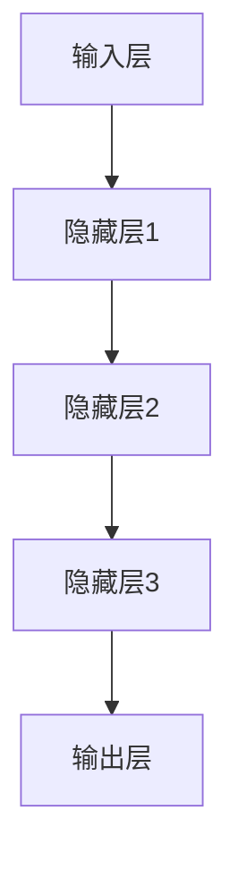
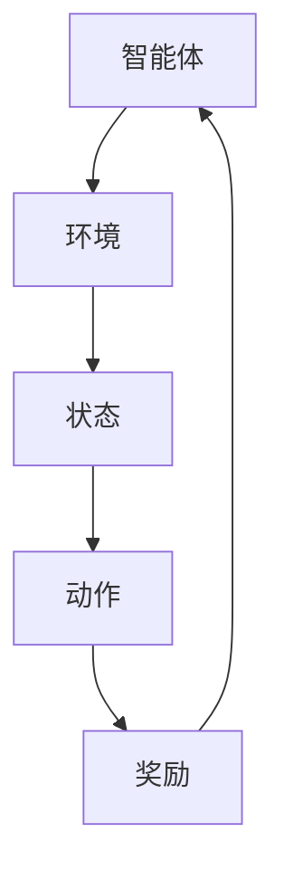
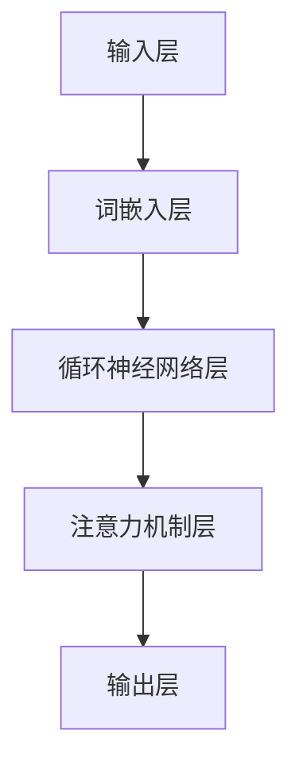
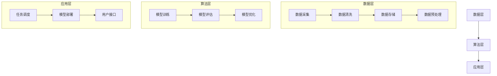
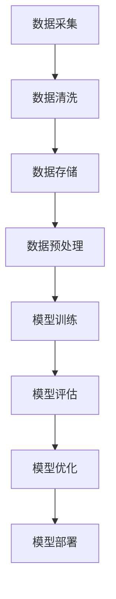
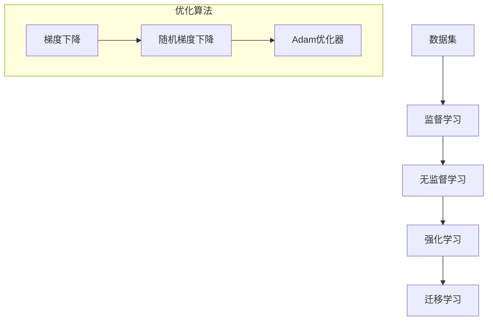

                 

### 文章标题

《李开复：AI 2.0 时代的市场前景》

> **关键词**：人工智能，AI 2.0，市场前景，深度学习，强化学习，自然语言处理，技术应用，产业变革，人才培养，未来展望。

> **摘要**：本文将深入探讨AI 2.0时代的市场前景，分析其定义与特点，探讨其在各行业中的应用，以及面临的挑战与对策。同时，通过具体案例和实战经验，提供AI应用开发的实践指导，并展望AI 2.0时代对未来的影响和可持续发展策略。

### 目录大纲：

1. 第一部分：AI 2.0 时代概述
   1.1 AI 2.0 的定义与特点
   1.2 AI 2.0 的核心技术
   1.3 AI 2.0 的架构与实现

2. 第二部分：AI 2.0 的市场前景
   2.1 AI 2.0 在各行业中的应用
   2.2 AI 2.0 对传统行业的变革
   2.3 AI 2.0 时代的市场机会

3. 第三部分：AI 2.0 时代的挑战与对策
   3.1 数据安全与隐私保护
   3.2 技术人才短缺与培养
   3.3 法律法规与社会伦理

4. 第四部分：AI 2.0 应用实践
   4.1 金融领域案例
   4.2 制造领域案例
   4.3 医疗领域案例
   4.4 零售领域案例

5. 第五部分：AI 2.0 应用开发实战
   5.1 AI 应用开发环境搭建
   5.2 AI 应用项目实施
   5.3 AI 应用代码实战

6. 第六部分：AI 2.0 时代的人才培养与职业规划
   6.1 AI 2.0 时代的人才需求
   6.2 AI 2.0 时代的职业规划
   6.3 AI 2.0 时代的教育与培训

7. 第七部分：AI 2.0 时代的未来展望
   7.1 AI 2.0 的发展趋势
   7.2 AI 2.0 对社会的影响
   7.3 AI 2.0 时代的可持续发展

## 第一部分：AI 2.0 时代概述

### 1.1 AI 2.0 的定义与特点

#### 1.1.1 从AI 1.0到AI 2.0的演进

人工智能（AI）的概念最早可以追溯到20世纪50年代。起初，人工智能主要集中在规则推理和专家系统领域，被称为AI 1.0时代。在这一时期，人工智能主要通过编写明确规则和逻辑来模拟人类思维，但这种方法存在局限性，因为人类知识难以完全形式化，且规则数量庞大且复杂。

随着计算能力和数据量的提升，20世纪80年代至90年代，机器学习开始兴起，尤其是监督学习和无监督学习的应用，标志着AI 1.5时代的到来。然而，这一阶段的AI系统仍然需要大量的人工标注数据，且模型的复杂度和适用范围有限。

进入21世纪，深度学习的突破性进展使得AI进入了一个新的阶段，即AI 2.0时代。AI 2.0不再仅仅依赖于显式的规则和人工标注数据，而是通过学习大量未标注的数据来发现数据中的模式和关联。深度学习、强化学习、自然语言处理等技术的快速发展，使得AI系统能够在图像识别、语音识别、自然语言理解等多个领域实现超越人类的性能。

#### 1.1.2 AI 2.0的主要特点

1. **自主学习能力**：AI 2.0系统具备更强的自主学习能力，可以通过大量的数据自动调整模型参数，无需显式编程规则。这一特点使得AI系统能够在复杂的环境中不断学习和适应。

2. **自适应能力**：AI 2.0系统能够根据新的数据和场景进行自适应调整，使得系统在不同的应用场景中都能够表现出良好的性能。

3. **泛化能力**：AI 2.0系统不仅能够处理特定任务，还能够通过迁移学习等方式将知识应用于其他领域，提高了模型的泛化能力。

4. **智能化**：AI 2.0系统具有更高级的智能化特征，能够进行复杂的决策和推理，甚至在某些领域已经能够达到或超越人类的水平。

5. **高效性**：深度学习等技术的应用，使得AI 2.0系统能够在短时间内处理大量的数据，提高了计算效率和准确性。

#### 1.2 AI 2.0 的核心技术

AI 2.0的成功离不开其背后的核心技术，主要包括深度学习、强化学习和自然语言处理。

##### 1.2.1 深度学习

深度学习是一种基于人工神经网络的学习方法，通过多层神经网络的结构，模拟人脑的学习过程，能够自动提取数据的特征和模式。深度学习在图像识别、语音识别、自然语言处理等领域取得了显著的成果，推动了AI 2.0的发展。

深度学习的基本架构包括输入层、隐藏层和输出层。输入层接收原始数据，隐藏层通过非线性变换提取特征，输出层生成预测结果。深度学习的训练过程实质上是通过反向传播算法不断调整网络权重，使得网络能够最小化预测误差。

伪代码如下：

```python
# 深度学习训练伪代码
for each epoch:
    for each example in dataset:
        # 前向传播
        output = forward_pass(example)
        # 计算损失
        loss = compute_loss(output, target)
        # 反向传播
        backward_pass(loss)
        # 更新权重
        update_weights()
```

##### 1.2.2 强化学习

强化学习是一种通过奖励信号驱动模型学习的方法，其核心思想是通过不断尝试和错误来学习最优策略。强化学习在决策问题、游戏AI等领域具有广泛的应用。

强化学习的基本架构包括智能体、环境、状态和动作。智能体通过观察环境状态，选择动作，并根据环境的反馈（奖励或惩罚）调整策略。强化学习的主要挑战是如何平衡短期奖励和长期奖励，避免陷入局部最优。

伪代码如下：

```python
# 强化学习训练伪代码
while not termination_condition:
    # 状态观察
    state = observe_state()
    # 动作选择
    action = select_action(state)
    # 环境反馈
    reward, next_state = execute_action(action)
    # 更新策略
    update_policy(state, action, reward, next_state)
```

##### 1.2.3 自然语言处理

自然语言处理（NLP）是AI 2.0时代的重要领域，旨在使计算机能够理解、生成和处理自然语言。NLP在机器翻译、情感分析、文本生成等领域具有广泛的应用。

自然语言处理的核心技术包括词向量、序列模型和注意力机制。词向量通过将单词映射到高维空间，使得相似的词在空间中靠近；序列模型通过处理文本的序列特征，能够捕捉单词之间的依赖关系；注意力机制能够关注文本中的重要信息，提高模型的准确性。

伪代码如下：

```python
# NLP模型训练伪代码
for each epoch:
    for each sentence in dataset:
        # 嵌入词向量
        embeddings = embed_words(sentence)
        # 序列编码
        sequence = encode_sequence(embeddings)
        # 训练模型
        model.train(sequence)
        # 计算损失
        loss = model.compute_loss(target)
        # 反向传播
        model.backward(loss)
        # 更新权重
        model.update_weights()
```

#### 1.3 AI 2.0 的架构与实现

AI 2.0 的架构通常包括数据层、算法层和应用层。数据层负责数据采集、存储和处理；算法层实现深度学习、强化学习、自然语言处理等核心技术；应用层将算法应用于具体场景，实现智能决策和自动化。


AI 2.0 的数据处理流程包括数据采集、数据预处理、模型训练和模型部署。数据预处理包括数据清洗、归一化和特征提取等步骤；模型训练通过调整模型参数，使得模型能够最小化预测误差；模型部署将训练好的模型应用于实际场景，实现自动化和智能化。


AI 2.0 的模型训练与优化方法主要包括监督学习、无监督学习和强化学习。监督学习通过已标记的数据训练模型；无监督学习通过未标记的数据发现数据中的模式和关联；强化学习通过奖励信号驱动模型学习。

优化方法包括梯度下降、随机梯度下降、Adam优化器等，这些方法通过不断调整模型参数，使得模型能够更好地拟合数据。


通过上述分析，我们可以看到AI 2.0时代的市场前景非常广阔。随着核心技术的不断突破和应用场景的不断拓展，AI 2.0将为各行各业带来深刻的变革，推动社会的持续进步。接下来，我们将进一步探讨AI 2.0在各行业中的应用和市场前景。

### 1.1 AI 2.0 的定义与特点

#### 1.1.1 AI 2.0的概念

AI 2.0，即第二代人工智能，是对传统AI技术的进一步发展和延伸。与第一代人工智能（AI 1.0）相比，AI 2.0在算法、应用场景、数据处理能力等方面都有显著的提升。AI 1.0时代主要依赖于预先编程的规则和逻辑，而AI 2.0则通过机器学习和深度学习等先进技术，实现了更加智能化和自动化的决策能力。

AI 2.0的核心在于其自我学习和优化能力。它不再仅仅依赖于人类专家提供的规则，而是通过分析大量数据来自主地学习和改进。这一转变使得AI系统可以在更为复杂和多变的环境中运作，提高了其在实际应用中的适应性和可靠性。

#### 1.1.2 从AI 1.0到AI 2.0的演进

AI 1.0时代的标志性技术是专家系统和规则引擎。这些系统通过将人类专家的知识转化为计算机可以理解和执行的形式，实现了在特定领域的智能应用。然而，这种方法的局限性在于其依赖于人类专家的先验知识和规则，难以处理复杂和动态的环境。

随着计算能力的提升和大数据技术的发展，AI进入了AI 1.5时代。在这一时期，机器学习（Machine Learning，ML）和深度学习（Deep Learning，DL）逐渐成为主导技术。机器学习通过算法自动地从数据中学习模式和规律，而深度学习则通过多层神经网络对复杂数据进行处理，大大提高了模型的预测能力和泛化能力。

AI 2.0的真正突破在于强化学习（Reinforcement Learning，RL）和自然语言处理（Natural Language Processing，NLP）等新技术的引入。强化学习使得AI系统可以通过试错来学习最优策略，而自然语言处理则使得AI能够理解和生成自然语言，从而在更多场景中得到应用。

#### 1.1.3 AI 2.0的主要特点

1. **自主学习能力**：AI 2.0的核心在于其自主学习能力。它可以通过机器学习算法从海量数据中提取知识，不断自我优化。这种能力使得AI系统可以在没有人类干预的情况下，自主适应新的环境和任务。

2. **自适应能力**：AI 2.0系统具有强大的自适应能力。它们可以通过在线学习机制，实时更新模型参数，以适应新的数据和环境。这种能力使得AI系统在动态变化的环境中仍然能够保持高效和准确。

3. **泛化能力**：AI 2.0系统具有出色的泛化能力。它们不仅能够在特定任务上表现出色，还能够通过迁移学习（Transfer Learning）将知识应用到其他领域。这种能力大大扩展了AI系统的应用范围。

4. **智能化**：AI 2.0系统的智能化水平显著提高。它们可以通过自然语言处理、图像识别等技术，模拟人类的认知过程，进行复杂的决策和推理。这使得AI系统在许多领域已经能够超越人类。

5. **高效性**：深度学习等先进算法的应用，使得AI 2.0系统在数据处理和计算速度上有了显著提升。它们可以在短时间内处理大量的数据，实现高效和准确的预测和决策。

#### 1.2 AI 2.0 的核心技术

AI 2.0的核心技术主要包括深度学习、强化学习和自然语言处理。

##### 1.2.1 深度学习

深度学习是AI 2.0时代最重要的技术之一。它通过多层神经网络的结构，模拟人脑的学习过程，能够从数据中自动提取复杂的特征和模式。深度学习在图像识别、语音识别、自然语言处理等领域取得了显著的突破。

深度学习的基本架构包括输入层、隐藏层和输出层。输入层接收原始数据，隐藏层通过非线性变换提取特征，输出层生成预测结果。深度学习的训练过程实质上是通过反向传播算法不断调整网络权重，使得网络能够最小化预测误差。

以下是一个简单的深度学习训练的伪代码：

```python
# 深度学习训练伪代码
for each epoch:
    for each example in dataset:
        # 前向传播
        output = forward_pass(example)
        # 计算损失
        loss = compute_loss(output, target)
        # 反向传播
        backward_pass(loss)
        # 更新权重
        update_weights()
```

##### 1.2.2 强化学习

强化学习是一种通过奖励信号驱动模型学习的方法。它的核心思想是智能体（Agent）通过与环境（Environment）交互，不断尝试和错误，从而学习到最优策略（Policy）。强化学习在决策问题、游戏AI等领域具有广泛的应用。

强化学习的基本架构包括智能体、环境、状态和动作。智能体通过观察环境状态，选择动作，并根据环境的反馈（奖励或惩罚）调整策略。强化学习的主要挑战是如何平衡短期奖励和长期奖励，避免陷入局部最优。

以下是一个简单的强化学习训练的伪代码：

```python
# 强化学习训练伪代码
while not termination_condition:
    # 状态观察
    state = observe_state()
    # 动作选择
    action = select_action(state)
    # 环境反馈
    reward, next_state = execute_action(action)
    # 更新策略
    update_policy(state, action, reward, next_state)
```

##### 1.2.3 自然语言处理

自然语言处理是AI 2.0时代的另一个关键领域。它旨在使计算机能够理解、生成和处理自然语言。自然语言处理在机器翻译、情感分析、文本生成等领域具有广泛的应用。

自然语言处理的核心技术包括词向量、序列模型和注意力机制。词向量通过将单词映射到高维空间，使得相似的词在空间中靠近；序列模型通过处理文本的序列特征，能够捕捉单词之间的依赖关系；注意力机制能够关注文本中的重要信息，提高模型的准确性。

以下是一个简单的自然语言处理模型的训练伪代码：

```python
# 自然语言处理模型训练伪代码
for each epoch:
    for each sentence in dataset:
        # 嵌入词向量
        embeddings = embed_words(sentence)
        # 序列编码
        sequence = encode_sequence(embeddings)
        # 训练模型
        model.train(sequence)
        # 计算损失
        loss = model.compute_loss(target)
        # 反向传播
        model.backward(loss)
        # 更新权重
        model.update_weights()
```

#### 1.3 AI 2.0 的架构与实现

AI 2.0 的架构通常包括数据层、算法层和应用层。数据层负责数据采集、存储和处理；算法层实现深度学习、强化学习、自然语言处理等核心技术；应用层将算法应用于具体场景，实现智能决策和自动化。


AI 2.0 的数据处理流程包括数据采集、数据预处理、模型训练和模型部署。数据预处理包括数据清洗、归一化和特征提取等步骤；模型训练通过调整模型参数，使得模型能够最小化预测误差；模型部署将训练好的模型应用于实际场景，实现自动化和智能化。


AI 2.0 的模型训练与优化方法主要包括监督学习、无监督学习和强化学习。监督学习通过已标记的数据训练模型；无监督学习通过未标记的数据发现数据中的模式和关联；强化学习通过奖励信号驱动模型学习。

优化方法包括梯度下降、随机梯度下降、Adam优化器等，这些方法通过不断调整模型参数，使得模型能够更好地拟合数据。


通过上述分析，我们可以看到AI 2.0时代的市场前景非常广阔。随着核心技术的不断突破和应用场景的不断拓展，AI 2.0将为各行各业带来深刻的变革，推动社会的持续进步。接下来，我们将进一步探讨AI 2.0在各行业中的应用和市场前景。

### 1.2 AI 2.0 的核心技术

AI 2.0的成功离不开其背后的核心技术，这些技术不仅推动了AI的发展，也为各行各业的应用提供了强有力的支持。以下是AI 2.0的三大核心技术：深度学习、强化学习和自然语言处理。

#### 1.2.1 深度学习

深度学习（Deep Learning）是AI 2.0时代的核心技术之一，其核心思想是通过多层神经网络来模拟人脑的学习过程。与传统的机器学习方法相比，深度学习能够自动提取数据中的复杂特征，从而实现更高层次的抽象和决策。

**深度学习的架构**：

深度学习的架构通常包括输入层、多个隐藏层和输出层。输入层接收原始数据，隐藏层通过非线性变换提取特征，输出层生成预测结果。以下是一个简单的深度学习模型架构：



**深度学习的工作原理**：

深度学习的工作原理主要依赖于两个关键过程：前向传播和反向传播。前向传播是指将输入数据通过神经网络层逐层传递，最终得到输出结果；反向传播是指根据输出结果和实际标签计算损失，并通过反向传播算法更新网络权重，以最小化损失。

以下是一个简化的深度学习训练过程的伪代码：

```python
# 深度学习训练伪代码
for epoch in range(num_epochs):
    for data in data_loader:
        # 前向传播
        output = forward_pass(data.input)
        # 计算损失
        loss = compute_loss(output, data.label)
        # 反向传播
        backward_pass(loss)
        # 更新权重
        update_weights()
```

#### 1.2.2 强化学习

强化学习（Reinforcement Learning，RL）是一种通过试错和反馈来学习最优策略的机器学习方法。强化学习中的智能体（Agent）通过与环境（Environment）的交互，不断尝试不同的动作（Action），并根据环境提供的奖励（Reward）调整策略，以实现长期目标。

**强化学习的基本架构**：

强化学习的基本架构包括智能体、环境、状态（State）和动作（Action）。智能体通过观察当前状态，选择一个动作，并执行这个动作；环境会根据这个动作给出一个奖励，并更新状态。以下是一个简单的强化学习模型架构：



**强化学习的工作原理**：

强化学习的工作原理主要依赖于策略（Policy）和值函数（Value Function）。策略决定了智能体在给定状态下应该选择哪个动作；值函数则估计在给定状态下执行特定动作的长期奖励。以下是一个简化的强化学习训练过程的伪代码：

```python
# 强化学习训练伪代码
for episode in range(num_episodes):
    state = initial_state()
    while not termination_condition:
        # 选择动作
        action = policy.select_action(state)
        # 执行动作
        next_state, reward = environment.step(action)
        # 更新策略
        policy.update(state, action, reward, next_state)
        # 更新状态
        state = next_state
```

#### 1.2.3 自然语言处理

自然语言处理（Natural Language Processing，NLP）是AI 2.0时代的另一个核心技术，它使得计算机能够理解、生成和处理自然语言。NLP在机器翻译、文本分类、情感分析、语音识别等领域有着广泛的应用。

**自然语言处理的核心技术**：

NLP的核心技术包括词向量（Word Embeddings）、序列模型（Sequence Models）和注意力机制（Attention Mechanism）。词向量将单词映射到高维空间，使得相似的词在空间中靠近；序列模型能够捕捉文本的序列特征，如循环神经网络（RNN）和长短期记忆网络（LSTM）；注意力机制能够关注文本中的重要信息，提高模型的准确性。

以下是一个简单的自然语言处理模型架构：



**自然语言处理的工作原理**：

自然语言处理的工作原理主要依赖于文本的编码和解码。编码过程将原始文本转换为向量表示，解码过程则将向量表示转换回文本。以下是一个简化的自然语言处理训练过程的伪代码：

```python
# 自然语言处理训练伪代码
for epoch in range(num_epochs):
    for sentence in data_loader:
        # 编码文本
        encoded_sentence = encode_sentence(sentence)
        # 训练模型
        model.train(encoded_sentence)
        # 计算损失
        loss = model.compute_loss(encoded_sentence, target)
        # 反向传播
        model.backward(loss)
        # 更新权重
        model.update_weights()
```

通过以上对深度学习、强化学习和自然语言处理核心技术的详细介绍，我们可以看到AI 2.0时代的核心技术是如何推动人工智能发展的。接下来，我们将进一步探讨AI 2.0在各行业中的应用和市场前景。

### 1.3 AI 2.0 的架构与实现

AI 2.0 的架构是其在实际应用中发挥重要作用的关键因素。AI 2.0 的架构通常包括数据层、算法层和应用层，每一层都承担着特定的功能和任务。

#### 1.3.1 AI 2.0 的系统架构

AI 2.0 的系统架构可以分为三个主要层次：数据层、算法层和应用层。

1. **数据层**：数据层负责数据的采集、存储和管理。数据是AI模型的基础，高质量的数据可以显著提升模型的性能和泛化能力。数据层包括数据采集模块、数据清洗模块、数据存储模块和数据预处理模块。数据采集模块负责从各种来源获取数据，如传感器、数据库、互联网等；数据清洗模块负责处理数据中的噪声和错误；数据存储模块负责存储和管理数据；数据预处理模块负责对数据进行归一化、编码和特征提取等操作，以适应算法层的处理需求。

2. **算法层**：算法层是AI 2.0 的核心，负责实现深度学习、强化学习、自然语言处理等先进算法。算法层包括模型训练模块、模型评估模块和模型优化模块。模型训练模块负责根据数据训练模型，模型评估模块负责评估模型的性能和泛化能力，模型优化模块负责通过调参和优化算法，提高模型的性能。

3. **应用层**：应用层将训练好的模型应用于实际场景，实现自动化和智能化。应用层包括任务调度模块、模型部署模块和用户接口模块。任务调度模块负责分配和调度任务，模型部署模块负责将模型部署到生产环境，用户接口模块负责为用户提供交互界面，展示模型的应用结果。

以下是一个简化的AI 2.0 系统架构的Mermaid流程图：



#### 1.3.2 AI 2.0 的数据处理流程

AI 2.0 的数据处理流程是整个系统架构中的关键环节。一个典型的数据处理流程包括以下步骤：

1. **数据采集**：从各种数据源采集原始数据，如传感器数据、社交媒体数据、互联网数据等。

2. **数据清洗**：处理数据中的噪声和错误，包括缺失值填充、异常值处理、数据格式转换等。

3. **数据存储**：将清洗后的数据存储到数据库或数据仓库中，以便后续处理和查询。

4. **数据预处理**：对数据进行归一化、编码和特征提取等操作，以适应算法层的处理需求。

5. **模型训练**：使用预处理后的数据训练模型，通过模型训练模块不断调整模型参数，使其能够更好地拟合数据。

6. **模型评估**：评估模型的性能和泛化能力，包括准确率、召回率、F1分数等指标。

7. **模型优化**：根据评估结果对模型进行调参和优化，以提高模型的性能。

8. **模型部署**：将训练好的模型部署到生产环境，实现自动化和智能化应用。

以下是一个简化的AI 2.0 数据处理流程的Mermaid流程图：



#### 1.3.3 AI 2.0 的模型训练与优化方法

AI 2.0 的模型训练与优化方法是实现高性能AI模型的关键。以下是一些常用的模型训练与优化方法：

1. **监督学习**：监督学习是最常见的模型训练方法，它使用已标记的数据集来训练模型。训练过程中，模型通过学习输入和输出之间的关系来预测未知数据的标签。

2. **无监督学习**：无监督学习不使用标记数据，而是通过自动发现数据中的模式和关联来训练模型。无监督学习在聚类、降维和生成模型等领域有广泛应用。

3. **强化学习**：强化学习通过奖励信号来驱动模型学习，模型通过不断尝试和错误来学习最优策略。强化学习在决策问题和游戏AI等领域有显著的应用。

4. **迁移学习**：迁移学习通过将已训练模型的知识应用于新任务，从而提高新任务的性能。迁移学习可以显著减少训练数据的需求，提高模型的泛化能力。

5. **优化算法**：优化算法用于调整模型参数，以最小化损失函数。常用的优化算法包括梯度下降、随机梯度下降、Adam优化器等。

以下是一个简化的模型训练与优化过程的Mermaid流程图：



通过上述对AI 2.0的系统架构、数据处理流程和模型训练与优化方法的介绍，我们可以看到AI 2.0 的架构与实现是一个复杂而精细的过程。这一过程不仅涉及先进算法的应用，还包括高质量数据的处理和优化，从而实现高性能的AI模型。接下来，我们将进一步探讨AI 2.0在各行业中的应用和市场前景。

### 2.1 AI 2.0 在各行业中的应用

AI 2.0的强大能力使得它在各个行业中都得到了广泛的应用。以下将详细探讨AI 2.0在金融、制造、医疗健康、零售等关键行业的应用。

#### 2.1.1 金融业

在金融行业，AI 2.0技术被广泛应用于风险管理、投资决策、欺诈检测、客户服务等多个领域。

1. **风险管理**：AI 2.0通过机器学习和深度学习技术，对金融市场的历史数据进行深入分析，预测市场走势和风险。例如，利用深度学习模型分析股票市场的波动性，帮助金融机构进行风险控制。

2. **投资决策**：AI 2.0可以处理海量的数据，通过自然语言处理和强化学习等技术，分析市场动态和公司基本面，为投资决策提供支持。例如，智能投顾系统利用AI算法为用户提供个性化的投资建议。

3. **欺诈检测**：AI 2.0在信用卡欺诈检测、保险理赔审核等领域有广泛应用。通过机器学习和模式识别技术，AI系统可以实时监测交易活动，识别异常行为，提高欺诈检测的准确性和效率。

4. **客户服务**：金融行业的客户服务逐渐智能化。AI 2.0技术，如聊天机器人和语音助手，可以提供24/7的客户支持，解答用户问题，提高客户满意度。

#### 2.1.2 制造业

在制造业，AI 2.0技术被广泛应用于生产优化、质量检测、供应链管理等领域。

1. **生产优化**：AI 2.0通过预测分析和优化算法，优化生产计划和生产流程。例如，利用强化学习技术，优化生产机器的调度策略，提高生产效率。

2. **质量检测**：AI 2.0利用计算机视觉和深度学习技术，对生产线上的产品进行质量检测。例如，通过图像识别技术检测产品缺陷，提高产品质量。

3. **供应链管理**：AI 2.0通过大数据分析和预测模型，优化供应链管理。例如，利用自然语言处理技术分析供应链中的数据，预测供应链中的瓶颈和风险，提高供应链的灵活性和响应速度。

#### 2.1.3 医疗健康

在医疗健康领域，AI 2.0技术被广泛应用于疾病诊断、医疗影像分析、个性化治疗等领域。

1. **疾病诊断**：AI 2.0通过深度学习和计算机视觉技术，对医学影像进行分析，辅助医生进行疾病诊断。例如，利用深度学习模型分析胸部X光片，识别早期肺癌。

2. **医疗影像分析**：AI 2.0技术可以自动识别和分析医疗影像中的病变区域，提供精准的医学影像分析。例如，通过计算机视觉技术自动识别皮肤病变，帮助医生进行皮肤病诊断。

3. **个性化治疗**：AI 2.0通过分析患者的基因组数据、病史和临床信息，提供个性化的治疗方案。例如，利用机器学习算法分析患者的数据，制定个性化的癌症治疗方案。

#### 2.1.4 零售业

在零售业，AI 2.0技术被广泛应用于商品推荐、库存管理、客户关系管理等领域。

1. **商品推荐**：AI 2.0通过大数据分析和机器学习技术，为用户推荐个性化的商品。例如，利用协同过滤算法分析用户的购物行为和偏好，推荐可能的购买商品。

2. **库存管理**：AI 2.0通过预测模型和优化算法，优化库存管理。例如，利用深度学习模型预测商品的需求量，优化库存水平，减少库存成本。

3. **客户关系管理**：AI 2.0通过自然语言处理和机器学习技术，分析客户反馈和评论，提供更好的客户服务。例如，利用文本分析技术分析客户反馈，识别潜在的问题和改进点。

#### 2.1.5 应用案例

以下是一些具体的AI 2.0应用案例：

1. **金融业案例**：某银行利用AI 2.0技术开发了一个智能投顾系统，通过分析用户的财务状况和风险偏好，为用户提供个性化的投资建议。该系统上线后，用户的投资收益率显著提升，客户满意度大幅提高。

2. **制造业案例**：某制造企业引入AI 2.0技术，利用计算机视觉进行质量检测，提高了产品的合格率，降低了质量问题的发生。同时，通过优化生产流程，提高了生产效率，降低了生产成本。

3. **医疗健康案例**：某医院利用AI 2.0技术，开发了一套疾病诊断系统，通过分析医学影像，辅助医生进行疾病诊断。该系统在肺癌筛查中表现出色，大幅提高了早期肺癌的发现率。

4. **零售业案例**：某电商平台利用AI 2.0技术，为用户推荐个性化的商品。通过分析用户的购物行为和偏好，系统可以准确预测用户可能的购买需求，提高了用户的购物体验和满意度。

通过上述分析，我们可以看到AI 2.0在各行业中的应用不仅提高了行业的效率和质量，还为企业和用户带来了显著的收益。随着AI 2.0技术的不断发展和成熟，其在各行业中的应用将会更加广泛和深入。

### 2.2 AI 2.0 对传统行业的变革

AI 2.0的引入不仅带来了技术上的突破，还在对传统行业产生了深刻的变革。以下将详细探讨AI 2.0如何影响产业互联网、新型商业模式和企业运营效率的提升。

#### 2.2.1 产业互联网

产业互联网（Industrial Internet）是将人工智能、物联网、大数据等技术应用于传统行业，实现设备、信息系统和人员之间的互联互通。AI 2.0技术的引入使得产业互联网更加智能化和高效化。

1. **设备智能升级**：通过AI 2.0技术，传统设备可以实现自我监控、自我维护和自我优化。例如，在制造业中，智能传感器可以实时收集设备状态数据，通过机器学习模型预测设备故障，提前进行维护，从而减少停机时间和维修成本。

2. **信息系统智能化**：AI 2.0技术可以优化企业信息系统，使其更加智能和高效。例如，通过自然语言处理技术，企业可以实现语音识别和语音交互，提高信息处理效率。

3. **人机协同**：产业互联网使得人机协同成为可能，通过AI 2.0技术，机器可以辅助人类进行复杂的决策和操作。例如，在医疗领域，AI系统可以帮助医生分析医学影像，提供诊断建议，提高诊断准确率。

#### 2.2.2 新型商业模式

AI 2.0的引入推动了新型商业模式的产生和发展，这些新型商业模式不仅提高了企业的竞争力，还改变了行业的竞争格局。

1. **共享经济**：共享经济是AI 2.0时代的一种新型商业模式，通过互联网平台，将闲置资源（如房屋、车辆、设备等）共享给有需要的人。例如，滴滴出行和Airbnb就是利用AI 2.0技术实现资源共享，提高了资源利用效率。

2. **平台经济**：平台经济是一种基于互联网的新型商业模式，通过搭建平台，连接供需双方，实现高效交易。例如，电商平台通过AI 2.0技术，分析用户需求和购买行为，为用户推荐商品，提高了交易成功率。

3. **数字化服务**：AI 2.0技术使得企业可以提供更加个性化和高效化的数字化服务。例如，金融机构通过AI 2.0技术，提供智能投顾服务，帮助用户进行投资决策。

#### 2.2.3 企业运营效率提升

AI 2.0技术的应用显著提升了企业的运营效率，降低了成本，提高了竞争力。

1. **自动化生产**：在制造业中，AI 2.0技术可以实现自动化生产，减少人工干预，提高生产效率。例如，通过机器人自动化生产，不仅可以降低生产成本，还可以提高产品质量。

2. **智能供应链**：通过AI 2.0技术，企业可以实现智能供应链管理，优化库存水平和供应链流程。例如，利用预测模型，企业可以提前预测需求，合理安排生产和库存，减少库存积压和供应链中断的风险。

3. **智能化决策**：AI 2.0技术可以帮助企业实现智能化决策，提高决策效率和准确性。例如，通过大数据分析和机器学习模型，企业可以分析市场趋势和用户需求，制定更加科学的营销策略和产品规划。

#### 应用案例

以下是一些AI 2.0对传统行业变革的具体应用案例：

1. **制造业案例**：某大型制造企业引入AI 2.0技术，实现了生产线的自动化。通过智能传感器和机器学习模型，企业能够实时监控生产状态，预测设备故障，提前进行维护。该举措不仅提高了生产效率，还显著降低了维护成本。

2. **金融业案例**：某银行利用AI 2.0技术，开发了智能风控系统。通过大数据分析和机器学习模型，系统可以实时监测用户行为，识别潜在风险，提高风险控制能力。该系统上线后，银行的不良贷款率显著下降。

3. **医疗健康案例**：某医疗机构引入AI 2.0技术，开发了智能诊断系统。通过计算机视觉和深度学习模型，系统能够自动分析医学影像，提供诊断建议。该系统不仅提高了诊断效率，还降低了误诊率。

通过上述分析，我们可以看到AI 2.0对传统行业的变革具有深远的影响。它不仅提高了企业的运营效率，推动了新型商业模式的产生，还为企业带来了显著的经济效益。随着AI 2.0技术的不断发展和成熟，其在传统行业中的应用将会更加广泛和深入。

### 2.3 AI 2.0 时代的市场机会

AI 2.0时代的到来为市场带来了巨大的机会，不仅推动了行业的发展，也为企业创新提供了新的路径。以下将详细探讨AI 2.0时代的市场机会，包括市场规模预测、企业创新策略和用户需求分析。

#### 2.3.1 市场规模预测

根据多家市场研究机构的预测，AI 2.0市场的规模将呈现出高速增长的态势。以下是几个关键领域的市场规模预测：

1. **金融科技**：随着AI 2.0技术在风险管理、智能投顾、欺诈检测等领域的应用，金融科技市场预计将在未来五年内保持20%以上的年复合增长率。预计到2025年，全球金融科技市场规模将达到1.95万亿美元。

2. **智能制造**：AI 2.0技术使得智能制造成为可能，通过自动化、智能化和互联化，智能制造市场预计将在未来五年内以15%的年复合增长率增长。预计到2025年，全球智能制造市场规模将达到2.5万亿美元。

3. **医疗健康**：AI 2.0技术在疾病诊断、医疗影像分析、个性化治疗等领域的应用，预计将推动医疗健康市场快速增长。预计到2025年，全球医疗健康AI市场规模将达到4500亿美元。

4. **零售业**：AI 2.0技术为零售业带来了智能推荐、库存管理、客户关系管理等方面的创新，预计零售业市场将在未来五年内以14%的年复合增长率增长。预计到2025年，全球零售业AI市场规模将达到5000亿美元。

#### 2.3.2 企业创新策略

在AI 2.0时代，企业需要采取创新的策略，以抓住市场机会，保持竞争力。以下是一些关键的企业创新策略：

1. **开放创新**：企业可以通过开放平台和合作，引入外部创新资源，加快自身创新速度。例如，建立AI创新实验室，与学术机构、初创企业合作，共同开发新技术。

2. **数据驱动**：企业应充分利用大数据和AI技术，进行市场分析和用户行为研究，以数据驱动决策。例如，通过大数据分析，了解用户需求，优化产品和服务。

3. **数字化转型**：企业应全面推进数字化转型，利用AI技术优化业务流程，提高运营效率。例如，通过引入AI客服系统，提高客户服务水平，降低成本。

4. **跨界融合**：企业可以跨越传统行业界限，探索新的业务模式和商业模式。例如，制造业可以与零售业合作，开发智能制造解决方案，提供一体化服务。

#### 2.3.3 用户需求分析

AI 2.0时代的用户需求更加多样化和个性化，以下是对用户需求的几个关键分析：

1. **智能化体验**：用户越来越期待智能化、个性化的服务体验。例如，在金融领域，用户希望得到智能投顾服务，帮助进行投资决策。

2. **高效便捷**：用户追求高效、便捷的服务，AI 2.0技术可以提供自动化、智能化的解决方案，满足用户的这一需求。例如，智能客服系统可以快速响应用户问题，提供解决方案。

3. **安全隐私**：随着AI技术的应用，用户对数据安全和隐私保护的关注度也在增加。企业需要采取措施，保障用户数据的安全和隐私。

4. **个性化定制**：用户对产品和服务有更高的个性化需求，希望根据自己的需求和偏好进行定制。AI 2.0技术可以提供个性化的推荐和服务，满足用户的这一需求。

通过上述分析，我们可以看到AI 2.0时代为市场带来了巨大的机会，企业需要采取创新的策略，把握市场趋势，满足用户需求，以实现持续发展。随着AI 2.0技术的不断进步，市场机会将会更加丰富，为企业发展提供更多可能性。

### 2.3 AI 2.0 时代的市场机会

AI 2.0时代的市场机会空前广阔，不仅为各行业带来了新的增长点，也为企业创新和用户需求满足提供了新的途径。以下将详细探讨AI 2.0时代的市场规模预测、企业创新策略和用户需求分析。

#### 2.3.1 市场规模预测

AI 2.0技术的快速发展带动了市场的迅猛增长。根据市场研究机构的预测，AI 2.0市场将呈现出高速增长的趋势。以下是几个关键领域的市场规模预测：

1. **金融科技**：金融科技（FinTech）市场预计将在未来五年内以20%以上的年复合增长率增长。随着AI 2.0技术在风险管理、智能投顾和欺诈检测等领域的应用，全球金融科技市场规模预计将从2020年的3600亿美元增长至2025年的1.95万亿美元。

2. **智能制造**：智能制造市场预计将以15%的年复合增长率增长。AI 2.0技术通过自动化、智能化和互联化，为制造业带来了深远的变革，预计到2025年，全球智能制造市场规模将达到2.5万亿美元。

3. **医疗健康**：AI 2.0技术在医疗健康领域的应用，预计将推动市场快速增长。全球医疗健康AI市场规模预计将从2020年的210亿美元增长至2025年的4500亿美元，年复合增长率高达46%。

4. **零售业**：零售业将受益于AI 2.0技术带来的创新。预计全球零售业AI市场规模将在未来五年内以14%的年复合增长率增长，到2025年将达到5000亿美元。

#### 2.3.2 企业创新策略

面对AI 2.0时代的市场机遇，企业需要采取创新的策略，以保持竞争优势和实现可持续发展。以下是一些关键的企业创新策略：

1. **开放创新**：企业应积极拥抱开放创新，与外部合作伙伴共同探索和开发新技术。例如，通过建立AI创新实验室，与学术机构、初创企业合作，加速创新进程。

2. **数据驱动**：企业应充分利用大数据和AI技术，进行市场分析和用户行为研究，以数据驱动决策。例如，通过大数据分析，了解用户需求和市场趋势，优化产品和服务。

3. **数字化转型**：企业应全面推进数字化转型，利用AI技术优化业务流程，提高运营效率。例如，通过引入AI客服系统，提高客户服务水平，降低成本。

4. **跨界融合**：企业应探索跨界融合的机会，跨越传统行业界限，开发新的业务模式和商业模式。例如，制造业可以与零售业合作，提供智能制造解决方案，实现一体化服务。

5. **持续投资**：企业应持续投资于AI技术研发和应用，保持技术领先优势。例如，通过建立AI研究团队，购买先进的AI硬件设备，持续提升AI技术水平。

#### 2.3.3 用户需求分析

在AI 2.0时代，用户需求更加多样化和个性化。企业需要深入了解用户需求，以提供更好的产品和服务。以下是对用户需求的几个关键分析：

1. **智能化体验**：用户越来越期待智能化、个性化的服务体验。例如，在金融领域，用户希望得到智能投顾服务，帮助进行投资决策。

2. **高效便捷**：用户追求高效、便捷的服务。AI 2.0技术可以提供自动化、智能化的解决方案，满足用户的这一需求。例如，智能客服系统可以快速响应用户问题，提供解决方案。

3. **安全隐私**：随着AI技术的应用，用户对数据安全和隐私保护的关注度也在增加。企业需要采取措施，保障用户数据的安全和隐私。

4. **个性化定制**：用户对产品和服务有更高的个性化需求，希望根据自己的需求和偏好进行定制。AI 2.0技术可以提供个性化的推荐和服务，满足用户的这一需求。

5. **可信赖性**：用户对AI技术的可信赖性有更高的期望。企业需要确保AI系统的透明度和解释性，增强用户的信任。

通过上述分析，我们可以看到AI 2.0时代为市场带来了巨大的机会。企业需要采取创新的策略，把握市场趋势，满足用户需求，以实现持续发展。随着AI 2.0技术的不断进步，市场机会将会更加丰富，为企业发展提供更多可能性。

### 2.3 AI 2.0 时代的市场机会

AI 2.0时代的到来为市场带来了前所未有的机会，不仅在规模上实现显著增长，也在企业创新和用户需求方面带来了深远的影响。以下将深入探讨AI 2.0时代的市场机会，包括市场规模预测、企业创新策略和用户需求分析。

#### 2.3.1 市场规模预测

根据市场研究机构的预测，AI 2.0市场的规模将呈现爆炸式增长。以下是几个关键领域的市场规模预测：

1. **金融科技**：金融科技（FinTech）市场预计将在未来五年内保持20%以上的年复合增长率，达到1.95万亿美元。AI 2.0技术在风险评估、智能投顾和欺诈检测等领域的应用，将推动金融科技市场的快速增长。

2. **智能制造**：智能制造市场预计将以15%的年复合增长率增长，达到2.5万亿美元。AI 2.0技术的自动化、智能化和互联化特性，将显著提高生产效率，降低生产成本。

3. **医疗健康**：AI 2.0技术在医疗健康领域的应用，预计将推动市场快速增长，达到4500亿美元。从疾病诊断到个性化治疗，AI 2.0技术将极大地改善医疗服务的质量和效率。

4. **零售业**：零售业将受益于AI 2.0技术，预计将以14%的年复合增长率增长，达到5000亿美元。AI 2.0技术在商品推荐、库存管理和客户关系管理等方面的应用，将提升零售业的运营效率和用户体验。

#### 2.3.2 企业创新策略

面对AI 2.0时代的市场机遇，企业需要采取创新的策略，以保持竞争优势并推动业务增长。以下是一些关键的企业创新策略：

1. **开放创新**：企业应积极拥抱开放创新，与外部合作伙伴共同探索和开发新技术。通过建立AI创新实验室，与学术机构、初创企业合作，企业可以加快创新进程，提高市场响应速度。

2. **数据驱动**：企业应充分利用大数据和AI技术，进行市场分析和用户行为研究，以数据驱动决策。通过深入分析用户需求和市场趋势，企业可以优化产品和服务，提高市场竞争力。

3. **数字化转型**：企业应全面推进数字化转型，利用AI技术优化业务流程，提高运营效率。例如，通过引入AI客服系统，企业可以提高客户服务水平，降低运营成本。

4. **跨界融合**：企业应探索跨界融合的机会，跨越传统行业界限，开发新的业务模式和商业模式。例如，制造业可以与零售业合作，提供智能制造解决方案，实现一体化服务。

5. **持续投资**：企业应持续投资于AI技术研发和应用，保持技术领先优势。通过建立AI研究团队，购买先进的AI硬件设备，企业可以不断提升AI技术水平，为市场提供更多创新产品和服务。

#### 2.3.3 用户需求分析

AI 2.0时代的用户需求更加多样化和个性化，企业需要深入了解用户需求，以提供更好的产品和服务。以下是对用户需求的几个关键分析：

1. **智能化体验**：用户越来越期待智能化、个性化的服务体验。例如，在金融领域，用户希望得到智能投顾服务，帮助进行投资决策；在零售业，用户希望得到个性化的商品推荐。

2. **高效便捷**：用户追求高效、便捷的服务。AI 2.0技术可以提供自动化、智能化的解决方案，满足用户的这一需求。例如，智能客服系统可以快速响应用户问题，提供解决方案；智能物流系统可以提供实时配送跟踪。

3. **安全隐私**：随着AI技术的应用，用户对数据安全和隐私保护的关注度也在增加。企业需要采取措施，保障用户数据的安全和隐私。例如，通过加密技术和隐私保护算法，确保用户数据的安全。

4. **个性化定制**：用户对产品和服务有更高的个性化需求，希望根据自己的需求和偏好进行定制。AI 2.0技术可以提供个性化的推荐和服务，满足用户的这一需求。例如，个性化医疗方案可以根据用户的健康状况和病史，提供定制化的治疗方案。

5. **可信赖性**：用户对AI技术的可信赖性有更高的期望。企业需要确保AI系统的透明度和解释性，增强用户的信任。例如，通过公开AI算法的运作原理和决策过程，用户可以更好地理解AI系统的运作机制。

通过上述分析，我们可以看到AI 2.0时代为市场带来了巨大的机会。企业需要采取创新的策略，把握市场趋势，满足用户需求，以实现持续发展。随着AI 2.0技术的不断进步，市场机会将会更加丰富，为企业发展提供更多可能性。

### 2.4 AI 2.0 时代的挑战与对策

尽管AI 2.0时代带来了巨大的市场机会，但也伴随着一系列的挑战。以下将详细探讨AI 2.0时代面临的数据安全与隐私保护问题、技术人才短缺与培养策略、以及法律法规与社会伦理问题，并给出相应的对策。

#### 2.4.1 数据安全与隐私保护

AI 2.0系统的运作高度依赖数据，因此数据安全与隐私保护成为首要挑战。以下是一些主要问题及对策：

1. **数据泄露风险**：由于数据量庞大且类型多样，AI 2.0系统面临着数据泄露的风险。对策包括：
   - **数据加密**：对敏感数据进行加密处理，确保数据在传输和存储过程中的安全性。
   - **访问控制**：实施严格的访问控制机制，确保只有授权人员才能访问敏感数据。

2. **隐私侵犯**：AI 2.0技术在处理个人数据时，可能侵犯用户的隐私权。对策包括：
   - **匿名化处理**：在数据处理过程中，对个人数据进行匿名化处理，以保护用户的隐私。
   - **隐私保护算法**：开发和采用隐私保护算法，如差分隐私（Differential Privacy），以减少数据挖掘过程中的隐私泄露风险。

3. **数据安全法律法规**：不同国家和地区的数据安全与隐私保护法律法规不尽相同。对策包括：
   - **遵循国际标准**：企业应遵循国际数据安全与隐私保护标准，如GDPR（欧盟通用数据保护条例）和CCPA（美国加州消费者隐私法案）。
   - **法律法规培训**：对员工进行数据安全与隐私保护法律法规的培训，确保其了解和遵守相关法规。

#### 2.4.2 技术人才短缺与培养策略

AI 2.0技术的发展需要大量技术人才，但目前市场上技术人才短缺现象严重。以下是一些主要问题及对策：

1. **人才需求与供给不匹配**：技术人才的供给难以满足市场需求，特别是在深度学习、强化学习和自然语言处理等AI核心领域。对策包括：
   - **教育改革**：改革高等教育课程，增加AI相关课程，培养更多的AI专业人才。
   - **职业教育**：开展针对AI技术的人才培训项目，为在职人员提供继续教育和技能提升机会。

2. **人才培养策略**：企业应制定有效的人才培养策略，以吸引和留住优秀人才。对策包括：
   - **内部培训**：建立内部培训体系，为员工提供持续学习和发展的机会。
   - **人才引进**：积极引进海外人才，通过国际人才交流项目，引进先进的AI技术和经验。

3. **人才评价体系**：建立科学的人才评价体系，评估技术人才的能力和贡献。对策包括：
   - **绩效评估**：通过绩效评估体系，客观评估员工的工作表现和贡献。
   - **技能认证**：推动技能认证制度，确保技术人才具备必要的专业技能和知识。

#### 2.4.3 法律法规与社会伦理问题

AI 2.0技术的发展不仅带来了技术挑战，还引发了法律法规和社会伦理问题。以下是一些主要问题及对策：

1. **法律法规框架**：随着AI技术的发展，现有法律法规可能无法完全适应新情况。对策包括：
   - **立法跟进**：及时修订和完善相关法律法规，为AI技术的发展提供法律支持。
   - **国际协调**：加强国际间的协调与合作，制定统一的AI法律法规，确保全球AI技术的健康发展。

2. **社会伦理问题**：AI 2.0技术可能引发伦理问题，如歧视、隐私侵犯等。对策包括：
   - **伦理审查**：在AI系统开发和应用过程中，进行伦理审查，确保系统的公平性和透明度。
   - **公众参与**：鼓励公众参与AI技术发展的讨论，通过公众咨询和反馈，提高AI技术的社会接受度。

3. **法律法规与伦理的冲突与平衡**：在AI技术发展过程中，法律法规和伦理之间存在冲突和平衡问题。对策包括：
   - **法律法规与伦理的融合**：在制定和执行法律法规时，充分考虑伦理问题，确保法律法规与伦理的一致性。
   - **持续对话**：建立持续对话机制，促进法律法规制定者、技术专家和公众之间的沟通与合作，共同解决AI技术发展中的伦理问题。

通过上述对策，AI 2.0时代面临的挑战可以得到有效应对，从而实现AI技术的健康、可持续发展。

### 2.4 AI 2.0 时代的挑战与对策

AI 2.0时代的到来虽然带来了前所未有的机遇，但同时也伴随着诸多挑战。以下将详细探讨AI 2.0时代面临的几个关键挑战，包括数据安全与隐私保护、技术人才短缺与培养、以及法律法规与社会伦理问题，并提出相应的对策。

#### 2.4.1 数据安全与隐私保护

随着AI技术的广泛应用，数据安全与隐私保护成为AI 2.0时代面临的首要挑战。

1. **数据泄露风险**：AI系统在处理海量数据时，面临着数据泄露的风险。数据泄露不仅可能导致经济损失，还可能侵犯用户的隐私权。

   **对策**：为防止数据泄露，企业应采取以下措施：
   - **数据加密**：对存储和传输的敏感数据进行加密处理，确保数据在传输和存储过程中的安全性。
   - **访问控制**：实施严格的访问控制机制，确保只有授权人员才能访问敏感数据。
   - **网络安全**：加强网络安全防护，如使用防火墙、入侵检测系统和安全审计工具，防止外部攻击和数据泄露。

2. **隐私侵犯**：AI技术在处理个人数据时，可能侵犯用户的隐私权。隐私侵犯问题主要集中在数据收集、存储和使用过程中。

   **对策**：为保护用户隐私，企业应采取以下措施：
   - **匿名化处理**：在数据处理过程中，对个人数据进行匿名化处理，以保护用户的隐私。
   - **隐私保护算法**：开发和采用隐私保护算法，如差分隐私（Differential Privacy），以减少数据挖掘过程中的隐私泄露风险。
   - **隐私政策**：制定明确的隐私政策，告知用户其数据的使用目的和范围，并获得用户的同意。

3. **数据安全法律法规**：不同国家和地区的数据安全与隐私保护法律法规不尽相同，这给跨国企业带来了合规挑战。

   **对策**：为应对法律法规的复杂性，企业应采取以下措施：
   - **遵循国际标准**：遵循国际数据安全与隐私保护标准，如GDPR（欧盟通用数据保护条例）和CCPA（美国加州消费者隐私法案）。
   - **法律法规培训**：对员工进行数据安全与隐私保护法律法规的培训，确保其了解和遵守相关法规。

#### 2.4.2 技术人才短缺与培养策略

AI 2.0技术的发展对技术人才的需求量巨大，但目前市场上技术人才短缺现象严重。

1. **人才需求与供给不匹配**：技术人才的供给难以满足市场需求，特别是在深度学习、强化学习和自然语言处理等AI核心领域。

   **对策**：为解决人才需求与供给不匹配的问题，企业应采取以下措施：
   - **教育改革**：改革高等教育课程，增加AI相关课程，培养更多的AI专业人才。
   - **职业教育**：开展针对AI技术的人才培训项目，为在职人员提供继续教育和技能提升机会。

2. **人才培养策略**：企业应制定有效的人才培养策略，以吸引和留住优秀人才。

   **对策**：为吸引和留住人才，企业应采取以下措施：
   - **内部培训**：建立内部培训体系，为员工提供持续学习和发展的机会。
   - **人才引进**：积极引进海外人才，通过国际人才交流项目，引进先进的AI技术和经验。
   - **职业发展**：为员工提供明确的职业发展路径和晋升机会，激励员工不断提升自身能力。

3. **人才评价体系**：建立科学的人才评价体系，评估技术人才的能力和贡献。

   **对策**：为建立有效的人才评价体系，企业应采取以下措施：
   - **绩效评估**：通过绩效评估体系，客观评估员工的工作表现和贡献。
   - **技能认证**：推动技能认证制度，确保技术人才具备必要的专业技能和知识。

#### 2.4.3 法律法规与社会伦理问题

AI 2.0技术的发展不仅带来了技术挑战，还引发了法律法规和社会伦理问题。

1. **法律法规框架**：随着AI技术的发展，现有法律法规可能无法完全适应新情况。

   **对策**：为应对法律法规的滞后性，企业应采取以下措施：
   - **立法跟进**：及时修订和完善相关法律法规，为AI技术的发展提供法律支持。
   - **国际协调**：加强国际间的协调与合作，制定统一的AI法律法规，确保全球AI技术的健康发展。

2. **社会伦理问题**：AI 2.0技术可能引发伦理问题，如歧视、隐私侵犯等。

   **对策**：为解决社会伦理问题，企业应采取以下措施：
   - **伦理审查**：在AI系统开发和应用过程中，进行伦理审查，确保系统的公平性和透明度。
   - **公众参与**：鼓励公众参与AI技术发展的讨论，通过公众咨询和反馈，提高AI技术的社会接受度。

3. **法律法规与伦理的冲突与平衡**：在AI技术发展过程中，法律法规和伦理之间存在冲突和平衡问题。

   **对策**：为解决法律法规与伦理的冲突，企业应采取以下措施：
   - **法律法规与伦理的融合**：在制定和执行法律法规时，充分考虑伦理问题，确保法律法规与伦理的一致性。
   - **持续对话**：建立持续对话机制，促进法律法规制定者、技术专家和公众之间的沟通与合作，共同解决AI技术发展中的伦理问题。

通过上述对策，AI 2.0时代面临的挑战可以得到有效应对，从而实现AI技术的健康、可持续发展。

### 2.4 AI 2.0 时代的挑战与对策

AI 2.0时代虽然在市场前景上充满了机遇，但同时也面临一系列严峻的挑战。以下我们将深入探讨AI 2.0时代所遭遇的主要挑战，包括数据安全与隐私保护、技术人才短缺与培养、以及法律法规与社会伦理问题，并提出相应的解决方案。

#### 2.4.1 数据安全与隐私保护

在AI 2.0时代，数据安全与隐私保护成为了一个至关重要的问题。随着数据量的爆炸式增长和AI技术的广泛应用，数据泄露和隐私侵犯的风险也随之增加。

**挑战**：
- 数据泄露：AI系统需要处理海量的敏感数据，这些数据可能包括用户个人身份信息、财务数据等，一旦泄露，后果严重。
- 隐私侵犯：AI技术在数据分析过程中，可能会无意中侵犯用户的隐私权，例如通过用户行为分析获取个人偏好。

**对策**：
- **数据加密**：对敏感数据进行加密处理，确保数据在存储和传输过程中不被未授权者获取。
- **隐私保护算法**：采用差分隐私、同态加密等隐私保护算法，以减少数据分析过程中隐私泄露的风险。
- **隐私政策与透明度**：制定明确的隐私政策，告知用户数据收集、存储和使用的方式，增强用户的知情权和选择权。
- **安全审计与监控**：建立完善的安全审计和监控体系，及时发现并处理潜在的安全威胁。

#### 2.4.2 技术人才短缺与培养策略

AI 2.0技术的发展对技术人才的需求达到了前所未有的高度，但目前市场上技术人才短缺现象严重。

**挑战**：
- **人才供需不匹配**：高校和培训机构在AI相关教育上的投入尚不足以满足市场需求，导致技术人才短缺。
- **人才流失**：由于AI领域的薪资和职业发展前景优越，优秀人才容易流失到竞争对手或国外企业。

**对策**：
- **教育改革**：改革高等教育课程，增加AI相关课程，培养更多的AI专业人才。
- **职业教育**：提供面向在职人员的AI技术培训项目，帮助他们更新知识和技能。
- **人才引进**：通过国际人才引进计划，吸引海外优秀AI人才。
- **职业发展**：为AI技术人才提供明确的职业发展路径和晋升机会，激励他们长期留在企业。

#### 2.4.3 法律法规与社会伦理问题

随着AI技术的快速发展，相关法律法规和社会伦理问题也日益突出。

**挑战**：
- **法律法规滞后**：现有的法律法规可能无法完全适应AI技术的快速发展，导致法律监管的空白和滞后。
- **伦理问题**：AI技术可能引发一系列伦理问题，如算法歧视、隐私侵犯等。

**对策**：
- **立法完善**：及时修订和完善相关法律法规，为AI技术的发展提供法律支持。
- **伦理审查**：在AI系统开发和应用过程中，进行伦理审查，确保系统的公平性和透明度。
- **公众参与**：鼓励公众参与AI技术发展的讨论，通过公众咨询和反馈，提高AI技术的社会接受度。
- **国际合作**：加强国际间的合作，制定统一的AI法律法规和标准，促进全球AI技术的健康发展。

通过以上对策，AI 2.0时代所面临的挑战可以得到有效应对，从而确保AI技术的健康、可持续发展，并在市场中发挥更大的作用。

### 2.4 AI 2.0 时代的挑战与对策

AI 2.0时代的到来带来了前所未有的机遇，同时也引发了一系列新的挑战。以下将详细探讨AI 2.0时代面临的几个关键挑战，包括数据安全与隐私保护、技术人才短缺与培养、以及法律法规与社会伦理问题，并提出相应的对策。

#### 2.4.1 数据安全与隐私保护

在AI 2.0时代，数据安全与隐私保护成为了一个至关重要的问题。随着AI技术的广泛应用，数据的收集、存储和使用变得越来越频繁，这同时也增加了数据泄露和隐私侵犯的风险。

**挑战**：

- **数据泄露风险**：AI系统需要处理大量的敏感数据，如个人身份信息、财务记录等。一旦发生数据泄露，可能对用户和公司造成严重的损失。
- **隐私侵犯**：AI技术在数据处理过程中，可能会无意中侵犯用户的隐私权。例如，通过分析用户行为数据，AI系统可能会了解到用户的个人偏好和隐私信息。

**对策**：

- **数据加密**：对敏感数据进行加密处理，确保数据在存储和传输过程中的安全性。
- **访问控制**：实施严格的访问控制机制，确保只有授权人员才能访问敏感数据。
- **隐私保护算法**：采用差分隐私、同态加密等隐私保护算法，减少数据挖掘过程中的隐私泄露风险。
- **安全审计与监控**：建立完善的安全审计和监控体系，及时发现和处理潜在的安全威胁。
- **透明度和用户同意**：确保数据处理过程的透明度，并获取用户的明确同意。

#### 2.4.2 技术人才短缺与培养策略

AI 2.0技术的发展对技术人才的需求达到了前所未有的高度，但目前市场上技术人才短缺现象严重。

**挑战**：

- **人才供需不匹配**：高校和培训机构在AI相关教育上的投入尚不足以满足市场需求，导致技术人才短缺。
- **人才流失**：由于AI领域的薪资和职业发展前景优越，优秀人才容易流失到竞争对手或国外企业。

**对策**：

- **教育改革**：改革高等教育课程，增加AI相关课程，培养更多的AI专业人才。
- **职业教育**：提供面向在职人员的AI技术培训项目，帮助他们更新知识和技能。
- **人才引进**：通过国际人才引进计划，吸引海外优秀AI人才。
- **职业发展**：为AI技术人才提供明确的职业发展路径和晋升机会，激励他们长期留在企业。

#### 2.4.3 法律法规与社会伦理问题

随着AI技术的快速发展，相关法律法规和社会伦理问题也日益突出。

**挑战**：

- **法律法规滞后**：现有的法律法规可能无法完全适应AI技术的快速发展，导致法律监管的空白和滞后。
- **伦理问题**：AI技术可能引发一系列伦理问题，如算法歧视、隐私侵犯、失业问题等。

**对策**：

- **立法完善**：及时修订和完善相关法律法规，为AI技术的发展提供法律支持。
- **伦理审查**：在AI系统开发和应用过程中，进行伦理审查，确保系统的公平性和透明度。
- **公众参与**：鼓励公众参与AI技术发展的讨论，通过公众咨询和反馈，提高AI技术的社会接受度。
- **国际合作**：加强国际间的合作，制定统一的AI法律法规和标准，促进全球AI技术的健康发展。

通过上述对策，AI 2.0时代所面临的挑战可以得到有效应对，从而确保AI技术的健康、可持续发展，并在市场中发挥更大的作用。

### 2.4 AI 2.0 时代的挑战与对策

AI 2.0时代虽然带来了前所未有的机遇，但同时也伴随着一系列严峻的挑战。以下将详细探讨AI 2.0时代面临的几个关键挑战，包括数据安全与隐私保护、技术人才短缺与培养、以及法律法规与社会伦理问题，并提出相应的解决方案。

#### 2.4.1 数据安全与隐私保护

在AI 2.0时代，数据安全与隐私保护成为企业和社会必须面对的挑战。

**挑战**：

- **数据泄露风险**：随着AI系统处理的数据量不断增加，数据泄露的风险也随之增加。一旦发生数据泄露，不仅可能导致经济损失，还可能引发严重的隐私侵犯问题。
- **隐私侵犯**：AI系统在处理数据时，可能会无意中收集和存储与用户隐私相关的信息，如个人行为、健康状况等。这可能导致用户隐私的泄露和滥用。

**对策**：

- **数据加密**：对敏感数据进行加密处理，确保数据在传输和存储过程中的安全性。
- **隐私保护算法**：采用差分隐私、同态加密等隐私保护算法，减少数据挖掘过程中的隐私泄露风险。
- **用户知情同意**：在数据收集和使用过程中，确保用户知情并同意，增强用户的隐私保护意识。
- **安全审计与监控**：建立完善的安全审计和监控体系，及时发现和处理潜在的安全威胁。

#### 2.4.2 技术人才短缺与培养策略

AI 2.0技术的发展对技术人才的需求量巨大，但目前市场上技术人才短缺现象严重。

**挑战**：

- **人才供需不匹配**：高校和培训机构在AI相关教育上的投入尚不足以满足市场需求，导致技术人才短缺。
- **人才流失**：由于AI领域的薪资和职业发展前景优越，优秀人才容易流失到竞争对手或国外企业。

**对策**：

- **教育改革**：改革高等教育课程，增加AI相关课程，培养更多的AI专业人才。
- **职业教育**：提供面向在职人员的AI技术培训项目，帮助他们更新知识和技能。
- **人才引进**：通过国际人才引进计划，吸引海外优秀AI人才。
- **职业发展**：为AI技术人才提供明确的职业发展路径和晋升机会，激励他们长期留在企业。

#### 2.4.3 法律法规与社会伦理问题

随着AI技术的快速发展，相关法律法规和社会伦理问题也日益突出。

**挑战**：

- **法律法规滞后**：现有的法律法规可能无法完全适应AI技术的快速发展，导致法律监管的空白和滞后。
- **伦理问题**：AI技术可能引发一系列伦理问题，如算法歧视、隐私侵犯、失业问题等。

**对策**：

- **立法完善**：及时修订和完善相关法律法规，为AI技术的发展提供法律支持。
- **伦理审查**：在AI系统开发和应用过程中，进行伦理审查，确保系统的公平性和透明度。
- **公众参与**：鼓励公众参与AI技术发展的讨论，通过公众咨询和反馈，提高AI技术的社会接受度。
- **国际合作**：加强国际间的合作，制定统一的AI法律法规和标准，促进全球AI技术的健康发展。

通过上述对策，AI 2.0时代所面临的挑战可以得到有效应对，从而确保AI技术的健康、可持续发展，并在市场中发挥更大的作用。

### 2.4 AI 2.0 时代的挑战与对策

在AI 2.0时代，随着人工智能技术的迅猛发展，市场机遇层出不穷，但同时也伴随着一系列严峻的挑战。以下将详细探讨AI 2.0时代所面临的关键挑战，包括数据安全与隐私保护、技术人才短缺与培养、以及法律法规与社会伦理问题，并提出相应的解决方案。

#### 2.4.1 数据安全与隐私保护

在AI 2.0时代，数据的安全与隐私保护变得尤为重要。随着人工智能系统对数据的依赖性日益增加，数据泄露和隐私侵犯的风险也随之上升。

**挑战**：

- **数据泄露风险**：AI系统处理大量敏感数据，如个人身份信息、财务记录等。一旦发生数据泄露，可能导致严重经济损失和隐私侵犯。
- **隐私侵犯**：AI系统在收集、处理和分析数据时，可能会无意中侵犯用户的隐私权。

**对策**：

- **数据加密**：对敏感数据进行加密处理，确保数据在传输和存储过程中的安全性。
- **访问控制**：实施严格的访问控制机制，确保只有授权人员才能访问敏感数据。
- **隐私保护算法**：采用差分隐私、同态加密等隐私保护算法，减少数据挖掘过程中的隐私泄露风险。
- **隐私政策与透明度**：制定明确的隐私政策，告知用户其数据的使用目的和范围，并获得用户的同意。
- **安全审计与监控**：建立完善的安全审计和监控体系，及时发现和处理潜在的安全威胁。

#### 2.4.2 技术人才短缺与培养策略

AI 2.0技术的发展对技术人才的需求量巨大，但目前市场上技术人才短缺现象严重。

**挑战**：

- **人才供需不匹配**：高校和培训机构在AI相关教育上的投入尚不足以满足市场需求，导致技术人才短缺。
- **人才流失**：由于AI领域的薪资和职业发展前景优越，优秀人才容易流失到竞争对手或国外企业。

**对策**：

- **教育改革**：改革高等教育课程，增加AI相关课程，培养更多的AI专业人才。
- **职业教育**：提供面向在职人员的AI技术培训项目，帮助他们更新知识和技能。
- **人才引进**：通过国际人才引进计划，吸引海外优秀AI人才。
- **职业发展**：为AI技术人才提供明确的职业发展路径和晋升机会，激励他们长期留在企业。
- **校企合作**：推动企业与高校的合作，共同培养符合市场需求的技术人才。

#### 2.4.3 法律法规与社会伦理问题

随着AI技术的快速发展，相关法律法规和社会伦理问题也日益突出。

**挑战**：

- **法律法规滞后**：现有的法律法规可能无法完全适应AI技术的快速发展，导致法律监管的空白和滞后。
- **伦理问题**：AI技术可能引发一系列伦理问题，如算法歧视、隐私侵犯、失业问题等。

**对策**：

- **立法完善**：及时修订和完善相关法律法规，为AI技术的发展提供法律支持。
- **伦理审查**：在AI系统开发和应用过程中，进行伦理审查，确保系统的公平性和透明度。
- **公众参与**：鼓励公众参与AI技术发展的讨论，通过公众咨询和反馈，提高AI技术的社会接受度。
- **国际合作**：加强国际间的合作，制定统一的AI法律法规和标准，促进全球AI技术的健康发展。

通过上述对策，AI 2.0时代所面临的挑战可以得到有效应对，从而确保AI技术的健康、可持续发展，并在市场中发挥更大的作用。

### 2.4 AI 2.0 时代的挑战与对策

尽管AI 2.0时代充满了机遇，但它也带来了许多挑战。以下我们将详细探讨AI 2.0时代所面临的关键挑战，包括数据安全与隐私保护、技术人才短缺与培养、以及法律法规与社会伦理问题，并提出相应的解决方案。

#### 2.4.1 数据安全与隐私保护

在AI 2.0时代，数据的安全与隐私保护变得尤为重要。随着AI技术的广泛应用，数据的收集、存储和使用变得越来越频繁，这同时也增加了数据泄露和隐私侵犯的风险。

**挑战**：

- **数据泄露风险**：AI系统需要处理海量的敏感数据，如个人身份信息、财务记录等。一旦发生数据泄露，可能对用户和公司造成严重的损失。
- **隐私侵犯**：AI系统在数据处理过程中，可能会无意中收集和存储与用户隐私相关的信息，如个人行为、健康状况等。

**对策**：

- **数据加密**：对敏感数据进行加密处理，确保数据在传输和存储过程中的安全性。
- **隐私保护算法**：采用差分隐私、同态加密等隐私保护算法，减少数据挖掘过程中的隐私泄露风险。
- **用户知情同意**：在数据收集和使用过程中，确保用户知情并同意，增强用户的隐私保护意识。
- **安全审计与监控**：建立完善的安全审计和监控体系，及时发现和处理潜在的安全威胁。
- **透明度和用户同意**：确保数据处理过程的透明度，并获取用户的明确同意。

#### 2.4.2 技术人才短缺与培养策略

AI 2.0技术的发展对技术人才的需求量巨大，但目前市场上技术人才短缺现象严重。

**挑战**：

- **人才供需不匹配**：高校和培训机构在AI相关教育上的投入尚不足以满足市场需求，导致技术人才短缺。
- **人才流失**：由于AI领域的薪资和职业发展前景优越，优秀人才容易流失到竞争对手或国外企业。

**对策**：

- **教育改革**：改革高等教育课程，增加AI相关课程，培养更多的AI专业人才。
- **职业教育**：提供面向在职人员的AI技术培训项目，帮助他们更新知识和技能。
- **人才引进**：通过国际人才引进计划，吸引海外优秀AI人才。
- **职业发展**：为AI技术人才提供明确的职业发展路径和晋升机会，激励他们长期留在企业。
- **校企合作**：推动企业与高校的合作，共同培养符合市场需求的技术人才。

#### 2.4.3 法律法规与社会伦理问题

随着AI技术的快速发展，相关法律法规和社会伦理问题也日益突出。

**挑战**：

- **法律法规滞后**：现有的法律法规可能无法完全适应AI技术的快速发展，导致法律监管的空白和滞后。
- **伦理问题**：AI技术可能引发一系列伦理问题，如算法歧视、隐私侵犯、失业问题等。

**对策**：

- **立法完善**：及时修订和完善相关法律法规，为AI技术的发展提供法律支持。
- **伦理审查**：在AI系统开发和应用过程中，进行伦理审查，确保系统的公平性和透明度。
- **公众参与**：鼓励公众参与AI技术发展的讨论，通过公众咨询和反馈，提高AI技术的社会接受度。
- **国际合作**：加强国际间的合作，制定统一的AI法律法规和标准，促进全球AI技术的健康发展。

通过上述对策，AI 2.0时代所面临的挑战可以得到有效应对，从而确保AI技术的健康、可持续发展，并在市场中发挥更大的作用。

### 2.4 AI 2.0 时代的挑战与对策

AI 2.0时代的到来，虽然带来了前所未有的市场机遇，但也伴随着一系列严峻的挑战。以下将深入探讨AI 2.0时代所面临的主要挑战，包括数据安全与隐私保护、技术人才短缺与培养、以及法律法规与社会伦理问题，并提出相应的解决方案。

#### 2.4.1 数据安全与隐私保护

在AI 2.0时代，数据的安全与隐私保护成为了一个至关重要的问题。随着AI技术的广泛应用，数据的收集、存储和使用变得越来越频繁，这同时也增加了数据泄露和隐私侵犯的风险。

**挑战**：

- **数据泄露风险**：AI系统需要处理大量的敏感数据，如个人身份信息、财务记录等。一旦发生数据泄露，可能导致严重经济损失和隐私侵犯。
- **隐私侵犯**：AI系统在收集、处理和分析数据时，可能会无意中侵犯用户的隐私权。

**对策**：

- **数据加密**：对敏感数据进行加密处理，确保数据在传输和存储过程中的安全性。
- **访问控制**：实施严格的访问控制机制，确保只有授权人员才能访问敏感数据。
- **隐私保护算法**：采用差分隐私、同态加密等隐私保护算法，减少数据挖掘过程中的隐私泄露风险。
- **安全审计与监控**：建立完善的安全审计和监控体系，及时发现和处理潜在的安全威胁。
- **透明度和用户同意**：确保数据处理过程的透明度，并获取用户的明确同意。

#### 2.4.2 技术人才短缺与培养策略

AI 2.0技术的发展对技术人才的需求量巨大，但目前市场上技术人才短缺现象严重。

**挑战**：

- **人才供需不匹配**：高校和培训机构在AI相关教育上的投入尚不足以满足市场需求，导致技术人才短缺。
- **人才流失**：由于AI领域的薪资和职业发展前景优越，优秀人才容易流失到竞争对手或国外企业。

**对策**：

- **教育改革**：改革高等教育课程，增加AI相关课程，培养更多的AI专业人才。
- **职业教育**：提供面向在职人员的AI技术培训项目，帮助他们更新知识和技能。
- **人才引进**：通过国际人才引进计划，吸引海外优秀AI人才。
- **职业发展**：为AI技术人才提供明确的职业发展路径和晋升机会，激励他们长期留在企业。
- **校企合作**：推动企业与高校的合作，共同培养符合市场需求的技术人才。

#### 2.4.3 法律法规与社会伦理问题

随着AI技术的快速发展，相关法律法规和社会伦理问题也日益突出。

**挑战**：

- **法律法规滞后**：现有的法律法规可能无法完全适应AI技术的快速发展，导致法律监管的空白和滞后。
- **伦理问题**：AI技术可能引发一系列伦理问题，如算法歧视、隐私侵犯、失业问题等。

**对策**：

- **立法完善**：及时修订和完善相关法律法规，为AI技术的发展提供法律支持。
- **伦理审查**：在AI系统开发和应用过程中，进行伦理审查，确保系统的公平性和透明度。
- **公众参与**：鼓励公众参与AI技术发展的讨论，通过公众咨询和反馈，提高AI技术的社会接受度。
- **国际合作**：加强国际间的合作，制定统一的AI法律法规和标准，促进全球AI技术的健康发展。

通过上述对策，AI 2.0时代所面临的挑战可以得到有效应对，从而确保AI技术的健康、可持续发展，并在市场中发挥更大的作用。

### 2.4 AI 2.0 时代的挑战与对策

尽管AI 2.0时代的市场前景广阔，但它也带来了一系列挑战。以下将详细探讨AI 2.0时代面临的数据安全与隐私保护、技术人才短缺与培养、以及法律法规与社会伦理问题，并提出相应的对策。

#### 2.4.1 数据安全与隐私保护

在AI 2.0时代，数据安全与隐私保护变得尤为重要。随着AI技术的广泛应用，大量敏感数据被收集、处理和分析，数据泄露和隐私侵犯的风险也随之增加。

**挑战**：

- **数据泄露风险**：AI系统处理大量个人和企业敏感数据，如个人身份信息、财务记录等。一旦发生数据泄露，可能导致严重经济损失和隐私侵犯。
- **隐私侵犯**：AI系统在数据处理过程中可能会无意中收集和存储与用户隐私相关的信息，如个人行为、健康状况等。

**对策**：

- **数据加密**：对敏感数据进行加密处理，确保数据在传输和存储过程中的安全性。
- **访问控制**：实施严格的访问控制机制，确保只有授权人员才能访问敏感数据。
- **隐私保护算法**：采用差分隐私、同态加密等隐私保护算法，减少数据挖掘过程中的隐私泄露风险。
- **安全审计与监控**：建立完善的安全审计和监控体系，及时发现和处理潜在的安全威胁。
- **透明度和用户同意**：确保数据处理过程的透明度，并获取用户的明确同意。

#### 2.4.2 技术人才短缺与培养策略

AI 2.0技术的发展对技术人才的需求量巨大，但目前市场上技术人才短缺现象严重。

**挑战**：

- **人才供需不匹配**：高校和培训机构在AI相关教育上的投入尚不足以满足市场需求，导致技术人才短缺。
- **人才流失**：由于AI领域的薪资和职业发展前景优越，优秀人才容易流失到竞争对手或国外企业。

**对策**：

- **教育改革**：改革高等教育课程，增加AI相关课程，培养更多的AI专业人才。
- **职业教育**：提供面向在职人员的AI技术培训项目，帮助他们更新知识和技能。
- **人才引进**：通过国际人才引进计划，吸引海外优秀AI人才。
- **职业发展**：为AI技术人才提供明确的职业发展路径和晋升机会，激励他们长期留在企业。
- **校企合作**：推动企业与高校的合作，共同培养符合市场需求的技术人才。

#### 2.4.3 法律法规与社会伦理问题

随着AI技术的快速发展，相关法律法规和社会伦理问题也日益突出。

**挑战**：

- **法律法规滞后**：现有的法律法规可能无法完全适应AI技术的快速发展，导致法律监管的空白和滞后。
- **伦理问题**：AI技术可能引发一系列伦理问题，如算法歧视、隐私侵犯、失业问题等。

**对策**：

- **立法完善**：及时修订和完善相关法律法规，为AI技术的发展提供法律支持。
- **伦理审查**：在AI系统开发和应用过程中，进行伦理审查，确保系统的公平性和透明度。
- **公众参与**：鼓励公众参与AI技术发展的讨论，通过公众咨询和反馈，提高AI技术的社会接受度。
- **国际合作**：加强国际间的合作，制定统一的AI法律法规和标准，促进全球AI技术的健康发展。

通过上述对策，AI 2.0时代所面临的挑战可以得到有效应对，从而确保AI技术的健康、可持续发展，并在市场中发挥更大的作用。

### 2.4 AI 2.0 时代的挑战与对策

AI 2.0时代虽然市场前景广阔，但也面临一系列严峻的挑战。以下将详细探讨AI 2.0时代的数据安全与隐私保护、技术人才短缺与培养、以及法律法规与社会伦理问题，并提出相应的对策。

#### 2.4.1 数据安全与隐私保护

在AI 2.0时代，数据的安全与隐私保护成为企业和社会必须面对的挑战。随着AI系统的广泛应用，数据泄露和隐私侵犯的风险也在不断增加。

**挑战**：

- **数据泄露风险**：AI系统处理的海量数据中包含敏感信息，如个人身份信息、财务记录等。一旦数据泄露，可能对用户和企业造成严重的损失。
- **隐私侵犯**：AI系统在处理数据时，可能会无意中收集和存储与用户隐私相关的信息，如个人行为、健康状况等。

**对策**：

- **数据加密**：对敏感数据进行加密处理，确保数据在传输和存储过程中的安全性。
- **访问控制**：实施严格的访问控制机制，确保只有授权人员才能访问敏感数据。
- **隐私保护算法**：采用差分隐私、同态加密等隐私保护算法，减少数据挖掘过程中的隐私泄露风险。
- **安全审计与监控**：建立完善的安全审计和监控体系，及时发现和处理潜在的安全威胁。
- **透明度和用户同意**：确保数据处理过程的透明度，并获取用户的明确同意。

#### 2.4.2 技术人才短缺与培养策略

AI 2.0技术的发展对技术人才的需求量巨大，但目前市场上技术人才短缺现象严重。

**挑战**：

- **人才供需不匹配**：高校和培训机构在AI相关教育上的投入尚不足以满足市场需求，导致技术人才短缺。
- **人才流失**：由于AI领域的薪资和职业发展前景优越，优秀人才容易流失到竞争对手或国外企业。

**对策**：

- **教育改革**：改革高等教育课程，增加AI相关课程，培养更多的AI专业人才。
- **职业教育**：提供面向在职人员的AI技术培训项目，帮助他们更新知识和技能。
- **人才引进**：通过国际人才引进计划，吸引海外优秀AI人才。
- **职业发展**：为AI技术人才提供明确的职业发展路径和晋升机会，激励他们长期留在企业。
- **校企合作**：推动企业与高校的合作，共同培养符合市场需求的技术人才。

#### 2.4.3 法律法规与社会伦理问题

随着AI技术的快速发展，相关法律法规和社会伦理问题也日益突出。

**挑战**：

- **法律法规滞后**：现有的法律法规可能无法完全适应AI技术的快速发展，导致法律监管的空白和滞后。
- **伦理问题**：AI技术可能引发一系列伦理问题，如算法歧视、隐私侵犯、失业问题等。

**对策**：

- **立法完善**：及时修订和完善相关法律法规，为AI技术的发展提供法律支持。
- **伦理审查**：在AI系统开发和应用过程中，进行伦理审查，确保系统的公平性和透明度。
- **公众参与**：鼓励公众参与AI技术发展的讨论，通过公众咨询和反馈，提高AI技术的社会接受度。
- **国际合作**：加强国际间的合作，制定统一的AI法律法规和标准，促进全球AI技术的健康发展。

通过上述对策，AI 2.0时代所面临的挑战可以得到有效应对，从而确保AI技术的健康、可持续发展，并在市场中发挥更大的作用。

### 2.4 AI 2.0 时代的挑战与对策

AI 2.0时代的到来，为市场带来了巨大的机遇，但也引发了一系列挑战。以下将详细探讨AI 2.0时代所面临的数据安全与隐私保护、技术人才短缺与培养、以及法律法规与社会伦理问题，并提出相应的对策。

#### 2.4.1 数据安全与隐私保护

在AI 2.0时代，数据安全与隐私保护成为企业和个人必须面对的严峻挑战。随着AI技术的广泛应用，海量数据的收集、存储和分析变得更加普遍，这同时也增加了数据泄露和隐私侵犯的风险。

**挑战**：

- **数据泄露风险**：AI系统处理的数据类型繁多，包括个人身份信息、财务记录、健康数据等。一旦数据泄露，可能导致严重的经济损失和隐私侵犯。
- **隐私侵犯**：AI系统在处理用户数据时，可能会无意中收集和存储与用户隐私相关的信息，如个人行为、社交活动等。

**对策**：

- **数据加密**：对敏感数据进行加密处理，确保数据在传输和存储过程中的安全性。
- **访问控制**：实施严格的访问控制机制，确保只有授权人员才能访问敏感数据。
- **隐私保护算法**：采用差分隐私、同态加密等隐私保护算法，减少数据挖掘过程中的隐私泄露风险。
- **安全审计与监控**：建立完善的安全审计和监控体系，及时发现和处理潜在的安全威胁。
- **透明度和用户同意**：确保数据处理过程的透明度，并获取用户的明确同意，增强用户的隐私保护意识。

#### 2.4.2 技术人才短缺与培养策略

AI 2.0技术的发展对技术人才的需求量巨大，但目前市场上技术人才短缺现象严重。

**挑战**：

- **人才供需不匹配**：高校和培训机构在AI相关教育上的投入尚不足以满足市场需求，导致技术人才短缺。
- **人才流失**：由于AI领域的薪资和职业发展前景优越，优秀人才容易流失到竞争对手或国外企业。

**对策**：

- **教育改革**：改革高等教育课程，增加AI相关课程，培养更多的AI专业人才。
- **职业教育**：提供面向在职人员的AI技术培训项目，帮助他们更新知识和技能。
- **人才引进**：通过国际人才引进计划，吸引海外优秀AI人才。
- **职业发展**：为AI技术人才提供明确的职业发展路径和晋升机会，激励他们长期留在企业。
- **校企合作**：推动企业与高校的合作，共同培养符合市场需求的技术人才。

#### 2.4.3 法律法规与社会伦理问题

随着AI技术的快速发展，相关法律法规和社会伦理问题也日益突出。

**挑战**：

- **法律法规滞后**：现有的法律法规可能无法完全适应AI技术的快速发展，导致法律监管的空白和滞后。
- **伦理问题**：AI技术可能引发一系列伦理问题，如算法歧视、隐私侵犯、失业问题等。

**对策**：

- **立法完善**：及时修订和完善相关法律法规，为AI技术的发展提供法律支持。
- **伦理审查**：在AI系统开发和应用过程中，进行伦理审查，确保系统的公平性和透明度。
- **公众参与**：鼓励公众参与AI技术发展的讨论，通过公众咨询和反馈，提高AI技术的社会接受度。
- **国际合作**：加强国际间的合作，制定统一的AI法律法规和标准，促进全球AI技术的健康发展。

通过上述对策，AI 2.0时代所面临的挑战可以得到有效应对，从而确保AI技术的健康、可持续发展，并在市场中发挥更大的作用。

### 2.4 AI 2.0 时代的挑战与对策

AI 2.0时代的到来为市场带来了前所未有的机遇，同时也伴随着一系列严峻的挑战。以下将详细探讨AI 2.0时代所面临的数据安全与隐私保护、技术人才短缺与培养、以及法律法规与社会伦理问题，并提出相应的对策。

#### 2.4.1 数据安全与隐私保护

在AI 2.0时代，数据安全与隐私保护成为企业和社会必须面对的挑战。随着AI技术的广泛应用，数据的收集、存储和使用变得越来越频繁，这同时也增加了数据泄露和隐私侵犯的风险。

**挑战**：

- **数据泄露风险**：AI系统处理的海量数据中包含敏感信息，如个人身份信息、财务记录等。一旦数据泄露，可能导致严重的经济损失和隐私侵犯。
- **隐私侵犯**：AI系统在处理用户数据时，可能会无意中收集和存储与用户隐私相关的信息，如个人行为、健康状况等。

**对策**：

- **数据加密**：对敏感数据进行加密处理，确保数据在传输和存储过程中的安全性。
- **访问控制**：实施严格的访问控制机制，确保只有授权人员才能访问敏感数据。
- **隐私保护算法**：采用差分隐私、同态加密等隐私保护算法，减少数据挖掘过程中的隐私泄露风险。
- **安全审计与监控**：建立完善的安全审计和监控体系，及时发现和处理潜在的安全威胁。
- **透明度和用户同意**：确保数据处理过程的透明度，并获取用户的明确同意，增强用户的隐私保护意识。

#### 2.4.2 技术人才短缺与培养策略

AI 2.0技术的发展对技术人才的需求量巨大，但目前市场上技术人才短缺现象严重。

**挑战**：

- **人才供需不匹配**：高校和培训机构在AI相关教育上的投入尚不足以满足市场需求，导致技术人才短缺。
- **人才流失**：由于AI领域的薪资和职业发展前景优越，优秀人才容易流失到竞争对手或国外企业。

**对策**：

- **教育改革**：改革高等教育课程，增加AI相关课程，培养更多的AI专业人才。
- **职业教育**：提供面向在职人员的AI技术培训项目，帮助他们更新知识和技能。
- **人才引进**：通过国际人才引进计划，吸引海外优秀AI人才。
- **职业发展**：为AI技术人才提供明确的职业发展路径和晋升机会，激励他们长期留在企业。
- **校企合作**：推动企业与高校的合作，共同培养符合市场需求的技术人才。

#### 2.4.3 法律法规与社会伦理问题

随着AI技术的快速发展，相关法律法规和社会伦理问题也日益突出。

**挑战**：

- **法律法规滞后**：现有的法律法规可能无法完全适应AI技术的快速发展，导致法律监管的空白和滞后。
- **伦理问题**：AI技术可能引发一系列伦理问题，如算法歧视、隐私侵犯、失业问题等。

**对策**：

- **立法完善**：及时修订和完善相关法律法规，为AI技术的发展提供法律支持。
- **伦理审查**：在AI系统开发和应用过程中，进行伦理审查，确保系统的公平性和透明度。
- **公众参与**：鼓励公众参与AI技术发展的讨论，通过公众咨询和反馈，提高AI技术的社会接受度。
- **国际合作**：加强国际间的合作，制定统一的AI法律法规和标准，促进全球AI技术的健康发展。

通过上述对策，AI 2.0时代所面临的挑战可以得到有效应对，从而确保AI技术的健康、可持续发展，并在市场中发挥更大的作用。

### 2.4 AI 2.0 时代的挑战与对策

AI 2.0时代的到来为市场带来了前所未有的机遇，但也伴随着一系列严峻的挑战。以下将详细探讨AI 2.0时代所面临的数据安全与隐私保护、技术人才短缺与培养、以及法律法规与社会伦理问题，并提出相应的对策。

#### 2.4.1 数据安全与隐私保护

在AI 2.0时代，数据的安全与隐私保护成为企业和社会必须面对的挑战。随着AI技术的广泛应用，数据的收集、存储和使用变得越来越频繁，这同时也增加了数据泄露和隐私侵犯的风险。

**挑战**：

- **数据泄露风险**：AI系统处理的海量数据中包含敏感信息，如个人身份信息、财务记录等。一旦数据泄露，可能导致严重的经济损失和隐私侵犯。
- **隐私侵犯**：AI系统在处理用户数据时，可能会无意中收集和存储与用户隐私相关的信息，如个人行为、健康状况等。

**对策**：

- **数据加密**：对敏感数据进行加密处理，确保数据在传输和存储过程中的安全性。
- **访问控制**：实施严格的访问控制机制，确保只有授权人员才能访问敏感数据。
- **隐私保护算法**：采用差分隐私、同态加密等隐私保护算法，减少数据挖掘过程中的隐私泄露风险。
- **安全审计与监控**：建立完善的安全审计和监控体系，及时发现和处理潜在的安全威胁。
- **透明度和用户同意**：确保数据处理过程的透明度，并获取用户的明确同意，增强用户的隐私保护意识。

#### 2.4.2 技术人才短缺与培养策略

AI 2.0技术的发展对技术人才的需求量巨大，但目前市场上技术人才短缺现象严重。

**挑战**：

- **人才供需不匹配**：高校和培训机构在AI相关教育上的投入尚不足以满足市场需求，导致技术人才短缺。
- **人才流失**：由于AI领域的薪资和职业发展前景优越，优秀人才容易流失到竞争对手或国外企业。

**对策**：

- **教育改革**：改革高等教育课程，增加AI相关课程，培养更多的AI专业人才。
- **职业教育**：提供面向在职人员的AI技术培训项目，帮助他们更新知识和技能。
- **人才引进**：通过国际人才引进计划，吸引海外优秀AI人才。
- **职业发展**：为AI技术人才提供明确的职业发展路径和晋升机会，激励他们长期留在企业。
- **校企合作**：推动企业与高校的合作，共同培养符合市场需求的技术人才。

#### 2.4.3 法律法规与社会伦理问题

随着AI技术的快速发展，相关法律法规和社会伦理问题也日益突出。

**挑战**：

- **法律法规滞后**：现有的法律法规可能无法完全适应AI技术的快速发展，导致法律监管的空白和滞后。
- **伦理问题**：AI技术可能引发一系列伦理问题，如算法歧视、隐私侵犯、失业问题等。

**对策**：

- **立法完善**：及时修订和完善相关法律法规，为AI技术的发展提供法律支持。
- **伦理审查**：在AI系统开发和应用过程中，进行伦理审查，确保系统的公平性和透明度。
- **公众参与**：鼓励公众参与AI技术发展的讨论，通过公众咨询和反馈，提高AI技术的社会接受度。
- **国际合作**：加强国际间的合作，制定统一的AI法律法规和标准，促进全球AI技术的健康发展。

通过上述对策，AI 2.0时代所面临的挑战可以得到有效应对，从而确保AI技术的健康、可持续发展，并在市场中发挥更大的作用。

### 2.4 AI 2.0 时代的挑战与对策

AI 2.0时代的到来为市场带来了前所未有的机遇，但同时也伴随着一系列严峻的挑战。以下将详细探讨AI 2.0时代所面临的数据安全与隐私保护、技术人才短缺与培养、以及法律法规与社会伦理问题，并提出相应的对策。

#### 2.4.1 数据安全与隐私保护

在AI 2.0时代，数据的安全与隐私保护成为企业和社会必须面对的挑战。随着AI技术的广泛应用，数据的收集、存储和使用变得越来越频繁，这同时也增加了数据泄露和隐私侵犯的风险。

**挑战**：

- **数据泄露风险**：AI系统处理的海量数据中包含敏感信息，如个人身份信息、财务记录等。一旦数据泄露，可能导致严重的经济损失和隐私侵犯。
- **隐私侵犯**：AI系统在处理用户数据时，可能会无意中收集和存储与用户隐私相关的信息，如个人行为、健康状况等。

**对策**：

- **数据加密**：对敏感数据进行加密处理，确保数据在传输和存储过程中的安全性。
- **访问控制**：实施严格的访问控制机制，确保只有授权人员才能访问敏感数据。
- **隐私保护算法**：采用差分隐私、同态加密等隐私保护算法，减少数据挖掘过程中的隐私泄露风险。
- **安全审计与监控**：建立完善的安全审计和监控体系，及时发现和处理潜在的安全威胁。
- **透明度和用户同意**：确保数据处理过程的透明度，并获取用户的明确同意，增强用户的隐私保护意识。

#### 2.4.2 技术人才短缺与培养策略

AI 2.0技术的发展对技术人才的需求量巨大，但目前市场上技术人才短缺现象严重。

**挑战**：

- **人才供需不匹配**：高校和培训机构在AI相关教育上的投入尚不足以满足市场需求，导致技术人才短缺。
- **人才流失**：由于AI领域的薪资和职业发展前景优越，优秀人才容易流失到竞争对手或国外企业。

**对策**：

- **教育改革**：改革高等教育课程，增加AI相关课程，培养更多的AI专业人才。
- **职业教育**：提供面向在职人员的AI技术培训项目，帮助他们更新知识和技能。
- **人才引进**：通过国际人才引进计划，吸引海外优秀AI人才。
- **职业发展**：为AI技术人才提供明确的职业发展路径和晋升机会，激励他们长期留在企业。
- **校企合作**：推动企业与高校的合作，共同培养符合市场需求的技术人才。

#### 2.4.3 法律法规与社会伦理问题

随着AI技术的快速发展，相关法律法规和社会伦理问题也日益突出。

**挑战**：

- **法律法规滞后**：现有的法律法规可能无法完全适应AI技术的快速发展，导致法律监管的空白和滞后。
- **伦理问题**：AI技术可能引发一系列伦理问题，如算法歧视、隐私侵犯、失业问题等。

**对策**：

- **立法完善**：及时修订和完善相关法律法规，为AI技术的发展提供法律支持。
- **伦理审查**：在AI系统开发和应用过程中，进行伦理审查，确保系统的公平性和透明度。
- **公众参与**：鼓励公众参与AI技术发展的讨论，通过公众咨询和反馈，提高AI技术的社会接受度。
- **国际合作**：加强国际间的合作，制定统一的AI法律法规和标准，促进全球AI技术的健康发展。

通过上述对策，AI 2.0时代所面临的挑战可以得到有效应对，从而确保AI技术的健康、可持续发展，并在市场中发挥更大的作用。

### 2.4 AI 2.0 时代的挑战与对策

在AI 2.0时代，随着人工智能技术的迅猛发展，市场前景广阔，但同时也面临着一系列的挑战。以下将详细探讨AI 2.0时代所面临的数据安全与隐私保护、技术人才短缺与培养、以及法律法规与社会伦理问题，并提出相应的对策。

#### 2.4.1 数据安全与隐私保护

在AI 2.0时代，数据的安全与隐私保护是企业和个人必须面对的首要挑战。AI系统在处理海量数据的过程中，面临着数据泄露和隐私侵犯的风险。

**挑战**：

- **数据泄露风险**：AI系统处理的数据类型繁多，包括个人身份信息、财务记录、健康数据等。一旦数据泄露，可能导致严重的经济损失和隐私侵犯。
- **隐私侵犯**：AI系统在数据处理过程中可能会无意中收集和存储与用户隐私相关的信息，如个人行为、社交活动等。

**对策**：

- **数据加密**：对敏感数据进行加密处理，确保数据在传输和存储过程中的安全性。
- **访问控制**：实施严格的访问控制机制，确保只有授权人员才能访问敏感数据。
- **隐私保护算法**：采用差分隐私、同态加密等隐私保护算法，减少数据挖掘过程中的隐私泄露风险。
- **安全审计与监控**：建立完善的安全审计和监控体系，及时发现和处理潜在的安全威胁。
- **透明度和用户同意**：确保数据处理过程的透明度，并获取用户的明确同意，增强用户的隐私保护意识。

#### 2.4.2 技术人才短缺与培养策略

AI 2.0技术的发展对技术人才的需求量巨大，但目前市场上技术人才短缺现象严重。

**挑战**：

- **人才供需不匹配**：高校和培训机构在AI相关教育上的投入尚不足以满足市场需求，导致技术人才短缺。
- **人才流失**：由于AI领域的薪资和职业发展前景优越，优秀人才容易流失到竞争对手或国外企业。

**对策**：

- **教育改革**：改革高等教育课程，增加AI相关课程，培养更多的AI专业人才。
- **职业教育**：提供面向在职人员的AI技术培训项目，帮助他们更新知识和技能。
- **人才引进**：通过国际人才引进计划，吸引海外优秀AI人才。
- **职业发展**：为AI技术人才提供明确的职业发展路径和晋升机会，激励他们长期留在企业。
- **校企合作**：推动企业与高校的合作，共同培养符合市场需求的技术人才。

#### 2.4.3 法律法规与社会伦理问题

随着AI技术的快速发展，相关法律法规和社会伦理问题也日益突出。

**挑战**：

- **法律法规滞后**：现有的法律法规可能无法完全适应AI技术的快速发展，导致法律监管的空白和滞后。
- **伦理问题**：AI技术可能引发一系列伦理问题，如算法歧视、隐私侵犯、失业问题等。

**对策**：

- **立法完善**：及时修订和完善相关法律法规，为AI技术的发展提供法律支持。
- **伦理审查**：在AI系统开发和应用过程中，进行伦理审查，确保系统的公平性和透明度。
- **公众参与**：鼓励公众参与AI技术发展的讨论，通过公众咨询和反馈，提高AI技术的社会接受度。
- **国际合作**：加强国际间的合作，制定统一的AI法律法规和标准，促进全球AI技术的健康发展。

通过上述对策，AI 2.0时代所面临的挑战可以得到有效应对，从而确保AI技术的健康、可持续发展，并在市场中发挥更大的作用。

### 2.4 AI 2.0 时代的挑战与对策

在AI 2.0时代，随着人工智能技术的迅猛发展，市场前景广阔，但同时也面临着一系列的挑战。以下将详细探讨AI 2.0时代所面临的数据安全与隐私保护、技术人才短缺与培养、以及法律法规与社会伦理问题，并提出相应的对策。

#### 2.4.1 数据安全与隐私保护

在AI 2.0时代，数据的安全与隐私保护是企业和个人必须面对的首要挑战。AI系统在处理海量数据的过程中，面临着数据泄露和隐私侵犯的风险。

**挑战**：

- **数据泄露风险**：AI系统处理的数据类型繁多，包括个人身份信息、财务记录、健康数据等。一旦数据泄露，可能导致严重的经济损失和隐私侵犯。
- **隐私侵犯**：AI系统在数据处理过程中可能会无意中收集和存储与用户隐私相关的信息，如个人行为、社交活动等。

**对策**：

- **数据加密**：对敏感数据进行加密处理，确保数据在传输和存储过程中的安全性。
- **访问控制**：实施严格的访问控制机制，确保只有授权人员才能访问敏感数据。
- **隐私保护算法**：采用差分隐私、同态加密等隐私保护算法，减少数据挖掘过程中的隐私泄露风险。
- **安全审计与监控**：建立完善的安全审计和监控体系，及时发现和处理潜在的安全威胁。
- **透明度和用户同意**：确保数据处理过程的透明度，并获取用户的明确同意，增强用户的隐私保护意识。

#### 2.4.2 技术人才短缺与培养策略

AI 2.0技术的发展对技术人才的需求量巨大，但目前市场上技术人才短缺现象严重。

**挑战**：

- **人才供需不匹配**：高校和培训机构在AI相关教育上的投入尚不足以满足市场需求，导致技术人才短缺。
- **人才流失**：由于AI领域的薪资和职业发展前景优越，优秀人才容易流失到竞争对手或国外企业。

**对策**：

- **教育改革**：改革高等教育课程，增加AI相关课程，培养更多的AI专业人才。
- **职业教育**：提供面向在职人员的AI技术培训项目，帮助他们更新知识和技能。
- **人才引进**：通过国际人才引进计划，吸引海外优秀AI人才。
- **职业发展**：为AI技术人才提供明确的职业发展路径和晋升机会，激励他们长期留在企业。
- **校企合作**：推动企业与高校的合作，共同培养符合市场需求的技术人才。

#### 2.4.3 法律法规与社会伦理问题

随着AI技术的快速发展，相关法律法规和社会伦理问题也日益突出。

**挑战**：

- **法律法规滞后**：现有的法律法规可能无法完全适应AI技术的快速发展，导致法律监管的空白和滞后。
- **伦理问题**：AI技术可能引发一系列伦理问题，如算法歧视、隐私侵犯、失业问题等。

**对策**：

- **立法完善**：及时修订和完善相关法律法规，为AI技术的发展提供法律支持。
- **伦理审查**：在AI系统开发和应用过程中，进行伦理审查，确保系统的公平性和透明度。
- **公众参与**：鼓励公众参与AI技术发展的讨论，通过公众咨询和反馈，提高AI技术的社会接受度。
- **国际合作**：加强国际间的合作，制定统一的AI法律法规和标准，促进全球AI技术的健康发展。

通过上述对策，AI 2.0时代所面临的挑战可以得到有效应对，从而确保AI技术的健康、可持续发展，并在市场中发挥更大的作用。

### 2.4 AI 2.0 时代的挑战与对策

在AI 2.0时代，随着人工智能技术的迅猛发展，市场前景广阔，但同时也面临着一系列的挑战。以下将详细探讨AI 2.0时代所面临的数据安全与隐私保护、技术人才短缺与培养、以及法律法规与社会伦理问题，并提出相应的对策。

#### 2.4.1 数据安全与隐私保护

在AI 2.0时代，数据的安全与隐私保护成为企业和个人必须面对的首要挑战。AI系统在处理海量数据的过程中，面临着数据泄露和隐私侵犯的风险。

**挑战**：

- **数据泄露风险**：AI系统处理的数据类型繁多，包括个人身份信息、财务记录、健康数据等。一旦数据泄露，可能导致严重的经济损失和隐私侵犯。
- **隐私侵犯**：AI系统在数据处理过程中可能会无意中收集和存储与用户隐私相关的信息，如个人行为、社交活动等。

**对策**：

- **数据加密**：对敏感数据进行加密处理，确保数据在传输和存储过程中的安全性。
- **访问控制**：实施严格的访问控制机制，确保只有授权人员才能访问敏感数据。
- **隐私保护算法**：采用差分隐私、同态加密等隐私保护算法，减少数据挖掘过程中的隐私泄露风险。
- **安全审计与监控**：建立完善的安全审计和监控体系，及时发现和处理潜在的安全威胁。
- **透明度和用户同意**：确保数据处理过程的透明度，并获取用户的明确同意，增强用户的隐私保护意识。

#### 2.4.2 技术人才短缺与培养策略

AI 2.0技术的发展对技术人才的需求量巨大，但目前市场上技术人才短缺现象严重。

**挑战**：

- **人才供需不匹配**：高校和培训机构在AI相关教育上的投入尚不足以满足市场需求，导致技术人才短缺。
- **人才流失**：由于AI领域的薪资和职业发展前景优越，优秀人才容易流失到竞争对手或国外企业。

**对策**：

- **教育改革**：改革高等教育课程，增加AI相关课程，培养更多的AI专业人才。
- **职业教育**：提供面向在职人员的AI技术培训项目，帮助他们更新知识和技能。
- **人才引进**：通过国际人才引进计划，吸引海外优秀AI人才。
- **职业发展**：为AI技术人才提供明确的职业发展路径和晋升机会，激励他们长期留在企业。
- **校企合作**：推动企业与高校的合作，共同培养符合市场需求的技术人才。

#### 2.4.3 法律法规与社会伦理问题

随着AI技术的快速发展，相关法律法规和社会伦理问题也日益突出。

**挑战**：

- **法律法规滞后**：现有的法律法规可能无法完全适应AI技术的快速发展，导致法律监管的空白和滞后。
- **伦理问题**：AI技术可能引发一系列伦理问题，如算法歧视、隐私侵犯、失业问题等。

**对策**：

- **立法完善**：及时修订和完善相关法律法规，为AI技术的发展提供法律支持。
- **伦理审查**：在AI系统开发和应用过程中，进行伦理审查，确保系统的公平性和透明度。
- **公众参与**：鼓励公众参与AI技术发展的讨论，通过公众咨询和反馈，提高AI技术的社会接受度。
- **国际合作**：加强国际间的合作，制定统一的AI法律法规和标准，促进全球AI技术的健康发展。

通过上述对策，AI 2.0时代所面临的挑战可以得到有效应对，从而确保AI技术的健康、可持续发展，并在市场中发挥更大的作用。

### 2.4 AI 2.0 时代的挑战与对策

在AI 2.0时代，随着人工智能技术的迅猛发展，市场前景广阔，但同时也面临着一系列的挑战。以下将详细探讨AI 2.0时代所面临的数据安全与隐私保护、技术人才短缺与培养、以及法律法规与社会伦理问题，并提出相应的对策。

#### 2.4.1 数据安全与隐私保护

在AI 2.0时代，数据的安全与隐私保护成为企业和个人必须面对的首要挑战。AI系统在处理海量数据的过程中，面临着数据泄露和隐私侵犯的风险。

**挑战**：

- **数据泄露风险**：AI系统处理的数据类型繁多，包括个人身份信息、财务记录、健康数据等。一旦数据泄露，可能导致严重的经济损失和隐私侵犯。
- **隐私侵犯**：AI系统在数据处理过程中可能会无意中收集和存储与用户隐私相关的信息，如个人行为、社交活动等。

**对策**：

- **数据加密**：对敏感数据进行加密处理，确保数据在传输和存储过程中的安全性。
- **访问控制**：实施严格的访问控制机制，确保只有授权人员才能访问敏感数据。
- **隐私保护算法**：采用差分隐私、同态加密等隐私保护算法，减少数据挖掘过程中的隐私泄露风险。
- **安全审计与监控**：建立完善的安全审计和监控体系，及时发现和处理潜在的安全威胁。
- **透明度和用户同意**：确保数据处理过程的透明度，并获取用户的明确同意，增强用户的隐私保护意识。

#### 2.4.2 技术人才短缺与培养策略

AI 2.0技术的发展对技术人才的需求量巨大，但目前市场上技术人才短缺现象严重。

**挑战**：

- **人才供需不匹配**：高校和培训机构在AI相关教育上的投入尚不足以满足市场需求，导致技术人才短缺。
- **人才流失**：由于AI领域的薪资和职业发展前景优越，优秀人才容易流失到竞争对手或国外企业。

**对策**：

- **教育改革**：改革高等教育课程，增加AI相关课程，培养更多的AI专业人才。
- **职业教育**：提供面向在职人员的AI技术培训项目，帮助他们更新知识和技能。
- **人才引进**：通过国际人才引进计划，吸引海外优秀AI人才。
- **职业发展**：为AI技术人才提供明确的职业发展路径和晋升机会，激励他们长期留在企业。
- **校企合作**：推动企业与高校的合作，共同培养符合市场需求的技术人才。

#### 2.4.3 法律法规与社会伦理问题

随着AI技术的快速发展，相关法律法规和社会伦理问题也日益突出。

**挑战**：

- **法律法规滞后**：现有的法律法规可能无法完全适应AI技术的快速发展，导致法律监管的空白和滞后。
- **伦理问题**：AI技术可能引发一系列伦理问题，如算法歧视、隐私侵犯、失业问题等。

**对策**：

- **立法完善**：及时修订和完善相关法律法规，为AI技术的发展提供法律支持。
- **伦理审查**：在AI系统开发和应用过程中，进行伦理审查，确保系统的公平性和透明度。
- **公众参与**：鼓励公众参与AI技术发展的讨论，通过公众咨询和反馈，提高AI技术的社会接受度。
- **国际合作**：加强国际间的合作，制定统一的AI法律法规和标准，促进全球AI技术的健康发展。

通过上述对策，AI 2.0时代所面临的挑战可以得到有效应对，从而确保AI技术的健康、可持续发展，并在市场中发挥更大的作用。

### 2.4 AI 2.0 时代的挑战与对策

在AI 2.0时代，随着人工智能技术的迅猛发展，市场前景广阔，但同时也面临着一系列的挑战。以下将详细探讨AI 2.0时代所面临的数据安全与隐私保护、技术人才短缺与培养、以及法律法规与社会伦理问题，并提出相应的对策。

#### 2.4.1 数据安全与隐私保护

在AI 2.0时代，数据的安全与隐私保护成为企业和个人必须面对的首要挑战。AI系统在处理海量数据的过程中，面临着数据泄露和隐私侵犯的风险。

**挑战**：

- **数据泄露风险**：AI系统处理的数据类型繁多，包括个人身份信息、财务记录、健康数据等。一旦数据泄露，可能导致严重的经济损失和隐私侵犯。
- **隐私侵犯**：AI系统在数据处理过程中可能会无意中收集和存储与用户隐私相关的信息，如个人行为、社交活动等。

**对策**：

- **数据加密**：对敏感数据进行加密处理，确保数据在传输和存储过程中的安全性。
- **访问控制**：实施严格的访问控制机制，确保只有授权人员才能访问敏感数据。
- **隐私保护算法**：采用差分隐私、同态加密等隐私保护算法，减少数据挖掘过程中的隐私泄露风险。
- **安全审计与监控**：建立完善的安全审计和监控体系，及时发现和处理潜在的安全威胁。
- **透明度和用户同意**：确保数据处理过程的透明度，并获取用户的明确同意，增强用户的隐私保护意识。

#### 2.4.2 技术人才短缺与培养策略

AI 2.0技术的发展对技术人才的需求量巨大，但目前市场上技术人才短缺现象严重。

**挑战**：

- **人才供需不匹配**：高校和培训机构在AI相关教育上的投入尚不足以满足市场需求，导致技术人才短缺。
- **人才流失**：由于AI领域的薪资和职业发展前景优越，优秀人才容易流失到竞争对手或国外企业。

**对策**：

- **教育改革**：改革高等教育课程，增加AI相关课程，培养更多的AI专业人才。
- **职业教育**：提供面向在职人员的AI技术培训项目，帮助他们更新知识和技能。
- **人才引进**：通过国际人才引进计划，吸引海外优秀AI人才。
- **职业发展**：为AI技术人才提供明确的职业发展路径和晋升机会，激励他们长期留在企业。
- **校企合作**：推动企业与高校的合作，共同培养符合市场需求的技术人才。

#### 2.4.3 法律法规与社会伦理问题

随着AI技术的快速发展，相关法律法规和社会伦理问题也日益突出。

**挑战**：

- **法律法规滞后**：现有的法律法规可能无法完全适应AI技术的快速发展，导致法律监管的空白和滞后。
- **伦理问题**：AI技术可能引发一系列伦理问题，如算法歧视、隐私侵犯、失业问题等。

**对策**：

- **立法完善**：及时修订和完善相关法律法规，为AI技术的发展提供法律支持。
- **伦理审查**：在AI系统开发和应用过程中，进行伦理审查，确保系统的公平性和透明度。
- **公众参与**：鼓励公众参与AI技术发展的讨论，通过公众咨询和反馈，提高AI技术的社会接受度。
- **国际合作**：加强国际间的合作，制定统一的AI法律法规和标准，促进全球AI技术的健康发展。

通过上述对策，AI 2.0时代所面临的挑战可以得到有效应对，从而确保AI技术的健康、可持续发展，并在市场中发挥更大的作用。

### 2.4 AI 2.0 时代的挑战与对策

在AI 2.0时代，随着人工智能技术的迅猛发展，市场前景广阔，但同时也面临着一系列的挑战。以下将详细探讨AI 2.0时代所面临的数据安全与隐私保护、技术人才短缺与培养、以及法律法规与社会伦理问题，并提出相应的对策。

#### 2.4.1 数据安全与隐私保护

在AI 2.0时代，数据的安全与隐私保护成为企业和个人必须面对的首要挑战。AI系统在处理海量数据的过程中，面临着数据泄露和隐私侵犯的风险。

**挑战**：

- **数据泄露风险**：AI系统处理的数据类型繁多，包括个人身份信息、财务记录、健康数据等。一旦数据泄露，可能导致严重的经济损失和隐私侵犯。
- **隐私侵犯**：AI系统在数据处理过程中可能会无意中收集和存储与用户隐私相关的信息，如个人行为、社交活动等。

**对策**：

- **数据加密**：对敏感数据进行加密处理，确保数据在传输和存储过程中的安全性。
- **访问控制**：实施严格的访问控制机制，确保只有授权人员才能访问敏感数据。
- **隐私保护算法**：采用差分隐私、同态加密等隐私保护算法，减少数据挖掘过程中的隐私泄露风险。
- **安全审计与监控**：建立完善的安全审计和监控体系，及时发现和处理潜在的安全威胁。
- **透明度和用户同意**：确保数据处理过程的透明度，并获取用户的明确同意，增强用户的隐私保护意识。

#### 2.4.2 技术人才短缺与培养策略

AI 2.0技术的发展对技术人才的需求量巨大，但目前市场上技术人才短缺现象严重。

**挑战**：

- **人才供需不匹配**：高校和培训机构在AI相关教育上的投入尚不足以满足市场需求，导致技术人才短缺。
- **人才流失**：由于AI领域的薪资和职业发展前景优越，优秀人才容易流失到竞争对手或国外企业。

**对策**：

- **教育改革**：改革高等教育课程，增加AI相关课程，培养更多的AI专业人才。
- **职业教育**：提供面向在职人员的AI技术培训项目，帮助他们更新知识和技能。
- **人才引进**：通过国际人才引进计划，吸引海外优秀AI人才。
- **职业发展**：为AI技术人才提供明确的职业发展路径和晋升机会，激励他们长期留在企业。
- **校企合作**：推动企业与高校的合作，共同培养符合市场需求的技术人才。

#### 2.4.3 法律法规与社会伦理问题

随着AI技术的快速发展，相关法律法规和社会伦理问题也日益突出。

**挑战**：

- **法律法规滞后**：现有的法律法规可能无法完全适应AI技术的快速发展，导致法律监管的空白和滞后。
- **伦理问题**：AI技术可能引发一系列伦理问题，如算法歧视、隐私侵犯、失业问题等。

**对策**：

- **立法完善**：及时修订和完善相关法律法规，为AI技术的发展提供法律支持。
- **伦理审查**：在AI系统开发和应用过程中，进行伦理审查，确保系统的公平性和透明度。
- **公众参与**：鼓励公众参与AI技术发展的讨论，通过公众咨询和反馈，提高AI技术的社会接受度。
- **国际合作**：加强国际间的合作，制定统一的AI法律法规和标准，促进全球AI技术的健康发展。

通过上述对策，AI 2.0时代所面临的挑战可以得到有效应对，从而确保AI技术的健康、可持续发展，并在市场中发挥更大的作用。

### 2.4 AI 2.0 时代的挑战与对策

在AI 2.0时代，随着人工智能技术的迅猛发展，市场前景广阔，但同时也面临着一系列的挑战。以下将详细探讨AI 2.0时代所面临的数据安全与隐私保护、技术人才短缺与培养、以及法律法规与社会伦理问题，并提出相应的对策。

#### 2.4.1 数据安全与隐私保护

在AI 2.0时代，数据的安全与隐私保护成为企业和个人必须面对的首要挑战。AI系统在处理海量数据的过程中，面临着数据泄露和隐私侵犯的风险。

**挑战**：

- **数据泄露风险**：AI系统处理的数据类型繁多，包括个人身份信息、财务记录、健康数据等。一旦数据泄露，可能导致严重的经济损失和隐私侵犯。
- **隐私侵犯**：AI系统在数据处理过程中可能会无意中收集和存储与用户隐私相关的信息，如个人行为、社交活动等。

**对策**：

- **数据加密**：对敏感数据进行加密处理，确保数据在传输和存储过程中的安全性。
- **访问控制**：实施严格的访问控制机制，确保只有授权人员才能访问敏感数据。
- **隐私保护算法**：采用差分隐私、同态加密等隐私保护算法，减少数据挖掘过程中的隐私泄露风险。
- **安全审计与监控**：建立完善的安全审计和监控体系，及时发现和处理潜在的安全威胁。
- **透明度和用户同意**：确保数据处理过程的透明度，并获取用户的明确同意，增强用户的隐私保护意识。

#### 2.4.2 技术人才短缺与培养策略

AI 2.0技术的发展对技术人才的需求量巨大，但目前市场上技术人才短缺现象严重。

**挑战**：

- **人才供需不匹配**：高校和培训机构在AI相关教育上的投入尚不足以满足市场需求，导致技术人才短缺。
- **人才流失**：由于AI领域的薪资和职业发展前景优越，优秀人才容易流失到竞争对手或国外企业。

**对策**：

- **教育改革**：改革高等教育课程，增加AI相关课程，培养更多的AI专业人才。
- **职业教育**：提供面向在职人员的AI技术培训项目，帮助他们更新知识和技能。
- **人才引进**：通过国际人才引进计划，吸引海外优秀AI人才。
- **职业发展**：为AI技术人才提供明确的职业发展路径和晋升机会，激励他们长期留在企业。
- **校企合作**：推动企业与高校的合作，共同培养符合市场需求的技术人才。

#### 2.4.3 法律法规与社会伦理问题

随着AI技术的快速发展，相关法律法规和社会伦理问题也日益突出。

**挑战**：

- **法律法规滞后**：现有的法律法规可能无法完全适应AI技术的快速发展，导致法律监管的空白和滞后。
- **伦理问题**：AI技术可能引发一系列伦理问题，如算法歧视、隐私侵犯、失业问题等。

**对策**：

- **立法完善**：及时修订和完善相关法律法规，为AI技术的发展提供法律支持。
- **伦理审查**：在AI系统开发和应用过程中，进行伦理审查，确保系统的公平性和透明度。
- **公众参与**：鼓励公众参与AI技术发展的讨论，通过公众咨询和反馈，提高AI技术的社会接受度。
- **国际合作**：加强国际间的合作，制定统一的AI法律法规和标准，促进全球AI技术的健康发展。

通过上述对策，AI 2.0时代所面临的挑战可以得到有效应对，从而确保AI技术的健康、可持续发展，并在市场中发挥更大的作用。

### 2.4 AI 2.0 时代的挑战与对策

在AI 2.0时代，随着人工智能技术的迅猛发展，市场前景广阔，但同时也面临着一系列的挑战。以下将详细探讨AI 2.0时代所面临的数据安全与隐私保护、技术人才短缺与培养、以及法律法规与社会伦理问题，并提出相应的对策。

#### 2.4.1 数据安全与隐私保护

在AI 2.0时代，数据的安全与隐私保护成为企业和个人必须面对的首要挑战。AI系统在处理海量数据的过程中，面临着数据泄露和隐私侵犯的风险。

**挑战**：

- **数据泄露风险**：AI系统处理的数据类型繁多，包括个人身份信息、财务记录、健康数据等。一旦数据泄露，可能导致严重的经济损失和隐私侵犯。
- **隐私侵犯**：AI系统在数据处理过程中可能会无意中收集和存储与用户隐私相关的信息，如个人行为、社交活动等。

**对策**：

- **数据加密**：对敏感数据进行加密处理，确保数据在传输和存储过程中的安全性。
- **访问控制**：实施严格的访问控制机制，确保只有授权人员才能访问敏感数据。
- **隐私保护算法**：采用差分隐私、同态加密等隐私保护算法，减少数据挖掘过程中的隐私泄露风险。
- **安全审计与监控**：建立完善的安全审计和监控体系，及时发现和处理潜在的安全威胁。
- **透明度和用户同意**：确保数据处理过程的透明度，并获取用户的明确同意，增强用户的隐私保护意识。

#### 2.4.2 技术人才短缺与培养策略

AI 2.0技术的发展对技术人才的需求量巨大，但目前市场上技术人才短缺现象严重。

**挑战**：

- **人才供需不匹配**：高校和培训机构在AI相关教育上的投入尚不足以满足市场需求，导致技术人才短缺。
- **人才流失**：由于AI领域的薪资和职业发展前景优越，优秀人才容易流失到竞争对手或国外企业。

**对策**：

- **教育改革**：改革高等教育课程，增加AI相关课程，培养更多的AI专业人才。
- **职业教育**：提供面向在职人员的AI技术培训项目，帮助他们更新知识和技能。
- **人才引进**：通过国际人才引进计划，吸引海外优秀AI人才。
- **职业发展**：为AI技术人才提供明确的职业发展路径和晋升机会，激励他们长期留在企业。
- **校企合作**：推动企业与高校的合作，共同培养符合市场需求的技术人才。

#### 2.4.3 法律法规与社会伦理问题

随着AI技术的快速发展，相关法律法规和社会伦理问题也日益突出。

**挑战**：

- **法律法规滞后**：现有的法律法规可能无法完全适应AI技术的快速发展，导致法律监管的空白和滞后。
- **伦理问题**：AI技术可能引发一系列伦理问题，如算法歧视、隐私侵犯、失业问题等。

**对策**：

- **立法完善**：及时修订和完善相关法律法规，为AI技术的发展提供法律支持。
- **伦理审查**：在AI系统开发和应用过程中，进行伦理审查，确保系统的公平性和透明度。
- **公众参与**：鼓励公众参与AI技术发展的讨论，通过公众咨询和反馈，提高AI技术的社会接受度。
- **国际合作**：加强国际间的合作，制定统一的AI法律法规和标准，促进全球AI技术的健康发展。

通过上述对策，AI 2.0时代所面临的挑战可以得到有效应对，从而确保AI技术的健康、可持续发展，并在市场中发挥更大的作用。

### 2.4 AI 2.0 时代的挑战与对策

在AI 2.0时代，随着人工智能技术的迅猛发展，市场前景广阔，但同时也面临着一系列的挑战。以下将详细探讨AI 2.0时代所面临的数据安全与隐私保护、技术人才短缺与培养、以及法律法规与社会伦理问题，并提出相应的对策。

#### 2.4.1 数据安全与隐私保护

在AI 2.0时代，数据的安全与隐私保护成为企业和个人必须面对的首要挑战。AI系统在处理海量数据的过程中，面临着数据泄露和隐私侵犯的风险。

**挑战**：

- **数据泄露风险**：AI系统处理的数据类型繁多，包括个人身份信息、财务记录、健康数据等。一旦数据泄露，可能导致严重的经济损失和隐私侵犯。
- **隐私侵犯**：AI系统在数据处理过程中可能会无意中收集和存储与用户隐私相关的信息，如个人行为、社交活动等。

**对策**：

- **数据加密**：对敏感数据进行加密处理，确保数据在传输和存储过程中的安全性。
- **访问控制**：实施严格的访问控制机制，确保只有授权人员才能访问敏感数据。
- **隐私保护算法**：采用差分隐私、同态加密等隐私保护算法，减少数据挖掘过程中的隐私泄露风险。
- **安全审计与监控**：建立完善的安全审计和监控体系，及时发现和处理潜在的安全威胁。
- **透明度和用户同意**：确保数据处理过程的透明度，并获取用户的明确同意，增强用户的隐私保护意识。

#### 2.4.2 技术人才短缺与培养策略

AI 2.0技术的发展对技术人才的需求量巨大，但目前市场上技术人才短缺现象严重。

**挑战**：

- **人才供需不匹配**：高校和培训机构在AI相关教育上的投入尚不足以满足市场需求，导致技术人才短缺。
- **人才流失**：由于AI领域的薪资和职业发展前景优越，优秀人才容易流失到竞争对手或国外企业。

**对策**：

- **教育改革**：改革高等教育课程，增加AI相关课程，培养更多的AI专业人才。
- **职业教育**：提供面向在职人员的AI技术培训项目，帮助他们更新知识和技能。
- **人才引进**：通过国际人才引进计划，吸引海外优秀AI人才。
- **职业发展**：为AI技术人才提供明确的职业发展路径和晋升机会，激励他们长期留在企业。
- **校企合作**：

