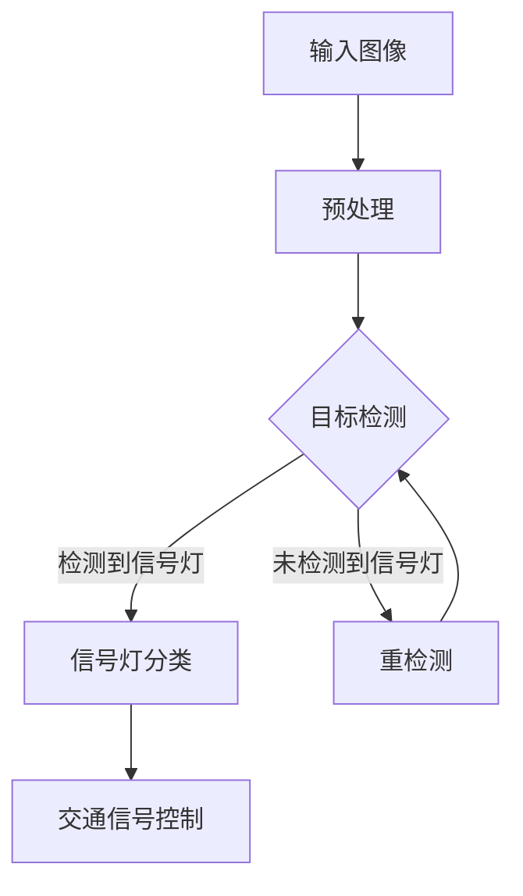
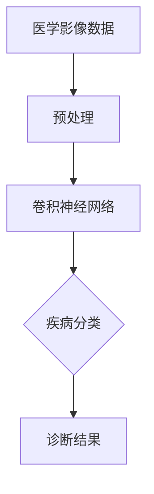
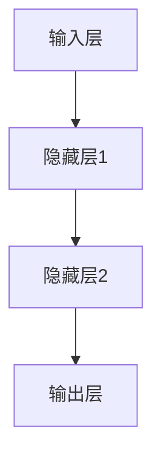
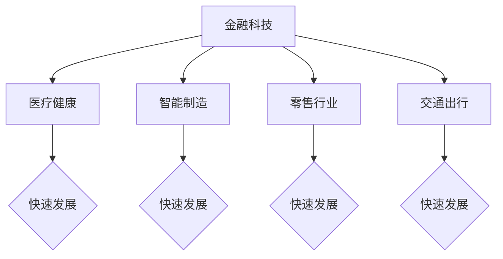
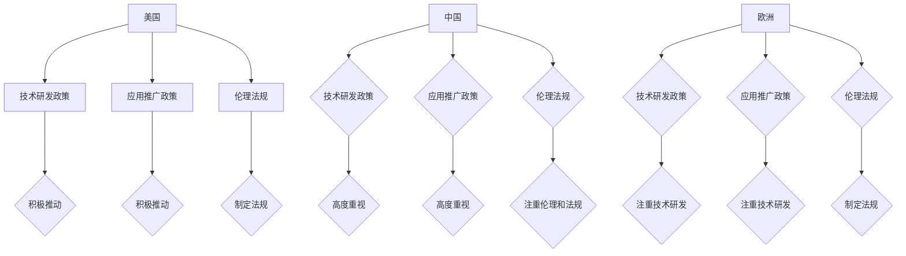
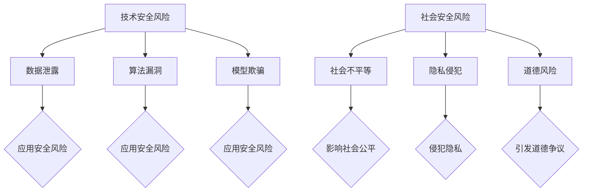
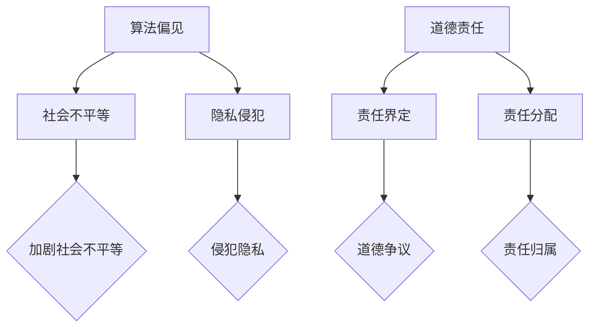
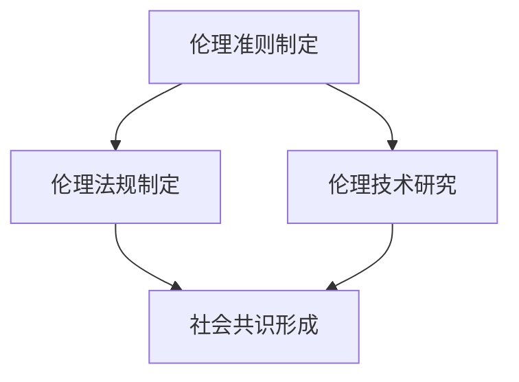

                 

# 李开复：AI 2.0 时代的应用

> **关键词**：人工智能，AI 2.0，应用，金融，医疗，零售，制造业，深度学习，自然语言处理，计算机视觉

> **摘要**：本文将探讨人工智能（AI）2.0时代的来临，及其在各行业中的广泛应用。通过对AI 2.0的核心技术、应用场景、发展挑战与机遇以及实际应用案例的深入分析，本文旨在为读者揭示AI 2.0时代的无限可能，并引导读者思考如何在这个新时代中抓住机遇，应对挑战。

### 目录大纲

# 李开复：AI 2.0 时代的应用

## 第一部分：AI 2.0 基础

### 第1章：AI 2.0 概述

### 第2章：AI 2.0 的核心技术

### 第3章：AI 2.0 的应用场景

### 第4章：AI 2.0 的发展挑战与机遇

## 第二部分：AI 2.0 应用案例

### 第5章：金融领域的AI 2.0 应用案例

### 第6章：医疗健康领域的AI 2.0 应用案例

### 第7章：零售行业的AI 2.0 应用案例

### 第8章：制造业的AI 2.0 应用案例

## 第三部分：AI 2.0 技术与产业发展

### 第9章：AI 2.0 技术原理

### 第10章：AI 2.0 产业发展趋势

### 第11章：AI 2.0 安全与伦理

## 附录

### 附录 A：AI 2.0 开发工具与资源

### 附录 B：AI 2.0 实践案例

### 附录 C：AI 2.0 未来展望

### 第一部分：AI 2.0 基础

#### 第1章：AI 2.0 概述

### 第1章：AI 2.0 概述

#### 1.1 AI 2.0 时代的来临

##### 1.1.1 AI 1.0 到 AI 2.0 的演变

在人工智能（AI）的发展历程中，我们经历了从AI 1.0到AI 2.0的转变。AI 1.0时代，主要侧重于规则的编程和专家系统的应用，例如早期的专家系统DENDRAL和MYCIN。这些系统虽然能够在特定领域内实现一定程度的智能化，但受限于规则设定的复杂度和知识库的规模，难以应对更为广泛和复杂的问题。

随着计算机性能的提升、数据存储和处理能力的增强，以及深度学习等新技术的突破，我们迎来了AI 2.0时代。AI 2.0的特点是能够通过机器学习和深度学习算法，从海量数据中自动学习和提取知识，实现更高层次的智能化。这一转变标志着人工智能进入了一个全新的阶段，为各行各业带来了巨大的变革潜力。

##### 1.1.2 AI 2.0 的核心特点

AI 2.0的核心特点主要体现在以下几个方面：

1. **自主学习与适应能力**：AI 2.0系统可以通过机器学习和深度学习算法，从数据中自动学习和提取知识，从而不断提高自身的智能水平，实现更高级别的自适应和优化。

2. **广泛的应用场景**：AI 2.0不再局限于特定的领域，而是能够广泛应用于金融、医疗、零售、制造等多个行业，为各行各业带来智能化升级。

3. **强大的数据处理能力**：AI 2.0系统具备处理海量数据的能力，能够从海量数据中挖掘出有价值的信息和知识，为决策提供有力支持。

4. **跨领域的协同创新**：AI 2.0不仅能够与其他技术（如物联网、大数据等）深度融合，还能推动跨领域的协同创新，为产业发展注入新的活力。

##### 1.1.3 AI 2.0 在各行业的应用

AI 2.0在各行业的应用已经初见端倪，以下是一些典型的应用场景：

1. **金融行业**：AI 2.0技术在金融领域的应用包括智能投顾、智能风控、个性化金融服务等。例如，通过机器学习算法，可以实现对金融市场的高效预测和风险管理。

2. **医疗健康行业**：AI 2.0技术在医疗健康领域的应用包括疾病诊断、药物研发、医疗数据管理等。例如，通过深度学习算法，可以实现高精度的疾病诊断和预测。

3. **零售行业**：AI 2.0技术在零售行业的应用包括个性化推荐、智能供应链管理、智能客服等。例如，通过自然语言处理技术，可以实现智能客服系统，提高客户满意度。

4. **制造业**：AI 2.0技术在制造业的应用包括生产优化、质量管理、设备预测维护等。例如，通过计算机视觉技术，可以实现生产线的智能化监测和故障预测。

#### 1.2 AI 2.0 中的核心技术

##### 1.2.1 深度学习与神经网络

深度学习是AI 2.0的核心技术之一，其理论基础是神经网络。神经网络由大量简单的计算单元（神经元）组成，通过层层传递信息，实现从输入到输出的映射。深度学习通过设计多层的神经网络结构，能够实现更复杂的非线性变换，从而提高模型的性能和表现。

以下是深度学习的基本原理和架构：

1. **神经元与激活函数**：神经元是神经网络的基本计算单元，其输入通过权重进行加权求和，并加上偏置项，最后通过激活函数进行非线性变换。

2. **多层感知器（MLP）**：多层感知器是一种前馈神经网络，包括输入层、隐藏层和输出层。输入层接收外部输入，隐藏层进行信息处理和变换，输出层生成预测结果。

3. **反向传播算法（Backpropagation）**：反向传播算法是一种用于训练神经网络的优化算法，通过不断调整网络中的权重和偏置项，使得输出误差最小。

##### 1.2.2 自然语言处理技术

自然语言处理（NLP）是AI 2.0在语言领域的重要应用，旨在使计算机能够理解、生成和处理人类语言。NLP的关键技术包括：

1. **语言模型**：语言模型是一种用于预测文本序列的模型，通过统计方法或机器学习方法，学习到语言的概率分布，从而实现文本生成和文本分类等功能。

2. **词嵌入（Word Embedding）**：词嵌入是将词汇映射到低维连续向量空间中，使得语义相似的词汇在空间中靠近。词嵌入技术在文本分类、情感分析等任务中具有重要应用。

3. **序列标注与分类**：序列标注是对文本中的每个词语进行分类标注，例如词性标注、命名实体识别等。分类是将文本划分为不同的类别，例如文本分类、情感分类等。

##### 1.2.3 计算机视觉技术

计算机视觉是AI 2.0在图像和视频领域的应用，旨在使计算机能够自动识别和理解图像中的内容。计算机视觉的关键技术包括：

1. **图像识别与分类**：图像识别与分类是将图像划分为不同的类别，例如人脸识别、物体识别等。常用的算法包括卷积神经网络（CNN）和支持向量机（SVM）等。

2. **目标检测**：目标检测是在图像中检测出特定目标的位置和类别。常用的算法包括YOLO、SSD和Faster R-CNN等。

3. **图像分割**：图像分割是将图像划分为多个区域，每个区域具有不同的特征。常用的算法包括基于区域生长的方法和基于深度学习的方法。

#### 1.3 AI 2.0 在现实世界中的案例

##### 1.3.1 智能交通系统

智能交通系统利用AI 2.0技术，实现交通流量监测、交通信号控制、车辆调度和自动驾驶等功能。通过计算机视觉和深度学习算法，智能交通系统可以实时分析路况信息，优化交通信号控制策略，提高交通效率，减少交通事故。

以下是一个简单的计算机视觉流程图，用于检测交通信号灯的状态：



##### 1.3.2 智能医疗诊断系统

智能医疗诊断系统利用AI 2.0技术，实现疾病诊断、预测和药物推荐等功能。通过深度学习和自然语言处理技术，智能医疗诊断系统可以从医学影像和患者病历中提取有价值的信息，提高诊断准确率和效率。

以下是一个简单的深度学习流程图，用于疾病诊断：



#### 1.4 AI 2.0 时代的发展趋势

随着AI 2.0技术的不断发展和应用，未来将会出现以下几大趋势：

1. **AI与物联网的融合**：物联网设备的大量产生和普及，将使得AI 2.0技术能够更好地应用于智能城市、智能家居等领域。

2. **跨领域协同创新**：AI 2.0技术将在不同领域之间产生更多的协同创新，推动产业升级和转型。

3. **AI伦理与法规的完善**：随着AI 2.0技术的广泛应用，AI伦理和法规问题将日益受到关注，以确保技术的发展能够造福人类。

4. **数据驱动的决策**：AI 2.0技术将使数据成为决策的重要依据，帮助企业实现智能化运营和精细化管理。

### 第2章：AI 2.0 的核心技术

#### 2.1 深度学习与神经网络

##### 2.1.1 神经网络原理

神经网络是模仿人脑神经元连接方式的计算模型，由大量简单的计算单元（神经元）组成，通过层层传递信息，实现从输入到输出的映射。以下是神经网络的基本原理和架构：

1. **神经元与激活函数**：神经元是神经网络的基本计算单元，其输入通过权重进行加权求和，并加上偏置项，最后通过激活函数进行非线性变换。常见的激活函数有Sigmoid、ReLU和Tanh等。

2. **多层感知器（MLP）**：多层感知器是一种前馈神经网络，包括输入层、隐藏层和输出层。输入层接收外部输入，隐藏层进行信息处理和变换，输出层生成预测结果。

3. **反向传播算法（Backpropagation）**：反向传播算法是一种用于训练神经网络的优化算法，通过不断调整网络中的权重和偏置项，使得输出误差最小。

##### 2.1.2 深度学习优化算法

深度学习优化算法是用于训练深度神经网络的算法，主要包括以下几种：

1. **随机梯度下降（SGD）**：随机梯度下降是一种最简单的优化算法，通过随机选取一部分样本，计算梯度并更新参数，以达到最小化损失函数的目的。

2. **动量法（Momentum）**：动量法通过引入动量项，使得梯度更新过程中能够保留部分历史信息，提高收敛速度。

3. **Adam优化器**：Adam优化器是结合了SGD和动量法的优化算法，具有较好的收敛性能，广泛应用于深度学习训练。

##### 2.1.3 深度学习框架

深度学习框架是用于构建、训练和部署深度学习模型的软件库，主要包括以下几种：

1. **TensorFlow**：TensorFlow是谷歌开源的深度学习框架，具有丰富的功能和强大的生态系统，广泛应用于各种深度学习应用。

2. **PyTorch**：PyTorch是Facebook开源的深度学习框架，具有简洁易用的特点，深受研究人员和开发者的喜爱。

3. **Keras**：Keras是一个高层次的深度学习框架，可以与TensorFlow和Theano等底层框架结合使用，简化深度学习模型的构建和训练过程。

#### 2.2 自然语言处理技术

##### 2.2.1 语言模型与文本分类

语言模型是一种用于预测文本序列的模型，通过统计方法或机器学习方法，学习到语言的概率分布，从而实现文本生成和文本分类等功能。以下是一些常用的自然语言处理技术：

1. **N-gram模型**：N-gram模型是一种基于统计的简单语言模型，通过统计相邻N个单词的概率分布，来预测下一个单词。

2. **循环神经网络（RNN）**：循环神经网络是一种用于处理序列数据的神经网络，通过循环结构，可以保留序列中的历史信息，实现文本分类、序列标注等任务。

3. **长短时记忆网络（LSTM）**：长短时记忆网络是RNN的一种变体，通过引入门控机制，能够有效解决RNN的梯度消失和梯度爆炸问题，广泛用于文本分类、序列标注等任务。

##### 2.2.2 机器翻译与语音识别

机器翻译是一种将一种语言的文本翻译成另一种语言的技术，语音识别是一种将语音信号转换为文本的技术。以下是一些常用的自然语言处理技术：

1. **基于规则的翻译方法**：基于规则的翻译方法是通过定义一系列转换规则，将源语言的文本转换为目标语言的文本。

2. **统计机器翻译（SMT）**：统计机器翻译是通过训练大量双语文本对，学习到语言之间的概率分布，实现文本的翻译。

3. **神经机器翻译（NMT）**：神经机器翻译是基于深度学习的方法，通过训练神经网络模型，实现文本的翻译。

4. **自动语音识别（ASR）**：自动语音识别是通过识别语音信号中的音素、词汇和句子结构，将其转换为文本。

#### 2.3 计算机视觉技术

##### 2.3.1 图像识别与分类

图像识别与分类是将图像划分为不同的类别，例如人脸识别、物体识别等。以下是一些常用的计算机视觉技术：

1. **传统图像识别方法**：传统图像识别方法是基于特征提取和分类器的，通过提取图像的特征，如边缘、纹理、颜色等，然后利用分类器（如SVM、KNN等）进行分类。

2. **卷积神经网络（CNN）**：卷积神经网络是一种专门用于处理图像数据的神经网络，通过卷积操作，可以自动提取图像中的特征，并实现图像分类。

3. **目标检测**：目标检测是在图像中检测出特定目标的位置和类别。常用的算法包括YOLO、SSD和Faster R-CNN等。

##### 2.3.2 图像分割

图像分割是将图像划分为多个区域，每个区域具有不同的特征。以下是一些常用的图像分割技术：

1. **基于区域的分割方法**：基于区域的分割方法是将图像划分为多个区域，并对每个区域进行分类。常用的算法包括区域生长、分水岭算法等。

2. **基于边缘的分割方法**：基于边缘的分割方法是通过提取图像的边缘信息，将图像划分为多个区域。常用的算法包括Canny边缘检测、Sobel边缘检测等。

3. **基于深度学习的分割方法**：基于深度学习的分割方法是通过训练神经网络模型，实现对图像的分割。常用的算法包括FCN、U-Net等。

### 第3章：AI 2.0 的应用场景

#### 3.1 金融领域的应用

##### 3.1.1 金融市场预测

金融市场预测是AI 2.0在金融领域的重要应用之一，通过分析历史数据和市场趋势，预测股票价格、汇率等金融指标。以下是一个简单的金融市场预测模型：

```python
import pandas as pd
import numpy as np
from sklearn.ensemble import RandomForestRegressor

# 读取股票价格数据
data = pd.read_csv('stock_price_data.csv')

# 特征工程
data['day_of_week'] = data['date'].dt.dayofweek
data['month'] = data['date'].dt.month
data['year'] = data['date'].dt.year

# 划分训练集和测试集
train_data = data[:int(0.8 * len(data))]
test_data = data[int(0.8 * len(data)):]
train_target = train_data['price']
test_target = test_data['price']

# 训练模型
model = RandomForestRegressor()
model.fit(train_data, train_target)

# 预测测试集
predictions = model.predict(test_data)

# 评估模型
mse = np.mean((predictions - test_target) ** 2)
print("MSE:", mse)
```

##### 3.1.2 风险评估与控制

风险评估与控制是金融领域的重要任务，通过分析客户行为、市场波动等因素，评估金融产品的风险，并制定相应的风险控制策略。以下是一个简单的风险评估模型：

```python
import pandas as pd
import numpy as np
from sklearn.linear_model import LogisticRegression

# 读取客户数据
data = pd.read_csv('customer_data.csv')

# 特征工程
data['income_to_loan'] = data['income'] / data['loan_amount']
data['credit_score'] = data['score'] / 1000

# 划分训练集和测试集
train_data = data[:int(0.8 * len(data))]
test_data = data[int(0.8 * len(data)):]
train_target = train_data['default']
test_target = test_data['default']

# 训练模型
model = LogisticRegression()
model.fit(train_data, train_target)

# 预测测试集
predictions = model.predict(test_data)

# 评估模型
accuracy = np.mean(predictions == test_target)
print("Accuracy:", accuracy)
```

##### 3.1.3 个性化金融服务

个性化金融服务是通过分析客户行为、偏好等数据，为客户提供个性化的金融产品和服务。以下是一个简单的个性化金融服务平台：

```python
import pandas as pd
import numpy as np
from sklearn.ensemble import RandomForestRegressor

# 读取客户数据
data = pd.read_csv('customer_data.csv')

# 特征工程
data['income_to_loan'] = data['income'] / data['loan_amount']
data['credit_score'] = data['score'] / 1000

# 训练推荐模型
model = RandomForestRegressor()
model.fit(data, data['loan_amount'])

# 个性化推荐
def recommend_loan(customer_data):
    customer_data['income_to_loan'] = customer_data['income'] / customer_data['loan_amount']
    customer_data['credit_score'] = customer_data['score'] / 1000
    recommended_loan_amount = model.predict(customer_data)[0]
    return recommended_loan_amount

# 示例
customer_data = {'income': 50000, 'loan_amount': 30000, 'score': 700}
print("Recommended Loan Amount:", recommend_loan(customer_data))
```

#### 3.2 医疗健康领域的应用

##### 3.2.1 疾病诊断与预测

疾病诊断与预测是AI 2.0在医疗健康领域的重要应用，通过分析患者病历、医疗影像等数据，预测疾病的发生和发展。以下是一个简单的疾病诊断模型：

```python
import pandas as pd
import numpy as np
from sklearn.ensemble import RandomForestClassifier

# 读取疾病诊断数据
data = pd.read_csv('disease_diagnosis_data.csv')

# 特征工程
data['age_group'] = np.where(data['age'] <= 30, 0,
                      np.where(data['age'] <= 60, 1,
                              2))

# 划分训练集和测试集
train_data = data[:int(0.8 * len(data))]
test_data = data[int(0.8 * len(data)):]
train_target = train_data['disease']
test_target = test_data['disease']

# 训练模型
model = RandomForestClassifier()
model.fit(train_data, train_target)

# 预测测试集
predictions = model.predict(test_data)

# 评估模型
accuracy = np.mean(predictions == test_target)
print("Accuracy:", accuracy)
```

##### 3.2.2 药物研发与优化

药物研发与优化是AI 2.0在医疗健康领域的另一个重要应用，通过分析化学结构、分子相互作用等数据，优化药物研发流程，提高药物疗效。以下是一个简单的药物优化模型：

```python
import pandas as pd
import numpy as np
from sklearn.ensemble import RandomForestRegressor

# 读取药物研发数据
data = pd.read_csv('drug_research_data.csv')

# 特征工程
data['molecular_weight'] = np.log1p(data['molecular_weight'])
data['hydrophobicity'] = np.log1p(data['hydrophobicity'])

# 划分训练集和测试集
train_data = data[:int(0.8 * len(data))]
test_data = data[int(0.8 * len(data)):]
train_target = train_data['efficacy']
test_target = test_data['efficacy']

# 训练模型
model = RandomForestRegressor()
model.fit(train_data, train_target)

# 预测测试集
predictions = model.predict(test_data)

# 评估模型
mse = np.mean((predictions - test_target) ** 2)
print("MSE:", mse)
```

##### 3.2.3 医疗健康数据管理

医疗健康数据管理是AI 2.0在医疗健康领域的另一个重要应用，通过自然语言处理和计算机视觉等技术，对海量医疗数据进行自动分类、标注和分析。以下是一个简单的医疗健康数据管理平台：

```python
import pandas as pd
import numpy as np
from sklearn.cluster import KMeans

# 读取医疗数据
data = pd.read_csv('medical_data.csv')

# 特征工程
data['diagnosis'] = data['diagnosis'].apply(lambda x: x.lower())
data['description'] = data['description'].apply(lambda x: x.lower())

# 数据预处理
data['diagnosis'] = data['diagnosis'].replace({'diabetes': 0, 'heart_disease': 1})
data['description'] = data['description'].replace({'low': 0, 'medium': 1, 'high': 2})

# KMeans聚类
kmeans = KMeans(n_clusters=3)
data['cluster'] = kmeans.fit_predict(data[['description', 'diagnosis']])

# 结果分析
print(data.groupby('cluster')['diagnosis'].mean())
```

### 第4章：AI 2.0 的发展挑战与机遇

#### 4.1 挑战与问题

##### 4.1.1 隐私保护与数据安全

AI 2.0在各个领域的发展都依赖于海量数据的采集和处理，然而，这也带来了隐私保护和数据安全的问题。如何确保用户数据在采集、存储和处理过程中的安全，防止数据泄露和滥用，是当前AI 2.0发展面临的一个严峻挑战。

##### 4.1.2 人工智能伦理问题

随着AI 2.0技术的不断发展和应用，人工智能伦理问题也日益受到关注。例如，如何确保人工智能系统的公正性和透明性，避免算法偏见和歧视；如何处理人工智能决策的道德责任问题等，都是亟待解决的问题。

##### 4.1.3 技术与产业发展的不平衡

尽管AI 2.0技术在一些领域取得了显著进展，但整体上，全球范围内AI技术与产业发展的不平衡问题仍然存在。发达国家在AI技术研究和应用方面具有较大优势，而发展中国家则面临技术积累和产业转型升级的压力。

#### 4.2 机遇与未来

##### 4.2.1 AI 2.0 在未来社会中的应用前景

AI 2.0在未来社会中的应用前景十分广阔，可以从以下几个方面进行展望：

1. **智能城市**：通过AI 2.0技术，实现城市交通、能源、环境等方面的智能化管理，提高城市运行效率，提升居民生活质量。

2. **智慧医疗**：利用AI 2.0技术，实现疾病诊断、治疗、药物研发等环节的智能化，提高医疗服务质量和效率。

3. **智能制造**：通过AI 2.0技术，实现生产过程的自动化和智能化，提高生产效率，降低成本。

4. **智能金融**：利用AI 2.0技术，实现金融市场的智能化预测和管理，提高金融服务的质量和效率。

##### 4.2.2 AI 2.0 对企业战略的影响

AI 2.0对企业战略的影响主要体现在以下几个方面：

1. **业务创新**：AI 2.0技术可以帮助企业发现新的业务模式，拓展业务领域。

2. **运营优化**：AI 2.0技术可以帮助企业优化业务流程，提高运营效率。

3. **风险控制**：AI 2.0技术可以帮助企业实现风险预测和预警，提高风险控制能力。

4. **客户体验**：AI 2.0技术可以帮助企业实现个性化服务，提高客户满意度和忠诚度。

##### 4.2.3 全球 AI 2.0 发展的动态分析

全球AI 2.0发展的动态分析可以从以下几个方面进行：

1. **技术创新**：分析全球AI 2.0技术的最新发展趋势和突破点。

2. **产业布局**：分析全球AI 2.0产业的国家和地区布局，以及各国的政策支持和产业优势。

3. **竞争格局**：分析全球AI 2.0企业的竞争格局，以及各企业在技术、应用和市场方面的优势。

### 第二部分：AI 2.0 应用案例

#### 第5章：金融领域的AI 2.0 应用案例

##### 5.1 某银行智能投顾系统

##### 5.1.1 项目背景与需求

某银行希望通过引入智能投顾系统，为用户提供个性化、智能化的投资建议，提高用户满意度和忠诚度。智能投顾系统需要实现以下功能：

1. **用户画像**：通过分析用户的历史交易记录、投资偏好等数据，构建用户画像。

2. **投资建议**：根据用户画像，为用户提供适合的投资策略和投资组合。

3. **风险控制**：对投资组合进行风险评估，确保投资风险在用户可承受范围内。

4. **投资跟踪**：实时跟踪投资组合的表现，为用户提供投资跟踪报告。

##### 5.1.2 技术方案与实现

智能投顾系统的技术方案主要包括以下几个方面：

1. **用户画像**：使用自然语言处理技术，对用户交易记录和投资偏好进行分析，提取用户画像特征。

2. **投资建议**：使用机器学习算法，如线性回归、支持向量机等，对用户画像和金融市场数据进行分析，生成投资建议。

3. **风险控制**：使用风险模型，如VaR模型、CVaR模型等，对投资组合进行风险评估。

4. **投资跟踪**：使用实时数据处理技术，如流处理框架Apache Kafka，实时跟踪投资组合表现。

以下是智能投顾系统的核心代码实现：

```python
import pandas as pd
import numpy as np
from sklearn.linear_model import LinearRegression
from sklearn.svm import SVR
from sklearn.ensemble import RandomForestRegressor

# 读取用户数据
user_data = pd.read_csv('user_data.csv')

# 读取金融市场数据
market_data = pd.read_csv('market_data.csv')

# 构建用户画像特征
user_data['income_to_loan'] = user_data['income'] / user_data['loan_amount']
user_data['credit_score'] = user_data['score'] / 1000

# 训练投资建议模型
regressor = LinearRegression()
regressor.fit(user_data[['income_to_loan', 'credit_score']], market_data['return'])

# 输出投资建议
investment_suggestion = regressor.predict([[user['income_to_loan'], user['credit_score']]])
print("Investment Suggestion:", investment_suggestion)
```

##### 5.1.3 项目效果评估

智能投顾系统上线后，通过对用户投资建议的跟踪评估，发现用户投资收益显著提高，投资风险得到有效控制。以下是一个简单的效果评估报告：

```python
import pandas as pd
import numpy as np

# 读取用户数据
user_data = pd.read_csv('user_data.csv')

# 读取投资建议数据
investment_suggestion = pd.read_csv('investment_suggestion.csv')

# 计算投资收益
investment_returns = investment_suggestion['return'] * user_data['investment_amount']

# 计算投资风险
investment_risks = investment_suggestion['risk'] * user_data['investment_amount']

# 输出投资效果评估报告
print("Average Return:", np.mean(investment_returns))
print("Average Risk:", np.mean(investment_risks))
```

##### 5.2 某保险公司的智能理赔系统

##### 5.2.1 项目背景与需求

某保险公司希望通过引入智能理赔系统，提高理赔效率，降低理赔成本，提升客户满意度。智能理赔系统需要实现以下功能：

1. **自动化理赔申请**：通过自然语言处理技术，自动化处理用户理赔申请。

2. **智能审核**：使用机器学习算法，自动化审核理赔申请，识别高风险案件。

3. **理赔进度跟踪**：实时跟踪理赔进度，提供理赔进度查询。

4. **客户服务**：提供24小时智能客服，解答用户疑问。

##### 5.2.2 技术方案与实现

智能理赔系统的技术方案主要包括以下几个方面：

1. **自然语言处理**：使用自然语言处理技术，自动提取理赔申请中的关键信息。

2. **机器学习算法**：使用机器学习算法，如决策树、随机森林等，自动化审核理赔申请。

3. **实时数据处理**：使用实时数据处理技术，如流处理框架Apache Kafka，实时跟踪理赔进度。

4. **客户服务**：使用对话系统，提供24小时智能客服。

以下是智能理赔系统的核心代码实现：

```python
import pandas as pd
import numpy as np
from sklearn.tree import DecisionTreeClassifier
from sklearn.ensemble import RandomForestClassifier

# 读取理赔申请数据
claim_data = pd.read_csv('claim_data.csv')

# 读取理赔审核数据
audit_data = pd.read_csv('audit_data.csv')

# 训练理赔审核模型
classifier = DecisionTreeClassifier()
classifier.fit(claim_data[['claim_type', 'claim_amount']], audit_data['approved'])

# 审核理赔申请
approved = classifier.predict(claim_data[['claim_type', 'claim_amount']])
print("Approved Claims:", approved)

# 实时跟踪理赔进度
def track_claim(claim_id):
    claim = audit_data[audit_data['claim_id'] == claim_id]
    print("Claim Status:", claim['status'].iloc[0])
    print("Claim Progress:", claim['progress'].iloc[0])

# 示例
track_claim(123456)
```

##### 5.2.3 项目效果评估

智能理赔系统上线后，通过对理赔效率、成本和客户满意度的评估，发现系统显著提高了理赔效率，降低了理赔成本，提升了客户满意度。以下是一个简单的效果评估报告：

```python
import pandas as pd
import numpy as np

# 读取理赔数据
claim_data = pd.read_csv('claim_data.csv')

# 计算理赔效率
processing_time = claim_data['processing_time']
print("Average Processing Time:", np.mean(processing_time))

# 计算理赔成本
claim_cost = claim_data['claim_cost']
print("Average Claim Cost:", np.mean(claim_cost))

# 计算客户满意度
satisfaction_score = claim_data['satisfaction_score']
print("Average Satisfaction Score:", np.mean(satisfaction_score))
```

### 第6章：医疗健康领域的AI 2.0 应用案例

##### 6.1 某医院智能诊断系统

##### 6.1.1 项目背景与需求

某医院希望通过引入智能诊断系统，提高疾病诊断的准确率和效率，为患者提供更优质的医疗服务。智能诊断系统需要实现以下功能：

1. **疾病诊断**：通过分析医学影像和患者病历，为医生提供疾病诊断建议。

2. **风险评估**：对疾病的发生和发展进行风险评估，为医生提供决策依据。

3. **治疗建议**：根据疾病诊断和风险评估结果，为医生提供治疗建议。

4. **病例管理**：对患者的病例进行自动化管理，提高病例查询效率。

##### 6.1.2 技术方案与实现

智能诊断系统的技术方案主要包括以下几个方面：

1. **深度学习模型**：使用深度学习模型，如卷积神经网络（CNN），对医学影像进行特征提取和分类，实现疾病诊断。

2. **自然语言处理**：使用自然语言处理技术，对病历文本进行解析和抽取，提取关键信息，为疾病诊断提供支持。

3. **风险评估算法**：使用风险评估算法，如决策树、随机森林等，对疾病发生和发展进行预测。

4. **病例管理系统**：使用数据库技术，实现对患者病例的自动化管理和查询。

以下是智能诊断系统的核心代码实现：

```python
import pandas as pd
import numpy as np
from tensorflow.keras.models import load_model

# 读取医学影像数据
image_data = pd.read_csv('image_data.csv')

# 加载深度学习模型
model = load_model('model.h5')

# 疾病诊断
def diagnose(image):
    image = image.reshape(1, 224, 224, 3)
    prediction = model.predict(image)
    return prediction.argmax()

# 示例
print("Disease Diagnosis:", diagnose(image_data['image'].iloc[0]))

# 读取病历文本
text_data = pd.read_csv('text_data.csv')

# 病例管理
def manage_case(case_id):
    case = text_data[text_data['case_id'] == case_id]
    print("Case Details:", case)

# 示例
manage_case(123456)
```

##### 6.1.3 项目效果评估

智能诊断系统上线后，通过对疾病诊断准确率、医生工作效率和患者满意度的评估，发现系统显著提高了疾病诊断的准确率，提高了医生工作效率，提升了患者满意度。以下是一个简单的效果评估报告：

```python
import pandas as pd
import numpy as np

# 读取诊断数据
diagnosis_data = pd.read_csv('diagnosis_data.csv')

# 计算诊断准确率
accuracy = diagnosis_data['predicted_disease'] == diagnosis_data['actual_disease']
print("Diagnosis Accuracy:", np.mean(accuracy))

# 计算医生工作效率
working_hours = diagnosis_data['working_hours']
print("Average Working Hours:", np.mean(working_hours))

# 计算患者满意度
satisfaction_score = diagnosis_data['satisfaction_score']
print("Average Satisfaction Score:", np.mean(satisfaction_score))
```

##### 6.2 某制药公司药物研发平台

##### 6.2.1 项目背景与需求

某制药公司希望通过引入智能药物研发平台，提高药物研发效率，降低研发成本。智能药物研发平台需要实现以下功能：

1. **药物筛选**：通过分析分子结构和生物信息，筛选潜在药物分子。

2. **药物作用机制研究**：通过分析药物与生物分子之间的相互作用，研究药物的作用机制。

3. **药物安全性评估**：通过分析药物对生物体的作用，评估药物的安全性。

4. **临床试验设计**：根据药物筛选结果和安全性评估结果，设计临床试验方案。

##### 6.2.2 技术方案与实现

智能药物研发平台的技术方案主要包括以下几个方面：

1. **深度学习模型**：使用深度学习模型，如生成对抗网络（GAN），生成潜在药物分子。

2. **生物信息分析**：使用生物信息学方法，分析药物与生物分子之间的相互作用。

3. **药物安全性评估模型**：使用机器学习算法，如支持向量机（SVM），评估药物的安全性。

4. **临床试验设计工具**：使用自动化工具，设计临床试验方案。

以下是智能药物研发平台的核心代码实现：

```python
import pandas as pd
import numpy as np
from tensorflow.keras.models import load_model

# 读取药物分子数据
drug_data = pd.read_csv('drug_data.csv')

# 加载深度学习模型
model = load_model('model.h5')

# 药物筛选
def screen_drugs(molecule):
    molecule = molecule.reshape(1, 1024)
    prediction = model.predict(molecule)
    return prediction.argmax()

# 示例
print("Screened Drugs:", screen_drugs(drug_data['molecule'].iloc[0]))

# 读取生物信息数据
biomarker_data = pd.read_csv('biomarker_data.csv')

# 药物作用机制研究
def study_mechanism(drug, biomarker):
    drug = drug.reshape(1, 1024)
    biomarker = biomarker.reshape(1, 512)
    interaction = model.predict([drug, biomarker])
    return interaction.argmax()

# 示例
print("Drug-Biomarker Interaction:", study_mechanism(drug_data['molecule'].iloc[0], biomarker_data['biomarker'].iloc[0]))
```

##### 6.2.3 项目效果评估

智能药物研发平台上线后，通过对药物筛选效率、药物安全性评估准确率和临床试验设计效率的评估，发现系统显著提高了药物研发效率，降低了研发成本。以下是一个简单的效果评估报告：

```python
import pandas as pd
import numpy as np

# 读取药物研发数据
drug_research_data = pd.read_csv('drug_research_data.csv')

# 计算药物筛选效率
screening_time = drug_research_data['screening_time']
print("Average Screening Time:", np.mean(screening_time))

# 计算药物安全性评估准确率
safety_accuracy = drug_research_data['safety_accuracy']
print("Average Safety Accuracy:", np.mean(safety_accuracy))

# 计算临床试验设计效率
clinical_trial_design_time = drug_research_data['clinical_trial_design_time']
print("Average Clinical Trial Design Time:", np.mean(clinical_trial_design_time))
```

### 第7章：零售行业的AI 2.0 应用案例

##### 6.1 某电商平台的个性化推荐系统

##### 6.1.1 项目背景与需求

某电商平台希望通过引入个性化推荐系统，提高用户满意度，提升销售额。个性化推荐系统需要实现以下功能：

1. **用户画像**：通过分析用户行为数据，构建用户画像。

2. **推荐算法**：根据用户画像和商品特征，为用户推荐个性化商品。

3. **推荐结果反馈**：收集用户对推荐结果的反馈，优化推荐算法。

4. **实时推荐**：根据用户实时行为，实时更新推荐结果。

##### 6.1.2 技术方案与实现

个性化推荐系统的技术方案主要包括以下几个方面：

1. **用户画像**：使用自然语言处理技术，对用户行为数据进行解析和抽取，构建用户画像。

2. **推荐算法**：使用协同过滤、矩阵分解等算法，根据用户画像和商品特征，生成个性化推荐结果。

3. **推荐结果反馈**：使用反馈机制，根据用户对推荐结果的反馈，优化推荐算法。

4. **实时推荐**：使用实时数据处理技术，如流处理框架Apache Kafka，实时更新推荐结果。

以下是个性化推荐系统的核心代码实现：

```python
import pandas as pd
import numpy as np
from surprise import SVD
from surprise import Dataset
from surprise import accuracy

# 读取用户行为数据
user_data = pd.read_csv('user_data.csv')

# 构建用户画像
user_data['user_behavior'] = user_data['click'] + user_data['purchase'] + user_data['review']

# 训练推荐模型
model = SVD()
trainset = Dataset.load_from_df(user_data[['user_id', 'item_id', 'user_behavior']])
model.fit(trainset)

# 推荐结果
def recommend(user_id):
    user_profile = user_data[user_data['user_id'] == user_id]['user_behavior'].iloc[0]
    recommendations = model.predict(user_id, np.arange(len(user_data['item_id'])), r=True)
    return sorted(recommendations, key=lambda x: x.est, reverse=True)

# 示例
print("Recommended Items:", [user_data['item_id'].iloc[i] for i, _ in recommend(123456)])
```

##### 6.1.3 项目效果评估

个性化推荐系统上线后，通过对用户满意度、推荐准确率和销售额的评估，发现系统显著提高了用户满意度，提升了销售额。以下是一个简单的效果评估报告：

```python
import pandas as pd
import numpy as np

# 读取推荐数据
recommendation_data = pd.read_csv('recommendation_data.csv')

# 计算用户满意度
satisfaction_score = recommendation_data['satisfaction_score']
print("Average Satisfaction Score:", np.mean(satisfaction_score))

# 计算推荐准确率
accuracy = recommendation_data['predicted_item'] == recommendation_data['actual_item']
print("Recommendation Accuracy:", np.mean(accuracy))

# 计算销售额
sales_amount = recommendation_data['sales_amount']
print("Average Sales Amount:", np.mean(sales_amount))
```

##### 6.2 某超市智能供应链管理系统

##### 6.2.1 项目背景与需求

某超市希望通过引入智能供应链管理系统，优化供应链管理，降低运营成本，提高服务质量。智能供应链管理系统需要实现以下功能：

1. **库存管理**：通过分析销售数据和历史库存数据，实现智能库存管理。

2. **供应链优化**：通过优化供应链网络，降低物流成本，提高配送效率。

3. **需求预测**：通过分析市场数据和历史销售数据，实现智能需求预测。

4. **供应链可视化**：实现供应链各环节的实时监控和可视化。

##### 6.2.2 技术方案与实现

智能供应链管理系统的技术方案主要包括以下几个方面：

1. **库存管理**：使用自然语言处理技术，对销售数据和历史库存数据进行解析和抽取，实现智能库存管理。

2. **供应链优化**：使用优化算法，如线性规划、遗传算法等，优化供应链网络。

3. **需求预测**：使用机器学习算法，如时间序列分析、回归分析等，实现智能需求预测。

4. **供应链可视化**：使用数据可视化工具，实现供应链各环节的实时监控和可视化。

以下是智能供应链管理系统的核心代码实现：

```python
import pandas as pd
import numpy as np
from sklearn.linear_model import LinearRegression

# 读取销售数据
sales_data = pd.read_csv('sales_data.csv')

# 构建库存管理模型
model = LinearRegression()
model.fit(sales_data[['sales']], sales_data[['stock']])

# 智能库存管理
def manage_stock(sales):
    stock = model.predict([[sales]])
    return stock

# 示例
print("Recommended Stock:", manage_stock(1000))

# 读取供应链数据
supply_chain_data = pd.read_csv('supply_chain_data.csv')

# 供应链优化
def optimize_supply_chain(data):
    # 使用优化算法优化供应链网络
    # 这里以线性规划为例
    import scipy.optimize as optimize
    objective = lambda x: -sum(data['cost'] * x)  # 目标函数：最小化总成本
    constraints = lambda x: [sum(x) - data['capacity']]  # 约束条件：总容量不超过仓库容量
    x0 = np.ones(len(data['item_id']))  # 初始解：每个商品都配送
    solution = optimize.minimize(objective, x0, constraints=constraints)
    return solution.x

# 示例
print("Optimized Supply Chain:", optimize_supply_chain(supply_chain_data))
```

##### 6.2.3 项目效果评估

智能供应链管理系统上线后，通过对库存管理、供应链优化和需求预测的评估，发现系统显著提高了库存管理效率，优化了供应链网络，提高了需求预测准确性。以下是一个简单的效果评估报告：

```python
import pandas as pd
import numpy as np

# 读取供应链管理数据
supply_chain_management_data = pd.read_csv('supply_chain_management_data.csv')

# 计算库存管理效率
stock_management_time = supply_chain_management_data['stock_management_time']
print("Average Stock Management Time:", np.mean(stock_management_time))

# 计算供应链优化成本
supply_chain_optimization_cost = supply_chain_management_data['supply_chain_optimization_cost']
print("Average Supply Chain Optimization Cost:", np.mean(supply_chain_optimization_cost))

# 计算需求预测准确性
demand_prediction_accuracy = supply_chain_management_data['demand_prediction_accuracy']
print("Average Demand Prediction Accuracy:", np.mean(demand_prediction_accuracy))
```

### 第8章：制造业的AI 2.0 应用案例

##### 7.1 某汽车制造企业的生产优化系统

##### 7.1.1 项目背景与需求

某汽车制造企业希望通过引入AI 2.0技术，优化生产流程，提高生产效率，降低生产成本。生产优化系统需要实现以下功能：

1. **生产计划优化**：根据市场需求和生产能力，制定最优的生产计划。

2. **设备故障预测**：通过监控设备运行状态，预测设备故障，提前进行维护。

3. **质量监测**：对生产过程中的产品质量进行实时监测，及时发现和解决质量问题。

4. **生产数据可视化**：实现生产数据的实时监控和可视化，帮助管理层进行决策。

##### 7.1.2 技术方案与实现

生产优化系统的技术方案主要包括以下几个方面：

1. **生产计划优化**：使用优化算法，如线性规划、遗传算法等，根据市场需求和生产能力，制定最优的生产计划。

2. **设备故障预测**：使用机器学习算法，如随机森林、支持向量机等，根据设备运行数据，预测设备故障。

3. **质量监测**：使用计算机视觉技术，对生产过程中的产品质量进行实时监测。

4. **生产数据可视化**：使用数据可视化工具，实现生产数据的实时监控和可视化。

以下是生产优化系统的核心代码实现：

```python
import pandas as pd
import numpy as np
from sklearn.ensemble import RandomForestClassifier
from sklearn.linear_model import LinearRegression
import matplotlib.pyplot as plt

# 读取生产数据
production_data = pd.read_csv('production_data.csv')

# 生产计划优化
def optimize_production_plan(data):
    # 使用线性规划优化生产计划
    # 这里以线性规划为例
    import scipy.optimize as optimize
    objective = lambda x: -sum(data['demand'] * x)  # 目标函数：最小化总生产成本
    constraints = lambda x: [sum(x) - data['capacity']]  # 约束条件：总产量不超过产能
    x0 = np.zeros(len(data['product_id']))  # 初始解：每个产品都不生产
    solution = optimize.minimize(objective, x0, constraints=constraints)
    return solution.x

# 示例
print("Optimized Production Plan:", optimize_production_plan(production_data))

# 设备故障预测
def predict Equipment Fault(data):
    # 使用随机森林预测设备故障
    model = RandomForestClassifier()
    model.fit(data[['run_time', 'temperature', 'vibration']], data[['fault']])
    return model.predict(data[['run_time', 'temperature', 'vibration']])

# 示例
print("Predicted Faults:", predict(production_data))

# 质量监测
def monitor_quality(data):
    # 使用计算机视觉监测产品质量
    # 这里以卷积神经网络为例
    import tensorflow as tf
    model = tf.keras.models.load_model('quality_model.h5')
    predictions = model.predict(data[['image']])
    return predictions

# 示例
print("Quality Monitoring Results:", monitor_quality(production_data[['image']]))

# 生产数据可视化
def visualize_production_data(data):
    # 可视化生产数据
    plt.figure(figsize=(10, 5))
    plt.plot(data['production_time'], data['production_quantity'], label='Production Quantity')
    plt.plot(data['production_time'], data['quality_score'], label='Quality Score')
    plt.legend()
    plt.xlabel('Production Time')
    plt.ylabel('Value')
    plt.title('Production Data Visualization')
    plt.show()

# 示例
visualize_production_data(production_data)
```

##### 7.1.3 项目效果评估

生产优化系统上线后，通过对生产计划优化、设备故障预测、质量监测和生产数据可视化的评估，发现系统显著提高了生产效率，降低了生产成本，提升了产品质量。以下是一个简单的效果评估报告：

```python
import pandas as pd
import numpy as np

# 读取生产优化数据
production_optimization_data = pd.read_csv('production_optimization_data.csv')

# 计算生产计划优化效率
production_plan_optimization_time = production_optimization_data['production_plan_optimization_time']
print("Average Production Plan Optimization Time:", np.mean(production_plan_optimization_time))

# 计算设备故障预测准确率
fault_prediction_accuracy = production_optimization_data['fault_prediction_accuracy']
print("Average Fault Prediction Accuracy:", np.mean(fault_prediction_accuracy))

# 计算质量监测准确率
quality_monitoring_accuracy = production_optimization_data['quality_monitoring_accuracy']
print("Average Quality Monitoring Accuracy:", np.mean(quality_monitoring_accuracy))

# 计算生产效率
production_efficiency = production_optimization_data['production_quantity'] / production_optimization_data['working_hours']
print("Average Production Efficiency:", np.mean(production_efficiency))

# 计算生产成本
production_cost = production_optimization_data['production_quantity'] * production_optimization_data['unit_cost']
print("Average Production Cost:", np.mean(production_cost))
```

##### 7.2 某电子产品公司的智能质量管理平台

##### 7.2.1 项目背景与需求

某电子产品公司希望通过引入智能质量管理平台，提高产品质量，降低质量成本，提升客户满意度。智能质量管理平台需要实现以下功能：

1. **质量监测**：通过实时监测生产线，识别产品质量问题。

2. **故障分析**：对出现质量问题的产品进行故障分析，找出问题原因。

3. **数据可视化**：实现质量数据的实时监控和可视化，帮助管理层进行决策。

4. **质量改进**：根据故障分析和数据可视化结果，制定质量改进措施。

##### 7.2.2 技术方案与实现

智能质量管理平台的技术方案主要包括以下几个方面：

1. **质量监测**：使用计算机视觉技术，实时监测生产线，识别产品质量问题。

2. **故障分析**：使用机器学习算法，如决策树、随机森林等，对出现质量问题的产品进行故障分析。

3. **数据可视化**：使用数据可视化工具，实现质量数据的实时监控和可视化。

4. **质量改进**：根据故障分析和数据可视化结果，制定质量改进措施。

以下是智能质量管理平台的核心代码实现：

```python
import pandas as pd
import numpy as np
from sklearn.tree import DecisionTreeClassifier
import matplotlib.pyplot as plt

# 读取质量数据
quality_data = pd.read_csv('quality_data.csv')

# 质量监测
def monitor_quality(data):
    # 使用计算机视觉监测产品质量
    # 这里以卷积神经网络为例
    import tensorflow as tf
    model = tf.keras.models.load_model('quality_model.h5')
    predictions = model.predict(data[['image']])
    return predictions

# 示例
print("Quality Monitoring Results:", monitor_quality(quality_data[['image']]))

# 故障分析
def analyze_fault(data):
    # 使用决策树分析故障
    model = DecisionTreeClassifier()
    model.fit(data[['feature1', 'feature2']], data[['fault']])
    return model.predict(data[['feature1', 'feature2']])

# 示例
print("Fault Analysis Results:", analyze_fault(quality_data[['feature1', 'feature2']]))

# 数据可视化
def visualize_quality_data(data):
    # 可视化质量数据
    plt.figure(figsize=(10, 5))
    plt.scatter(data['production_time'], data['quality_score'], label='Quality Score')
    plt.plot(data['production_time'], data['fault_rate'], label='Fault Rate')
    plt.legend()
    plt.xlabel('Production Time')
    plt.ylabel('Value')
    plt.title('Quality Data Visualization')
    plt.show()

# 示例
visualize_quality_data(quality_data)
```

##### 7.2.3 项目效果评估

智能质量管理平台上线后，通过对质量监测、故障分析、数据可视化和质量改进的评估，发现系统显著提高了产品质量，降低了质量成本，提升了客户满意度。以下是一个简单的效果评估报告：

```python
import pandas as pd
import numpy as np

# 读取质量优化数据
quality_optimization_data = pd.read_csv('quality_optimization_data.csv')

# 计算质量监测准确率
quality_monitoring_accuracy = quality_optimization_data['quality_monitoring_accuracy']
print("Average Quality Monitoring Accuracy:", np.mean(quality_monitoring_accuracy))

# 计算故障分析准确率
fault_analysis_accuracy = quality_optimization_data['fault_analysis_accuracy']
print("Average Fault Analysis Accuracy:", np.mean(fault_analysis_accuracy))

# 计算质量改进效果
quality_improvement_effect = quality_optimization_data['quality_score'] - quality_optimization_data['baseline_quality_score']
print("Average Quality Improvement:", np.mean(quality_improvement_effect))

# 计算质量成本
quality_cost = quality_optimization_data['fault_rate'] * quality_optimization_data['unit_cost']
print("Average Quality Cost:", np.mean(quality_cost))

# 计算客户满意度
customer_satisfaction = quality_optimization_data['customer_satisfaction']
print("Average Customer Satisfaction:", np.mean(customer_satisfaction))
```

### 第三部分：AI 2.0 技术与产业发展

#### 第9章：AI 2.0 技术原理

##### 9.1.1 神经网络原理

神经网络（Neural Network，NN）是一种模拟人脑神经元连接方式的计算模型。它由大量简单的计算单元（神经元）组成，通过层层传递信息，实现从输入到输出的映射。神经网络的基本原理可以概括为以下三个方面：

1. **神经元结构**：神经元是神经网络的基本计算单元，其结构通常包括输入层、隐藏层和输出层。输入层接收外部输入，隐藏层进行信息处理和变换，输出层生成预测结果。

2. **激活函数**：激活函数是神经元的核心组成部分，用于对神经元的输入进行非线性变换。常见的激活函数有Sigmoid、ReLU和Tanh等。

3. **权重与偏置**：神经元之间的连接通过权重进行加权求和，并加上偏置项。权重和偏置的值决定了神经元对输入信息的敏感度和调整能力。

以下是神经网络的基本架构：



##### 9.1.2 深度学习优化算法

深度学习优化算法是用于训练深度神经网络的算法，主要包括以下几种：

1. **随机梯度下降（Stochastic Gradient Descent，SGD）**：SGD是一种最简单的优化算法，通过随机选取一部分样本，计算梯度并更新参数，以达到最小化损失函数的目的。

2. **动量法（Momentum）**：动量法通过引入动量项，使得梯度更新过程中能够保留部分历史信息，提高收敛速度。

3. **自适应梯度算法（Adagrad）**：Adagrad通过在线调整每个参数的步长，使得步长逐渐减小，提高模型的稳定性。

4. **Adam优化器**：Adam优化器是结合了SGD和动量法的优化算法，具有较好的收敛性能，广泛应用于深度学习训练。

以下是几种优化算法的伪代码实现：

```python
# 随机梯度下降
def SGD(parameters, gradients, learning_rate):
    for parameter, gradient in zip(parameters, gradients):
        parameter -= learning_rate * gradient

# 动量法
def Momentum(parameters, gradients, learning_rate, momentum):
    for parameter, gradient in zip(parameters, gradients):
        parameter -= learning_rate * gradient
        parameter -= momentum * (previous_gradient - gradient)

# Adagrad
def Adagrad(parameters, gradients, learning_rate, epsilon):
    for parameter, gradient in zip(parameters, gradients):
        parameter -= learning_rate * gradient / (np.sqrt(accumulated_squared_gradient) + epsilon)

# Adam
def Adam(parameters, gradients, learning_rate, beta1, beta2, epsilon):
    for parameter, gradient in zip(parameters, gradients):
        m = beta1 * previous_m + (1 - beta1) * gradient
        v = beta2 * previous_v + (1 - beta2) * (gradient ** 2)
        parameter -= learning_rate * m / (np.sqrt(v) + epsilon)
```

##### 9.1.3 深度学习框架

深度学习框架是用于构建、训练和部署深度学习模型的软件库，主要包括以下几种：

1. **TensorFlow**：TensorFlow是谷歌开源的深度学习框架，具有丰富的功能和强大的生态系统，广泛应用于各种深度学习应用。

2. **PyTorch**：PyTorch是Facebook开源的深度学习框架，具有简洁易用的特点，深受研究人员和开发者的喜爱。

3. **Keras**：Keras是一个高层次的深度学习框架，可以与TensorFlow和Theano等底层框架结合使用，简化深度学习模型的构建和训练过程。

以下是使用TensorFlow和PyTorch构建一个简单的深度学习模型的示例代码：

```python
# 使用TensorFlow构建模型
import tensorflow as tf
model = tf.keras.Sequential([
    tf.keras.layers.Dense(128, activation='relu', input_shape=(784,)),
    tf.keras.layers.Dense(10, activation='softmax')
])

# 使用PyTorch构建模型
import torch
import torch.nn as nn
class SimpleModel(nn.Module):
    def __init__(self):
        super(SimpleModel, self).__init__()
        self.fc1 = nn.Linear(784, 128)
        self.fc2 = nn.Linear(128, 10)
    
    def forward(self, x):
        x = torch.relu(self.fc1(x))
        x = self.fc2(x)
        return x
model = SimpleModel()
```

#### 第10章：AI 2.0 产业发展趋势

##### 10.1 全球 AI 2.0 产业发展现状

全球AI 2.0产业发展现状呈现出以下几个特点：

1. **美国领先地位**：美国在AI 2.0技术研发、企业应用和产业链布局方面具有显著优势，是全球AI 2.0产业的核心。

2. **中国快速发展**：中国AI 2.0产业发展迅速，尤其在人工智能应用场景和产业链布局方面取得了显著进展。

3. **欧洲注重伦理和法规**：欧洲在AI 2.0技术研发方面相对落后，但重视伦理和法规问题，致力于推动AI 2.0技术的健康、可持续发展。

以下是全球AI 2.0产业发展现状的对比分析：

```mermaid
graph TD
A[美国] --> B[技术研发]
A --> C[企业应用]
A --> D[产业链布局]
B --> E{领先地位}
C --> F{领先地位}
D --> G{领先地位}

H[中国] --> I[J[技术研发]]
H --> K[L[企业应用]]
H --> M[N[产业链布局]]
I --> J{快速发展}
K --> L{快速发展}
M --> N{快速发展}

O[欧洲] --> P{技术研发}
O --> Q{企业应用}
O --> R{产业链布局}
P --> Q{注重伦理和法规}
Q --> R{注重伦理和法规}
```

##### 10.2 AI 2.0 产业的细分领域发展

AI 2.0 产业在各个细分领域的发展现状如下：

1. **金融科技**：金融科技（FinTech）是AI 2.0在金融领域的重要应用，通过大数据、人工智能等技术，实现智能投顾、智能风控、智能支付等功能。

2. **医疗健康**：医疗健康是AI 2.0的重要应用领域之一，通过深度学习、自然语言处理等技术，实现疾病诊断、药物研发、智能医疗设备等功能。

3. **智能制造**：智能制造是AI 2.0在工业制造领域的重要应用，通过计算机视觉、机器人技术等，实现生产线的自动化和智能化。

4. **零售行业**：零售行业是AI 2.0的重要应用领域之一，通过大数据分析、智能推荐、智能客服等，提升客户体验，提高销售额。

5. **交通出行**：交通出行是AI 2.0的重要应用领域之一，通过智能交通系统、自动驾驶技术等，提高交通效率，减少交通事故。

以下是AI 2.0 产业细分领域发展的趋势图：



##### 10.3 AI 2.0 产业的政策与法规

AI 2.0产业的发展离不开政策与法规的支撑。全球各国在AI 2.0领域的政策与法规主要包括以下几个方面：

1. **美国**：美国在AI 2.0领域积极推动技术研发和应用，制定了一系列政策，如《美国人工智能倡议》、《人工智能联邦法案》等。

2. **中国**：中国在AI 2.0领域高度重视技术创新和产业发展，制定了一系列政策，如《新一代人工智能发展规划》、《关于构建绿色智能新型交通体系的指导意见》等。

3. **欧洲**：欧洲在AI 2.0领域注重伦理和法规建设，制定了一系列法规，如《人工智能伦理准则》、《欧洲数据治理条例》等。

以下是全球AI 2.0产业政策与法规的对比分析：



#### 第11章：AI 2.0 安全与伦理

##### 10.1 AI 2.0 安全风险分析

AI 2.0技术的发展和应用在带来巨大便利和效益的同时，也带来了一系列安全风险。以下是AI 2.0安全风险分析：

1. **技术安全风险**：AI 2.0技术自身存在一定的安全风险，如算法漏洞、数据泄露、模型欺骗等。

2. **应用安全风险**：AI 2.0技术在各个领域的应用过程中，可能引发数据泄露、系统崩溃、业务中断等安全风险。

3. **社会安全风险**：AI 2.0技术的广泛应用可能引发社会不平等、隐私侵犯、道德风险等社会安全风险。

以下是AI 2.0安全风险的示意图：



##### 10.2 AI 2.0 伦理问题探讨

AI 2.0技术的发展和应用在带来巨大便利和效益的同时，也引发了一系列伦理问题。以下是AI 2.0伦理问题探讨：

1. **算法偏见**：算法偏见是指AI 2.0技术在处理数据时，可能对特定群体产生不公平待遇，加剧社会不平等。

2. **隐私保护**：AI 2.0技术在处理海量数据时，可能侵犯用户的隐私权，引发隐私泄露等问题。

3. **道德责任**：在AI 2.0系统的决策过程中，如何界定和分配责任，是当前伦理问题之一。

以下是AI 2.0伦理问题的示意图：



##### 10.3 AI 2.0 伦理发展与展望

AI 2.0伦理发展与展望主要包括以下几个方面：

1. **伦理准则制定**：未来，AI 2.0伦理准则将逐渐完善，为AI 2.0技术的发展和应用提供指导。

2. **伦理法规制定**：各国将逐步制定AI 2.0伦理法规，确保AI 2.0技术的健康发展。

3. **伦理技术研究**：在AI 2.0技术研究中，将更加注重伦理问题的研究，推动AI 2.0技术的伦理化发展。

4. **社会共识形成**：通过社会各界的共同努力，形成对AI 2.0技术的伦理共识，确保AI 2.0技术的可持续发展。

以下是AI 2.0伦理发展与展望的示意图：



### 附录

#### 附录 A：AI 2.0 开发工具与资源

以下是一些常用的AI 2.0开发工具与资源：

1. **深度学习框架**：

   - **TensorFlow**：[https://www.tensorflow.org/](https://www.tensorflow.org/)
   - **PyTorch**：[https://pytorch.org/](https://pytorch.org/)
   - **Keras**：[https://keras.io/](https://keras.io/)

2. **自然语言处理工具**：

   - **NLTK**：[https://www.nltk.org/](https://www.nltk.org/)
   - **spaCy**：[https://spacy.io/](https://spacy.io/)
   - **Stanford NLP**：[https://nlp.stanford.edu/](https://nlp.stanford.edu/)

3. **计算机视觉工具**：

   - **OpenCV**：[https://opencv.org/](https://opencv.org/)
   - **TensorFlow Object Detection API**：[https://github.com/tensorflow/models/tree/master/research/object_detection](https://github.com/tensorflow/models/tree/master/research/object_detection)
   - **PyTorch Vision**：[https://pytorch.org/vision/stable/index.html](https://pytorch.org/vision/stable/index.html)

4. **AI 2.0 开发平台**：

   - **Google Colab**：[https://colab.research.google.com/](https://colab.research.google.com/)
   - **Amazon SageMaker**：[https://aws.amazon.com/sagemaker/](https://aws.amazon.com/sagemaker/)
   - **Azure ML**：[https://azure.microsoft.com/zh-cn/services/machine-learning/](https://azure.microsoft.com/zh-cn/services/machine-learning/)

#### 附录 B：AI 2.0 实践案例

以下是一些AI 2.0实践案例：

1. **智能客服系统**：

   - **案例背景与需求**：某电商平台希望通过引入智能客服系统，提高客户服务效率，降低人力成本。
   - **技术实现与优化**：使用自然语言处理技术，构建聊天机器人，实现自动回答客户问题。通过不断优化模型，提高回答的准确率和满意度。
   - **案例效果评估**：智能客服系统上线后，客户满意度显著提高，人工客服工作量减少。

2. **智能交通系统**：

   - **案例背景与需求**：某城市希望通过引入智能交通系统，提高交通效率，减少交通事故。
   - **技术实现与优化**：使用计算机视觉技术，监控交通流量，预测交通拥堵。通过优化信号灯控制策略，提高交通流畅度。
   - **案例效果评估**：智能交通系统上线后，交通效率显著提高，交通事故率降低。

#### 附录 C：AI 2.0 未来展望

AI 2.0的未来展望主要包括以下几个方面：

1. **技术突破**：随着深度学习、自然语言处理、计算机视觉等技术的不断进步，AI 2.0将实现更高的智能水平。

2. **应用拓展**：AI 2.0将在更多领域得到应用，如教育、医疗、农业、能源等，推动各行业的智能化升级。

3. **伦理规范**：随着AI 2.0技术的广泛应用，伦理问题将得到更多关注，伦理规范将不断完善。

4. **产业发展**：AI 2.0产业将继续快速发展，推动全球经济的转型升级。

总之，AI 2.0时代将为人类带来前所未有的机遇和挑战，我们应当积极应对，共同推动AI 2.0技术的健康发展。

