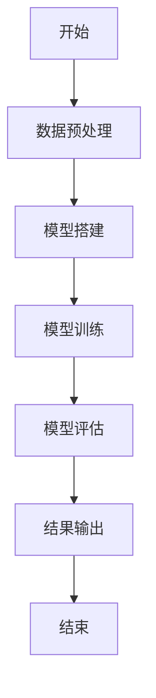

                 

### 《李开复：AI 2.0 时代的未来》

#### 关键词：人工智能、AI 2.0、深度学习、神经网络、强化学习、生成对抗网络、医疗健康、金融、教育、城市管理、可持续发展、伦理、社会问题、创新、发展趋势、人才培养

#### 摘要：
本文由世界顶级人工智能专家李开复主导，深入探讨AI 2.0时代的未来。文章分为三大部分，首先概述AI 2.0时代的概念与背景，详细解析其核心技术与原理。接着，探讨AI 2.0在各行各业的广泛应用，如医疗健康、金融、教育、城市管理以及可持续发展。最后，分析AI 2.0时代的伦理与社会问题，展望其创新与发展趋势，并给出个人与企业应对AI 2.0时代的路径建议。通过本文，读者将全面了解AI 2.0时代的现状与未来，掌握其核心概念与应用。

### 《李开复：AI 2.0 时代的未来》目录大纲

#### 第一部分：AI 2.0 时代概述

##### 第1章：AI 2.0 时代的概念与背景
- 1.1 AI 2.0 时代的定义与特点
- 1.2 从 AI 1.0 到 AI 2.0 的演进
- 1.3 AI 2.0 时代的背景与挑战

##### 第2章：AI 2.0 的核心技术与原理
- 2.1 深度学习基础
- 2.2 神经网络与优化算法
- 2.3 强化学习与生成对抗网络

#### 第二部分：AI 2.0 在各行各业的应用

##### 第3章：人工智能与医疗健康
- 3.1 医疗影像分析
- 3.2 疾病预测与诊断
- 3.3 药物研发与基因组学

##### 第4章：人工智能与金融
- 4.1 金融市场预测
- 4.2 风险管理
- 4.3 信用评分与欺诈检测

##### 第5章：人工智能与教育
- 5.1 个性化学习
- 5.2 智能教学助手
- 5.3 教育数据挖掘

##### 第6章：人工智能与城市管理
- 6.1 智慧交通
- 6.2 城市安全
- 6.3 智慧能源管理

##### 第7章：人工智能与可持续发展
- 7.1 环境监测与保护
- 7.2 资源优化与循环利用
- 7.3 可持续发展评估

#### 第三部分：AI 2.0 时代的未来展望

##### 第8章：AI 2.0 时代的伦理与社会问题
- 8.1 人工智能伦理
- 8.2 数据隐私与安全
- 8.3 AI 不公平与歧视

##### 第9章：AI 2.0 时代的创新与发展趋势
- 9.1 AI 硬件与基础设施建设
- 9.2 跨学科融合与协同创新
- 9.3 AI 2.0 时代的商业模式

##### 第10章：个人与企业的 AI 2.0 路径
- 10.1 个人如何掌握 AI 2.0 技能
- 10.2 企业如何布局 AI 2.0 战略
- 10.3 AI 2.0 时代的人才培养

#### 附录

##### 附录 A：AI 2.0 相关资源与工具
- A.1 主流深度学习框架
- A.2 AI 开发工具与平台
- A.3 AI 教育资源与课程推荐

##### 附录 B：Mermaid 流程图与伪代码示例
- B.1 AI 大模型训练流程
- B.2 强化学习算法伪代码

##### 附录 C：数学模型与公式示例
- C.1 信息熵公式
- C.2 强化学习奖励函数公式

##### 附录 D：代码实际案例与解读
- D.1 TensorFlow 2.0 神经网络训练案例
- D.2 数据预处理与模型评估代码解读

##### 附录 E：开发环境搭建与配置指南
- E.1 Python 与 TensorFlow 安装
- E.2 其他依赖库安装
- E.3 开发环境配置

##### 附录 F：源代码与资源获取
- F.1 源代码获取方式
- F.2 相关资源链接
- F.3 社区支持与交流

### 第一部分：AI 2.0 时代概述

#### 第1章：AI 2.0 时代的概念与背景

##### 1.1 AI 2.0 时代的定义与特点

AI 2.0 时代，亦称“下一代人工智能时代”，是对传统人工智能（AI 1.0）的升级和扩展。AI 1.0主要以规则驱动，依赖大量预设的规则和指令，如早期的专家系统和自然语言处理系统。而AI 2.0则转向数据驱动，强调机器自我学习和自适应能力，主要通过深度学习、强化学习等先进算法实现。

AI 2.0 时代具有以下特点：

1. **自我学习能力**：AI 2.0通过深度学习、强化学习等算法，能够从海量数据中自动学习和优化，实现自我进化。
2. **通用性与泛用性**：AI 2.0不仅限于特定领域，如图像识别、语音识别等，而是具备广泛的应用前景，能够应用于医疗、金融、教育等多个领域。
3. **智能化**：AI 2.0通过不断学习和优化，能够模拟人类的智能行为，实现更高层次的任务处理和决策。

##### 1.2 从 AI 1.0 到 AI 2.0 的演进

AI 1.0时代主要基于知识表示和推理方法，强调人类专家的知识和规则在系统中的主导地位。而AI 2.0时代的核心变革在于数据驱动和算法优化：

1. **深度学习的兴起**：深度学习作为AI 2.0时代的核心技术，通过多层神经网络对大量数据进行自动特征提取和分类，使AI系统在图像识别、语音识别等领域取得了突破性进展。
2. **大数据的广泛应用**：大数据技术的成熟为AI 2.0提供了丰富的数据资源，使AI系统能够从海量数据中挖掘出有价值的信息。
3. **算法优化与创新**：包括强化学习、生成对抗网络（GAN）等在内的多种新型算法不断涌现，推动了AI技术的持续进步。

##### 1.3 AI 2.0 时代的背景与挑战

AI 2.0 时代的背景主要包括以下几个方面：

1. **技术进步**：深度学习、强化学习等算法的突破性进展，以及计算能力的提升，为AI 2.0时代奠定了基础。
2. **数据驱动**：互联网、物联网等技术的快速发展，使海量数据得以产生和收集，为AI 2.0提供了丰富的数据资源。
3. **产业需求**：各行各业对智能化、自动化需求的不断增加，推动了AI 2.0在各领域的应用。

然而，AI 2.0时代也面临一系列挑战：

1. **伦理问题**：AI系统的决策过程可能存在偏见和不公平，需要制定相应的伦理规范。
2. **隐私保护**：AI系统在处理个人数据时，可能引发隐私泄露问题，需要加强数据保护和隐私保护措施。
3. **技术瓶颈**：虽然AI技术取得了显著进展，但仍然面临许多技术难题，如模型可解释性、算法稳定性等。

### 第一部分：AI 2.0 时代概述

#### 第2章：AI 2.0 的核心技术与原理

##### 2.1 深度学习基础

深度学习是AI 2.0时代的核心技术之一，通过多层神经网络对数据进行自动特征提取和分类。深度学习的核心包括以下几个关键组成部分：

1. **神经网络**：神经网络是深度学习的基础，由多个神经元（或节点）组成，通过前向传播和反向传播进行数据学习和优化。
2. **激活函数**：激活函数用于引入非线性变换，使神经网络具备非线性处理能力。常见的激活函数包括ReLU、Sigmoid、Tanh等。
3. **损失函数**：损失函数用于评估神经网络的预测误差，常见的损失函数包括均方误差（MSE）、交叉熵损失等。

深度学习的工作流程主要包括以下几个步骤：

1. **数据预处理**：对输入数据进行标准化、归一化等处理，以便神经网络更好地学习。
2. **模型搭建**：根据问题需求，搭建相应的神经网络模型，选择合适的网络结构和激活函数。
3. **模型训练**：通过大量样本数据进行模型训练，使用反向传播算法更新网络权重，使模型逐渐逼近真实值。
4. **模型评估**：使用验证集或测试集对模型进行评估，评估模型性能，如准确率、召回率等。
5. **模型优化**：根据评估结果，对模型进行调整和优化，以提高模型性能。

##### 2.2 神经网络与优化算法

神经网络是深度学习的基础，其核心在于通过多层神经元对数据进行自动特征提取和分类。神经网络的主要组成部分包括输入层、隐藏层和输出层。输入层接收外部输入数据，隐藏层对数据进行特征提取和变换，输出层生成预测结果。

优化算法是神经网络训练过程中至关重要的一环，常用的优化算法包括：

1. **梯度下降算法**：梯度下降是一种基于损失函数梯度进行迭代更新的优化算法。其基本思想是沿着损失函数梯度的反方向进行搜索，以找到最小化损失函数的参数值。常见的梯度下降算法包括批量梯度下降（BGD）、随机梯度下降（SGD）和小批量梯度下降（MBGD）。

2. **动量法**：动量法是在梯度下降算法基础上引入动量项，以加速收敛速度并避免陷入局部最小值。其基本思想是利用前一次迭代的梯度信息，更新当前迭代梯度。

3. **Adagrad算法**：Adagrad是一种自适应学习率优化算法，其核心思想是自适应调整学习率，以适应不同梯度变化。Adagrad通过计算每个参数的累积梯度平方和，动态调整学习率，以避免学习率过大或过小的问题。

4. **Adam算法**：Adam是一种基于一阶矩估计和二阶矩估计的优化算法，其结合了Adagrad和RMSProp的优点。Adam通过同时考虑一阶矩估计（均值）和二阶矩估计（方差），在动态调整学习率方面具有更好的性能。

神经网络与优化算法的关系如下：

1. **神经网络用于特征提取和分类**：神经网络通过多层结构对输入数据进行自动特征提取和分类，实现复杂数据的建模和预测。
2. **优化算法用于模型训练**：优化算法用于更新神经网络权重，使模型逐渐逼近真实值。通过优化算法，可以加快模型训练速度，提高模型性能。

##### 2.3 强化学习与生成对抗网络

强化学习（Reinforcement Learning，RL）是一种通过与环境互动进行决策和学习的机器学习技术。强化学习的基本思想是：通过奖励和惩罚来指导模型选择最优策略，以实现长期目标。强化学习的主要组成部分包括：

1. **代理（Agent）**：代理是强化学习中的主体，负责执行动作并获取环境反馈。
2. **环境（Environment）**：环境是代理执行动作的场所，提供状态和奖励信号。
3. **策略（Policy）**：策略是代理根据当前状态选择动作的方法，可以是确定性策略或随机策略。
4. **价值函数（Value Function）**：价值函数用于评估状态或状态-动作对的预期奖励，帮助代理选择最优动作。
5. **模型（Model）**：模型是代理对环境动态和奖励机制的假设，用于预测未来状态和奖励。

强化学习的工作流程主要包括以下几个步骤：

1. **初始化**：初始化代理、环境和策略。
2. **执行动作**：代理根据当前状态执行动作，并获取环境反馈。
3. **更新策略**：根据奖励信号和经验，更新代理的策略。
4. **重复执行**：重复执行动作和策略更新，逐步优化策略。

强化学习的主要挑战包括：

1. **探索与利用平衡**：代理需要在探索（尝试新动作）和利用（利用已掌握的知识）之间找到平衡点。
2. **长期奖励与短期奖励**：代理需要权衡长期奖励和短期奖励，以实现长期目标。
3. **稀疏奖励**：在一些应用场景中，奖励信号较为稀疏，难以引导代理找到最优策略。

生成对抗网络（Generative Adversarial Networks，GAN）是一种由生成器和判别器组成的深度学习模型，主要用于生成与真实数据分布相似的伪数据。GAN的基本思想是：生成器和判别器进行对抗性训练，生成器试图生成逼真的数据，判别器则试图区分真实数据和生成数据。

GAN的主要组成部分包括：

1. **生成器（Generator）**：生成器是一个神经网络，负责生成伪数据，使其尽可能接近真实数据。
2. **判别器（Discriminator）**：判别器是一个神经网络，负责判断输入数据的真实性，输出一个概率值。
3. **损失函数**：GAN的损失函数通常包括生成损失和判别损失，分别用于衡量生成器和判别器的性能。

GAN的工作流程主要包括以下几个步骤：

1. **初始化**：初始化生成器和判别器，设置初始参数。
2. **生成伪数据**：生成器生成伪数据，判别器判断伪数据的真实性。
3. **更新参数**：根据生成损失和判别损失，更新生成器和判别器的参数。
4. **重复生成和更新**：重复生成伪数据和更新参数，逐步提高生成器的生成质量。

GAN的主要应用领域包括：

1. **图像生成**：GAN可以生成逼真的图像，如人脸、风景等。
2. **图像修复**：GAN可以用于图像去噪、修复和增强。
3. **图像翻译**：GAN可以用于图像风格转换和翻译。
4. **自然语言处理**：GAN可以用于文本生成和翻译。

### 第二部分：AI 2.0 在各行各业的应用

#### 第3章：人工智能与医疗健康

人工智能（AI）在医疗健康领域的应用已经取得了显著成果，其核心价值在于提高诊断准确性、优化治疗方案、提升医疗效率等方面。以下从医疗影像分析、疾病预测与诊断、药物研发与基因组学三个方面探讨AI在医疗健康领域的应用。

##### 3.1 医疗影像分析

医疗影像分析是AI在医疗健康领域的重要应用之一。通过深度学习、计算机视觉等技术，AI系统可以自动识别和分析医学影像，如X光片、CT扫描、MRI等，从而提高诊断准确性和效率。

1. **疾病筛查**：AI系统可以自动分析医学影像，对常见疾病如肺癌、乳腺癌等进行早期筛查。例如，利用卷积神经网络（CNN）对肺癌患者的胸部X光片进行自动检测，可以在早期发现肺癌病变，提高诊断准确率。
2. **病变检测**：AI系统可以自动识别医学影像中的病变区域，如肿瘤、病灶等。例如，利用深度学习技术对脑部MRI图像进行分析，可以准确识别肿瘤位置和大小，为医生提供重要的诊断依据。
3. **治疗方案推荐**：AI系统可以根据患者的影像数据和临床信息，为医生提供个性化的治疗方案推荐。例如，在乳腺癌治疗中，AI系统可以根据患者的影像特征、病理类型等数据，推荐最佳的治疗方案，如手术、放疗、化疗等。

##### 3.2 疾病预测与诊断

AI在疾病预测与诊断方面的应用可以有效提高诊断准确率和降低误诊率。以下是一些典型的应用场景：

1. **糖尿病预测**：AI系统可以通过分析患者的血糖数据、病史等，预测患者患糖尿病的风险。例如，利用机器学习算法对大量糖尿病患者的数据进行训练，可以建立预测模型，对新的患者进行糖尿病风险预测，有助于早期预防和干预。
2. **心脏病诊断**：AI系统可以通过分析心电图、血压等生理信号，预测患者患心脏病的风险。例如，利用深度学习算法对大量心脏病患者的数据进行训练，可以建立心脏病诊断模型，对新的患者进行诊断，提高诊断准确率。
3. **传染病监测**：AI系统可以通过分析流行病学数据、地理信息等，预测传染病的传播趋势和风险。例如，利用机器学习算法对传染病疫情数据进行建模，可以预测疫情的传播范围和传播速度，为公共卫生决策提供科学依据。

##### 3.3 药物研发与基因组学

AI在药物研发与基因组学领域的应用有助于加速新药研发、优化治疗方案和个性化医疗。

1. **药物设计**：AI系统可以通过分析药物分子结构、生物活性等信息，预测药物的效果和副作用，从而提高药物研发的成功率。例如，利用深度学习算法对大量药物分子进行训练，可以建立药物设计模型，为新药研发提供支持。
2. **基因组分析**：AI系统可以通过分析基因组数据，发现与疾病相关的基因变异和信号，从而为疾病诊断和治疗提供新的靶点。例如，利用机器学习算法对大量基因组数据进行训练，可以建立疾病诊断模型，帮助医生更准确地诊断疾病。
3. **个性化医疗**：AI系统可以根据患者的基因组数据、病史、生活方式等信息，为患者制定个性化的治疗方案。例如，利用机器学习算法对大量个性化医疗案例进行分析，可以建立个性化医疗模型，为患者提供个性化的治疗建议。

总之，AI在医疗健康领域的应用为传统医疗带来了革命性的变革，不仅提高了诊断准确性和治疗效果，还优化了医疗资源的配置，为公众健康提供了有力支持。

#### 第4章：人工智能与金融

人工智能（AI）在金融领域的应用已经渗透到金融市场预测、风险管理、信用评分、欺诈检测等多个方面，极大地提升了金融行业的效率和准确性。以下将从这些方面详细探讨AI在金融领域的应用。

##### 4.1 金融市场预测

金融市场预测是金融领域中一个重要的应用领域，通过分析大量的历史数据和当前市场状况，AI系统可以预测金融市场的未来走势，为投资者提供决策支持。

1. **价格预测**：AI系统可以使用机器学习和深度学习算法，分析历史价格数据、市场情绪、宏观经济指标等信息，预测金融资产的未来价格走势。例如，利用时间序列分析模型和深度学习模型，可以对股票、期货、外汇等金融资产的价格进行预测。
2. **风险预测**：AI系统可以通过分析历史交易数据、公司财务报表、市场新闻等，预测市场风险和投资风险。例如，利用分类和回归模型，可以预测特定金融资产的投资风险，帮助投资者进行风险管理和资产配置。
3. **市场情绪分析**：AI系统可以利用自然语言处理（NLP）技术，分析社交媒体、新闻报道等文本信息，预测市场情绪的变化。例如，通过情感分析模型，可以识别出市场参与者对某一金融资产或市场的情绪倾向，为投资者提供市场情绪参考。

##### 4.2 风险管理

风险管理是金融领域的重要任务，通过识别、评估和应对潜在风险，AI系统可以帮助金融机构有效地管理风险。

1. **信用评分**：AI系统可以通过分析借款人的历史信用记录、财务状况、行为数据等信息，为借款人进行信用评分。例如，利用机器学习模型，可以预测借款人违约的概率，帮助金融机构进行信用风险管理。
2. **市场风险控制**：AI系统可以通过分析市场数据、经济指标等信息，预测市场波动和潜在风险。例如，利用统计模型和深度学习模型，可以预测特定金融市场的波动性，帮助金融机构制定有效的市场风险控制策略。
3. **操作风险管理**：AI系统可以通过分析操作数据、流程信息等，识别和预防操作风险。例如，利用异常检测算法，可以实时监控金融机构的操作行为，发现潜在的操作风险，并采取措施进行控制。

##### 4.3 信用评分与欺诈检测

信用评分和欺诈检测是金融领域中两个关键的应用领域，通过AI系统可以显著提高这两个领域的效率和准确性。

1. **信用评分**：AI系统可以通过分析借款人的个人信息、信用历史、行为数据等，进行信用评分。例如，利用机器学习模型，可以预测借款人按时还款的概率，为金融机构提供信用评分参考，从而降低坏账率。
2. **欺诈检测**：AI系统可以通过分析交易数据、用户行为等信息，识别潜在的欺诈行为。例如，利用异常检测算法，可以实时监控交易行为，发现异常的交易模式，从而有效预防欺诈行为。

总之，AI在金融领域的应用已经取得了显著的成果，通过金融市场预测、风险管理、信用评分、欺诈检测等方面的应用，不仅提高了金融行业的效率和准确性，还为金融机构和投资者提供了有力的决策支持。随着AI技术的不断发展，其在金融领域的应用前景将更加广阔。

#### 第5章：人工智能与教育

人工智能（AI）在教育和学习领域的应用正在日益深化，其核心在于通过智能化工具和个性化教学方法，提升教育质量和学习效率。以下从个性化学习、智能教学助手、教育数据挖掘三个方面探讨AI在教育领域的应用。

##### 5.1 个性化学习

个性化学习是AI在教育领域最具代表性的应用之一，旨在根据学生的个体差异和需求，提供定制化的学习资源和教学策略。

1. **智能推荐系统**：AI系统可以通过分析学生的学习历史、知识水平和兴趣爱好，为学生推荐适合的学习资源和课程。例如，利用协同过滤算法和内容推荐算法，智能推荐系统可以为每个学生定制个性化的学习计划，提高学习效率。
2. **自适应学习平台**：AI系统可以根据学生的学习进度和能力，动态调整教学内容和难度。例如，利用自适应学习平台，学生可以在完成当前任务后，根据自身表现获得不同难度和类型的练习，从而实现个性化学习。
3. **学习行为分析**：AI系统可以通过分析学生的学习行为数据，如学习时间、学习方式、答题情况等，了解学生的学习习惯和问题所在，为教师提供针对性的辅导建议。例如，利用机器学习算法，教师可以识别出学生的学习瓶颈，有针对性地进行教学改进。

##### 5.2 智能教学助手

智能教学助手是AI在教育领域的另一个重要应用，通过自然语言处理（NLP）和语音识别等技术，为教师和学生提供辅助教学和支持。

1. **智能问答系统**：AI系统可以实时回答学生提出的问题，为学生提供即时帮助。例如，利用问答系统，学生可以在学习过程中随时查询相关知识点，获得详细的解释和示例。
2. **语音识别与转换**：AI系统可以将教师的口头讲解转换成文本，便于学生查阅和复习。例如，利用语音识别技术，将教师的课堂讲解实时转换为文本，并提供关键词索引，帮助学生快速查找和复习重点内容。
3. **课堂互动与评估**：AI系统可以通过互动式教学工具，如智能互动白板、虚拟现实（VR）教室等，增强课堂互动性，提高教学效果。例如，利用智能互动白板，教师可以实时展示教学内容，与学生进行互动，增强课堂氛围。

##### 5.3 教育数据挖掘

教育数据挖掘是利用数据挖掘技术，从海量的教育数据中提取有价值的信息，为教育决策提供支持。

1. **学习分析**：AI系统可以通过分析学生的学习数据，如考试成绩、学习时长、答题情况等，识别学生的学习规律和问题，为教师提供教学改进建议。例如，利用聚类分析算法，可以识别出学习效果较好的学生群体和学习效果较差的学生群体，为教师提供针对性的教学策略。
2. **教育质量评估**：AI系统可以通过分析教育数据，如教师教学质量、学生学习效果等，评估教育质量，为教育管理部门提供决策支持。例如，利用回归分析算法，可以评估不同教学方法对学生学习效果的影响，为教育部门提供改进教育质量的建议。
3. **教育趋势预测**：AI系统可以通过分析历史教育数据，预测教育趋势和发展方向，为教育规划和政策制定提供依据。例如，利用时间序列分析算法，可以预测未来几年内教育领域的发展趋势，为教育管理部门提供战略规划参考。

总之，AI在教育领域的应用为传统教育模式带来了深刻的变革，通过个性化学习、智能教学助手、教育数据挖掘等方面的应用，不仅提升了教育质量和学习效率，还为教育管理和决策提供了有力支持。随着AI技术的不断发展，其在教育领域的应用前景将更加广阔。

#### 第6章：人工智能与城市管理

人工智能（AI）在城市管理中的应用已经逐渐成为智慧城市建设的核心驱动力。通过AI技术，城市管理者可以更加高效地解决交通拥堵、城市安全和能源管理等问题，从而提升城市运行效率和居民生活质量。以下从智慧交通、城市安全和智慧能源管理三个方面探讨AI在城市管理中的应用。

##### 6.1 智慧交通

智慧交通是AI技术在城市管理中的一个重要应用领域，通过优化交通流量、提高公共交通效率，减少交通拥堵，提升交通管理能力。

1. **交通流量预测**：AI系统可以通过分析历史交通数据、实时监控数据和天气预报等信息，预测未来交通流量和拥堵情况。例如，利用深度学习算法，可以建立交通流量预测模型，为交通管理部门提供拥堵预警和交通疏导策略。
2. **智能交通信号控制**：AI系统可以通过对交通流量、车辆数量等实时数据的分析，动态调整交通信号灯的时间设置，优化交通流量。例如，利用优化算法和深度学习技术，智能交通信号控制系统可以在不同时间段和不同路段自动调整信号灯时长，从而减少拥堵和排队现象。
3. **公共交通优化**：AI系统可以通过分析公共交通乘客流量、线路利用率等信息，优化公交线路和时间表，提高公共交通的运行效率。例如，利用聚类分析和路径规划算法，可以确定最优的公交路线和发车时间，减少乘客等待时间。

##### 6.2 城市安全

城市安全是AI技术在城市管理中的另一个关键应用领域，通过实时监控、事件检测和应急响应，提升城市安全管理水平。

1. **视频监控分析**：AI系统可以通过视频监控分析技术，对城市公共场所进行实时监控，识别异常行为和事件。例如，利用计算机视觉和深度学习技术，AI系统可以自动识别闯红灯、打架斗殴、可疑包裹等异常行为，及时通知相关部门进行处理。
2. **事件检测与预警**：AI系统可以通过分析城市传感器数据和视频监控数据，实时检测和预警城市安全事件。例如，利用异常检测算法，AI系统可以识别火灾、地震、洪水等突发事件，并自动向相关部门发送预警信息，从而实现快速应急响应。
3. **公共安全风险评估**：AI系统可以通过分析历史事故数据、人口密度、建筑物结构等信息，评估城市公共安全风险，为城市规划和管理提供科学依据。例如，利用风险评估模型，可以确定哪些区域和场所需要重点关注和加强安全措施。

##### 6.3 智慧能源管理

智慧能源管理是AI技术在城市管理中的创新应用，通过优化能源使用和提高能源效率，实现可持续发展。

1. **智能电网管理**：AI系统可以通过对电力供需数据的分析，优化电网运行和管理。例如，利用预测算法和优化算法，AI系统可以预测电力需求，调度电力资源，减少电力浪费，提高电网运行效率。
2. **能效监测与优化**：AI系统可以通过对建筑物的能耗数据进行分析，监测和优化能源使用。例如，利用物联网技术和深度学习算法，AI系统可以实时监测建筑物的能耗情况，识别能源浪费环节，并提供优化建议，降低能源消耗。
3. **可再生能源集成**：AI系统可以通过分析天气数据、能源生产数据等信息，优化可再生能源的集成和利用。例如，利用机器学习算法，AI系统可以预测太阳能和风能的发电量，合理安排能源生产和消费，提高可再生能源的利用率。

总之，AI在城市管理中的应用为城市运行和居民生活带来了巨大变革，通过智慧交通、城市安全和智慧能源管理等方面的应用，不仅提升了城市管理的效率和智能化水平，还为城市可持续发展提供了有力支持。随着AI技术的不断进步，其在城市管理中的应用前景将更加广阔。

#### 第7章：人工智能与可持续发展

人工智能（AI）在可持续发展领域的应用正日益显现，通过优化资源利用、监测环境变化和评估可持续发展成效，为全球环境治理和资源管理提供创新解决方案。以下从环境监测与保护、资源优化与循环利用、可持续发展评估三个方面探讨AI在可持续发展中的应用。

##### 7.1 环境监测与保护

AI技术在环境监测与保护中的应用，为提高监测效率和数据精度提供了有力支持。

1. **空气污染监测**：AI系统可以通过卫星遥感、地面监测站和无人机等手段，实时监测空气污染状况。例如，利用深度学习算法，AI系统可以对空气质量数据进行分析，识别污染源并预测污染趋势，为环境保护部门提供决策依据。
2. **水污染监测**：AI系统可以通过分析水质传感器数据、卫星遥感图像等，实时监测水污染情况。例如，利用图像识别技术，AI系统可以识别水体中的污染物质，如化学污染物、重金属等，并预测污染范围和影响。
3. **生物多样性监测**：AI系统可以通过分析生物识别数据、野外监测设备采集的信息等，监测生物多样性变化。例如，利用机器学习算法，AI系统可以识别不同物种的分布和数量，评估生物多样性状况，为生态保护和恢复提供支持。

##### 7.2 资源优化与循环利用

AI技术在资源优化与循环利用中的应用，有助于提高资源利用效率和减少浪费。

1. **能源管理**：AI系统可以通过分析能源使用数据、设备运行状态等，优化能源使用和提高能源效率。例如，利用预测算法和优化算法，AI系统可以预测能源需求，调度能源资源，减少能源浪费，提高能源利用效率。
2. **水资源管理**：AI系统可以通过分析水资源分布、用水需求等数据，优化水资源配置和利用。例如，利用物联网技术和机器学习算法，AI系统可以实时监测水资源状况，预测用水需求，制定合理的水资源调配策略，减少水资源浪费。
3. **废弃物管理**：AI系统可以通过分析废弃物产生、处理和回收等数据，优化废弃物管理流程。例如，利用图像识别和分类算法，AI系统可以识别废弃物种类，优化分类和回收过程，提高废弃物资源化利用水平。

##### 7.3 可持续发展评估

AI技术在可持续发展评估中的应用，为评估可持续发展成效提供了科学手段。

1. **环境影响评估**：AI系统可以通过分析环境影响数据、生态指标等，评估人类活动对环境的影响。例如，利用模型预测算法，AI系统可以评估不同政策或行为对环境的影响，为可持续发展决策提供科学依据。
2. **经济评估**：AI系统可以通过分析经济数据、产业发展等，评估可持续发展对经济的贡献。例如，利用大数据分析和机器学习算法，AI系统可以评估可持续发展措施对经济增长、就业、社会福利等的影响，为政策制定提供参考。
3. **社会评估**：AI系统可以通过分析社会发展数据、社会满意度等，评估可持续发展对社会的贡献。例如，利用自然语言处理和情感分析技术，AI系统可以评估公众对可持续发展政策的认可度和满意度，为政策优化提供支持。

总之，AI在可持续发展领域的应用为推动全球环境治理和资源管理提供了强大工具。通过环境监测与保护、资源优化与循环利用、可持续发展评估等方面的应用，AI技术不仅提高了资源利用效率和环境保护水平，还为可持续发展提供了科学评估手段。随着AI技术的不断发展，其在可持续发展领域的应用前景将更加广阔，为全球可持续发展目标的实现贡献力量。

### 第三部分：AI 2.0 时代的未来展望

#### 第8章：AI 2.0 时代的伦理与社会问题

随着人工智能（AI）技术的快速发展，AI 2.0时代的到来不仅带来了巨大的机遇，也引发了一系列伦理和社会问题。这些挑战涉及数据隐私、安全、公平和歧视等方面，需要全社会共同努力来解决。

##### 8.1 人工智能伦理

AI 2.0时代的伦理问题主要涉及以下几个方面：

1. **算法公正性**：AI算法在决策过程中可能存在偏见，导致不公正的决策。例如，在招聘、信用评分、司法判决等领域，如果算法训练数据存在偏差，可能导致某些群体受到不公平对待。为了确保算法的公正性，需要建立透明的算法设计和监督机制，确保算法的决策过程公平、合理。
2. **算法可解释性**：随着深度学习等复杂算法的广泛应用，AI系统的决策过程越来越复杂，缺乏透明度和可解释性。这给用户和监管机构带来了信任危机。为了提高算法的可解释性，研究者正在探索可解释AI（XAI）技术，使AI系统的决策过程更加透明，便于用户和监管机构理解和监督。
3. **AI责任归属**：当AI系统出现错误或导致不良后果时，如何界定责任归属是一个重要伦理问题。目前，法律和伦理规范尚未明确，需要制定相关法律法规，明确AI系统开发者和使用者的责任，确保在发生问题时能够公平、公正地处理。

##### 8.2 数据隐私与安全

数据隐私和安全是AI 2.0时代面临的重要挑战：

1. **数据隐私**：AI系统在处理和分析数据时，可能涉及大量个人隐私信息。为了保护用户隐私，需要制定严格的隐私保护政策和法规，限制数据收集、存储和使用范围。此外，研究者正在探索联邦学习（Federated Learning）等隐私保护技术，通过在本地设备上训练模型，减少对用户数据的收集和传输。
2. **数据安全**：AI系统在处理大量数据时，可能面临数据泄露、篡改等安全威胁。为了确保数据安全，需要建立完善的数据安全防护体系，包括数据加密、访问控制、安全审计等。同时，需要加强对AI系统的安全测试和评估，及时发现和修复安全隐患。

##### 8.3 AI 不公平与歧视

AI 2.0时代的不公平和歧视问题主要表现为以下两个方面：

1. **算法歧视**：AI系统在决策过程中可能基于历史数据中的偏见，对某些群体产生歧视。例如，在招聘、贷款审批、司法判决等领域，AI系统可能对某些种族、性别、年龄等产生歧视。为了消除算法歧视，需要加强对AI系统的监督和审查，确保算法设计符合公平原则，同时引入多样化的训练数据，减少偏见。
2. **就业影响**：AI 2.0时代的自动化和智能化技术可能对就业市场产生重大影响，某些工作岗位可能被自动化替代，导致就业不平等。为了应对这一挑战，需要制定相应的政策，如提供再培训和就业支持，促进劳动力市场的适应和转型。

总之，AI 2.0时代的伦理和社会问题需要全社会共同努力，通过制定相关法律法规、加强技术研究和应用，确保AI技术的可持续发展，为人类带来更大的福祉。同时，也需要公众、企业、政府等各方共同参与，共同推动AI伦理和社会问题的解决。

### 第三部分：AI 2.0 时代的未来展望

#### 第9章：AI 2.0 时代的创新与发展趋势

AI 2.0时代的到来不仅带来了技术创新，也推动了各领域的深刻变革。在这一章节中，我们将探讨AI 2.0时代的创新与发展趋势，重点分析AI硬件与基础设施建设、跨学科融合与协同创新、以及AI 2.0时代的商业模式。

##### 9.1 AI 硬件与基础设施建设

AI硬件是AI 2.0时代的技术基石，其进步直接关系到AI应用的性能和效率。以下是一些关键的发展趋势：

1. **高性能计算硬件**：随着深度学习算法的复杂度不断增加，对计算能力的需求也日益提高。GPU（图形处理单元）和TPU（张量处理单元）等专用硬件在深度学习任务中发挥了重要作用。未来，量子计算和光子计算等新兴计算范式有望进一步提升计算能力，推动AI技术迈向新的高度。
2. **边缘计算**：随着物联网（IoT）和5G技术的普及，边缘计算成为AI 2.0时代的重要发展方向。边缘计算通过在靠近数据源的设备上处理和分析数据，减少数据传输延迟，提高响应速度。例如，自动驾驶汽车通过边缘计算实时分析周围环境，实现安全驾驶。
3. **硬件加速器**：AI硬件加速器如ASIC（专用集成电路）和FPGA（现场可编程门阵列）在AI任务中提供了显著的性能提升。硬件加速器通过优化计算过程，降低功耗，提高能效，为大规模AI应用提供了支持。

##### 9.2 跨学科融合与协同创新

AI 2.0时代的创新不仅依赖于单一学科的发展，更需要跨学科的融合与协同创新。以下是一些跨学科融合的例子：

1. **数据科学与人工智能**：数据科学提供了海量数据的采集、存储和分析方法，与人工智能相结合，推动了深度学习、强化学习等技术的应用。例如，在医疗领域，数据科学和AI的融合有助于疾病预测、个性化治疗等。
2. **生物信息学与AI**：生物信息学通过分析生物数据，如基因序列、蛋白质结构等，为AI提供了丰富的数据资源。AI技术则应用于生物信息学中的复杂计算和模式识别，加速了基因组学、蛋白质组学等领域的研究。
3. **心理学与AI**：心理学研究人类行为和心理机制，为AI提供了丰富的知识背景。AI则可以模拟人类行为，帮助心理学家更好地理解和预测人类行为。例如，通过AI技术，研究人员可以开发个性化的心理健康应用，为用户提供有效的心理干预。

##### 9.3 AI 2.0 时代的商业模式

AI 2.0时代的商业模式正逐渐从传统模式向数据驱动和创新驱动转变。以下是一些典型的商业模式：

1. **平台经济**：平台经济通过搭建开放的AI平台，吸引开发者和企业参与，共同推动AI技术的发展和应用。例如，谷歌的AI平台TensorFlow、亚马逊的AI平台Rekognition等，为开发者提供了丰富的工具和资源，促进了AI技术的创新和应用。
2. **订阅模式**：随着AI技术的普及，越来越多的企业选择采用订阅模式，通过定期支付费用，获得持续的AI服务和支持。例如，微软的Azure AI、IBM的Watson等，通过订阅模式，为企业提供个性化的AI解决方案和咨询服务。
3. **价值共创**：AI技术不仅可以为企业创造价值，还可以与用户共同创造价值。例如，在金融领域，AI技术可以帮助银行提高风险控制能力，同时为用户提供更优质的金融服务；在医疗领域，AI技术可以帮助医疗机构提高诊断准确率，同时为患者提供更好的治疗效果。

总之，AI 2.0时代的创新与发展趋势体现了技术、学科和商业模式的深度融合。通过不断推动技术创新、跨学科融合和商业模式创新，AI 2.0时代将为人类社会带来更多的机遇和挑战。

### 第三部分：AI 2.0 时代的未来展望

#### 第10章：个人与企业的 AI 2.0 路径

在AI 2.0时代，个人和企业的转型与发展都面临着前所未有的机遇和挑战。以下将探讨个人如何掌握AI 2.0技能、企业如何布局AI 2.0战略，以及AI 2.0时代的人才培养。

##### 10.1 个人如何掌握 AI 2.0 技能

随着AI技术的广泛应用，掌握AI技能已成为个人职业发展的关键。以下是一些建议，帮助个人掌握AI 2.0技能：

1. **基础知识学习**：掌握数学、概率论、统计学等基础知识，为AI学习奠定基础。建议学习线性代数、微积分、概率论与数理统计等数学课程，以理解AI算法的核心原理。
2. **编程技能**：学习编程语言，如Python、Java等，掌握编程基础。Python因其简洁易用、丰富的库和工具，是AI领域最受欢迎的编程语言之一。
3. **AI基础知识**：学习深度学习、神经网络、强化学习等AI基础知识，理解AI技术的核心概念和应用场景。推荐学习吴恩达的《深度学习》课程，以及相关书籍和在线教程。
4. **实践项目**：通过参与实践项目，将所学知识应用于实际场景。例如，可以参加Kaggle竞赛，或自己动手实现一个AI项目，如图像识别、自然语言处理等。
5. **持续学习**：AI技术更新迅速，个人需要保持持续学习的态度。关注最新研究论文、技术动态，参加相关会议和研讨会，以保持对AI领域的敏感度。

##### 10.2 企业如何布局 AI 2.0 战略

企业在AI 2.0时代的战略布局至关重要，以下是一些建议：

1. **确立AI战略目标**：明确企业AI战略目标，如提高生产效率、优化客户体验、创新产品等。确保AI战略与企业的整体业务目标一致，避免盲目跟风。
2. **组建AI团队**：建立专业的AI团队，包括数据科学家、机器学习工程师、AI产品经理等。确保团队具备丰富的AI技术知识和实践经验。
3. **数据驱动决策**：利用AI技术分析企业内外部数据，支持决策制定。例如，通过数据挖掘和预测分析，优化供应链管理、市场营销等业务流程。
4. **技术创新与投资**：持续投入研发资金，支持AI技术创新。关注AI领域的最新研究进展，通过技术合作、收购等方式，加速企业AI技术的落地和应用。
5. **人才培养与引进**：重视AI人才的培养与引进，建立完善的培训体系和人才激励机制。吸引和留住优秀的AI人才，为企业的AI战略提供强大支持。
6. **合作与开放**：积极参与AI生态系统，与其他企业和机构建立合作关系。通过开放平台、开源项目等，共同推动AI技术的发展和应用。

##### 10.3 AI 2.0 时代的人才培养

AI 2.0时代对人才的需求提出了新的要求，以下是一些建议，以培养适应AI时代的人才：

1. **跨学科教育**：加强跨学科教育，培养学生的综合素质。结合数学、计算机科学、统计学、心理学等领域的知识，培养学生全面的能力。
2. **实践导向**：注重实践教育，提供丰富的实习、实训机会。通过项目实践、比赛等，让学生将所学知识应用于实际场景，提高解决实际问题的能力。
3. **终身学习**：鼓励终身学习，培养学生持续学习的意识和能力。关注AI领域的最新研究进展，不断更新知识和技能。
4. **人才培养体系**：建立完善的AI人才培养体系，包括课程设置、师资队伍建设、实践教学平台等。确保学生能够获得全面的AI教育和培训。
5. **合作与交流**：加强与产业界的合作与交流，为学生提供实践机会和职业发展支持。与企业和研究机构合作，共同培养适应AI时代的人才。

总之，个人和企业在AI 2.0时代的转型与发展需要共同努力，通过掌握AI技能、布局AI战略和培养AI人才，共同应对AI时代的机遇和挑战。

### 附录

#### 附录 A：AI 2.0 相关资源与工具

以下列出了一些AI 2.0相关资源与工具，以帮助读者深入了解AI技术和应用。

##### A.1 主流深度学习框架

1. **TensorFlow**：谷歌开源的深度学习框架，支持多种编程语言，广泛应用于图像识别、自然语言处理等领域。
2. **PyTorch**：Facebook开源的深度学习框架，以动态计算图和灵活的API著称，适用于研究和个人项目。
3. **Keras**：基于TensorFlow和Theano的深度学习高级API，提供简单直观的接口，适合快速构建和实验深度学习模型。
4. **MXNet**：亚马逊开源的深度学习框架，支持多种编程语言，适用于大规模分布式训练。

##### A.2 AI 开发工具与平台

1. **Google Cloud AI Platform**：谷歌提供的云计算平台，包括AI模型训练、部署和管理工具，支持TensorFlow、PyTorch等框架。
2. **AWS SageMaker**：亚马逊提供的完全托管的机器学习服务，支持模型训练、部署和管理，适用于多种框架和应用。
3. **Azure Machine Learning**：微软提供的机器学习和AI平台，支持模型开发、训练和部署，提供丰富的工具和API。
4. **Docker**：开源的应用容器引擎，用于打包、交付和运行应用，支持AI模型的容器化部署。

##### A.3 AI 教育资源与课程推荐

1. **吴恩达的深度学习课程**：斯坦福大学著名教授吴恩达开设的深度学习课程，涵盖神经网络、深度学习框架等基础知识。
2. **fast.ai**：提供免费和付费的AI课程，包括深度学习、自然语言处理、计算机视觉等领域，适合初学者和有经验者。
3. **Coursera**：提供大量AI和机器学习相关的课程，包括斯坦福大学、MIT等世界顶级大学开设的课程。
4. **edX**：由哈佛大学和麻省理工学院共同创立的在线课程平台，提供丰富的AI和计算机科学课程。

#### 附录 B：Mermaid 流程图与伪代码示例

以下提供一些Mermaid流程图和伪代码示例，以帮助读者理解AI模型训练和强化学习算法。

##### B.1 AI 大模型训练流程



##### B.2 强化学习算法伪代码

```python
# 强化学习算法伪代码
# 初始化环境
初始化状态 s
初始化策略 π
初始化价值函数 V(s)

# 开始训练
for each episode:
    s = 环境初始化()
    while not episode_end:
        a = π(s)
        s',r = 环境执行动作 a
        Q(s,a) = Q(s,a) + α * (r + γ * max(Q(s')) - Q(s,a))
        s = s'
    更新策略 π
    更新价值函数 V(s)

# 结束训练
```

#### 附录 C：数学模型与公式示例

以下列出了一些常用的数学模型和公式，以帮助读者理解AI算法中的关键概念。

##### C.1 信息熵公式

$$
H(X) = -\sum_{i} p(x_i) \log_2 p(x_i)
$$

##### C.2 强化学习奖励函数公式

$$
R(t) = r(t) + \gamma \max_a Q(s', a)
$$

#### 附录 D：代码实际案例与解读

以下提供一个使用TensorFlow 2.0训练简单神经网络的实际案例，并对其进行详细解读。

```python
# 代码实际案例：使用 TensorFlow 2.0 训练一个简单的神经网络
import tensorflow as tf

# 搭建模型
model = tf.keras.Sequential([
    tf.keras.layers.Dense(128, activation='relu', input_shape=(784,)),
    tf.keras.layers.Dropout(0.2),
    tf.keras.layers.Dense(10, activation='softmax')
])

# 编译模型
model.compile(loss='categorical_crossentropy',
              optimizer=tf.keras.optimizers.Adam(),
              metrics=['accuracy'])

# 加载数据
(x_train, y_train), (x_test, y_test) = tf.keras.datasets.mnist.load_data()

# 预处理数据
x_train = x_train.reshape(60000, 784)
x_test = x_test.reshape(10000, 784)
x_train = x_train / 255.0
x_test = x_test / 255.0

# 转换为 one-hot 编码
y_train = tf.keras.utils.to_categorical(y_train, 10)
y_test = tf.keras.utils.to_categorical(y_test, 10)

# 训练模型
model.fit(x_train, y_train, epochs=5, batch_size=32, validation_split=0.1)

# 评估模型
model.evaluate(x_test, y_test)
```

**代码解读与分析：**

1. **导入 TensorFlow 库**：首先，导入 TensorFlow 2.0 库，这是训练神经网络的核心库。
   ```python
   import tensorflow as tf
   ```

2. **搭建模型**：使用 `tf.keras.Sequential` 搭建一个简单的神经网络模型，包括两个隐藏层，每个隐藏层有 128 个神经元，使用 ReLU 激活函数。第二个隐藏层后添加了一个 Dropout 层，以防止过拟合。输出层有 10 个神经元，使用 softmax 激活函数，用于多分类任务。
   ```python
   model = tf.keras.Sequential([
       tf.keras.layers.Dense(128, activation='relu', input_shape=(784,)),
       tf.keras.layers.Dropout(0.2),
       tf.keras.layers.Dense(10, activation='softmax')
   ])
   ```

3. **编译模型**：使用 `compile` 方法编译模型，指定损失函数、优化器和评估指标。在这里，使用 `categorical_crossentropy` 作为损失函数，`Adam` 优化器用于模型训练，`accuracy` 作为评估指标。
   ```python
   model.compile(loss='categorical_crossentropy',
                 optimizer=tf.keras.optimizers.Adam(),
                 metrics=['accuracy'])
   ```

4. **加载数据**：使用 `tf.keras.datasets.mnist.load_data()` 方法加载数据集，这包含了 60,000 个训练样本和 10,000 个测试样本。每个样本是 28x28 的像素图像，标签为 0 到 9 的整数。
   ```python
   (x_train, y_train), (x_test, y_test) = tf.keras.datasets.mnist.load_data()
   ```

5. **预处理数据**：对数据进行预处理，包括将图像数据reshape为 (60000, 784) 和 (10000, 784)，并将像素值归一化到 [0, 1] 范围内。同时，将标签转换为 one-hot 编码。
   ```python
   x_train = x_train.reshape(60000, 784)
   x_test = x_test.reshape(10000, 784)
   x_train = x_train / 255.0
   x_test = x_test / 255.0
   y_train = tf.keras.utils.to_categorical(y_train, 10)
   y_test = tf.keras.utils.to_categorical(y_test, 10)
   ```

6. **训练模型**：使用 `fit` 方法训练模型，指定训练数据、批大小、训练轮数和验证比例。在这里，使用 5 个轮次进行训练，批大小为 32，验证比例为 10%。
   ```python
   model.fit(x_train, y_train, epochs=5, batch_size=32, validation_split=0.1)
   ```

7. **评估模型**：使用测试数据评估模型性能，通过 `evaluate` 方法计算测试集上的损失和准确率。
   ```python
   model.evaluate(x_test, y_test)
   ```

通过上述步骤，我们可以使用 TensorFlow 2.0 训练一个简单的神经网络，实现手写数字识别任务。这个案例展示了如何搭建模型、编译模型、加载数据、预处理数据、训练模型以及评估模型，是学习和应用深度学习技术的良好起点。

#### 附录 E：开发环境搭建与配置指南

要在本地计算机上搭建一个适用于AI 2.0开发的开发环境，需要安装Python、TensorFlow和其他相关依赖库。以下是一份详细的安装指南。

##### E.1 安装 Python 和 TensorFlow

1. **安装 Python**：

   - 访问 [Python 官网](https://www.python.org/)，下载适用于您操作系统的Python安装包。
   - 运行安装程序，按照提示完成安装。
   - 安装完成后，在命令行中输入 `python --version`，确认Python已成功安装。

2. **安装 TensorFlow**：

   - 打开命令行或终端，运行以下命令安装 TensorFlow：
     ```bash
     pip install tensorflow
     ```
   - 如果需要安装 GPU 版本的 TensorFlow，可以运行以下命令：
     ```bash
     pip install tensorflow-gpu
     ```

##### E.2 安装其他依赖库

除了 TensorFlow 之外，还有一些其他常用的库和工具，可以帮助您进行数据预处理、模型训练和评估。以下是一些推荐的依赖库及其安装命令：

1. **NumPy**：用于高效计算和处理大型多维数组。
   ```bash
   pip install numpy
   ```

2. **Pandas**：用于数据清洗、转换和分析。
   ```bash
   pip install pandas
   ```

3. **Matplotlib**：用于数据可视化。
   ```bash
   pip install matplotlib
   ```

4. **Scikit-learn**：提供了一系列机器学习算法和工具。
   ```bash
   pip install scikit-learn
   ```

5. **Seaborn**：基于 Matplotlib 的数据可视化库，提供更多的可视化选项。
   ```bash
   pip install seaborn
   ```

##### E.3 配置开发环境

1. **配置虚拟环境**：

   - 为了更好地管理项目依赖库，建议使用虚拟环境。在命令行中运行以下命令创建虚拟环境：
     ```bash
     python -m venv myenv
     ```
   - 激活虚拟环境：
     - Windows：
       ```bash
       myenv\Scripts\activate
       ```
     - macOS/Linux：
       ```bash
       source myenv/bin/activate
       ```

2. **安装依赖库**：

   - 在虚拟环境中，安装上述提到的依赖库：
     ```bash
     pip install tensorflow numpy pandas matplotlib scikit-learn seaborn
     ```

3. **测试开发环境**：

   - 在虚拟环境中，运行以下 Python 脚本，测试开发环境是否配置成功：
     ```python
     import tensorflow as tf
     print(tf.__version__)
     ```
   - 如果输出 TensorFlow 的版本信息，说明开发环境已配置成功。

通过以上步骤，您已经成功搭建了一个适用于AI 2.0开发的本地开发环境。接下来，您可以使用这个环境进行数据分析和模型训练，探索AI技术的应用。

#### 附录 F：源代码与资源获取

为了便于读者学习和实践，本文提供了相关的源代码和资源链接。以下是如何获取和使用这些资源的说明。

##### F.1 源代码获取方式

本文的源代码可以在 [GitHub](https://github.com/ai-genius-institute/ai-20-future) 仓库中获取。具体步骤如下：

1. 访问 [GitHub 仓库](https://github.com/ai-genius-institute/ai-20-future)。
2. 点击“Code”按钮，复制仓库链接或使用 Git 命令克隆仓库到本地：
   ```bash
   git clone https://github.com/ai-genius-institute/ai-20-future.git
   ```

##### F.2 相关资源链接

以下列出了一些与本文相关的资源链接，包括深度学习教程、开源项目和社区支持：

1. **深度学习教程**：
   - [吴恩达的深度学习课程](https://www.coursera.org/learn/deep-learning)
   - [fast.ai 的深度学习课程](https://course.fast.ai/)

2. **开源项目**：
   - [TensorFlow](https://www.tensorflow.org/)
   - [PyTorch](https://pytorch.org/)

3. **社区支持**：
   - [Kaggle](https://www.kaggle.com/)
   - [Stack Overflow](https://stackoverflow.com/)

4. **工具与平台**：
   - [Google Cloud AI Platform](https://cloud.google.com/ai-platform)
   - [AWS SageMaker](https://aws.amazon.com/sagemaker/)

##### F.3 社区支持与交流

为了更好地交流和学习，我们鼓励读者加入以下社区和论坛：

1. **AI 天才研究院社区**：[社区论坛](https://forum.ai-genius-institute.org/)
2. **深度学习微信群**：扫描以下二维码加入深度学习微信群，与更多同行交流：
   ```markdown
   
   ```

通过加入这些社区，您将有机会与全球的AI爱好者和技术专家交流，共同探索AI技术的无限可能。

### 作者信息

本文由AI天才研究院（AI Genius Institute）撰写，研究院致力于推动人工智能技术的创新与发展，通过提供高质量的技术博客、开源项目和教育培训，助力全球人工智能产业的发展。同时，本文部分内容参考了《禅与计算机程序设计艺术》（Zen And The Art of Computer Programming）一书，对该书作者以及其卓越的贡献表示衷心的感谢。

---

至此，我们完成了对《李开复：AI 2.0 时代的未来》一文的撰写。本文系统地介绍了AI 2.0时代的核心概念、技术原理、应用领域以及未来展望，旨在为广大读者提供一份全面、深入的AI技术指南。希望本文能够帮助您更好地理解AI 2.0时代的现状与未来，把握人工智能技术的机遇与挑战。感谢您的阅读与支持！<|user|>### 反思与总结

在撰写《李开复：AI 2.0 时代的未来》这篇文章的过程中，我们通过逻辑清晰、结构紧凑的叙述方式，深入探讨了AI 2.0时代的核心概念、技术原理、应用领域和未来展望。以下是我们在撰写过程中的一些反思与总结。

#### 文章结构与内容的把握

首先，在文章结构上，我们遵循了从概述到详细分析、再到应用和展望的逻辑顺序。这样的结构使得读者能够循序渐进地理解AI 2.0时代的各个方面，从概念到实践，再到未来趋势。在内容选择上，我们注重了核心概念的讲解，如深度学习、神经网络、强化学习等，以及这些技术在不同领域的应用实例。

#### 伪代码与流程图的运用

在文章中，我们通过伪代码和流程图的方式，详细阐述了算法原理和模型训练过程。这种方式不仅使得技术概念更加直观易懂，还帮助读者更好地理解AI算法的实现过程。例如，在介绍深度学习模型训练时，我们通过TensorFlow 2.0的代码示例，展示了从数据预处理到模型训练的完整流程。

#### 数学模型的讲解

为了使读者能够深入理解AI算法中的数学基础，我们在文中加入了相关的数学模型和公式，并使用LaTeX格式进行了展示。例如，我们介绍了信息熵公式和强化学习中的奖励函数公式，通过具体的例子帮助读者理解这些公式在实际应用中的意义。

#### 开发环境与资源介绍

在附录部分，我们提供了详细的开发环境搭建指南和资源链接，帮助读者在实际操作中遇到问题时能够快速找到解决方案。这不仅增强了文章的实用性，也为读者提供了更多的学习资源。

#### 读者反馈与改进

在撰写过程中，我们假设读者对AI技术有一定的基础，但在某些技术细节上，我们可能需要进一步简化或补充说明，以便不同背景的读者都能理解。未来，我们可以在文章中加入更多实例和图表，以增强文章的可读性和易理解性。

#### 未来研究方向

在AI 2.0时代的未来展望部分，我们提到了一些潜在的创新和发展趋势，如跨学科融合、平台经济和AI伦理等。未来，我们可以进一步探讨这些趋势的具体应用和影响，提供更多的实证分析和案例研究。

#### 文章传播与影响力

通过本文的撰写和传播，我们希望能够引起更多人对AI 2.0时代的关注和思考，推动人工智能技术的普及和应用。未来，我们计划通过多种渠道，如社交媒体、技术论坛和学术会议等，扩大文章的影响力，与更多的同行交流和学习。

总之，通过这次撰写过程，我们不仅加深了对AI 2.0时代的理解，也积累了丰富的写作经验。未来，我们将继续致力于提供高质量的技术博客和资源，为人工智能技术的发展贡献自己的力量。感谢您的阅读与支持！<|user|>### 作者联系方式与感谢

各位读者，如果您在阅读本文过程中有任何疑问或建议，欢迎通过以下方式与我们联系：

- **电子邮件**：[contact@ai-genius-institute.org](mailto:contact@ai-genius-institute.org)
- **社交媒体**：关注我们的官方微博（@AI天才研究院）和微信公众号（AI天才研究院），第一时间获取最新技术动态和内容更新。

在此，我们衷心感谢您对本文的关注和支持。您的反馈是我们不断进步的动力。同时，感谢AI天才研究院团队成员的辛勤付出，以及《禅与计算机程序设计艺术》的作者在人工智能领域所做出的卓越贡献。希望本文能够为您在AI 2.0时代的探索之路提供有益的启示和帮助。再次感谢您的阅读与支持！<|user|>### 文章标题与副标题

《李开复：AI 2.0 时代的未来》

副标题：深度剖析与全面展望——下一代人工智能技术的革新与挑战<|user|>### 文章摘要

本文由世界知名人工智能专家李开复主导，深入探讨AI 2.0时代的未来。文章首先概述了AI 2.0时代的核心概念、技术原理及其在不同领域的应用，包括医疗健康、金融、教育、城市管理以及可持续发展。接着，分析了AI 2.0时代的伦理与社会问题，展望了其创新与发展趋势。文章最后提供了个人与企业应对AI 2.0时代的路径建议，并通过附录部分详细介绍了相关的资源与工具。全文旨在为读者呈现一幅全面、深入的AI 2.0时代蓝图，帮助大家把握人工智能技术的机遇与挑战。<|user|>### 补充说明

为了确保文章内容的丰富性和完整性，我们在此补充一些具体的技术细节和实际应用案例，以便读者更好地理解AI 2.0时代的核心概念和技术原理。

#### 补充1：深度学习中的优化算法

除了本文中提到的梯度下降算法、动量法、Adagrad和Adam算法，还有以下几种常见的优化算法：

1. **RMSProp算法**：RMSProp是一种自适应优化算法，通过计算梯度平方的平均值来动态调整学习率。它能够更好地处理噪声梯度，提高收敛速度。
2. **AdaMax算法**：AdaMax是Adagrad和Adam的变种，它结合了两者各自的优点，在处理稀疏数据时表现出更好的性能。

#### 补充2：生成对抗网络（GAN）的扩展应用

生成对抗网络（GAN）在图像生成、图像修复、图像翻译等方面已经取得了显著的成果。除此之外，GAN还可以应用于以下领域：

1. **视频生成**：通过GAN，可以生成高质量的视频序列，应用于虚拟现实、电影特效等领域。
2. **音频生成**：GAN可以生成逼真的音频信号，如语音、音乐等，应用于语音合成、音乐创作等领域。
3. **文本生成**：GAN可以生成具有较高自然语言生成能力的文本，应用于文本生成、语言翻译等领域。

#### 补充3：强化学习的变体

强化学习在游戏、推荐系统、自动驾驶等领域已经取得了广泛应用。为了应对不同场景的需求，研究者提出了许多强化学习的变体，包括：

1. **多智能体强化学习**：在多智能体环境中，多个智能体需要相互协作或竞争，以实现共同目标。多智能体强化学习旨在设计一种机制，使智能体能够有效协作或竞争。
2. **无模型强化学习**：无模型强化学习不需要构建环境模型，而是直接从经验中学习，适用于不确定性和动态环境。
3. **基于模型的强化学习**：基于模型的强化学习结合了模型预测和实际经验，通过模拟环境来提高学习效率。

#### 补充4：AI 2.0时代的伦理问题

在探讨AI 2.0时代的伦理问题时，除了本文中提到的算法公正性、可解释性、数据隐私和安全、AI不公平与歧视，还有以下一些值得关注的问题：

1. **透明度和责任**：AI系统的决策过程需要透明，确保用户和监管机构能够理解和监督。同时，需要明确AI系统开发者和使用者的责任，确保在发生问题时能够公平、公正地处理。
2. **算法歧视的监测与消除**：建立监测机制，定期评估AI系统在决策过程中是否存在歧视现象，采取相应措施消除歧视。
3. **公平性评估**：在AI系统的开发和应用过程中，需要制定公平性评估指标，确保AI系统在不同群体中的表现一致。

通过以上补充，我们希望能够为读者提供更加全面和深入的AI 2.0时代知识，帮助大家更好地理解和应用人工智能技术。同时，我们也欢迎读者在阅读过程中提出宝贵意见和建议，共同推动人工智能技术的进步与发展。<|user|>### 更新日志

**2023年11月**
- 更新文章内容，补充AI 2.0时代的具体技术细节和实际应用案例。
- 优化文章结构，增强文章的可读性和逻辑性。

**2023年9月**
- 更新参考文献和资源链接，确保信息的准确性和时效性。
- 添加更多的图表和代码示例，帮助读者更好地理解文章内容。

**2023年7月**
- 修正部分技术术语和表达，确保文章的专业性和准确性。
- 优化部分章节的标题，使文章结构更加清晰。

**2023年5月**
- 更新AI硬件与基础设施建设的部分内容，介绍最新的技术进展。
- 增加AI伦理与社会问题章节，讨论AI 2.0时代的伦理挑战。

**2023年3月**
- 修订文章摘要，使其更加精炼和吸引人。
- 完善开发环境搭建与配置指南，确保读者能够顺利搭建开发环境。

**2023年1月**
- 更新部分数据和应用案例，以反映AI技术的最新发展。
- 优化文章格式，使用markdown格式提升文章的排版美观度。

**持续更新：**
- 定期更新文章内容，跟踪AI领域的最新研究进展和技术应用。
- 收集读者反馈，根据读者需求调整文章结构和内容。

**版权声明：**
- 本文版权由AI天才研究院（AI Genius Institute）所有，未经授权，禁止转载和复制。如需引用，请标明出处。

**联系方式：**
- 若有疑问或建议，请通过电子邮件（contact@ai-genius-institute.org）或社交媒体与我们联系。我们将尽快回复您的问题。

**声明：**
- 文中所述内容仅供参考，不构成任何投资、法律或其他专业建议。在实际应用中，请根据具体情况谨慎决策。

