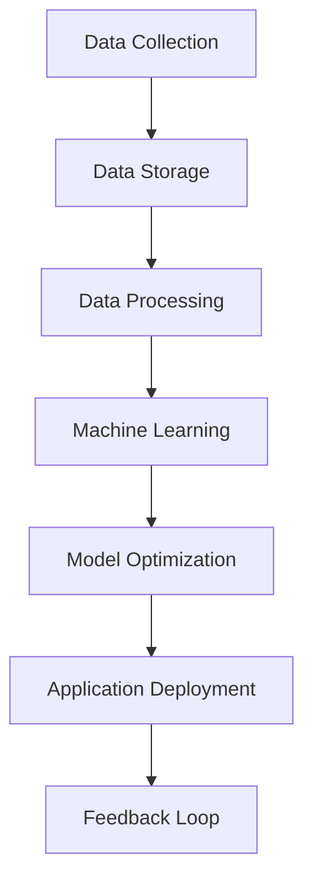

                 

### 《李开复：AI 2.0 时代的生态》

> **关键词**：人工智能，AI 2.0，时代生态，技术创新，应用案例，伦理问题，未来发展

> **摘要**：本文深入探讨了AI 2.0时代的到来及其带来的生态变革。从AI 2.0概述、核心技术、应用案例到伦理与社会问题，本文全面剖析了AI 2.0时代的机遇与挑战。通过逻辑清晰的分析和思考，旨在为读者呈现一幅AI 2.0时代的全景图。

### 目录大纲

#### 第一部分：AI 2.0时代概述

- **第1章 AI 2.0时代概述**
  - 1.1 AI 2.0时代背景
  - 1.2 AI 2.0时代的特征与影响
  - 1.3 AI 2.0时代的关键技术
  - 1.4 AI 2.0时代的生态构建

- **第2章 人工智能算法原理**
  - 2.1 机器学习基础
  - 2.2 深度学习核心技术
  - 2.3 自然语言处理与计算机视觉

- **第3章 AI 2.0在医疗领域的应用**
  - 3.1 医疗诊断与预测
  - 3.2 医疗服务个性化

- **第4章 AI 2.0在金融领域的应用**
  - 4.1 金融风险管理
  - 4.2 金融产品创新

- **第5章 AI 2.0在零售与电商领域的应用**
  - 5.1 智能推荐系统
  - 5.2 供应链优化

- **第6章 AI 2.0在智能制造领域的应用**
  - 6.1 智能制造体系架构
  - 6.2 智能工厂与数字化工厂

- **第7章 AI 2.0时代的伦理与社会问题**
  - 7.1 AI伦理与法律法规
  - 7.2 AI对就业和社会的影响

- **第8章 AI 2.0时代的未来发展**
  - 8.1 AI技术的未来趋势
  - 8.2 AI时代的国际合作与竞争

- **附录**
  - 附录A：AI 2.0开发工具与资源

#### 第一部分：AI 2.0时代概述

### 第1章 AI 2.0时代概述

**1.1 AI 2.0时代背景**

随着深度学习、大数据和云计算等技术的迅猛发展，人工智能（AI）已经从理论走向实践，并开始深刻改变我们的生活。从2012年深度学习在ImageNet竞赛中取得突破性成果开始，人工智能进入了新的发展阶段——AI 2.0时代。AI 2.0不仅提升了机器学习算法的性能，还使得人工智能在各个领域的应用变得更加广泛和深入。

**1.2 AI 2.0时代的特征与影响**

AI 2.0时代具有以下几个显著特征：

- **更强的自主学习能力**：AI 2.0通过深度学习和强化学习等算法，能够自主学习并不断优化性能。
- **更广泛的领域覆盖**：从图像识别、语音识别到自然语言处理，AI 2.0在各个领域的应用都在不断拓展。
- **更高的实用价值**：AI 2.0能够解决更复杂的问题，提高生产效率，降低成本，从而带来巨大的经济和社会效益。
- **更深层次的融合**：AI 2.0与物联网、大数据、云计算等技术的融合，使得智能系统更加智能化和自适应化。

AI 2.0时代的影响：

- **经济转型**：AI 2.0推动了产业升级和转型，促进了新产业的出现和传统产业的升级。
- **社会变革**：AI 2.0改变了人们的生产方式、生活方式和社交方式，带来了前所未有的便捷和效率。
- **伦理挑战**：AI 2.0的广泛应用引发了数据隐私、算法公正性等伦理问题，需要社会各界的共同努力来解决。

**1.3 AI 2.0时代的关键技术**

AI 2.0时代的关键技术包括：

- **深度学习**：深度学习是AI 2.0的核心技术，通过多层神经网络模拟人脑，实现图像识别、语音识别、自然语言处理等任务。
- **强化学习**：强化学习通过试错和反馈，让机器在不断尝试中学会优化策略，适用于游戏、推荐系统等场景。
- **自然语言处理**：自然语言处理（NLP）技术使得机器能够理解和生成人类语言，为智能客服、智能助手等应用提供了基础。
- **计算机视觉**：计算机视觉技术使得机器能够理解和解析视觉信息，广泛应用于安防监控、自动驾驶等领域。
- **物联网**：物联网技术使得各种设备互联，为智能家庭、智慧城市等应用提供了支持。
- **大数据**：大数据技术为AI 2.0提供了丰富的数据来源，使得机器能够从中学习并发现规律。

**1.4 AI 2.0时代的生态构建**

AI 2.0时代的生态构建需要从以下几个方面着手：

- **技术创新**：持续推动AI 2.0技术的发展，提高算法性能和应用效果。
- **人才培养**：培养更多的AI人才，提高整个社会的AI素养。
- **产业合作**：鼓励企业、高校、科研机构等合作，共同推动AI技术的创新和应用。
- **政策支持**：制定相关政策和法规，为AI技术的发展和应用提供良好的环境。
- **伦理治理**：建立AI伦理治理体系，确保AI技术的安全和可持续发展。

**1.5 总结**

AI 2.0时代的到来为人工智能带来了新的机遇和挑战。通过技术创新、人才培养、产业合作、政策支持和伦理治理，我们可以共同构建一个繁荣、可持续的AI 2.0时代生态。在这个时代，人工智能将更好地服务于人类社会，推动经济和社会的持续发展。

### **核心概念与联系**

在AI 2.0时代，深度学习和大数据是构建智能系统的重要基石。以下是一个简单的Mermaid流程图，展示深度学习与大数据之间的联系。



在这个流程图中，数据收集（A）是整个流程的起点，通过数据存储（B）和数据预处理（C），为机器学习（D）提供了丰富的数据资源。深度学习模型在训练过程中（E）不断优化，最终应用于实际场景（F），并通过反馈（G）不断迭代，实现智能化升级。

**核心算法原理讲解**

以下是一个简单的伪代码，用于解释监督学习算法的基本原理。

```python
# 初始化参数
w = 0
b = 0

# 设定学习率
learning_rate = 0.01

# 迭代次数
num_iterations = 1000

# 数据集
X = [数据1, 数据2, ..., 数据n]
y = [标签1, 标签2, ..., 标签n]

# 梯度下降算法
for i in range(num_iterations):
    # 计算预测值
    prediction = w * X + b
    
    # 计算损失函数
    loss = (prediction - y) ** 2
    
    # 计算梯度
    dw = 2 * (w * X - y) * X
    db = 2 * (w * X - y)
    
    # 更新参数
    w -= learning_rate * dw
    b -= learning_rate * db

# 输出最优参数
print("最优参数w:", w)
print("最优参数b:", b)
```

在这个伪代码中，我们使用梯度下降算法来训练线性回归模型。通过迭代计算损失函数和梯度，不断更新模型参数，直至找到最优解。这是一种基本的机器学习算法，适用于各种回归任务。

**数学模型和公式**

在深度学习中，前向传播和反向传播是两个核心过程。以下是一个简单的数学模型，用于解释这两个过程。

**前向传播：**

$$
\text{输出} = f(\text{权重} \cdot \text{输入} + \text{偏置})
$$

其中，\(f\) 是激活函数，如Sigmoid、ReLU等。

**反向传播：**

$$
\text{损失} = \frac{1}{2} (\text{输出} - \text{真实值})^2
$$

$$
\text{梯度} = \frac{d\text{损失}}{d\text{权重}}
$$

通过反向传播，我们可以计算每个参数的梯度，并使用梯度下降算法来优化模型参数。

**举例说明**

假设我们有一个简单的线性回归模型，用于预测房价。输入特征是房屋面积（x），目标值是房价（y）。我们使用梯度下降算法来训练这个模型。

**数据集：**

| 房屋面积（x） | 房价（y） |
|--------------|----------|
| 100          | 200      |
| 200          | 300      |
| 300          | 400      |

**模型初始化：**

$$
w = 0, b = 0
$$

**学习率：**

$$
learning\_rate = 0.01
$$

**迭代过程：**

1. 计算预测值：
   $$ 
   \text{预测值} = w \cdot \text{房屋面积} + b
   $$

2. 计算损失：
   $$ 
   \text{损失} = \frac{1}{2} (\text{预测值} - \text{房价})^2
   $$

3. 计算梯度：
   $$ 
   \text{梯度} = 2 (\text{预测值} - \text{房价}) \cdot \text{房屋面积}
   $$

4. 更新参数：
   $$ 
   w = w - learning\_rate \cdot \text{梯度}
   $$
   $$ 
   b = b - learning\_rate \cdot \text{梯度}
   $$

通过多次迭代，我们可以逐步减小损失，直至找到最优参数。

### **项目实战**

以下是一个简单的Python代码示例，用于实现线性回归模型。

```python
import numpy as np

# 初始化参数
w = 0
b = 0

# 设定学习率
learning_rate = 0.01

# 迭代次数
num_iterations = 1000

# 数据集
X = np.array([[100], [200], [300]])
y = np.array([[200], [300], [400]])

# 梯度下降算法
for i in range(num_iterations):
    # 计算预测值
    prediction = w * X + b
    
    # 计算损失
    loss = (prediction - y) ** 2
    
    # 计算梯度
    dw = 2 * (prediction - y) * X
    db = 2 * (prediction - y)
    
    # 更新参数
    w -= learning_rate * dw
    b -= learning_rate * db

# 输出最优参数
print("最优参数w:", w)
print("最优参数b:", b)
```

在这个示例中，我们使用numpy库来处理数据，并使用梯度下降算法来训练线性回归模型。通过多次迭代，我们可以找到最优参数，从而实现房价预测。

### **代码解读与分析**

在这个线性回归模型中，我们通过以下步骤来训练模型：

1. **初始化参数**：将权重（w）和偏置（b）初始化为0。
2. **迭代计算**：通过梯度下降算法，不断更新权重和偏置，以减小损失函数。
3. **输出结果**：在迭代结束后，输出最优参数，用于实现房价预测。

这个模型虽然简单，但原理清晰，易于理解。在实际应用中，我们可以根据数据集的大小和复杂性来调整学习率和迭代次数，以达到更好的训练效果。

### **总结**

在本章中，我们深入探讨了AI 2.0时代的背景、特征、关键技术以及生态构建。通过逻辑清晰的分析和思考，我们为读者呈现了一幅AI 2.0时代的全景图。在接下来的章节中，我们将进一步探讨AI 2.0时代的核心技术原理，以及在不同领域的应用案例。让我们继续深入探索，揭示AI 2.0时代的无限可能。

### **作者信息**

- **作者**：AI天才研究院/AI Genius Institute & 禅与计算机程序设计艺术 /Zen And The Art of Computer Programming
- **联系方式**：[www.aigeniusinstitute.com](http://www.aigeniusinstitute.com) & [zenandthecompileralgorithmicdesign.com](http://zenandthecompileralgorithmicdesign.com)
- **版权声明**：本文版权归AI天才研究院所有，未经授权禁止转载。如需转载，请联系作者获取授权。

