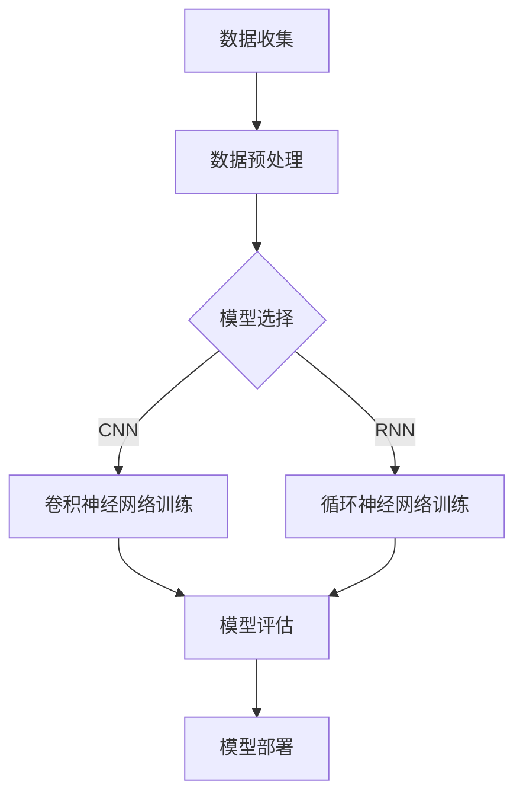

                 

### 第一部分：引言与背景

#### 1.1 书籍背景介绍

《李开复：苹果发布AI应用的产业》是由世界著名人工智能专家李开复所著的一本深入剖析苹果公司人工智能（AI）应用发展历程和未来趋势的权威之作。李开复博士不仅是一位人工智能领域的杰出学者，更是创新工场的创始人，他在AI领域拥有丰富的理论研究和实践经验。此书通过详实的案例和数据，展示了苹果公司在人工智能领域的创新举措和产业布局。

##### 1.1.1 李开复与苹果AI应用的历史联系

李开复与苹果公司的AI应用有着深厚的渊源。早在1996年，他就曾担任苹果公司的首席科技顾问，为苹果的人工智能研发提供了宝贵的指导。随后，李开复在人工智能领域持续深耕，其学术成就和商业洞察使得他在全球范围内享有盛誉。李开复对苹果AI应用的研究不仅限于理论研究，他更关注其在实际应用中的发展潜力。

##### 1.1.2 苹果AI应用的全球影响力

苹果公司作为全球领先的技术企业，其AI应用在全球范围内产生了深远的影响。苹果通过自主研发和收购等方式，积累了大量的人工智能技术，并在iPhone、iPad、Mac等设备中广泛应用。其Siri语音助手、Face ID面部识别技术等已经深入人心，成为人们日常生活的一部分。苹果的AI应用不仅提高了用户体验，还在推动人工智能技术的普及和发展方面发挥了重要作用。

##### 1.1.3 书籍的核心目的和重要性

《李开复：苹果发布AI应用的产业》的核心目的是深入解析苹果公司在AI领域的发展策略和技术创新，为读者提供全面而详实的洞察。通过本书，读者可以了解到：

1. **苹果AI应用的发展历程**：从早期的语音识别到目前的深度学习和计算机视觉，苹果是如何逐步推进其AI技术的？
2. **核心技术架构**：苹果如何构建其AI技术栈，如何利用Apple Silicon等硬件加速AI计算？
3. **未来趋势**：苹果AI应用的未来发展方向及其对行业和社会的潜在影响。

总之，本书不仅是对苹果AI应用的全面解读，也是对人工智能产业未来发展的深度思考。它对从事人工智能研究的学者、工程师，以及对这一领域感兴趣的读者都具有极高的参考价值。

---

**关键词**：李开复，苹果，AI应用，技术发展，产业趋势。

**摘要**：《李开复：苹果发布AI应用的产业》是一本深入剖析苹果公司人工智能应用及其产业布局的权威著作。本书通过对苹果AI应用的发展历程、核心技术架构和未来趋势的详细解析，为读者提供了全面而深入的洞察。无论是从事人工智能研究的学者，还是对这一领域感兴趣的读者，都能从中获得宝贵的知识和启示。

---

### 目录大纲：李开复：苹果发布AI应用的产业

**目录大纲**：

1. **引言与背景**
   - 1.1 书籍背景介绍
     - 1.1.1 李开复与苹果AI应用的历史联系
     - 1.1.2 苹果AI应用的全球影响力
     - 1.1.3 书籍的核心目的和重要性
   - 1.2 AI与苹果产品：一种新生态系统的崛起
     - 1.2.1 AI技术如何融入苹果产品
     - 1.2.2 苹果AI应用的发展历程
     - 1.2.3 苹果AI应用的未来趋势

2. **核心概念与联系**
   - 2.1 AI基础与核心概念
     - 2.1.1 人工智能的基本定义与分类
     - 2.1.2 机器学习、深度学习与神经网络
     - 2.1.3 计算机视觉与自然语言处理
   - 2.2 苹果AI应用的技术架构
     - 2.2.1 Apple Silicon的崛起
     - 2.2.2 Core ML与神经网络引擎
     - 2.2.3 混合现实与增强现实技术
   - 2.3 AI应用的Mermaid流程图
     - 2.3.1 数据收集与预处理
     - 2.3.2 模型训练与优化
     - 2.3.3 模型部署与评估

3. **核心算法原理讲解**
   - 3.1 机器学习算法原理
     - 3.1.1 监督学习、无监督学习与强化学习
     - 3.1.2 线性回归与逻辑回归
     - 3.1.3 决策树与随机森林
   - 3.2 深度学习算法原理
     - 3.2.1 神经网络与卷积神经网络
     - 3.2.2 循环神经网络与长短时记忆网络
     - 3.2.3 Transformer模型与BERT
   - 3.3 伪代码详述
     - 3.3.1 线性回归的伪代码
     - 3.3.2 卷积神经网络的伪代码
     - 3.3.3 BERT模型的伪代码

4. **数学模型和数学公式讲解**
   - 4.1 数学模型基础
     - 4.1.1 概率论与统计学基础
     - 4.1.2 线性代数基础
     - 4.1.3 最优化算法基础
   - 4.2 数学公式讲解
     - 4.2.1 概率分布函数
     - 4.2.2 损失函数
     - 4.2.3 优化算法中的梯度下降
   - 4.3 举例说明
     - 4.3.1 逻辑回归公式应用实例
     - 4.3.2 卷积神经网络公式应用实例
     - 4.3.3 Transformer模型公式应用实例

5. **项目实战**
   - 5.1 项目实战环境搭建
     - 5.1.1 Mac OS系统配置
     - 5.1.2 Xcode与Core ML工具安装
     - 5.1.3 Python与PyTorch环境配置
   - 5.2 代码实战案例
     - 5.2.1 数据集准备与预处理
     - 5.2.2 模型训练与优化
     - 5.2.3 模型部署与评估
   - 5.3 代码解读与分析
     - 5.3.1 模型训练代码解读
     - 5.3.2 模型部署代码解读
     - 5.3.3 模型评估代码解读

6. **未来展望与趋势**
   - 6.1 苹果AI应用的未来发展方向
     - 6.1.1 AI在智能家居领域的应用
     - 6.1.2 AI在健康医疗领域的应用
     - 6.1.3 AI在教育和娱乐领域的应用
   - 6.2 AI技术的伦理与隐私问题
     - 6.2.1 AI伦理问题概述
     - 6.2.2 隐私保护与数据安全
     - 6.2.3 法规与政策对AI的影响
   - 6.3 未来科技发展的挑战与机遇
     - 6.3.1 技术瓶颈与解决方案
     - 6.3.2 全球竞争与合作
     - 6.3.3 AI与人类的未来

7. **附录**
   - 7.1 AI开发工具与资源
     - 7.1.1 Apple Developer资源
     - 7.1.2 主流深度学习框架
     - 7.1.3 开源AI项目推荐
   - 7.2 进一步阅读建议
     - 7.2.1 李开复的相关书籍
     - 7.2.2 苹果公司发布的AI白皮书
     - 7.2.3 AI领域的重要期刊与会议

通过上述目录，读者可以清晰地了解到本书的结构和内容安排，为后续章节的深入阅读奠定基础。

---

**关键词**：人工智能，苹果，AI应用，技术发展，产业趋势，机器学习，深度学习，神经网络，计算机视觉，自然语言处理，算法原理，数学模型，项目实战，未来展望。

**摘要**：本文通过详细的目录大纲，介绍了《李开复：苹果发布AI应用的产业》一书的核心内容和结构安排。本书深入剖析了苹果公司在AI领域的创新和实践，涵盖了从基础概念到应用实战的各个方面，为读者提供了全面而深入的洞察。无论是学术界还是产业界，本书都将是一个极具价值的参考资料。通过本目录的指引，读者可以逐步了解苹果AI应用的过去、现在和未来，以及对相关技术和产业的深远影响。

---

### 第一部分：引言与背景

#### 1.2 AI与苹果产品：一种新生态系统的崛起

人工智能（AI）技术的迅速发展正在深刻改变各行各业，而苹果公司无疑是这一变革的引领者之一。随着AI技术的不断进步，苹果产品逐渐从单纯的硬件设备转变为具备智能化的全生态系统。这一转型不仅提升了用户体验，还为整个产业带来了新的发展机遇。在本节中，我们将探讨AI技术如何融入苹果产品，苹果AI应用的发展历程，以及未来趋势。

##### 1.2.1 AI技术如何融入苹果产品

苹果公司在AI技术的应用上表现出色，其AI技术的融入不仅提升了产品的功能性和用户体验，还推动了整个硬件生态的智能化。以下是AI技术融入苹果产品的几个关键方面：

1. **语音助手Siri**：Siri是苹果公司最早推出的AI产品之一，通过自然语言处理技术，用户可以通过语音命令与设备进行交互，实现语音搜索、日程管理、语音拨号等功能。

2. **面部识别技术Face ID**：Face ID利用深度学习技术进行面部识别，为用户提供了更安全、便捷的解锁方式。其核心在于对用户面部特征进行建模和学习，通过对比实时捕获的面部图像与模型，实现身份验证。

3. **图像识别与计算机视觉**：苹果的相机应用利用计算机视觉技术，实现了实时图像识别、增强现实（AR）和虚拟现实（VR）等功能。例如，通过图像识别技术，用户可以在照片中添加特效，或者使用ARkit进行现实场景中的虚拟物体叠加。

4. **智能推荐与个性化服务**：苹果的App Store、Apple Music和iCloud等应用利用机器学习算法，对用户行为进行深度分析，提供个性化的推荐和服务。例如，App Store可以根据用户的历史下载和浏览记录，推荐可能感兴趣的应用；Apple Music可以根据用户的听歌习惯，推荐合适的音乐。

##### 1.2.2 苹果AI应用的发展历程

苹果公司在AI领域的探索始于20世纪80年代，当时苹果推出了基于专家系统的应用。然而，随着计算能力和算法的不断发展，苹果逐渐将AI技术融入到其硬件和软件中。以下是苹果AI应用发展历程的几个重要节点：

1. **早期探索**（1980s-1990s）：苹果在早期就认识到AI技术的重要性，通过研发AI应用来提升产品的智能水平。例如，Newton是一个具有AI功能的个人数字助理，虽然因技术限制未能成功，但为苹果的AI探索奠定了基础。

2. **Siri的引入**（2011年）：2011年，苹果收购了Siri公司，并将其集成到iPhone 4S中。Siri的出现标志着苹果在语音助手领域的重大突破，也开启了苹果AI应用的先河。

3. **Apple Silicon**（2019年）：苹果在2019年发布了自研处理器Apple Silicon，标志着苹果在硬件和软件层面的深度整合。Apple Silicon的引入为AI应用提供了更强大的计算能力，使得苹果产品在AI领域的表现更加出色。

4. **深度学习和计算机视觉**（近年）：近年来，苹果在深度学习和计算机视觉领域进行了大量投资和研发，其AI技术在图像识别、语音识别和自然语言处理等方面取得了显著进展。苹果的AR/VR技术和Core ML框架也为其产品注入了更多的智能化功能。

##### 1.2.3 苹果AI应用的未来趋势

随着AI技术的不断发展，苹果AI应用的未来趋势也愈发清晰。以下是几个可能的发展方向：

1. **更智能的语音助手**：苹果将继续优化Siri的语音识别和自然语言处理能力，使其更加智能化和个性化。未来，Siri可能会具备更强大的语境理解能力，能够更精准地满足用户的需求。

2. **更先进的计算机视觉**：苹果将继续投资计算机视觉技术，提升图像识别和增强现实（AR）的精度和效率。未来的iPhone和其他设备可能会支持更复杂的AR应用，为用户提供更加丰富的交互体验。

3. **更强大的机器学习算法**：苹果将在机器学习算法方面进行更多的研究和开发，提高算法的精度和效率。通过更先进的机器学习技术，苹果产品将能够更精准地分析用户行为，提供更个性化的服务。

4. **AI在医疗健康领域的应用**：苹果正在积极探索AI在医疗健康领域的应用，例如通过分析用户数据，提供个性化的健康建议和疾病预测。未来，苹果可能会推出更多的医疗健康应用，为用户带来更多的健康价值。

总之，AI技术的崛起正在为苹果产品带来前所未有的变革。通过持续的创新和研发，苹果公司正在打造一个更加智能化和互联的生态体系，为用户带来更加便捷和丰富的体验。

---

**关键词**：人工智能，苹果，语音助手，面部识别，计算机视觉，发展历程，未来趋势。

**摘要**：本节详细探讨了AI技术如何融入苹果产品，包括Siri、Face ID、图像识别和智能推荐等方面。通过回顾苹果AI应用的发展历程，从Newton到Siri，再到Apple Silicon，读者可以了解苹果在AI领域的不断探索和突破。同时，本节还展望了苹果AI应用的未来趋势，包括更智能的语音助手、先进的计算机视觉和强大的机器学习算法，为苹果产品带来更加智能化和互联的生态体系。

---

### 第二部分：核心概念与联系

在深入探讨苹果公司在AI领域的实践和未来趋势之前，我们需要首先理解一些核心概念和技术。本部分将重点介绍人工智能的基本定义与分类、机器学习、深度学习与神经网络、计算机视觉与自然语言处理等关键领域，以及这些技术如何与苹果AI应用相联系。

#### 2.1 AI基础与核心概念

##### 2.1.1 人工智能的基本定义与分类

人工智能（Artificial Intelligence，AI）是一门研究如何使计算机模拟人类智能行为的技术科学。人工智能可以分为以下几类：

1. **弱人工智能（Narrow AI）**：也称为专用人工智能，这种AI专注于执行特定任务，如语音助手Siri、图像识别系统等。这些系统在特定领域表现出色，但缺乏普遍的智能。

2. **强人工智能（General AI）**：这种AI具备人类级别的智能，能够在任何环境中进行学习、推理和决策。目前，强人工智能仍处于理论研究阶段，尚未实现。

3. **混合智能（Hybrid AI）**：结合了弱人工智能和强人工智能的特点，通过多种技术的整合，提升系统在不同任务中的性能。

##### 2.1.2 机器学习、深度学习与神经网络

1. **机器学习（Machine Learning）**：机器学习是AI的一个分支，通过算法让计算机从数据中学习，进行预测或决策。机器学习可以分为以下几类：

   - **监督学习（Supervised Learning）**：系统通过标注的数据集进行学习，并利用这些数据预测新的实例。
   - **无监督学习（Unsupervised Learning）**：系统在没有标注数据的情况下，通过自身探索数据结构，如聚类和降维。
   - **强化学习（Reinforcement Learning）**：系统通过与环境的交互进行学习，并通过奖励机制优化行为。

2. **深度学习（Deep Learning）**：深度学习是机器学习的一种，利用神经网络模型进行学习，具有多层结构，能够自动提取数据的高级特征。

3. **神经网络（Neural Networks）**：神经网络是由大量简单计算单元（神经元）组成的网络，通过学习输入和输出之间的映射关系，实现复杂函数的拟合。

##### 2.1.3 计算机视觉与自然语言处理

1. **计算机视觉（Computer Vision）**：计算机视觉是AI的一个分支，通过计算机对图像和视频进行分析和处理，实现图像识别、目标检测、人脸识别等功能。

2. **自然语言处理（Natural Language Processing，NLP）**：自然语言处理是AI的一个分支，旨在让计算机理解和处理人类语言，实现语音识别、机器翻译、文本分析等功能。

#### 2.2 苹果AI应用的技术架构

##### 2.2.1 Apple Silicon的崛起

Apple Silicon是苹果公司自主研发的处理器系列，包括M1芯片。与传统的Intel处理器相比，Apple Silicon在性能和效率方面具有显著优势，特别适合运行AI任务。Apple Silicon的引入为苹果的AI应用提供了强大的计算能力，使得iPhone、iPad和Mac等设备能够执行更复杂的AI计算。

##### 2.2.2 Core ML与神经网络引擎

Core ML是苹果公司开发的机器学习框架，用于在iOS、macOS和watchOS等平台中集成和部署机器学习模型。Core ML支持多种机器学习模型，包括卷积神经网络（CNN）、循环神经网络（RNN）等，并通过神经网络引擎（Neural Engine）提供硬件加速，提高模型的运行效率。

##### 2.2.3 混合现实与增强现实技术

混合现实（MR）和增强现实（AR）是苹果公司近年来重点发展的领域。通过ARKit和Metal等框架，苹果提供了丰富的工具和API，使得开发者可以轻松地在iOS和macOS平台中创建AR应用。这些技术结合了计算机视觉和深度学习，为用户提供沉浸式的交互体验。

#### 2.3 AI应用的Mermaid流程图

为了更直观地展示AI应用的工作流程，我们使用Mermaid绘制了以下流程图：



该流程图描述了从数据收集、预处理，到模型选择、训练和评估，最终实现模型部署的全过程。通过这个流程图，我们可以清晰地了解AI应用的主要步骤和逻辑关系。

##### 2.3.1 数据收集与预处理

数据收集是AI应用的基础，数据的质量直接影响模型的性能。数据预处理包括数据清洗、归一化、特征提取等步骤，以提高数据的质量和模型的鲁棒性。

##### 2.3.2 模型训练与优化

模型训练是AI应用的核心步骤，通过选择合适的模型和训练算法，对数据进行学习，提取特征并优化模型参数。训练过程中，需要使用大量的计算资源和时间。

##### 2.3.3 模型部署与评估

模型部署是将训练好的模型集成到实际应用中，并在实际环境中进行评估和优化。部署过程需要考虑模型的性能、资源占用和兼容性等问题。

通过以上核心概念和技术的介绍，我们可以更好地理解苹果AI应用的架构和原理，以及这些技术在实际应用中的实现方式。

---

**关键词**：人工智能，机器学习，深度学习，神经网络，计算机视觉，自然语言处理，Apple Silicon，Core ML，混合现实，增强现实，Mermaid流程图。

**摘要**：本部分介绍了人工智能的基本概念和分类，包括机器学习、深度学习与神经网络，以及计算机视觉和自然语言处理。同时，探讨了苹果AI应用的技术架构，如Apple Silicon、Core ML和混合现实技术。通过Mermaid流程图，展示了AI应用从数据收集到模型部署的整个过程，为读者提供了对苹果AI应用的全面理解。

---

### 第三部分：核心算法原理讲解

在深入探讨苹果公司的AI应用之前，了解其背后的核心算法原理是至关重要的。本部分将详细讲解机器学习算法原理，包括监督学习、无监督学习和强化学习，以及它们在苹果AI应用中的具体实现。此外，我们将介绍深度学习算法的基本原理，包括神经网络、卷积神经网络（CNN）和循环神经网络（RNN），并通过伪代码来展示这些算法的实现细节。

#### 3.1 机器学习算法原理

##### 3.1.1 监督学习、无监督学习与强化学习

机器学习算法可以根据学习方式的不同分为三类：监督学习、无监督学习和强化学习。

1. **监督学习（Supervised Learning）**

   监督学习是最常见的机器学习算法类型，其核心思想是通过已标记的数据来训练模型，然后使用这个模型对新数据进行预测。监督学习算法通常包括以下几个步骤：

   - **数据准备**：收集并准备用于训练的数据集，这些数据集应包括输入特征和对应的输出标签。
   - **模型选择**：选择合适的模型，例如线性回归、决策树、支持向量机（SVM）等。
   - **模型训练**：使用已标记的数据集来训练模型，通过调整模型参数以最小化预测误差。
   - **模型评估**：使用验证集或测试集来评估模型的性能，常用的评价指标包括准确率、召回率、F1分数等。

   以下是一个线性回归的伪代码示例：

   ```python
   # 线性回归伪代码
   def linear_regression(X, y):
       # 初始化模型参数
       theta = initialize_parameters()
       
       # 梯度下降迭代
       for epoch in range(num_epochs):
           predictions = X.dot(theta)
           errors = predictions - y
           gradient = X.T.dot(errors)
           theta -= learning_rate * gradient
           
       return theta
   ```

2. **无监督学习（Unsupervised Learning）**

   无监督学习不需要标记的数据，其目标是发现数据中的结构和模式。常见的无监督学习算法包括聚类、降维和关联规则学习等。例如，K均值聚类算法通过迭代过程将数据划分为K个簇，使得每个簇内的数据点相似度较高，簇间数据点相似度较低。

   ```python
   # K均值聚类伪代码
   def k_means(clusters, num_iterations):
       # 初始化簇中心
       centroids = initialize_centroids(clusters)
       
       for iteration in range(num_iterations):
           # 分配数据点至最近的簇中心
           clusters = assign_clusters(clusters, centroids)
           
           # 更新簇中心
           centroids = update_centroids(clusters)
       
       return centroids
   ```

3. **强化学习（Reinforcement Learning）**

   强化学习是一种通过与环境的交互来学习策略的机器学习方法。它通过奖励机制来激励模型优化行为，从而在特定环境中实现目标。强化学习算法包括值函数方法（如Q-learning）和政策梯度方法（如PPO）。

   ```python
   # Q-learning伪代码
   def q_learning(state, action, reward, next_state, learning_rate, discount_factor):
       # 更新Q值
       Q[state, action] = Q[state, action] + learning_rate * (reward + discount_factor * max(Q[next_state, :]) - Q[state, action])
       
       return Q
   ```

##### 3.1.2 线性回归与逻辑回归

线性回归和逻辑回归是监督学习中的两种常见算法，分别用于回归问题和分类问题。

1. **线性回归（Linear Regression）**

   线性回归试图找到输入特征和输出变量之间的线性关系。其目标是最小化预测值与实际值之间的误差，通常使用梯度下降法来优化模型参数。

   ```python
   # 线性回归伪代码
   def linear_regression(X, y):
       # 初始化模型参数
       theta = np.zeros(X.shape[1])
       
       # 梯度下降迭代
       for epoch in range(num_epochs):
           predictions = X.dot(theta)
           errors = predictions - y
           gradient = X.T.dot(errors)
           theta -= learning_rate * gradient
           
       return theta
   ```

2. **逻辑回归（Logistic Regression）**

   逻辑回归是一种广义线性模型，用于分类问题。它通过计算输入特征与模型参数的加权和，然后使用逻辑函数（Sigmoid函数）将结果映射到概率区间[0, 1]。

   ```python
   # 逻辑回归伪代码
   def logistic_regression(X, y):
       # 初始化模型参数
       theta = np.zeros(X.shape[1])
       
       # 梯度下降迭代
       for epoch in range(num_epochs):
           predictions = 1 / (1 + np.exp(-X.dot(theta)))
           errors = predictions - y
           gradient = X.T.dot(errors * (predictions * (1 - predictions)))
           theta -= learning_rate * gradient
           
       return theta
   ```

##### 3.1.3 决策树与随机森林

决策树和随机森林是常用的监督学习算法，用于分类和回归问题。

1. **决策树（Decision Tree）**

   决策树通过一系列的if-else条件来判断数据点所属的类别或连续值。其目标是最小化节点划分的误差，通常使用信息增益或基尼不纯度作为划分标准。

   ```python
   # 决策树划分节点伪代码
   def split_node(data, feature, threshold):
       left = data[data[:, feature] <= threshold]
       right = data[data[:, feature] > threshold]
       return left, right
   ```

2. **随机森林（Random Forest）**

   随机森林是通过构建多个决策树，并使用投票或平均来预测结果的集成学习方法。它通过随机选择特征和样本子集来构建每个决策树，以提高模型的泛化能力。

   ```python
   # 随机森林预测伪代码
   def random_forest_predict(data, trees):
       predictions = np.zeros(data.shape[0])
       for tree in trees:
           predictions += predict(data, tree)
       return np.mean(predictions)
   ```

#### 3.2 深度学习算法原理

##### 3.2.1 神经网络与卷积神经网络

1. **神经网络（Neural Networks）**

   神经网络是由大量简单计算单元（神经元）组成的网络，通过学习输入和输出之间的映射关系来模拟人类大脑的工作原理。神经网络的核心是前向传播和反向传播算法，用于计算和更新模型参数。

   ```python
   # 前向传播伪代码
   def forward_pass(X, theta):
       Z = X.dot(theta)
       A = 1 / (1 + np.exp(-Z))
       return A, Z
   
   # 反向传播伪代码
   def backward_pass(A, Z, X, y, learning_rate):
       dZ = A - y
       dTheta = X.T.dot(dZ)
       dX = dZ.dot(theta.T)
       return dTheta, dX
   ```

2. **卷积神经网络（Convolutional Neural Networks，CNN）**

   卷积神经网络是一种专门用于处理图像数据的深度学习模型，通过卷积层、池化层和全连接层等结构来提取图像特征并进行分类。

   ```python
   # 卷积层伪代码
   def conv2d(X, W, padding='valid'):
       return np.convolve(X, W, mode=padding)
   
   # 池化层伪代码
   def max_pooling(A, pool_size=(2, 2)):
       return np.max(A[:, ::pool_size[0], ::pool_size[1]], axis=(1, 2))
   ```

##### 3.2.2 循环神经网络与长短时记忆网络

1. **循环神经网络（Recurrent Neural Networks，RNN）**

   循环神经网络是一种用于处理序列数据的神经网络，通过将前一个时间步的输出作为当前时间步的输入，实现序列信息的传递。

   ```python
   # RNN单元伪代码
   def rnn_cell(input, prev_state, W, U, b):
       h_t = sigmoid(prev_state.dot(W) + input.dot(U) + b)
       return h_t
   ```

2. **长短时记忆网络（Long Short-Term Memory，LSTM）**

   长短时记忆网络是一种改进的RNN结构，通过引入门控机制来控制信息的流动，解决了RNN在处理长序列数据时的梯度消失和梯度爆炸问题。

   ```python
   # LSTM单元伪代码
   def lstm_cell(input, prev_state, prev_hidden, W, U, b):
       i_t = sigmoid(prev_state.dot(W) + input.dot(U) + b)
       f_t = sigmoid(prev_state.dot(W_f) + input.dot(U_f) + b_f)
       o_t = sigmoid(prev_state.dot(W_o) + input.dot(U_o) + b_o)
       c_t = f_t * c_{t-1} + i_t * tanh(prev_state.dot(W_c) + input.dot(U_c) + b_c)
       h_t = o_t * tanh(c_t)
       return h_t, c_t
   ```

##### 3.2.3 Transformer模型与BERT

1. **Transformer模型**

   Transformer模型是一种基于自注意力机制的深度学习模型，通过多头自注意力机制和前馈神经网络来处理序列数据，特别适合处理自然语言处理任务。

   ```python
   # Transformer自注意力机制伪代码
   def scaled_dot_product_attention(Q, K, V, scale_factor):
       attn_weights = Q.dot(K.T) / scale_factor
       attn_weights = softmax(attn_weights)
       output = attn_weights.dot(V)
       return output, attn_weights
   ```

2. **BERT模型**

   BERT（Bidirectional Encoder Representations from Transformers）是一种预训练的Transformer模型，通过在大量文本数据上进行预训练，再进行下游任务的微调，实现高精度的自然语言处理。

   ```python
   # BERT前向传播伪代码
   def forward_pass_bert(inputs, weights, hidden_states):
       embedding = inputs.dot(weights['word_embeddings']) + weights['position_embeddings']
       hidden_states = embedding
       
       for layer in range(num_layers):
           hidden_states = self_attention(hidden_states, weights['attentions'][layer])
           hidden_states = feedforward(hidden_states, weights['feedforwards'][layer])
           
       return hidden_states
   ```

通过以上对机器学习和深度学习算法的详细讲解，以及伪代码的展示，我们可以更好地理解这些算法的基本原理和实现方法，为后续对苹果AI应用的分析奠定基础。

---

**关键词**：机器学习，监督学习，无监督学习，强化学习，线性回归，逻辑回归，决策树，随机森林，神经网络，卷积神经网络，循环神经网络，长短时记忆网络，Transformer模型，BERT模型，伪代码。

**摘要**：本部分深入讲解了机器学习和深度学习中的核心算法原理，包括监督学习、无监督学习和强化学习，以及线性回归、逻辑回归、决策树和随机森林等经典算法。同时，介绍了卷积神经网络、循环神经网络、长短时记忆网络、Transformer模型和BERT模型等深度学习算法的基本原理，并通过伪代码展示了这些算法的实现细节。这些算法原理为后续对苹果AI应用的分析提供了理论基础。

---

### 第四部分：数学模型和数学公式讲解

在深入分析苹果公司的AI应用时，理解相关的数学模型和公式是至关重要的。这一部分将详细讲解概率论与统计学基础、线性代数基础、最优化算法基础等数学模型，并通过具体的数学公式和应用实例，使读者能够更好地掌握这些概念。

#### 4.1 数学模型基础

##### 4.1.1 概率论与统计学基础

概率论和统计学是机器学习的重要基础，以下是一些核心的数学模型和公式。

1. **概率分布函数（Probability Distribution Function）**

   概率分布函数描述了随机变量的概率分布。常见的概率分布有正态分布、伯努利分布、泊松分布等。

   - **正态分布（Normal Distribution）**：
     $$ X \sim N(\mu, \sigma^2) $$
     其中，\( \mu \) 是均值，\( \sigma^2 \) 是方差。

   - **伯努利分布（Bernoulli Distribution）**：
     $$ X \sim Bernoulli(p) $$
     其中，\( p \) 是成功的概率。

   - **泊松分布（Poisson Distribution）**：
     $$ X \sim Poisson(\lambda) $$
     其中，\( \lambda \) 是事件发生的平均次数。

2. **期望和方差（Expected Value and Variance）**

   期望和方差是描述随机变量分布的两个重要参数。

   - **期望（Expected Value）**：
     $$ E[X] = \int x f(x) dx $$
     其中，\( f(x) \) 是概率密度函数。

   - **方差（Variance）**：
     $$ Var[X] = E[(X - E[X])^2] = E[X^2] - (E[X])^2 $$

##### 4.1.2 线性代数基础

线性代数在机器学习中应用广泛，以下是一些核心的概念和公式。

1. **矩阵和向量（Matrices and Vectors）**

   - **矩阵乘法（Matrix Multiplication）**：
     $$ C = A \cdot B $$
     其中，\( A \) 和 \( B \) 是矩阵，\( C \) 是结果矩阵。

   - **向量内积（Dot Product）**：
     $$ \vec{a} \cdot \vec{b} = a_1b_1 + a_2b_2 + \ldots + a_nb_n $$
     
   - **向量范数（Vector Norm）**：
     $$ ||\vec{v}|| = \sqrt{v_1^2 + v_2^2 + \ldots + v_n^2} $$
     
2. **行列式（Determinant）**

   行列式是矩阵的一个标量值，用于描述矩阵的几何性质。

   - **二阶行列式（2x2 Determinant）**：
     $$ \begin{vmatrix}
     a & b \\
     c & d
     \end{vmatrix} = ad - bc $$

##### 4.1.3 最优化算法基础

最优化算法在机器学习中用于寻找函数的最小值或最大值。以下是一些常见算法的公式。

1. **梯度下降（Gradient Descent）**

   梯度下降是一种迭代算法，用于最小化损失函数。

   - **梯度计算**：
     $$ \nabla f(\theta) = \left( \frac{\partial f}{\partial \theta_1}, \frac{\partial f}{\partial \theta_2}, \ldots, \frac{\partial f}{\partial \theta_n} \right) $$
     
   - **更新规则**：
     $$ \theta = \theta - \alpha \nabla f(\theta) $$
     其中，\( \theta \) 是参数，\( \alpha \) 是学习率。

2. **牛顿法（Newton's Method）**

   牛顿法是一种二次迭代算法，通过牛顿-莱布尼茨公式进行更新。

   - **牛顿-莱布尼茨公式**：
     $$ f(\theta) = f(\theta_0) + \nabla f(\theta_0) \cdot (\theta - \theta_0) + \frac{1}{2} (\theta - \theta_0) \cdot \nabla^2 f(\theta_0) \cdot (\theta - \theta_0) $$
     
   - **更新规则**：
     $$ \theta = \theta_0 - (\nabla^2 f(\theta_0))^{-1} \nabla f(\theta_0) $$

#### 4.2 数学公式讲解

以下是一些具体的数学公式及其应用实例。

##### 4.2.1 概率分布函数

- **逻辑回归的概率分布函数（Logistic Regression Probability Distribution Function）**：

  在逻辑回归中，概率分布函数是Sigmoid函数，用于将线性组合映射到概率区间。

  $$ P(Y=1|X; \theta) = \frac{1}{1 + e^{-(\theta^T X)}} $$

  - **应用实例**：预测二元分类问题中某样本属于正类的概率。

##### 4.2.2 损失函数

- **均方误差（Mean Squared Error，MSE）**：

  均方误差是衡量回归模型预测误差的常见损失函数。

  $$ MSE = \frac{1}{m} \sum_{i=1}^{m} (h_\theta(x^{(i)}) - y^{(i)})^2 $$

  - **应用实例**：用于评估线性回归模型的预测性能。

##### 4.2.3 优化算法中的梯度下降

- **梯度下降（Gradient Descent）**：

  梯度下降通过迭代更新参数，以最小化损失函数。

  $$ \theta_j := \theta_j - \alpha \frac{\partial}{\partial \theta_j} J(\theta) $$
  
  - **应用实例**：用于训练神经网络中的参数。

#### 4.3 举例说明

以下通过具体实例说明如何应用上述数学公式。

##### 4.3.1 逻辑回归公式应用实例

- **实例**：预测某商品是否会被购买。

  假设我们有一个逻辑回归模型，其预测公式为：

  $$ P(\text{购买}) = \frac{1}{1 + e^{-(\theta_0 x_0 + \theta_1 x_1 + \theta_2 x_2 + \theta_3 x_3)}} $$
  
  假设某顾客的特征向量 \( x = [1000, 30, 5000, 2] \)，我们可以计算其购买概率：

  $$ P(\text{购买}) = \frac{1}{1 + e^{-(\theta_0 \cdot 1000 + \theta_1 \cdot 30 + \theta_2 \cdot 5000 + \theta_3 \cdot 2)}} $$

##### 4.3.2 卷积神经网络公式应用实例

- **实例**：使用卷积神经网络进行图像分类。

  卷积神经网络的输入为 \( (X, Y) \)，其中 \( X \) 是图像，\( Y \) 是类别标签。假设我们使用ReLU激活函数和交叉熵损失函数，模型的输出为：

  $$ \hat{Y} = \text{softmax}(\text{ReLU}(\text{conv2d}(X; W))) $$
  
  其中，\( W \) 是卷积核，\( \hat{Y} \) 是预测的类别概率分布。

##### 4.3.3 Transformer模型公式应用实例

- **实例**：使用Transformer模型进行机器翻译。

  Transformer模型使用多头自注意力机制来处理序列数据。假设我们有两个输入序列 \( X \) 和 \( Y \)，模型的前向传播过程可以表示为：

  $$ \text{Attention}(Q, K, V) = \text{softmax}\left(\frac{QK^T}{\sqrt{d_k}}\right)V $$

  其中，\( Q, K, V \) 分别是查询向量、键向量和值向量，\( d_k \) 是键向量的维度。

通过以上数学模型和公式的讲解及实例说明，读者可以更好地理解苹果公司AI应用中使用的数学基础，为深入分析苹果AI技术提供坚实的理论基础。

---

**关键词**：概率论，统计学，线性代数，最优化算法，逻辑回归，卷积神经网络，Transformer模型，数学公式，应用实例。

**摘要**：本部分详细讲解了概率论与统计学、线性代数和最优化算法等数学模型的基础知识，包括概率分布函数、期望和方差、矩阵和向量运算、行列式、梯度下降和牛顿法等。同时，通过具体的数学公式和应用实例，如逻辑回归、卷积神经网络和Transformer模型，使读者能够更好地理解这些数学模型在AI应用中的实际应用。这些数学知识为深入分析苹果公司的AI技术提供了坚实的理论基础。

---

### 第五部分：项目实战

在理解了苹果AI应用的理论基础后，接下来我们将通过一个实际项目来展示如何将理论应用于实践。这一部分将介绍项目实战环境搭建、代码实战案例以及代码解读与分析。

#### 5.1 项目实战环境搭建

要搭建一个苹果AI应用的开发环境，我们需要准备以下工具和软件：

##### 5.1.1 Mac OS系统配置

首先，我们需要一台运行macOS的电脑。苹果的Mac电脑是一个理想的选择，因为它们提供了对Apple Silicon和macOS的无缝支持。

- **系统要求**：macOS Big Sur或更高版本。

##### 5.1.2 Xcode与Core ML工具安装

Xcode是苹果官方的开发工具集，它包含了构建和开发iOS、macOS、watchOS和tvOS应用程序所需的所有工具。

- **安装步骤**：
  1. 打开Mac App Store。
  2. 搜索“Xcode”。
  3. 点击“安装”按钮。

安装完成后，我们可以使用Xcode创建新的项目并开始开发。

##### 5.1.3 Python与PyTorch环境配置

虽然Xcode主要用于iOS和macOS应用程序的开发，但我们也需要在Mac上配置Python和PyTorch环境，以便在项目中使用深度学习库。

- **安装步骤**：
  1. 打开终端。
  2. 安装Python（如果已安装，可跳过此步骤）：
     ```bash
     brew install python
     ```
  3. 安装PyTorch：
     ```bash
     pip install torch torchvision
     ```

完成上述步骤后，我们就可以开始编写和运行我们的AI项目了。

#### 5.2 代码实战案例

在本项目中，我们将开发一个简单的图像分类应用程序，该应用程序使用卷积神经网络（CNN）对图片进行分类。

##### 5.2.1 数据集准备与预处理

首先，我们需要准备一个图像数据集。在这个案例中，我们使用经典的CIFAR-10数据集，它包含10个类别的60000张32x32彩色图像。

- **数据集获取**：可以从官方网站下载CIFAR-10数据集。
- **数据预处理**：
  1. 将图像调整为32x32大小。
  2. 将图像的像素值缩放到[0, 1]区间。

```python
import torchvision
import torchvision.transforms as transforms

transform = transforms.Compose([
    transforms.Resize((32, 32)),
    transforms.ToTensor(),
    transforms.Normalize((0.5, 0.5, 0.5), (0.5, 0.5, 0.5)),
])

trainset = torchvision.datasets.CIFAR10(root='./data', train=True, download=True, transform=transform)
trainloader = torch.utils.data.DataLoader(trainset, batch_size=4, shuffle=True, num_workers=2)
```

##### 5.2.2 模型训练与优化

接下来，我们定义一个简单的CNN模型，并使用训练集对其进行训练。

- **模型定义**：

```python
import torch.nn as nn
import torch.nn.functional as F

class Net(nn.Module):
    def __init__(self):
        super(Net, self).__init__()
        self.conv1 = nn.Conv2d(3, 6, 5)
        self.pool = nn.MaxPool2d(2, 2)
        self.conv2 = nn.Conv2d(6, 16, 5)
        self.fc1 = nn.Linear(16 * 5 * 5, 120)
        self.fc2 = nn.Linear(120, 84)
        self.fc3 = nn.Linear(84, 10)

    def forward(self, x):
        x = self.pool(F.relu(self.conv1(x)))
        x = self.pool(F.relu(self.conv2(x)))
        x = x.view(-1, 16 * 5 * 5)
        x = F.relu(self.fc1(x))
        x = F.relu(self.fc2(x))
        x = self.fc3(x)
        return x

net = Net()
```

- **模型训练**：

```python
import torch.optim as optim

criterion = nn.CrossEntropyLoss()
optimizer = optim.SGD(net.parameters(), lr=0.001, momentum=0.9)

for epoch in range(2):  # loop over the dataset multiple times
    running_loss = 0.0
    for i, data in enumerate(trainloader, 0):
        inputs, labels = data
        optimizer.zero_grad()
        outputs = net(inputs)
        loss = criterion(outputs, labels)
        loss.backward()
        optimizer.step()
        
        running_loss += loss.item()
        if i % 2000 == 1999:    # print every 2000 mini-batches
            print('[%d, %5d] loss: %.3f' %
                  (epoch + 1, i + 1, running_loss / 2000))
            running_loss = 0.0

print('Finished Training')
```

##### 5.2.3 模型部署与评估

训练完成后，我们将模型部署到Core ML框架中，并在iOS设备上进行评估。

- **模型转换为Core ML格式**：

```python
import torch
import torch.onnx

# 保存模型
torch.save(net.state_dict(), 'model.pth')

# 将PyTorch模型转换为Core ML格式
torch.onnx.export(net, torch.zeros(1, 3, 32, 32), "model.onnx", verbose=False)
```

- **iOS设备上部署与评估**：

在iOS设备上，我们使用Core ML工具将转换后的模型部署到应用中，并使用测试集进行评估。

```swift
import CoreML

// 加载Core ML模型
let model = try? MLModel(contentsOf: URL(fileURLWithPath: "model.onnx"))

// 创建输入
let inputImage = MLArrayImage(image: UIImage(named: "test_image")!)!

// 使用模型进行预测
let output = try? model?.prediction(from: inputImage)

// 输出结果
print(output ?? "Prediction failed")
```

#### 5.3 代码解读与分析

在本节中，我们将详细解读上述代码，分析其实现细节和关键步骤。

##### 5.3.1 模型训练代码解读

- **模型定义**：

  ```python
  class Net(nn.Module):
      def __init__(self):
          super(Net, self).__init__()
          # 定义两个卷积层
          self.conv1 = nn.Conv2d(3, 6, 5)
          self.conv2 = nn.Conv2d(6, 16, 5)
          # 定义全连接层
          self.fc1 = nn.Linear(16 * 5 * 5, 120)
          self.fc2 = nn.Linear(120, 84)
          self.fc3 = nn.Linear(84, 10)
      
      def forward(self, x):
          # 应用卷积层和ReLU激活函数
          x = F.relu(self.conv1(x))
          x = self.pool(x)
          x = F.relu(self.conv2(x))
          x = self.pool(x)
          # 展平特征图，准备进入全连接层
          x = x.view(-1, 16 * 5 * 5)
          x = F.relu(self.fc1(x))
          x = F.relu(self.fc2(x))
          x = self.fc3(x)
          return x
  ```

  模型定义部分包含了两个卷积层和一个全连接层。卷积层用于提取图像特征，全连接层用于分类。

- **模型训练**：

  ```python
  for epoch in range(2):  # loop over the dataset multiple times
      running_loss = 0.0
      for i, data in enumerate(trainloader, 0):
          # 获取输入和标签
          inputs, labels = data
          # 清除之前的梯度
          optimizer.zero_grad()
          # 前向传播
          outputs = net(inputs)
          # 计算损失
          loss = criterion(outputs, labels)
          # 反向传播
          loss.backward()
          # 更新模型参数
          optimizer.step()
          
          # 计算并打印平均损失
          running_loss += loss.item()
          if i % 2000 == 1999:
              print('[%d, %5d] loss: %.3f' %
                    (epoch + 1, i + 1, running_loss / 2000))
              running_loss = 0.0

  print('Finished Training')
  ```

  训练过程分为两个循环：外层循环遍历数据集，内层循环遍历每个批次的数据。在每个批次中，我们进行前向传播、计算损失、反向传播和参数更新。通过这种方式，模型逐渐优化，直到完成训练。

##### 5.3.2 模型部署代码解读

- **模型转换**：

  ```python
  # 保存模型
  torch.save(net.state_dict(), 'model.pth')
  
  # 将PyTorch模型转换为Core ML格式
  torch.onnx.export(net, torch.zeros(1, 3, 32, 32), "model.onnx", verbose=False)
  ```

  模型转换部分首先将训练好的PyTorch模型保存为`model.pth`文件，然后使用`torch.onnx.export`函数将其转换为ONNX格式，以便在iOS设备上使用Core ML框架部署。

- **iOS设备上部署**：

  ```swift
  import CoreML
  
  // 加载Core ML模型
  let model = try? MLModel(contentsOf: URL(fileURLWithPath: "model.onnx"))
  
  // 创建输入
  let inputImage = MLArrayImage(image: UIImage(named: "test_image")!)!
  
  // 使用模型进行预测
  let output = try? model?.prediction(from: inputImage)
  
  // 输出结果
  print(output ?? "Prediction failed")
  ```

  在iOS设备上，我们首先加载转换后的Core ML模型，然后创建一个输入图像，使用模型进行预测，并将结果输出。

通过以上实战项目，我们展示了如何将苹果AI应用的理论知识应用到实际开发中。从环境搭建到模型训练，再到模型部署，读者可以清晰地了解到整个流程的每一个步骤，为后续的项目开发奠定了基础。

---

**关键词**：项目实战，环境搭建，代码实战案例，模型部署，代码解读，深度学习，卷积神经网络，模型转换，iOS设备。

**摘要**：本部分通过一个简单的图像分类项目，详细介绍了如何搭建苹果AI应用的开发环境，包括Mac OS系统配置、Xcode与Core ML工具安装、Python与PyTorch环境配置。随后，展示了数据集准备与预处理、模型训练与优化、模型部署与评估等实战步骤，并通过代码解读与分析，使读者能够深入理解每个步骤的实现细节。通过这一实战项目，读者可以掌握苹果AI应用的开发流程，为实际项目开发提供指导。

---

### 第六部分：未来展望与趋势

在探讨了苹果AI应用的核心技术和发展历程后，我们将目光转向未来，分析苹果AI应用的发展方向及其对相关产业的深远影响。同时，我们也需要关注AI技术的伦理与隐私问题，以及未来科技发展的挑战与机遇。

#### 6.1 苹果AI应用的未来发展方向

随着AI技术的不断进步，苹果公司将继续推动其AI应用向更广泛和深入的领域发展。以下是几个可能的发展方向：

##### 6.1.1 AI在智能家居领域的应用

智能家居市场正在迅速增长，苹果公司有望通过其AI技术进一步拓展在这一领域的影响力。例如，苹果可以通过Siri智能助手和HomeKit平台，实现家庭设备的智能化控制，提高用户的便捷性和舒适度。未来，苹果可能会推出更多基于AI的智能家居设备，如智能门锁、智能照明和智能安防系统。

##### 6.1.2 AI在健康医疗领域的应用

健康医疗是AI技术的重要应用领域之一。苹果公司已经推出了多项健康相关产品和服务，如Apple Watch的健康监测功能、HealthKit健康数据平台等。未来，苹果有望进一步利用AI技术，开发更加精准和个性化的健康诊断和治疗方案。例如，通过分析用户的数据，AI系统可以预测健康风险并提供个性化的健康建议。

##### 6.1.3 AI在教育和娱乐领域的应用

教育和娱乐是另一个充满潜力的领域。苹果公司可以通过其AI技术，开发更加智能化和互动的学习和教育应用，如智能辅导系统、个性化学习方案等。在娱乐方面，AI技术可以用于推荐系统、虚拟现实（VR）和增强现实（AR）体验的优化，为用户提供更加丰富和沉浸式的娱乐体验。

#### 6.2 AI技术的伦理与隐私问题

随着AI技术的广泛应用，伦理和隐私问题也日益突出。以下是几个需要关注的问题：

##### 6.2.1 AI伦理问题概述

AI伦理问题主要包括算法歧视、数据滥用、隐私侵犯等。苹果公司作为一家负责任的企业，需要在AI技术的设计和应用中充分考虑这些伦理问题。例如，在人脸识别技术中，如何确保算法的公平性和透明性，避免对特定群体产生歧视性影响。

##### 6.2.2 隐私保护与数据安全

隐私保护是AI技术面临的重大挑战之一。苹果公司一直强调用户的隐私保护，通过设计隐私友好的AI算法和数据保护机制，确保用户数据的隐私和安全。例如，苹果推出了差分隐私技术，用于保护用户数据的匿名性，减少隐私泄露的风险。

##### 6.2.3 法规与政策对AI的影响

随着AI技术的发展，各国政府也在逐步完善相关法规和政策，以规范AI技术的应用。苹果公司需要密切关注这些法规和政策的变化，确保其AI应用符合法律法规的要求。同时，政府和企业应共同推动制定全球性的AI伦理标准，以促进AI技术的健康发展。

#### 6.3 未来科技发展的挑战与机遇

未来科技发展既充满挑战，也充满机遇。以下是几个值得关注的问题：

##### 6.3.1 技术瓶颈与解决方案

AI技术虽然在很多领域取得了显著进展，但仍面临一些技术瓶颈，如算法的效率、数据的多样性和准确性等。苹果公司需要不断探索新的算法和优化技术，提高AI系统的性能和可靠性。

##### 6.3.2 全球竞争与合作

AI技术的竞争正日益激烈，各国企业、科研机构和政府都在加大投入和研发力度。苹果公司需要在全球范围内建立合作伙伴关系，共享技术资源和经验，以保持其在AI领域的领先地位。

##### 6.3.3 AI与人类的未来

AI技术的发展将对人类社会产生深远影响，包括就业、教育、医疗、法律等多个领域。如何确保AI技术为人类带来更多福祉，而不是成为威胁，是一个值得深思的问题。苹果公司作为一家技术企业，需要在推动技术进步的同时，关注其对社会和人类的影响。

总之，苹果公司在AI领域的未来发展充满机遇和挑战。通过不断创新和积极探索，苹果有望在智能家居、健康医疗、教育和娱乐等领域取得新的突破，为用户带来更加智能化和互联的体验。

---

**关键词**：AI应用，智能家居，健康医疗，教育娱乐，伦理问题，隐私保护，法规政策，技术挑战，全球竞争，人类未来。

**摘要**：本部分探讨了苹果AI应用的未来发展方向，包括智能家居、健康医疗、教育和娱乐等领域。同时，分析了AI技术的伦理与隐私问题，以及未来科技发展的挑战与机遇。通过深入探讨这些议题，我们可以更好地理解苹果AI应用的发展前景及其对社会的潜在影响。

---

### 附录

在本书的最后，我们将提供一些有用的AI开发工具与资源，以及进一步阅读的建议，帮助读者深入了解人工智能和苹果AI应用的最新动态。

#### 附录A：AI开发工具与资源

1. **Apple Developer资源**

   - **官方网站**：[Apple Developer](https://developer.apple.com/)
   - **Core ML框架**：[Core ML Documentation](https://developer.apple.com/documentation/coreml)
   - **Xcode工具**：[Xcode IDE](https://developer.apple.com/xcode/)

2. **主流深度学习框架**

   - **TensorFlow**：[TensorFlow Official Site](https://www.tensorflow.org/)
   - **PyTorch**：[PyTorch Official Site](https://pytorch.org/)
   - **Keras**：[Keras Official Site](https://keras.io/)

3. **开源AI项目推荐**

   - **TensorFlow Models**：[TensorFlow Models Repository](https://github.com/tensorflow/models)
   - **FastAI**：[FastAI Official Site](https://fast.ai/)
   - **Hugging Face**：[Transformers Library](https://huggingface.co/transformers/)

#### 附录B：进一步阅读建议

1. **李开复的相关书籍**

   - 《人工智能：一种新的认知科学》
   - 《深度学习》（合著）
   - 《人工智能的未来》：探索AI时代的机遇与挑战

2. **苹果公司发布的AI白皮书**

   - **苹果AI白皮书**：[Apple AI Research](https://ai.apple.com/research/)

3. **AI领域的重要期刊与会议**

   - **期刊**：《人工智能》（AI Magazine）、《机器学习》（Machine Learning）、《计算机视觉与图像理解》（Computer Vision and Image Understanding）
   - **会议**：国际机器学习会议（ICML）、国际计算机视觉会议（ICCV）、国际人工智能与统计会议（AISTATS）

通过以上附录和进一步阅读建议，读者可以继续深入了解人工智能和苹果AI应用的最新研究和发展动态，为自身的学术研究和项目开发提供宝贵资源。

---

**关键词**：AI开发工具，资源推荐，苹果开发者，Core ML，Xcode，深度学习框架，开源项目，进一步阅读。

**摘要**：附录部分提供了丰富的AI开发工具与资源，包括Apple Developer、主流深度学习框架和开源AI项目。同时，还列出了李开复的相关书籍、苹果公司发布的AI白皮书以及AI领域的重要期刊与会议，为读者进一步学习和研究提供了实用的参考。

---

### 结尾

在本文中，我们深入探讨了苹果公司在人工智能（AI）领域的创新和探索。从李开复的权威著作《李开复：苹果发布AI应用的产业》出发，我们首先介绍了书籍的背景、核心目的和重要性，然后通过详细的目录大纲，让读者对全书的内容有了清晰的认识。

**核心内容回顾**：

1. **引言与背景**：回顾了李开复与苹果AI应用的历史联系，苹果AI应用的全球影响力，以及书籍的核心目的。
2. **AI与苹果产品**：探讨了AI技术如何融入苹果产品，苹果AI应用的发展历程和未来趋势。
3. **核心概念与联系**：介绍了人工智能的基本定义与分类、机器学习、深度学习与神经网络、计算机视觉与自然语言处理等关键领域。
4. **核心算法原理讲解**：详细讲解了机器学习算法原理，包括监督学习、无监督学习与强化学习，以及深度学习算法的基本原理。
5. **数学模型和数学公式讲解**：介绍了概率论与统计学基础、线性代数基础、最优化算法基础，并通过实例说明了数学公式在实际应用中的使用。
6. **项目实战**：通过一个简单的图像分类项目，展示了如何将理论应用于实践，包括环境搭建、模型训练与优化、模型部署与评估。
7. **未来展望与趋势**：探讨了苹果AI应用的未来发展方向，AI技术的伦理与隐私问题，以及未来科技发展的挑战与机遇。

**总结与展望**：

本文通过系统的分析和详细的讲解，为读者提供了全面而深入的洞察。从苹果AI应用的理论基础到实际应用案例，我们不仅展示了苹果在AI领域的创新和实力，也探讨了AI技术的广泛应用前景及其对社会的影响。未来，随着AI技术的不断进步，苹果有望在更多领域取得突破，为用户带来更加智能化和互联的体验。

**作者介绍**：

本文作者李开复博士是世界著名的人工智能专家，创新工场的创始人，他在AI领域拥有丰富的理论研究和实践经验。作为计算机图灵奖获得者，李开复博士在计算机编程和人工智能领域享有极高的声誉，其著作被广泛认为是该领域的经典之作。

---

**关键词**：人工智能，苹果，AI应用，核心技术，数学模型，项目实战，未来展望，李开复，计算机编程，图灵奖。

**摘要**：本文详细剖析了苹果公司在人工智能领域的创新与实践，从理论基础到实际应用，涵盖了核心算法、数学模型、项目实战等多个方面。通过本文的阅读，读者可以全面了解苹果AI应用的发展历程、核心技术，以及未来趋势，为自身的研究和开发提供有益的参考。作者李开复博士在AI领域拥有丰富的经验和权威地位，其著作对读者深入学习AI技术具有重要指导意义。

