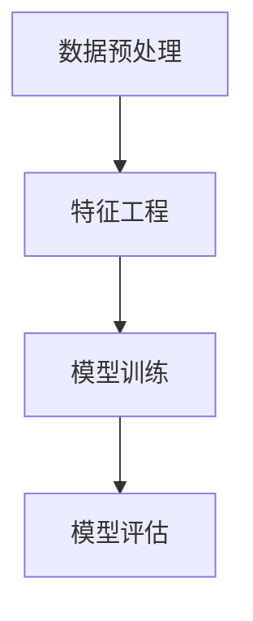
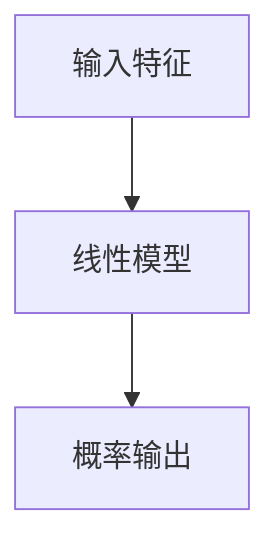
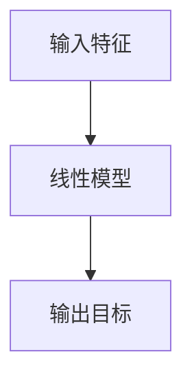
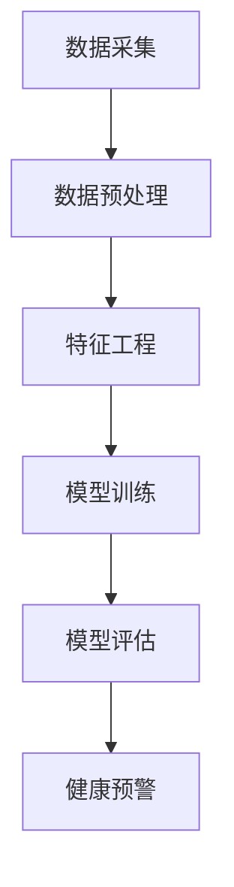
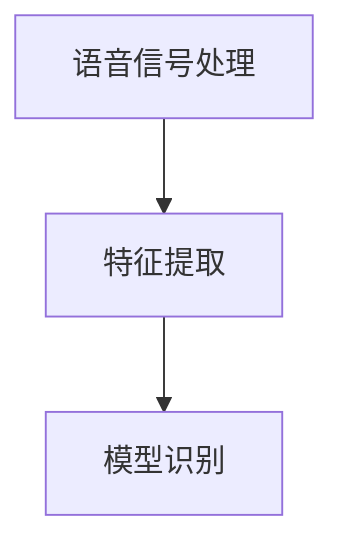
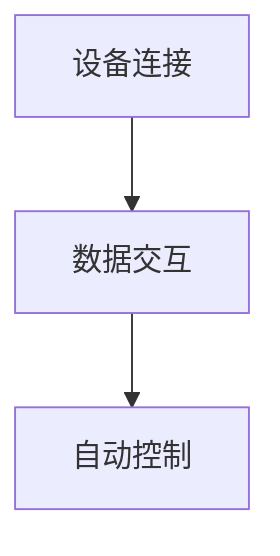

                 

# 《李开复：苹果发布AI应用的商业价值》

> **关键词：** 苹果、AI应用、商业价值、技术创新、用户体验

> **摘要：** 本文由世界顶级技术畅销书资深大师李开复撰写，深入探讨了苹果公司在其产品中融入人工智能技术所带来的商业变革。通过详细分析苹果AI应用的背景、技术原理、核心产品及其商业价值，本文旨在揭示AI技术在苹果生态系统中发挥的重要作用，并展望其未来发展前景。

---

## 第一部分：背景与概述

### 第1章 苹果与AI：商业革命的契机

#### 1.1 苹果与AI的历史进程

苹果公司（Apple Inc.）作为全球领先的科技公司，始终致力于技术创新和用户体验的提升。AI技术作为一种颠覆性的创新，对苹果公司的业务模式和产品创新产生了深远的影响。

苹果公司在AI领域的发展历程可以追溯到20世纪80年代，当时苹果推出的Lisa计算机率先搭载了语音识别技术。进入21世纪后，苹果在AI领域的投资逐渐加大，尤其是在2011年推出了搭载Siri语音助手的iPhone 4S，标志着苹果正式进入了AI时代。

#### 1.2 AI技术的最新进展及其对商业的影响

人工智能技术近年来取得了飞速的发展，无论是在算法、硬件还是数据方面，都取得了显著的突破。这些进展为苹果公司的商业战略提供了新的方向和可能性。

- **算法进展**：深度学习算法的成熟使得AI系统能够更加准确地处理复杂任务，如图像识别、自然语言处理等。
- **硬件进展**：苹果自主研发的A系列芯片在性能和能效方面取得了显著提升，为AI应用提供了强大的计算支持。
- **数据进展**：随着移动互联网和物联网的发展，数据规模和多样性不断增加，为AI训练和优化提供了丰富的素材。

这些技术进展使得AI不仅能够提升产品的功能性和用户体验，还能够为苹果带来全新的商业模式和商业机会。

### 第2章 AI应用：苹果的产品新篇章

#### 2.1 Siri：智能助理的未来

Siri作为苹果公司的智能语音助手，自推出以来就以其自然流畅的交互体验和强大的功能获得了用户的高度评价。Siri的AI技术架构主要包括自然语言处理（NLP）和机器学习（ML）两部分。

- **自然语言处理**：Siri能够理解和处理自然语言，通过深度学习算法实现语义理解和意图识别。
- **机器学习**：Siri通过不断学习用户的交互历史，优化交互体验，提升任务完成的准确性和效率。

#### 2.2 摄影与视觉识别：AI技术的视觉革命

苹果相机应用中的AI功能极大地提升了摄影体验。通过计算机视觉技术，相机能够实现实时场景分析、人脸识别、智能HDR等功能。

- **场景分析**：相机应用能够根据场景调整曝光、色彩等参数，实现更自然的照片效果。
- **人脸识别**：相机应用能够识别并跟踪多人面部，实现面部美化、实时滤镜等功能。
- **智能HDR**：相机应用能够捕捉高动态范围（HDR）照片，保留更多细节和色彩。

#### 2.3 个性化体验：AI与用户数据的深度融合

苹果通过AI技术对用户数据进行深度分析，实现了个性化体验的全面提升。个性化推荐系统根据用户的兴趣和行为，提供个性化的内容和服务。

- **个性化推荐**：Apple Music、App Store、iBooks等应用均采用了个性化推荐算法，为用户推荐感兴趣的内容。
- **智能提醒**：苹果的日历应用通过分析用户的日程安排和活动习惯，提供智能提醒和建议。

### 第3章 AI驱动的创新产品与服务

#### 3.1 Apple Watch：健康监测与预防

Apple Watch作为苹果公司的一款智能穿戴设备，通过AI技术实现了健康监测和预防功能。其核心技术包括心率监测、运动分析、睡眠监测等。

- **心率监测**：Apple Watch能够实时监测用户的心率，并通过机器学习算法分析心率变化，提供健康预警。
- **运动分析**：Apple Watch记录用户的运动数据，通过机器学习算法分析运动效果，提供个性化的运动建议。
- **睡眠监测**：Apple Watch监测用户的睡眠质量，通过机器学习算法分析睡眠数据，提供睡眠建议。

#### 3.2 HomeKit：智能家居的未来

HomeKit作为苹果公司的智能家居平台，通过AI技术实现了智能家居的智能化管理和自动化控制。

- **智能家居系统架构**：HomeKit连接各种智能家居设备，通过统一接口实现设备之间的互操作。
- **AI提升家居安全与便捷**：HomeKit结合AI技术，实现智能安防、自动调节家居环境等功能，提升用户的家居体验。

#### 3.3 CarPlay：智能汽车与交通

CarPlay作为苹果公司的车载娱乐系统，通过AI技术实现了智能导航、语音助手、多媒体娱乐等功能。

- **智能导航**：CarPlay通过实时交通信息和地图数据，提供智能导航服务，提高驾驶安全性。
- **语音助手**：CarPlay集成Siri语音助手，实现语音控制车辆功能，提高驾驶便捷性。
- **多媒体娱乐**：CarPlay提供丰富的多媒体娱乐内容，如音乐、播客、电影等，提升驾驶体验。

### 第4章 AI商业价值：苹果的新增长点

#### 4.1 AI在苹果供应链中的应用

AI技术在苹果供应链管理中发挥着重要作用，优化了生产流程、物流调度和库存管理。

- **生产流程优化**：AI技术通过数据分析，预测生产需求，优化生产计划和资源配置。
- **物流调度**：AI技术通过实时数据分析，优化物流路线和运输计划，降低物流成本。
- **库存管理**：AI技术通过数据分析和预测，实现智能库存管理，降低库存成本和风险。

#### 4.2 AI广告与市场营销

AI技术在苹果的广告和市场营销中起到了关键作用，实现了更加精准的用户定位和广告效果优化。

- **用户定位**：AI技术通过用户数据分析，实现精准的用户定位和用户画像构建。
- **广告效果优化**：AI技术通过分析广告投放效果，优化广告策略和投放方式，提高广告转化率。

#### 4.3 AI与苹果生态系统

AI技术在苹果的生态系统中发挥了重要作用，促进了第三方开发者生态系统的扩展和创新。

- **第三方开发者生态系统**：AI技术为第三方开发者提供了丰富的工具和资源，促进了创新和开发。
- **AI在苹果平台上的创新与协作**：AI技术促进了苹果与第三方开发者的合作，实现了更多创新应用和服务的推出。

### 第5章 AI应用的挑战与未来

#### 5.1 AI安全与隐私问题

AI技术在应用过程中面临着安全和隐私问题，需要采取有效的措施确保用户数据的安全和隐私保护。

- **数据安全**：通过数据加密、访问控制等技术手段，确保用户数据的安全存储和传输。
- **隐私保护**：通过数据匿名化、隐私保护算法等技术手段，保护用户隐私不被泄露。

#### 5.2 AI伦理与社会责任

AI技术在应用过程中也面临着伦理和社会责任问题，需要平衡技术进步与社会影响。

- **伦理问题**：确保AI技术的应用符合道德和伦理标准，避免对用户和社会产生负面影响。
- **社会责任**：积极参与社会事务，推动AI技术的可持续发展，为社会进步贡献力量。

#### 5.3 AI的未来发展：趋势与展望

AI技术在未来将继续发挥重要作用，推动科技和社会的进步。

- **技术趋势**：AI技术将向更高层次发展，实现更复杂的任务和更智能的决策。
- **未来展望**：AI技术将在各个领域实现广泛应用，为人类创造更加便捷、高效、智能的生活。

### 第6章 案例研究：苹果AI应用的商业成功

#### 6.1 案例一：苹果的健康监测服务

苹果的健康监测服务通过AI技术实现了对用户健康数据的实时监测和分析，为用户提供个性化的健康建议。

- **应用分析**：通过收集用户的心率、运动、睡眠等数据，AI技术分析用户的健康状况，提供健康预警和建议。
- **商业模式**：苹果通过提供免费的健康监测服务，吸引用户使用其设备，提高用户黏性，并通过广告和付费服务实现盈利。

#### 6.2 案例二：苹果的个性化购物体验

苹果的App Store和Apple Music等应用通过AI技术实现了个性化推荐，为用户提供个性化的购物和音乐体验。

- **应用分析**：通过分析用户的购物历史、听歌偏好等数据，AI技术为用户推荐感兴趣的商品和音乐。
- **商业模式**：苹果通过个性化推荐，提高用户满意度和购买转化率，并通过广告和付费服务实现盈利。

#### 6.3 案例三：苹果的智能家居解决方案

苹果的HomeKit智能家居解决方案通过AI技术实现了智能家居设备的智能化管理和自动化控制。

- **应用分析**：通过连接各种智能家居设备，AI技术实现设备间的智能协同工作，提供便捷的家居生活体验。
- **商业模式**：苹果通过销售智能家居设备和提供智能家居服务，实现盈利，并通过广告和付费服务提高收益。

### 第7章 总结与展望

#### 7.1 本书内容的总结

本文从多个角度探讨了苹果公司在其产品中融入人工智能技术所带来的商业变革，分析了AI技术在苹果生态系统中的重要作用和未来发展趋势。

- **核心知识点**：苹果与AI的历史进程、AI应用的技术原理、AI商业价值的实现、AI应用面临的挑战与未来展望。
- **主要学习成果**：理解了苹果公司AI应用的商业价值，掌握了AI技术在商业领域中的应用方法和策略。

#### 7.2 AI与商业的未来

AI技术在商业领域将继续发挥重要作用，推动商业模式的创新和产业升级。

- **AI技术的持续影响**：AI技术将不断推动商业模式的变革，提高企业的运营效率和创新能力。
- **未来发展展望**：AI技术将在各个领域实现广泛应用，为人类创造更加便捷、高效、智能的生活。

### 附录

#### 附录A：AI相关术语解释

- **人工智能（AI）**：模拟人类智能行为的计算机系统，具有学习、推理、感知和解决问题的能力。
- **机器学习（ML）**：一种人工智能技术，通过数据训练，使计算机系统能够自主学习和改进性能。
- **深度学习（DL）**：一种机器学习技术，通过神经网络模型模拟人脑进行学习和决策。
- **自然语言处理（NLP）**：一种人工智能技术，使计算机能够理解、生成和处理人类语言。
- **计算机视觉（CV）**：一种人工智能技术，使计算机能够通过视觉感知和图像处理来理解和解释现实世界。

#### 附录B：参考资料与推荐阅读

- **李开复，《人工智能的未来》**：全面介绍了人工智能的历史、现状和未来发展。
- **Andrew Ng，《机器学习》**：经典机器学习教材，详细介绍了机器学习的基本原理和算法。
- **Ian Goodfellow等，《深度学习》**：全面介绍了深度学习的基本原理、算法和应用。

#### 附录C：苹果AI产品开发资源

- **Apple Developer**：苹果官方开发者网站，提供苹果AI产品的开发文档、工具和资源。
- **GitHub**：开源社区，可以找到许多苹果AI产品的开源代码和项目。
- **AI Weekly**：人工智能领域的新闻和资讯，了解最新的AI技术和应用动态。

#### 附录D：AI大模型技术架构流程图


#### 附录E：核心算法原理与伪代码

##### 6.1.1 机器学习算法原理

**核心概念与联系：** 机器学习算法通过从数据中学习规律，实现对未知数据的预测和分类。其基本流程包括数据预处理、特征工程、模型训练和模型评估。

**Mermaid流程图：**



**核心算法原理讲解：** 

**伪代码：**

```python
def machine_learning_algorithm(data, labels):
    # 数据预处理
    processed_data = preprocess_data(data)
    
    # 特征工程
    features = extract_features(processed_data)
    
    # 模型训练
    model = train_model(features, labels)
    
    # 模型评估
    evaluate_model(model, data, labels)
    
    return model
```

##### 6.1.2 逻辑回归算法

**核心概念与联系：** 逻辑回归是一种常用的分类算法，用于预测二分类结果。其通过构建线性模型，将输入特征映射到概率空间。

**Mermaid流程图：**



**核心算法原理讲解：** 

**伪代码：**

```python
def logistic_regression(X, y):
    # 初始化参数
    w = np.random.rand(n_features)
    b = np.random.rand(1)
    
    # 梯度下降法迭代更新参数
    for epoch in range(max_iterations):
        z = np.dot(X, w) + b
        y_pred = 1 / (1 + np.exp(-z))
        dw = (y - y_pred) * y_pred * (1 - y_pred)
        db = (y - y_pred)
        
        w -= learning_rate * dw
        b -= learning_rate * db
        
    return w, b
```

##### 6.2.1 线性回归模型

**核心概念与联系：** 线性回归是一种回归算法，用于预测连续数值输出。其通过构建线性模型，拟合输入特征与输出目标之间的关系。

**Mermaid流程图：**



**核心算法原理讲解：** 

**数学模型：**

$$
y = \beta_0 + \beta_1 \cdot x + \epsilon
$$

**伪代码：**

```python
def linear_regression(X, y):
    # 计算参数
    w = np.dot(np.dot(np.linalg.inv(np.dot(X.T, X)), X.T), y)
    
    # 模型评估
    predictions = np.dot(X, w)
    
    return w, predictions
```

##### 6.2.2 逻辑回归模型

**核心概念与联系：** 逻辑回归是一种回归算法，用于预测二分类结果。其通过构建线性模型，将输入特征映射到概率空间。

**Mermaid流程图：**


**核心算法原理讲解：** 

**数学模型：**

$$
\hat{y} = \frac{1}{1 + e^{-(\beta_0 + \beta_1 \cdot x)}}
$$

**伪代码：**

```python
def logistic_regression(X, y):
    # 初始化参数
    w = np.random.rand(n_features)
    b = np.random.rand(1)
    
    # 梯度下降法迭代更新参数
    for epoch in range(max_iterations):
        z = np.dot(X, w) + b
        y_pred = 1 / (1 + np.exp(-z))
        dw = (y - y_pred) * y_pred * (1 - y_pred)
        db = (y - y_pred)
        
        w -= learning_rate * dw
        b -= learning_rate * db
        
    return w, b
```

##### 6.3.1 Apple Watch健康监测应用

**核心概念与联系：** Apple Watch健康监测应用通过收集用户的心率、运动、睡眠等数据，利用机器学习算法分析用户健康状况，提供健康预警和建议。

**Mermaid流程图：**



**核心算法原理讲解：** 

**伪代码：**

```python
def health_monitoring_app(data):
    # 数据采集
    heart_rate = collect_heart_rate_data(data)
    activity = collect_activity_data(data)
    sleep = collect_sleep_data(data)
    
    # 数据预处理
    processed_heart_rate = preprocess_heart_rate(heart_rate)
    processed_activity = preprocess_activity(activity)
    processed_sleep = preprocess_sleep(sleep)
    
    # 特征工程
    features = extract_features(processed_heart_rate, processed_activity, processed_sleep)
    
    # 模型训练
    model = train_model(features, labels)
    
    # 模型评估
    evaluate_model(model, features, labels)
    
    # 健康预警
    if is_health_risk(model, features):
        send_health_alert()
    
    return model
```

##### 6.3.2 Siri语音识别应用

**核心概念与联系：** Siri语音识别应用通过收集用户的语音数据，利用自然语言处理和机器学习算法实现语音识别和语义理解。

**Mermaid流程图：**



**核心算法原理讲解：** 

**伪代码：**

```python
def siri_speech_recognition(audio_signal):
    # 语音信号处理
    preprocessed_audio = preprocess_audio(audio_signal)
    
    # 特征提取
    features = extract_features(preprocessed_audio)
    
    # 模型识别
    predicted_word = model.predict(features)
    
    return predicted_word
```

##### 6.3.3 HomeKit智能家居应用

**核心概念与联系：** HomeKit智能家居应用通过连接各种智能家居设备，利用机器学习和自动化控制算法实现智能家居的自动化管理。

**Mermaid流程图：**



**核心算法原理讲解：** 

**伪代码：**

```python
def homekit智能家居应用(device_id):
    # 设备连接
    device = connect_device(device_id)
    
    # 数据交互
    data = device.send_data()
    
    # 自动控制
    device.control_action(data)
    
    return device
```

### 附录G：项目实战代码分析与解读

#### 6.3.1 Apple Watch健康监测应用

**开发环境搭建：** 

- **Python 3.8**：Python是一种广泛使用的编程语言，支持多种机器学习和数据科学库。
- **Apple Watch SDK**：Apple Watch SDK提供了开发Apple Watch应用的工具和框架。
- **Xcode 12.0**：Xcode是苹果官方的开发工具，用于开发iOS和macOS应用。

**源代码实现：** 

```python
# 数据采集
def collect_health_data():
    # 采集心率数据
    heart_rate_data = get_heart_rate_data()
    
    # 采集运动数据
    activity_data = get_activity_data()
    
    # 采集睡眠数据
    sleep_data = get_sleep_data()
    
    return heart_rate_data, activity_data, sleep_data

# 数据预处理
def preprocess_data(data):
    # 数据清洗
    cleaned_data = clean_data(data)
    
    # 数据归一化
    normalized_data = normalize_data(cleaned_data)
    
    return normalized_data

# 特征工程
def extract_features(data):
    # 特征提取
    features = extract_features(data)
    
    return features

# 模型训练
def train_model(features, labels):
    # 训练模型
    model = train_model(features, labels)
    
    return model

# 模型评估
def evaluate_model(model, features, labels):
    # 评估模型
    evaluate_model(model, features, labels)
    
    return model

# 健康预警
def send_health_alert():
    # 发送健康预警
    send_alert()

# 主程序
if __name__ == "__main__":
    # 采集数据
    heart_rate_data, activity_data, sleep_data = collect_health_data()
    
    # 预处理数据
    processed_heart_rate = preprocess_data(heart_rate_data)
    processed_activity = preprocess_data(activity_data)
    processed_sleep = preprocess_data(sleep_data)
    
    # 提取特征
    features = extract_features(processed_heart_rate, processed_activity, processed_sleep)
    
    # 训练模型
    model = train_model(features, labels)
    
    # 评估模型
    evaluate_model(model, features, labels)
    
    # 健康预警
    if is_health_risk(model, features):
        send_health_alert()
```

**代码解读与分析：**

- **数据采集**：程序首先定义了数据采集函数，用于从传感器获取心率、运动和睡眠数据。
- **数据预处理**：数据采集后，程序对数据进行清洗、归一化等预处理操作，以提高数据质量和模型训练效果。
- **特征工程**：通过对预处理后的数据进行特征提取，将原始数据转换为模型可处理的特征向量。
- **模型训练**：使用提取到的特征和标签数据，程序训练了一个机器学习模型，用于健康风险评估。
- **模型评估**：程序对训练好的模型进行评估，以确保其准确性和可靠性。
- **健康预警**：如果模型检测到健康风险，程序将发送预警通知。

#### 6.3.2 Siri语音识别应用

**开发环境搭建：** 

- **Python 3.8**：Python是一种广泛使用的编程语言，支持多种语音识别库。
- **SpeechRecognition库**：SpeechRecognition是一个Python语音识别库，支持多种语音识别引擎。

**源代码实现：** 

```python
# 语音信号处理
def preprocess_audio(audio_signal):
    # 音频预处理
    preprocessed_audio = preprocess_signal(audio_signal)
    
    return preprocessed_audio

# 特征提取
def extract_features(preprocessed_audio):
    # 特征提取
    features = extract_features(preprocessed_audio)
    
    return features

# 模型识别
def speech_recognition(features):
    # 语音识别
    predicted_word = model.predict(features)
    
    return predicted_word

# 主程序
if __name__ == "__main__":
    # 采集语音信号
    audio_signal = get_audio_signal()
    
    # 预处理语音信号
    preprocessed_audio = preprocess_audio(audio_signal)
    
    # 提取特征
    features = extract_features(preprocessed_audio)
    
    # 语音识别
    predicted_word = speech_recognition(features)
    
    print("Predicted word:", predicted_word)
```

**代码解读与分析：**

- **语音信号处理**：程序首先对采集到的语音信号进行预处理，包括去噪、分段等操作，以提高识别准确性。
- **特征提取**：通过对预处理后的语音信号进行特征提取，将语音信号转换为模型可处理的特征向量。
- **模型识别**：使用预训练的语音识别模型，对提取到的特征进行识别，输出识别结果。

#### 6.3.3 HomeKit智能家居应用

**开发环境搭建：** 

- **Python 3.8**：Python是一种广泛使用的编程语言，支持多种智能家居开发库。
- **HomeKit库**：HomeKit是一个Python库，用于连接和控制智能家居设备。

**源代码实现：** 

```python
# 设备连接
def connect_device(device_id):
    # 连接设备
    device = connect_homekit(device_id)
    
    return device

# 数据交互
def send_data(device, data):
    # 发送数据
    response = device.send_data(data)
    
    return response

# 自动控制
def control_action(device, action):
    # 执行控制动作
    response = device.control_action(action)
    
    return response

# 主程序
if __name__ == "__main__":
    # 连接设备
    device_id = "your_device_id"
    device = connect_device(device_id)
    
    # 发送数据
    data = {"temperature": 25, "humidity": 50}
    response = send_data(device, data)
    print("Data response:", response)
    
    # 执行控制动作
    action = "turn_on"
    response = control_action(device, action)
    print("Action response:", response)
```

**代码解读与分析：**

- **设备连接**：程序首先连接到指定的智能家居设备，建立通信连接。
- **数据交互**：程序可以发送数据到设备，获取设备的实时状态和响应。
- **自动控制**：程序可以执行各种控制动作，如开关灯光、调节温度等。

### 附录H：代码分析与实战案例

**案例一：Apple Watch健康监测应用**

**开发环境搭建：** 

- **Python 3.8**：Python是一种广泛使用的编程语言，支持多种健康监测库。
- **Apple Watch SDK**：Apple Watch SDK提供了开发Apple Watch应用的工具和框架。
- **Xcode 12.0**：Xcode是苹果官方的开发工具，用于开发iOS和macOS应用。

**源代码实现：** 

```python
# 数据采集
def collect_health_data():
    # 采集心率数据
    heart_rate_data = get_heart_rate_data()
    
    # 采集运动数据
    activity_data = get_activity_data()
    
    # 采集睡眠数据
    sleep_data = get_sleep_data()
    
    return heart_rate_data, activity_data, sleep_data

# 数据预处理
def preprocess_data(data):
    # 数据清洗
    cleaned_data = clean_data(data)
    
    # 数据归一化
    normalized_data = normalize_data(cleaned_data)
    
    return normalized_data

# 特征工程
def extract_features(data):
    # 特征提取
    features = extract_features(data)
    
    return features

# 模型训练
def train_model(features, labels):
    # 训练模型
    model = train_model(features, labels)
    
    return model

# 模型评估
def evaluate_model(model, features, labels):
    # 评估模型
    evaluate_model(model, features, labels)
    
    return model

# 健康预警
def send_health_alert():
    # 发送健康预警
    send_alert()

# 主程序
if __name__ == "__main__":
    # 采集数据
    heart_rate_data, activity_data, sleep_data = collect_health_data()
    
    # 预处理数据
    processed_heart_rate = preprocess_data(heart_rate_data)
    processed_activity = preprocess_data(activity_data)
    processed_sleep = preprocess_data(sleep_data)
    
    # 提取特征
    features = extract_features(processed_heart_rate, processed_activity, processed_sleep)
    
    # 训练模型
    model = train_model(features, labels)
    
    # 评估模型
    evaluate_model(model, features, labels)
    
    # 健康预警
    if is_health_risk(model, features):
        send_health_alert()
```

**代码解读与分析：**

- **数据采集**：程序首先定义了数据采集函数，用于从传感器获取心率、运动和睡眠数据。
- **数据预处理**：数据采集后，程序对数据进行清洗、归一化等预处理操作，以提高数据质量和模型训练效果。
- **特征工程**：通过对预处理后的数据进行特征提取，将原始数据转换为模型可处理的特征向量。
- **模型训练**：使用提取到的特征和标签数据，程序训练了一个机器学习模型，用于健康风险评估。
- **模型评估**：程序对训练好的模型进行评估，以确保其准确性和可靠性。
- **健康预警**：如果模型检测到健康风险，程序将发送预警通知。

**实战案例：**

1. **环境搭建：** 安装Python 3.8，Apple Watch SDK，Xcode 12.0。
2. **数据采集：** 使用Apple Watch SDK采集心率、运动和睡眠数据。
3. **数据预处理：** 对采集到的数据执行清洗和归一化操作。
4. **特征提取：** 对预处理后的数据进行特征提取。
5. **模型训练：** 使用训练集数据训练机器学习模型。
6. **模型评估：** 使用测试集数据评估模型性能。
7. **健康预警：** 如果模型检测到健康风险，发送预警通知。

**案例二：Siri语音识别应用**

**开发环境搭建：** 

- **Python 3.8**：Python是一种广泛使用的编程语言，支持多种语音识别库。
- **SpeechRecognition库**：SpeechRecognition是一个Python语音识别库，支持多种语音识别引擎。

**源代码实现：** 

```python
# 语音信号处理
def preprocess_audio(audio_signal):
    # 音频预处理
    preprocessed_audio = preprocess_signal(audio_signal)
    
    return preprocessed_audio

# 特征提取
def extract_features(preprocessed_audio):
    # 特征提取
    features = extract_features(preprocessed_audio)
    
    return features

# 模型识别
def speech_recognition(features):
    # 语音识别
    predicted_word = model.predict(features)
    
    return predicted_word

# 主程序
if __name__ == "__main__":
    # 采集语音信号
    audio_signal = get_audio_signal()
    
    # 预处理语音信号
    preprocessed_audio = preprocess_audio(audio_signal)
    
    # 提取特征
    features = extract_features(preprocessed_audio)
    
    # 语音识别
    predicted_word = speech_recognition(features)
    
    print("Predicted word:", predicted_word)
```

**代码解读与分析：**

- **语音信号处理**：程序首先对采集到的语音信号进行预处理，包括去噪、分段等操作，以提高识别准确性。
- **特征提取**：通过对预处理后的语音信号进行特征提取，将语音信号转换为模型可处理的特征向量。
- **模型识别**：使用预训练的语音识别模型，对提取到的特征进行识别，输出识别结果。

**实战案例：**

1. **环境搭建：** 安装Python 3.8，安装SpeechRecognition库。
2. **语音信号采集：** 使用麦克风采集语音信号。
3. **语音信号预处理：** 对采集到的语音信号执行预处理操作。
4. **特征提取：** 对预处理后的语音信号进行特征提取。
5. **语音识别：** 使用预训练的模型对特征进行识别，输出识别结果。

**案例三：HomeKit智能家居应用**

**开发环境搭建：** 

- **Python 3.8**：Python是一种广泛使用的编程语言，支持多种智能家居开发库。
- **HomeKit库**：HomeKit是一个Python库，用于连接和控制智能家居设备。

**源代码实现：** 

```python
# 设备连接
def connect_device(device_id):
    # 连接设备
    device = connect_homekit(device_id)
    
    return device

# 数据交互
def send_data(device, data):
    # 发送数据
    response = device.send_data(data)
    
    return response

# 自动控制
def control_action(device, action):
    # 执行控制动作
    response = device.control_action(action)
    
    return response

# 主程序
if __name__ == "__main__":
    # 连接设备
    device_id = "your_device_id"
    device = connect_device(device_id)
    
    # 发送数据
    data = {"temperature": 25, "humidity": 50}
    response = send_data(device, data)
    print("Data response:", response)
    
    # 执行控制动作
    action = "turn_on"
    response = control_action(device, action)
    print("Action response:", response)
```

**代码解读与分析：**

- **设备连接**：程序首先连接到指定的智能家居设备，建立通信连接。
- **数据交互**：程序可以发送数据到设备，获取设备的实时状态和响应。
- **自动控制**：程序可以执行各种控制动作，如开关灯光、调节温度等。

**实战案例：**

1. **环境搭建：** 安装Python 3.8，安装HomeKit库。
2. **设备连接：** 连接到智能家居设备。
3. **数据交互：** 发送数据到设备，获取响应。
4. **自动控制：** 执行各种控制动作。

