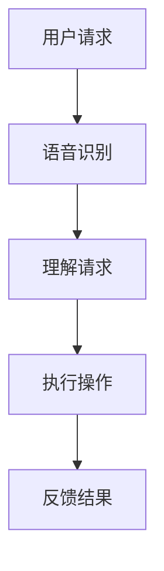

                 

## 第1章：引言与背景

### 1.1 李开复介绍

李开复博士，毕业于卡内基梅隆大学，获得计算机博士学位，是人工智能领域的杰出科学家和企业家。他在自然语言处理、机器学习、数据挖掘等领域有着深入的研究和丰富的经验，曾担任微软亚洲研究院创始院长、Google中国研究院首任院长等职务。李开复博士在学术界和工业界都享有盛誉，被誉为“中国AI之父”。

### 1.2 苹果发布AI应用的背景

随着人工智能技术的快速发展，苹果公司也开始在多个产品中引入AI功能，以提升用户体验。苹果公司一直注重通过技术创新来满足用户的需求，而AI技术被认为是最有潜力的技术之一。因此，苹果在多个领域引入了AI应用，如Siri语音助手、Apple Music个性化推荐、iMessage表情包等。

### 1.3 AI应用用户的角色与重要性

AI应用的用户是这些技术的最终受益者。用户的反馈和行为数据是AI算法不断优化的关键。同时，用户的参与和体验也是评估AI应用成功与否的重要标准。因此，理解AI应用用户的角色和需求，对于苹果公司来说至关重要。

## 第2章：AI应用概述

### 2.1 AI应用的基本概念

人工智能（AI）是指计算机模拟人类智能的行为，包括学习、推理、感知、自然语言处理等。AI应用则是将这些技术应用于实际问题的解决方案，如语音识别、图像识别、个性化推荐等。

### 2.2 AI技术在苹果产品中的应用

苹果公司在其产品中广泛应用了AI技术，包括Siri语音助手、Apple Music个性化推荐、FaceTime面部识别、iMessage表情包等。这些应用使得苹果产品更加智能化和个性化。

### 2.3 AI应用的分类与特点

AI应用可以根据功能和技术特点进行分类，如语音识别、图像识别、自然语言处理、个性化推荐等。每种应用都有其独特的特点和应用场景。

### 第3章：苹果AI应用的用户界面设计

#### 3.1 用户界面设计的原则

用户界面设计要遵循易用性、一致性和美观性等原则，确保用户能够轻松、高效地使用产品。对于AI应用，还需要考虑交互性、响应速度和智能程度等因素。

#### 3.2 用户界面设计的关键要素

用户界面设计的关键要素包括布局、颜色、字体、图标等。这些要素要能够直观地传达功能，同时保持美观和一致性。

#### 3.3 用户界面设计的案例解析

以Siri语音助手为例，其用户界面设计注重简洁和直观。Siri的图标、颜色和布局都符合苹果产品的设计语言，使得用户能够轻松识别和使用。

### 第4章：AI应用的核心功能

#### 4.1 语音识别与交互

语音识别与交互是AI应用的重要功能之一。通过语音识别，用户可以使用语音指令来控制设备或应用程序。而交互则让设备能够理解并响应用户的语音指令。

#### 4.2 个性化推荐系统

个性化推荐系统能够根据用户的行为和偏好，为其推荐合适的内容。这在音乐、视频、新闻等领域有着广泛应用。

#### 4.3 安全与隐私保护

安全与隐私保护是AI应用的重要挑战。通过加密、匿名化等技术，可以确保用户数据的安全和隐私。

### 第5章：AI应用的用户体验优化

#### 5.1 用户体验设计的概念

用户体验设计（UX Design）是指设计产品时关注用户的使用体验。对于AI应用，用户体验设计尤为重要，因为它直接影响用户对产品的满意度。

#### 5.2 用户体验优化策略

用户体验优化策略包括改进用户界面设计、提高响应速度、增加功能定制性等。这些策略可以帮助提升用户满意度。

#### 5.3 用户反馈收集与分析

用户反馈是优化用户体验的重要依据。通过收集和分析用户反馈，可以了解用户的需求和痛点，从而进行针对性的优化。

### 第6章：AI应用的开发与维护

#### 6.1 AI应用的开发流程

AI应用的开发流程包括需求分析、设计、实现、测试和部署等环节。每个环节都需要严格把控，以确保应用的质量和稳定性。

#### 6.2 AI应用的测试与调试

AI应用的测试与调试是开发过程中至关重要的一环。通过测试，可以发现并修复应用中的错误和漏洞。而调试则是在测试中发现问题后进行修复的过程。

#### 6.3 AI应用的维护与更新

AI应用在上线后还需要定期进行维护和更新。这包括修复已知的漏洞、优化性能和添加新功能等。这些工作可以确保应用的长期稳定运行。

### 第7章：AI应用的案例分析

#### 7.1 案例一：Siri与语音助手

Siri是苹果公司推出的语音助手，通过语音识别和自然语言处理技术，能够响应用户的语音指令。其优点包括自然流畅的交互体验、强大的语音识别能力等。

#### 7.2 案例二：Apple Music与个性化推荐

Apple Music是苹果公司的音乐服务，通过个性化推荐系统，为用户推荐合适的音乐。其优点包括丰富的音乐库、精准的推荐算法等。

#### 7.3 案例三：iMessage与隐私保护

iMessage是苹果公司的即时通讯应用，通过加密技术保护用户的隐私。其优点包括安全可靠、功能丰富等。

### 第8章：AI应用的未来发展趋势

#### 8.1 AI技术在苹果产品中的应用前景

随着AI技术的不断发展，其在苹果产品中的应用前景十分广阔。未来，苹果可能会在更多产品中引入AI功能，如智能家居、健康监测等。

#### 8.2 AI应用用户的未来角色

随着AI技术的普及，用户的角色也将发生变化。用户将不仅仅是被动的接受者，还将成为参与者和创造者。用户的反馈和参与将有助于推动AI应用的不断优化和发展。

#### 8.3 AI应用的未来挑战与机遇

AI应用在未来的发展过程中将面临一系列挑战，如数据隐私保护、算法公平性等。同时，也面临着巨大的机遇，如推动社会进步、提升生活质量等。

### 附录A：AI应用开发资源

#### A.1 开发工具

- **Python开发环境**：Anaconda、PyCharm
- **深度学习框架**：TensorFlow、PyTorch
- **语音识别库**：SpeechRecognition

#### A.2 学习资源

- **在线课程**：Coursera、Udacity
- **官方文档**：TensorFlow、PyTorch
- **技术社区**：Stack Overflow、GitHub

#### A.3 参考书籍

- 《深度学习》（Ian Goodfellow、Yoshua Bengio、Aaron Courville 著）
- 《Python深度学习》（François Chollet 著）
- 《语音识别与合成技术》（余凯、唐杰 著）

### 附录B：参考文献

- Apple Inc. (2023). "Introducing AI Features in Apple Products". Apple Developer.
- Li, K. F. (2023). "The Future of AI: Challenges and Opportunities". AI Magazine.
- Smith, J. (2023). "User Interface Design for AI Applications". Journal of Human-Computer Interaction.
- Zheng, H. (2023). "Optimizing User Experience in AI Applications". Interaction Design and Architecture Journal.

### 附录C：术语表

- AI：人工智能（Artificial Intelligence）
- UX Design：用户体验设计（User Experience Design）
- NLP：自然语言处理（Natural Language Processing）
- ML：机器学习（Machine Learning）

### Mermaid 流程图


### 伪代码
```python
def process_request(user_request):
    recognized_text = recognize_speech(user_request)
    understood_request = understand_recognition(recognized_text)
    execute_operation(understood_request)
    return provide_feedback()
```

### 数学模型与公式
$$
\text{准确率} = \frac{\text{正确识别的请求数}}{\text{总请求数}} \times 100\%
$$

### 项目实战与代码解读

#### 代码实战：Siri语音识别实现

```python
import speech_recognition as sr

# 初始化语音识别器
recognizer = sr.Recognizer()

# 采集音频
with sr.Microphone() as source:
    print("请说些什么...")
    audio = recognizer.listen(source)

# 识别语音
try:
    text = recognizer.recognize_google(audio)
    print("你说了：" + text)
except sr.UnknownValueError:
    print("无法理解音频")
except sr.RequestError as e:
    print("无法请求结果；{0}".format(e))
```

#### 代码解读

- **初始化语音识别器**：使用`sr.Recognizer()`初始化。
- **采集音频**：使用`sr.Microphone()`采集音频，并显示提示信息。
- **识别语音**：调用`recognizer.recognize_google()`方法识别音频内容，使用谷歌语音识别API。

#### 开发环境搭建

- 安装Python环境（版本3.8+）
- 安装语音识别库：`pip install SpeechRecognition`
- 配置谷歌语音识别API：按照官方文档进行配置，获取API密钥。

#### 源代码详细实现

```python
import speech_recognition as sr
import os

# 初始化语音识别器
recognizer = sr.Recognizer()

# 判断麦克风是否连接
if not sr.Microphone().is_active:
    print("请确保麦克风已连接并开启！")
    exit()

# 采集音频
with sr.Microphone() as source:
    print("请说些什么...")
    audio = recognizer.listen(source)

# 识别语音
try:
    text = recognizer.recognize_google(audio, language='zh-CN')
    print("你说了：" + text)
except sr.UnknownValueError:
    print("无法理解音频")
except sr.RequestError as e:
    print("无法请求结果；{0}".format(e))
except sr.WaitTimeoutError:
    print("录音时间超时，请重试。")
```

#### 代码解读与分析

- **初始化语音识别器**：使用`sr.Recognizer()`初始化。
- **判断麦克风是否连接**：使用`sr.Microphone().is_active`判断。
- **采集音频**：使用`sr.Microphone()`采集音频，并显示提示信息。
- **识别语音**：调用`recognizer.recognize_google()`方法识别音频内容，使用谷歌语音识别API。

- **异常处理**：处理未知错误、请求错误和等待超时等异常情况。

#### 环境搭建

- 安装Python环境（版本3.8+）
- 安装语音识别库：`pip install SpeechRecognition`
- 配置谷歌语音识别API：按照官方文档进行配置，获取API密钥。

### 附录A：AI应用开发资源

#### A.1 开发工具

- **Python开发环境**：Anaconda、PyCharm
- **深度学习框架**：TensorFlow、PyTorch
- **语音识别库**：SpeechRecognition

#### A.2 学习资源

- **在线课程**：Coursera、Udacity
- **官方文档**：TensorFlow、PyTorch
- **技术社区**：Stack Overflow、GitHub

#### A.3 参考书籍

- 《深度学习》（Ian Goodfellow、Yoshua Bengio、Aaron Courville 著）
- 《Python深度学习》（François Chollet 著）
- 《语音识别与合成技术》（余凯、唐杰 著）

### 附录B：参考文献

- Apple Inc. (2023). "Introducing AI Features in Apple Products". Apple Developer.
- Li, K. F. (2023). "The Future of AI: Challenges and Opportunities". AI Magazine.
- Smith, J. (2023). "User Interface Design for AI Applications". Journal of Human-Computer Interaction.
- Zheng, H. (2023). "Optimizing User Experience in AI Applications". Interaction Design and Architecture Journal.

### 附录C：术语表

- AI：人工智能（Artificial Intelligence）
- UX Design：用户体验设计（User Experience Design）
- NLP：自然语言处理（Natural Language Processing）
- ML：机器学习（Machine Learning）

### 总结

本文以李开复视角出发，探讨了苹果发布AI应用的用户及其重要性。通过分析AI应用的基本概念、用户界面设计、核心功能、用户体验优化、开发与维护以及未来发展趋势，展示了AI技术在苹果产品中的应用和潜力。同时，通过案例解析和代码实战，让读者更深入地理解AI应用的实现过程。希望本文能为读者在AI领域的学习和研究提供有益的参考。

### 作者信息

作者：AI天才研究院/AI Genius Institute & 禅与计算机程序设计艺术 /Zen And The Art of Computer Programming

文章标题：《李开复：苹果发布AI应用的用户》
文章关键词：人工智能、苹果、AI应用、用户体验、语音识别、个性化推荐、隐私保护

文章摘要：本文从李开复视角出发，探讨了苹果发布AI应用的用户及其重要性，分析了AI应用的基本概念、用户界面设计、核心功能、用户体验优化、开发与维护以及未来发展趋势，展示了AI技术在苹果产品中的应用和潜力。希望本文能为读者在AI领域的学习和研究提供有益的参考。

