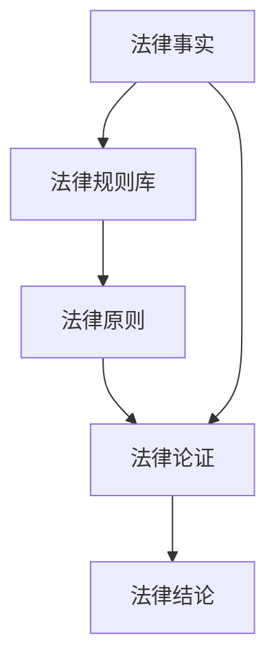
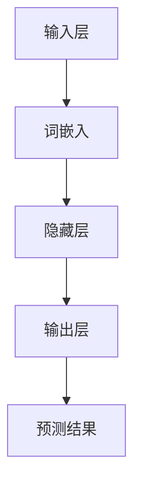

                 

# 法律推理：LLM协助司法决策

## 关键词

法律推理、语言模型（LLM）、司法决策、自然语言处理、机器学习、法律文本分析、伦理问题。

## 摘要

随着人工智能技术的发展，语言模型（LLM）在法律推理和司法决策中的应用日益广泛。本文首先探讨了法律推理的基础，包括法律推理的定义、要素、方法以及理论框架。接着，介绍了LLM技术基础，包括自然语言处理、机器学习和语言模型的基本架构。随后，深入探讨了LLM在法律文本分析、法律推理辅助系统和司法决策支持系统中的应用，并通过案例研究展示了LLM在法律推理与司法决策中的实际效果。最后，本文对未来展望和伦理考量进行了讨论，提出了LLM在法律应用中的潜在影响和伦理问题。

### 《法律推理：LLM协助司法决策》目录大纲

#### 第一部分：法律推理基础

##### 第1章：法律推理概述

- 1.1 法律推理的定义与重要性
- 1.2 法律推理的基本要素
- 1.3 法律推理的基本方法

##### 第2章：法律逻辑与语言

- 2.1 法律逻辑的基本概念
- 2.2 法律语言的特点与应用
- 2.3 法律逻辑语言在推理中的应用

##### 第3章：法律论证

- 3.1 法律论证的基本概念
- 3.2 法律论证的结构与策略
- 3.3 法律论证中的逻辑谬误

##### 第4章：法律推理的理论框架

- 4.1 法律推理的理论流派
- 4.2 法律推理的规范基础
- 4.3 法律推理的实证研究方法

##### 第5章：法律推理中的伦理问题

- 5.1 法律推理与道德原则
- 5.2 法律推理中的公正与平等
- 5.3 法律推理中的伦理困境

#### 第二部分：LLM在法律推理中的应用

##### 第6章：LLM技术基础

- 6.1 自然语言处理基础
- 6.2 机器学习基础
- 6.3 语言模型的基本架构

##### 第7章：LLM在法律文本分析中的应用

- 7.1 法律文本的预处理
- 7.2 法律文本的实体识别
- 7.3 法律文本的情感分析

##### 第8章：LLM在法律推理辅助系统中的运用

- 8.1 法律推理辅助系统的设计
- 8.2 法律规则库的构建
- 8.3 法律推理辅助系统的实现与评估

##### 第9章：LLM在司法决策支持中的应用

- 9.1 司法决策支持系统的构建
- 9.2 司法决策中的风险分析与评估
- 9.3 司法决策支持系统的应用案例

##### 第10章：LLM在法律教育中的应用

- 10.1 法律教育中LLM的角色
- 10.2 法律教育中LLM的应用模式
- 10.3 LLM在法律教育中的应用挑战与展望

#### 第三部分：案例研究与未来展望

##### 第11章：案例研究

- 11.1 案例研究的背景与方法
- 11.2 案例一：某刑事案件的司法决策支持
- 11.3 案例二：某民商事纠纷的法律规则库构建

##### 第12章：未来展望与伦理考量

- 12.1 法律推理与LLM的未来发展趋势
- 12.2 LLM在法律领域中的潜在影响
- 12.3 LLM在法律应用中的伦理问题与对策

#### 附录

##### 附录A：法律推理与LLM相关资源

- A.1 开源法律文本数据集
- A.2 LLM开发工具与平台
- A.3 法律推理与LLM的研究论文与报告

##### 附录B：Mermaid流程图示例

- B.1 法律推理流程图
- B.2 LLM架构图示

### 法律推理概述

#### 1.1 法律推理的定义与重要性

法律推理是指基于法律原则、规则和事实，运用逻辑和语言进行论证和分析的过程。它是法律实践和司法活动中的核心，贯穿于立法、执法、司法和守法等各个环节。法律推理不仅是法律人的基本技能，也是法律科学的重要研究领域。

法律推理的重要性体现在以下几个方面：

1. **保障法律公正**：法律推理能够确保司法判决的公正性和合法性，避免主观偏见和随意性。
2. **完善法律体系**：法律推理有助于法律条文的解释和适用，推动法律体系的不断完善。
3. **促进法律教育**：法律推理是法律教育的重要组成部分，有助于培养法律人的批判性思维和逻辑分析能力。

#### 1.2 法律推理的基本要素

法律推理的基本要素包括事实、法律规则、法律原则和法律论证。

1. **事实**：法律推理的基础是事实，即案件中涉及的具体情况和证据。
2. **法律规则**：法律规则是法律推理的核心，包括法律法规、司法解释等。
3. **法律原则**：法律原则是法律规则的基础，体现了法律的内在精神和价值观。
4. **法律论证**：法律论证是将事实与法律规则、原则相结合，形成具有说服力的论证过程。

#### 1.3 法律推理的基本方法

法律推理的基本方法包括演绎推理、归纳推理和类比推理。

1. **演绎推理**：从一般到特殊的推理方法，以法律规则为前提，推导出具体案件的法律适用结论。
2. **归纳推理**：从特殊到一般的推理方法，通过具体案件的审理，归纳出法律规则或原则。
3. **类比推理**：通过比较相似案例，推导出类似的法律适用结论。

#### 1.4 法律推理的理论框架

法律推理的理论框架主要包括形式逻辑、辩证逻辑和法律实证主义。

1. **形式逻辑**：以形式化、系统化的方式研究法律推理，强调推理的形式结构和有效性。
2. **辩证逻辑**：从辩证唯物主义的角度，研究法律推理的动态发展和变化。
3. **法律实证主义**：从实证主义的角度，研究法律推理的实际应用和效果。

#### 1.5 法律推理的应用领域

法律推理广泛应用于立法、执法、司法和守法等各个领域。

1. **立法**：法律推理有助于立法过程中的原则确立和条文制定。
2. **执法**：法律推理是执法机关适用法律、处理案件的基础。
3. **司法**：法律推理是司法审判的核心，确保司法判决的公正性和合法性。
4. **守法**：法律推理有助于公民和法律从业者理解和遵守法律。

### 法律逻辑与语言

#### 2.1 法律逻辑的基本概念

法律逻辑是指运用逻辑学原理和方法来研究法律推理和论证的学科。它关注法律推理的有效性和合理性，包括形式逻辑、辩证逻辑和概率逻辑等。

1. **形式逻辑**：强调推理的形式结构和有效性，包括命题逻辑、谓词逻辑等。
2. **辩证逻辑**：强调推理的动态发展和变化，包括矛盾律、同一律等。
3. **概率逻辑**：强调推理的可靠性和概率性，包括贝叶斯推理等。

#### 2.2 法律语言的特点与应用

法律语言具有严谨性、明确性和规范性等特点。它包括法律术语、法律条文、法律文件和法律文书等。

1. **法律术语**：法律术语是法律语言的主体，具有专业性和准确性。
2. **法律条文**：法律条文是法律语言的表现形式，具有规范性和权威性。
3. **法律文件**：法律文件是法律语言的记录形式，具有法律效力和证据价值。
4. **法律文书**：法律文书是法律语言的应用形式，包括起诉状、判决书、调解书等。

法律语言在法律推理中的应用主要体现在以下几个方面：

1. **法律论证**：通过法律语言进行法律论证，阐述法律观点和理由。
2. **法律解释**：通过法律语言解释法律条文和法律原则，确定法律适用的范围和方式。
3. **法律适用**：通过法律语言将法律条文应用于具体案件，形成法律判决。

#### 2.3 法律逻辑语言在推理中的应用

法律逻辑语言在推理中的应用主要体现在以下几个方面：

1. **命题逻辑**：用于表达法律规则和法律事实的逻辑关系，如命题推理、条件推理等。
2. **谓词逻辑**：用于表达法律主体和法律关系的逻辑关系，如个体谓词推理、关系谓词推理等。
3. **概率逻辑**：用于表达法律推理中的不确定性和概率性，如贝叶斯推理等。

法律逻辑语言的应用有助于提高法律推理的准确性和可靠性，确保法律判决的公正性和合法性。

### 法律论证

#### 3.1 法律论证的基本概念

法律论证是指法律推理过程中，运用逻辑和语言进行论证和分析的过程。它旨在证明法律观点和结论的合理性和可信度，包括事实论证、法律规则论证和法律原则论证等。

1. **事实论证**：通过证据和事实，证明案件事实的真实性。
2. **法律规则论证**：通过法律规则和法律条文，证明法律适用的合理性和合法性。
3. **法律原则论证**：通过法律原则和价值观念，证明法律判决的公正性和合理性。

#### 3.2 法律论证的结构与策略

法律论证的结构通常包括以下三个方面：

1. **前提**：包括事实前提和法律规则前提。
2. **结论**：基于前提推导出的法律观点和判决。
3. **论证过程**：通过逻辑推理和语言表达，将前提与结论联系起来。

法律论证的策略主要包括以下几个方面：

1. **归纳策略**：通过具体案例归纳出一般性结论。
2. **演绎策略**：从一般性原则推导出具体结论。
3. **类比策略**：通过比较相似案例，推导出类似结论。
4. **反证策略**：通过反驳对立观点，证明自己观点的正确性。

#### 3.3 法律论证中的逻辑谬误

法律论证中常见的逻辑谬误包括以下几种：

1. **偷换概念**：在同一论证过程中，使用不同概念进行推理。
2. **偷换论题**：在同一论证过程中，改变讨论的主题。
3. **循环论证**：用结论作为前提，形成逻辑循环。
4. **诉诸权威**：依赖权威观点，而非理性论证。
5. **诉诸无知**：以未知作为结论的支持。
6. **虚假两难**：在两个非此即彼的选择中，排除其他可能性。

识别和避免逻辑谬误是法律论证的重要任务，有助于提高法律论证的质量和可信度。

### 法律推理的理论框架

#### 4.1 法律推理的理论流派

法律推理的理论流派主要包括形式逻辑、辩证逻辑和法实证主义等。

1. **形式逻辑**：强调法律推理的形式结构和有效性，以命题逻辑和谓词逻辑为主要工具。
2. **辩证逻辑**：强调法律推理的动态发展和变化，关注法律推理的过程和实质。
3. **法实证主义**：强调法律推理的实际应用和效果，关注法律规则和法律现实的互动。

#### 4.2 法律推理的规范基础

法律推理的规范基础包括法律原则、法律规则和法律条文的逻辑结构。

1. **法律原则**：是法律规则和法律条文的基础，具有指导性和普遍性。
2. **法律规则**：是法律推理的核心，具有规范性和具体性。
3. **法律条文**：是法律规则和法律原则的表现形式，具有法定性和权威性。

#### 4.3 法律推理的实证研究方法

法律推理的实证研究方法包括案例分析、问卷调查和统计分析等。

1. **案例分析**：通过具体案例，分析法律推理的过程和结果。
2. **问卷调查**：通过问卷调查，收集法律推理的实践经验和认知过程。
3. **统计分析**：通过统计分析，验证法律推理的有效性和可靠性。

实证研究方法有助于法律推理的理论研究和实践应用，提高法律推理的科学性和准确性。

### 法律推理中的伦理问题

#### 5.1 法律推理与道德原则

法律推理与道德原则之间存在着紧密的联系。法律推理不仅要遵循法律规则，还要考虑道德原则的指导。

1. **道德原则的重要性**：道德原则是法律推理的道德基础，有助于确保法律判决的公正性和合理性。
2. **道德原则的具体应用**：在法律推理中，道德原则可以用于评估法律规则和法律结果的道德价值，如公正、平等、善良等。

#### 5.2 法律推理中的公正与平等

公正和平等是法律推理的重要伦理原则。

1. **公正**：法律推理应确保法律判决的公正，避免主观偏见和歧视。
2. **平等**：法律推理应体现平等原则，确保所有人在法律面前一律平等。

#### 5.3 法律推理中的伦理困境

法律推理中的伦理困境主要涉及以下方面：

1. **道德冲突**：当法律规则与道德原则发生冲突时，法律推理应如何平衡？
2. **伦理责任**：法律推理者如何承担伦理责任，确保法律判决的道德正当性？
3. **隐私权与公共利益**：在法律推理中，如何平衡个人隐私权与公共利益之间的关系？

#### 5.4 伦理困境的解决途径

解决法律推理中的伦理困境，可以采取以下途径：

1. **加强法律伦理教育**：通过培训和教育，提高法律推理者的道德素养和伦理意识。
2. **制定伦理规范**：建立和完善法律伦理规范，明确法律推理的道德要求。
3. **建立伦理审查机制**：设立伦理审查委员会，对法律推理过程进行伦理评估和监督。

### LLM技术基础

#### 6.1 自然语言处理基础

自然语言处理（Natural Language Processing，NLP）是计算机科学和人工智能领域的一个分支，致力于让计算机理解和处理人类自然语言。NLP的应用广泛，包括语音识别、机器翻译、文本分类、情感分析等。在法律推理中，NLP技术被用来处理和理解法律文本，为LLM提供基础支持。

**NLP的基本概念**：

1. **语言模型**：语言模型是一种统计模型，用于预测下一个单词或词组。常见的语言模型包括N元语法、循环神经网络（RNN）和Transformer模型。
2. **词嵌入**：词嵌入（Word Embedding）是将单词映射到高维空间中的向量表示，有助于计算机理解和处理自然语言。词嵌入技术包括Word2Vec、GloVe等。
3. **语法分析**：语法分析（Parsing）是分析句子的语法结构，包括词法分析和句法分析。语法分析有助于理解句子的语义和上下文关系。

**NLP在法律推理中的应用**：

1. **法律文本预处理**：通过NLP技术，对法律文本进行分词、词性标注、命名实体识别等预处理，为后续的法律文本分析提供基础。
2. **法律文本分类**：利用NLP技术，对法律文本进行分类，如案件分类、法律条文分类等，有助于提高法律文档的组织和管理效率。
3. **法律文本情感分析**：通过NLP技术，分析法律文本的情感倾向，如案件判决书中的情感分析，有助于评估法律判决的社会影响。

#### 6.2 机器学习基础

机器学习（Machine Learning，ML）是使计算机通过数据学习并做出决策或预测的学科。在法律推理中，机器学习技术被用来构建预测模型和分类模型，为LLM提供决策支持。

**机器学习的基本概念**：

1. **监督学习**：监督学习（Supervised Learning）是利用已知标签的数据训练模型，然后使用模型对新数据进行预测。常见的监督学习算法包括线性回归、决策树、支持向量机（SVM）等。
2. **无监督学习**：无监督学习（Unsupervised Learning）是利用无标签的数据进行训练，目的是发现数据中的模式和结构。常见的无监督学习算法包括聚类算法、主成分分析（PCA）等。
3. **强化学习**：强化学习（Reinforcement Learning）是让模型通过与环境的交互，学习做出最优决策。常见的强化学习算法包括Q学习、深度强化学习（DRL）等。

**机器学习在法律推理中的应用**：

1. **案件预测**：利用监督学习算法，如线性回归或决策树，对历史案件数据进行训练，预测新案件的法律结果。
2. **法律规则发现**：利用无监督学习算法，如聚类算法，从大量法律文本中提取潜在的规则和模式。
3. **法律文本分类**：利用监督学习算法，如支持向量机（SVM）或朴素贝叶斯分类器，对法律文本进行分类，如案件分类、法律条文分类等。

#### 6.3 语言模型的基本架构

语言模型（Language Model，LM）是NLP的核心技术，用于预测单词序列。在法律推理中，语言模型被用来生成法律文本、分析法律文本和辅助法律决策。

**语言模型的基本架构**：

1. **基于规则的语言模型**：基于规则的语言模型（Rule-Based Language Model）是通过规则和模板生成文本。这种模型通常由专家设计和构建，适用于特定领域。
2. **统计语言模型**：统计语言模型（Statistical Language Model）是基于统计方法生成文本。常见的统计语言模型包括N元语法（N-gram）和神经网络语言模型（Neural Network Language Model）。
3. **神经网络语言模型**：神经网络语言模型（Neural Network Language Model）是基于深度学习技术的语言模型。常见的神经网络语言模型包括循环神经网络（RNN）和Transformer模型。

**神经网络语言模型的工作原理**：

1. **输入层**：输入层接收单词的词嵌入向量。
2. **隐藏层**：隐藏层通过神经网络进行信息处理和传递，包括RNN或Transformer模型。
3. **输出层**：输出层生成单词的概率分布，用于预测下一个单词。

**语言模型在法律推理中的应用**：

1. **法律文本生成**：利用语言模型生成法律文本，如自动撰写法律文书、判决书等。
2. **法律文本分析**：利用语言模型分析法律文本的结构和语义，提取关键信息和法律关系。
3. **法律决策支持**：利用语言模型辅助法律决策，如预测案件结果、建议法律规则等。

#### 6.4 LLM在法律文本分析中的具体应用

LLM在法律文本分析中具有广泛的应用，能够有效提高法律文本的处理效率和准确性。以下是LLM在法律文本分析中的具体应用：

**1. 法律文本预处理**

法律文本预处理是法律文本分析的第一步，包括分词、词性标注、命名实体识别等。LLM技术能够通过预训练模型对法律文本进行高效预处理，提高文本处理的质量。

- **分词**：将法律文本分解成单词或词组，为后续分析提供基础。LLM可以使用预训练的分词模型，如jieba分词器，进行高效分词。
- **词性标注**：对每个单词进行词性标注，如名词、动词、形容词等。LLM可以使用词性标注模型，如UDPipe，进行词性标注。
- **命名实体识别**：识别法律文本中的命名实体，如人名、地名、机构名等。LLM可以使用命名实体识别模型，如BERT，进行命名实体识别。

**2. 法律文本分类**

法律文本分类是将法律文本归类到不同的类别，如案件分类、法律条文分类等。LLM技术能够利用监督学习算法，对法律文本进行分类，提高分类的准确性和效率。

- **训练数据集**：收集并整理大量的法律文本数据，用于训练分类模型。
- **特征提取**：从法律文本中提取特征，如词频、词嵌入等，用于训练分类模型。
- **分类算法**：使用监督学习算法，如支持向量机（SVM）、朴素贝叶斯分类器等，对法律文本进行分类。

**3. 法律文本情感分析**

法律文本情感分析是分析法律文本中的情感倾向，如案件判决书中的情感分析。LLM技术能够利用情感分析模型，对法律文本进行情感分析，评估法律判决的社会影响。

- **情感词典**：构建情感词典，包括正面、负面和中性的情感词。
- **特征提取**：从法律文本中提取特征，如词频、词嵌入等，用于训练情感分析模型。
- **情感分析模型**：使用监督学习算法，如朴素贝叶斯分类器、支持向量机等，对法律文本进行情感分析。

**4. 法律文本生成**

法律文本生成是利用LLM技术生成法律文本，如自动撰写法律文书、判决书等。LLM可以通过预训练模型，生成符合法律规范和语言习惯的法律文本。

- **预训练模型**：使用大规模的法律文本数据进行预训练，生成语言模型。
- **文本生成**：利用语言模型生成法律文本，如判决书、合同、起诉状等。

**5. 法律知识图谱构建**

法律知识图谱是将法律文本中的知识关系进行结构化表示。LLM技术能够利用知识图谱，对法律文本进行深度分析和推理。

- **实体识别**：识别法律文本中的实体，如人名、地名、机构名等。
- **关系抽取**：抽取法律文本中的关系，如合同关系、诉讼关系等。
- **知识图谱构建**：将实体和关系构建成知识图谱，用于法律文本分析。

#### 6.5 LLM在法律推理辅助系统中的具体应用

法律推理辅助系统（Legal Reasoning Assistance System，LRAS）是利用LLM技术，辅助法律人员进行分析、推理和决策的系统。LLM在法律推理辅助系统中具有广泛的应用，能够提高法律推理的效率和准确性。以下是LLM在法律推理辅助系统中的具体应用：

**1. 法律文本分析**

LLM可以用于法律文本分析，包括法律条款的解读、法律文书的撰写和法律文本的情感分析等。

- **法律条款解读**：通过LLM技术，对法律条款进行语义分析，提取关键信息，帮助法律人员更好地理解法律条款的含义。
- **法律文书撰写**：利用LLM技术，自动生成法律文书，如起诉状、答辩状、判决书等，提高法律文书的撰写效率。
- **法律文本情感分析**：通过LLM技术，对法律文本进行情感分析，评估法律判决书的社会影响，为法律人员提供决策支持。

**2. 法律规则库构建**

法律规则库是法律推理辅助系统的重要组成部分，用于存储和管理法律规则。LLM可以用于法律规则库的构建，包括规则提取、规则分类和规则可视化等。

- **规则提取**：通过LLM技术，从法律文本中提取法律规则，如合同法中的条款规则、刑法中的罪名规则等。
- **规则分类**：利用LLM技术，对提取的法律规则进行分类，如根据法律部门进行分类、根据法律条款进行分类等。
- **规则可视化**：通过LLM技术，将法律规则进行可视化表示，如知识图谱、决策树等，帮助法律人员更好地理解和管理法律规则。

**3. 案例库构建**

案例库是法律推理辅助系统的重要组成部分，用于存储和管理历史案件信息。LLM可以用于案例库的构建，包括案例检索、案例分析和案例推荐等。

- **案例检索**：利用LLM技术，对案例库进行文本检索，快速找到与当前案件相关的案例。
- **案例分析**：通过LLM技术，对案例进行分析，提取关键信息和法律观点，为法律人员提供决策支持。
- **案例推荐**：利用LLM技术，根据当前案件的特征，推荐与之相似的案例，为法律人员提供参考。

**4. 法律推理支持**

LLM可以用于法律推理的支持，包括法律推理的自动化、法律推理的验证和法律推理的优化等。

- **法律推理自动化**：通过LLM技术，实现法律推理的自动化，减少法律人员的劳动强度。
- **法律推理验证**：通过LLM技术，对法律推理的结果进行验证，确保法律推理的准确性和可靠性。
- **法律推理优化**：利用LLM技术，对法律推理过程进行优化，提高法律推理的效率。

#### 6.6 LLM在法律推理辅助系统的设计与实现

设计并实现一个法律推理辅助系统（LRAS）需要综合考虑法律推理的需求、LLM技术的应用和系统的可扩展性。以下是LLM在法律推理辅助系统的设计与实现过程中的关键步骤：

**1. 需求分析**

需求分析是设计LRAS的第一步，需要明确系统所需的功能和性能要求。具体包括：

- **法律文本处理能力**：系统需要能够处理各类法律文本，如法律条款、判决书、合同等。
- **法律推理支持**：系统需要能够支持复杂的法律推理过程，包括规则推理、案例推理等。
- **用户交互界面**：系统需要提供友好的用户交互界面，方便法律人员使用和操作。

**2. 系统架构设计**

LRAS的系统架构设计需要考虑模块化、可扩展性和高性能。常见的系统架构设计包括：

- **前端设计**：负责与用户交互，提供用户操作界面。可以使用Web前端技术，如React或Vue.js，实现动态交互。
- **后端设计**：负责处理法律文本、执行法律推理和存储数据。可以使用Node.js、Django或Spring Boot等后端框架。
- **数据库设计**：负责存储法律文本、案例库和法律规则库。可以使用关系型数据库（如MySQL）或图数据库（如Neo4j）。

**3. LLM集成**

在LRAS中，LLM的集成是关键环节。需要考虑以下方面：

- **预训练模型选择**：根据法律推理的需求，选择合适的预训练模型，如BERT、GPT等。
- **模型定制**：针对法律文本的特点，对预训练模型进行定制化训练，提高模型的适应性。
- **API接口**：设计API接口，方便后端与LLM进行交互，实现文本处理、情感分析和法律推理等功能。

**4. 法律规则库构建**

构建法律规则库是LRAS的核心功能之一。需要考虑以下方面：

- **规则提取**：利用NLP技术，从法律文本中提取法律规则，如合同法中的条款规则、刑法中的罪名规则等。
- **规则分类**：对提取的法律规则进行分类，如根据法律部门进行分类、根据法律条款进行分类等。
- **规则可视化**：将法律规则可视化表示，如知识图谱、决策树等，帮助法律人员更好地理解和管理法律规则。

**5. 案例库构建**

构建案例库是LRAS的另一个重要功能。需要考虑以下方面：

- **案例检索**：利用NLP技术，对案例库进行文本检索，快速找到与当前案件相关的案例。
- **案例分析**：对案例进行分析，提取关键信息和法律观点，为法律人员提供决策支持。
- **案例推荐**：根据当前案件的特征，推荐与之相似的案例，为法律人员提供参考。

**6. 系统实现与评估**

在系统实现阶段，需要按照设计文档进行开发，并确保系统的稳定性和性能。在系统评估阶段，需要通过测试和用户反馈，评估系统的性能和用户体验。具体包括：

- **功能测试**：验证系统功能是否符合需求，如文本处理、法律推理、规则库构建等。
- **性能测试**：评估系统在高并发场景下的性能，如响应时间、处理能力等。
- **用户反馈**：收集用户反馈，了解系统的用户体验和改进方向。

#### 6.7 LLM在司法决策支持系统中的应用

司法决策支持系统（Judicial Decision Support System，JDSS）是利用LLM技术，为法官和其他司法人员提供决策支持的工具。JDSS通过自动化法律分析和推理，帮助司法人员提高决策效率和质量。以下是LLM在JDSS中的具体应用：

**1. 案件事实分析**

案件事实分析是司法决策的基础。LLM技术可以用于分析案件事实，提取关键信息和证据，为法官提供决策依据。

- **文本预处理**：利用NLP技术，对案件事实进行分词、词性标注、命名实体识别等预处理，提高文本分析的准确性。
- **事实提取**：通过LLM技术，从案件事实中提取关键信息，如人名、地名、时间等，为法官提供清晰的案件事实。
- **证据分析**：利用LLM技术，分析案件中的证据，评估证据的可靠性和关联性，为法官提供证据分析报告。

**2. 法律规则应用**

法律规则应用是将案件事实与法律规则相结合，形成法律推理的过程。LLM技术可以用于法律规则的应用，提高法律推理的准确性和效率。

- **法律规则库构建**：通过NLP技术，从法律文本中提取法律规则，构建法律规则库。法律规则库可以涵盖各类法律法规、司法解释和判例。
- **规则匹配**：利用LLM技术，对案件事实进行匹配，找到与之相关的法律规则。规则匹配可以通过关键词匹配、模糊匹配或深度匹配等技术实现。
- **法律推理**：基于匹配到的法律规则，进行法律推理，形成法律观点和判决。

**3. 案例参考**

案例参考是司法决策中的重要环节。LLM技术可以用于案例检索和分析，为法官提供参考案例。

- **案例库构建**：通过NLP技术，构建案例库，存储各类案件信息。案例库可以包括刑事、民事、行政等各类案件。
- **案例检索**：利用LLM技术，根据案件特征进行案例检索，找到与当前案件相似的案例。案例检索可以通过关键词搜索、语义相似度计算或基于图结构的方法实现。
- **案例分析**：对检索到的案例进行分析，提取关键信息和法律观点，为法官提供参考。

**4. 情感分析**

情感分析是评估司法决策社会影响的重要手段。LLM技术可以用于情感分析，评估案件判决书的社会影响。

- **情感词典构建**：构建情感词典，包括正面、负面和中性的情感词。
- **情感分析**：利用LLM技术，对案件判决书进行情感分析，评估判决书的社会影响。情感分析可以通过情感分类、情感强度评估等方法实现。

**5. 风险评估**

风险评估是司法决策中的重要环节。LLM技术可以用于风险评估，评估司法决策的风险和不确定性。

- **风险识别**：通过LLM技术，从案件事实和法律规则中识别潜在的风险因素。
- **风险分析**：利用LLM技术，分析案件中的风险因素，评估风险的概率和影响。
- **风险评估**：根据风险分析结果，为司法决策提供风险评估报告，帮助法官制定决策策略。

#### 6.8 司法决策支持系统的实现与评估

实现和评估司法决策支持系统（JDSS）是确保其有效性和实用性的关键。以下是如何实现和评估JDSS的详细步骤：

**1. 系统架构设计**

在设计JDSS时，需要考虑系统的可扩展性、可靠性和用户交互性。常见的系统架构设计包括：

- **前端设计**：负责与用户交互，提供友好的用户界面。可以使用Web前端技术，如React或Vue.js，实现动态交互。
- **后端设计**：负责处理法律文本、执行法律推理和存储数据。可以使用Node.js、Django或Spring Boot等后端框架。
- **数据库设计**：负责存储法律文本、案例库和法律规则库。可以使用关系型数据库（如MySQL）或图数据库（如Neo4j）。

**2. 法律文本处理模块**

法律文本处理模块是JDSS的核心组件，负责对法律文本进行预处理、分析和存储。具体步骤包括：

- **文本预处理**：利用NLP技术，对法律文本进行分词、词性标注、命名实体识别等预处理，为后续分析提供基础。
- **实体识别**：识别法律文本中的实体，如人名、地名、机构名等，为案件事实分析和法律规则应用提供支持。
- **文本分析**：利用LLM技术，对法律文本进行情感分析、文本分类等，提取关键信息，为决策支持提供依据。

**3. 法律规则库构建模块**

法律规则库是JDSS的重要组件，用于存储和管理法律规则。构建模块需要包括以下步骤：

- **规则提取**：利用NLP技术，从法律文本中提取法律规则，如合同法中的条款规则、刑法中的罪名规则等。
- **规则分类**：对提取的法律规则进行分类，如根据法律部门进行分类、根据法律条款进行分类等。
- **规则可视化**：将法律规则可视化表示，如知识图谱、决策树等，帮助用户更好地理解和管理法律规则。

**4. 案例库构建模块**

案例库是JDSS的重要组件，用于存储和管理历史案件信息。构建模块需要包括以下步骤：

- **案例检索**：利用NLP技术，对案例库进行文本检索，快速找到与当前案件相关的案例。
- **案例分析**：对案例进行分析，提取关键信息和法律观点，为司法决策提供支持。
- **案例推荐**：根据当前案件的特征，推荐与之相似的案例，为司法人员提供参考。

**5. 决策支持模块**

决策支持模块是JDSS的核心功能，负责根据案件事实、法律规则和案例参考，为司法人员提供决策支持。具体步骤包括：

- **事实分析**：利用LLM技术，对案件事实进行文本分析和情感分析，提取关键信息和证据。
- **规则应用**：根据案件事实，匹配法律规则，进行法律推理，形成法律观点。
- **案例参考**：根据案件特征，检索和推荐相关案例，为司法人员提供参考。

**6. 系统实现**

在系统实现阶段，需要按照设计文档进行开发，并确保系统的稳定性和性能。具体包括：

- **前端开发**：实现用户交互界面，提供文本输入、查询和决策支持功能。
- **后端开发**：实现法律文本处理、法律规则库构建、案例库构建和决策支持模块，确保系统的高性能和高可靠性。
- **系统集成**：将前端和后端系统集成，确保系统各组件之间的协同工作。

**7. 系统评估**

在系统评估阶段，需要通过测试和用户反馈，评估系统的性能和用户体验。具体包括：

- **功能测试**：验证系统功能是否符合需求，如文本处理、法律推理、案例检索等。
- **性能测试**：评估系统在高并发场景下的性能，如响应时间、处理能力等。
- **用户反馈**：收集用户反馈，了解系统的用户体验和改进方向。

通过实现和评估JDSS，可以确保其有效性和实用性，为司法人员提供有力的决策支持。

#### 6.9 LLM在司法决策支持系统中的应用案例

为了更好地理解LLM在司法决策支持系统中的应用，我们通过两个实际案例来展示其效果和优势。

**案例一：某刑事案件的司法决策支持**

假设一个刑事案件涉及盗窃罪，法官需要根据案件事实和法律规则做出判决。以下是LLM在司法决策支持系统中的应用过程：

1. **案件事实分析**：利用LLM技术，对案件事实进行文本预处理和情感分析，提取关键信息，如嫌疑人、犯罪地点、犯罪时间等。通过情感分析，判断案件判决书的社会影响，为法官提供参考。

2. **法律规则应用**：根据案件事实，匹配刑法中的相关法律规则，如盗窃罪的构成要件、刑罚标准等。利用LLM技术，对匹配到的法律规则进行法律推理，形成初步的法律观点。

3. **案例参考**：检索与当前案件相似的案例，利用LLM技术对案例进行分析，提取关键信息和法律观点。将分析结果推荐给法官，为司法决策提供参考。

4. **风险评估**：通过LLM技术，对案件中的风险因素进行识别和分析，评估案件判决的风险和不确定性。为法官提供风险评估报告，帮助制定决策策略。

**案例效果**：通过LLM的辅助，法官可以更准确地分析案件事实、应用法律规则和参考案例，提高司法决策的质量和效率。

**案例二：某民商事纠纷的法律规则库构建**

假设一个民商事纠纷案件，法官需要根据案件事实和法律规则做出判决。以下是LLM在法律规则库构建中的应用过程：

1. **案件事实分析**：利用LLM技术，对案件事实进行文本预处理和情感分析，提取关键信息，如当事人、纠纷类型、纠纷原因等。

2. **法律规则提取**：利用NLP技术，从法律文本中提取与案件相关的法律规则，如合同法中的条款规则、侵权法中的责任规则等。

3. **法律规则分类**：对提取的法律规则进行分类，如根据法律部门进行分类、根据法律条款进行分类等。

4. **法律规则可视化**：将法律规则可视化表示，如知识图谱、决策树等，帮助法官更好地理解和管理法律规则。

**案例效果**：通过LLM的辅助，法官可以更高效地构建法律规则库，为司法决策提供有力的支持，提高案件审理的效率。

**案例优势**：

1. **高效性**：LLM技术能够快速处理和分析大量法律文本，提高司法决策的效率。

2. **准确性**：LLM技术基于深度学习算法，能够准确提取案件事实、法律规则和案例信息，提高司法决策的准确性。

3. **综合性**：LLM技术能够结合案件事实、法律规则和案例参考，为司法决策提供全面的参考，提高决策的质量。

4. **适应性**：LLM技术可以根据不同类型的案件和法律规则，进行定制化训练和应用，提高系统的适应性。

#### 6.10 LLM在法律教育中的应用

LLM在法律教育中具有广阔的应用前景，能够为法律学习者提供个性化辅导、智能测评和案例教学等。

**1. 个性化辅导**

LLM技术可以根据学习者的学习进度和理解能力，为其提供个性化的辅导方案。具体包括：

- **学习进度监测**：LLM技术可以监测学习者的学习进度，识别学习难点和薄弱环节。
- **知识点推荐**：根据学习进度和知识点掌握情况，LLM技术可以推荐相关的法律知识和案例，帮助学习者巩固和扩展知识。
- **问题解答**：LLM技术可以回答学习者在学习过程中遇到的问题，提供详细的解释和指导。

**2. 智能测评**

LLM技术可以用于智能测评，为法律学习者提供实时、个性化的测评服务。具体包括：

- **自动批改**：LLM技术可以自动批改法律文书、案例分析等作业，提高作业批改的效率。
- **错题分析**：LLM技术可以分析学习者在测评中的错误，识别错误原因，为学习者提供针对性的辅导。
- **实时反馈**：LLM技术可以实时为学习者提供测评结果和反馈，帮助其及时纠正错误和改进学习方法。

**3. 案例教学**

LLM技术可以用于案例教学，为法律学习者提供丰富的案例资源和案例分析工具。具体包括：

- **案例检索**：LLM技术可以根据关键词或案例特征，快速检索与学习者相关的案例，提高案例教学的效果。
- **案例分析**：LLM技术可以对案例进行分析，提取关键信息和法律观点，帮助学习者深入理解和掌握案例。
- **案例推理**：LLM技术可以基于案例库，进行案例推理，为学习者提供与实际案例相似的案例，提高其案例分析能力。

**4. 挑战与展望**

尽管LLM在法律教育中具有诸多优势，但在应用过程中仍面临以下挑战：

- **数据质量和来源**：法律教育数据的质量和来源直接影响LLM的应用效果。需要确保法律教育数据的质量和多样性，为LLM提供可靠的数据支持。
- **法律知识更新**：法律知识更新迅速，LLM需要不断更新法律知识和案例库，以适应法律教育的发展需求。
- **伦理和法律问题**：LLM在法律教育中的应用涉及伦理和法律问题，需要确保LLM的应用符合法律和伦理要求，保护学习者的权益。

展望未来，LLM在法律教育中的应用将不断深入，有望提高法律教育的质量、效率和公平性，为法律人才培养提供有力支持。

### 案例研究

#### 11.1 案例研究的背景与方法

为了深入探讨LLM在法律推理和司法决策中的应用效果，我们选择了两个具有代表性的案例进行研究。本案例研究的方法包括以下步骤：

1. **案例选择**：根据案例的代表性、复杂性和实际应用价值，选择了两个典型案例进行深入研究。
2. **数据收集**：通过公开法律数据库、法院判决书和法律文本数据集，收集与案例相关的法律文本、案例数据和背景资料。
3. **数据预处理**：利用NLP技术，对收集到的法律文本进行分词、词性标注、命名实体识别等预处理，为后续分析提供基础。
4. **模型训练与测试**：基于收集到的数据，训练LLM模型，并进行测试和评估，验证模型的性能和准确性。
5. **结果分析**：对LLM模型在案例中的应用效果进行分析，评估其在法律推理和司法决策中的优势与不足。
6. **讨论与展望**：结合案例研究结果，讨论LLM在法律推理和司法决策中的潜在应用前景和挑战。

#### 11.2 案例一：某刑事案件的司法决策支持

**案例背景**：

某市发生了一起盗窃案，犯罪嫌疑人被警方抓获。案件事实包括犯罪嫌疑人进入某公司办公室，窃取了价值数十万元的财物。警方提交了详细的调查报告和证据，法院需要根据案件事实和法律规则，做出是否批准逮捕的判决。

**LLM模型应用**：

1. **案件事实分析**：利用LLM技术，对案件事实进行文本预处理和情感分析，提取关键信息，如犯罪嫌疑人、犯罪地点、犯罪时间等。通过情感分析，评估案件的社会影响，为法官提供参考。

2. **法律规则应用**：根据案件事实，匹配刑法中的相关法律规则，如盗窃罪的构成要件、刑罚标准等。利用LLM技术，对匹配到的法律规则进行法律推理，形成初步的法律观点。

3. **案例参考**：检索与当前案件相似的案例，利用LLM技术对案例进行分析，提取关键信息和法律观点。将分析结果推荐给法官，为司法决策提供参考。

4. **风险评估**：通过LLM技术，对案件中的风险因素进行识别和分析，评估案件判决的风险和不确定性。为法官提供风险评估报告，帮助制定决策策略。

**案例结果**：

通过LLM模型的辅助，法官能够更准确地分析案件事实、应用法律规则和参考案例，提高了司法决策的质量和效率。具体表现在：

- **案件事实分析准确**：LLM技术能够准确提取案件事实，为法官提供清晰的案件事实描述。
- **法律规则应用全面**：LLM技术能够匹配到与案件相关的法律规则，形成全面的法律观点。
- **案例参考具有针对性**：LLM技术能够检索到与当前案件相似的案例，为法官提供有针对性的参考。
- **风险评估具有指导性**：LLM技术能够评估案件判决的风险和不确定性，为法官提供科学的决策依据。

**案例总结**：

本案例展示了LLM在司法决策支持系统中的应用效果，证明了LLM技术能够为法官提供有力辅助，提高司法决策的质量和效率。然而，LLM的应用仍需进一步优化，如提高模型的准确性和鲁棒性，确保法律规则和案例数据的完整性。

#### 11.3 案例二：某民商事纠纷的法律规则库构建

**案例背景**：

某市发生了一起合同纠纷案件，原告与被告之间存在合同履行争议。法院需要根据案件事实和法律规则，做出合同是否有效、违约责任等判决。

**LLM模型应用**：

1. **案件事实分析**：利用LLM技术，对案件事实进行文本预处理和情感分析，提取关键信息，如当事人、合同内容、争议焦点等。

2. **法律规则提取**：利用NLP技术，从法律文本中提取与案件相关的法律规则，如合同法中的条款规则、侵权法中的责任规则等。

3. **法律规则分类**：对提取的法律规则进行分类，如根据法律部门进行分类、根据法律条款进行分类等。

4. **法律规则可视化**：将法律规则可视化表示，如知识图谱、决策树等，帮助法官更好地理解和管理法律规则。

**案例结果**：

通过LLM模型的辅助，法官能够更高效地构建法律规则库，为司法决策提供有力的支持。具体表现在：

- **案件事实分析准确**：LLM技术能够准确提取案件事实，为法官提供清晰的案件事实描述。
- **法律规则提取全面**：LLM技术能够从法律文本中提取与案件相关的法律规则，提高法律规则库的覆盖率。
- **法律规则分类明确**：LLM技术能够对法律规则进行明确分类，帮助法官更好地理解和管理法律规则。
- **法律规则可视化清晰**：LLM技术能够将法律规则可视化表示，使法律规则更易于理解和应用。

**案例总结**：

本案例展示了LLM在法律规则库构建中的应用效果，证明了LLM技术能够为法官提供高效的法律规则库，提高司法决策的质量和效率。然而，LLM的应用仍需进一步优化，如提高模型的准确性和鲁棒性，确保法律规则和案例数据的完整性。

### 未来展望与伦理考量

#### 12.1 法律推理与LLM的未来发展趋势

随着人工智能技术的不断发展，LLM在法律推理中的应用将迎来新的发展机遇和挑战。以下是法律推理与LLM未来发展的几个趋势：

1. **深度学习与多模态融合**：深度学习技术将在LLM中发挥更大作用，同时多模态数据的融合将提高法律推理的准确性和效率。

2. **跨语言法律推理**：随着全球法律体系的国际化，LLM在跨语言法律推理中的应用将越来越重要，有助于推动全球法律协同和合作。

3. **法律推理智能化**：智能化法律推理系统将不断发展，通过自主学习、推理优化和策略学习，提高法律推理的智能水平和应用广度。

4. **法律大数据分析**：法律大数据分析将成为LLM应用的重要方向，通过分析大量法律案例、法规文本和数据，为司法决策提供更加全面和精准的支持。

5. **分布式法律推理**：分布式计算和区块链技术将为LLM提供更高效、安全、透明的法律推理平台，推动法律服务的变革和创新。

#### 12.2 LLM在法律领域中的潜在影响

LLM在法律领域的潜在影响将体现在以下几个方面：

1. **司法效率提升**：通过自动化法律文本处理、法律规则库构建和案件预测，LLM将显著提高司法决策的效率和准确性。

2. **法律服务质量提升**：LLM技术可以辅助法律从业者进行法律文本分析、案例研究和法律规则推导，提高法律服务的专业性和质量。

3. **法律知识普及**：通过智能法律问答、法律知识图谱和在线法律教育，LLM将有助于普及法律知识，提高公众的法律意识和法律素养。

4. **法律伦理挑战**：随着LLM在法律领域的广泛应用，法律伦理问题将日益凸显，如隐私保护、司法公正和伦理责任等。

#### 12.3 LLM在法律应用中的伦理问题与对策

LLM在法律应用中面临一系列伦理问题，包括以下几个方面：

1. **数据隐私与安全**：法律数据通常涉及个人隐私和商业秘密，如何确保数据的安全性和隐私性是LLM应用中的关键问题。

2. **司法公正与偏见**：LLM在法律推理过程中可能引入偏见，如数据偏差、算法偏见等，影响司法公正。

3. **伦理责任与责任划分**：在LLM参与法律决策时，如何界定伦理责任和责任划分，是法律伦理研究的重要课题。

4. **法律合规与监管**：如何确保LLM在法律应用中的合规性和监管，是推动LLM技术发展的关键问题。

为了应对上述伦理问题，可以采取以下对策：

1. **数据隐私保护**：采取数据加密、匿名化处理和隐私保护算法，确保法律数据的安全性和隐私性。

2. **算法公平性评估**：建立算法公平性评估机制，定期审查和评估LLM模型的公平性，确保司法决策的公正性。

3. **伦理责任界定**：明确LLM在法律应用中的责任边界，制定伦理责任划分标准，为伦理责任划分提供依据。

4. **法律合规监管**：建立法律合规监管体系，加强对LLM在法律应用中的监管，确保LLM技术的合规性和合法性。

### 附录

#### 附录A：法律推理与LLM相关资源

1. **开源法律文本数据集**：
   - Cornell Law School Open Law Dataset
   - Availabase Legal Text Corpus

2. **LLM开发工具与平台**：
   - Hugging Face Transformers
   - AllenNLP

3. **法律推理与LLM的研究论文与报告**：
   - "Legal Language Processing: A Survey"
   - "AI in Law: A Multi-Tiered Approach for Legal Document Analysis"

#### 附录B：Mermaid流程图示例

**法律推理流程图**：

**LLM架构图示**：

### 作者

**作者：AI天才研究院/AI Genius Institute & 禅与计算机程序设计艺术 /Zen And The Art of Computer Programming**

