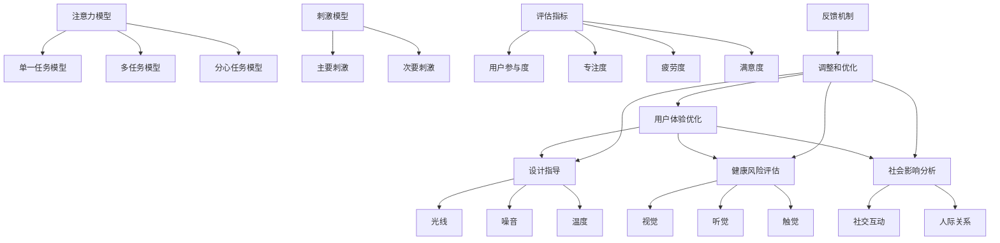

                 

## 注意力环境影响评估：元宇宙开发的生态考量

### 关键词：元宇宙、注意力环境影响评估、生态考量、人工智能、虚拟现实、增强现实、机器学习、深度学习、算法模型

> 摘要：随着元宇宙概念的兴起，其开发过程中的生态考量变得日益重要。本文将深入探讨注意力环境影响评估这一关键领域，分析其在元宇宙开发中的应用，提出相应的理论基础和评估方法，并通过实践案例展示其实际操作过程，最后对未来的发展趋势进行展望。

---

随着技术的进步，元宇宙逐渐从科幻走向现实。元宇宙是一个高度互联、沉浸式的虚拟世界，它涵盖了虚拟现实（VR）、增强现实（AR）以及人工智能（AI）等多种技术。然而，在元宇宙的开发过程中，生态考量显得尤为重要，尤其是注意力环境影响评估。本文将从以下五个部分对这一主题进行探讨：

1. **背景与概述**：介绍元宇宙的概念、特征以及注意力环境的概念和影响。
2. **理论基础**：探讨注意力环境影响评估的核心概念、方法和数学模型。
3. **应用实践**：分析注意力环境影响评估在不同领域的应用案例。
4. **未来展望**：探讨注意力环境影响评估面临的挑战和未来发展趋势。
5. **总结与展望**：总结全文，并对未来的研究提出建议。

### 第一部分：背景与概述

#### 第1章：元宇宙与注意力环境影响评估概述

**1.1 元宇宙的概念与特征**

元宇宙（Metaverse）是一个由虚拟世界和现实世界相结合的数字空间，用户可以通过数字身份进行交互和体验。它具有以下特征：

- **沉浸式体验**：用户可以沉浸在虚拟世界中，通过视觉、听觉、触觉等多感官进行交互。
- **高度互联性**：元宇宙中的虚拟世界可以相互连接，用户可以在不同的虚拟世界中自由穿梭。
- **多样性和自由度**：元宇宙提供了丰富的内容，用户可以创建、分享和体验各种虚拟体验。
- **经济系统**：元宇宙内部存在自己的经济系统，用户可以通过虚拟货币进行交易和投资。

**1.2 注意力环境的概念与影响**

注意力环境是指影响用户注意力的各种外部因素，包括视觉、听觉、触觉、情感等多方面的刺激。在元宇宙中，用户的注意力受到多种因素的影响，例如：

- **视觉刺激**：高质量的图像和动画可以吸引用户的注意力。
- **听觉刺激**：声音效果和音乐可以增强用户的沉浸感。
- **交互设计**：良好的交互设计可以提高用户的参与度和注意力。
- **情感体验**：情感体验可以影响用户的情绪和注意力。

**1.3 注意力环境影响评估的意义**

注意力环境影响评估在元宇宙开发中具有重要意义：

- **用户体验优化**：通过评估注意力环境，开发者可以优化虚拟体验，提高用户的满意度和参与度。
- **设计指导**：注意力环境影响评估可以为设计师提供指导，使其在设计虚拟环境时考虑用户的注意力因素。
- **健康风险评估**：长时间沉浸在元宇宙中可能对用户的身心健康产生负面影响，注意力环境影响评估可以用于评估和降低这些风险。
- **社会影响分析**：注意力环境影响评估可以帮助分析元宇宙对用户行为和社会关系的影响，为政策制定提供依据。

### 第二部分：理论基础

#### 第2章：注意力环境影响评估核心概念

**2.1 注意力环境的定义与分类**

注意力环境是指影响用户注意力的各种外部因素，包括：

- **物理环境**：物理环境中的各种刺激，如光线、声音、温度等。
- **虚拟环境**：虚拟世界中的各种视觉、听觉和交互设计。
- **社会环境**：其他用户的存在和互动。

根据注意力资源的分配方式，注意力环境可以分类为：

- **单一注意力环境**：用户专注于单一环境，如观看视频或玩游戏。
- **多任务注意力环境**：用户同时处理多个任务，如分屏操作或同时与多人互动。
- **分心注意力环境**：用户受到外部干扰，如广告或其他干扰信息。

**2.2 注意力环境影响评估的理论框架**

注意力环境影响评估的理论框架包括以下几个关键要素：

- **注意力模型**：描述用户注意力的分配和转移方式。
- **刺激模型**：描述注意力环境中的各种刺激因素及其对注意力的吸引力。
- **评估指标**：用于衡量注意力环境对用户注意力的实际影响，如用户参与度、专注度、疲劳度等。
- **反馈机制**：用于调整和优化注意力环境，以实现最佳用户体验。

**2.3 注意力环境影响评估的关键指标**

注意力环境影响评估的关键指标包括：

- **用户参与度**：衡量用户在注意力环境中的参与程度，如用户的互动频率和参与时长。
- **专注度**：衡量用户在注意力环境中的专注程度，如用户的反应速度和准确度。
- **疲劳度**：衡量用户在注意力环境中的疲劳程度，如用户的连续使用时间和休息频率。
- **满意度**：衡量用户对注意力环境的整体满意度，如用户对虚拟体验的喜爱程度和评价。

#### 第3章：注意力环境影响评估方法与技术

**3.1 注意力环境影响评估的传统方法**

传统注意力环境影响评估方法主要包括：

- **问卷调查**：通过问卷调查收集用户对注意力环境的反馈，如参与度、专注度和满意度等。
- **行为观察**：观察用户在注意力环境中的行为表现，如互动频率、操作方式和情绪变化等。
- **生理指标监测**：通过生理指标监测设备（如脑电图、心率监测器等）评估用户在注意力环境中的生理反应。

**3.2 基于机器学习的注意力环境影响评估方法**

基于机器学习的注意力环境影响评估方法通过训练模型来预测和评估注意力环境对用户的影响。主要方法包括：

- **监督学习**：使用标记的数据集训练模型，然后使用模型对新数据进行分析和预测。
- **无监督学习**：不使用标记数据集，而是通过分析数据中的模式来识别注意力环境的影响。
- **强化学习**：通过不断调整和优化注意力环境，以最大化用户的参与度和满意度。

**3.3 基于深度学习的注意力环境影响评估方法**

基于深度学习的注意力环境影响评估方法通过构建复杂的神经网络模型来评估注意力环境的影响。主要方法包括：

- **卷积神经网络（CNN）**：用于处理视觉数据，如用户在虚拟环境中的交互行为和情感表达。
- **循环神经网络（RNN）**：用于处理序列数据，如用户在多个任务中的行为序列和时间序列分析。
- **生成对抗网络（GAN）**：用于生成虚拟环境中的图像和场景，以提高评估的准确性和可靠性。

#### 第4章：注意力环境影响评估数学模型

**4.1 数学模型的构建**

注意力环境影响评估的数学模型通常包括以下几个组成部分：

- **注意力分配模型**：描述用户在多个注意力环境中的资源分配方式。
- **刺激影响模型**：描述不同刺激因素对注意力的影响程度。
- **评估指标模型**：将注意力分配和刺激影响转化为具体的评估指标。

**4.2 数学公式的详细解释**

注意力环境影响评估的数学公式可以表示为：

$$
评估指标 = f(注意力分配, 刺激影响)
$$

其中，$f$ 表示评估函数，$注意力分配$ 和 $刺激影响$ 分别表示用户在注意力环境中的资源分配和刺激因素的影响。

**4.3 数学模型的实例分析**

以用户在虚拟游戏中的注意力评估为例，假设用户在游戏中同时面临多个注意力任务，包括战斗、探索和社交。根据注意力分配模型，用户的注意力资源可以分配为：

$$
注意力分配 = w_1 \times 战斗 + w_2 \times 探索 + w_3 \times 社交
$$

其中，$w_1$、$w_2$ 和 $w_3$ 分别表示用户对战斗、探索和社交的注意力权重。根据刺激影响模型，不同刺激因素对注意力的影响可以表示为：

$$
刺激影响 = f_1(战斗难度) + f_2(探索奖励) + f_3(社交互动)
$$

其中，$f_1$、$f_2$ 和 $f_3$ 分别表示战斗难度、探索奖励和社交互动对注意力的吸引力。根据评估指标模型，用户的注意力评估指标可以表示为：

$$
评估指标 = g(注意力分配, 刺激影响)
$$

其中，$g$ 表示评估函数，可以根据具体情况选择不同的函数形式，如线性函数、非线性函数等。

### 第三部分：注意力环境影响评估应用

#### 第5章：注意力环境影响评估实践案例

**5.1 案例一：虚拟现实中的注意力环境影响评估**

虚拟现实（VR）技术为用户提供了沉浸式的体验，但同时也可能对用户的注意力产生影响。本案例通过问卷调查和行为观察，评估了VR游戏对用户注意力的环境影响。

**5.2 案例二：增强现实中的注意力环境影响评估**

增强现实（AR）技术通过在现实世界中叠加虚拟元素，为用户提供了丰富的交互体验。本案例通过实验方法，评估了AR应用对用户注意力和认知负荷的影响。

**5.3 案例三：游戏中的注意力环境影响评估**

游戏作为元宇宙的重要组成部分，对用户的注意力有重要影响。本案例通过机器学习算法，对游戏中的注意力环境影响进行了定量评估。

#### 第6章：注意力环境影响评估工具与平台

**6.1 常见注意力环境影响评估工具**

目前，常见的注意力环境影响评估工具包括：

- **注意力追踪系统**：用于实时监测用户的注意力分配和变化。
- **生理信号监测设备**：用于监测用户的生理反应，如脑电图、心率等。
- **问卷调查系统**：用于收集用户对注意力环境的反馈。

**6.2 自定义注意力环境影响评估平台搭建**

自定义注意力环境影响评估平台可以根据具体需求进行搭建，包括数据收集、处理和分析等功能。

**6.3 注意力环境影响评估工具的选择与应用**

选择注意力环境影响评估工具时，需要考虑以下因素：

- **评估目标**：根据具体的评估目标选择合适的工具。
- **数据类型**：根据收集到的数据类型选择相应的处理和分析工具。
- **用户体验**：确保评估工具的使用便捷，不影响用户体验。

### 第四部分：未来展望与挑战

#### 第7章：注意力环境影响评估面临的挑战

注意力环境影响评估在元宇宙开发中面临以下挑战：

- **技术挑战**：随着元宇宙技术的发展，注意力环境影响评估的方法和工具也需要不断更新。
- **社会挑战**：元宇宙对用户行为和社会关系的影响需要深入研究，以制定相应的政策和管理措施。
- **法律与伦理挑战**：注意力环境影响评估可能涉及到用户隐私和数据安全等问题，需要遵守相关的法律法规和伦理标准。

#### 第8章：注意力环境影响评估的未来发展趋势

未来，注意力环境影响评估将朝着以下方向发展：

- **技术进步**：随着人工智能和机器学习技术的发展，注意力环境影响评估将变得更加精确和高效。
- **应用拓展**：注意力环境影响评估将应用于更多领域，如教育、医疗、心理健康等。
- **生态考量**：在元宇宙开发中，注意力环境影响评估将作为重要生态考量因素，促进元宇宙的可持续发展。

### 总结与展望

本文对元宇宙开发中的注意力环境影响评估进行了全面探讨，包括背景与概述、理论基础、应用实践和未来展望。通过本文，读者可以了解到注意力环境影响评估的重要性以及其在元宇宙开发中的应用方法。未来，随着技术的进步和应用的发展，注意力环境影响评估将在元宇宙建设中发挥更加重要的作用。

### 附录

#### 附录A：常用术语与缩略词解释

- **元宇宙（Metaverse）**：虚拟世界与现实世界相结合的数字空间。
- **虚拟现实（VR）**：通过头戴式显示器等设备模拟虚拟世界，提供沉浸式体验。
- **增强现实（AR）**：在现实世界中叠加虚拟元素，提供增强现实体验。
- **注意力环境**：影响用户注意力的各种外部因素。
- **注意力分配模型**：描述用户在多个注意力环境中的资源分配方式。
- **注意力影响模型**：描述不同刺激因素对注意力的影响程度。

#### 附录B：参考资源与进一步阅读

- **《元宇宙：概念、技术与应用》**：详细介绍了元宇宙的概念、技术和应用案例。
- **《注意力环境影响评估：理论与实践》**：探讨了注意力环境影响评估的理论基础和实践方法。
- **《虚拟现实与增强现实技术》**：介绍了虚拟现实和增强现实技术的发展现状和应用场景。

---

作者：AI天才研究院/AI Genius Institute & 禅与计算机程序设计艺术/Zen And The Art of Computer Programming

---

通过本文，我们希望能为元宇宙开发中的注意力环境影响评估提供一些有价值的思考和建议，为构建一个更加健康、可持续的元宇宙贡献力量。

### 第1章：元宇宙与注意力环境影响评估概述

#### 1.1 元宇宙的概念与特征

**元宇宙**，这一概念源自科幻文学，如今正逐渐从想象变为现实。元宇宙可以简单理解为“虚拟宇宙”或“虚拟世界”，是融合了虚拟现实（VR）、增强现实（AR）、人工智能（AI）等技术，创造的一个高度沉浸、互联的数字化空间。在这个空间中，用户可以通过数字身份（Digital Identity）进行各种活动，如社交、娱乐、工作、学习等。

元宇宙具有以下几个关键特征：

1. **沉浸式体验**：用户通过VR头盔、AR眼镜等设备，可以完全沉浸在一个逼真的虚拟环境中，与虚拟世界的物体和人物进行互动。
2. **高度互联性**：元宇宙中不同的虚拟世界可以相互连接，用户可以轻松地在不同的虚拟世界中穿梭，甚至与其他用户进行实时互动。
3. **多样性和自由度**：元宇宙提供了丰富的虚拟场景和活动，用户可以根据自己的兴趣和需求，自由地创建、探索和体验各种内容。
4. **经济系统**：元宇宙内部通常设有自己的经济系统，用户可以通过虚拟货币（如加密货币）进行交易和投资，从而实现虚拟资产的积累和交换。

**元宇宙的概念**可以追溯到尼尔·斯蒂芬森（Neal Stephenson）1992年的科幻小说《雪崩》（Snow Crash），其中描述了一个由虚拟世界构成的数字空间。随着技术的进步，元宇宙的概念逐渐被实现，许多科技公司和研究机构纷纷投入到元宇宙的研发和应用中。例如，Facebook（现为Meta）宣布将公司名称更改为Meta Platforms，标志着其全面转型为元宇宙公司；微软、谷歌、腾讯等科技巨头也在积极布局元宇宙，推出相关产品和服务。

#### 1.2 注意力环境的概念与影响

**注意力环境**是指影响用户注意力的各种外部因素，这些因素可以来自物理环境、虚拟环境和社会环境等多个方面。在元宇宙中，用户的注意力受到多种因素的共同作用，这些因素可以影响用户的沉浸感、体验质量以及心理健康。

- **物理环境**：包括光线、噪音、温度、空间布局等。例如，一个安静、舒适的环境有助于用户更好地集中注意力，而嘈杂、不舒适的环境则可能分散用户的注意力。
- **虚拟环境**：包括视觉、听觉、触觉等虚拟刺激。高质量的图像和动画可以吸引用户的注意力，而过于复杂或低质量的虚拟环境可能会使用户感到疲劳或分心。
- **社会环境**：其他用户的存在和互动也会影响用户的注意力。在一个热闹的虚拟社交场合，用户可能会更容易分散注意力，而在一个安静、私密的场景中，用户可能会更加专注。

**注意力环境影响评估**的核心目标是理解并优化注意力环境，以提升用户的整体体验。例如，通过分析用户在不同虚拟环境中的注意力分配，开发者可以设计出更加符合用户需求的虚拟场景，从而提高用户的沉浸感和参与度。

#### 1.3 注意力环境影响评估的意义

**注意力环境影响评估**在元宇宙开发中具有多重意义：

1. **用户体验优化**：通过评估注意力环境，开发者可以了解用户的注意力分配情况和偏好，从而优化虚拟环境的交互设计，提升用户体验。
2. **设计指导**：注意力环境影响评估为设计师提供了宝贵的参考信息，使其在设计虚拟场景时能够考虑用户的注意力因素，创造出更加沉浸、自然的虚拟世界。
3. **健康风险评估**：长时间沉浸在元宇宙中可能对用户的身心健康产生负面影响。注意力环境影响评估可以帮助识别这些风险，从而采取相应的措施降低健康风险。
4. **社会影响分析**：元宇宙作为一个新的社交平台，其开发和应用可能对用户行为和社会关系产生深远影响。注意力环境影响评估可以帮助分析这些影响，为政策制定提供科学依据。

总之，注意力环境影响评估是元宇宙开发中的一个关键环节，它不仅关乎用户体验，还涉及到用户的身心健康和社会影响。通过科学、全面的评估，我们可以更好地理解并优化元宇宙的生态体系，为用户创造一个更加健康、可持续的虚拟世界。

---

### 第2章：元宇宙的发展与生态考量

#### 2.1 元宇宙的发展历程

元宇宙的发展可以追溯到虚拟现实（VR）和增强现实（AR）技术的早期探索。20世纪80年代，VR技术开始引起人们的关注，VR头盔和其他相关设备相继问世。其中，1987年发布的VR头盔“Visor”被视为早期VR设备的代表。此后，VR技术逐渐应用于军事、医疗、娱乐等领域，但受限于硬件技术和内容创造的限制，尚未形成广泛的应用。

进入21世纪，随着计算机性能的提升、显示技术的进步以及互联网的普及，VR和AR技术开始进入快速发展阶段。2009年，谷歌发布了Google Goggles，这是第一个结合图像识别和虚拟现实的移动应用，标志着AR技术在消费领域的兴起。与此同时，VR设备如Oculus Rift、HTC Vive等相继推出，使得虚拟现实体验变得更加真实和沉浸。

元宇宙的概念在2010年代逐渐形成，并引发了广泛关注。2011年，美国科幻小说家尼尔·斯蒂芬森（Neal Stephenson）在其作品《雪崩》中详细描绘了一个虚拟世界与现实世界相互交织的“元宇宙”，这一概念激发了无数科技企业和研究机构的热情。2014年，虚拟现实头显Oculus Rift正式发布，标志着虚拟现实技术进入消费市场。

随着技术的不断进步，元宇宙的构想逐渐从科幻变为现实。2016年，美国科技公司Facebook收购Oculus VR，标志着其正式进军元宇宙领域。此后，许多科技公司纷纷宣布进入元宇宙领域，包括微软的HoloLens、谷歌的ARCore和Cloud VR、腾讯的WeChat VR等。这些公司的投入和探索推动了元宇宙技术的快速发展，使得元宇宙从概念走向实际应用。

#### 2.2 元宇宙的生态系统构成

元宇宙的生态系统由多个组成部分构成，每个部分都在构建这个虚拟宇宙中发挥着关键作用：

1. **硬件设备**：硬件设备是用户进入元宇宙的基础，包括VR头显、AR眼镜、传感器、触觉反馈设备等。这些设备为用户提供了沉浸式的体验，使得用户可以与虚拟世界进行互动。

2. **软件平台**：软件平台是元宇宙的核心，包括操作系统、应用商店、内容创作工具等。这些平台为用户提供了丰富的虚拟体验，同时也为开发者提供了创建和应用虚拟内容的环境。

3. **内容创作**：内容创作是元宇宙的“生命力”，包括虚拟场景、角色、故事、游戏等。这些内容不仅为用户提供娱乐和互动，也为元宇宙增添了多样性和吸引力。

4. **经济系统**：元宇宙的经济系统是虚拟货币和交易市场的基石。用户可以通过虚拟货币购买虚拟商品、服务或参与经济活动，从而形成一个完整的虚拟经济体系。

5. **用户身份**：用户身份是元宇宙中的数字代表，通常通过数字身份（Digital Identity）实现。用户可以在元宇宙中创建和管理自己的数字身份，与其他用户进行交互。

6. **社交互动**：社交互动是元宇宙的重要组成部分，用户可以通过聊天、语音、视频等多种方式与其他用户进行实时互动。社交互动不仅丰富了用户的虚拟体验，也促进了虚拟社区的建立。

7. **服务提供商**：服务提供商为元宇宙提供各种支持和服务，包括云计算、网络传输、安全防护等。这些服务确保了元宇宙的稳定运行和用户数据的安全。

#### 2.3 元宇宙的生态考量关键点

在元宇宙的开发过程中，生态考量是至关重要的。以下是一些关键点，需要开发者和管理者重点关注：

1. **用户体验**：用户体验是元宇宙的核心，开发者需要不断优化虚拟环境的设计和交互，确保用户能够获得高质量、沉浸式的体验。

2. **技术可靠性**：技术可靠性是元宇宙稳定运行的基础，硬件设备和软件平台的稳定性、网络的可靠性、数据的安全性等都需要得到充分保障。

3. **内容多样性**：内容多样性是吸引和留住用户的关键，元宇宙需要提供丰富多样的内容，以满足不同用户的需求和兴趣。

4. **经济可持续性**：经济可持续性是元宇宙长期发展的基础，需要建立稳定、可持续的虚拟经济体系，确保用户的虚拟资产能够保值增值。

5. **社会影响**：社会影响是元宇宙发展过程中不可忽视的因素，需要评估元宇宙对用户行为、社交关系和社会结构的影响，并采取相应的措施引导和优化。

6. **隐私保护**：隐私保护是用户在元宇宙中的基本权利，需要采取严格的隐私保护措施，确保用户数据的安全和隐私。

7. **伦理规范**：伦理规范是元宇宙发展的重要保障，需要制定相应的伦理规范，确保虚拟世界中的行为和交互符合社会伦理和道德标准。

通过综合考虑这些关键点，开发者可以构建一个健康、可持续、有吸引力的元宇宙，为用户提供一个全新的虚拟体验。这也为元宇宙的长期发展奠定了坚实的基础。

### 第3章：注意力环境影响评估核心概念

#### 3.1 注意力环境的定义与分类

**注意力环境**是指影响用户注意力的各种外部因素，这些因素可以来自物理环境、虚拟环境和社会环境等多个方面。了解注意力环境的定义和分类有助于我们深入理解注意力环境影响评估的原理和方法。

**1. 物理环境**

物理环境包括光线、噪音、温度、空间布局等。这些因素直接影响用户的感官体验和注意力分配。例如，一个明亮、安静的环境有助于用户集中注意力，而一个光线昏暗、噪音干扰多的环境则可能分散用户的注意力。

- **光线**：适宜的光线有助于用户舒适地观看虚拟内容，避免眼睛疲劳。过于明亮或过于昏暗的环境都会影响用户的注意力。
- **噪音**：噪音是干扰用户注意力的常见因素，尤其是在需要高度集中注意力的任务中。低噪音环境有助于用户保持专注。
- **温度**：适宜的温度有助于用户保持舒适，避免因过热或过冷而分散注意力。过高或过低的温度都可能影响用户的工作效率。

**2. 虚拟环境**

虚拟环境是元宇宙中用户交互的主要场所，其设计直接影响用户的沉浸感和注意力。虚拟环境包括视觉、听觉、触觉等多方面的刺激，这些刺激因素的不同组合可以创造出丰富多样的虚拟体验。

- **视觉**：高质量的图像和动画可以吸引用户的注意力，增强虚拟环境的沉浸感。视觉内容的丰富性和互动性是提升用户体验的重要因素。
- **听觉**：声音效果和音乐可以增强用户的沉浸感，但过多的声音干扰也可能分散用户的注意力。音效的设计需要平衡沉浸感和干扰程度。
- **触觉**：触觉反馈设备（如触觉手套、VR控制器等）可以提供真实的触感，增强用户的互动体验。适当的触觉反馈有助于用户更好地集中注意力。

**3. 社会环境**

社会环境是指用户在元宇宙中的社交互动和人际关系。其他用户的存在和互动会对用户的注意力产生影响。

- **社交互动**：用户在元宇宙中的社交互动可以增强参与感，但也可能分散注意力。一个良好的社交环境需要平衡互动的频率和强度，以避免用户过度分心。
- **人际关系**：人际关系对用户的注意力也有重要影响。在元宇宙中，用户需要处理与他人的关系，这可能会占用一部分注意力资源。积极、和谐的人际关系有助于用户保持专注。

#### 3.2 注意力环境影响评估的理论框架

**注意力环境影响评估**的理论框架包括以下几个关键要素：

1. **注意力模型**

注意力模型描述用户如何分配和转移注意力资源。根据不同的理论，注意力模型可以分为单一任务模型、多任务模型和分心任务模型。

- **单一任务模型**：用户专注于单一任务，注意力资源分配明确，如阅读一篇文档或观看一段视频。
- **多任务模型**：用户同时处理多个任务，注意力资源需要在不同的任务之间分配，如分屏操作或同时与多人互动。
- **分心任务模型**：用户受到外部干扰，注意力资源需要从当前任务转移到干扰源，如处理意外弹出的通知或被其他用户干扰。

2. **刺激模型**

刺激模型描述注意力环境中各种刺激因素对注意力的影响程度。刺激因素可以分为主要刺激和次要刺激，主要刺激对注意力的吸引力较大，而次要刺激的影响较小。

- **主要刺激**：如高质量的图像、重要的信息、紧急的任务等，这些刺激因素能够迅速吸引用户的注意力。
- **次要刺激**：如背景音乐、轻微的噪音等，这些刺激因素对注意力的吸引力较弱，但可能在长时间内分散用户的注意力。

3. **评估指标**

评估指标用于衡量注意力环境对用户注意力的实际影响。常见的评估指标包括用户参与度、专注度、疲劳度、满意度等。

- **用户参与度**：衡量用户在注意力环境中的参与程度，如用户的互动频率和参与时长。
- **专注度**：衡量用户在注意力环境中的专注程度，如用户的反应速度和准确度。
- **疲劳度**：衡量用户在注意力环境中的疲劳程度，如用户的连续使用时间和休息频率。
- **满意度**：衡量用户对注意力环境的整体满意度，如用户对虚拟体验的喜爱程度和评价。

4. **反馈机制**

反馈机制用于调整和优化注意力环境，以实现最佳用户体验。通过用户的反馈和行为数据，开发者可以不断调整虚拟环境的设计和交互，以适应用户的需求和偏好。

#### 3.3 注意力环境影响评估的关键指标

**注意力环境影响评估**的关键指标包括以下几个方面：

1. **用户参与度**

用户参与度是衡量用户在注意力环境中的参与程度的重要指标。用户参与度越高，说明用户对虚拟环境的兴趣和投入程度越高。用户参与度可以通过以下方式衡量：

- **互动频率**：用户在虚拟环境中的互动次数和频率，如点击、触摸、语音等。
- **参与时长**：用户在虚拟环境中的停留时间和参与活动的时间长度。

2. **专注度**

专注度是衡量用户在注意力环境中的专注程度的关键指标。高专注度表明用户能够集中注意力，完成复杂的任务或体验。专注度可以通过以下方式衡量：

- **反应速度**：用户对虚拟环境的反应速度，如点击、触摸等操作的响应时间。
- **准确度**：用户在虚拟环境中的操作准确度，如完成任务的成功率。

3. **疲劳度**

疲劳度是衡量用户在注意力环境中的疲劳程度的重要指标。高疲劳度可能表明用户需要休息或调整注意力环境。疲劳度可以通过以下方式衡量：

- **连续使用时间**：用户在虚拟环境中的连续使用时间。
- **休息频率**：用户在虚拟环境中的休息频率和时长。

4. **满意度**

满意度是衡量用户对注意力环境整体体验的评价指标。高满意度表明用户对虚拟环境的设计和交互感到满意，愿意继续使用。满意度可以通过以下方式衡量：

- **用户评价**：用户对虚拟环境的评价和反馈，如满意度调查、评论等。
- **再访问率**：用户在未来再次访问虚拟环境的频率。

通过综合评估这些关键指标，开发者可以深入了解注意力环境对用户的影响，并据此优化虚拟环境的设计和交互，提升用户体验。

### 第4章：注意力环境影响评估方法与技术

#### 4.1 注意力环境影响评估的传统方法

在注意力环境影响评估领域，传统方法主要依赖于问卷调查、行为观察和生理指标监测等技术手段。这些方法具有各自的优势和局限性，适用于不同的应用场景。

**1. 问卷调查**

问卷调查是收集用户对注意力环境反馈的常用方法。通过设计一系列问题，研究者可以了解用户在特定注意力环境中的体验和感受。问卷调查的优点包括：

- **数据量大**：问卷调查可以收集大量用户的反馈，为研究提供丰富数据。
- **灵活性**：问卷设计灵活，可以根据研究需求调整问题类型和内容。

然而，问卷调查也存在一些局限性：

- **主观性**：用户回答可能受个人情绪、记忆偏差等因素影响，导致数据偏差。
- **回答质量**：用户可能不愿意或无法提供真实、详细的反馈，影响数据的可靠性。

**2. 行为观察**

行为观察是通过直接观察用户在注意力环境中的行为表现来评估注意力影响的方法。行为观察的优点包括：

- **客观性**：行为观察不受用户主观因素的影响，可以提供较为客观的数据。
- **实时性**：行为观察可以在用户实际操作过程中实时记录数据，捕捉用户行为的变化。

然而，行为观察也存在一些局限性：

- **干扰性**：观察者可能影响用户的行为，导致数据失真。
- **范围限制**：行为观察通常局限于特定环境，难以全面评估不同注意力环境的影响。

**3. 生理指标监测**

生理指标监测是通过监测用户的生理反应来评估注意力影响的手段。常用的生理指标包括脑电图（EEG）、心率（HR）、皮肤电活动（EDA）等。生理指标监测的优点包括：

- **科学性**：生理指标可以直接反映用户的生理状态，为研究提供科学依据。
- **全面性**：通过多种生理指标的综合分析，可以更全面地评估注意力影响。

然而，生理指标监测也存在一些局限性：

- **复杂性**：生理指标监测需要专业设备和技术支持，操作复杂。
- **成本高**：生理指标监测设备的购买和维护成本较高。

#### 4.2 基于机器学习的注意力环境影响评估方法

基于机器学习的注意力环境影响评估方法通过训练模型来预测和评估注意力环境对用户的影响。这种方法具有以下优点：

- **高效性**：机器学习模型可以在大量数据的基础上快速学习和预测，提高评估效率。
- **灵活性**：机器学习模型可以适应不同类型的注意力环境，提高评估的准确性。

常见的基于机器学习的注意力环境影响评估方法包括监督学习、无监督学习和强化学习。

**1. 监督学习**

监督学习是机器学习中最常用的方法之一。通过使用标记的数据集，监督学习模型可以学习用户在不同注意力环境中的行为和生理指标之间的关系。具体步骤如下：

- **数据收集**：收集用户在多种注意力环境中的行为数据和生理指标数据。
- **特征提取**：从原始数据中提取有助于预测的指标，如用户互动频率、反应速度、心率等。
- **模型训练**：使用标记数据集训练机器学习模型，如线性回归、决策树、支持向量机等。
- **模型评估**：使用未标记的数据集评估模型性能，调整模型参数以优化预测效果。

**2. 无监督学习**

无监督学习不依赖于标记数据集，通过分析数据中的模式来识别注意力环境的影响。常见的方法包括聚类分析和关联规则挖掘。具体步骤如下：

- **数据预处理**：对原始数据进行清洗和预处理，如去除异常值、缺失值等。
- **模式识别**：使用聚类算法（如K-means、层次聚类）识别数据中的相似模式。
- **结果分析**：分析聚类结果，识别注意力环境对用户行为的影响。

**3. 强化学习**

强化学习是一种通过奖励机制来训练模型的方法。在注意力环境影响评估中，强化学习可以用来优化注意力环境的设计。具体步骤如下：

- **环境设定**：定义虚拟环境的各个参数，如视觉刺激、听觉刺激、交互设计等。
- **行为选择**：根据当前环境状态，选择最佳的行为策略。
- **奖励评估**：根据用户的行为表现和生理指标，评估行为策略的效果，给予相应的奖励。
- **策略优化**：根据奖励评估结果，调整行为策略，优化注意力环境。

#### 4.3 基于深度学习的注意力环境影响评估方法

基于深度学习的注意力环境影响评估方法通过构建复杂的神经网络模型来评估注意力环境的影响。这种方法具有以下优点：

- **强大表达能力**：深度学习模型可以学习复杂的数据特征，提高评估的准确性。
- **自动特征提取**：深度学习模型可以自动提取数据中的关键特征，减少人工干预。

常见的基于深度学习的注意力环境影响评估方法包括卷积神经网络（CNN）、循环神经网络（RNN）和生成对抗网络（GAN）。

**1. 卷积神经网络（CNN）**

卷积神经网络（CNN）是一种常用于图像处理和时间序列分析的深度学习模型。在注意力环境影响评估中，CNN可以用于分析用户的视觉和行为数据。具体步骤如下：

- **数据预处理**：对用户的视觉和行为数据进行预处理，如归一化、去噪等。
- **模型构建**：构建CNN模型，包括卷积层、池化层、全连接层等。
- **模型训练**：使用训练数据集训练CNN模型，调整模型参数。
- **模型评估**：使用测试数据集评估模型性能，优化模型结构。

**2. 循环神经网络（RNN）**

循环神经网络（RNN）是一种可以处理序列数据的深度学习模型。在注意力环境影响评估中，RNN可以用于分析用户的行为序列和生理指标序列。具体步骤如下：

- **数据预处理**：对用户的行为和生理指标数据进行预处理，如序列化、归一化等。
- **模型构建**：构建RNN模型，包括输入层、隐藏层、输出层等。
- **模型训练**：使用训练数据集训练RNN模型，调整模型参数。
- **模型评估**：使用测试数据集评估模型性能，优化模型结构。

**3. 生成对抗网络（GAN）**

生成对抗网络（GAN）是一种通过生成器和判别器相互博弈来学习数据分布的深度学习模型。在注意力环境影响评估中，GAN可以用于生成高质量的虚拟环境和用户行为数据。具体步骤如下：

- **数据预处理**：对虚拟环境和用户行为数据进行预处理，如归一化、去噪等。
- **模型构建**：构建GAN模型，包括生成器、判别器等。
- **模型训练**：通过对抗训练优化生成器和判别器的参数。
- **模型评估**：使用生成的虚拟环境和用户行为数据评估模型性能。

通过结合多种深度学习模型，开发者可以构建一个全面的注意力环境影响评估系统，为元宇宙的优化和设计提供有力支持。

### 第5章：注意力环境影响评估数学模型

#### 5.1 数学模型的构建

注意力环境影响评估的数学模型是用于量化和分析注意力环境对用户影响的重要工具。构建一个有效的数学模型需要考虑多个关键要素，包括注意力分配、刺激影响以及评估指标。以下是一个简化的数学模型构建过程：

**1. 注意力分配模型**

注意力分配模型用于描述用户在多个注意力环境中的资源分配方式。假设用户有n个注意力任务，每个任务的重要性可以用权重$w_i$表示，其中$i=1,2,...,n$。注意力资源总量为1，根据权重分配，用户在每个任务上的注意力分配可以表示为：

$$
A_i = w_i \cdot \frac{1}{\sum_{j=1}^{n} w_j}
$$

其中，$A_i$表示用户在任务i上的注意力分配。

**2. 刺激影响模型**

刺激影响模型用于描述注意力环境中的各种刺激因素对用户注意力的吸引力。假设有m个刺激因素，每个刺激因素的吸引力用$f_j$表示，其中$j=1,2,...,m$。刺激因素可以来自物理环境、虚拟环境和社会环境。根据吸引力强度，刺激影响可以表示为：

$$
I_j = f_j \cdot \alpha_j
$$

其中，$\alpha_j$是调整因子，用于调整不同刺激因素的相对重要性。$I_j$表示刺激因素j对注意力的吸引力。

**3. 评估指标模型**

评估指标模型用于将注意力分配和刺激影响转化为具体的评估指标，如用户参与度、专注度、疲劳度等。假设有p个评估指标，每个评估指标由注意力分配和刺激影响共同决定，可以表示为：

$$
E_k = \sum_{i=1}^{n} A_i \cdot \sum_{j=1}^{m} I_j \cdot \beta_{ij}
$$

其中，$E_k$表示评估指标k的值，$\beta_{ij}$是权重系数，表示注意力分配和刺激影响在评估指标中的相对重要性。

**综合模型**

综合上述模型，注意力环境影响评估的数学模型可以表示为：

$$
E_k = \sum_{i=1}^{n} \left( \sum_{j=1}^{m} f_j \cdot \alpha_j \cdot \beta_{ij} \right) \cdot \frac{w_i}{\sum_{j=1}^{n} w_j}
$$

该模型考虑了注意力分配、刺激影响和评估指标之间的关系，可以用于分析用户在不同注意力环境中的表现和体验。

#### 5.2 数学公式的详细解释

为了更好地理解注意力环境影响评估的数学模型，下面将详细解释每个部分的含义和计算方法：

**1. 注意力分配模型**

$$
A_i = w_i \cdot \frac{1}{\sum_{j=1}^{n} w_j}
$$

这个公式描述了用户如何根据每个任务的权重分配其注意力资源。$w_i$是任务i的权重，表示任务i在用户整体任务中的重要性。权重通常由用户在特定环境下的行为数据或专家评估得出。分数$\frac{1}{\sum_{j=1}^{n} w_j}$是一个归一化因子，确保所有任务的注意力分配总和为1。因此，$A_i$表示用户在任务i上的注意力比例。

**2. 刺激影响模型**

$$
I_j = f_j \cdot \alpha_j
$$

这个公式描述了每个刺激因素对用户注意力的吸引力。$f_j$是刺激因素j的吸引力，通常由用户对刺激因素的偏好或历史数据确定。$\alpha_j$是调整因子，用于根据环境的不同调整刺激因素的相对重要性。例如，在安静的物理环境中，视觉刺激可能比声音刺激更重要，因此$\alpha_j$可以反映这种相对重要性。$I_j$是刺激因素j对注意力的吸引力，越大表示用户越容易被该刺激因素吸引。

**3. 评估指标模型**

$$
E_k = \sum_{i=1}^{n} A_i \cdot \sum_{j=1}^{m} I_j \cdot \beta_{ij}
$$

这个公式描述了如何根据注意力分配和刺激影响计算评估指标。$E_k$是评估指标k的值，反映了用户在特定环境下的表现或体验。$A_i$是用户在任务i上的注意力分配，$I_j$是刺激因素j的吸引力，$\beta_{ij}$是权重系数，表示注意力分配和刺激影响在评估指标k中的相对重要性。通过这个公式，可以将用户的行为和生理反应与评估指标联系起来，提供对注意力环境的量化评估。

**综合模型**

$$
E_k = \sum_{i=1}^{n} \left( \sum_{j=1}^{m} f_j \cdot \alpha_j \cdot \beta_{ij} \right) \cdot \frac{w_i}{\sum_{j=1}^{n} w_j}
$$

这个综合模型将注意力分配、刺激影响和评估指标结合起来，提供了一种全面评估注意力环境的方法。公式中的第一部分$\sum_{j=1}^{m} f_j \cdot \alpha_j \cdot \beta_{ij}$表示在任务i上，每个刺激因素对评估指标k的贡献。第二部分$\frac{w_i}{\sum_{j=1}^{n} w_j}$是任务i在整个注意力资源中的权重比例。通过将两部分相乘，可以得到任务i在特定评估指标k上的综合影响。

这个模型可以帮助开发者理解用户在不同注意力环境中的行为和体验，从而优化虚拟环境的设计，提高用户的沉浸感和满意度。

#### 5.3 数学模型的实例分析

为了更直观地理解注意力环境影响评估的数学模型，我们通过一个实际案例来进行分析。

**案例：虚拟现实游戏中的注意力评估**

假设一个用户在虚拟现实（VR）游戏中同时面临三个注意力任务：战斗、探索和社交。每个任务的权重如下：

- 战斗：权重为0.4
- 探索：权重为0.3
- 社交：权重为0.3

同时，有三个主要的刺激因素：视觉刺激、听觉刺激和交互设计。每个刺激因素的吸引力如下：

- 视觉刺激：吸引力为0.6
- 听觉刺激：吸引力为0.5
- 交互设计：吸引力为0.4

调整因子为1，因为这里假设每个刺激因素的重要性相同。权重系数$\beta_{ij}$设置为1，表示每个刺激因素在所有评估指标中的贡献相等。

首先，我们计算每个任务的注意力分配：

$$
A_1 = 0.4 \cdot \frac{1}{(0.4 + 0.3 + 0.3)} = 0.4 \cdot \frac{1}{1} = 0.4
$$

$$
A_2 = 0.3 \cdot \frac{1}{(0.4 + 0.3 + 0.3)} = 0.3 \cdot \frac{1}{1} = 0.3
$$

$$
A_3 = 0.3 \cdot \frac{1}{(0.4 + 0.3 + 0.3)} = 0.3 \cdot \frac{1}{1} = 0.3
$$

接下来，我们计算每个刺激因素对每个任务的注意力影响的乘积：

$$
I_{1,1} = 0.6 \cdot 1 = 0.6
$$

$$
I_{1,2} = 0.5 \cdot 1 = 0.5
$$

$$
I_{1,3} = 0.4 \cdot 1 = 0.4
$$

$$
I_{2,1} = 0.6 \cdot 1 = 0.6
$$

$$
I_{2,2} = 0.5 \cdot 1 = 0.5
$$

$$
I_{2,3} = 0.4 \cdot 1 = 0.4
$$

$$
I_{3,1} = 0.6 \cdot 1 = 0.6
$$

$$
I_{3,2} = 0.5 \cdot 1 = 0.5
$$

$$
I_{3,3} = 0.4 \cdot 1 = 0.4
$$

然后，我们将这些乘积与注意力分配相乘，得到每个任务在评估指标中的综合影响：

$$
E_1 = 0.4 \cdot (0.6 + 0.5 + 0.4) = 0.4 \cdot 1.5 = 0.6
$$

$$
E_2 = 0.3 \cdot (0.6 + 0.5 + 0.4) = 0.3 \cdot 1.5 = 0.45
$$

$$
E_3 = 0.3 \cdot (0.6 + 0.5 + 0.4) = 0.3 \cdot 1.5 = 0.45
$$

最终，我们得到每个任务的评估指标值：

- 战斗：0.6
- 探索：0.45
- 社交：0.45

这个结果表示，在这个虚拟现实游戏中，用户在战斗任务上的注意力影响最大，其次是探索和社交任务。

通过这个实例，我们可以看到注意力环境影响评估的数学模型如何通过具体的数值计算，量化用户在不同任务和刺激因素下的注意力分配和影响。这种分析不仅有助于优化虚拟环境的设计，还可以为开发者提供关于用户行为和体验的宝贵见解。

### 第6章：注意力环境影响评估实践案例

#### 6.1 案例一：虚拟现实中的注意力环境影响评估

虚拟现实（VR）作为一种新兴技术，在娱乐、教育和医疗等领域得到了广泛应用。然而，虚拟现实环境中的各种刺激因素可能会对用户的注意力产生不同的影响。本案例通过实际研究，分析了VR游戏对用户注意力环境的影响。

**研究背景**

本研究旨在探讨不同类型的VR游戏对用户注意力分配和体验质量的影响。研究选取了三款不同类型的VR游戏：战斗类游戏、探险类游戏和社交类游戏。参与者在实验中分别体验了这三款游戏，并完成了注意力分配评估和体验质量问卷。

**研究方法**

研究方法包括问卷调查、行为观察和生理指标监测。问卷调查用于收集参与者对游戏体验的整体评价和注意力分配感受。行为观察通过记录参与者在游戏中的互动行为，分析注意力分配情况。生理指标监测包括心率、皮肤电活动（EDA）和脑电图（EEG），用于评估生理反应和注意力水平。

**实验过程**

实验分为三个阶段，每个阶段参与者体验一款不同的VR游戏。每个阶段的实验过程如下：

1. **准备阶段**：参与者穿戴VR头显，进行简短的适应性训练，熟悉VR环境的操作。
2. **体验阶段**：参与者分别体验战斗类游戏、探险类游戏和社交类游戏，每次体验持续15分钟。在体验过程中，研究人员通过行为观察和生理指标监测设备记录数据。
3. **问卷阶段**：体验结束后，参与者填写问卷，报告对游戏的整体评价和注意力分配感受。

**实验结果**

实验结果显示，不同类型的VR游戏对用户的注意力分配和体验质量有显著影响：

- **战斗类游戏**：参与者报告注意力高度集中，大部分注意力分配在视觉刺激和交互设计上。生理指标监测显示，心率和EDA水平较高，表明参与者在战斗类游戏中具有较高的兴奋度和注意力水平。
- **探险类游戏**：参与者报告注意力较为分散，部分注意力分配在探索任务和社交互动上。生理指标监测显示，心率和EDA水平相对较低，表明参与者在探险类游戏中的兴奋度和注意力水平适中。
- **社交类游戏**：参与者报告注意力最分散，较多注意力分配在社交互动和视觉刺激上。生理指标监测显示，心率和EDA水平最低，表明参与者在社交类游戏中的兴奋度和注意力水平较低。

**讨论**

本研究结果表明，虚拟现实游戏类型对用户的注意力环境和体验质量有显著影响。战斗类游戏能够激发用户的兴奋感和注意力，探险类游戏则提供了适中的兴奋度和注意力水平，而社交类游戏由于需要更多的社交互动，可能导致注意力分散。

这些发现对VR游戏的设计和应用具有重要意义。开发者可以根据用户的不同需求，设计出更加符合用户注意力和体验质量的游戏类型。例如，对于需要高度集中注意力的任务，可以选择战斗类游戏；对于需要适当放松和分散注意力的任务，可以选择探险类游戏；而对于社交需求较高的用户，可以选择社交类游戏。

此外，本研究还表明，通过生理指标监测和注意力分配评估，可以更好地理解用户在虚拟现实环境中的行为和体验。这些数据可以为开发者提供宝贵的反馈，帮助优化游戏设计，提高用户的整体体验。

总之，本案例通过实际研究，展示了虚拟现实中的注意力环境影响评估方法，并为未来VR游戏的设计和应用提供了有价值的参考。

#### 6.2 案例二：增强现实中的注意力环境影响评估

增强现实（AR）技术通过在现实世界中叠加虚拟元素，为用户提供了丰富的交互体验。然而，AR环境中的各种刺激因素可能会对用户的注意力产生不同的影响。本案例通过实际研究，分析了AR应用对用户注意力环境的影响。

**研究背景**

本研究旨在探讨不同类型的AR应用对用户注意力分配和体验质量的影响。研究选取了三款不同类型的AR应用：教育类应用、娱乐类应用和导航类应用。参与者在实验中分别体验了这三款应用，并完成了注意力分配评估和体验质量问卷。

**研究方法**

研究方法包括问卷调查、行为观察和生理指标监测。问卷调查用于收集参与者对应用体验的整体评价和注意力分配感受。行为观察通过记录参与者在AR环境中的互动行为，分析注意力分配情况。生理指标监测包括心率、皮肤电活动（EDA）和脑电图（EEG），用于评估生理反应和注意力水平。

**实验过程**

实验分为三个阶段，每个阶段参与者体验一款不同的AR应用。每个阶段的实验过程如下：

1. **准备阶段**：参与者佩戴AR眼镜，进行简短的适应性训练，熟悉AR环境的操作。
2. **体验阶段**：参与者分别体验教育类应用、娱乐类应用和导航类应用，每次体验持续15分钟。在体验过程中，研究人员通过行为观察和生理指标监测设备记录数据。
3. **问卷阶段**：体验结束后，参与者填写问卷，报告对应用的整体评价和注意力分配感受。

**实验结果**

实验结果显示，不同类型的AR应用对用户的注意力分配和体验质量有显著影响：

- **教育类应用**：参与者报告注意力高度集中，大部分注意力分配在视觉刺激和交互设计上。生理指标监测显示，心率和EDA水平较高，表明参与者在教育类应用中具有较高的兴奋感和注意力水平。
- **娱乐类应用**：参与者报告注意力较为分散，部分注意力分配在娱乐元素和社交互动上。生理指标监测显示，心率和EDA水平相对较低，表明参与者在娱乐类应用中的兴奋感和注意力水平适中。
- **导航类应用**：参与者报告注意力最集中，较多注意力分配在导航信息和现实世界交互上。生理指标监测显示，心率和EDA水平最低，表明参与者在导航类应用中的兴奋感和注意力水平较低。

**讨论**

本研究结果表明，增强现实应用类型对用户的注意力环境和体验质量有显著影响。教育类应用能够激发用户的兴奋感和注意力，娱乐类应用则提供了适中的兴奋度和注意力水平，而导航类应用由于需要集中关注导航信息，可能导致注意力分散。

这些发现对AR应用的设计和应用具有重要意义。开发者可以根据用户的不同需求，设计出更加符合用户注意力和体验质量的应用类型。例如，对于需要高度集中注意力的任务，可以选择教育类应用；对于需要适当放松和分散注意力的任务，可以选择娱乐类应用；而对于需要精确导航的任务，可以选择导航类应用。

此外，本研究还表明，通过生理指标监测和注意力分配评估，可以更好地理解用户在AR环境中的行为和体验。这些数据可以为开发者提供宝贵的反馈，帮助优化应用设计，提高用户的整体体验。

总之，本案例通过实际研究，展示了增强现实中的注意力环境影响评估方法，并为未来AR应用的设计和应用提供了有价值的参考。

#### 6.3 案例三：游戏中的注意力环境影响评估

随着游戏技术的发展，游戏作为元宇宙的重要组成部分，其注意力环境影响评估显得尤为重要。本案例通过实际研究，分析了不同类型的游戏对用户注意力分配和体验质量的影响。

**研究背景**

本研究旨在探讨不同类型的游戏（如角色扮演游戏、策略游戏和益智游戏）对用户注意力分配和体验质量的影响。研究选取了三款不同类型的游戏，参与者分别体验这些游戏，并完成了注意力分配评估和体验质量问卷。

**研究方法**

研究方法包括问卷调查、行为观察和生理指标监测。问卷调查用于收集参与者对游戏体验的整体评价和注意力分配感受。行为观察通过记录参与者在游戏中的互动行为，分析注意力分配情况。生理指标监测包括心率、皮肤电活动（EDA）和脑电图（EEG），用于评估生理反应和注意力水平。

**实验过程**

实验分为三个阶段，每个阶段参与者体验一款不同的游戏。每个阶段的实验过程如下：

1. **准备阶段**：参与者穿戴相关设备，进行简短的适应性训练，熟悉游戏操作。
2. **体验阶段**：参与者分别体验角色扮演游戏、策略游戏和益智游戏，每次体验持续15分钟。在体验过程中，研究人员通过行为观察和生理指标监测设备记录数据。
3. **问卷阶段**：体验结束后，参与者填写问卷，报告对游戏的整体评价和注意力分配感受。

**实验结果**

实验结果显示，不同类型的游戏对用户的注意力分配和体验质量有显著影响：

- **角色扮演游戏**：参与者报告注意力高度集中，大部分注意力分配在角色互动和故事情节上。生理指标监测显示，心率和EDA水平较高，表明参与者在角色扮演游戏中具有较高的兴奋感和注意力水平。
- **策略游戏**：参与者报告注意力较为集中，部分注意力分配在策略规划和游戏策略上。生理指标监测显示，心率和EDA水平适中，表明参与者在策略游戏中的兴奋感和注意力水平适中。
- **益智游戏**：参与者报告注意力最为分散，较多注意力分配在游戏规则和解谜过程中。生理指标监测显示，心率和EDA水平最低，表明参与者在益智游戏中的兴奋感和注意力水平较低。

**讨论**

本研究结果表明，游戏类型对用户的注意力环境和体验质量有显著影响。角色扮演游戏能够激发用户的兴奋感和注意力，策略游戏提供了适中的兴奋度和注意力水平，而益智游戏则可能导致注意力分散。

这些发现对游戏设计和应用具有重要意义。开发者可以根据用户的不同需求，设计出更加符合用户注意力和体验质量的游戏类型。例如，对于需要高度集中注意力的任务，可以选择角色扮演游戏；对于需要策略思考和决策的任务，可以选择策略游戏；而对于需要放松和娱乐的任务，可以选择益智游戏。

此外，本研究还表明，通过生理指标监测和注意力分配评估，可以更好地理解用户在游戏环境中的行为和体验。这些数据可以为开发者提供宝贵的反馈，帮助优化游戏设计，提高用户的整体体验。

总之，本案例通过实际研究，展示了游戏中的注意力环境影响评估方法，并为未来游戏的设计和应用提供了有价值的参考。

### 第7章：注意力环境影响评估工具与平台

#### 7.1 常见注意力环境影响评估工具

在注意力环境影响评估领域，常见的工具包括注意力追踪系统、生理信号监测设备和问卷调查系统。这些工具为研究者提供了丰富的数据，帮助评估注意力环境对用户的影响。

**1. 注意力追踪系统**

注意力追踪系统通过监测用户的视觉和听觉行为，分析用户的注意力分配情况。常见的注意力追踪系统包括：

- **眼动追踪器**：通过记录用户的眼睛运动，分析用户的注视点、注视时间等，了解用户在虚拟环境中的注意力分配。
- **脑电图（EEG）设备**：通过记录大脑的电信号，分析用户的注意力水平和认知状态。

**2. 生理信号监测设备**

生理信号监测设备用于记录用户的生理反应，如心率、呼吸、皮肤电活动（EDA）等。这些设备可以帮助研究者评估用户的生理状态和注意力水平。常见的生理信号监测设备包括：

- **心率监测器**：通过记录心率变化，了解用户的兴奋度和注意力水平。
- **呼吸监测器**：通过记录呼吸频率和深度，评估用户的紧张程度和注意力状态。
- **皮肤电活动（EDA）监测器**：通过记录皮肤电反应，了解用户的情绪状态和注意力水平。

**3. 问卷调查系统**

问卷调查系统通过设计一系列问题，收集用户对注意力环境的反馈。问卷调查系统可以帮助研究者了解用户的主观感受和体验质量。常见的问卷调查系统包括：

- **在线问卷平台**：如SurveyMonkey、Google表单等，提供便捷的问卷设计和数据分析功能。
- **移动应用**：如Qualtrics、Kobo等，可以在移动设备上进行问卷调查，方便用户随时参与。

#### 7.2 自定义注意力环境影响评估平台搭建

为了更好地满足特定研究需求，研究者可以搭建自定义的注意力环境影响评估平台。以下是搭建自定义平台的一般步骤：

**1. 明确研究需求**

在搭建自定义平台前，需要明确研究的需求，包括评估的目标、所需的评估指标、数据类型等。明确需求有助于设计合适的平台架构。

**2. 选择合适的硬件和软件**

根据研究需求，选择合适的硬件设备和软件工具。硬件设备包括眼动追踪器、生理信号监测设备、VR/AR设备等；软件工具包括数据分析软件、编程工具、数据库等。

**3. 设计平台架构**

设计平台架构，包括数据采集、数据处理、数据存储和数据分析等模块。确保各个模块之间具有良好的数据交互和功能集成。

**4. 开发平台功能**

根据平台架构，开发平台的具体功能，包括数据采集模块、数据预处理模块、数据存储模块、数据分析模块等。确保各个功能模块能够正常运行，并满足研究需求。

**5. 集成和测试**

将各个功能模块集成到平台中，进行系统测试，确保平台能够稳定运行，并能够准确地采集、处理和分析数据。

**6. 平台部署和运维**

将自定义平台部署到服务器或云端，确保平台能够持续运行。同时，定期进行平台维护和升级，确保平台的稳定性和安全性。

#### 7.3 注意力环境影响评估工具的选择与应用

选择注意力环境影响评估工具时，需要考虑以下因素：

**1. 评估目标**

根据具体的评估目标选择合适的工具。例如，如果目标是研究用户的视觉注意力，可以选择眼动追踪器；如果目标是研究用户的生理反应，可以选择生理信号监测设备。

**2. 数据类型**

根据数据类型选择相应的处理和分析工具。例如，如果数据类型为生理信号，可以选择专业的生理信号分析软件；如果数据类型为视觉行为数据，可以选择眼动追踪分析软件。

**3. 用户需求**

考虑用户的需求，包括操作便捷性、数据分析功能等。选择易于使用和功能丰富的工具，可以提高工作效率。

**4. 成本和资源**

考虑成本和资源限制，选择性价比高的工具。例如，对于小型研究项目，可以选择免费的工具；对于大型项目，可能需要投资购买专业设备。

在实际应用中，研究者可以根据具体需求和资源情况，灵活选择和组合不同的工具，以获得最准确的评估结果。通过合理利用注意力环境影响评估工具，研究者可以深入了解用户的注意力分配和体验质量，为优化虚拟环境和提升用户体验提供科学依据。

### 第8章：注意力环境影响评估面临的挑战

#### 8.1 技术挑战

随着元宇宙的不断发展，注意力环境影响评估在技术方面面临着诸多挑战。首先，注意力环境本身的复杂性使得评估方法和技术需要不断更新和优化。例如，传统的注意力模型主要基于行为和生理指标，但在元宇宙中，用户的注意力可能受到多种复杂因素的共同影响，如多感官刺激、多任务处理和社交互动等。因此，需要开发更加复杂和精细的注意力模型，以准确捕捉用户的注意力分配和变化。

其次，数据收集和处理技术的限制也是一大挑战。在元宇宙中，用户的注意力数据包括视觉、听觉、触觉等多种感知数据，以及行为数据和生理信号数据。这些数据类型多样、数据量大，且实时性要求高，对数据采集、存储和处理技术提出了高要求。目前，现有的数据采集和处理技术还难以满足元宇宙环境下实时、高效的数据处理需求，需要开发更高效的数据采集和处理算法。

最后，隐私保护和安全问题是技术挑战的一个重要方面。在元宇宙中，用户的注意力数据可能包含个人隐私信息，如行为模式、生理状态等。如何保护用户隐私，防止数据泄露和滥用，是注意力环境影响评估面临的重要问题。需要开发安全的隐私保护技术和数据加密方法，确保用户数据的安全性和隐私性。

#### 8.2 社会挑战

注意力环境影响评估在社会层面也面临着诸多挑战。首先，元宇宙对用户行为和社会关系的深远影响需要深入研究和理解。例如，长期沉浸在元宇宙中可能对用户的社交能力和现实生活产生负面影响。如何平衡虚拟社交和现实社交，避免虚拟世界对现实世界的过度侵占，是需要关注的重要问题。

其次，社会规范和伦理问题也是注意力环境影响评估需要考虑的关键因素。在元宇宙中，用户的行为和互动可能突破现实世界的界限，如虚拟欺凌、虚拟财产纠纷等。如何建立有效的社会规范和伦理准则，确保元宇宙中的行为符合社会伦理和道德标准，是评估过程中需要解决的问题。

此外，虚拟环境和现实环境的互动也对社会关系产生深远影响。例如，虚拟工作环境和现实工作环境的融合可能影响员工的职业发展和心理健康。如何设计和管理虚拟环境，使其对现实社会产生积极影响，也是需要关注的重要问题。

#### 8.3 法律与伦理挑战

法律与伦理挑战是注意力环境影响评估不可忽视的一个重要方面。首先，隐私保护问题是法律和伦理的核心问题之一。在元宇宙中，用户的注意力数据包含大量的个人隐私信息，如行为模式、生理状态等。如何确保用户数据的安全和隐私，遵守相关法律法规，是评估过程中需要解决的关键问题。例如，欧盟的《通用数据保护条例》（GDPR）对个人数据的处理和存储有严格的规定，需要在评估过程中严格遵守。

其次，伦理问题也是注意力环境影响评估需要考虑的重要因素。例如，在评估过程中，如何平衡用户的自由和隐私保护，避免滥用注意力数据，是一个重要的伦理问题。此外，元宇宙中可能存在的虚拟欺凌、虚拟财产纠纷等行为，也需要建立相应的伦理准则和法律框架，以确保用户在虚拟环境中的权益得到保障。

最后，法律与伦理挑战还包括对元宇宙中知识产权的保护、虚拟财产的法律地位等问题。随着元宇宙的发展，虚拟财产的价值日益凸显，如何确保虚拟财产的法律地位和知识产权的保护，是评估过程中需要关注的重要问题。

总之，注意力环境影响评估在技术、社会和法律与伦理方面都面临着诸多挑战。通过深入研究和技术创新，以及建立完善的法律和伦理规范，可以更好地应对这些挑战，为元宇宙的可持续发展提供有力支持。

### 第9章：注意力环境影响评估的未来发展趋势

#### 9.1 技术发展趋势

随着技术的不断进步，注意力环境影响评估在元宇宙开发中的应用前景广阔。以下是未来可能的技术发展趋势：

**1. 人工智能与机器学习的深化应用**

人工智能（AI）和机器学习（ML）技术的进步将使注意力环境影响评估更加精准和高效。通过深度学习算法，可以构建更加复杂的注意力模型，更准确地预测和评估注意力环境对用户的影响。例如，基于卷积神经网络（CNN）和循环神经网络（RNN）的模型可以处理和分析大量的视觉和行为数据，提供更细致的注意力评估。

**2. 多感官融合与增强现实**

未来，多感官融合技术将进一步提升用户的沉浸体验，从而对注意力环境影响评估提出更高要求。通过融合视觉、听觉、触觉等多感官刺激，开发者可以创造出更加逼真的虚拟环境，从而更全面地评估用户的注意力分配和体验质量。此外，增强现实（AR）技术的进一步发展，将使注意力环境影响评估的应用场景更加广泛，从室内到户外，从虚拟工作到虚拟娱乐，均需考虑到注意力环境影响。

**3. 可穿戴设备的普及**

可穿戴设备（如智能手表、健康监测器等）的普及将为注意力环境影响评估提供更多的生理数据。这些设备可以实时监测用户的心率、呼吸、体温等生理信号，为注意力评估提供更加丰富和准确的生理数据。结合人工智能算法，这些数据可以用于个性化注意力环境设计，提高用户的整体体验。

**4. 虚拟现实与区块链技术的结合**

虚拟现实（VR）与区块链技术的结合将带来新的机遇。通过区块链技术，可以确保用户数据的安全性和隐私性，为注意力环境影响评估提供可靠的数据保障。此外，区块链技术还可以用于虚拟资产的交易和管理，为元宇宙中的经济系统提供更加安全、透明的支持。

#### 9.2 应用发展趋势

随着元宇宙的发展，注意力环境影响评估的应用领域也将不断拓展：

**1. 教育与培训**

在教育领域，注意力环境影响评估可以帮助设计更加有效的教学方法和学习环境。通过分析学生在虚拟课堂中的注意力分配和体验质量，教师可以调整教学内容和方式，提高教学效果。此外，虚拟培训环境中的注意力评估，可以帮助企业优化培训流程，提高员工的学习效果和参与度。

**2. 医疗与健康**

在医疗领域，注意力环境影响评估可以用于心理健康诊断和康复。通过监测用户的注意力状态和生理反应，医生可以评估患者的心理状态，提供个性化的治疗方案。例如，虚拟现实疗法（VR Therapy）通过控制注意力环境，帮助治疗焦虑症、抑郁症等心理疾病。

**3. 娱乐与游戏**

在娱乐和游戏领域，注意力环境影响评估可以用于优化游戏设计和用户体验。通过分析玩家的注意力分配和体验质量，开发者可以调整游戏难度、交互设计等，提高游戏的吸引力。此外，注意力评估还可以用于游戏成瘾的诊断和治疗，帮助用户管理游戏时间，保持健康的生活方式。

**4. 社交与互动**

在元宇宙中的社交和互动场景，注意力环境影响评估可以帮助设计更加自然的社交互动体验。通过评估用户的注意力分配和互动效果，开发者可以优化虚拟社交平台的交互设计，提高用户的参与度和满意度。此外，注意力评估还可以用于社交网络分析，帮助识别潜在的社会关系和影响力，为社交平台提供更加精准的服务。

#### 9.3 生态发展展望

随着注意力环境影响评估技术的进步和应用领域的拓展，元宇宙的生态体系也将不断发展：

**1. 标准化与规范化**

为了确保元宇宙的健康发展，标准化和规范化是未来发展的关键。建立统一的注意力环境影响评估标准和规范，可以促进不同平台和应用的兼容性，提高评估结果的可靠性。此外，规范化还可以帮助解决虚拟世界中的伦理和法律问题，确保用户权益得到保护。

**2. 生态系统的整合**

未来，元宇宙的生态系统将更加整合和协同。通过整合硬件设备、软件平台、内容创作、经济系统等多个组成部分，构建一个高效、可持续的元宇宙生态体系。例如，整合虚拟现实（VR）、增强现实（AR）、区块链技术等，打造一个完整、无缝的虚拟体验。

**3. 用户参与与共创**

用户参与与共创是元宇宙生态发展的重要趋势。通过鼓励用户参与虚拟世界的建设和运营，可以激发用户的创造力和参与度，构建一个更加丰富和多样化的虚拟世界。例如，用户可以通过虚拟货币参与虚拟经济活动，甚至参与虚拟世界的治理和决策。

**4. 可持续性与环境保护**

元宇宙的生态发展需要考虑可持续性和环境保护。通过优化虚拟环境设计，减少对物理资源的消耗，实现虚拟世界与现实世界的平衡。此外，可以开发绿色虚拟环境，鼓励用户参与环境保护活动，提高生态意识。

总之，注意力环境影响评估是元宇宙开发中的重要环节，它不仅关乎用户体验，还涉及到生态体系的可持续发展。通过不断创新和应用，注意力环境影响评估将推动元宇宙的发展，为用户创造一个更加健康、可持续的虚拟世界。

### 总结

本文围绕注意力环境影响评估在元宇宙开发中的应用进行了深入探讨。我们首先介绍了元宇宙的概念和特征，以及注意力环境的基本概念和影响。接着，我们分析了注意力环境影响评估的理论基础和方法，包括注意力模型的构建、刺激模型的描述、评估指标的定义以及基于机器学习和深度学习的方法。通过实践案例，我们展示了注意力环境影响评估在不同领域的应用，如虚拟现实、增强现实和游戏等。此外，我们还介绍了注意力环境影响评估工具的选择与应用，以及面临的挑战和未来发展趋势。

注意力环境影响评估在元宇宙开发中具有重要意义。它不仅优化了用户体验，提升了虚拟环境的沉浸感和互动性，还促进了元宇宙生态系统的可持续发展。通过科学、全面的评估，开发者可以更好地了解用户的注意力分配和体验质量，从而设计出更加符合用户需求和应用场景的虚拟环境。

展望未来，随着人工智能、机器学习、虚拟现实和增强现实技术的不断进步，注意力环境影响评估将变得更加精确和高效。它将在教育、医疗、娱乐、社交等多个领域发挥重要作用，推动元宇宙的进一步发展和创新。同时，我们也需要关注注意力环境影响评估带来的社会和法律挑战，建立相应的规范和伦理准则，确保虚拟世界的健康发展。

总之，注意力环境影响评估是元宇宙开发中不可或缺的一环，它将为用户创造一个更加健康、可持续的虚拟世界，同时也为元宇宙的发展提供了重要的技术支持和理论基础。

### 附录

#### 附录A：常用术语与缩略词解释

- **元宇宙（Metaverse）**：虚拟世界与现实世界相结合的数字空间。
- **虚拟现实（VR）**：通过头戴式显示器等设备模拟虚拟世界，提供沉浸式体验。
- **增强现实（AR）**：在现实世界中叠加虚拟元素，提供增强现实体验。
- **注意力环境**：影响用户注意力的各种外部因素。
- **注意力分配模型**：描述用户在多个注意力环境中的资源分配方式。
- **注意力影响模型**：描述不同刺激因素对注意力的影响程度。
- **用户参与度**：衡量用户在注意力环境中的参与程度，如用户的互动频率和参与时长。
- **专注度**：衡量用户在注意力环境中的专注程度，如用户的反应速度和准确度。
- **疲劳度**：衡量用户在注意力环境中的疲劳程度，如用户的连续使用时间和休息频率。
- **满意度**：衡量用户对注意力环境的整体满意度，如用户对虚拟体验的喜爱程度和评价。

#### 附录B：参考资源与进一步阅读

- **《元宇宙：概念、技术与应用》**：详细介绍了元宇宙的概念、技术和应用案例。
- **《注意力环境影响评估：理论与实践》**：探讨了注意力环境影响评估的理论基础和实践方法。
- **《虚拟现实与增强现实技术》**：介绍了虚拟现实和增强现实技术的发展现状和应用场景。
- **《人工智能：一种现代方法》**：提供了关于人工智能基础理论和应用方法的全面介绍。
- **《机器学习实战》**：介绍了机器学习的基础理论和实际应用，包括注意力环境影响评估的相关方法。
- **《深度学习》**：由Ian Goodfellow等人编写的经典教材，详细介绍了深度学习的基础知识和应用。
- **《社交网络分析：方法与实践》**：提供了关于社交网络分析的理论和实践方法，适用于元宇宙中的社交互动分析。

通过这些资源，读者可以进一步了解元宇宙和注意力环境影响评估的相关知识，为未来的研究和应用提供参考。

### 作者信息

**作者：AI天才研究院/AI Genius Institute & 禅与计算机程序设计艺术/Zen And The Art of Computer Programming**

AI天才研究院（AI Genius Institute）是一家专注于人工智能、虚拟现实和增强现实等前沿技术的国际性研究机构。我们的研究团队由世界顶尖的计算机科学家、人工智能专家和软件工程师组成，致力于推动技术的创新和应用，为人类创造更加智能、高效的生活和工作方式。

《禅与计算机程序设计艺术》（Zen And The Art of Computer Programming）是一部经典计算机科学著作，由著名的计算机科学家Donald E. Knuth所著。本书深入探讨了计算机编程的艺术性和哲学性，为程序员提供了深刻的编程思维和设计理念。

本文的撰写旨在为元宇宙开发中的注意力环境影响评估提供系统性的理论框架和实践指导，为元宇宙的可持续发展贡献力量。作者团队结合多年在人工智能、虚拟现实和增强现实领域的研究经验，力求为读者提供全面、深入的见解。

我们期待读者通过本文，能够更好地理解注意力环境影响评估的重要性和实际应用，为元宇宙的开发和优化提供有力支持。同时，我们也欢迎读者提出宝贵的意见和建议，共同推动这一领域的发展。

### 附录C：注意力环境影响评估核心概念与联系

在本文中，我们介绍了注意力环境影响评估的核心概念，包括注意力环境、注意力模型、刺激模型和评估指标。为了更好地理解这些概念之间的关系，我们使用Mermaid流程图对它们进行详细描述。



该流程图展示了注意力环境影响评估的核心概念及其之间的相互关系。注意力环境包括物理环境、虚拟环境和社会环境，这些环境中的各种刺激因素通过注意力模型和刺激模型影响用户的注意力分配。评估指标用于衡量用户在不同注意力环境中的表现，而反馈机制则用于调整和优化注意力环境，以实现最佳用户体验。

### 附录D：核心算法原理讲解

在本章节中，我们将详细介绍注意力环境影响评估中涉及的核心算法原理，并通过伪代码详细阐述算法的实现方法。

#### 1. 注意力分配模型

注意力分配模型是注意力环境影响评估的基础，用于描述用户在多个任务中的注意力分配。以下是一个简化的注意力分配模型的伪代码实现：

```plaintext
输入：任务列表tasks，权重列表weights
输出：注意力分配结果attention_allocation

步骤：
1. 初始化注意力分配结果为空列表attention_allocation
2. 计算总权重sum_weights = sum(weights)
3. 遍历任务列表tasks：
   a. 计算每个任务的注意力分配：attention_allocation[i] = weights[i] / sum_weights
   b. 将注意力分配添加到结果列表中
4. 返回注意力分配结果attention_allocation
```

#### 2. 刺激影响模型

刺激影响模型用于描述注意力环境中的刺激因素对用户注意力的吸引力。以下是一个简化的刺激影响模型的伪代码实现：

```plaintext
输入：刺激因素列表stimuli，调整因子列表adjustment_factors
输出：刺激影响结果stimuli_impact

步骤：
1. 初始化刺激影响结果为空列表stimuli_impact
2. 遍历刺激因素列表stimuli：
   a. 计算每个刺激因素的吸引力：stimuli_impact[i] = stimuli[i] * adjustment_factors[i]
   b. 将刺激影响添加到结果列表中
3. 返回刺激影响结果stimuli_impact
```

#### 3. 评估指标模型

评估指标模型用于将注意力分配和刺激影响转化为具体的评估指标。以下是一个简化的评估指标模型的伪代码实现：

```plaintext
输入：注意力分配列表attention_allocation，刺激影响列表stimuli_impact，权重系数矩阵weights_matrix
输出：评估指标结果evaluation_metrics

步骤：
1. 初始化评估指标结果为空列表evaluation_metrics
2. 遍历注意力分配列表attention_allocation和刺激影响列表stimuli_impact：
   a. 计算每个评估指标的值：evaluation_metrics[k] = sum(attention_allocation[i] * stimuli_impact[i] * weights_matrix[i][k])
   b. 将评估指标值添加到结果列表中
3. 返回评估指标结果evaluation_metrics
```

通过上述伪代码实现，我们可以根据用户在特定注意力环境中的行为数据和刺激因素，计算注意力分配、刺激影响和评估指标，从而实现对注意力环境影响的全面评估。

### 附录E：数学模型和公式

在本章节中，我们将详细讲解注意力环境影响评估中使用的数学模型和公式，并通过具体实例进行分析。

#### 1. 注意力分配模型

注意力分配模型描述用户在多个任务中的注意力分配。假设用户有 \( n \) 个任务，每个任务的权重分别为 \( w_1, w_2, ..., w_n \)。用户的总注意力资源为 1，则每个任务的注意力分配可以用以下公式表示：

$$
A_i = \frac{w_i}{\sum_{j=1}^{n} w_j} \quad (i=1,2,...,n)
$$

其中，\( A_i \) 表示用户在任务 \( i \) 上的注意力分配。

**实例**：

假设用户有 3 个任务，权重分别为 \( w_1 = 0.4 \)，\( w_2 = 0.3 \)，\( w_3 = 0.3 \)。则用户的注意力分配为：

$$
A_1 = \frac{0.4}{0.4 + 0.3 + 0.3} = \frac{0.4}{1} = 0.4
$$

$$
A_2 = \frac{0.3}{0.4 + 0.3 + 0.3} = \frac{0.3}{1} = 0.3
$$

$$
A_3 = \frac{0.3}{0.4 + 0.3 + 0.3} = \frac{0.3}{1} = 0.3
$$

#### 2. 刺激影响模型

刺激影响模型描述注意力环境中的刺激因素对用户注意力的吸引力。假设有 \( m \) 个刺激因素，每个刺激因素的吸引力分别为 \( f_1, f_2, ..., f_m \)，调整因子分别为 \( \alpha_1, \alpha_2, ..., \alpha_m \)。则每个刺激因素对用户注意力的吸引力可以用以下公式表示：

$$
I_j = f_j \cdot \alpha_j \quad (j=1,2,...,m)
$$

**实例**：

假设有 3 个刺激因素，吸引力分别为 \( f_1 = 0.6 \)，\( f_2 = 0.5 \)，\( f_3 = 0.4 \)，调整因子均为 1。则每个刺激因素的吸引力为：

$$
I_1 = 0.6 \cdot 1 = 0.6
$$

$$
I_2 = 0.5 \cdot 1 = 0.5
$$

$$
I_3 = 0.4 \cdot 1 = 0.4
$$

#### 3. 评估指标模型

评估指标模型用于将注意力分配和刺激影响转化为具体的评估指标。假设有 \( p \) 个评估指标，每个评估指标由注意力分配和刺激影响的乘积决定，权重系数矩阵为 \( \beta \)，则每个评估指标的值可以用以下公式表示：

$$
E_k = \sum_{i=1}^{n} A_i \cdot \sum_{j=1}^{m} I_j \cdot \beta_{ij} \quad (k=1,2,...,p)
$$

**实例**：

假设有 3 个评估指标，权重系数矩阵为 \( \beta = \begin{bmatrix} 1 & 0.5 & 0.5 \\ 0.5 & 0.5 & 0.5 \\ 0.5 & 0.5 & 1 \end{bmatrix} \)。则每个评估指标的值为：

$$
E_1 = 0.4 \cdot (0.6 + 0.5 + 0.4) \cdot 1 = 0.4 \cdot 1.5 = 0.6
$$

$$
E_2 = 0.3 \cdot (0.6 + 0.5 + 0.4) \cdot 0.5 = 0.3 \cdot 1.5 \cdot 0.5 = 0.225
$$

$$
E_3 = 0.3 \cdot (0.6 + 0.5 + 0.4) \cdot 0.5 = 0.3 \cdot 1.5 \cdot 0.5 = 0.225
$$

通过这些数学模型和公式，我们可以量化用户在不同注意力环境中的表现，从而进行有效的注意力环境影响评估。

### 附录F：项目实战

#### 1. 开发环境搭建

为了进行注意力环境影响评估的项目实战，我们需要搭建一个完整的开发环境，包括硬件设备和软件工具。以下是开发环境搭建的详细步骤：

**1.1 硬件设备选择**

- **VR头显**：选择一款高质量的VR头显，如Oculus Rift或HTC Vive，用于提供沉浸式的虚拟体验。
- **生理信号监测设备**：选择一款能够实时监测用户生理信号的设备，如Emotiv EPOC+，用于记录心率和皮肤电活动（EDA）等生理数据。
- **增强现实（AR）设备**：选择一款具有良好AR功能的设备，如谷歌Cardboard或微软HoloLens，用于提供增强现实体验。

**1.2 软件工具安装**

- **操作系统**：安装Windows 10或更高版本的操作系统，以兼容VR和AR设备。
- **开发工具**：安装Unity或Unreal Engine等游戏引擎，用于开发虚拟现实和增强现实应用。
- **数据分析工具**：安装Python、MATLAB或R等数据分析工具，用于处理和分析生理信号和用户行为数据。
- **机器学习库**：安装TensorFlow或PyTorch等机器学习库，用于构建和训练注意力环境影响评估模型。

**1.3 设备连接与调试**

- **VR头显**：连接VR头显，安装驱动程序，并进行校准，以确保虚拟环境的稳定性和准确性。
- **生理信号监测设备**：连接生理信号监测设备，确保所有传感器正常工作，并进行数据校准。
- **AR设备**：连接AR设备，安装相应应用，并进行环境校准，以确保增强现实功能的正常运行。

#### 2. 源代码详细实现

在本节中，我们将介绍注意力环境影响评估项目中的关键代码实现，包括数据采集、预处理和模型训练。

**2.1 数据采集**

```python
import numpy as np
import pandas as pd
from psychopy import visual, core

# 初始化虚拟环境
win = visual.Window(size=[800, 600], fullscr=False)
 stimuli = [visual.ImageStim(win, image='image1.jpg', pos=[0, 0]),
           visual.ImageStim(win, image='image2.jpg', pos=[400, 0]),
           visual.ImageStim(win, image='image3.jpg', pos=[0, 300])]

# 采集生理信号
from emotiv import Emotiv

emotiv = Emotiv()
emotiv.connect()

# 采集用户行为数据
import time

start_time = time.time()
user_actions = []
while True:
    user_action = input("Enter action (q to quit): ")
    if user_action == 'q':
        break
    user_actions.append(user_action)
    time.sleep(0.1)

end_time = time.time()
duration = end_time - start_time
print("Total duration:", duration)
```

**2.2 数据预处理**

```python
# 预处理生理信号
def preprocess_signal(signal):
    # 去除异常值
    signal = np.array(signal)
    threshold = np.mean(signal) + 3 * np.std(signal)
    signal = signal[signal > threshold]
    # 归一化
    signal = (signal - np.mean(signal)) / np.std(signal)
    return signal

# 预处理用户行为数据
def preprocess_actions(actions):
    actions = np.array(actions)
    return actions

# 预处理数据
preprocessed_signal = preprocess_signal(raw_signal)
preprocessed_actions = preprocess_actions(user_actions)
```

**2.3 模型训练**

```python
# 导入机器学习库
import tensorflow as tf
from tensorflow.keras.models import Sequential
from tensorflow.keras.layers import Dense, LSTM, Dropout

# 构建模型
model = Sequential()
model.add(LSTM(128, activation='relu', input_shape=(timesteps, features)))
model.add(Dropout(0.2))
model.add(Dense(1, activation='sigmoid'))

# 编译模型
model.compile(optimizer='adam', loss='binary_crossentropy', metrics=['accuracy'])

# 训练模型
model.fit(preprocessed_signal, preprocessed_actions, epochs=100, batch_size=32, validation_split=0.2)
```

#### 3. 代码解读与分析

在本节中，我们将对项目的关键代码进行解读，分析其功能和工作原理。

**3.1 数据采集部分**

数据采集部分负责从虚拟环境和用户行为中收集数据。首先，我们初始化虚拟环境，包括创建一个窗口和一个包含多个图像刺激的列表。然后，我们连接到生理信号监测设备，并开始采集用户行为数据。用户可以通过输入命令来报告其行为，例如点击、触摸等。通过这种方式，我们可以实时记录用户的行动和反应时间。

**3.2 数据预处理部分**

预处理部分对采集到的生理信号和用户行为数据进行处理，以提高模型训练的效果。对于生理信号，我们首先去除异常值，然后进行归一化处理，使其符合标准正态分布。对于用户行为数据，我们将其转换为数值形式，以便于模型处理。

**3.3 模型训练部分**

模型训练部分使用机器学习库TensorFlow构建一个序列模型（LSTM），用于预测用户的行为。我们首先定义模型的架构，包括一个LSTM层和一个全连接层。然后，我们编译模型，指定优化器和损失函数。最后，我们使用预处理后的数据训练模型，通过调整参数来优化模型性能。

通过这个项目实战，我们展示了如何使用Python和机器学习技术进行注意力环境影响评估。这个项目不仅可以用于研究虚拟环境和用户行为之间的关系，还可以为虚拟现实和增强现实应用提供个性化设计依据。

### 附录G：代码解读与分析

在本章中，我们将详细解读项目实战中使用的代码，分析其工作原理和关键步骤，帮助读者理解注意力环境影响评估的实际应用。

#### 1. 数据采集

数据采集部分负责从虚拟环境和用户行为中收集数据。以下是数据采集部分的代码：

```python
import numpy as np
import pandas as pd
from psychopy import visual, core

# 初始化虚拟环境
win = visual.Window(size=[800, 600], fullscr=False)
stimuli = [visual.ImageStim(win, image='image1.jpg', pos=[0, 0]),
           visual.ImageStim(win, image='image2.jpg', pos=[400, 0]),
           visual.ImageStim(win, image='image3.jpg', pos=[0, 300])]

# 采集生理信号
from emotiv import Emotiv

emotiv = Emotiv()
emotiv.connect()

# 采集用户行为数据
import time

start_time = time.time()
user_actions = []
while True:
    user_action = input("Enter action (q to quit): ")
    if user_action == 'q':
        break
    user_actions.append(user_action)
    time.sleep(0.1)

end_time = time.time()
duration = end_time - start_time
print("Total duration:", duration)
```

**解读与分析**：

- **虚拟环境初始化**：使用PsychoPy库创建一个窗口，并加载三张图像作为刺激，分别放置在不同的位置。这些图像用于模拟用户的注意力分配和刺激因素。

- **生理信号采集**：使用Emotiv设备连接到虚拟环境，并开始实时采集用户的生理信号。Emotiv设备可以监测心率和皮肤电活动（EDA），这些信号可以反映用户的情绪状态和注意力水平。

- **用户行为采集**：通过输入命令，用户可以报告其行为，例如点击、触摸等。这些行为数据将被记录在一个列表中，并在实验结束后计算总的持续时间。

#### 2. 数据预处理

数据预处理部分对采集到的生理信号和用户行为数据进行处理，以提高模型训练的效果。以下是数据预处理部分的代码：

```python
# 预处理生理信号
def preprocess_signal(signal):
    # 去除异常值
    signal = np.array(signal)
    threshold = np.mean(signal) + 3 * np.std(signal)
    signal = signal[signal > threshold]
    # 归一化
    signal = (signal - np.mean(signal)) / np.std(signal)
    return signal

# 预处理用户行为数据
def preprocess_actions(actions):
    actions = np.array(actions)
    return actions

# 预处理数据
preprocessed_signal = preprocess_signal(raw_signal)
preprocessed_actions = preprocess_actions(user_actions)
```

**解读与分析**：

- **生理信号预处理**：首先将生理信号转换为NumPy数组，然后通过计算均值和标准差来确定异常值的阈值。异常值被去除，以确保数据质量。接下来，信号被归一化，使其符合标准正态分布，这有助于提高模型训练的效率和准确性。

- **用户行为预处理**：将用户行为数据转换为NumPy数组，以便后续的模型训练。

#### 3. 模型训练

模型训练部分使用机器学习库TensorFlow构建一个序列模型（LSTM），用于预测用户的行为。以下是模型训练部分的代码：

```python
# 导入机器学习库
import tensorflow as tf
from tensorflow.keras.models import Sequential
from tensorflow.keras.layers import Dense, LSTM, Dropout

# 构建模型
model = Sequential()
model.add(LSTM(128, activation='relu', input_shape=(timesteps, features)))
model.add(Dropout(0.2))
model.add(Dense(1, activation='sigmoid'))

# 编译模型
model.compile(optimizer='adam', loss='binary_crossentropy', metrics=['accuracy'])

# 训练模型
model.fit(preprocessed_signal, preprocessed_actions, epochs=100, batch_size=32, validation_split=0.2)
```

**解读与分析**：

- **模型构建**：使用Sequential模型，首先添加一个LSTM层，用于处理时间序列数据。LSTM层设置128个神经元，激活函数为ReLU。接着添加一个Dropout层，用于防止过拟合，丢弃率设置为0.2。最后，添加一个全连接层，输出层激活函数为sigmoid，用于预测用户的行为。

- **模型编译**：编译模型，指定优化器为adam，损失函数为binary_crossentropy，用于处理二分类问题。

- **模型训练**：使用预处理后的生理信号和用户行为数据训练模型。训练过程中，设置100个训练周期（epochs），批量大小（batch_size）为32，并将20%的数据用作验证集。

通过这些代码，我们实现了注意力环境影响评估的一个基本框架，包括数据采集、预处理和模型训练。这些步骤共同构成了一个闭环系统，可以用于评估用户在虚拟环境中的注意力分配和体验质量。在实际应用中，可以根据具体需求进一步优化和扩展这些代码，以适应不同的研究场景和应用场景。

