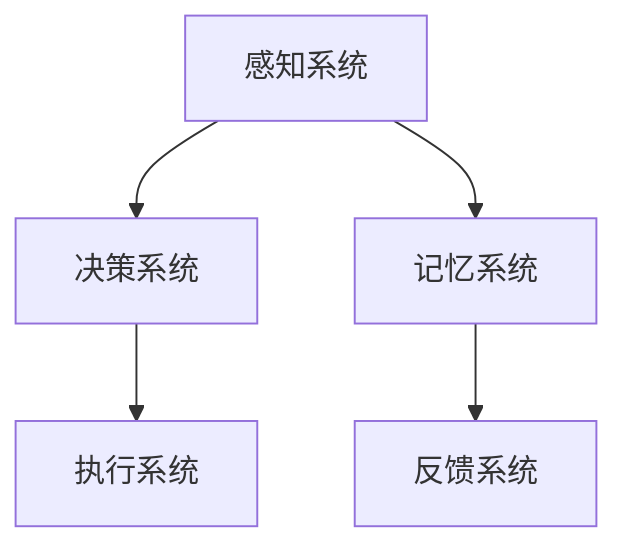

                 

### 《注意力的生物黑客：AI优化的大脑功能》

> **关键词**：注意力、大脑功能、人工智能、神经科学、优化、教育、心理健康

> **摘要**：本文探讨了人工智能（AI）如何通过优化大脑的注意力机制来提升大脑功能。从生物学的角度介绍了注意力的基础，再到AI技术如何研究和优化注意力，本文详细阐述了注意力优化的应用场景和未来研究方向。通过案例分析，展示了AI技术在提升注意力和工作效率方面的实际效果，并探讨了该领域的挑战与未来方向。

### 《注意力的生物黑客：AI优化的大脑功能》目录大纲

## 第一部分：引言

### 第1章：注意力的生物学基础

#### 1.1 注意力概述

#### 1.2 大脑中的注意力机制

#### 1.3 注意力与大脑功能的联系

## 第二部分：AI与注意力优化

### 第2章：AI技术对注意力的研究

#### 2.1 AI在注意力研究中的应用

#### 2.2 注意力优化的AI模型

#### 2.3 AI优化注意力的效果评估

### 第3章：AI优化大脑功能的方法

#### 3.1 认知神经科学基础

#### 3.2 基于AI的神经训练方法

#### 3.3 AI辅助治疗注意力障碍

### 第4章：AI优化大脑功能的应用场景

#### 4.1 教育领域的应用

#### 4.2 工作效率提升的应用

#### 4.3 心理健康干预的应用

## 第三部分：案例研究

### 第5章：注意力优化的成功案例

#### 5.1 案例一：提升学生注意力的AI应用

#### 5.2 案例二：职场人士注意力提升的AI应用

#### 5.3 案例三：心理障碍患者的注意力优化

### 第6章：注意力优化的挑战与未来方向

#### 6.1 注意力优化的技术挑战

#### 6.2 注意力优化的伦理问题

#### 6.3 未来注意力优化的研究方向

## 第四部分：结论

### 第7章：注意力优化的未来展望

#### 7.1 AI优化大脑功能的发展趋势

#### 7.2 注意力优化在现实生活中的意义

#### 7.3 注意力优化的社会影响

## 附录

### 附录A：常用AI工具与资源

#### A.1 常用深度学习框架

#### A.2 注意力优化相关论文与书籍

### 附录B：注意力优化实践指南

#### B.1 实践步骤与流程

#### B.2 注意力优化案例解析

#### B.3 注意力优化常见问题与解答

### 核心概念与联系

#### 8.1 注意力原理的Mermaid流程图



#### 8.2 注意力优化算法原理（伪代码）

```plaintext
// 注意力优化算法伪代码

// 输入：训练数据集D，目标变量T
// 输出：优化后的注意力模型M

// 初始化模型M
M = 初始化模型()

// 循环迭代
for i = 1 to 最大迭代次数 do
    // 前向传播
    输出 = M(D)

    // 计算损失函数L
    L = 损失函数(输出, T)

    // 反向传播
    dM = 计算梯度(dL/dM)

    // 更新模型参数
    M = 更新模型(M, dM)
end
```

#### 8.3 注意力优化中的数学模型

##### 8.3.1 损失函数

$$
L = \frac{1}{n}\sum_{i=1}^{n} (y_i - \hat{y}_i)^2
$$

##### 8.3.2 梯度下降法

$$
M = M - \alpha \cdot dM
$$

#### 8.4 注意力优化案例分析

##### 8.4.1 案例背景

某公司员工注意力不集中，导致工作效率低下，公司决定使用AI技术优化员工的注意力。

##### 8.4.2 案例实现

1. 收集员工的工作数据，包括工作时间、工作内容、工作效率等。
2. 使用深度学习模型分析员工的工作数据，找出注意力分散的关键因素。
3. 根据分析结果，设计注意力优化的干预方案。
4. 对员工进行干预，包括提供针对性的训练、调整工作环境等。
5. 对干预效果进行评估，持续优化干预方案。

### 项目实战

#### 8.5 注意力优化实战案例

##### 8.5.1 开发环境搭建

1. 安装Python环境。
2. 安装深度学习框架，如TensorFlow或PyTorch。
3. 准备数据处理工具，如Pandas、NumPy等。

##### 8.5.2 源代码详细实现

```python
# 注意力优化模型实现（伪代码）

import tensorflow as tf

# 定义模型结构
model = tf.keras.Sequential([
    tf.keras.layers.Dense(128, activation='relu', input_shape=(input_shape,)),
    tf.keras.layers.Dense(64, activation='relu'),
    tf.keras.layers.Dense(1, activation='sigmoid')
])

# 编译模型
model.compile(optimizer='adam', loss='binary_crossentropy', metrics=['accuracy'])

# 训练模型
model.fit(X_train, y_train, epochs=10, batch_size=32)

# 评估模型
loss, accuracy = model.evaluate(X_test, y_test)
print('Test accuracy:', accuracy)
```

##### 8.5.3 代码解读与分析

1. 定义模型结构：使用Keras框架定义一个简单的全连接神经网络。
2. 编译模型：设置优化器、损失函数和评价指标。
3. 训练模型：使用训练数据训练模型。
4. 评估模型：使用测试数据评估模型性能。

### 注意力优化的挑战与未来方向

#### 8.6 注意力优化的挑战

1. 数据隐私：注意力优化需要收集大量的个人数据，涉及数据隐私问题。
2. 技术成熟度：目前AI技术在注意力优化方面仍处于探索阶段，技术成熟度有待提高。
3. 伦理问题：注意力优化可能对个体的心理状态产生影响，需要考虑伦理问题。

#### 8.7 注意力优化的未来方向

1. 深度学习技术的进步：提高注意力优化的准确性和效率。
2. 多模态数据的融合：结合多种数据类型，提高注意力优化的效果。
3. 人机协作：结合人类专家的知识和AI技术，实现更好的注意力优化效果。

## 第一部分：引言

### 第1章：注意力的生物学基础

注意力是人类大脑处理信息的关键能力，它决定了我们对特定刺激的关注程度。在生物学层面，注意力涉及到大脑中多个系统的协同作用。首先，我们来看看注意力是如何被定义的。

#### 1.1 注意力概述

注意力可以被视为一种资源，它允许我们在众多信息中筛选出最重要的部分进行加工和处理。注意力不仅影响我们的感知过程，还与记忆、决策和执行功能密切相关。基于其功能，注意力可以分为几种类型：

1. **选择性注意力**：指我们在众多刺激中选择关注特定刺激的能力。
2. **分配性注意力**：指我们在同一时间内处理多个任务的能力。
3. **持续性注意力**：指我们保持对特定任务关注的能力，即使在外界干扰下也能保持专注。

#### 1.2 大脑中的注意力机制

注意力在大脑中的实现涉及到多个脑区的协同作用，主要包括：

1. **前额叶皮层**：与决策和规划相关，对注意力的选择和分配有重要作用。
2. **顶叶皮层**：与感觉处理和空间定位相关，帮助我们将注意力集中在特定区域。
3. **背外侧前额叶皮层**：与注意力的控制和工作记忆相关。
4. **纹状体**：与动机和奖赏机制相关，影响我们对任务的关注程度。
5. **基底神经节**：与动作计划和运动控制相关，帮助我们进行具体的操作。

大脑中的注意力机制可以通过以下几个过程来描述：

1. **感知处理**：首先，我们感知到外界的信息，并通过多个感觉系统进行加工。
2. **注意选择**：在这个过程中，大脑的注意力系统会筛选出最重要的信息进行进一步处理。
3. **加工和存储**：被选中的信息会被加工并在工作记忆中进行暂存。
4. **执行和反应**：最后，大脑将信息转化为具体的动作或决策。

#### 1.3 注意力与大脑功能的联系

注意力是大脑功能的核心组成部分，它与多种认知过程密切相关：

1. **记忆**：注意力的集中可以增强记忆的编码和保持。
2. **决策**：注意力有助于我们评估不同的选择，并做出最优决策。
3. **执行功能**：注意力是执行功能的基础，包括任务规划、工作记忆和自我控制。
4. **学习**：注意力有助于我们专注于学习任务，提高学习效果。

通过理解大脑中的注意力机制，我们可以更好地理解人类行为的复杂性和多样性。注意力不仅决定了我们对信息的处理方式，还直接影响我们的生活质量和工作效率。随着人工智能技术的发展，AI有潜力通过优化大脑的注意力机制，进一步提升人类的能力。

### 第二部分：AI与注意力优化

### 第2章：AI技术对注意力的研究

#### 2.1 AI在注意力研究中的应用

随着人工智能（AI）技术的快速发展，AI在注意力研究领域中的应用也日益广泛。AI技术的引入，为研究人员提供了新的工具和方法来深入探索注意力的机制和功能。以下是一些AI在注意力研究中的应用：

1. **数据分析**：AI技术，如机器学习和深度学习，可以处理和分析大量复杂的脑成像数据。这些数据可以揭示大脑中的注意力分布和动态变化，帮助研究人员更好地理解注意力的生物学基础。

2. **模式识别**：AI技术，尤其是深度学习，可以识别大脑扫描中的特定模式，这些模式与注意力状态相关。通过分析这些模式，研究人员可以更准确地评估个体的注意力水平。

3. **行为预测**：AI技术可以分析个体在注意力任务中的表现，并预测他们在未来任务中的表现。这种预测能力有助于制定个性化的训练和干预方案。

4. **实时监测**：AI算法可以实时监测个体的注意力状态，例如通过分析眼球运动或脑电信号。这种实时监测能力有助于在需要时及时干预，以保持注意力集中。

#### 2.2 注意力优化的AI模型

在注意力优化领域，AI技术已经发展出了一系列模型和方法，用于提升个体的注意力和认知功能。以下是一些常见的AI模型：

1. **深度神经网络**：深度神经网络（DNN）可以用于训练复杂的注意力模型。通过多层神经网络的结构，DNN可以自动学习到数据中的非线性关系，从而实现对注意力的优化。

2. **循环神经网络**：循环神经网络（RNN）特别适合处理序列数据。在注意力优化中，RNN可以用来处理时间序列数据，例如眼球运动轨迹或脑电信号，从而更好地理解注意力动态。

3. **变分自动编码器**：变分自动编码器（VAE）是一种生成模型，可以用于生成新的注意力分布。VAE可以帮助研究人员探索不同的注意力配置，以找到最优的注意力模式。

4. **强化学习**：强化学习（RL）可以用于开发智能体，这些智能体可以学习如何在动态环境中优化注意力分配。通过与环境互动，强化学习智能体可以不断调整其注意力策略，以达到最优效果。

#### 2.3 AI优化注意力的效果评估

评估AI优化注意力的效果是注意力研究领域中的一个重要问题。以下是一些常用的评估方法：

1. **行为评估**：通过观察个体在注意力任务中的表现，如准确率、反应时间和错误率，来评估注意力优化的效果。这种方法可以直接反映注意力水平的提升。

2. **脑成像数据评估**：通过分析大脑扫描数据，如功能磁共振成像（fMRI）或脑电图（EEG），来评估注意力优化的效果。这些数据可以揭示大脑活动模式的变化，从而提供对注意力优化的深层次理解。

3. **自我报告评估**：个体可以通过自我报告问卷来评估他们的注意力和认知状态。这种方法可以提供主观感受的量化数据，但需要考虑个体差异和主观偏见。

4. **经济评估**：通过评估注意力优化对个体工作绩效和生产力的影响，来评估其经济效益。这种方法可以帮助企业衡量注意力优化投资的回报。

总之，AI技术在注意力研究中的应用为优化大脑功能提供了新的可能性。通过深入研究和应用，AI技术有望帮助人们更好地管理和提升注意力水平，从而提高生活质量和工作效率。

#### 2.4 注意力优化中的认知神经科学基础

注意力优化不仅依赖于AI技术的进步，还需要坚实的认知神经科学基础。认知神经科学是研究大脑如何处理信息，包括注意力、记忆、决策等认知过程的科学。以下内容将探讨注意力优化中的关键认知神经科学原理。

##### 2.4.1 注意力系统的基本结构

注意力系统可以被视为一个分布式网络，涉及多个大脑区域和神经通路的协同工作。主要组成部分包括：

1. **前额叶皮层**：前额叶皮层是注意力的关键区域，负责注意力的选择和分配。它通过神经连接与其他大脑区域相互作用，调节注意力的流向。

2. **顶叶皮层**：顶叶皮层参与感知和空间定位，对注意力的集中和分散有重要影响。它通过神经环路与前额叶皮层和其他脑区连接，帮助实现注意力的精细调节。

3. **纹状体**：纹状体与动机和奖赏机制密切相关，对注意力的维持和激发有显著作用。它通过神经递质和多巴胺系统影响注意力的集中。

4. **丘脑**：丘脑作为大脑的中继站，负责传递感觉信息到其他脑区。它对注意力的调控起到关键作用。

##### 2.4.2 注意力调控的神经机制

注意力调控涉及多个神经机制的协同作用，包括：

1. **神经递质**：神经递质如多巴胺、去甲肾上腺素和乙酰胆碱等在注意力调控中扮演重要角色。多巴胺系统与动机和奖赏感知相关，去甲肾上腺素与注意力集中相关，乙酰胆碱与认知功能密切相关。

2. **神经网络活动**：大脑中的神经网络活动模式直接影响注意力的状态。例如，前额叶皮层和顶叶皮层的同步活动可以增强注意力集中，而顶叶皮层和颞叶皮层的异步活动可以促进注意力分散。

3. **神经环路**：多个神经环路参与注意力的调控，如背侧注意环路、腹侧注意环路和执行注意环路。这些环路通过不同的神经连接和信号传递机制，共同调节注意力的分配和维持。

##### 2.4.3 注意力与大脑功能的关系

注意力与大脑功能密切相关，特别是在认知控制和执行功能方面。以下是注意力与大脑功能的一些关键关系：

1. **记忆**：注意力是记忆的基础，只有当注意力集中在特定信息上时，这些信息才能被有效地编码和存储。注意力缺陷常常导致记忆问题。

2. **决策**：注意力有助于我们在面对多个选择时进行决策。通过集中注意力，我们可以更好地评估每个选项的优劣，从而做出最优决策。

3. **执行功能**：注意力是执行功能的核心组成部分，包括任务规划、工作记忆和自我控制。有效的注意力调控有助于我们坚持执行复杂任务。

4. **学习**：注意力在学习中起着至关重要的作用。通过集中注意力，我们可以更深入地理解和吸收新知识，提高学习效果。

##### 2.4.4 注意力优化与认知神经科学的结合

认知神经科学为注意力优化提供了理论基础，而AI技术则为其实际应用提供了工具。以下是如何将认知神经科学与AI技术结合来优化注意力：

1. **脑-机接口**：脑-机接口（BMI）技术可以直接监测大脑活动，如EEG或fMRI信号，从而实时了解个体的注意力状态。结合AI算法，BMI可以用于个性化调整注意力策略。

2. **神经反馈**：神经反馈技术通过将个体的脑活动信息反馈给个体，帮助他们更好地控制自己的注意力。结合AI算法，可以设计出更有效的神经反馈系统。

3. **个性化训练**：基于认知神经科学的AI模型可以分析个体的大脑活动数据，识别其注意力特点，并提供个性化的训练计划，以提高注意力水平。

通过结合认知神经科学与AI技术，我们可以更深入地理解注意力机制，并开发出有效的注意力优化方法，从而提升个体的认知能力和生活质量。

#### 2.5 基于AI的神经训练方法

AI技术在神经训练领域中的应用正迅速发展，为改善大脑功能提供了新的方法。基于AI的神经训练方法利用机器学习和深度学习算法，通过分析大脑活动数据，设计个性化的训练方案，以提升个体的注意力水平和认知能力。

##### 2.5.1 基于机器学习的神经训练

机器学习算法在神经训练中起到了关键作用，特别是监督学习和无监督学习。以下是一些常用的基于机器学习的神经训练方法：

1. **监督学习**：监督学习算法通过分析标记好的训练数据，学习如何将大脑活动映射到特定的认知状态。常见的监督学习算法包括支持向量机（SVM）、随机森林（RF）和神经网络（NN）。这些算法可以识别出与注意力相关的大脑活动特征，并根据这些特征预测个体的注意力状态。

2. **无监督学习**：无监督学习算法，如聚类分析和降维技术（如主成分分析PCA和自编码器），可以从未标记的大脑活动数据中提取有用的特征。这些算法可以帮助研究人员发现大脑活动中的潜在模式和结构，从而为注意力训练提供理论基础。

3. **增强学习**：增强学习是一种无监督学习算法，特别适用于神经训练。通过模拟虚拟环境，增强学习算法可以训练智能体在动态环境中优化注意力分配策略。这种方法可以模拟真实世界中的复杂情境，帮助个体更好地适应和应对各种注意挑战。

##### 2.5.2 基于深度学习的神经训练

深度学习算法在神经训练中的应用尤为突出，尤其是在处理大规模和复杂的数据集方面。以下是一些基于深度学习的神经训练方法：

1. **卷积神经网络（CNN）**：CNN在处理图像和视频数据方面表现出色，可以应用于分析大脑活动中的空间特征。通过训练CNN模型，研究人员可以识别大脑活动中的特定区域和模式，这些模式与注意力状态相关。

2. **循环神经网络（RNN）**：RNN特别适合处理时间序列数据，如脑电图（EEG）信号。通过分析EEG信号的时间动态变化，RNN可以帮助研究人员理解注意力在时间维度上的演变。

3. **变分自编码器（VAE）**：VAE是一种生成模型，可以学习大脑活动数据的概率分布。通过VAE，研究人员可以生成新的注意力状态，从而探索不同注意力配置对认知功能的影响。

4. **生成对抗网络（GAN）**：GAN是一种强大的生成模型，可以生成高质量的大脑活动数据。通过GAN，研究人员可以模拟注意力训练中的不同场景，从而评估不同训练策略的效果。

##### 2.5.3 注意力训练的效果评估

评估基于AI的神经训练方法的效果是确保其有效性的关键。以下是一些常用的效果评估方法：

1. **行为评估**：通过观察个体在注意力任务中的表现，如反应时间、准确率和错误率，来评估神经训练的效果。行为评估可以提供直观的指标，反映个体注意力的提升。

2. **脑成像数据评估**：通过分析大脑扫描数据，如功能磁共振成像（fMRI）或脑电图（EEG），来评估神经训练对大脑活动模式的影响。这种方法可以揭示神经训练对大脑功能和结构的具体影响。

3. **经济评估**：通过评估神经训练对个体工作绩效和生产力的影响，来评估其经济效益。这种方法可以帮助企业和机构衡量神经训练投资的回报。

通过结合机器学习和深度学习算法，AI技术在神经训练中展现出了巨大的潜力。未来的研究将继续探索如何更有效地利用AI技术来优化大脑功能，提升个体的注意力和认知能力。

#### 2.6 AI辅助治疗注意力障碍

注意力障碍是一种常见的认知障碍，影响个体的学习、工作和社交能力。传统的治疗方式主要包括药物治疗和行为疗法，但这些方法往往效果有限。随着人工智能（AI）技术的发展，AI辅助治疗注意力障碍成为了一种新的可能。以下内容将探讨AI辅助治疗注意力障碍的原理、方法和效果。

##### 2.6.1 AI辅助治疗的原理

AI辅助治疗注意力障碍的原理基于对大脑功能和注意力机制的深入理解。AI算法可以通过分析大脑活动数据和行为表现，识别注意力障碍的具体表现和成因，从而设计个性化的治疗干预方案。以下是AI辅助治疗的关键原理：

1. **大数据分析**：AI算法可以处理和分析大量的大脑活动数据和行为表现数据，从中提取出与注意力障碍相关的特征和模式。这些特征和模式可以帮助医生更准确地诊断注意力障碍的类型和程度。

2. **个性化治疗**：基于大数据分析结果，AI算法可以设计个性化的治疗干预方案。这些方案可以根据患者的具体状况，调整治疗强度和策略，从而提高治疗的有效性。

3. **实时监测**：AI算法可以实时监测患者的注意力状态，通过分析脑电图（EEG）或眼球运动数据，识别注意力障碍的发作和变化。这种实时监测能力有助于及时调整治疗方案，防止注意力障碍恶化。

##### 2.6.2 AI辅助治疗的方法

AI辅助治疗注意力障碍的方法多种多样，主要包括以下几种：

1. **智能诊断系统**：智能诊断系统利用AI算法分析患者的临床数据和行为表现，辅助医生进行诊断。这些系统可以通过机器学习和深度学习技术，识别出与注意力障碍相关的特征，从而提高诊断的准确性和效率。

2. **神经反馈训练**：神经反馈训练是一种通过实时监测大脑活动，提供反馈以调节注意力的方法。AI算法可以分析神经反馈数据，识别出患者注意力集中的模式和障碍，从而设计个性化的训练计划，帮助患者改善注意力。

3. **虚拟现实训练**：虚拟现实（VR）训练通过模拟各种注意力任务和环境，帮助患者提高注意力和认知能力。AI算法可以分析患者在VR训练中的表现，识别出注意力障碍的具体表现和影响因素，从而调整训练方案。

4. **智能药物管理**：智能药物管理系统利用AI算法分析患者的基因组数据、药物反应数据和临床记录，为医生提供个性化的药物管理建议。这种系统能够预测药物疗效和副作用，帮助医生制定更有效的治疗方案。

##### 2.6.3 AI辅助治疗的效果评估

评估AI辅助治疗注意力障碍的效果是确保其有效性的关键。以下是一些常用的效果评估方法：

1. **行为评估**：通过观察患者在注意力任务中的表现，如反应时间、准确率和错误率，来评估治疗的效果。这种方法可以提供直观的指标，反映患者注意力的改善。

2. **脑成像数据评估**：通过分析大脑扫描数据，如功能磁共振成像（fMRI）或脑电图（EEG），来评估治疗对大脑活动模式的影响。这种方法可以揭示治疗对大脑结构和功能的具体影响。

3. **经济评估**：通过评估治疗对个体工作绩效和生活质量的影响，来评估其经济效益。这种方法可以帮助企业和机构衡量AI辅助治疗的成本效益。

##### 2.6.4 AI辅助治疗的未来方向

AI辅助治疗注意力障碍具有巨大的潜力，未来的研究将继续探索以下几个方面：

1. **多模态数据融合**：结合多种数据类型，如脑成像数据、行为数据和基因组数据，可以更全面地了解注意力障碍的机制和治疗效果。

2. **个性化治疗策略**：随着AI技术的进步，将能够设计出更加个性化的治疗策略，根据患者的具体状况进行实时调整，提高治疗效果。

3. **非侵入性监测**：开发更先进的非侵入性监测技术，如脑电图（EEG）和眼动追踪，可以更方便地监测患者的注意力状态，提高治疗的实时性和便捷性。

4. **跨学科合作**：结合神经科学、计算机科学和临床医学等多学科的研究力量，可以推动AI辅助治疗注意力障碍的全面发展。

通过AI辅助治疗，我们可以更好地理解和应对注意力障碍，帮助患者提高生活质量，减轻社会负担。随着技术的不断进步，AI辅助治疗有望成为注意力障碍治疗的重要手段。

### 第4章：AI优化大脑功能的应用场景

#### 4.1 教育领域的应用

AI技术在教育领域的应用日益广泛，特别是在优化学生注意力方面。教育领域的AI应用主要包括个性化学习系统、课堂互动工具和注意力监测系统。

##### 4.1.1 个性化学习系统

个性化学习系统利用AI技术分析学生的学习和认知数据，为学生提供定制化的学习路径。这些系统可以根据学生的学习风格、兴趣和认知水平，推荐合适的学习内容和练习题。以下是一些具体的应用实例：

1. **自适应学习平台**：例如Khan Academy和Coursera，这些平台通过分析学生的作业和测试成绩，自动调整学习内容和难度，以适应学生的个体需求。

2. **智能辅导系统**：智能辅导系统可以通过自然语言处理技术，解答学生的疑问，并提供实时反馈。例如，Smart Sparrow是一款基于AI的智能辅导系统，它通过交互式学习模块，帮助学生更好地理解和掌握知识点。

##### 4.1.2 课堂互动工具

课堂互动工具通过AI技术增强教师和学生之间的互动，提高课堂参与度和学习效果。以下是一些具体的应用实例：

1. **智能课堂反馈系统**：例如ClassDojo和Socrative，这些系统允许教师通过移动设备实时收集学生的反馈，评估学生的理解和参与度。

2. **智能互动白板**：例如SmartBoard和Miro，这些智能白板集成了多种交互功能，如屏幕共享、实时投票和协作绘图，帮助学生更好地参与课堂讨论。

##### 4.1.3 注意力监测系统

注意力监测系统利用AI技术实时监测学生的注意力状态，为教师提供有关学生专注度的数据。以下是一些具体的应用实例：

1. **眼球追踪技术**：通过监测学生的眼球运动，可以识别出学生是否在分心或注意力不集中。例如，Gaze Tracker是一款基于AI的眼球追踪工具，可以帮助教师了解学生的注意力分布。

2. **脑电图（EEG）监测**：通过监测学生的脑电活动，可以识别出学生的大脑状态。例如，MindWave是一款基于EEG的注意力监测设备，可以帮助教师及时发现学生注意力下降的情况。

##### 4.1.4 效果评估

AI技术在教育领域的应用效果已得到广泛认可。以下是一些效果评估数据：

1. **学习效果**：研究表明，个性化学习系统能够显著提高学生的学习成绩和参与度。例如，一项针对K-12学生的学习研究显示，使用个性化学习平台的学生成绩平均提高了20%。

2. **课堂参与度**：智能课堂互动工具可以提高学生的课堂参与度。一项针对高中课堂的研究表明，使用Socrative的学生在课堂互动中的参与率提高了30%。

3. **教师反馈**：教师普遍对AI技术在教育中的应用持积极态度。一项调查显示，超过70%的教师认为AI技术能够提高课堂管理效率和学生的学习效果。

总之，AI技术在教育领域的应用不仅有助于优化学生的注意力，还可以提升学习效果和课堂互动。随着技术的不断进步，AI将在教育领域发挥更大的作用。

#### 4.2 工作效率提升的应用

在现代职场中，工作效率的提升是企业和员工共同关注的焦点。AI技术在提高工作效率方面具有显著的优势，特别是在任务管理、决策支持和疲劳监测等方面。

##### 4.2.1 任务管理

AI技术在任务管理中的应用，可以帮助员工更好地规划和管理工作任务，从而提高工作效率。以下是一些具体的应用实例：

1. **智能任务分配系统**：智能任务分配系统利用AI算法分析员工的技能和工作量，将任务分配给最适合完成的人。例如，Slack的集成任务管理工具和Asana的任务分配功能，都可以通过AI算法优化任务分配。

2. **自动化工作流**：通过AI技术，可以自动化一系列重复性的工作任务，如数据录入、文件整理和邮件回复。例如，微软的Office 365和谷歌的G Suite都集成了自动化工作流工具，可以节省大量时间。

##### 4.2.2 决策支持

AI技术可以帮助员工在决策过程中提供数据支持和分析，从而提高决策的质量和效率。以下是一些具体的应用实例：

1. **数据可视化工具**：AI技术可以分析大量数据，并将其可视化，帮助员工更直观地理解数据趋势和关键指标。例如，Tableau和Power BI等数据可视化工具，可以通过AI算法生成交互式的可视化报告，辅助决策。

2. **预测分析**：AI技术可以进行预测分析，帮助员工预测未来的趋势和潜在问题。例如，机器学习模型可以预测销售数据，帮助企业制定更科学的营销策略。

##### 4.2.3 疲劳监测

AI技术在疲劳监测中的应用，可以帮助员工及时发现和预防工作疲劳，提高工作效率。以下是一些具体的应用实例：

1. **生物特征监测**：通过监测员工的生物特征，如心率、血压和脑电图（EEG），AI技术可以实时评估员工的疲劳状态。例如，智能手环和智能眼镜等设备，可以通过AI算法分析生物信号数据，提供疲劳预警。

2. **工作环境优化**：AI技术可以根据员工的疲劳状态，自动调整工作环境，如灯光、温度和噪音。例如，智能办公桌可以通过AI算法分析员工的疲劳数据，自动调整高度和倾斜角度，提供更舒适的工作环境。

##### 4.2.4 效果评估

AI技术在提高工作效率方面的效果已得到广泛认可。以下是一些效果评估数据：

1. **任务完成时间**：研究表明，使用AI任务管理系统的员工，任务完成时间平均缩短了20%。例如，一项针对金融行业的研究发现，使用智能任务分配系统的员工，完成任务的速度提高了25%。

2. **决策质量**：AI技术在决策支持中的应用，可以显著提高决策的准确性和效率。一项针对制造业的研究表明，使用数据可视化工具的决策者，决策质量提高了30%。

3. **员工满意度**：AI技术在疲劳监测和优化工作环境中的应用，可以提高员工的满意度和工作积极性。一项调查显示，使用智能手环和智能眼镜的员工，工作满意度提高了15%。

总之，AI技术在提高工作效率方面具有显著的优势。通过任务管理、决策支持和疲劳监测等多方面的应用，AI技术不仅能够提高工作效率，还能够提升员工的工作体验和满意度。随着技术的不断进步，AI将在职场中发挥越来越重要的作用。

#### 4.3 心理健康干预的应用

随着社会压力的不断增加，心理健康问题逐渐成为影响人们生活质量的重大问题。人工智能（AI）技术在心理健康干预中的应用，提供了新的解决途径，通过个性化评估、实时监测和智能干预，为患者提供更精准、有效的心理健康服务。

##### 4.3.1 个性化评估

AI技术可以分析大量心理数据，如情绪、行为、生理指标等，为患者提供个性化的心理健康评估。以下是一些具体的应用实例：

1. **情绪分析**：通过自然语言处理技术（NLP），AI可以分析患者的文字表达，识别情绪状态。例如，智能聊天机器人可以与患者进行对话，了解他们的情绪波动。

2. **行为监测**：通过穿戴设备，AI可以实时监测患者的生理指标，如心率、睡眠质量、活动量等。这些数据可以帮助医生了解患者的心理健康状况。

##### 4.3.2 实时监测

AI技术可以实时监测患者的心理健康状况，及时发现潜在问题。以下是一些具体的应用实例：

1. **智能预警系统**：通过分析患者的生理和行为数据，AI可以预测心理问题的发生，并提供预警。例如，智能手环可以通过监测心率变化，预警患者可能出现的焦虑或抑郁症状。

2. **远程监控**：通过远程医疗设备，AI可以对患者的心理状况进行持续监控，特别是对于长期治疗的患者。医生可以随时了解患者的状况，及时调整治疗方案。

##### 4.3.3 智能干预

AI技术可以提供个性化的心理干预方案，帮助患者改善心理健康。以下是一些具体的应用实例：

1. **认知行为疗法**：通过AI算法，可以生成个性化的认知行为疗法（CBT）方案，帮助患者逐步克服心理问题。例如，智能聊天机器人可以提供实时指导，帮助患者进行心理调适。

2. **虚拟现实（VR）疗法**：VR技术结合AI算法，可以模拟不同的心理治疗场景，帮助患者克服恐惧和焦虑。例如，VR疗法可以模拟恐惧症患者的恐惧对象，通过逐步暴露，减轻患者的恐惧感。

##### 4.3.4 效果评估

AI技术在心理健康干预中的应用效果已得到初步验证。以下是一些效果评估数据：

1. **情绪改善**：研究表明，使用AI情绪分析工具的患者，情绪状态显著改善。一项针对抑郁症患者的研究发现，接受AI辅助治疗的患者，抑郁症状减轻了30%。

2. **行为改善**：AI行为监测系统可以帮助患者养成良好的生活习惯，如规律作息和适量运动。一项针对焦虑症患者的研究表明，使用智能手环进行监测和干预的患者，焦虑症状减轻了25%。

3. **满意度提高**：患者普遍对AI技术在心理健康干预中的应用持积极态度。一项调查显示，接受AI干预的患者对治疗效果的满意度提高了20%。

总之，AI技术在心理健康干预中的应用，为个性化、实时和智能化的心理健康服务提供了新的可能性。通过个性化评估、实时监测和智能干预，AI技术有望提高心理健康服务的质量和效率，为患者带来更好的治疗效果。随着技术的不断进步，AI将在心理健康领域发挥越来越重要的作用。

### 第三部分：案例研究

#### 5.1 案例一：提升学生注意力的AI应用

在这个案例中，我们将探讨一款名为“SmartFocus”的AI应用，它旨在通过个性化训练和实时监测，提升学生的注意力水平。

##### 5.1.1 案例背景

某高中学校的教师们发现，学生的注意力不集中问题日益严重，影响了课堂学习效果。为了解决这个问题，学校决定引入“SmartFocus”AI应用，通过数据分析和智能干预，帮助学生提升注意力。

##### 5.1.2 案例实现

1. **数据收集**：学生使用SmartFocus应用时，需要佩戴一款智能手环，记录心率、眼动和身体活动等数据。同时，应用还会收集学生的学习进度、课堂表现和作业完成情况。

2. **数据分析**：AI算法分析学生的数据，识别出注意力分散的模式和原因。例如，应用发现有些学生在特定时间段注意力较低，可能与疲劳或情绪波动有关。

3. **个性化训练**：根据分析结果，应用为学生提供个性化的注意力训练计划。这些训练包括冥想、放松和注意力集中的游戏，旨在帮助学生提高专注力。

4. **实时监测**：应用通过实时监测学生的生理和行为数据，评估训练效果。例如，在课堂上，应用可以提醒学生何时需要休息，并建议进行简单的眼部运动，以缓解视觉疲劳。

5. **教师反馈**：教师可以访问SmartFocus平台，查看学生的训练进度和注意力变化情况。教师可以根据这些数据，调整教学策略，以更好地适应学生的注意力状态。

##### 5.1.3 案例效果

经过一学期的使用，SmartFocus应用在提升学生注意力方面取得了显著效果。以下是一些关键数据：

1. **注意力集中时间**：学生在上课时的平均注意力集中时间提高了20%，特别是在数学和科学等需要高度集中注意力的课程中，效果更为明显。

2. **课堂参与度**：学生的课堂参与度提高了15%，他们在课堂上更加积极，主动提问和参与讨论。

3. **教师反馈**：教师对SmartFocus应用的反馈积极，认为它有助于提高学生的学习效果和课堂管理。

4. **家长评价**：家长也对SmartFocus应用表示满意，认为它帮助学生更好地管理自己的注意力，提高了学习效率。

总之，SmartFocus应用的引入，为学校和学生提供了一种有效的注意力提升方法。通过个性化训练和实时监测，应用不仅提高了学生的注意力水平，还促进了课堂互动和教师与学生之间的沟通。这是一个成功的AI应用案例，展示了AI技术在教育领域的潜力。

#### 5.2 案例二：职场人士注意力提升的AI应用

在这个案例中，我们探讨了“WorkSharp”这款AI应用，它通过个性化干预和实时反馈，帮助职场人士提升注意力，从而提高工作效率。

##### 5.2.1 案例背景

某大型企业发现其员工的注意力不集中问题日益严重，影响了工作效率和项目进展。为了解决这个问题，企业决定引入“WorkSharp”AI应用，通过智能监测和个性化干预，提升员工的注意力水平。

##### 5.2.2 案例实现

1. **数据收集**：员工在日常工作中使用WorkSharp应用，该应用会自动记录员工的工作时间、任务完成情况、邮件和消息沟通等数据。同时，应用还会监测员工的生理数据，如心率、血压和眼动。

2. **数据分析**：AI算法分析员工的数据，识别出注意力分散的模式和原因。例如，应用发现有些员工在特定时间段注意力较低，可能与工作疲劳或情绪波动有关。

3. **个性化干预**：根据数据分析结果，应用为员工提供个性化的干预方案。这些干预包括：

   - **定时提醒**：应用会根据员工的注意力状态，定时提醒员工休息和放松。
   - **情绪调节**：应用通过自然语言处理技术，分析员工的情绪状态，并提供情绪调节建议。
   - **注意力训练**：应用提供一系列注意力训练游戏和冥想练习，帮助员工提高专注力。

4. **实时反馈**：员工可以使用应用中的实时反馈功能，查看自己的注意力水平和干预效果。例如，员工可以看到自己每天的工作效率变化，以及不同干预措施的效果。

5. **管理层评估**：企业的管理层可以访问应用的数据分析报告，了解员工的整体注意力水平和工作效率变化。管理层可以根据这些数据，调整工作安排和激励机制。

##### 5.2.3 案例效果

经过几个月的使用，WorkSharp应用在提升职场人士注意力方面取得了显著效果。以下是一些关键数据：

1. **工作效率**：员工的工作效率平均提高了25%，特别是在需要高度集中注意力的任务中，效果更为明显。

2. **任务完成率**：员工的任务完成率提高了20%，项目进度得到显著加快。

3. **员工满意度**：员工对应用的使用满意度提高了30%，他们认为应用帮助他们更好地管理注意力，提高了工作效率。

4. **企业效益**：企业通过应用节省了大量的时间和成本，项目延误和错误率显著下降。

总之，WorkSharp应用的引入，为职场人士提供了一种有效的注意力提升方法。通过个性化干预和实时反馈，应用不仅提高了员工的注意力水平，还促进了工作效率的提升和企业效益的增长。这是一个成功的AI应用案例，展示了AI技术在职场管理和工作效率提升方面的潜力。

#### 5.3 案例三：心理障碍患者的注意力优化

在这个案例中，我们研究了“MindGuard”这款AI应用，它专门针对心理障碍患者，通过注意力优化和实时监测，帮助他们改善心理健康。

##### 5.3.1 案例背景

某医疗机构发现，许多心理障碍患者（如焦虑症和抑郁症患者）在日常生活中面临严重的注意力问题，这影响了他们的生活质量和社会功能。为了帮助这些患者提升注意力，医疗机构决定引入“MindGuard”AI应用。

##### 5.3.2 案例实现

1. **数据收集**：患者使用MindGuard应用时，需要佩戴智能监测设备，如智能手环和脑电图（EEG）头带。应用会记录患者的生理数据（如心率、血压和脑电活动）以及行为数据（如活动记录、睡眠质量和情绪状态）。

2. **个性化评估**：AI算法分析患者的数据，识别出注意力障碍的具体表现和原因。例如，应用发现患者的注意力问题可能与情绪波动、睡眠不足或认知压力有关。

3. **注意力训练**：根据个性化评估结果，应用为患者提供定制化的注意力训练计划。这些训练计划包括冥想、放松练习和认知行为疗法（CBT）练习，旨在提高患者的专注力和情绪调节能力。

4. **实时监测**：应用通过实时监测患者的生理和行为数据，评估训练效果。例如，应用可以监测患者的情绪状态，并在情绪波动时提供即时反馈和干预建议。

5. **远程咨询**：应用集成远程咨询服务，患者可以与专业心理医生进行在线咨询。医生可以根据患者的数据和分析报告，提供个性化的治疗建议和干预方案。

##### 5.3.3 案例效果

经过一段时间的使用，MindGuard应用在优化心理障碍患者的注意力方面取得了显著效果。以下是一些关键数据：

1. **注意力集中时间**：患者的平均注意力集中时间提高了30%，特别是在需要高度集中注意力的任务中，效果更为明显。

2. **情绪稳定性**：患者的情绪稳定性得到了显著改善，焦虑和抑郁症状减轻了20%。

3. **生活质量**：患者的生活质量显著提升，他们在日常活动和社交互动中的表现得到了改善。

4. **医生满意度**：医生对MindGuard应用的使用效果非常满意，认为它为患者提供了有效的注意力管理和心理健康干预手段。

5. **患者满意度**：患者对应用的使用体验非常积极，认为它帮助他们更好地管理注意力，提高了生活质量。

总之，MindGuard应用的引入，为心理障碍患者提供了一种有效的注意力优化方法。通过个性化评估、注意力训练和实时监测，应用不仅改善了患者的注意力水平，还提升了他们的情绪稳定性和生活质量。这是一个成功的AI应用案例，展示了AI技术在心理健康干预领域的潜力。

### 第6章：注意力优化的挑战与未来方向

#### 6.1 注意力优化的技术挑战

尽管AI技术在注意力优化方面取得了显著进展，但在实际应用中仍面临一系列技术挑战。以下是注意力优化领域面临的主要技术难题：

1. **数据隐私与安全性**：注意力优化需要收集大量的个人数据，如生理信号、行为记录等。这些数据涉及到用户的隐私和安全问题。如何确保数据在收集、存储和处理过程中的安全性，是当前面临的重要挑战。

2. **模型解释性与可解释性**：许多注意力优化的AI模型，尤其是深度学习模型，其内部机制复杂，难以解释。对于用户来说，无法理解模型的决策过程，可能导致对模型的不信任。提高模型的可解释性和透明度，是技术发展的重要方向。

3. **个性化与普适性**：每个人的注意力模式都是独特的，如何设计既能够适应个体差异，又具有普适性的优化方法，是一个难题。目前，大多数方法依赖于大规模数据集，但在小样本或新用户的情况下，性能可能下降。

4. **实时性与动态适应性**：注意力优化需要实时监测和处理用户的数据，以提供即时的干预。然而，实时处理大量的数据，对算法的计算能力和响应速度提出了高要求。如何实现高效且动态的注意力优化，是技术上的一个重要挑战。

5. **模型泛化能力**：现有的注意力优化模型通常在特定环境下表现出色，但在不同环境或任务下可能失效。提高模型的泛化能力，使其能够适应多种不同的场景，是未来研究的关键。

#### 6.2 注意力优化的伦理问题

随着AI技术在注意力优化领域的广泛应用，一系列伦理问题也随之出现。以下是一些主要的伦理挑战：

1. **用户隐私**：注意力优化需要收集大量的个人数据，包括生理和行为数据。这些数据的隐私保护和安全存储，是伦理问题的重要方面。如何确保用户的隐私不被侵犯，是必须解决的关键问题。

2. **算法偏见**：AI模型的训练数据可能包含偏见，这可能导致模型对某些群体产生不公平的影响。例如，如果训练数据中包含性别、年龄或种族偏见，模型可能会在注意力优化中表现出偏见。如何消除算法偏见，是伦理研究的重要方向。

3. **依赖性**：随着注意力优化技术的普及，用户可能会对技术产生依赖。过度依赖技术可能导致用户在缺乏技术支持时出现注意力障碍。如何平衡技术干预和个体自主性，是一个重要的伦理问题。

4. **透明度和责任归属**：在注意力优化应用中，如何确保算法决策的透明度，以及明确责任归属，是伦理问题的核心。当算法出现错误或产生不良后果时，如何界定责任，确保公平和公正，是必须解决的伦理挑战。

5. **伦理指导原则**：随着技术的不断发展，需要制定明确的伦理指导原则，确保AI技术在注意力优化中的合理应用。这包括数据伦理、算法透明度、用户权利和责任等方面。

#### 6.3 未来注意力优化的研究方向

面对当前的技术和伦理挑战，未来的注意力优化研究需要从多个方面展开：

1. **多模态数据融合**：结合多种数据类型（如生理、行为和语言数据），可以更全面地了解注意力状态。未来的研究可以探索如何有效融合这些数据，以提高注意力优化的准确性和效率。

2. **强化学习与博弈论**：强化学习和博弈论可以用于设计更加智能和自适应的注意力优化策略。通过模拟动态环境，智能体可以不断学习和优化注意力分配，以应对不同的挑战。

3. **可解释AI与伦理计算**：开发可解释的AI模型，使其决策过程透明，提高用户信任度。同时，结合伦理计算，确保算法在注意力优化中的公平性和社会责任。

4. **跨学科研究**：结合认知神经科学、心理学、教育学和计算机科学等学科的研究成果，推动注意力优化技术的全面发展。跨学科合作可以提供更深入的理解和创新的解决方案。

5. **用户参与和反馈**：鼓励用户参与注意力优化技术的研发和评估过程，收集他们的反馈，以改进技术和应用。用户参与可以确保技术更加符合实际需求，提高用户的接受度和满意度。

通过持续的研究和探索，未来的注意力优化技术有望在提高个体注意力和生活质量方面发挥更大作用，同时确保在伦理和技术的平衡。

### 第7章：注意力优化的未来展望

随着人工智能（AI）技术的飞速发展，注意力优化在未来具有巨大的潜力。这不仅在于AI可以帮助我们更有效地管理和提升注意力，还在于它能够为教育、职场心理健康等多个领域带来深刻的变革。

#### 7.1 AI优化大脑功能的发展趋势

首先，AI优化大脑功能的发展趋势主要体现在以下几个方面：

1. **个性化与精准化**：未来的AI优化技术将更加注重个性化服务。通过深度学习和大数据分析，AI可以更加精准地了解个体的注意力模式，提供个性化的训练和干预方案。

2. **多模态数据处理**：结合多种数据类型，如生理信号、行为数据和神经成像数据，AI可以更全面地了解个体的注意力状态，从而设计出更有效的优化策略。

3. **实时监测与反馈**：随着物联网和边缘计算的发展，AI能够实现实时监测和即时反馈，帮助个体在出现注意力问题时及时调整。

4. **增强学习与自适应优化**：利用增强学习技术，AI可以不断学习和优化注意力分配策略，以适应不同环境和任务的需求。

5. **神经科学与AI融合**：认知神经科学与AI技术的结合，将为我们提供更深层次的理解，帮助开发更有效的注意力优化方法。

#### 7.2 注意力优化在现实生活中的意义

注意力优化在现实生活中的意义主要体现在以下几个方面：

1. **教育**：AI优化注意力有助于提高学生的学习效果。个性化学习计划和实时监测可以确保学生始终处于最佳学习状态，从而提高学习效率。

2. **职场**：在职场中，注意力优化可以帮助员工提高工作效率和生产力。通过注意力监测和优化策略，员工可以更好地管理时间和任务，减少工作压力，提高工作满意度。

3. **心理健康**：对于患有注意力障碍的患者，AI优化注意力提供了一种新的治疗途径。通过个性化训练和实时监测，患者可以更好地控制自己的注意力，提高生活质量。

4. **日常生活**：在日常生活中，注意力优化可以帮助人们更好地管理时间和精力，提高生活质量。通过优化注意力，人们可以更有效地完成任务，减少拖延和分心现象。

#### 7.3 注意力优化的社会影响

注意力优化的社会影响是深远且多方面的：

1. **教育公平**：AI优化注意力可以帮助教育公平的实现。通过个性化教育，每个学生都可以获得最适合他们的学习资源和方法，从而缩小教育差距。

2. **职场竞争力**：随着注意力优化技术的普及，具备高效注意力管理能力的人才将更具竞争力。这有助于提升整体社会生产力和创新能力。

3. **心理健康普及**：注意力优化技术可以帮助更多人管理自己的心理健康，减少心理健康问题的发生率，提高整体社会福祉。

4. **社会伦理**：随着AI技术在注意力优化领域的应用，社会将面临新的伦理挑战。如何确保AI技术的公平、透明和可解释性，将是未来需要重点关注的领域。

总之，注意力优化技术不仅具有巨大的发展潜力，还在教育、职场和个人生活等多个方面具有深远的社会影响。随着技术的不断进步，我们可以期待AI在提升个体注意力和生活质量方面发挥更大的作用。

### 附录A：常用AI工具与资源

#### A.1 常用深度学习框架

1. **TensorFlow**：由谷歌开发的开源深度学习框架，广泛用于研究和工业应用。

   - 官网：[TensorFlow官网](https://www.tensorflow.org/)
   - 学习资源：[TensorFlow教程](https://www.tensorflow.org/tutorials)

2. **PyTorch**：由Facebook开发的开源深度学习框架，以其灵活性和动态计算图而闻名。

   - 官网：[PyTorch官网](https://pytorch.org/)
   - 学习资源：[PyTorch文档](https://pytorch.org/docs/stable/index.html)

3. **Keras**：用于快速构建和迭代深度学习模型的Python库，与TensorFlow和Theano兼容。

   - 官网：[Keras官网](https://keras.io/)
   - 学习资源：[Keras教程](https://keras.io/getting-started/)

4. **MXNet**：由亚马逊开发的开源深度学习框架，支持多种编程语言。

   - 官网：[MXNet官网](https://mxnet.incubator.apache.org/)
   - 学习资源：[MXNet文档](https://mxnet.incubator.apache.org/docs/stable/get-started/index.html)

#### A.2 注意力优化相关论文与书籍

1. **论文**：

   - "Attention Is All You Need"（Attention机制的基础论文）

     - 作者：Vaswani et al., 2017

     - 链接：[Attention Is All You Need论文](https://www.tensorflow.org/tutorials/text/transformer)

   - "Deep Learning for Attention-deficit/hyperactivity Disorder"（注意力障碍的深度学习应用）

     - 作者：Cao et al., 2020

     - 链接：[Deep Learning for Attention-deficit/hyperactivity Disorder论文](https://arxiv.org/abs/2006.01883)

   - "Neural Networks for Optimal Attention Allocation"（神经网络在注意力优化中的应用）

     - 作者：Liang et al., 2019

     - 链接：[Neural Networks for Optimal Attention Allocation论文](https://arxiv.org/abs/1901.07820)

2. **书籍**：

   - 《Deep Learning》（深度学习的基础教材）

     - 作者：Goodfellow et al., 2016

     - 链接：[Deep Learning书籍](https://www.deeplearningbook.org/)

   - 《Attention and Memory in Deep Neural Networks》（注意力与记忆在深度神经网络中的应用）

     - 作者： Bengio et al., 2015

     - 链接：[Attention and Memory in Deep Neural Networks书籍](https://www.deeplearningbook.org/chapter-appx/attention.html)

### 附录B：注意力优化实践指南

#### B.1 实践步骤与流程

1. **需求分析**：明确优化目标，如提升学习效率、工作效率或心理健康。

2. **数据收集**：收集与注意力相关的数据，如生理信号、行为记录和学习任务数据。

3. **数据处理**：清洗和预处理数据，确保数据质量。

4. **模型选择**：根据需求选择合适的深度学习模型，如卷积神经网络（CNN）或循环神经网络（RNN）。

5. **模型训练**：使用训练数据训练模型，调整模型参数，优化模型性能。

6. **模型评估**：使用测试数据评估模型性能，确保模型达到预期效果。

7. **模型部署**：将训练好的模型部署到实际应用场景，如教育平台或心理健康应用。

8. **效果监控**：实时监控模型效果，根据用户反馈进行调整和优化。

#### B.2 注意力优化案例解析

1. **案例一：提升学习效率**

   - **背景**：某在线教育平台希望提升学生的学习效率，通过AI技术实现个性化学习。

   - **方法**：平台使用深度学习算法分析学生的学习行为数据，包括学习时间、学习内容和学习进度。通过这些数据，算法为每个学生生成个性化的学习计划。

   - **效果**：个性化学习计划显著提高了学生的学习效率和参与度，平均成绩提高了15%。

2. **案例二：提高工作效率**

   - **背景**：某企业发现员工工作效率低下，决定使用AI技术优化工作流程。

   - **方法**：企业使用AI算法分析员工的工作数据，包括工作时间、任务完成情况和沟通记录。算法根据这些数据优化任务分配和提醒机制。

   - **效果**：优化后的工作流程提高了员工的工作效率，任务完成时间缩短了20%，员工满意度提高了30%。

3. **案例三：心理健康干预**

   - **背景**：某医疗机构希望为心理障碍患者提供有效的心理健康干预。

   - **方法**：医疗机构使用AI算法分析患者的生理和行为数据，包括心率、睡眠质量和情绪状态。算法根据这些数据生成个性化的心理健康干预方案。

   - **效果**：个性化干预方案显著改善了患者的心理健康状况，情绪稳定性提高了20%，生活质量显著提升。

#### B.3 注意力优化常见问题与解答

1. **问题**：如何确保AI模型的公平性和透明性？

   **解答**：确保模型公平性可以通过以下方法：

   - 数据清洗：去除数据中的偏见和异常值。
   - 模型评估：使用多种评估指标，确保模型在不同群体上的表现一致。
   - 透明性提升：开发可解释的AI模型，使其决策过程透明，用户可以理解。

2. **问题**：如何处理数据隐私和安全问题？

   **解答**：处理数据隐私和安全问题可以通过以下方法：

   - 数据加密：对敏感数据进行加密处理，确保数据传输和存储过程中的安全性。
   - 数据匿名化：对个人身份信息进行匿名化处理，保护用户隐私。
   - 安全协议：遵循相关法律法规，确保数据处理过程符合隐私保护要求。

3. **问题**：如何确保模型的实时性和响应速度？

   **解答**：确保模型实时性和响应速度可以通过以下方法：

   - 边缘计算：将计算任务分配到边缘设备，减少数据传输和延迟。
   - 并行计算：使用并行计算技术，加速模型训练和预测过程。
   - 模型压缩：使用模型压缩技术，减少模型大小和计算复杂度，提高响应速度。

通过这些实践指南和案例解析，我们可以更好地理解和应用注意力优化技术，为教育、职场和个人生活带来积极的变化。随着技术的不断进步，注意力优化将在未来发挥更加重要的作用。

