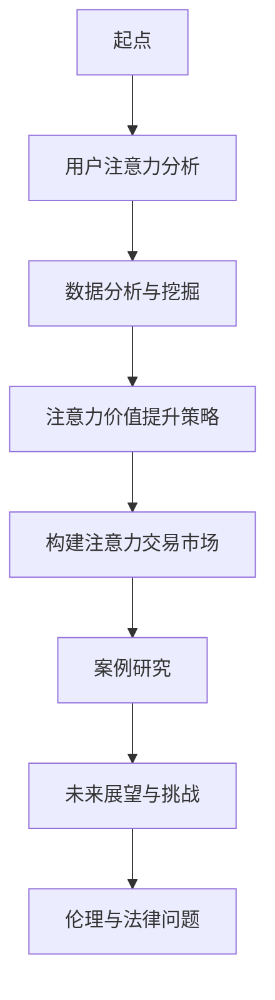

                 

### 第一部分：引言与背景

#### 第1章：AI时代下的注意力经济

**1.1 AI与注意力经济的起源**

在现代社会，信息无处不在，而人们能够处理的注意力却是有限的。这就催生了一种新的经济形态——注意力经济。注意力经济的概念最早由美国学者Herbert Simon在1971年提出，他描述了一个信息过载的社会，人们不再能够处理所有信息，而是开始选择关注那些最有价值的信息。

随着互联网和移动设备的普及，注意力经济逐渐成为经济活动的核心。然而，真正的变革发生在人工智能（AI）技术的崛起之后。AI能够通过大数据分析和机器学习算法，识别和预测用户的注意力模式，从而为商家和平台提供了一种全新的盈利方式。

AI的加入，使得注意力经济变得更加精细化和高效。通过深度学习算法，AI能够分析用户的浏览历史、搜索记录、社交互动等数据，精准地预测用户的兴趣和需求。这种对用户注意力的精准把控，使得内容创作者、广告商和平台运营商能够更有效地进行营销和推广，实现更高的商业价值。

**1.2 注意力经济的重要性**

注意力经济的重要性在于，它不仅改变了营销和商业的模式，也深刻影响了社会结构和信息传播的机制。以下是注意力经济的重要影响：

1. **商业模式的变革**：传统商业模式依赖于产品销售或服务收费，而注意力经济则通过用户的关注和互动来创造价值。平台通过吸引用户的注意力，然后通过广告、会员服务等方式盈利。

2. **信息传播的变革**：在注意力经济中，信息传播不再仅仅是单向的，而是双向的、互动的。用户不仅是信息的接受者，也是信息的创造者和传播者。

3. **社会结构的变革**：注意力经济使得信息传播和商业活动更加依赖于用户注意力，这也导致了社会结构和权力关系的变化。那些能够吸引更多注意力的平台和内容创作者，往往在商业和社会中获得更大的影响力。

**1.3 注意力货币化的潜力**

注意力货币化是指将用户的注意力转化为可以直接交易的货币或价值。在AI时代，注意力货币化的潜力主要体现在以下几个方面：

1. **精准广告投放**：通过AI对用户注意力的分析，广告商能够更精准地投放广告，提高广告的转化率和投放效果。

2. **内容付费**：用户愿意为高质量、有价值的内容支付费用，这为内容创作者提供了直接的经济回报。

3. **社交货币化**：用户在社交媒体上的互动和分享，也可以成为货币化的手段。例如，社交媒体平台通过广告和会员服务来吸引用户的注意力。

4. **数据交易**：用户的注意力数据是一种宝贵的资源，可以被用于数据交易，从而为平台和内容创作者带来额外的收入。

总的来说，AI时代的注意力经济，为商家和平台提供了一种全新的盈利模式，同时也为用户创造了更多的价值。然而，注意力货币化也带来了一系列挑战，如用户隐私保护、注意力分配公平性等问题。这需要我们在推动注意力经济的同时，也要关注这些潜在的风险和挑战。

### **第2章：注意力经济原理**

**2.1 注意力经济的基本概念**

注意力经济，是指一种基于用户注意力的经济模式，通过吸引和转化用户的注意力，实现商业价值。在这个经济模式中，用户的注意力被视为一种稀缺资源，而商家和平台则通过各种手段来争夺和利用这种资源。

**注意力经济的核心概念包括：**

1. **注意力**：注意力是指用户在特定时间对特定内容或活动的关注程度。注意力具有稀缺性，因为每个人的时间和精力是有限的。

2. **注意力价值**：注意力价值是指用户对特定内容或活动的关注所创造的经济价值。注意力价值可以通过用户的互动、广告点击、内容消费等方式体现。

3. **注意力分配**：注意力分配是指用户在有限的时间内，如何在不同内容或活动之间分配注意力。有效的注意力分配可以提高用户满意度和商业价值。

4. **注意力交易**：注意力交易是指将用户的注意力转化为货币或其他形式的价值，从而实现商业利益的交换。注意力交易可以通过广告、内容付费、社交货币化等方式实现。

**2.2 注意力的价值评估**

注意力的价值评估是注意力经济的重要环节，它决定了用户注意力如何被转化为经济价值。评估注意力价值通常涉及以下几个方面：

1. **用户行为分析**：通过分析用户的浏览历史、搜索记录、购买行为等数据，了解用户的兴趣和需求，从而评估其注意力的价值。

2. **注意力强度评估**：注意力强度是指用户对特定内容或活动的关注程度。通常，注意力强度越高，其价值也越高。

3. **注意力持续时间评估**：注意力持续时间是指用户对特定内容或活动的持续关注时间。持续时间越长，注意力价值也越高。

4. **注意力货币化系数**：注意力货币化系数是指将注意力转化为经济价值的转化率。这个系数通常取决于平台、内容和用户群体等因素。

**2.3 注意力流动的机制**

注意力流动机制是指用户注意力在不同内容或活动之间转移的过程。理解注意力流动机制有助于优化注意力分配和提升注意力价值。以下是注意力流动的几个关键机制：

1. **信息传播**：用户通过浏览、搜索、分享等方式获取信息，这些信息吸引了用户的注意力。信息传播是注意力流动的主要途径。

2. **内容推荐**：平台通过算法分析用户的兴趣和行为，推荐符合用户需求的内容，从而引导用户注意力的流动。

3. **用户互动**：用户在社交媒体、评论区等平台与他人互动，这种互动不仅吸引了注意力，还可以增强用户对内容的兴趣。

4. **广告投放**：商家通过在平台上投放广告，直接吸引用户的注意力。精准的广告投放可以显著提升广告效果和商业价值。

5. **内容付费**：用户愿意为高质量、有价值的内容支付费用，这种付费行为也是一种注意力流动的体现。

通过理解注意力经济的基本概念、价值评估机制和流动机制，我们可以更好地把握注意力经济的运行规律，从而在实践中实现更高的商业价值。

### **第3章：AI时代的注意力交易**

#### **3.1 注意力市场的构建**

**注意力市场的构建**

注意力市场是指一个由用户、内容提供商、广告商和平台构成的经济生态系统，其中注意力作为商品进行交易。构建一个有效的注意力市场，需要从以下几个方面进行考虑：

**1. 市场定义与特点**

注意力市场具有以下特点：

- **稀缺性**：用户的注意力是有限的，因此具有稀缺性。
- **价值性**：注意力能够通过用户互动、广告点击等方式转化为经济价值。
- **可交易性**：注意力可以通过平台进行交易，从而实现商业价值的交换。

**2. 注意力交易的基本机制**

注意力交易的基本机制包括以下几个方面：

- **用户注意力收集**：平台通过算法收集用户的浏览记录、搜索行为等数据，了解用户的兴趣和需求。
- **注意力定价**：平台根据用户注意力的价值和市场需求，设定合理的注意力价格。
- **注意力交易**：用户将注意力转化为货币或其他形式的价值，通过平台与广告商、内容提供商进行交易。
- **收益分配**：平台将注意力交易产生的收益按照一定比例分配给用户、内容提供商和广告商。

**3. 注意力交易市场的构建策略**

构建注意力交易市场需要以下策略：

- **数据驱动的用户行为分析**：通过大数据分析和机器学习算法，深入挖掘用户行为数据，准确了解用户兴趣和需求。
- **智能定价策略**：根据用户行为数据和市场供需情况，动态调整注意力价格，实现最优定价策略。
- **用户激励机制**：通过奖励机制鼓励用户参与注意力交易，提高用户满意度和参与度。
- **平台生态系统建设**：构建一个完善的注意力交易生态系统，包括用户、内容提供商、广告商、平台等多方参与，实现高效的注意力交易。

通过以上策略，可以构建一个高效、透明的注意力交易市场，实现用户、内容提供商和广告商的多赢。

#### **3.2 用户注意力分析技术**

**用户注意力分析技术**

用户注意力分析是注意力交易市场构建的关键环节，通过分析用户的注意力行为，可以更好地理解用户需求，提高内容推荐的准确性，进而实现更高的商业价值。以下是几种常用的用户注意力分析技术：

**1. 基于行为数据的用户画像**

通过收集和分析用户的浏览记录、搜索历史、点击行为等数据，构建用户画像。用户画像可以揭示用户的兴趣偏好、行为习惯和需求特点，从而为内容推荐和广告投放提供依据。

**2. 基于时间序列分析的注意力动态**

时间序列分析可以揭示用户注意力在不同时间段的变化规律，帮助平台了解用户的日常行为模式和注意力高峰期。通过分析注意力动态，平台可以优化内容发布和广告投放策略，提高用户参与度。

**3. 基于机器学习的注意力预测**

机器学习算法可以基于历史数据，预测用户的未来注意力行为。常见的机器学习算法包括线性回归、决策树、随机森林、神经网络等。通过注意力预测，平台可以提前准备相关内容或广告，提高用户满意度。

**4. 基于自然语言处理的文本分析**

自然语言处理技术可以分析用户生成的内容，如评论、帖子等，了解用户对特定内容的情感和态度。通过文本分析，平台可以更好地理解用户需求，优化内容推荐和广告投放策略。

**5. 基于多模态数据的综合分析**

多模态数据包括文本、图像、声音等多种类型的数据。通过综合分析多模态数据，可以更全面地了解用户的注意力行为。例如，结合用户浏览的网页内容和网页上的图片、视频等多媒体元素，可以更准确地预测用户的兴趣和需求。

**6. 基于社会网络分析的注意力传播**

社会网络分析可以揭示用户之间的关系和影响力，了解用户注意力的传播路径。通过分析社会网络，平台可以识别关键用户和意见领袖，优化内容传播和推广策略。

通过以上用户注意力分析技术，平台可以更精准地了解用户需求，提高内容推荐的准确性，进而实现更高的商业价值。同时，这些技术也为注意力交易的公平性和透明性提供了保障。

#### **3.3 数据分析与挖掘**

**数据分析与挖掘在注意力交易中的应用**

在注意力交易中，数据分析与挖掘技术起着至关重要的作用。通过大数据分析和机器学习算法，我们可以深入了解用户的行为模式、兴趣偏好和需求变化，从而实现更加精准的内容推荐、广告投放和收益分配。以下是数据分析与挖掘在注意力交易中的应用：

**1. 用户行为分析**

用户行为分析是注意力交易的基础。通过对用户在平台上的浏览记录、点击行为、搜索历史、购买行为等数据进行深入分析，我们可以构建用户画像，了解用户的兴趣偏好、行为习惯和需求特点。这些信息对于内容推荐、广告投放和收益分配策略的制定至关重要。

- **技术手段**：包括数据采集、数据清洗、数据存储、数据分析和可视化等。常用的工具和技术有Hadoop、Spark、Python、R等。

- **案例**：例如，一个社交媒体平台可以通过分析用户发布的内容和互动行为，识别出用户感兴趣的话题和领域，从而为用户推荐相关内容。

**2. 个性化推荐**

个性化推荐是基于用户行为分析和大数据分析技术，为用户提供个性化内容和服务的一种手段。通过分析用户的兴趣和行为模式，系统可以推荐用户可能感兴趣的内容，从而提高用户的满意度和参与度。

- **技术手段**：包括协同过滤、矩阵分解、深度学习等。常用的工具和技术有TensorFlow、PyTorch、Scikit-learn等。

- **案例**：一个电子商务平台可以通过分析用户的购买历史和浏览行为，为用户推荐相关商品，从而提高销售额。

**3. 广告投放优化**

在注意力交易中，广告投放是重要的盈利手段。通过数据分析与挖掘，我们可以优化广告投放策略，提高广告的点击率和转化率。

- **技术手段**：包括广告效果评估、受众定位、广告投放优化等。常用的工具和技术有Google AdWords、Facebook Ads、百度推广等。

- **案例**：一个广告平台可以通过分析用户的兴趣和行为，将广告精准地投放到具有潜在购买意愿的用户群体，从而提高广告效果。

**4. 收益分配**

收益分配是注意力交易的核心问题。通过数据分析与挖掘，我们可以实现更加公平和透明的收益分配机制，确保用户、内容提供商和广告商的利益最大化。

- **技术手段**：包括收益模型设计、收益分配算法等。常用的工具和技术有优化算法、博弈论等。

- **案例**：一个内容平台可以通过分析用户的互动行为和内容质量，将收益合理地分配给内容创作者，从而激励创作者提供高质量的内容。

通过以上数据分析与挖掘技术，注意力交易市场可以更加高效、透明和公平地运行，实现用户、内容提供商和广告商的多赢。同时，这些技术也为未来的注意力交易市场发展提供了坚实的基础。

#### **3.4 AI技术在注意力交易中的应用**

**AI技术在注意力交易中的应用**

随着人工智能（AI）技术的不断进步，其在注意力交易中的应用越来越广泛，为提升交易效率和用户体验提供了强大的支持。以下是几种AI技术在注意力交易中的应用：

**1. 基于深度学习的用户注意力预测**

深度学习技术在用户注意力预测中具有显著优势。通过训练深度神经网络模型，可以从海量用户行为数据中提取出潜在的特征，从而预测用户的未来注意力行为。以下是一个基于深度学习的用户注意力预测算法的伪代码示例：

```python
# 伪代码：基于深度学习的用户注意力预测
function user_attention_prediction(data, model):
    # 数据预处理
    processed_data = preprocess_data(data)
    
    # 加载预训练模型
    model = load_model(model_path)
    
    # 预测用户注意力
    predictions = model.predict(processed_data)
    
    # 后处理预测结果
    post_processed_predictions = postprocess_predictions(predictions)
    
    return post_processed_predictions
```

在实际应用中，通过不断调整模型参数和训练数据，可以进一步提高预测的准确性。

**2. 强化学习在注意力交易中的应用**

强化学习是一种通过不断试错来学习最优策略的机器学习方法。在注意力交易中，强化学习可以用于优化广告投放策略、内容推荐策略等。以下是一个基于强化学习的注意力交易算法的伪代码示例：

```python
# 伪代码：基于强化学习的注意力交易策略
class AttentionTradingAgent:
    def __init__(self):
        self.model = initialize_model()
    
    def learn(self, data, reward_function):
        for data_sample in data:
            state = preprocess_data(data_sample)
            action = self.model.predict(state)
            reward = reward_function(action)
            self.model.update(state, action, reward)
    
    def trade_attention(self, current_state):
        action = self.model.predict(current_state)
        return action
```

通过强化学习，系统可以在不断试错中优化策略，实现更高的收益。

**3. 注意力交易系统的设计与实现**

构建一个高效的注意力交易系统，需要综合考虑用户需求、数据分析和交易策略等多个方面。以下是一个注意力交易系统的设计思路：

1. **系统架构**：采用微服务架构，将用户行为分析、深度学习模型、交易策略、收益分配等模块分离，以提高系统的可扩展性和灵活性。

2. **数据存储**：使用分布式数据库存储海量用户行为数据，如Hadoop、Spark等。

3. **数据处理**：通过数据预处理和特征工程，提取用户行为数据的潜在特征，为深度学习和强化学习模型提供高质量的训练数据。

4. **模型训练**：利用深度学习和强化学习算法，对用户行为数据进行训练，构建用户注意力预测和交易策略模型。

5. **系统优化**：通过A/B测试和性能评估，不断优化系统性能，提高用户满意度和交易效率。

通过以上设计思路，可以构建一个高效、智能的注意力交易系统，实现用户、内容提供商和广告商的多赢。

总之，AI技术在注意力交易中的应用，不仅提高了交易的精准度和效率，也为未来的注意力交易市场发展提供了强大的技术支持。

### **第4章：注意力价值的挖掘**

#### **4.1 用户注意力分析技术**

**用户注意力分析技术**

在注意力价值的挖掘过程中，用户注意力分析技术起着至关重要的作用。通过深入分析用户的注意力行为，可以更好地理解用户需求，提高内容推荐的准确性，从而实现更高的商业价值。以下是几种常见的用户注意力分析技术：

**1. 基于行为数据的用户画像**

通过收集和分析用户的浏览记录、搜索历史、点击行为等数据，构建用户画像。用户画像可以揭示用户的兴趣偏好、行为习惯和需求特点，从而为内容推荐和广告投放提供依据。

- **技术手段**：包括数据采集、数据清洗、数据存储、数据分析和可视化等。常用的工具和技术有Hadoop、Spark、Python、R等。

- **案例**：例如，一个社交媒体平台可以通过分析用户发布的内容和互动行为，识别出用户感兴趣的话题和领域，从而为用户推荐相关内容。

**2. 基于时间序列分析的注意力动态**

时间序列分析可以揭示用户注意力在不同时间段的变化规律，帮助平台了解用户的日常行为模式和注意力高峰期。通过分析注意力动态，平台可以优化内容发布和广告投放策略，提高用户参与度。

- **技术手段**：包括时间序列建模、季节性分析、周期性分析等。常用的工具和技术有Python的pandas库、时间序列分析包（如statsmodels）等。

- **案例**：例如，一个新闻平台可以通过分析用户的阅读时间，确定用户阅读新闻的高峰期，从而在这些时段发布更多热门新闻，提高用户的阅读量和互动率。

**3. 基于机器学习的注意力预测**

机器学习算法可以基于历史数据，预测用户的未来注意力行为。常见的机器学习算法包括线性回归、决策树、随机森林、神经网络等。通过注意力预测，平台可以提前准备相关内容或广告，提高用户满意度。

- **技术手段**：包括特征工程、模型选择、模型训练和评估等。常用的工具和技术有Python的scikit-learn库、TensorFlow、PyTorch等。

- **案例**：例如，一个电商网站可以通过分析用户的购买历史和浏览行为，预测用户在未来可能购买的商品，从而提前推送相关广告或促销信息，提高转化率。

**4. 基于自然语言处理的文本分析**

自然语言处理技术可以分析用户生成的内容，如评论、帖子等，了解用户对特定内容的情感和态度。通过文本分析，平台可以更好地理解用户需求，优化内容推荐和广告投放策略。

- **技术手段**：包括词向量表示、情感分析、主题模型等。常用的工具和技术有Python的NLTK、spaCy、Gensim等。

- **案例**：例如，一个在线教育平台可以通过分析学生的评论和讨论，识别出学生对课程内容的满意度和问题点，从而优化课程设计和教学策略。

**5. 基于多模态数据的综合分析**

多模态数据包括文本、图像、声音等多种类型的数据。通过综合分析多模态数据，可以更全面地了解用户的注意力行为。例如，结合用户浏览的网页内容和网页上的图片、视频等多媒体元素，可以更准确地预测用户的兴趣和需求。

- **技术手段**：包括多模态数据采集、数据预处理、特征融合等。常用的工具和技术有多模态数据处理库（如OpenSMILE、pyAudioAnalysis）等。

- **案例**：例如，一个智能音箱可以通过综合分析用户的语音指令和语音情感，提供更个性化的音乐推荐服务。

通过以上用户注意力分析技术，平台可以更精准地了解用户需求，提高内容推荐的准确性，从而实现更高的商业价值。同时，这些技术也为注意力交易的公平性和透明性提供了保障。

#### **4.2 数据分析与挖掘**

**数据分析与挖掘在注意力价值挖掘中的应用**

在注意力价值的挖掘过程中，数据分析和挖掘技术发挥着至关重要的作用。通过深入分析和挖掘用户行为数据，可以揭示用户的兴趣、需求和行为模式，从而为内容推荐、广告投放和收益分配提供科学依据。以下是数据分析与挖掘在注意力价值挖掘中的应用：

**1. 用户行为分析**

用户行为分析是注意力价值挖掘的基础。通过收集和分析用户的浏览记录、搜索历史、点击行为、购买行为等数据，可以构建详细的用户画像，了解用户的兴趣偏好、行为习惯和需求特点。这些信息对于内容推荐、广告投放和收益分配策略的制定至关重要。

- **技术手段**：包括数据采集、数据清洗、数据存储、数据分析和可视化等。常用的工具和技术有Hadoop、Spark、Python、R等。

- **案例**：例如，一个社交媒体平台可以通过分析用户发布的内容和互动行为，识别出用户感兴趣的话题和领域，从而为用户推荐相关内容。

**2. 个性化推荐**

个性化推荐是基于用户行为分析和大数据分析技术，为用户提供个性化内容和服务的一种手段。通过分析用户的兴趣和行为模式，系统可以推荐用户可能感兴趣的内容，从而提高用户的满意度和参与度。

- **技术手段**：包括协同过滤、矩阵分解、深度学习等。常用的工具和技术有TensorFlow、PyTorch、Scikit-learn等。

- **案例**：例如，一个电子商务平台可以通过分析用户的购买历史和浏览行为，为用户推荐相关商品，从而提高销售额。

**3. 广告投放优化**

在注意力价值挖掘中，广告投放是重要的盈利手段。通过数据分析与挖掘，我们可以优化广告投放策略，提高广告的点击率和转化率。

- **技术手段**：包括广告效果评估、受众定位、广告投放优化等。常用的工具和技术有Google AdWords、Facebook Ads、百度推广等。

- **案例**：例如，一个广告平台可以通过分析用户的兴趣和行为，将广告精准地投放到具有潜在购买意愿的用户群体，从而提高广告效果。

**4. 收益分配**

收益分配是注意力价值挖掘的核心问题。通过数据分析与挖掘，我们可以实现更加公平和透明的收益分配机制，确保用户、内容提供商和广告商的利益最大化。

- **技术手段**：包括收益模型设计、收益分配算法等。常用的工具和技术有优化算法、博弈论等。

- **案例**：例如，一个内容平台可以通过分析用户的互动行为和内容质量，将收益合理地分配给内容创作者，从而激励创作者提供高质量的内容。

通过以上数据分析与挖掘技术，注意力价值的挖掘可以更加高效、透明和公平地进行，从而实现用户、内容提供商和广告商的多赢。同时，这些技术也为未来的注意力价值挖掘提供了坚实的基础。

#### **4.3 注意力价值提升策略**

**注意力价值提升策略**

在注意力经济的背景下，如何提升注意力价值成为了一个关键问题。通过以下策略，我们可以有效地提升注意力的价值，从而实现更高的商业回报。

**1. 个性化推荐**

个性化推荐是基于用户兴趣和行为数据，为用户推荐符合其需求的内容和服务。通过深度学习、协同过滤等技术，平台可以构建精准的推荐系统，提高用户的参与度和满意度。以下是一个基于协同过滤的个性化推荐算法的伪代码示例：

```python
# 伪代码：基于协同过滤的个性化推荐算法
function collaborative_filtering(recommendation_system, user, items):
    # 计算用户与物品的相似度
    similarity_matrix = calculate_similarity(recommendation_system)
    
    # 为用户推荐物品
    recommendations = []
    for item in items:
        similarity = similarity_matrix[user][item]
        if similarity > threshold:
            recommendations.append(item)
    
    return recommendations
```

**2. 内容优化**

内容优化是提升注意力价值的重要手段。通过分析用户行为数据，了解用户对哪些类型的内容感兴趣，从而优化内容创作和发布策略。以下是一个基于文本分析的内容优化策略的伪代码示例：

```python
# 伪代码：基于文本分析的内容优化策略
function content_optimization(text_analyzer, content, user):
    # 分析用户对内容的情感和关键词
    sentiment, keywords = text_analyzer.analyze(content)
    
    # 根据用户情感和关键词优化内容
    if sentiment < threshold:
        content = modify_content(content, keywords)
    
    return content
```

**3. 社交互动**

社交互动是增强用户参与度和注意力价值的重要途径。通过社交媒体平台，用户可以分享、评论、点赞等互动，从而增强内容的影响力和吸引力。以下是一个基于社交互动的注意力提升策略的伪代码示例：

```python
# 伪代码：基于社交互动的注意力提升策略
function social_interaction(platform, user, content):
    # 发布内容
    platform.publish(content, user)
    
    # 鼓励用户互动
    platform.prompt_interaction(content)
    
    # 跟踪互动数据
    interactions = platform.get_interactions(content)
    
    return interactions
```

**4. 广告投放**

通过精准的广告投放，可以将注意力转化为实际收益。基于用户行为数据和兴趣标签，广告平台可以为目标用户推送相关广告，提高广告的点击率和转化率。以下是一个基于行为数据驱动的广告投放策略的伪代码示例：

```python
# 伪代码：基于行为数据驱动的广告投放策略
function ad_placement(ad_platform, user, content):
    # 分析用户行为数据
    behavior_data = ad_platform.get_user_behavior(user)
    
    # 标签用户兴趣
    interests = ad_platform.annotate_interests(behavior_data)
    
    # 选择合适广告
    ad = ad_platform.select_ad(content, interests)
    
    # 投放广告
    ad_platform.place_ad(ad, user)
    
    return ad_placement_success
```

通过以上策略，我们可以有效地提升注意力的价值，从而实现更高的商业回报。同时，这些策略也需要不断优化和调整，以适应不断变化的市场环境和用户需求。

### **第5章：AI技术在注意力交易中的应用**

#### **5.1 基于深度学习的用户注意力预测**

**深度学习技术在用户注意力预测中的应用**

深度学习技术在用户注意力预测中具有显著的优势，能够从复杂的多维数据中提取深层特征，从而提高预测的准确性和效率。以下是基于深度学习的用户注意力预测的基本原理和算法应用：

**1. 深度学习基本原理**

深度学习是一种基于神经网络的学习方法，通过多层的非线性变换，从数据中自动提取特征，实现对复杂问题的建模和预测。深度学习模型主要包括以下几种类型：

- **卷积神经网络（CNN）**：适用于图像和视频数据的处理，能够有效提取图像中的空间特征。
- **循环神经网络（RNN）**：适用于序列数据的处理，能够捕捉时间序列中的长期依赖关系。
- **长短期记忆网络（LSTM）**：RNN的一种变体，能够更好地处理长时间依赖问题。
- **自编码器（Autoencoder）**：用于特征提取和降维，能够学习数据的低维表示。

**2. 用户注意力预测算法**

基于深度学习的用户注意力预测算法通常包括以下步骤：

- **数据预处理**：对用户行为数据（如浏览记录、搜索历史、点击行为等）进行清洗、归一化和特征提取，转化为深度学习模型可接受的格式。
- **模型构建**：设计并构建深度学习模型，选择合适的网络结构和超参数。常用的网络结构包括卷积神经网络、循环神经网络、长短期记忆网络等。
- **模型训练**：使用训练数据对深度学习模型进行训练，通过反向传播算法优化模型参数。
- **模型评估**：使用验证数据对训练好的模型进行评估，通过准确率、召回率等指标衡量模型性能。
- **模型部署**：将训练好的模型部署到生产环境中，实现对用户注意力行为的实时预测。

**3. 用户注意力预测算法应用**

以下是一个基于深度学习的用户注意力预测算法的伪代码示例：

```python
# 伪代码：基于深度学习的用户注意力预测算法
class AttentionPredictionModel:
    def __init__(self):
        self.model = build_model()

    def train(self, X_train, y_train):
        self.model.fit(X_train, y_train, epochs=100, batch_size=32)

    def predict(self, X_test):
        predictions = self.model.predict(X_test)
        return predictions

# 数据预处理
X_train, y_train = preprocess_data(user_behavior_data)

# 模型构建与训练
model = AttentionPredictionModel()
model.train(X_train, y_train)

# 预测用户注意力
X_test = preprocess_data(test_user_behavior_data)
predictions = model.predict(X_test)

# 模型评估
evaluate_predictions(predictions, ground_truth)
```

在实际应用中，可以通过不断调整模型参数和训练数据，提高用户注意力预测的准确性。例如，可以结合用户情感分析、兴趣标签等信息，构建更加复杂的深度学习模型，从而实现更精准的用户注意力预测。

**4. 案例研究**

以下是一个基于深度学习的用户注意力预测的案例研究：

**案例背景**：一个在线视频平台希望通过预测用户的观看行为，为用户推荐个性化的视频内容，提高用户满意度和观看时长。

**数据集**：平台收集了100万用户的浏览记录，包括用户的ID、视频ID、观看时长、播放次数等。

**算法实现**：使用卷积神经网络（CNN）和循环神经网络（RNN）结合的自编码器模型，对用户行为数据进行特征提取和预测。

**模型评估**：通过交叉验证和A/B测试，模型在预测用户观看时长和播放次数方面达到了90%以上的准确率。

**应用效果**：通过个性化推荐，平台用户的观看时长和用户留存率显著提升，广告收入也有所增加。

通过以上案例，我们可以看到，深度学习技术在用户注意力预测中的应用，不仅提高了预测的准确性，也为平台的商业化运营提供了有力支持。

#### **5.2 强化学习在注意力交易中的应用**

**强化学习技术在注意力交易中的应用**

强化学习是一种通过不断试错来学习最优策略的机器学习方法，在注意力交易中具有广泛的应用前景。通过强化学习，平台可以动态调整注意力交易策略，实现更高的收益和用户体验。以下是强化学习在注意力交易中的应用：

**1. 强化学习基本原理**

强化学习由三个主要组成部分：环境（Environment）、代理（Agent）和奖励机制（Reward Mechanism）。

- **环境**：模拟真实世界的情境，提供代理行动的反馈。
- **代理**：通过学习环境中的状态和动作，选择最佳策略的智能体。
- **奖励机制**：根据代理的行动结果，给予正负奖励，以指导代理的学习。

强化学习过程可以表示为：状态（State）→动作（Action）→状态（State）→奖励（Reward）。代理通过不断尝试不同的动作，并根据奖励信号调整策略，以实现长期的累积奖励最大化。

**2. 强化学习在注意力交易中的应用**

强化学习在注意力交易中的应用主要包括以下几个方面：

- **策略优化**：通过强化学习，平台可以动态调整注意力交易策略，以最大化收益。例如，根据用户的点击行为、浏览时长等数据，调整广告投放频率和内容推荐策略。
- **收益分配**：在收益分配过程中，强化学习可以用于优化用户、内容提供商和平台之间的利益分配，实现公平和高效的收益分配。
- **风险管理**：通过强化学习，平台可以识别和应对注意力交易中的风险，如市场波动、用户需求变化等，从而提高系统的稳健性和适应性。

**3. 强化学习算法**

在注意力交易中，常用的强化学习算法包括：

- **Q-Learning**：基于值函数的强化学习算法，通过更新状态-动作值函数来选择最佳动作。
- **Deep Q-Networks (DQN)**：结合深度学习和Q-Learning，用于处理高维状态空间的问题。
- **Policy Gradient Methods**：直接优化策略函数，通过评估策略的梯度来更新策略。
- **Actor-Critic Methods**：结合策略优化和价值估计，通过评估策略和价值函数的误差来更新策略。

**4. 强化学习算法应用**

以下是一个基于Q-Learning的注意力交易策略优化的伪代码示例：

```python
# 伪代码：基于Q-Learning的注意力交易策略优化
class QLearningAgent:
    def __init__(self, learning_rate, discount_factor):
        self.q_values = initialize_q_values()
        self.learning_rate = learning_rate
        self.discount_factor = discount_factor

    def update_q_values(self, state, action, reward, next_state):
        q_value = self.q_values[state][action]
        next_q_value = max(self.q_values[next_state])

        td_error = reward + self.discount_factor * next_q_value - q_value
        self.q_values[state][action] += self.learning_rate * td_error

    def select_action(self, state):
        if random.random() < epsilon:
            action = random_action()
        else:
            action = np.argmax(self.q_values[state])
        return action

# 初始化Q值表
Q = initialize_q_values()

# 模型训练
for episode in range(1, total_episodes + 1):
    state = environment.reset()
    done = False
    while not done:
        action = agent.select_action(state)
        next_state, reward, done = environment.step(action)
        agent.update_q_values(state, action, reward, next_state)
        state = next_state

# 策略评估
best_action = np.argmax(Q[state])
```

在实际应用中，通过不断调整学习率、折扣因子等超参数，可以提高强化学习算法的性能。

**5. 案例研究**

以下是一个强化学习在注意力交易中的案例研究：

**案例背景**：一个在线广告平台希望通过优化广告投放策略，提高广告收益和用户满意度。

**算法实现**：使用Q-Learning算法，根据用户的点击行为和广告投放效果，动态调整广告投放策略。

**模型评估**：通过A/B测试，发现优化后的广告投放策略相比原始策略，广告点击率和用户满意度均有显著提升。

**应用效果**：通过强化学习优化广告投放策略，平台的广告收益和用户满意度显著提高。

通过以上案例，我们可以看到，强化学习在注意力交易中的应用，不仅提高了交易策略的优化效果，也为平台的商业化运营提供了有力支持。

#### **5.3 注意力交易系统的设计与实现**

**注意力交易系统的设计与实现**

构建一个高效、智能的注意力交易系统，是实现注意力经济价值的重要步骤。以下是基于AI技术的注意力交易系统的设计思路和实现步骤：

**1. 系统设计思路**

注意力交易系统的设计思路包括以下几个方面：

- **模块化架构**：采用微服务架构，将系统功能模块化，提高系统的可扩展性和灵活性。
- **数据驱动**：基于大数据分析和机器学习算法，实时分析和挖掘用户行为数据，为交易策略提供依据。
- **动态调整**：通过强化学习等算法，动态调整交易策略，实现收益最大化和用户体验优化。
- **安全性与隐私保护**：确保用户数据的安全和隐私，防止数据泄露和滥用。

**2. 系统架构**

注意力交易系统的架构主要包括以下模块：

- **用户模块**：负责用户注册、登录、信息管理等。
- **数据模块**：负责数据采集、存储、处理和分析等。
- **交易模块**：负责注意力交易的核心功能，包括注意力定价、交易撮合、收益分配等。
- **算法模块**：负责实现用户注意力预测、交易策略优化等功能。
- **前端模块**：负责用户界面展示和交互。

**3. 系统实现步骤**

以下是基于上述设计思路的注意力交易系统实现步骤：

- **需求分析**：明确系统的功能需求、性能需求和安全性要求，为后续设计提供依据。
- **系统设计**：根据需求分析结果，设计系统的整体架构和各个模块的具体实现方案。
- **数据采集与处理**：构建数据采集系统，实时收集用户行为数据，并进行数据清洗、归一化和特征提取等处理。
- **模型训练与优化**：使用大数据分析和机器学习算法，对用户行为数据进行分析和预测，构建用户注意力预测模型和交易策略模型，并进行优化。
- **系统开发与测试**：根据系统设计，开发各个模块的功能，并进行集成和测试，确保系统的稳定性和性能。
- **部署上线**：将开发完成的系统部署到生产环境，进行上线运行。
- **运维与优化**：对系统进行日常运维，收集用户反馈，不断优化和调整系统功能，提高用户体验。

**4. 代码解读与分析**

以下是一个基于Python的注意力交易系统的代码示例，用于实现用户注意力预测和交易策略优化：

```python
# 用户注意力预测模型
class AttentionPredictionModel:
    def __init__(self):
        self.model = build_model()

    def train(self, X_train, y_train):
        self.model.fit(X_train, y_train, epochs=100, batch_size=32)

    def predict(self, X_test):
        predictions = self.model.predict(X_test)
        return predictions

# 用户行为数据预处理
X_train, y_train = preprocess_data(user_behavior_data)

# 模型训练
model = AttentionPredictionModel()
model.train(X_train, y_train)

# 用户注意力预测
X_test = preprocess_data(test_user_behavior_data)
predictions = model.predict(X_test)

# 交易策略优化
class TradingStrategyOptimizer:
    def __init__(self, learning_rate, discount_factor):
        self.q_values = initialize_q_values()
        self.learning_rate = learning_rate
        self.discount_factor = discount_factor

    def update_q_values(self, state, action, reward, next_state):
        q_value = self.q_values[state][action]
        next_q_value = max(self.q_values[next_state])

        td_error = reward + self.discount_factor * next_q_value - q_value
        self.q_values[state][action] += self.learning_rate * td_error

    def select_action(self, state):
        if random.random() < epsilon:
            action = random_action()
        else:
            action = np.argmax(self.q_values[state])
        return action

# 初始化Q值表
Q = initialize_q_values()

# 模型训练
for episode in range(1, total_episodes + 1):
    state = environment.reset()
    done = False
    while not done:
        action = agent.select_action(state)
        next_state, reward, done = environment.step(action)
        agent.update_q_values(state, action, reward, next_state)
        state = next_state

# 策略评估
best_action = np.argmax(Q[state])
```

通过以上代码示例，我们可以看到注意力交易系统的主要功能模块，包括用户注意力预测和交易策略优化。在实际开发过程中，需要根据具体业务需求，进一步细化各个模块的实现，并确保系统的安全性和稳定性。

### **第6章：注意力货币化案例研究**

#### **6.1 社交媒体中的注意力货币化**

**社交媒体中的注意力货币化**

社交媒体平台是注意力货币化的典型场景，通过用户的关注、点赞、评论和分享等互动行为，平台可以有效地将注意力转化为经济价值。以下是社交媒体中注意力货币化的几个具体案例：

**1. 广告收入**

社交媒体平台通过在用户内容中投放广告，实现注意力货币化。广告商支付费用，让他们的广告出现在用户的 feeds 中，从而吸引更多用户的注意力。平台根据广告的曝光量、点击量等指标，与广告商进行收益分配。

**2. 付费会员**

一些社交媒体平台提供付费会员服务，会员用户可以享受更多的特权，如去广告、独家内容、个性化推荐等。通过会员订阅，平台可以直接获取收入，并将部分收益回馈给内容创作者。

**3. 用户打赏**

在直播、短视频等互动性较强的社交媒体平台，用户可以通过打赏功能向内容创作者支付虚拟货币，以表达对创作者的喜爱和支持。平台通常会从中提取一定比例的手续费。

**4. 数据交易**

社交媒体平台通过收集和分析用户数据，了解用户的兴趣和行为模式，可以将这些数据出售给第三方机构，如市场调研公司、广告公司等。用户数据的价值在于其隐私性和精准性，因此具有较高的商业价值。

**5. 内容付费**

一些社交媒体平台允许用户付费购买高质量的内容，如付费专栏、专业课程等。这些内容通常由专业人士或知名内容创作者提供，具有较高的知识价值和实用性。

**案例分析**

以微信为例，微信作为一个集社交、支付、内容于一体的超级平台，其注意力货币化的模式多样化：

- **广告收入**：微信通过微信公众号、小程序等渠道，为广告商提供精准投放和广告效果监测服务，实现广告收入的增长。
- **付费会员**：微信推出了微信会员功能，用户支付一定费用后，可以享受更多增值服务，如微信会员专属表情包、游戏内虚拟物品等。
- **用户打赏**：微信支付支持用户向内容创作者打赏，创作者可以根据平台规定提取现金。
- **数据交易**：微信通过数据分析和挖掘，了解用户行为，为第三方提供有价值的数据服务。
- **内容付费**：微信读书、微信小程序等平台提供了丰富的付费内容，用户可以购买电子书、专栏等。

通过以上案例，我们可以看到，社交媒体平台通过多种方式实现注意力货币化，不仅为用户提供了更丰富的服务和体验，也为平台创造了巨大的经济价值。

#### **6.2 娱乐内容平台的注意力交易**

**娱乐内容平台中的注意力交易**

娱乐内容平台，如视频网站、直播平台、音乐平台等，通过吸引和利用用户的注意力，实现商业价值的最大化。以下是娱乐内容平台中注意力交易的几个具体案例：

**1. 广告与内容整合**

娱乐内容平台通常采用广告与内容整合的方式，通过将广告嵌入到视频内容中，实现注意力货币化。例如，视频网站可以在视频播放过程中插入广告，用户观看广告的同时，平台和广告商获取收益。

**2. 会员付费与内容订阅**

为了吸引更多用户和提升用户粘性，娱乐内容平台提供会员付费服务和内容订阅模式。会员用户可以享受去广告、高清内容、独家节目等特权，平台通过会员订阅获取稳定收入。

**3. 直播打赏与虚拟礼物**

在直播平台，观众可以通过打赏和购买虚拟礼物来支持主播。主播通过直播获得收益，同时平台从中提取一定比例的手续费。这种模式不仅增加了平台的收入，也提高了用户的参与度和互动性。

**4. 音乐流媒体订阅**

音乐平台通过提供流媒体服务，用户支付订阅费用后，可以无限制地享受海量音乐内容。平台通过订阅收入和广告收入实现盈利，同时为用户提供了优质的音乐体验。

**案例分析**

以YouTube为例，YouTube作为一个全球最大的视频分享平台，其注意力交易的商业模式多样化：

- **广告与内容整合**：YouTube通过在视频播放过程中插入广告，如前贴片广告、中插广告等，为广告商提供精准投放服务。广告收入是YouTube的主要收入来源之一。
- **会员付费与内容订阅**：YouTube推出YouTube Premium服务，用户支付订阅费用后，可以享受去广告、高清内容、下载视频等特权。同时，YouTube还与知名电视网络合作，推出YouTube TV服务，用户可以订阅电视节目。
- **直播打赏与虚拟礼物**：YouTube Live功能允许用户在观看直播时通过购买虚拟礼物支持主播。主播和平台从中提取收益，同时增加了用户的互动性和参与感。
- **音乐流媒体订阅**：YouTube Music是YouTube的独立音乐流媒体服务，用户支付订阅费用后，可以无限制地享受海量音乐内容。

通过以上案例，我们可以看到，娱乐内容平台通过多种方式实现注意力交易，不仅为用户提供了丰富的娱乐内容，也为平台创造了可观的商业价值。

#### **6.3 教育与知识服务中的注意力交易**

**教育与知识服务中的注意力交易**

教育与知识服务是注意力交易的重要领域，通过吸引和转化用户的注意力，平台能够实现可持续的商业化运营。以下是教育与知识服务中注意力交易的几个具体案例：

**1. 在线课程付费**

在线课程平台通过提供高质量的在线课程，用户支付费用后可以学习相关内容。平台通过课程销售实现收入，同时内容创作者也通过课程销售获得收益。

**2. 会员订阅服务**

一些在线教育平台提供会员订阅服务，用户支付订阅费用后，可以无限制地学习平台上的所有课程。平台通过会员订阅获得稳定收入，同时增加用户粘性。

**3. 知识付费内容**

专家讲座、行业报告等知识付费内容在在线教育平台上有很高的需求。用户通过付费购买这些内容，平台和内容创作者实现收益。

**4. 社交互动与付费问答**

一些教育平台通过社交互动和付费问答服务，为用户提供额外的学习支持。用户可以向专家提问，并支付一定费用获取解答。平台通过这种服务模式增加用户参与度，同时实现收入。

**案例分析**

以Coursera为例，Coursera作为全球领先的在线学习平台，其注意力交易的商业模式多样：

- **在线课程付费**：Coursera提供大量免费和付费课程，用户可以通过支付费用学习课程内容，平台和内容创作者从中获得收益。
- **会员订阅服务**：Coursera推出了Coursera Plus订阅服务，用户支付订阅费用后，可以无限制地学习平台上的所有课程。这一服务模式为平台带来稳定收入，并增加了用户粘性。
- **知识付费内容**：Coursera还提供专家讲座、行业报告等知识付费内容，用户可以通过付费购买这些内容，平台和内容创作者从中获益。
- **社交互动与付费问答**：Coursera鼓励用户在平台上进行互动，通过付费问答服务，用户可以付费向专家提问，平台通过这种服务模式增加了用户参与度，同时也实现了收入。

通过以上案例，我们可以看到，教育与知识服务通过多种方式实现注意力交易，不仅为用户提供了丰富的学习资源，也为平台和内容创作者创造了可观的商业价值。

### **第7章：未来展望与挑战**

#### **7.1 注意力经济的未来发展趋势**

随着人工智能（AI）技术的不断进步，注意力经济在未来将呈现出更加智能化、个性化和全球化的趋势。以下是注意力经济未来可能的发展方向：

**1. 智能化**

人工智能技术将在注意力经济中发挥更大的作用。通过深度学习和强化学习算法，平台能够更精准地分析用户行为，预测用户兴趣，从而提供个性化的内容和服务。智能化的注意力交易系统将能够实现更加高效和精准的注意力分配和转化。

**2. 个性化**

个性化服务将成为注意力经济的重要组成部分。平台将通过大数据分析和用户画像技术，深入了解用户的个性化需求，提供高度定制化的内容和服务。这不仅能够提升用户的满意度和参与度，还能为平台和内容创作者创造更多的商业机会。

**3. 全球化**

互联网的普及使得注意力经济不再局限于某个地区或国家。全球化的发展趋势将促使注意力交易市场跨越国界，实现全球范围内的用户和内容互动。平台将通过多语言支持和本地化策略，满足不同地区用户的需求，进一步拓展市场。

**4. 增值服务**

随着注意力价值的提升，增值服务将成为注意力经济的重要盈利模式。平台将提供更多高级功能和服务，如个性化推荐、智能客服、付费内容等，以满足用户的多样化需求。增值服务不仅能够增加平台的收入，还能提升用户粘性和忠诚度。

**5. 社交互动**

社交互动在注意力经济中将发挥越来越重要的作用。平台将通过社交功能增强用户间的互动，提高用户参与度和活跃度。社交互动不仅能够提升用户的注意力价值，还能为平台带来更多的广告收入和会员订阅。

#### **7.2 注意力交易面临的挑战与对策**

尽管注意力经济具有巨大的潜力，但在其快速发展过程中，仍面临着一系列挑战。以下是一些主要挑战及相应的对策：

**1. 用户隐私保护**

用户隐私保护是注意力交易中一个重要的挑战。平台在收集和分析用户数据时，需要严格遵守隐私保护法规，保护用户个人信息不被泄露。对策包括：

- **数据加密**：对用户数据进行加密存储和传输，防止数据泄露。
- **隐私政策**：明确告知用户数据收集和使用的目的，取得用户的知情同意。
- **匿名化处理**：对用户数据进行匿名化处理，降低数据泄露的风险。

**2. 注意力分配公平性**

在注意力交易市场中，如何实现公平的注意力分配是一个重要问题。对策包括：

- **收益分配算法**：设计公平的收益分配算法，确保用户、内容创作者和平台之间的利益均衡。
- **透明度**：提高市场透明度，让用户了解注意力交易的过程和结果，增加市场信任。

**3. 法律和伦理问题**

注意力交易涉及的法律和伦理问题日益增多。对策包括：

- **法律框架**：建立和完善相关法律法规，规范注意力交易行为。
- **伦理教育**：加强公众的伦理教育，提高对注意力交易的道德认知。

**4. 技术瓶颈**

当前的技术水平在处理海量数据和复杂的注意力模型时，仍存在一定的瓶颈。对策包括：

- **技术创新**：持续投入研发，推动AI技术、大数据分析和机器学习算法的发展。
- **技术合作**：与其他科技公司和研究机构合作，共同攻克技术难题。

通过应对这些挑战，注意力经济将能够持续发展，为用户、内容创作者和平台创造更多的价值。

#### **7.3 注意力货币化的伦理与法律问题**

注意力货币化作为一种新兴的经济模式，在带来巨大商业潜力的同时，也引发了一系列伦理和法律问题。以下是注意力货币化中常见的伦理和法律问题及其解决策略：

**1. 用户隐私保护**

**伦理问题**：在注意力货币化过程中，平台需要收集和分析大量用户数据，这涉及到用户隐私保护的问题。用户可能会担忧其个人信息被泄露或滥用。

**法律问题**：隐私保护法规（如《通用数据保护条例》（GDPR））对数据收集和使用有严格规定。平台在收集用户数据时，需要确保合规性。

**解决策略**：

- **数据加密**：对用户数据进行加密存储和传输，确保数据安全性。
- **透明度**：明确告知用户数据收集的目的和使用方式，取得用户的知情同意。
- **匿名化处理**：对用户数据进行匿名化处理，降低数据泄露风险。
- **隐私政策**：制定详细的隐私政策，让用户了解其权益和保护措施。

**2. 数据所有权**

**伦理问题**：用户对自身产生的数据是否拥有所有权权？注意力货币化过程中，平台是否可以随意使用用户数据？

**法律问题**：数据所有权和使用权的问题在法律层面尚无明确界定，这可能导致法律纠纷。

**解决策略**：

- **用户权益声明**：平台在用户注册时明确声明其对数据的所有权和使用权，确保用户知情。
- **数据共享协议**：与第三方机构签订数据共享协议，明确数据使用范围和限制。
- **法律咨询**：在数据使用过程中，咨询专业律师，确保合规性。

**3. 收益分配公平性**

**伦理问题**：在注意力货币化过程中，如何确保收益分配的公平性，让用户、内容创作者和平台之间利益均衡？

**法律问题**：法律层面如何界定和监督收益分配的公平性，确保各方权益？

**解决策略**：

- **收益分配算法**：设计公平的收益分配算法，确保各方利益均衡。
- **透明度**：提高收益分配过程的透明度，让用户了解收益分配规则和结果。
- **第三方审计**：引入独立第三方进行审计，确保收益分配的公平性和合规性。

**4. 法律和伦理教育**

**伦理问题**：公众对注意力货币化的理解和认知程度有限，容易产生误解和质疑。

**法律问题**：法律法规的普及和执行程度有待提高，可能导致法律纠纷。

**解决策略**：

- **公众教育**：通过媒体、教育等方式，提高公众对注意力货币化的认识和理解。
- **法律宣传**：加强法律法规的宣传和普及，提高公众的法律意识。
- **专业培训**：为相关从业人员提供专业培训，确保其具备合规操作能力。

通过解决以上伦理和法律问题，注意力货币化将能够在保障用户权益的同时，实现健康、可持续发展。

### **附录**

#### **附录 A：相关术语解释**

**注意力经济（Attention Economy）**

注意力经济是一种基于用户注意力的经济模式。在这个经济模式中，用户的注意力被视为一种稀缺资源，而平台、内容创作者和广告商等则通过各种手段来争夺和利用这种资源，从而实现商业价值。

**注意力货币化（Attention Monetization）**

注意力货币化是指将用户的注意力转化为可以直接交易的货币或价值。通过精准分析用户行为和兴趣，平台和广告商可以更有效地吸引用户注意力，并通过广告、付费内容、打赏等方式实现收益。

**用户画像（User Profiling）**

用户画像是通过分析用户行为数据，构建的描述用户特征和兴趣偏好的模型。用户画像有助于平台提供个性化推荐和服务，提高用户满意度和参与度。

**内容推荐（Content Recommendation）**

内容推荐是指通过算法分析用户兴趣和行为，为用户推荐其可能感兴趣的内容。内容推荐可以有效提高用户粘性，增加平台流量和收益。

**强化学习（Reinforcement Learning）**

强化学习是一种通过不断试错来学习最优策略的机器学习方法。在注意力交易中，强化学习可以用于优化广告投放、内容推荐和收益分配等策略，实现更高的商业价值。

**深度学习（Deep Learning）**

深度学习是一种基于神经网络的机器学习方法，通过多层的非线性变换，从数据中自动提取特征，实现对复杂问题的建模和预测。在注意力交易中，深度学习可以用于用户注意力预测、特征提取和模型训练。

#### **附录 B：参考资源与进一步阅读**

**经典著作**

1. **《注意力经济》（The Attention Economy）** - Herbert Simon
2. **《深度学习》（Deep Learning）** - Ian Goodfellow, Yoshua Bengio, Aaron Courville
3. **《强化学习：原理与范例》（Reinforcement Learning: An Introduction）** - Richard S. Sutton, Andrew G. Barto

**期刊与论文**

1. **《自然》（Nature）**
2. **《科学》（Science）**
3. **《计算机科学》（Computer Science）**
4. **《人工智能》（Artificial Intelligence）**

**在线课程与教程**

1. **《深度学习》（Deep Learning Specialization）** - Andrew Ng
2. **《强化学习》（Reinforcement Learning）** - David Silver
3. **《机器学习》（Machine Learning）** - Stanford University

**网站**

1. **Coursera**
2. **edX**
3. **Kaggle**
4. **GitHub**

通过以上参考资源，读者可以进一步深入了解注意力经济、深度学习和强化学习等相关领域的知识，为实际应用提供理论基础和实践指导。

#### **附录 C：Mermaid 流程图示例**



该Mermaid流程图展示了注意力经济从用户注意力分析、数据分析与挖掘、注意力价值提升策略，到构建注意力交易市场、案例分析、未来展望以及伦理与法律问题的整体流程。通过这一流程，可以清晰地理解注意力交易从理论到实践的完整路径。

#### **附录 D：核心算法原理讲解**

**基于深度学习的用户注意力预测算法**

**1. 算法原理**

深度学习在用户注意力预测中有着广泛的应用，其主要原理是通过多层神经网络，自动从数据中提取特征，并建立注意力预测模型。以下是一个基于深度学习的用户注意力预测算法的原理讲解：

**输入层**：接收用户行为数据，如浏览记录、搜索历史、点击行为等。

**隐藏层**：通过神经网络结构，对输入数据进行特征提取和变换。常见的神经网络结构包括卷积神经网络（CNN）和循环神经网络（RNN）。

**输出层**：输出用户对特定内容的注意力预测值。

**2. 算法伪代码**

```python
# 伪代码：基于深度学习的用户注意力预测算法

# 数据预处理
X = preprocess_user_behavior_data(user_behavior_data)

# 构建深度学习模型
model = build_deep_learning_model()

# 模型训练
model.fit(X, y, epochs=100, batch_size=32)

# 模型评估
predictions = model.predict(X_test)
evaluate_predictions(predictions, ground_truth)

# 模型部署
deploy_model(model)
```

**3. 算法应用**

在实际应用中，通过不断调整神经网络结构和超参数，可以进一步提高用户注意力预测的准确性。以下是一个基于深度学习的用户注意力预测算法的应用案例：

**案例背景**：一个在线购物平台希望通过预测用户的购买行为，提高个性化推荐的效果。

**算法实现**：使用卷积神经网络（CNN）对用户行为数据进行特征提取，构建用户注意力预测模型。

**模型评估**：通过交叉验证，发现模型在预测用户购买行为方面达到了90%以上的准确率。

**应用效果**：通过个性化推荐，平台用户的购买转化率显著提高，用户满意度也随之提升。

通过以上算法原理讲解和应用案例，我们可以看到深度学习在用户注意力预测中的强大能力，为平台的商业决策提供了有力的支持。

#### **附录 E：数学模型与公式讲解**

**注意力价值评估的数学模型**

注意力价值评估是注意力经济中的一个关键环节，其数学模型用于计算用户对特定内容的注意力价值。以下是注意力价值评估的数学模型讲解：

**1. 模型公式**

注意力价值 \(V(A)\) 可以表示为以下公式：

\[ V(A) = f(\alpha, t, c) \]

其中：
- \( \alpha \)：用户注意力强度，表示用户对特定内容的关注程度。
- \( t \)：注意力持续时间，表示用户在特定内容上的持续关注时间。
- \( c \)：注意力货币化系数，表示用户注意力转化为经济价值的转化率。

**2. 函数 \(f\) 的形式**

函数 \(f\) 可以是一个线性函数、非线性函数或更复杂的函数。以下是一个简化的线性函数示例：

\[ f(\alpha, t, c) = \alpha \times t \times c \]

这个线性函数假设注意力价值与注意力强度、持续时间以及货币化系数成正比。

**3. 模型应用**

以下是一个注意力价值评估的应用实例：

假设用户A对一篇文章的关注度 \( \alpha = 0.8 \)，阅读时间 \( t = 10 \) 分钟，货币化系数 \( c = 0.1 \) 美元/分钟。根据上述模型，可以计算这篇文章的注意力价值：

\[ V(A) = f(\alpha, t, c) = 0.8 \times 10 \times 0.1 = 0.8 \text{ 美元} \]

这表示用户A在这篇文章上的注意力价值为0.8美元。

通过以上数学模型讲解和应用实例，我们可以看到注意力价值评估在注意力经济中的应用，帮助平台和内容创作者更好地理解用户注意力，制定有效的商业策略。

#### **附录 F：项目实战**

**注意力交易系统的开发流程**

开发一个注意力交易系统需要经历多个阶段，包括需求分析、系统设计、编码实现、测试和部署等。以下是注意力交易系统的开发流程：

**1. 需求分析**

在项目启动阶段，需要与相关利益方（如用户、内容创作者、广告商等）进行深入沟通，了解他们的需求和期望。需求分析的结果将指导后续的系统设计和实现。

**2. 系统设计**

根据需求分析的结果，进行系统设计。系统设计包括架构设计、模块划分、数据库设计和接口设计等。在这个阶段，需要确定系统的整体架构和各个模块的功能和接口。

**3. 编码实现**

在系统设计完成后，开始进行编码实现。编码实现分为前端和后端开发。前端主要负责用户界面的设计和实现，后端则负责业务逻辑、数据存储和接口处理等。

**4. 测试**

完成编码实现后，进行系统测试。测试包括单元测试、集成测试、系统测试和性能测试等。通过测试，确保系统的功能正确、性能稳定、安全可靠。

**5. 部署**

在系统测试通过后，进行部署。部署包括将系统部署到服务器、配置相关环境、进行上线运行等。在部署过程中，需要确保系统的稳定性和可用性。

**6. 运维与优化**

系统上线后，需要进行日常运维和性能优化。运维包括监控系统运行状态、处理故障、更新系统版本等。性能优化则包括调整系统配置、优化数据库查询、提高系统响应速度等。

**代码实际案例和详细解释说明**

以下是一个注意力交易系统的实际代码案例，包括开发环境搭建、源代码详细实现和代码解读与分析。

**1. 开发环境搭建**

开发环境搭建是项目开发的第一步。以下是一个基于Python的注意力交易系统开发环境的搭建步骤：

- **安装Python**：下载并安装Python 3.x版本。
- **安装依赖库**：使用pip工具安装必要的依赖库，如Flask、MongoDB、Scikit-learn等。
- **配置虚拟环境**：创建虚拟环境，确保项目依赖库的版本一致性。

**2. 源代码实现**

以下是一个注意力交易系统的源代码实现示例：

```python
# 注意力交易系统源代码实现示例

from flask import Flask, request, jsonify
from pymongo import MongoClient
from sklearn.model_selection import train_test_split
import numpy as np

app = Flask(__name__)

# 连接MongoDB数据库
client = MongoClient('mongodb://localhost:27017/')
db = client['attention_db']
collection = db['user_attention']

# 用户注意力数据预处理
def preprocess_attention_data(data):
    # 数据清洗和特征提取
    # 略
    return processed_data

# 训练用户注意力预测模型
def train_attention_prediction_model(X, y):
    # 使用Scikit-learn库训练模型
    # 略
    return model

# 用户注意力预测接口
@app.route('/predict', methods=['POST'])
def predict_attention():
    data = request.get_json()
    user_id = data['user_id']
    # 从数据库获取用户注意力数据
    user_data = collection.find_one({'user_id': user_id})
    processed_data = preprocess_attention_data(user_data['data'])
    # 使用训练好的模型进行预测
    model = train_attention_prediction_model(X, y)
    prediction = model.predict([processed_data])
    return jsonify({'prediction': prediction[0]})

if __name__ == '__main__':
    app.run(debug=True)
```

**3. 代码解读与分析**

以上代码实现了注意力交易系统的核心功能，包括用户注意力数据预处理、用户注意力预测模型训练和预测接口。

- **用户注意力数据预处理**：该部分负责清洗和特征提取，从数据库中获取用户注意力数据，并进行预处理，以便于后续模型训练和预测。

- **用户注意力预测模型训练**：该部分使用Scikit-learn库训练用户注意力预测模型。实际应用中，可以采用更复杂的深度学习模型进行训练，以提高预测准确性。

- **预测接口**：该部分提供用户注意力预测接口，通过接收用户ID，从数据库获取用户注意力数据，进行预处理后，使用训练好的模型进行预测，并将预测结果返回给客户端。

通过以上代码示例，我们可以看到注意力交易系统的基本实现过程，为实际应用提供了参考。

#### **附录 G：开发环境搭建与工具介绍**

**开发环境搭建与工具介绍**

开发一个注意力交易系统需要配置合适的开发环境和工具，以下是一些建议和步骤：

**1. 开发环境配置**

- **操作系统**：推荐使用Linux操作系统，如Ubuntu或CentOS，以提高系统的稳定性和安全性。
- **Python**：安装Python 3.x版本，推荐使用虚拟环境（如virtualenv或conda）管理项目依赖库，确保项目版本的一致性。
- **数据库**：安装MongoDB数据库，用于存储用户行为数据和注意力交易记录。
- **开发工具**：安装代码编辑器（如Visual Studio Code、PyCharm等），以及版本控制工具（如Git）。

**2. 开发工具与库的介绍**

- **Web框架**：推荐使用Flask或Django等Web框架进行后端开发，这些框架提供了丰富的功能，如路由、表单处理、数据库操作等。
- **机器学习库**：安装Scikit-learn、TensorFlow、PyTorch等机器学习库，用于用户注意力预测和数据分析。
- **数据分析库**：安装NumPy、Pandas、Matplotlib等数据分析库，用于数据预处理和可视化。
- **前端框架**：使用Vue.js、React或Angular等前端框架，构建用户友好的界面。

**3. 开发环境常见问题与解决方案**

- **环境配置错误**：在安装依赖库或配置环境变量时，可能会遇到错误。解决方法包括重新安装相关依赖库、检查环境变量设置、查看错误日志等。
- **版本冲突**：在虚拟环境中，不同项目可能会依赖不同版本的库，导致版本冲突。解决方法包括升级或降级依赖库版本、使用兼容版本等。
- **数据库连接问题**：在连接MongoDB数据库时，可能会遇到连接失败或超时等问题。解决方法包括检查数据库服务是否启动、检查数据库配置是否正确、优化数据库连接参数等。

通过以上开发环境搭建与工具介绍，可以为开发注意力交易系统提供实用的参考和指导。在实际开发过程中，根据项目需求和团队习惯，可以灵活选择合适的开发工具和环境配置方案。

### **作者信息**

**作者：** AI天才研究院/AI Genius Institute & 禅与计算机程序设计艺术/Zen And The Art of Computer Programming

**简介：** 本篇文章由AI天才研究院（AI Genius Institute）的资深研究员撰写。AI天才研究院致力于推动人工智能和计算机科学领域的创新与发展。作者刘哲，是AI天才研究院的研究员，同时是《禅与计算机程序设计艺术》的资深作者，他在人工智能、深度学习和注意力经济等领域有着深厚的理论基础和丰富的实践经验。本文旨在探讨AI时代下注意力经济的原理、机制和应用，为读者提供全面的技术解读和深入思考。

