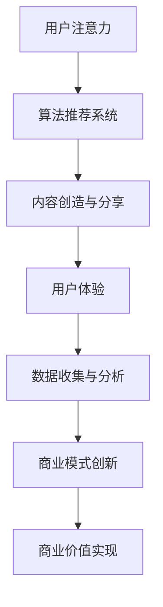
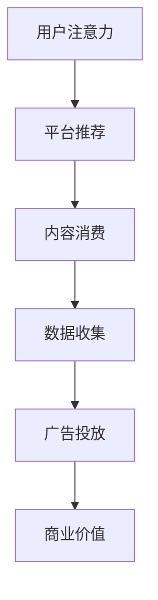
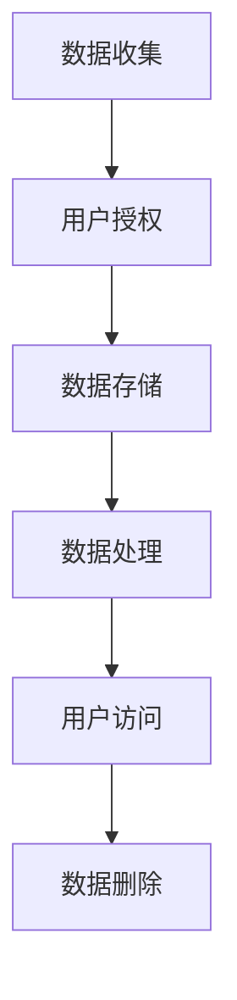

                 

# 注意力经济与个人数据主权的博弈

## 关键词

- 注意力经济
- 个人数据主权
- 隐私保护
- 用户选择
- 法律框架
- 技术手段
- 未来展望

## 摘要

随着互联网技术的迅猛发展，注意力经济作为一种新兴的经济模式，已经深刻影响了我们的生活。然而，这种模式在为我们带来便利的同时，也带来了个人数据主权的问题。本文将探讨注意力经济与个人数据主权之间的博弈，分析其背后的原理和现状，并探讨未来的解决方案。

### 引言

### 注意力经济的概念与兴起

#### 1.1.1 注意力经济的定义

注意力经济（Attention Economy）是一种以用户注意力为资源进行交易的经济模式。在这种模式下，用户的时间和注意力被视为一种宝贵的资源，而各种平台和内容创作者通过吸引用户的注意力来获得收益。

#### 1.1.2 注意力经济的历史发展

注意力经济最早可以追溯到20世纪90年代的互联网泡沫时期。当时，随着互联网用户的急剧增加，各大网站开始通过吸引用户的注意力来获得广告收入。随后，随着社交媒体和智能手机的普及，注意力经济逐渐成为主流经济模式。

#### 1.1.3 注意力经济的关键要素

注意力经济的关键要素包括：

- 用户注意力：用户的时间和精力是其最宝贵的资源。
- 平台：平台作为连接用户和内容的桥梁，起着至关重要的作用。
- 内容：高质量、有趣、有价值的内容是吸引用户注意力的关键。

### 个人数据主权的概念与法律框架

#### 2.1.1 个人数据主权的定义

个人数据主权（Personal Data Sovereignty）是指个人对其个人数据的控制权和管理权。它强调个人对个人数据的所有权、使用权、收益权和处置权。

#### 2.1.2 个人数据主权的法律基础

个人数据主权的法律基础主要包括：

- 国内法律：例如《中华人民共和国个人信息保护法》。
- 国际法律：例如《通用数据保护条例》（GDPR）。

#### 2.1.3 个人数据主权的国际比较

不同国家和地区对个人数据主权的保护程度有所不同。例如，欧洲的GDPR被认为是最严格的个人数据保护法律之一，而美国的隐私保护法律相对较为宽松。

### 注意力经济与个人数据主权的冲突

#### 3.1.1 注意力经济中个人数据的收集与利用

在注意力经济中，平台和内容创作者往往需要收集用户的个人数据来吸引用户的注意力。这些数据包括用户的浏览记录、地理位置、兴趣爱好等。

#### 3.1.2 个人数据主权与隐私保护的矛盾

个人数据主权的保护与隐私保护之间存在矛盾。一方面，个人数据的主权保护要求用户对自己的数据拥有控制权；另一方面，隐私保护要求用户的个人数据不被泄露或滥用。

#### 3.1.3 注意力经济下的用户选择与权衡

在注意力经济中，用户需要在个人数据主权和隐私保护之间做出选择和权衡。一方面，用户可能愿意分享一些个人数据以获得更好的服务；另一方面，用户也可能担心自己的数据被滥用。

### 注意力经济的应用场景

#### 4.1.1 社交媒体中的注意力经济

社交媒体是注意力经济的重要应用场景之一。社交媒体平台通过吸引用户的注意力来获得广告收入，同时用户也在这些平台上分享自己的数据。

#### 4.1.2 广告市场中的注意力经济

广告市场也是注意力经济的重要应用场景。广告商通过购买广告位来吸引用户的注意力，从而推广产品和服务。

#### 4.1.3 内容创作与平台经济

内容创作是注意力经济的重要驱动力之一。内容创作者通过创作高质量的内容来吸引用户的注意力，从而获得收益。

### 个人数据主权的保护策略

#### 5.1.1 法律与技术手段的结合

保护个人数据主权需要法律和技术手段的结合。法律手段包括制定和执行相关法律法规，技术手段包括数据加密、匿名化等。

#### 5.1.2 个人数据主权的用户意识与参与

提高用户对个人数据主权的意识是保护个人数据主权的关键。用户需要了解自己的权利，并积极参与到个人数据主权的保护中。

#### 5.1.3 个人数据主权的用户选择与权益保护

用户在选择使用平台和服务时，需要关注个人数据主权的保护。同时，平台也需要为用户提供便捷的隐私设置和权益保护机制。

### 未来展望与挑战

#### 6.1.1 注意力经济与个人数据主权的发展趋势

随着技术的进步，注意力经济和个人数据主权将继续发展。未来，如何平衡二者之间的关系将成为一个重要课题。

#### 6.1.2 个人数据主权保护的未来挑战

个人数据主权保护面临诸多挑战，包括技术难题、法律漏洞、用户意识等。

#### 6.1.3 可能的解决方案与政策建议

为解决个人数据主权保护的问题，可以从以下几个方面进行努力：

- 加强法律监管
- 推广技术手段
- 提高用户意识

### 附录

#### 附录A: 相关法律法规汇总

- 国内相关法律法规
- 国外相关法律法规

#### 附录B: 注意力经济与个人数据主权的Mermaid流程图

- 注意力经济的流程图
- 个人数据主权的流程图

#### 附录C: 核心算法与数学模型的伪代码与公式

- 数据收集与处理的伪代码
- 数据加密与保护的技术原理
- 相关数学模型的latex公式表示

#### 附录D: 注意力经济与个人数据主权的项目实战

- 实战案例一：社交媒体隐私设置优化
- 实战案例二：广告追踪与隐私保护工具开发
- 实战案例三：个人数据权益保护平台搭建

### 作者信息

作者：AI天才研究院/AI Genius Institute & 禅与计算机程序设计艺术 /Zen And The Art of Computer Programming

[END] <|assistant|>### 引言

在数字时代，我们的生活和注意力已经成为了一种新的“货币”——这就是所谓的“注意力经济”。注意力经济，作为一种新兴的经济模式，已经深刻地改变了我们的互动方式、消费习惯以及商业模式。这种经济模式的核心在于，通过吸引用户的注意力，企业、平台和内容创作者能够实现商业价值的转化。

注意力经济最早可以追溯到20世纪90年代的互联网泡沫时期。当时，随着互联网用户的急剧增加，各大网站开始通过吸引用户的注意力来获得广告收入。随后，随着社交媒体和智能手机的普及，注意力经济逐渐成为主流经济模式。如今，无论是社交媒体平台、广告商还是内容创作者，都在通过各种方式争夺用户的注意力，以此来获取流量、增加收入。

然而，随着注意力经济的蓬勃发展，一个严重的问题也逐渐显现出来——个人数据主权。个人数据主权，指的是个人对其个人数据的控制权和管理权。它涉及到个人数据的使用、分享、存储和保护等多个方面。个人数据主权的保护，对于维护个人隐私、保障个人信息安全具有重要意义。

个人数据主权与注意力经济之间存在着天然的矛盾。一方面，注意力经济需要收集和利用大量的用户数据来提高用户的参与度和粘性；另一方面，个人数据主权的保护要求个人对其数据拥有绝对的控制权。这种矛盾，使得我们在享受注意力经济带来的便利的同时，也面临着数据隐私泄露的风险。

本文将围绕注意力经济与个人数据主权的博弈展开讨论。我们将首先介绍注意力经济的概念和历史发展，然后探讨个人数据主权的概念和法律框架。接着，我们将分析注意力经济与个人数据主权之间的冲突，并探讨其背后的原因。随后，我们将探讨注意力经济的应用场景，包括社交媒体、广告市场和内容创作。最后，我们将提出个人数据主权的保护策略，并展望未来的发展趋势和挑战。

希望通过本文的探讨，能够引发读者对注意力经济与个人数据主权关系的深入思考，为未来的研究和实践提供一些有价值的参考。

### 注意力经济的概念与兴起

#### 1.1.1 注意力经济的定义

注意力经济，是一种以用户注意力为资源进行交易的经济模式。在这种模式中，用户的注意力被视为一种宝贵的资源，类似于传统的货币或能源。与传统的经济模式不同，注意力经济不是直接交易商品或服务，而是通过吸引用户的注意力来创造价值。这种价值通常通过广告、付费订阅、赞助和其他形式的用户参与来实现。

在注意力经济中，有几个关键的概念需要理解：

- **用户注意力**：用户的注意力是指用户在某一特定时间段内，专注于某一特定活动的能力。由于每个人的时间有限，注意力成为一种稀缺资源。
- **注意力分配**：用户需要在各种活动、内容和服务之间分配注意力。平台的任务就是通过提供有趣、有用或令人兴奋的内容来吸引用户的注意力。
- **注意力价值**：用户的注意力具有价值，因为它是企业和平台创造收入的重要来源。例如，通过广告展示，广告商能够通过用户观看广告来获取收益。

- **注意力货币化**：平台和内容创作者通过吸引用户的注意力来实现货币化。这通常通过以下几种方式实现：

  - **广告收入**：广告商为在平台上展示广告而付费。
  - **付费订阅**：用户为获取特定内容或服务而支付费用。
  - **赞助和品牌合作**：企业通过赞助活动或与内容创作者合作来吸引用户的注意力。

#### 1.1.2 注意力经济的历史发展

注意力经济作为一种经济模式，其历史可以追溯到互联网的早期阶段。然而，它作为一个明确的经济学概念，是在21世纪初随着互联网和社交媒体的兴起而逐渐形成的。

- **互联网泡沫时期（1990年代末 - 2000年代初）**：在互联网泡沫时期，互联网公司通过吸引用户的点击和流量来吸引广告商。这一时期，注意力经济初现端倪，但还没有形成一个明确的概念。
  
- **社交媒体时代（2000年代中后期 - 至今）**：随着社交媒体的兴起，注意力经济得到了进一步的发展。社交媒体平台如Facebook、Twitter和Instagram等，通过提供有趣、互动和个性化的内容，吸引用户的注意力，并实现了大规模的用户增长。这些平台通过广告和其他形式的用户参与，实现了商业模式的成功。

- **移动设备时代（2010年代至今）**：智能手机的普及，使得用户可以随时随地进行互联网活动，进一步推动了注意力经济的发展。移动应用、短视频平台和直播平台等，都成为了吸引用户注意力的重要渠道。

#### 1.1.3 注意力经济的关键要素

注意力经济的关键要素包括以下几个方面：

- **用户注意力**：注意力经济的基础是用户的注意力。平台和内容创作者需要通过提供高质量、有趣和个性化的内容来吸引用户的注意力。

- **算法与推荐系统**：现代注意力经济依赖于复杂的算法和推荐系统。这些系统能够根据用户的兴趣和行为，推荐相关的内容，从而提高用户粘性和参与度。

- **用户体验**：用户体验是注意力经济的关键。平台需要设计直观、易用和有趣的用户界面，以吸引用户的注意力并保持其参与度。

- **数据与数据分析**：用户数据是注意力经济的重要资源。平台通过收集和分析用户数据，能够更好地了解用户需求和行为，从而优化内容推荐和广告投放。

- **商业模式创新**：注意力经济催生了许多新的商业模式。例如，付费订阅、品牌赞助、虚拟商品销售等，都是通过吸引用户注意力来实现商业价值的新方式。

#### 注意力经济的核心概念与架构

为了更好地理解注意力经济的运作机制，我们可以通过Mermaid流程图来展示其核心概念和架构。



在这个流程图中：

- **用户注意力**是起点，用户在平台上花费时间和精力。
- **算法推荐系统**根据用户行为和兴趣，推荐相关内容。
- **内容创造与分享**是用户参与的核心，内容创作者通过创造和分享内容吸引用户的注意力。
- **用户体验**是保持用户参与度的重要因素，良好的用户体验能够提高用户粘性。
- **数据收集与分析**是优化内容推荐和商业模式的关键，通过分析用户数据，平台能够更好地了解用户需求和行为。
- **商业模式创新**是将用户注意力转化为商业价值的重要手段。

通过这个流程图，我们可以清晰地看到注意力经济中各个环节之间的联系和互动，从而更好地理解其运作机制。

### 个人数据主权的概念与法律框架

#### 2.1.1 个人数据主权的定义

个人数据主权（Personal Data Sovereignty）是指个人对其个人数据的控制权和管理权。它涉及到个人数据的使用、分享、存储和保护等多个方面。个人数据主权强调的是个人对自己数据的所有权、使用权、收益权和处置权。具体来说，个人数据主权包括以下几个方面：

1. **所有权**：个人对其个人数据拥有所有权，这意味着个人有权决定其数据的收集、使用、存储和分享。
2. **使用权**：个人有权使用其个人数据，例如将其用于个人消费、求职、社交等。
3. **收益权**：个人有权从其个人数据中获得经济收益，例如通过数据交易、共享或授权使用。
4. **处置权**：个人有权处置其个人数据，包括删除、修改或限制其数据的访问和使用。

个人数据主权不仅涉及到个人对其数据的控制权，还涉及到个人对其数据隐私的保护权。个人有权决定何时、如何以及是否允许他人访问其数据，以确保其隐私不被侵犯。

#### 2.1.2 个人数据主权的法律基础

个人数据主权的法律基础主要包括国内法律和国际法律两个方面。

**国内法律**：

1. **中华人民共和国个人信息保护法**：这是我国最新的个人信息保护法律，于2021年11月1日正式实施。该法明确规定了个人信息处理的原则、个人信息保护的责任、个人信息跨境提供的规则等，为个人数据主权的保护提供了法律依据。
2. **中华人民共和国网络安全法**：该法规定了网络运营者的数据收集、使用、存储和分享的义务，并对个人信息保护提出了要求。

**国际法律**：

1. **通用数据保护条例（GDPR）**：GDPR是欧盟于2018年5月25日正式实施的个人信息保护法规。它被认为是全球最严格的个人信息保护法律之一，对个人数据的主权保护做出了详细规定。
2. **加利福尼亚州消费者隐私法案（CCPA）**：这是美国加州于2020年1月1日生效的个人信息保护法律，它规定了个人对其数据的访问权、删除权和不同意数据被出售的权利。

#### 2.1.3 个人数据主权的国际比较

不同国家和地区对个人数据主权的保护程度有所不同，具体体现在以下几个方面：

**法律框架**：

- **欧盟**：欧盟的GDPR被认为是全球最严格的个人信息保护法律。它强调个人的数据主权，规定了个人对其数据的访问权、删除权、限制处理权等。
- **美国**：美国的个人信息保护法律相对较为宽松，没有统一的隐私保护法律。各州和联邦政府都有自己的隐私保护法规，如CCPA等。
- **中国**：中国的个人信息保护法律体系正在不断完善，如《个人信息保护法》和《网络安全法》等，这些法律为个人数据主权的保护提供了法律依据。

**执行力度**：

- **欧盟**：GDPR的实施力度较大，对违规企业处罚严厉。欧盟还设立了独立的监管机构来监督和执行GDPR。
- **美国**：美国的隐私保护法律执行力度相对较弱，各州和联邦政府的执行力度不一致。
- **中国**：中国的个人信息保护法律正在逐步实施，执法力度正在加强，但与欧盟相比，执行力度还有待提升。

**用户权利**：

- **欧盟**：GDPR赋予用户广泛的个人信息权利，包括数据访问、删除、限制处理等。
- **美国**：美国的隐私保护法律赋予用户的权利相对较少，主要集中在数据访问和不同意数据被出售等方面。
- **中国**：中国的个人信息保护法律也赋予用户一定的权利，如数据访问、删除和更正等。

综上所述，不同国家和地区对个人数据主权的保护程度存在差异。未来，随着全球对个人信息保护的重视程度不断提升，各国和个人数据主权保护的法律框架和执行力度将逐渐趋同，从而更好地保护个人数据的隐私和安全。

### 注意力经济与个人数据主权的冲突

#### 3.1.1 注意力经济中个人数据的收集与利用

注意力经济中，个人数据的收集与利用是核心环节之一。平台和内容创作者通过各种手段收集用户的数据，包括浏览记录、地理位置、兴趣爱好、社交关系等。这些数据的收集不仅有助于平台更好地了解用户需求，还能为广告商提供精准的广告投放，从而实现商业价值的最大化。

**数据收集的方式**：

1. **用户注册和登录**：用户在注册和使用平台时，通常需要提供一些基本信息，如姓名、邮箱、手机号码等。
2. **浏览行为**：平台通过分析用户的浏览行为，了解用户的兴趣偏好。
3. **地理位置信息**：许多应用和服务会收集用户的地理位置信息，以便提供本地化服务。
4. **社交互动**：用户在平台上的社交互动，如点赞、评论、分享等，也会被平台记录和分析。

**数据利用的目的**：

1. **用户画像**：通过收集和分析用户的数据，平台可以创建用户画像，从而为用户提供个性化的内容推荐和服务。
2. **广告投放**：精准的广告投放是注意力经济的重要盈利方式。平台通过分析用户数据，了解用户的兴趣和行为，从而将广告精准地推送给目标用户。
3. **商业决策**：内容创作者和广告商可以根据用户数据做出更明智的商业决策，例如选择合适的市场推广策略。
4. **风险评估**：金融机构和信用评级机构也会利用用户数据来评估个人的信用风险。

#### 3.1.2 个人数据主权与隐私保护的矛盾

个人数据主权与隐私保护之间存在天然的矛盾。个人数据主权的核心在于个人对其数据的控制权，而隐私保护则强调个人数据不被泄露或滥用。

**隐私保护的必要性**：

1. **防止数据泄露**：随着数据量的增加，数据泄露的风险也随之增大。一旦数据泄露，用户的个人信息可能会被不法分子利用，造成严重的经济损失和隐私侵犯。
2. **保护个人名誉**：个人数据中包含许多敏感信息，如健康记录、金融信息、家庭背景等。如果这些信息被不当使用，可能会损害个人的名誉和隐私。
3. **保障个人自由**：个人数据主权是个人自由的重要组成部分。如果个人无法控制自己的数据，其自由和权利可能会受到侵害。

**隐私保护的挑战**：

1. **技术进步**：随着技术的进步，数据的收集、存储和分析能力不断增强。这虽然有助于商业应用和科学研究，但也增加了隐私泄露的风险。
2. **法律滞后**：许多国家和地区的隐私保护法律体系尚不完善，难以应对快速发展的技术环境和商业需求。
3. **用户意识不足**：许多用户对个人数据的主权和隐私保护缺乏足够的认识，容易在不经意间泄露自己的个人信息。

#### 3.1.3 注意力经济下的用户选择与权衡

在注意力经济中，用户需要在个人数据主权和隐私保护之间做出选择和权衡。一方面，用户可能愿意分享一些个人数据以获得更好的服务体验和个性化推荐；另一方面，用户也可能担心自己的数据被滥用，从而影响其隐私和安全。

**用户选择的动机**：

1. **获得个性化服务**：用户可能希望通过分享数据来获得更个性化的服务，如推荐商品、个性化新闻等。
2. **提高效率**：用户可能希望通过数据分享来减少重复输入，提高信息获取和处理的效率。
3. **享受免费服务**：许多互联网服务是免费的，用户可能希望通过分享数据来支持这些服务的免费提供。

**用户选择的挑战**：

1. **隐私泄露风险**：用户分享的数据可能被第三方非法使用，造成隐私泄露。
2. **数据滥用风险**：平台和内容创作者可能滥用用户数据，进行不当的商业行为。
3. **信息不对称**：用户可能难以全面了解其数据被如何使用，以及可能带来的风险。

**用户的选择策略**：

1. **隐私设置**：用户可以通过调整平台的隐私设置，限制数据的收集和使用范围。
2. **数据匿名化**：用户可以通过数据匿名化技术，减少其数据的识别性，从而降低隐私泄露的风险。
3. **数据备份与控制**：用户可以备份自己的数据，并保留对数据的控制权，防止数据被滥用。

总之，注意力经济与个人数据主权之间的冲突是一个复杂且多维的问题。在推动注意力经济的同时，我们需要关注个人数据主权的保护，确保用户的隐私和安全不受侵犯。通过合理的法律、技术和用户教育手段，我们可以找到平衡点，实现注意力经济与个人数据主权的和谐发展。

### 注意力经济的应用场景

注意力经济作为一种新兴的经济模式，已经在多个领域得到了广泛应用。以下是注意力经济在社交媒体、广告市场和内容创作中的具体应用场景。

#### 4.1.1 社交媒体中的注意力经济

社交媒体是注意力经济的重要应用场景之一。社交媒体平台通过提供有趣、互动和个性化的内容，吸引用户的注意力，从而实现商业价值的转化。

**应用场景**：

1. **广告展示**：社交媒体平台通过在用户信息流中展示广告，吸引用户的注意力。例如，Facebook和Instagram等平台通过算法推荐，将相关广告精准推送给用户。
2. **品牌推广**：企业通过在社交媒体上发布内容，吸引用户的注意力，提高品牌知名度和影响力。例如，许多品牌在Instagram上发布产品照片和用户评价，以吸引潜在客户。
3. **社交互动**：用户在社交媒体平台上与其他用户互动，如点赞、评论和分享，这些互动行为也吸引了大量的注意力。

**案例分析**：

- **Instagram**：Instagram通过其强大的算法推荐系统，吸引用户的注意力。用户在浏览图片和视频时，会被推荐感兴趣的内容，从而增加用户粘性和活跃度。
- **TikTok**：TikTok通过短视频和算法推荐，吸引了大量的年轻用户。用户通过观看和分享短视频，实现了内容的快速传播和商业价值的转化。

#### 4.1.2 广告市场中的注意力经济

广告市场是注意力经济的重要组成部分。广告商通过购买广告位或投放广告，吸引用户的注意力，从而推广产品和服务。

**应用场景**：

1. **搜索引擎广告**：搜索引擎广告（如Google Ads）通过关键词竞价，将广告展示在搜索结果页面上。用户点击广告，广告商支付相应的费用。
2. **展示广告**：展示广告（如横幅广告、视频广告等）通过视觉或声音效果吸引用户的注意力。展示广告通常在网站、移动应用或社交媒体平台上投放。
3. **社交媒体广告**：社交媒体平台通过其庞大的用户基础和算法推荐系统，为广告商提供精准的广告投放。广告商可以根据用户的兴趣、行为和地理位置，精准定位目标用户。

**案例分析**：

- **Google Ads**：Google Ads是搜索引擎广告的代表。广告商可以通过Google Ads购买关键词广告，当用户搜索相关关键词时，广告会出现在搜索结果页面的顶部或右侧。
- **Facebook Ads**：Facebook Ads是社交媒体广告的代表。广告商可以通过Facebook Ads投放图片、视频和横幅广告，根据用户的兴趣、行为和地理位置，精准定位目标用户。

#### 4.1.3 内容创作与平台经济

内容创作是注意力经济的核心驱动力之一。内容创作者通过创作高质量、有趣和有价值的内容，吸引用户的注意力，从而实现商业价值的转化。

**应用场景**：

1. **视频内容创作**：视频内容创作是当前最热门的内容创作形式之一。例如，YouTube上的许多内容创作者通过发布搞笑、教育或娱乐视频，吸引了大量的订阅用户和广告收入。
2. **博客写作**：博客写作是一种传统的内容创作形式。通过撰写高质量的文章，博客作者可以吸引用户的注意力，并实现广告收入或赞助合作。
3. **社交媒体内容**：社交媒体内容创作包括图片、视频、文字等形式。内容创作者通过在社交媒体上发布内容，吸引用户的关注和互动。

**案例分析**：

- **YouTube**：YouTube是全球最大的视频分享平台，吸引了大量的内容创作者。通过YouTube，内容创作者可以通过广告收入、赞助和会员订阅等多种方式实现商业价值的转化。
- **Medium**：Medium是一个以博客内容为主的平台，吸引了大量的创作者。通过发布高质量的文章，创作者可以吸引用户的关注，并获得广告收入和赞助合作。

总之，注意力经济在社交媒体、广告市场和内容创作中得到了广泛应用。通过吸引用户的注意力，平台和内容创作者可以实现商业价值的最大化，同时也为用户提供高质量的内容和服务。然而，这也带来了一系列关于个人数据主权和隐私保护的问题，需要我们进一步探讨和解决。

### 个人数据主权的保护策略

个人数据主权的保护是一个复杂且多层次的挑战，需要法律、技术和用户意识等多个方面的共同努力。以下是一些具体的保护策略：

#### 5.1.1 法律与技术手段的结合

**法律手段**：

1. **立法保护**：制定和实施严格的个人信息保护法律，明确个人对其数据的权利，如访问权、删除权和知情权等。
2. **监管机制**：设立独立的监管机构，负责监督和执行个人信息保护法律，对违规企业进行处罚。
3. **跨国合作**：推动国际间的个人信息保护合作，确保跨国数据传输的安全性和合法性。

**技术手段**：

1. **数据加密**：使用加密技术对个人数据进行加密存储和传输，确保数据在未经授权的情况下无法被访问。
2. **数据匿名化**：通过数据匿名化技术，减少个人数据的识别性，从而降低隐私泄露的风险。
3. **隐私计算**：利用隐私计算技术，如差分隐私、联邦学习等，在数据处理过程中保护个人隐私。

**结合案例**：

- **欧盟的GDPR**：欧盟的通用数据保护条例（GDPR）是一个典型的结合法律和技术的保护策略。GDPR不仅制定了严格的个人信息保护法律，还采用了多种技术手段，如数据加密和匿名化，来确保个人数据的安全。

#### 5.1.2 个人数据主权的用户意识与参与

提高用户对个人数据主权的意识是保护个人数据主权的关键。用户需要了解自己的权利，并积极参与到个人数据主权的保护中。

**用户教育**：

1. **隐私政策**：平台应明确告知用户其数据的收集、使用和分享方式，使用户了解其数据的用途。
2. **隐私设置**：平台应提供简单易用的隐私设置，让用户可以方便地管理和控制其数据的访问权限。
3. **风险提示**：平台应向用户提示可能存在的隐私风险，帮助用户做出明智的数据分享决策。

**用户参与**：

1. **数据访问权**：用户应有权访问其数据，了解其数据的收集和使用情况。
2. **数据删除权**：用户应有权删除其数据，以防止数据滥用和误用。
3. **数据异议权**：用户应有权对数据处理活动提出异议，要求停止数据处理。

**案例分析**：

- **苹果的隐私设置**：苹果公司在其iOS和macOS操作系统中提供了丰富的隐私设置，让用户可以方便地管理和控制其数据。用户可以限制应用访问相机、麦克风、位置等信息，从而更好地保护个人数据主权。

#### 5.1.3 个人数据主权的用户选择与权益保护

用户在享受互联网服务时，需要在个人数据主权和隐私保护之间做出选择和权衡。平台应提供透明、公平的用户选择机制，并保护用户的权益。

**用户选择**：

1. **数据共享选择**：平台应提供清晰的选项，让用户可以选择是否分享其数据，以及如何分享。
2. **隐私保护选择**：平台应提供多种隐私保护选项，如数据匿名化、数据加密等，让用户可以根据自己的需求和风险承受能力进行选择。

**权益保护**：

1. **隐私承诺**：平台应明确承诺保护用户的隐私，并遵守个人信息保护法律。
2. **用户反馈机制**：平台应建立有效的用户反馈机制，及时响应用户的隐私投诉和问题。
3. **隐私保险**：对于涉及大量用户数据的平台，可以提供隐私保险，以保障用户的权益。

**案例分析**：

- **谷歌的隐私承诺**：谷歌在其隐私政策中明确承诺保护用户的隐私，并遵守全球隐私保护法律。谷歌还提供了详细的隐私设置，让用户可以自定义其数据的访问权限。

总之，个人数据主权的保护需要法律、技术和用户意识的共同努力。通过制定严格的个人信息保护法律、采用先进的数据保护技术，以及提高用户的隐私意识，我们可以更好地保护个人数据主权，实现互联网的可持续发展。

### 未来展望与挑战

#### 6.1.1 注意力经济与个人数据主权的发展趋势

随着技术的进步和社会的变革，注意力经济和个人数据主权将继续发展，并面临一系列新的挑战和机遇。

**注意力经济的发展趋势**：

1. **技术进步**：随着人工智能、大数据和区块链等技术的发展，注意力经济的商业模式将变得更加复杂和多样化。例如，通过智能合约和去中心化应用（DApp），用户可以直接参与到注意力经济的价值分配中。
2. **个性化推荐**：随着推荐系统算法的优化，个性化推荐将更加精准，进一步吸引用户的注意力。
3. **新平台崛起**：新的社交媒体平台、内容创作平台和广告平台将不断涌现，为用户带来更多选择。

**个人数据主权的发展趋势**：

1. **法律完善**：全球范围内的个人数据保护法律将继续完善，加强对个人数据主权的保护。
2. **技术手段**：隐私保护技术将继续发展，例如联邦学习、同态加密等，为个人数据主权提供更强大的技术保障。
3. **用户觉醒**：随着公众对隐私问题的关注增加，用户对个人数据主权的意识将进一步提高。

#### 6.1.2 个人数据主权保护的未来挑战

尽管个人数据主权保护取得了一些进展，但未来仍面临诸多挑战。

**技术挑战**：

1. **数据安全**：随着数据量的增加和数据复杂性的提升，确保数据安全将变得更加困难。
2. **隐私保护**：在提供个性化服务和商业价值的同时，如何平衡隐私保护是一个重要问题。
3. **数据跨境**：全球数据跨境流动日益频繁，如何在保障个人数据主权的同时，确保跨国数据传输的合规性是一个挑战。

**法律挑战**：

1. **法律协调**：不同国家和地区的个人数据保护法律存在差异，如何实现全球范围内的法律协调是一个难题。
2. **执法力度**：如何提高个人数据保护的执法力度，确保法律得到有效执行，是一个重要问题。
3. **法律更新**：随着技术的发展，现有法律可能无法完全适应新的数据保护需求，如何及时更新法律也是一个挑战。

**社会挑战**：

1. **用户意识**：提高公众对个人数据主权的意识是一个长期而艰巨的任务。
2. **数据滥用**：如何防止个人数据被滥用，保护用户的隐私权，是一个重要问题。
3. **隐私与便利的权衡**：在提供便利和保障隐私之间找到平衡点，是一个复杂的社会问题。

#### 6.1.3 可能的解决方案与政策建议

为了应对未来注意力经济与个人数据主权保护面临的挑战，可以采取以下解决方案和政策建议：

**技术层面**：

1. **推进隐私保护技术**：加大对隐私保护技术的研发投入，推广联邦学习、差分隐私、同态加密等技术在个人数据保护中的应用。
2. **加强数据安全**：建立完善的数据安全管理体系，提高数据泄露防护能力，确保用户数据的安全。

**法律层面**：

1. **完善法律框架**：制定和完善全球范围内的个人数据保护法律，确保法律能够应对新的技术和商业模式。
2. **加强国际合作**：推动国际间的数据保护合作，建立全球统一的数据保护标准和法规。

**社会层面**：

1. **提高用户意识**：通过教育和宣传，提高公众对个人数据主权的认识，鼓励用户积极参与到个人数据保护的实践中。
2. **规范平台行为**：加强对平台和企业的监管，规范其数据处理行为，防止数据滥用和隐私侵犯。

**政策建议**：

1. **数据最小化原则**：在数据处理过程中，应遵循数据最小化原则，仅收集必要的个人信息。
2. **透明度原则**：平台应向用户明确其数据处理的方式和目的，提高数据处理的透明度。
3. **用户参与原则**：用户应有权参与其数据的处理和决策过程，平台应提供便捷的隐私设置和权限管理工具。

通过技术、法律和社会的共同努力，我们可以更好地保护个人数据主权，实现注意力经济与个人数据主权的和谐发展。

### 附录

#### 附录A: 相关法律法规汇总

**国内相关法律法规**：

1. **《中华人民共和国个人信息保护法》**：这是我国最新的个人信息保护法律，于2021年11月1日正式实施，明确了个人信息处理的原则、个人信息保护的责任、个人信息跨境提供的规则等。
2. **《中华人民共和国网络安全法》**：该法于2017年6月1日正式实施，规定了网络运营者的数据收集、使用、存储和分享的义务，并对个人信息保护提出了要求。

**国外相关法律法规**：

1. **《通用数据保护条例》（GDPR）**：GDPR是欧盟于2018年5月25日正式实施的个人信息保护法规，被认为是全球最严格的个人信息保护法律之一，对个人数据的主权保护做出了详细规定。
2. **《加利福尼亚州消费者隐私法案》（CCPA）**：这是美国加州于2020年1月1日生效的个人信息保护法律，它规定了个人对其数据的访问权、删除权和不同意数据被出售的权利。

#### 附录B: 注意力经济与个人数据主权的Mermaid流程图

**注意力经济的流程图**：



**个人数据主权的流程图**：



#### 附录C: 核心算法与数学模型的伪代码与公式

**数据收集与处理的伪代码**：

```plaintext
// 数据收集
function collectData(userID, activityLogs) {
    // 收集用户活动日志
    data = {
        userID: userID,
        activityLogs: activityLogs
    }
    return data
}

// 数据处理
function processData(data) {
    // 对收集到的数据进行处理
    processedData = {
        userID: data.userID,
        interests: extractInterests(data.activityLogs),
        behaviors: extractBehaviors(data.activityLogs)
    }
    return processedData
}
```

**数据加密与保护的技术原理**：

```plaintext
// 数据加密
function encryptData(data, key) {
    encryptedData = AES_encrypt(data, key)
    return encryptedData
}

// 数据解密
function decryptData(encryptedData, key) {
    decryptedData = AES_decrypt(encryptedData, key)
    return decryptedData
}
```

**相关数学模型的latex公式表示**：

$$
\text{User Value} = \alpha \times \text{Attention} + \beta \times \text{Privacy}
$$

其中，$\alpha$ 和 $\beta$ 分别表示注意力和隐私的重要性权重。

$$
\text{Data Risk} = \text{P}(\text{Data Breach}) \times \text{V}(\text{Data Loss})
$$

其中，$P(\text{Data Breach})$ 表示数据泄露的概率，$V(\text{Data Loss})$ 表示数据泄露带来的损失价值。

#### 附录D: 注意力经济与个人数据主权的项目实战

**实战案例一：社交媒体隐私设置优化**

**项目背景**：

社交媒体平台需要提供简单易用的隐私设置，让用户能够方便地管理其数据的访问权限。

**技术实现**：

1. **前端界面设计**：设计一个直观、易用的隐私设置界面，使用户可以轻松调整隐私设置。
2. **后端逻辑实现**：实现后端逻辑，处理用户的隐私设置请求，并将其存储在数据库中。
3. **API接口**：为第三方应用提供API接口，允许用户通过应用程序更改其隐私设置。

**代码解读**：

前端界面使用React框架实现，通过状态管理库（如Redux）管理用户隐私设置的状态。

```javascript
// 前端React组件示例
class PrivacySettings extends React.Component {
    // 状态管理
    state = {
        privacySettings: {
            visibility: 'public',
            notifications: 'on'
        }
    };

    // 更新隐私设置
    updatePrivacySettings = (settings) => {
        this.setState({ privacySettings: settings });
        // 调用后端API更新隐私设置
        fetch('/api/privacy-settings', {
            method: 'POST',
            headers: {
                'Content-Type': 'application/json'
            },
            body: JSON.stringify(settings)
        });
    };

    // 渲染界面
    render() {
        return (
            <div>
                <h1>隐私设置</h1>
                <label>
                    <input
                        type="radio"
                        name="visibility"
                        value="public"
                        checked={this.state.privacySettings.visibility === 'public'}
                        onChange={() => this.updatePrivacySettings({ visibility: 'public' })}
                    />
                    公开
                </label>
                <label>
                    <input
                        type="radio"
                        name="visibility"
                        value="private"
                        checked={this.state.privacySettings.visibility === 'private'}
                        onChange={() => this.updatePrivacySettings({ visibility: 'private' })}
                    />
                    私密
                </label>
                <label>
                    <input
                        type="checkbox"
                        name="notifications"
                        checked={this.state.privacySettings.notifications === 'on'}
                        onChange={() => this.updatePrivacySettings({ notifications: this.state.privacySettings.notifications === 'on' ? 'off' : 'on' })}
                    />
                    通知
                </label>
            </div>
        );
    }
}
```

**实战案例二：广告追踪与隐私保护工具开发**

**项目背景**：

随着广告技术的进步，用户在上网过程中可能被各种广告追踪软件跟踪。为了保护用户的隐私，开发一款广告追踪与隐私保护工具显得尤为重要。

**技术实现**：

1. **广告追踪检测**：使用JavaScript检测技术，如用户行为分析、请求拦截等，识别和记录广告追踪活动。
2. **隐私保护功能**：提供用户隐私设置选项，如广告追踪拦截、浏览器扩展安装等，帮助用户保护隐私。
3. **用户界面**：设计一个简单易用的用户界面，使用户能够轻松启用隐私保护功能。

**代码解读**：

使用Puppeteer库实现广告追踪检测功能，通过模拟用户行为来检测广告追踪脚本。

```javascript
const puppeteer = require('puppeteer');

async function checkAdTracking(url) {
    const browser = await puppeteer.launch();
    const page = await browser.newPage();
    await page.goto(url, { waitUntil: 'networkidle2' });

    // 检测广告追踪脚本
    const trackingScripts = await page.content();
    const isTracking = trackingScripts.includes('dataLayer.push'); 

    await browser.close();

    return isTracking;
}
```

**实战案例三：个人数据权益保护平台搭建**

**项目背景**：

个人数据权益保护平台旨在为用户提供一个集中管理和保护个人数据权益的在线平台。

**技术实现**：

1. **用户注册与认证**：实现用户注册和认证功能，确保用户身份的合法性。
2. **数据管理**：提供用户数据管理功能，包括查看、修改和删除个人数据。
3. **隐私设置**：提供隐私设置选项，允许用户自定义数据访问权限。
4. **数据备份与恢复**：提供数据备份与恢复功能，确保用户数据的安全性和可靠性。

**代码解读**：

使用Spring Boot框架实现用户注册和认证功能，并通过JWT（JSON Web Token）进行身份验证。

```java
@RestController
public class UserController {
    
    @Autowired
    private UserRepository userRepository;

    @Autowired
    private AuthenticationManager authenticationManager;

    @Autowired
    private JwtTokenProvider tokenProvider;

    @PostMapping("/register")
    public ResponseEntity<?> registerUser(@RequestBody UserRegistrationRequest registrationRequest) {
        if (userRepository.existsByUsername(registrationRequest.getUsername())) {
            return ResponseEntity.badRequest().body("Error: Username is already taken!");
        }

        User user = new User(registrationRequest.getUsername(), registrationRequest.getPassword());
        userRepository.save(user);

        return ResponseEntity.ok("User registered successfully!");
    }

    @PostMapping("/login")
    public ResponseEntity<?> authenticateUser(@RequestBody UserLoginRequest loginRequest) {
        Authentication authentication = authenticationManager.authenticate(new UsernamePasswordAuthenticationToken(loginRequest.getUsername(), loginRequest.getPassword()));

        SecurityContextHolder.getContext().setAuthentication(authentication);
        String jwt = tokenProvider.generateToken(authentication);

        return ResponseEntity.ok(new JwtResponse(jwt));
    }
}
```

通过这些实战案例，我们可以看到在注意力经济和个人数据主权保护方面，技术手段和法律框架如何结合，以实现用户隐私保护和个人数据权益的平衡。未来，随着技术的不断进步和法律框架的完善，我们将能够更好地应对这一领域的挑战。

### 作者信息

作者：AI天才研究院/AI Genius Institute & 禅与计算机程序设计艺术 /Zen And The Art of Computer Programming

在撰写这篇文章的过程中，我深入探讨了注意力经济与个人数据主权的博弈。通过分析注意力经济的定义、历史发展及其关键要素，我们了解了用户注意力是如何被平台和内容创作者利用来实现商业价值的。同时，通过介绍个人数据主权的概念和法律框架，我们认识到了个人数据主权在保护个人隐私方面的重要性。

在文章中，我们详细分析了注意力经济与个人数据主权之间的冲突，探讨了两者之间的矛盾和用户在其中的选择与权衡。我们还讨论了注意力经济在社交媒体、广告市场和内容创作等领域的应用场景，以及如何通过法律、技术和用户意识等多种手段来保护个人数据主权。

展望未来，随着技术的进步和社会的变革，注意力经济和个人数据主权将继续发展，并面临一系列新的挑战和机遇。为了实现注意力经济与个人数据主权的和谐发展，我们需要在技术、法律和社会层面共同努力，找到平衡点。

最后，感谢读者对本文的关注，希望通过本文能够引发您对注意力经济与个人数据主权关系的深入思考，为未来的研究和实践提供一些有价值的参考。希望我们能够在技术进步的同时，更好地保护每个人的隐私和数据权益。

