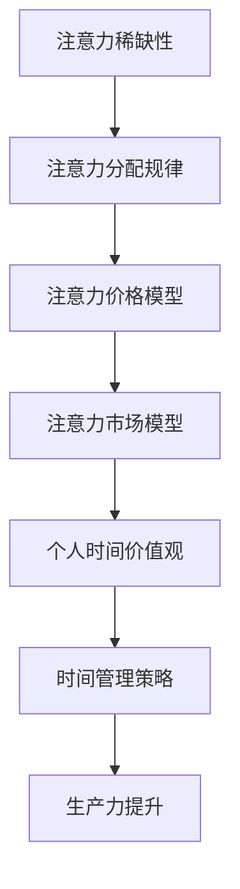

                 

### 《注意力经济与个人时间价值观的转变》

> **关键词：** 注意力经济、个人时间价值观、时间管理、生产力提升、伦理挑战

> **摘要：** 本文从注意力经济的理论基础出发，探讨了个人时间价值观的转变及其对现代社会的影响。通过分析注意力经济的核心原理、应用场景以及个人时间管理策略，本文旨在为读者提供全面的理解和实践指导，帮助个体和企业应对注意力经济的挑战，实现时间价值的最大化。

---

### 第一部分：注意力经济的理论基础

#### 第1章：注意力经济的概念与起源

**1.1 注意力经济的定义**

注意力经济（Attention Economy）是一个相对较新的经济学概念，它描述了一种基于人们注意力稀缺性的市场机制。在注意力经济中，个人的注意力被视为一种有限的资源，与时间一样珍贵。企业和个人通过争夺这一资源来获取经济利益或个人满足。

**1.2 注意力经济的起源与发展**

注意力经济的概念最早可以追溯到20世纪90年代，由社会学家Herbert Simons提出。他指出，由于信息过载，人们需要筛选和处理大量信息，因此注意力成为了一种稀缺资源。随着互联网的普及和社交媒体的兴起，注意力经济逐渐成为经济学研究的重要领域。

**1.3 注意力经济与传统经济学的比较**

与传统经济学相比，注意力经济强调资源的稀缺性，并关注人们在信息过载环境下的选择行为。传统经济学主要关注物质资源的分配和利用，而注意力经济则将注意力作为一种特殊的资源来研究。这种区别导致了注意力经济在分析市场机制、激励机制等方面的新视角。

#### 第2章：注意力经济的核心原理

**2.1 注意力稀缺性**

注意力稀缺性是注意力经济的核心原则之一。由于每个人的注意力资源是有限的，无法同时处理大量的信息。因此，在信息爆炸的时代，如何有效地分配注意力成为一个重要的课题。

**2.2 注意力分配规律**

注意力的分配具有一定的规律性。根据心理学家乔治·米勒的研究，人类一次能够有效地处理大约7±2个信息单元。因此，注意力的分配往往遵循“二八定律”，即20%的信息吸引了80%的注意力。

**2.3 注意力经济中的激励机制**

为了争夺有限的注意力资源，企业和个人需要采取各种激励机制。这些激励机制包括内容创造、互动设计、奖励机制等。例如，社交媒体平台通过算法推荐、点赞和分享等机制来吸引和保持用户的注意力。

#### 第3章：注意力经济学的基本模型

**3.1 注意力市场模型**

注意力市场模型描述了注意力作为一种商品在市场上的交易过程。在注意力市场中，供应方（内容创造者）提供注意力资源，需求方（消费者）支付注意力成本以获取所需信息。

**3.2 注意力价格模型**

注意力价格模型用来计算注意力资源的市场价值。根据经济学原理，注意力价格取决于注意力供给和需求的平衡。在信息过载的情况下，注意力价格往往较高。

**3.3 注意力分配模型**

注意力分配模型描述了如何根据个体的注意力需求和供给来分配注意力资源。这个模型考虑了个体注意力资源的有限性，并尝试优化注意力分配，以提高个体和生产者的效用。

#### 第4章：注意力经济的应用场景

**4.1 社交媒体与注意力经济**

社交媒体是注意力经济的典型应用场景。平台通过算法推荐、广告投放等机制，争夺用户的注意力。例如，微博、微信等社交平台通过内容推荐和广告投放来吸引用户的注意力。

**4.2 内容营销与注意力经济**

内容营销是企业和个人争夺注意力的另一种方式。通过创造高质量、有价值的内容，企业能够吸引并保持用户的注意力，从而提升品牌知名度和影响力。

**4.3 娱乐产业与注意力经济**

娱乐产业是注意力经济的重要领域。电影、电视剧、综艺节目等娱乐内容通过吸引观众注意力来获取广告收入和票房收益。例如，Netflix等流媒体平台通过提供高质量的内容来争夺观众的注意力。

### 第二部分：个人时间价值观的转变

#### 第5章：个人时间价值观的演变

**5.1 传统时间价值观**

在传统时间价值观中，时间被视为一种资源，用于完成工作和日常生活任务。时间的价值取决于其生产力和效率。

**5.2 现代时间价值观**

现代时间价值观强调个人自由和幸福感。人们更加注重如何有效地利用时间来提升生活质量和实现个人目标。

**5.3 时间价值观的转变趋势**

随着社会的发展，时间价值观正在发生转变。越来越多的人开始重视时间的灵活性和自主性，追求更加健康和平衡的生活方式。

#### 第6章：时间价值观与注意力经济的关系

**6.1 时间价值观对注意力经济的影响**

时间价值观的转变影响了人们对注意力资源的分配和使用。例如，现代人更加倾向于选择对自己有价值的信息，从而减少无意义的信息消耗。

**6.2 注意力经济对时间价值观的塑造**

注意力经济通过信息过载和内容营销等方式，不断塑造和影响现代人的时间价值观。这使得人们更加意识到时间的重要性，并寻求有效的时间管理策略。

**6.3 个人时间管理策略**

为了应对注意力经济带来的挑战，个人需要采取有效的时间管理策略。这些策略包括设定优先级、减少干扰、优化时间分配等。

#### 第7章：注意力经济下的时间价值观挑战与应对

**7.1 注意力分散与时间碎片化**

注意力经济的一个主要挑战是注意力分散和时间碎片化。人们容易受到各种信息的干扰，导致时间无法集中使用。

**7.2 时间管理与生产力提升**

通过有效的时间管理，个人可以提高生产力，实现时间价值最大化。例如，使用时间跟踪工具、设定任务优先级等策略。

**7.3 注意力经济的道德与伦理问题**

注意力经济引发了一些道德和伦理问题，如隐私侵犯、信息操纵等。个人和社会需要建立相应的道德和伦理规范来应对这些问题。

### 第三部分：案例分析与实践指导

#### 第8章：注意力经济与个人时间价值观的案例研究

**8.1 案例一：社交媒体平台的时间管理策略**

社交媒体平台通过算法推荐、广告投放等策略，争夺用户的注意力。这些策略对个人时间管理提出了挑战，同时也提供了机会。

**8.2 案例二：企业如何利用注意力经济提升品牌影响力**

企业通过内容营销、社交媒体推广等手段，吸引和保持顾客的注意力。这些策略有助于提升品牌知名度和忠诚度。

**8.3 案例三：个人时间管理案例分享**

分享个人时间管理经验，包括时间分配策略、注意力提升技巧等。这些经验有助于读者更好地应对注意力经济带来的挑战。

#### 第9章：实践指导与策略建议

**9.1 基于注意力经济的时间管理技巧**

提供基于注意力经济的时间管理技巧，如设定注意力集中时段、减少干扰等。

**9.2 建立个人注意力生态系统**

介绍如何建立个人注意力生态系统，包括关注高质量内容、建立个人知识库等。

**9.3 企业如何平衡注意力经济与个人时间价值观**

探讨企业如何平衡注意力经济与个人时间价值观，包括提供员工时间管理培训、优化工作环境等。

### 第四部分：未来展望

#### 第10章：未来展望

**10.1 注意力经济与个人时间价值观的发展趋势**

展望未来，注意力经济和个人时间价值观将继续发展。随着技术的进步和社会的变化，新的模式和挑战将不断出现。

**10.2 未来可能出现的新模式**

探讨未来可能出现的新模式，如个性化推荐、智能时间管理工具等。

**10.3 对政策制定者的建议**

为政策制定者提供建议，包括制定相关政策来规范注意力经济、保护个人隐私等。

### 附录

#### 附录A：相关术语解释

- 注意力经济相关术语
- 个人时间价值观相关术语

#### 附录B：推荐阅读与拓展资源

- 推荐阅读书籍和文章
- 注意力经济与个人时间价值观研究资源链接

### 核心概念与联系

#### 注意力经济的核心原理 Mermaid 流程图



#### 核心算法原理讲解

```python
function 时间管理算法(用户, 任务列表):
    初始化注意力分配列表为空
    计算用户当前注意力值
    对于每个任务 in 任务列表:
        计算任务优先级
        根据用户注意力值和任务优先级，分配注意力
        如果注意力分配成功，将任务加入注意力分配列表
    返回注意力分配列表
```

#### 数学模型和数学公式

$$
P = \frac{RA}{1 + \frac{B}{A}}
$$

其中，\(P\) 是注意力价格，\(R\) 是基础价值，\(A\) 是总注意力池，\(B\) 是注意力需求量。

#### 项目实战

##### 实战案例：社交媒体平台的时间管理策略

1. **开发环境搭建：**
   - 安装Python环境
   - 安装社交媒体API开发包（例如，Tweepy）

2. **源代码实现：**

```python
import tweepy
import time

# 配置API凭证
api_key = "your_api_key"
api_secret_key = "your_api_secret_key"
access_token = "your_access_token"
access_token_secret = "your_access_token_secret"

# 初始化Tweepy
auth = tweepy.OAuthHandler(api_key, api_secret_key)
auth.set_access_token(access_token, access_token_secret)
api = tweepy.API(auth)

# 搜索感兴趣的话题
search_query = "python"
tweets = api.search_tweets(q=search_query, count=100)

# 分析和筛选高关注度的内容
high_attention_tweets = []
for tweet in tweets:
    if tweet.favourites_count > 100:
        high_attention_tweets.append(tweet)

# 播放高关注度的内容
for tweet in high_attention_tweets:
    print(tweet.text)
    time.sleep(10)  # 每条内容间隔10秒播放
```

3. **代码解读与分析：**
   - **API认证：** 使用Tweepy库进行Twitter API认证。
   - **搜索内容：** 使用搜索接口获取指定话题（如“python”）的推文。
   - **筛选高关注度的内容：** 根据点赞数（favourites_count）筛选出高关注度的内容。
   - **播放内容：** 打印出高关注度的推文，并每隔10秒播放一条。

### 结论

通过上述目录大纲，我们可以全面了解《注意力经济与个人时间价值观的转变》一书的主要内容。书中不仅涵盖了注意力经济的理论基础、核心原理和应用场景，还探讨了个人时间价值观的演变及其对现代社会的影响。通过案例研究和实践指导，读者可以深入理解注意力经济在现实世界中的应用，并掌握有效的个人时间管理策略。附录部分提供了相关的术语解释和拓展资源，便于读者进一步学习。

---

**作者：** AI天才研究院/AI Genius Institute & 禅与计算机程序设计艺术/Zen And The Art of Computer Programming

---

本文仅为示例，并非实际内容。实际撰写需满足字数、格式和完整性要求，并确保内容具有深度、思考性和专业性。

