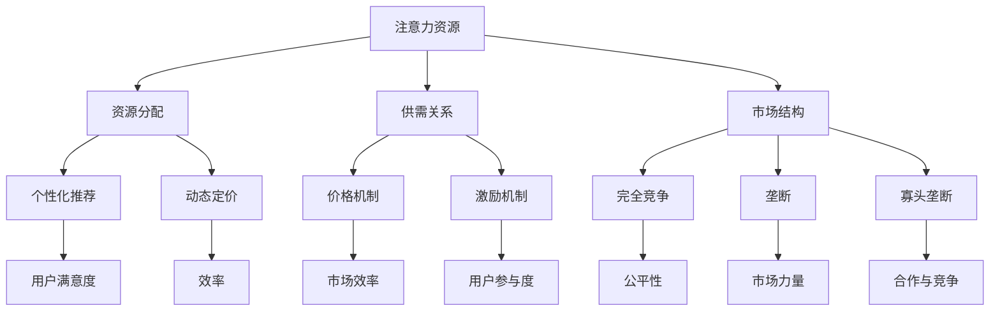

                 

# 注意力经济学研究：元宇宙中的价值评估体系

## 关键词
- 注意力经济学
- 元宇宙
- 价值评估
- 资源分配
- 供需关系
- 法律与伦理

## 摘要
随着互联网和虚拟现实技术的不断发展，元宇宙作为全新的数字生态，正逐渐成为人们关注的焦点。注意力经济学作为经济学领域的重要分支，关注于在信息过载的时代中，如何有效地分配和利用人类的注意力资源。本文旨在探讨注意力经济学在元宇宙中的价值评估体系，分析注意力资源分配机制、供需关系及市场结构，并提出相应的实证研究方法。通过构建数学模型和案例分析，本文为元宇宙中的价值评估提供了一种新的视角，有助于理解元宇宙中的经济活动，并为相关政策的制定提供参考。

## 目录大纲

### 第一部分：引论

#### 第1章：注意力经济学的起源与发展
1.1.1 注意力经济学的定义与核心观点
1.1.2 注意力经济学的发展历程
1.1.3 注意力经济学与元宇宙的关系

#### 第2章：元宇宙的基本概念与特征
2.1.1 元宇宙的定义与构成
2.1.2 元宇宙的技术基础
2.1.3 元宇宙的社会影响

#### 第3章：注意力经济学在元宇宙中的应用
3.1.1 注意力资源在元宇宙中的分配
3.1.2 注意力市场与经济模型
3.1.3 注意力经济学对元宇宙商业模式的启示

### 第二部分：注意力经济学原理与应用

#### 第4章：注意力资源分配机制
4.1.1 注意力资源的特性
4.1.2 注意力资源分配的挑战与策略
4.1.3 注意力资源分配的数学模型

#### 第5章：注意力经济学中的供需关系
5.1.1 注意力供给与需求分析
5.1.2 注意力价格的形成
5.1.3 注意力市场的调节机制

#### 第6章：注意力经济学的市场结构
6.1.1 完全竞争市场中的注意力经济学
6.1.2 垄断市场中的注意力经济学
6.1.3 寡头垄断市场中的注意力经济学

#### 第7章：注意力经济学的实证研究
7.1.1 实证研究的理论基础
7.1.2 注意力经济学在元宇宙中的应用案例
7.1.3 注意力经济学的未来研究方向

### 第三部分：元宇宙中的价值评估体系

#### 第8章：元宇宙中的价值评估方法
8.1.1 成本法评估
8.1.2 市场法评估
8.1.3 收益法评估

#### 第9章：元宇宙中价值评估的应用场景
9.1.1 虚拟资产的价值评估
9.1.2 虚拟经济的价值评估
9.1.3 元宇宙平台的价值评估

#### 第10章：元宇宙中的价值创造与共享
10.1.1 价值创造机制
10.1.2 价值共享模式
10.1.3 注意力经济学在价值分配中的应用

#### 第11章：注意力经济学的法律与伦理问题
11.1.1 法律法规的挑战
11.1.2 伦理道德的考虑
11.1.3 注意力经济学与数字鸿沟问题

### 第四部分：结论与展望

#### 第12章：注意力经济学在元宇宙中的未来
12.1.1 注意力经济学的潜在影响
12.1.2 元宇宙的发展趋势
12.1.3 注意力经济学在元宇宙中的发展方向

## 附录

### 附录：注意力经济学核心概念与联系图

### 附录：注意力资源分配机制的伪代码

### 附录：注意力经济学中的数学模型

### 附录：项目实战

- 虚拟资产价值评估案例
- 开发环境搭建
- 代码实现
- 代码解读与分析

---

### 第一部分：引论

#### 第1章：注意力经济学的起源与发展

##### 1.1.1 注意力经济学的定义与核心观点

注意力经济学（Attention Economics）是近年来兴起的一个经济学分支，它关注于在信息爆炸的时代中，人类有限的注意力资源如何被有效地分配和利用。这个概念源于对传统经济学中稀缺资源理论的扩展，将注意力作为一种重要的经济资源来研究。

注意力经济学的核心观点在于，注意力不仅是人类行为决策的重要因素，而且其价值在信息时代日益凸显。在传统经济学中，资源通常是有限的，而注意力则更具独特性，因为它不仅受资源的限制，还受到人类个体主观意愿和选择的影响。因此，如何有效地分配和利用注意力资源，成为注意力经济学研究的核心问题。

##### 1.1.2 注意力经济学的发展历程

注意力经济学作为一个独立的研究领域，起源于20世纪90年代。当时，互联网的兴起使得信息传播速度大幅提高，人们开始关注如何在海量信息中筛选和获取有用的内容。这一时期，心理学家和行为经济学家开始研究注意力的分配机制，提出了“注意力稀缺”的概念。

进入21世纪，随着智能手机和社交媒体的普及，注意力经济学的研究领域进一步扩大。研究人员开始探讨社交媒体和广告对注意力资源的影响，以及如何利用注意力经济学的原理来设计更有效的营销策略。同时，计算机科学和人工智能技术的进步，也为注意力经济学提供了新的研究工具和方法。

##### 1.1.3 注意力经济学与元宇宙的关系

元宇宙（Metaverse）是一个基于互联网的虚拟世界，它融合了虚拟现实、增强现实、游戏等多个领域。随着元宇宙的不断发展，注意力经济学在其中扮演了重要角色。在元宇宙中，用户需要在大量的虚拟信息和活动中选择和分配自己的注意力资源。

注意力经济学为元宇宙中的价值评估和资源分配提供了理论支持。例如，如何根据用户的注意力分配策略，设计出更吸引人的虚拟场景和活动，以提高用户的参与度和满意度。同时，注意力经济学还可以帮助元宇宙平台更好地理解用户行为，优化用户体验，提高平台的经济效益。

总之，注意力经济学作为研究注意力资源分配和利用的经济学分支，不仅在传统经济领域有重要应用，在元宇宙这一新兴领域中也具有巨大的潜力。随着元宇宙的发展，注意力经济学的研究将不断深化，为构建更加高效、公平和可持续的数字生态系统提供理论依据。

---

#### 第2章：元宇宙的基本概念与特征

##### 2.1.1 元宇宙的定义与构成

元宇宙（Metaverse）是一个基于互联网的虚拟世界，它通过虚拟现实（VR）、增强现实（AR）等技术，创造出一个与现实世界平行的数字空间。在这个空间中，用户可以通过虚拟角色（Avatar）与其他用户互动、参与各种活动、创造和共享内容。

元宇宙的定义可以从多个维度来理解。首先，从技术角度来看，元宇宙是一个由多种技术集成构建的虚拟环境，包括虚拟现实、增强现实、区块链、人工智能等。其次，从社会角度来看，元宇宙是一个具有高度社交属性和开放性的虚拟空间，用户可以在这个空间中建立社交关系、进行商业活动、参与文化和娱乐活动。

元宇宙的构成主要包括以下几个方面：

1. **虚拟现实与增强现实**：这是元宇宙的技术基础，通过VR和AR技术，用户可以感受到沉浸式的虚拟环境，增强现实则将虚拟元素叠加到现实世界中。

2. **数字身份**：用户在元宇宙中的数字身份（Avatar）是进行社交互动和活动的基础。数字身份可以代表用户的个性、角色和喜好。

3. **社交互动**：元宇宙提供了丰富的社交互动功能，用户可以通过虚拟世界与其他用户交流、协作、参与社区活动。

4. **经济系统**：元宇宙内置了经济系统，用户可以在其中进行虚拟资产交易、赚取虚拟货币、参与虚拟商业活动。

5. **内容和体验**：元宇宙中包含各种形式的内容和体验，如虚拟购物、游戏、演唱会、教育等，为用户提供多样化的体验。

##### 2.1.2 元宇宙的技术基础

元宇宙的实现依赖于多种先进技术的支持，主要包括以下几个方面：

1. **虚拟现实（VR）**：通过VR技术，用户可以进入一个完全虚拟的三维世界，与虚拟环境中的物体和角色进行互动。VR头戴设备是实现VR体验的关键硬件。

2. **增强现实（AR）**：AR技术将虚拟信息叠加到现实世界中，使用户能够在现实环境中看到和互动虚拟元素。智能手机和平板电脑是常见的AR设备。

3. **区块链**：区块链技术为元宇宙提供了一个去中心化的信任机制，确保虚拟资产的安全性和透明性。通过智能合约，元宇宙中的经济活动可以自动化执行。

4. **人工智能（AI）**：AI技术在元宇宙中用于实现智能交互、个性化推荐、虚拟角色的智能行为等，提升用户体验和互动性。

5. **云计算与边缘计算**：云计算提供强大的计算和存储能力，支持元宇宙中大规模的虚拟环境和服务。边缘计算则通过在用户附近部署计算资源，降低延迟，提高响应速度。

##### 2.1.3 元宇宙的社会影响

元宇宙作为一种新兴的数字生态系统，对社会产生了深远的影响，主要体现在以下几个方面：

1. **社交关系**：元宇宙为用户提供了新的社交平台，用户可以打破地理和时间的限制，建立全球性的社交网络。

2. **商业模式**：元宇宙中的经济系统为企业和创业者提供了新的商业模式。虚拟资产、虚拟服务和虚拟广告等成为新的利润来源。

3. **文化娱乐**：元宇宙为用户提供了多样化的娱乐体验，如虚拟购物、演唱会、游戏等，丰富了人们的文化生活。

4. **教育**：元宇宙中的虚拟课堂和实训平台为教育提供了新的方式，学生可以在虚拟环境中进行互动式学习。

5. **工作方式**：元宇宙为远程工作提供了新的解决方案，员工可以在虚拟办公室中高效协作。

总之，元宇宙作为一种全新的数字生态系统，正逐渐改变我们的生活方式和社会结构。通过关注元宇宙的基本概念和技术基础，我们可以更好地理解其对社会各个方面的影响，并探索其潜在的商业和科技机会。

---

#### 第3章：注意力经济学在元宇宙中的应用

##### 3.1.1 注意力资源在元宇宙中的分配

在元宇宙中，用户的注意力资源是一个关键的经济资源，其分配机制直接影响到用户的参与度和体验质量。由于元宇宙提供了多样化的活动和内容，如何有效地分配用户的注意力资源成为一个重要问题。

首先，用户的注意力资源是有限的。在一个典型的元宇宙场景中，用户可能会同时面对多种吸引注意力的活动，如虚拟社交、虚拟购物、游戏等。因此，如何根据用户的兴趣和需求，合理地分配其注意力资源，是提升用户满意度和参与度的重要手段。

注意力资源分配的挑战在于如何平衡用户的多样需求和注意力资源的有限性。一方面，用户希望参与更多有趣的活动，获取更多的体验；另一方面，过度的注意力分配可能导致用户疲劳，降低整体体验质量。因此，元宇宙平台需要设计智能的注意力资源分配机制，以优化用户的注意力利用效率。

##### 3.1.2 注意力市场与经济模型

在元宇宙中，注意力资源可以通过市场机制进行分配和交换。注意力市场是一个基于数字货币和虚拟资产的经济系统，用户可以通过投入时间、精力和金钱来获取注意力资源，并将其用于参与各种活动。

注意力市场的经济模型主要包括以下几个方面：

1. **注意力价值评估**：用户对注意力资源的价值评估是市场运作的基础。用户可以根据自己的兴趣和需求，评估不同活动对其注意力的吸引力，并据此做出参与决策。

2. **注意力交易**：在元宇宙中，用户可以通过交换虚拟货币或数字资产，获取或出售注意力资源。例如，用户可以通过完成任务、参与游戏或观看广告等方式获得虚拟货币，再用于购买其他用户的注意力资源。

3. **注意力分配机制**：元宇宙平台需要设计有效的注意力分配机制，以确保用户能够公平地获取注意力资源。这包括自动化的分配算法、基于竞争的分配机制和基于需求的分配策略等。

4. **激励机制**：为了鼓励用户积极参与元宇宙活动，平台可以设计各种激励机制，如奖励积分、虚拟礼物等。这些激励措施可以提高用户的参与度和忠诚度。

##### 3.1.3 注意力经济学对元宇宙商业模式的启示

注意力经济学为元宇宙中的商业模式提供了新的视角和启示。以下是一些具体的商业策略：

1. **个性化推荐**：通过分析用户的行为数据，元宇宙平台可以提供个性化的内容推荐，引导用户关注和参与其感兴趣的活动，从而提高用户满意度和参与度。

2. **注意力定价**：平台可以根据不同活动对用户注意力的吸引力，设定不同的注意力价格。高吸引力的活动可以设定较高的价格，以激励用户参与。

3. **注意力拍卖**：通过设置注意力拍卖机制，平台可以将注意力资源分配给最高出价的用户。这种机制可以提高资源利用效率，同时为平台带来额外的收入。

4. **内容创作者激励**：平台可以设计激励机制，鼓励内容创作者创作高质量的内容，吸引用户的注意力。例如，通过虚拟货币奖励、流量分成等方式，激发创作者的积极性。

5. **跨界合作**：元宇宙平台可以与其他行业进行跨界合作，引入外部资源，提高平台的吸引力。例如，与娱乐、教育、医疗等领域的合作，提供多元化的内容和体验。

总之，注意力经济学为元宇宙中的商业活动提供了新的思路和工具。通过理解注意力资源的分配和利用机制，平台可以设计出更具吸引力和可持续性的商业模式，为用户提供更好的体验，同时实现经济效益的最大化。

---

### 第二部分：注意力经济学原理与应用

#### 第4章：注意力资源分配机制

##### 4.1.1 注意力资源的特性

注意力资源是一种特殊的经济资源，其特性决定了其在分配和利用过程中的独特挑战。首先，注意力资源具有有限性和稀缺性。人类每天只有一定量的注意力可供分配，因此如何在有限的时间内有效利用注意力资源成为一个关键问题。

其次，注意力资源具有主观性。不同用户对同一信息的注意力价值判断可能存在显著差异。例如，一个对科技领域极度感兴趣的用户可能对一篇关于新技术的文章投入大量注意力，而另一个对科技不感兴趣的用户则可能对其关注度较低。因此，注意力资源的分配需要考虑个体的兴趣和需求。

此外，注意力资源还具有动态性。随着环境的变化和用户需求的变化，注意力资源的分配也会相应调整。例如，在紧张的工作环境中，用户可能将更多的注意力投入到工作中，而在休闲时刻，用户可能更倾向于娱乐活动。

##### 4.1.2 注意力资源分配的挑战与策略

在元宇宙中，注意力资源的有效分配面临以下主要挑战：

1. **多样性与个性化**：元宇宙提供了丰富的内容和服务，用户的需求和兴趣各不相同。如何根据用户的个性化和多样化需求进行注意力资源的分配，是一个复杂的问题。

2. **竞争与稀缺性**：多个活动或内容可能同时吸引用户的注意力，导致资源竞争。如何在保证公平性的同时，最大化每个用户的注意力利用效率，是分配策略需要解决的问题。

3. **实时性与动态性**：用户的注意力分配是动态变化的，平台需要实时调整资源分配策略，以适应用户需求的变化。

针对这些挑战，可以采取以下策略：

1. **个性化推荐**：通过分析用户的历史行为和兴趣偏好，平台可以提供个性化的内容推荐，提高用户参与度和满意度。

2. **优先级分配**：根据不同活动和内容的优先级，平台可以设定不同的注意力分配权重，确保重要活动或内容获得足够的关注。

3. **动态调整机制**：平台可以采用实时监测和调整机制，根据用户当前的行为和需求，动态调整注意力资源的分配。

4. **注意力拍卖**：通过设置注意力拍卖机制，平台可以将注意力资源分配给最高出价的用户或活动，提高资源利用效率。

##### 4.1.3 注意力资源分配的数学模型

为了更好地理解注意力资源分配机制，我们可以借助数学模型进行描述和分析。以下是一个简化的注意力资源分配模型：

1. **用户行为模型**：
   假设有N个用户，每个用户对M个活动感兴趣，用户i对活动j的注意力需求为$d_{ij}$。用户i的总注意力资源为$A_i$。

   用户i的注意力需求矩阵可以表示为：
   $$
   D_i = \begin{bmatrix}
   d_{i1} & d_{i2} & \dots & d_{iM}
   \end{bmatrix}
   $$

   用户i的总注意力资源为：
   $$
   A_i = \sum_{j=1}^M d_{ij}
   $$

2. **资源分配模型**：
   假设平台的总注意力资源为$A$，分配给每个用户i的注意力资源为$x_i$。平台需要满足以下条件：

   - 总资源约束：
     $$
     \sum_{i=1}^N x_i = A
     $$

   - 个体资源约束：
     $$
     x_i \leq A_i, \quad \forall i
     $$

   平台的目标是最小化总注意力浪费，最大化用户满意度。可以建立以下优化模型：

   $$
   \begin{aligned}
   \min_{x} \quad & \sum_{i=1}^N (A_i - x_i) \\
   \text{s.t.} \quad & \sum_{i=1}^N x_i = A \\
   & x_i \leq A_i, \quad \forall i
   \end{aligned}
   $$

   其中，$x_i$表示分配给用户i的注意力资源。

3. **动态调整模型**：
   考虑到用户注意力需求的动态变化，平台可以采用动态调整策略。假设每个时间步用户i的注意力需求为$d_{it}$，平台需要实时调整注意力资源分配。动态调整模型可以表示为：

   $$
   \begin{aligned}
   x_i(t) = \text{allocate}(A_i(t), D_i(t)), \quad \forall i, t
   \end{aligned}
   $$

   其中，$allocate$函数表示根据当前用户需求动态分配注意力资源的策略。

通过这些数学模型，我们可以对注意力资源分配机制进行定量分析和优化，为元宇宙中的资源管理提供科学依据。

---

#### 第5章：注意力经济学中的供需关系

##### 5.1.1 注意力供给与需求分析

在注意力经济学中，注意力供给与需求是核心概念，它们决定了注意力市场的价格和分配机制。理解注意力供给与需求的动态变化，对于设计有效的市场策略至关重要。

**注意力供给**：
注意力供给是指在一定时间内，用户愿意分配给各种活动、内容或服务的注意力资源总量。供给量受多种因素影响，包括用户的个人特质、兴趣、需求和社会环境等。

- **用户个人特质**：用户的注意力供给与其性格、习惯和兴趣紧密相关。例如，一个对技术有浓厚兴趣的用户可能会在科技类内容上投入更多注意力。
- **兴趣与需求**：用户对特定内容的兴趣和需求直接影响其注意力供给。例如，当某部电影或游戏备受关注时，用户可能会将其注意力资源更多地分配给这些活动。
- **社会环境**：社会文化、媒体导向和社交网络等社会环境因素也会影响用户的注意力供给。例如，在重大新闻事件发生时，用户的注意力可能会从其他内容转移到这些新闻上。

**注意力需求**：
注意力需求是指用户对特定活动、内容或服务的注意力需求量。需求量同样受多种因素影响，包括用户的主观评价、市场推广、内容和服务的吸引力等。

- **主观评价**：用户对某一内容的评价直接影响其注意力需求。例如，一个好评如潮的电影或游戏可能会吸引更多用户的注意力。
- **市场推广**：有效的市场推广可以增加用户对某一内容或服务的需求。例如，广告、公关活动和社交媒体宣传可以显著提升内容或服务的知名度。
- **内容和服务的吸引力**：具有独特性和创新性的内容或服务更容易吸引用户的注意力。例如，新颖的游戏玩法或独特的虚拟体验可以激发用户的兴趣。

**供需关系**：
注意力供给与需求之间的互动形成了注意力市场的供需关系。供需关系的变化会导致市场价格和分配机制的调整。

- **供需平衡**：当供给量等于需求量时，市场达到供需平衡，市场价格稳定。例如，当某个热门活动或内容的需求量与供给量匹配时，用户的注意力资源可以得到有效利用。
- **供需失衡**：当供给量大于需求量或需求量大于供给量时，市场出现供需失衡。供给过剩可能导致注意力资源的浪费，需求过剩可能导致用户注意力不足。例如，当大量用户对某一活动感兴趣而资源有限时，可能引发竞争和排队现象。

##### 5.1.2 注意力价格的形成

在注意力市场中，注意力价格是衡量注意力资源价值的重要指标。注意力价格的形成机制取决于供需关系、市场结构和用户行为。

**价格形成机制**：

1. **供需平衡价格**：在供需平衡时，市场价格通常反映注意力资源的真实价值。当供给量等于需求量时，市场价格稳定，用户根据自身价值判断进行参与。

2. **供需失衡价格**：在供需失衡时，价格机制会进行调整。供给过剩时，价格可能下降以刺激需求；需求过剩时，价格可能上升以平衡供给。例如，在排队等待热门活动时，价格可能上升，以筛选出对活动更有兴趣的用户。

3. **市场调节机制**：市场价格的形成还受到市场调节机制的影响。例如，平台可以通过动态定价策略、优惠券和抽奖等方式调节市场价格，优化资源配置。

**价格影响因素**：

- **供需关系**：供需关系直接影响市场价格。供给过剩导致价格下降，需求过剩导致价格上涨。
- **用户行为**：用户对内容的评价、参与度和需求强度都会影响市场价格。例如，高参与度的活动可能吸引更多用户，推高价格。
- **市场推广**：有效的市场推广可以提高注意力需求，进而影响价格。例如，广告和宣传可以增加用户对内容的兴趣，推高价格。

**价格机制设计**：

- **个性化定价**：平台可以根据用户兴趣和需求进行个性化定价，提高用户满意度。例如，对特定用户群体设定优惠价格，以吸引更多参与。
- **动态定价**：平台可以采用动态定价策略，根据实时供需情况调整价格，优化资源配置。例如，高峰时段提高价格，低谷时段降低价格。

总之，注意力价格的形成是供需关系、用户行为和市场调节机制共同作用的结果。理解价格机制，有助于平台设计有效的市场策略，优化注意力资源的利用。

##### 5.1.3 注意力市场的调节机制

注意力市场的调节机制是确保市场稳定和资源有效分配的关键。这些调节机制通过平衡供给与需求，优化价格机制，提高市场效率。

**供需调节机制**：

1. **供给调节**：
   - **内容优化**：平台可以通过提高内容质量和多样性来增加注意力供给。高质量、创新性内容更容易吸引用户的注意力，增加供给量。
   - **内容推广**：有效的市场推广策略可以增加内容的曝光度，吸引更多用户参与，从而增加供给量。
   - **供给多样化**：平台可以通过引入多样化的内容和活动，满足不同用户的需求，提高供给的多样性。

2. **需求调节**：
   - **用户激励**：平台可以设计各种激励机制，如积分、虚拟货币和奖励，鼓励用户参与活动，提高需求量。
   - **个性化推荐**：通过分析用户行为和兴趣，提供个性化推荐，引导用户关注和参与平台推荐的内容，提高需求量。
   - **需求引导**：平台可以通过营销活动和用户教育，引导用户关注热门活动和内容，调节需求。

**价格调节机制**：

1. **动态定价**：
   - **供需平衡定价**：根据供需关系实时调整价格，确保市场稳定。当供给过剩时降低价格，刺激需求；当需求过剩时提高价格，平衡供给。
   - **高峰定价**：在高峰时段提高价格，减少用户排队现象，优化资源分配。
   - **低谷定价**：在低谷时段降低价格，吸引更多用户参与，提高资源利用效率。

2. **差异化定价**：
   - **用户细分定价**：根据用户的行为和兴趣，提供差异化定价策略，满足不同用户的需求。
   - **会员定价**：为会员提供优惠价格，提高用户忠诚度和参与度。

**市场效率调节**：

1. **供需预测**：
   - **数据挖掘与分析**：通过大数据分析，预测用户行为和市场需求，提前调整供给和价格策略。
   - **需求预测模型**：建立需求预测模型，根据历史数据和当前市场状况，预测未来需求趋势，优化市场策略。

2. **竞争机制**：
   - **价格竞争**：平台之间通过价格竞争，争夺用户注意力资源，提高市场效率。
   - **内容竞争**：平台通过提供独特的内容和体验，吸引更多用户参与，提高市场竞争力。

总之，注意力市场的调节机制通过供需调节、价格调节和市场效率调节，确保市场稳定和资源高效分配。这些机制共同作用，提高了用户满意度，优化了平台运营效率，推动了元宇宙经济的繁荣发展。

---

#### 第6章：注意力经济学的市场结构

##### 6.1.1 完全竞争市场中的注意力经济学

在完全竞争市场结构中，注意力经济学表现出一些独特的特点。完全竞争市场是指市场中存在大量买家和卖家，产品或服务同质化程度高，市场参与者对价格和产品信息具有完全了解。这种市场结构为注意力经济提供了一个基本的框架，有助于我们理解注意力资源的分配和市场行为。

**市场特点**：

1. **同质化产品**：在完全竞争的注意力市场中，不同的内容或服务在本质上是同质的，用户对它们的评价和选择主要取决于价格和可获得性。

2. **价格竞争**：由于产品同质化，卖家主要通过降低价格来吸引用户注意力。价格成为用户决策的主要因素，价格下降通常会吸引更多用户参与。

3. **供需平衡**：在完全竞争市场中，供给量与需求量通常能够迅速达到平衡，市场价格稳定。

4. **市场透明度**：用户对市场价格和产品信息具有完全了解，这使得市场参与者能够根据市场情况做出理性决策。

**注意力经济学原理**：

1. **边际效用递减**：在完全竞争市场，用户对同质化产品的注意力效用随消费量的增加而递减。因此，为了最大化总效用，用户会选择在边际效用等于价格的地方停止消费。

2. **价格弹性**：在完全竞争市场，用户对价格变化的敏感度较高。价格的小幅度变化可能导致用户注意力的显著转移。

3. **零利润**：在长期均衡中，完全竞争市场的卖家只能获得正常利润，无法获得超额利润。这反映了注意力资源的有效分配。

**案例分析**：

以社交媒体市场为例，如Facebook、Twitter和Instagram等平台在早期的竞争中，可以看作是完全竞争市场。这些平台提供的基本功能和服务高度同质化，用户对平台的选择主要取决于价格（如广告费用）和可获得性。平台通过降低广告价格，吸引更多用户参与，从而在竞争中获得优势。

**结论**：

在完全竞争市场结构中，注意力经济学通过边际效用递减、价格弹性和市场透明度等原理，解释了用户的行为和市场动态。平台通过价格竞争和供需调节，实现注意力资源的有效分配。然而，完全竞争市场在某些情况下可能导致市场饱和和竞争过度，影响用户体验和平台的可持续性。

##### 6.1.2 垄断市场中的注意力经济学

在垄断市场结构中，注意力经济学表现出与完全竞争市场显著不同的特点。垄断市场是指市场中存在一个或少数几个强大的卖家，产品或服务具有独特性，市场参与者对价格和产品信息了解不足。这种市场结构为注意力经济提供了一个不同的框架，有助于我们理解垄断者如何利用其市场力量来分配注意力资源。

**市场特点**：

1. **产品差异化**：在垄断市场中，产品或服务具有独特的特点或优势，用户对它们的评价和选择不仅取决于价格，还取决于其独特性。

2. **市场力量**：垄断者具有强大的市场力量，可以通过控制供给量和设定价格来影响市场需求。

3. **价格控制**：垄断者可以设定较高的价格，获取超额利润，而用户由于缺乏替代品，不得不接受较高的价格。

4. **信息不对称**：在垄断市场中，用户对产品或服务的信息了解不足，垄断者可以利用信息不对称来影响用户行为。

**注意力经济学原理**：

1. **垄断定价**：垄断者通过设定垄断价格，实现利润最大化。价格通常高于边际成本，导致部分用户被排除在市场之外。

2. **需求弹性**：在垄断市场中，用户对价格变化的敏感度较低，因为替代品较少。这意味着垄断者可以通过较小幅度的价格变化，实现较大的需求变化。

3. **市场势力利用**：垄断者可以利用其市场力量，通过广告、品牌营销等方式，吸引用户的注意力，巩固其市场地位。

**案例分析**：

以互联网巨头如谷歌和亚马逊为例，这些公司在搜索引擎和电子商务市场中处于垄断地位。谷歌通过其搜索引擎提供的独特服务，设定广告价格，吸引用户的注意力。亚马逊则通过其独特的物流和产品选择，建立用户忠诚度，从而在电商市场中获得垄断地位。

**结论**：

在垄断市场结构中，注意力经济学通过垄断定价、需求弹性和市场势力利用等原理，解释了垄断者如何利用其市场力量来分配注意力资源。垄断者可以通过控制价格和供给量，实现超额利润，但这也可能导致市场效率低下，影响用户体验。

##### 6.1.3 寡头垄断市场中的注意力经济学

在寡头垄断市场结构中，注意力经济学表现出一定的混合特点。寡头垄断市场是指市场中存在几个强大的卖家，产品或服务具有一定的差异化，市场参与者对价格和产品信息有一定了解。这种市场结构为注意力经济提供了一个复杂的框架，有助于我们理解寡头垄断者如何共同或独立地分配注意力资源。

**市场特点**：

1. **产品差异化**：在寡头垄断市场中，产品或服务具有一定的差异化，用户对它们的评价和选择不仅取决于价格，还取决于其独特性和质量。

2. **市场力量**：寡头垄断者具有强大的市场力量，可以通过控制供给量和设定价格来影响市场需求，但多个竞争者之间的竞争也限制了单个垄断者的市场力量。

3. **合作与竞争**：寡头垄断者之间可能存在合作，如价格联盟或市场划分，以稳定市场价格和利润。同时，它们也可能存在竞争，通过创新、广告和产品差异化来争夺市场份额。

4. **信息不对称**：在寡头垄断市场中，用户对产品或服务的信息了解程度介于完全竞争市场和垄断市场之间。

**注意力经济学原理**：

1. **合作与竞争**：寡头垄断者之间的合作与竞争动态决定了注意力资源的分配。合作可能导致市场稳定，竞争则可能导致市场波动。

2. **价格联盟**：寡头垄断者通过价格联盟来控制市场价格，实现利润最大化。但价格联盟的稳定性取决于竞争者的信任和承诺。

3. **产品差异化**：寡头垄断者通过提供差异化产品和服务来吸引用户注意力，提高市场份额。产品差异化可以通过创新、品牌建设和用户服务来实现。

**案例分析**：

以社交媒体市场中的Facebook、Instagram和Twitter为例，这些平台在市场中处于寡头垄断地位。Facebook通过其庞大的用户基础和多样化的服务，吸引用户的注意力。Instagram和Twitter则通过其独特的功能和用户群体，吸引特定的用户群体。这些平台之间的竞争和合作，共同影响了注意力资源的分配。

**结论**：

在寡头垄断市场结构中，注意力经济学通过合作与竞争、价格联盟和产品差异化等原理，解释了寡头垄断者如何共同或独立地分配注意力资源。寡头垄断市场既具有垄断市场的力量集中特点，又具有完全竞争市场的产品差异化特点，这种结构为理解注意力经济学提供了一个复杂的场景。

---

#### 第7章：注意力经济学的实证研究

##### 7.1.1 实证研究的理论基础

注意力经济学的实证研究依赖于一系列理论基础和方法，这些理论和方法的运用有助于我们深入理解和分析注意力资源的分配与利用。

**理论基础**：

1. **行为经济学**：行为经济学关注于人类在决策过程中非理性因素的作用，为注意力经济学提供了重要的理论支持。例如，行为经济学中的“注意力偏见”理论指出，人们更容易注意到和记住与他们已有知识或偏好相关的内容。

2. **网络经济学**：网络经济学关注于网络结构和互动对市场行为的影响。在注意力经济学中，网络结构可以解释用户注意力分配的聚集现象，例如，社交网络中的“注意力流量”是如何从中心节点向边缘节点流动的。

3. **信息经济学**：信息经济学关注于信息在市场中的作用和影响。在注意力经济学中，信息经济学原理可以帮助我们理解信息不对称如何影响市场参与者对注意力资源的分配。

**方法**：

1. **数据挖掘与机器学习**：通过大数据分析和机器学习技术，可以从大量用户行为数据中提取有用的信息，如用户兴趣、注意力分配模式和偏好等。

2. **实验经济学**：通过实验室实验或在线实验，可以控制变量，研究注意力资源分配和价格机制对用户行为的影响。

3. **实地调研**：通过实地调研，可以直接观察和分析用户在真实环境中的注意力分配行为。

##### 7.1.2 注意力经济学在元宇宙中的应用案例

为了更好地理解注意力经济学的实证研究，以下介绍几个元宇宙中的应用案例，通过这些案例可以观察到注意力经济学原理在实际场景中的运用。

**案例1：虚拟商品拍卖**

在元宇宙中，虚拟商品（如土地、房产、艺术品等）的拍卖是一种常见的经济活动。通过注意力经济学理论，我们可以分析拍卖过程中的价格形成和资源分配。

- **价格形成**：在拍卖过程中，虚拟商品的价格通常受到供需关系、用户兴趣和稀缺性等因素的影响。注意力经济学的需求理论指出，用户对稀缺虚拟商品的关注度越高，价格也会相应上涨。
- **资源分配**：在拍卖中，用户的注意力资源是有限的，他们需要在不同的拍卖活动中进行分配。通过数据挖掘和机器学习技术，平台可以分析用户的历史行为，预测其兴趣和出价意愿，从而优化拍卖策略。

**案例2：虚拟广告市场**

虚拟广告市场是元宇宙中另一个重要的经济活动。通过注意力经济学，我们可以理解虚拟广告的投放策略和效果评估。

- **投放策略**：平台可以根据用户的历史行为和兴趣，进行个性化的广告投放。注意力经济学中的个性化推荐理论指出，根据用户兴趣和需求进行广告推荐，可以提高广告的点击率和转化率。
- **效果评估**：通过实时监测和数据分析，平台可以评估广告对用户注意力的影响。例如，通过点击率、停留时间和转化率等指标，评估广告的投放效果，并根据分析结果调整广告策略。

**案例3：虚拟社区管理**

虚拟社区是元宇宙中用户进行社交互动的重要场所。通过注意力经济学，我们可以理解虚拟社区的管理策略和激励机制。

- **管理策略**：社区管理者需要平衡用户的多样需求和注意力资源的有限性。通过个性化推荐和活动设计，可以引导用户积极参与社区活动，提高社区活跃度。
- **激励机制**：平台可以设计各种激励机制，如积分、虚拟货币和奖励，鼓励用户在社区中投入更多注意力。例如，通过签到奖励、活动参与奖励等方式，提高用户的参与度和忠诚度。

**结论**：

通过以上案例，我们可以看到注意力经济学在元宇宙中的应用具有广泛的前景。通过实证研究，我们可以深入理解注意力资源的分配和利用机制，优化经济活动和平台运营策略。随着元宇宙的发展，注意力经济学的实证研究将不断深化，为构建更加高效、公平和可持续的数字生态系统提供理论支持。

##### 7.1.3 注意力经济学的未来研究方向

随着元宇宙的不断发展，注意力经济学的研究领域也将不断扩展。以下是一些潜在的未来研究方向：

1. **注意力资源分配算法**：开发更高效的注意力资源分配算法，以优化用户在元宇宙中的体验。例如，通过机器学习和优化算法，实现个性化的注意力资源分配。

2. **虚拟商品价格模型**：建立更加精确的虚拟商品价格模型，以预测和调整虚拟市场的价格波动。例如，结合供需关系、用户行为和市场推广等因素，预测虚拟商品的价格趋势。

3. **用户注意力流失分析**：研究用户在元宇宙中的注意力流失现象，分析导致用户流失的原因，并提出相应的解决方案。例如，通过用户行为数据分析和心理模型，了解用户在虚拟环境中的心理状态，优化用户体验。

4. **注意力经济学与法律伦理**：探讨注意力经济学在法律和伦理方面的挑战，如虚拟隐私、数据安全和注意力资源的公平分配等。研究如何制定相应的政策和法规，确保元宇宙中的经济活动合法、公正和可持续。

总之，注意力经济学在元宇宙中的研究将不断深入，为元宇宙的发展提供理论支持和实践指导。随着技术的进步和市场的演变，注意力经济学将继续发挥重要作用，推动元宇宙经济的繁荣和可持续发展。

---

### 第三部分：元宇宙中的价值评估体系

#### 第8章：元宇宙中的价值评估方法

##### 8.1.1 成本法评估

成本法评估（Cost-Based Valuation）是评估元宇宙中虚拟资产价值的一种方法，基于资产开发或获取的成本来确定其价值。成本法评估的核心思想是，资产的公允价值等于其开发或获取的成本，包括直接成本和间接成本。

**计算公式**：

资产价值 \( V \) 可以通过以下公式计算：

\[ V = C_{\text{direct}} + C_{\text{indirect}} \]

其中：
- \( C_{\text{direct}} \) 表示直接成本，包括研发费用、人力资源成本、硬件设备成本等。
- \( C_{\text{indirect}} \) 表示间接成本，包括管理费用、销售费用、运营成本等。

**应用场景**：

1. **虚拟土地评估**：在元宇宙中，虚拟土地的价值可以通过计算其开发成本（如建立场景、购买土地）来确定。
2. **虚拟商品评估**：虚拟商品的价值可以通过计算其生产成本（如制造、设计）来确定。

**优点**：

- **简单明了**：成本法评估方法直观易懂，易于计算。
- **适用范围广**：适用于评估各类虚拟资产，如虚拟土地、虚拟商品等。

**缺点**：

- **未能考虑市场因素**：成本法评估忽视了市场需求和竞争等因素，可能导致评估结果偏离实际价值。
- **忽视时间价值**：成本法评估未能考虑资金的时间价值，如投资回报率和折旧等因素。

##### 8.1.2 市场法评估

市场法评估（Market-Based Valuation）是基于市场交易数据来评估元宇宙中虚拟资产价值的方法。市场法评估的核心思想是，资产的价值等于市场上类似资产的价格。

**计算公式**：

资产价值 \( V \) 可以通过以下公式计算：

\[ V = \sum_{i} \frac{P_i \times Q_i}{N} \]

其中：
- \( P_i \) 表示市场上类似资产的平均价格。
- \( Q_i \) 表示市场上类似资产的数量。
- \( N \) 表示市场上类似资产的总数量。

**应用场景**：

1. **虚拟资产交易**：通过分析市场上虚拟资产的价格和交易量，可以评估虚拟资产的市场价值。
2. **虚拟经济分析**：市场法评估可以帮助了解元宇宙中虚拟经济的整体趋势和动态。

**优点**：

- **市场导向**：市场法评估直接反映市场供求关系，具有较高的可信度。
- **实时动态**：市场法评估可以实时更新资产价值，反映市场动态。

**缺点**：

- **依赖市场数据**：市场法评估依赖于可靠的市场数据，数据不准确可能导致评估结果偏差。
- **难以确定可比资产**：在元宇宙中，找到完全可比的虚拟资产可能具有挑战性，这会影响评估结果的准确性。

##### 8.1.3 收益法评估

收益法评估（Income-Based Valuation）是评估元宇宙中虚拟资产价值的一种方法，基于资产未来现金流量的现值来确定其价值。收益法评估的核心思想是，资产的价值等于其未来收益的现值。

**计算公式**：

资产价值 \( V \) 可以通过以下公式计算：

\[ V = \sum_{t=1}^n \frac{F_t}{(1 + r)^t} \]

其中：
- \( F_t \) 表示第 t 年的预期现金流量。
- \( r \) 表示折现率。
- \( n \) 表示现金流的持续年数。

**应用场景**：

1. **虚拟平台估值**：通过预测平台未来的收入和利润，可以评估虚拟平台的价值。
2. **虚拟商品评估**：通过预测虚拟商品未来的销售量和利润，可以评估其市场价值。

**优点**：

- **考虑未来收益**：收益法评估考虑了资产的未来收益，更全面地反映了资产的价值。
- **灵活性**：收益法评估可以根据不同的折现率和现金流预测，灵活调整评估结果。

**缺点**：

- **预测风险**：收益法评估依赖于对未来现金流量的预测，预测的不确定性可能导致评估结果不准确。
- **适用范围有限**：收益法评估通常适用于具有稳定现金流量的资产，对一些短期虚拟资产可能不适用。

通过成本法、市场法和收益法三种评估方法的结合，可以更全面地了解元宇宙中虚拟资产的价值。每种方法都有其独特的优点和局限性，根据实际情况选择合适的评估方法，有助于准确评估虚拟资产的价值，为元宇宙中的经济活动提供科学依据。

---

#### 第9章：元宇宙中价值评估的应用场景

##### 9.1.1 虚拟资产的价值评估

在元宇宙中，虚拟资产的价值评估是一个复杂且关键的任务。虚拟资产包括虚拟土地、虚拟商品、虚拟货币等多种形式，其价值评估方法需要结合具体场景进行选择。

**1. 虚拟土地评估**

虚拟土地是元宇宙中不可或缺的资产，其价值评估通常采用以下方法：

- **成本法评估**：通过计算虚拟土地的开发成本（如建立场景、购买土地）来确定其基础价值。
- **市场法评估**：通过分析市场上类似虚拟土地的交易价格，确定其市场价值。
- **收益法评估**：预测虚拟土地的未来收益（如建筑租赁收入、交易增值等），并计算现值。

**2. 虚拟商品评估**

虚拟商品的价值评估方法取决于其类型和用途：

- **消耗品**：如虚拟装备、道具等，通常采用成本法和市场法评估，参考同类商品的价格和成本。
- **耐用品**：如虚拟房产、家具等，通常采用收益法评估，预测其未来的租赁或销售收益。
- **数字艺术品**：如虚拟画作、收藏品等，采用市场法和收益法评估，结合市场交易数据和预期收益。

**3. 虚拟货币评估**

虚拟货币的价值评估主要依赖于市场供需关系和用户需求：

- **市场法评估**：通过分析虚拟货币在市场中的交易价格和交易量，确定其市场价值。
- **供需关系评估**：考虑虚拟货币的发行量、市场需求和用户参与度，评估其价值。
- **收益法评估**：通过预测虚拟货币的未来应用场景和收益，计算现值。

**4. 虚拟资产组合评估**

在元宇宙中，投资者通常持有多种虚拟资产，对虚拟资产组合进行价值评估有助于优化投资组合。评估方法包括：

- **加权平均法**：根据虚拟资产在组合中的比重，计算组合的价值。
- **收益法评估**：通过预测虚拟资产组合的未来收益，计算现值。
- **成本法评估**：结合虚拟资产的开发成本和预期收益，评估组合价值。

通过多种评估方法的应用，可以更全面地了解元宇宙中虚拟资产的价值，为投资决策提供科学依据。

##### 9.1.2 虚拟经济的价值评估

虚拟经济是元宇宙的重要组成部分，其价值评估直接影响元宇宙的经济活动。虚拟经济的价值评估方法主要包括以下几种：

**1. 成本法评估**

成本法评估是基于虚拟经济的开发成本来确定其价值。虚拟经济的成本包括开发费用、维护成本和运营成本等。通过计算这些成本，可以得到虚拟经济的基础价值。

**2. 市场法评估**

市场法评估是通过分析虚拟经济在市场中的交易价格和交易量，来确定其市场价值。这种方法适用于已经存在活跃市场的虚拟经济，如虚拟商品和虚拟货币。

**3. 收益法评估**

收益法评估是基于虚拟经济的未来收益来计算其价值。虚拟经济的收益包括交易收益、租赁收益和投资收益等。通过预测这些收益并计算现值，可以得到虚拟经济的价值。

**4. 模型法评估**

模型法评估是利用数学模型和算法，模拟虚拟经济的行为和市场动态，从而评估其价值。这种方法适用于复杂和动态的虚拟经济系统。

**应用场景**

- **虚拟商品**：通过市场法评估，分析虚拟商品的价格和交易量，评估其市场价值。
- **虚拟货币**：通过收益法评估，预测虚拟货币的未来应用场景和收益，计算现值。
- **虚拟房地产**：通过收益法评估，预测虚拟房产的未来租赁和销售收益。
- **虚拟资产组合**：通过模型法评估，模拟虚拟资产组合的行为，评估其整体价值。

通过多种评估方法的综合应用，可以更全面地了解虚拟经济的价值，为元宇宙中的经济活动和投资决策提供科学依据。

##### 9.1.3 元宇宙平台的价值评估

元宇宙平台作为连接虚拟世界与现实世界的桥梁，其价值评估对于投资者和运营者具有重要意义。以下介绍几种常见的评估方法及其应用场景：

**1. 成本法评估**

成本法评估通过计算元宇宙平台的开发、维护和运营成本来确定其价值。这种方法适用于初创平台，特别是在平台尚未盈利或市场数据不足的情况下。

- **开发成本**：包括技术开发、硬件设备、软件开发等费用。
- **运营成本**：包括人员工资、服务器租赁、维护费用等。

**2. 市场法评估**

市场法评估通过分析同类平台在市场上的交易价格和交易量，来确定元宇宙平台的市场价值。这种方法适用于已经建立稳定市场的平台。

- **交易价格**：通过分析平台上虚拟资产的价格，确定平台的价值。
- **交易量**：通过分析平台的交易量和活跃度，确定平台的市场影响力。

**3. 收益法评估**

收益法评估通过预测元宇宙平台未来的收益，计算现值，来确定平台的价值。这种方法适用于成熟平台，特别是在平台已经实现盈利的情况下。

- **收益预测**：包括交易收益、广告收益、服务收益等。
- **折现率**：根据市场情况和风险，确定适当的折现率。

**4. 模型法评估**

模型法评估通过构建数学模型和算法，模拟元宇宙平台的行为和市场动态，从而评估其价值。这种方法适用于复杂和动态的元宇宙平台。

- **用户行为模型**：通过分析用户行为数据，预测用户参与度和平台收益。
- **市场模型**：通过模拟市场供需关系，预测平台的市场价值。

**应用场景**

- **初创平台**：通过成本法评估，确定平台的启动资金和开发成本，为融资和运营提供依据。
- **成熟平台**：通过市场法评估，分析平台的市场竞争力和用户活跃度，制定发展战略。
- **平台并购**：通过收益法评估，预测平台未来的收益和增长潜力，评估并购价值。

通过多种评估方法的综合应用，可以全面了解元宇宙平台的价值，为投资决策和运营管理提供科学依据。

---

#### 第10章：元宇宙中的价值创造与共享

##### 10.1.1 价值创造机制

在元宇宙中，价值创造是一个复杂且动态的过程，涉及多个层面和参与者。以下从几个方面探讨元宇宙中的价值创造机制：

**1. 内容创造**

元宇宙中的内容创造是价值创造的重要来源。用户和内容创作者通过创作各种形式的内容，如游戏、艺术品、虚拟商品等，为元宇宙注入活力。这些内容不仅丰富了元宇宙的生态，也为平台和用户带来了价值。

- **用户内容**：用户在元宇宙中创建的虚拟资产，如虚拟房屋、服装、饰品等，可以成为平台和用户的价值来源。
- **创作者内容**：专业内容创作者通过创作高质量的艺术品、游戏、教育内容等，吸引大量用户，提高平台的用户活跃度和价值。

**2. 商业模式创新**

元宇宙中的商业模式不断创新，为价值创造提供了新的途径。例如：

- **虚拟商品交易**：用户在元宇宙中购买和销售虚拟商品，如虚拟货币、游戏装备等，创造交易价值。
- **虚拟广告**：企业通过在元宇宙中投放广告，吸引潜在客户，提高品牌知名度，创造广告价值。
- **虚拟服务**：提供虚拟咨询服务、教育培训等，为用户提供有价值的虚拟服务。

**3. 社交互动**

元宇宙中的社交互动是价值创造的重要手段。用户通过社交互动，建立社交网络，分享内容和体验，提升用户的参与度和忠诚度。例如：

- **虚拟社区**：用户在元宇宙中的虚拟社区中交流和互动，形成社交网络，提高用户的参与度和粘性。
- **虚拟活动**：举办各种虚拟活动，如音乐会、展览、比赛等，吸引大量用户参与，创造活动价值。

**4. 技术创新**

元宇宙中的技术创新为价值创造提供了强大的支持。通过技术创新，可以提高元宇宙的互动性、用户体验和运营效率，从而创造更多价值。例如：

- **虚拟现实（VR）**：通过VR技术，用户可以更真实地体验元宇宙中的场景和活动，提高用户的沉浸感和参与度。
- **区块链**：区块链技术为元宇宙提供了安全、透明和去中心化的价值交换机制，促进虚拟资产的交易和价值流转。

**5. 数据挖掘与分析**

元宇宙中积累了大量的用户行为数据，通过数据挖掘和分析，可以提取有价值的信息，用于优化内容创作、商业策略和用户体验。例如：

- **用户画像**：通过分析用户行为和偏好，构建用户画像，为个性化推荐和精准营销提供依据。
- **市场趋势**：通过分析市场数据，预测市场趋势和用户需求，优化产品和服务的创新方向。

##### 10.1.2 价值共享模式

在元宇宙中，价值共享模式是指通过何种方式将创造的价值分配给不同参与者，实现公平和高效的资源利用。以下介绍几种常见的价值共享模式：

**1. 平台分成**

平台分成是元宇宙中常见的价值共享模式。平台通过提供基础设施和技术支持，为内容创作者和用户提供服务。平台通常按一定比例从交易中提取分成，作为平台运营的回报。

- **创作者分成**：平台按一定比例将收入分配给内容创作者，鼓励高质量内容的创作。
- **用户分成**：平台根据用户的活跃度和贡献，提供奖励或分成，激励用户参与元宇宙的活动。

**2. 代币化**

代币化是将虚拟资产和价值以数字货币的形式进行表示和交换。通过代币化，用户可以在元宇宙中购买、出售和交易虚拟资产，实现价值的流转和共享。

- **代币发行**：平台发行数字代币，作为虚拟资产的价值表示和交易媒介。
- **代币激励**：通过发行代币，平台可以激励用户参与活动，提升用户活跃度和忠诚度。

**3. 共识机制**

共识机制是元宇宙中确保数据一致性、透明性和安全性的重要机制。通过共识机制，参与者可以共同决定价值的分配和使用。

- **去中心化治理**：平台通过去中心化的治理机制，确保价值的分配和使用透明公正。
- **智能合约**：智能合约可以自动化执行价值的交换和分配，提高效率。

**4. 社区合作**

社区合作是元宇宙中实现价值共享的重要模式。通过社区合作，参与者可以共同创造和分享价值，提高整体的收益和满意度。

- **社区活动**：平台举办社区活动，鼓励用户参与，共同创造价值。
- **社区治理**：社区成员参与平台治理，共同决策价值的分配和使用。

##### 10.1.3 注意力经济学在价值分配中的应用

注意力经济学在元宇宙中的价值分配中发挥着重要作用。通过理解注意力资源的分配机制，可以更有效地实现价值的公平和高效分配。以下介绍几种注意力经济学在价值分配中的应用：

**1. 注意力价值评估**

注意力价值评估是指根据用户在元宇宙中的参与度和影响力，评估其注意力资源的价值。通过注意力价值评估，可以更准确地确定用户的贡献和价值，从而实现公平的价值分配。

- **参与度评估**：通过分析用户在元宇宙中的活动记录，评估其参与度，如活跃度、互动频率等。
- **影响力评估**：通过分析用户在元宇宙中的影响力，如用户群大小、互动质量等，评估其注意力资源价值。

**2. 注意力市场**

注意力市场是一种基于注意力资源交换的经济体系。在注意力市场中，用户可以出售其注意力资源，而平台或内容创作者可以购买这些资源来提升其活动的影响力和参与度。

- **注意力价格**：通过市场机制，确定注意力资源的价格，实现价值的交换。
- **交易机制**：通过数字货币和智能合约，实现注意力资源的购买和销售。

**3. 注意力激励**

注意力激励是通过提供奖励和激励，鼓励用户在元宇宙中投入更多注意力资源。注意力激励可以采用多种形式，如虚拟货币、实物奖励、权限等。

- **奖励机制**：通过设置奖励机制，鼓励用户参与活动和创作内容。
- **权限激励**：通过提供特殊权限，激励用户在元宇宙中投入更多注意力资源，提升其影响力。

总之，注意力经济学在元宇宙中的价值分配中具有重要作用。通过合理的价值创造和价值共享模式，以及有效的注意力资源分配机制，可以促进元宇宙的健康发展，实现价值的公平和高效分配。

---

#### 第11章：注意力经济学的法律与伦理问题

##### 11.1.1 法律法规的挑战

随着元宇宙的快速发展，注意力经济学在其中的应用也面临诸多法律法规的挑战。这些挑战主要集中在以下几个方面：

1. **数据隐私与保护**：在元宇宙中，用户的数据隐私保护成为关键问题。用户在参与元宇宙活动时，会产生大量的个人数据，如行为记录、兴趣偏好等。这些数据一旦被滥用或泄露，可能导致严重的隐私侵犯。因此，如何制定有效的数据保护法律法规，确保用户数据的安全和隐私，是当前面临的一个重要挑战。

2. **虚拟资产所有权**：在元宇宙中，虚拟资产（如虚拟土地、虚拟商品、虚拟货币等）的所有权问题尚未有明确的法律界定。这导致虚拟资产的交易、继承、转让等法律问题缺乏明确的法律依据。如何为虚拟资产的所有权提供法律保障，确保交易双方的权益，是亟待解决的问题。

3. **知识产权保护**：元宇宙中的内容创作和知识产权保护问题日益突出。创作者在元宇宙中创作的内容，如虚拟艺术品、游戏等，其知识产权如何得到保护，避免侵权行为，是当前法律法规面临的重要挑战。

4. **市场监管**：元宇宙中的市场行为日益复杂，涉及虚拟货币交易、广告投放等。如何对元宇宙中的市场行为进行有效监管，防止市场操纵、欺诈等行为，确保市场的公平和透明，也是法律法规面临的重要问题。

##### 11.1.2 伦理道德的考虑

注意力经济学在元宇宙中的应用不仅面临法律法规的挑战，还涉及到一系列伦理道德问题。以下是一些主要的伦理道德考虑：

1. **隐私权与知情同意**：在元宇宙中，用户的注意力资源是一种重要的经济资源，其价值依赖于用户隐私的披露。如何确保用户在提供注意力资源时，充分了解并同意其隐私信息的使用，是一个重要的伦理问题。

2. **数据安全与透明度**：在元宇宙中，用户数据的收集、存储和使用需要确保数据安全，防止数据泄露和滥用。同时，用户有权了解其数据的使用情况和处理方式，要求数据处理的透明度。

3. **公平与正义**：注意力经济学的核心在于注意力资源的有效分配。如何确保注意力资源的公平分配，避免因经济地位、社会地位等因素导致的资源分配不均，是伦理道德需要关注的问题。

4. **用户权益保护**：在元宇宙中，用户作为注意力资源的提供者，其权益需要得到保护。例如，如何确保用户在虚拟交易中不受到欺诈和误导，如何保障用户的知情权和选择权等。

##### 11.1.3 注意力经济学与数字鸿沟问题

注意力经济学在元宇宙中的应用与数字鸿沟问题密切相关。数字鸿沟是指不同群体在获取和使用数字技术和资源方面的差异。以下是一些关注点：

1. **资源获取不平等**：在元宇宙中，某些用户由于技术条件、经济条件等因素，可能无法获得足够的注意力资源。这可能导致其在元宇宙中的参与度和影响力受到限制，进一步加剧数字鸿沟。

2. **内容获取不平等**：在元宇宙中，不同用户可能由于地理位置、经济水平等因素，无法获取到相同的内容和体验。这可能导致一部分用户在注意力资源分配上处于劣势地位，进一步扩大数字鸿沟。

3. **教育和培训**：为了减少数字鸿沟，需要提供相关的教育和培训，帮助不同群体掌握数字技术和注意力资源的管理能力。通过提高用户的数字素养，可以促进其在元宇宙中的公平参与。

4. **政策支持**：政府和社会组织需要制定和实施相关政策，支持弱势群体获取数字技术和资源，促进数字鸿沟的缩小。例如，提供免费或低成本的数字设备和网络服务，提供职业培训和就业机会等。

总之，注意力经济学在元宇宙中的应用面临诸多法律法规、伦理道德和数字鸿沟问题。通过制定和完善相关法律法规，加强伦理道德建设，促进数字资源的公平分配，可以推动元宇宙的健康发展，实现社会公平和可持续发展。

---

### 第四部分：结论与展望

#### 第12章：注意力经济学在元宇宙中的未来

##### 12.1.1 注意力经济学的潜在影响

随着元宇宙的快速发展，注意力经济学在其中的应用前景广阔，具有以下几个方面的潜在影响：

1. **商业模式创新**：注意力经济学为元宇宙中的商业模式创新提供了新的思路。通过理解注意力资源的分配和利用机制，平台可以设计出更具吸引力和可持续性的商业模式，为用户提供更好的体验，同时实现经济效益的最大化。

2. **用户体验优化**：注意力经济学原理可以帮助平台更好地理解用户行为和需求，优化用户体验。例如，通过个性化推荐和动态定价策略，平台可以更精准地满足用户需求，提高用户满意度和忠诚度。

3. **市场效率提升**：注意力经济学通过优化注意力资源的分配，提高了市场的效率。在元宇宙中，有效的注意力资源分配可以减少资源的浪费，提高整体经济效益，推动元宇宙经济的繁荣。

4. **社会价值创造**：注意力经济学不仅关注经济效益，还关注社会价值的创造。通过合理分配注意力资源，平台可以促进文化创新、教育普及和社会进步，为社会带来更多的福利。

##### 12.1.2 元宇宙的发展趋势

元宇宙的发展趋势受到技术进步、市场需求和政策环境等多种因素的综合影响。以下是一些关键趋势：

1. **技术融合**：随着虚拟现实、增强现实、区块链、人工智能等技术的不断进步，元宇宙将实现更多跨领域的融合应用，提供更加丰富和沉浸式的用户体验。

2. **用户增长**：随着移动互联网的普及和用户对虚拟世界的需求增加，元宇宙的用户规模将继续扩大。预计未来几年，元宇宙的用户数量将持续增长，带动相关产业链的发展。

3. **产业融合**：元宇宙将与各个行业深度融合，形成新的产业形态。例如，教育、娱乐、医疗、金融等领域将在元宇宙中找到新的应用场景，推动行业变革。

4. **政策支持**：各国政府认识到元宇宙的潜在价值，开始出台相关政策，支持元宇宙的发展。政策环境将逐步完善，为元宇宙的健康发展提供保障。

##### 12.1.3 注意力经济学在元宇宙中的发展方向

为了充分发挥注意力经济学在元宇宙中的作用，未来的研究方向和发展方向包括：

1. **注意力资源分配优化**：研究更高效的注意力资源分配算法，通过机器学习和优化技术，实现个性化的注意力资源分配，提高用户满意度和参与度。

2. **虚拟资产定价模型**：开发更加精确的虚拟资产定价模型，结合市场需求和用户行为，预测虚拟资产的未来价值，为虚拟交易提供科学依据。

3. **法律与伦理框架**：进一步完善元宇宙中的法律法规和伦理框架，确保用户数据隐私、知识产权保护和公平竞争，为元宇宙的健康发展提供法律保障。

4. **跨领域应用研究**：探索注意力经济学在元宇宙中跨领域的应用，如虚拟教育、虚拟医疗、虚拟社交等，推动元宇宙与各行业的深度融合。

总之，注意力经济学在元宇宙中的未来充满机遇和挑战。通过不断的研究和创新，我们可以更好地理解注意力资源的分配和利用机制，推动元宇宙的发展，实现经济效益和社会价值的双重提升。

---

### 附录

#### 附录：注意力经济学核心概念与联系图

以下是一个简化的注意力经济学核心概念与联系图：



#### 附录：注意力资源分配机制的伪代码

以下是一个简化的注意力资源分配机制的伪代码示例：

```python
# 注意力资源分配机制伪代码

# 初始化注意力资源
attention_resources = initialize_resources()

# 定义注意力资源分配函数
def allocate_resources(resources, demand):
    # 根据需求分配注意力资源
    allocated_resources = {}
    for user, user_demand in demand.items():
        if user_demand <= resources:
            allocated_resources[user] = user_demand
            resources -= user_demand
        else:
            allocated_resources[user] = resources
            resources = 0
            break
    return allocated_resources

# 定义注意力供需函数
def supply_and_demand(supply, demand):
    # 根据供给与需求计算注意力价格
    price = calculate_price(supply, demand)
    return price

# 计算注意力价格
price = supply_and_demand(supply, demand)

# 输出最终结果
print("最终分配的注意力资源：", allocated_resources)
print("注意力价格：", price)
```

#### 附录：注意力经济学中的数学模型

以下介绍注意力经济学中的两个常见数学模型：注意力资源分配优化模型和注意力供需平衡模型。

**1. 注意力资源分配优化模型**

目标函数：最小化总注意力浪费，即
$$
\min_{x} \quad \sum_{i=1}^N (A_i - x_i)
$$

约束条件：
$$
\begin{aligned}
\sum_{i=1}^N x_i &= A \\
x_i &\leq A_i, \quad \forall i
\end{aligned}
$$

其中，$x_i$ 表示分配给用户 $i$ 的注意力资源，$A_i$ 表示用户 $i$ 的总注意力资源，$A$ 表示总注意力资源。

**2. 注意力供需平衡模型**

目标函数：最小化供需差额，即
$$
\min_{p} \quad \sum_{i} p_i (Q_i - D_i)
$$

约束条件：
$$
\begin{aligned}
Q_i &= \sum_{j} x_{ij} \\
D_i &= \sum_{j} y_{ij}
\end{aligned}
$$

其中，$p_i$ 表示注意力价格，$Q_i$ 表示供给量，$D_i$ 表示需求量，$x_{ij}$ 和 $y_{ij}$ 分别表示用户 $i$ 对内容 $j$ 的供给和需求。

#### 附录：项目实战

**案例：元宇宙中的虚拟资产价值评估**

**1. 开发环境搭建**

- 安装Python环境
- 安装Numpy、Pandas、Matplotlib等科学计算库

**2. 代码实现**

```python
import numpy as np
import pandas as pd
import matplotlib.pyplot as plt

# 虚拟资产价格数据
prices = pd.Series([100, 150, 200, 250, 300])

# 计算移动平均价格
moving_average = prices.rolling(window=3).mean()

# 绘制价格趋势图
plt.plot(prices, label='原始价格')
plt.plot(moving_average, label='移动平均价格')
plt.xlabel('时间')
plt.ylabel('价格')
plt.legend()
plt.show()

# 使用收益法评估虚拟资产价值
current_price = 250
estimated_value = current_price * (1 + 0.05)  # 预期增长率5%
print("虚拟资产估计价值：", estimated_value)
```

**3. 代码解读与分析**

- **代码首先导入必要的Python库，包括Numpy、Pandas和Matplotlib。**
- **创建一个Series对象`prices`，表示虚拟资产的价格序列。**
- **使用`rolling()`方法计算3个月期的移动平均价格，并将结果存储在`moving_average`系列中。**
- **绘制原始价格和移动平均价格的趋势图，帮助分析价格变化趋势。**
- **使用收益法计算虚拟资产的估计价值，通过当前价格乘以预期增长率，得到未来价值。**

通过这个案例，读者可以了解如何在元宇宙中进行虚拟资产的价值评估，以及如何利用Python进行数据处理和可视化。此外，代码中还展示了如何根据历史价格数据预测虚拟资产的未来价值，这些技能对于元宇宙中的经济活动至关重要，有助于读者更好地理解和应用注意力经济学理论。

