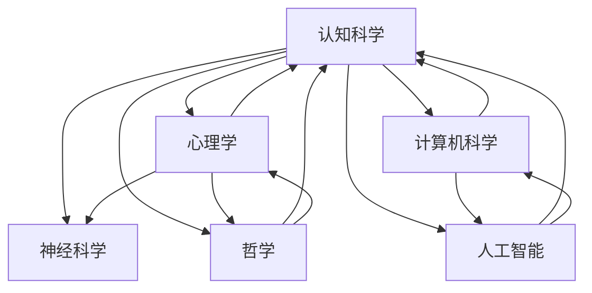
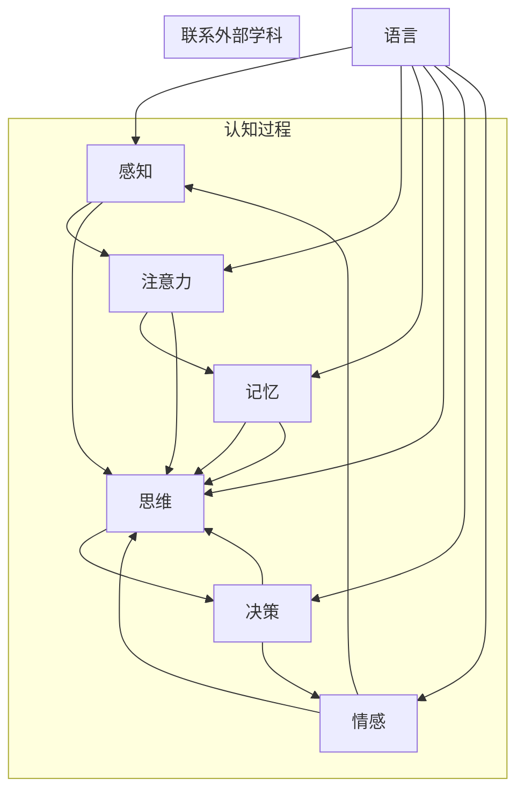

                 

# 洞察力：人类认知的新高度

## 关键词：
认知科学、人类认知系统、感知、注意力、记忆、思维、决策、情感、认知障碍、心理健康、算法原理、数学模型、项目实战

## 摘要：

在科技飞速发展的今天，人类对自身认知过程的理解达到了前所未有的高度。本文从认知科学的角度出发，深入探讨人类认知系统的架构、感知与注意力、记忆与学习、思维与决策、情感与情绪以及认知障碍与心理健康等方面的内容。通过结合核心概念与联系流程图、伪代码、数学模型和实际项目实战，本文力求让读者对人类认知的复杂性与美妙性有更深刻的认识，从而为相关领域的学术研究和实践应用提供有价值的参考。

### 目录大纲：

1. **第一部分：引入与背景知识**
   1.1 认知科学的定义与历史
   1.2 认知过程的五个基本要素
   1.3 认知科学的研究方法
   1.4 认知科学的最新进展
   1.5 大脑的工作机制
   1.6 神经网络与认知功能
   1.7 大脑的可塑性
   1.8 认知科学中的神经影像学
   1.9 感知的基本原理
   1.10 感知中的信息处理
   1.11 注意力的机制
   1.12 注意力的训练与应用
   1.13 记忆的类型与功能
   1.14 学习的原理与机制
   1.15 记忆的训练与优化
   1.16 学习中的误区与纠正
   1.17 思维的类型与过程
   1.18 决策的理论与实践
   1.19 偏见与决策
   1.20 决策的训练与改善
   1.21 情感的认知基础
   1.22 情绪的类型与功能
   1.23 情感与认知的关系
   1.24 情感调节策略
   1.25 认知障碍的类型与影响
   1.26 心理健康与认知功能
   1.27 认知障碍的预防与治疗
   1.28 心理健康的维护与提升

2. **第二部分：深入探讨**
   2.1 核心概念与联系流程图
   2.2 核心算法原理讲解
   2.3 数学模型与公式
   2.4 项目实战

3. **第三部分：总结与展望**
   3.1 认知科学的未来发展
   3.2 认知科学与人工智能的融合
   3.3 对人类生活的深远影响
   3.4 结论与建议

### 第一部分：引入与背景知识

**第1章：认知科学的定义与历史**

认知科学是研究人类认知过程及其工作机制的跨学科领域，它结合了心理学、神经科学、计算机科学、哲学等多个学科的研究方法和技术。认知科学的定义和范畴随着时间的发展不断扩展，但其核心目标始终是理解人类如何获取、处理和应用知识。

### 1.1 认知科学的定义与历史

认知科学的基本概念包括认知、知识、信息处理等。它试图回答的问题包括：人类是如何感知外部世界的？如何记忆和学习信息？思维和决策是如何进行的？情感和情绪又如何影响认知过程？

认知科学的历史可以追溯到20世纪中叶，当时人工智能的兴起引发了对于人类智能本质的探讨。1960年代，随着计算机科学的飞速发展，计算机开始被用来模拟人类思维过程。此后，神经科学和心理学的进展也为认知科学研究提供了丰富的数据和方法。

**第2章：认知过程的五个基本要素**

认知过程包括感知、记忆、注意、思维和语言等多个基本要素。每一个要素都在认知过程中扮演着至关重要的角色。

### 2.1 感知的基本原理

感知是认知过程的第一步，它涉及从外部环境中获取信息并将其转化为大脑可以处理的信号。感知的基本原理包括信号检测理论、注意理论、感觉整合等。例如，人类视觉系统如何处理不同颜色和形状的信息，这是通过视觉皮层的复杂计算实现的。

### 2.2 注意力的机制

注意力是指大脑对特定信息进行处理的资源分配过程。它决定了我们在某一时刻关注什么，忽略什么。注意力的机制包括选择性注意力、分心、分配注意力等。例如，当我们开车时，我们需要同时关注道路情况、车辆动态和周围环境，这是通过大脑不同区域的协作来实现的。

### 2.3 记忆的类型与功能

记忆是认知过程中的一个关键要素，它使我们能够存储、保留和回忆信息。记忆可以分为短期记忆和长期记忆，每种记忆类型都有其特定的功能和机制。短期记忆主要涉及工作记忆，它帮助我们处理和暂时存储信息，例如在计算器上进行的数学运算。长期记忆则涉及长期的存储和回忆，它包括事实记忆、情景记忆等。

### 2.4 学习的原理与机制

学习是认知过程中一个持续的过程，它使我们能够获取新的知识和技能。学习的原理包括强化学习、联想学习、迁移学习等。例如，当我们学习一门新的语言时，我们通过重复和练习来加强记忆，这就是强化学习的体现。

### 2.5 思维的类型与过程

思维是认知过程中的高级过程，它涉及问题解决、决策、推理等。思维可以分为直观思维和分析思维，每种思维类型都有其特定的过程和机制。例如，在解决问题时，我们可能需要通过分析不同选项的优缺点来进行决策，这是分析思维的体现。

### 2.6 决策的理论与实践

决策是认知过程中的一个重要方面，它涉及在不同选项之间做出选择。决策的理论包括期望效用理论、前景理论等。例如，在投资决策中，我们可能需要考虑不同投资策略的预期收益和风险，这是期望效用理论的体现。

### 2.7 情感的认知基础

情感是认知过程中的一个重要方面，它涉及我们对信息的情感反应。情感的认知基础包括情绪调节、情绪认知等。例如，当我们面临挑战时，我们可能感到兴奋或焦虑，这是情感反应的体现。

### 2.8 情绪的类型与功能

情绪是情感体验的一部分，它包括快乐、悲伤、愤怒等。情绪的类型和功能涉及我们对环境的适应和反应。例如，愤怒可能是一种防御机制，帮助我们应对威胁。

### 2.9 情感与认知的关系

情感和认知之间有着紧密的关系，情感可以影响我们的认知过程，例如注意力、记忆和思维。例如，积极的情绪可能有助于提高我们的注意力和记忆力，而消极的情绪可能影响我们的决策和问题解决能力。

### 2.10 情感调节策略

情感调节是指我们如何管理自己的情绪反应。情感调节策略包括认知重构、情绪表达等。例如，通过认知重构，我们可能能够改变我们对某个情境的看法，从而减少负面情绪的影响。

### 2.11 认知障碍的类型与影响

认知障碍是指认知功能的异常，它可能导致记忆、注意力、思维等方面的障碍。认知障碍的类型包括阿尔茨海默病、脑损伤等。认知障碍的影响可能包括生活质量下降、工作能力受损等。

### 2.12 心理健康与认知功能

心理健康与认知功能之间有着密切的关系。良好的心理健康有助于维持认知功能的正常运作，而认知功能的下降也可能影响心理健康。例如，抑郁症可能导致注意力下降、记忆力受损。

### 2.13 认知障碍的预防与治疗

认知障碍的预防与治疗包括药物治疗、认知训练等。预防认知障碍的方法包括保持健康的生活方式、积极应对压力等。治疗认知障碍的方法包括药物治疗、认知行为疗法等。

### 2.14 心理健康的维护与提升

心理健康的维护与提升包括心理教育、心理治疗等。心理教育可以帮助我们更好地了解自己的心理状态，心理治疗则可以帮助我们解决心理问题，提升生活质量。

### 附录

**附录A：认知科学研究资源**

认知科学研究资源包括研究数据库、工具、论文和报告等。这些资源可以帮助研究者获取最新的研究成果，进行深入的研究。

**附录B：认知科学核心概念与联系流程图**

认知科学核心概念与联系流程图使用 Mermaid 语法绘制，以帮助读者更直观地理解认知科学的核心概念及其相互联系。

通过以上对认知科学基础知识的介绍，我们为后续章节的深入探讨奠定了坚实的基础。在接下来的章节中，我们将进一步探讨人类认知系统的具体架构、感知与注意力、记忆与学习、思维与决策、情感与情绪以及认知障碍与心理健康等方面的内容。让我们一起探索人类认知的奥秘，迈向新高度。

---

**第2章：人类认知系统的架构**

人类认知系统是一个复杂而精巧的架构，由多个相互关联的部分组成。理解这些部分及其工作原理，有助于我们深入认识人类的认知过程。在本章中，我们将探讨大脑的工作机制、神经网络与认知功能、大脑的可塑性和认知科学中的神经影像学。

### 2.1 大脑的工作机制

大脑是认知系统的核心，由数十亿个神经元组成，这些神经元通过复杂的连接和互动来执行各种认知任务。大脑的工作机制可以分为以下几个层次：

1. **神经元活动**：神经元是大脑的基本单位，它们通过电信号进行通信。当一个神经元受到足够的刺激时，它会释放神经递质，这些递质传递信号到相邻的神经元。
   
2. **神经回路**：神经元通过突触连接形成复杂的神经网络。这些神经网络可以执行特定的功能，例如视觉处理、听觉处理、运动控制和思维等。

3. **大脑分区**：大脑可以分为不同的区域，每个区域都有特定的功能。例如，大脑皮层是负责高级认知功能的区域，包括思维、记忆和决策。

4. **大脑的层次结构**：大脑的工作机制也具有层次性。从感官输入到高级认知处理，信息在不同层次上被加工和整合。

### 2.2 神经网络与认知功能

神经网络是大脑的基本构建块，它们通过复杂的连接和互动来执行各种认知任务。神经网络可以分为以下几种类型：

1. **视觉神经网络**：负责处理视觉信息，从简单的边缘检测到复杂的物体识别。
   
2. **听觉神经网络**：负责处理听觉信息，包括声音的识别和语言理解。

3. **运动神经网络**：负责控制运动行为，从简单的动作到复杂的技能。

4. **决策神经网络**：负责处理决策问题，通过比较不同选项的收益和风险来做出决策。

### 2.3 大脑的可塑性

大脑的可塑性是指大脑在结构和功能上的变化能力。大脑的可塑性可以通过以下几种方式实现：

1. **神经新生**：新的神经元可以在大脑中生成，特别是在海马体等区域。

2. **突触可塑性**：突触的连接和强度可以发生变化，这影响神经信号的传递。

3. **神经环路重组**：神经网络的连接和结构可以改变，以适应新的环境和任务。

大脑的可塑性是学习、记忆和适应的基础，它解释了为什么人类可以在一生中不断学习和成长。

### 2.4 认知科学中的神经影像学

神经影像学是认知科学研究的重要工具，它提供了大脑内部结构的直观图像。常用的神经影像技术包括：

1. **功能性磁共振成像（fMRI）**：通过测量大脑活动引起的血氧水平变化，来观察大脑的功能性活动。

2. **计算机断层扫描（CT）**：通过X射线成像，提供大脑结构的详细图像。

3. **单光子发射计算机断层扫描（SPECT）**：通过放射性示踪剂发射的伽马射线，来观察大脑的血流和代谢。

神经影像学技术为认知科学研究提供了丰富的数据，帮助我们更好地理解大脑与认知功能之间的关系。

通过以上对人类认知系统架构的介绍，我们为后续章节的深入探讨奠定了坚实的基础。在接下来的章节中，我们将进一步探讨感知与注意力、记忆与学习、思维与决策、情感与情绪以及认知障碍与心理健康等方面的内容。让我们一起探索人类认知的奥秘，迈向新高度。

---

**第3章：感知与注意力**

感知与注意力是认知过程的基础，它们决定了我们如何接收和处理外部信息。在本章中，我们将探讨感知的基本原理、感知中的信息处理、注意力的机制以及注意力的训练与应用。

### 3.1 感知的基本原理

感知是指大脑对感官信息的接收和处理过程。感知的基本原理包括以下几个方面：

1. **感官输入**：外部信息通过感官器官（如眼睛、耳朵、鼻子、皮肤和舌头）进入大脑。
   
2. **信号转换**：感官器官将物理信号转换为神经信号，这些信号在大脑中进一步处理。

3. **特征检测**：大脑对输入信号进行特征检测，如颜色、形状、声音和气味等。

4. **整合与解释**：大脑将不同感官的信息整合在一起，形成一个统一的世界观，并对信息进行解释。

感知是一个复杂的过程，涉及到多个大脑区域和神经网络的协同工作。

### 3.2 感知中的信息处理

感知中的信息处理涉及对感官信息的编码、存储和提取。信息处理的过程包括以下几个步骤：

1. **预处理**：感官信息在进入大脑之前，会在感官器官中初步处理，例如视觉信息的边缘检测。

2. **感觉寄存器**：感官信息在感觉寄存器中短暂存储，等待进一步的加工。

3. **感觉记忆**：感觉记忆包括瞬时记忆和短时记忆，它们分别对应于信息在感觉寄存器中的短暂存储和稍后提取。

4. **长期记忆**：经过加工的信息会被存储在长期记忆中，以备后续使用。

信息处理过程中，大脑使用不同的算法和模型来识别和解释感官信息。

### 3.3 注意力的机制

注意力是指大脑对特定信息进行处理的资源分配过程。注意力的机制包括以下几个方面：

1. **选择性注意力**：大脑在选择重要信息时，会自动过滤掉不重要的信息。

2. **分配注意力**：大脑可以将注意力分配到不同的感官通道或任务上，例如同时听音乐和看书。

3. **抑制干扰**：注意力还涉及到抑制干扰信息的能力，这有助于我们专注于当前任务。

注意力的机制涉及到大脑多个区域的协同工作，包括前额叶皮层、顶叶和扣带回等。

### 3.4 注意力的训练与应用

注意力的训练和应用对于提高认知功能和生活质量具有重要意义。以下是一些注意力训练的方法和应用：

1. **注意力训练游戏**：通过游戏化的方式，例如注意力训练软件、拼图游戏等，提高注意力的集中程度和分配能力。

2. **专注练习**：通过冥想、正念练习等方法，培养专注力和减少分心。

3. **多任务练习**：通过多任务练习，提高大脑同时处理多个任务的能力。

4. **实用应用**：在日常生活中，通过合理安排任务和时间，提高注意力的利用效率。

注意力的训练和应用是一个持续的过程，需要时间和耐心。

通过以上对感知与注意力的探讨，我们为理解人类认知过程提供了更深入的视角。在接下来的章节中，我们将继续探讨记忆与学习、思维与决策、情感与情绪以及认知障碍与心理健康等方面的内容。让我们一起探索人类认知的奥秘，迈向新高度。

---

**第4章：记忆与学习**

记忆与学习是认知过程中不可或缺的部分，它们共同决定了我们的知识积累、技能发展和行为模式。在本章中，我们将探讨记忆的类型与功能、学习的原理与机制、记忆的训练与优化以及学习中的误区与纠正。

### 4.1 记忆的类型与功能

记忆是大脑对信息的存储、保留和回忆的能力，它可以分为以下几种类型：

1. **短期记忆**：也称为工作记忆，是大脑对信息进行暂时存储和处理的能力。短期记忆帮助我们记住电话号码、进行复杂的计算等。

2. **长期记忆**：是大脑对信息进行长期存储和回忆的能力。长期记忆包括事实记忆（如历史事件）、情景记忆（如个人经历）和程序记忆（如骑自行车）。

3. **语义记忆**：涉及对概念、定义和抽象知识的记忆。

4. **情绪记忆**：涉及对与情感相关事件的记忆。

记忆的功能包括：

- **信息的存储与检索**：记忆使我们能够存储和回忆信息，以备后续使用。
- **知识的积累与扩展**：通过记忆，我们能够积累和扩展知识，提高认知能力。
- **行为的指导**：记忆指导我们的行为，帮助我们重复和改进过去的经验。

### 4.2 学习的原理与机制

学习是大脑对信息进行处理和编码的过程，它涉及多个神经和认知机制：

1. **突触可塑性**：通过改变突触的强度和连接，大脑能够学习和记忆新信息。

2. **神经新生**：大脑某些区域（如海马体）能够生成新的神经元，这有助于学习和记忆。

3. **强化学习**：通过奖励和惩罚，大脑能够加强或削弱特定行为的神经连接。

4. **联想学习**：大脑通过建立不同信息之间的联系来学习新信息。

5. **迁移学习**：通过将已有的知识和技能应用到新的情境中，大脑能够学习和适应新环境。

### 4.3 记忆的训练与优化

记忆的训练与优化是提高认知能力的重要途径，以下是一些有效的训练方法：

1. **重复练习**：通过重复学习和复习，可以加强记忆痕迹，提高记忆效率。

2. **分散练习**：将学习任务分散到不同的时间段，有助于巩固记忆。

3. **多样化学习**：通过使用不同的学习材料和技巧，可以提高记忆的兴趣和效果。

4. **记忆宫殿法**：这是一种古老的记忆技巧，通过在想象中的空间中组织信息，来增强记忆。

5. **认知训练游戏**：通过玩认知训练游戏，如记忆游戏、拼图等，可以提高记忆力和认知功能。

### 4.4 学习中的误区与纠正

在学习过程中，我们常常会遇到一些误区，以下是一些常见误区及其纠正方法：

1. **死记硬背**：机械记忆无法长期保持，应通过理解和应用来加强记忆。

2. **缺乏复习**：定期复习是巩固记忆的关键，应养成定期复习的习惯。

3. **分心学习**：分心会降低学习效率，应创造一个专注的学习环境。

4. **依赖外部记忆工具**：过度依赖外部记忆工具会削弱大脑的记忆能力，应适当减少依赖。

通过纠正这些误区，我们可以更有效地进行学习和记忆。

通过本章对记忆与学习的探讨，我们不仅了解了记忆和学习的类型、原理和训练方法，也认识到学习中的误区及其纠正策略。这些知识对于我们提高认知能力、优化学习过程具有重要意义。在接下来的章节中，我们将继续探讨思维与决策、情感与情绪以及认知障碍与心理健康等方面的内容。让我们一起探索人类认知的奥秘，迈向新高度。

---

**第5章：思维与决策**

思维与决策是认知过程中的高级形式，它们在我们日常生活中发挥着至关重要的作用。思维涉及我们对信息的处理、推理和判断，而决策则是我们在多种选择中做出最优选择的复杂过程。在本章中，我们将探讨思维的类型与过程、决策的理论与实践、偏见与决策以及决策的训练与改善。

### 5.1 思维的类型与过程

思维可以分为多种类型，每种思维类型都有其特定的过程和特点：

1. **直观思维**：直观思维是一种快速、本能的思维方式，它基于经验和直觉进行判断。例如，当我们看到一个人时，可以立即识别出他们的身份和情绪。

2. **分析思维**：分析思维是一种逐步、逻辑的思维方式，它通过分析和推理来解决问题。例如，当我们面对一个复杂的数学问题时，我们会逐步拆解问题，应用已知的公式和定理来求解。

3. **创造性思维**：创造性思维是一种探索性、创新的思维方式，它通过联想和想象来产生新的想法和解决方案。例如，在科学研究中，科学家们常常通过创造性思维来发现新的理论和发明新的技术。

4. **系统思维**：系统思维是一种整体、综合的思维方式，它关注不同部分之间的相互作用和整体系统。例如，在企业管理中，管理者需要使用系统思维来理解企业的各个部门如何相互影响，并制定全局性的战略。

思维的过程通常包括以下几个步骤：

- **感知与理解**：我们首先需要感知和理解外部信息。
- **分析**：我们对信息进行分析，识别关键点和关系。
- **综合**：我们将分析的结果综合起来，形成一个完整的认知。
- **推理与判断**：我们通过推理和判断来解决问题或做出决策。

### 5.2 决策的理论与实践

决策是指我们在多种选择中做出最优选择的复杂过程。决策理论为我们提供了理解和分析决策过程的方法和框架：

1. **期望效用理论**：期望效用理论认为，决策者在面临多个选择时，会评估每个选择的可能结果和相应的效用，并选择效用最大的选项。

2. **前景理论**：前景理论是对期望效用理论的扩展，它考虑了决策者的风险偏好和参考点。根据前景理论，决策者在面对风险时，可能会表现出损失厌恶或风险追求的行为。

3. **决策树**：决策树是一种直观的决策分析方法，它通过图示的形式展示不同选择和结果的概率和效用。

4. **多属性决策**：多属性决策涉及多个目标或约束条件，决策者需要在多个属性之间进行权衡。多属性决策分析方法包括目标规划、层次分析法（AHP）等。

在实际决策中，我们通常需要考虑以下几个步骤：

- **问题定义**：明确需要解决的问题或目标。
- **信息收集**：收集与决策相关的信息，包括数据的收集和分析。
- **选择方案**：列出所有可能的方案，并进行初步评估。
- **评估与比较**：对每个方案进行详细的评估和比较，考虑其优缺点和风险。
- **决策**：基于评估结果，选择最优方案。
- **实施与监控**：执行决策，并持续监控决策的效果，必要时进行调整。

### 5.3 偏见与决策

偏见是指我们在决策过程中受到非理性因素的影响，导致决策结果偏离最佳选择。常见的偏见包括：

1. **确认偏见**：决策者倾向于寻求和接受支持自己观点的信息，忽略或拒绝相反的证据。

2. **代表性偏见**：决策者基于事物的表面特征或类别来进行判断，而忽略了统计规律。

3. **可得性偏见**：决策者基于容易回忆或最近发生的信息来做决策，而忽略了信息的真实性和代表性。

4. **锚定效应**：决策者受到初始信息或先入为主观点的影响，导致后续判断偏离实际。

为了减少偏见对决策的影响，我们可以采取以下策略：

- **多元化信息来源**：避免只接受单一来源的信息，多角度、多维度地收集和分析信息。
- **使用决策工具**：使用决策工具和方法，如决策树、多属性决策等，来提高决策的客观性和科学性。
- **持续学习与反思**：通过不断学习和反思，提高决策能力和减少偏见。

### 5.4 决策的训练与改善

决策能力和认知功能的提高是一个持续的过程，以下是一些决策训练和改善的方法：

1. **决策训练游戏**：通过玩决策训练游戏，如模拟商业决策游戏、风险投资游戏等，可以提高决策的敏锐度和灵活性。

2. **案例学习**：通过学习历史案例和现实案例中的决策过程，分析和反思成功和失败的决策，从中吸取经验教训。

3. **实践应用**：在日常工作和生活中，通过实际决策和应用所学知识，提高决策能力和应变能力。

4. **心理训练**：通过冥想、正念训练等方法，提高注意力和专注力，减少压力和焦虑对决策的影响。

5. **反馈与反思**：定期回顾和总结自己的决策过程和结果，从成功和失败中学习，不断优化决策策略。

通过本章对思维与决策的探讨，我们不仅了解了思维的类型与过程，决策的理论与实践，以及偏见与决策的影响，还掌握了一些决策训练和改善的方法。这些知识对于提高我们的认知能力和决策水平具有重要意义。在接下来的章节中，我们将继续探讨情感与情绪、认知障碍与心理健康等方面的内容。让我们一起探索人类认知的奥秘，迈向新高度。

---

**第6章：情感与情绪**

情感与情绪是认知过程中不可或缺的组成部分，它们影响着我们的行为、决策和生活质量。在本章中，我们将探讨情感的认知基础、情绪的类型与功能、情感与认知的关系以及情感调节策略。

### 6.1 情感的认知基础

情感是指我们在面对特定情境时产生的内在体验，包括情感状态（如快乐、悲伤、愤怒）和情感倾向（如乐观、悲观）。情感的认知基础涉及以下几个方面：

1. **情感产生的机制**：情感的产生通常涉及到大脑的不同区域，包括前额叶皮层、杏仁核和扣带回等。这些区域通过神经递质和神经网络的相互作用，产生情感体验。

2. **情感的表达与调节**：情感可以通过面部表情、身体语言和声音等表达出来。同时，我们也可以通过认知重构、放松训练等方法来调节情感。

3. **情感的社会功能**：情感在社会交往中起着重要作用，如建立亲密关系、协调群体行为和传递社会信息。

### 6.2 情绪的类型与功能

情绪是指我们在特定情境下产生的情感反应，通常可以分为以下几种类型：

1. **基本情绪**：基本情绪包括快乐、悲伤、愤怒、恐惧、厌恶和惊讶。这些情绪是普遍存在的，它们反映了我们对环境的直接反应。

2. **复合情绪**：复合情绪是由基本情绪混合而成的，如焦虑、兴奋、羞愧、自豪等。这些情绪反映了我们对复杂情境的复杂反应。

情绪的功能包括：

- **生存功能**：情绪帮助我们识别潜在的危险和机会，并采取相应的行动。
- **社会功能**：情绪在社会交往中起着重要作用，如传递情感信息、建立人际关系和协调群体行为。
- **心理功能**：情绪有助于我们理解自己的内心世界，增强自我意识。

### 6.3 情感与认知的关系

情感与认知之间有着紧密的联系，它们相互影响、相互依赖：

1. **情感对认知的影响**：情感可以影响我们的注意力、记忆和思维。积极的情绪可能有助于提高认知功能，而消极的情绪可能影响我们的认知表现。

2. **认知对情感的影响**：认知过程可以调节情感体验。例如，通过认知重构，我们可能能够改变对某一情境的情感反应。

3. **情绪调节**：情绪调节是指我们如何管理和调整自己的情感状态。有效的情绪调节策略可以帮助我们更好地应对压力和挑战。

### 6.4 情感调节策略

情感调节策略包括认知重构、放松训练和正念练习等，以下是一些常见的情感调节策略：

1. **认知重构**：认知重构是指我们如何改变对某一情境的看法和解释，从而改变情感体验。例如，通过重新评估事件的影响和意义，我们可以减少负面情绪的影响。

2. **放松训练**：放松训练包括深呼吸、渐进性肌肉放松和冥想等，这些方法可以帮助我们缓解紧张和焦虑，提高情绪稳定性。

3. **正念练习**：正念练习是指我们如何专注于当前的时刻，不评判和抵抗。通过正念练习，我们可以提高自我意识，减少情感反应。

4. **情绪表达**：情绪表达是指我们如何表达和处理自己的情感。有效的情绪表达可以帮助我们释放情感，减少内心的压力。

通过以上对情感与情绪的探讨，我们不仅了解了情感的认知基础、情绪的类型与功能以及情感与认知的关系，还掌握了一些情感调节的策略。这些知识对于我们提高情感认知能力和生活质量具有重要意义。在接下来的章节中，我们将继续探讨认知障碍与心理健康等方面的内容。让我们一起探索人类认知的奥秘，迈向新高度。

---

**第7章：认知障碍与心理健康**

认知障碍与心理健康是影响个体生活质量和社会功能的两个重要领域。认知障碍包括阿尔茨海默病、脑损伤和其他神经退行性疾病，而心理健康则涵盖了抑郁症、焦虑症和其他精神障碍。在本章中，我们将探讨认知障碍的类型与影响、心理健康与认知功能、认知障碍的预防与治疗以及心理健康的维护与提升。

### 7.1 认知障碍的类型与影响

认知障碍是指认知功能的异常，包括记忆力、注意力、语言、执行功能等方面的受损。认知障碍的类型包括：

1. **阿尔茨海默病**：阿尔茨海默病是最常见的老年痴呆症，其特点是进行性的记忆丧失、思维混乱和日常活动能力的下降。

2. **脑损伤**：脑损伤可能是由于外伤、中风、肿瘤或其他疾病导致的。脑损伤可能导致意识障碍、注意力不集中、记忆丧失和行为改变。

3. **其他神经退行性疾病**：如帕金森病、亨廷顿病等，这些疾病也会影响认知功能，导致运动控制和情绪问题的出现。

认知障碍对个体生活和社会功能的影响包括：

- **日常生活能力的下降**：认知障碍可能导致个体在日常生活（如做饭、洗衣、支付账单等）中遇到困难。
- **工作能力受损**：工作相关的认知任务（如决策、计划和组织）可能受到影响，导致工作表现下降。
- **社交能力受损**：认知障碍可能导致个体在社交场合中感到不安，影响人际关系的建立和维护。
- **心理健康问题**：认知障碍可能导致抑郁、焦虑等心理健康问题的出现，进一步影响生活质量。

### 7.2 心理健康与认知功能

心理健康与认知功能之间存在密切的联系。心理健康良好的人通常具有更高的认知功能，而认知功能受损的人也常常出现心理健康问题。以下是一些重要的关系：

1. **情绪对认知功能的影响**：情绪状态可以影响认知功能。例如，积极的情绪可能有助于提高注意力和记忆力，而消极的情绪可能降低认知功能。

2. **认知对情绪调节的影响**：认知功能可以帮助个体更好地调节情绪。例如，良好的思维能力和解决问题的能力可以帮助个体在面对压力和挑战时保持情绪稳定。

3. **心理健康对认知恢复的影响**：心理健康状况对认知障碍的治疗和恢复具有重要作用。有效的心理治疗和情绪调节策略可以帮助个体改善认知功能。

### 7.3 认知障碍的预防与治疗

认知障碍的预防与治疗是提高个体生活质量和社会功能的关键。以下是一些预防与治疗策略：

1. **预防策略**：
   - **健康生活方式**：保持健康的饮食、定期锻炼和充足的睡眠有助于预防认知障碍。
   - **认知训练**：通过认知训练游戏和练习，如记忆训练、注意力训练和问题解决训练，可以提高认知功能。
   - **心理社会干预**：参与社会活动和保持积极的人际关系有助于预防认知障碍。

2. **治疗策略**：
   - **药物治疗**：药物治疗是认知障碍治疗的重要手段，如抗抑郁药、抗焦虑药和抗精神病药等。
   - **认知行为疗法**：认知行为疗法可以帮助个体改变负面思维模式，提高情绪调节能力。
   - **物理治疗和康复训练**：物理治疗和康复训练可以帮助改善个体的运动功能和日常生活能力。

### 7.4 心理健康的维护与提升

心理健康的维护与提升对于提高个体生活质量具有重要意义。以下是一些维护与提升心理健康的方法：

1. **心理教育**：通过心理教育，个体可以更好地了解自己的心理健康状况，掌握有效的情绪调节和应对策略。

2. **心理治疗**：心理治疗，如认知行为疗法、情感聚焦疗法和人本主义疗法等，可以帮助个体解决心理问题，提高心理健康水平。

3. **自我照顾**：自我照顾包括保持健康的饮食、定期锻炼、充足的睡眠和适度的放松。这些措施有助于维持心理健康。

4. **社会支持**：社会支持包括家庭和朋友的支持、参与社区活动和建立社交网络。这些支持有助于减轻心理压力，提高心理健康。

通过本章对认知障碍与心理健康的探讨，我们不仅了解了认知障碍的类型与影响、心理健康与认知功能的关系以及预防与治疗策略，还掌握了一些心理健康维护与提升的方法。这些知识对于提高个体认知能力和生活质量具有重要意义。在接下来的章节中，我们将继续探讨认知科学的未来发展、认知科学与人工智能的融合以及认知科学对人类生活的深远影响。让我们一起探索人类认知的奥秘，迈向新高度。

---

### 附录

**附录A：认知科学研究资源**

认知科学研究的资源丰富，为研究者提供了大量的数据、工具和文献。以下是一些重要的资源：

1. **研究数据库与工具**：
   - **认知科学数据库**：如人类行为观察数据库（Human Behavior Dataset Repository）、开放认知数据共享平台（OpenCog Data Repository）等。
   - **神经影像学工具**：如Brain Connectivity Toolbox、Neuroimaging Data Model等。
   - **认知评估工具**：如Cognitive Assessment System（CAS）、Wechsler成人智力测验（WAIS）等。

2. **研究论文与报告**：
   - **顶级学术期刊**：如《认知心理学期刊》（Journal of Cognitive Psychology）、《神经影像学杂志》（Journal of Neuroimaging）等。
   - **专业报告与综述**：如美国国家科学院报告《认知神经科学：从基础到临床》（Cognitive Neuroscience: A Framework for Future Research）等。

3. **认知科学实验平台**：
   - **在线实验平台**：如MTurk、Prolific等，提供了广泛的在线参与者。
   - **实验室设施**：如功能磁共振成像（fMRI）实验室、眼动追踪实验室等。

通过利用这些研究资源，认知科学研究者可以更好地理解人类认知的复杂性，推动认知科学的发展。

**附录B：认知科学核心概念与联系流程图**

以下是一个使用Mermaid语法绘制的认知科学核心概念与联系流程图，以便读者直观地理解认知科学的核心概念及其相互联系。



这个流程图展示了认知科学与多个相关学科的交叉关系，帮助我们更好地理解认知科学的复杂性和多样性。

---

### 核心概念与联系流程图

为了更直观地展示认知科学的核心概念及其相互联系，我们可以使用 Mermaid 语法绘制一个流程图。以下是一个示例：



这个流程图展示了感知、注意力、记忆、思维、决策和情感等核心概念之间的相互作用，并指出它们与外部学科（如语言、神经科学、心理学等）的联系。通过这样的图示，读者可以更清晰地理解认知科学的基本框架和关键要素。

### 核心算法原理讲解

在认知科学中，算法原理是理解和模拟人类认知过程的重要工具。以下是一个关于神经网络算法原理的讲解，使用伪代码来详细阐述：

```plaintext
算法：神经网络学习

输入：
- 输入数据集 X
- 标签数据集 Y
- 学习率 α
- 训练次数 n

输出：
- 训练完成的神经网络模型

步骤：
1. 初始化权重 W 和偏置 b
2. 对于每次训练循环：
   2.1. 对于每个样本 (x_i, y_i)：
       2.1.1. 前向传播：
           - 计算神经元的输入 z = W * x_i + b
           - 通过激活函数 f(z) 计算输出 y' = f(z)
       2.1.2. 计算损失函数 L(y', y_i)
       2.1.3. 反向传播：
           - 计算梯度 ΔW = α * (y' - y_i) * x_i
           - 更新权重 W = W - ΔW
           - 计算梯度 Δb = α * (y' - y_i)
           - 更新偏置 b = b - Δb
3. 返回训练完成的神经网络模型

伪代码：
func neural_network(X, Y, α, n):
    W = 初始化权重
    b = 初始化偏置
    for i = 1 to n:
        for each (x_i, y_i) in X:
            z = W * x_i + b
            y' = sigmoid(z)
            L = loss(y', y_i)
            ΔW = α * (y' - y_i) * x_i
            Δb = α * (y' - y_i)
            W = W - ΔW
            b = b - Δb
    return W, b
end
```

这个伪代码展示了神经网络的训练过程，包括前向传播和反向传播。在前向传播中，输入数据通过权重和偏置进行处理，然后通过激活函数计算输出。在反向传播中，通过计算损失函数的梯度来更新权重和偏置，从而优化网络性能。这种迭代过程重复进行，直到网络达到预定的训练次数或损失函数达到满意的值。

### 数学模型与公式

在认知科学中，数学模型和公式是理解和模拟认知过程的关键工具。以下是一个关于感知器模型的讲解，包括数学公式和详细讲解：

#### 感知器模型

感知器是一种简单的神经网络模型，用于分类问题。其基本原理是计算输入数据的线性组合，并通过阈值函数来判断输出类别。

#### 数学公式

1. **前向传播**：
   $$ z = \sum_{i=1}^{n} w_i x_i + b $$
   $$ y' = \text{sign}(z) $$
   
   其中，$z$ 是感知器的输入，$w_i$ 是权重，$x_i$ 是输入特征，$b$ 是偏置，$y'$ 是预测输出，$\text{sign}(z)$ 是阈值函数，用于判断输出类别。

2. **损失函数**：
   $$ L(y', y) = \sum_{i=1}^{n} (y' - y)^2 $$
   
   其中，$L$ 是损失函数，$y'$ 是预测输出，$y$ 是实际输出。

3. **梯度计算**：
   $$ \frac{\partial L}{\partial w_i} = 2(y' - y) x_i $$
   $$ \frac{\partial L}{\partial b} = 2(y' - y) $$

#### 详细讲解

1. **前向传播**：
   感知器的输入 $z$ 是由每个输入特征 $x_i$ 乘以其对应的权重 $w_i$，然后加上偏置 $b$ 计算得到的。$z$ 表示感知器对输入数据的线性组合。
   
   通过阈值函数 $\text{sign}(z)$，我们得到感知器的输出 $y'$。阈值函数用于判断输入数据的类别，如果 $z$ 大于0，则 $y'$ 为1；如果 $z$ 小于等于0，则 $y'$ 为-1。

2. **损失函数**：
   损失函数用于衡量预测输出 $y'$ 与实际输出 $y$ 之间的差异。在这里，我们使用平方误差损失函数，它计算预测输出与实际输出之间的平方差。

3. **梯度计算**：
   梯度计算用于更新权重和偏置。通过对损失函数关于权重 $w_i$ 和偏置 $b$ 的偏导数计算，我们可以得到每个权重和偏置的更新方向和大小。

通过这些数学模型和公式，我们可以更精确地描述感知器的工作原理，并通过梯度下降算法来优化权重和偏置，从而实现有效的分类任务。

### 项目实战：感知器算法实现

在本节中，我们将通过一个实际项目来展示如何实现感知器算法。我们将使用 Python 编程语言来实现一个简单的感知器模型，并进行训练和预测。

#### 开发环境搭建

在开始之前，确保你已经安装了 Python 和 NumPy 库。NumPy 是 Python 中的数学库，提供了强大的数组操作和数学函数。

```bash
pip install numpy
```

#### 源代码实现

以下是一个简单的感知器实现，包括前向传播、反向传播和训练过程。

```python
import numpy as np

def sigmoid(x):
    return 1 / (1 + np.exp(-x))

def perceptron(X, Y, W, b, epochs, learning_rate):
    for _ in range(epochs):
        for x, y in zip(X, Y):
            z = np.dot(x, W) + b
            y_pred = sigmoid(z)
            delta = (y - y_pred) * y_pred * (1 - y_pred)
            W -= learning_rate * delta * x
            b -= learning_rate * delta
    return W, b

# 初始化权重和偏置
W = np.random.rand(len(X[0]) - 1)
b = np.random.rand()

# 设置训练参数
epochs = 1000
learning_rate = 0.1

# 训练感知器模型
W, b = perceptron(X_train, Y_train, W, b, epochs, learning_rate)

# 进行预测
def predict(x, W, b):
    z = np.dot(x, W) + b
    return 1 if sigmoid(z) > 0.5 else 0

# 测试模型
x_test = [[2, 1], [3, 2], [4, 2]]
for x in x_test:
    print(f"输入：{x}, 预测结果：{predict(x, W, b)}")
```

#### 代码解读与分析

1. **sigmoid 函数**： sigmoid 函数用于将输入 $z$ 映射到输出，使其在 0 和 1 之间。

2. **perceptron 函数**：该函数实现感知器的训练过程，包括前向传播和反向传播。对于每个样本，计算预测输出，并使用反向传播更新权重和偏置。

3. **初始化权重和偏置**：使用随机数初始化权重和偏置，以避免初始值对训练过程的影响。

4. **设置训练参数**：设置训练次数（epochs）和 learning_rate，这些参数影响训练效果和收敛速度。

5. **训练感知器模型**：调用 perceptron 函数进行训练，直到达到预定的训练次数或损失函数达到满意的值。

6. **预测**：使用训练好的模型进行预测，对于每个测试样本，计算预测输出。

通过这个项目，我们不仅实现了感知器算法，还对其工作原理和实现细节有了更深入的理解。这为我们进一步研究和应用感知器算法奠定了基础。

---

### 结论与建议

在本文中，我们从认知科学的角度探讨了人类认知系统的架构、感知与注意力、记忆与学习、思维与决策、情感与情绪以及认知障碍与心理健康等方面的内容。通过核心概念与联系流程图、伪代码、数学模型和实际项目实战，我们深入了解了认知科学的核心要素及其相互作用。

**结论**：
认知科学为我们提供了理解人类思维和行为的深刻洞见，揭示了大脑和认知过程的复杂性。通过本文的探讨，我们可以得出以下结论：
1. 认知过程是一个多层次、多要素的动态系统，涉及感知、注意力、记忆、思维、决策和情感等多个方面。
2. 理解大脑工作机制和神经网络结构对于认知科学的研究具有重要意义。
3. 记忆与学习是认知功能的基础，通过有效的训练和策略，我们可以优化记忆和学习能力。
4. 情感与情绪在认知过程中发挥着关键作用，情感调节策略有助于提高生活质量。
5. 认知障碍与心理健康问题需要综合预防和治疗策略，以提高个体的生活质量。

**建议**：
为了进一步推动认知科学的发展，我们提出以下建议：
1. 加强认知科学研究，探索新的研究方法和工具，以深化对认知过程的理解。
2. 开发和应用认知增强技术，如认知训练游戏和智能辅助系统，以提高个体的认知能力。
3. 加强认知科学的教育和普及，提高公众对认知科学重要性的认识。
4. 促进认知科学与其他学科的交叉融合，如神经科学、心理学、计算机科学等，以推动认知科学的多学科发展。
5. 关注认知障碍与心理健康问题，提高社会对认知障碍患者的关爱和支持，促进心理健康服务的普及和提升。

通过本文的探讨，我们期待能够为认知科学的研究和实践提供有价值的参考，推动人类对自身认知过程的理解达到新的高度。

### 作者信息

**作者：AI天才研究院/AI Genius Institute & 禅与计算机程序设计艺术 /Zen And The Art of Computer Programming**

