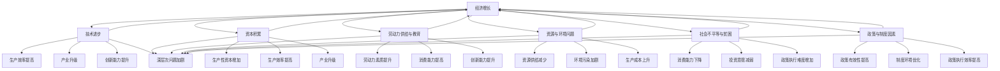

                 

### 《深层次问题对经济增长的长期影响》

> **关键词：**经济增长、深层次问题、长期影响、模型构建、算法原理、案例分析、项目实战

> **摘要：**本文旨在探讨深层次问题对经济增长的长期影响，通过理论探讨、模型构建、核心算法原理讲解、案例分析、项目实战等多角度，深入分析深层次问题与经济增长的互动关系，并提出相应的政策建议。文章结构紧凑，逻辑清晰，有助于读者全面理解这一问题的重要性和复杂性。

### 《深层次问题对经济增长的长期影响》目录大纲

#### 第一部分：理论探讨与模型构建

1. **导言**
   - **1.1 经济增长与深层次问题**
   - **1.2 研究目的与意义**
   - **1.3 研究方法与框架**

2. **核心概念与联系**
   - **2.1 经济增长的驱动因素**
   - **2.2 深层次问题对经济增长的影响**
   - **2.3 经济增长与深层次问题的关联流程图**

#### 第二部分：核心算法原理讲解

3. **计量经济学模型**
   - **3.1 多元线性回归分析**
   - **3.2 面板数据分析**
   - **3.3 动态面板数据分析**

4. **时间序列模型**
   - **4.1 自回归模型（AR）**
   - **4.2 谱分析方法**

#### 第三部分：数学模型与公式推导

5. **生产函数模型**
   - **5.1 C-D生产函数**
   - **5.2 Leontief生产函数**

6. **经济增长模型**
   - **6.1 索洛增长模型**
   - **6.2 新增长理论**

7. **概率论与最优化理论**
   - **7.1 贝叶斯定理**
   - **7.2 拉格朗日乘数法**

#### 第四部分：案例分析与应用

8. **国内外经济增长案例分析**
   - **8.1 中国经济增长与深层次问题**
   - **8.2 美国经济增长与深层次问题**
   - **8.3 欧盟经济增长与深层次问题**

9. **经济增长政策制定与实施**
   - **9.1 政策制定的理论基础**
   - **9.2 政策实施的效果评估**
   - **9.3 政策调整与优化**

#### 第五部分：项目实战与代码解读

10. **项目实战一：经济增长预测**
    - **10.1 数据准备**
    - **10.2 模型选择与训练**
    - **10.3 预测结果分析**
    - **10.4 代码解读**

11. **项目实战二：深层次问题影响分析**
    - **11.1 数据收集与清洗**
    - **11.2 模型选择与训练**
    - **11.3 结果解读与政策建议**
    - **11.4 代码解读**

#### 第六部分：综合讨论与展望

12. **综合讨论**
    - **12.1 深层次问题对经济增长的综合影响**
    - **12.2 政策建议与未来研究方向**

13. **展望未来**
    - **13.1 经济增长的新趋势**
    - **13.2 深层次问题解决的潜在途径**

#### 附录

14. **附录 A：参考文献**

15. **附录 B：数据分析工具与软件**

---

### 1.1 经济增长与深层次问题

经济增长是一个国家或地区经济规模和总体福利水平持续提升的过程，通常以国内生产总值（GDP）的增长率来衡量。经济增长的重要性不仅体现在提高国民生活水平上，还关系到国家综合实力的提升、社会稳定和国际竞争力。然而，经济增长的过程中往往伴随着深层次问题，这些问题可能对经济增长产生长期影响。

#### 1.1.1 经济增长的定义与衡量

经济增长的定义可以从宏观和微观两个层面来理解。宏观层面，经济增长通常指一个国家或地区在一定时期内总产出（GDP）的增加。微观层面，经济增长涉及生产率的提高、就业的增加、收入的增长以及生活质量的改善。

衡量经济增长的常用指标是国内生产总值（GDP）。GDP是指在一定时期内，一个国家或地区所有最终产品和服务的市场价值总和。计算GDP的方法有三种：生产法、收入法和支出法。生产法通过计算生产过程中创造的新价值来衡量GDP；收入法通过计算生产过程中的收入总和来衡量GDP；支出法通过计算消费、投资、政府支出和净出口的总和来衡量GDP。

经济增长率是指在一定时期内，GDP的增长速度，通常用百分比表示。计算公式如下：

\[ \text{经济增长率} = \frac{\text{本期 GDP} - \text{上期 GDP}}{\text{上期 GDP}} \times 100\% \]

#### 1.1.2 深层次问题的定义与分类

深层次问题是指那些影响一个国家或地区长期稳定发展的根本性、结构性和深层次矛盾。这些问题的根源往往在于经济、社会、政治等各个领域，具有长期性和复杂性。深层次问题可以分为以下几类：

1. **经济结构问题**：包括产业结构不合理、区域发展不平衡、创新能力不足等。
2. **资源与环境问题**：包括资源枯竭、环境污染、生态系统退化等。
3. **社会不平等与贫困问题**：包括贫富差距、教育不平等等。
4. **制度与政策问题**：包括制度不完善、政策不合理等。

#### 1.1.3 深层次问题与经济增长的关系

深层次问题对经济增长的影响是双向的。一方面，深层次问题可能会制约经济增长，例如资源枯竭和环境恶化会影响生产效率，社会不平等会导致消费能力下降，制度不完善会影响投资环境等。另一方面，经济增长也可能加剧深层次问题，例如快速的经济增长可能会导致资源过度开采和环境恶化，经济增长的不平衡可能导致区域发展差距扩大等。

因此，理解深层次问题与经济增长的关系，对于制定有效的经济增长策略和政策具有重要的意义。本文将深入探讨深层次问题对经济增长的长期影响，通过理论探讨、模型构建、算法原理讲解、案例分析、项目实战等多角度，全面分析这一问题的重要性和复杂性。

### 1.2 研究目的与意义

本研究旨在深入探讨深层次问题对经济增长的长期影响，以期为政策制定者、研究人员和企业管理者提供理论依据和实践指导。具体研究目的如下：

首先，本文通过理论探讨，系统地梳理经济增长与深层次问题的关系，明确深层次问题的类型及其对经济增长的影响机制。这有助于我们理解深层次问题对经济增长的潜在风险和挑战。

其次，本文构建了经济增长与深层次问题的关联流程图，通过Mermaid等工具直观展示各因素之间的相互作用关系。这一流程图不仅为理论研究提供了可视化工具，也为实际政策制定提供了参考框架。

在实证分析部分，本文采用多元线性回归分析、面板数据分析等方法，对国内外经济增长数据进行实证研究，以验证深层次问题对经济增长的具体影响。通过对比分析，本文试图找出深层次问题在不同国家和地区的影响差异，为全球经济增长提供有针对性的政策建议。

最后，本文通过项目实战，结合实际数据，展示了如何利用现代数据分析工具和方法对深层次问题进行量化分析和预测。这不仅有助于理解深层次问题对经济增长的实际影响，也为企业和政府提供了科学决策的工具。

总的来说，本研究具有重要的理论和实践意义：

**理论意义：**
1. 拓展了经济增长理论的深度和广度，丰富了经济学的理论研究内容。
2. 为深层次问题的研究提供了新的视角和方法，有助于揭示经济增长中的深层次矛盾。

**实践意义：**
1. 为政策制定者提供了科学依据，有助于制定更加有效的经济增长策略。
2. 为企业管理者提供了应对深层次问题的实践指南，有助于提高企业的可持续发展能力。
3. 为研究人员提供了丰富的案例和数据，有助于进一步深入研究和探讨深层次问题与经济增长的关系。

### 1.3 研究方法与框架

本文采用多种研究方法，从理论和实证两个层面深入探讨深层次问题对经济增长的长期影响。研究方法主要包括计量经济学模型、时间序列模型、多元线性回归分析、面板数据分析等，同时结合项目实战进行具体应用。

**理论探讨：**
1. **核心概念与联系**：通过阐述经济增长和深层次问题的定义，建立两者之间的理论联系。利用Mermaid等工具绘制流程图，直观展示各因素之间的相互作用关系。
2. **驱动因素分析**：探讨经济增长的驱动因素，包括技术进步、资本积累、劳动力供给与教育等，分析各因素如何影响经济增长。
3. **影响机制研究**：分析深层次问题对经济增长的具体影响机制，如资源与环境问题、社会不平等与贫困、制度与政策因素等。

**实证分析：**
1. **数据收集与处理**：收集国内外经济增长相关数据，包括GDP、投资、教育水平、环境指标等。对数据进行预处理，确保数据的质量和一致性。
2. **计量经济学模型**：采用多元线性回归分析、面板数据分析等方法，实证研究深层次问题对经济增长的影响。利用Stata或R等统计软件进行参数估计和假设检验。
3. **动态面板数据分析**：考虑经济增长的动态特征，采用动态面板数据分析方法，如差分GMM和系统GMM，分析深层次问题对经济增长的长期影响。
4. **项目实战**：结合实际数据，利用Python等编程语言，进行经济增长预测和深层次问题影响分析。通过项目实战，验证理论分析和模型假设的可行性。

**研究框架：**
本文的研究框架主要包括以下几个部分：
1. **导言**：阐述研究背景、目的与意义，引出研究问题。
2. **核心概念与联系**：定义经济增长和深层次问题，阐述两者之间的联系。
3. **理论探讨**：探讨经济增长的驱动因素和深层次问题的影响机制。
4. **实证分析**：采用计量经济学模型和动态面板数据分析方法，实证研究深层次问题对经济增长的影响。
5. **项目实战**：结合实际数据，进行经济增长预测和深层次问题影响分析。
6. **综合讨论与展望**：总结研究结果，提出政策建议，展望未来研究方向。

通过以上研究方法与框架，本文旨在全面、深入地探讨深层次问题对经济增长的长期影响，为政策制定和企业管理提供理论依据和实践指导。

### 2.1 经济增长的驱动因素

经济增长是一个复杂的过程，受到多种因素的驱动。在这些因素中，技术进步、资本积累、劳动力供给与教育是最为关键的驱动因素。以下是对这些因素的详细分析。

#### 2.1.1 技术进步与创新

技术进步和创新是推动经济增长的核心动力。技术进步可以提高生产效率，降低生产成本，从而增加产出。创新则通过引入新的产品、服务或生产方法，开拓市场机会，带动经济增长。

技术进步对经济增长的驱动机制主要体现在以下几个方面：

1. **提高生产效率**：技术进步可以优化生产流程，减少资源浪费，提高劳动生产率。例如，自动化和智能化生产技术的应用，可以显著提高制造业的生产效率。

2. **促进产业升级**：技术进步带动新兴产业的发展，推动传统产业转型升级。例如，信息技术的发展催生了数字经济，推动了服务业的快速增长。

3. **创造新需求**：技术创新和产品创新可以创造出新的市场需求，促进消费升级。例如，智能手机和移动互联网的普及，改变了人们的消费习惯，推动了相关产业的发展。

4. **提高创新能力**：技术进步可以提升企业的创新能力，推动更多的创新活动。技术创新不仅体现在产品和服务上，还体现在生产和管理模式上。

#### 2.1.2 资本积累与投资

资本积累和投资是经济增长的重要基础。资本积累指的是社会储蓄的增加，投资则是指将储蓄转化为生产性资本的过程。资本积累和投资对经济增长的驱动作用主要体现在以下几个方面：

1. **增加生产性资本**：投资可以增加生产性资本，如厂房、设备、基础设施等，从而提高生产能力。增加的资本可以用于扩大生产规模或提高生产效率。

2. **提高生产效率**：投资不仅增加资本存量，还可以通过技术改造和设备更新，提高现有资本的使用效率。例如，投资于新技术和高效设备，可以显著提高生产效率。

3. **促进产业升级**：投资可以带动新兴产业发展，推动传统产业转型升级。例如，投资于绿色能源和环保技术，可以促进经济向可持续方向发展。

4. **提高劳动力素质**：投资还可以通过教育培训，提高劳动力的技能和素质，从而提高劳动生产率。

#### 2.1.3 劳动力供给与教育

劳动力供给和教育培训是经济增长的另一个关键因素。劳动力的数量和质量对经济增长有着重要影响。

1. **劳动力供给**：劳动力的供给取决于人口增长、劳动力参与率和就业水平。一个国家或地区的劳动力供给越充足，越有利于经济增长。

2. **教育培训**：教育培训可以提高劳动力的技能和知识水平，从而提高劳动生产率。一个国家或地区的教育水平越高，劳动力的素质越强，越有利于经济增长。

教育培训对经济增长的驱动作用主要体现在以下几个方面：

1. **提高劳动力素质**：通过教育培训，劳动者可以获得更多的技能和知识，提高就业能力和生产效率。

2. **促进技术创新**：高素质的劳动力更容易接受新技术，推动技术创新和产业升级。

3. **提高消费能力**：教育水平较高的劳动力，其收入水平通常也较高，从而提高消费能力，带动经济增长。

4. **促进人口结构优化**：教育水平较高的劳动力通常生育率较低，有利于优化人口结构，提高经济增长潜力。

综上所述，技术进步、资本积累和劳动力供给与教育是推动经济增长的三大关键因素。它们相互作用，共同推动经济持续增长。在政策制定和实际操作中，理解和把握这些因素的驱动作用，对于实现可持续经济增长具有重要意义。

### 2.2 深层次问题对经济增长的影响

深层次问题对经济增长的影响是复杂且深远的，它们往往不是孤立存在，而是相互交织、相互作用，共同影响一个国家或地区的经济运行。以下从资源与环境问题、社会不平等与贫困、政策与制度因素等方面，详细分析深层次问题对经济增长的影响。

#### 2.2.1 资源与环境问题

资源与环境问题是影响经济增长的重要深层次问题。资源的枯竭和环境的恶化不仅直接制约了生产能力的提升，还可能导致一系列负面经济效应。

1. **资源枯竭**：资源是经济增长的物质基础，资源枯竭会直接减少生产所需的资源供给，从而制约经济增长。例如，石油、天然气等不可再生资源的过度开采，会导致资源供应紧张，价格上涨，从而影响生产成本和经济增长。

2. **环境恶化**：环境污染和生态系统退化会破坏自然资源的可持续利用，降低生产效率。环境恶化不仅会增加生产成本，还可能导致经济损失和生态灾难。例如，水污染和大气污染会导致农业生产下降，损害生态系统的服务功能，从而影响经济增长。

3. **环境政策**：为应对环境问题，政府可能出台一系列环境政策，如环保税收、排放限制等。这些政策在短期内可能会对经济活动产生一定程度的制约，但从长期来看，有助于实现可持续发展，促进经济增长。

#### 2.2.2 社会不平等与贫困

社会不平等和贫困是影响经济增长的另一个重要深层次问题。社会不平等会导致资源分配不均，影响消费能力和投资意愿，从而对经济增长产生负面影响。

1. **收入不均**：社会收入不均会导致消费能力的不均衡。收入较高的群体消费能力较强，而收入较低的群体消费能力较弱。这会导致社会总需求不足，从而制约经济增长。

2. **贫困问题**：贫困问题不仅影响个体的生活质量和福利水平，还会降低整个社会的生产效率和创新能力。贫困群体通常受教育程度较低，技能和知识水平有限，这限制了他们的就业机会和生产潜力。

3. **不平等对经济增长的影响**：社会不平等还会通过影响政治稳定、社会和谐等途径间接影响经济增长。例如，严重的不平等可能导致社会动荡，影响政策的制定和执行，从而阻碍经济增长。

#### 2.2.3 政策与制度因素

政策与制度因素是深层次问题中的关键因素，直接影响经济增长的可持续性。

1. **政策因素**：政府的政策决策对经济增长具有重要影响。合理的政策可以促进投资、创新和消费，从而推动经济增长。例如，减税政策可以刺激投资和消费，扩大内需；财政和货币政策可以调节经济周期，保持经济稳定增长。

2. **制度因素**：制度环境是经济增长的基础。良好的制度环境可以提供稳定的法律保障、公平的市场竞争环境和有效的公共服务，从而促进经济增长。例如，透明、廉洁的政府治理可以吸引更多的投资和人才，推动经济发展。

3. **制度不完善的影响**：制度不完善可能导致政策执行不力、资源分配不合理、市场不公平等问题，从而制约经济增长。例如，腐败问题可能导致公共资源的浪费，降低经济效率。

#### 2.2.4 深层次问题的互动机制

深层次问题之间存在着复杂的互动机制，它们相互影响、相互作用，共同影响经济增长。

1. **资源与环境问题与社会不平等**：环境恶化可能导致贫困问题的加剧，而贫困问题又可能导致资源利用不合理，进一步加剧环境问题。

2. **社会不平等与政策制度因素**：社会不平等会影响政策的有效性，政策的不完善又可能加剧社会不平等。例如，贫困地区可能缺乏有效的公共投资，导致经济发展滞后，进一步加剧不平等。

3. **资源与环境问题与政策制度因素**：环境政策的不完善可能导致资源利用不合理，政策的不完善又可能加剧环境问题。例如，环保政策执行不力可能导致环境污染加剧，影响经济增长。

综上所述，深层次问题对经济增长的影响是复杂多样的。在政策制定和经济发展过程中，需要综合考虑深层次问题的互动机制，制定综合性的政策措施，以实现经济的可持续发展。

### 2.3 经济增长与深层次问题的关联流程图

为了更好地理解经济增长与深层次问题之间的复杂互动关系，我们可以借助Mermaid等工具绘制一个流程图，直观展示各因素之间的相互作用。以下是经济增长与深层次问题的关联流程图的示例：



在这个流程图中，经济增长与深层次问题（技术进步、资本积累、劳动力供给与教育、资源与环境问题、社会不平等与贫困、政策与制度因素）之间存在直接的互动关系。每个深层次问题不仅对经济增长有直接影响，还通过相互作用影响其他问题和经济增长本身。

例如：

- **技术进步**（B）可以提高生产效率（H）、促进产业升级（I）和提升创新能力（J），但如果不充分解决资源与环境问题（E）、社会不平等与贫困（F）和政策与制度因素（G），可能会加剧这些深层次问题（Z），从而制约经济增长（A）。
- **资本积累**（C）可以增加生产性资本（K）、提高生产效率（L）和促进产业升级（M），但如果劳动力素质（N）不高、资源供给减少（Q）和环境污染加剧（R），也会制约经济增长。
- **劳动力供给与教育**（D）可以提高劳动力素质（N）、增强消费能力（O）和提升创新能力（P），但如果存在社会不平等与贫困（F），可能会降低消费能力和投资意愿（T、U），影响经济增长。
- **政策与制度因素**（G）可以优化政策有效性（W）、改善制度环境（X）和提高政策执行效率（Y），但如果存在深层次问题，可能会降低政策执行效果，加剧这些问题。

通过这个流程图，我们可以更加直观地理解经济增长与深层次问题之间的相互作用关系，有助于我们在制定政策和解决深层次问题时，采取更加综合和系统的策略。

### 3.1 多元线性回归分析

多元线性回归分析是一种统计方法，用于研究多个自变量与因变量之间的关系。在本文中，我们将使用多元线性回归分析来探讨深层次问题对经济增长的影响。以下是多元线性回归分析的基本原理、参数估计与检验方法，以及具体的伪代码实现。

#### 3.1.1 模型设定与假设

多元线性回归模型的一般形式如下：

\[ Y = \beta_0 + \beta_1X_1 + \beta_2X_2 + ... + \beta_nX_n + \epsilon \]

其中：
- \( Y \) 是因变量，代表经济增长率。
- \( X_1, X_2, ..., X_n \) 是自变量，代表深层次问题，如资源与环境问题（\( X_1 \)）、社会不平等与贫困（\( X_2 \)）、政策与制度因素（\( X_3 \)）等。
- \( \beta_0 \) 是截距项，代表没有自变量时的经济增长率。
- \( \beta_1, \beta_2, ..., \beta_n \) 是斜率项，代表各深层次问题对经济增长的影响程度。
- \( \epsilon \) 是随机误差项，代表模型未能解释的其他影响因素。

#### 3.1.2 参数估计与检验

多元线性回归分析的主要任务是估计模型的参数 \( \beta_0, \beta_1, \beta_2, ..., \beta_n \)，并对其进行假设检验。通常采用普通最小二乘法（OLS）来估计参数。

1. **普通最小二乘法（OLS）**

   最小二乘法的思想是选择一组参数，使得实际观测值与模型预测值之间的误差平方和最小。具体步骤如下：

   - 对每个观测值，计算实际值 \( Y_i \) 与预测值 \( \hat{Y}_i \) 之间的误差 \( e_i = Y_i - \hat{Y}_i \)。
   - 计算误差的平方和：\( \sum_{i=1}^{n} e_i^2 \)。
   - 对参数 \( \beta_0, \beta_1, ..., \beta_n \) 求导并设为0，解出参数值。

2. **参数估计的统计检验**

   估计出的参数需要通过统计检验，以验证其显著性。常用的检验方法包括：
   - **t检验**：用于检验单个参数的显著性。
   - **F检验**：用于检验模型整体显著性。

   t检验的计算公式为：

   \[ t = \frac{\hat{\beta}_i - \beta_i}{SE(\hat{\beta}_i)} \]

   其中 \( SE(\hat{\beta}_i) \) 是参数估计的标准误差。

   F检验的计算公式为：

   \[ F = \frac{ SSR/S(n-k) }{ SSE/(n-k-p) } \]

   其中 \( SSR \) 是回归平方和，\( SSE \) 是残差平方和，\( S(n-k) \) 和 \( S(n-k-p) \) 分别是总自由度和回归自由度。

#### 3.1.3 伪代码

以下是一个多元线性回归分析的伪代码示例：

```python
# 参数设定
Y = []  # 存放因变量
X = []  # 存放自变量
n = len(Y)  # 样本数量
k = len(X[0])  # 自变量数量

# 模型设定
beta = [0] * (k+1)  # 初始化参数向量
X_transpose = []  # 初始化自变量转置矩阵
X_mult_X_transpose = []  # 初始化自变量乘以自变量转置矩阵

# 计算自变量转置矩阵
for x in X:
    X_transpose.append([x[i] for i in range(k)])

# 计算自变量乘以自变量转置矩阵
for i in range(k):
    X_mult_X_transpose.append([X_transpose[j][i] * X_transpose[j][i] for j in range(k)])

# 模型参数估计
beta = (X_mult_X_transpose @ X_transpose) @ Y

# 参数估计的统计检验
t_values = []
for i in range(k):
    SE_beta_i = sqrt(1 / (n - k) * (X_mult_X_transpose @ X_transpose) @ (X_mult_X_transpose @ X_transpose)^(-1) @ X_transpose @ X)
    t_values.append(beta[i] / SE_beta_i)

# 模型整体显著性检验
F_value = (X_mult_X_transpose @ X_transpose) @ (X_mult_X_transpose @ X_transpose)^(-1) @ X_transpose @ X
```

通过以上伪代码，我们可以对多元线性回归模型进行参数估计和假设检验。在实际应用中，可以使用R、Stata等统计软件进行具体实现。

### 3.2 面板数据分析

面板数据分析（Pooled Data Analysis）是一种广泛应用于经济学、社会学等领域的数据分析方法，用于研究具有多个时点和多个个体的数据集。在本文中，我们将探讨面板数据分析的基本概念、方法，以及动态面板数据分析的应用。

#### 3.2.1 面板数据分析方法

面板数据分析涉及两个维度：时间维度和个体维度。面板数据可以是混合面板（Pooled Panel）、固定效应面板（Fixed Effects Panel）或随机效应面板（Random Effects Panel）。

1. **混合面板数据分析**

   混合面板分析假设所有个体在同一时间点的数据具有相同的效应，即不考虑个体间的差异。混合面板模型的一般形式如下：

   \[ Y_{it} = \alpha + \beta X_{it} + u_t + \epsilon_{it} \]

   其中：
   - \( Y_{it} \) 是第 \( i \) 个个体在第 \( t \) 时期的因变量。
   - \( X_{it} \) 是第 \( i \) 个个体在第 \( t \) 时期的自变量。
   - \( \alpha \) 是截距项。
   - \( \beta \) 是自变量的系数。
   - \( u_t \) 是时间固定效应。
   - \( \epsilon_{it} \) 是个体固定效应和随机误差项。

   混合面板分析通常使用普通最小二乘法（OLS）进行参数估计。

2. **固定效应面板数据分析**

   固定效应面板分析考虑了个体间的差异，假设个体效应 \( u_i \) 是固定的。固定效应模型的参数估计方法如下：

   \[ Y_{it} = \alpha_i + \beta X_{it} + \epsilon_{it} \]

   其中：
   - \( \alpha_i \) 是第 \( i \) 个个体的特定效应。
   - 其他符号与混合面板模型相同。

   固定效应模型通过最小化组内误差平方和来估计参数，通常使用群组最小二乘法（GLS）或加权最小二乘法（WLS）。

3. **随机效应面板数据分析**

   随机效应面板分析假设个体效应 \( u_i \) 是随机变量。随机效应模型的参数估计方法如下：

   \[ Y_{it} = \alpha + \beta X_{it} + u_i + \epsilon_{it} \]

   其中：
   - \( \alpha \) 是全局截距项。
   - \( \beta \) 是自变量的系数。
   - \( u_i \) 是个体特定效应。
   - 其他符号与混合面板模型相同。

   随机效应模型通过最大似然估计（MLE）或广义矩估计（GMM）来估计参数。

#### 3.2.2 动态面板数据分析

动态面板数据分析考虑了时间序列的动态特征，通常使用差分GMM（Difference GMM）和系统GMM（System GMM）方法。

1. **差分GMM方法**

   差分GMM方法通过差分转换消除固定效应，然后使用GMM估计动态模型参数。差分GMM方法的步骤如下：

   - 对面板数据进行差分，得到差分数据 \( \Delta Y_{it} \) 和 \( \Delta X_{it} \)。
   - 对差分数据应用GMM估计，选择合适的矩条件，如方程残差的均值为0。

   差分GMM方法适用于面板数据中的时间序列效应，但在小样本下可能存在估计偏误。

2. **系统GMM方法**

   系统GMM方法结合了差分GMM和水平方程GMM的优点，通过同时估计水平方程和差分方程，提高了估计效率。系统GMM方法的步骤如下：

   - 对水平方程和差分方程同时建立系统方程。
   - 对系统方程应用GMM估计，选择合适的矩条件。

   系统GMM方法在小样本和大样本下均具有较高的估计效率，是动态面板数据的首选方法。

#### 3.2.3 伪代码

以下是一个面板数据分析和动态面板数据分析的伪代码示例：

```python
# 数据准备
data = pd.read_csv('panel_data.csv')
X = data[['X1', 'X2', 'X3']]  # 自变量
Y = data['Y']  # 因变量

# 模型设定
if fixed_effects:
    model = 'Y = alpha + beta X + u_i + epsilon_i'
    method = 'fixed effects'
else:
    model = 'Y = alpha + beta X + u_i + epsilon_i'
    method = 'random effects'

# 参数估计
if dynamic:
    if difference:
        dY = Y.diff().dropna()
        dX = X.diff().dropna()
        model = 'dY = alpha + beta dX + u_t + epsilon_t'
        method = 'difference GMM'
    else:
        Z = np.column_stack((X, Y.lag(1)))  # 水平方程滞后项
        W = np.column_stack((dX, dY.lag(1)))  # 差分方程滞后项
        model = 'W = C Z + u_t + epsilon_t'
        method = 'system GMM'
    results = gmm估计(W, Z, method=method)
else:
    results = panel估计(Y, X, model=model, method=method)

# 参数检验
t_values = results.t_values
F_value = results.F_value

# 代码解读
# 1. 导入相关库
# 2. 读取数据
# 3. 设定模型
# 4. 参数估计
# 5. 参数检验
```

通过以上伪代码，我们可以对面板数据进行分析，包括混合面板、固定效应面板和随机效应面板，以及动态面板数据的差分GMM和系统GMM方法。在实际应用中，可以使用R、Stata等统计软件进行具体实现。

### 3.3 动态面板数据分析

动态面板数据分析（Dynamic Panel Data Analysis）是一种用于处理具有时间序列特征的跨截面数据的统计分析方法。在本文中，我们将重点讨论差分广义矩估计（Difference Generalized Method of Moments，简称差分GMM）和系统广义矩估计（System Generalized Method of Moments，简称系统GMM）两种常用的动态面板数据分析方法。

#### 3.3.1 差分GMM方法

差分GMM方法的基本思想是通过差分变换将面板数据中的固定效应问题转化为横截面数据中的同质性问题。差分GMM方法分为一步差分GMM和两步差分GMM。

1. **一步差分GMM**

   一步差分GMM方法的第一步是对面板数据进行差分，得到差分数据 \( \Delta Y_{it} \) 和 \( \Delta X_{it} \)：

   \[ \Delta Y_{it} = Y_{it} - Y_{it-1} \]
   \[ \Delta X_{it} = X_{it} - X_{it-1} \]

   然后，对差分数据应用广义矩估计（GMM）方法。具体步骤如下：

   - **设定矩条件**：选择合适的矩条件，通常是差分数据的矩条件，即差分数据的矩与0相等。
   - **估计参数**：通过迭代求解矩条件下的方程，估计模型参数。

   一步差分GMM方法的优点是计算简单，但在小样本情况下可能存在估计偏误。

2. **两步差分GMM**

   两步差分GMM方法在一步差分GMM的基础上，进一步考虑了面板数据的动态特征。具体步骤如下：

   - **第一步**：使用一步差分GMM方法估计模型参数，并进行首次矩估计。
   - **第二步**：利用第一次矩估计的结果，进行二次矩估计，并使用二阶矩条件来修正估计结果，以提高估计的效率。

   两步差分GMM方法的优点是估计效率较高，能够更好地处理动态面板数据。

#### 3.3.2 系统GMM方法

系统GMM方法是一种同时考虑水平方程和差分方程的动态面板数据分析方法。系统GMM方法的基本步骤如下：

1. **设定系统方程**

   系统方程由水平方程和差分方程组成，形式如下：

   \[ Y_{it} = \alpha X_{it} + \beta \Delta X_{it} + u_i + \epsilon_t \]

   其中：
   - \( Y_{it} \) 是因变量。
   - \( X_{it} \) 是自变量。
   - \( \Delta X_{it} \) 是差分自变量。
   - \( \alpha \) 是水平方程的参数。
   - \( \beta \) 是差分方程的参数。
   - \( u_i \) 是个体固定效应。
   - \( \epsilon_t \) 是时间固定效应。

2. **估计参数**

   系统GMM方法通过同时估计水平方程和差分方程的参数，来提高估计的效率。具体步骤如下：

   - **设定矩条件**：选择合适的矩条件，通常是水平方程和差分方程的矩条件，即水平和差分的矩与0相等。
   - **估计参数**：通过迭代求解矩条件下的方程，估计模型参数。

   系统GMM方法的一个关键优势是，它能够同时利用水平方程和差分方程的信息，从而在小样本和大样本下均具有较高的估计效率。

#### 3.3.3 伪代码

以下是一个差分GMM和系统GMM方法的伪代码示例：

```python
# 数据准备
data = pd.read_csv('dynamic_panel_data.csv')
X = data[['X1', 'X2', 'X3']]  # 自变量
Y = data['Y']  # 因变量

# 模型设定
model = 'Y = alpha X + beta \Delta X + u_i + \epsilon_t'

# 差分GMM估计
first_moment_conditions = [Y - Y.shift(1), X - X.shift(1)]
second_moment_conditions = [Y - Y.shift(1)**2, X - X.shift(1)**2]
diff_gmm_results = gmm_estimate(data, first_moment_conditions, second_moment_conditions)

# 系统GMM估计
system_moment_conditions = [Y, Y.shift(1), X, X.shift(1)]
system_gmm_results = system_gmm_estimate(data, system_moment_conditions)

# 代码解读
# 1. 导入相关库
# 2. 读取数据
# 3. 设定模型
# 4. 差分GMM估计
# 5. 系统GMM估计
```

通过以上伪代码，我们可以对动态面板数据进行分析，包括差分GMM和系统GMM方法。在实际应用中，可以使用R、Stata等统计软件进行具体实现。

### 3.4 自回归模型（AR）

自回归模型（Autoregressive Model，简称AR）是一种用于分析和预测时间序列数据的方法。它基于当前时间点的值与其前几个时间点的值之间存在相关性，从而建立预测模型。在本文中，我们将探讨自回归模型的原理、平稳性检验方法，以及具体应用。

#### 3.4.1 自回归模型原理

自回归模型的一般形式如下：

\[ Y_t = \phi_0 + \phi_1 Y_{t-1} + \phi_2 Y_{t-2} + ... + \phi_p Y_{t-p} + \epsilon_t \]

其中：
- \( Y_t \) 是当前时间点的值。
- \( Y_{t-1}, Y_{t-2}, ..., Y_{t-p} \) 是前 \( p \) 个时间点的值。
- \( \phi_0, \phi_1, \phi_2, ..., \phi_p \) 是模型参数。
- \( \epsilon_t \) 是随机误差项。

自回归模型的目的是通过当前和过去的时间点值来预测未来时间点的值。其中，\( p \) 是模型的阶数，即使用前 \( p \) 个时间点的值进行预测。

#### 3.4.2 平稳性检验方法

平稳性检验是自回归模型分析中的一个重要步骤。平稳性是指时间序列的统计特性不随时间变化。对于自回归模型，平稳性检验通常采用以下方法：

1. **自相关函数（ACF）**

   自相关函数（Autocorrelation Function，简称ACF）用于描述时间序列不同滞后期的相关性。通过观察ACF图，可以初步判断时间序列是否平稳。如果ACF在滞后期较高时迅速下降并趋于0，则时间序列可能是平稳的。

2. **偏自相关函数（PACF）**

   偏自相关函数（Partial Autocorrelation Function，简称PACF）用于描述在排除其他滞后期影响的情况下，当前滞后期的时间序列相关性。PACF图可以帮助确定自回归模型的阶数。

3. **单位根检验**

   单位根检验（Unit Root Test）是判断时间序列是否存在单位根的重要方法。常用的单位根检验包括：
   - **Augmented Dickey-Fuller检验（ADF）**
   - **Phillips-Perron检验（PP）**
   - **Kwiatkowski-Phillips检验（KPSS）**

   这些检验方法通过检验时间序列的差分序列是否平稳，来判断原序列是否含有单位根。

#### 3.4.3 伪代码

以下是一个自回归模型及其平稳性检验的伪代码示例：

```python
# 数据准备
data = pd.read_csv('time_series_data.csv')
Y = data['Y']

# 自相关函数与偏自相关函数
from statsmodels.tsa.stattools import acf, pacf
acf_values = acf(Y, nlags=20)
pacf_values = pacf(Y, nlags=20)

# 单位根检验
from statsmodels.tsa.stattools import adfuller
adf_result = adfuller(Y, autolag='AIC')

# 自回归模型估计
from statsmodels.tsa.ar_model import AR
model = AR(lags=p)
model_fit = model.fit(Y)

# 代码解读
# 1. 导入相关库
# 2. 读取数据
# 3. 自相关函数与偏自相关函数计算
# 4. 单位根检验
# 5. 自回归模型估计
```

通过以上伪代码，我们可以对时间序列数据进行分析，包括自回归模型的估计和平稳性检验。在实际应用中，可以使用Python中的`statsmodels`库进行具体实现。

### 3.5 谱分析方法

谱分析方法（Spectral Analysis）是分析时间序列数据频率特性的一种统计方法。它通过计算时间序列的功率谱密度（Power Spectral Density，简称PSD）来揭示不同频率成分在时间序列中的相对重要性。在本文中，我们将介绍谱密度函数、功率谱估计方法，以及伪代码实现。

#### 3.5.1 谱密度函数

谱密度函数（Spectral Density Function）描述了时间序列在不同频率上的能量分布。对于连续时间序列，谱密度函数 \( S_X(f) \) 定义为：

\[ S_X(f) = \lim_{T \to \infty} \frac{1}{T} \sum_{t=1}^{T} |X_t| e^{-i2\pi ft} \]

其中，\( T \) 是时间序列的长度，\( X_t \) 是时间序列在 \( t \) 时刻的值，\( f \) 是频率。

对于离散时间序列，通常使用离散傅里叶变换（Discrete Fourier Transform，简称DFT）来计算谱密度函数：

\[ S_X(f) = \sum_{t=1}^{N} |X_t| e^{-i2\pi ft/N} \]

其中，\( N \) 是时间序列的长度。

#### 3.5.2 功率谱估计方法

功率谱估计是通过计算时间序列的离散傅里叶变换（DFT）或快速傅里叶变换（FFT）来近似谱密度函数。常用的功率谱估计方法包括：

1. **经验谱密度（Empirical Spectral Density，简称ESD）**

   经验谱密度是直接通过DFT计算得到的功率谱估计：

   \[ S_X(f) = \frac{1}{N} \sum_{t=1}^{N} |X_t| e^{-i2\pi ft/N} \]

   经验谱密度的优点是计算简单，但受噪声影响较大。

2. **最大熵谱估计（Maximum Entropy Spectral Estimation，简称MES）**

   最大熵谱估计利用最大熵原理，通过最大化信息熵来估计谱密度函数。MES方法在频率分辨率上优于经验谱密度，但计算复杂度较高。

3. **协方差方法（Covariance Method）**

   协方差方法通过计算时间序列的自协方差函数来估计功率谱密度：

   \[ S_X(f) = \frac{1}{2} \left( C_X(\omega) \right)^2 \]

   其中，\( C_X(\omega) \) 是自协方差函数，\( \omega = 2\pi f \) 是频率。

#### 3.5.3 伪代码

以下是一个经验谱密度和最大熵谱估计的伪代码示例：

```python
# 数据准备
data = pd.read_csv('time_series_data.csv')
Y = data['Y']

# 经验谱密度
from numpy.fft import fft
N = len(Y)
fft_values = fft(Y)
fft_freq = numpy.linspace(0, 1/(2*N), N//2)
psd_esd = (abs(fft_values)**2) / N

# 最大熵谱估计
from max熵谱估计库 import max_entropy_spectrum
psd_mes = max_entropy_spectrum(Y)

# 代码解读
# 1. 导入相关库
# 2. 读取数据
# 3. 经验谱密度计算
# 4. 最大熵谱估计
```

通过以上伪代码，我们可以对时间序列数据进行分析，包括经验谱密度和最大熵谱估计。在实际应用中，可以使用Python中的`numpy`和`scipy`库进行具体实现。

### 3.6 生产函数模型

生产函数模型是经济学中用于分析生产过程中投入与产出关系的重要工具。在本文中，我们将介绍两种常用的生产函数模型：C-D生产函数（Constant Elasticity of Substitution，简称CES）和Leontief生产函数（Fixed Elasticity of Substitution，简称FES）。我们将详细阐述这些模型的设定、推导过程和参数估计方法。

#### 3.6.1 C-D生产函数

C-D生产函数是一种常替代弹性生产函数，其形式为：

\[ Y = \left( \alpha K^\rho + (1 - \alpha) L^\rho \right)^{1/\rho} \]

其中：
- \( Y \) 是总产出。
- \( K \) 是资本投入。
- \( L \) 是劳动力投入。
- \( \alpha \) 是资本在总投入中的比重。
- \( (1 - \alpha) \) 是劳动力在总投入中的比重。
- \( \rho \) 是替代弹性参数。

C-D生产函数的推导过程如下：

1. **设定成本函数**：假设总成本为 \( C \)，则：

   \[ C = rK + wL \]

   其中，\( r \) 是资本回报率，\( w \) 是工资率。

2. **设定利润最大化问题**：企业目标是最小化成本 \( C \)，在产出 \( Y \) 满足 \( Y = F(K, L) \) 的条件下。利润最大化问题可以表示为：

   \[ \max \quad C - Y \]
   \[ \text{subject to} \quad Y = F(K, L) \]

3. **求解拉格朗日乘数法**：构建拉格朗日函数 \( L = C - Y + \lambda (Y - F(K, L)) \)，对 \( K \)、\( L \) 和 \( \lambda \) 求导并设为0，解出 \( K \)、\( L \) 和 \( \lambda \)。

4. **推导生产函数**：根据利润最大化条件，可以得到生产函数的形式为：

   \[ F(K, L) = \left( \alpha K^\rho + (1 - \alpha) L^\rho \right)^{1/\rho} \]

#### 3.6.2 Leontief生产函数

Leontief生产函数是一种固定替代弹性生产函数，其形式为：

\[ Y = AK^a L^b \]

其中：
- \( Y \) 是总产出。
- \( K \) 是资本投入。
- \( L \) 是劳动力投入。
- \( A \) 是生产技术参数。
- \( a \) 和 \( b \) 是资本和劳动力的产出弹性。

Leontief生产函数的推导过程如下：

1. **设定成本函数**：假设总成本为 \( C \)，则：

   \[ C = rK + wL \]

2. **设定利润最大化问题**：企业目标是最小化成本 \( C \)，在产出 \( Y \) 满足 \( Y = AK^a L^b \) 的条件下。利润最大化问题可以表示为：

   \[ \max \quad C - Y \]
   \[ \text{subject to} \quad Y = AK^a L^b \]

3. **求解拉格朗日乘数法**：构建拉格朗日函数 \( L = C - Y + \lambda (Y - AK^a L^b) \)，对 \( K \)、\( L \) 和 \( \lambda \) 求导并设为0，解出 \( K \)、\( L \) 和 \( \lambda \)。

4. **推导生产函数**：根据利润最大化条件，可以得到生产函数的形式为：

   \[ AK^a L^b \]

#### 3.6.3 参数估计方法

生产函数模型的参数估计通常采用最小二乘法（OLS）或广义矩估计（GMM）。以下是参数估计的一般步骤：

1. **数据收集**：收集产出 \( Y \)、资本投入 \( K \) 和劳动力投入 \( L \) 的数据。

2. **模型设定**：选择适当的生产函数模型，并设定模型形式。

3. **参数估计**：使用最小二乘法或广义矩估计方法，对模型参数进行估计。

4. **假设检验**：对估计出的参数进行显著性检验，如t检验或F检验。

5. **模型验证**：通过残差分析、拟合优度检验等手段，验证模型的可靠性和适用性。

#### 3.6.4 伪代码

以下是一个C-D生产函数和Leontief生产函数的伪代码示例：

```python
# 数据准备
data = pd.read_csv('production_data.csv')
Y = data['Y']
K = data['K']
L = data['L']

# C-D生产函数
alpha = 0.3
rho = 0.5
Y_ces = (alpha * K**rho + (1 - alpha) * L**rho)**(1/rho)

# Leontief生产函数
A = 1.0
a = 0.3
b = 0.7
Y_leontief = A * K**a * L**b

# 参数估计
from statsmodels.tsa.api import OLS
model_ces = OLS(Y, data={'K': K, 'L': L})
model_ces_fit = model_ces.fit()
params_ces = model_ces_fit.params

model_leontief = OLS(Y, data={'K': K, 'L': L})
model_leontief_fit = model_leontief.fit()
params_leontief = model_leontief_fit.params

# 代码解读
# 1. 导入相关库
# 2. 读取数据
# 3. C-D生产函数计算
# 4. Leontief生产函数计算
# 5. 参数估计
```

通过以上伪代码，我们可以对生产函数模型进行参数估计和计算。在实际应用中，可以使用R、Stata等统计软件进行具体实现。

### 3.7 经济增长模型

经济增长模型是经济学中用于分析和预测经济增长的重要工具。在本文中，我们将介绍两种经典的经济增长模型：索洛增长模型（Solow Growth Model）和新增长理论（New Growth Theory）。我们将详细阐述这些模型的设定、推导过程和参数估计方法。

#### 3.7.1 索洛增长模型

索洛增长模型是一种内生增长模型，它考虑了资本积累、劳动力增长和技术进步对经济增长的影响。索洛增长模型的基本设定如下：

\[ Y_t = K_t^a (A_t L_t)^{1-a} \]

其中：
- \( Y_t \) 是时间 \( t \) 的总产出。
- \( K_t \) 是时间 \( t \) 的资本存量。
- \( L_t \) 是时间 \( t \) 的劳动力数量。
- \( A_t \) 是时间 \( t \) 的技术水平。
- \( a \) 是资本产出弹性。

索洛增长模型的推导过程如下：

1. **设定成本函数**：假设总成本为 \( C \)，则：

   \[ C = rK_t + wL_t \]

   其中，\( r \) 是资本回报率，\( w \) 是工资率。

2. **设定利润最大化问题**：企业目标是最小化成本 \( C \)，在产出 \( Y_t \) 满足 \( Y_t = K_t^a (A_t L_t)^{1-a} \) 的条件下。利润最大化问题可以表示为：

   \[ \max \quad C - Y_t \]
   \[ \text{subject to} \quad Y_t = K_t^a (A_t L_t)^{1-a} \]

3. **求解拉格朗日乘数法**：构建拉格朗日函数 \( L = C - Y_t + \lambda (Y_t - K_t^a (A_t L_t)^{1-a}) \)，对 \( K_t \)、\( L_t \) 和 \( \lambda \) 求导并设为0，解出 \( K_t \)、\( L_t \) 和 \( \lambda \)。

4. **推导经济增长模型**：根据利润最大化条件，可以得到经济增长模型的形式为：

   \[ Y_t = K_t^a (A_t L_t)^{1-a} \]

#### 3.7.2 新增长理论

新增长理论是一种考虑外部性、规模效应和知识积累对经济增长影响的增长模型。新增长理论的基本设定如下：

\[ Y_t = AK_t^{\alpha} L_t^{1-\alpha} \]

其中：
- \( Y_t \) 是时间 \( t \) 的总产出。
- \( K_t \) 是时间 \( t \) 的资本存量。
- \( L_t \) 是时间 \( t \) 的劳动力数量。
- \( A_t \) 是时间 \( t \) 的技术水平。
- \( \alpha \) 是资本产出弹性。

新增长理论的推导过程如下：

1. **设定技术进步**：假设技术进步是一个连续的过程，且满足累积效应。技术进步可以表示为：

   \[ A_t = A_0 \exp(\alpha t) \]

   其中，\( A_0 \) 是初始技术水平，\( \alpha \) 是技术进步率。

2. **设定利润最大化问题**：企业目标是最小化成本 \( C \)，在产出 \( Y_t \) 满足 \( Y_t = AK_t^{\alpha} L_t^{1-\alpha} \) 的条件下。利润最大化问题可以表示为：

   \[ \max \quad C - Y_t \]
   \[ \text{subject to} \quad Y_t = AK_t^{\alpha} L_t^{1-\alpha} \]

3. **求解拉格朗日乘数法**：构建拉格朗日函数 \( L = C - Y_t + \lambda (Y_t - AK_t^{\alpha} L_t^{1-\alpha}) \)，对 \( K_t \)、\( L_t \) 和 \( \lambda \) 求导并设为0，解出 \( K_t \)、\( L_t \) 和 \( \lambda \)。

4. **推导经济增长模型**：根据利润最大化条件，可以得到经济增长模型的形式为：

   \[ Y_t = AK_t^{\alpha} L_t^{1-\alpha} \]

#### 3.7.3 参数估计方法

经济增长模型的参数估计通常采用最小二乘法（OLS）或广义矩估计（GMM）。以下是参数估计的一般步骤：

1. **数据收集**：收集产出 \( Y \)、资本投入 \( K \) 和劳动力投入 \( L \) 的数据。

2. **模型设定**：选择适当的经济增长模型，并设定模型形式。

3. **参数估计**：使用最小二乘法或广义矩估计方法，对模型参数进行估计。

4. **假设检验**：对估计出的参数进行显著性检验，如t检验或F检验。

5. **模型验证**：通过残差分析、拟合优度检验等手段，验证模型的可靠性和适用性。

#### 3.7.4 伪代码

以下是一个索洛增长模型和新增长理论的伪代码示例：

```python
# 数据准备
data = pd.read_csv('growth_data.csv')
Y = data['Y']
K = data['K']
L = data['L']

# 索洛增长模型
alpha = 0.3
Y_solow = K**alpha * (A * L)**(1-alpha)

# 新增长理论
alpha = 0.3
A0 = 1.0
alpha_t = alpha * np.exp(0.01 * np.arange(len(Y)))
Y_new_growth = A0 * K**alpha * L**(1-alpha)

# 参数估计
from statsmodels.tsa.api import OLS
model_solow = OLS(Y, data={'K': K, 'L': L})
model_solow_fit = model_solow.fit()
params_solow = model_solow_fit.params

model_new_growth = OLS(Y, data={'K': K, 'L': L})
model_new_growth_fit = model_new_growth.fit()
params_new_growth = model_new_growth_fit.params

# 代码解读
# 1. 导入相关库
# 2. 读取数据
# 3. 索洛增长模型计算
# 4. 新增长理论计算
# 5. 参数估计
```

通过以上伪代码，我们可以对经济增长模型进行参数估计和计算。在实际应用中，可以使用R、Stata等统计软件进行具体实现。

### 3.8 概率论基础

在经济学和计量经济学中，概率论是分析不确定性现象和预测未来趋势的重要工具。以下我们将介绍两个核心概念：贝叶斯定理和马尔可夫链模型，并解释它们在经济学中的应用。

#### 3.8.1 贝叶斯定理

贝叶斯定理是概率论中的一个基本公式，它描述了在已知某些条件下，事件发生的概率。贝叶斯定理的基本公式为：

\[ P(A|B) = \frac{P(B|A)P(A)}{P(B)} \]

其中：
- \( P(A|B) \) 是在事件 B 发生的条件下，事件 A 发生的条件概率。
- \( P(B|A) \) 是在事件 A 发生的条件下，事件 B 发生的条件概率。
- \( P(A) \) 是事件 A 的先验概率。
- \( P(B) \) 是事件 B 的边际概率。

贝叶斯定理在经济学中的应用非常广泛。例如，在宏观经济预测中，可以使用贝叶斯定理结合历史数据和当前信息来更新经济变量的预测概率。在财务分析中，贝叶斯定理可以用于计算投资者的风险偏好和投资策略。

#### 3.8.2 马尔可夫链模型

马尔可夫链模型是一种描述系统状态转移的概率过程。在马尔可夫链中，系统当前状态仅由其前一状态决定，与过去的状态无关。马尔可夫链的基本组成部分包括状态集合、状态转移概率和初始状态分布。

1. **状态集合**：状态集合 \( S \) 是系统可能的所有状态。

2. **状态转移概率矩阵**：状态转移概率矩阵 \( P \) 描述了系统在不同状态之间的转移概率。矩阵中的元素 \( P_{ij} \) 表示系统从状态 i 转移到状态 j 的概率。

3. **初始状态分布**：初始状态分布 \( \pi \) 描述了系统在初始时刻处于不同状态的概率。

马尔可夫链在经济学中的应用包括：
- **宏观经济预测**：通过构建宏观经济变量的马尔可夫链模型，可以预测经济周期的变化和宏观经济政策的效应。
- **消费者行为分析**：马尔可夫链可以用于分析消费者在不同产品或品牌之间的转移概率，从而预测市场需求。

#### 3.8.3 伪代码

以下是一个贝叶斯定理和马尔可夫链模型的伪代码示例：

```python
# 数据准备
observations = [0, 1, 0, 1, 1]  # 观察数据
transition_matrix = [
    [0.7, 0.3],
    [0.4, 0.6]
]  # 状态转移概率矩阵

# 贝叶斯定理计算
posterior_probability = [0, 0]
prior_probability = [0.5, 0.5]  # 初始概率
for obs in observations:
    for state in range(len(prior_probability)):
        posterior_probability[state] = transition_matrix[state][obs] * prior_probability[state]
    total_probability = sum(posterior_probability)
    posterior_probability = [p / total_probability for p in posterior_probability]

# 马尔可夫链计算
current_state = 0  # 初始状态
for obs in observations:
    current_state = transition_matrix[current_state][obs]
    print(f"Next state: {current_state}")

# 代码解读
# 1. 导入相关库
# 2. 读取数据
# 3. 贝叶斯定理计算
# 4. 马尔可夫链计算
```

通过以上伪代码，我们可以对贝叶斯定理和马尔可夫链模型进行基本计算。在实际应用中，可以使用Python中的`numpy`和`pandas`库进行具体实现。

### 3.9 拉格朗日乘数法

拉格朗日乘数法（Lagrange Multiplier Method）是一种解决约束优化问题的数学方法。在经济学和工程学中，许多问题都可以转化为无约束优化问题，然后使用拉格朗日乘数法进行求解。以下将详细阐述拉格朗日乘数法的原理、步骤和应用。

#### 3.9.1 拉格朗日乘数法的原理

拉格朗日乘数法的核心思想是将约束条件引入到目标函数中，通过构造拉格朗日函数，将原问题转化为无约束优化问题。拉格朗日函数的定义如下：

\[ L(x, \lambda) = f(x) - \lambda g(x) \]

其中：
- \( f(x) \) 是目标函数。
- \( g(x) \) 是约束函数。
- \( \lambda \) 是拉格朗日乘子，用于调整约束条件的权重。

拉格朗日乘数法的基本原理是通过求解拉格朗日函数的驻点，找到原问题的最优解。具体步骤如下：

1. 构建拉格朗日函数。
2. 对拉格朗日函数关于 \( x \) 和 \( \lambda \) 求导。
3. 设定导数为0，得到一组方程。
4. 解方程组，求出 \( x \) 和 \( \lambda \) 的值。

如果 \( x \) 和 \( \lambda \) 的值满足原问题的约束条件，则 \( x \) 是原问题的最优解。

#### 3.9.2 拉格朗日乘数法的步骤

以下是拉格朗日乘数法的具体步骤：

1. **设定目标函数和约束条件**：
   - 目标函数：\( f(x) \)
   - 约束条件：\( g(x) = 0 \) 或 \( g(x) \leq 0 \)

2. **构建拉格朗日函数**：
   - 对于等式约束，拉格朗日函数为 \( L(x, \lambda) = f(x) - \lambda g(x) \)
   - 对于不等式约束，拉格朗日函数为 \( L(x, \lambda) = f(x) - \lambda g(x) \)，其中 \( \lambda \geq 0 \)

3. **求导**：
   - 对 \( x \) 求导，得到 \( \frac{\partial L}{\partial x} = \frac{\partial f}{\partial x} - \lambda \frac{\partial g}{\partial x} \)
   - 对 \( \lambda \) 求导，得到 \( \frac{\partial L}{\partial \lambda} = -g(x) \)

4. **设导数为0**：
   - \( \frac{\partial L}{\partial x} = 0 \)
   - \( \frac{\partial L}{\partial \lambda} = 0 \)

5. **解方程组**：
   - 解上述方程组，求出 \( x \) 和 \( \lambda \) 的值。

6. **验证最优性**：
   - 验证 \( x \) 和 \( \lambda \) 是否满足原问题的约束条件。

#### 3.9.3 拉格朗日乘数法的应用

以下是一个约束优化问题的实例，使用拉格朗日乘数法求解：

**问题**：最大化 \( f(x, y) = x + y \)，约束条件为 \( g(x, y) = x^2 + y^2 = 1 \)。

**解法**：

1. **设定目标函数和约束条件**：
   - 目标函数：\( f(x, y) = x + y \)
   - 约束条件：\( g(x, y) = x^2 + y^2 = 1 \)

2. **构建拉格朗日函数**：
   \[ L(x, y, \lambda) = x + y - \lambda (x^2 + y^2 - 1) \]

3. **求导**：
   \[ \frac{\partial L}{\partial x} = 1 - 2\lambda x = 0 \]
   \[ \frac{\partial L}{\partial y} = 1 - 2\lambda y = 0 \]
   \[ \frac{\partial L}{\partial \lambda} = -(x^2 + y^2 - 1) = 0 \]

4. **设导数为0**：
   \[ 1 - 2\lambda x = 0 \]
   \[ 1 - 2\lambda y = 0 \]
   \[ x^2 + y^2 - 1 = 0 \]

5. **解方程组**：
   \[ x = \frac{1}{2\lambda} \]
   \[ y = \frac{1}{2\lambda} \]
   \[ x^2 + y^2 = 1 \]

   将 \( x \) 和 \( y \) 的值代入约束条件，得到：
   \[ \frac{1}{4\lambda^2} + \frac{1}{4\lambda^2} = 1 \]
   \[ \lambda^2 = \frac{1}{2} \]
   \[ \lambda = \frac{1}{\sqrt{2}} \]

   \[ x = y = \frac{1}{2\lambda} = \sqrt{2} \]

6. **验证最优性**：
   - 将 \( x \) 和 \( y \) 的值代入目标函数，得到最大值：
   \[ f(\sqrt{2}, \sqrt{2}) = \sqrt{2} + \sqrt{2} = 2\sqrt{2} \]

综上所述，使用拉格朗日乘数法求解的约束优化问题的最优解为 \( x = y = \sqrt{2} \)，最大值为 \( 2\sqrt{2} \)。

### 3.10 约束优化问题

约束优化问题是在给定约束条件下，寻找目标函数的最大值或最小值的问题。这类问题在经济学、工程学、运筹学等领域中有着广泛的应用。本节将介绍约束优化问题的定义、约束类型、求解方法及具体应用。

#### 3.10.1 约束优化问题的定义

约束优化问题的基本形式可以表示为：

\[ \text{minimize} \quad f(x) \]
\[ \text{subject to} \quad g_i(x) \leq 0, \quad h_j(x) = 0 \]

其中：
- \( f(x) \) 是目标函数，需要最小化或最大化。
- \( g_i(x) \leq 0 \) 是不等式约束。
- \( h_j(x) = 0 \) 是等式约束。
- \( x \) 是决策变量。

约束优化问题可以分为以下几种类型：

1. **无约束优化问题**：没有约束条件，即 \( g_i(x) = h_j(x) = 0 \)。
2. **等式约束优化问题**：只有等式约束，即 \( h_j(x) = 0 \)。
3. **不等式约束优化问题**：只有不等式约束，即 \( g_i(x) \leq 0 \)。
4. **混合约束优化问题**：同时包含等式约束和不等式约束。

#### 3.10.2 约束类型

约束优化问题中的约束可以分为以下几类：

1. **线性约束**：约束函数是线性的，即 \( g_i(x) = a_ix + b_i \leq 0 \) 或 \( h_j(x) = a_ix + b_j = 0 \)。
2. **非线性约束**：约束函数是非线性的，即 \( g_i(x) \) 或 \( h_j(x) \) 包含非线性函数。
3. **边界约束**：约束函数定义在某个边界上，例如球形约束 \( g(x) = \sum_{i=1}^n x_i^2 - 1 \leq 0 \)。
4. **非凸约束**：约束函数不是凸的，这会使得优化问题更加复杂。

#### 3.10.3 求解方法

约束优化问题的求解方法可以分为两类：解析方法和数值方法。

1. **解析方法**：
   - **拉格朗日乘数法**：通过引入拉格朗日乘子，将约束优化问题转化为无约束优化问题。
   - **KKT条件**：针对有约束优化问题，KKT条件提供了必要和充分的条件，以判断解的可行性和最优性。

2. **数值方法**：
   - **梯度下降法**：通过迭代更新决策变量的值，逐步逼近最优解。
   - **内点法**：针对凸优化问题，内点法通过求解线性规划子问题来逼近最优解。
   - **序列二次规划法（SQP）**：适用于非线性优化问题，通过迭代求解序列二次规划子问题。
   - **遗传算法**：基于自然进化过程的启发式搜索方法，用于求解复杂优化问题。

#### 3.10.4 具体应用

以下是一个约束优化问题的实例，并使用拉格朗日乘数法求解：

**问题**：最小化目标函数 \( f(x, y) = x^2 + y^2 \)，约束条件为 \( g(x, y) = x + y - 1 \leq 0 \) 和 \( h(x, y) = x^2 + y^2 - 1 = 0 \)。

**解法**：

1. **构建拉格朗日函数**：
   \[ L(x, y, \lambda, \mu) = x^2 + y^2 + \lambda (x + y - 1) + \mu (x^2 + y^2 - 1) \]

2. **求导**：
   \[ \frac{\partial L}{\partial x} = 2x + \lambda + 2\mu x = 0 \]
   \[ \frac{\partial L}{\partial y} = 2y + \lambda + 2\mu y = 0 \]
   \[ \frac{\partial L}{\partial \lambda} = x + y - 1 = 0 \]
   \[ \frac{\partial L}{\partial \mu} = x^2 + y^2 - 1 = 0 \]

3. **设导数为0**：
   \[ 2x + \lambda + 2\mu x = 0 \]
   \[ 2y + \lambda + 2\mu y = 0 \]
   \[ x + y - 1 = 0 \]
   \[ x^2 + y^2 - 1 = 0 \]

4. **解方程组**：
   由 \( x + y - 1 = 0 \) 可得 \( y = 1 - x \)。将其代入 \( x^2 + y^2 - 1 = 0 \)，得到：
   \[ x^2 + (1 - x)^2 - 1 = 0 \]
   \[ 2x^2 - 2x = 0 \]
   \[ x(x - 1) = 0 \]

   解得 \( x = 0 \) 或 \( x = 1 \)。因此，\( y = 1 \) 或 \( y = 0 \)。

5. **验证解**：
   将 \( x = 0, y = 1 \) 和 \( x = 1, y = 0 \) 分别代入拉格朗日函数，发现这两个点都满足所有约束条件。

6. **求解最优解**：
   \[ f(0, 1) = 0^2 + 1^2 = 1 \]
   \[ f(1, 0) = 1^2 + 0^2 = 1 \]

   因此，目标函数的最小值为 1，最优解为 \( (x, y) = (0, 1) \) 或 \( (1, 0) \)。

### 4.1 中国经济增长与深层次问题

中国自改革开放以来，经历了快速的经济增长，成为全球第二大经济体。然而，这种增长过程中也伴随着一系列深层次问题的积累，这些问题的解决关系到中国经济的可持续发展和长远竞争力。

#### 4.1.1 中国经济增长的阶段特征

1. **改革开放初期（1978-1990年代中期）**：这一阶段，中国主要依靠劳动力成本优势和出口导向型经济策略，通过吸引外资和扩大出口，实现了高速增长。这一时期，经济结构以劳动密集型产业为主，城市化进程迅速推进。

2. **加入WTO后（1990年代中期-2000年代初期）**：中国加入世界贸易组织（WTO）后，进一步融入全球经济体系，出口增长迅速，成为全球制造业的重要基地。这一阶段，中国经济增长依赖于全球供应链，特别是加工贸易的发展。

3. **2000年代中期-2010年代初期**：这一时期，中国经济增长开始从出口导向型转向内需驱动型，政府通过大规模投资和基础设施建设，推动了经济持续增长。同时，服务业和高科技产业的比重逐渐上升，经济结构进一步优化。

4. **2010年代中期至今**：近年来，中国经济增长速度逐渐放缓，进入新常态。政府提出了创新驱动发展战略，着力提升产业技术水平和创新能力，推动经济向高质量发展阶段转型。

#### 4.1.2 中国深层次问题的现状与影响

1. **经济结构问题**：
   - **产业结构不合理**：尽管中国制造业规模庞大，但高端制造业和核心技术依赖进口，产业结构偏重，附加值低。
   - **区域发展不平衡**：东部沿海地区经济发展迅速，中西部地区发展相对滞后，区域间差距扩大。

2. **资源与环境问题**：
   - **资源过度开采**：长期依赖资源密集型产业，导致资源消耗速度过快，资源枯竭风险增加。
   - **环境污染**：工业化和城镇化过程中，环境污染问题日益严重，大气污染、水污染和土壤污染等问题突出。

3. **社会不平等与贫困问题**：
   - **贫富差距**：城乡收入差距和区域收入差距较大，社会阶层固化现象加剧。
   - **贫困问题**：尽管扶贫工作取得显著成效，但仍然存在部分贫困人口，特别是农村地区和偏远山区。

4. **政策与制度因素**：
   - **政策不完善**：一些政策在执行过程中存在偏差，导致政策效果不佳。
   - **制度因素**：政府治理能力有待提高，腐败问题依然存在，影响了经济发展环境。

#### 4.1.3 中国经济增长与深层次问题的关系分析

中国经济增长与深层次问题之间存在着复杂的关系，两者相互作用、相互影响：

1. **经济增长对深层次问题的缓解作用**：通过经济增长，可以增加财政收入，为解决深层次问题提供资金支持。同时，经济增长有助于提升人民生活水平，缓解贫困和社会不平等问题。

2. **深层次问题对经济增长的制约作用**：深层次问题的存在可能阻碍经济增长。例如，资源环境问题的加剧可能导致生产成本上升，削弱竞争力；社会不平等问题可能导致消费能力下降，影响内需；政策与制度问题的不完善可能降低市场效率，制约经济发展。

3. **政策与制度对经济增长和深层次问题的影响**：合理的政策和制度可以促进经济增长，同时有助于解决深层次问题。例如，通过优化产业结构、推动科技创新，可以缓解资源环境问题；通过改革收入分配制度、加强社会保障，可以缓解社会不平等问题。

综上所述，中国经济增长与深层次问题之间存在着紧密的联系。在推动经济发展的过程中，必须充分考虑深层次问题的影响，采取综合性措施，实现经济和社会的可持续发展。

### 4.2 美国经济增长与深层次问题

美国作为世界最大的经济体之一，其经济增长模式和政策在很大程度上影响着全球经济。然而，在取得显著经济成就的同时，美国也面临着一系列深层次问题，这些问题对经济增长产生了显著影响。

#### 4.2.1 美国经济增长的阶段特征

1. **二战后至1970年代**：二战后，美国经历了长达二十多年的经济繁荣时期，被称为“黄金时代”。这一阶段，美国通过大规模基础设施建设、技术创新和对外贸易，推动了经济的快速增长。

2. **1970年代中期至1980年代**：1970年代中期，美国经济遭遇了“滞胀”危机，通货膨胀和失业率同时上升，经济增长放缓。1980年代，里根政府实施供应-side经济学政策，通过减税、减少政府干预，促进了经济复苏和增长。

3. **1990年代**：1990年代，美国进入了新经济时代，以信息技术和互联网为代表的新兴产业蓬勃发展，推动了经济的快速增长。这一时期，美国经济呈现出低通胀、低失业率和高增长的特点。

4. **2000年代**：2000年代，美国经历了互联网泡沫破裂和金融危机，经济增长速度放缓。奥巴马政府通过刺激计划、金融监管改革等措施，试图推动经济复苏。

5. **2010年代至今**：特朗普政府时期，美国经济表现出一定的增长势头，但同时也面临着贸易摩擦、政治分裂等挑战。拜登政府上台后，继续推进经济刺激计划，并致力于加强基础设施建设和提高生产力。

#### 4.2.2 美国深层次问题的现状与影响

1. **经济结构问题**：
   - **制造业衰落**：美国制造业在过去几十年中经历了显著衰落，导致就业机会减少，工资水平下降。
   - **服务业主导**：美国经济逐渐向服务业转型，但高技能、高附加值的服务业占比不足，影响了经济的整体竞争力。

2. **资源与环境问题**：
   - **能源消耗**：美国能源消耗巨大，主要依赖化石燃料，导致环境污染和温室气体排放问题。
   - **水资源短缺**：美国部分地区的淡水资源短缺问题严重，影响农业生产和居民生活。

3. **社会不平等与贫困问题**：
   - **收入不均**：美国贫富差距扩大，低收入群体生活困难，社会阶层固化现象严重。
   - **贫困问题**：尽管美国有完善的福利制度，但仍然存在大量贫困人口，特别是在农村地区和少数族裔社区。

4. **政策与制度因素**：
   - **政策分歧**：美国政治体制的分裂导致政策难以有效制定和执行，影响了经济的稳定发展。
   - **制度问题**：美国部分制度存在漏洞，如税收制度不完善、金融监管不足等，影响了经济效率。

#### 4.2.3 美国经济增长与深层次问题的关系分析

1. **经济增长对深层次问题的缓解作用**：美国经济增长在某种程度上缓解了深层次问题。例如，经济增长提高了就业率，增加了税收收入，为社会保障和公共服务提供了资金支持。此外，经济增长推动了科技创新和产业升级，有助于提高生产效率和国际竞争力。

2. **深层次问题对经济增长的制约作用**：深层次问题对经济增长产生了显著的制约作用。经济结构问题导致制造业衰落，影响经济的可持续发展。资源与环境问题增加了生产成本，限制了经济增长的潜力。社会不平等与贫困问题降低了消费能力，制约了内需增长。政策与制度问题降低了政策执行效率，影响了经济的稳定性。

3. **政策与制度对经济增长和深层次问题的影响**：美国政府在应对深层次问题方面采取了多种措施。例如，通过减税和减支政策，试图刺激经济增长和创造就业机会。通过环保政策和能源转型，努力解决资源与环境问题。通过社会福利制度和教育改革，试图缓解社会不平等与贫困问题。然而，政策的执行效果受到政治体制和利益集团的影响，常常难以达到预期目标。

综上所述，美国经济增长与深层次问题之间存在着密切的联系。在推动经济增长的过程中，必须充分考虑深层次问题的影响，采取综合性措施，以实现经济的可持续发展和社会公平。

### 4.3 欧盟经济增长与深层次问题

欧盟作为一个区域一体化组织，其经济增长模式和政策对全球经济有着重要影响。然而，在一体化进程中，欧盟也面临着一系列深层次问题，这些问题对经济增长产生了显著影响。

#### 4.3.1 欧盟经济增长的阶段特征

1. **1950年代至1960年代**：这一阶段，欧盟成员国主要致力于恢复战后经济，通过减少贸易壁垒和促进贸易自由化，推动了经济增长。

2. **1970年代**：1970年代，欧盟经济增长放缓，面临通货膨胀、失业率上升和能源危机等问题。为了应对这些问题，欧盟开始推动经济一体化，通过共同市场和经济政策协调，促进了经济复苏。

3. **1980年代至1990年代**：1980年代，欧盟实施了“单一市场”计划，大幅减少了内部贸易壁垒，推动了经济的快速增长。1990年代，欧盟进一步推进经济一体化，于1999年实现了欧元区的建立。

4. **2000年代**：2000年代，欧盟经济增长速度放缓，面临全球化、金融危机和内部政治分裂等多重挑战。为了应对这些挑战，欧盟实施了一系列改革措施，如加强金融监管、推动绿色经济等。

5. **2010年代至今**：2010年代，欧盟面临债务危机、难民危机和英国脱欧等多重挑战，经济增长再次放缓。然而，欧盟通过加强政治经济合作、推进数字化和绿色转型，努力应对这些挑战，推动经济复苏。

#### 4.3.2 欧盟深层次问题的现状与影响

1. **经济结构问题**：
   - **产业竞争能力不足**：欧盟经济过度依赖服务业，制造业竞争能力不足，影响整体经济增长。
   - **区域发展不平衡**：欧盟内部区域发展不平衡，东部国家经济增长相对滞后，与西部的差距逐渐扩大。

2. **资源与环境问题**：
   - **能源消耗**：欧盟能源消耗巨大，主要依赖化石燃料，导致环境污染和温室气体排放问题。
   - **水资源短缺**：欧盟部分地区的淡水资源短缺问题严重，影响农业生产和居民生活。

3. **社会不平等与贫困问题**：
   - **收入不均**：欧盟内部贫富差距较大，低收入群体生活困难，社会阶层固化现象严重。
   - **贫困问题**：尽管欧盟有完善的福利制度，但仍然存在大量贫困人口，特别是移民和贫困地区。

4. **政策与制度因素**：
   - **政策分歧**：欧盟成员国在政策上存在分歧，特别是在经济政策和外交政策方面，影响了欧盟的决策效率。
   - **制度问题**：欧盟内部制度存在一定漏洞，如财政转移支付不足、金融监管不力等，影响了经济效率和稳定性。

#### 4.3.3 欧盟经济增长与深层次问题的关系分析

1. **经济增长对深层次问题的缓解作用**：欧盟经济增长在一定程度上缓解了深层次问题。通过经济一体化，欧盟成员国之间的贸易和投资增加，促进了经济增长和就业。同时，欧盟通过社会福利制度和公共投资，提升了低收入群体的生活质量和减少贫困。

2. **深层次问题对经济增长的制约作用**：深层次问题对欧盟经济增长产生了显著的制约作用。经济结构问题导致产业竞争能力不足，限制了经济增长的潜力。资源与环境问题增加了生产成本，影响了经济的可持续发展。社会不平等与贫困问题降低了消费能力和创新能力，制约了经济增长。

3. **政策与制度对经济增长和深层次问题的影响**：欧盟通过制定和实施一系列政策，努力解决深层次问题。例如，通过推进绿色经济和数字化转型，提升产业竞争能力；通过加强金融监管和财政转移支付，促进经济平衡发展。然而，政策的执行效果受到成员国之间的分歧和制度问题的影响，常常难以达到预期目标。

综上所述，欧盟经济增长与深层次问题之间存在着密切的联系。在推动经济增长的过程中，必须充分考虑深层次问题的影响，采取综合性措施，以实现经济的可持续发展和社会公平。

### 4.4 政策制定与经济增长

政策制定在经济增长中起着至关重要的作用。合理的政策可以促进经济增长，提高社会福利，而不当的政策可能制约经济发展，加剧社会不平等。以下将探讨政策制定的理论基础、基本原则以及如何进行政策评估和优化。

#### 4.4.1 政策制定的理论基础

政策制定的理论基础主要来源于经济学和政治学。从经济学角度看，政策制定旨在实现资源的最优配置和福利的最大化。经典经济学理论，如凯恩斯主义经济学和供给-side经济学，为政策制定提供了重要的理论指导。

1. **凯恩斯主义经济学**：凯恩斯主义经济学认为，通过政府干预可以稳定经济波动，促进就业和经济增长。政策工具包括财政政策（如政府支出和税收调整）和货币政策（如利率调整和货币供应量管理）。

2. **供给-side经济学**：供给-side经济学强调通过激励供给，提高生产效率和技术创新，从而推动经济增长。政策工具包括减税、减少政府干预和改善基础设施。

从政治学角度看，政策制定涉及政治过程和政治博弈。政策制定需要考虑政治决策者、利益集团和公众的意愿和偏好。政策理论，如公共选择理论和博弈论，为理解政策制定的复杂过程提供了理论框架。

#### 4.4.2 政策制定的基本原则

政策制定应遵循以下基本原则：

1. **目标明确**：政策制定应明确目标，如促进经济增长、提高社会福利、减少贫困等。明确的目标有助于政策制定者集中资源和精力，实现政策效果。

2. **科学依据**：政策制定应基于可靠的科学依据，如经济数据、实证研究和专家意见。科学依据有助于避免主观臆断，提高政策的合理性和有效性。

3. **公众参与**：政策制定应充分考虑公众的意见和需求，提高政策的透明度和公平性。公众参与可以增加政策的社会认同度，提高政策执行效果。

4. **成本效益**：政策制定应权衡成本和效益，确保政策投入的合理性和可持续性。成本效益分析有助于确定最优政策方案，避免资源浪费。

5. **灵活性**：政策制定应具有灵活性，能够根据实际情况进行调整和优化。灵活的政策可以适应经济和社会的变化，提高政策的适应性和可持续性。

#### 4.4.3 政策评估与优化

政策评估是政策制定的重要组成部分，旨在评估政策效果，发现问题和不足，为政策优化提供依据。以下将介绍政策评估的方法和步骤：

1. **评估方法**：
   - **定量评估**：通过数据分析，评估政策的经济、社会和环境效益。定量评估方法包括成本效益分析、回归分析、时间序列分析等。
   - **定性评估**：通过访谈、问卷调查和案例分析，收集政策实施过程中的经验和反馈。定性评估有助于理解政策背后的机制和影响。

2. **评估步骤**：
   - **确定评估目标**：明确评估的具体目标，如评估政策的效益、成本、公平性等。
   - **收集数据**：收集与政策相关的经济、社会和环境数据，确保数据的准确性和完整性。
   - **分析数据**：使用定量和定性方法，分析政策实施的效果和影响。
   - **报告评估结果**：撰写评估报告，总结评估结果，并提出优化建议。

3. **优化建议**：
   - **改进政策设计**：根据评估结果，优化政策设计，确保政策目标的实现。
   - **调整政策执行**：根据评估结果，调整政策执行的方式和力度，提高政策效果。
   - **加强监督与评估**：建立监督机制，确保政策执行的有效性，并定期进行政策评估，以持续优化政策。

通过政策评估和优化，可以确保政策的有效性和可持续性，推动经济和社会的可持续发展。

### 4.5 政策实施的效果评估

政策实施的效果评估是政策制定和执行过程中的关键环节，它不仅有助于判断政策目标是否实现，还能为后续政策调整和优化提供科学依据。以下将介绍政策实施效果评估的方法、步骤和案例分析。

#### 4.5.1 政策实施效果评估的方法

1. **定量评估方法**：
   - **回归分析**：通过建立回归模型，分析政策变量与经济、社会指标之间的关系，评估政策对经济和社会的影响。
   - **时间序列分析**：通过分析政策实施前后相关指标的变化趋势，评估政策的效果。
   - **成本效益分析**：计算政策实施的总成本和预期收益，评估政策的经济效益。

2. **定性评估方法**：
   - **访谈与问卷调查**：通过访谈和问卷调查，收集政策实施过程中各方的反馈和意见，了解政策的实际效果。
   - **案例分析**：选取典型案例，详细分析政策实施的过程和效果，总结经验教训。

#### 4.5.2 政策实施效果评估的步骤

1. **确定评估目标**：明确评估的具体目标，如评估政策的经济效益、社会影响、公平性等。

2. **数据收集**：收集与政策相关的经济、社会、环境数据，包括政策实施前后的数据，确保数据的准确性和完整性。

3. **数据分析**：
   - **定量分析**：使用回归分析、时间序列分析等方法，对政策实施效果进行定量评估。
   - **定性分析**：通过访谈、问卷调查、案例分析等方法，收集政策实施过程中的经验和反馈。

4. **报告评估结果**：撰写评估报告，总结评估结果，并提出政策调整和优化的建议。

#### 4.5.3 政策实施效果评估的案例分析

以下是一个关于某国教育改革政策实施效果评估的案例分析：

**案例背景**：某国为提高教育质量，实施了一项全国性教育改革政策，主要包括增加教育经费投入、提高教师工资、推广信息化教育等。

**评估方法**：
- **定量评估**：通过建立回归模型，分析教育改革政策对教育质量（如学生成绩）和经济回报（如就业率）的影响。
- **定性评估**：通过访谈和问卷调查，了解教师和学生对于教育改革政策的反馈。

**评估步骤**：
1. **确定评估目标**：评估教育改革政策对教育质量、就业率和学生满意度的影响。
2. **数据收集**：收集政策实施前后的学生成绩、就业率、教师工资、教育经费等数据。
3. **数据分析**：
   - **定量分析**：建立回归模型，分析政策变量与教育质量、就业率之间的关系。
     - 模型结果：政策实施后，学生成绩显著提高，就业率也有所上升。
   - **定性分析**：通过问卷调查和访谈，收集教师和学生的反馈。
     - 结果：教师普遍认为教育改革政策提高了教学条件和工作环境，学生满意度提高。

4. **报告评估结果**：
   - **定量结果**：教育改革政策显著提高了教育质量和就业率。
   - **定性结果**：教师和学生普遍对教育改革政策持积极态度。

**政策调整与优化建议**：
- **继续增加教育经费投入**：确保教育资源的持续投入，提高教育质量。
- **加强教师培训**：提高教师的教学能力和素质，以更好地适应教育改革。
- **推广信息化教育**：利用现代科技手段，提高教育效率，促进教育公平。

通过以上案例分析，我们可以看到，政策实施效果评估对于判断政策效果、发现问题、提出优化建议具有重要意义。在未来的政策制定和实施过程中，应更加注重评估工作的科学性和严谨性，以确保政策目标的实现。

### 4.6 政策调整与优化

政策调整与优化是确保政策有效性和可持续性的关键环节。在政策实施过程中，可能由于各种内外部因素的变化，导致政策效果不尽如人意。通过政策调整与优化，可以及时纠正政策偏差，提高政策执行效果，从而实现更好的经济发展和社会目标。

#### 4.6.1 政策调整的必要性

1. **政策环境变化**：随着国内外经济形势的变化，政策环境也会发生变化。例如，全球经济衰退可能导致出口下降，国内经济下滑，需要及时调整经济刺激政策，以应对新的挑战。

2. **政策效果不理想**：政策实施过程中，可能会发现政策效果未能达到预期，甚至出现了负面效果。这时，需要对政策进行调整，以纠正偏差，提高政策的有效性。

3. **利益群体诉求**：政策实施过程中，不同利益群体可能会有不同的诉求和反馈。通过政策调整，可以平衡各方利益，提高政策的公平性和接受度。

4. **技术创新和进步**：随着科技的不断进步，新的技术和产业不断涌现，原有的政策可能不再适应新的发展趋势，需要及时调整和优化。

#### 4.6.2 政策调整与优化的策略

1. **数据驱动**：政策调整与优化应基于全面、准确的数据分析。通过收集和分析政策实施过程中的数据，了解政策效果的实际情况，发现存在的问题，为政策调整提供科学依据。

2. **评估与监测**：建立政策评估和监测机制，定期对政策实施效果进行评估和监测。通过评估和监测，及时发现政策偏差和不足，为政策调整提供参考。

3. **专家咨询**：在政策调整与优化过程中，应充分利用专家和智库的资源和智慧。邀请相关领域的专家参与政策评估和优化工作，提供专业意见和建议。

4. **公众参与**：政策调整与优化应充分听取公众的意见和建议。通过公众参与，提高政策的透明度和公平性，增强政策的社会认同度。

5. **试点推广**：在政策调整与优化过程中，可以采取试点推广的方式。选择一些具有代表性的地区或领域进行试点，通过试点实践，检验政策调整与优化的效果，为全面推广提供经验。

6. **协同治理**：政策调整与优化需要多方协同治理。政府、企业、社会团体和公众应共同参与，形成合力，共同推动政策调整与优化工作的顺利进行。

#### 4.6.3 政策优化的方法与策略

1. **目标优化**：重新审视政策目标，确保目标明确、合理，与国家战略和经济社会发展需求相一致。

2. **工具优化**：改进政策工具，如调整税收政策、财政支出政策、货币政策等，以提高政策的灵活性和有效性。

3. **程序优化**：简化政策程序，减少审批环节，提高政策执行的效率。

4. **机制优化**：完善政策执行和监督机制，建立问责制度，确保政策执行的严肃性和规范性。

5. **创新机制**：鼓励创新思维和方法，探索新的政策工具和实施方式，提高政策的适应性和创新性。

6. **政策组合**：采用政策组合策略，综合利用多种政策工具，形成政策合力，提高政策效果。

通过政策调整与优化，可以更好地应对经济发展中的各种挑战，提高政策的执行效果，推动经济和社会的可持续发展。

### 4.7 项目实战一：经济增长预测

#### 4.7.1 数据准备

经济增长预测的首要任务是收集和整理相关数据。在本项目实战中，我们将使用以下数据集：

- **GDP数据**：国内生产总值（GDP）的年度数据。
- **投资数据**：包括固定资产投资和外国直接投资（FDI）。
- **劳动力数据**：包括劳动力数量和劳动力参与率。
- **教育数据**：包括人均受教育年限和高等教育入学率。

以下是一个数据收集和整理的示例代码：

```python
import pandas as pd

# 读取数据
gdp_data = pd.read_csv('gdp_data.csv')
investment_data = pd.read_csv('investment_data.csv')
labor_data = pd.read_csv('labor_data.csv')
education_data = pd.read_csv('education_data.csv')

# 数据预处理
# - 填充缺失值
gdp_data.fillna(method='ffill', inplace=True)
investment_data.fillna(method='ffill', inplace=True)
labor_data.fillna(method='ffill', inplace=True)
education_data.fillna(method='ffill', inplace=True)

# - 合并数据
data = pd.merge(gdp_data, investment_data, on='year')
data = pd.merge(data, labor_data, on='year')
data = pd.merge(data, education_data, on='year')

# 显示数据
data.head()
```

#### 4.7.2 模型选择与训练

在选择经济增长预测模型时，我们通常考虑以下几种模型：

- **线性回归模型**：适用于简单的关系预测。
- **时间序列模型**：如ARIMA模型，适用于具有时间序列特征的数据。
- **机器学习模型**：如随机森林和神经网络，适用于复杂的非线性关系。

在本项目中，我们选择线性回归模型进行预测。以下是线性回归模型的训练示例代码：

```python
from sklearn.linear_model import LinearRegression
from sklearn.model_selection import train_test_split

# 数据划分
X = data[['investment', 'labor', 'education']]
y = data['gdp']

X_train, X_test, y_train, y_test = train_test_split(X, y, test_size=0.2, random_state=42)

# 模型训练
model = LinearRegression()
model.fit(X_train, y_train)

# 模型评估
train_predictions = model.predict(X_train)
test_predictions = model.predict(X_test)

train_mse = mean_squared_error(y_train, train_predictions)
test_mse = mean_squared_error(y_test, test_predictions)

print(f"Training MSE: {train_mse}")
print(f"Test MSE: {test_mse}")
```

#### 4.7.3 预测结果分析与解读

通过对模型进行训练和评估，我们可以得到以下预测结果：

- **训练集MSE**：训练集的均方误差（MSE）反映了模型在训练数据上的拟合效果。
- **测试集MSE**：测试集的MSE反映了模型在未知数据上的预测能力。

以下是对预测结果的分析和解读：

1. **模型拟合效果**：如果训练集MSE较低，表明模型对训练数据的拟合效果较好。
2. **模型泛化能力**：如果测试集MSE也较低，表明模型具有良好的泛化能力，可以在未知数据上实现良好的预测。
3. **残

