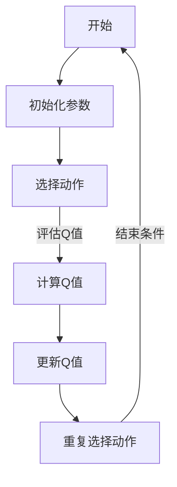

                 

### 引言

#### 航空航天领域的特殊性与挑战

航空航天领域是一个高度复杂且技术密集的领域，涉及飞行器设计、制造、运行和维护等多个环节。其特殊性在于需要应对极端的环境条件、高可靠性和实时性的要求。例如，航天器在太空中运行，需要长时间自主运行且对精度要求极高；而无人机和战斗机等飞行器则需要具备出色的机动性和稳定性，同时要能够在复杂的气象条件下飞行。

这些特殊要求使得传统的控制方法和优化算法难以满足航空航天领域的高标准。因此，引入先进的机器学习算法，特别是强化学习中的深度Q-learning算法，成为了一个重要的研究方向。

#### 深度Q-learning的基本原理

深度Q-learning（DQN）是一种基于深度学习的强化学习算法。它通过学习状态和动作之间的价值函数，指导智能体在给定环境中做出最优决策。DQN的核心思想是将Q-learning算法与深度神经网络（DNN）结合，利用神经网络处理高维的状态空间，从而提高算法的适应性和效率。

**核心概念与联系**

为了更好地理解深度Q-learning，我们可以用Mermaid流程图展示其基本结构：



**核心算法原理讲解**

1. **Q值更新公式**

   深度Q-learning的核心在于Q值更新公式：

   $$ Q(s, a) = Q(s, a) + \alpha [r + \gamma \max_{a'} Q(s', a') - Q(s, a)] $$

   其中，$s$和$s'$分别是当前状态和下一个状态，$a$和$a'$分别是当前动作和下一个动作，$r$是即时奖励，$\alpha$是学习率，$\gamma$是折扣因子。

2. **目标网络更新**

   为了避免梯度消失和梯度爆炸，通常会使用目标网络（Target Network）。目标网络是一个参数与当前网络相同的独立网络，用于定期更新当前网络的参数。

**数学模型和数学公式**

深度Q-learning的数学模型主要包括Q值函数和损失函数。Q值函数用于衡量在给定状态下执行特定动作的预期回报，其公式如下：

$$ Q(s, a) = \frac{1}{N}\sum_{i=1}^{N} \frac{r_i + \gamma \max_{a'} Q(s', a') - Q(s, a)}{N} $$

其中，$N$是批量大小，$r_i$是第$i$个样本的即时奖励。

损失函数用于衡量预测Q值与真实Q值之间的差距，其公式如下：

$$ Loss = (Q(s, a) - r - \gamma \max_{a'} Q(s', a'))^2 $$

**详细讲解 & 举例说明**

假设一个简单的环境，有2个动作：左移和右移。状态空间为$(1, 2, 3)$。

- 当前状态为$(1, 1)$，执行右移动作后，状态变为$(1, 2)$，得到奖励1。

根据Q值更新公式：

$$ Q(1, 1, "右移") = Q(1, 1, "右移") + \alpha [1 + \gamma \max_{a'} Q(1, 2, a')] - Q(1, 1, "右移") $$

由于只有两个动作，$\max_{a'} Q(1, 2, a')$ 等于 $Q(1, 2, "左移")$ 和 $Q(1, 2, "右移")$ 中的最大值。假设当前 $Q(1, 2, "左移") = 0.5$ 和 $Q(1, 2, "右移") = 0.6$，则：

$$ Q(1, 1, "右移") = 0.9 + 0.1 [1 + 0.9 \times 0.6] - 0.9 $$
$$ Q(1, 1, "右移") = 0.9 + 0.1 [1 + 0.54] - 0.9 $$
$$ Q(1, 1, "右移") = 0.9 + 0.1 \times 1.54 - 0.9 $$
$$ Q(1, 1, "右移") = 0.9 + 0.154 - 0.9 $$
$$ Q(1, 1, "右移") = 0.054 $$

这样，通过不断更新Q值，深度Q-learning算法可以学会在给定状态下选择最优动作。

**项目实战**

为了更好地理解深度Q-learning算法，我们将使用Python和TensorFlow实现一个简单的例子。

**环境搭建**：

首先，我们需要使用TensorFlow搭建一个简单的环境。在这里，我们使用`gym`库中的`CartPole-v0`环境作为例子。

```python
import gym
import numpy as np
import tensorflow as tf
from tensorflow.keras.models import Sequential
from tensorflow.keras.layers import Dense

# 创建环境
env = gym.make("CartPole-v0")

# 模型搭建
model = Sequential()
model.add(Dense(64, input_dim=4, activation='relu'))
model.add(Dense(64, activation='relu'))
model.add(Dense(1, activation='linear'))

# 模型编译
model.compile(loss='mse', optimizer='adam')
```

**代码实现**：

接下来，我们实现深度Q-learning算法的核心部分，包括选择动作、更新Q值、目标网络更新等。

```python
# 初始化参数
epsilon = 0.1  # 探索率
alpha = 0.1   # 学习率
gamma = 0.99  # 折扣因子
episode_num = 500  # 最大训练回合数

# 训练模型
for episode in range(episode_num):
    state = env.reset()
    done = False
    total_reward = 0
    
    while not done:
        # 探索与利用策略
        if np.random.rand() < epsilon:
            action = env.action_space.sample()
        else:
            action = np.argmax(model.predict(state.reshape(-1, 4)))
        
        # 执行动作
        next_state, reward, done, _ = env.step(action)
        
        # 更新经验回放
        model.fit(state.reshape(-1, 4), reward + gamma * (1 - int(done)), epochs=1, verbose=0)
        
        # 更新状态
        state = next_state
        total_reward += reward
    
    # 随着训练的进行，逐渐减少探索率
    if epsilon > 0.01:
        epsilon *= 0.995

print("总奖励:", total_reward)
env.close()
```

**代码解读与分析**：

上述代码首先定义了探索率、学习率和折扣因子等参数。在训练过程中，使用`while`循环逐回合进行游戏。在每个回合中，根据当前状态选择动作，然后执行动作并获取下一个状态和奖励。通过`model.fit`函数更新模型参数，从而提高模型的性能。

**总结**

通过本文的讲解，我们了解了深度Q-learning算法的基本原理、数学模型和实现方法，并使用Python和TensorFlow实现了一个简单的例子。在下一章中，我们将进一步探讨深度Q-learning在航空航天领域的具体应用案例。

---

以上是文章正文的第一部分，包含了引言、核心概念与联系、核心算法原理讲解、数学模型和公式、详细讲解与举例说明，以及项目实战。接下来，我们将继续探讨深度Q-learning在航空航天领域的具体应用。如果您有任何建议或疑问，请随时在评论区留言。您的反馈对我们非常重要！

