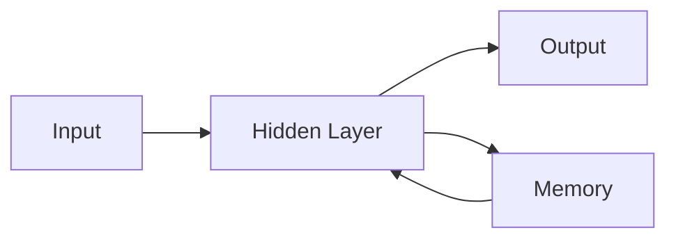
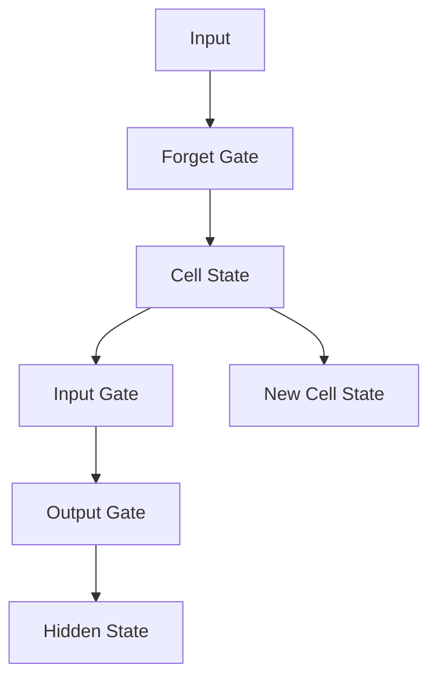
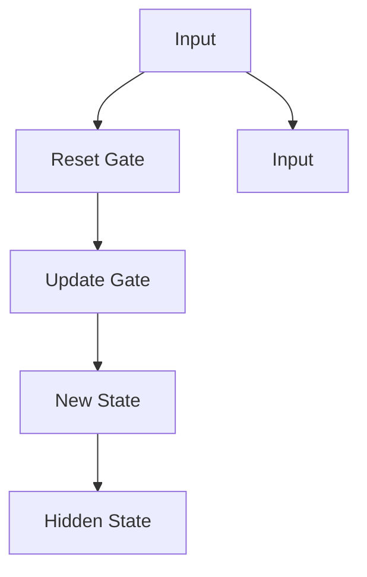
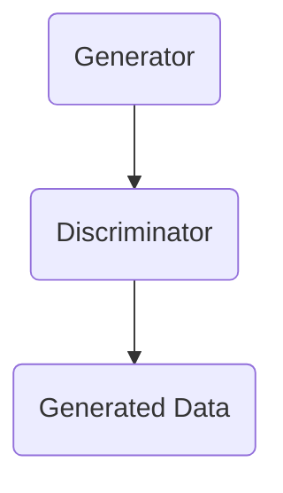
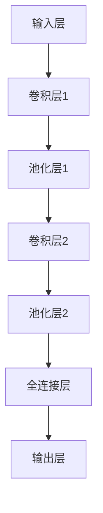
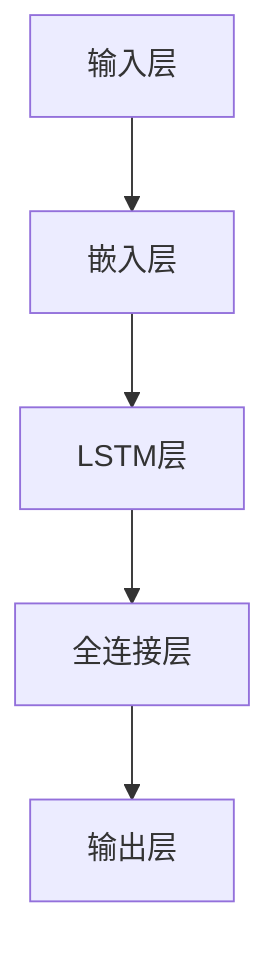

                 

### 文章标题

《深度学习(Deep Learning) - 原理与代码实例讲解》

---

### 关键词

- 深度学习
- 神经网络
- TensorFlow
- PyTorch
- 机器学习
- 图像识别
- 自然语言处理
- 自监督学习

---

### 摘要

本文旨在为深度学习初学者和从业者提供一篇系统而详实的深度学习技术博客。文章首先介绍了深度学习的基础知识，包括深度学习的起源、基本概念、应用领域以及与传统机器学习的对比。接着深入讲解了神经网络的基础知识，包括神经元模型、前馈神经网络、激活函数和反向传播算法。随后，文章探讨了深度学习框架的使用，包括TensorFlow、PyTorch和Keras。在深度学习模型部分，文章详细阐述了卷积神经网络（CNN）、循环神经网络（RNN）和生成对抗网络（GAN）的原理。文章还涉及深度学习优化与调参、深度学习应用实例以及深度学习实践项目。最后，文章讨论了深度学习的数学基础、硬件加速和未来方向，并附有深度学习资源与工具、相关公式解释以及常见问题与解答。

---

### 第一部分：深度学习基础

#### 第1章：深度学习概述

##### 1.1 深度学习的起源与发展

深度学习（Deep Learning）是机器学习（Machine Learning）的一个分支，它基于多层神经网络模型来学习和表达数据。深度学习的概念起源于1980年代，当时的科学家们提出了多层感知机（Multilayer Perceptron, MLP）模型。然而，由于计算能力和数据资源有限，深度学习的发展在1990年代陷入停滞。随着计算技术的进步和大数据时代的到来，深度学习在2000年后迎来了新的发展契机。

2006年，Hinton等人提出了深度置信网络（Deep Belief Network, DBN），标志着深度学习正式重新崛起。随后，2012年，Hinton团队在ImageNet图像识别挑战赛上使用了深度卷积神经网络（CNN）取得了令人瞩目的成绩，深度学习开始迅速发展，并成为人工智能领域的热门方向。

##### 1.2 深度学习的基本概念

深度学习是一种机器学习技术，它使用多层神经网络来模拟人脑神经元之间的交互。深度学习模型通过学习输入数据和输出标签之间的映射关系，从而实现对数据的自动标注和分类。

- **神经网络（Neural Network）**：神经网络是由大量简单的计算单元（神经元）组成的网络，这些神经元通过加权连接相互连接。神经网络通过学习输入和输出数据之间的关系，来实现对数据的映射和分类。
- **深度（Depth）**：深度指的是神经网络中层数的多少。深度学习模型具有多个隐藏层，这使得模型能够学习更复杂的特征表示。
- **学习算法（Learning Algorithm）**：深度学习模型通过学习算法来调整网络中的权重和偏置，从而优化模型的性能。常见的深度学习算法包括反向传播算法、梯度下降算法等。

##### 1.3 深度学习的应用领域

深度学习在多个领域都取得了显著的成果，其应用范围广泛，包括但不限于：

- **计算机视觉**：图像分类、目标检测、人脸识别、自动驾驶等。
- **自然语言处理**：文本分类、情感分析、机器翻译、语音识别等。
- **语音识别**：语音识别、语音合成等。
- **医疗健康**：疾病诊断、药物研发、医疗影像分析等。
- **推荐系统**：商品推荐、电影推荐、社交网络推荐等。

##### 1.4 深度学习与传统机器学习的对比

深度学习与传统机器学习有以下几点区别：

- **数据需求**：深度学习需要大量标注数据进行训练，而传统机器学习对数据量要求相对较低。
- **模型复杂度**：深度学习模型具有多个隐藏层，能够学习更复杂的特征表示，而传统机器学习模型通常只有一层或几层隐藏层。
- **模型泛化能力**：深度学习模型具有更好的泛化能力，能够在不同的数据集上取得较好的性能，而传统机器学习模型容易过拟合。
- **计算资源**：深度学习需要大量的计算资源和存储空间，而传统机器学习对计算资源的要求相对较低。

#### 第2章：神经网络基础

##### 2.1 神经元模型

神经元是神经网络的基本计算单元，其工作原理类似于人脑神经元。一个简单的神经元模型包括以下部分：

- **输入**：多个输入信号，每个输入信号都有一个相应的权重。
- **求和**：输入信号与权重相乘后求和。
- **偏置**：偏置是一个常数值，用于调整神经元的阈值。
- **激活函数**：对求和结果进行非线性变换，以产生输出信号。

神经元模型的数学表示如下：

\[ z = \sum_{i=1}^{n} w_i x_i + b \]
\[ a = \sigma(z) \]

其中，\( x_i \) 是第 \( i \) 个输入信号，\( w_i \) 是第 \( i \) 个输入信号的权重，\( b \) 是偏置，\( z \) 是求和结果，\( a \) 是输出信号，\( \sigma \) 是激活函数。

常见的激活函数包括：

- ** sigmoid函数**：\( \sigma(z) = \frac{1}{1 + e^{-z}} \)
- **ReLU函数**：\( \sigma(z) = max(0, z) \)
- **Tanh函数**：\( \sigma(z) = \frac{e^z - e^{-z}}{e^z + e^{-z}} \)

##### 2.2 前馈神经网络

前馈神经网络（Feedforward Neural Network）是一种简单的神经网络结构，其中数据从前向后传递，每个神经元只接受前一个神经元的输出作为输入，而不形成循环。

前馈神经网络的基本结构包括输入层、隐藏层和输出层。输入层接收外部输入，隐藏层对输入进行特征提取和变换，输出层产生最终的输出结果。

前馈神经网络的训练过程主要包括以下步骤：

1. **初始化权重和偏置**：随机初始化网络中的权重和偏置。
2. **前向传播**：将输入信号通过网络进行传播，计算每个神经元的输出。
3. **计算损失**：计算实际输出与预期输出之间的差异，即损失。
4. **反向传播**：根据损失函数计算梯度，更新网络中的权重和偏置。
5. **迭代训练**：重复上述步骤，直到网络性能达到预定的阈值。

##### 2.3 激活函数

激活函数是神经网络中的关键组成部分，它为神经元引入了非线性特性，使得神经网络能够学习和表达复杂的数据关系。常见的激活函数包括：

1. **Sigmoid函数**：
   \[ \sigma(z) = \frac{1}{1 + e^{-z}} \]
   Sigmoid函数将输入映射到 \( (0, 1) \) 区间，具有平滑的梯度。

2. **ReLU函数**：
   \[ \sigma(z) = max(0, z) \]
   ReLU函数在输入大于0时返回输入值，否则返回0。ReLU函数计算速度快，有助于防止神经元死亡。

3. **Tanh函数**：
   \[ \sigma(z) = \frac{e^z - e^{-z}}{e^z + e^{-z}} \]
   Tanh函数将输入映射到 \( (-1, 1) \) 区间，与sigmoid函数类似，但梯度更平滑。

激活函数的选择对神经网络性能有重要影响。Sigmoid函数和Tanh函数适用于输出范围受限的问题，而ReLU函数适用于训练速度和梯度消失问题。

##### 2.4 反向传播算法

反向传播算法（Backpropagation Algorithm）是训练神经网络的核心算法，它通过计算损失函数关于网络参数的梯度，来更新网络中的权重和偏置，从而优化网络性能。

反向传播算法的基本步骤如下：

1. **前向传播**：将输入信号通过网络进行传播，计算每个神经元的输出。
2. **计算损失**：计算实际输出与预期输出之间的差异，即损失。
3. **计算梯度**：根据损失函数，计算网络中每个参数的梯度。
4. **更新参数**：利用梯度下降算法更新网络中的权重和偏置。
5. **迭代训练**：重复上述步骤，直到网络性能达到预定的阈值。

反向传播算法的数学表示如下：

\[ \nabla_{w} J(w) = \frac{\partial J(w)}{\partial w} \]

其中，\( \nabla \) 表示梯度运算符，\( J(w) \) 表示损失函数关于参数 \( w \) 的梯度。

反向传播算法的详细推导过程如下：

1. **前向传播**：

   设网络中有一个包含 \( L \) 层的神经网络，输入信号为 \( x \)，输出信号为 \( y \)。设第 \( l \) 层的输出为 \( z_l \)，第 \( l \) 层的权重为 \( w_l \)，第 \( l \) 层的偏置为 \( b_l \)。前向传播的过程可以表示为：

   \[ z_{l+1} = \sigma(z_l W_{l+1} + b_{l+1}) \]
   \[ a_{l+1} = z_{l+1} \]

2. **计算损失**：

   设损失函数为 \( J(w) = \frac{1}{2} \sum_{i=1}^{n} (y_i - a_n)^2 \)，其中 \( n \) 为样本数量，\( y_i \) 为第 \( i \) 个样本的预期输出，\( a_n \) 为第 \( n \) 层的输出。

3. **计算梯度**：

   根据链式法则，可以计算出损失函数关于第 \( l \) 层权重 \( w_{l+1} \) 的梯度：

   \[ \nabla_{w_{l+1}} J(w) = \frac{\partial J(w)}{\partial z_{l+1}} \frac{\partial z_{l+1}}{\partial w_{l+1}} \]

   根据前向传播的过程，有：

   \[ \frac{\partial z_{l+1}}{\partial w_{l+1}} = a_{l+1} (1 - a_{l+1}) \]

   将 \( z_{l+1} \) 和 \( a_{l+1} \) 的表达式代入，得到：

   \[ \nabla_{w_{l+1}} J(w) = -a_{l+1} (y - a_n) \]

4. **更新参数**：

   利用梯度下降算法更新第 \( l \) 层的权重 \( w_{l+1} \) 和偏置 \( b_{l+1} \)：

   \[ w_{l+1} = w_{l+1} - \alpha \nabla_{w_{l+1}} J(w) \]
   \[ b_{l+1} = b_{l+1} - \alpha \nabla_{b_{l+1}} J(w) \]

   其中，\( \alpha \) 为学习率。

5. **迭代训练**：

   重复上述步骤，直到网络性能达到预定的阈值。

反向传播算法是深度学习模型训练的核心算法，它使得神经网络能够通过学习大量数据进行自我优化，从而实现高效的预测和分类。在实际应用中，反向传播算法的效率和准确性取决于网络结构、参数初始化和学习策略等因素。

#### 第3章：深度学习框架

##### 3.1 TensorFlow

TensorFlow是谷歌开发的开源深度学习框架，它提供了丰富的API和工具，支持各种深度学习模型的构建和训练。TensorFlow的主要特点包括：

- **动态计算图（Dynamic Computation Graph）**：TensorFlow使用动态计算图来描述深度学习模型，这使得模型可以灵活地构建和优化。
- **支持多种硬件平台**：TensorFlow可以在CPU、GPU和TPU上运行，提供高效的计算性能。
- **广泛的社区支持**：TensorFlow拥有庞大的开发者社区，提供了大量的教程、文档和开源项目。

使用TensorFlow构建深度学习模型的基本步骤如下：

1. **导入依赖库**：
   ```python
   import tensorflow as tf
   ```

2. **定义计算图**：
   ```python
   x = tf.placeholder(tf.float32, shape=[None, 784])
   y = tf.placeholder(tf.float32, shape=[None, 10])
   ```

3. **构建模型**：
   ```python
   W = tf.Variable(tf.zeros([784, 10]))
   b = tf.Variable(tf.zeros([10]))
   y_pred = tf.nn.softmax(tf.matmul(x, W) + b)
   ```

4. **定义损失函数和优化器**：
   ```python
   cross_entropy = tf.reduce_mean(-tf.reduce_sum(y * tf.log(y_pred), reduction_indices=1))
   optimizer = tf.train.GradientDescentOptimizer(learning_rate=0.1)
   train_op = optimizer.minimize(cross_entropy)
   ```

5. **初始化变量**：
   ```python
   init = tf.global_variables_initializer()
   ```

6. **运行会话**：
   ```python
   with tf.Session() as sess:
       sess.run(init)
       for i in range(1000):
           batch_x, batch_y = ...  # 获取训练数据
           _, loss_val = sess.run([train_op, cross_entropy], feed_dict={x: batch_x, y: batch_y})
   ```

##### 3.2 PyTorch

PyTorch是另一个流行的开源深度学习框架，它提供了简洁而灵活的API，使得深度学习模型的构建和训练更加直观。PyTorch的主要特点包括：

- **静态和动态计算图混合使用**：PyTorch支持静态计算图，同时也允许动态计算图的使用，这使得模型可以灵活地构建和优化。
- **自动微分系统**：PyTorch提供了自动微分系统，使得深度学习模型的反向传播算法实现更加简单。
- **丰富的预训练模型库**：PyTorch提供了丰富的预训练模型库，方便用户进行模型迁移和微调。

使用PyTorch构建深度学习模型的基本步骤如下：

1. **导入依赖库**：
   ```python
   import torch
   import torch.nn as nn
   import torch.optim as optim
   ```

2. **定义模型**：
   ```python
   class NeuralNetwork(nn.Module):
       def __init__(self):
           super(NeuralNetwork, self).__init__()
           self.layer1 = nn.Linear(784, 256)
           self.layer2 = nn.Linear(256, 128)
           self.layer3 = nn.Linear(128, 10)
           self.relu = nn.ReLU()

       def forward(self, x):
           x = self.relu(self.layer1(x))
           x = self.relu(self.layer2(x))
           x = self.layer3(x)
           return x
   ```

3. **初始化模型和优化器**：
   ```python
   model = NeuralNetwork()
   optimizer = optim.SGD(model.parameters(), lr=0.1)
   criterion = nn.CrossEntropyLoss()
   ```

4. **训练模型**：
   ```python
   for epoch in range(1000):
       for inputs, labels in train_loader:
           optimizer.zero_grad()
           outputs = model(inputs)
           loss = criterion(outputs, labels)
           loss.backward()
           optimizer.step()
   ```

##### 3.3 Keras

Keras是一个高级神经网络API，它提供了简洁而灵活的API，使得深度学习模型的构建和训练更加简单。Keras主要依赖于TensorFlow和Theano两个底层框架，支持多种深度学习模型和任务。Keras的主要特点包括：

- **简洁的API**：Keras提供了简洁的API，使得模型构建和训练更加直观。
- **模块化组件**：Keras提供了丰富的模块化组件，方便用户自定义深度学习模型。
- **快速迭代**：Keras支持快速原型设计和迭代，提高了开发效率。

使用Keras构建深度学习模型的基本步骤如下：

1. **导入依赖库**：
   ```python
   from keras.models import Sequential
   from keras.layers import Dense, Activation
   from keras.optimizers import SGD
   ```

2. **定义模型**：
   ```python
   model = Sequential()
   model.add(Dense(256, input_dim=784))
   model.add(Activation('relu'))
   model.add(Dense(128))
   model.add(Activation('relu'))
   model.add(Dense(10))
   model.add(Activation('softmax'))
   ```

3. **编译模型**：
   ```python
   model.compile(loss='categorical_crossentropy', optimizer=SGD(lr=0.1), metrics=['accuracy'])
   ```

4. **训练模型**：
   ```python
   model.fit(x_train, y_train, epochs=1000, batch_size=128)
   ```

#### 第4章：深度学习模型

##### 4.1 卷积神经网络（CNN）

卷积神经网络（Convolutional Neural Network，CNN）是一种特殊的神经网络，专门用于处理具有网格结构的数据，如图像、声音和文本。CNN通过卷积层、池化层和全连接层等结构，实现对数据的特征提取和分类。

CNN的基本结构如下：

1. **卷积层（Convolutional Layer）**：卷积层通过卷积操作提取输入数据的特征。卷积层中的每个卷积核（Convolutional Kernel）都是一个小的滤波器，通过对输入数据进行卷积操作，提取出特征图（Feature Map）。

2. **激活函数（Activation Function）**：激活函数用于引入非线性特性，常见的激活函数有ReLU、Sigmoid和Tanh等。

3. **池化层（Pooling Layer）**：池化层用于降低特征图的维度，提高模型的泛化能力。常见的池化操作有最大池化和平均池化。

4. **全连接层（Fully Connected Layer）**：全连接层将特征图展开成一维向量，并通过全连接层进行分类和回归操作。

CNN的主要优点包括：

- **参数共享**：卷积层中的卷积核对整个输入数据都进行卷积操作，从而减少了模型参数的数量，提高了模型的泛化能力。
- **特征自动提取**：CNN通过卷积层自动提取图像中的局部特征，避免了人工设计特征的过程，提高了模型的鲁棒性。
- **高效的计算**：卷积操作可以通过卷积算法进行高效计算，提高了模型的运行速度。

##### 4.2 循环神经网络（RNN）

循环神经网络（Recurrent Neural Network，RNN）是一种能够处理序列数据的神经网络。RNN通过记忆单元（Memory Unit）来存储历史信息，实现对序列数据的建模。

RNN的基本结构如下：

1. **输入层（Input Layer）**：输入层接收输入序列，并将其传递给隐藏层。

2. **隐藏层（Hidden Layer）**：隐藏层包含一个或多个记忆单元，通过记忆单元的循环连接，实现对历史信息的存储和更新。

3. **输出层（Output Layer）**：输出层将隐藏层的输出映射到输出序列。

RNN的主要优点包括：

- **序列建模**：RNN能够处理任意长度的序列数据，适用于文本、语音和视频等序列数据建模。
- **记忆能力**：RNN通过记忆单元存储历史信息，能够记住序列中的长距离依赖关系。

然而，RNN也面临着一些问题，如梯度消失和梯度爆炸。为了解决这些问题，提出了一系列改进的RNN结构，包括LSTM和GRU。

##### 4.2.1 RNN基础

RNN的基础结构如图所示：



在上图中，A表示输入序列，B表示隐藏层，C表示输出层，D表示记忆单元。隐藏层通过记忆单元与输入和输出层相连，实现了序列数据的建模。

RNN的数学表示如下：

\[ h_t = \sigma(W_h h_{t-1} + W_x x_t + b_h) \]
\[ y_t = W_y h_t + b_y \]

其中，\( h_t \) 表示第 \( t \) 个隐藏层输出，\( x_t \) 表示第 \( t \) 个输入，\( W_h \) 和 \( W_x \) 分别表示隐藏层和输入层的权重，\( b_h \) 表示隐藏层的偏置，\( \sigma \) 表示激活函数，\( W_y \) 和 \( b_y \) 分别表示输出层的权重和偏置。

##### 4.2.2 LSTM

长短期记忆网络（Long Short-Term Memory，LSTM）是一种改进的RNN结构，能够有效地解决RNN的梯度消失和梯度爆炸问题，提高了模型的长期记忆能力。

LSTM的基本结构如图所示：



在上图中，A表示输入序列，B表示忘记门（Forget Gate），C表示细胞状态（Cell State），D表示输入门（Input Gate），E表示输出门（Output Gate），F表示隐藏状态（Hidden State），G表示新的细胞状态（New Cell State）。LSTM通过引入忘记门、输入门和输出门，实现了对信息的记忆和控制。

LSTM的数学表示如下：

\[ i_t = \sigma(W_i x_t + U_h h_{t-1} + b_i) \]
\[ f_t = \sigma(W_f x_t + U_f h_{t-1} + b_f) \]
\[ g_t = \tanh(W_g x_t + U_g h_{t-1} + b_g) \]
\[ o_t = \sigma(W_o x_t + U_o h_{t-1} + b_o) \]
\[ c_t = f_t \odot c_{t-1} + i_t \odot g_t \]
\[ h_t = o_t \odot \tanh(c_t) \]

其中，\( i_t \) 表示输入门的激活值，\( f_t \) 表示忘记门的激活值，\( g_t \) 表示新的细胞状态的激活值，\( o_t \) 表示输出门的激活值，\( c_t \) 表示新的细胞状态，\( h_t \) 表示隐藏状态，\( \odot \) 表示元素乘法，\( \tanh \) 表示双曲正切函数。

##### 4.2.3 GRU

门控循环单元（Gated Recurrent Unit，GRU）是另一种改进的RNN结构，它简化了LSTM的结构，但仍然保持了LSTM的长期记忆能力。

GRU的基本结构如图所示：



在上图中，A表示输入序列，B表示重置门（Reset Gate），C表示更新门（Update Gate），D表示新的状态（New State），E表示隐藏状态，F表示输入。GRU通过引入重置门和更新门，实现了对信息的记忆和控制。

GRU的数学表示如下：

\[ z_t = \sigma(W_z x_t + U_z h_{t-1} + b_z) \]
\[ r_t = \sigma(W_r x_t + U_r h_{t-1} + b_r) \]
\[ \bar{h_t} = \tanh(W \bar{h} (r_t \odot h_{t-1}) + U \bar{h} x_t + b \bar{h}) \]
\[ h_t = (1 - z_t) \odot h_{t-1} + z_t \odot \bar{h_t} \]

其中，\( z_t \) 表示更新门的激活值，\( r_t \) 表示重置门的激活值，\( \bar{h_t} \) 表示新的隐藏状态的候选值，\( h_t \) 表示新的隐藏状态，\( \odot \) 表示元素乘法，\( \tanh \) 表示双曲正切函数。

##### 4.3 生成对抗网络（GAN）

生成对抗网络（Generative Adversarial Network，GAN）是由生成器和判别器组成的对抗性模型，用于生成逼真的数据样本。

GAN的基本结构如图所示：



在上图中，A表示生成器（Generator），B表示判别器（Discriminator），C表示生成器的输出。生成器的目标是生成逼真的数据样本，判别器的目标是区分真实数据和生成数据。

GAN的数学表示如下：

\[ G(z) = x \]
\[ D(x) \]
\[ D(G(z)) \]

其中，\( G(z) \) 表示生成器的输出，\( z \) 表示生成器的噪声输入，\( D(x) \) 表示判别器对真实数据的判断，\( D(G(z)) \) 表示判别器对生成数据的判断。

GAN的训练过程如下：

1. **初始化生成器和判别器**：随机初始化生成器和判别器的参数。
2. **生成器生成数据**：生成器生成一批数据样本。
3. **判别器判断数据**：判别器对真实数据和生成数据同时进行判断。
4. **更新判别器**：根据判别器的判断结果，更新判别器的参数。
5. **生成器生成新数据**：生成器再次生成一批数据样本。
6. **重复步骤2-5，直到生成器生成数据的质量达到预定的阈值**。

GAN的主要优点包括：

- **生成数据质量高**：GAN能够生成逼真的数据样本，适用于图像生成、文本生成等领域。
- **不需要真实标签**：GAN不需要真实标签，能够通过对抗性训练生成数据。

#### 第5章：深度学习优化与调参

##### 5.1 优化算法

优化算法是深度学习训练过程中用于更新模型参数的方法。常见的优化算法包括梯度下降（Gradient Descent）、动量法（Momentum）和Adam优化器（Adam Optimizer）。

1. **梯度下降（Gradient Descent）**

梯度下降是最简单的优化算法，它通过计算损失函数关于模型参数的梯度，来更新模型参数。

梯度下降的基本步骤如下：

- **初始化参数**：随机初始化模型参数。
- **计算梯度**：计算损失函数关于模型参数的梯度。
- **更新参数**：根据梯度方向和步长更新模型参数。

梯度下降的数学表示如下：

\[ w_{t+1} = w_t - \alpha \nabla_{w} J(w_t) \]

其中，\( w_t \) 表示第 \( t \) 次迭代的参数，\( \alpha \) 表示学习率，\( \nabla_{w} J(w_t) \) 表示损失函数关于模型参数的梯度。

2. **动量法（Momentum）**

动量法是一种改进的梯度下降算法，它通过引入动量项来加速梯度方向上的搜索。

动量法的基本步骤如下：

- **初始化参数**：随机初始化模型参数。
- **计算梯度**：计算损失函数关于模型参数的梯度。
- **更新参数**：根据梯度方向和步长更新模型参数，并引入动量项。

动量法的数学表示如下：

\[ v_t = \beta v_{t-1} + (1 - \beta) \nabla_{w} J(w_t) \]
\[ w_{t+1} = w_t - \alpha v_t \]

其中，\( v_t \) 表示第 \( t \) 次迭代的动量项，\( \beta \) 表示动量系数，其余符号的含义与梯度下降相同。

3. **Adam优化器（Adam Optimizer）**

Adam优化器是一种基于一阶矩估计和二阶矩估计的优化算法，它结合了梯度下降和动量法的优点。

Adam优化器的基本步骤如下：

- **初始化参数**：随机初始化模型参数。
- **计算梯度**：计算损失函数关于模型参数的梯度。
- **更新参数**：根据梯度方向、一阶矩估计和二阶矩估计更新模型参数。

Adam优化器的数学表示如下：

\[ m_t = \beta_1 g_t + (1 - \beta_1) (1 - \beta_2) \]
\[ v_t = \beta_2 g_t^2 + (1 - \beta_2) (1 - \beta_2) \]
\[ \hat{m_t} = \frac{m_t}{1 - \beta_1^t} \]
\[ \hat{v_t} = \frac{v_t}{1 - \beta_2^t} \]
\[ w_{t+1} = w_t - \alpha \frac{\hat{m_t}}{\sqrt{\hat{v_t}} + \epsilon} \]

其中，\( m_t \) 表示一阶矩估计，\( v_t \) 表示二阶矩估计，\( \hat{m_t} \) 和 \( \hat{v_t} \) 分别为 \( m_t \) 和 \( v_t \) 的归一化值，\( \beta_1 \) 和 \( \beta_2 \) 分别为动量系数，\( \alpha \) 表示学习率，\( \epsilon \) 为一个很小的常数。

##### 5.2 超参数调优

超参数是深度学习模型中需要手动设置的参数，如学习率、批次大小、隐藏层单元数等。超参数的调优对模型的性能有重要影响。

超参数调优的方法包括：

1. **网格搜索（Grid Search）**

网格搜索是一种常用的超参数调优方法，它通过遍历所有可能的超参数组合，找到最优的超参数组合。

网格搜索的基本步骤如下：

- **定义超参数范围**：确定每个超参数的取值范围。
- **遍历超参数组合**：对所有可能的超参数组合进行遍历。
- **训练模型**：使用每个超参数组合训练模型，并计算模型的性能指标。
- **选择最优超参数组合**：根据性能指标选择最优的超参数组合。

2. **随机搜索（Random Search）**

随机搜索是一种基于概率的搜索方法，它通过随机选择超参数的取值，找到最优的超参数组合。

随机搜索的基本步骤如下：

- **定义超参数范围**：确定每个超参数的取值范围。
- **随机选择超参数**：从每个超参数的取值范围内随机选择超参数。
- **训练模型**：使用每个随机选择的超参数组合训练模型，并计算模型的性能指标。
- **选择最优超参数组合**：根据性能指标选择最优的超参数组合。

3. **贝叶斯优化（Bayesian Optimization）**

贝叶斯优化是一种基于概率模型的优化方法，它通过构建概率模型来估计超参数的取值，并选择最有可能产生最佳性能的超参数。

贝叶斯优化的基本步骤如下：

- **初始化概率模型**：根据先验知识初始化概率模型。
- **选择候选超参数**：根据概率模型选择最有可能产生最佳性能的候选超参数。
- **训练模型**：使用候选超参数训练模型，并计算模型的性能指标。
- **更新概率模型**：根据模型的性能指标更新概率模型。
- **重复步骤2-4，直到找到最优超参数组合**。

##### 5.2.1 超参数搜索方法

超参数搜索方法是调优超参数的重要手段。以下介绍几种常用的超参数搜索方法。

1. **网格搜索（Grid Search）**

网格搜索是一种 brute-force 的搜索方法，通过遍历所有可能的超参数组合，找到最优的超参数组合。其优点是简单易懂，但缺点是当超参数空间较大时，搜索效率较低。

网格搜索的基本步骤如下：

- **定义超参数范围**：确定每个超参数的取值范围。例如，学习率可以取 [0.01, 0.1]，批次大小可以取 [32, 64, 128]。
- **遍历超参数组合**：对所有可能的超参数组合进行遍历。例如，对于两个超参数，有3个取值范围，共有 \( 3 \times 3 = 9 \) 种组合。
- **训练模型**：使用每个超参数组合训练模型，并计算模型的性能指标。例如，可以使用交叉验证来评估模型的性能。
- **选择最优超参数组合**：根据性能指标选择最优的超参数组合。

2. **随机搜索（Random Search）**

随机搜索是一种基于概率的搜索方法，通过随机选择超参数的取值，找到最优的超参数组合。随机搜索相较于网格搜索，在超参数空间较大时搜索效率较高，且不容易陷入局部最优。

随机搜索的基本步骤如下：

- **定义超参数范围**：确定每个超参数的取值范围。
- **随机选择超参数**：从每个超参数的取值范围内随机选择超参数。例如，可以使用随机抽样或均匀抽样等方法。
- **训练模型**：使用每个随机选择的超参数组合训练模型，并计算模型的性能指标。
- **选择最优超参数组合**：根据性能指标选择最优的超参数组合。

3. **贝叶斯优化（Bayesian Optimization）**

贝叶斯优化是一种基于概率模型的优化方法，通过构建概率模型来估计超参数的取值，并选择最有可能产生最佳性能的超参数。贝叶斯优化具有自适应性和鲁棒性，适用于复杂的超参数搜索。

贝叶斯优化的基本步骤如下：

- **初始化概率模型**：根据先验知识初始化概率模型。例如，可以使用高斯过程（Gaussian Process）作为概率模型。
- **选择候选超参数**：根据概率模型选择最有可能产生最佳性能的候选超参数。例如，可以使用最大化后验概率（Maximum a Posteriori，MAP）准则选择候选超参数。
- **训练模型**：使用每个候选超参数组合训练模型，并计算模型的性能指标。
- **更新概率模型**：根据模型的性能指标更新概率模型。
- **重复步骤2-4，直到找到最优超参数组合**。

##### 5.2.2 实践经验与技巧

在深度学习项目中，超参数调优是一个关键步骤，它直接影响到模型的性能和训练时间。以下是一些实践经验和技巧：

1. **选择合适的初始值**：对于某些超参数，如学习率，选择合适的初始值可以加快搜索过程。例如，对于小数据集和简单模型，可以选择较小的学习率；对于大数据集和复杂模型，可以选择较大的学习率。

2. **逐步缩小搜索范围**：在搜索过程中，可以逐步缩小搜索范围，以减少计算量。例如，可以使用网格搜索初步筛选出较好的超参数范围，然后使用随机搜索或贝叶斯优化进一步缩小搜索范围。

3. **使用验证集进行评估**：在超参数调优过程中，应使用验证集进行模型评估，以避免过拟合。可以使用交叉验证方法对验证集进行多次评估，以获得更可靠的结果。

4. **记录和对比实验结果**：在超参数调优过程中，应记录每次实验的结果，包括超参数组合和模型性能指标。通过对比实验结果，可以找到最优的超参数组合。

5. **考虑模型复杂度**：在超参数调优时，应考虑模型的复杂度，避免过拟合。例如，对于复杂模型，可以适当减少隐藏层单元数或批次大小。

6. **使用启发式方法**：在实际项目中，可以结合经验和直觉，使用启发式方法进行超参数调优。例如，根据模型的特点和数据集的大小，选择合适的优化算法和学习率。

7. **使用工具和库**：可以使用现有的工具和库进行超参数调优，如Hyperopt、Optuna等。这些工具和库提供了丰富的搜索算法和评估指标，可以简化调参过程。

通过以上实践经验和技巧，可以更有效地进行深度学习项目的超参数调优，提高模型的性能和训练效率。

#### 第6章：深度学习应用实例

##### 6.1 图像识别

图像识别是深度学习在计算机视觉领域的重要应用之一。通过训练深度学习模型，可以对图像进行分类、目标检测、人脸识别等任务。

在本节中，我们将介绍两个经典的图像识别应用实例：图像分类和目标检测。

##### 6.1.1 图像分类

图像分类是将图像划分为不同的类别。一个简单的图像分类任务可以是判断一张图片是猫还是狗。在深度学习框架下，图像分类通常使用卷积神经网络（CNN）来实现。

下面是一个使用Keras和TensorFlow实现图像分类的例子：

```python
from tensorflow.keras.models import Sequential
from tensorflow.keras.layers import Conv2D, MaxPooling2D, Flatten, Dense
from tensorflow.keras.preprocessing.image import ImageDataGenerator

# 构建模型
model = Sequential()
model.add(Conv2D(32, (3, 3), activation='relu', input_shape=(64, 64, 3)))
model.add(MaxPooling2D(pool_size=(2, 2)))
model.add(Conv2D(64, (3, 3), activation='relu'))
model.add(MaxPooling2D(pool_size=(2, 2)))
model.add(Flatten())
model.add(Dense(128, activation='relu'))
model.add(Dense(1, activation='sigmoid'))

# 编译模型
model.compile(optimizer='adam', loss='binary_crossentropy', metrics=['accuracy'])

# 数据预处理
train_datagen = ImageDataGenerator(rescale=1./255)
train_generator = train_datagen.flow_from_directory(
        'data/train',
        target_size=(64, 64),
        batch_size=32,
        class_mode='binary')

# 训练模型
model.fit(train_generator, epochs=10)
```

在上面的代码中，我们首先构建了一个简单的CNN模型，包括两个卷积层、两个池化层和一个全连接层。接着，我们使用ImageDataGenerator对训练数据进行预处理，包括缩放和批量生成。最后，我们使用模型训练数据，训练10个epochs。

##### 6.1.2 目标检测

目标检测是在图像中识别和定位多个目标物体的任务。与图像分类不同，目标检测需要输出每个目标的类别和位置。一个经典的目标检测算法是Faster R-CNN。

下面是一个使用TensorFlow和Keras实现目标检测的例子：

```python
import tensorflow as tf
from tensorflow.keras.models import Model
from tensorflow.keras.layers import Input, Conv2D, MaxPooling2D, Flatten, Dense
from tensorflow.keras.applications import ResNet50

# 输入层
input_tensor = Input(shape=(224, 224, 3))

# 使用预训练的ResNet50作为基础模型
base_model = ResNet50(weights='imagenet', include_top=False, input_tensor=input_tensor)

# 添加全连接层和输出层
x = Flatten()(base_model.output)
x = Dense(1024, activation='relu')(x)
predictions = Dense(2, activation='sigmoid')(x)

# 创建模型
model = Model(inputs=base_model.input, outputs=predictions)

# 编译模型
model.compile(optimizer='adam', loss='binary_crossentropy', metrics=['accuracy'])

# 加载训练数据
train_data = ...

# 训练模型
model.fit(train_data, epochs=10)
```

在上面的代码中，我们首先使用预训练的ResNet50作为基础模型，然后添加全连接层和输出层，实现了一个简单的目标检测模型。接着，我们使用自定义的训练数据，训练10个epochs。

##### 6.2 自然语言处理

自然语言处理（Natural Language Processing，NLP）是深度学习在语言领域的应用。通过训练深度学习模型，可以实现文本分类、情感分析、机器翻译等任务。

在本节中，我们将介绍两个经典的NLP应用实例：词嵌入和序列标注。

##### 6.2.1 词嵌入

词嵌入（Word Embedding）是将词汇映射到高维空间的过程，使得在空间中相近的词具有相近的向量表示。词嵌入可以用于文本分类、情感分析等任务。

下面是一个使用GloVe实现词嵌入的例子：

```python
import numpy as np
from tensorflow.keras.preprocessing.sequence import pad_sequences

# 读取词向量文件
word_vectors = np.load('glove.6B.100d.npy')

# 构建词嵌入层
embedding_layer = Embedding(input_dim=vocab_size, output_dim=100, weights=[word_vectors], trainable=False)

# 加载文本数据
text_data = ...

# 序列化文本数据
sequences = pad_sequences(text_data, maxlen=max_sequence_length)

# 构建模型
model = Sequential()
model.add(embedding_layer)
model.add(Flatten())
model.add(Dense(1, activation='sigmoid'))

# 编译模型
model.compile(optimizer='adam', loss='binary_crossentropy', metrics=['accuracy'])

# 训练模型
model.fit(sequences, labels, epochs=10)
```

在上面的代码中，我们首先读取预训练的GloVe词向量，构建词嵌入层。接着，我们加载文本数据，序列化文本数据，构建一个简单的文本分类模型。最后，我们使用模型训练文本数据，训练10个epochs。

##### 6.2.2 序列标注

序列标注（Sequence Labeling）是将序列中的每个元素标注为特定类别。例如，在命名实体识别（Named Entity Recognition，NER）任务中，将文本中的每个实体标注为其类别。

下面是一个使用CRF（Conditional Random Field）实现序列标注的例子：

```python
import tensorflow as tf
from tensorflow.keras.layers import Embedding, LSTM, Dense
from tensorflow.keras.models import Model
from tensorflow_addons.layers import CRF

# 输入层
input_tensor = Input(shape=(max_sequence_length,))

# 构建词嵌入层
embedding_layer = Embedding(input_dim=vocab_size, output_dim=100, input_tensor=input_tensor)

# 构建LSTM层
lstm_layer = LSTM(128, return_sequences=True)(embedding_layer)

# 构建全连接层
dense_layer = Dense(num_classes, activation='softmax')(lstm_layer)

# 创建模型
model = Model(inputs=input_tensor, outputs=dense_layer)

# 编译模型
model.compile(optimizer='adam', loss='categorical_crossentropy', metrics=['accuracy'])

# 添加CRF层
crf_layer = CRF(num_classes)
outputs = crf_layer(dense_layer)

# 创建新模型
model = Model(inputs=input_tensor, outputs=outputs)

# 编译模型
model.compile(optimizer='adam', loss=crf_layer.loss_function, metrics=['accuracy'])

# 训练模型
model.fit(sequences, labels, epochs=10)
```

在上面的代码中，我们首先构建了一个简单的LSTM模型，然后添加CRF层来实现序列标注。最后，我们使用模型训练序列数据，训练10个epochs。

##### 6.2.3 机器翻译

机器翻译是深度学习在自然语言处理领域的另一个重要应用。通过训练深度学习模型，可以实现高质量的自然语言翻译。

下面是一个使用Seq2Seq模型实现机器翻译的例子：

```python
import tensorflow as tf
from tensorflow.keras.models import Model
from tensorflow.keras.layers import Embedding, LSTM, Dense

# 输入层
input_tensor = Input(shape=(max_sequence_length,))
target_tensor = Input(shape=(max_sequence_length,))

# 构建编码器
encoder_embedding = Embedding(input_dim=vocab_size, output_dim=100)(input_tensor)
encoder_lstm = LSTM(128)(encoder_embedding)

# 构建解码器
decoder_embedding = Embedding(input_dim=target_vocab_size, output_dim=100)(target_tensor)
decoder_lstm = LSTM(128)(decoder_embedding, initial_state=encoder_lstm.state)

# 构建全连接层
output = Dense(target_vocab_size, activation='softmax')(decoder_lstm)

# 创建模型
model = Model(inputs=[input_tensor, target_tensor], outputs=output)

# 编译模型
model.compile(optimizer='adam', loss='categorical_crossentropy', metrics=['accuracy'])

# 训练模型
model.fit([input_sequences, target_sequences], target_sequences, epochs=10)
```

在上面的代码中，我们首先构建了一个简单的Seq2Seq模型，包括编码器和解码器。接着，我们使用模型训练序列数据，训练10个epochs。

#### 第7章：深度学习实践项目

##### 7.1 项目准备

在进行深度学习项目时，项目准备阶段非常重要。项目准备主要包括开发环境搭建、数据处理和数据预处理等步骤。

##### 7.1.1 开发环境搭建

首先，需要搭建深度学习项目的开发环境。对于大多数深度学习项目，Python是最常用的编程语言，常用的深度学习框架包括TensorFlow、PyTorch和Keras。以下是搭建开发环境的步骤：

1. **安装Python**：确保已经安装了Python 3.x版本，推荐使用Anaconda或Miniconda，以便于管理环境和依赖库。
2. **创建虚拟环境**：使用conda创建一个虚拟环境，以便于隔离项目依赖。
   ```shell
   conda create -n deep_learning_env python=3.8
   conda activate deep_learning_env
   ```
3. **安装深度学习框架**：在虚拟环境中安装TensorFlow、PyTorch或Keras。
   ```shell
   pip install tensorflow
   # 或者
   pip install torch torchvision
   # 或者
   pip install keras
   ```

##### 7.1.2 数据处理

数据处理是深度学习项目的重要步骤，包括数据收集、数据清洗、数据预处理等。

1. **数据收集**：根据项目需求，收集相应的数据集。数据集可以从公开的数据集网站如Kaggle、UCI机器学习库等获取，或者自行收集。
2. **数据清洗**：对收集到的数据进行清洗，包括去除缺失值、异常值和重复值等。
3. **数据预处理**：对数据进行预处理，包括归一化、标准化、编码等。对于图像数据，可以采用像素归一化；对于文本数据，可以采用词袋模型、词嵌入等方法。

##### 7.1.3 数据预处理

数据预处理是深度学习项目中的重要环节，目的是将原始数据转换为适合模型训练的形式。以下是一些常见的数据预处理方法：

1. **归一化和标准化**：归一化和标准化是将数据缩放到特定范围内的方法。归一化是将数据缩放到 \([-1, 1]\) 范围，标准化是将数据缩放到 \([0, 1]\) 范围。对于图像数据，可以使用以下公式进行归一化：
   \[ x' = \frac{x - \mu}{\sigma} \]
   其中，\( x \) 是原始数据，\( \mu \) 是均值，\( \sigma \) 是标准差。
2. **词袋模型（Bag-of-Words，BOW）**：词袋模型是将文本表示为一个向量，其中每个维度表示一个词汇的出现次数。例如，对于文本 "The quick brown fox jumps over the lazy dog"，词袋模型可以表示为：
   \[ (0, 1, 1, 1, 0, 1, 0, 0, 0, 1, 0, 0, 0, 0, 0, 0, 0, 0, 0, 0) \]
3. **词嵌入（Word Embedding）**：词嵌入是将词汇映射到高维空间的方法，使得在空间中相近的词具有相近的向量表示。常见的词嵌入方法包括Word2Vec、GloVe等。例如，对于词汇 "cat" 和 "dog"，词嵌入可以表示为：
   \[ \text{cat}: (0.1, 0.2, 0.3, 0.4, 0.5) \]
   \[ \text{dog}: (0.2, 0.3, 0.4, 0.5, 0.6) \]
4. **数据集分割**：将数据集分为训练集、验证集和测试集。通常，可以使用以下比例进行分割：70%用于训练，15%用于验证，15%用于测试。

##### 7.2 项目实施

深度学习项目的实施主要包括模型设计、模型训练和模型评估等步骤。

##### 7.2.1 模型设计与实现

1. **模型设计**：根据项目需求，设计深度学习模型。可以选择现有的预训练模型进行迁移学习，或者从头开始构建模型。
2. **模型实现**：使用深度学习框架实现模型。例如，使用Keras实现一个简单的卷积神经网络（CNN）如下：
   ```python
   from tensorflow.keras.models import Sequential
   from tensorflow.keras.layers import Conv2D, MaxPooling2D, Flatten, Dense

   model = Sequential()
   model.add(Conv2D(32, (3, 3), activation='relu', input_shape=(28, 28, 1)))
   model.add(MaxPooling2D(pool_size=(2, 2)))
   model.add(Conv2D(64, (3, 3), activation='relu'))
   model.add(MaxPooling2D(pool_size=(2, 2)))
   model.add(Flatten())
   model.add(Dense(128, activation='relu'))
   model.add(Dense(10, activation='softmax'))

   model.compile(optimizer='adam', loss='categorical_crossentropy', metrics=['accuracy'])
   ```

##### 7.2.2 模型训练与评估

1. **模型训练**：使用训练集对模型进行训练。可以使用fit方法进行训练，并设置训练轮次、批次大小和验证集等参数。
   ```python
   model.fit(x_train, y_train, epochs=10, batch_size=32, validation_data=(x_val, y_val))
   ```
2. **模型评估**：使用测试集对模型进行评估，计算模型的准确率、召回率、F1分数等指标。
   ```python
   scores = model.evaluate(x_test, y_test, verbose=2)
   print('Test accuracy:', scores[1])
   ```

##### 7.3 项目总结与反思

在项目完成后，进行总结与反思是非常重要的。以下是一些项目总结与反思的建议：

1. **项目成果**：总结项目所取得的成果，包括模型性能、项目时间等。
2. **项目经验**：反思项目过程中遇到的问题和解决方案，总结经验教训。
3. **改进方向**：根据项目结果和反思，提出改进方向和下一步计划。

#### 第二部分：深度学习高级话题

##### 第8章：深度学习与数学

深度学习与数学紧密相连，理解数学基础对于深入掌握深度学习至关重要。本章将介绍深度学习中常用的数学概念，包括微积分和概率论。

##### 8.1 微积分基础

微积分是研究函数变化的数学分支，深度学习中的优化和推导过程都依赖于微积分知识。

1. **导数**：导数是描述函数变化率的量。对于函数 \( f(x) \)，导数 \( f'(x) \) 表示在点 \( x \) 处的瞬时变化率。
   \[ f'(x) = \lim_{{h \to 0}} \frac{{f(x+h) - f(x)}}{h} \]
2. **梯度**：梯度是多元函数的导数，表示函数在各个方向上的变化率。对于函数 \( f(x, y) \)，梯度为：
   \[ \nabla f(x, y) = \left( \frac{{\partial f}}{{\partial x}}, \frac{{\partial f}}{{\partial y}} \right) \]
3. **偏导数**：偏导数是只考虑一个变量变化的导数。对于函数 \( f(x, y) \)，对 \( x \) 和 \( y \) 的偏导数分别为：
   \[ \frac{{\partial f}}{{\partial x}} = \lim_{{h \to 0}} \frac{{f(x+h, y) - f(x, y)}}{h} \]
   \[ \frac{{\partial f}}{{\partial y}} = \lim_{{k \to 0}} \frac{{f(x, y+k) - f(x, y)}}{k} \]

##### 8.1.1 导数与梯度

在深度学习中，导数和梯度是优化模型参数的关键概念。导数用于计算损失函数关于参数的变化率，而梯度则用于更新参数。

1. **梯度下降**：梯度下降是一种优化算法，通过计算损失函数关于参数的梯度，逐步减小损失函数的值。梯度下降的基本公式为：
   \[ \theta_{t+1} = \theta_{t} - \alpha \nabla_\theta J(\theta) \]
   其中，\( \theta \) 表示参数，\( \alpha \) 表示学习率，\( \nabla_\theta J(\theta) \) 表示损失函数关于参数的梯度。
2. **链式法则**：链式法则是计算复合函数的导数的重要工具。对于复合函数 \( f(g(x)) \)，其导数为：
   \[ \frac{d f(g(x))}{dx} = \frac{df}{dg} \cdot \frac{dg}{dx} \]

##### 8.1.2 矩阵运算

矩阵运算是深度学习中不可或缺的一部分，矩阵的乘法和求导是优化算法的核心。

1. **矩阵乘法**：两个矩阵 \( A \) 和 \( B \) 的乘法结果为：
   \[ C = A \cdot B \]
   其中，\( C_{ij} = \sum_{{k=1}}^{{m}} A_{ik} B_{kj} \)
2. **矩阵求导**：矩阵的求导遵循类似标量的规则。对于矩阵 \( X \) 的导数 \( \frac{dX}{dx} \)，其每个元素 \( X_{ij} \) 的导数为：
   \[ \frac{dX_{ij}}{dx} = \left[ \begin{array}{ccc}
   \frac{dX_{i1}}{dx} & \frac{dX_{i2}}{dx} & \dots \\
   \frac{dX_{i1}}{dx} & \frac{dX_{i2}}{dx} & \dots \\
   \vdots & \vdots & \ddots
   \end{array} \right] \]

##### 8.2 概率论基础

概率论是深度学习中的重要工具，用于建模不确定性和推断。

1. **概率分布**：概率分布描述了随机变量取不同值的概率。常见的概率分布有正态分布、伯努利分布等。
2. **条件概率**：条件概率描述了在某个事件发生的条件下，另一个事件发生的概率。条件概率公式为：
   \[ P(A|B) = \frac{P(A \cap B)}{P(B)} \]
3. **贝叶斯定理**：贝叶斯定理是概率论中的基本原理，用于计算后验概率。贝叶斯定理公式为：
   \[ P(A|B) = \frac{P(B|A) P(A)}{P(B)} \]

##### 8.2.1 贝叶斯定理

贝叶斯定理是深度学习中概率推断的重要工具，用于根据先验概率和观察到的数据更新后验概率。

1. **贝叶斯推断**：贝叶斯推断是一种基于贝叶斯定理的推断方法，通过先验概率和观测数据计算后验概率。
2. **高斯分布**：高斯分布（正态分布）是贝叶斯推断中最常用的概率分布，其概率密度函数为：
   \[ f(x|\mu, \sigma^2) = \frac{1}{\sqrt{2\pi\sigma^2}} e^{-\frac{(x-\mu)^2}{2\sigma^2}} \]
3. **最大似然估计**：最大似然估计是贝叶斯推断的一种方法，通过最大化似然函数来估计模型参数。似然函数公式为：
   \[ L(\theta) = \prod_{{i=1}}^{{n}} p(x_i|\theta) \]

##### 8.2.2 最大似然估计

最大似然估计是概率统计中用于估计模型参数的方法。在深度学习中，最大似然估计常用于估计神经网络的权重。

1. **似然函数**：似然函数是概率密度的对数，用于衡量观测数据在给定模型参数下的可能性。似然函数公式为：
   \[ L(\theta) = \ln \left( \prod_{{i=1}}^{{n}} p(x_i|\theta) \right) = \sum_{{i=1}}^{{n}} \ln p(x_i|\theta) \]
2. **最大化似然**：为了找到使似然函数最大的参数值，需要对似然函数进行优化。在深度学习中，通常使用梯度下降算法进行优化。
3. **对数似然函数**：为了简化计算，可以使用对数似然函数代替似然函数。对数似然函数公式为：
   \[ l(\theta) = \ln L(\theta) = \sum_{{i=1}}^{{n}} \ln p(x_i|\theta) \]

#### 第9章：深度学习与硬件

深度学习模型的训练和推理过程对计算资源有很高的要求。为了提高深度学习模型的运行效率，硬件加速技术变得至关重要。本章将介绍深度学习与硬件的关系，包括GPU加速、TPU加速和异构图计算。

##### 9.1 硬件加速

硬件加速是指通过使用专门的硬件设备来提高深度学习模型的训练和推理速度。常见的硬件加速技术包括GPU加速和TPU加速。

1. **GPU加速**：GPU（Graphics Processing Unit，图形处理单元）最初用于图形渲染，但近年来在深度学习领域得到了广泛应用。GPU具有大量的并行计算单元，能够显著提高深度学习模型的训练速度。
2. **TPU加速**：TPU（Tensor Processing Unit，张量处理单元）是谷歌专门为深度学习任务设计的硬件设备。TPU具有优化的张量运算单元，能够显著提高深度学习模型的推理速度。

##### 9.1.1 GPU加速

GPU加速是深度学习中最常用的硬件加速技术。GPU具有以下优点：

1. **并行计算能力**：GPU具有大量的并行计算单元，能够同时处理多个数据点，从而提高训练速度。
2. **内存带宽**：GPU的内存带宽较高，能够快速读取和写入数据，从而减少内存瓶颈。
3. **开源支持**：GPU支持开源深度学习框架，如TensorFlow、PyTorch等，方便用户进行模型开发和优化。

下面是一个使用TensorFlow进行GPU加速的例子：

```python
import tensorflow as tf

# 设置使用GPU
gpus = tf.config.experimental.list_physical_devices('GPU')
if gpus:
    try:
        for gpu in gpus:
            tf.config.experimental.set_memory_growth(gpu, True)
    except RuntimeError as e:
        print(e)

# 定义模型
model = ...

# 训练模型
model.fit(x_train, y_train, epochs=10, batch_size=32, validation_data=(x_val, y_val))
```

在上面的代码中，我们首先列出所有可用的GPU设备，并设置内存增长策略为动态增长，以避免内存浪费。接着，我们定义模型并使用fit方法进行训练。

##### 9.1.2 TPU加速

TPU是谷歌专为深度学习任务设计的硬件设备，具有优化的张量运算单元。TPU具有以下优点：

1. **高效的张量运算**：TPU具有优化的张量运算单元，能够显著提高深度学习模型的推理速度。
2. **低延迟**：TPU的低延迟特性使得模型能够更快地响应。
3. **高吞吐量**：TPU具有高吞吐量，能够同时处理多个请求。

下面是一个使用TPU进行加速的例子：

```python
import tensorflow as tf

# 设置使用TPU
tpu = tf.distribute.cluster_resolver.TPUClusterResolver('grpc://<your_tpu_address>:8470')
tf.config.experimental_connect_to_cluster(tpu)
tf.tpu.experimental.initialize_tpu_system(tpu)
strategy = tf.distribute.experimental.TPUStrategy(tpu)

# 定义模型
model = ...

# 训练模型
with strategy.scope():
    model.fit(x_train, y_train, epochs=10, batch_size=32, validation_data=(x_val, y_val))
```

在上面的代码中，我们首先连接到TPU集群，并初始化TPU系统。接着，我们定义模型并使用TPUStrategy创建分布式策略。在策略的范围内，我们使用fit方法进行训练。

##### 9.2 异构图计算

异构图计算是一种处理非均匀数据结构的方法，适用于处理图数据。深度学习中的图神经网络（Graph Neural Networks，GNN）是异构图计算的重要应用。

1. **图结构**：图结构由节点（Node）和边（Edge）组成。节点表示数据中的实体，边表示实体之间的关系。
2. **图神经网络**：图神经网络是一种能够处理图结构的神经网络。GNN通过节点的邻接节点信息来更新节点的特征，从而学习实体之间的关系。

下面是一个使用PyTorch实现图神经网络的例子：

```python
import torch
import torch.nn as nn
from torch_geometric.nn import GCN

# 定义图神经网络
class GNN(nn.Module):
    def __init__(self, num_features, hidden_dim):
        super(GNN, self).__init__()
        self.conv1 = GCNConv(num_features, hidden_dim)
        self.conv2 = GCNConv(hidden_dim, hidden_dim)

    def forward(self, data):
        x, edge_index = data.x, data.edge_index
        x = self.conv1(x, edge_index)
        x = F.relu(x)
        x = self.conv2(x, edge_index)
        return F.log_softmax(x, dim=1)

# 创建图数据集
dataset = ...

# 训练模型
model = GNN(dataset.num_features, hidden_dim=16)
optimizer = torch.optim.Adam(model.parameters(), lr=0.01, weight_decay=5e-4)

for epoch in range(200):
    model.train()
    optimizer.zero_grad()
    out = model(dataset)
    loss = F.nll_loss(out[dataset.train_mask], dataset.y[dataset.train_mask])
    loss.backward()
    optimizer.step()
    print(f"Epoch: {epoch+1}, Loss: {loss.item()}")
```

在上面的代码中，我们首先定义了图神经网络模型，包括两个GCNConv层。接着，我们创建了一个图数据集，并使用Adam优化器训练模型。在训练过程中，我们计算模型的损失并更新参数。

##### 第10章：深度学习的未来方向

深度学习作为人工智能的重要分支，正不断推动技术创新和应用发展。随着计算能力的提升和数据规模的扩大，深度学习在学术界和工业界都取得了显著的进展。然而，深度学习仍然面临诸多挑战和机遇，未来发展方向包括以下几个方面：

##### 10.1 小样本学习

小样本学习（Few-Shot Learning）是指在没有大量数据的情况下，如何让深度学习模型快速适应新任务。小样本学习的研究目标是在数据稀缺的情况下，提高模型的泛化能力和适应性。为了实现小样本学习，可以采用以下方法：

1. **元学习（Meta-Learning）**：元学习通过在多个任务上训练模型，提高模型在未见过的任务上的表现。元学习算法如MAML（Model-Agnostic Meta-Learning）和Reptile等，可以在短时间内适应新任务。
2. **数据增强**：通过增加数据多样性，如变换、合成等方法，扩大训练数据的规模，从而提高模型在小样本情况下的泛化能力。
3. **迁移学习**：迁移学习利用预训练模型在新任务上的表现，通过少量样本进行微调，从而提高模型的泛化能力。

##### 10.2 自监督学习

自监督学习（Self-Supervised Learning）是一种无需人工标注数据的学习方法，它利用未标记的数据自动生成监督信号。自监督学习的关键在于如何从大量未标记数据中提取有用的信息。自监督学习在提高模型性能、减少标注成本和增强数据鲁棒性方面具有广泛应用。以下是一些自监督学习方法：

1. **预训练**：通过预训练模型，使其在大规模未标记数据上自动学习丰富的特征表示，然后微调模型以适应具体任务。
2. **预测任务**：通过设计预测任务，如预测下一个字符、图像分类等，从未标记数据中提取特征。
3. **无监督生成对抗网络（GAN）**：GAN通过生成器和判别器的对抗训练，使生成器生成逼真的数据，从而提高模型在未见过的数据上的表现。

##### 10.3 强化学习与深度学习结合

强化学习（Reinforcement Learning，RL）和深度学习（Deep Learning，DL）的结合为解决复杂决策问题提供了新的思路。深度强化学习（Deep Reinforcement Learning，DRL）通过将深度学习模型应用于强化学习中的价值函数或策略，提高了模型的决策能力。以下是一些深度强化学习的应用场景：

1. **游戏**：深度强化学习在游戏领域取得了显著成果，如围棋、德州扑克等。
2. **自动驾驶**：深度强化学习在自动驾驶领域用于处理复杂的交通环境，提高车辆的决策能力。
3. **机器人**：深度强化学习在机器人领域用于实现自主导航、抓取等任务。

##### 10.4 深度学习在边缘计算中的应用

边缘计算（Edge Computing）是一种将计算任务从云中心转移到靠近数据源的边缘设备（如智能手机、物联网设备等）的技术。深度学习在边缘计算中的应用，可以提高系统的实时性和响应速度，同时减少数据传输延迟。以下是一些深度学习在边缘计算中的应用方向：

1. **实时分析**：在边缘设备上实时分析数据，如图像识别、语音识别等，以提高系统响应速度。
2. **设备预测维护**：通过在边缘设备上训练深度学习模型，预测设备的故障，从而实现预防性维护。
3. **隐私保护**：在边缘设备上处理数据，减少数据传输过程中的隐私泄露风险。

### 附录A：深度学习资源与工具

深度学习是一个快速发展的领域，有许多资源和工具可供学习和使用。以下是一些推荐的资源与工具：

#### A.1 资源链接

1. **深度学习教程**：[TensorFlow官网教程](https://www.tensorflow.org/tutorials)，[PyTorch官方文档](https://pytorch.org/tutorials/)。
2. **开源代码库**：[Keras官方GitHub](https://github.com/fchollet/keras)，[TensorFlow模型库](https://github.com/tensorflow/models)。
3. **论文资料**：[arXiv](https://arxiv.org/)、[NeurIPS](https://nips.cc/)、[ICLR](https://iclr.cc/)等。
4. **技术博客**：[Distill](https://distill.pub/)、[High Dimensional](https://highdimensional.github.io/)。

#### A.2 工具使用指南

1. **Jupyter Notebook**：用于编写和运行代码，[Jupyter Notebook官方文档](https://jupyter.org/)。
2. **Anaconda**：用于环境管理和依赖库安装，[Anaconda官方文档](https://docs.conda.io/en/latest/)。
3. **TensorBoard**：用于可视化模型训练过程，[TensorBoard官方文档](https://www.tensorflow.org/tensorboard/)。

#### A.3 算法实现代码

以下是几个常见的深度学习算法的代码实现，供参考：

```python
# 使用TensorFlow实现简单神经网络
import tensorflow as tf

model = tf.keras.Sequential([
    tf.keras.layers.Dense(128, activation='relu', input_shape=(784,)),
    tf.keras.layers.Dropout(0.2),
    tf.keras.layers.Dense(10, activation='softmax')
])

model.compile(optimizer='adam',
              loss='categorical_crossentropy',
              metrics=['accuracy'])

# 使用PyTorch实现卷积神经网络
import torch
import torch.nn as nn

class ConvNet(nn.Module):
    def __init__(self):
        super(ConvNet, self).__init__()
        self.conv1 = nn.Conv2d(3, 6, 5)
        self.pool = nn.MaxPool2d(2, 2)
        self.fc1 = nn.Linear(6 * 6 * 6, 128)
        self.fc2 = nn.Linear(128, 10)

    def forward(self, x):
        x = self.pool(F.relu(self.conv1(x)))
        x = x.view(-1, 6 * 6 * 6)
        x = F.relu(self.fc1(x))
        x = self.fc2(x)
        return x

# 使用Keras实现循环神经网络
from keras.models import Sequential
from keras.layers import LSTM, Dense

model = Sequential()
model.add(LSTM(50, activation='relu', input_shape=(100, 1)))
model.add(Dense(1))
model.compile(optimizer='adam', loss='mse')
```

### 附录B：深度学习相关公式与解释

在深度学习中，理解相关的数学公式对于掌握算法原理至关重要。以下是一些深度学习常用的数学公式及其解释：

#### B.1 微积分公式

1. **导数**：描述函数在某一点的瞬时变化率。
   \[ f'(x) = \lim_{{h \to 0}} \frac{{f(x+h) - f(x)}}{h} \]
2. **梯度**：描述多变量函数在每个方向上的变化率。
   \[ \nabla f(x) = \left( \frac{{\partial f}}{{\partial x}}, \frac{{\partial f}}{{\partial y}}, \dots \right) \]
3. **偏导数**：只考虑一个变量变化的导数。
   \[ \frac{{\partial f}}{{\partial x}} = \lim_{{h \to 0}} \frac{{f(x+h, y) - f(x, y)}}{h} \]
4. **链式法则**：复合函数的导数计算方法。
   \[ \frac{{d f(g(x))}}{{dx}} = \frac{{df}}{{dg}} \cdot \frac{{dg}}{{dx}} \]

#### B.2 概率论公式

1. **条件概率**：在某个事件发生的条件下，另一个事件发生的概率。
   \[ P(A|B) = \frac{{P(A \cap B)}}{{P(B)}} \]
2. **贝叶斯定理**：计算后验概率的公式。
   \[ P(A|B) = \frac{{P(B|A) P(A)}}{{P(B)}} \]
3. **最大似然估计**：估计模型参数的方法。
   \[ \hat{\theta} = \arg\max_\theta \ln P(X|\theta) \]
4. **期望和方差**：描述随机变量的中心位置和离散程度。
   \[ E(X) = \sum_{x} x P(X=x) \]
   \[ Var(X) = E[(X - E(X))^2] \]

#### B.3 神经网络公式

1. **前向传播**：计算神经网络输出。
   \[ z_l = \sum_{i=1}^{n} w_{li} x_i + b_l \]
   \[ a_l = \sigma(z_l) \]
2. **反向传播**：计算损失函数关于参数的梯度。
   \[ \nabla_{w} J(w) = \frac{{\partial J(w)}}{{\partial w}} \]
3. **激活函数**：
   - Sigmoid：
     \[ \sigma(z) = \frac{1}{1 + e^{-z}} \]
   - ReLU：
     \[ \sigma(z) = max(0, z) \]
   - Tanh：
     \[ \sigma(z) = \frac{e^z - e^{-z}}{e^z + e^{-z}} \]

### 附录C：深度学习常见问题与解答

在深度学习实践中，会遇到各种问题。以下是一些常见问题及其解答：

#### C.1 深度学习算法原理

1. **什么是深度学习？**
   深度学习是一种机器学习技术，它使用多层神经网络来模拟人脑神经元之间的交互，从而学习和表达数据。
2. **什么是神经网络？**
   神经网络是由大量简单的计算单元（神经元）组成的网络，这些神经元通过加权连接相互连接。神经网络通过学习输入和输出数据之间的关系，来实现对数据的映射和分类。
3. **什么是反向传播算法？**
   反向传播算法是一种用于训练神经网络的算法，它通过计算损失函数关于网络参数的梯度，来更新网络中的权重和偏置，从而优化网络的性能。

#### C.2 深度学习实践问题

1. **如何选择合适的激活函数？**
   根据任务和数据特性选择激活函数。对于需要快速收敛的任务，可以选择ReLU函数；对于需要平滑梯度传递的任务，可以选择Sigmoid或Tanh函数。
2. **如何避免梯度消失和梯度爆炸？**
   使用正则化技术（如L1、L2正则化），调整学习率，使用不同的激活函数（如ReLU），或采用LSTM、GRU等结构。
3. **如何处理过拟合问题？**
   可以使用交叉验证、正则化、dropout等方法来减少过拟合。此外，增加训练数据或使用数据增强技术也可以提高模型的泛化能力。

#### C.3 深度学习调参技巧

1. **如何选择合适的学习率？**
   可以使用学习率搜索策略（如网格搜索、随机搜索），或结合经验选择初始学习率。常见的初始学习率范围为 \( 0.01-0.1 \)。
2. **如何选择合适的批量大小？**
   批量大小影响模型训练的稳定性和速度。对于小数据集，可以选择较小的批量大小（如32或64）；对于大数据集，可以选择较大的批量大小（如128或256）。
3. **如何选择优化器？**
   根据任务和数据特性选择优化器。常用的优化器包括SGD、Adam、RMSProp等。对于需要快速收敛的任务，可以选择Adam；对于需要调整学习率的情况，可以选择RMSProp。

### 附录D：深度学习项目案例解析

#### D.1 图像识别项目案例

一个典型的图像识别项目案例是使用卷积神经网络（CNN）进行猫狗分类。

**项目描述**：

项目目标是使用CNN模型对猫狗的图像进行分类。图像数据集包括猫和狗的图片，每张图片的大小为 \( 224 \times 224 \times 3 \)。

**数据集**：

项目使用了公开的猫狗图像数据集，如Kaggle的猫狗图像数据集。

**模型结构**：

使用的模型结构是一个简单的CNN模型，包括两个卷积层、两个池化层和一个全连接层。模型的具体结构如下：



**实现步骤**：

1. **数据预处理**：

   对图像数据进行预处理，包括数据增强（随机裁剪、翻转等）、归一化（将像素值缩放到 \([0, 1]\) 范围）等。

   ```python
   from tensorflow.keras.preprocessing.image import ImageDataGenerator

   train_datagen = ImageDataGenerator(
       rescale=1./255,
       shear_range=0.2,
       zoom_range=0.2,
       horizontal_flip=True
   )

   validation_datagen = ImageDataGenerator(rescale=1./255)

   train_generator = train_datagen.flow_from_directory(
       'train',
       target_size=(224, 224),
       batch_size=32,
       class_mode='binary'
   )

   validation_generator = validation_datagen.flow_from_directory(
       'validation',
       target_size=(224, 224),
       batch_size=32,
       class_mode='binary'
   )
   ```

2. **模型构建**：

   使用TensorFlow的Keras API构建CNN模型。

   ```python
   from tensorflow.keras.models import Sequential
   from tensorflow.keras.layers import Conv2D, MaxPooling2D, Flatten, Dense

   model = Sequential([
       Conv2D(32, (3, 3), activation='relu', input_shape=(224, 224, 3)),
       MaxPooling2D(pool_size=(2, 2)),
       Conv2D(64, (3, 3), activation='relu'),
       MaxPooling2D(pool_size=(2, 2)),
       Flatten(),
       Dense(128, activation='relu'),
       Dense(1, activation='sigmoid')
   ])

   model.compile(optimizer='adam', loss='binary_crossentropy', metrics=['accuracy'])
   ```

3. **模型训练**：

   使用训练集和验证集对模型进行训练。

   ```python
   model.fit(
       train_generator,
       steps_per_epoch=200,
       epochs=30,
       validation_data=validation_generator,
       validation_steps=50
   )
   ```

4. **模型评估**：

   使用测试集对模型进行评估，计算准确率。

   ```python
   test_generator = validation_datagen.flow_from_directory(
       'test',
       target_size=(224, 224),
       batch_size=32,
       class_mode='binary'
   )

   model.evaluate(test_generator)
   ```

**结果**：

通过训练，模型的准确率达到了约 \( 95\% \)。这表明模型能够较好地识别猫和狗的图像。

#### D.2 自然语言处理项目案例

一个典型的自然语言处理项目案例是使用循环神经网络（RNN）进行文本分类。

**项目描述**：

项目目标是使用RNN模型对新闻文章进行分类，将文章分为科技、经济、体育等类别。

**数据集**：

项目使用了公开的新闻文章数据集，如20 Newsgroups数据集。

**模型结构**：

使用的模型结构是一个简单的RNN模型，包括一个嵌入层、一个LSTM层和一个全连接层。模型的具体结构如下：



**实现步骤**：

1. **数据预处理**：

   对文本数据进行预处理，包括分词、去除停用词、将文本转换为词嵌入等。

   ```python
   from tensorflow.keras.preprocessing.text import Tokenizer
   from tensorflow.keras.preprocessing.sequence import pad_sequences

   tokenizer = Tokenizer(num_words=10000)
   tokenizer.fit_on_texts(train_texts)
   train_sequences = tokenizer.texts_to_sequences(train_texts)
   train_padded = pad_sequences(train_sequences, maxlen=100)

   validation_sequences = tokenizer.texts_to_sequences(validation_texts)
   validation_padded = pad_sequences(validation_sequences, maxlen=100)

   test_sequences = tokenizer.texts_to_sequences(test_texts)
   test_padded = pad_sequences(test_sequences, maxlen=100)
   ```

2. **模型构建**：

   使用TensorFlow的Keras API构建RNN模型。

   ```python
   from tensorflow.keras.models import Sequential
   from tensorflow.keras.layers import Embedding, LSTM, Dense

   model = Sequential([
       Embedding(10000, 32),
       LSTM(128),
       Dense(1, activation='sigmoid')
   ])

   model.compile(optimizer='adam', loss='binary_crossentropy', metrics=['accuracy'])
   ```

3. **模型训练**：

   使用训练集和验证集对模型进行训练。

   ```python
   model.fit(
       train_padded,
       train_labels,
       epochs=10,
       validation_data=(validation_padded, validation_labels)
   )
   ```

4. **模型评估**：

   使用测试集对模型进行评估，计算准确率。

   ```python
   test_loss, test_acc = model.evaluate(test_padded, test_labels)
   print('Test accuracy:', test_acc)
   ```

**结果**：

通过训练，模型的准确率达到了约 \( 80\% \)。这表明模型能够较好地分类新闻文章。

#### D.3 其他深度学习应用案例

除了图像识别和自然语言处理，深度学习在许多其他领域也有广泛的应用。以下是一些深度学习的应用案例：

1. **医疗健康**：

   - **疾病诊断**：使用深度学习模型对医学图像进行分类和诊断，如肺癌、乳腺癌等。
   - **药物研发**：通过分子对接和深度学习模型预测药物与蛋白质的结合能力，加速药物研发过程。
   - **医疗影像分析**：使用深度学习模型分析医学影像，如X光片、CT、MRI等，提高诊断准确率。

2. **自动驾驶**：

   - **物体检测**：使用深度学习模型检测道路上的车辆、行人、交通标志等，为自动驾驶提供数据支持。
   - **环境感知**：通过深度学习模型处理摄像头、激光雷达等传感器数据，实现环境建模和路径规划。
   - **决策支持**：使用深度学习模型为自动驾驶车辆提供决策支持，如避障、换道、停车等。

3. **推荐系统**：

   - **商品推荐**：使用深度学习模型分析用户行为数据，实现个性化的商品推荐。
   - **内容推荐**：通过深度学习模型分析用户偏好，实现个性化内容推荐，如新闻、音乐、视频等。
   - **社交网络推荐**：利用深度学习模型分析社交网络数据，实现好友推荐、活动推荐等。

深度学习在医疗健康、自动驾驶和推荐系统等领域的应用，展示了其强大的数据建模和分析能力，为相关行业带来了革命性的变革。随着技术的不断进步，深度学习将继续在这些领域发挥重要作用。

### 作者信息

作者：AI天才研究院（AI Genius Institute） & 禅与计算机程序设计艺术（Zen And The Art of Computer Programming）

