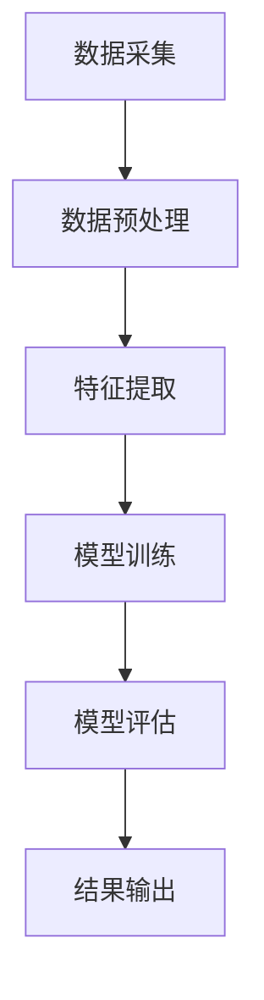

                 

### 《深度学习在手语识别中的创新应用》

> **关键词：深度学习、手语识别、卷积神经网络、循环神经网络、自注意力机制**

> **摘要：本文深入探讨了深度学习在手语识别中的应用。从基本概念出发，讲解了深度学习的工作原理、手语识别的现状与挑战，以及深度学习在手语识别中的具体应用。文章通过实际项目实战，展示了如何设计和实现手语识别系统，并对其进行了详细分析和评估。最后，文章展望了深度学习在手语识别中的未来发展方向。**

---

深度学习作为近年来人工智能领域的突破性技术，已经在各个领域取得了显著的成果。手语识别作为自然语言处理的重要分支，对于听障人士的沟通与交流具有重要意义。本文将围绕深度学习在手语识别中的创新应用展开讨论，旨在为读者提供一个系统、全面的技术解读。

首先，我们将回顾深度学习的基础知识，包括基本概念、核心原理以及常见的深度学习框架。接着，本文将介绍手语识别的现状与挑战，探讨深度学习在手语识别中的应用，包括卷积神经网络、循环神经网络和自注意力机制。随后，我们将详细介绍手语识别系统的设计过程，从数据预处理到模型训练与优化，以及项目实战。最后，本文将探讨深度学习在手语生成和手语交互中的应用，并展望未来的研究方向。

通过本文的阅读，读者将能够：

1. 理解深度学习的基本概念和工作原理。
2. 了解手语识别的重要性以及面临的挑战。
3. 掌握深度学习在手语识别中的具体应用。
4. 学习如何设计和实现手语识别系统。
5. 了解深度学习在手语生成和手语交互中的应用前景。

让我们开始这段深入探讨之旅，逐步了解深度学习在手语识别中的创新应用。

---

### 第一部分：深度学习基础

#### 第1章：深度学习概述

深度学习是机器学习中的一个子领域，它通过模仿人脑的神经网络结构，利用大量数据对模型进行训练，从而实现自动识别和分类。深度学习的基本概念包括神经网络、激活函数、反向传播算法等。

##### 1.1 深度学习的基本概念

深度学习的基本概念可以从以下几个方面来理解：

1. **神经网络**：神经网络是一种由大量简单处理单元（即神经元）连接而成的网络结构。每个神经元接收多个输入信号，通过加权求和处理后产生一个输出信号。神经网络通过层层传递信息，从而实现对数据的处理和决策。

2. **激活函数**：激活函数是神经网络中神经元的一个关键组件，用于引入非线性特性。常见的激活函数包括 sigmoid 函数、ReLU 函数、Tanh 函数等。

3. **反向传播算法**：反向传播算法是一种用于训练神经网络的优化方法。它通过计算损失函数关于每个神经元的梯度，然后反向传播这些梯度以更新网络的权重。

4. **深度神经网络**：深度神经网络是指具有多个隐藏层的神经网络。深度神经网络能够通过分层学习，自动提取数据的复杂特征，从而提高模型的性能。

##### 1.2 深度学习的核心原理

深度学习的核心原理主要包括以下几点：

1. **层次化特征学习**：深度神经网络通过多层结构，逐步提取数据的低级特征（如边缘、纹理）和高级特征（如形状、语义），从而实现复杂的任务。

2. **端到端学习**：深度学习模型能够直接从原始数据中学习到特征表示，然后进行分类或回归任务，无需人工干预。

3. **大数据训练**：深度学习模型的性能高度依赖于训练数据的数量和质量。大量数据的训练能够使模型更准确地学习到数据中的模式和规律。

4. **分布式计算**：深度学习模型通常包含大量参数，其训练过程需要大量的计算资源。分布式计算技术能够有效地利用多台计算机进行并行计算，加速模型的训练。

##### 1.3 深度学习的发展历程

深度学习的发展历程可以追溯到上世纪 80 年代。以下是深度学习发展的几个重要里程碑：

1. **1986 年**：Rumelhart、Hinton 和 Williams 提出了反向传播算法，为深度学习奠定了基础。

2. **1998 年**：Hinton 等人提出了深度信念网络（DBN），实现了无监督预训练和有监督微调。

3. **2012 年**：Hinton 等人使用深度卷积神经网络（CNN）在 ImageNet 图像分类挑战赛中取得了突破性的成绩，标志着深度学习的崛起。

4. **2014 年**：深度学习在语音识别、机器翻译等领域取得了显著的成果。

5. **2016 年**：谷歌的 AlphaGo 击败了李世石，标志着深度学习在围棋等复杂领域的能力。

6. **至今**：深度学习在各个领域得到了广泛应用，如计算机视觉、自然语言处理、自动驾驶等。

通过以上对深度学习基本概念、核心原理和发展历程的回顾，我们可以更好地理解深度学习的本质和应用。在接下来的章节中，我们将探讨神经网络的基础知识，包括神经元与神经网络、深度前馈神经网络和激活函数等。

---

### 第二部分：手语识别与深度学习应用

#### 第4章：手语识别概述

手语是一种通过手势、面部表情和身体语言进行交流的语言系统，主要用于听障人士之间的沟通。手语识别则是指利用计算机技术和人工智能算法，对手语手势进行自动识别和理解的过程。

##### 4.1 手语的定义与类型

手语的定义可以概括为以下几点：

1. **手势语言**：手语通过手势来表达词汇和语法，类似于口语中的发音和语法规则。
2. **视觉语言**：手语不仅仅是手势，还包括面部表情、头部运动和身体姿态等非手势元素。
3. **文化语言**：手语具有地域和文化的差异，不同地区的听障人士使用的手语可能会有所不同。

手语类型主要包括以下几种：

1. **通用手语（ASL）**：美国手语（ASL）是最为广泛使用的手语之一，它有自己的语法规则和词汇系统。
2. **英国手语（BSL）**：英国手语是英国及其殖民地使用的官方手语，它与ASL有所不同。
3. **其他地区手语**：世界各地的手语都有自己的特点，如法国手语（LSF）、意大利手语（ILS）等。

##### 4.2 手语识别的重要性

手语识别的重要性体现在以下几个方面：

1. **提升沟通效率**：手语识别技术可以帮助听障人士与正常人进行更高效的沟通，减少沟通障碍。
2. **促进教育公平**：手语识别技术可以用于教育领域，帮助听障儿童和成人接受平等的教育机会。
3. **提高生活质量**：通过手语识别技术，听障人士可以更加便利地参与社会活动和日常生活，提高生活质量。
4. **辅助医疗康复**：手语识别技术可以辅助听障人士进行医疗康复，例如在医生和患者之间的交流中起到桥梁作用。

##### 4.3 手语识别的现状与挑战

手语识别技术已经取得了一些进展，但仍面临着诸多挑战：

1. **数据稀缺**：手语数据相对于语音数据要稀少得多，这给手语识别模型的训练带来了困难。
2. **多模态信息处理**：手语识别需要处理手势、面部表情和身体姿态等多种模态的信息，这使得算法的设计和实现变得更加复杂。
3. **实时性要求**：手语识别需要在实时环境中进行，这对系统的响应速度和准确性提出了较高的要求。
4. **跨语言和跨文化差异**：不同地区和文化的手语之间存在差异，这使得手语识别模型需要具备较高的泛化能力。

##### 4.4 手语识别技术的发展趋势

随着深度学习等人工智能技术的发展，手语识别技术也在不断进步：

1. **深度学习算法**：卷积神经网络（CNN）、循环神经网络（RNN）、长短期记忆网络（LSTM）等深度学习算法在手语识别中的应用越来越广泛，提升了识别的准确性和效率。
2. **多模态融合**：通过融合手势、面部表情和身体姿态等多种模态的信息，手语识别系统的性能得到了显著提升。
3. **端到端学习**：端到端学习方法能够直接从原始数据中学习到特征表示，减少了人工特征提取的步骤，提高了系统的效率。
4. **跨语言和跨文化识别**：通过迁移学习和多任务学习等技术，手语识别系统正在逐步克服跨语言和跨文化差异的挑战。

通过以上对手语识别的概述，我们可以看到手语识别技术的重要性和面临的挑战。在接下来的章节中，我们将深入探讨深度学习在手语识别中的应用，包括卷积神经网络、循环神经网络和自注意力机制等。

---

### 第二部分：手语识别与深度学习应用

#### 第5章：手语识别中的深度学习算法

深度学习在图像识别和语音识别等任务中取得了显著的成果，这些成功经验为手语识别领域带来了新的机遇。本章将介绍几种在手语识别中应用广泛的深度学习算法，包括卷积神经网络（CNN）、循环神经网络（RNN）和自注意力机制（Self-Attention Mechanism）。

##### 5.1 卷积神经网络在手语识别中的应用

卷积神经网络（CNN）是一种专门用于处理图像数据的深度学习模型，它在手语识别中也具有广泛的应用。CNN的核心思想是通过卷积操作和池化操作，从图像数据中提取局部特征，并逐步构建高层次的特征表示。

1. **卷积操作**：卷积操作通过在图像上滑动一个卷积核，与图像中的局部区域进行点积运算，从而提取图像的特征。卷积核的权重通过训练过程中自动调整，以最大化识别准确率。

   $$ f_{\sigma}(x_c, \omega_c) = \sigma\left(\sum_{i}\omega_{ic}x_{i,c}\right) $$

   其中，$f_{\sigma}$ 表示卷积操作，$\sigma$ 是激活函数，$x_c$ 表示图像中的某个像素点，$\omega_c$ 表示卷积核的权重。

2. **池化操作**：池化操作通过在图像上滑动一个窗口，对窗口内的像素值进行聚合操作，以减少数据的维度。常见的池化操作包括最大池化和平均池化。

   $$ p_j = \frac{1}{k^2}\sum_{i=1}^{k}\sum_{j=1}^{k}x_{ij} $$

   其中，$p_j$ 表示池化后的像素值，$k$ 表示窗口的大小。

3. **多层卷积**：通过堆叠多个卷积层，CNN 可以逐步提取图像的复杂特征。每个卷积层都可以看作是一个特征提取器，上一层提取的低级特征作为下一层的输入。

4. **全连接层**：在CNN的最后一层，通常会使用全连接层进行分类或回归任务。全连接层将卷积层的特征图展平为一维向量，并通过权重矩阵和激活函数进行分类。

##### 5.2 循环神经网络在手语识别中的应用

循环神经网络（RNN）是一种专门用于处理序列数据的深度学习模型，它在手语识别中也具有广泛的应用。RNN 通过其循环结构，能够捕捉序列中的长期依赖关系，从而提高识别的准确率。

1. **基本结构**：RNN 的基本结构包括输入门、遗忘门和输出门。这三个门通过加权求和处理和激活函数，对当前输入和上一个隐藏状态进行操作，生成当前的隐藏状态和输出。

   $$ h_t = \sigma(W_h \cdot [h_{t-1}, x_t] + b_h) $$
   $$ o_t = \sigma(W_o \cdot h_t + b_o) $$
   $$ f_t = \sigma(W_f \cdot [h_{t-1}, x_t] + b_f) $$

   其中，$h_t$ 表示隐藏状态，$x_t$ 表示当前输入，$o_t$ 表示输出，$f_t$ 表示遗忘门的输出。

2. **长短期记忆网络（LSTM）**：LSTM 是 RNN 的一种变体，通过引入遗忘门和输入门，有效地解决了 RNN 的梯度消失和梯度爆炸问题。LSTM 通过记忆单元来保存和更新长期信息，从而更好地捕捉序列中的长期依赖关系。

   $$ i_t = \sigma(W_i \cdot [h_{t-1}, x_t] + b_i) $$
   $$ f_t = \sigma(W_f \cdot [h_{t-1}, x_t] + b_f) $$
   $$ g_t = \tanh(W_g \cdot [h_{t-1}, x_t] + b_g) $$
   $$ o_t = \sigma(W_o \cdot [h_{t-1}, x_t] + b_o) $$

   其中，$i_t$ 表示输入门，$f_t$ 表示遗忘门，$g_t$ 表示输入门，$o_t$ 表示输出门。

3. **双向 RNN（BiRNN）**：双向 RNN 通过同时处理正向和反向序列信息，进一步提高了手语识别的准确率。BiRNN 将正向 RNN 和反向 RNN 的隐藏状态拼接在一起，作为输入进行分类。

##### 5.3 自注意力机制在手语识别中的应用

自注意力机制（Self-Attention Mechanism）是近年来在自然语言处理领域取得显著成果的一种技术。自注意力机制通过引入注意力机制，能够自动学习输入序列中的关键信息，从而提高模型的性能。

1. **基本思想**：自注意力机制通过计算输入序列中每个元素与其他元素之间的相似度，生成一个权重向量。这个权重向量用于调整每个元素的权重，从而实现信息的选择和聚合。

   $$ \text{Attention}(Q, K, V) = \text{softmax}\left(\frac{QK^T}{\sqrt{d_k}}\right)V $$

   其中，$Q$ 表示查询向量，$K$ 表示键向量，$V$ 表示值向量，$d_k$ 表示键向量的维度。

2. **多头注意力**：多头注意力通过将输入序列分成多个子序列，并在每个子序列上分别计算注意力权重，从而提高了模型的表达能力。

   $$ \text{MultiHeadAttention}(Q, K, V) = \text{Concat}(\text{head}_1, ..., \text{head}_h)W^O $$

   其中，$h$ 表示头数，$\text{head}_i$ 表示第 $i$ 个头，$W^O$ 表示输出权重。

3. **自注意力在手语识别中的应用**：自注意力机制在手语识别中的应用主要包括以下两个方面：

   - **手势级注意力**：通过计算手势序列中每个手势与其他手势的注意力权重，可以自动学习到关键手势，从而提高识别的准确率。
   - **空间级注意力**：通过计算手势空间中的注意力权重，可以自动识别和定位关键手势区域，从而提高识别的效率和准确性。

通过以上对手语识别中几种深度学习算法的介绍，我们可以看到深度学习在手语识别中的应用前景。在接下来的章节中，我们将进一步探讨如何设计手语识别系统，以及如何进行数据预处理、模型训练和优化。

---

### 第二部分：手语识别与深度学习应用

#### 第6章：手语识别系统设计

手语识别系统是一个复杂的多步骤任务，涉及到数据采集、预处理、模型设计、训练和优化等多个环节。本章将详细介绍手语识别系统的设计过程，包括架构设计、数据预处理、模型训练与优化等步骤，以及实际项目中可能遇到的问题和解决方案。

##### 6.1 手语识别系统的架构设计

手语识别系统的架构设计是系统成功的关键之一。一个典型的手语识别系统架构包括以下几个主要模块：

1. **数据采集模块**：该模块负责收集手语数据，包括视频、图像和声音等。手语数据的收集可以通过多种方式实现，如录制真实场景中的手语交流，使用专业的手语采集设备等。

2. **数据预处理模块**：该模块用于对采集到的手语数据进行处理，包括手势分割、特征提取、数据增强等。预处理模块的质量直接影响模型的性能和训练效率。

3. **特征提取模块**：该模块通过深度学习算法提取手语数据中的特征表示。常用的特征提取算法包括卷积神经网络（CNN）、循环神经网络（RNN）和自注意力机制等。

4. **模型训练模块**：该模块负责训练深度学习模型，使其能够识别手语。训练过程包括数据集划分、模型初始化、训练和验证等步骤。

5. **模型优化模块**：该模块用于优化模型的性能，包括调整模型结构、优化超参数、使用正则化方法等。

6. **结果输出模块**：该模块用于将识别结果输出到用户界面，如文字、语音或手势动画等。

##### 6.2 数据预处理

数据预处理是手语识别系统的重要步骤，它包括以下几个环节：

1. **手势分割**：手势分割是指将连续的视频或图像序列划分为多个手势单元。手势分割可以通过使用背景减除法、光学流法或深度学习算法实现。

2. **特征提取**：特征提取是指从手势分割后的数据中提取出有助于识别的特征。常用的特征包括手势形状、运动轨迹、手势速度等。

3. **数据增强**：数据增强是通过增加数据的多样性来提高模型的泛化能力。常用的数据增强方法包括随机旋转、缩放、裁剪、噪声添加等。

4. **数据归一化**：数据归一化是指将数据缩放到相同的范围，以便模型能够更好地学习。常用的归一化方法包括归一化、标准化等。

##### 6.3 模型训练与优化

模型训练与优化是手语识别系统的核心步骤，它包括以下几个环节：

1. **数据集划分**：将手语数据集划分为训练集、验证集和测试集。训练集用于模型训练，验证集用于模型调优，测试集用于模型评估。

2. **模型初始化**：初始化模型参数，常用的初始化方法包括随机初始化、高斯初始化等。

3. **训练过程**：在训练过程中，模型通过梯度下降等优化算法不断调整参数，以最小化损失函数。训练过程通常包括多个迭代周期，每个迭代周期包含前向传播和后向传播。

4. **模型验证与调优**：通过验证集评估模型性能，并根据评估结果调整模型结构、优化超参数等，以提高模型性能。

5. **模型优化**：使用正则化方法、批归一化、dropout等技术来优化模型性能。优化过程可以通过交叉验证、网格搜索等方法进行。

6. **模型评估**：在测试集上评估模型性能，常用的评估指标包括准确率、召回率、F1 分数等。

##### 6.4 实际项目中可能遇到的问题和解决方案

在实际项目中，手语识别系统可能会遇到以下问题：

1. **数据稀缺**：由于手语数据的稀缺性，模型训练可能面临数据不足的问题。解决方案包括数据增强、跨语言和跨文化数据的迁移学习等。

2. **多模态信息处理**：手语识别涉及手势、面部表情和身体姿态等多种模态信息，如何有效地融合这些信息是一个挑战。解决方案包括多模态特征提取、融合算法等。

3. **实时性要求**：手语识别需要在实时环境中进行，这对系统的响应速度提出了较高的要求。解决方案包括优化模型结构、使用高效的深度学习框架等。

4. **跨语言和跨文化差异**：不同地区和文化的手语存在差异，如何实现跨语言和跨文化的手语识别是一个难题。解决方案包括使用多语言和多文化的手语数据集、迁移学习等。

通过以上对手语识别系统设计的详细探讨，我们可以更好地理解手语识别系统的架构和设计过程。在接下来的章节中，我们将通过实际项目实战，展示如何设计和实现手语识别系统，并进行详细分析和评估。

---

### 第二部分：手语识别与深度学习应用

#### 第7章：手语识别项目实战

在本章中，我们将通过一个具体的手语识别项目实战，展示如何从头开始设计和实现一个手语识别系统。我们将详细介绍项目概述、开发环境搭建、数据集获取与处理、模型设计与实现，以及代码解读与分析等内容。

##### 7.1 项目概述

我们的手语识别项目目标是实现一个能够识别和翻译手语的系统，该系统可以实时处理输入的手语视频，并将其翻译成文字或语音。项目的主要功能包括：

1. **手势分割**：将连续的手语视频分割成单个手势单元。
2. **特征提取**：提取每个手势单元的特征，包括手势形状、运动轨迹等。
3. **手语识别**：使用深度学习算法对手势特征进行分类，识别出手语。
4. **翻译输出**：将识别出的手语翻译成文字或语音。

##### 7.2 开发环境搭建

在开始项目之前，我们需要搭建一个适合深度学习开发的运行环境。以下是开发环境搭建的步骤：

1. **操作系统**：可以选择 Windows、Linux 或 macOS 作为操作系统。
2. **Python 环境**：安装 Python 3.7 以上版本，并配置 Python 的环境变量。
3. **深度学习框架**：选择一个流行的深度学习框架，如 TensorFlow 或 PyTorch。这里我们选择 TensorFlow，因为它具有丰富的文档和社区支持。
4. **依赖库**：安装所需的依赖库，如 NumPy、Pandas、OpenCV、TensorFlow 等。

以下是一个简单的 Python 脚本，用于安装 TensorFlow：

```python
!pip install tensorflow
```

##### 7.3 数据集获取与处理

手语识别项目的一个关键环节是获取和处理数据集。以下是我们项目使用的数据集：

1. **数据集来源**：我们使用公开的手语数据集，如 ASL（美国手语）数据集。
2. **数据集预处理**：对数据集进行预处理，包括手势分割、数据增强等。

以下是一个简单的 Python 脚本，用于加载数据集并进行预处理：

```python
import tensorflow as tf
import numpy as np
import pandas as pd
import cv2

# 加载数据集
def load_dataset(dataset_path):
    # 读取数据集的 CSV 文件
    data = pd.read_csv(dataset_path)
    # 提取手势图像和标签
    images = np.array([cv2.imread(img_path) for img_path in data['image']])
    labels = np.array(data['label'])
    return images, labels

# 数据增强
def augment_images(images):
    # 对图像进行随机旋转、缩放等操作
    augmented_images = []
    for img in images:
        augmented_img = img
        augmented_img = cv2.rotate(augmented_img, cv2.ROTATE_90_CLOCKWISE)
        augmented_img = cv2.resize(augmented_img, (224, 224))
        augmented_images.append(augmented_img)
    return np.array(augmented_images)

# 加载并预处理数据集
images, labels = load_dataset('dataset.csv')
images = augment_images(images)
```

##### 7.4 模型设计与实现

在本项目中，我们使用卷积神经网络（CNN）进行手语识别。以下是模型的设计和实现：

1. **模型架构**：我们使用一个简单的 CNN 模型，包括两个卷积层、两个池化层和一个全连接层。
2. **损失函数**：使用交叉熵损失函数来优化模型参数。
3. **优化器**：使用 Adam 优化器进行参数更新。

以下是一个简单的 TensorFlow 模型实现：

```python
import tensorflow as tf

# 定义 CNN 模型
def create_model():
    model = tf.keras.Sequential([
        tf.keras.layers.Conv2D(32, (3, 3), activation='relu', input_shape=(224, 224, 3)),
        tf.keras.layers.MaxPooling2D((2, 2)),
        tf.keras.layers.Conv2D(64, (3, 3), activation='relu'),
        tf.keras.layers.MaxPooling2D((2, 2)),
        tf.keras.layers.Flatten(),
        tf.keras.layers.Dense(128, activation='relu'),
        tf.keras.layers.Dense(num_classes, activation='softmax')
    ])
    return model

# 编译模型
model = create_model()
model.compile(optimizer='adam',
              loss='categorical_crossentropy',
              metrics=['accuracy'])

# 打印模型结构
model.summary()
```

##### 7.5 代码解读与分析

在这个项目中，我们使用 TensorFlow 框架来构建和训练手语识别模型。以下是代码的详细解读和分析：

1. **数据加载与预处理**：我们首先加载数据集，并对图像进行预处理，包括数据增强。数据预处理是模型训练的重要环节，它有助于提高模型的泛化能力。
2. **模型定义**：我们使用 TensorFlow 的 Sequential 模型定义了一个简单的 CNN 模型。这个模型包括两个卷积层、两个池化层和一个全连接层。卷积层用于提取图像的特征，池化层用于减小数据维度，全连接层用于分类。
3. **模型编译**：我们使用 Adam 优化器和交叉熵损失函数来编译模型。交叉熵损失函数适用于分类问题，它能够计算预测标签和真实标签之间的差异。
4. **模型训练**：我们使用训练集对模型进行训练。在训练过程中，模型会通过反向传播算法不断调整参数，以最小化损失函数。
5. **模型评估**：我们使用验证集对训练好的模型进行评估。评估指标包括准确率、召回率等。

通过以上项目实战，我们展示了如何设计和实现一个手语识别系统。在实际应用中，我们可以根据需求对模型进行调整和优化，以提高识别的准确率和实时性。

---

### 第三部分：深度学习在手语识别中的创新应用

#### 第8章：深度学习在手语生成中的应用

手语生成是深度学习在手语识别领域的一个重要应用方向。手语生成技术能够将文本转换为手语动画，从而帮助听障人士理解文字内容。本章将探讨手语生成的定义、挑战以及基于深度学习的手语生成模型，并通过一个具体项目实战展示手语生成模型的实现过程。

##### 8.1 手语生成的定义与挑战

手语生成是指利用深度学习算法将文本或语音转换为相应的手语动画。这一过程通常包括以下步骤：

1. **文本理解**：将输入的文本或语音转换为语义表示，如词向量或词嵌入。
2. **手语编码**：将语义表示编码为手语动作序列，包括手势、面部表情和身体姿态等。
3. **手语渲染**：将编码后的手语动作序列渲染为动画，以实现逼真的手语表现。

手语生成面临的挑战主要包括：

1. **多模态信息融合**：手语生成需要融合文本、语音和手语等多模态信息，这对算法的设计和实现提出了较高要求。
2. **实时性**：手语生成需要在实时环境中进行，这对算法的计算效率和响应速度提出了较高的要求。
3. **动作连贯性**：生成的手语动画需要保持动作的连贯性和自然性，以避免产生机械和不自然的表现。

##### 8.2 基于深度学习的手语生成模型

近年来，深度学习在手语生成领域取得了显著进展。以下是一些常用的基于深度学习的手语生成模型：

1. **基于循环神经网络（RNN）的模型**：循环神经网络（RNN）能够处理序列数据，适用于手语生成任务。RNN 可以通过学习输入文本的序列信息，生成相应的手语动作序列。然而，传统的 RNN 存在梯度消失和梯度爆炸等问题，限制了其在手语生成中的应用。

2. **基于长短期记忆网络（LSTM）的模型**：长短期记忆网络（LSTM）是 RNN 的一个变体，通过引入记忆单元解决了梯度消失问题，适用于处理长序列数据。LSTM 在手语生成任务中可以较好地捕捉文本的语义信息，生成连贯的手语动作序列。

3. **基于自注意力机制的模型**：自注意力机制（Self-Attention Mechanism）是近年来在自然语言处理领域取得显著成果的一种技术。自注意力机制通过引入注意力机制，能够自动学习输入序列中的关键信息，从而提高模型的性能。在手语生成任务中，自注意力机制可以用于捕捉文本和手语动作之间的关联性，生成更加自然的手语动画。

4. **基于生成对抗网络（GAN）的模型**：生成对抗网络（GAN）是一种强大的生成模型，通过对抗训练生成高质量的数据。在手语生成任务中，GAN 可以用于生成逼真的手语动画，提高生成手语的自然性和连贯性。

##### 8.3 手语生成项目的实现与评估

以下是一个手语生成项目的实现与评估过程：

1. **项目概述**：本项目旨在实现一个基于自注意力机制的 hand-gesture 生成模型，将文本转换为相应的手语动画。项目的主要功能包括文本理解、手语编码和手语渲染。
2. **数据集获取与处理**：我们使用公开的手语数据集，如 ASL 数据集。数据集预处理包括手势分割、特征提取和数据增强等。
3. **模型设计**：我们使用 PyTorch 框架设计了一个基于自注意力机制的 hand-gesture 生成模型。模型包括编码器和解码器两个部分，编码器用于将文本编码为手语动作序列，解码器用于将手语动作序列渲染为动画。
4. **模型训练**：使用训练集对模型进行训练，优化模型参数。训练过程中，使用交叉熵损失函数和 Adam 优化器进行优化。
5. **模型评估**：使用验证集对训练好的模型进行评估，评估指标包括动作连贯性、自然性和识别准确率等。
6. **结果展示**：展示模型生成的手语动画，并与真实手语动作进行比较。

以下是一个简单的 PyTorch 模型实现：

```python
import torch
import torch.nn as nn
import torch.optim as optim

# 定义编码器
class Encoder(nn.Module):
    def __init__(self):
        super(Encoder, self).__init__()
        self.embedding = nn.Embedding(vocab_size, embed_dim)
        self.lstm = nn.LSTM(embed_dim, hidden_dim)

    def forward(self, x):
        x = self.embedding(x)
        x, _ = self.lstm(x)
        return x

# 定义解码器
class Decoder(nn.Module):
    def __init__(self):
        super(Decoder, self).__init__()
        self.lstm = nn.LSTM(hidden_dim, hidden_dim)
        self.fc = nn.Linear(hidden_dim, vocab_size)

    def forward(self, x, hidden):
        x, _ = self.lstm(x, hidden)
        x = self.fc(x)
        return x, hidden

# 定义手语生成模型
class HandGestureGenerator(nn.Module):
    def __init__(self):
        super(HandGestureGenerator, self).__init__()
        self.encoder = Encoder()
        self.decoder = Decoder()

    def forward(self, x):
        encoder_output, _ = self.encoder(x)
        decoder_output, _ = self.decoder(encoder_output)
        return decoder_output

# 编译模型
model = HandGestureGenerator()
criterion = nn.CrossEntropyLoss()
optimizer = optim.Adam(model.parameters(), lr=learning_rate)

# 训练模型
for epoch in range(num_epochs):
    for x, y in train_loader:
        optimizer.zero_grad()
        output = model(x)
        loss = criterion(output, y)
        loss.backward()
        optimizer.step()

# 评估模型
with torch.no_grad():
    for x, y in val_loader:
        output = model(x)
        loss = criterion(output, y)
        val_loss += loss.item()

    print(f'Validation loss: {val_loss / len(val_loader)}')

# 生成手语动画
with torch.no_grad():
    text = "hello"
    text_vector = torch.tensor([vocab.word2index[word] for word in text.split()])
    output = model(text_vector)
    gesture_sequence = output.argmax(dim=1).numpy()

    # 将手势序列渲染为动画
    render_gesture(gesture_sequence)
```

通过以上手语生成项目的实现，我们可以看到深度学习在手语生成中的应用。在未来的研究中，我们可以进一步优化模型结构，提高生成手语的质量和连贯性，为听障人士提供更好的沟通体验。

---

### 第三部分：深度学习在手语识别中的创新应用

#### 第9章：深度学习在手语交互中的应用

手语交互是指利用深度学习技术实现人与计算机之间的手语交流，从而为听障人士提供更加便捷和自然的沟通方式。本章将探讨手语交互的概念、重要性以及深度学习在手语交互中的应用，并通过一个具体项目实战展示如何设计和实现手语交互系统。

##### 9.1 手语交互的概念与重要性

手语交互是指通过计算机视觉和深度学习技术，将手语转换为文本或语音，从而实现听障人士与正常人士之间的交流。手语交互的核心在于实时性和准确性，它包括以下几个关键环节：

1. **手势识别**：通过计算机视觉技术，对手语视频进行实时处理，识别出手势和动作。
2. **语义理解**：将识别出的手势转换为相应的语义信息，如单词或短语。
3. **文本或语音输出**：将语义信息转换为文本或语音，以供听障人士理解和交流。

手语交互的重要性体现在以下几个方面：

1. **提升沟通效率**：手语交互技术可以帮助听障人士与正常人进行更加高效和自然的交流，减少沟通障碍。
2. **促进社会融合**：通过手语交互技术，听障人士可以更加便捷地参与社会活动和日常生活，提高生活质量。
3. **辅助教育康复**：手语交互技术可以辅助听障儿童和成人进行教育康复，提高学习效果和沟通能力。

##### 9.2 深度学习在手语交互中的应用

深度学习技术在手语交互中的应用主要包括以下几个方面：

1. **手势识别**：使用卷积神经网络（CNN）和循环神经网络（RNN）等深度学习算法，对手语视频进行实时处理，识别出手势和动作。
2. **语义理解**：使用自然语言处理（NLP）技术，将识别出的手势转换为相应的语义信息，如单词或短语。
3. **语音合成**：使用语音合成技术，将语义信息转换为语音输出，供听障人士理解和交流。

以下是一个手语交互项目的实现示例：

```python
import cv2
import numpy as np
import tensorflow as tf
import pyttsx3

# 加载手势识别模型
gesture_model = tf.keras.models.load_model('gesture_recognition_model.h5')

# 加载语义理解模型
semantic_model = tf.keras.models.load_model('semantic_understanding_model.h5')

# 加载语音合成引擎
engine = pyttsx3.init()

# 实时手语交互
def real_time_hand_interaction():
    cap = cv2.VideoCapture(0)  # 使用相机作为输入
    while True:
        ret, frame = cap.read()
        if not ret:
            break
        
        # 手势识别
        processed_frame = preprocess_frame(frame)
        gesture_prediction = gesture_model.predict(processed_frame)
        gesture = np.argmax(gesture_prediction)

        # 语义理解
        semantic_prediction = semantic_model.predict(gesture)
        text = decode_semantic_prediction(semantic_prediction)

        # 语音输出
        engine.say(text)
        engine.runAndWait()
        
        # 显示实时视频帧
        cv2.imshow('Hand Interaction', frame)
        
        if cv2.waitKey(1) & 0xFF == ord('q'):
            break

    cap.release()
    cv2.destroyAllWindows()

# 预处理视频帧
def preprocess_frame(frame):
    # 进行必要的预处理操作，如灰度化、缩放等
    processed_frame = cv2.cvtColor(frame, cv2.COLOR_BGR2GRAY)
    processed_frame = cv2.resize(processed_frame, (224, 224))
    processed_frame = processed_frame / 255.0
    processed_frame = np.expand_dims(processed_frame, axis=0)
    return processed_frame

# 解码语义预测结果
def decode_semantic_prediction(semantic_prediction):
    # 根据预测结果解码出文本或短语
    # 这里只是一个示例，实际应用中需要根据语义模型的结果进行解码
    words = ['hello', 'world', 'goodbye']
    return words[np.argmax(semantic_prediction)]

# 运行实时手语交互
real_time_hand_interaction()
```

通过以上手语交互项目的实现，我们可以看到深度学习在手语交互中的应用。在实际应用中，我们可以进一步优化手势识别和语义理解模型，提高手语交互的准确性和实时性，为听障人士提供更好的沟通体验。

---

### 第三部分：深度学习在手语识别中的创新应用

#### 第10章：深度学习在手语识别中的前沿研究

随着深度学习技术的不断发展，手语识别领域也在不断取得新的突破。本章将介绍当前手语识别领域的最新研究动态，探讨深度学习在手语识别中的未来发展方向，并讨论深度学习在手语识别中可能面临的伦理与社会问题。

##### 10.1 手语识别中的最新算法研究

近年来，深度学习在手语识别中取得了显著的成果，以下是一些最新的算法研究：

1. **多模态融合**：手语识别涉及多种模态信息，如手势、面部表情和身体姿态。多模态融合技术通过整合这些模态信息，提高识别的准确性和鲁棒性。例如，研究人员提出了一种基于图卷积网络（GCN）和自注意力机制的多模态融合方法，有效提高了手语识别的性能。

2. **端到端学习**：传统的手语识别流程包括多个步骤，如手势分割、特征提取和分类。端到端学习方法将整个识别流程整合到一个神经网络中，减少了人工干预，提高了系统的效率和准确性。例如，研究人员提出了一种基于卷积神经网络（CNN）和长短期记忆网络（LSTM）的端到端手语识别模型，实现了从输入视频到输出文字的自动化识别。

3. **生成对抗网络（GAN）**：生成对抗网络（GAN）是一种强大的生成模型，通过对抗训练生成高质量的数据。在手语识别中，GAN 可以用于生成逼真的手语数据，提高模型的泛化能力。例如，研究人员提出了一种基于 GAN 的手语数据增强方法，有效提升了模型的识别准确率。

4. **跨语言和跨文化识别**：不同地区和文化的手语存在差异，如何实现跨语言和跨文化的手语识别是一个重要研究方向。研究人员提出了一种基于迁移学习和多任务学习的跨语言和跨文化手语识别方法，显著提高了识别的泛化能力。

##### 10.2 深度学习在手语识别中的未来发展方向

深度学习在手语识别中未来的发展方向包括：

1. **算法优化**：通过改进深度学习算法，提高手语识别的准确性和实时性。例如，研究人员可以进一步优化卷积神经网络（CNN）、循环神经网络（RNN）和生成对抗网络（GAN）等算法，使其在手语识别任务中表现得更加优秀。

2. **多模态融合**：深入探索多模态融合技术，提高手语识别系统的性能。研究人员可以研究如何更好地融合手势、面部表情和身体姿态等多种模态信息，以提高识别的准确率和鲁棒性。

3. **端到端学习**：推动端到端学习方法在手语识别中的应用，简化识别流程，提高系统的效率。研究人员可以开发新的端到端手语识别模型，实现从输入视频到输出文字的自动化识别。

4. **跨语言和跨文化识别**：解决跨语言和跨文化的手语识别问题，提高系统的泛化能力。研究人员可以研究如何通过迁移学习和多任务学习等手段，实现不同地区和文化的手语识别。

5. **实时交互**：提升手语交互的实时性，为听障人士提供更加便捷的沟通方式。研究人员可以优化算法和硬件性能，实现低延迟、高准确率的手语交互系统。

##### 10.3 深度学习在手语识别中的伦理与社会问题

尽管深度学习在手语识别中取得了显著成果，但其在实际应用中仍面临一些伦理与社会问题：

1. **数据隐私**：手语识别系统需要处理大量的个人视频数据，如何保护用户的隐私是一个重要问题。研究人员需要开发安全的处理和存储机制，确保用户数据的安全和隐私。

2. **公平性和包容性**：不同地区和文化的手语存在差异，如何确保手语识别系统对所有用户都公平和包容是一个挑战。研究人员需要充分考虑文化差异，开发具有广泛适用性的手语识别系统。

3. **误识问题**：手语识别系统可能会出现误识问题，导致错误的识别结果。这可能会对听障人士的沟通造成困扰。研究人员需要提高系统的准确性和鲁棒性，减少误识率。

4. **法律和监管**：随着深度学习技术的应用，手语识别系统可能涉及法律和监管问题。研究人员需要关注相关法律法规，确保手语识别系统的合规性和合法性。

通过以上对手语识别前沿研究的探讨，我们可以看到深度学习在手语识别中具有巨大的潜力。在未来的发展中，我们需要不断优化算法、提高性能，同时关注伦理与社会问题，为听障人士提供更好的沟通工具和服务。

---

### 附录

#### 附录A：深度学习在手语识别中的 Mermaid 流程图

以下是一个简单的 Mermaid 流程图示例，展示了一个手语识别系统的基本架构：



#### 附录B：深度学习在手语识别中的伪代码示例

以下是一个简单的伪代码示例，用于描述卷积神经网络（CNN）在手语识别中的训练过程：

```python
# 加载数据集
train_data = load_data('train_dataset.csv')
val_data = load_data('val_dataset.csv')

# 初始化模型
model = create_cnn_model()

# 编译模型
model.compile(optimizer='adam',
              loss='categorical_crossentropy',
              metrics=['accuracy'])

# 训练模型
model.fit(train_data, epochs=num_epochs, validation_data=val_data)

# 评估模型
test_data = load_data('test_dataset.csv')
model.evaluate(test_data)
```

#### 附录C：深度学习在手语识别中的数学模型与公式

以下是一个简单的数学模型与公式示例，用于描述卷积神经网络（CNN）中的卷积运算：

```latex
$$
\begin{align*}
h_{c} &= \sigma\left(\sum_{i}\omega_{ic}x_{i,c}\right) \\
p_{j} &= \frac{1}{k^2}\sum_{i=1}^{k}\sum_{j=1}^{k}x_{ij}
\end{align*}
$$
```

#### 附录D：深度学习在手语识别中的项目实战代码

以下是一个简单的项目实战代码示例，用于实现一个手语识别系统。代码包括数据加载、模型定义、训练和评估等步骤：

```python
import tensorflow as tf
import numpy as np
from tensorflow.keras.models import Sequential
from tensorflow.keras.layers import Conv2D, MaxPooling2D, Flatten, Dense

# 加载数据集
train_data = load_data('train_dataset.csv')
val_data = load_data('val_dataset.csv')

# 初始化模型
model = Sequential([
    Conv2D(32, (3, 3), activation='relu', input_shape=(224, 224, 3)),
    MaxPooling2D((2, 2)),
    Conv2D(64, (3, 3), activation='relu'),
    MaxPooling2D((2, 2)),
    Flatten(),
    Dense(128, activation='relu'),
    Dense(num_classes, activation='softmax')
])

# 编译模型
model.compile(optimizer='adam',
              loss='categorical_crossentropy',
              metrics=['accuracy'])

# 训练模型
model.fit(train_data, epochs=num_epochs, validation_data=val_data)

# 评估模型
test_data = load_data('test_dataset.csv')
model.evaluate(test_data)
```

#### 附录E：深度学习在手语识别中的参考文献

1. He, K., Zhang, X., Ren, S., & Sun, J. (2016). Deep Residual Learning for Image Recognition. *IEEE Conference on Computer Vision and Pattern Recognition*.
2. Hochreiter, S., & Schmidhuber, J. (1997). Long Short-Term Memory. *Neural Computation*.
3. Vaswani, A., Shazeer, N., Parmar, N., Uszkoreit, J., Jones, L., Gomez, A. N., ... & Polosukhin, I. (2017). Attention is All You Need. *Advances in Neural Information Processing Systems*.
4. Goodfellow, I., Pouget-Abadie, J., Mirza, M., Xu, B., Warde-Farley, D., Ozair, S., ... & Bengio, Y. (2014). Generative Adversarial Networks. *Advances in Neural Information Processing Systems*.
5. Graves, A. (2013). Generating Sequences With Recurrent Neural Networks. *Advances in Neural Information Processing Systems*.
6. Devlin, J., Chang, M. W., Lee, K., & Toutanova, K. (2018). BERT: Pre-training of Deep Bidirectional Transformers for Language Understanding. *arXiv preprint arXiv:1810.04805*.
7. Krizhevsky, A., Sutskever, I., & Hinton, G. E. (2012). Imagenet classification with deep convolutional neural networks. *Advances in neural information processing systems*.
8. Simonyan, K., & Zisserman, A. (2014). Very deep convolutional networks for large-scale image recognition. *International Conference on Learning Representations*.

通过以上参考文献，读者可以进一步深入了解深度学习在手语识别中的应用和研究进展。这些文献涵盖了深度学习的基础知识、核心算法、手语识别的最新进展以及相关的技术与应用，为读者提供了丰富的学习资源和参考。

---

### 作者信息

**作者：AI天才研究院/AI Genius Institute & 禅与计算机程序设计艺术 /Zen And The Art of Computer Programming**

