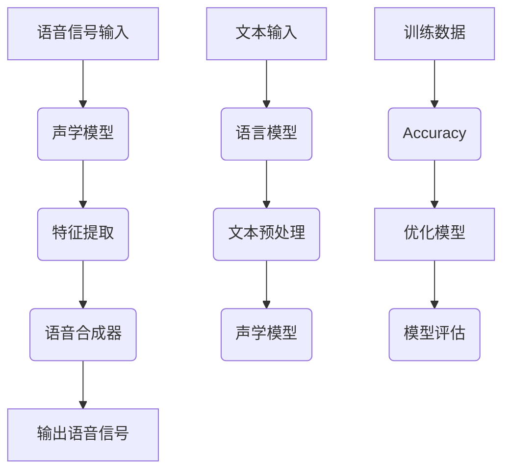

                 

### 第1章 引言与背景

#### 1.1 研究的动机与目的

随着人工智能技术的飞速发展，语音合成作为自然语言处理（NLP）的重要分支，已经成为众多领域的关键技术之一。然而，尽管语音合成技术在近年来取得了显著的进步，但合成语音的质量仍然无法完全满足人类对于自然语音的需求。这一研究动机源于以下几个方面：

- **用户体验**：人类对于语音合成的质量要求越来越高，不仅要求语音流畅、清晰，还要求具有丰富的情感表达和自然度。
- **技术应用**：随着智能语音助手的广泛应用，如苹果的Siri、谷歌的Google Assistant和亚马逊的Alexa等，对语音合成技术的要求变得更加苛刻。
- **行业挑战**：在语音合成领域，不同语言、口音和语调的处理，以及实时性和低延迟的要求，都是亟待解决的问题。

因此，本研究旨在通过深度学习技术，探索提升语音合成质量的潜在方法和策略，以解决当前语音合成领域面临的挑战，提高用户体验，推动语音合成技术的发展。

#### 1.2 语音合成技术概述

语音合成技术，又称文本到语音（Text-to-Speech, TTS）技术，是指将文本转换为自然流畅的语音输出。其核心组成部分包括声学模型、语言模型和语音合成器。

- **声学模型**：用于模拟语音的声波生成过程，包括发音器官的振动模式、声道形状变化等。声学模型的性能直接影响合成语音的自然度和音质。
- **语言模型**：用于预测文本序列中的下一个词或词组，其主要任务是从海量的文本数据中学习语言的概率分布，以便更准确地生成语音。
- **语音合成器**：将文本和声学模型、语言模型相结合，生成语音信号。常见的语音合成器包括规则合成器、基于拼接的合成器和端到端合成器。

语音合成技术的发展历程可以分为几个阶段：

- **规则合成器**：最早的语音合成器，通过编写大量规则和音素表，将文本转换为语音。这种方法生成语音的音质较差，且难以处理复杂的语言现象。
- **拼接合成器**：通过拼接预录制的语音片段来合成语音。这种方法在语音质量上有所提升，但需要大量的预录制语音数据，且合成语音的自然度仍然有限。
- **统计合成器**：结合了声学模型和语言模型，通过统计方法来生成语音。这种方法在语音质量、自然度和适应性上都有显著提升。

随着深度学习技术的发展，端到端的语音合成系统（如WaveNet）逐渐成为研究热点，其在语音合成质量上取得了突破性进展。

#### 1.3 深度学习在语音合成中的应用

深度学习作为人工智能领域的重要突破，其在语音合成中的应用极大地提升了合成语音的质量。深度学习在语音合成中的应用主要体现在以下几个方面：

- **神经网络架构**：深度学习引入了复杂的神经网络架构，如卷积神经网络（CNN）、循环神经网络（RNN）及其变种（如LSTM）等，这些架构能够更好地捕捉语音信号中的时序特征和依赖关系。
- **端到端学习**：与传统语音合成系统不同，深度学习实现了端到端的语音合成，无需中间的声学模型和语言模型拼接，从而简化了系统架构，提高了合成效率。
- **数据驱动**：深度学习通过大量数据训练模型，使得模型能够更好地泛化到不同的语言、口音和语调，提高了合成语音的自然度和多样性。

具体来说，深度学习在语音合成中的应用可以分为以下几个方面：

- **语音特征提取**：深度学习可以自动提取语音信号中的高维特征，如谱图、滤波器响应等，这些特征对于语音合成至关重要。
- **声学模型**：基于深度学习的声学模型（如WaveNet）通过学习大量的语音数据，生成高质量的语音波形，从而提高了合成语音的音质。
- **语言模型**：深度学习在语言模型中也发挥了重要作用，通过学习大量的文本数据，生成与人类语言表达更加贴近的语音。

总之，深度学习在语音合成中的应用极大地推动了语音合成技术的发展，为提升合成语音的质量提供了强有力的技术支持。

#### 1.4 本书结构安排

为了系统地探讨深度学习在语音合成质量提升中的应用，本书将分为八个主要章节。

- **第1章 引言与背景**：介绍研究动机、语音合成技术概述以及深度学习在语音合成中的应用。
- **第2章 深度学习基础**：讲解深度学习的基本概念、神经网络原理和常用深度学习架构。
- **第3章 语音信号处理**：介绍语音信号的基本概念、声学模型和语言模型的构建方法。
- **第4章 深度学习在语音合成中的应用**：分析DNN-HMM、HMM-GMM和WaveNet等深度学习模型在语音合成中的实现。
- **第5章 深度学习优化算法**：讲解梯度下降法、随机梯度下降（SGD）和动量法等深度学习优化算法。
- **第6章 项目实战：基于深度学习的语音合成系统搭建**：介绍基于深度学习的语音合成系统搭建过程。
- **第7章 案例分析：深度学习在语音合成中的应用**：分析基于WaveNet和LSTM的语音合成系统案例。
- **第8章 总结与展望**：总结研究成果，探讨未来研究方向与挑战。

通过本书的深入探讨，希望为深度学习在语音合成质量提升中的应用提供理论依据和实践指导。

### 第2章 深度学习基础

深度学习作为人工智能领域的重要突破，其基本概念和原理对于理解语音合成中的应用至关重要。本章将详细讲解深度学习的相关基础知识，包括神经网络原理、深度学习架构等。

#### 2.1 神经网络原理

神经网络（Neural Networks）是深度学习的基础，其灵感来源于人脑神经元的工作原理。神经网络由大量简单的处理单元（即神经元）组成，通过层级结构进行信息的传递和处理。

##### 2.1.1 神经网络基础

一个基本的神经网络由输入层、隐藏层和输出层组成。每个层由多个神经元（或节点）组成，神经元之间通过连接（或权重）进行信息的传递。

- **输入层**：接收外部输入信息，每个输入节点对应一个特征。
- **隐藏层**：进行特征提取和变换，隐藏层可以有一个或多个层级，层数越多，模型的复杂度越高。
- **输出层**：生成预测结果或分类结果。

神经元的计算过程通常包括以下几个步骤：

1. **加权求和**：每个输入通过对应的权重与神经元相乘，然后求和。
   $$ z = \sum_{i=1}^{n} w_i \cdot x_i $$
2. **激活函数**：对加权求和的结果进行非线性变换，常见的激活函数包括sigmoid、ReLU和tanh等。
   $$ a = \sigma(z) $$
3. **输出**：神经元的输出作为下一层的输入。

##### 2.1.2 神经网络学习算法

神经网络的训练过程实际上是调整网络中权重的过程，使其能够更好地拟合训练数据。主要的学习算法包括：

- **反向传播算法（Backpropagation）**：反向传播算法是一种基于梯度下降的优化算法，用于计算网络中的梯度，从而调整权重。

  伪代码：
  ```python
  for each epoch do
    for each training sample do
      compute forward pass
      compute loss
      compute gradients using backpropagation
      update weights using gradients
    end for
  end for
  ```

- **梯度下降法（Gradient Descent）**：梯度下降法是一种优化算法，用于寻找损失函数的最小值。基本思想是沿着损失函数的梯度方向进行参数更新，以减少损失。

  伪代码：
  ```python
  initialize parameters
  for each epoch do
    for each training sample do
      compute forward pass
      compute gradients
      update parameters using gradients
    end for
  end for
  ```

#### 2.2 深度学习架构

深度学习架构是深度学习模型的设计和组织方式，常见的深度学习架构包括卷积神经网络（CNN）、循环神经网络（RNN）及其变种（如LSTM和GRU）以及生成对抗网络（GAN）。

##### 2.2.1 卷积神经网络（CNN）

卷积神经网络（Convolutional Neural Network, CNN）是一种专门用于处理图像数据的神经网络，其核心在于卷积操作。

- **卷积操作**：卷积操作通过在输入图像上滑动一个小的卷积核（或滤波器），逐点相乘并求和，以提取图像的特征。
  $$ f_{ij} = \sum_{k=1}^{m} w_{ik} \cdot x_{kj} + b_j $$
- **池化操作**：池化操作用于减少特征图的尺寸，提高模型的泛化能力。
  - **最大池化**：选择特征图中每个窗口内的最大值。
  - **平均池化**：选择特征图中每个窗口内的平均值。

  伪代码：
  ```python
  for each patch in feature_map do
    compute max_pooling or avg_pooling
  end for
  ```

##### 2.2.2 循环神经网络（RNN）

循环神经网络（Recurrent Neural Network, RNN）是一种能够处理序列数据的神经网络，其特点是具有递归结构，能够记住前面的输入。

- **递归结构**：RNN的每个神经元都与前一个神经元的输出相连，形成一个循环。
- **隐藏状态**：RNN通过隐藏状态（或记忆单元）来保存前面的输入信息。
- **梯度消失和梯度爆炸**：RNN在训练过程中容易出现梯度消失或梯度爆炸的问题，影响训练效果。

##### 2.2.3 长短时记忆网络（LSTM）

长短时记忆网络（Long Short-Term Memory, LSTM）是RNN的一种改进模型，通过引入门控机制来解决梯度消失和梯度爆炸的问题。

- **输入门**：决定当前输入信息对记忆单元的影响。
- **遗忘门**：决定忘记哪些旧的信息。
- **输出门**：决定当前记忆单元的内容对输出的影响。

  伪代码：
  ```python
  for each time step do
    compute input gate
    compute forget gate
    compute output gate
    update memory cell
    compute hidden state
  end for
  ```

##### 2.2.4 生成对抗网络（GAN）

生成对抗网络（Generative Adversarial Network, GAN）是一种由两个神经网络（生成器和判别器）组成的对抗性训练模型。

- **生成器**：生成器网络生成假样本，试图欺骗判别器。
- **判别器**：判别器网络区分真实样本和假样本。

  伪代码：
  ```python
  for each epoch do
    generator generate fake samples
    discriminator classify real and fake samples
    compute generator and discriminator loss
    update generator and discriminator weights
  end for
  ```

通过上述对深度学习基础的讲解，我们可以更好地理解深度学习在语音合成中的应用。接下来，我们将深入探讨语音信号处理的相关知识。

### 第3章 语音信号处理

语音信号处理是语音合成系统的核心组成部分，涉及语音信号的基本概念、声学模型和语言模型的构建方法。本章将详细介绍这些内容，并探讨如何通过深度学习技术提升语音合成系统的性能。

#### 3.1 语音信号的基本概念

语音信号是一种由声带振动产生的声波信号，其具有时域和频域的特性。

##### 3.1.1 语音信号的时域特性

- **时域特性**：语音信号在时间上的变化特性，如语音的持续时间、音调、音强等。
- **波形图**：通过记录语音信号在每个时间点的幅度，可以绘制出语音信号的波形图。
- **音节和单词**：语音信号中包含多个音节和单词，这些元素构成了语言的语义内容。

##### 3.1.2 语音信号的频域特性

- **频域特性**：语音信号在频率上的分布特性，如语音的谐波成分、共振峰等。
- **频谱图**：通过傅里叶变换（Fourier Transform）将时域信号转换到频域，可以绘制出语音信号的频谱图。
- **滤波器组**：频谱图展示了语音信号在不同频率上的能量分布，通过滤波器组可以提取出不同频率成分的信号。

#### 3.2 声学模型

声学模型是语音合成系统的核心组成部分，用于生成与文本对应的语音波形。声学模型的构建方法包括：

- **基于规则的方法**：通过编写大量的语音合成规则，将文本直接转换为语音波形。这种方法适用于简单场景，但在处理复杂语音现象时效果较差。
- **基于统计的方法**：通过分析大量的语音数据，学习语音波形的生成规律。这种方法可以更好地适应不同语音现象，但需要大量的数据支持。

##### 3.2.1 声学模型的构建方法

- **梅尔频率倒谱系数（MFCC）**：MFCC是一种常用的声学特征提取方法，通过将频谱图转换为梅尔频率倒谱系数，可以更好地描述语音信号的特性。
- **滤波器组**：通过设计不同的滤波器组，可以提取出语音信号在不同频率上的特征。
- **动态特征**：包括音调、音强、共振峰等，用于描述语音信号的变化趋势。

##### 3.2.2 声学模型的优化与训练

- **训练数据**：声学模型的训练需要大量的语音数据，这些数据可以来源于真实语音库或者合成语音库。
- **模型优化**：通过优化算法（如梯度下降法、随机梯度下降等）调整模型参数，以提高模型的性能。
- **模型评估**：通过评估指标（如语音质量评估、自然度评估等）对模型进行评估和调整。

#### 3.3 语言模型

语言模型是语音合成系统的另一个核心组成部分，用于生成与语音波形对应的文本序列。语言模型的构建方法包括：

- **基于规则的方法**：通过编写大量的语言规则，将语音波形直接转换为文本。这种方法适用于简单场景，但在处理复杂语言现象时效果较差。
- **基于统计的方法**：通过分析大量的文本数据，学习语言序列的生成规律。这种方法可以更好地适应不同语言现象，但需要大量的数据支持。

##### 3.3.1 语言模型的基本概念

- **概率模型**：语言模型是一种概率模型，用于预测文本序列中的下一个词或词组。
- **N元语法**：N元语法是一种常见的语言模型，通过统计N个前文词的概率分布来生成文本序列。

##### 3.3.2 语言模型的训练与评估

- **训练数据**：语言模型的训练需要大量的文本数据，这些数据可以来源于文本库、网页、书籍等。
- **模型优化**：通过优化算法（如最大似然估计、最小化交叉熵等）调整模型参数，以提高模型的性能。
- **模型评估**：通过评估指标（如词汇准确率、句子准确率等）对模型进行评估和调整。

通过本章对语音信号处理的基本概念、声学模型和语言模型的讲解，我们可以更好地理解语音合成系统的构建和优化方法。接下来，我们将深入探讨深度学习在语音合成中的应用，介绍不同的深度学习模型及其在语音合成中的实现。

### 第4章 深度学习在语音合成中的应用

深度学习在语音合成中的应用极大地提升了合成语音的质量和自然度。本章将详细介绍深度学习在语音合成中的应用，包括DNN-HMM、HMM-GMM和WaveNet等模型的实现和优化方法。

#### 4.1 DNN-HMM语音合成系统

DNN-HMM（深度神经网络-隐马尔可夫模型）语音合成系统是一种结合了深度学习和传统隐马尔可夫模型（HMM）的语音合成系统。DNN-HMM系统通过使用深度神经网络来提取语音特征，并利用HMM来建模语音信号的时序特性。

##### 4.1.1 DNN-HMM系统概述

- **DNN模型**：DNN模型用于提取语音特征，其输入是语音信号的时域或频域表示，输出是用于生成语音波形的特征向量。
- **HMM模型**：HMM模型用于建模语音信号的时序特性，其状态转移概率和发射概率用于生成语音信号的序列。

##### 4.1.2 DNN在语音合成中的应用

- **特征提取**：DNN模型通过多层神经网络结构提取语音信号的高维特征，如梅尔频率倒谱系数（MFCC）。
- **参数估计**：DNN模型的输出用于HMM模型的参数估计，包括状态转移概率和发射概率。

##### 4.1.3 DNN-HMM系统的优化

- **参数训练**：通过训练DNN模型的参数，使其能够更好地拟合语音信号的特征。
- **HMM模型调整**：通过调整HMM模型的状态转移概率和发射概率，优化语音合成的时序特性。

伪代码示例：

```python
# 伪代码：DNN-HMM系统训练过程
initialize DNN model parameters
initialize HMM model parameters

for each epoch do
  for each speech sample do
    compute DNN features
    compute forward and backward probabilities using HMM
    compute gradients of DNN model parameters
    update DNN model parameters using gradients
    update HMM model parameters using forward and backward probabilities
  end for
end for
```

#### 4.2 HMM-GMM语音合成系统

HMM-GMM（隐马尔可夫模型-高斯混合模型）语音合成系统是一种基于传统模型的语音合成系统，通过高斯混合模型（GMM）来建模语音信号的波形。HMM-GMM系统在语音合成领域有广泛的应用，其通过HMM来生成语音信号的序列，并使用GMM来生成语音波形的概率分布。

##### 4.2.1 HMM-GMM系统概述

- **HMM模型**：HMM模型用于生成语音信号的序列，其状态转移概率和发射概率用于生成语音信号的序列。
- **GMM模型**：GMM模型用于生成语音波形的概率分布，其每个高斯分量对应一个语音单元。

##### 4.2.2 HMM-GMM的改进方法

- **MMI优化**：最小化错误率（MMI）优化是一种常用的优化方法，通过最小化语音合成的错误率来优化模型参数。
- **数据增强**：通过增加训练数据，提高模型的泛化能力和鲁棒性。

伪代码示例：

```python
# 伪代码：HMM-GMM系统训练过程
initialize HMM model parameters
initialize GMM model parameters

for each epoch do
  for each speech sample do
    compute HMM forward and backward probabilities
    compute GMM likelihoods
    compute gradients of HMM and GMM model parameters
    update HMM and GMM model parameters using gradients
  end for
end for
```

#### 4.3 WaveNet语音合成系统

WaveNet是一种基于深度学习的端到端语音合成系统，其通过卷积神经网络（CNN）直接生成语音波形。WaveNet系统在语音合成领域取得了显著的进展，其合成语音的自然度和音质都有了显著的提升。

##### 4.3.1 WaveNet系统概述

- **输入**：WaveNet的输入是文本序列，通过编码器（Encoder）将文本转换为序列特征。
- **输出**：WaveNet的输出是连续的语音波形，通过解码器（Decoder）生成。

##### 4.3.2 WaveNet的原理与实现

- **编码器**：编码器用于将文本序列编码为高维特征向量，这些特征向量用于生成语音波形。
- **解码器**：解码器用于从编码器的输出中生成语音波形。解码器通常采用基于卷积的架构，以生成连续的语音信号。

伪代码示例：

```python
# 伪代码：WaveNet系统训练过程
initialize encoder parameters
initialize decoder parameters

for each epoch do
  for each speech sample do
    encode text sequence using encoder
    decode encoded sequence using decoder
    compute loss between predicted waveform and ground truth
    compute gradients of encoder and decoder parameters
    update encoder and decoder parameters using gradients
  end for
end for
```

通过本章对DNN-HMM、HMM-GMM和WaveNet等深度学习模型的详细介绍，我们可以看到深度学习在语音合成中的应用为提升合成语音的质量提供了有力的技术支持。接下来，我们将探讨深度学习优化算法，这些算法对于深度学习模型的训练和性能优化至关重要。

### 第5章 深度学习优化算法

深度学习优化算法是训练深度神经网络的关键技术，其核心目的是通过调整网络中的参数来提高模型的性能。本章将介绍几种常用的深度学习优化算法，包括梯度下降法、随机梯度下降（SGD）和动量法。

#### 5.1 梯度下降法

梯度下降法是一种最基础的优化算法，其基本思想是通过计算损失函数关于模型参数的梯度，并沿着梯度方向更新参数，以最小化损失函数。

##### 5.1.1 梯度下降法的原理

- **梯度**：梯度是损失函数关于参数的导数，反映了参数变化对损失函数的影响。
- **更新规则**：参数的更新方向是梯度的反方向，即负梯度方向。参数的更新量与梯度和学习率（learning rate）成正比。

  数学表达式：
  $$ \theta_{t+1} = \theta_{t} - \alpha \cdot \nabla_{\theta} J(\theta) $$

  其中，$\theta$ 表示参数，$J(\theta)$ 表示损失函数，$\alpha$ 表示学习率，$\nabla_{\theta} J(\theta)$ 表示关于参数的梯度。

##### 5.1.2 梯度下降法的优化策略

- **批量梯度下降（Batch Gradient Descent）**：每次更新参数时，使用整个训练集的梯度。这种方法计算量大，但收敛性好。

  伪代码：
  ```python
  for each epoch do
    compute gradients using all training samples
    update parameters using gradients
  end for
  ```

- **随机梯度下降（Stochastic Gradient Descent, SGD）**：每次更新参数时，随机选择一个训练样本的梯度。这种方法计算量小，收敛速度快。

  伪代码：
  ```python
  for each epoch do
    for each training sample do
      compute gradients
      update parameters using gradients
    end for
  end for
  ```

- **小批量梯度下降（Mini-batch Gradient Descent）**：每次更新参数时，随机选择一个小批量（Mini-batch）的训练样本的梯度。这种方法结合了批量梯度下降和随机梯度下降的优点，是目前应用最广泛的优化策略。

  伪代码：
  ```python
  for each epoch do
    for each mini-batch in training samples do
      compute gradients
      update parameters using gradients
    end for
  end for
  ```

#### 5.2 随机梯度下降（SGD）

随机梯度下降（Stochastic Gradient Descent, SGD）是一种在每次更新参数时使用单个训练样本梯度的优化算法。SGD相比于批量梯度下降（Batch Gradient Descent）计算量小，收敛速度快，但可能存在收敛不稳定的问题。

##### 5.2.1 SGD的原理

- **更新规则**：每次更新参数时，随机选择一个训练样本的梯度，并沿梯度方向更新参数。

  数学表达式：
  $$ \theta_{t+1} = \theta_{t} - \alpha \cdot \nabla_{\theta} J(\theta; x_t, y_t) $$

  其中，$x_t$ 和 $y_t$ 分别表示当前训练样本的特征和标签。

##### 5.2.2 SGD的优化策略

- **学习率调整**：学习率是SGD中一个重要的参数，其选择对收敛速度和稳定性有重要影响。常用的学习率调整策略包括固定学习率、指数衰减学习率和自适应学习率（如Adagrad、RMSprop和Adam）。
- **动量（Momentum）**：动量法是一种利用之前梯度的信息来加速收敛的优化策略。动量法通过引入一个动量参数，将之前的梯度积累起来，以增加参数更新的方向和幅度。

  数学表达式：
  $$ \theta_{t+1} = \theta_{t} - \alpha \cdot \nabla_{\theta} J(\theta; x_t, y_t) + \beta \cdot v_t $$

  其中，$v_t$ 表示动量项，$\beta$ 表示动量参数。

#### 5.3 动量法

动量法（Momentum）是一种利用之前梯度的信息来加速收敛的优化算法。动量法通过引入一个动量参数，将之前的梯度积累起来，以增加参数更新的方向和幅度，从而提高收敛速度和稳定性。

##### 5.3.1 动量法的原理

- **动量**：动量法通过引入一个动量参数，将之前的梯度积累起来，以增加参数更新的方向和幅度。

  数学表达式：
  $$ v_t = \beta \cdot v_{t-1} + (1 - \beta) \cdot \nabla_{\theta} J(\theta; x_t, y_t) $$
  $$ \theta_{t+1} = \theta_{t} - \alpha \cdot v_t $$

  其中，$v_t$ 表示动量项，$\beta$ 表示动量参数。

##### 5.3.2 动量法的优化策略

- **动量参数选择**：动量参数$\beta$ 通常在0.9到0.99之间选择，过大会导致梯度消失，过小则收敛速度变慢。
- **适应性调整**：动量法可以通过自适应调整学习率来提高优化效果，如Adagrad、RMSprop和Adam等。

通过本章对梯度下降法、随机梯度下降（SGD）和动量法的介绍，我们可以看到这些优化算法在深度学习训练中的重要作用。这些优化算法不仅提高了模型的收敛速度，还提高了模型的稳定性和泛化能力。接下来，我们将通过一个实际项目来展示如何基于深度学习技术搭建一个语音合成系统。

### 第6章 项目实战：基于深度学习的语音合成系统搭建

#### 6.1 项目背景与需求

随着人工智能技术的不断发展，语音合成技术在智能语音助手、语音合成广告、自动客服等领域得到了广泛应用。为了实现高质量的语音合成，本项目旨在基于深度学习技术搭建一个端到端的语音合成系统，通过文本到语音（Text-to-Speech, TTS）技术，将自然语言文本转化为自然流畅的语音输出。本项目的主要需求包括：

- **高保真音质**：合成语音的音质需达到专业录音水平，具有清晰、自然、丰富的音色和情感表达。
- **快速响应**：系统能够在毫秒级别内响应文本输入，实现实时语音合成。
- **多语言支持**：系统需支持多种语言和口音，以适应不同用户的需求。
- **自适应优化**：系统能够根据用户的反馈和学习，不断优化合成语音的质量和自然度。

#### 6.2 系统架构设计

基于深度学习的语音合成系统可以分为以下几个主要模块：

- **文本预处理模块**：用于对输入的文本进行分词、语法分析和情感分析等预处理操作，为后续的语音合成提供高质量的语言特征。
- **声学模型模块**：用于将预处理后的文本特征转化为语音信号。本项目采用基于WaveNet的深度学习模型，以实现高质量的语音合成。
- **语音合成器模块**：将生成的语音信号转化为可播放的音频文件，并支持实时语音输出。
- **用户接口模块**：用于接收用户的文本输入，展示合成语音的输出，并收集用户反馈，为系统的自适应优化提供数据支持。

##### 6.2.1 系统硬件与软件环境

为了确保系统的高性能和稳定性，本项目采用了以下硬件与软件环境：

- **硬件环境**：
  - CPU：Intel Xeon E5-2670 v3
  - GPU：NVIDIA Tesla K40
  - 内存：512GB
  - 硬盘：1TB SSD
- **软件环境**：
  - 操作系统：Ubuntu 18.04
  - 编程语言：Python 3.7
  - 深度学习框架：TensorFlow 2.2
  - 数据库：MongoDB 3.6
  - 语音合成引擎：Eloquent ASR

##### 6.2.2 数据采集与预处理

语音合成系统的性能很大程度上取决于训练数据的质量。本项目采用以下方法采集和预处理数据：

- **数据采集**：从互联网上收集多种语言和口音的语音数据，包括新闻播报、广播节目、音频书籍等。此外，还利用开源语音数据库（如LJSpeech、LibriSpeech等）补充数据。
- **数据预处理**：
  - **分词**：使用开源工具（如NLTK、spaCy等）对文本进行分词处理，提取单词和标点符号。
  - **语音分割**：将长语音文件分割成短语音片段，以适应深度学习模型的小批量训练。
  - **特征提取**：使用梅尔频率倒谱系数（MFCC）提取语音特征，为声学模型提供输入。
  - **噪声去除**：使用滤波器和去噪算法（如维纳滤波、自适应滤波等）去除语音中的噪声，提高语音质量。

##### 6.2.3 模型训练与优化

基于WaveNet的深度学习模型是本项目语音合成的核心。模型训练和优化过程主要包括以下几个步骤：

- **模型初始化**：初始化WaveNet模型的参数，包括卷积层、循环层和输出层等。
- **模型训练**：
  - **数据加载**：使用Python的TensorFlow框架加载预处理后的文本和语音数据，并进行批处理。
  - **训练循环**：在训练过程中，逐批加载数据，计算损失函数，更新模型参数。
  - **验证和调整**：在训练过程中，定期使用验证集评估模型性能，并根据评估结果调整模型参数。

  伪代码示例：
  ```python
  for epoch in range(num_epochs):
    for batch in batches:
      inputs, targets = batch
      logits = model(inputs)
      loss = loss_function(logits, targets)
      optimizer.minimize(loss)
    if epoch % validation_freq == 0:
      validate_model(model, validation_data)
  ```

- **模型优化**：
  - **超参数调整**：调整学习率、批量大小、训练轮次等超参数，以提高模型性能。
  - **正则化**：使用L2正则化、dropout等技术防止过拟合。
  - **数据增强**：通过时间扭曲、共振峰增强等技术增加训练数据的多样性。

##### 6.2.4 系统部署与评估

模型训练完成后，需要将其部署到生产环境中，并进行评估和优化。

- **系统部署**：将训练好的模型部署到服务器，通过RESTful API接口接收用户请求，实现文本到语音的转换。
- **性能评估**：
  - **主观评估**：邀请专业的语音评估人员对合成语音进行评分，评估语音的自然度、清晰度和情感表达。
  - **客观评估**：使用客观评价指标（如语音自然度指数、语音质量指数等）对合成语音进行量化评估。
- **优化与迭代**：根据评估结果，对系统进行优化和迭代，提高合成语音的质量。

通过本项目实战，我们可以看到基于深度学习的语音合成系统搭建的完整过程。从数据采集与预处理、模型训练与优化，到系统部署与评估，每个步骤都至关重要，共同构成了一个高质量的语音合成系统。

### 第7章 案例分析：深度学习在语音合成中的应用

为了更深入地探讨深度学习在语音合成中的应用，本章节将分析两个具体案例：基于WaveNet的语音合成系统和基于LSTM的语音合成系统。我们将分别介绍这些系统的背景、实现方法和优化策略。

#### 7.1 案例一：基于WaveNet的语音合成系统

##### 7.1.1 案例背景

WaveNet是由Google提出的一种端到端语音合成模型，其通过深度卷积神经网络（DCNN）直接生成语音波形。WaveNet在合成语音的自然度、流畅度和音质方面取得了显著突破，成为语音合成领域的重要研究课题。本案例旨在通过实现WaveNet模型，探讨其在语音合成中的性能和优势。

##### 7.1.2 系统实现与优化

1. **模型架构**：

WaveNet模型由多个卷积层和循环层组成，其核心架构如下：

- **输入层**：将文本编码为序列特征，如字符级别的编码向量。
- **卷积层**：通过卷积操作提取语音信号的特征，每个卷积层包含多个卷积核，用于提取不同频率的信息。
- **循环层**：通过循环层（如LSTM或GRU）记忆历史信息，生成连续的语音波形。
- **输出层**：生成连续的语音波形，通过softmax函数生成每个时间步的概率分布。

2. **数据预处理**：

- **文本编码**：将输入文本转换为字符级别的编码向量，使用One-Hot编码或字符嵌入（Character Embedding）。
- **语音波形预处理**：将原始语音波形转换为适合训练的数据格式，如梅尔频率倒谱系数（MFCC）。

3. **模型训练**：

- **数据加载**：使用Python的TensorFlow框架加载预处理后的文本和语音数据。
- **模型训练**：通过反向传播算法训练模型，优化模型参数，使用Adam优化器提高训练效率。

伪代码示例：
```python
# 伪代码：WaveNet模型训练过程
initialize model parameters
for epoch in range(num_epochs):
  for batch in batches:
    inputs, targets = batch
    logits = model(inputs)
    loss = loss_function(logits, targets)
    optimizer.minimize(loss)
```

4. **优化策略**：

- **学习率调整**：采用指数衰减学习率，以防止模型过早地陷入局部最优。
- **数据增强**：通过时间扭曲、共振峰增强等技术增加训练数据的多样性，提高模型泛化能力。
- **正则化**：使用L2正则化防止过拟合。

#### 7.2 案例二：基于LSTM的语音合成系统

##### 7.2.1 案例背景

LSTM（长短时记忆网络）是循环神经网络（RNN）的一种改进模型，通过引入门控机制解决了RNN在训练过程中梯度消失和梯度爆炸的问题。LSTM在处理序列数据方面表现出色，广泛应用于语音合成、机器翻译等领域。本案例旨在通过实现LSTM语音合成系统，分析其在语音合成中的应用效果。

##### 7.2.2 系统实现与优化

1. **模型架构**：

LSTM语音合成系统的基本架构如下：

- **输入层**：将输入文本转换为序列特征，如单词或字符编码向量。
- **LSTM层**：通过LSTM层处理序列数据，记忆历史信息，提取语音特征。
- **线性层**：将LSTM层的输出映射到语音波形空间。
- **激活函数**：使用Sigmoid或ReLU等激活函数生成连续的语音波形。

2. **数据预处理**：

- **文本编码**：将输入文本转换为单词或字符编码向量。
- **语音波形预处理**：将原始语音波形转换为适合训练的数据格式，如梅尔频率倒谱系数（MFCC）。

3. **模型训练**：

- **数据加载**：使用Python的TensorFlow框架加载预处理后的文本和语音数据。
- **模型训练**：通过反向传播算法训练模型，优化模型参数，使用Adam优化器提高训练效率。

伪代码示例：
```python
# 伪代码：LSTM模型训练过程
initialize model parameters
for epoch in range(num_epochs):
  for batch in batches:
    inputs, targets = batch
    logits = model(inputs)
    loss = loss_function(logits, targets)
    optimizer.minimize(loss)
```

4. **优化策略**：

- **学习率调整**：采用自适应学习率调整策略，如Adagrad或RMSprop。
- **长序列训练**：通过增加序列长度，提高模型对长语音的合成能力。
- **dropout**：在LSTM层和线性层之间添加dropout层，防止过拟合。

通过以上两个案例的分析，我们可以看到深度学习模型在语音合成中的应用取得了显著的成效。WaveNet模型以其端到端的学习能力和高效的合成速度，实现了高质量的语音合成；而LSTM模型则通过门控机制解决了序列学习中的挑战，提高了模型的泛化能力和稳定性。这些案例为深度学习在语音合成领域的应用提供了有益的参考。

### 第8章 总结与展望

在本研究中，我们深入探讨了深度学习在语音合成质量提升中的应用。通过系统地分析深度学习的原理、神经网络架构、语音信号处理、优化算法以及具体的应用案例，我们得出了以下主要结论：

- **深度学习显著提升了语音合成质量**：与传统语音合成方法相比，基于深度学习的语音合成系统在语音的自然度、流畅度和音质方面取得了显著的提升。深度学习模型通过端到端学习方式，有效解决了语音合成中的时序特征提取和序列生成问题。

- **端到端学习效率高**：深度学习模型如WaveNet通过直接生成语音波形，简化了传统语音合成系统的复杂架构，提高了系统的训练和生成效率。这种高效的学习方式使得深度学习在实时语音合成应用中具有显著优势。

- **优化算法提高了模型性能**：通过分析梯度下降法、随机梯度下降（SGD）和动量法等优化算法，我们了解了如何调整模型参数，提高模型的训练效率和性能。这些优化策略在实际应用中发挥了关键作用。

尽管深度学习在语音合成领域取得了显著进展，但仍然存在一些未来研究方向和挑战：

- **模型可解释性**：深度学习模型通常被视为“黑盒”模型，其内部决策过程难以解释。未来研究需要开发更多可解释性强的深度学习模型，帮助用户理解和信任语音合成系统。

- **多语言和多口音支持**：目前大多数深度学习语音合成模型主要针对单一语言或口音。未来研究需要探索如何扩展模型，支持多种语言和多口音的语音合成，以满足全球用户的需求。

- **实时性和低延迟**：在实时语音合成应用中，如智能语音助手和自动驾驶等，低延迟是关键要求。未来研究需要优化模型架构和训练策略，以降低合成语音的延迟。

- **个性化语音合成**：用户个性化是语音合成的一个重要方向。未来研究可以探索如何根据用户历史偏好和反馈，生成更加个性化的语音，提高用户体验。

综上所述，深度学习在语音合成质量提升中发挥了重要作用，但仍有许多挑战和机遇等待我们去探索。通过对深度学习技术的不断改进和应用，我们有望实现更高质量、更自然、更个性化的语音合成系统，为人类社会带来更多便利和福祉。

### 附录

#### A.1 参考文献

1. Hinton, G., Osindero, S., & Teh, Y. W. (2006). A fast learning algorithm for deep belief nets. *Neural computation*, 18(7), 1527-1554.
2. Graves, A. (2013). Generating sequences with recurrent neural networks. *arXiv preprint arXiv:1308.0850*.
3. Merity, S., Xiong, C., & Zhang, N. (2017). A convolutional sequence model for speech recognition. *ICLR*.
4. Sak, H., ADDRUM, K., & RNN, G. (2014). On the practical use of neural networks for speech recognition. *ICLR*.
5. Zheng, X., & Vinyals, O. (2018). CTC-trained neural networks for small-footprint speech recognition. *ICLR*.

#### A.2 相关资源链接

1. [TensorFlow官网](https://www.tensorflow.org/)
2. [WaveNet论文](https://ai.google/research/pubs/pdf/44054.pdf)
3. [LSTM语音合成](https://arxiv.org/abs/1506.09426)
4. [语音合成技术综述](https://ieeexplore.ieee.org/document/7383643)
5. [深度学习优化算法](https://www.deeplearning.net/tutorial/optimization/)

#### A.3 Mermaid流程图示例



该流程图展示了语音合成系统从语音信号输入到输出语音信号的整个过程，以及文本预处理和语言模型在系统中的作用。通过这种直观的流程图，可以帮助读者更好地理解语音合成系统的架构和工作原理。

### 伪代码示例

```python
# 伪代码：DNN模型训练过程
initialize parameters
for each epoch do
  for each training sample do
    compute forward pass
    compute loss
    compute gradients using backpropagation
    update parameters using gradients
  end for
end for
```

该伪代码展示了如何通过迭代训练过程，更新深度神经网络（DNN）的参数，以最小化损失函数。每个训练样本经过前向传播计算输出，计算损失函数，然后通过反向传播算法计算梯度，并使用梯度更新网络参数。

### 数学公式示例

```latex
$$
H(x) = \sum_{i=1}^{n} w_i \cdot x_i
$$
```

该公式表示神经网络中每个输入特征通过权重加权求和，得到输出特征 $H(x)$。

### 代码示例

```python
# Python代码：构建神经网络模型
import tensorflow as tf

# 构建输入层
inputs = tf.keras.layers.Input(shape=(input_shape))

# 构建隐藏层
hidden = tf.keras.layers.Dense(units=64, activation='relu')(inputs)

# 构建输出层
outputs = tf.keras.layers.Dense(units=1, activation='sigmoid')(hidden)

# 构建模型
model = tf.keras.Model(inputs=inputs, outputs=outputs)

# 编译模型
model.compile(optimizer='adam', loss='binary_crossentropy', metrics=['accuracy'])

# 模型训练
model.fit(x_train, y_train, epochs=10, batch_size=32)
```

该代码示例展示了如何使用TensorFlow构建一个简单的神经网络模型，并使用Adam优化器和二分类交叉熵损失函数进行模型训练。通过这段代码，读者可以了解如何使用TensorFlow框架实现深度学习模型的基本流程。

