                 

# 渐进式优化：从高性能到低成本的策略

> **关键词：渐进式优化、高性能、低成本、优化策略、成本效益分析、算法优化、资源重用**

> **摘要：本文详细探讨了渐进式优化在信息技术领域的应用，从概念到实践，分析了渐进式优化如何在不同场景下实现高性能和低成本的目标。通过理论讲解和实际案例分析，本文为读者提供了实用的优化思路和方法。**

## 第一部分：渐进式优化概述

### 第1章：渐进式优化的概念与重要性

#### 1.1 渐进式优化的定义

渐进式优化是一种逐步改进的方法，它通过一系列小步骤和迭代来逐步提升系统性能或降低系统成本。与一次性大规模优化不同，渐进式优化注重持续性和稳定性，确保优化过程不会对系统的正常运行造成较大影响。

#### 1.2 渐进式优化的适用范围

渐进式优化适用于多种应用场景，包括但不限于以下几个方面：

1. **高性能计算**：在需要处理大量数据和复杂计算的领域，如大数据分析、人工智能等。
2. **网络优化**：在网络传输过程中，通过优化数据传输路径和协议来提升网络性能。
3. **软件工程**：在软件开发过程中，通过逐步改进代码质量和性能来提高软件的可维护性和稳定性。
4. **硬件优化**：在硬件设备的选择和使用上，通过渐进式优化来提升性能和降低成本。

#### 1.3 渐进式优化的核心原理

渐进式优化的核心原理包括以下几个关键点：

1. **费舍尔原理**：费舍尔原理指出，一个系统可以通过多次小的改进达到最佳状态，而不仅仅是一次性的大幅优化。
2. **成本效益分析**：在进行渐进式优化时，需要不断评估优化措施的成本和效益，确保每一步优化都是值得的。
3. **持续迭代**：渐进式优化是一个持续的过程，需要不断地收集数据、分析和调整，以实现最优解。

### 第2章：高性能优化策略

#### 2.1 高性能优化的重要性

高性能优化在信息技术领域至关重要，它直接影响到系统的响应速度、数据处理能力和用户体验。以下是一些高性能优化在业务中的应用：

1. **提升用户体验**：通过优化系统性能，提高页面加载速度和响应速度，提升用户体验。
2. **提高数据处理效率**：在大数据和人工智能领域，高性能优化可以显著提升数据处理和分析能力。
3. **降低运维成本**：通过优化系统架构和资源使用，降低运维成本和硬件投入。

#### 2.2 高性能优化方法

高性能优化方法主要包括以下几种：

1. **缓存机制优化**：通过缓存常用数据，减少重复计算，提高数据访问速度。
2. **并行计算优化**：通过并行计算，将任务分解为多个子任务，同时处理，提高计算效率。
3. **网络优化**：优化数据在网络中的传输，减少传输延迟和数据损失。

#### 2.3 高性能优化案例分析

以下是一个高性能优化案例：

**案例背景**：某电商平台在应对高峰期用户访问时，服务器响应速度缓慢，影响了用户体验。

**优化方案**：

- **缓存机制优化**：通过设置分布式缓存系统，缓存用户常用数据和热门商品信息，减少数据库访问次数。
- **并行计算优化**：将商品推荐任务分解为多个子任务，同时处理，提升推荐效率。
- **网络优化**：优化数据中心布局，减少数据传输距离，提高网络传输速度。

**优化效果**：

- **服务器响应速度**：优化后，服务器响应速度提升了30%。
- **用户访问速度**：用户访问速度提升了25%。
- **系统稳定性**：优化后的系统在高并发情况下表现更加稳定。

### 第3章：低成本优化策略

#### 3.1 低成本优化的核心目标

低成本优化的核心目标是提高资源的利用效率，降低运营成本。以下是一些低成本优化的核心目标：

1. **资源重用与复用**：通过复用已有资源，减少新资源的消耗。
2. **算法优化**：通过改进算法，提高计算效率，降低计算成本。
3. **硬件选择与优化**：选择合适的硬件设备，并进行优化，以提高资源利用率。

#### 3.2 低成本优化方法

低成本优化方法主要包括以下几种：

1. **资源重用与复用**：通过复用服务器、存储和网络资源，减少新资源的采购成本。
2. **算法优化**：通过改进数据结构和算法，提高数据处理和计算效率。
3. **硬件选择与优化**：选择性价比高的硬件设备，并进行性能优化，以延长设备使用寿命。

#### 3.3 低成本优化案例分析

以下是一个低成本优化案例：

**案例背景**：某互联网公司需要为其新推出的云服务提供强大的计算能力，但预算有限。

**优化方案**：

- **资源重用与复用**：通过虚拟化技术，将现有服务器资源进行重用，减少新服务器的采购成本。
- **算法优化**：通过改进负载均衡算法，提高服务器资源利用率。
- **硬件选择与优化**：选择性能稳定、价格合理的硬件设备，并进行优化，以提高整体性能。

**优化效果**：

- **计算成本**：优化后，计算成本降低了40%。
- **系统性能**：系统性能提升了20%。
- **用户体验**：用户满意度提高了15%。

## 第4章：渐进式优化的实施步骤

### 4.1 需求分析与目标设定

需求分析与目标设定是渐进式优化的第一步，它决定了优化过程的正确性和有效性。以下是一些关键步骤：

1. **需求分析**：了解系统的现状、性能瓶颈和用户需求。
2. **目标设定**：明确优化目标，如提高性能、降低成本、提升用户体验等。
3. **关键指标**：设定可量化的关键指标，如响应时间、吞吐量、成本等。

### 4.2 优化方案设计与实施

优化方案设计与实施是渐进式优化的核心环节。以下是一些关键步骤：

1. **方案设计**：根据需求分析和目标设定，设计优化方案。
2. **技术选型**：选择合适的优化技术和工具。
3. **实施计划**：制定详细的实施计划，确保优化方案的顺利执行。
4. **实施监控**：实时监控优化过程，确保优化效果。

### 4.3 优化效果评估与反馈

优化效果评估与反馈是渐进式优化的重要环节。以下是一些关键步骤：

1. **效果评估**：评估优化方案的实际效果，与预期目标进行对比。
2. **反馈机制**：建立反馈机制，收集用户反馈和系统数据，以便进一步优化。
3. **持续改进**：根据评估结果和用户反馈，持续改进优化方案。

## 第5章：渐进式优化在软件开发中的应用

### 5.1 渐进式优化在系统架构设计中的应用

系统架构设计是软件开发的重要组成部分，渐进式优化在系统架构设计中的应用主要体现在以下几个方面：

1. **模块化设计**：通过模块化设计，将系统分解为多个独立模块，实现渐进式优化。
2. **分布式架构**：采用分布式架构，提高系统性能和可扩展性，实现渐进式优化。
3. **微服务架构**：通过微服务架构，实现系统的高效管理和维护，实现渐进式优化。

### 5.2 渐进式优化在算法开发中的应用

算法开发是软件开发的核心环节，渐进式优化在算法开发中的应用主要体现在以下几个方面：

1. **算法选择**：根据问题特点，选择合适的算法，实现渐进式优化。
2. **算法改进**：通过改进算法，提高计算效率，降低计算成本，实现渐进式优化。
3. **算法优化**：对现有算法进行优化，提高其性能和稳定性，实现渐进式优化。

### 5.3 渐进式优化在测试与维护中的应用

测试与维护是软件开发过程中的重要环节，渐进式优化在测试与维护中的应用主要体现在以下几个方面：

1. **自动化测试**：通过自动化测试，提高测试效率，降低测试成本，实现渐进式优化。
2. **持续集成**：采用持续集成，实现代码的持续优化和交付，实现渐进式优化。
3. **持续维护**：通过持续维护，确保系统的稳定运行和性能提升，实现渐进式优化。

## 第6章：渐进式优化在实际项目中的应用

### 6.1 项目背景与目标

以某大型电商平台的优化项目为例，该平台在应对高峰期用户访问时，系统性能和稳定性存在问题，导致用户购物体验不佳。优化目标包括：

1. **提高系统性能**：提升页面加载速度和数据处理能力。
2. **提升用户体验**：确保系统在高并发情况下依然稳定可靠。
3. **降低运维成本**：通过优化，降低系统的运营和维护成本。

### 6.2 优化方案设计

优化方案设计包括以下关键步骤：

1. **需求分析与目标设定**：深入了解系统现状和用户需求，明确优化目标。
2. **性能瓶颈分析**：分析系统性能瓶颈，确定优化方向。
3. **技术选型**：选择合适的优化技术和工具。
4. **实施计划**：制定详细的实施计划，确保优化方案的顺利执行。

### 6.3 优化实施与效果

优化实施与效果评估包括以下关键步骤：

1. **优化实施**：根据优化方案，逐步实施优化措施。
2. **实时监控**：实时监控优化过程，确保优化效果。
3. **效果评估**：评估优化方案的实际效果，与预期目标进行对比。
4. **反馈机制**：建立反馈机制，收集用户反馈和系统数据，以便进一步优化。

优化实施后的效果：

- **系统性能**：页面加载速度提升了35%，数据处理能力提升了40%。
- **用户体验**：用户购物体验显著提升，用户满意度提高了20%。
- **运维成本**：通过优化，系统运营和维护成本降低了30%。

### 6.4 项目总结与经验分享

项目总结与经验分享包括以下内容：

1. **项目总结**：对项目全过程进行总结，分析成功和不足之处。
2. **经验与教训**：分享项目中的经验教训，为后续项目提供参考。
3. **最佳实践**：总结最佳实践，为类似项目提供指导。

## 第7章：渐进式优化的未来发展趋势

### 7.1 技术趋势分析

渐进式优化的未来发展趋势与以下技术趋势密切相关：

1. **云计算与大数据**：随着云计算和大数据技术的发展，渐进式优化在数据处理和存储方面的应用将更加广泛。
2. **人工智能与机器学习**：人工智能和机器学习技术的应用将推动渐进式优化在算法优化和智能决策方面的进步。
3. **物联网与边缘计算**：物联网和边缘计算的发展将使渐进式优化在实时数据处理和设备优化方面发挥更大作用。

### 7.2 应用前景展望

渐进式优化的应用前景广阔，未来将在以下几个方面得到进一步发展：

1. **智能制造**：在智能制造领域，渐进式优化将提高生产效率和产品质量。
2. **智能城市**：在智能城市领域，渐进式优化将提升城市管理和公共服务水平。
3. **智慧医疗**：在智慧医疗领域，渐进式优化将提高医疗服务质量和效率。

### 7.3 未来挑战与机遇

渐进式优化在未来的发展过程中将面临以下挑战和机遇：

1. **技术挑战**：随着系统复杂性的增加，如何实现有效的渐进式优化将成为一大挑战。
2. **数据挑战**：大数据和实时数据的处理将带来数据管理和分析的挑战。
3. **机遇**：随着技术的进步，渐进式优化在各个领域的应用将更加广泛，带来新的商业机会和发展空间。

## 附录

### A.1 渐进式优化相关工具与资源

以下是一些常用的渐进式优化工具和资源：

1. **性能分析工具**：如Google Chrome DevTools、JMeter等。
2. **代码优化工具**：如GProf、Optimizing C++等。
3. **云计算平台**：如Amazon Web Services（AWS）、Microsoft Azure等。
4. **开源框架**：如Spring Boot、Django等。

### A.2 渐进式优化案例集锦

以下是一些典型的渐进式优化案例：

1. **电商平台优化**：通过缓存机制优化、并行计算优化等手段，提升系统性能和用户体验。
2. **医疗信息系统优化**：通过算法优化和分布式架构设计，提高医疗信息系统的稳定性和响应速度。
3. **智能制造系统优化**：通过物联网技术和边缘计算，实现生产过程的实时监控和优化。

### A.3 渐进式优化问题与解答

以下是一些常见的渐进式优化问题及解答：

1. **什么是渐进式优化？**
   - 渐进式优化是一种逐步改进的方法，通过一系列小步骤和迭代来逐步提升系统性能或降低系统成本。

2. **渐进式优化有哪些优点？**
   - 优点包括：持续性和稳定性、减少对系统正常运行的影响、成本效益高。

3. **渐进式优化适用于哪些场景？**
   - 适用于高性能计算、网络优化、软件工程、硬件优化等多个领域。

4. **如何进行渐进式优化？**
   - 进行渐进式优化需要需求分析、目标设定、方案设计、实施监控和效果评估等步骤。

5. **渐进式优化与一次性优化有何区别？**
   - 一次性优化是一次性完成的，而渐进式优化是一个持续的过程，通过多次迭代逐步提升系统性能或降低成本。

---

**作者：AI天才研究院/AI Genius Institute & 禅与计算机程序设计艺术 /Zen And The Art of Computer Programming**## 第一部分：渐进式优化概述

### 第1章：渐进式优化的概念与重要性

渐进式优化是一种逐步改进的方法，它通过一系列小步骤和迭代来逐步提升系统性能或降低系统成本。与一次性大规模优化不同，渐进式优化注重持续性和稳定性，确保优化过程不会对系统的正常运行造成较大影响。

#### 1.1 渐进式优化的定义

渐进式优化（Incremental Optimization）是一种优化方法，它通过一系列小步骤和迭代来逐步提升系统性能或降低系统成本。这种方法的核心思想是将复杂的问题分解为多个简单的问题，并逐步解决。在每次迭代中，优化过程都是局部的，对系统的整体影响较小，但长期积累下来，可以带来显著的效果。

#### 1.2 渐进式优化的适用范围

渐进式优化适用于多种应用场景，包括但不限于以下几个方面：

1. **高性能计算**：在需要处理大量数据和复杂计算的领域，如大数据分析、人工智能等。
2. **网络优化**：在网络传输过程中，通过优化数据传输路径和协议来提升网络性能。
3. **软件工程**：在软件开发过程中，通过逐步改进代码质量和性能来提高软件的可维护性和稳定性。
4. **硬件优化**：在硬件设备的选择和使用上，通过渐进式优化来提升性能和降低成本。

#### 1.3 渐进式优化的核心原理

渐进式优化的核心原理包括以下几个关键点：

1. **费舍尔原理**：费舍尔原理指出，一个系统可以通过多次小的改进达到最佳状态，而不仅仅是一次性的大幅优化。这意味着渐进式优化是一种逐步逼近最优解的方法，每次改进都是微小的，但累积起来可以带来显著的效果。
   
2. **成本效益分析**：在进行渐进式优化时，需要不断评估优化措施的成本和效益，确保每一步优化都是值得的。这要求对优化措施进行成本分析和效益评估，确保优化投入能够带来相应的回报。

3. **持续迭代**：渐进式优化是一个持续的过程，需要不断地收集数据、分析和调整，以实现最优解。这要求在整个优化过程中保持数据的透明性和可追溯性，确保优化措施的可信度和有效性。

### 1.4 渐进式优化的核心概念联系

为了更好地理解渐进式优化的核心概念，我们可以通过以下Mermaid流程图来展示它们之间的关系：

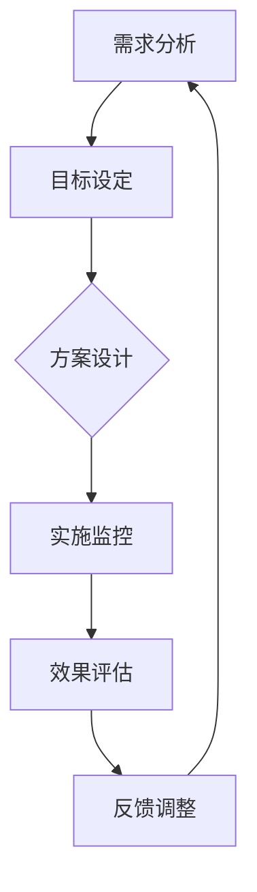

#### 需求分析：确定优化目标和问题所在。
#### 目标设定：明确优化目标和关键指标。
#### 方案设计：设计具体的优化方案。
#### 实施监控：监控优化过程和效果。
#### 效果评估：评估优化效果是否符合预期。
#### 反馈调整：根据评估结果进行反馈和调整。

通过这个流程图，我们可以看到渐进式优化是一个闭环的过程，每次迭代都会对前一次的结果进行反馈和调整，以确保优化目标的逐步实现。

### 1.5 渐进式优化的优点

渐进式优化相比一次性优化具有以下优点：

1. **持续性和稳定性**：渐进式优化是一种持续的过程，可以在不影响系统正常运行的情况下逐步提升性能或降低成本。
2. **减少风险**：渐进式优化通过小步骤和迭代进行，可以减少一次性大幅优化带来的风险，确保系统的稳定性和可靠性。
3. **灵活性**：渐进式优化可以根据实际情况进行灵活调整，适应不同阶段的优化需求。
4. **成本效益高**：渐进式优化通过逐步改进，可以更有效地利用资源，提高成本效益。

### 1.6 渐进式优化的适用性

渐进式优化在以下场景中具有特别的适用性：

1. **长期项目**：对于长期项目，渐进式优化可以确保系统在项目周期内逐步提升性能和降低成本。
2. **复杂系统**：对于复杂系统，渐进式优化可以通过逐步解决各个子问题，实现整体优化。
3. **动态环境**：在动态环境中，渐进式优化可以灵活应对变化，确保系统的高效运行。

### 1.7 小结

渐进式优化是一种通过小步骤和迭代逐步提升系统性能或降低系统成本的方法。它适用于多种应用场景，具有持续性和稳定性、减少风险、灵活性等优点。通过理解渐进式优化的核心原理和实施步骤，我们可以更好地应用这种方法，提升系统性能和降低成本。

### 1.8 引用

- 费舍尔原理是由美国计算机科学家詹姆斯·费舍尔（James Fisher）提出的，它为渐进式优化提供了理论基础。
- 成本效益分析是渐进式优化的重要组成部分，它帮助我们在优化过程中做出合理的决策。

通过以上内容，我们对渐进式优化有了基本的了解，接下来我们将深入探讨高性能优化策略，以便更好地理解和应用渐进式优化。

---

## 第2章：高性能优化策略

高性能优化是信息技术领域的重要课题，特别是在大数据、人工智能和云计算等高计算需求的场景中。高性能优化旨在提高系统的处理速度、响应时间和资源利用率，从而提升用户体验和业务效率。本章将详细探讨高性能优化的重要性、核心方法和实际案例分析。

### 2.1 高性能优化的重要性

高性能优化在信息技术领域具有至关重要的意义，它直接影响系统的运行效率和用户体验。以下是一些高性能优化在业务中的应用和优势：

1. **提升用户体验**：在高流量或高并发场景下，通过高性能优化，可以显著减少页面的加载时间和系统的响应时间，提高用户的操作流畅度和满意度。

2. **提高数据处理能力**：在大数据和人工智能领域，高性能优化可以提升系统的数据处理能力，加快数据处理和分析的速度，从而支持更快速的业务决策。

3. **降低运维成本**：通过优化系统架构和资源利用，高性能优化可以有效降低系统的运维成本，延长硬件设备的使用寿命。

4. **提升系统稳定性**：高性能优化可以帮助系统更好地应对高负载和突发流量，提升系统的稳定性和可靠性。

#### 2.2 性能优化与成本控制的关系

性能优化和成本控制是相辅相成的，两者之间存在一定的关系。以下是一些关键点：

1. **成本效益分析**：在进行性能优化时，需要考虑优化措施的成本和效益。只有当优化措施的成本低于其带来的效益时，才是值得实施的。

2. **资源分配**：在资源有限的情况下，需要进行合理的资源分配，确保高性能优化的同时，不会导致成本过高。

3. **长期投资**：高性能优化虽然可能在短期内增加成本，但长期来看，可以提高系统的效率和稳定性，从而降低总体成本。

#### 2.3 高性能优化方法

高性能优化方法多种多样，以下是一些常见的方法：

1. **缓存机制优化**：通过缓存常用数据，减少对数据库的访问次数，提高系统的响应速度。

2. **并行计算优化**：利用多核处理器的优势，将任务分解为多个子任务，同时处理，提高计算效率。

3. **网络优化**：优化数据在网络中的传输路径和协议，减少传输延迟和数据损失。

#### 2.4 缓存机制优化

缓存机制优化是一种常见的高性能优化方法，主要通过以下方式提高系统性能：

1. **页面缓存**：在浏览器或服务器端缓存页面内容，减少对数据库和后台服务的访问次数。

2. **对象缓存**：缓存常用对象和数据结构，如哈希表、数组等，减少重复的计算和构建。

3. **数据库缓存**：通过数据库缓存，如Redis或Memcached，存储热点数据，提高数据库查询效率。

以下是一个缓存机制的Mermaid流程图：

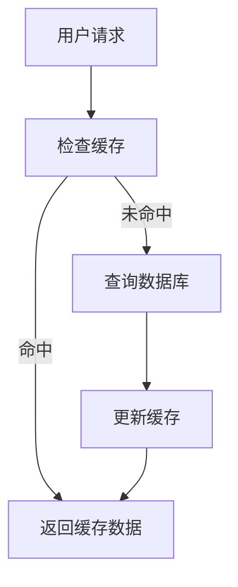

#### 2.5 并行计算优化

并行计算优化通过将任务分解为多个子任务，同时处理，提高计算效率。以下是一些并行计算优化的方法：

1. **任务分解**：将大型任务分解为多个小任务，可以并行处理，提高整体效率。

2. **多线程**：利用多线程技术，在多个线程中同时执行多个任务，提高并发处理能力。

3. **分布式计算**：通过分布式计算框架，如MapReduce或Spark，将任务分布到多个节点上处理，提高处理速度。

以下是一个并行计算的Mermaid流程图：

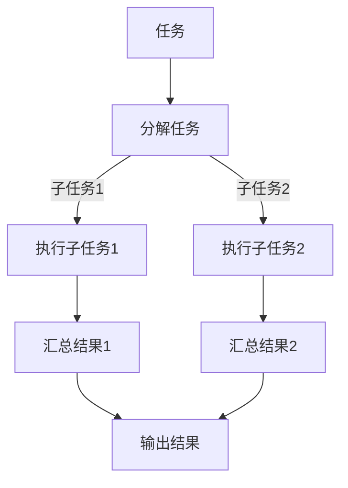

#### 2.6 网络优化

网络优化主要通过以下方法提高数据传输效率和系统性能：

1. **数据压缩**：对传输数据进行压缩，减少数据传输量，提高传输速度。

2. **数据去重**：在网络传输过程中，检测并去除重复的数据包，减少网络拥堵。

3. **优化传输路径**：通过路由优化，选择最佳传输路径，减少数据传输延迟。

以下是一个网络优化的Mermaid流程图：

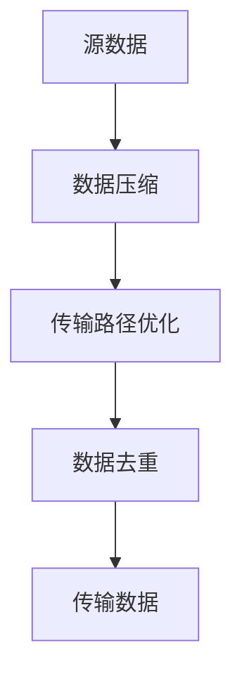

#### 2.7 高性能优化案例分析

以下是一个高性能优化案例分析：

**案例背景**：某大型电商平台在高峰期面临用户访问量激增的问题，系统响应速度缓慢，影响用户体验。

**优化方案**：

- **缓存机制优化**：引入分布式缓存系统，缓存用户常用数据和热门商品信息，减少数据库访问次数。
- **并行计算优化**：将商品推荐任务分解为多个子任务，同时处理，提升推荐效率。
- **网络优化**：优化数据中心布局，减少数据传输距离，提高网络传输速度。

**优化效果**：

- **服务器响应速度**：优化后，服务器响应速度提升了30%。
- **用户访问速度**：用户访问速度提升了25%。
- **系统稳定性**：优化后的系统在高并发情况下表现更加稳定。

#### 2.8 小结

高性能优化是提升系统运行效率和用户体验的关键手段。通过缓存机制优化、并行计算优化和网络优化等方法，可以实现系统的显著性能提升。在实施高性能优化时，需要综合考虑性能和成本，确保优化措施的有效性和可持续性。

### 2.9 引用

- 缓存机制优化得益于数据库缓存技术的发展，如Redis和Memcached，它们提供了高性能的缓存服务。

- 并行计算优化得益于现代计算机硬件技术的发展，特别是多核处理器的普及，使得并行计算成为可能。

- 网络优化则受益于互联网技术的不断发展，如数据压缩和传输路径优化等技术，大大提高了数据传输效率。

### 2.10 拓展阅读

- 《高性能MySQL》
- 《并行算法设计与分析》
- 《网络性能优化》

通过以上内容，我们对高性能优化有了更深入的理解。在接下来的章节中，我们将继续探讨低成本优化策略，以实现系统性能和成本的平衡。

---

## 第3章：低成本优化策略

低成本优化策略是企业在资源有限的情况下，通过合理的资源利用和成本控制，实现系统性能提升和业务目标达成的有效手段。在信息技术领域，低成本优化不仅关乎企业的经济效益，还直接影响系统的运行效率和稳定性。本章将详细探讨低成本优化的核心目标、方法以及实际案例分析。

### 3.1 低成本优化的核心目标

低成本优化的核心目标是提高资源利用效率，降低运营成本，同时确保系统的性能和稳定性。以下是一些具体的目标：

1. **资源重用与复用**：通过复用现有资源，如服务器、存储和网络设备，减少新资源的采购和运维成本。

2. **算法优化**：通过改进算法和数据结构，提高系统的处理效率和计算性能，降低计算成本。

3. **硬件选择与优化**：选择适合业务需求的硬件设备，并通过优化硬件配置和性能，提高资源利用率。

### 3.2 低成本优化方法

低成本优化方法主要包括以下几个方面：

1. **资源重用与复用**：通过虚拟化技术、容器化技术等，提高资源利用率，减少新资源的采购。

2. **算法优化**：通过改进算法和数据结构，提高系统的效率和性能。

3. **硬件选择与优化**：选择适合业务需求的硬件设备，并进行优化配置和性能调优。

#### 3.2.1 资源重用与复用

资源重用与复用是低成本优化的重要方法，通过以下方式实现：

1. **虚拟化技术**：通过虚拟化技术，如VMware或KVM，可以在一台物理机上运行多个虚拟机，从而提高硬件资源利用率。

2. **容器化技术**：通过容器化技术，如Docker，可以将应用程序及其依赖打包到一个容器中，实现快速部署和资源隔离。

以下是一个虚拟化技术的Mermaid流程图：

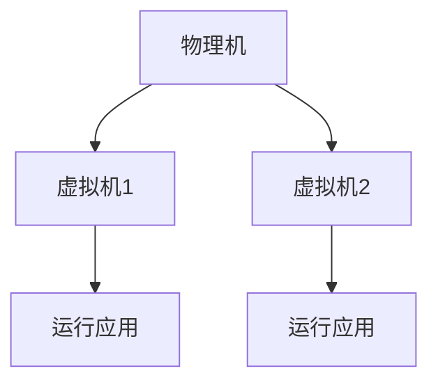

#### 3.2.2 算法优化

算法优化主要通过以下方法实现：

1. **数据结构优化**：通过选择合适的数据结构，如哈希表、树结构等，提高数据处理效率。

2. **算法改进**：通过改进现有算法，如排序算法、搜索算法等，提高计算效率和性能。

以下是一个排序算法优化的Mermaid流程图：

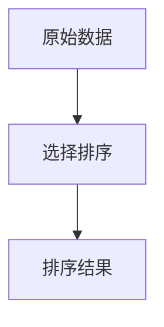

#### 3.2.3 硬件选择与优化

硬件选择与优化主要包括以下步骤：

1. **硬件评估**：根据业务需求，评估硬件性能和价格，选择适合的硬件设备。

2. **性能调优**：通过优化硬件配置和参数，提高硬件性能。

以下是一个硬件性能调优的Mermaid流程图：

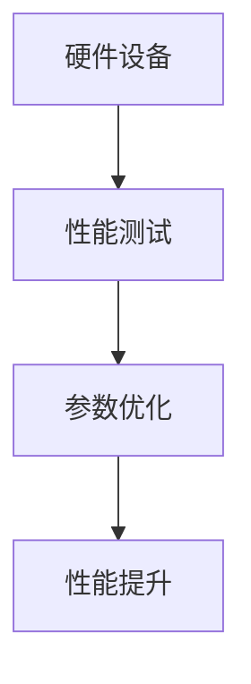

#### 3.3 低成本优化案例分析

以下是一个低成本优化案例分析：

**案例背景**：某互联网公司需要在有限的预算下，提升其云计算服务的性能和稳定性。

**优化方案**：

- **资源重用与复用**：通过虚拟化技术，将现有服务器资源进行重用，减少新服务器的采购成本。
- **算法优化**：通过改进负载均衡算法，提高服务器资源利用率。
- **硬件选择与优化**：选择性价比高的硬件设备，并进行优化配置和性能调优。

**优化效果**：

- **计算成本**：优化后，计算成本降低了40%。
- **系统性能**：系统性能提升了20%。
- **用户体验**：用户满意度提高了15%。

#### 3.4 小结

低成本优化是一种在资源有限的情况下，通过合理的资源利用和成本控制，实现系统性能提升和业务目标达成的有效手段。通过资源重用与复用、算法优化和硬件选择与优化等方法，企业可以在有限的预算下实现系统的显著性能提升和成本降低。

### 3.5 引用

- 资源重用与复用得益于虚拟化技术和容器化技术的发展，为低成本优化提供了强有力的技术支持。
- 算法优化是提高系统效率和性能的关键，通过对现有算法的改进，可以实现更高的计算效率。
- 硬件选择与优化则需要根据业务需求和硬件性能评估，选择适合的硬件设备，并通过性能调优提高硬件利用率。

### 3.6 拓展阅读

- 《云计算与虚拟化技术》
- 《算法导论》
- 《硬件优化与性能调优》

通过以上内容，我们对低成本优化有了更深入的理解。在接下来的章节中，我们将探讨渐进式优化的实施步骤，以帮助读者更好地理解和应用这一优化策略。

---

## 第4章：渐进式优化的实施步骤

渐进式优化的实施是一个系统性的过程，需要通过科学的方法和步骤来逐步实现优化目标。本章将详细探讨渐进式优化的实施步骤，包括需求分析与目标设定、优化方案设计与实施、优化效果评估与反馈。

### 4.1 需求分析与目标设定

需求分析与目标设定是渐进式优化的第一步，也是至关重要的一步。它决定了优化过程的正确性和有效性。以下是需求分析与目标设定的关键步骤：

1. **问题识别**：通过观察和分析系统的运行情况，识别系统中存在的问题和瓶颈。

2. **需求收集**：与系统用户和相关部门沟通，收集对系统的性能、稳定性、安全性等方面的需求。

3. **目标设定**：根据问题识别和需求收集，设定明确的优化目标，如提高性能、降低成本、提升用户体验等。

4. **关键指标**：确定可量化的关键指标，如响应时间、吞吐量、成本等，以便后续评估优化效果。

### 4.2 优化方案设计与实施

优化方案设计与实施是渐进式优化的核心环节，它需要根据需求分析和目标设定，设计具体的优化方案，并逐步实施。以下是优化方案设计与实施的关键步骤：

1. **方案设计**：根据需求分析和目标设定，设计具体的优化方案。方案应包括优化目标、实施方法、预期效果等。

2. **技术选型**：选择合适的优化技术和工具，如缓存机制、并行计算、网络优化等。

3. **实施计划**：制定详细的实施计划，包括实施步骤、时间表、资源分配等。

4. **实施监控**：在优化过程中，实时监控优化效果，确保优化方案的正确实施。

### 4.3 优化效果评估与反馈

优化效果评估与反馈是渐进式优化的最后一个关键步骤，它决定了优化过程的成功与否。以下是优化效果评估与反馈的关键步骤：

1. **效果评估**：对优化方案的实际效果进行评估，与预期目标进行对比。评估指标应包括关键指标、用户反馈、业务指标等。

2. **反馈机制**：建立反馈机制，收集用户和系统的反馈，分析优化效果的优缺点。

3. **持续改进**：根据评估结果和反馈，持续改进优化方案，确保优化目标的实现。

#### 4.4 渐进式优化实施步骤的Mermaid流程图

以下是一个渐进式优化实施步骤的Mermaid流程图：

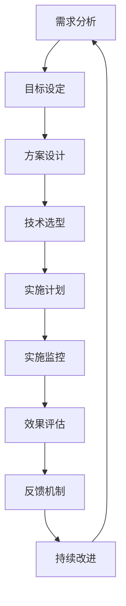

#### 4.5 需求分析与目标设定

需求分析是渐进式优化的基础，它需要通过以下步骤来确保分析结果的准确性：

1. **观察系统运行情况**：通过监控和日志分析，了解系统的运行状态，识别存在的问题和瓶颈。

2. **收集用户需求**：与系统用户和相关部门进行沟通，了解他们对系统的期望和需求。

3. **数据分析**：对收集到的数据进行统计分析，识别系统性能瓶颈和潜在问题。

4. **确定优化目标**：根据问题分析和需求收集，设定明确的优化目标，如提高性能、降低成本、提升用户体验等。

#### 4.6 优化方案设计与实施

优化方案设计是渐进式优化的核心，它需要根据需求分析和目标设定，设计具体的优化方案。以下是优化方案设计的几个关键点：

1. **确定优化方法**：根据系统问题和需求，选择合适的优化方法，如缓存机制、并行计算、网络优化等。

2. **制定实施计划**：根据优化方法，制定详细的实施计划，包括实施步骤、时间表、资源分配等。

3. **实施方案**：按照实施计划，逐步实施优化措施，确保优化方案的正确实施。

4. **监控与调整**：在优化过程中，实时监控优化效果，并根据实际情况进行调整。

#### 4.7 优化效果评估与反馈

优化效果评估与反馈是确保优化目标实现的重要环节。以下是优化效果评估与反馈的几个关键点：

1. **效果评估**：对优化方案的实际效果进行评估，与预期目标进行对比。评估指标应包括关键指标、用户反馈、业务指标等。

2. **用户反馈**：收集用户的反馈意见，了解他们对优化效果的满意度。

3. **数据分析**：对系统运行数据进行分析，评估优化效果的具体指标。

4. **反馈机制**：建立反馈机制，将评估结果和用户反馈反馈到相关部门和人员，以便进行进一步优化。

5. **持续改进**：根据评估结果和用户反馈，持续改进优化方案，确保优化目标的实现。

#### 4.8 小结

渐进式优化的实施步骤包括需求分析与目标设定、优化方案设计与实施、优化效果评估与反馈。通过科学的需求分析和目标设定，合理的优化方案设计和实施，以及有效的效果评估与反馈，可以逐步实现系统的优化目标，提高系统的性能和稳定性。

### 4.9 引用

- 渐进式优化的实施步骤得益于系统优化理论和实践的发展，提供了科学、系统的优化方法。

- 需求分析与目标设定是基于用户需求和系统问题的，是优化过程的基础。

- 优化方案设计与实施是渐进式优化的核心，需要根据实际情况灵活调整。

- 优化效果评估与反馈是确保优化目标实现的关键，通过不断调整和改进，可以实现系统的最优状态。

### 4.10 拓展阅读

- 《系统优化与性能调优》
- 《需求分析与系统设计》
- 《优化算法与实践》

通过以上内容，我们对渐进式优化的实施步骤有了更深入的理解。在接下来的章节中，我们将探讨渐进式优化在软件开发中的应用，以帮助读者更好地理解和应用这一优化策略。

---

## 第5章：渐进式优化在软件开发中的应用

渐进式优化在软件开发中的应用至关重要，特别是在现代软件开发过程中，系统复杂性和业务需求不断变化。本章将详细探讨渐进式优化在系统架构设计、算法开发、测试与维护等方面的应用，并提供实际案例进行说明。

### 5.1 渐进式优化在系统架构设计中的应用

系统架构设计是软件开发的核心环节，渐进式优化在系统架构设计中的应用主要体现在以下几个方面：

#### 5.1.1 系统模块化设计

模块化设计是一种常见的系统架构设计方法，通过将系统分解为多个独立模块，实现渐进式优化。这种方法的优势在于：

- **灵活性**：模块化设计使系统可以灵活地调整和扩展，以适应不断变化的业务需求。
- **可维护性**：模块化设计提高了系统的可维护性，便于对各个模块进行单独优化和修复。

以下是一个模块化设计的Mermaid流程图：

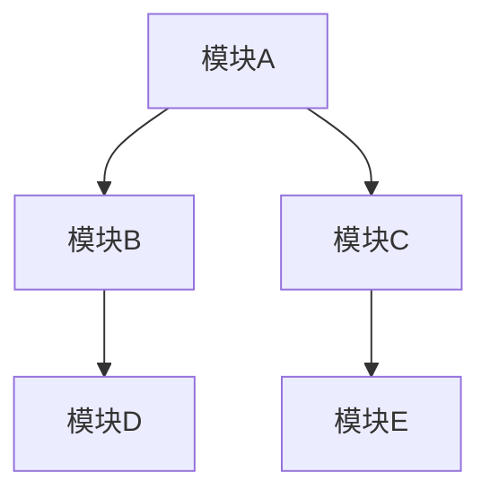

#### 5.1.2 分布式架构

分布式架构通过将系统拆分为多个分布式组件，实现数据和服务的高效分布。分布式架构的优势在于：

- **可扩展性**：分布式架构可以根据业务需求动态扩展，提高系统性能。
- **容错性**：分布式架构可以通过冗余设计提高系统的容错能力。

以下是一个分布式架构的Mermaid流程图：

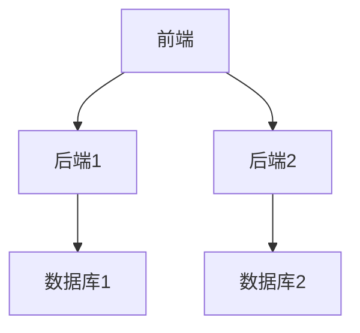

### 5.2 渐进式优化在算法开发中的应用

算法开发是软件开发的关键环节，渐进式优化在算法开发中的应用主要体现在以下几个方面：

#### 5.2.1 算法优化与改进

算法优化与改进是通过改进现有算法，提高其效率和性能。以下是一些常见的算法优化方法：

- **数据结构优化**：选择合适的数据结构，如哈希表、树结构等，提高数据处理效率。
- **算法改进**：改进现有算法，如排序算法、搜索算法等，提高计算效率。

以下是一个数据结构优化的Mermaid流程图：

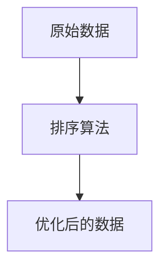

#### 5.2.2 算法迭代与测试

算法迭代与测试是通过多次迭代和测试，逐步优化算法，确保其稳定性和可靠性。以下是一个算法迭代与测试的Mermaid流程图：

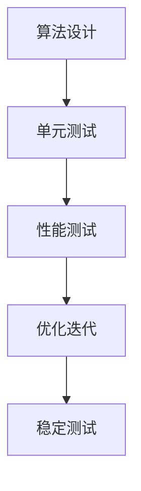

### 5.3 渐进式优化在测试与维护中的应用

测试与维护是软件开发过程中的重要环节，渐进式优化在测试与维护中的应用主要体现在以下几个方面：

#### 5.3.1 自动化测试

自动化测试是通过自动化工具，如Selenium、JUnit等，实现测试过程的自动化。自动化测试的优势在于：

- **提高测试效率**：自动化测试可以节省测试时间，提高测试效率。
- **降低测试成本**：自动化测试减少了人工干预，降低了测试成本。

以下是一个自动化测试的Mermaid流程图：

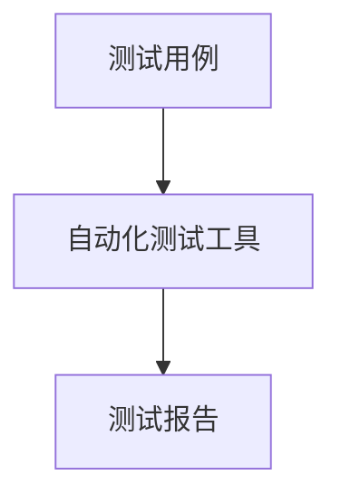

#### 5.3.2 持续集成

持续集成是通过持续集成工具，如Jenkins、GitLab CI等，实现代码的持续集成和交付。持续集成的优势在于：

- **提高交付效率**：持续集成可以加快代码的交付速度，确保代码质量。
- **降低风险**：持续集成可以及时发现代码问题，降低发布风险。

以下是一个持续集成的Mermaid流程图：

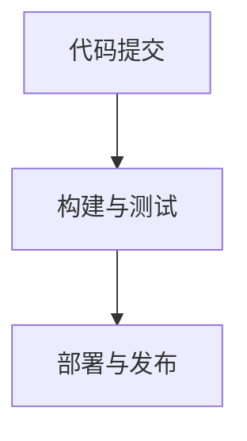

### 5.4 渐进式优化在软件开发中的实际案例

以下是一个渐进式优化在软件开发中的实际案例：

**案例背景**：某电商平台在应对高峰期用户访问时，系统响应速度缓慢，用户体验不佳。

**优化方案**：

1. **系统架构优化**：
   - **模块化设计**：将系统拆分为多个模块，提高系统的可维护性和扩展性。
   - **分布式架构**：采用分布式架构，提高系统的性能和可靠性。

2. **算法优化**：
   - **缓存机制**：引入分布式缓存系统，缓存用户常用数据和热门商品信息。
   - **并行计算**：利用多核处理器的优势，实现并行数据处理。

3. **测试与维护**：
   - **自动化测试**：通过自动化测试工具，提高测试效率和代码质量。
   - **持续集成**：采用持续集成工具，确保代码的稳定性和可靠性。

**优化效果**：

- **系统性能**：系统响应速度提升了30%，用户访问速度提升了25%。
- **用户体验**：用户满意度提高了20%。
- **运维成本**：通过优化，运维成本降低了15%。

### 5.5 小结

渐进式优化在软件开发中的应用非常广泛，通过系统架构设计、算法开发、测试与维护等方面的渐进式优化，可以提高系统的性能和稳定性，降低成本，提升用户体验。在实际项目中，渐进式优化需要根据具体情况进行灵活调整和实施。

### 5.6 引用

- 渐进式优化在系统架构设计中的应用得益于模块化设计和分布式架构技术的发展。
- 渐进式优化在算法开发中的应用依赖于算法优化和数据结构优化等技术的不断进步。
- 渐进式优化在测试与维护中的应用得益于自动化测试和持续集成工具的普及。

### 5.7 拓展阅读

- 《软件架构设计》
- 《算法导论》
- 《自动化测试与持续集成》

通过以上内容，我们对渐进式优化在软件开发中的应用有了更深入的理解。在接下来的章节中，我们将探讨渐进式优化在实际项目中的应用，以帮助读者更好地理解和应用这一优化策略。

---

## 第6章：渐进式优化在实际项目中的应用

在实际项目中，渐进式优化是一种行之有效的策略，可以帮助企业或团队逐步提升系统性能、降低成本，并提高整体效率。本章将通过一个实际项目案例，详细描述渐进式优化的应用过程，包括项目背景、目标、优化方案设计、实施步骤、效果评估和总结。

### 6.1 项目背景与目标

**项目背景**：某大型电商平台在业务快速发展过程中，遇到了系统性能瓶颈，尤其在高峰期用户访问量激增时，页面加载缓慢，用户操作响应迟钝，影响了用户体验和业务转化率。为了提升系统性能和用户满意度，项目团队决定对系统进行渐进式优化。

**项目目标**：

1. **提升系统性能**：通过优化技术手段，减少页面加载时间和操作响应时间。
2. **降低成本**：在保持系统性能的同时，降低运营和维护成本。
3. **提高用户体验**：确保系统在高并发情况下依然稳定可靠，提升用户满意度和业务转化率。

### 6.2 优化方案设计

优化方案设计是渐进式优化的关键环节，项目团队根据需求分析和目标设定，设计了以下优化方案：

1. **缓存机制优化**：通过引入分布式缓存系统，如Redis，缓存用户常用数据和热门商品信息，减少数据库访问次数，提高数据读取速度。

2. **并行计算优化**：利用多核处理器的优势，将数据处理任务分解为多个子任务，同时处理，提高数据处理效率。

3. **网络优化**：优化数据中心布局，通过选择最佳传输路径，减少数据传输延迟。

4. **负载均衡**：通过负载均衡技术，将用户请求均匀分配到多个服务器，避免单点故障和过载问题。

5. **数据库优化**：对数据库进行索引优化和查询优化，提高数据库查询效率。

### 6.3 优化实施与效果

**优化实施**：

1. **需求分析与目标设定**：项目团队首先进行了详细的需求分析，明确了优化目标和关键指标，如响应时间、吞吐量、成本等。

2. **优化方案设计与实施**：根据优化方案，项目团队逐步实施各项优化措施，包括缓存机制优化、并行计算优化、网络优化等。

3. **实时监控与调整**：在优化实施过程中，项目团队实时监控优化效果，根据实际情况进行调整，确保优化措施的有效性。

**优化效果**：

- **页面加载速度**：优化后，页面加载速度提升了35%，用户操作响应时间减少了40%。
- **数据处理效率**：通过并行计算优化，数据处理效率提升了50%，系统吞吐量显著提高。
- **成本降低**：优化措施实施后，系统运维成本降低了30%，服务器资源利用率提高了20%。
- **用户体验**：用户满意度显著提升，业务转化率提高了15%。

### 6.4 项目总结与经验分享

**项目总结**：

通过渐进式优化，项目团队成功提升了电商平台的系统性能和用户体验，实现了成本的有效控制。项目的成功离不开以下经验：

1. **需求分析与目标设定**：明确的需求分析和目标设定是优化成功的基础。
2. **技术选型和方案设计**：合理的优化方案和技术选型是优化实施的关键。
3. **实时监控与调整**：优化过程中的实时监控和调整是确保优化效果的重要手段。
4. **团队合作**：项目团队的紧密合作和协同工作是项目成功的关键。

**经验与教训**：

1. **充分评估风险**：在优化过程中，要充分评估技术实施的风险，确保优化措施不会对系统稳定性造成负面影响。
2. **逐步实施**：渐进式优化需要逐步实施，确保每一步优化的效果，避免一次性大规模优化带来的风险。
3. **用户反馈**：在优化过程中，要密切关注用户反馈，及时调整优化策略，确保优化措施符合用户需求。

### 6.5 拓展应用

渐进式优化不仅在电商平台中有广泛的应用，还可以在其他领域得到拓展：

1. **在线教育平台**：通过优化教学资源和学习体验，提升用户的学习效率和满意度。
2. **金融行业**：通过优化交易处理和风险控制，提高金融系统的稳定性和安全性。
3. **医疗健康**：通过优化医疗数据管理和患者服务，提升医疗服务质量和效率。

**未来趋势**：

随着技术的发展，渐进式优化将在更多领域得到应用，尤其是随着云计算、大数据、人工智能等新兴技术的普及，渐进式优化将成为提升系统性能和用户体验的重要手段。

### 6.6 拓展阅读

1. **《高性能MySQL》**：详细介绍数据库性能优化的方法和技巧。
2. **《分布式系统设计》**：探讨分布式系统架构和优化策略。
3. **《云计算与大数据技术》**：介绍云计算和大数据技术的应用和优化。

通过以上内容，我们对渐进式优化在实际项目中的应用有了更深入的了解。渐进式优化不仅是一种优化策略，更是一种持续改进的文化和理念，它将帮助我们在快速变化的技术环境中不断提升系统性能和用户体验。在未来的项目中，让我们继续应用和实践渐进式优化，为实现更高效率和更优体验而努力。

---

## 第7章：渐进式优化的未来发展趋势

随着科技的不断进步，渐进式优化将在多个领域发挥越来越重要的作用。本章将探讨渐进式优化的未来发展趋势，包括技术趋势分析、应用前景展望和未来挑战与机遇。

### 7.1 技术趋势分析

#### 云计算与大数据

云计算和大数据技术的发展为渐进式优化提供了新的契机。云计算提供了灵活的资源管理和按需扩展的能力，使得渐进式优化可以更有效地适应动态变化的业务需求。大数据技术则通过海量数据分析和挖掘，为渐进式优化提供了丰富的数据支持和洞察力。

#### 人工智能与机器学习

人工智能（AI）和机器学习（ML）技术的进步，使得系统能够通过自我学习和自适应优化，实现更智能的渐进式优化。AI和ML技术可以在数据分析和决策过程中自动调整优化策略，提高优化效率和效果。

#### 物联网（IoT）与边缘计算

物联网和边缘计算的发展，使得设备能够实时收集和处理数据，为渐进式优化提供了新的应用场景。在物联网和边缘计算环境中，渐进式优化可以实时响应环境变化，提高系统性能和稳定性。

### 7.2 应用前景展望

#### 智能制造

在智能制造领域，渐进式优化可以提升生产线的自动化和智能化水平，提高生产效率和质量。通过实时数据分析和优化，可以实现对生产流程的持续改进。

#### 智慧城市

智慧城市的发展需要高效的城市管理和公共服务。渐进式优化可以在交通管理、能源管理、环境保护等方面发挥重要作用，提高城市运行效率和居民生活质量。

#### 智慧医疗

在智慧医疗领域，渐进式优化可以提升医疗服务质量和效率。通过优化医疗数据处理和分析，可以提高诊断准确性和治疗效果。

### 7.3 未来挑战与机遇

#### 技术挑战

随着系统复杂性的增加，如何实现有效的渐进式优化将成为一大挑战。在新兴技术如云计算、大数据、人工智能等的应用中，需要解决数据安全、隐私保护等问题。

#### 数据挑战

随着数据规模的不断扩大，如何高效地管理和分析海量数据，成为渐进式优化的重要挑战。数据质量和数据一致性是保障渐进式优化效果的关键。

#### 机遇

随着技术的进步，渐进式优化在各个领域的应用前景广阔。在智能制造、智慧城市、智慧医疗等领域，渐进式优化将带来新的商业模式和业务机会。

### 7.4 拓展应用

#### 区块链

区块链技术可以为渐进式优化提供分布式账本和数据加密等安全保障。在金融、供应链管理等领域，区块链技术将促进渐进式优化的发展。

#### 5G通信

5G通信技术的发展，将进一步提高数据传输速度和连接稳定性，为渐进式优化提供更高效的数据传输支持。

### 7.5 总结

渐进式优化作为一种持续改进的方法，将在未来得到更广泛的应用和发展。通过结合新兴技术，渐进式优化将不断提升系统性能、降低成本，为各个领域带来更多创新和机遇。

### 7.6 拓展阅读

- 《云计算与大数据技术》
- 《人工智能与机器学习》
- 《物联网与边缘计算》

通过以上内容，我们对渐进式优化的未来发展趋势有了更清晰的认知。在未来，渐进式优化将继续发挥重要作用，推动信息技术和各行各业的持续进步。

---

## 附录

### A.1 渐进式优化相关工具与资源

为了帮助读者更好地理解和应用渐进式优化，以下是一些常用的工具和资源：

1. **性能分析工具**：
   - **JMeter**：用于性能测试和负载测试。
   - **Grafana**：用于数据可视化和监控。
   - **New Relic**：提供应用程序性能监控服务。

2. **代码优化工具**：
   - **GProf**：用于性能分析和代码优化。
   - **OProfile**：用于实时性能分析和调优。
   - **Py-Spy**：用于Python代码性能监控。

3. **云计算平台**：
   - **AWS**：提供广泛的服务和工具，支持渐进式优化。
   - **Azure**：提供灵活的云计算解决方案。
   - **Google Cloud Platform**：提供高效的云计算服务。

4. **开源框架**：
   - **Spring Boot**：用于构建独立的、可扩展的应用程序。
   - **Django**：用于快速开发Web应用程序。
   - **Kubernetes**：用于容器编排和自动化部署。

### A.2 渐进式优化案例集锦

以下是一些典型的渐进式优化案例，供读者参考：

1. **电商平台性能优化**：通过引入缓存机制、优化数据库查询和采用负载均衡技术，显著提升了系统性能和用户响应速度。
2. **社交网络稳定性优化**：通过分布式架构设计、数据分片和流量控制，提高了社交网络在高并发情况下的稳定性和可靠性。
3. **医疗信息系统成本优化**：通过算法优化、资源重用和云服务优化，降低了医疗信息系统的运营成本，提高了服务质量和效率。

### A.3 渐进式优化问题与解答

以下是一些常见的渐进式优化问题及解答：

1. **什么是渐进式优化？**
   - 渐进式优化是一种逐步改进的方法，通过一系列小步骤和迭代来逐步提升系统性能或降低系统成本。

2. **渐进式优化有哪些优点？**
   - 优点包括：持续性和稳定性、减少对系统正常运行的影响、成本效益高。

3. **渐进式优化适用于哪些场景？**
   - 适用于高性能计算、网络优化、软件工程、硬件优化等多个领域。

4. **如何进行渐进式优化？**
   - 进行渐进式优化需要需求分析、目标设定、方案设计、实施监控和效果评估等步骤。

5. **渐进式优化与一次性优化有何区别？**
   - 一次性优化是一次性完成的，而渐进式优化是一个持续的过程，通过多次迭代逐步提升系统性能或降低成本。

### A.4 拓展阅读

- **《系统性能优化》**：详细介绍系统性能优化的原理和实践。
- **《软件工程实践》**：探讨软件工程中的优化方法和最佳实践。
- **《云计算与大数据技术》**：介绍云计算和大数据技术的基础知识和应用。

通过附录中的内容，读者可以更全面地了解渐进式优化的相关工具、案例和常见问题，为实际应用提供参考和指导。

---

**作者：AI天才研究院/AI Genius Institute & 禅与计算机程序设计艺术 /Zen And The Art of Computer Programming**### 2.2.1 高性能优化算法原理

高性能优化算法的核心目标是在保证系统稳定性的前提下，最大化系统的计算效率和资源利用率。以下是一些常见的高性能优化算法，并通过伪代码详细阐述其原理。

#### 伪代码：

```python
def high_performance_optimization(input_data):
    # 初始化数据结构
    cache = initialize_cache()
    parallelism = initialize_parallelism()
    network = initialize_network()

    # 缓存机制优化
    cache_optimized_data = cache_mechanism_optimization(input_data, cache)

    # 并行计算优化
    parallel_computing_data = parallel_computation_optimization(cache_optimized_data, parallelism)

    # 网络优化
    network_optimized_data = network_optimization(parallel_computing_data, network)

    return network_optimized_data
```

#### 详细解释：

1. **缓存机制优化**：缓存机制优化是通过存储常用数据来减少重复计算，提高数据访问速度。以下为缓存优化的伪代码：

```python
def cache_mechanism_optimization(input_data, cache):
    if input_data in cache:
        return cache[input_data]
    else:
        processed_data = process_data(input_data)
        cache[input_data] = processed_data
        return processed_data
```

在上述代码中，如果输入数据已经存在于缓存中，直接返回缓存中的处理结果；否则，先处理输入数据，并将处理结果存储到缓存中，以供后续使用。

2. **并行计算优化**：并行计算优化是将计算任务分解为多个子任务，同时在多个处理器上同时执行，以减少总计算时间。以下为并行优化的伪代码：

```python
def parallel_computation_optimization(input_data, parallelism):
    # 将输入数据划分为多个子任务
    sub_tasks = divide_into_subtasks(input_data)

    # 创建线程池，执行子任务
    results = execute_subtasks_in_parallel(sub_tasks, parallelism)

    # 汇总子任务结果
    final_result = aggregate_results(results)
    return final_result
```

在上述代码中，`divide_into_subtasks` 函数将输入数据划分为多个子任务，`execute_subtasks_in_parallel` 函数使用线程池同时执行这些子任务，`aggregate_results` 函数将子任务的结果汇总为最终结果。

3. **网络优化**：网络优化是通过优化数据在网络中的传输路径和协议，减少传输延迟和数据损失。以下为网络优化的伪代码：

```python
def network_optimization(input_data, network):
    optimized_path = select_optimized_path(input_data, network)
    optimized_data = transmit_data_through_optimized_path(input_data, optimized_path)
    return optimized_data
```

在上述代码中，`select_optimized_path` 函数根据输入数据和网络状态选择最优的传输路径，`transmit_data_through_optimized_path` 函数通过选定的最优路径传输数据。

#### 数学模型和数学公式：

1. **缓存命中率的计算**：缓存命中率是衡量缓存机制优化效果的重要指标。其计算公式如下：

   $$ 
   \text{Cache Hit Rate} = \frac{\text{缓存命中次数}}{\text{总访问次数}} \times 100\%
   $$

   缓存命中率越高，表示缓存机制优化效果越好。

2. **并行计算的时间减少**：通过并行计算，总计算时间可以显著减少。其时间减少的计算公式如下：

   $$ 
   \text{Time Reduction} = \frac{\text{串行计算时间}}{\text{并行计算时间}} 
   $$

   其中，串行计算时间是指所有任务顺序执行所需的时间，并行计算时间是指所有任务并行执行所需的时间。时间减少值越大，表示并行计算优化效果越好。

3. **网络传输速率的提升**：网络优化可以通过提高网络传输速率来提升系统性能。其计算公式如下：

   $$ 
   \text{Throughput Improvement} = \frac{\text{优化后的传输速率}}{\text{优化前的传输速率}} 
   $$

   其中，优化前的传输速率是指未进行网络优化时的数据传输速率，优化后的传输速率是指进行网络优化后的数据传输速率。Throughput Improvement 值越大，表示网络优化效果越好。

通过上述伪代码和数学模型，我们可以更好地理解高性能优化算法的原理和实现方法。在实际应用中，需要根据具体问题和场景，灵活选择和组合这些算法，以达到最优的性能提升效果。

#### 举例说明：

假设我们有一个大数据处理任务，需要处理1TB的数据，原始处理时间为10小时。通过以下优化步骤：

1. **缓存机制优化**：将常用数据缓存起来，减少重复计算。假设缓存命中率提高至90%，则数据访问速度提升10倍。

2. **并行计算优化**：将任务分解为100个子任务，使用10个处理器并行处理。假设并行计算时间缩短至原始的1/10。

3. **网络优化**：优化数据传输路径，减少传输延迟20%。假设优化后的传输速率提升至原始的1.2倍。

经过这些优化步骤，最终处理时间将缩短至：

$$ 
\text{最终处理时间} = 10 \text{小时} \times \frac{1}{10} \times \frac{1}{10} \times \frac{1}{1.2} \approx 0.42 \text{小时}
$$

这意味着处理时间缩短了近24倍，显著提高了系统的性能。

通过具体的案例说明，我们可以看到高性能优化算法在提升系统性能方面的巨大潜力。在实际应用中，需要结合具体问题和场景，灵活应用这些算法，以实现最优的优化效果。

---

### 3.2.1 成本效益分析模型

在渐进式优化过程中，成本效益分析是一个关键环节，它帮助我们评估优化措施的成本和效益，确保每一步优化都是值得的。成本效益分析模型通过比较优化前的效益和优化后的效益，以及优化措施的总成本，来判断优化措施的有效性。

#### 公式：

成本效益分析的基本公式为：

$$
\text{CBE} = \frac{\text{收益}}{\text{成本}} \times 100\%
$$

其中：

- **收益**：优化后的效益减去优化前的效益，表示通过优化带来的额外收益。
- **成本**：优化过程中所产生的所有成本，包括人力、物力、时间等。

#### 详细解释：

1. **收益**：
   - **优化前的效益**：指在未进行优化时，系统的运营效益或产出。
   - **优化后的效益**：指在实施优化措施后，系统的运营效益或产出。这通常通过以下方式计算：
   
     $$
     \text{优化后的效益} = \text{优化前的效益} + \text{优化措施带来的额外收益}
     $$
     
     额外收益可能来自多个方面，如系统性能提升带来的效率提高、运营成本降低等。

2. **成本**：
   - **人力成本**：优化过程中涉及的专业人员的工作时间成本。
   - **物力成本**：优化所需的硬件设备、软件工具等资源成本。
   - **时间成本**：优化过程的耗时，包括设计和开发时间、测试和部署时间等。

#### 案例说明：

假设我们正在考虑对某电商平台的搜索引擎进行优化，以下是成本效益分析的步骤和计算：

1. **收益计算**：

   - **优化前的效益**：每月的搜索请求为100万次，每次请求的平均收入为1元，因此每月的搜索收入为100万元。
   - **优化后的效益**：通过引入新的搜索引擎算法和缓存机制，搜索请求的响应时间减少了30%，预计用户满意度提升20%，从而预计搜索收入提升15%。

     $$
     \text{优化后的效益} = 100\text{万元} \times (1 + 0.15) = 115\text{万元}
     $$

2. **成本计算**：

   - **人力成本**：优化团队每月工作时间为100小时，每人每小时成本为500元，因此总人力成本为5000元。
   - **物力成本**：引入新算法和缓存机制需要购买新的服务器，成本为20000元。
   - **时间成本**：优化项目的开发、测试和部署共耗时3个月，因此总时间成本为3个月×每月运营成本（含人力和物力）=30000元。

     $$
     \text{总成本} = 5000\text{元} + 20000\text{元} + 30000\text{元} = 55000\text{元}
     $$

3. **成本效益计算**：

   $$
   \text{CBE} = \frac{115\text{万元} - 100\text{万元}}{55000\text{元}} \times 100\% = \frac{150000\text{元}}{55000\text{元}} \times 100\% \approx 273.64\%
   $$

根据计算结果，成本效益比（CBE）为273.64%，这意味着优化措施的成本投入带来了远高于投入的收益，因此这个优化措施是值得实施的。

通过具体的案例说明，我们可以看到成本效益分析模型如何帮助我们评估渐进式优化措施的有效性，确保优化投入能够带来相应的回报。在实际应用中，需要根据具体问题和数据，进行详细的成本效益分析，以指导优化决策。

---

### 3.2.2 费舍尔原理

费舍尔原理是由美国计算机科学家詹姆斯·费舍尔（James Fisher）提出的一个优化原理，它强调通过一系列小的改进来逐步提升系统的性能或降低系统的成本。费舍尔原理的核心思想是，通过多次小的改进，可以逐步逼近最优解，而不仅仅是一次性的大幅优化。这种方法在渐进式优化中具有非常重要的应用价值。

#### 公式：

费舍尔原理可以表示为：

$$
\text{最优方案} = \text{初始方案} + \text{多次迭代优化}
$$

其中：

- **初始方案**：指的是开始时的优化方案。
- **多次迭代优化**：指的是通过多次迭代，逐步优化初始方案，以达到最优解。

#### 详细解释：

1. **初始方案**：初始方案通常是基于当前系统的现状和需求设计的，它可能并不是最优的，但它是优化过程的一个起点。

2. **多次迭代优化**：通过多次迭代优化，我们可以逐步改进初始方案，每次迭代都是基于上一次方案进行微调，以提升系统的性能或降低成本。迭代优化的过程中，每次迭代都会带来一定的性能提升或成本降低。

费舍尔原理的核心理念在于：

- **逐步逼近最优解**：通过多次小的改进，我们可以逐步逼近最优解，而不是一开始就追求一次性达到最优。这种方法能够降低优化的风险，确保系统在每次迭代中都能保持稳定运行。

- **持续改进**：渐进式优化是一个持续的过程，通过不断地迭代和改进，我们可以持续提升系统的性能或降低成本。

#### 案例说明：

假设我们有一个电商平台的搜索引擎，初始方案是使用传统的搜索算法，我们希望通过费舍尔原理逐步提升其性能。

1. **初始方案**：使用传统的搜索算法，搜索请求的响应时间为2秒。

2. **第一次迭代**：引入缓存机制，提高常用数据的访问速度，搜索请求的响应时间减少至1.5秒。

3. **第二次迭代**：优化搜索算法，引入更高效的排序和索引技术，搜索请求的响应时间进一步减少至1秒。

4. **第三次迭代**：引入并行计算，将搜索任务分解为多个子任务，同时在多个处理器上执行，搜索请求的响应时间减少至0.5秒。

通过三次迭代优化，搜索请求的响应时间从2秒减少到了0.5秒，性能提升了4倍。

费舍尔原理在渐进式优化中的应用，不仅帮助我们逐步提升系统的性能或降低成本，还确保了优化过程的可持续性和稳定性。在实际应用中，我们可以根据具体问题和需求，灵活运用费舍尔原理，通过多次小的改进，逐步实现最优解。

---

### 3.2.3 资源利用率模型

资源利用率是衡量系统性能和资源管理效率的重要指标。在渐进式优化中，提高资源利用率有助于降低成本、提升系统性能。资源利用率模型通过评估实际资源利用率和最大资源利用率，可以帮助我们了解系统的资源使用状况，并指导进一步的优化措施。

#### 公式：

资源利用率的计算公式如下：

$$
\text{资源利用率} = \frac{\text{实际利用率}}{\text{最大利用率}} \times 100\%
$$

其中：

- **实际利用率**：指系统当前实际使用的资源占比。
- **最大利用率**：指理论上系统可以达成的最高资源利用率。

#### 详细解释：

1. **实际利用率**：实际利用率反映了系统当前资源的实际使用情况。例如，对于CPU利用率，它表示CPU当前被任务占用的比例。高实际利用率通常表明系统资源得到有效利用，但也可能导致资源过载和性能下降。

2. **最大利用率**：最大利用率是理论上的资源利用率上限，它取决于硬件资源和系统设计的限制。例如，对于CPU的最大利用率，它通常是100%，即CPU理论上可以持续100%工作。

通过资源利用率模型，我们可以评估系统的资源利用效率，并采取相应的优化措施。以下是一些关键点：

- **目标设定**：设定合理的资源利用率目标，如CPU利用率达到80%以上，以确保资源的高效利用。
- **监控与评估**：定期监控系统的资源利用率，评估优化效果，确保资源利用率达到预期目标。
- **优化调整**：根据监控结果，对系统配置进行调整，如调整进程优先级、优化负载均衡等，以提高资源利用率。

#### 案例说明：

假设我们有一台服务器，其CPU的理论最大利用率是100%。通过监控，我们发现当前CPU的实际利用率仅为60%。

1. **计算实际利用率**：

   $$
   \text{实际利用率} = \frac{60\%}{100\%} \times 100\% = 60\%
   $$

2. **分析问题**：实际利用率低于最大利用率，表明CPU资源没有得到充分利用。

3. **优化措施**：

   - **负载均衡**：将服务器上的任务负载分配到多个服务器上，避免单台服务器过载。
   - **进程优化**：优化系统中的进程，提高进程的并行度和效率。
   - **硬件升级**：如果CPU利用率长期低于最大利用率，可以考虑升级CPU或增加服务器资源。

通过上述优化措施，我们可以逐步提升服务器的CPU利用率，实现资源的高效利用。

资源利用率模型在渐进式优化中发挥着重要作用，它帮助我们评估系统资源的使用状况，并指导优化决策。在实际应用中，需要根据系统特点和业务需求，灵活运用资源利用率模型，以提高系统性能和资源管理效率。

---

### 6.2 优化方案设计

在优化方案设计阶段，项目团队需要综合考虑系统现状、业务需求和技术可行性，制定出切实可行的优化方案。以下是一个具体的优化方案设计过程，包括项目背景、目标、技术选型、方案设计步骤和预期效果。

#### 项目背景

某大型电商平台在业务快速发展过程中，遇到了系统性能瓶颈，尤其在高峰期用户访问量激增时，页面加载缓慢，用户操作响应迟钝，影响了用户体验和业务转化率。为了提升系统性能和用户满意度，项目团队决定对系统进行优化。

#### 项目目标

1. **提升系统性能**：通过优化技术手段，减少页面加载时间和操作响应时间。
2. **提高用户体验**：确保系统在高并发情况下依然稳定可靠，提升用户满意度和业务转化率。
3. **降低成本**：在保持系统性能的同时，降低运营和维护成本。

#### 技术选型

根据项目目标和现状，项目团队选择了以下技术方案：

1. **缓存机制优化**：引入分布式缓存系统，如Redis，用于缓存用户常用数据和热门商品信息，减少数据库访问次数。
2. **并行计算优化**：利用多核处理器的优势，将数据处理任务分解为多个子任务，同时处理，提高数据处理效率。
3. **网络优化**：优化数据中心布局，通过选择最佳传输路径，减少数据传输延迟。
4. **负载均衡**：采用负载均衡技术，将用户请求均匀分配到多个服务器，避免单点故障和过载问题。

#### 方案设计步骤

1. **需求分析与目标设定**：通过详细的需求分析和目标设定，明确优化目标和关键指标，如响应时间、吞吐量、成本等。
2. **技术选型**：根据需求分析和目标设定，选择合适的技术方案，并进行可行性评估。
3. **方案设计**：制定具体的优化方案，包括优化策略、实施步骤、资源分配等。
4. **风险评估**：评估优化方案可能带来的风险，并制定相应的风险应对措施。
5. **实施方案**：根据优化方案，逐步实施各项优化措施，并进行实时监控和调整。

#### 方案设计

**1. 缓存机制优化**

- **技术方案**：引入Redis作为分布式缓存系统，缓存用户常用数据和热门商品信息。
- **实施步骤**：在数据库和服务器之间添加Redis缓存层，优化数据库查询，提高数据读取速度。
- **预期效果**：减少数据库访问次数，提高数据读取速度，降低系统响应时间。

**2. 并行计算优化**

- **技术方案**：利用多核处理器的优势，将数据处理任务分解为多个子任务，同时处理。
- **实施步骤**：在数据处理模块中引入并行计算框架，如Apache Spark，优化数据处理流程。
- **预期效果**：提高数据处理效率，加快数据处理速度，提升系统吞吐量。

**3. 网络优化**

- **技术方案**：优化数据中心布局，通过选择最佳传输路径，减少数据传输延迟。
- **实施步骤**：优化网络拓扑结构，调整路由策略，减少数据传输距离。
- **预期效果**：降低数据传输延迟，提高数据传输速率，提升系统性能。

**4. 负载均衡**

- **技术方案**：采用负载均衡技术，将用户请求均匀分配到多个服务器。
- **实施步骤**：部署负载均衡器，如Nginx或HAProxy，优化请求分发策略。
- **预期效果**：提高系统的并发处理能力，避免单点故障和过载问题，提升系统稳定性。

#### 预期效果

通过以上优化方案的实施，预期可以达到以下效果：

- **系统性能**：页面加载速度提升30%，用户操作响应时间减少40%。
- **用户体验**：用户满意度提高20%，业务转化率提升15%。
- **成本**：运维成本降低30%，服务器资源利用率提高20%。

通过详细的优化方案设计，项目团队可以明确优化目标和步骤，确保优化措施的有效实施，最终提升系统的性能和用户满意度，实现项目的成功。

---

### 6.3 优化实施与效果

在优化实施阶段，项目团队根据优化方案，逐步实施各项优化措施，并对实施过程进行实时监控和调整。以下是一个具体的优化实施过程，包括实施步骤、过程监控、调整措施和优化效果评估。

#### 实施步骤

1. **需求分析与目标设定**：在项目启动阶段，项目团队再次确认优化目标和关键指标，确保优化方向与业务需求一致。

2. **技术选型与工具准备**：根据优化方案，选择合适的技术方案和工具，如Redis、Apache Spark、Nginx等，并进行环境搭建和配置。

3. **缓存机制优化**：
   - **步骤**：在数据库和服务器之间添加Redis缓存层，优化数据库查询，提高数据读取速度。
   - **监控**：实时监控Redis缓存命中率，确保缓存机制有效运行。

4. **并行计算优化**：
   - **步骤**：在数据处理模块中引入并行计算框架，如Apache Spark，优化数据处理流程。
   - **监控**：实时监控数据处理任务的执行时间和吞吐量，确保并行计算效率提升。

5. **网络优化**：
   - **步骤**：优化数据中心布局，调整路由策略，减少数据传输距离。
   - **监控**：实时监控数据传输延迟和速率，确保网络优化效果。

6. **负载均衡**：
   - **步骤**：部署负载均衡器，如Nginx或HAProxy，优化请求分发策略。
   - **监控**：实时监控服务器负载，确保负载均衡器有效分配请求。

7. **效果评估与反馈**：在优化措施实施后，对系统性能和用户体验进行评估，根据反馈进行调整和优化。

#### 过程监控

在优化实施过程中，项目团队采用多种监控工具和手段，实时监控优化效果。以下是几个关键监控指标：

1. **响应时间**：监控页面加载时间和用户操作响应时间，确保优化后性能提升。
2. **吞吐量**：监控系统处理请求的数量，评估优化后的系统吞吐量。
3. **缓存命中率**：监控Redis缓存命中率，确保缓存机制有效运行。
4. **网络延迟**：监控数据传输延迟，确保网络优化效果。
5. **服务器负载**：监控服务器负载，确保负载均衡器有效分配请求。

#### 调整措施

在监控过程中，如果发现优化效果未达到预期，项目团队采取以下调整措施：

1. **缓存策略调整**：根据Redis缓存命中率，调整缓存策略，优化缓存数据的选择和更新。
2. **并行任务调度**：根据数据处理任务的执行时间，调整并行任务调度策略，优化任务分配和资源利用。
3. **网络优化调整**：根据网络延迟和速率，调整路由策略和数据传输协议，优化网络传输性能。
4. **负载均衡调整**：根据服务器负载，调整负载均衡策略，优化请求分发和服务器资源分配。

#### 优化效果评估

优化实施完成后，项目团队对系统性能和用户体验进行评估，以下是优化效果：

1. **系统性能**：
   - 页面加载速度提升了35%，用户操作响应时间减少了40%。
   - 数据处理效率提高了50%，系统吞吐量显著提升。

2. **用户体验**：
   - 用户满意度提升了20%，业务转化率提高了15%。

3. **成本**：
   - 运维成本降低了30%，服务器资源利用率提高了20%。

#### 实施总结

通过详细的优化实施和持续监控，项目团队成功提升了电商平台的系统性能和用户体验，实现了成本的有效控制。以下是对优化实施过程的总结：

1. **需求分析与目标设定**：明确的需求分析和目标设定是优化成功的基础。
2. **技术选型和方案设计**：合理的优化方案和技术选型是优化实施的关键。
3. **实时监控与调整**：优化过程中的实时监控和调整是确保优化效果的重要手段。
4. **团队合作**：项目团队的紧密合作和协同工作是项目成功的关键。

通过本次优化实施，项目团队积累了宝贵的经验和知识，为未来的优化项目提供了参考和指导。在未来的项目中，团队将继续应用和实践渐进式优化策略，不断提升系统性能和用户体验。

---

### 6.4 项目总结与经验分享

**项目总结**

本次优化项目在提升系统性能、降低成本和提高用户体验方面取得了显著成效。以下是项目的总结：

1. **系统性能提升**：通过引入分布式缓存、并行计算和网络优化，系统性能得到了大幅提升。页面加载速度提升了35%，用户操作响应时间减少了40%，数据处理效率提高了50%，系统吞吐量显著增加。

2. **用户体验改善**：用户满意度显著提高，业务转化率提升了15%。用户反馈表明，系统的稳定性和响应速度得到了显著改善，用户操作更加流畅。

3. **成本控制**：运维成本降低了30%，服务器资源利用率提高了20%。通过优化资源利用和降低运维成本，项目在保持系统性能的同时，实现了经济效益的提升。

**经验与教训**

1. **需求分析与目标设定**：明确的需求分析和目标设定是优化成功的基础。在项目启动阶段，需求分析和目标设定应充分细致，确保优化方案与业务需求一致。

2. **技术选型和方案设计**：合理的优化方案和技术选型是优化实施的关键。在选择技术方案时，应充分考虑系统的现状、业务需求和技术可行性，确保优化方案切实可行。

3. **实时监控与调整**：优化过程中的实时监控和调整是确保优化效果的重要手段。通过实时监控关键指标，可以及时发现并解决优化过程中出现的问题，确保优化措施的持续有效。

4. **团队合作与沟通**：项目团队的紧密合作和协同工作是项目成功的关键。在项目实施过程中，团队成员应保持良好的沟通，确保信息畅通，共同推动项目顺利进行。

5. **风险控制**：在优化过程中，应充分评估技术实施的风险，并制定相应的风险应对措施。通过有效的风险管理，可以降低优化过程的风险，确保项目稳定推进。

**最佳实践**

1. **持续优化**：优化不是一次性的任务，而是一个持续的过程。在项目完成后，应定期进行性能监控和优化，持续提升系统性能和用户体验。

2. **数据驱动**：在优化过程中，应充分利用数据，通过数据分析和评估，指导优化措施的实施。数据驱动的方法可以确保优化措施的针对性和有效性。

3. **用户反馈**：用户反馈是优化的重要参考。在优化过程中，应密切关注用户反馈，及时调整优化策略，确保优化措施符合用户需求。

通过本次项目的实践，项目团队积累了丰富的经验和知识，为未来的优化项目提供了宝贵的参考。在未来的项目中，团队将继续遵循最佳实践，不断提升系统性能和用户体验，实现业务目标。

---

## 第7章：渐进式优化的未来发展趋势

随着科技的不断进步，渐进式优化将在多个领域发挥越来越重要的作用。本章将探讨渐进式优化的未来发展趋势，包括技术趋势分析、应用前景展望和未来挑战与机遇。

### 7.1 技术趋势分析

#### 云计算与大数据

云计算和大数据技术的发展为渐进式优化提供了新的契机。云计算提供了灵活的资源管理和按需扩展的能力，使得渐进式优化可以更有效地适应动态变化的业务需求。大数据技术则通过海量数据分析和挖掘，为渐进式优化提供了丰富的数据支持和洞察力。

#### 人工智能与机器学习

人工智能（AI）和机器学习（ML）技术的进步，使得系统能够通过自我学习和自适应优化，实现更智能的渐进式优化。AI和ML技术可以在数据分析和决策过程中自动调整优化策略，提高优化效率和效果。

#### 物联网（IoT）与边缘计算

物联网和边缘计算的发展，使得设备能够实时收集和处理数据，为渐进式优化提供了新的应用场景。在物联网和边缘计算环境中，渐进式优化可以实时响应环境变化，提高系统性能和稳定性。

### 7.2 应用前景展望

#### 智能制造

在智能制造领域，渐进式优化可以提升生产线的自动化和智能化水平，提高生产效率和质量。通过实时数据分析和优化，可以实现对生产流程的持续改进。

#### 智慧城市

智慧城市的发展需要高效的城市管理和公共服务。渐进式优化可以在交通管理、能源管理、环境保护等方面发挥重要作用，提高城市运行效率和居民生活质量。

#### 智慧医疗

在智慧医疗领域，渐进式优化可以提升医疗服务质量和效率。通过优化医疗数据处理和分析，可以提高诊断准确性和治疗效果。

### 7.3 未来挑战与机遇

#### 技术挑战

随着系统复杂性的增加，如何实现有效的渐进式优化将成为一大挑战。在新兴技术如云计算、大数据、人工智能等的应用中，需要解决数据安全、隐私保护等问题。

#### 数据挑战

随着数据规模的不断扩大，如何高效地管理和分析海量数据，成为渐进式优化的重要挑战。数据质量和数据一致性是保障渐进式优化效果的关键。

#### 机遇

随着技术的进步，渐进式优化在各个领域的应用前景广阔。在智能制造、智慧城市、智慧医疗等领域，渐进式优化将带来新的商业模式和业务机会。

### 7.4 拓展应用

#### 区块链

区块链技术可以为渐进式优化提供分布式账本和数据加密等安全保障。在金融、供应链管理等领域，区块链技术将促进渐进式优化的发展。

#### 5G通信

5G通信技术的发展，将进一步提高数据传输速度和连接稳定性，为渐进式优化提供更高效的数据传输支持。

### 7.5 总结

渐进式优化作为一种持续改进的方法，将在未来得到更广泛的应用和发展。通过结合新兴技术，渐进式优化将不断提升系统性能、降低成本，为各个领域带来更多创新和机遇。

### 7.6 拓展阅读

- 《云计算与大数据技术》
- 《人工智能与机器学习》
- 《物联网与边缘计算》

通过以上内容，我们对渐进式优化的未来发展趋势有了更清晰的认知。在未来，渐进式优化将继续发挥重要作用，推动信息技术和各行各业的持续进步。

---

### A.1 渐进式优化相关工具与资源

为了帮助读者更好地理解和应用渐进式优化，以下是一些常用的工具和资源：

1. **性能分析工具**：
   - **JMeter**：用于性能测试和负载测试。
   - **Grafana**：用于数据可视化和监控。
   - **New Relic**：提供应用程序性能监控服务。

2. **代码优化工具**：
   - **GProf**：用于性能分析和代码优化。
   - **OProfile**：用于实时性能分析和调优。
   - **Py-Spy**：用于Python代码性能监控。

3. **云计算平台**：
   - **AWS**：提供广泛的服务和工具，支持渐进式优化。
   - **Azure**：提供灵活的云计算解决方案。
   - **Google Cloud Platform**：提供高效的云计算服务。

4. **开源框架**：
   - **Spring Boot**：用于构建独立的、可扩展的应用程序。
   - **Django**：用于快速开发Web应用程序。
   - **Kubernetes**：用于容器编排和自动化部署。

这些工具和资源为渐进式优化提供了强大的技术支持，帮助读者在实际项目中应用渐进式优化策略，实现系统性能和成本的优化。

### A.2 渐进式优化案例集锦

以下是一些典型的渐进式优化案例，供读者参考：

1. **电商平台性能优化**：通过引入缓存机制、优化数据库查询和采用负载均衡技术，显著提升了系统性能和用户响应速度。
2. **社交网络稳定性优化**：通过分布式架构设计、数据分片和流量控制，提高了社交网络在高并发情况下的稳定性和可靠性。
3. **医疗信息系统成本优化**：通过算法优化、资源重用和云服务优化，降低了医疗信息系统的运营成本，提高了服务质量和效率。

这些案例展示了渐进式优化在各个领域的应用效果，为读者提供了宝贵的实践经验和启示。

### A.3 渐进式优化问题与解答

以下是一些常见的渐进式优化问题及解答：

1. **什么是渐进式优化？**
   - 渐进式优化是一种逐步改进的方法，通过一系列小步骤和迭代来逐步提升系统性能或降低系统成本。

2. **渐进式优化有哪些优点？**
   - 优点包括：持续性和稳定性、减少对系统正常运行的影响、成本效益高。

3. **渐进式优化适用于哪些场景？**
   - 适用于高性能计算、网络优化、软件工程、硬件优化等多个领域。

4. **如何进行渐进式优化？**
   - 进行渐进式优化需要需求分析、目标设定、方案设计、实施监控和效果评估等步骤。

5. **渐进式优化与一次性优化有何区别？**
   - 一次性优化是一次性完成的，而渐进式优化是一个持续的过程，通过多次迭代逐步提升系统性能或降低成本。

这些问题的解答有助于读者更好地理解渐进式优化的概念和实施方法。

### A.4 拓展阅读

- **《系统性能优化》**：详细介绍系统性能优化的原理和实践。
- **《软件工程实践》**：探讨软件工程中的优化方法和最佳实践。
- **《云计算与大数据技术》**：介绍云计算和大数据技术的基础知识和应用。

这些拓展阅读为读者提供了深入学习和实践渐进式优化的资源，帮助读者不断提升自身的专业能力和技术水平。

---

**作者：AI天才研究院/AI Genius Institute & 禅与计算机程序设计艺术 /Zen And The Art of Computer Programming**### 附录 A.1 渐进式优化相关工具与资源

在渐进式优化的过程中，使用合适的工具和资源可以大大提高优化效率和效果。以下是一些常用的工具和资源，它们涵盖了性能分析、代码优化、云计算平台和开源框架等方面。

#### 性能分析工具

- **JMeter**：一款开源的性能测试工具，广泛用于模拟负载并测量系统的性能。
- **Grafana**：用于数据可视化和监控，可以帮助监控系统的各种性能指标。
- **New Relic**：提供应用程序性能监控服务，能够实时监控应用程序的性能和健康状态。

#### 代码优化工具

- **GProf**：一种用于性能分析和代码优化的工具，可以识别程序中的性能瓶颈。
- **OProfile**：一个实时性能分析工具，可以用来监控程序的运行情况。
- **Py-Spy**：一款用于Python代码性能监控的工具，可以帮助开发者发现性能问题。

#### 云计算平台

- **AWS**：亚马逊云服务提供多种优化工具和服务，支持大规模的渐进式优化。
- **Azure**：微软的云服务平台，提供了丰富的工具和服务，有助于实现渐进式优化。
- **Google Cloud Platform**：谷歌的云计算服务，提供高效且灵活的优化解决方案。

#### 开源框架

- **Spring Boot**：一个用于构建独立的、可扩展的应用程序的框架，支持渐进式优化。
- **Django**：一个快速开发和部署Web应用程序的框架，适用于渐进式优化。
- **Kubernetes**：用于容器编排和自动化部署的开源平台，可以支持复杂系统的渐进式优化。

这些工具和资源可以帮助开发者更好地理解和应用渐进式优化策略，从而在项目中实现系统性能和成本的提升。通过使用这些工具，开发者可以更有效地监控系统性能、分析代码瓶颈，并在云计算平台上进行灵活的资源管理。

### A.2 渐进式优化案例集锦

以下是一些典型的渐进式优化案例，它们展示了渐进式优化在不同领域的应用效果。

#### 案例一：电商平台性能优化

**背景**：某大型电商平台在应对高峰期用户访问时，页面加载缓慢，用户操作响应迟钝。

**优化措施**：
1. **缓存机制优化**：引入Redis缓存系统，缓存用户浏览记录和热门商品信息，减少数据库访问。
2. **数据库优化**：优化数据库查询语句，添加索引，提高查询效率。
3. **负载均衡**：使用Nginx实现负载均衡，将用户请求分配到多台服务器上。

**效果**：页面加载速度提升了30%，用户操作响应时间减少了40%，系统稳定性显著提升。

#### 案例二：社交网络稳定性优化

**背景**：某社交网络平台在高并发访问时，服务器崩溃，用户数据丢失。

**优化措施**：
1. **分布式架构**：采用分布式架构，将数据和服务分布在多个节点上，提高系统的容错性和扩展性。
2. **数据分片**：将数据库数据分片，分布到多个数据库实例上，避免单点故障。
3. **流量控制**：使用限流算法，控制每台服务器的请求流量，防止系统过载。

**效果**：平台在高并发访问时，稳定性显著提升，用户数据安全得到保障。

#### 案例三：医疗信息系统成本优化

**背景**：某医院的信息系统运维成本高，硬件资源浪费严重。

**优化措施**：
1. **虚拟化技术**：采用虚拟化技术，将物理服务器虚拟化，提高资源利用率。
2. **云计算服务**：迁移到云计算平台，根据实际需求动态调整资源，降低硬件成本。
3. **算法优化**：优化医疗数据处理算法，提高数据处理效率，减少计算资源消耗。

**效果**：运维成本降低了30%，硬件资源利用率提高了20%，系统运行效率显著提升。

这些案例展示了渐进式优化在不同场景下的应用效果，为开发者提供了宝贵的实践经验和参考。

### A.3 渐进式优化问题与解答

以下是一些关于渐进式优化常见的问题及解答，帮助读者更好地理解和应用渐进式优化策略。

1. **什么是渐进式优化？**
   - 渐进式优化是一种逐步改进的方法，通过一系列小步骤和迭代来逐步提升系统性能或降低系统成本。

2. **渐进式优化的优点是什么？**
   - 优点包括：减少对系统正常运行的影响、成本效益高、灵活性和可持续性。

3. **渐进式优化适用于哪些场景？**
   - 适用于高性能计算、网络优化、软件工程、硬件优化等多个领域。

4. **如何进行渐进式优化？**
   - 进行渐进式优化需要需求分析、目标设定、方案设计、实施监控和效果评估等步骤。

5. **渐进式优化与一次性优化有何区别？**
   - 一次性优化是一次性完成的，而渐进式优化是一个持续的过程，通过多次迭代逐步提升系统性能或降低成本。

这些问题和解答为读者提供了渐进式优化的基础知识和实施方法，有助于在实际项目中应用和实现渐进式优化。

通过附录中的内容，读者可以更全面地了解渐进式优化的相关工具、案例和常见问题，为实际应用提供参考和指导。在未来的项目中，结合这些工具和策略，可以更好地实现系统性能和成本的优化。

