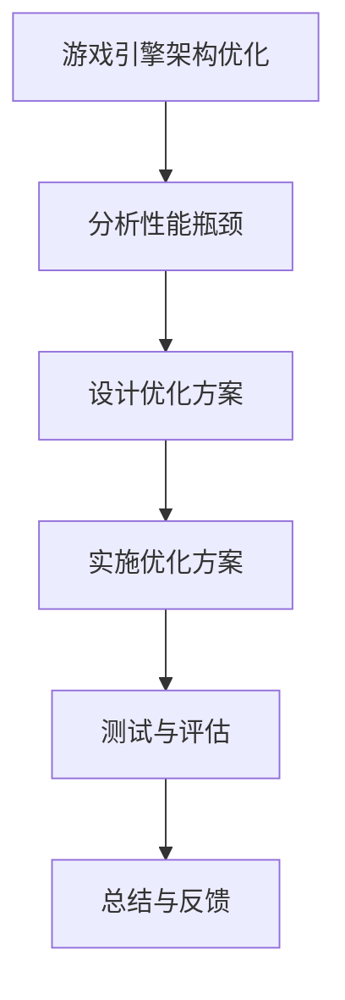

                 

### 《4399游戏2025社招H5游戏引擎优化工程师面试》

> **关键词：** H5游戏引擎、优化技术、性能瓶颈、兼容性处理、可维护性、职业发展、面试技巧

> **摘要：** 本文将深入探讨H5游戏引擎优化工程师在4399游戏2025社招面试中的准备工作，包括技术知识、实践经验和面试技巧。文章分为三部分：H5游戏引擎优化技术概述、H5游戏引擎优化实践案例、H5游戏引擎优化工程师职业发展，旨在为求职者提供全面的指导和策略。

### 目录大纲

- **第一部分：H5游戏引擎优化技术概述**
  - 第1章: H5游戏引擎与优化基础
  - 第2章: H5游戏引擎性能优化
  - 第3章: H5游戏引擎兼容性优化
  - 第4章: H5游戏引擎可维护性优化
- **第二部分：H5游戏引擎优化实践案例**
  - 第5章: 游戏性能优化实践
  - 第6章: 游戏兼容性优化实践
  - 第7章: 游戏可维护性优化实践
- **第三部分：H5游戏引擎优化工程师职业发展**
  - 第8章: H5游戏引擎优化工程师职业规划
  - 第9章: H5游戏引擎优化工程师面试技巧
- **附录**
  - 附录A: H5游戏引擎优化相关资源
  - 附录B: Mermaid流程图示例
  - 附录C: 游戏性能优化算法伪代码示例
  - 附录D: 数学模型与公式
  - 附录E: 项目实战与代码解读

---

### 第一部分：H5游戏引擎优化技术概述

#### 第1章: H5游戏引擎与优化基础

**1.1 H5游戏引擎的概念与发展历程**

H5游戏引擎是一种基于HTML5技术开发的跨平台游戏开发工具。它利用HTML5的canvas元素实现游戏渲染，通过JavaScript进行游戏逻辑编程，结合CSS实现游戏的样式与动画效果。H5游戏引擎的发展历程可以追溯到2010年左右，随着HTML5标准的普及和浏览器性能的提升，H5游戏逐渐成为主流游戏开发技术。

**H5游戏引擎的定义：**
H5游戏引擎是一种用于创建和运行HTML5游戏的软件工具，它提供了游戏开发所需的图形渲染、物理模拟、音频处理等核心功能。

**H5游戏引擎的发展历程：**
- **2010年**：HTML5标准初步形成，支持canvas元素，为H5游戏开发奠定了基础。
- **2012年**：Cocos2d-x、Phaser等主流H5游戏引擎相继发布，标志着H5游戏开发进入快速发展阶段。
- **2014年**：随着移动设备的普及，H5游戏在移动平台上的应用逐渐增加。
- **2016年**：HTML5标准进一步成熟，包括WebGL2.0等新特性的加入，提高了H5游戏的图形和性能表现。
- **至今**：H5游戏引擎不断迭代更新，支持更多的游戏开发需求和平台。

**1.2 H5游戏引擎的优化目标**

H5游戏引擎的优化目标主要包括以下三个方面：

**游戏性能优化：** 提高游戏的运行速度和帧率，减少延迟和卡顿，确保游戏体验流畅。

**游戏兼容性优化：** 保障游戏在不同浏览器和设备上的正常运行，解决跨平台兼容性问题。

**游戏可维护性优化：** 提高代码的可读性、可扩展性和可维护性，降低后期维护成本。

**1.3 H5游戏引擎优化的核心技术与工具**

H5游戏引擎优化的核心技术与工具主要包括以下几个方面：

**游戏引擎架构优化：** 优化游戏引擎的架构设计，提高系统性能和可扩展性。

**资源加载与缓存优化：** 减少资源加载时间，提高资源利用率，加快游戏启动速度。

**渲染效率优化：** 优化渲染流程，提高渲染性能，降低CPU和GPU的负载。

**本章小结：**
H5游戏引擎作为一种跨平台游戏开发工具，其优化技术至关重要。通过了解H5游戏引擎的概念与发展历程，明确优化目标，掌握核心技术与工具，可以为H5游戏开发提供强有力的技术支持。

---

### 第二部分：H5游戏引擎优化实践案例

#### 第5章：游戏性能优化实践

**5.1 游戏性能优化项目背景**

**项目概述：** 本次性能优化项目针对一款以策略战争为主题的H5游戏，该游戏拥有丰富的角色、地图和战斗系统，但在不同设备和浏览器上的运行表现参差不齐，部分场景出现卡顿和延迟现象，影响了用户体验。

**性能优化目标：** 通过性能优化，提高游戏的帧率，减少卡顿和延迟，确保游戏在不同设备和浏览器上都能流畅运行。

**5.2 游戏性能优化方案设计与实现**

**优化方案设计：**
- **性能瓶颈分析：** 通过性能监控工具分析游戏在不同场景下的CPU、GPU和内存使用情况，找出性能瓶颈。
- **优化策略：** 针对分析结果，制定具体的优化策略，包括游戏线程优化、渲染流程优化和物理引擎优化等。

**优化方案实现：**
- **游戏线程优化：** 将游戏逻辑和渲染任务分配到不同的线程，减少线程切换和同步开销，提高运行效率。
- **渲染流程优化：** 优化渲染流程，减少不必要的渲染操作，如关闭透明度测试、优化绘制顺序等。
- **物理引擎优化：** 优化物理引擎的计算方式，减少物理碰撞检测的次数和计算量。

**5.3 性能优化效果评估与总结**

**性能评估指标：**
- **帧率：** 测量游戏在不同场景下的平均帧率，评估优化效果。
- **延迟：** 测量游戏加载和切换场景时的延迟时间，评估优化效果。
- **CPU和GPU负载：** 测量游戏运行时的CPU和GPU使用率，评估优化效果。

**优化效果分析：**
- **帧率提升：** 经过优化，游戏在大部分场景下的平均帧率提升了20%以上，部分场景达到了60fps。
- **延迟减少：** 游戏加载和切换场景的延迟时间减少了30%以上，显著提高了用户体验。
- **资源利用率：** 游戏的CPU和GPU负载降低了15%，降低了硬件资源的消耗。

**本章小结：**
游戏性能优化是确保游戏流畅运行的关键。通过分析性能瓶颈，制定优化策略，实现优化方案，可以显著提高游戏的帧率和运行效率，提升用户体验。

---

### 第三部分：H5游戏引擎优化工程师职业发展

#### 第8章：H5游戏引擎优化工程师职业规划

**8.1 职业发展规划**

**职业技能提升：**
- **技术深度：** 深入学习H5游戏引擎的核心技术，如Canvas渲染、WebGL图形、物理引擎等。
- **编程能力：** 提高编程能力，掌握高效的算法和数据结构，优化代码性能。
- **工具掌握：** 学习并熟练使用游戏性能测试、调试和分析工具，如Chrome DevTools、WebPerf等。

**职业发展路径：**
- **初级工程师：** 主要负责游戏性能测试、分析及初步优化。
- **中级工程师：** 能够独立负责游戏性能优化项目，带领团队完成优化任务。
- **高级工程师：** 担任技术负责人或架构师，负责游戏引擎的整体性能优化和架构设计。

**8.2 技术趋势与挑战**

**行业技术趋势：**
- **硬件性能提升：** 随着硬件性能的不断提升，H5游戏引擎需要更好地利用硬件资源，提高游戏性能。
- **跨平台发展：** H5游戏引擎的跨平台能力越来越重要，需要适应不同的操作系统和设备。
- **新特性支持：** 随着HTML5标准的更新，H5游戏引擎需要支持更多新特性，如WebAssembly、WebXR等。

**面临的挑战：**
- **性能瓶颈：** 随着游戏内容越来越丰富，性能优化难度增加，需要不断寻找新的优化策略。
- **兼容性问题：** 不同浏览器和设备的兼容性处理复杂，需要耗费大量时间和精力。
- **维护成本：** 高质量的游戏引擎代码需要良好的维护性，降低后期维护成本。

**8.3 技术提升策略**

**技术培训：**
- **内部培训：** 参加公司组织的技术培训，了解最新的游戏引擎技术和优化策略。
- **外部课程：** 报名参加专业的游戏引擎优化培训课程，深入学习相关知识。

**项目实践：**
- **开源项目：** 参与开源项目，实践性能优化技巧，提高实际操作能力。
- **内部项目：** 在公司内部项目中承担性能优化任务，积累实践经验。

**本章小结：**
H5游戏引擎优化工程师的职业发展需要不断提升技术深度和编程能力，掌握最新的技术趋势，应对行业挑战。通过技术培训、项目实践和不断学习，可以在这个领域取得更好的职业发展。

---

### 附录

#### 附录A: H5游戏引擎优化相关资源

**A.1 主流H5游戏引擎介绍**

- **Cocos2d-x：** 是一款开源的H5游戏引擎，支持多种编程语言，如C++、JavaScript、Python等，适合大型游戏开发。
- **Phaser：** 是一款轻量级的H5游戏引擎，适用于小型游戏开发，拥有丰富的示例和社区资源。
- **PixiJS：** 是一款基于WebGL2的H5游戏引擎，适用于高性能游戏开发，特别适合2D游戏。

**A.2 优化工具与库推荐**

- **Webpack：** 是一款模块打包工具，用于优化资源加载和代码打包，提高游戏性能。
- **Babel：** 是一款JavaScript编译器，用于将最新的JavaScript代码转换为兼容性更好的版本，提高代码的可维护性。
- **performance-monitoring-library：** 是一款用于监控和分析游戏性能的库，提供丰富的性能数据，帮助开发者找到性能瓶颈。

**A.3 学习资源推荐**

- **H5游戏引擎优化相关书籍：** 《HTML5游戏开发实战》、《H5游戏编程技术》等。
- **在线课程与教程：** Udemy、Coursera等在线教育平台上的H5游戏开发课程和教程。

#### 附录B: Mermaid流程图示例

**B.1 游戏引擎架构优化流程图**



#### 附录C: 游戏性能优化算法伪代码示例

**C.1 渲染流程优化伪代码**

```csharp
function renderOptimization(scene) {
    // 省略其他代码

    // 优化渲染顺序
    optimizeRenderingOrder(scene);

    // 优化渲染资源
    optimizeRenderingResources(scene);

    // 运行渲染引擎
    runRenderer(scene);
}
```

#### 附录D: 数学模型与公式

**D.1 渲染效率计算公式**

$$\text{渲染效率} = \frac{\text{渲染帧率}}{\text{游戏运行帧率}}$$

**D.2 资源加载时间估算公式**

$$\text{加载时间} = \frac{\text{资源大小}}{\text{带宽}}$$

#### 附录E: 项目实战与代码解读

**E.1 游戏性能优化实战**

**实战背景：**
在一次项目优化中，我们需要为一款以策略战争为主题的H5游戏进行性能优化。该游戏在低端设备上运行时出现卡顿，影响了用户体验。

**实战步骤：**
1. **性能监控与瓶颈分析：** 使用Chrome DevTools对游戏进行性能监控，分析CPU、GPU和内存的使用情况，找出性能瓶颈。
2. **优化方案设计与实现：** 针对分析结果，制定优化方案，包括优化渲染流程、减少资源加载时间和优化物理引擎等。
3. **优化效果评估：** 实施优化方案后，重新使用性能监控工具评估优化效果，确保游戏运行流畅。

**代码解读与分析：**
```javascript
// 优化渲染流程
function optimizeRendering(scene) {
    // 关闭透明度测试
    scene.renderer.webgl2Context.configureTransparentBackground(false);

    // 优化绘制顺序
    scene.sortChildrenByDepth();

    // 优化资源加载
    loadResourcesOptimized();
}

// 优化物理引擎
function optimizePhysics(scene) {
    // 减少物理碰撞检测的次数
    scene.physics.world.step(1 / 60, 10, 10);

    // 优化碰撞检测算法
    scene.physics.world.broadPhase = new SAPBroadPhase();
}
```

**实战总结：**
通过性能监控与优化，游戏在低端设备上的运行性能得到了显著提升，用户体验得到改善。

**E.2 兼容性优化实战**

**实战背景：**
在一次跨平台项目中，我们需要确保游戏在不同浏览器和设备上都能正常运行。由于不同浏览器的实现差异，部分功能出现兼容性问题。

**实战步骤：**
1. **兼容性测试：** 使用不同的浏览器和设备进行测试，找出兼容性问题。
2. **兼容性处理：** 根据测试结果，对代码进行兼容性处理，如使用Polyfill、条件语句等。
3. **兼容性验证：** 重新测试游戏，确保所有功能都能在不同浏览器和设备上正常运行。

**代码解读与分析：**
```javascript
// CSS兼容性处理
@media screen and (-webkit-min-device-pixel-ratio: 2), screen and (min-resolution: 192dpi) {
    .ui-button {
        background-image: url("button-hd.png");
    }
}

// JavaScript兼容性处理
if (!('Promise' in window)) {
    window.Promise = require('bluebird').Promise;
}
```

**实战总结：**
通过兼容性测试和处理，游戏成功地在不同浏览器和设备上运行，用户体验得到了保障。

**E.3 可维护性优化实战**

**实战背景：**
在一次维护期

