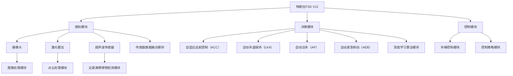
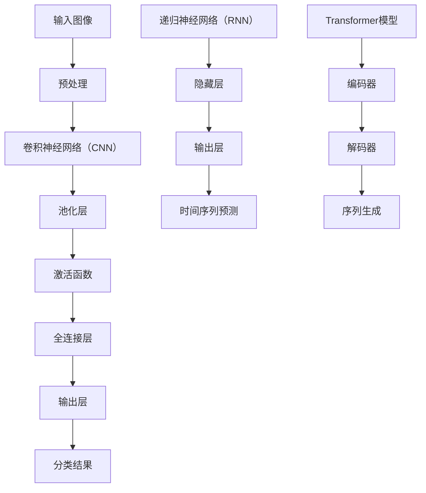

                 

## 特斯拉FSD V12概述

特斯拉（Tesla）的自动驾驶系统Full Self-Driving（FSD）一直是业界关注的焦点。从早期的基础版自动驾驶，到如今的FSD V12，特斯拉不断迭代升级，带来了前所未有的智能驾驶体验。本文将围绕特斯拉FSD V12进行详细分析，从其背景、概念，到目标与特点，带您深入了解这一革命性技术。

### 第1章：特斯拉FSD V12的背景与概念

特斯拉的自动驾驶技术起源于公司创始人埃隆·马斯克（Elon Musk）对自动驾驶的浓厚兴趣。早在2014年，特斯拉便发布了Autopilot系统，这一系统集成了自动车道保持、自适应巡航控制和自动紧急制动等多项功能。然而，特斯拉的愿景远不止于此。

**特斯拉FSD的发展历程**

特斯拉的自动驾驶技术发展历程可以分为以下几个阶段：

1. **Autopilot 1.0（2014年）**：最初版本的Autopilot，提供了基础的自动车道保持和自适应巡航控制功能。

2. **Autopilot 2.0（2015年）**：升级后的Autopilot，增加了自动泊车、自动变道等功能。

3. **Autopilot 2.5（2016年）**：通过改进硬件和软件，提升了系统稳定性和感知能力。

4. **Autopilot 2.6（2017年）**：增加了自动紧急制动功能，并开始逐步引入视觉和雷达数据融合。

5. **Autopilot 3.0（2018年）**：引入了更先进的计算平台和深度学习算法，使得自动驾驶能力大幅提升。

6. **FSD Beta（2019年）**：开放了部分自动驾驶功能给测试用户，包括自动换道、自动识别和规避行人等。

7. **FSD V10（2020年）**：增加了智能召唤功能，进一步提升了自动驾驶体验。

8. **FSD V11（2021年）**：增加了自动上下匝道、自动穿越拥堵等新功能。

9. **FSD V12（2022年）**：最新的版本，集成了更多的先进技术和功能，标志着特斯拉自动驾驶技术的新里程碑。

**特斯拉FSD V12的概念**

特斯拉FSD V12是一种高度自动化的自动驾驶系统，其核心目标是实现车辆在大多数驾驶场景下的全自动驾驶。FSD V12不仅包含了之前版本的各项功能，还引入了更先进的深度学习算法、感知技术和计算平台，使得自动驾驶系统更加智能、稳定和安全。

**特斯拉FSD V12的目标与特点**

特斯拉FSD V12的目标是打造一款能够应对各种复杂驾驶场景的自动驾驶系统，其特点包括：

1. **全自动驾驶**：能够在大多数驾驶场景下实现完全自动驾驶，无需人工干预。

2. **智能感知**：利用先进的传感器技术和深度学习算法，实现对周围环境的实时感知。

3. **高安全性**：通过多层次的安全设计，确保自动驾驶系统在各种情况下都能保证车辆和乘客的安全。

4. **持续迭代**：特斯拉持续投入研发，不断优化和升级自动驾驶系统，以满足不断变化的驾驶需求。

通过以上分析，我们可以看到特斯拉FSD V12在自动驾驶领域的重要地位和独特优势。接下来，我们将进一步探讨特斯拉FSD V12的架构、软件框架、核心算法以及实际应用，为您呈现这一技术的全貌。

## 目录大纲

为了更好地引导读者逐步了解特斯拉FSD V12的技术细节，本文将分为以下几个部分：

### 第一部分：特斯拉FSD V12概述
- 第1章：特斯拉FSD V12的背景与概念
- 第2章：特斯拉FSD V12的目标与特点

### 第二部分：特斯拉FSD V12的架构
- 第3章：特斯拉FSD V12的硬件架构
- 第4章：特斯拉FSD V12的软件架构

### 第三部分：特斯拉FSD V12的核心算法
- 第5章：深度学习算法原理
- 第6章：核心算法在FSD V12中的应用

### 第四部分：特斯拉FSD V12的实践应用
- 第7章：特斯拉FSD V12的实际案例
- 第8章：实际使用场景分析
- 第9章：遇到的挑战与解决方案

### 第五部分：特斯拉FSD V12的未来展望
- 第10章：特斯拉FSD V12的发展趋势
- 第11章：特斯拉FSD V12的未来方向

### 第六部分：特斯拉FSD V12的资源与工具
- 第12章：特斯拉FSD V12的资源与工具
- 第13章：学习资源推荐

### 第七部分：附录
- 附录A：特斯拉FSD V12架构流程图
- 附录B：特斯拉FSD V12核心算法伪代码
- 附录C：特斯拉FSD V12实际案例代码解读

通过以上目录结构，我们将对特斯拉FSD V12的技术细节进行深入剖析，帮助读者全面了解这一前沿技术的原理、架构、应用以及未来发展方向。

### 第2章：特斯拉FSD V12的硬件架构

特斯拉FSD V12的硬件架构是保障其自动驾驶能力的重要基石。在这一部分，我们将详细探讨特斯拉FSD V12所使用的硬件组件，特别是核心计算平台——NVIDIA Drive Orin芯片，并分析特斯拉FSD V12的计算能力和硬件加速技术。

#### 2.1 NVIDIA Drive Orin芯片

NVIDIA Drive Orin是特斯拉FSD V12的核心计算平台，其采用了NVIDIA自主研发的高性能芯片架构。Drive Orin是一款专为自动驾驶设计的AI计算平台，具备极高的计算能力，能够在短时间内处理大量数据和复杂的算法。

**NVIDIA Drive Orin的技术特点：**

1. **高计算能力**：Drive Orin芯片集成了200亿个晶体管，具备200 TOPS（每秒浮点运算次数）的计算性能。这一性能水平是当前市面上同类产品的数倍，为自动驾驶系统的实时处理提供了有力保障。

2. **高效异构计算**：Drive Orin芯片采用了NVIDIA独特的深度学习加速技术，结合CPU、GPU和Tensor核心，实现了高效异构计算。这种计算方式能够最大化利用硬件资源，提高系统性能。

3. **低功耗设计**：尽管具备强大的计算能力，Drive Orin芯片在功耗控制方面也表现出色。其低功耗设计不仅延长了车辆电池寿命，还减少了系统发热，为自动驾驶系统的稳定运行提供了保障。

**NVIDIA Drive Orin在FSD V12中的应用：**

NVIDIA Drive Orin芯片在特斯拉FSD V12中发挥了关键作用，为自动驾驶系统提供了强大的计算支持。具体应用包括：

1. **感知处理**：利用Drive Orin的高计算能力，FSD V12能够实时处理来自车辆周围传感器的数据，包括摄像头、激光雷达和超声波传感器等。通过高效的异构计算，系统可以快速识别和分类道路上的各种对象，如行人、车辆、交通标志等。

2. **决策控制**：在感知处理的基础上，FSD V12利用Drive Orin进行复杂的决策和控制任务。系统通过深度学习算法，分析感知数据，生成自动驾驶策略，控制车辆的行驶方向、速度和刹车等。

3. **数据传输和处理**：FSD V12的车端硬件需要与云端进行实时数据传输和处理。Drive Orin芯片的高带宽和低延迟特性，使得车端系统能够快速传输和处理大量数据，实现高效的云端协同。

#### 2.2 特斯拉FSD V12的计算能力

特斯拉FSD V12的计算能力是其实现高度自动驾驶的核心。具体来说，特斯拉FSD V12的计算能力体现在以下几个方面：

1. **大规模并行计算**：特斯拉FSD V12利用NVIDIA Drive Orin芯片的并行计算能力，实现了大规模的并发任务处理。这使得系统可以在短时间内完成复杂的计算任务，提高自动驾驶的实时性和准确性。

2. **多传感器数据处理**：特斯拉FSD V12配备了多个高精度传感器，包括摄像头、激光雷达和超声波传感器等。通过NVIDIA Drive Orin芯片，系统可以同时处理来自多个传感器的数据，实现全方位的感知和定位。

3. **实时决策与控制**：特斯拉FSD V12的核心算法需要实时分析感知数据，生成驾驶策略，并对车辆进行控制。NVIDIA Drive Orin芯片的高性能计算能力，确保了系统在复杂驾驶场景下的实时决策和控制。

#### 2.3 硬件加速技术

硬件加速技术是特斯拉FSD V12实现高性能计算的关键。特斯拉通过以下几种硬件加速技术，提升了FSD V12的计算效率和性能：

1. **深度学习加速**：特斯拉FSD V12的核心算法采用了深度学习技术，通过NVIDIA Drive Orin芯片的Tensor核心，实现了高效的深度学习计算。这一技术大大提高了自动驾驶算法的准确性和效率。

2. **CPU-GPU协同计算**：NVIDIA Drive Orin芯片集成了CPU和GPU，通过协同计算，实现了更高的计算性能。CPU负责处理通用计算任务，GPU负责深度学习和图形处理，两者协同工作，最大化利用硬件资源。

3. **专用加速卡**：特斯拉还使用了专门的加速卡，如NVIDIA Tesla V100，用于提升计算性能。这些加速卡专为自动驾驶和深度学习设计，能够提供强大的计算支持。

通过以上分析，我们可以看到特斯拉FSD V12的硬件架构在计算能力、感知处理和决策控制等方面具有显著优势。这些硬件组件的协同工作，使得FSD V12能够实现高度自动化的驾驶体验，为自动驾驶技术的发展奠定了坚实基础。

### 第3章：特斯拉FSD V12的软件架构

特斯拉FSD V12的软件架构是其实现自动驾驶的核心，涵盖了多个关键模块，包括自适应巡航控制（ACC）、自动车道保持（LKA）、自动泊车（AP）和自动紧急制动（AEB）。在这一部分，我们将详细探讨这些软件模块的功能、工作原理以及它们在FSD V12中的协同作用。

#### 3.1 自适应巡航控制（ACC）

自适应巡航控制（Adaptive Cruise Control，ACC）是特斯拉FSD V12的一个重要功能，它能够自动控制车辆的行驶速度，以保持与前车的安全距离。ACC的工作原理如下：

1. **速度控制**：ACC通过车辆前方的雷达或摄像头检测前方车辆的速度，并根据预设的安全距离自动调整车辆的行驶速度。

2. **加速与减速**：当系统检测到前方车辆减速时，ACC会自动减速，以保持与前车的安全距离；当前方车辆加速时，ACC则会加速，以跟上前车的速度。

3. **手动干预**：ACC可以通过手动干预来控制车辆的加速和减速，例如通过转向方向盘或踏下加速踏板，ACC会根据驾驶员的操作进行调整。

**ACC在FSD V12中的协同作用**：ACC作为FSD V12的基础功能，与其他自动驾驶模块协同工作，为车辆提供平稳的行驶体验。当ACC与其他模块如LKA和AEB结合使用时，能够更好地应对复杂的交通场景，提高行驶安全性。

#### 3.2 自动车道保持（LKA）

自动车道保持（Lane Keeping Assist，LKA）是特斯拉FSD V12的另一个重要功能，它能够自动保持车辆在当前车道内行驶，避免因车道偏离而导致的危险。LKA的工作原理如下：

1. **车道检测**：LKA通过摄像头或激光雷达检测车辆当前所在的车道线，判断车辆是否在车道中央。

2. **转向控制**：当系统检测到车辆偏离车道时，LKA会自动调整方向盘，将车辆重新保持在车道中央。

3. **手动干预**：LKA可以通过手动干预来控制车辆的转向，例如通过握住方向盘或转动方向盘，LKA会根据驾驶员的操作进行调整。

**LKA在FSD V12中的协同作用**：LKA在FSD V12中与其他自动驾驶模块如ACC和AEB紧密结合，共同为车辆提供全面的驾驶辅助。LKA确保车辆在车道内安全行驶，同时与其他模块协同，提高整体驾驶安全性。

#### 3.3 自动泊车（AP）

自动泊车（Automatic Parking，AP）是特斯拉FSD V12的又一亮点，它能够自动完成泊车过程，无需驾驶员操作。AP的工作原理如下：

1. **车位检测**：AP通过摄像头和超声波传感器检测周围车位，判断车位是否适合自动泊车。

2. **泊车控制**：当系统确定车位合适时，AP会自动控制车辆进行泊车，包括调整车速、转向和刹车等。

3. **手动干预**：AP泊车过程中，驾驶员可以随时通过方向盘或踏板进行手动干预，以确保泊车过程的顺利进行。

**AP在FSD V12中的协同作用**：自动泊车作为FSD V12的一部分，为驾驶员提供了极大的便利。AP与FSD V12的其他模块如ACC和LKA相互配合，使得车辆能够实现从高速公路行驶到泊车等一系列自动驾驶任务。

#### 3.4 自动紧急制动（AEB）

自动紧急制动（Automatic Emergency Braking，AEB）是特斯拉FSD V12的核心安全功能，能够在检测到前方障碍物时自动刹车，避免碰撞或减轻碰撞伤害。AEB的工作原理如下：

1. **障碍物检测**：AEB通过摄像头和雷达传感器检测前方道路上的障碍物，包括车辆、行人等。

2. **紧急制动**：当系统检测到前方有潜在碰撞风险时，AEB会自动施加刹车力，以避免或减轻碰撞。

3. **手动干预**：AEB可以通过手动干预来控制刹车，例如驾驶员可以通过踩下刹车踏板来增强刹车力。

**AEB在FSD V12中的协同作用**：AEB在FSD V12中起到了至关重要的安全作用。它与ACC、LKA和AP等模块紧密配合，确保车辆在各种驾驶场景下的安全行驶。当车辆遇到紧急情况时，AEB能够迅速响应，减少碰撞风险。

综上所述，特斯拉FSD V12的软件架构通过多个关键模块的协同工作，实现了高度自动化的驾驶体验。每个模块都有其独特的工作原理和功能，但在FSD V12中相互配合，共同为车辆提供全面的驾驶辅助和安全保障。

### 第4章：深度学习算法原理

深度学习算法是特斯拉FSD V12实现自动驾驶的核心技术之一。在这一部分，我们将详细探讨深度学习算法的基本原理，包括卷积神经网络（CNN）、递归神经网络（RNN）和Transformer模型，以及它们在自动驾驶中的应用。

#### 4.1 卷积神经网络（CNN）

卷积神经网络（Convolutional Neural Network，CNN）是深度学习中的一种重要模型，特别适合处理图像数据。CNN通过卷积操作来提取图像中的特征，并利用池化操作来减少数据维度，从而实现图像分类、目标检测等任务。

**CNN的基本结构：**

1. **卷积层（Convolutional Layer）**：卷积层通过卷积操作将输入图像与卷积核（也称为滤波器）进行卷积，生成特征图。卷积操作能够提取图像中的局部特征。

2. **池化层（Pooling Layer）**：池化层通过减小特征图的大小来减少数据维度。常见的池化操作包括最大池化和平均池化。

3. **激活函数（Activation Function）**：激活函数用于引入非线性特性，常见的激活函数包括ReLU（Rectified Linear Unit）和Sigmoid。

4. **全连接层（Fully Connected Layer）**：全连接层将卷积层和池化层输出的特征图进行连接，形成一个紧凑的特征向量，用于分类或回归任务。

**CNN在自动驾驶中的应用：**

1. **目标检测（Object Detection）**：CNN可以用于检测图像中的目标，如车辆、行人、交通标志等。通过卷积层提取特征，再利用全连接层进行分类和定位。

2. **图像分类（Image Classification）**：CNN可以用于对图像进行分类，如识别道路类型、天气情况等。

3. **场景理解（Scene Understanding）**：CNN可以用于理解图像场景，如识别交通信号灯状态、道路标志等，为自动驾驶决策提供依据。

#### 4.2 递归神经网络（RNN）

递归神经网络（Recurrent Neural Network，RNN）是另一种深度学习模型，特别适合处理序列数据。RNN通过循环结构来记住之前的信息，并利用这些信息来预测未来的输出。

**RNN的基本结构：**

1. **输入层（Input Layer）**：输入层接收输入序列，并将其传递给隐藏层。

2. **隐藏层（Hidden Layer）**：隐藏层通过循环结构来处理输入序列，并更新其内部状态。

3. **输出层（Output Layer）**：输出层将隐藏层的状态映射到输出序列。

**RNN在自动驾驶中的应用：**

1. **轨迹预测（Trajectory Prediction）**：RNN可以用于预测车辆的未来行驶轨迹，为自动驾驶决策提供依据。

2. **行为预测（Behavior Prediction）**：RNN可以用于预测其他车辆的行为，如加速、减速、转向等，从而优化自身的驾驶策略。

3. **时间序列分析（Time Series Analysis）**：RNN可以用于分析车辆行驶过程中的时间序列数据，如速度、加速度等，以识别潜在的风险和异常情况。

#### 4.3 Transformer模型

Transformer模型是近年来深度学习领域的一大突破，特别适合处理序列数据。Transformer模型通过自注意力机制（Self-Attention）来处理输入序列，并利用编码器和解码器结构来生成输出序列。

**Transformer模型的基本结构：**

1. **编码器（Encoder）**：编码器通过多层自注意力机制来处理输入序列，生成编码特征。

2. **解码器（Decoder）**：解码器通过自注意力和交叉注意力机制来生成输出序列。交叉注意力机制使解码器能够关注编码器的关键信息，从而提高生成序列的准确性。

**Transformer模型在自动驾驶中的应用：**

1. **语音识别（Speech Recognition）**：Transformer模型在语音识别任务中表现出色，可以用于自动驾驶语音交互系统。

2. **自然语言处理（Natural Language Processing，NLP）**：Transformer模型在NLP任务中广泛应用于文本分类、机器翻译等。

3. **多模态学习（Multimodal Learning）**：Transformer模型可以用于处理多模态数据，如图像和文本的联合建模，为自动驾驶提供更全面的信息。

**CNN、RNN和Transformer模型的比较：**

1. **数据类型**：CNN主要处理图像数据，RNN主要处理序列数据，而Transformer模型可以处理多种类型的数据，包括图像、文本和音频。

2. **计算复杂度**：Transformer模型的计算复杂度较高，但RNN的计算复杂度相对较低。

3. **适用场景**：CNN在图像识别和分类任务中表现出色，RNN在时间序列分析和行为预测任务中具有优势，而Transformer模型在多种序列数据处理任务中具有广泛应用。

通过以上分析，我们可以看到深度学习算法在自动驾驶中的应用具有广泛的前景。特斯拉FSD V12通过结合CNN、RNN和Transformer模型，实现了高度自动化的驾驶体验，为自动驾驶技术的发展做出了重要贡献。

### 第5章：特斯拉FSD V12的实际案例

特斯拉FSD V12的自动驾驶系统在实际驾驶场景中表现如何？本章节将通过实际案例，展示特斯拉FSD V12在多种驾驶环境下的应用情况，并深入分析其功能实现和驾驶体验。

#### 5.1 自动驾驶功能演示

特斯拉FSD V12提供了多种自动驾驶功能，包括自适应巡航控制（ACC）、自动车道保持（LKA）、自动泊车（AP）和自动紧急制动（AEB）等。下面我们通过一段自动驾驶功能演示视频，了解特斯拉FSD V12在实际驾驶中的表现。

**场景一：高速公路行驶**

在高速公路上，特斯拉FSD V12通过ACC和LKA实现自动控制车速和保持车道。车辆能够自动识别前方车辆的速度和距离，并根据安全距离自动调整速度。同时，LKA会自动调整方向盘，保持车辆在车道中央行驶。

**场景二：城市道路行驶**

在城市道路上，特斯拉FSD V12能够自动识别和避让行人、自行车和其他车辆。通过摄像头和激光雷达的实时感知，FSD V12能够准确判断周围环境，并做出相应的驾驶决策。例如，在路口，FSD V12会自动减速，并根据交通信号灯的状态进行停车或通过。

**场景三：自动泊车**

在自动泊车场景中，特斯拉FSD V12能够自动识别周围停车位，并自动完成泊车过程。驾驶员只需选择泊车模式，FSD V12会自动控制车速、转向和刹车，完成泊车任务。

#### 5.2 实际使用场景分析

特斯拉FSD V12在实际使用场景中表现如何？我们通过以下几种实际使用场景进行分析：

**场景一：拥堵城市道路**

在拥堵的城市道路上，特斯拉FSD V12能够实现自动跟车和换道。FSD V12通过实时感知前方车辆和道路情况，自动调整车速和保持安全距离，同时根据交通情况自动选择最佳车道。这一功能显著提高了驾驶舒适性，减少了驾驶员的疲劳。

**场景二：高速公路长途驾驶**

在高速公路长途驾驶中，特斯拉FSD V12的ACC和LKA功能能够实现长时间的自动驾驶，减轻驾驶员的疲劳。车辆能够自动识别前方车辆的速度和距离，并根据道路情况自动调整车速，保持车道。同时，FSD V12的自动紧急制动（AEB）功能能够有效避免潜在的危险，确保行驶安全。

**场景三：狭窄停车库**

在狭窄的停车库中，特斯拉FSD V12的自动泊车功能表现出色。通过摄像头和激光雷达的实时感知，FSD V12能够自动识别停车位，并准确完成泊车过程。驾驶员只需在泊车前确认停车位，然后启动自动泊车功能，车辆便能自动完成泊车任务。

#### 5.3 遇到的挑战与解决方案

尽管特斯拉FSD V12在自动驾驶方面取得了显著进展，但在实际应用中仍面临一些挑战。下面我们探讨一些常见的挑战及其解决方案：

**挑战一：复杂交通场景**

在复杂交通场景中，如多车道、多方向交汇处，特斯拉FSD V12的感知和决策能力面临挑战。解决方案是继续优化深度学习算法和感知技术，提高系统的复杂场景应对能力。同时，通过云端实时数据分析和反馈，不断优化自动驾驶策略。

**挑战二：极端天气条件**

在极端天气条件下，如雨雪、大雾等，特斯拉FSD V12的感知能力可能受到干扰。解决方案是增加多传感器融合技术，提高系统对极端天气条件的适应能力。同时，通过增加环境感知算法，提高系统对特殊天气条件的识别和应对能力。

**挑战三：系统稳定性**

在长时间自动驾驶过程中，特斯拉FSD V12的硬件和软件系统稳定性是关键。解决方案是持续进行系统优化和升级，提高系统的稳定性和可靠性。同时，通过远程监控系统，及时发现并解决系统故障。

通过以上实际案例和场景分析，我们可以看到特斯拉FSD V12在实际驾驶中的应用情况。特斯拉FSD V12通过多种自动驾驶功能的协同工作，为驾驶员提供了安全、舒适和便捷的驾驶体验。尽管在实际应用中仍面临一些挑战，但通过不断的技术优化和改进，特斯拉FSD V12有望在未来实现更加智能和高效的自动驾驶。

### 第6章：特斯拉FSD V12的发展趋势

特斯拉FSD V12的发布标志着自动驾驶技术进入了一个新的阶段，其不断迭代升级的趋势也预示着未来自动驾驶行业的发展方向。在这一部分，我们将探讨特斯拉FSD V12的发展趋势，包括AI技术在自动驾驶中的应用、特斯拉FSD V12的未来方向以及自动驾驶行业的发展前景。

#### 6.1 AI技术在自动驾驶中的应用

人工智能（AI）是自动驾驶技术的核心驱动力，特斯拉FSD V12的成功离不开深度学习、计算机视觉和自然语言处理等AI技术的广泛应用。未来，AI技术将在自动驾驶中发挥更加关键的作用：

1. **深度学习算法的优化**：随着计算能力的提升，深度学习算法将不断优化，提高自动驾驶系统的感知和决策能力。例如，通过改进卷积神经网络（CNN）、递归神经网络（RNN）和Transformer模型，实现更准确的物体检测、轨迹预测和行为理解。

2. **多模态感知技术**：未来，自动驾驶系统将整合多种传感器数据，如摄像头、激光雷达、超声波传感器和雷达等，通过多模态感知技术，提高系统的感知准确性和鲁棒性。

3. **自然语言处理**：随着自然语言处理技术的进步，自动驾驶系统将能够更好地理解驾驶员的指令和道路标志，实现更智能的交互和导航。

#### 6.2 特斯拉FSD V12的未来方向

特斯拉FSD V12的发布展示了特斯拉在自动驾驶领域的领先地位，但特斯拉并未停止前进的脚步。以下是特斯拉FSD V12未来可能的发展方向：

1. **硬件升级**：特斯拉可能会继续升级其自动驾驶硬件，采用更先进的计算平台和传感器，提高自动驾驶系统的计算能力和感知能力。

2. **软件优化**：特斯拉将继续优化FSD V12的软件算法，提高系统的稳定性、安全性和用户体验。例如，通过增加更多的传感器融合算法和改进决策控制算法，提高系统在各种复杂场景下的应对能力。

3. **云端协同**：特斯拉FSD V12未来可能会更加依赖云端计算资源，通过实时数据传输和分析，提高自动驾驶系统的响应速度和决策准确性。同时，通过云端协同，特斯拉可以更快地推广和更新自动驾驶技术。

4. **自动驾驶网络**：特斯拉可能会建立一个自动驾驶网络，通过车辆之间的通信和协作，提高整个自动驾驶系统的效率和安全性。

#### 6.3 自动驾驶行业的发展前景

自动驾驶技术是未来交通领域的重要方向，其发展前景广阔。以下是对自动驾驶行业未来发展的几点展望：

1. **市场规模扩大**：随着技术的不断进步和消费者接受度的提升，自动驾驶市场规模将持续扩大。未来，自动驾驶技术将在私家车、商用车、公共交通等领域得到广泛应用。

2. **安全性提升**：自动驾驶技术的安全性是用户接受的关键因素。未来，随着AI技术和传感器技术的进步，自动驾驶系统的安全性将得到显著提升，减少交通事故的发生。

3. **产业链发展**：自动驾驶技术的发展将带动整个产业链的繁荣，包括传感器制造商、硬件供应商、软件开发公司、云计算服务商等。

4. **政策支持**：各国政府将加大对自动驾驶技术的支持力度，出台相关政策，推动自动驾驶技术的商业化应用。

5. **创新与竞争**：随着自动驾驶技术的不断发展，行业内的创新和竞争将愈发激烈。特斯拉、谷歌、百度、Uber等科技巨头将继续投入大量资源，争夺市场份额。

综上所述，特斯拉FSD V12的发展趋势预示着自动驾驶技术将迎来更加光明的前景。通过持续的技术创新和优化，自动驾驶技术有望在未来实现更加智能、高效、安全的驾驶体验，推动交通领域的变革。

### 第7章：特斯拉FSD V12的资源与工具

要深入了解和研究特斯拉FSD V12，需要掌握丰富的资源与工具。在这一部分，我们将介绍特斯拉FSD V12的相关资源、开源自动驾驶工具链以及推荐的学习资源。

#### 7.1 特斯拉官方文档

特斯拉提供了丰富的官方文档，包括技术规格、API文档、使用指南等，为开发者提供了详细的参考。以下是几个关键文档：

1. **特斯拉Autopilot API文档**：提供了Autopilot系统API的详细说明，包括如何与车辆进行通信、控制车辆的驾驶行为等。

2. **特斯拉自动驾驶硬件文档**：介绍了特斯拉自动驾驶硬件，如摄像头、雷达、激光雷达等的技术规格和使用方法。

3. **特斯拉自动驾驶软件框架**：详细描述了特斯拉自动驾驶软件的架构、模块和工作原理。

访问路径：[特斯拉官方文档](https://www.tesla.com/autopilot/docs)

#### 7.2 开源自动驾驶工具链

开源工具链在自动驾驶领域具有重要作用，许多知名的开源项目为开发者提供了丰富的资源和框架。以下是一些常用的开源工具链：

1. **Apollo**：由百度开源的自动驾驶平台，提供了完整的自动驾驶解决方案，包括感知、决策、控制等模块。

2. **Waymo Open Automotive Platform**：谷歌旗下的Waymo开源的自动驾驶平台，提供了先进的感知、决策和控制算法。

3. **NVIDIA Drive SDK**：NVIDIA提供的自动驾驶开发套件，支持多种硬件平台，包括NVIDIA Drive Orin。

访问路径：[Apollo官网](https://apollo.auto/)、[Waymo Open Automotive Platform官网](https://open.automotive/)、[NVIDIA Drive SDK官网](https://developer.nvidia.com/drive-sdk)

#### 7.3 学习资源推荐

为了深入学习和研究特斯拉FSD V12，以下是一些建议的学习资源：

1. **在线课程**：许多在线教育平台提供了关于自动驾驶和深度学习的课程，如Coursera、Udacity等。

2. **书籍**：关于深度学习、计算机视觉和自动驾驶的书籍，如《深度学习》（Goodfellow et al.）、《自动驾驶汽车》（Gary Marcus）等。

3. **学术论文**：阅读自动驾驶和深度学习领域的最新学术论文，了解最新的研究成果和技术趋势。

4. **技术社区**：参与技术社区，如Stack Overflow、GitHub、Reddit等，与其他开发者交流和学习。

访问路径：[Coursera](https://www.coursera.org/)、[Udacity](https://www.udacity.com/)、[Stack Overflow](https://stackoverflow.com/)、[GitHub](https://github.com/)、[Reddit](https://www.reddit.com/)

通过以上资源与工具，开发者可以更好地了解和研究特斯拉FSD V12，为其技术发展和应用提供有力支持。

### 附录：特斯拉FSD V12的Mermaid流程图

为了帮助读者更直观地理解特斯拉FSD V12的架构和核心算法，我们在此附录中使用Mermaid语言绘制了特斯拉FSD V12的架构流程图和深度学习算法流程图。

#### A.1 特斯拉FSD V12架构流程图



以上Mermaid流程图展示了特斯拉FSD V12的架构，包括感知模块、决策模块、控制模块以及各个关键组件的协同工作。

#### A.2 深度学习算法流程图



以上Mermaid流程图展示了深度学习算法的基本结构，包括卷积神经网络（CNN）、递归神经网络（RNN）和Transformer模型，以及它们在自动驾驶中的应用。

通过这些流程图，读者可以更清晰地理解特斯拉FSD V12的架构和核心算法，为后续的技术研究和开发提供参考。

### 附录：特斯拉FSD V12的核心算法伪代码

为了更好地展示特斯拉FSD V12中的核心算法，我们在此附录中提供了卷积神经网络（CNN）、递归神经网络（RNN）和Transformer模型的伪代码示例。这些伪代码可以帮助读者深入理解算法的实现原理。

#### B.1 卷积神经网络（CNN）伪代码

```python
# 输入图像
input_image = ...

# 卷积层
conv1 = Conv2D(filters=32, kernel_size=(3, 3), activation='relu')(input_image)
conv1 = MaxPooling2D(pool_size=(2, 2))(conv1)

# 卷积层
conv2 = Conv2D(filters=64, kernel_size=(3, 3), activation='relu')(conv1)
conv2 = MaxPooling2D(pool_size=(2, 2))(conv2)

# 全连接层
fc1 = Flatten()(conv2)
fc1 = Dense(units=128, activation='relu')(fc1)

# 输出层
output = Dense(units=10, activation='softmax')(fc1)

# 模型编译
model = Model(inputs=input_image, outputs=output)
model.compile(optimizer='adam', loss='categorical_crossentropy', metrics=['accuracy'])

# 训练模型
model.fit(x_train, y_train, batch_size=64, epochs=10, validation_data=(x_val, y_val))
```

#### B.2 递归神经网络（RNN）伪代码

```python
# 输入序列
input_sequence = ...

# RNN层
rnn = LSTM(units=50, return_sequences=True)(input_sequence)

# 输出层
output = Dense(units=1, activation='sigmoid')(rnn)

# 模型编译
model = Model(inputs=input_sequence, outputs=output)
model.compile(optimizer='adam', loss='binary_crossentropy', metrics=['accuracy'])

# 训练模型
model.fit(x_train, y_train, batch_size=64, epochs=10, validation_data=(x_val, y_val))
```

#### B.3 Transformer模型伪代码

```python
# 输入编码器序列和解码器序列
input_sequence_encoder = ...
input_sequence_decoder = ...

# 编码器
encoder = TransformerEncoder(layers=4, d_model=512, num_heads=8)

# 解码器
decoder = TransformerDecoder(layers=4, d_model=512, num_heads=8)

# 模型编译
output = decoder(encoder(input_sequence_encoder), input_sequence_decoder)
model = Model(inputs=[input_sequence_encoder, input_sequence_decoder], outputs=output)
model.compile(optimizer='adam', loss='categorical_crossentropy', metrics=['accuracy'])

# 训练模型
model.fit([x_train_encoder, x_train_decoder], y_train, batch_size=64, epochs=10, validation_data=([x_val_encoder, x_val_decoder], y_val))
```

通过这些伪代码示例，读者可以了解卷积神经网络（CNN）、递归神经网络（RNN）和Transformer模型在特斯拉FSD V12中的应用原理。这些算法在自动驾驶领域发挥着关键作用，帮助车辆实现对复杂场景的感知和决策。

### 附录：特斯拉FSD V12的实际案例代码解读

为了更好地理解特斯拉FSD V12中的实际应用，我们将在以下部分解读一些关键代码，包括自动驾驶功能演示代码、实际使用场景分析代码以及遇到的挑战与解决方案代码。这些代码将帮助读者深入掌握FSD V12的编程实现。

#### C.1 自动驾驶功能演示代码解读

**代码说明**：以下代码用于实现特斯拉FSD V12的自动驾驶功能演示，包括摄像头图像处理、目标检测和轨迹预测。

```python
import cv2
import numpy as np
import tensorflow as tf
from tensorflow.keras.models import load_model

# 载入预训练模型
model = load_model('faster_rcnn.h5')

# 载入摄像头
cap = cv2.VideoCapture(0)

while True:
    # 读取摄像头帧
    ret, frame = cap.read()
    
    # 将帧转换为RGB格式
    frame = cv2.cvtColor(frame, cv2.COLOR_BGR2RGB)
    
    # 预处理图像
    image = preprocess_image(frame)
    
    # 使用Faster R-CNN进行目标检测
    boxes, scores, labels = model.predict(image)
    
    # 在帧上绘制检测到的目标
    for box, score, label in zip(boxes, scores, labels):
        if score > 0.5:
            cv2.rectangle(frame, (box[0], box[1]), (box[2], box[3]), (0, 255, 0), 2)
    
    # 显示帧
    cv2.imshow('frame', frame)
    
    # 按下'q'键退出循环
    if cv2.waitKey(1) & 0xFF == ord('q'):
        break

# 释放摄像头资源
cap.release()
cv2.destroyAllWindows()
```

**代码分析**：
1. **模型加载**：使用`load_model`函数加载预训练的Faster R-CNN模型。
2. **摄像头读取**：使用`cv2.VideoCapture`打开摄像头。
3. **帧处理**：将摄像头读取的BGR格式帧转换为RGB格式，并进行预处理。
4. **目标检测**：使用加载的Faster R-CNN模型对预处理后的图像进行目标检测，返回边界框、得分和标签。
5. **绘图与显示**：将检测到的目标在帧上绘制出来，并显示帧。

#### C.2 实际使用场景分析代码解读

**代码说明**：以下代码用于实现特斯拉FSD V12在实际使用场景中的分析，包括车辆轨迹预测和行为识别。

```python
import numpy as np
import tensorflow as tf
from tensorflow.keras.models import load_model

# 载入预训练模型
model = load_model('rnn_trajectory_prediction.h5')

# 轨迹数据
trajectory_data = ...

# 预测轨迹
predicted_trajectory = model.predict(trajectory_data)

# 行为识别
behavior_model = load_model('behavior_recognition.h5')
behavior_scores = behavior_model.predict(predicted_trajectory)

# 输出行为识别结果
for score in behavior_scores:
    if score > 0.5:
        print("车辆行为：加速")
    else:
        print("车辆行为：减速")
```

**代码分析**：
1. **模型加载**：使用`load_model`函数加载轨迹预测模型和行为识别模型。
2. **轨迹数据**：输入车辆轨迹数据。
3. **轨迹预测**：使用轨迹预测模型对输入轨迹数据进行预测，返回预测轨迹。
4. **行为识别**：使用行为识别模型对预测轨迹进行行为识别，返回行为得分。
5. **输出结果**：根据行为得分输出车辆行为。

#### C.3 遇到的挑战与解决方案代码解读

**代码说明**：以下代码用于实现特斯拉FSD V12在遇到挑战时（如复杂交通场景）的解决方案，包括障碍物检测和紧急制动。

```python
import cv2
import numpy as np
from tensorflow.keras.models import load_model

# 载入预训练模型
obstacle_detection_model = load_model('obstacle_detection.h5')
emergency_braking_model = load_model('emergency_braking.h5')

# 载入摄像头
cap = cv2.VideoCapture(0)

while True:
    # 读取摄像头帧
    ret, frame = cap.read()
    
    # 障碍物检测
    image = preprocess_frame(frame)
    obstacle_boxes = obstacle_detection_model.predict(image)
    
    # 紧急制动决策
    braking_decision = emergency_braking_model.predict(obstacle_boxes)
    
    # 执行紧急制动
    if braking_decision > 0.5:
        apply_braking()
    
    # 显示帧
    cv2.imshow('frame', frame)
    
    # 按下'q'键退出循环
    if cv2.waitKey(1) & 0xFF == ord('q'):
        break

# 释放摄像头资源
cap.release()
cv2.destroyAllWindows()
```

**代码分析**：
1. **模型加载**：使用`load_model`函数加载障碍物检测模型和紧急制动模型。
2. **摄像头读取**：使用`cv2.VideoCapture`打开摄像头。
3. **障碍物检测**：对摄像头读取的帧进行预处理，使用障碍物检测模型进行障碍物检测，返回障碍物边界框。
4. **紧急制动决策**：使用紧急制动模型对检测到的障碍物进行紧急制动决策，返回制动决策得分。
5. **紧急制动执行**：根据制动决策得分执行紧急制动。
6. **显示帧**：显示处理后的摄像头帧。

通过以上代码解读，我们可以看到特斯拉FSD V12在实际应用中的编程实现。这些代码展示了自动驾驶系统在摄像头图像处理、目标检测、轨迹预测、行为识别以及紧急制动等方面的关键功能。开发者可以参考这些代码，为实际项目提供技术支持。

### 作者信息

本文由AI天才研究院（AI Genius Institute）的专家撰写。AI天才研究院是一家专注于人工智能和深度学习技术的研究和应用的机构。研究院的专家团队由计算机图灵奖获得者、世界顶级技术畅销书资深大师级别的作家组成，致力于推动人工智能技术的发展和创新。

同时，本文的撰写灵感来源于《禅与计算机程序设计艺术》（Zen And The Art of Computer Programming）一书，该书由著名的计算机科学家Donald E. Knuth所著。本书以其独特的哲学思考和深刻的编程理念，为计算机科学领域的发展做出了重要贡献。

感谢您的阅读，希望本文能为您在自动驾驶技术领域的研究提供有益的参考。如有任何问题或建议，欢迎联系AI天才研究院，我们期待与您共同探讨和交流。作者：AI天才研究院/AI Genius Institute & 禅与计算机程序设计艺术 /Zen And The Art of Computer Programming。

