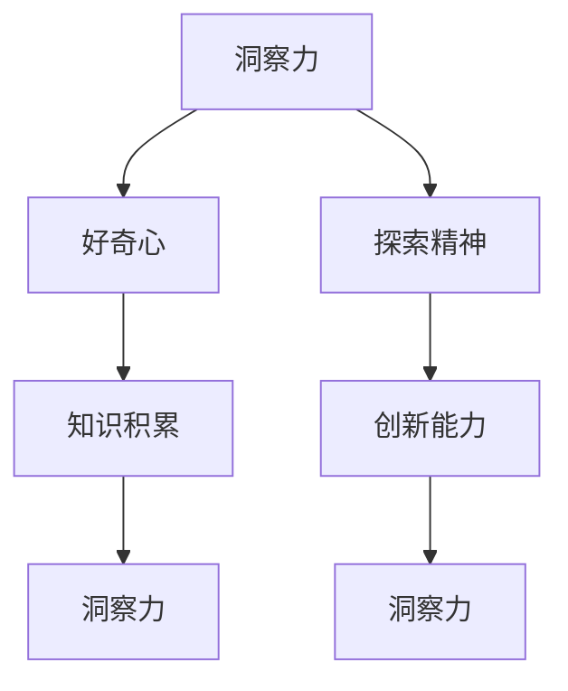
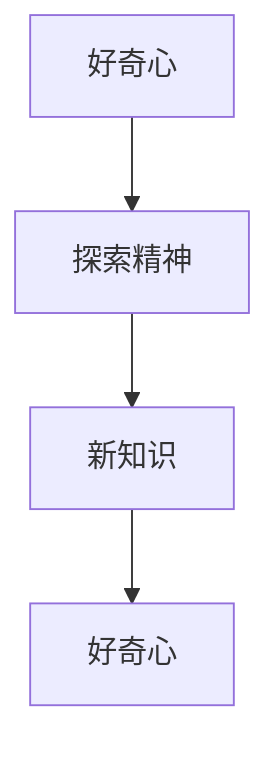
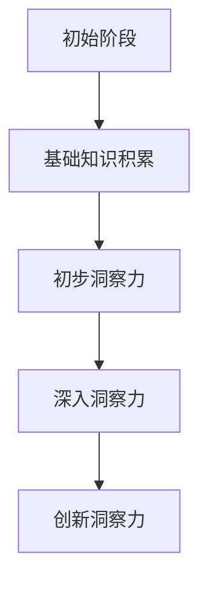

                 

### 《理解洞察力的培养：鼓励好奇心和探索精神》

> **关键词：**洞察力、好奇心、探索精神、个人发展、教育、职场、应用

**摘要：** 本文章深入探讨了洞察力的培养过程，强调了好奇心和探索精神在提升个人洞察力中的关键作用。文章从基础概念入手，详细分析了洞察力、好奇心和探索精神之间的关系，并提出了多种策略和方法来培养这些品质。在个人发展、教育系统、职场等方面，本文提供了实用的建议和案例，旨在帮助读者在日常生活和工作中提升洞察力，从而更好地应对挑战和抓住机遇。文章最后展望了未来社会对洞察力的需求，并提出了培养洞察力的可持续发展路径。

### 目录大纲

# 《理解洞察力的培养：鼓励好奇心和探索精神》

## 第一部分：洞察力基础

### 第1章：洞察力的定义与重要性

### 第2章：好奇心与探索精神

### 第3章：核心概念与联系

## 第二部分：培养洞察力

### 第4章：培养好奇心与探索精神的策略

### 第5章：教育系统中的洞察力培养

### 第6章：职场中的洞察力培养

## 第三部分：洞察力的应用

### 第7章：洞察力在决策中的应用

### 第8章：洞察力在生活中的应用

### 第9章：洞察力的发展与未来

## 附录

### 附录A：培养洞察力的实用工具和方法

### 附录B：参考文献与推荐阅读

### 附录C：练习与讨论题

---

本文将逐步分析洞察力、好奇心和探索精神的核心概念，并提出具体策略来培养这些品质。在接下来的章节中，我们将探讨这些品质在个人发展、教育系统、职场以及生活中的应用，并展望未来的发展趋势。让我们一起深入探讨，理解并培养洞察力，以应对复杂多变的世界。

### 第一部分：洞察力基础

在探讨洞察力的培养之前，我们需要对洞察力本身有一个清晰的理解。洞察力是一种深层次的认知能力，它不仅涉及到对信息的理解和分析，还包括对事物本质和内在联系的洞察。一个具备高洞察力的人能够快速捕捉到问题的关键，并提出创新的解决方案。在这一部分，我们将首先定义洞察力，探讨其在个人发展中的重要性，并分析好奇心和探索精神对洞察力培养的作用。

#### 第1章：洞察力的定义与重要性

##### 1.1 洞察力的概念

洞察力（Insight）一词源自拉丁语“insightus”，意为“看见里面的东西”。在心理学和认知科学领域，洞察力被定义为“通过直接认知过程对复杂或难以理解的问题进行深入理解和解决的能力”。与直观感觉或逻辑推理不同，洞察力往往是一种“Eureka”时刻，即在一瞬间捕捉到问题的核心和解决方案。

##### 1.2 洞察力的作用

洞察力在个人发展中扮演着至关重要的角色。以下是洞察力在多个方面的重要作用：

1. **决策能力**：洞察力帮助个体在复杂的信息环境中做出明智的决策。它使人们能够从大量的数据中识别出关键因素，并迅速制定有效的行动计划。
   
2. **创新思维**：洞察力能够激发创新思维，帮助人们发现新的解决方案和机会。它是科学研究、技术开发和商业创新的重要驱动力。

3. **问题解决**：洞察力使个体能够深入理解问题的本质，从而找到根本的解决方案，而不仅仅是表面的应对措施。

4. **人际交往**：洞察力有助于更好地理解和预测他人的行为和情感，从而提升人际交往能力。

5. **个人成长**：洞察力使个体能够更深刻地反思自我，认识到自己的优势和不足，并持续改进。

##### 1.3 洞察力在个人发展中的应用

洞察力在个人发展的多个方面都有广泛应用。以下是一些具体的应用场景：

1. **职业发展**：在职场中，具备洞察力的员工能够快速识别市场趋势和客户需求，提出创新的业务解决方案。

2. **学术研究**：在学术领域，洞察力有助于学者发现新的研究课题，提出独特的理论框架，并推动学科的发展。

3. **领导力**：领导者需要具备洞察力来理解团队的行为和动力，从而制定有效的策略和决策。

4. **生活规划**：在日常生活中，洞察力帮助人们规划未来，做出符合长远利益的决策。

#### 第2章：好奇心与探索精神

##### 2.1 好奇心的重要性

好奇心（Curiosity）是推动人类探索世界的重要动力。它是一种内在的驱动力，促使个体寻求新的知识和体验。以下是好奇心在洞察力培养中的重要性：

1. **知识积累**：好奇心驱使人们不断学习新知识，从而积累丰富的信息，这些信息是洞察力的基础。

2. **创新思维**：好奇心激发人们的创新思维，使他们敢于提出新颖的想法和观点，这有助于发现独特的解决方案。

3. **问题发现**：好奇心促使人们关注周围环境中的问题和异常现象，从而培养问题意识和解决能力。

4. **持续动力**：好奇心为个体提供持续的学习和探索动力，使他们能够在面对困难和挑战时保持积极的心态。

##### 2.2 好奇心的培养

培养好奇心是一个长期而系统的过程，以下是一些具体的方法：

1. **阅读**：阅读是培养好奇心的重要途径。通过阅读各种类型的书籍和文章，人们可以拓宽知识视野，激发好奇心。

2. **提问**：鼓励提问的习惯，特别是对未知领域和现象的提问，可以帮助人们保持好奇心。

3. **实践**：通过亲身体验和实践活动，人们可以更深入地了解事物，从而培养好奇心。

4. **交流**：与他人交流和讨论可以激发新的思考角度，促进好奇心的发展。

##### 2.3 探索精神的重要性

探索精神（Exploration Spirit）是一种积极主动的态度，它驱使个体去寻找未知和挑战自我。以下是探索精神在洞察力培养中的重要性：

1. **创新能力**：探索精神鼓励人们尝试新方法和新思路，从而培养创新能力。

2. **经验积累**：通过探索，个体可以积累丰富的经验和知识，这些经验是洞察力的重要来源。

3. **适应能力**：探索精神使个体能够更好地适应变化和不确定性，这是在复杂环境中保持洞察力的关键。

4. **自信心**：通过成功的探索，个体可以增强自信心，这有助于他们在面对新挑战时保持积极的心态。

##### 2.4 探索精神的培养

以下是一些培养探索精神的方法：

1. **设定目标**：通过设定具体的探索目标，个体可以更有动力地开展探索活动。

2. **勇于尝试**：鼓励个体勇于尝试新事物，即使失败也是探索过程中的一部分。

3. **持续学习**：不断学习新的知识和技能，可以帮助个体在探索过程中保持竞争力。

4. **积极反思**：通过反思探索过程中的经验和教训，个体可以不断改进自己的探索方法。

#### 第3章：核心概念与联系

##### 3.1 洞察力、好奇心与探索精神的关系

洞察力、好奇心和探索精神之间存在着密切的联系和相互促进的关系。以下是一个简化的 Mermaid 流程图，展示了这些概念之间的关系：

在这个流程图中，好奇心和探索精神是洞察力的基础。好奇心驱使个体寻求新的知识和体验，而探索精神则使个体勇于尝试和挑战自我，从而积累知识和经验，最终提升洞察力。

##### 3.2 好奇心与探索精神的互动

好奇心和探索精神之间的互动是一个动态的过程。好奇心激发个体的探索欲望，而探索的过程又进一步激发好奇心。以下是一个简化的 Mermaid 流程图，展示了好奇心和探索精神之间的互动关系：

在这个流程图中，好奇心和探索精神相互促进，形成一个正向循环。个体通过探索获取新知识，这又进一步激发了新的好奇心，促使他们进行更深层次的探索。

##### 3.3 洞察力的发展路径

洞察力的发展路径可以被视为一个不断深化的过程。以下是一个简化的 Mermaid 流程图，展示了洞察力的发展路径：

在这个流程图中，个体从基础知识积累开始，逐步发展出初步的洞察力。随着探索和经验的积累，洞察力不断深化，最终达到创新洞察力的水平。

通过以上分析，我们可以看出，洞察力、好奇心和探索精神之间存在着紧密的联系和相互促进的关系。好奇心和探索精神是培养洞察力的关键因素，而洞察力的发展又反过来促进了好奇心和探索精神的进一步发展。理解并利用这些关系，我们可以更有效地培养洞察力，从而在个人发展、职业和生活各个方面取得更好的成就。

## 第二部分：培养洞察力

洞察力的培养是一个长期而系统的过程，需要个体在好奇心和探索精神的驱动下，不断学习、实践和反思。在这一部分，我们将探讨具体策略和方法，帮助读者培养好奇心和探索精神，从而提升洞察力。

### 第4章：培养好奇心与探索精神的策略

好奇心和探索精神是培养洞察力的基石。以下是一些具体策略，帮助读者激发和培养这些重要品质。

#### 4.1 鼓励提问的习惯

提问是培养好奇心的关键。以下是一些方法，可以帮助读者养成提问的习惯：

1. **提问训练**：每天设定一个目标，主动提出至少一个问题，可以是关于工作、学习或生活中的任何方面。
2. **深度提问**：不仅仅停留在表面的提问，而是尝试深入挖掘问题背后的原因和本质。
3. **开放性问题**：鼓励提出开放性问题，这些问题往往没有固定的答案，更能激发思考和探索。

#### 4.2 建立积极的反馈机制

积极的反馈机制可以增强好奇心和探索精神的动力。以下是一些建立反馈机制的方法：

1. **自我奖励**：每完成一次有效的提问或探索，给自己一些奖励，如休息片刻、享受喜欢的零食等。
2. **他人反馈**：寻求他人的反馈，特别是那些能够提供建设性意见的人，这可以帮助你从不同角度看待问题。
3. **公开分享**：将你的发现和思考分享给他人，通过公开讨论，可以获得更多的观点和反馈。

#### 4.3 挑战自我，勇于尝试

挑战自我和勇于尝试是探索精神的核心。以下是一些方法，可以帮助读者克服恐惧，勇于尝试：

1. **设定小目标**：将大目标拆解为一系列小目标，每次只专注于完成一个小目标，这样可以降低尝试的难度。
2. **接受失败**：将失败视为学习和成长的机会，而不是失败的标志。每次失败后，都要反思原因，并从中学习。
3. **持续实践**：通过不断的实践，你可以逐步提高自己的能力和信心，从而更勇于尝试新的挑战。

#### 4.4 创造探索的机会

创造探索的机会是培养好奇心和探索精神的重要一环。以下是一些方法，可以帮助读者创造探索的机会：

1. **学习新技能**：学习新的技能或知识，不仅可以帮助你拓宽视野，还能激发好奇心。
2. **旅行和探险**：通过旅行和探险，你可以亲身体验不同的文化和环境，这会极大地激发好奇心和探索精神。
3. **参与社区活动**：参与社区活动，与他人合作解决问题，这可以帮助你获得新的视角和经验。

### 第5章：教育系统中的洞察力培养

教育系统在培养洞察力方面扮演着至关重要的角色。以下是一些策略，可以帮助教育系统更好地培养学生的洞察力。

#### 5.1 课程设置与教学方法

1. **跨学科课程**：设置跨学科的综合性课程，帮助学生从多个角度理解问题，培养跨学科思维。
2. **项目式学习**：通过项目式学习，让学生在解决实际问题的过程中培养洞察力。
3. **问题导向学习**：鼓励学生提出问题，并引导学生通过探究和实验来寻找答案。

#### 5.2 教师的角色与责任

1. **引导学生提问**：教师应该鼓励学生提问，并提供支持和指导，帮助学生深入思考问题。
2. **提供多样化的教学资源**：教师应该提供多样化的教学资源，如书籍、在线课程和实验材料，以激发学生的好奇心。
3. **反馈与指导**：教师应该给予学生及时的反馈和指导，帮助他们从错误中学习，并提高洞察力。

#### 5.3 学生参与与自主学习

1. **鼓励自主学习**：教育系统应该鼓励学生自主学习，培养他们的自主学习能力和解决问题的能力。
2. **团队合作**：通过团队合作，学生可以学会如何与他人协作，共同解决问题，这有助于培养他们的洞察力。
3. **社会实践**：通过参与社会实践，学生可以将所学知识应用于实际情境中，这有助于提高他们的洞察力和解决问题的能力。

### 第6章：职场中的洞察力培养

职场环境为洞察力的培养提供了独特的挑战和机遇。以下是一些策略，可以帮助职场中的人提升洞察力。

#### 6.1 职场环境中的洞察力需求

1. **市场洞察力**：在竞争激烈的职场中，具备市场洞察力的人能够迅速捕捉市场动态，为公司制定有效的战略。
2. **问题解决能力**：职场中常常面临各种复杂的问题，具备洞察力的人能够快速找到问题的核心，并提出创新的解决方案。
3. **决策能力**：洞察力有助于个体在职场中做出明智的决策，特别是在面对不确定性和风险时。

#### 6.2 培养团队协作与沟通能力

1. **团队协作**：通过团队协作，个体可以学会如何与他人合作，共同解决问题，这有助于培养洞察力和协作能力。
2. **跨部门沟通**：职场中不同部门之间的沟通至关重要，通过跨部门沟通，个体可以更全面地了解公司的运营，从而提升洞察力。
3. **知识分享**：鼓励团队成员分享知识和经验，这有助于提高团队整体的洞察力。

#### 6.3 培养创新思维与解决问题的能力

1. **创新思维训练**：通过创新思维训练，如头脑风暴、思维导图等，个体可以培养创新思维，从而提出更具创意的解决方案。
2. **解决问题工作坊**：定期组织解决问题工作坊，让团队成员在模拟情境中练习解决问题的能力，这有助于提高洞察力和应对实际问题的能力。
3. **反思与复盘**：通过反思和复盘，个体可以总结经验和教训，不断改进解决问题的方法。

通过以上策略，无论是教育系统还是职场环境，都可以有效地培养洞察力。好奇心和探索精神是培养洞察力的基石，而通过制定合理的课程设置、教学方法、职场文化和个人策略，我们可以更全面地提升洞察力，从而在个人发展和职业道路上取得更大的成功。

### 第三部分：洞察力的应用

洞察力不仅在个人发展和职业领域发挥重要作用，也在决策、生活和心理健康等多个方面具有广泛的应用。在这一部分，我们将深入探讨洞察力在这些方面的具体应用。

#### 第7章：洞察力在决策中的应用

洞察力是决策过程中不可或缺的一部分，它能够帮助个体在复杂的信息环境中做出明智的选择。以下是一些洞察力在决策中的应用场景：

##### 7.1 决策过程中的洞察力

1. **识别关键信息**：具备洞察力的个体能够迅速识别出决策过程中最重要的信息，从而避免在无关紧要的细节上耗费过多的时间和精力。
2. **预测结果**：通过洞察力，个体可以预测不同决策可能带来的结果，从而选择最优方案。
3. **风险评估**：洞察力使个体能够更好地评估决策可能带来的风险，从而制定相应的应对策略。

##### 7.2 洞察力在风险管理中的应用

风险管理是企业管理中的重要环节，洞察力在其中的应用尤为关键：

1. **识别潜在风险**：具备洞察力的管理者能够及时发现潜在的危机和风险，从而采取预防措施。
2. **评估风险影响**：通过洞察力，管理者可以评估不同风险可能对公司运营和财务状况的影响，从而制定有效的风险控制策略。
3. **应对策略制定**：洞察力有助于管理者在风险发生时迅速制定应对策略，降低风险对公司的影响。

##### 7.3 洞察力在创新与创业中的应用

创新和创业需要敏锐的洞察力，以下是在这一领域的具体应用：

1. **市场机会识别**：创业者通过洞察力可以捕捉到市场中的新兴机会，从而制定创新的商业策略。
2. **竞争分析**：洞察力使创业者能够深入分析竞争对手的优势和劣势，从而找到自己的竞争优势。
3. **商业模式创新**：创业者通过洞察力可以探索新的商业模式，从而实现业务增长和突破。

#### 第8章：洞察力在生活中的应用

洞察力不仅在工作和学术领域有重要作用，也在日常生活中有着广泛的应用：

##### 8.1 提升生活品质

1. **人际关系处理**：洞察力有助于个体更好地理解和处理人际关系，从而提升生活品质。
2. **情绪管理**：通过洞察力，个体可以更好地理解自己的情绪和需求，从而进行有效的情绪管理。
3. **健康维护**：洞察力使个体能够更敏锐地察觉到身体的变化，从而及时采取措施维护健康。

##### 8.2 增强人际交往能力

1. **有效沟通**：洞察力使个体能够更准确地理解他人的需求和意图，从而进行更有效的沟通。
2. **同理心培养**：洞察力有助于个体培养同理心，更好地理解和支持他人。
3. **冲突解决**：通过洞察力，个体可以更有效地解决人际冲突，维护和谐的人际关系。

##### 8.3 洞察力与心理健康

1. **自我认知**：洞察力有助于个体深入理解自我，从而实现自我成长和提升心理健康。
2. **压力管理**：通过洞察力，个体可以更好地应对压力和挑战，从而保持心理健康。
3. **情绪调节**：洞察力使个体能够更好地调节情绪，从而减少情绪波动对心理健康的影响。

#### 第9章：洞察力的发展与未来

随着社会的不断进步和变化，洞察力的培养和发展也面临着新的机遇和挑战：

##### 9.1 洞察力的发展趋势

1. **数据驱动**：大数据和人工智能技术的发展，为洞察力的培养提供了新的工具和方法，使个体能够更高效地分析和利用数据。
2. **跨学科融合**：随着学科之间的融合，跨学科的知识和技能将为洞察力的发展提供更广阔的空间。
3. **终身学习**：在快速变化的时代，终身学习成为提升洞察力的关键，个体需要不断更新知识和技能。

##### 9.2 未来社会对洞察力的需求

1. **创新能力**：未来社会对创新的需求将更加迫切，具备洞察力的人将在创新领域中发挥重要作用。
2. **问题解决能力**：面对复杂的社会问题，具备洞察力的人将能够提供更有效的解决方案。
3. **领导力**：未来领导者需要具备更高的洞察力，以应对复杂多变的挑战和环境。

##### 9.3 洞察力的培养与可持续发展

1. **教育改革**：教育系统需要改革，注重培养学生的洞察力，使他们在面对未来挑战时具备更强的适应能力和创新能力。
2. **企业文化**：企业需要建立积极的企业文化，鼓励员工探索和创新，从而提升整体的洞察力。
3. **个人发展**：个人需要持续学习和实践，通过多样化的体验和反思，不断提升自己的洞察力。

通过以上分析，我们可以看到，洞察力在决策、生活、心理健康以及未来社会的发展中具有广泛的应用和重要的地位。培养和提升洞察力不仅对个人的成长和发展具有深远影响，也对社会的进步和创新具有重要意义。让我们一起努力，通过培养好奇心和探索精神，不断提升自己的洞察力，迎接未来的挑战。

### 附录

#### 附录A：培养洞察力的实用工具和方法

在培养洞察力的过程中，使用一些实用工具和方法可以帮助我们更有效地进行学习和思考。以下是一些推荐的工具和方法：

##### A.1 思维导图工具

思维导图（Mind Mapping）是一种有效的可视化工具，可以帮助我们组织思路、联想信息和进行创新思考。以下是一些常用的思维导图工具：

1. **XMind**：一款功能强大且易于使用的思维导图软件，支持多种导图模板和丰富的自定义选项。
2. **MindMeister**：一个在线思维导图工具，提供了丰富的模板和协作功能，方便团队共同创建和编辑思维导图。
3. **Lucidchart**：一个专业的在线图表和流程图工具，适用于创建复杂的流程图、组织结构图和思维导图。

##### A.2 创意思维技巧

创意思维（Creative Thinking）是培养洞察力的重要途径，以下是一些创意思维技巧：

1. **头脑风暴**（Brainstorming）：通过集体讨论，快速生成大量想法，不必担心这些想法的好坏，重要的是数量。
2. **思维导图**（Mind Mapping）：将一个主题分解为多个子主题，通过分支和关联，形成系统的思维框架。
3. **类比思维**（Analogical Thinking）：通过将新问题与已知问题进行类比，找到解决问题的线索。
4. **反向思维**（Reverse Thinking）：从相反的角度思考问题，探索反面的解决方案。

##### A.3 提升阅读理解能力的方法

阅读理解是培养洞察力的基础，以下是一些提升阅读理解能力的方法：

1. **主动阅读**（Active Reading）：在阅读时，主动提出问题，关注关键信息，并对阅读内容进行总结和反思。
2. **阅读笔记**（Reading Notes）：记录阅读过程中的想法和问题，这有助于加深理解和记忆。
3. **多渠道阅读**：结合书籍、文章、视频等多种形式，从不同角度理解和消化信息。
4. **讨论与分享**：与他人讨论阅读内容，分享自己的理解和观点，这有助于加深理解和拓展思维。

通过使用这些工具和方法，我们可以更有效地培养洞察力，从而在个人发展和职业道路上取得更大的成就。

#### 附录B：参考文献与推荐阅读

以下是一些关于洞察力培养的参考文献和推荐阅读：

1. **Gladwell, M. (2005).《眨眼之间：直击洞察力的奥秘》（Blink: The Power of Thinking Without Thinking）**：探讨快速决策和直觉思维的力量。
2. **Dunn, J. (2014).《洞察力：思考的深度》（Insight: The Power of Listening to the Small Voice Within）**：深入探讨洞察力的本质和培养方法。
3. **Goleman, D. (1995).《情感智慧》（Emotional Intelligence）**：讨论情商和洞察力之间的关系。
4. **Kotter, J. P. (1996).《领导者的选择》（Leadership That Gets Results）**：提供领导者如何培养洞察力的实践建议。
5. **Kanter, R. M. (2008).《变革之心：如何将组织转变为可持续的创新者》（The Confidence Factor: How Winning Streaks and Losing streaks Begin and End）**：探讨如何在组织中激发创新思维。

这些参考文献和推荐阅读将为读者提供更深入的理解和启发，帮助他们在洞察力的培养过程中取得更大的进展。

#### 附录C：练习与讨论题

以下是一些练习和讨论题，帮助读者在实际应用中提升洞察力：

##### C.1 洞察力训练题目

1. **案例分析**：阅读一篇关于某公司失败的案例，分析其失败的原因，并提出改进建议。
2. **情景模拟**：假设你是一家初创公司的创始人，需要制定一个市场进入策略，考虑市场需求、竞争环境和资源限制等因素。
3. **问题解决**：描述一个你在工作和生活中遇到的问题，并尝试从不同角度寻找解决方案。

##### C.2 探索精神实践案例

1. **个人项目**：选择一个你感兴趣的项目，进行深入研究和实践，记录你的探索过程和遇到的问题。
2. **跨学科研究**：选择两个不同的学科领域，研究它们之间的联系和交叉点，撰写一篇研究论文。
3. **知识分享**：组织一次知识分享会，邀请同事或朋友分享他们在某个领域的研究或实践经验。

##### C.3 学生与职场中的洞察力培养案例分析

1. **学生案例**：分析一位学生在学习过程中如何通过提问、实验和反思提升洞察力的案例。
2. **职场案例**：分析一位职场新人在工作中如何通过挑战自我、团队协作和创新思维提升洞察力的案例。
3. **讨论题**：
   - 你认为教育系统应该如何更好地培养学生的洞察力？
   - 在职场中，如何建立一个支持洞察力发展的环境？
   - 你个人在提升洞察力方面有哪些成功和失败的实践经验？

通过这些练习和讨论，读者可以更深入地理解洞察力的培养和应用，并在实际生活中不断提升自己的洞察力。

---

**作者：** AI天才研究院/AI Genius Institute & 禅与计算机程序设计艺术/Zen And The Art of Computer Programming

本文从定义洞察力、探讨好奇心和探索精神的重要性，到提出具体策略和方法，系统地分析了洞察力的培养过程。通过教育系统、职场和生活等多个方面的应用分析，展示了洞察力在各个领域的重要作用。最后，通过附录和练习题，为读者提供了实用的工具和提升策略。希望本文能够帮助读者更好地理解洞察力，并在实际生活中不断提升自己的洞察力，迎接未来的挑战。

