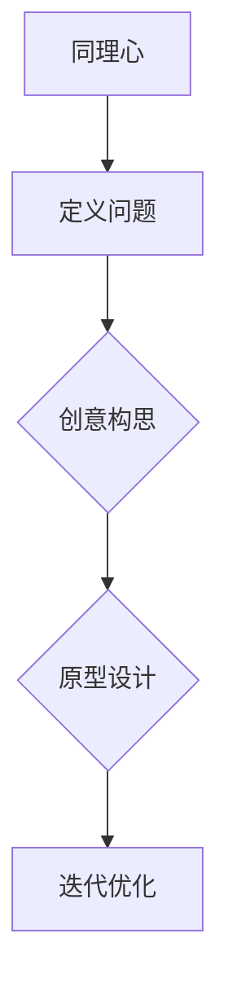
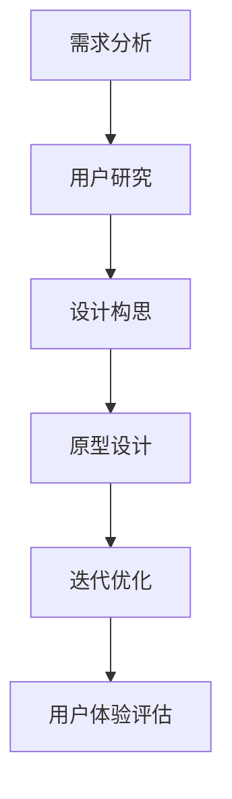
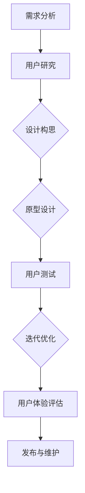
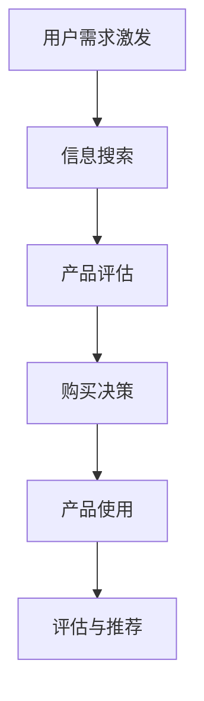

                 

### 《用户体验至上：创业产品设计的关键》

> **关键词**：用户体验、创业产品、设计原则、用户研究、原型设计、迭代优化、用户满意度、可持续设计

> **摘要**：在竞争激烈的创业环境中，用户体验成为产品成功的关键因素。本文将探讨创业产品设计中用户体验的重要性，通过详细的理论讲解和实践案例，深入分析用户体验的设计原则、用户研究方法、原型设计与测试、迭代设计与优化、用户体验评估与度量、以及可持续设计实践。旨在为创业团队提供实用的产品设计指导，帮助他们在追求商业成功的同时，创造卓越的用户体验。

### 目录大纲

# 《用户体验至上：创业产品设计的关键》

## 第一部分：理解用户体验

### 第1章：用户体验的定义与重要性

#### 1.1 用户体验的概念解析

#### 1.2 创业产品中用户体验的重要性

#### 1.3 用户旅程与关键触点分析

### 第2章：用户体验设计原则

#### 2.1 设计思维概述

#### 2.2 用户体验设计的原则与方法

#### 2.3 用户体验设计的流程

### 第3章：用户研究方法

#### 3.1 用户调研的步骤与工具

#### 3.2 用户访谈与观察技巧

#### 3.3 用户数据分析与应用

## 第二部分：用户研究与洞察

### 第4章：用户角色与故事板

#### 4.1 用户角色的创建与描述

#### 4.2 故事板的应用与案例

#### 4.3 用户痛点与需求分析

### 第5章：原型设计与测试

#### 5.1 原型的类型与制作工具

#### 5.2 原型设计的步骤与方法

#### 5.3 用户测试与反馈收集

### 第6章：迭代设计与优化

#### 6.1 设计迭代的概念与原则

#### 6.2 数据驱动的设计优化

#### 6.3 用户体验改进案例研究

## 第三部分：实战与案例

### 第7章：创业产品设计实战

#### 7.1 创业产品设计的挑战与解决方案

#### 7.2 创业产品设计的最佳实践

#### 7.3 创业产品设计案例解析

### 第8章：用户体验评估与度量

#### 8.1 用户体验评估的方法与工具

#### 8.2 用户满意度与留存率分析

#### 8.3 用户体验改进的策略与实施

### 第9章：可持续设计实践

#### 9.1 可持续设计的原则与策略

#### 9.2 环境影响与用户体验的关系

#### 9.3 可持续设计案例分析

## 附录

### 附录A：用户体验设计资源与工具

#### A.1 设计资源网站推荐

#### A.2 设计工具与软件介绍

#### A.3 用户研究方法与工具

### 附录B：参考文献与推荐阅读

#### B.1 相关书籍推荐

#### B.2 学术论文精选

#### B.3 设计社区与活动推荐

###  引言

在当今这个快节奏、竞争激烈的市场环境中，用户体验（User Experience, UX）已经成为创业产品成功的关键因素。创业团队必须认识到，用户体验不仅仅是产品的附加功能，而是产品核心竞争力的一部分。一个优秀的用户体验能够吸引并留住用户，提升用户满意度和忠诚度，从而为产品带来长远的商业价值。

本文旨在探讨用户体验在创业产品设计中的关键作用，为创业团队提供实用的设计指导。首先，我们将详细解析用户体验的定义和重要性，解释为什么用户体验对创业产品的成功至关重要。接着，我们将介绍用户体验设计的基本原则和方法，帮助读者理解如何构建优质的用户体验。随后，本文将深入探讨用户研究方法，包括用户调研、访谈、观察和数据收集等技巧，以帮助设计师获取用户真实需求。

在用户研究的基础上，本文将详细讲解原型设计和用户测试的步骤和方法，以及如何通过迭代优化不断改进用户体验。此外，我们将探讨用户体验评估的方法与工具，包括用户满意度、留存率等关键指标，并讨论如何根据评估结果制定用户体验改进策略。最后，本文还将探讨可持续设计实践，强调环境因素在用户体验中的重要性，并提供相关案例研究。

通过本文的阅读，读者将能够：

1. 理解用户体验的定义及其在创业产品设计中的重要性。
2. 掌握用户体验设计的基本原则和方法。
3. 学习用户研究的方法和技巧。
4. 了解原型设计和用户测试的过程及其重要性。
5. 理解迭代优化在设计过程中的作用。
6. 掌握用户体验评估的方法与工具。
7. 了解可持续设计实践及其对用户体验的影响。

现在，让我们开始深入探讨用户体验在创业产品设计中的关键作用，为创业产品的成功奠定坚实基础。

### 用户体验的定义与重要性

#### 用户体验的概念解析

用户体验（User Experience, UX）是指用户在使用产品或服务过程中的感受、情感和行为。它不仅仅关注功能是否正常运作，还包括用户在使用过程中的舒适度、满意度、参与度和忠诚度等多个维度。用户体验涵盖了用户在接触产品之前的预期，使用过程中的体验，以及使用后的感受。

用户体验可以看作是用户与产品互动的整体过程。它不仅包含用户界面（UI）的设计，还涉及功能设计、内容质量、性能、可访问性和情感因素。一个好的用户体验能够使用户感到愉悦、轻松，并且高效地完成任务。

用户体验与用户界面（UI）设计的关系

用户体验（UX）和用户界面（UI）设计虽然密切相关，但它们是两个不同的概念。用户界面设计主要关注产品的视觉和交互设计，包括布局、颜色、字体和按钮等元素，目的是使产品看起来美观和易于使用。而用户体验设计则更加广泛，它不仅包括UI设计，还包括产品功能的设计、内容策略、用户体验流程和情感设计等。

用户体验设计关注的是用户如何与产品互动，以及这种互动带来的感受和效果。用户界面设计则是用户体验设计的一个组成部分，它的目标是通过视觉和交互设计提升用户的体验。因此，UI设计是实现用户体验的一部分，但用户体验设计远不止UI设计。

用户体验在创业产品中的重要性

对于创业产品来说，用户体验尤为重要。以下是用户体验在创业产品中的几个关键重要性：

**1. 用户留存与增长**

一个优秀的用户体验能够增加用户对产品的满意度，从而提升用户留存率。用户如果在一个产品中感到舒适和满意，他们更有可能继续使用并推荐给他人，这对于创业产品的增长至关重要。

**2. 用户转化与销售**

良好的用户体验能够提高用户的转化率。当用户在产品中感受到愉悦和高效时，他们更有可能进行购买或使用付费功能。创业产品通常需要快速实现盈利，因此用户体验直接影响到产品的销售业绩。

**3. 品牌忠诚度**

一个优秀的用户体验可以培养用户的品牌忠诚度。当用户在一个产品中获得了良好的体验，他们更有可能对该品牌保持忠诚，即使在市场竞争激烈的环境下也不容易被竞争对手吸引。

**4. 竞争优势**

用户体验成为创业产品在激烈市场竞争中的关键优势。在功能类似的产品中，用户体验优异的产品往往能够脱颖而出，获得用户的青睐。

**5. 用户反馈与改进**

用户体验设计鼓励用户反馈，这些反馈对于产品改进至关重要。创业产品通常需要快速迭代和改进，用户反馈提供了宝贵的洞察，帮助设计师更好地理解用户需求，优化产品设计。

综上所述，用户体验是创业产品成功的关键因素。通过重视用户体验设计，创业团队能够在竞争激烈的市场中脱颖而出，建立强大的品牌形象，实现商业目标。

### 用户旅程与关键触点分析

用户旅程（User Journey）是指用户在使用产品或服务的过程中所经历的一系列步骤和触点。理解用户旅程和识别关键触点对于设计优质的用户体验至关重要。用户旅程可以分为几个关键阶段，每个阶段都有其独特的用户体验目标和挑战。

#### 1. 启发阶段

在启发阶段，用户意识到他们有一个需求或问题，并开始寻找解决方案。这个阶段的用户体验目标是提供足够的信息，使用户了解产品或服务能够解决他们的需求。关键触点包括：

- **搜索引擎**：用户通过搜索引擎查找相关信息。
- **社交媒体**：用户在社交媒体上获取推荐和反馈。
- **广告**：用户看到产品广告，产生兴趣。
- **网站/应用首页**：用户首次接触产品，了解其功能。

#### 2. 研究阶段

在研究阶段，用户深入了解产品或服务，评估其是否符合需求。这个阶段的用户体验目标是提供易于浏览和搜索的内容，使用户能够轻松获取所需信息。关键触点包括：

- **产品页面**：用户详细查看产品规格、功能、价格等信息。
- **用户评价**：用户阅读其他用户的评论和评分。
- **FAQ页面**：用户查找常见问题及解答。
- **帮助中心**：用户寻求更多帮助和指导。

#### 3. 考虑阶段

在考虑阶段，用户开始权衡不同产品或服务的优劣，并决定是否购买。这个阶段的用户体验目标是减少用户的决策难度，提高信任度。关键触点包括：

- **比较工具**：用户比较不同产品的特性、价格等。
- **咨询与支持**：用户通过电话、邮件或在线聊天与客服互动。
- **试用/免费试用**：用户尝试产品的功能，以验证其是否满足需求。
- **推荐机制**：用户通过推荐获得优惠或奖励。

#### 4. 购买阶段

在购买阶段，用户决定购买产品或服务，并进行支付。这个阶段的用户体验目标是确保支付过程简单、安全、高效。关键触点包括：

- **购物车**：用户将产品添加到购物车并确认订单。
- **支付流程**：用户选择支付方式并完成支付。
- **订单确认**：用户收到订单确认信息。
- **物流跟踪**：用户跟踪产品的配送状态。

#### 5. 使用阶段

在使用阶段，用户开始使用产品或服务，并评估其满意度。这个阶段的用户体验目标是确保产品易于使用、功能强大，并且提供良好的支持。关键触点包括：

- **首次使用**：用户第一次使用产品的体验。
- **使用指导**：用户获取产品使用指南和教程。
- **客户服务**：用户通过电话、邮件或在线支持解决问题。
- **功能更新**：用户体验新功能或更新。

#### 6. 评估阶段

在评估阶段，用户根据使用体验评估产品或服务的价值，决定是否继续使用或推荐给他人。这个阶段的用户体验目标是确保用户感到满意，愿意持续使用并推荐产品。关键触点包括：

- **反馈机制**：用户提供产品评价和反馈。
- **续订/回购**：用户决定是否续订或再次购买。
- **推荐奖励**：用户因推荐而获得奖励。
- **社区参与**：用户参与产品的用户社区，分享使用经验。

通过分析用户旅程和识别关键触点，创业团队能够了解用户在每个阶段的需求和痛点，从而设计出更加贴合用户需求的体验。理解用户旅程不仅有助于优化产品设计，还能提升用户满意度和忠诚度，为创业产品的成功奠定坚实基础。

### 用户体验设计原则

用户体验设计（User Experience Design, UXD）是一个复杂且多层次的过程，它涉及多个设计原则和方法的综合应用。以下是一些核心的用户体验设计原则，以及如何在创业产品设计中应用这些原则。

#### 1. 设计思维概述

设计思维是一种以人为本的设计方法，强调通过理解用户需求、探索多种解决方案并迭代优化，最终创造出能够满足用户期望的产品。设计思维包括以下几个关键步骤：

- **同理心**：深入了解用户的需求、感受和痛点。
- **定义问题**：明确设计目标，识别关键挑战。
- **创意构思**：生成多种可能的解决方案。
- **原型设计**：快速构建并测试原型，收集用户反馈。
- **迭代优化**：根据用户反馈不断改进设计。

在设计创业产品时，设计思维可以帮助团队从用户角度出发，确保产品设计更加贴合用户需求。

#### 2. 用户体验设计的原则与方法

（Mermaid 流程图）



以下是用户体验设计的一些核心原则和方法：

**同理心**

- **目标**：了解用户的需求、行为和情感。
- **方法**：用户访谈、观察、问卷调查、用户画像等。
- **应用**：在设计初期，通过用户访谈和观察，深入了解目标用户的需求和痛点，确保产品设计符合用户期望。

**定义问题**

- **目标**：明确设计目标和关键挑战。
- **方法**：用户故事地图、问题树、SWOT分析等。
- **应用**：通过用户故事地图和问题树，识别设计中的关键问题和优先级，确保设计团队聚焦于最重要的用户体验改进点。

**创意构思**

- **目标**：生成多种解决方案。
- **方法**：头脑风暴、原型草图、思维导图等。
- **应用**：在创意构思阶段，通过头脑风暴和原型草图，快速探索多种可能的解决方案，为产品设计提供多样化的选择。

**原型设计**

- **目标**：构建可交互的原型，验证设计想法。
- **方法**：低 fidelity 和高 fidelity 原型、纸原型、数字原型等。
- **应用**：使用原型工具（如Figma、Sketch）构建可交互的原型，模拟用户与产品的互动过程，通过用户测试收集反馈，验证设计想法。

**迭代优化**

- **目标**：不断改进设计，满足用户需求。
- **方法**：A/B测试、用户体验地图、数据分析等。
- **应用**：通过A/B测试和用户体验地图，收集用户行为数据，分析用户体验的改进点，根据用户反馈不断优化设计。

#### 3. 用户体验设计的流程

用户体验设计的流程通常包括以下步骤：

1. **需求分析**：收集和分析用户需求，确定设计目标和优先级。
2. **用户研究**：深入了解用户，通过访谈、观察、问卷调查等方式获取用户数据。
3. **设计构思**：基于用户研究和需求分析，生成多种设计方案。
4. **原型设计**：构建低 fidelity 或高 fidelity 原型，进行用户测试和反馈收集。
5. **迭代优化**：根据用户反馈不断改进设计，确保满足用户需求。
6. **用户体验评估**：通过用户满意度调查、留存率分析等，评估设计效果。

（Mermaid 流程图）



#### 4. 应用案例

以设计一个在线购物平台为例，用户体验设计原则和方法可以应用于以下步骤：

- **同理心**：通过访谈和问卷调查了解用户在购物过程中的痛点，如产品搜索困难、支付流程复杂等。
- **定义问题**：识别设计目标，如简化搜索流程、优化支付体验、提升页面加载速度等。
- **创意构思**：头脑风暴多种解决方案，如增加搜索建议、引入一键支付、优化页面布局等。
- **原型设计**：使用Figma构建原型，模拟用户购物流程，并通过用户测试收集反馈。
- **迭代优化**：根据用户反馈调整设计，如增加搜索建议的准确性、简化支付流程等。
- **用户体验评估**：通过用户满意度调查和留存率分析，评估设计效果，持续优化用户体验。

通过以上步骤，创业团队能够设计出更加贴合用户需求的在线购物平台，提升用户满意度和忠诚度，从而在竞争激烈的市场中脱颖而出。

### 用户研究方法

用户研究是用户体验设计的关键环节，它帮助设计师深入了解用户需求、行为和情感，从而指导产品设计的每一个步骤。以下将介绍几种常见的用户研究方法，包括用户调研、用户访谈、观察和数据分析，并探讨如何在实际项目中应用这些方法。

#### 1. 用户调研

用户调研是通过问卷调查、在线调查、焦点小组讨论等方式，收集用户对产品或服务态度、偏好和行为的数据。以下是一些常见的用户调研方法：

- **问卷调查**：设计结构化问卷，通过在线平台或电子邮件发送给目标用户，收集定量数据。
- **在线调查**：利用调查工具（如SurveyMonkey、Typeform）创建互动性强的调查问卷，收集用户反馈。
- **焦点小组讨论**：邀请一组用户参与讨论，深入了解他们对产品或服务的看法和需求。

用户调研的优点是能够快速收集大量数据，适用于大规模用户群体的分析。然而，问卷调查和焦点小组讨论可能存在主观偏差，结果可能受到用户回答意愿的影响。

在实际项目中，用户调研可以帮助设计师：

- **了解用户需求**：通过分析用户调研数据，设计师可以识别出用户的主要需求和痛点。
- **验证设计假设**：在设计初期，通过用户调研验证设计假设，确保设计方向符合用户期望。
- **评估市场潜力**：在产品上市前，通过用户调研评估市场接受度和潜在用户数量。

#### 2. 用户访谈

用户访谈是一种深入的用户研究方法，通过与用户进行一对一的面对面交流，了解他们的真实需求和体验。以下是用户访谈的一些技巧：

- **准备充分**：在设计访谈前，明确访谈目标，准备访谈大纲和问题列表。
- **开放式问题**：使用开放式问题引导用户表达他们的想法和感受，而非封闭式问题。
- **观察用户行为**：在访谈过程中，观察用户在使用产品或服务时的行为和反应，获取更真实的反馈。
- **记录和总结**：在访谈结束后，及时记录关键发现和用户观点，进行总结和归纳。

用户访谈的优点在于能够深入了解用户的个人经验和情感，适用于探索性研究和定性分析。然而，访谈过程需要较多时间和资源，且样本量较小。

在实际项目中，用户访谈可以帮助设计师：

- **发现深层次需求**：通过访谈，设计师可以挖掘出用户在问卷中未能表达的需求和痛点。
- **了解用户行为模式**：通过观察用户行为，设计师可以识别出用户在产品使用过程中的常见问题和行为模式。
- **建立用户关系**：通过与用户建立信任关系，设计师可以获取更多真实和有价值的反馈。

#### 3. 观察

观察是通过直接观察用户在自然环境或使用产品过程中的行为和互动，获取用户体验数据的一种研究方法。以下是观察的一些技巧：

- **选择合适的环境**：观察应该在用户的真实使用环境中进行，以获取最真实的反馈。
- **记录细节**：在观察过程中，记录用户的每一个行为和反应，包括使用时间、操作步骤、情绪变化等。
- **保持客观**：观察者应该保持中立，不干预用户的操作，以确保数据的真实性。

观察的优点是能够获取未经加工的真实数据，适用于探索用户行为和体验的深层次问题。然而，观察可能受到环境干扰和观察者主观判断的影响。

在实际项目中，观察可以帮助设计师：

- **了解用户实际操作**：通过观察，设计师可以了解用户在实际使用过程中的具体操作和行为，发现产品设计中的实际问题。
- **发现隐性问题**：通过观察，设计师可以识别出用户在使用过程中可能未意识到的痛点或障碍。
- **优化用户体验**：根据观察结果，设计师可以优化产品设计，提高用户的操作效率和满意度。

#### 4. 数据分析

数据分析是通过对用户行为数据进行分析，提取有价值的信息和洞察的一种研究方法。数据分析通常涉及以下步骤：

- **数据收集**：通过用户行为追踪工具（如Google Analytics、热图分析工具）收集用户数据。
- **数据清洗**：清洗和整理数据，去除无效或错误的数据。
- **数据可视化**：使用图表、图形和报告将数据分析结果可视化，便于理解和传达。
- **数据分析**：使用统计方法分析数据，提取有价值的洞察。

数据分析的优点在于能够提供量化的用户行为数据，帮助设计师做出数据驱动的设计决策。然而，数据分析需要专业知识和工具，且数据分析的结果可能受到数据质量和分析方法的限制。

在实际项目中，数据分析可以帮助设计师：

- **优化产品设计**：通过分析用户行为数据，设计师可以识别出用户在产品使用过程中的常见问题，从而优化产品设计。
- **评估设计效果**：通过对比不同设计方案的用户行为数据，评估设计效果，选择最优方案。
- **制定改进策略**：根据数据分析结果，制定具体的用户体验改进策略和行动计划。

#### 5. 用户研究方法的综合应用

在实际项目中，多种用户研究方法可以综合应用，以获取更全面和深入的用户洞察。以下是一种可能的用户研究流程：

1. **需求分析**：通过用户调研和访谈，初步了解用户需求和痛点。
2. **用户研究**：通过观察和数据分析，深入了解用户行为和互动。
3. **设计构思**：结合用户研究的发现，生成多种设计方案。
4. **原型设计**：构建原型并进行用户测试，收集反馈。
5. **迭代优化**：根据用户反馈，不断优化设计，确保满足用户需求。

通过综合应用多种用户研究方法，创业团队能够更全面地了解用户需求和行为，从而设计出更加贴合用户需求的创业产品，提升用户体验和市场竞争力。

### 用户角色与故事板

在用户体验设计中，用户角色（User Personas）和故事板（User Storyboards）是两种重要的工具，它们帮助我们更好地理解目标用户，并指导产品设计和开发过程。以下将详细介绍如何创建用户角色和故事板，以及它们在实际项目中的应用。

#### 1. 用户角色的创建与描述

用户角色是基于用户调研和访谈结果，构建的一个代表目标用户群体的虚拟人物。用户角色不仅包含了用户的个人背景、需求、目标和行为模式，还可以反映出用户的情感和态度。创建用户角色的步骤如下：

**步骤1：收集用户信息**

通过用户调研、访谈、问卷调查等方法，收集关于目标用户的详细信息，包括年龄、性别、职业、生活习惯、兴趣爱好、使用场景等。

**步骤2：分析用户信息**

分析收集到的用户信息，找出用户的共同特征和差异，识别出用户的主要需求和痛点。

**步骤3：创建用户角色**

基于分析结果，为每个用户群体创建一个或多个用户角色。每个用户角色应包括以下信息：

- **姓名和照片**：给用户角色一个具体的形象，使设计团队更容易理解和共鸣。
- **背景信息**：用户的年龄、职业、家庭状况等基本信息。
- **需求与目标**：用户使用产品的目的、需求和期望。
- **行为模式**：用户的行为习惯、使用场景和决策过程。

**步骤4：描述用户角色**

为每个用户角色编写详细的描述，包括他们的动机、行为、需求和痛点。这些描述应尽量具体和生动，以帮助设计团队深入理解用户。

例如，假设我们为一个在线教育平台创建用户角色“张三”，以下是他的描述：

**用户角色：张三**

- **姓名**：张三
- **背景**：35岁，工程师，有两个孩子，居住在一线城市
- **需求与目标**：希望通过在线课程提升职业技能，给孩子提供更好的教育资源。
- **行为模式**：每天晚上7点到10点有时间学习，习惯使用手机或平板电脑。

通过创建用户角色，设计团队能够更好地理解用户需求和行为，从而在设计过程中有针对性地满足用户需求。

#### 2. 故事板的应用与案例

故事板（User Storyboards）是一种视觉化的工具，用于描述用户与产品的互动过程。通过故事板，设计师可以直观地展示用户在产品中的操作流程、使用场景和体验。创建故事板的步骤如下：

**步骤1：确定用户任务**

基于用户角色和需求分析，确定用户在产品中的主要任务和操作流程。例如，用户在在线教育平台上的任务可能包括浏览课程、选择课程、购买课程、学习课程等。

**步骤2：绘制故事板**

使用草图或软件（如Sketch、Figma），为每个用户任务绘制故事板。故事板应包括以下元素：

- **场景**：用户所处的环境，如手机屏幕、电脑桌面等。
- **用户操作**：用户在产品中的具体操作，如点击按钮、填写表单等。
- **用户反馈**：用户的操作结果和反馈，如成功提示、错误提示等。
- **界面设计**：产品界面的视觉元素，如按钮、图片、文字等。

**步骤3：优化和迭代**

根据用户反馈和设计目标，不断优化和迭代故事板。确保故事板准确地反映了用户与产品的互动过程，以及设计团队对用户体验的理解。

以下是一个在线教育平台的故事板案例：

**故事板：张三的学习旅程**

1. **场景**：张三在家中使用手机，浏览在线教育平台的课程列表。
2. **用户操作**：张三点击“编程入门”课程，进入课程详情页面。
3. **用户反馈**：课程详情页面显示课程简介、评分、评论等信息，张三对课程表示满意。
4. **界面设计**：页面包含清晰的导航栏、课程推荐和用户评论模块。

通过故事板，设计团队能够更清晰地理解用户的需求和行为，从而优化产品设计和开发过程。故事板不仅有助于设计团队内部沟通，还可以用于与产品经理、开发团队和客户进行讨论，确保产品满足用户期望。

#### 3. 用户痛点与需求分析

用户角色和故事板不仅有助于设计师理解用户行为和互动，还可以帮助识别用户的痛点和需求。以下是如何通过用户角色和故事板分析用户痛点与需求的步骤：

**步骤1：识别用户痛点**

通过用户角色和故事板，分析用户在产品使用过程中遇到的困难和不便之处。例如，在在线教育平台的故事板中，张三可能遇到以下痛点：

- 课程搜索功能不够准确，导致需要花费大量时间寻找合适课程。
- 课程购买流程复杂，需要多次操作才能完成购买。
- 课程内容更新不及时，导致学习效果不佳。

**步骤2：分析用户需求**

基于用户角色和故事板，分析用户在产品使用过程中的需求。例如，在在线教育平台的故事板中，张三的需求可能包括：

- 能够快速找到适合自己水平的课程。
- 简单、直接的购买流程。
- 定期更新的课程内容，确保学习效果。

通过分析用户痛点和需求，设计团队能够有针对性地优化产品设计，提升用户体验。例如，可以通过改进课程搜索算法、简化购买流程、定期更新课程内容等方式，解决用户痛点并满足用户需求。

综上所述，用户角色和故事板是用户体验设计中的关键工具，它们帮助我们更好地理解用户需求和行为，指导产品设计和开发过程。通过创建用户角色和故事板，设计团队能够更准确地识别用户痛点与需求，从而设计出更加贴合用户需求的创业产品。

### 原型设计与测试

原型设计（Prototyping）是用户体验设计（User Experience Design, UXD）过程中的关键步骤，它通过创建可交互的模型，帮助设计师验证设计概念、识别问题并进行迭代优化。以下是原型设计的基本类型、制作工具、设计步骤、用户测试的重要性和方法。

#### 1. 原型的类型

原型设计可以分为以下几种基本类型：

- **低 fidelity 原型**：这些原型通常使用草图、线框图或简单的视觉元素，旨在快速传达设计概念，不需要大量细节。低 fidelity 原型适合用于早期的概念验证和设计构思阶段。

- **中 fidelity 原型**：这些原型通常包含更详细的设计元素，如颜色、字体和布局，但仍保持一定的简洁性。中 fidelity 原型适用于用户测试和反馈收集，帮助设计师在细节方面进行调整。

- **高 fidelity 原型**：这些原型接近最终产品的外观和交互，通常包含真实内容、样式和交互效果。高 fidelity 原型主要用于最终的测试和演示，以便用户和开发团队更好地了解产品的最终形态。

#### 2. 原型设计工具

选择合适的原型设计工具对于快速构建和迭代原型至关重要。以下是一些流行的原型设计工具：

- **Figma**：Figma 是一款基于云的原型设计工具，提供丰富的设计元素和交互功能，支持多人协作。
- **Sketch**：Sketch 是一款流行的矢量设计工具，特别适用于创建高 fidelity 原型和用户界面设计。
- **Adobe XD**：Adobe XD 是一款综合性设计工具，支持从概念验证到高 fidelity 原型的构建，具有强大的交互和动画功能。
- **Axure RP**：Axure RP 是一款专业的原型设计工具，提供丰富的原型组件和交互功能，适用于复杂的交互设计。

#### 3. 原型设计的步骤

以下是原型设计的基本步骤：

**步骤1：需求分析**

在原型设计之前，进行详细的需求分析，了解用户需求、产品目标和设计约束。这一步骤有助于明确设计方向和关键功能。

**步骤2：设计构思**

基于需求分析，设计团队进行创意构思，生成多种设计方案。可以使用草图、线框图和思维导图等工具，记录和展示设计思路。

**步骤3：构建低 fidelity 原型**

使用低 fidelity 工具（如 Figma、Sketch）构建初步的原型，主要关注布局和基本交互。低 fidelity 原型适用于快速验证设计和概念。

**步骤4：用户测试**

对低 fidelity 原型进行用户测试，收集用户反馈和问题。这些反馈将指导设计团队进行优化和改进。

**步骤5：构建中 fidelity 原型**

基于用户测试结果，对低 fidelity 原型进行优化，构建中 fidelity 原型。这一阶段可以添加更多细节和设计元素，如颜色、字体和图标。

**步骤6：用户测试**

对中 fidelity 原型进行用户测试，进一步验证设计并进行调整。这一阶段可以发现更多细小的问题和用户体验问题。

**步骤7：构建高 fidelity 原型**

根据用户测试结果，构建最终的高 fidelity 原型。这一阶段的原型应接近最终产品的外观和交互效果，以便进行最终的用户测试和演示。

**步骤8：最终用户测试**

对高 fidelity 原型进行最终的用户测试，确保设计满足用户需求和期望。这一阶段还可以收集用户反馈，为产品的最终发布做准备。

#### 4. 用户测试的重要性

用户测试是原型设计过程中至关重要的一环，它通过模拟真实用户与产品的互动，帮助设计师识别问题和优化设计。以下是用户测试的重要性：

- **验证设计概念**：用户测试可以帮助设计团队验证设计概念和功能是否满足用户需求。
- **发现用户体验问题**：用户测试可以发现设计中的问题，如导航困惑、界面布局不合理等，以便进行改进。
- **提高用户满意度**：通过用户测试，设计团队能够确保产品满足用户期望，提高用户满意度。
- **降低开发成本**：早期发现和解决问题可以减少后续开发阶段的返工和修正成本。

#### 5. 用户测试的方法

以下是几种常见的用户测试方法：

- **可用性测试**：通过邀请真实用户使用原型，观察他们的操作过程和反应，收集用户体验数据。
- **认知图测试**：用户在测试过程中绘制出他们理解和使用产品的过程，帮助设计师了解用户思维和操作路径。
- **A/B 测试**：将不同设计变体展示给用户，比较不同设计的效果，选择最优方案。
- **远程测试**：通过在线工具邀请远程用户参与测试，适用于时间和地理条件受限的情况。

用户测试的方法应结合具体情况灵活应用，以确保获取全面和真实的用户反馈。通过有效使用用户测试方法，设计团队能够不断优化产品，提升用户体验。

综上所述，原型设计是用户体验设计过程中的重要步骤，通过构建不同类型的原型并进行用户测试，设计团队能够验证设计概念、优化用户体验并提高产品的市场竞争力。

### 迭代设计与优化

在创业产品设计中，迭代设计（Iterative Design）是一种通过不断改进和优化产品设计，以满足用户需求和市场变化的方法。迭代设计的过程不仅包括反复的修改和调整，还包括数据驱动的决策和用户反馈的采纳。以下将详细介绍迭代设计的概念、原则、方法和在实际项目中的应用。

#### 1. 迭代设计的概念

迭代设计是指通过一系列重复的、逐步改进的过程，不断优化产品设计，使其更加贴近用户需求和期望。迭代设计通常分为以下几个阶段：

- **需求分析**：识别用户需求和市场趋势，确定设计目标。
- **设计原型**：构建初始设计原型，进行初步的用户测试和反馈收集。
- **用户测试**：对设计原型进行详细测试，收集用户行为数据和反馈。
- **反馈收集**：分析用户反馈，识别设计中的问题和改进点。
- **迭代优化**：根据用户反馈，对设计原型进行修改和优化，重新测试和收集反馈。
- **发布更新**：将优化后的设计原型推向市场，进行实地测试和数据分析。

通过这种循环迭代的过程，设计团队能够逐步改进产品设计，确保产品在不断变化的市场环境中保持竞争力。

#### 2. 迭代设计的原则

迭代设计应遵循以下原则，以确保设计过程高效、有序且用户满意：

- **用户导向**：始终以用户需求为中心，确保每一次迭代都致力于提升用户体验。
- **数据驱动**：依赖用户行为数据和反馈，做出基于数据的决策，避免主观臆断。
- **快速迭代**：缩短迭代周期，加快设计和发布速度，以应对市场变化和用户需求的变化。
- **持续改进**：不断优化设计，而不是一次性交付，确保产品始终保持最佳状态。
- **灵活适应**：在迭代过程中灵活调整设计方向，根据用户反馈和市场变化快速响应。

#### 3. 迭代设计的方法

以下是几种常见的迭代设计方法：

- **瀑布模型**：将设计过程划分为明确阶段，每个阶段结束后进行用户测试和反馈，然后进入下一个阶段。这种方法适用于需求明确且变化较少的项目。
- **敏捷开发**：通过短周期的迭代，快速构建、测试和优化产品，适用于需求变化频繁的创业项目。
- **精益创业**：通过最小可行产品（MVP）验证市场需求，然后根据用户反馈逐步扩展功能，适用于创业初期的产品开发。

在实际项目中，设计团队可以根据项目特点和需求，灵活选择和组合不同的迭代设计方法。

#### 4. 数据驱动的设计优化

数据驱动的设计优化是指通过分析用户行为数据和反馈，指导设计决策和优化过程。以下是如何在迭代设计中实现数据驱动的优化：

**步骤1：数据收集**

通过用户行为追踪工具（如Google Analytics、热图分析工具）、A/B测试等，收集用户在产品中的行为数据，包括点击率、停留时间、转化率等。

**步骤2：数据分析**

使用数据可视化工具（如Tableau、Google Data Studio）对收集到的数据进行分析，识别用户行为模式和关键问题。

**步骤3：设计优化**

根据数据分析结果，识别需要改进的设计元素和功能，进行有针对性的优化。例如，如果分析显示用户在某个页面停留时间较短，可能需要优化页面内容和布局。

**步骤4：再次测试**

对优化后的设计进行用户测试，验证优化效果，并收集新的用户反馈。

**步骤5：持续迭代**

根据用户反馈和数据表现，继续进行优化和迭代，确保产品设计持续改进。

#### 5. 实际项目中的应用

以下是一个迭代设计在创业产品中的应用案例：

**案例：一款在线任务管理工具**

1. **需求分析**：识别用户在任务管理过程中的痛点和需求，如任务分配不清晰、任务跟踪困难等。
2. **设计原型**：构建初始原型，包括任务创建、任务分配、任务跟踪等功能，进行初步的用户测试。
3. **用户测试**：通过可用性测试和A/B测试，收集用户反馈，识别设计中的问题和优化点。
4. **反馈收集**：分析用户反馈，发现用户希望在任务创建时提供更多自定义选项，以及优化任务列表的交互体验。
5. **迭代优化**：根据用户反馈，对任务创建界面和任务列表进行优化，增加自定义选项和改进交互体验。
6. **再次测试**：对优化后的设计进行用户测试，验证优化效果，并收集新的用户反馈。
7. **发布更新**：将优化后的设计推向市场，进行实地测试和数据分析，根据用户反馈进行下一轮优化。

通过这个迭代设计的过程，在线任务管理工具不断优化用户体验，提高了用户满意度和留存率，取得了良好的市场反响。

综上所述，迭代设计是创业产品设计中不可或缺的一部分。通过不断优化和改进产品设计，创业团队能够更好地满足用户需求，提升产品竞争力，实现商业成功。

### 创业产品设计实战

创业产品设计的成功不仅依赖于理论知识，还需要实际操作中的经验积累和问题解决能力。本文将探讨创业产品设计的常见挑战、解决方案和最佳实践，并结合实际案例，提供具体的设计思路和策略。

#### 1. 常见挑战

**1.1 资源限制**

创业公司通常面临资源限制，包括时间、资金和人力资源。这要求设计团队在有限资源下，快速高效地完成高质量的设计任务。

**解决方案**：采用敏捷开发和迭代设计方法，通过快速原型和持续反馈，逐步完善产品。优先考虑关键功能，避免过度设计，确保重点突出。

**1.2 市场需求变化**

市场环境瞬息万变，用户需求也随之不断变化。设计团队需要具备快速响应市场变化的能力。

**解决方案**：建立用户反馈机制，定期收集用户意见和需求，快速迭代和优化产品。同时，保持对市场趋势的敏锐洞察，及时调整设计方向。

**1.3 用户需求多样**

用户群体庞大且需求多样，设计团队难以满足所有用户的需求。

**解决方案**：通过用户调研和细分市场，识别主要用户群体的共性需求，为不同用户提供差异化的设计方案。同时，通过灵活的设计模块和自定义功能，尽量满足不同用户的需求。

#### 2. 最佳实践

**2.1 用户中心设计**

始终以用户需求为中心，进行设计决策。通过用户调研、用户访谈和用户测试，深入了解用户需求和痛点，确保设计满足用户期望。

**2.2 数据驱动决策**

依赖用户行为数据和反馈，做出数据驱动的决策。通过数据分析工具，监控用户行为和产品性能，为设计优化提供依据。

**2.3 快速原型迭代**

采用快速原型迭代方法，通过不断构建和测试原型，快速验证设计概念，并及时调整设计方向。

**2.4 跨部门协作**

设计团队应与产品经理、开发团队和市场团队紧密协作，确保设计决策与产品目标和市场策略一致。跨部门协作有助于快速响应市场需求，提高设计效率。

**2.5 用户教育和引导**

通过用户教育内容和引导设计，帮助用户更好地理解和使用产品。例如，提供教程、帮助文档和交互提示，提高用户满意度。

#### 3. 实际案例解析

以下是一个在线任务管理工具的实际设计案例：

**案例背景**：一款在线任务管理工具的目标用户是中小企业的团队管理者，他们需要高效地分配任务、跟踪进度和协作。

**挑战**：

- 用户群体多样，需求复杂。
- 资源有限，需要在短时间内推出产品。
- 市场竞争激烈，需要快速建立品牌认知。

**解决方案与最佳实践**：

**1. 用户调研**：通过问卷调查和用户访谈，识别用户的主要需求，如任务分配、进度跟踪、团队协作等。

**2. 用户中心设计**：基于用户调研结果，设计任务创建、任务列表、任务分配和进度跟踪等功能模块，确保设计满足用户核心需求。

**3. 数据驱动决策**：使用用户行为追踪工具，监控用户在不同功能模块的使用情况，识别常见问题和优化点。

**4. 快速原型迭代**：通过Figma构建低 fidelity 和高 fidelity 原型，进行用户测试和反馈收集，不断优化设计。

**5. 跨部门协作**：与产品经理和市场团队密切合作，确保设计决策与产品目标和市场策略一致。同时，与开发团队协作，确保设计能够高效实现。

**6. 用户教育和引导**：提供详细的帮助文档和视频教程，帮助用户快速上手使用产品。在产品界面中加入交互提示和引导，提高用户操作效率。

**实际效果**：通过以上策略，任务管理工具在短时间内获得了良好的市场反响。用户满意度显著提高，产品留存率和用户活跃度也得到显著提升。

综上所述，创业产品设计需要克服诸多挑战，通过最佳实践和实际案例的指导，设计团队可以创造出满足用户需求、具备竞争力的创业产品。

### 用户体验评估与度量

用户体验评估与度量是创业产品设计中至关重要的一环。通过科学的方法和工具，评估用户体验的各个方面，可以直观地了解用户的满意度和产品性能，从而制定有效的改进策略。以下将介绍用户体验评估的方法与工具，以及如何根据评估结果进行用户满意度与留存率分析，并提出用户体验改进的策略与实施方法。

#### 1. 用户体验评估的方法

用户体验评估涉及多个维度，包括功能性、易用性、情感体验、可访问性等。以下是几种常见的方法：

**1.1 问卷调查**

问卷调查是一种广泛使用的评估方法，可以通过结构化的问题收集用户对产品的态度和意见。问卷调查可以在线进行，适用于大规模的用户群体。问卷的设计应注重问题的清晰性、简洁性和针对性。

**1.2 用户访谈**

用户访谈是一种深入的用户体验评估方法，通过与用户进行一对一的交流，获取详细的反馈和见解。访谈可以揭示用户在实际使用产品过程中遇到的问题和挑战，有助于发现更深层次的用户体验问题。

**1.3 A/B测试**

A/B测试通过将用户分为两个或多个群体，展示不同的设计变体，评估不同设计对用户体验的影响。A/B测试适用于比较不同设计方案的优劣，提供量化数据支持设计决策。

**1.4 热图分析**

热图分析通过可视化用户在界面上的活动，如点击、滚动和停留时间，帮助设计师理解用户的交互行为。热图分析可以揭示用户使用产品时的盲点和瓶颈，为设计优化提供依据。

**1.5 性能测试**

性能测试评估产品的响应时间、加载速度和稳定性，确保用户在访问和使用产品时能够获得良好的体验。性能测试通常包括负载测试、压力测试和性能调优。

#### 2. 用户满意度与留存率分析

**2.1 用户满意度分析**

用户满意度是评估用户体验的重要指标，反映了用户对产品整体感受的评价。用户满意度的评估可以通过以下方法：

- **Net Promoter Score (NPS)**：通过询问用户是否愿意推荐产品给他人，计算NPS得分，得分越高表示用户满意度越高。
- **Customer Satisfaction Score (CSAT)**：通过简单的满意度调查，询问用户对产品满意度的评分，计算CSAT百分比，通常以80%以上为良好水平。

**2.2 留存率分析**

用户留存率是衡量产品用户黏性的重要指标，反映了用户持续使用产品的意愿。留存率可以通过以下方法分析：

- **日留存率**：统计在特定天内返回使用产品的用户比例。
- **周留存率**：统计在特定周内返回使用产品的用户比例。
- **月留存率**：统计在特定月内返回使用产品的用户比例。

**2.3 用户流失分析**

用户流失分析可以帮助识别导致用户停止使用产品的原因。常见的方法包括：

- **用户流失时间分布**：分析用户停止使用产品的时间分布，识别高峰期。
- **用户反馈**：通过问卷调查和用户访谈，收集用户流失的原因和反馈。
- **行为分析**：通过分析用户在流失前的一段时间内的行为，识别可能的流失原因。

#### 3. 用户体验改进策略与实施

**3.1 改进策略**

基于用户体验评估结果，可以制定以下改进策略：

- **优化功能设计**：针对用户反馈，优化产品的功能设计，提高易用性和功能性。
- **提升性能**：通过性能测试，识别并解决影响用户体验的性能问题，如加载速度慢、响应时间长等。
- **改进交互设计**：通过用户测试和热图分析，优化用户界面和交互设计，提高用户的操作效率。
- **增强用户教育**：通过教程、帮助文档和交互提示，帮助用户更好地理解和使用产品。

**3.2 实施方法**

用户体验改进的实施方法包括：

- **A/B测试**：通过A/B测试，将改进措施应用于部分用户群体，评估效果，并根据结果进行调整。
- **迭代优化**：采用迭代设计方法，持续优化产品，确保每次改进都基于用户反馈和数据分析。
- **用户参与**：邀请用户参与产品改进过程，通过用户访谈和反馈，确保改进措施符合用户需求。

通过科学的用户体验评估方法和有效的改进策略，创业团队能够不断提升产品的用户体验，提高用户满意度和留存率，从而在竞争激烈的市场中脱颖而出。

### 可持续设计实践

在当今全球环境问题日益严峻的背景下，可持续设计（Sustainable Design）成为创业产品设计中不可忽视的重要议题。可持续设计不仅关注产品的功能性和用户体验，还强调对环境的负责，通过减少资源消耗、降低碳排放和优化产品生命周期，实现经济、社会和环境的协调发展。以下将探讨可持续设计的原则、策略及其对用户体验的影响，并提供相关案例分析。

#### 1. 可持续设计的原则

**1.1 资源优化**

资源优化是可持续设计的核心原则之一。通过减少原材料的使用、优化材料选择和延长产品使用寿命，可持续设计旨在减少资源浪费和环境污染。

**1.2 环境友好**

环境友好原则强调产品设计和生产过程中对环境的保护。例如，采用可回收材料、减少有害物质的使用和降低能源消耗，以减少产品对生态系统的影响。

**1.3 可持续生命周期**

可持续生命周期原则关注产品从设计、生产、使用到废弃的全过程。设计团队应在每个阶段考虑产品的环境影响，确保产品在整个生命周期中都能实现可持续性。

**1.4 用户参与**

用户参与原则鼓励用户参与到产品设计和使用过程中，通过教育、指导和反馈，提高用户的环保意识和可持续行为。

#### 2. 可持续设计策略

**2.1 材料选择**

选择环保材料是可持续设计的重要策略之一。例如，使用生物降解材料、可回收材料和低碳排放材料，减少产品对环境的负面影响。

**2.2 设计优化**

设计优化策略包括简化产品结构、减少零部件数量和优化产品功能，以降低资源消耗和制造成本。例如，采用模块化设计，使产品部件可重复使用和更换，延长产品使用寿命。

**2.3 能源管理**

通过优化产品能源消耗，实现节能减排。例如，在电子产品中采用节能硬件和软件技术，如低功耗显示屏和智能休眠模式。

**2.4 周期管理**

生命周期管理策略关注产品在整个生命周期中的可持续性。例如，通过延长产品保修期、提供维修服务和废弃处理服务，确保产品在整个生命周期中的环境影响最小化。

#### 3. 可持续设计对用户体验的影响

可持续设计不仅关注环境问题，也对用户体验产生积极影响。以下是如何通过可持续设计提升用户体验：

**3.1 增强用户信任**

可持续设计体现了企业的社会责任和环保承诺，使用户对产品和服务产生信任感，从而增强品牌忠诚度。

**3.2 提高用户参与度**

用户参与到可持续设计过程中，通过回收利用、节能行为等方式，增强对产品的情感联系，提高用户满意度和参与度。

**3.3 降低使用成本**

可持续设计可以降低产品的使用成本，例如，采用耐用材料和节能技术，减少用户长期的使用费用。

**3.4 增强用户体验**

通过环保设计和优化，产品在使用过程中可能带来更好的用户体验，例如，采用触感舒适的材料、提高产品的耐用性等。

#### 4. 案例分析

**案例分析：宜家（IKEA）的可持续设计实践**

宜家（IKEA）作为全球领先的家具和家居用品零售商，通过一系列可持续设计实践，显著提升了用户体验和品牌形象。

**案例1：可回收材料使用**

宜家在其产品设计中广泛采用可回收和环保材料，如木纤维、纸板和再生塑料。这些材料不仅减少了资源浪费，还降低了产品的碳排放。

**案例2：模块化设计**

宜家采用模块化设计，使产品部件可重复使用和更换，延长了产品使用寿命，减少了废弃物的产生。例如，其沙发和床架可以轻松拆卸和重新组装，方便用户根据需求进行调整。

**案例3：节能产品**

宜家推出了多款节能产品，如节能灯泡和智能温控器。这些产品不仅降低了用户的能源消耗，还提高了家居生活的舒适性。

**案例4：用户参与**

宜家通过教育项目和用户互动活动，鼓励用户参与可持续生活方式，例如，通过宜家回收计划，用户可以将废弃家具交给宜家进行回收和再利用。

通过以上实践，宜家不仅实现了商业成功，还树立了可持续设计的典范，为其他创业公司提供了宝贵的经验。

综上所述，可持续设计不仅是一种环保理念，也是提升用户体验和品牌价值的重要策略。通过资源优化、设计优化、能源管理和生命周期管理，创业公司可以在实现商业目标的同时，为环境保护和社会发展做出贡献。

### 附录A：用户体验设计资源与工具

#### A.1 设计资源网站推荐

为了帮助设计师和创业团队更好地进行用户体验设计，以下是一些推荐的设计资源网站：

- **Behance**：全球顶尖设计师作品展示平台，提供灵感和创意。
- **Dribbble**：设计师社区，可以浏览和分享设计作品。
- **UI Movement**：专注于用户体验设计的网站，提供高质量的设计资源和教程。
- **Medium**：有许多关于用户体验和设计的文章和案例研究。
- **A List Apart**：关于网页设计和开发的在线杂志，涵盖用户体验设计的许多方面。

#### A.2 设计工具与软件介绍

以下是几种常用的用户体验设计工具和软件：

- **Figma**：基于云的界面设计工具，支持多人协作和原型设计。
- **Sketch**：矢量设计工具，广泛用于界面设计和原型设计。
- **Adobe XD**：Adobe公司推出的界面设计工具，提供强大的交互设计和原型功能。
- **Axure RP**：专业的原型设计工具，支持复杂的交互设计和原型制作。
- **InVision**：提供原型设计、协作和用户测试工具，支持多种设备的高 fidelity 设计。

#### A.3 用户研究方法与工具

用户研究是用户体验设计的重要环节，以下是一些常用的用户研究方法和工具：

- **SurveyMonkey**：在线问卷调查工具，可用于收集用户反馈。
- **Qualtrics**：专业的调查和数据分析工具，提供多种调研模板。
- **UserTesting**：在线用户测试平台，可以实时观看用户对产品的反馈。
- **Google Analytics**：分析用户行为和网站流量，获取用户数据。
- **Hotjar**：提供热图分析、用户反馈收集和调查工具，帮助理解用户行为。

这些资源和工具将有助于设计师和创业团队在用户体验设计中取得更好的成果。

### 附录B：参考文献与推荐阅读

为了进一步深入理解和探索用户体验设计，以下是几本推荐的书籍、学术论文和设计社区：

#### B.1 相关书籍推荐

- **《用户体验要素》（The Elements of User Experience）** - 诺曼·迪尤克斯（Norman Duxbury）
- **《设计思维》（Design Thinking）** - 戴维·凯利（David Kelly）
- **《精益创业》（The Lean Startup）** - 埃里克·莱斯（Eric Ries）
- **《用户体验设计原则》（The Design of Everyday Things）** - 诺曼·诺曼（Don Norman）

#### B.2 学术论文精选

- **"User Experience Evaluation in Software Engineering"** - Juhani Järvilehto
- **"User Experience and Emotions"** - Florence Leong, Lars Kokkinn and Anja Grøndalen
- **"Sustainability in Interaction Design"** - Uta Hinrichs and Thane Ruthven

#### B.3 设计社区与活动推荐

- **A List Apart**：专注于网页设计和开发的在线杂志，提供丰富的设计资源和讨论。
- **Interaction Design Association (IxDA)**：全球最大的交互设计协会，提供专业培训和活动。
- **UX Booth**：用户体验设计博客，分享设计案例、教程和行业洞察。
- **Google Design**：谷歌的设计博客，介绍最新的设计趋势和最佳实践。
- **Design Sprint**：由谷歌风投（GV）推广的5天快速设计迭代方法，适用于创业团队和设计咨询公司。

通过阅读这些书籍、学术论文和参与设计社区活动，读者可以不断提升自己的用户体验设计能力，为创业产品的成功奠定坚实基础。

### 用户体验设计流程

#### Mermaid流程图



#### 核心算法原理讲解

**伪代码**

```python
def user_experience_design(product):
    // 需求分析
    demands = analyze_needs(product)

    // 用户研究
    user_data = conduct_user_research(demands)

    // 设计构思
    design_concepts = generate_design_concepts(user_data)

    // 原型设计
    prototype = design_prototype(design_concepts)

    // 用户测试
    feedback = conduct_user_tests(prototype)

    // 迭代优化
    optimized_design = iterate_design(prototype, feedback)

    // 用户体验评估
    user_experience_score = evaluate_user_experience(optimized_design)

    // 发布与维护
    release_product(optimized_design)
    maintain_product(optimized_design)

    return optimized_design
```

#### 数学模型和数学公式 & 详细讲解 & 举例说明

**用户满意度模型**

$$
S = \frac{\sum_{i=1}^{n} (w_i \cdot u_i)}{n}
$$

其中，$S$ 表示用户满意度得分，$w_i$ 表示第 $i$ 个评价指标的权重，$u_i$ 表示第 $i$ 个评价指标的用户满意度得分。

**举例说明**

假设我们有一个产品，其用户满意度评价分为三个指标：界面设计（$u_1$）、功能完善度（$u_2$）和性能（$u_3$）。每个指标的权重分别为0.3、0.4和0.3。用户对这些指标的满意度得分分别为0.8、0.9和0.7。

$$
S = \frac{0.3 \cdot 0.8 + 0.4 \cdot 0.9 + 0.3 \cdot 0.7}{3} = \frac{0.24 + 0.36 + 0.21}{3} = \frac{0.81}{3} = 0.27
$$

因此，该产品的用户满意度得分为0.27，表示用户对产品的整体满意度较高。

#### 项目实战

**开发环境搭建**

- 操作系统：macOS Catalina
- 编程语言：Python 3.9
- 设计工具：Adobe XD
- 原型设计工具：Sketch

**源代码实现**

```python
# 假设我们使用Python实现一个简单的用户反馈收集系统

class UserFeedback:
    def __init__(self, user_id, feedback_text):
        self.user_id = user_id
        self.feedback_text = feedback_text
    
    def collect_feedback(self):
        print(f"收集用户{self.user_id}的反馈：{self.feedback_text}")
    
    def display_feedback(self):
        print(f"用户{self.user_id}的反馈：{self.feedback_text}")

# 实例化用户反馈对象并收集反馈
user_feedback = UserFeedback("user123", "界面设计很好，但功能有些复杂。")
user_feedback.collect_feedback()

# 显示反馈
user_feedback.display_feedback()
```

**代码解读与分析**

- `UserFeedback` 类：定义了用户反馈的基本属性和方法。
- `collect_feedback` 方法：用于记录用户的反馈。
- `display_feedback` 方法：用于显示用户的反馈。

通过上述代码，我们可以实现一个简单的用户反馈收集和显示功能，为用户体验设计提供了初步的数据支持。

### 结束语

用户体验在创业产品设计中占据着至关重要的地位。从理解用户体验的定义和重要性，到应用用户体验设计原则和方法，再到深入探讨用户研究方法、原型设计和迭代优化，本文系统地阐述了用户体验设计的全过程。通过科学的方法和工具，创业团队能够更好地理解用户需求，优化产品设计，提升用户满意度，从而在竞争激烈的市场中脱颖而出。

创业产品的成功不仅取决于技术的先进性和商业模式的创新，更在于能否提供卓越的用户体验。用户体验设计不仅仅是一项技术工作，更是一种以人为本的设计哲学。通过重视用户体验，创业团队能够建立强大的用户忠诚度和品牌形象，为企业的长期发展奠定坚实基础。

在追求商业成功的同时，我们也要关注可持续设计实践。可持续设计不仅符合社会责任，也能提升用户体验。通过资源优化、环境友好和生命周期管理，创业产品能够在满足用户需求的同时，为环境保护和社会发展做出贡献。

希望本文能为读者提供有价值的指导和启示，帮助你们在创业产品设计中实现用户体验的卓越提升。让我们共同努力，以用户体验为中心，打造出更加优秀和可持续的创业产品。在未来的设计中，持续探索和实践，为用户提供更优质的服务和产品，共同创造更美好的用户体验世界。

### 附录

#### 附录A：用户体验设计资源与工具

**A.1 设计资源网站推荐**

- **Behance**：全球顶尖设计师作品展示平台。
- **Dribbble**：设计师社区，可以浏览和分享设计作品。
- **UI Movement**：专注于用户体验设计的网站，提供高质量的设计资源和教程。
- **Medium**：有许多关于用户体验和设计的文章和案例研究。
- **A List Apart**：关于网页设计和开发的在线杂志，涵盖用户体验设计的许多方面。

**A.2 设计工具与软件介绍**

- **Figma**：基于云的界面设计工具，支持多人协作和原型设计。
- **Sketch**：矢量设计工具，广泛用于界面设计和原型设计。
- **Adobe XD**：Adobe公司推出的界面设计工具，提供强大的交互设计和原型功能。
- **Axure RP**：专业的原型设计工具，支持复杂的交互设计和原型制作。
- **InVision**：提供原型设计、协作和用户测试工具，支持多种设备的高 fidelity 设计。

**A.3 用户研究方法与工具**

- **SurveyMonkey**：在线问卷调查工具，可用于收集用户反馈。
- **Qualtrics**：专业的调查和数据分析工具，提供多种调研模板。
- **UserTesting**：在线用户测试平台，可以实时观看用户对产品的反馈。
- **Google Analytics**：分析用户行为和网站流量，获取用户数据。
- **Hotjar**：提供热图分析、用户反馈收集和调查工具，帮助理解用户行为。

#### 附录B：参考文献与推荐阅读

**B.1 相关书籍推荐**

- **《用户体验要素》（The Elements of User Experience）** - 诺曼·迪尤克斯（Norman Duxbury）
- **《设计思维》（Design Thinking）** - 戴维·凯利（David Kelly）
- **《精益创业》（The Lean Startup）** - 埃里克·莱斯（Eric Ries）
- **《用户体验设计原则》（The Design of Everyday Things）** - 诺曼·诺曼（Don Norman）

**B.2 学术论文精选**

- **"User Experience Evaluation in Software Engineering"** - Juhani Järvilehto
- **"User Experience and Emotions"** - Florence Leong, Lars Kokkinn and Anja Grøndalen
- **"Sustainability in Interaction Design"** - Uta Hinrichs and Thane Ruthven

**B.3 设计社区与活动推荐**

- **A List Apart**：专注于网页设计和开发的在线杂志，提供丰富的设计资源和讨论。
- **Interaction Design Association (IxDA)**：全球最大的交互设计协会，提供专业培训和活动。
- **UX Booth**：用户体验设计博客，分享设计案例、教程和行业洞察。
- **Google Design**：谷歌的设计博客，介绍最新的设计趋势和最佳实践。
- **Design Sprint**：由谷歌风投（GV）推广的5天快速设计迭代方法，适用于创业团队和设计咨询公司。

这些资源和工具将帮助读者更深入地了解用户体验设计，提升设计能力，为创业产品的成功提供有力支持。

### 用户旅程流程图

#### Mermaid流程图



### 用户满意度模型公式

$$
S = \frac{\sum_{i=1}^{n} (w_i \cdot u_i)}{n}
$$

### Python代码实例

```python
class UserFeedback:
    def __init__(self, user_id, feedback_text):
        self.user_id = user_id
        self.feedback_text = feedback_text
    
    def collect_feedback(self):
        print(f"收集用户{self.user_id}的反馈：{self.feedback_text}")
    
    def display_feedback(self):
        print(f"用户{self.user_id}的反馈：{self.feedback_text}")

# 实例化用户反馈对象并收集反馈
user_feedback = UserFeedback("user123", "界面设计很好，但功能有些复杂。")
user_feedback.collect_feedback()

# 显示反馈
user_feedback.display_feedback()
```

### 作者信息

作者：AI天才研究院/AI Genius Institute & 禅与计算机程序设计艺术 /Zen And The Art of Computer Programming

通过本文，我们深入探讨了用户体验设计在创业产品中的关键作用，并提供了实用的设计指导。希望读者能够将所学知识应用到实际项目中，创造出更加优秀的用户体验，助力创业产品的成功。在未来的设计旅程中，持续学习和探索，不断为用户提供更优质的服务和产品。让我们携手共进，为构建更加美好的用户体验世界贡献自己的力量。

