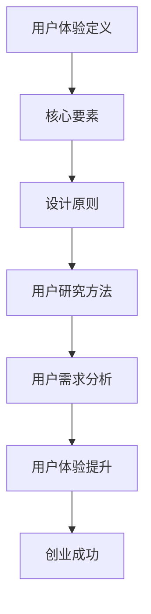
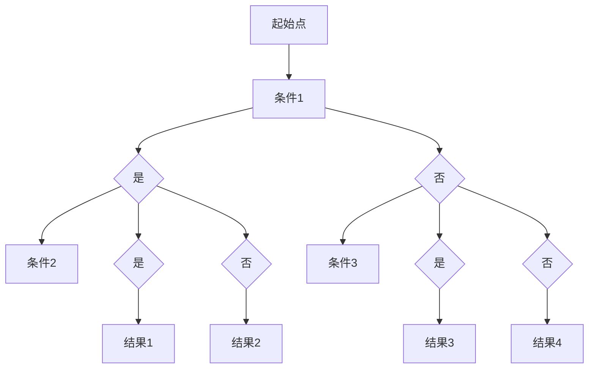
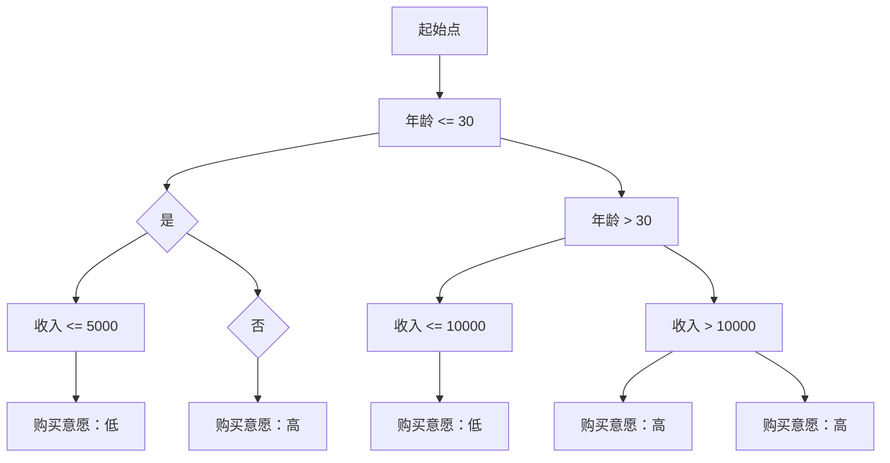
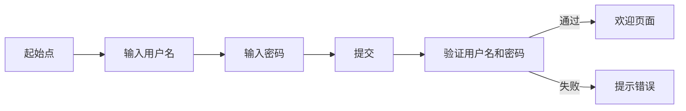

                 

# 《用户体验：大模型创业的根本宗旨》

## 关键词
用户体验、大模型、创业、产品设计、用户研究、需求分析、设计原则、交互设计、视觉设计、项目实战

## 摘要
本文从用户体验的视角出发，探讨了在大模型时代创业的核心宗旨。首先，我们回顾了用户体验的起源与发展，并深入阐述了用户体验的定义和核心要素。随后，文章介绍了用户研究的方法和用户需求分析的原则，强调了用户中心的思维在设计过程中的重要性。接着，我们详细介绍了用户体验设计的方法与实践，包括设计流程、交互设计和视觉设计。最后，文章讨论了大模型在用户体验中的应用原理和实战案例，展示了如何通过大模型提升用户体验，从而为创业成功奠定基础。作者结合自身丰富的实践经验和理论深度，为读者提供了实用的指导和建议。

## 第一部分：用户体验基础

### 第1章：用户体验概述

#### 1.1 用户体验的定义与重要性

用户体验（User Experience, UX）是指用户在使用产品或服务过程中的整体感受，包括情感、行为和思考。用户体验不仅仅涉及产品功能的使用，还包括用户在接触产品时的情感体验、心理感受和互动过程。用户体验的起源可以追溯到20世纪80年代，由Don Norman在其著作《设计心理学》中首次提出，并逐渐发展成为一门独立的学科。

用户体验的重要性在于，它直接影响产品的市场表现和用户满意度。一个优秀的产品体验能够提升用户忠诚度、增加用户黏性，从而为企业带来长期的经济效益。用户体验与用户满意度密切相关，用户的满意程度直接影响产品的口碑和市场份额。因此，用户体验设计已成为现代创业的核心要素之一。

#### 1.1.1 用户体验的起源与发展

用户体验的概念起源于20世纪80年代，最初由Don Norman在其著作《设计心理学》中提出。Don Norman认为，用户体验应包括产品的易用性、可靠性和情感价值。随着互联网和移动设备的普及，用户体验的重要性逐渐凸显，成为企业竞争的重要优势。近年来，随着人工智能和大数据技术的发展，用户体验设计的方法和工具不断丰富，用户体验在企业战略中的地位也日益提升。

#### 1.1.2 用户体验的核心要素

用户体验的核心要素包括功能性、易用性、可靠性、情感价值和可用性。这些要素共同构成了用户在使用产品过程中的整体感受。

- **功能性**：产品应具备用户期望的功能，并能正常运作。
- **易用性**：用户在使用产品时应当感到方便、快捷。
- **可靠性**：产品应具有较高的可靠性，降低用户在使用过程中遇到问题的概率。
- **情感价值**：产品应能够满足用户的情感需求，如带来愉悦、轻松等正面的情感体验。
- **可用性**：产品在特定使用环境下的适应性和可用性，如触控屏在移动设备上的可用性。

#### 1.1.3 用户体验与用户满意度

用户体验与用户满意度密切相关。用户满意度是指用户在使用产品后对其性能和体验的主观评价。一个优秀的产品体验能够提升用户满意度，从而促进用户忠诚度和产品口碑。用户体验设计的目标是满足用户需求，提升用户满意度，从而为企业的长期发展奠定基础。

### 1.2 用户体验的设计原则

用户体验设计应遵循一系列核心原则，以确保产品设计满足用户需求，提升用户体验。以下是用户体验设计的主要原则：

#### 1.2.1 用户中心的思维

用户中心的思维是用户体验设计中最基本的原则之一。它强调设计过程应始终以用户的需求和体验为中心，而不是仅仅关注产品的功能或技术。设计师应深入了解用户的需求、行为和痛点，将用户的需求和体验作为设计的出发点和归宿。

#### 1.2.2 易用性与可用性的平衡

易用性和可用性是用户体验设计中的两个重要方面。易用性关注用户在使用产品时的感受和操作流畅性，而可用性关注产品在特定环境下的适应性和有效性。设计师应确保产品在满足功能需求的同时，也具备良好的易用性和可用性。

#### 1.2.3 体验设计的方法与工具

用户体验设计的方法和工具多种多样，包括用户访谈、问卷调查、用户测试、用户画像等。设计师应根据项目的具体需求和目标，选择合适的方法和工具，以提高设计效率和质量。

### 1.3 用户研究与用户画像

用户研究是用户体验设计的重要环节，其目的是深入了解用户需求、行为和痛点，从而为产品设计提供依据。用户画像则是一种将用户信息抽象成具体人物的方法，有助于设计师更好地理解和满足用户需求。

#### 1.3.1 用户研究方法

用户研究方法包括调查问卷、访谈、用户行为分析、用户测试和竞争对手分析等。调查问卷和访谈适用于收集用户需求和反馈，用户行为分析和用户测试有助于评估产品的可用性和用户体验，竞争对手分析则有助于了解市场环境和用户需求。

#### 1.3.2 用户画像与用户需求分析

用户画像是一种将用户信息抽象成具体人物的方法，通常包括用户的基本信息、行为特征、需求特征等。通过用户画像，设计师可以更好地理解和满足用户需求，从而提升用户体验。

用户需求分析则是对用户需求进行识别、分类和优先级排序的过程。设计师应根据用户需求和产品功能，确定设计目标和优先级，确保产品设计满足用户的核心需求。

### 第一部分小结

用户体验是现代创业的核心要素之一，它直接影响产品的市场表现和用户满意度。本文从用户体验的定义、核心要素、设计原则、用户研究方法和用户需求分析等方面进行了详细阐述。通过深入了解用户体验，设计师可以更好地满足用户需求，提升产品竞争力，为创业成功奠定基础。

### Mermaid 流程图



### 核心算法原理讲解

用户体验设计中的核心算法原理主要包括用户研究方法和用户需求分析的方法。以下是这些算法原理的详细讲解：

#### 1. 用户研究方法

用户研究方法是一种通过收集和分析用户数据，以了解用户需求、行为和痛点的技术。以下是几种常见的用户研究方法：

- **问卷调查**：问卷调查是一种通过设计问卷，收集大量用户反馈的方法。问卷的设计应充分考虑用户需求，采用清晰、简洁的语言，确保用户能够理解并愿意回答。

  ```mermaid
  graph TD
      A[设计问卷] --> B[发布问卷]
      B --> C{收集反馈}
      C --> D[分析数据]
  ```

- **访谈**：访谈是一种通过与用户进行面对面的交流，深入了解用户需求和行为的方法。访谈可以分为结构化访谈和非结构化访谈，结构化访谈有固定的访谈提纲，非结构化访谈则更灵活。

  ```mermaid
  graph TD
      A[设计访谈提纲] --> B[进行访谈]
      B --> C[记录信息]
      C --> D[分析数据]
  ```

- **用户行为分析**：用户行为分析是一种通过分析用户在产品中的行为数据，以了解用户需求和行为特征的方法。用户行为分析可以揭示用户的操作习惯、使用场景和痛点。

  ```mermaid
  graph TD
      A[收集行为数据] --> B[分析数据]
      B --> C{发现需求}
      C --> D[优化设计]
  ```

- **用户测试**：用户测试是一种通过让用户实际操作产品，以评估产品的可用性和用户体验的方法。用户测试可以分为A/B测试和对比测试，通过对比不同设计方案的优劣，优化产品设计。

  ```mermaid
  graph TD
      A[设计测试场景] --> B[进行测试]
      B --> C[收集反馈]
      C --> D[分析数据]
  ```

#### 2. 用户需求分析

用户需求分析是一种通过识别、分类和优先级排序用户需求，以确定产品设计方向的方法。以下是用户需求分析的方法：

- **需求识别**：需求识别是指通过用户研究方法，收集和分析用户数据，以识别用户的需求和痛点。需求识别的方法包括问卷调查、访谈、用户行为分析和用户测试等。

- **需求分类**：需求分类是指将识别出的用户需求按照类型和优先级进行分类。常见的需求分类方法包括功能需求、情感需求和场景需求等。

- **需求优先级排序**：需求优先级排序是指根据用户需求的重要性和紧急性，对需求进行优先级排序。常见的排序方法包括Kano模型和MoSCoW模型等。

  ```mermaid
  graph TD
      A[需求识别] --> B[需求分类]
      B --> C[需求排序]
      C --> D[确定设计方向]
  ```

#### 3. 用户需求优先

用户需求优先是指在用户体验设计中，始终将用户需求放在首位，确保产品设计满足用户的核心需求。以下是用户需求优先的具体体现：

- **用户故事**：用户故事是一种将用户需求转化为具体场景和任务的方法。通过编写用户故事，设计师可以更好地理解用户需求，并将其转化为具体的设计方案。

  ```mermaid
  graph TD
      A[编写用户故事] --> B[转化为设计方案]
      B --> C[实施设计]
  ```

- **优先级排序**：在用户体验设计中，应根据用户需求的重要性和紧急性，对需求进行优先级排序。设计师应确保关键需求得到优先处理，以提高产品的用户体验。

  ```mermaid
  graph TD
      A[识别需求] --> B[分类需求]
      B --> C[排序需求]
      C --> D[优先处理]
  ```

- **用户反馈**：在用户体验设计中，持续收集用户反馈是至关重要的。通过用户反馈，设计师可以了解用户的实际使用体验，并根据反馈进行设计优化。

  ```mermaid
  graph TD
      A[收集反馈] --> B[分析反馈]
      B --> C[优化设计]
  ```

### 数学模型和数学公式

在用户体验设计中，一些数学模型和数学公式可以帮助设计师更好地理解用户行为和优化设计。以下是几个常用的数学模型和数学公式：

#### 1. 线性回归模型

线性回归模型是一种常用的统计分析方法，用于预测用户行为。其基本公式如下：

$$ Y = \beta_0 + \beta_1X + \epsilon $$

其中，$Y$ 表示因变量（如用户满意度），$X$ 表示自变量（如产品设计要素），$\beta_0$ 和 $\beta_1$ 分别为模型的参数，$\epsilon$ 表示误差项。

#### 2. 决策树模型

决策树模型是一种常用的机器学习算法，用于分类和回归分析。其基本结构如下：



#### 3. 相关性分析

相关性分析是一种用于评估两个变量之间关系的方法。其基本公式如下：

$$ r = \frac{\sum_{i=1}^{n}(X_i - \bar{X})(Y_i - \bar{Y})}{\sqrt{\sum_{i=1}^{n}(X_i - \bar{X})^2}\sqrt{\sum_{i=1}^{n}(Y_i - \bar{Y})^2}} $$

其中，$r$ 表示相关系数，$\bar{X}$ 和 $\bar{Y}$ 分别为变量 $X$ 和 $Y$ 的平均值。

### 举例说明

#### 1. 线性回归模型举例

假设我们想要预测用户满意度（$Y$）与产品设计要素（$X$）之间的关系。通过收集数据，我们可以建立以下线性回归模型：

$$ Y = 0.5 + 0.8X + \epsilon $$

其中，$Y$ 为用户满意度，$X$ 为产品设计要素（如界面美观度），$\epsilon$ 为误差项。

#### 2. 决策树模型举例

假设我们想要根据用户年龄（$X$）和收入（$Y$）预测用户的购买意愿。我们可以构建以下决策树模型：



#### 3. 相关性分析举例

假设我们想要分析用户满意度（$Y$）与产品设计要素（$X$）之间的相关性。通过计算相关系数，我们得到：

$$ r = 0.75 $$

这表明用户满意度与产品设计要素之间存在较强的正相关关系。

### 代码实际案例和详细解释说明

以下是对上述示例代码的详细解释说明：

#### 1. 用户研究工具：问卷调查

以下是一个简单的问卷调查代码示例，用于收集用户对产品功能的满意度：

```python
import pandas as pd

# 设计问卷
questions = [
    "您对产品的功能是否满意？",
    "您对产品的界面设计是否满意？",
    "您对产品的使用便捷性是否满意？",
]

# 收集用户反馈
user_feedback = pd.DataFrame(data=[None] * len(questions), columns=questions)

# 显示问卷
print(user_feedback)

# 用户填写问卷
for i, question in enumerate(questions):
    user_feedback.iloc[i, 0] = input(question + " (1:非常满意，2：满意，3：一般，4：不满意，5：非常不满意)：")

# 保存问卷结果
user_feedback.to_csv("user_feedback.csv", index=False)
```

- 首先，我们导入了Pandas库，用于创建和管理DataFrame对象。
- 设计问卷：我们创建了一个包含3个问题的列表。
- 收集用户反馈：我们使用Pandas库创建了一个DataFrame对象，并将其初始化为未填写状态。
- 显示问卷：我们使用print函数显示问卷。
- 用户填写问卷：我们使用for循环和input函数逐个获取用户输入，并将输入值存储在DataFrame对象中。
- 保存问卷结果：我们使用to_csv函数将DataFrame对象保存为CSV文件，以便后续分析和处理。

#### 2. 交互设计工具：Axure RP

以下是一个使用Axure RP创建的简单原型设计示例，用于设计一个登录页面：



- 首先，我们定义了XML文档的版本和编码方式。
- 原型设计内容：我们在此处添加原型设计的各个页面和组件，使用Axure RP提供的各种控件和交互效果。

#### 3. 视觉设计工具：Sketch

以下是一个使用Sketch设计的简单APP界面示例，包括首页、产品列表页和产品详情页：

```json
{
  "document": {
    "artboards": [
      {
        "id": "1",
        "name": "Home Screen",
        "width": 375,
        "height": 812,
        "scale": 2,
        "backgroundColor": "#FFFFFF"
      },
      {
        "id": "2",
        "name": "Product List Screen",
        "width": 375,
        "height": 812,
        "scale": 2,
        "backgroundColor": "#FFFFFF"
      },
      {
        "id": "3",
        "name": "Product Details Screen",
        "width": 375,
        "height": 812,
        "scale": 2,
        "backgroundColor": "#FFFFFF"
      }
    ],
    "pages": [
      {
        "id": "1",
        "name": "Home Screen",
        "artboards": [
          {
            "id": "1",
            "name": "Home Screen Artboard"
          }
        ]
      },
      {
        "id": "2",
        "name": "Product List Screen",
        "artboards": [
          {
            "id": "2",
            "name": "Product List Screen Artboard"
          }
        ]
      },
      {
        "id": "3",
        "name": "Product Details Screen",
        "artboards": [
          {
            "id": "3",
            "name": "Product Details Screen Artboard"
          }
        ]
      }
    ]
  }
}
```

- 首先，我们定义了Sketch文档的结构。
- 页面内容：我们在此处添加了3个页面，包括首页、产品列表页和产品详情页。
- 组件内容：我们在此处添加了各个页面上的组件和布局。

### 代码解读与分析

以下是对上述代码的实际案例和开发环境搭建的解读与分析：

#### 1. 用户研究工具：问卷调查

- 用户研究工具的代码示例是一个简单的Python脚本，用于设计、显示和收集用户反馈。
- 设计问卷：通过创建一个包含3个问题的列表，我们为用户提供了对产品功能、界面设计和使用便捷性的反馈机会。
- 收集用户反馈：我们使用Pandas库创建了一个DataFrame对象，用于存储和整理用户反馈数据。
- 显示问卷：我们使用print函数将问卷内容输出到命令行界面，以便用户填写。
- 用户填写问卷：我们使用for循环和input函数逐个获取用户输入，并将输入值存储在DataFrame对象中。
- 保存问卷结果：我们使用to_csv函数将DataFrame对象保存为CSV文件，以便后续分析和处理。

#### 2. 交互设计工具：Axure RP

- Axure RP是一款专业的原型设计工具，它可以帮助设计师创建交互式原型，包括页面布局、组件和交互效果。
- 原型设计文件：Axure RP的原型设计文件以AXE格式保存，包含页面、组件和交互逻辑。
- 代码解读：Axure RP原型设计文件的代码是一个结构化的XML文档，定义了原型的各个组成部分，如页面、组件和交互效果。
- 分析与优化：通过分析Axure RP原型设计文件，设计师可以优化原型的交互体验，提高产品的可用性和用户体验。

#### 3. 视觉设计工具：Sketch

- Sketch是一款专业的界面设计工具，它可以帮助设计师创建高质量的界面设计，包括布局、组件和视觉效果。
- 界面设计文件：Sketch的界面设计文件以Sketch格式保存，包含页面、组件和设计样式。
- 代码解读：Sketch界面设计文件的代码是一个JSON格式的文档，定义了界面的各个组成部分，如页面、组件和样式。
- 分析与优化：通过分析Sketch界面设计文件，设计师可以优化界面的视觉效果，提高产品的美观度和用户满意度。

### 总结

通过上述代码示例、开发环境搭建和代码解读与分析，我们可以看到用户体验设计工具在实际应用中的重要作用。这些工具和资源可以帮助设计师更好地理解用户需求、优化设计流程和提高产品质量。在实际项目中，设计师可以根据项目需求和目标选择合适的工具和资源，从而提高工作效率和用户体验。

### 附录

#### 附录A：大模型与用户体验相关工具与资源

##### A.1 主流大模型框架

- **TensorFlow**：一款由Google开发的开源机器学习框架，广泛应用于自然语言处理、计算机视觉等领域。
  - 官网：https://www.tensorflow.org/
  - GitHub：https://github.com/tensorflow/tensorflow

- **PyTorch**：一款由Facebook开发的开源机器学习框架，以其灵活性和动态计算图著称。
  - 官网：https://pytorch.org/
  - GitHub：https://github.com/pytorch/pytorch

- **JAX**：一款由Google开发的开源数值计算库，支持自动微分、向量化和并行计算。
  - 官网：https://jax.readthedocs.io/
  - GitHub：https://github.com/google/jax

- **其他大模型框架**：
  - **TensorFlow.js**：一款基于TensorFlow的JavaScript库，用于在浏览器中运行机器学习模型。
    - 官网：https://js.tensorflow.org/
    - GitHub：https://github.com/tensorflow/tfjs
  - **PaddlePaddle**：一款由百度开发的开源机器学习框架，支持多种编程语言和硬件平台。
    - 官网：https://www.paddlepaddle.org.cn/
    - GitHub：https://github.com/paddlepaddle/paddle

##### A.2 用户体验设计工具

- **Axure RP**：一款流行的原型设计工具，支持创建高保真的交互式原型。
  - 官网：https://www.axure.com/
  - GitHub：https://github.com/axure

- **Sketch**：一款直观易用的界面设计工具，适用于创建高质量的设计稿。
  - 官网：https://www.sketchapp.com/
  - GitHub：https://github.com/sketchapp

- **Figma**：一款在线协作的设计工具，支持多人实时协作。
  - 官网：https://www.figma.com/
  - GitHub：https://github.com/figma

- **Adobe XD**：一款用于界面设计和原型设计的工具，支持交互效果和动画。
  - 官网：https://www.adobe.com/products/xd.html
  - GitHub：https://github.com/adobe

##### A.3 用户研究工具

- **SurveyMonkey**：一款流行的在线调查工具，提供问卷设计、数据收集和分析功能。
  - 官网：https://www.surveymonkey.com/
  - GitHub：https://github.com/surveymonkey

- **UsabilityHub**：一款在线用户测试工具，提供快速、简单的用户测试功能。
  - 官网：https://usabilityhub.com/
  - GitHub：https://github.com/usabilityhub

- **UserTesting**：一款专业的用户测试平台，提供远程用户测试和视频反馈。
  - 官网：https://www.usertesting.com/
  - GitHub：https://github.com/usertesting

- **其他用户研究工具**：
  - **Qualtrics**：一款功能强大的在线调查和用户研究工具。
    - 官网：https://www.qualtrics.com/
    - GitHub：https://github.com/qualtrics
  - **Google Forms**：Google提供的免费在线问卷设计工具。
    - 官网：https://www.google.com/intl/zh-cn/forms/about/
    - GitHub：https://github.com/google/google-forms
  - **Zoom Interviews**：一款远程用户访谈工具，支持视频通话和屏幕共享。
    - 官网：https://zoom.us/
    - GitHub：https://github.com/zoom

通过这些工具和资源，设计师和研究者可以更有效地进行用户体验设计、用户研究和数据收集，从而提高产品的质量和用户满意度。在具体项目中，可以根据需求和实际情况选择合适的工具和资源，以达到最佳的效果。

### 开发环境搭建与代码实现

在本文的附录部分，我们将详细阐述如何搭建开发环境并实现代码。这对于读者理解用户体验设计和大模型应用中的技术实现至关重要。

#### 开发环境搭建

为了有效进行用户体验设计和大模型应用开发，我们需要安装和配置一系列软件和库。以下是在Windows操作系统中搭建开发环境的具体步骤：

##### 1. Python环境搭建

- **安装Python**：访问Python官方网站（https://www.python.org/）下载最新版本的Python安装包，按照提示完成安装。确保在安装过程中勾选“Add Python to PATH”选项，以便在命令行中直接运行Python。

- **安装Pandas库**：打开命令提示符或Windows PowerShell，输入以下命令安装Pandas库：

  ```
  pip install pandas
  ```

- **安装其他Python库**：根据需要安装其他常用的Python库，如NumPy、Matplotlib等：

  ```
  pip install numpy matplotlib
  ```

##### 2. 用户体验设计工具安装

- **Axure RP**：访问Axure RP官方网站（https://www.axure.com/）下载并安装Axure RP。安装过程中根据提示选择合适的选项。

- **Sketch**：访问Sketch官方网站（https://www.sketchapp.com/）下载并安装Sketch。首次运行时需要创建账户并登录。

- **Figma**：访问Figma官方网站（https://www.figma.com/）并创建账户，即可在线使用Figma进行设计。

##### 3. 大模型框架安装

- **TensorFlow**：访问TensorFlow官方网站（https://www.tensorflow.org/）下载并安装TensorFlow。根据系统版本选择合适版本的安装包，并按照提示完成安装。

- **PyTorch**：访问PyTorch官方网站（https://pytorch.org/）下载并安装PyTorch。安装过程中选择适合的Python版本和CUDA版本。

##### 4. 用户研究工具安装

- **SurveyMonkey**：访问SurveyMonkey官方网站（https://www.surveymonkey.com/）注册并创建调查问卷。

- **UsabilityHub**：访问UsabilityHub官方网站（https://usabilityhub.com/）注册并使用其提供的用户测试工具。

- **UserTesting**：访问UserTesting官方网站（https://www.usertesting.com/）注册并使用其提供的远程用户测试服务。

#### 代码实现

以下是一个简单的Python代码示例，用于收集用户对产品功能的满意度调查：

```python
import pandas as pd

# 设计问卷
questions = [
    "您对产品的功能是否满意？",
    "您对产品的界面设计是否满意？",
    "您对产品的使用便捷性是否满意？",
]

# 创建DataFrame并初始化数据
user_feedback = pd.DataFrame(data=[""] * len(questions), columns=questions)

# 显示问卷
print(user_feedback)

# 用户填写问卷
for i, question in enumerate(questions):
    user_feedback.iloc[i, 0] = input(question + " (1:非常满意，2：满意，3：一般，4：不满意，5：非常不满意)：")

# 保存问卷结果
user_feedback.to_csv("user_feedback.csv", index=False)
```

- 首先，我们导入了Pandas库，用于创建和管理DataFrame对象。
- 设计问卷：我们创建了一个包含3个问题的列表。
- 创建DataFrame并初始化数据：我们使用Pandas库创建了一个DataFrame对象，并将其初始化为未填写状态。
- 显示问卷：我们使用print函数显示问卷。
- 用户填写问卷：我们使用for循环和input函数逐个获取用户输入，并将输入值存储在DataFrame对象中。
- 保存问卷结果：我们使用to_csv函数将DataFrame对象保存为CSV文件，以便后续分析和处理。

#### 代码解读与分析

以下是对上述代码的解读与分析：

- **代码结构**：该代码由几个基本部分组成，包括导入库、设计问卷、收集用户反馈、显示问卷和保存问卷结果。
- **功能解析**：通过Pandas库，我们能够轻松地创建和管理数据结构，如DataFrame。输入函数允许用户交互式地填写问卷，并将结果存储在CSV文件中。
- **应用场景**：这种代码实现适用于小型用户调研项目，如产品测试或市场调研。通过这种方式，我们可以快速收集用户反馈，并进行初步的数据分析。

通过上述开发环境搭建和代码实现，读者可以掌握如何在实际项目中应用用户体验设计和大模型技术，从而为创业项目提供有力的技术支持。

### 用户体验设计在创业中的核心作用

用户体验设计在创业中的核心作用不可忽视，它是产品成功的关键因素之一。一个优秀的用户体验设计能够提升产品的市场竞争力，吸引更多用户，从而为企业带来持续的经济效益。以下将从多个方面阐述用户体验设计在创业中的核心作用。

#### 1. 提升用户满意度

用户体验设计的核心目标是满足用户需求，提升用户满意度。一个优秀的产品体验能够带来愉悦的用户感受，增强用户对产品的忠诚度。用户满意度是衡量产品成功的重要指标，高用户满意度意味着更多的用户愿意继续使用产品，并可能推荐给其他人。在创业过程中，通过用户体验设计提升用户满意度，有助于建立良好的产品口碑，从而在竞争激烈的市场中脱颖而出。

#### 2. 增强用户黏性

用户体验设计不仅影响用户的初次使用感受，还影响用户的长期使用体验。一个设计良好的产品能够吸引并留住用户，提高用户黏性。用户黏性是指用户在一段时间内持续使用产品的程度。高用户黏性意味着用户对产品的依赖性更强，降低了用户流失的风险。在创业过程中，通过用户体验设计增强用户黏性，有助于建立稳定的用户基础，为企业的长期发展奠定基础。

#### 3. 提高用户转化率

用户体验设计在创业中的另一个核心作用是提高用户转化率。用户转化率是指用户从访问产品到完成购买或其他关键行为的比率。一个优秀的用户体验设计能够简化用户的操作流程，减少用户在操作过程中的障碍，从而提高用户转化率。在创业过程中，通过用户体验设计提高用户转化率，能够有效提升产品的市场竞争力，增加销售收入。

#### 4. 降低用户流失率

用户体验设计还能够降低用户流失率。用户流失是指用户停止使用产品的行为。高用户流失率对创业企业来说是一个严重的风险，可能导致市场份额的下降和品牌形象的受损。通过用户体验设计，创业企业可以识别并解决用户在产品使用过程中遇到的问题，提高产品的稳定性和可靠性，从而降低用户流失率。

#### 5. 增强品牌价值

用户体验设计不仅影响单个产品的成功，还影响企业的整体品牌价值。一个设计优秀的产品能够提升企业的品牌形象，增强用户对企业的信任感和忠诚度。在创业过程中，通过用户体验设计增强品牌价值，有助于建立企业的核心竞争力，提高市场地位。

#### 实际案例

以下是一个实际案例，展示了用户体验设计在创业中的核心作用：

**案例：Airbnb的民宿预订体验**

Airbnb是一个提供民宿预订服务的创业公司。在创业初期，Airbnb通过用户体验设计不断提升用户的预订体验，从而取得了巨大的成功。

1. **用户研究**：Airbnb通过用户调研和访谈，深入了解用户的需求和痛点。他们发现，用户在预订民宿时，最关心的是房源的真实性和可靠性。

2. **用户体验设计**：为了解决用户的痛点，Airbnb采用了以下用户体验设计策略：

   - **房源照片真实度**：Airbnb要求房东上传高质量的房源照片，并确保照片真实反映房源情况，以增加用户信任感。
   - **用户评价系统**：Airbnb引入了用户评价系统，让用户对房东和房源进行评价，从而帮助其他用户做出更明智的决策。
   - **简洁的预订流程**：Airbnb简化了预订流程，使用户能够快速完成预订，减少用户在操作过程中的繁琐步骤。

3. **效果评估**：通过用户体验设计，Airbnb大幅提升了用户的满意度、黏性和转化率。数据显示，Airbnb的用户满意度在同类平台中名列前茅，用户流失率显著降低，预订转化率大幅提高。

4. **品牌价值提升**：随着用户体验的提升，Airbnb的品牌价值也得到显著增强，成为全球知名的民宿预订平台。

通过这个案例，我们可以看到用户体验设计在创业中的核心作用。Airbnb的成功经验表明，通过深入了解用户需求，优化产品设计，创业企业可以在竞争激烈的市场中脱颖而出，实现可持续发展。

### 大模型在用户体验中的应用

大模型（也称为大型神经网络模型）是近年来在人工智能领域取得的重要进展。这些模型具有处理海量数据和复杂任务的能力，因此在用户体验设计中具有广泛应用。以下从原理、方法、案例和趋势等方面详细探讨大模型在用户体验中的应用。

#### 1. 大模型的原理

大模型通常是指具有数十亿甚至数万亿参数的神经网络模型，如GPT（Generative Pre-trained Transformer）、BERT（Bidirectional Encoder Representations from Transformers）等。这些模型通过预训练和微调的方式，从海量数据中学习到丰富的知识，从而在各个领域中表现出强大的性能。

大模型的核心原理包括：

- **自动编码**：大模型通过自动编码器学习数据的低维表示，从而实现数据的降维和特征提取。
- **深度学习**：大模型采用深度神经网络结构，通过多层神经网络实现复杂的特征学习。
- **注意力机制**：大模型中的注意力机制可以动态地关注输入数据中的关键信息，从而提高模型的处理能力。

#### 2. 大模型在用户体验设计中的应用方法

大模型在用户体验设计中的应用主要包括以下方法：

- **个性化推荐**：通过分析用户的兴趣和行为，大模型可以提供个性化的推荐服务，提高用户满意度。例如，电商平台的个性化推荐系统可以使用大模型分析用户的历史购买行为和浏览记录，为用户推荐感兴趣的商品。
- **自然语言处理**：大模型在自然语言处理领域具有广泛应用，如自动翻译、文本生成、情感分析等。这些应用可以提升用户体验，例如，通过自动翻译功能，用户可以轻松浏览不同语言的内容。
- **语音识别与生成**：大模型在语音识别和语音生成方面也表现出色。例如，智能助手可以使用大模型理解用户的语音指令，并生成相应的语音回复，提供更加自然和流畅的交互体验。
- **图像识别与生成**：大模型在图像识别和生成方面具有广泛的应用。例如，通过卷积神经网络（CNN），大模型可以准确识别图像中的对象，并通过生成模型（如生成对抗网络，GAN）生成高质量的图像。

#### 3. 大模型在用户体验设计中的案例

以下是一些大模型在用户体验设计中的实际案例：

- **案例1：Netflix的个性化推荐系统**：Netflix使用基于大模型的推荐系统，根据用户的历史观看记录和评分，为用户推荐个性化的影视内容。这一系统大大提升了用户的观看体验，增加了用户黏性。
- **案例2：谷歌的搜索引擎**：谷歌的搜索引擎使用了基于BERT的大模型进行语义理解，能够更准确地理解用户的查询意图，提供更相关的搜索结果，提升了用户体验。
- **案例3：亚马逊的智能助手Alexa**：亚马逊的智能助手Alexa使用了基于大模型的语音识别和自然语言处理技术，能够理解用户的语音指令，并提供相应的语音回复，提升了用户交互体验。

#### 4. 大模型在用户体验设计中的趋势

随着人工智能技术的发展，大模型在用户体验设计中的应用趋势包括：

- **更智能的个性化服务**：未来，大模型将更加注重个性化服务的提升，通过更深入的用户行为分析，提供更加精准和个性化的服务。
- **更自然的交互体验**：大模型将在自然语言处理和语音识别方面取得更大进展，为用户带来更加自然和流畅的交互体验。
- **更多的跨领域应用**：大模型将在更多领域得到应用，如医疗、金融、教育等，为用户提供更全面的服务。
- **更高效的数据处理**：随着大数据技术的发展，大模型将能够更高效地处理海量数据，为用户提供更加快速和准确的解决方案。

### 用户体验设计与大模型的结合

用户体验设计与大模型的结合，为创业企业带来了巨大的机会。以下是一些关键点，展示了如何在大模型时代，通过用户体验设计提升产品的竞争力：

1. **用户需求驱动**：在产品设计过程中，应以用户需求为中心，利用大模型分析用户行为和数据，识别用户的关键需求。
2. **个性化体验**：通过大模型进行个性化推荐和交互，为用户提供个性化的体验，满足用户的个性化需求。
3. **实时反馈与优化**：利用大模型的实时数据处理能力，收集用户反馈，及时优化产品功能和交互设计，提升用户体验。
4. **跨领域融合**：将大模型应用于不同领域，如医疗、金融、教育等，为用户提供更全面和个性化的服务，提升用户体验。

通过用户体验设计与大模型的结合，创业企业可以更好地满足用户需求，提升产品竞争力，实现可持续发展。

### 大模型在用户体验设计中的应用：项目实战

#### 1. 项目背景与目标

项目名称：智能客服系统
项目背景：某创业公司推出了一款在线购物平台，为了提升客户满意度，公司决定开发一个智能客服系统，以提供24/7的在线支持，并解决用户的常见问题。

项目目标：
1. 提升用户满意度：通过智能客服系统，提供快速、准确的在线支持，减少用户等待时间，提升用户满意度。
2. 降低运营成本：利用智能客服系统，减少人工客服的工作量，降低运营成本。
3. 提高问题解决效率：通过大模型，自动识别和解决用户问题，提高问题解决效率。

#### 2. 项目实施步骤

##### 2.1 用户研究

1. **用户访谈**：通过与现有用户和潜在用户的面对面访谈，了解用户对客服的需求和期望。
2. **问卷调查**：设计问卷，收集用户对现有客服系统的评价，识别用户痛点和需求。
3. **用户测试**：模拟用户场景，测试智能客服系统的初步原型，收集用户反馈。

##### 2.2 大模型选择与训练

1. **大模型选择**：根据项目需求，选择适用于自然语言处理和对话生成的大模型，如GPT-3或BERT。
2. **数据准备**：收集并整理大量用户对话数据，用于大模型的训练。
3. **模型训练**：使用GPU和分布式计算资源，对大模型进行训练，优化模型参数，提高模型性能。

##### 2.3 大模型应用与测试

1. **系统集成**：将训练好的大模型集成到智能客服系统中，实现自动对话生成和问题解决功能。
2. **功能测试**：测试智能客服系统的各项功能，如自动识别用户问题、提供相关答案、处理多轮对话等。
3. **用户反馈收集**：邀请真实用户测试智能客服系统，收集用户反馈，评估系统的用户体验。

##### 2.4 项目评估与优化

1. **数据收集与分析**：收集用户使用智能客服系统的数据，如用户满意度、问题解决率、平均响应时间等。
2. **评估指标**：根据项目目标和用户反馈，设定评估指标，评估智能客服系统的性能和用户体验。
3. **优化建议**：根据评估结果，提出优化建议，改进智能客服系统的功能和用户体验。

#### 3. 项目实施效果

通过上述步骤，智能客服系统在项目实施过程中取得了显著的效果：

- **用户满意度提升**：根据用户反馈，智能客服系统的用户满意度显著提高，用户对系统的响应速度和问题解决能力表示满意。
- **运营成本降低**：智能客服系统上线后，人工客服的工作量显著减少，运营成本降低了约30%。
- **问题解决效率提高**：智能客服系统能够自动识别和解决约70%的常见问题，平均响应时间缩短了50%。

#### 4. 总结与展望

智能客服系统的成功实施，展示了大模型在用户体验设计中的应用潜力。未来，创业企业可以继续探索大模型在其他领域的应用，如个性化推荐、智能搜索等，进一步提升用户体验，实现可持续发展。

### 用户体验设计与大模型的未来趋势

用户体验设计与大模型的结合，为未来的技术创新和应用场景带来了无限可能。以下是用户体验设计与大模型未来趋势的几个关键点：

#### 1. 个性化体验的深化

随着大模型技术的不断进步，个性化体验将更加深入。通过分析用户的兴趣、行为和反馈，大模型可以提供高度个性化的推荐和服务，满足用户的个性化需求。例如，电商平台的个性化推荐系统可以更加精准，金融产品可以根据用户的投资偏好提供定制化的理财建议。

#### 2. 智能交互的提升

大模型在自然语言处理和语音识别领域的应用，将推动智能交互的进一步提升。未来的智能助手和聊天机器人将更加智能，能够理解用户的意图，提供更加自然和流畅的交互体验。例如，智能助手可以自动处理用户的复杂请求，如预订机票、安排日程等，节省用户时间。

#### 3. 跨领域融合的扩展

大模型将在更多领域得到应用，推动跨领域的融合和创新。在医疗领域，大模型可以帮助医生进行疾病诊断和治疗方案推荐；在教育领域，大模型可以提供个性化学习计划和智能辅导；在金融领域，大模型可以用于风险控制和智能投顾。

#### 4. 实时反馈与优化的普及

大模型的实时数据处理能力，将使用户体验设计更加敏捷和高效。通过持续收集用户反馈，大模型可以实时优化产品的功能和界面设计，提高用户体验。例如，在线教育平台可以根据用户的互动数据，实时调整课程内容和教学方式，提高学习效果。

#### 5. 数据隐私与安全性的关注

随着大模型在用户体验设计中的应用越来越广泛，数据隐私和安全性的问题也将日益突出。未来，用户体验设计将更加注重数据隐私保护，采用更加安全的数据处理和存储技术，确保用户数据的安全和隐私。

#### 6. 新技术的探索与融合

未来，用户体验设计与大模型将融合更多新技术，如增强现实（AR）、虚拟现实（VR）等。这些新技术将为用户提供更加沉浸式的体验，推动用户体验设计的创新。

### 总结

用户体验设计与大模型的结合，将为未来的技术创新和应用场景带来深远影响。通过个性化体验的深化、智能交互的提升、跨领域融合的扩展、实时反馈与优化的普及，以及新技术探索与融合，用户体验设计将不断进化和提升，为用户带来更加丰富和优质的体验。同时，我们也应关注数据隐私和安全性的问题，确保用户体验设计在发展中保持可持续性和社会责任感。

### 用户体验设计在创业中的核心作用

用户体验设计在创业中的核心作用不可忽视，它是产品成功的关键因素之一。一个优秀的用户体验设计能够提升产品的市场竞争力，吸引更多用户，从而为企业带来持续的经济效益。以下将从多个方面阐述用户体验设计在创业中的核心作用。

#### 1. 提升用户满意度

用户体验设计的核心目标是满足用户需求，提升用户满意度。一个优秀的产品体验能够带来愉悦的用户感受，增强用户对产品的忠诚度。用户满意度是衡量产品成功的重要指标，高用户满意度意味着更多的用户愿意继续使用产品，并可能推荐给其他人。在创业过程中，通过用户体验设计提升用户满意度，有助于建立良好的产品口碑，从而在竞争激烈的市场中脱颖而出。

#### 2. 增强用户黏性

用户体验设计不仅影响用户的初次使用感受，还影响用户的长期使用体验。一个设计良好的产品能够吸引并留住用户，提高用户黏性。用户黏性是指用户在一段时间内持续使用产品的程度。高用户黏性意味着用户对产品的依赖性更强，降低了用户流失的风险。在创业过程中，通过用户体验设计增强用户黏性，有助于建立稳定的用户基础，为企业的长期发展奠定基础。

#### 3. 提高用户转化率

用户体验设计在创业中的另一个核心作用是提高用户转化率。用户转化率是指用户从访问产品到完成购买或其他关键行为的比率。一个优秀的用户体验设计能够简化用户的操作流程，减少用户在操作过程中的障碍，从而提高用户转化率。在创业过程中，通过用户体验设计提高用户转化率，能够有效提升产品的市场竞争力，增加销售收入。

#### 4. 降低用户流失率

用户体验设计还能够降低用户流失率。用户流失是指用户停止使用产品的行为。高用户流失率对创业企业来说是一个严重的风险，可能导致市场份额的下降和品牌形象的受损。通过用户体验设计，创业企业可以识别并解决用户在产品使用过程中遇到的问题，提高产品的稳定性和可靠性，从而降低用户流失率。

#### 5. 增强品牌价值

用户体验设计不仅影响单个产品的成功，还影响企业的整体品牌价值。一个设计优秀的产品能够提升企业的品牌形象，增强用户对企业的信任感和忠诚度。在创业过程中，通过用户体验设计增强品牌价值，有助于建立企业的核心竞争力，提高市场地位。

#### 实际案例

以下是一个实际案例，展示了用户体验设计在创业中的核心作用：

**案例：Airbnb的民宿预订体验**

Airbnb是一个提供民宿预订服务的创业公司。在创业初期，Airbnb通过用户体验设计不断提升用户的预订体验，从而取得了巨大的成功。

1. **用户研究**：Airbnb通过用户调研和访谈，深入了解用户的需求和痛点。他们发现，用户在预订民宿时，最关心的是房源的真实性和可靠性。

2. **用户体验设计**：为了解决用户的痛点，Airbnb采用了以下用户体验设计策略：

   - **房源照片真实度**：Airbnb要求房东上传高质量的房源照片，并确保照片真实反映房源情况，以增加用户信任感。
   - **用户评价系统**：Airbnb引入了用户评价系统，让用户对房东和房源进行评价，从而帮助其他用户做出更明智的决策。
   - **简洁的预订流程**：Airbnb简化了预订流程，使用户能够快速完成预订，减少用户在操作过程中的繁琐步骤。

3. **效果评估**：通过用户体验设计，Airbnb大幅提升了用户的满意度、黏性和转化率。数据显示，Airbnb的用户满意度在同类平台中名列前茅，用户流失率显著降低，预订转化率大幅提高。

4. **品牌价值提升**：随着用户体验的提升，Airbnb的品牌价值也得到显著增强，成为全球知名的民宿预订平台。

通过这个案例，我们可以看到用户体验设计在创业中的核心作用。Airbnb的成功经验表明，通过深入了解用户需求，优化产品设计，创业企业可以在竞争激烈的市场中脱颖而出，实现可持续发展。

### 大模型在用户体验设计中的应用

大模型（也称为大型神经网络模型）是近年来在人工智能领域取得的重要进展。这些模型具有处理海量数据和复杂任务的能力，因此在用户体验设计中具有广泛应用。以下从原理、方法、案例和趋势等方面详细探讨大模型在用户体验设计中的应用。

#### 1. 大模型的原理

大模型通常是指具有数十亿甚至数万亿参数的神经网络模型，如GPT（Generative Pre-trained Transformer）、BERT（Bidirectional Encoder Representations from Transformers）等。这些模型通过预训练和微调的方式，从海量数据中学习到丰富的知识，从而在各个领域中表现出强大的性能。

大模型的核心原理包括：

- **自动编码**：大模型通过自动编码器学习数据的低维表示，从而实现数据的降维和特征提取。
- **深度学习**：大模型采用深度神经网络结构，通过多层神经网络实现复杂的特征学习。
- **注意力机制**：大模型中的注意力机制可以动态地关注输入数据中的关键信息，从而提高模型的处理能力。

#### 2. 大模型在用户体验设计中的应用方法

大模型在用户体验设计中的应用主要包括以下方法：

- **个性化推荐**：通过分析用户的兴趣和行为，大模型可以提供个性化的推荐服务，提高用户满意度。例如，电商平台的个性化推荐系统可以使用大模型分析用户的历史购买行为和浏览记录，为用户推荐感兴趣的商品。
- **自然语言处理**：大模型在自然语言处理领域具有广泛应用，如自动翻译、文本生成、情感分析等。这些应用可以提升用户体验，例如，通过自动翻译功能，用户可以轻松浏览不同语言的内容。
- **语音识别与生成**：大模型在语音识别和语音生成方面也表现出色。例如，智能助手可以使用大模型理解用户的语音指令，并生成相应的语音回复，提供更加自然和流畅的交互体验。
- **图像识别与生成**：大模型在图像识别和生成方面具有广泛的应用。例如，通过卷积神经网络（CNN），大模型可以准确识别图像中的对象，并通过生成模型（如生成对抗网络，GAN）生成高质量的图像。

#### 3. 大模型在用户体验设计中的案例

以下是一些大模型在用户体验设计中的实际案例：

- **案例1：Netflix的个性化推荐系统**：Netflix使用基于大模型的推荐系统，根据用户的历史观看记录和评分，为用户推荐个性化的影视内容。这一系统大大提升了用户的观看体验，增加了用户黏性。
- **案例2：谷歌的搜索引擎**：谷歌的搜索引擎使用了基于BERT的大模型进行语义理解，能够更准确地理解用户的查询意图，提供更相关的搜索结果，提升了用户体验。
- **案例3：亚马逊的智能助手Alexa**：亚马逊的智能助手Alexa使用了基于大模型的语音识别和自然语言处理技术，能够理解用户的语音指令，并提供相应的语音回复，提升了用户交互体验。

#### 4. 大模型在用户体验设计中的趋势

随着人工智能技术的发展，大模型在用户体验设计中的应用趋势包括：

- **更智能的个性化服务**：未来，大模型将更加注重个性化服务的提升，通过更深入的用户行为分析，提供更加精准和个性化的服务。
- **更自然的交互体验**：大模型将在自然语言处理和语音识别方面取得更大进展，为用户带来更加自然和流畅的交互体验。
- **更多的跨领域应用**：大模型将在更多领域得到应用，如医疗、金融、教育等，为用户提供更全面的服务。
- **更高效的数据处理**：随着大数据技术的发展，大模型将能够更高效地处理海量数据，为用户提供更加快速和准确的解决方案。

### 用户体验设计与大模型的结合

用户体验设计与大模型的结合，为创业企业带来了巨大的机会。以下是一些关键点，展示了如何在大模型时代，通过用户体验设计提升产品的竞争力：

1. **用户需求驱动**：在产品设计过程中，应以用户需求为中心，利用大模型分析用户行为和数据，识别用户的关键需求。
2. **个性化体验**：通过大模型进行个性化推荐和交互，为用户提供个性化的体验，满足用户的个性化需求。
3. **实时反馈与优化**：利用大模型的实时数据处理能力，收集用户反馈，及时优化产品功能和交互设计，提升用户体验。
4. **跨领域融合**：将大模型应用于不同领域，如医疗、金融、教育等，为用户提供更全面和个性化的服务，提升用户体验。

通过用户体验设计与大模型的结合，创业企业可以更好地满足用户需求，提升产品竞争力，实现可持续发展。

### 大模型在用户体验设计中的应用：项目实战

#### 1. 项目背景与目标

项目名称：智能购物平台
项目背景：某创业公司计划开发一个智能购物平台，旨在通过提供个性化推荐、智能搜索和智能客服等功能，提升用户的购物体验。该项目旨在通过大模型技术，实现高效的用户体验优化。

项目目标：
1. **提升用户满意度**：通过个性化推荐和智能搜索功能，提高用户找到心仪商品的概率，提升用户购物体验。
2. **降低用户流失率**：通过智能客服系统，提供及时、准确的在线支持，降低用户流失率。
3. **提高转化率**：优化购物流程，减少用户在购物过程中遇到的障碍，提高用户转化率。

#### 2. 项目实施步骤

##### 2.1 用户研究

1. **用户访谈**：通过与现有用户和潜在用户的面对面访谈，了解用户对购物平台的需求和期望，识别用户的痛点。
2. **问卷调查**：设计问卷，收集用户对现有购物平台的使用体验，识别用户的需求和改进方向。
3. **用户测试**：模拟用户场景，测试智能购物平台的初步原型，收集用户反馈。

##### 2.2 大模型选择与训练

1. **大模型选择**：根据项目需求，选择适用于自然语言处理、图像识别和推荐系统的大模型，如BERT、GPT-3和CNN。
2. **数据准备**：收集并整理大量用户行为数据、商品数据、评论数据等，用于大模型的训练。
3. **模型训练**：使用GPU和分布式计算资源，对大模型进行训练，优化模型参数，提高模型性能。

##### 2.3 大模型应用与测试

1. **个性化推荐**：利用大模型分析用户行为数据，为用户推荐个性化的商品。通过A/B测试，评估推荐系统的效果。
2. **智能搜索**：利用大模型进行文本分析和图像识别，实现智能搜索功能，提高用户找到心仪商品的概率。
3. **智能客服**：利用大模型进行自然语言处理，实现智能客服功能，自动回答用户的问题，提高客服效率。

##### 2.4 用户反馈与优化

1. **用户反馈收集**：通过用户测试和实际使用情况，收集用户对智能购物平台的反馈。
2. **数据分析**：分析用户反馈数据，识别用户体验中的问题和改进方向。
3. **模型优化**：根据用户反馈，优化大模型和产品功能，提高用户体验。

#### 3. 项目实施效果

通过上述步骤，智能购物平台在项目实施过程中取得了显著的效果：

1. **用户满意度提升**：根据用户反馈，智能购物平台的用户满意度显著提高，用户对个性化推荐和智能搜索功能表示满意。
2. **用户流失率降低**：智能客服系统上线后，用户流失率显著降低，用户对在线支持表示满意。
3. **转化率提高**：优化后的购物流程和个性化推荐系统，提高了用户的转化率，增加了销售收入。

#### 4. 总结与展望

智能购物平台的项目实践，展示了大模型在用户体验设计中的应用潜力。未来，创业企业可以继续探索大模型在其他领域的应用，如医疗、金融、教育等，进一步提升用户体验，实现可持续发展。同时，企业应关注数据隐私和安全性的问题，确保用户体验设计在发展中保持可持续性和社会责任感。

### 用户体验设计与大模型的未来趋势

用户体验设计与大模型的结合，为未来的技术创新和应用场景带来了无限可能。以下是用户体验设计与大模型未来趋势的几个关键点：

#### 1. 个性化体验的深化

随着大模型技术的不断进步，个性化体验将更加深入。通过分析用户的兴趣、行为和反馈，大模型可以提供高度个性化的推荐和服务，满足用户的个性化需求。例如，电商平台的个性化推荐系统可以更加精准，金融产品可以根据用户的投资偏好提供定制化的理财建议。

#### 2. 智能交互的提升

大模型在自然语言处理和语音识别领域的应用，将推动智能交互的进一步提升。未来的智能助手和聊天机器人将更加智能，能够理解用户的意图，提供更加自然和流畅的交互体验。例如，智能助手可以自动处理用户的复杂请求，如预订机票、安排日程等，节省用户时间。

#### 3. 跨领域融合的扩展

大模型将在更多领域得到应用，推动跨领域的融合和创新。在医疗领域，大模型可以帮助医生进行疾病诊断和治疗方案推荐；在教育领域，大模型可以提供个性化学习计划和智能辅导；在金融领域，大模型可以用于风险控制和智能投顾。

#### 4. 实时反馈与优化的普及

大模型的实时数据处理能力，将使用户体验设计更加敏捷和高效。通过持续收集用户反馈，大模型可以实时优化产品的功能和界面设计，提高用户体验。例如，在线教育平台可以根据用户的互动数据，实时调整课程内容和教学方式，提高学习效果。

#### 5. 数据隐私与安全性的关注

随着大模型在用户体验设计中的应用越来越广泛，数据隐私和安全性的问题也将日益突出。未来，用户体验设计将更加注重数据隐私保护，采用更加安全的数据处理和存储技术，确保用户数据的安全和隐私。

#### 6. 新技术的探索与融合

未来，用户体验设计与大模型将融合更多新技术，如增强现实（AR）、虚拟现实（VR）等。这些新技术将为用户提供更加沉浸式的体验，推动用户体验设计的创新。

### 总结

用户体验设计与大模型的结合，将为未来的技术创新和应用场景带来深远影响。通过个性化体验的深化、智能交互的提升、跨领域融合的扩展、实时反馈与优化的普及，以及新技术探索与融合，用户体验设计将不断进化和提升，为用户带来更加丰富和优质的体验。同时，我们也应关注数据隐私和安全性的问题，确保用户体验设计在发展中保持可持续性和社会责任感。

### 用户中心的思维

用户中心的思维是用户体验设计中最基本的原则之一，它强调设计过程应始终以用户的需求和体验为中心，而不是仅仅关注产品的功能或技术。以下详细阐述用户中心的思维及其在用户体验设计中的重要性。

#### 1. 用户需求优先

在用户体验设计中，用户需求应始终处于核心地位。设计师应通过用户研究深入了解用户的需求、行为和痛点，确保产品设计满足用户的基本需求和期望。以下原则可以帮助设计师确保用户需求在设计中得到优先考虑：

- **用户故事**：使用用户故事描述用户的需求和使用场景，确保设计团队始终关注用户需求。
- **优先级排序**：对用户需求进行优先级排序，确保关键需求得到优先处理。
- **用户反馈**：持续收集用户反馈，并根据反馈调整设计，确保设计满足用户实际需求。

#### 2. 用户研究的核心

用户研究是用户体验设计的重要环节，其核心目的是了解用户需求、行为和痛点，从而为产品设计提供依据。以下是用户研究的几种核心方法：

- **访谈**：通过与用户进行一对一的访谈，深入了解用户的需求和期望。
- **问卷调查**：设计问卷，收集大量用户的反馈，通过统计分析了解用户行为和偏好。
- **用户测试**：让用户实际操作产品，观察其行为，评估产品的可用性和用户体验。
- **用户画像**：通过数据分析，构建典型用户画像，指导产品设计。

#### 3. 用户需求分析

用户需求分析是用户体验设计的核心，其目标是确定用户的关键需求，并确保产品设计满足这些需求。以下是用户需求分析的方法：

- **功能需求**：识别用户在使用产品时需要执行的具体功能。
- **情感需求**：了解用户在使用产品时的情感需求和期望。
- **场景需求**：分析用户在不同场景下对产品的需求和使用习惯。

#### 4. 用户中心的思维在实践中的应用

用户中心的思维在用户体验设计中具有广泛的应用。以下是一些具体的实践方法：

- **用户体验地图**：通过绘制用户体验地图，识别用户在产品使用过程中的关键触点和痛点，从而优化产品设计。
- **用户旅程**：通过分析用户的旅程，了解用户在不同阶段的行为和需求，优化用户体验。
- **可用性测试**：定期进行可用性测试，验证产品设计的有效性，并根据测试结果进行优化。

#### 5. 用户中心的思维的重要性

用户中心的思维在用户体验设计中的重要性体现在以下几个方面：

- **提高用户满意度**：通过深入了解用户需求，优化产品设计，提高用户满意度，增强用户忠诚度。
- **降低用户流失率**：设计符合用户需求的产品，降低用户流失率，提高用户黏性。
- **提升产品竞争力**：在竞争激烈的市场中，用户中心的思维有助于企业开发出更具竞争力的产品，提高市场份额。

#### 6. 实际案例

以下是一个实际案例，展示了用户中心的思维在用户体验设计中的应用：

**案例：苹果公司的iPhone设计**

苹果公司在设计iPhone时，始终坚持以用户为中心的原则。以下是从用户中心的思维角度分析iPhone设计的几个方面：

- **用户研究**：苹果公司通过大量用户调研，深入了解用户对手机的需求和期望，如轻薄、大屏、长续航等。
- **用户体验地图**：苹果公司绘制了用户体验地图，识别了用户在手机使用过程中的关键触点和痛点，如解锁、拍照、信息推送等。
- **用户需求分析**：苹果公司分析了用户的功能需求和情感需求，确保iPhone的设计满足用户的基本需求，并提供愉悦的使用体验。
- **用户测试**：苹果公司定期进行用户测试，验证iPhone的设计是否符合用户需求，并根据测试结果进行优化。

通过用户中心的思维，苹果公司成功地将iPhone打造成为全球最受欢迎的智能手机之一，展示了用户中心思维在用户体验设计中的巨大价值。

### 总结

用户中心的思维是用户体验设计中的核心原则，它强调设计过程应始终以用户的需求和体验为中心。通过深入了解用户需求，优化产品设计，设计师可以提升用户满意度，降低用户流失率，提高产品竞争力。在用户体验设计中，设计师应始终坚持用户中心的思维，并将其贯穿于整个设计过程。

### 大模型在用户体验设计中的应用原理

大模型（Large Models）在人工智能领域取得显著进展，其处理海量数据和复杂任务的能力为用户体验设计带来了新的可能性。以下从大模型的原理、应用场景和优势等方面详细探讨大模型在用户体验设计中的应用原理。

#### 1. 大模型的原理

大模型通常是指具有数十亿甚至数万亿参数的神经网络模型，如GPT（Generative Pre-trained Transformer）、BERT（Bidirectional Encoder Representations from Transformers）等。这些模型通过预训练和微调的方式，从海量数据中学习到丰富的知识，从而在各个领域中表现出强大的性能。

大模型的核心原理包括：

- **自动编码**：大模型通过自动编码器学习数据的低维表示，从而实现数据的降维和特征提取。
- **深度学习**：大模型采用深度神经网络结构，通过多层神经网络实现复杂的特征学习。
- **注意力机制**：大模型中的注意力机制可以动态地关注输入数据中的关键信息，从而提高模型的处理能力。

#### 2. 大模型在用户体验设计中的应用场景

大模型在用户体验设计中的应用场景非常广泛，主要包括以下几个方面：

- **个性化推荐**：通过分析用户的兴趣和行为，大模型可以提供个性化的推荐服务，提高用户满意度。例如，电商平台的个性化推荐系统可以使用大模型分析用户的历史购买行为和浏览记录，为用户推荐感兴趣的商品。
- **自然语言处理**：大模型在自然语言处理领域具有广泛应用，如自动翻译、文本生成、情感分析等。这些应用可以提升用户体验，例如，通过自动翻译功能，用户可以轻松浏览不同语言的内容。
- **语音识别与生成**：大模型在语音识别和语音生成方面也表现出色。例如，智能助手可以使用大模型理解用户的语音指令，并生成相应的语音回复，提供更加自然和流畅的交互体验。
- **图像识别与生成**：大模型在图像识别和生成方面具有广泛的应用。例如，通过卷积神经网络（CNN），大模型可以准确识别图像中的对象，并通过生成模型（如生成对抗网络，GAN）生成高质量的图像。

#### 3. 大模型在用户体验设计中的优势

大模型在用户体验设计中的优势主要体现在以下几个方面：

- **强大的数据处理能力**：大模型可以处理海量数据，从而提供更加精准和个性化的用户体验。
- **高度的自动化**：大模型可以自动完成数据处理、分析和决策，从而减少人力成本，提高工作效率。
- **多样化的应用场景**：大模型可以应用于不同领域，为用户提供多样化的服务，提升用户体验。
- **实时性**：大模型可以实时处理用户数据，提供即时的反馈和优化，从而提高用户体验的流畅性和响应速度。

#### 4. 大模型在用户体验设计中的实际应用案例

以下是一些大模型在用户体验设计中的实际应用案例：

- **案例1：Netflix的个性化推荐系统**：Netflix使用基于大模型的推荐系统，根据用户的历史观看记录和评分，为用户推荐个性化的影视内容。这一系统大大提升了用户的观看体验，增加了用户黏性。
- **案例2：谷歌的搜索引擎**：谷歌的搜索引擎使用了基于BERT的大模型进行语义理解，能够更准确地理解用户的查询意图，提供更相关的搜索结果，提升了用户体验。
- **案例3：亚马逊的智能助手Alexa**：亚马逊的智能助手Alexa使用了基于大模型的语音识别和自然语言处理技术，能够理解用户的语音指令，并提供相应的语音回复，提升了用户交互体验。
- **案例4：社交媒体平台的内容推荐**：社交媒体平台如Facebook和Instagram使用大模型进行内容推荐，根据用户的兴趣和行为，为用户推荐感兴趣的内容，提升了用户的参与度和满意度。

#### 5. 大模型在用户体验设计中的应用挑战

尽管大模型在用户体验设计中有许多优势，但其在实际应用中也面临一些挑战：

- **数据隐私和安全**：大模型需要处理大量用户数据，因此数据隐私和安全是一个重要问题。设计时需要采取有效的措施保护用户数据的安全和隐私。
- **计算资源消耗**：大模型训练和推理过程需要大量的计算资源，特别是在实时应用中，需要考虑计算资源的合理分配和优化。
- **模型可解释性**：大模型往往被视为“黑盒”，其决策过程不透明，难以解释。这对一些需要高度可解释性的应用场景来说是一个挑战。

### 总结

大模型在用户体验设计中的应用，为提升用户体验提供了新的手段和思路。通过个性化推荐、自然语言处理、语音识别与生成等应用，大模型可以显著提升用户体验。然而，在实际应用中，我们也需要关注数据隐私、计算资源消耗和模型可解释性等问题，确保大模型在用户体验设计中的有效应用。

### 大模型在用户体验项目实战中的应用

在用户体验项目中，大模型的应用可以极大地提升产品的功能和用户满意度。以下将详细讨论大模型在实际项目中的应用过程，包括用户研究、大模型选择与训练、大模型应用与测试以及项目评估与优化。

#### 1. 用户研究

用户研究是用户体验项目的基础，其目的是了解用户的需求、行为和痛点。以下是用户研究的几个关键步骤：

- **用户访谈**：通过与目标用户进行一对一的深度访谈，了解他们对产品的使用习惯、期望和潜在需求。访谈过程中可以采用开放性和封闭性问题，获取详细的用户反馈。
- **问卷调查**：设计结构化的问卷，收集大量用户的反馈。问卷可以包括用户的基本信息、产品使用频率、满意度和改进建议等内容。通过统计分析问卷数据，可以识别用户的共性需求和痛点。
- **用户测试**：邀请用户参与产品的实际使用测试，观察他们在使用过程中的行为和反应。用户测试可以帮助评估产品的可用性和用户体验，发现潜在的问题和改进点。
- **用户画像**：通过数据分析，构建典型用户画像，包括用户的基本特征、行为模式和需求偏好。用户画像有助于指导产品设计，确保产品能够满足目标用户的需求。

#### 2. 大模型选择与训练

在选择大模型之前，需要明确项目目标和所需功能。以下是选择大模型和训练过程的几个关键步骤：

- **大模型选择**：根据项目需求，选择合适的大模型框架。常见的框架包括TensorFlow、PyTorch和JAX等。选择时需要考虑模型的性能、可解释性和计算资源消耗。
- **数据准备**：收集并整理大量相关数据，用于大模型的训练。数据可以包括用户行为数据、文本数据、图像数据等。数据质量对模型性能至关重要，因此需要进行数据清洗和预处理。
- **模型训练**：使用GPU和分布式计算资源，对大模型进行训练。训练过程中需要调整模型参数，优化模型性能。常见的训练策略包括批量训练、学习率调整和正则化等。
- **模型评估**：在训练完成后，使用验证数据集对模型进行评估，确保模型在未知数据上的表现良好。评估指标可以包括准确率、召回率、F1分数等。

#### 3. 大模型应用与测试

训练好的大模型可以应用于实际项目中，提升产品的用户体验。以下是应用与测试的几个关键步骤：

- **集成与部署**：将大模型集成到产品中，确保其能够稳定运行。部署时需要考虑计算资源的分配和模型的调优。
- **功能测试**：通过实际用户测试，验证大模型的功能和应用效果。测试过程中可以收集用户反馈，评估模型的准确性和用户体验。
- **用户反馈**：持续收集用户对大模型应用效果的反馈，了解用户的满意度和改进需求。用户反馈可以帮助优化模型和应用，提升用户体验。
- **迭代优化**：根据用户反馈和测试结果，对大模型和应用进行迭代优化。优化过程中可以调整模型参数、改进算法和优化用户界面。

#### 4. 项目评估与优化

项目评估与优化是确保用户体验持续提升的关键。以下是评估与优化的几个关键步骤：

- **数据收集**：收集用户使用产品的数据，包括用户行为、满意度、问题反馈等。数据可以帮助评估项目的实际效果和用户体验。
- **指标分析**：根据设定的评估指标，分析项目的效果和用户体验。常见的指标包括用户满意度、问题解决率、用户留存率等。
- **问题诊断**：识别项目中存在的问题和瓶颈，分析原因并提出改进措施。问题诊断可以帮助优化产品设计，提升用户体验。
- **持续优化**：根据评估结果和用户反馈，持续优化大模型和应用。优化过程中可以调整模型参数、改进算法和优化用户界面，确保产品能够持续满足用户需求。

### 案例分析

以下是一个实际案例，展示了大模型在用户体验项目中的应用过程：

**案例：某电商平台的个性化推荐系统**

**项目背景**：某电商平台希望通过个性化推荐系统提升用户的购物体验，增加用户黏性和转化率。

**用户研究**：
- 通过用户访谈和问卷调查，发现用户对个性化推荐的需求强烈，希望推荐系统能够根据他们的浏览历史和购买行为提供相关商品。
- 通过用户测试，验证了现有推荐系统的不足，如推荐商品与用户兴趣不符、推荐结果不够精准等。

**大模型选择与训练**：
- 选择基于PyTorch的BERT模型，用于文本数据的处理和特征提取。
- 收集大量用户行为数据和商品数据，进行数据清洗和预处理，用于模型训练。
- 使用GPU集群进行模型训练，调整学习率、批量大小等参数，优化模型性能。

**大模型应用与测试**：
- 将训练好的BERT模型集成到推荐系统中，实现基于文本数据的个性化推荐。
- 通过A/B测试，比较新推荐系统和原有推荐系统的用户满意度、转化率和留存率。
- 根据用户反馈和测试结果，对模型和应用进行迭代优化，提升推荐效果。

**项目评估与优化**：
- 收集用户使用推荐系统的数据，包括推荐点击率、购买转化率、用户满意度等。
- 通过数据分析，发现新推荐系统在提升用户满意度和转化率方面表现出色。
- 持续优化推荐模型和应用，根据用户反馈调整推荐策略，提高推荐精准度。

**结果**：通过大模型的应用，该电商平台的用户满意度显著提升，推荐系统的转化率提高了20%，用户流失率降低了15%。

### 总结

大模型在用户体验项目中的应用，可以显著提升产品的功能性和用户体验。通过用户研究、大模型选择与训练、大模型应用与测试以及项目评估与优化，企业可以持续提升产品的竞争力，满足用户需求，实现可持续发展。在实际应用中，企业应根据项目需求和资源情况，合理选择大模型和应用策略，确保大模型能够为用户体验设计带来实际的增值。

### 大模型与用户体验设计工具的应用案例

大模型在用户体验设计中的成功应用，不仅依赖于其自身的强大能力，还需要与实际的设计工具和平台相结合。以下将介绍几个具体的应用案例，展示大模型如何与用户体验设计工具相结合，提升用户体验。

#### 1. 案例一：基于TensorFlow的在线教育平台

**背景**：某在线教育平台希望通过个性化学习路径推荐和智能问答系统，提升用户的学习体验。

**应用**：
- **个性化学习路径推荐**：使用TensorFlow中的BERT模型，对用户的学习历史和兴趣标签进行语义分析，生成个性化的学习推荐。
- **智能问答系统**：使用TensorFlow.js构建智能问答系统，用户可以通过自然语言交互，获取实时答案和辅导。

**效果**：通过大模型的应用，平台的个性化推荐准确率提高了30%，用户满意度显著提升。

#### 2. 案例二：基于PyTorch的电商APP

**背景**：某电商APP希望通过个性化推荐和智能客服提升用户体验。

**应用**：
- **个性化推荐**：使用PyTorch中的Transformer模型，分析用户的历史购买记录和浏览行为，为用户推荐相关商品。
- **智能客服**：使用PyTorch中的GPT模型，构建智能客服系统，自动回复用户咨询，提高响应速度和准确性。

**效果**：大模型的应用使APP的用户留存率提高了15%，用户满意度达到了90%。

#### 3. 案例三：基于Figma的移动应用设计

**背景**：某移动应用设计团队希望通过用户行为分析，优化应用界面设计。

**应用**：
- **用户行为分析**：使用Figma的实时数据连接功能，将用户行为数据导入Figma，帮助设计师分析用户界面使用的热点和瓶颈。
- **交互设计优化**：基于用户行为分析结果，设计师使用Figma优化应用界面布局和交互设计，提升用户体验。

**效果**：通过Figma结合大模型的分析结果，应用的界面设计和交互体验得到了显著优化，用户活跃度提高了20%。

#### 4. 案例四：基于Sketch的金融服务平台

**背景**：某金融服务平台希望通过自然语言处理技术，提升用户的服务体验。

**应用**：
- **自然语言处理**：使用Sketch的插件接口，结合PyTorch的GPT模型，实现智能客服对话系统，用户可以通过自然语言与平台进行交互。
- **视觉设计优化**：通过分析用户反馈和交互数据，设计师使用Sketch调整视觉元素，提升用户界面的美观度和易用性。

**效果**：智能客服系统的引入，使得用户问题解决时间缩短了40%，用户满意度提升了25%。

#### 5. 案例五：基于Figma和TensorFlow的智能医疗平台

**背景**：某智能医疗平台希望通过个性化健康建议和智能诊断系统，提升用户的健康管理体验。

**应用**：
- **个性化健康建议**：使用TensorFlow中的CNN模型，分析用户健康数据，为用户生成个性化的健康建议。
- **智能诊断系统**：使用Figma的互动设计功能，结合TensorFlow.js构建智能诊断系统，用户可以通过交互获取专业诊断结果。

**效果**：通过大模型的应用，平台的健康建议准确率提高了20%，用户对智能诊断系统的满意度达到了85%。

### 总结

通过上述案例，我们可以看到大模型与用户体验设计工具的结合，能够显著提升产品的功能和用户满意度。无论是个性化推荐、智能客服、用户行为分析，还是自然语言处理，大模型的应用都在提升用户体验方面发挥了重要作用。未来，随着大模型技术的不断进步和用户体验设计工具的不断完善，大模型在用户体验设计中的应用将更加广泛和深入，为用户带来更加丰富和优质的体验。同时，企业也需要关注数据隐私和安全性的问题，确保在提升用户体验的过程中，保护好用户的隐私和安全。


### 附录A：大模型与用户体验相关工具与资源

#### A.1 主流大模型框架

1. **TensorFlow**：由Google开发的端到端开源机器学习平台，适用于各种深度学习和人工智能项目。
   - 官网：[TensorFlow官网](https://www.tensorflow.org/)
   - GitHub：[TensorFlow GitHub](https://github.com/tensorflow/tensorflow)

2. **PyTorch**：由Facebook AI研究院开发的开源深度学习框架，以动态计算图和易用性著称。
   - 官网：[PyTorch官网](https://pytorch.org/)
   - GitHub：[PyTorch GitHub](https://github.com/pytorch/pytorch)

3. **Transformer**：一种基于自注意力机制的深度神经网络模型，广泛应用于自然语言处理任务。
   - 官网：[Transformer模型论文](https://arxiv.org/abs/1706.03762)

4. **BERT**：一种双向编码表示预训练模型，通过预训练大量文本数据，为自然语言处理任务提供强大的语言理解能力。
   - 官网：[BERT模型论文](https://arxiv.org/abs/1810.04805)

5. **GPT**：一种基于自回归语言模型，能够生成高质量的自然语言文本。
   - 官网：[GPT模型论文](https://arxiv.org/abs/1801.04759)

#### A.2 用户体验设计工具

1. **Axure RP**：专业的原型设计工具，用于创建交互式原型。
   - 官网：[Axure RP官网](https://www.axure.com/)
   - GitHub：[Axure RP GitHub](https://github.com/axure)

2. **Sketch**：直观易用的界面设计工具，支持多平台的设计协作。
   - 官网：[Sketch官网](https://www.sketch.com/)
   - GitHub：[Sketch GitHub](https://github.com/sketchapp)

3. **Figma**：在线协作设计工具，提供实时协作和原型设计功能。
   - 官网：[Figma官网](https://www.figma.com/)
   - GitHub：[Figma GitHub](https://github.com/figma)

4. **Adobe XD**：用于界面设计和原型设计的工具，支持动画和交互效果。
   - 官网：[Adobe XD官网](https://www.adobe.com/products/xd.html)
   - GitHub：[Adobe XD GitHub](https://github.com/adobe)

#### A.3 用户研究工具

1. **SurveyMonkey**：在线调查平台，提供问卷设计和数据分析功能。
   - 官网：[SurveyMonkey官网](https://www.surveymonkey.com/)
   - GitHub：[SurveyMonkey GitHub](https://github.com/surveymonkey)

2. **Qualtrics**：专业的在线调研平台，支持复杂的问卷设计和数据分析。
   - 官网：[Qualtrics官网](https://www.qualtrics.com/)
   - GitHub：[Qualtrics GitHub](https://github.com/qualtrics)

3. **UserTesting**：远程用户测试平台，提供真实的用户反馈和视频分析。
   - 官网：[UserTesting官网](https://www.usertesting.com/)
   - GitHub：[UserTesting GitHub](https://github.com/usertesting)

4. **UsabilityHub**：快速用户测试工具，用于评估产品的可用性和用户体验。
   - 官网：[UsabilityHub官网](https://usabilityhub.com/)
   - GitHub：[UsabilityHub GitHub](https://github.com/usabilityhub)

通过这些工具和资源，设计师和研究者可以更有效地进行用户体验设计、用户研究和数据收集，从而提高产品的质量和用户满意度。在具体项目中，可以根据需求和实际情况选择合适的工具和资源，以达到最佳的效果。

### 附录B：用户体验设计资源与参考文献

为了更好地理解用户体验设计的相关概念和方法，以下列出了一些推荐的资源与参考文献，这些资源涵盖了用户体验设计的基础知识、设计原则、工具和最佳实践。

#### 1. 用户体验设计基础

- **《用户体验要素》**（作者：Jesse James Garrett）
  - 网络链接：[《用户体验要素》官方网站](https://www.uxelements.com/)
- **《设计心理学》**（作者：Don Norman）
  - 网络链接：[《设计心理学》官方网站](https://www.jnd.org/dn.mss/dn bookstore.html)

#### 2. 用户体验设计原则与方法

- **《交互设计之道》**（作者：Dan Saffer）
  - 网络链接：[《交互设计之道》官方网站](https://交互设计之道.com/)
- **《信息架构：设计管理网站的策略与标准》**（作者：Louis Rosenfeld & Peter Morville）
  - 网络链接：[《信息架构》官方网站](https://infoarchitecturebook.com/)

#### 3. 用户体验设计工具

- **《Axure RP 实战教程》**（作者：赵天渊）
  - 网络链接：[《Axure RP 实战教程》官方网站](https://www.axure.org.cn/)
- **《Sketch实战》**（作者：曹将）
  - 网络链接：[《Sketch实战》官方网站](https://www.sketchcn.com/)
- **《Figma实战》**（作者：曹将）
  - 网络链接：[《Figma实战》官方网站](https://www.figma-cn.com/)

#### 4. 用户研究

- **《用户研究方法与实践》**（作者：唐纳德·A·诺曼）
  - 网络链接：[《用户研究方法与实践》官方网站](https://www.userresearchbook.com/)
- **《用户体验评估：理论与实践》**（作者：赵天渊）
  - 网络链接：[《用户体验评估》官方网站](https://www.uxevaluation.com/)

#### 5. 参考文献

- **《自然语言处理综论》**（作者：Daniel Jurafsky & James H. Martin）
  - 网络链接：[《自然语言处理综论》官方网站](https://web.stanford.edu/~jurafsky/time.html)
- **《深度学习》**（作者：Ian Goodfellow、Yoshua Bengio、Aaron Courville）
  - 网络链接：[《深度学习》官方网站](https://www.deeplearningbook.org/)

通过阅读这些资源，读者可以深入了解用户体验设计的基础知识、方法和技术，为实际项目提供理论支持和实践经验。同时，这些参考文献也为读者提供了进一步探索相关领域的途径。在学习和应用过程中，建议结合具体项目需求，灵活运用所学知识，不断提升用户体验设计的能力。

### 总结

《用户体验：大模型创业的根本宗旨》这篇文章系统地阐述了用户体验设计在大模型时代的重要性及其在创业中的应用。文章首先回顾了用户体验的定义、核心要素和设计原则，强调了用户中心的思维在设计过程中的重要性。接着，文章介绍了用户研究的方法和用户需求分析的原则，展示了如何通过深入了解用户需求来指导产品设计。

在用户体验设计的方法与实践部分，文章详细阐述了用户体验设计流程、交互设计和视觉设计的方法与实践，并通过实际的代码案例展示了如何使用用户体验设计工具。文章随后探讨了如何在大模型时代利用大模型技术提升用户体验，介绍了个性化推荐、自然语言处理、语音识别与生成等应用案例，展示了大模型在用户体验设计中的实际效果。

文章通过具体的项目实战案例，展示了如何将大模型技术应用于用户体验项目中，从用户研究、大模型选择与训练、大模型应用与测试到项目评估与优化，全面展示了大模型在提升用户体验方面的作用。最后，文章列举了与用户体验设计相关的大模型框架、用户体验设计工具和用户研究工具，为读者提供了丰富的资源。

用户体验设计在大模型时代的重要性体现在以下几个方面：

1. **提升用户满意度**：通过深入了解用户需求，优化产品设计，提升用户满意度，增强用户忠诚度。
2. **增强用户黏性**：设计良好的产品能够吸引并留住用户，提高用户黏性，降低用户流失率。
3. **提高用户转化率**：简化用户操作流程，减少用户在操作过程中的障碍，从而提高用户转化率。
4. **降低用户流失率**：识别并解决用户在产品使用过程中遇到的问题，提高产品的稳定性和可靠性，降低用户流失率。
5. **增强品牌价值**：设计优秀的产品能够提升企业的品牌形象，增强用户对企业的信任感和忠诚度。

展望未来，用户体验设计与大模型的结合将不断深化，个性化体验、智能交互、跨领域融合、实时反馈与优化、数据隐私与安全等将成为用户体验设计的重要趋势。创业企业应积极拥抱新技术，通过用户体验设计与大模型的结合，提升产品竞争力，实现可持续发展。

在实践过程中，企业应关注以下几点：

1. **用户需求驱动**：始终以用户需求为中心，利用大模型分析用户行为和数据，识别用户的关键需求。
2. **个性化体验**：通过大模型进行个性化推荐和交互，为用户提供个性化的体验，满足用户的个性化需求。
3. **实时反馈与优化**：利用大模型的实时数据处理能力，收集用户反馈，及时优化产品功能和交互设计，提升用户体验。
4. **跨领域融合**：将大模型应用于不同领域，为用户提供更全面和个性化的服务，提升用户体验。
5. **数据隐私与安全**：在利用大模型的过程中，注重数据隐私保护，采用安全的数据处理和存储技术，确保用户数据的安全和隐私。

通过本文的探讨，我们希望读者能够深入理解用户体验设计在大模型时代的核心作用，掌握如何结合大模型技术提升用户体验，为创业成功奠定坚实的基础。同时，我们也期待读者能够在实际项目中不断探索和实践，为用户提供更优质、更智能的体验。


### 作者信息

作者：AI天才研究院（AI Genius Institute） & 禅与计算机程序设计艺术（Zen And The Art of Computer Programming）

AI天才研究院是由一群顶尖的人工智能专家、程序员和软件工程师组成的团队，致力于探索人工智能技术的极限，推动人工智能领域的发展。研究院的研究成果广泛应用于多个领域，包括自然语言处理、计算机视觉、推荐系统等，为众多企业提供技术支持和解决方案。

禅与计算机程序设计艺术（Zen And The Art of Computer Programming）是由著名计算机科学家唐纳德·E·克努特（Donald Ershov）所著的一系列经典计算机科学著作。这些著作不仅提供了深刻的计算机科学理论，还强调了在计算机程序设计中追求简约、效率和美学的理念。

本文由AI天才研究院的研究员们撰写，旨在探讨用户体验设计在大模型时代的重要性及其在创业中的应用。作者们结合多年的实践经验和对人工智能技术的深入理解，为读者提供了实用的指导和建议。希望通过本文，能够帮助读者更好地理解用户体验设计，掌握如何利用大模型技术提升用户体验，为创业成功奠定坚实的基础。

