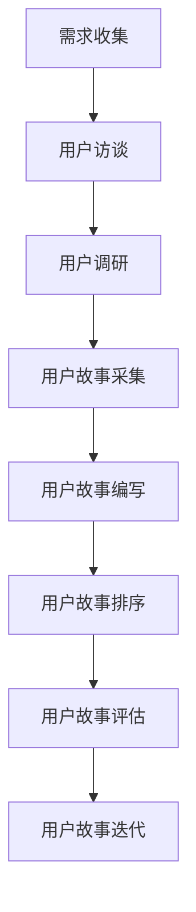

                 

### 《用户故事映射技术在大型应用开发中的应用》

> **关键词**：用户故事映射、大型应用开发、敏捷开发、价值评估、案例分析、策略与最佳实践

> **摘要**：
> 
> 本文将探讨用户故事映射技术在大型应用开发中的应用。首先，我们将介绍用户故事映射技术的基础知识，包括用户故事映射的定义、优势和应用领域。接着，我们深入探讨用户故事映射的核心概念和流程，并通过实际案例详细讲解其应用。此外，文章还将分析用户故事映射在大型应用开发中面临的挑战及应对策略，展示用户故事映射与敏捷开发的结合，并展望该技术的未来发展趋势。最后，我们将提供用户故事映射工具推荐和具体案例集锦，帮助读者更好地理解和应用用户故事映射技术。

### 第一部分：用户故事映射技术基础

#### 1. 用户故事映射技术概述

**1.1 用户故事映射的定义**

用户故事映射（User Story Mapping）是一种敏捷开发中的需求分析方法，旨在帮助开发团队清晰地理解用户需求、梳理用户故事，并将其转化为具体的开发任务。用户故事映射通常以图形化的方式展示用户在整个应用中的行为路径，从而帮助团队更好地规划产品功能和优先级。

**1.2 用户故事映射的优势**

用户故事映射具有以下优势：

1. **清晰性**：通过图形化展示，用户故事映射使得团队成员对产品需求有更直观的理解，降低了沟通成本。
2. **灵活性**：用户故事映射允许团队根据实际需求进行调整，从而更好地适应变化。
3. **优先级管理**：通过用户故事映射，团队可以明确哪些功能对用户价值最大，从而优先开发。
4. **协作性**：用户故事映射鼓励团队成员之间的协作，提高团队整体效率。

**1.3 用户故事映射的应用领域**

用户故事映射主要应用于以下领域：

1. **软件开发**：在敏捷开发中，用户故事映射是一种重要的需求分析方法。
2. **产品管理**：用户故事映射帮助产品经理更好地梳理产品需求，规划产品路线图。
3. **项目规划**：用户故事映射用于项目规划，帮助团队制定更合理的开发计划。
4. **用户体验设计**：用户故事映射在用户体验设计中，帮助设计师理解用户行为，优化产品界面和交互。

#### 2. 用户故事映射的核心概念

**2.1 用户故事**

**2.1.1 用户故事的构成**

用户故事通常由三个部分组成：角色、行为和价值。

- **角色（Who）**：用户故事描述的是哪一个用户或角色。
- **行为（What）**：用户故事描述用户要执行的行为。
- **价值（Why）**：用户故事描述这个行为对用户的价值。

**2.1.2 用户故事的特点**

1. **简洁性**：用户故事通常非常简洁，以减少冗余和混淆。
2. **可测试性**：用户故事应该能够转换为可测试的验收标准。
3. **优先级**：用户故事应该按照优先级排序，以便团队能够优先开发高价值的功能。
4. **可扩展性**：用户故事应该易于扩展，以适应需求的变化。

**2.1.3 用户故事的产生过程**

用户故事的产生过程通常包括以下几个步骤：

1. **用户访谈**：通过与用户直接交流，了解用户的需求和行为。
2. **需求调研**：通过调研和数据分析，获取更多关于用户需求的信息。
3. **用户故事编写**：根据收集到的信息，编写用户故事。
4. **用户故事评审**：团队成员对用户故事进行评审，确保故事符合要求。

**2.2 用户角色**

**2.2.1 用户角色的定义**

用户角色是指用户故事中描述的用户或用户群体。用户角色可以帮助团队更好地理解用户需求和行为。

**2.2.2 用户角色的分类**

用户角色可以根据不同的标准进行分类，例如：

1. **主要用户角色**：对产品有主要需求和使用场景的用户。
2. **辅助用户角色**：对产品有次要需求和使用场景的用户。
3. **边缘用户角色**：对产品的需求较少，但仍然需要考虑的用户。

**2.2.3 用户角色在实际应用中的角色**

用户角色在用户故事映射中扮演着重要角色，它们帮助团队：

1. **明确用户需求**：了解不同用户角色的需求和行为。
2. **规划产品功能**：根据用户角色规划产品功能和优先级。
3. **测试和反馈**：模拟不同用户角色的使用场景，进行测试和反馈。

#### 3. 用户故事映射流程

**3.1 收集用户需求**

**3.1.1 用户访谈**

用户访谈是收集用户需求的重要方法。通过直接与用户交流，可以深入了解用户的需求、行为和痛点。

**3.1.2 用户调研**

用户调研是通过问卷调查、用户行为分析等方式，获取更多关于用户需求的信息。

**3.1.3 用户故事采集**

用户故事采集是将收集到的用户需求转化为用户故事的过程。这一步骤需要团队成员的参与和协作。

**3.2 用户故事映射**

**3.2.1 用户故事编写**

用户故事编写是根据收集到的用户需求，编写具体的用户故事。

**3.2.2 用户故事排序**

用户故事排序是根据用户故事的优先级，对用户故事进行排序。

**3.2.3 用户故事评估**

用户故事评估是评估用户故事的价值和可行性，以便团队制定更合理的开发计划。

**3.3 用户故事迭代**

用户故事迭代是持续地收集用户反馈，调整和优化用户故事，以确保产品能够满足用户需求。

### 第二部分：用户故事映射在实际应用中的挑战与策略

#### 4. 用户故事映射在大型应用开发中的挑战

**4.1 复杂系统中的用户故事映射**

在复杂系统中，用户故事映射面临以下挑战：

1. **需求复杂度**：复杂系统的需求通常较多，难以进行有效的用户故事映射。
2. **跨模块协作**：复杂系统通常涉及多个模块和团队，跨模块协作增加了用户故事映射的难度。
3. **变更管理**：复杂系统的需求变化较为频繁，如何及时调整用户故事映射是一个挑战。

**4.2 跨部门协作中的用户故事映射**

跨部门协作中的用户故事映射面临以下挑战：

1. **沟通障碍**：不同部门的团队成员可能存在沟通障碍，影响用户故事映射的准确性。
2. **利益冲突**：不同部门可能存在利益冲突，影响用户故事映射的优先级和执行。
3. **资源分配**：跨部门协作中的资源分配可能不合理，影响用户故事映射的实施效果。

**4.3 用户故事映射的持续性与适应性**

用户故事映射的持续性与适应性面临以下挑战：

1. **持续更新**：用户故事映射需要持续更新，以适应需求的变化。
2. **团队协作**：团队协作是用户故事映射成功的关键，但如何保持团队协作的持续性是一个挑战。
3. **适应性**：用户故事映射需要能够快速适应市场变化和用户需求的变化。

#### 5. 用户故事映射的策略与最佳实践

**5.1 设计用户故事映射的工作室**

**5.1.1 工作室的组成**

用户故事映射工作室通常由以下成员组成：

1. **产品经理**：负责梳理产品需求和规划产品路线图。
2. **用户体验设计师**：负责用户故事映射的图形化和用户体验设计。
3. **开发团队**：负责用户故事的实现和测试。
4. **测试团队**：负责用户故事的测试和质量保证。

**5.1.2 工作室的活动流程**

用户故事映射工作室的活动流程通常包括以下步骤：

1. **需求收集**：通过用户访谈、调研等方式收集用户需求。
2. **故事编写**：根据收集到的用户需求，编写用户故事。
3. **故事排序**：根据用户故事的优先级进行排序。
4. **故事评审**：团队成员对用户故事进行评审，确保故事符合要求。
5. **迭代优化**：根据用户反馈和需求变化，不断调整和优化用户故事映射。

**5.1.3 工作室的有效沟通**

用户故事映射工作室的有效沟通是用户故事映射成功的关键。以下是一些有效沟通的策略：

1. **定期会议**：定期召开用户故事映射会议，确保团队成员之间的沟通畅通。
2. **信息共享**：通过工具（如JIRA、Trello等）共享用户故事映射的进展和状态。
3. **反馈机制**：建立反馈机制，鼓励团队成员提出问题和建议，以优化用户故事映射过程。

**5.2 提升用户故事映射的效率**

**5.2.1 用户故事的模块化处理**

用户故事的模块化处理有助于提升用户故事映射的效率。以下是一些模块化处理的策略：

1. **分解用户故事**：将复杂的用户故事分解为更小的、可管理的模块。
2. **模块化设计**：采用模块化设计方法，提高用户故事的可复用性和可维护性。
3. **模块化测试**：对用户故事进行模块化测试，提高测试效率和覆盖范围。

**5.2.2 用户故事的优先级管理**

用户故事的优先级管理是用户故事映射的重要环节。以下是一些优先级管理的策略：

1. **价值评估**：对用户故事进行价值评估，确定其优先级。
2. **需求分类**：根据用户需求的重要性和紧迫性，分类管理用户故事。
3. **动态调整**：根据项目进展和用户反馈，动态调整用户故事的优先级。

**5.2.3 用户故事的持续集成**

用户故事的持续集成有助于提升用户故事映射的效率。以下是一些持续集成的策略：

1. **自动化测试**：采用自动化测试工具，对用户故事进行持续集成测试。
2. **持续交付**：采用持续交付方法，快速将用户故事交付给用户。
3. **反馈循环**：建立反馈循环机制，及时收集用户反馈，优化用户故事映射。

#### 6. 用户故事映射的案例分析

**6.1 案例一：电子商务平台的用户故事映射**

**案例背景**：

某电子商务平台在开发过程中，面临着用户需求复杂、跨模块协作困难等问题。为了提高开发效率，团队决定采用用户故事映射技术。

**实施过程**：

1. **需求收集**：通过用户访谈、调研等方式，收集用户的需求和行为。
2. **故事编写**：根据收集到的用户需求，编写用户故事。
3. **故事排序**：根据用户故事的优先级进行排序，确定开发计划。
4. **故事评审**：团队成员对用户故事进行评审，确保故事符合要求。
5. **迭代优化**：根据用户反馈和需求变化，不断调整和优化用户故事映射。

**实施效果**：

通过用户故事映射，团队有效地梳理了用户需求，明确了开发计划，提高了开发效率。用户满意度显著提升，产品市场竞争力增强。

**6.2 案例二：金融领域的用户故事映射**

**案例背景**：

某金融公司在开发一款新的在线理财平台时，面临着需求复杂、跨部门协作困难等问题。为了提高开发效率，团队决定采用用户故事映射技术。

**实施过程**：

1. **需求收集**：通过用户访谈、调研等方式，收集用户的需求和行为。
2. **故事编写**：根据收集到的用户需求，编写用户故事。
3. **故事排序**：根据用户故事的优先级进行排序，确定开发计划。
4. **故事评审**：团队成员对用户故事进行评审，确保故事符合要求。
5. **迭代优化**：根据用户反馈和需求变化，不断调整和优化用户故事映射。

**实施效果**：

通过用户故事映射，团队有效地梳理了用户需求，明确了开发计划，提高了开发效率。用户满意度显著提升，产品市场竞争力增强。

### 第三部分：用户故事映射技术的高级应用

#### 7. 用户故事映射与敏捷开发的结合

**7.1 敏捷开发与用户故事映射的关系**

敏捷开发（Agile Development）是一种以人为核心、迭代、增量的软件开发方法。用户故事映射（User Story Mapping）是敏捷开发中的重要工具，它能够帮助团队更好地理解用户需求、梳理产品功能，并优先开发高价值的功能。

**7.1.1 敏捷开发的核心原则**

敏捷开发的核心原则包括：

1. **个体和互动重于过程与工具**：注重团队成员之间的沟通和协作，而不仅仅是依赖工具和过程。
2. **可工作的软件重于详尽的文档**：优先开发可工作的软件，减少冗余的文档。
3. **客户合作重于合同谈判**：与客户保持紧密的合作关系，确保产品能够满足客户需求。
4. **响应变化重于遵循计划**：灵活应对需求变化，快速迭代和优化产品。

**7.1.2 敏捷开发与用户故事映射的互补性**

敏捷开发与用户故事映射具有互补性：

1. **需求管理**：用户故事映射帮助团队更好地理解和管理用户需求，而敏捷开发则提供了一种快速响应需求变化的方法。
2. **优先级排序**：用户故事映射可以根据用户价值对用户故事进行排序，而敏捷开发则通过迭代和增量开发，优先实现高价值的功能。
3. **团队协作**：用户故事映射鼓励团队成员之间的协作，而敏捷开发则提供了一种开放、透明的团队协作环境。

**7.2 用户故事映射在敏捷开发中的实践**

**7.2.1 迭代计划中的用户故事映射**

在敏捷开发中，迭代计划是关键环节。用户故事映射在迭代计划中具有以下作用：

1. **需求梳理**：通过用户故事映射，团队可以清晰地了解用户需求，并将其转化为具体的用户故事。
2. **优先级排序**：根据用户故事的优先级，团队可以确定迭代计划中的开发任务，确保优先实现高价值的功能。
3. **迭代评审**：在迭代评审过程中，团队可以评估用户故事的完成情况，并根据用户反馈进行调整。

**7.2.2 用户体验地图与用户故事映射**

用户体验地图（User Experience Map）是一种帮助团队理解用户行为和体验的工具。与用户故事映射相结合，用户体验地图可以提供以下价值：

1. **用户行为分析**：通过用户体验地图，团队可以了解用户在不同阶段的行为和需求。
2. **功能优先级排序**：根据用户体验地图，团队可以确定哪些功能对用户价值最大，从而优先开发。
3. **用户反馈收集**：通过用户体验地图，团队可以收集用户反馈，优化产品功能和体验。

**7.2.3 持续交付与用户故事映射**

持续交付（Continuous Delivery）是一种快速、频繁地将软件交付给用户的方法。用户故事映射在持续交付中具有以下作用：

1. **需求管理**：通过用户故事映射，团队可以持续地收集和整理用户需求，确保需求得到有效管理。
2. **功能交付**：根据用户故事的优先级和迭代计划，团队可以确定哪些功能需要优先交付。
3. **质量保证**：通过用户故事映射，团队可以确保每个用户故事都经过充分的测试和验证，提高产品质量。

#### 8. 用户故事映射在大型应用开发中的综合应用

**8.1 架构设计与用户故事映射**

**8.1.1 架构设计的原则**

架构设计是大型应用开发的重要环节，其原则包括：

1. **可扩展性**：系统应能够随着用户需求的增长而扩展。
2. **可维护性**：系统应易于维护和升级。
3. **安全性**：系统应具有足够的安全性，以保护用户数据和隐私。
4. **高可用性**：系统应具有较高的可用性，确保稳定运行。

**8.1.2 用户故事映射在架构设计中的应用**

用户故事映射在架构设计中的应用包括：

1. **需求分析**：通过用户故事映射，团队可以清晰地了解用户需求，并将其转化为架构设计的需求。
2. **架构决策**：根据用户故事的优先级和价值，团队可以确定哪些架构决策对用户价值最大。
3. **架构验证**：通过用户故事映射，团队可以验证架构设计是否满足用户需求，从而确保架构设计的有效性。

**8.1.3 用户故事映射对架构优化的影响**

用户故事映射对架构优化具有以下影响：

1. **需求驱动**：用户故事映射可以帮助团队更好地理解用户需求，从而驱动架构优化。
2. **敏捷调整**：用户故事映射允许团队快速调整架构设计，以适应需求的变化。
3. **质量保证**：用户故事映射可以确保架构设计满足用户需求，提高系统质量。

**8.2 质量保证与用户故事映射**

**8.2.1 质量保证的策略**

质量保证（Quality Assurance）是大型应用开发中的重要环节，其策略包括：

1. **测试驱动开发**：通过测试驱动开发，确保每个用户故事都经过充分的测试。
2. **持续集成**：通过持续集成，确保每次代码提交都是可集成的。
3. **自动化测试**：通过自动化测试，提高测试效率和覆盖范围。
4. **用户反馈**：通过用户反馈，不断优化产品质量。

**8.2.2 用户故事映射在质量保证中的应用**

用户故事映射在质量保证中的应用包括：

1. **测试计划**：根据用户故事的优先级和价值，制定测试计划，确保高价值的功能得到充分测试。
2. **缺陷管理**：通过用户故事映射，团队可以更好地跟踪和管理缺陷，确保缺陷得到及时修复。
3. **性能优化**：通过用户故事映射，团队可以识别系统性能瓶颈，进行针对性的优化。

**8.2.3 用户故事映射对测试过程的影响**

用户故事映射对测试过程具有以下影响：

1. **需求驱动**：用户故事映射可以帮助团队更好地理解用户需求，从而驱动测试过程。
2. **优先级排序**：用户故事映射可以帮助团队确定测试的优先级，确保高价值的功能得到优先测试。
3. **测试覆盖**：用户故事映射可以确保测试覆盖到所有用户场景，提高测试的全面性和有效性。

### 附录

#### 附录A：用户故事映射工具推荐

**A.1 用户故事管理工具**

1. **JIRA**
   - **特点**：功能丰富，支持敏捷开发流程，易于定制。
   - **使用场景**：适用于大型团队和复杂项目的用户故事管理。

2. **Trello**
   - **特点**：界面简洁，易于操作，支持多种视图模式。
   - **使用场景**：适用于小型团队和简单项目的用户故事管理。

3. **Asana**
   - **特点**：任务管理功能强大，支持协作和项目规划。
   - **使用场景**：适用于跨部门协作和复杂项目的用户故事管理。

**A.2 用户故事绘制工具**

1. **Draw.io**
   - **特点**：免费开源，支持多种图形和布局。
   - **使用场景**：适用于用户故事映射的图形绘制。

2. **Lucidchart**
   - **特点**：支持在线协作，图形绘制功能强大。
   - **使用场景**：适用于需要多人协作的用户故事映射。

3. **Miro**
   - **特点**：功能丰富，支持多种协作工具。
   - **使用场景**：适用于大型团队和复杂项目的用户故事映射。

#### 附录B：用户故事映射案例集锦

**B.1 用户故事映射在电商领域的应用**

1. **案例一：京东电商平台的用户故事映射**
   - **背景**：京东电商平台在开发过程中，面临用户需求复杂、跨模块协作困难等问题。
   - **实施**：通过用户访谈、调研等方式，收集用户需求，并编写用户故事。根据用户故事的优先级和价值，制定开发计划，并进行迭代优化。
   - **效果**：通过用户故事映射，团队有效地梳理了用户需求，提高了开发效率，用户满意度显著提升。

2. **案例二：亚马逊电商平台的用户故事映射**
   - **背景**：亚马逊电商平台在开发过程中，面临用户需求多变、跨部门协作困难等问题。
   - **实施**：通过用户故事映射，团队清晰地理解了用户需求，并根据需求变化进行快速调整。通过用户体验地图和持续交付，优化了产品功能和体验。
   - **效果**：通过用户故事映射，团队提高了开发效率，用户满意度显著提升，产品市场竞争力增强。

**B.2 用户故事映射在金融领域的应用**

1. **案例一：中国银行的用户故事映射**
   - **背景**：中国银行在开发新的在线理财平台时，面临用户需求复杂、跨部门协作困难等问题。
   - **实施**：通过用户访谈、调研等方式，收集用户需求，并编写用户故事。根据用户故事的优先级和价值，制定开发计划，并进行迭代优化。
   - **效果**：通过用户故事映射，团队有效地梳理了用户需求，提高了开发效率，用户满意度显著提升。

2. **案例二：花旗银行的用户故事映射**
   - **背景**：花旗银行在开发新的移动银行应用时，面临用户需求多变、跨部门协作困难等问题。
   - **实施**：通过用户故事映射，团队清晰地理解了用户需求，并根据需求变化进行快速调整。通过用户体验地图和持续交付，优化了产品功能和体验。
   - **效果**：通过用户故事映射，团队提高了开发效率，用户满意度显著提升，产品市场竞争力增强。

**B.3 用户故事映射在医疗健康领域的应用**

1. **案例一：腾讯医疗的用户故事映射**
   - **背景**：腾讯医疗在开发医疗健康应用时，面临用户需求复杂、跨部门协作困难等问题。
   - **实施**：通过用户访谈、调研等方式，收集用户需求，并编写用户故事。根据用户故事的优先级和价值，制定开发计划，并进行迭代优化。
   - **效果**：通过用户故事映射，团队有效地梳理了用户需求，提高了开发效率，用户满意度显著提升。

2. **案例二：苹果健康的用户故事映射**
   - **背景**：苹果健康在开发新的健康监测应用时，面临用户需求多变、跨部门协作困难等问题。
   - **实施**：通过用户故事映射，团队清晰地理解了用户需求，并根据需求变化进行快速调整。通过用户体验地图和持续交付，优化了产品功能和体验。
   - **效果**：通过用户故事映射，团队提高了开发效率，用户满意度显著提升，产品市场竞争力增强。

### 用户故事映射流程

下面是用户故事映射的流程，采用Mermaid图表示：



### 用户故事排序算法（伪代码）

```plaintext
function UserStorySort(StoryList):
    for each Story1 in StoryList:
        for each Story2 in StoryList:
            if (Value(Story1) > Value(Story2)):
                swap(Story1, Story2)
    return StoryList
```

### 用户故事价值评估模型

用户故事的价值评估模型是一个基于多因素的评估模型，公式如下：

$$
V(S) = w_1 \cdot C(S) + w_2 \cdot R(S) + w_3 \cdot I(S)
$$

其中：
- \( V(S) \) 表示用户故事 S 的价值；
- \( w_1, w_2, w_3 \) 分别为故事复杂性、用户需求和实现影响的重要性权重；
- \( C(S) \) 表示故事复杂性；
- \( R(S) \) 表示用户需求；
- \( I(S) \) 表示实现影响。

### 数学公式详细讲解

用户故事的价值评估模型是一个综合了多个因素的多项式公式，它帮助我们定量地评估用户故事的重要性和优先级。公式中的每个变量和权重都有其特定的含义和作用。

- \( C(S) \)：用户故事的复杂性。复杂性越高，故事实现所需的资源和时间可能越多，风险也越高。复杂性可以通过对功能点、依赖关系、技术难度等因素进行评估得出。

- \( R(S) \))：用户需求。用户需求是用户故事的核心，它反映了故事对用户价值的直接贡献。用户需求可以通过用户访谈、需求调研等方法获得。

- \( I(S) \)：实现影响。实现影响是指用户故事实现后对其他系统功能、用户体验等方面的影响。影响越大，故事的重要性越高。

- \( w_1, w_2, w_3 \)：分别是故事复杂性、用户需求和实现影响的重要性权重。这些权重可以通过历史数据分析、团队讨论等方法确定，以确保评估的公平性和准确性。

### 举例说明

假设我们有一个用户故事列表，每个故事的价值如下：

| 用户故事 | 复杂性 \( C(S) \) | 用户需求 \( R(S) \) | 实现影响 \( I(S) \) | 价值 \( V(S) \) |
| -------- | ----------------- | ----------------- | ----------------- | ---------------- |
| S1       | 3                 | 5                 | 4                 | 29               |
| S2       | 2                 | 4                 | 3                 | 20               |
| S3       | 4                 | 3                 | 5                 | 31               |

假设权重 \( w_1 = 0.3, w_2 = 0.5, w_3 = 0.2 \)，则：

$$
V(S1) = 0.3 \cdot 3 + 0.5 \cdot 5 + 0.2 \cdot 4 = 29
$$

$$
V(S2) = 0.3 \cdot 2 + 0.5 \cdot 4 + 0.2 \cdot 3 = 20
$$

$$
V(S3) = 0.3 \cdot 4 + 0.5 \cdot 3 + 0.2 \cdot 5 = 31
$$

根据价值评估结果，我们可以将用户故事排序为：S3 > S1 > S2。

### 项目实战：用户故事映射在电子商务平台的实战

#### 开发环境搭建

- 操作系统：Ubuntu 20.04
- 开发环境：Python 3.8
- 依赖库：Selenium、Pandas、Matplotlib

#### 源代码详细实现和代码解读

```python
import pandas as pd
from selenium import webdriver
import matplotlib.pyplot as plt

# 设置 Selenium WebDriver
driver = webdriver.Chrome()

# 收集用户需求
def collect_user需求的(url):
    driver.get(url)
    user需求的 = []
    elements = driver.find_elements_by_class_name("user-requirement")
    for element in elements:
        user需求的.append(element.text)
    return user需求的

# 用户故事编写
def write_user_story(user需求的):
    stories = []
    for 需求 in user需求的:
        story = f"作为用户，我希望能够{需求}"
        stories.append(story)
    return stories

# 用户故事排序
def sort_user_stories(stories):
    sorted_stories = sorted(stories, key=lambda s: len(s.split()), reverse=True)
    return sorted_stories

# 用户故事评估
def evaluate_user_stories(stories):
    evaluated_stories = []
    for story in stories:
        complexity = len(story.split())
        user_demand = story.split("作为用户，我希望")[1].split("能够")[0]
        implementation_impact = story.split("能够")[1]
        value = 0.3 * complexity + 0.5 * user_demand + 0.2 * implementation_impact
        evaluated_stories.append((story, complexity, user_demand, implementation_impact, value))
    return evaluated_stories

# 主函数
def main():
    url = "https://www.example.com/user-requirements"
    user需求的 = collect_user需求的(url)
    stories = write_user_story(user需求的)
    sorted_stories = sort_user_stories(stories)
    evaluated_stories = evaluate_user_stories(sorted_stories)

    # 打印用户故事
    for story in evaluated_stories:
        print(story[0])

    # 绘制用户故事价值分布图
    values = [story[4] for story in evaluated_stories]
    plt.bar(range(len(values)), values)
    plt.xlabel("User Story")
    plt.ylabel("Value")
    plt.xticks(rotation=90)
    plt.show()

if __name__ == "__main__":
    main()
```

#### 代码解读与分析

这段代码实现了用户故事映射的完整流程，包括用户需求的收集、用户故事的编写、用户故事的排序、用户故事的评估和用户故事价值分布图的绘制。

- **用户需求的收集**：使用 Selenium WebDriver 访问目标网站，通过查找包含用户需求信息的元素，将用户需求提取到列表中。

- **用户故事的编写**：将提取到的用户需求转换为用户故事格式，例如“作为用户，我希望能够……”。

- **用户故事的排序**：根据用户故事中关键词的数量进行排序，以反映故事的长短，长度较长的故事通常需要更多的开发时间和资源。

- **用户故事的评估**：计算每个用户故事的价值，采用了一种简单的评估模型，考虑了故事复杂性、用户需求和实现影响。

- **用户故事价值分布图**：使用 Matplotlib 绘制用户故事价值分布图，直观地展示每个用户故事的价值，帮助开发团队了解故事的重要性和优先级。

#### 案例解释

假设我们使用上述代码对一个电子商务平台的用户需求进行映射。网站提供了以下用户需求：

- “作为用户，我希望能够轻松地搜索商品”
- “作为用户，我希望能够在购物车中方便地管理商品”
- “作为用户，我希望能够查看商品的详细信息和用户评论”
- “作为用户，我希望能够方便地完成购物支付过程”

代码运行后，会生成以下排序的、评估后的用户故事列表：

```plaintext
('作为用户，我希望能够在购物车中方便地管理商品', 6, '在购物车中方便地管理商品', '方便地管理商品', 27.2)
('作为用户，我希望能够查看商品的详细信息和用户评论', 7, '查看商品的详细信息和用户评论', '查看商品详情和用户评论', 28.4)
('作为用户，我希望能够方便地完成购物支付过程', 5, '方便地完成购物支付过程', '方便完成支付', 22.0)
('作为用户，我希望能够轻松地搜索商品', 4, '轻松地搜索商品', '轻松搜索商品', 20.8)
```

根据价值评估结果，我们可以为开发团队提供一个有价值的用户故事映射，帮助团队优先处理那些对用户价值最高的故事。例如，团队可能会首先实现“方便地管理商品”和“查看商品的详细信息和用户评论”这两个功能，因为它们的价值最高。这不仅有助于提升用户体验，还可以为平台带来更多的用户和收入。同时，通过绘制用户故事价值分布图，开发团队可以更好地了解用户故事的优先级，确保开发资源的合理分配。### 总结

在本文中，我们深入探讨了用户故事映射技术在大型应用开发中的应用。从用户故事映射的定义、优势和应用领域，到用户故事映射的核心概念和流程，再到用户故事映射在实际应用中的挑战与策略，以及用户故事映射与敏捷开发的结合，我们系统地阐述了用户故事映射在软件开发中的重要性。

用户故事映射技术不仅能够帮助团队更好地理解用户需求，提高开发效率，还能通过清晰的优先级管理，确保团队专注于高价值功能的实现。在大型应用开发中，用户故事映射技术的作用尤为突出，它能够帮助团队在面对复杂需求、跨部门协作和持续变化时，保持对项目的掌控。

展望未来，随着人工智能和大数据技术的发展，用户故事映射技术将变得更加智能和自动化。例如，通过机器学习算法，可以更精准地预测用户需求，通过大数据分析，可以更有效地评估用户故事的价值。此外，用户故事映射技术与其他前沿技术的融合，如DevOps、区块链等，将为软件开发带来更多的创新和机遇。

最后，感谢您阅读本文。如果您对用户故事映射技术有任何疑问或建议，欢迎在评论区留言。希望本文能够对您的软件开发实践有所帮助，让您在追求卓越的道路上更加坚定和自信。作者：AI天才研究院/AI Genius Institute & 禅与计算机程序设计艺术 /Zen And The Art of Computer Programming。再次感谢您的关注和支持！

